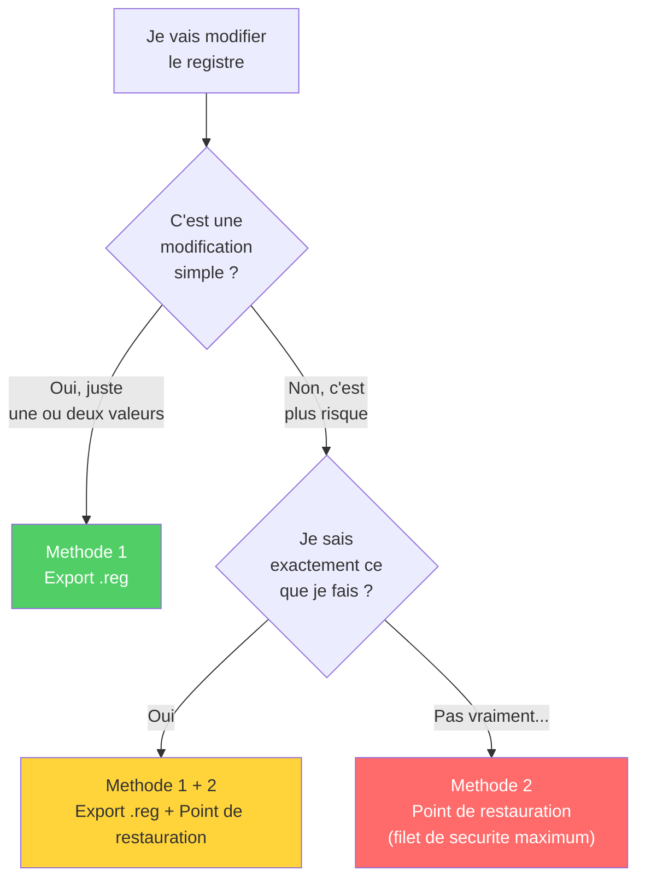
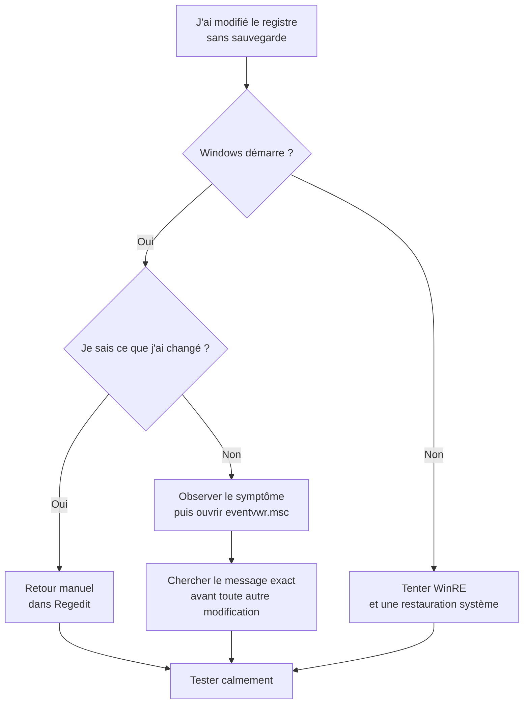

---
tags:
  - registre
  - débutant
  - sauvegarde
---

# Sauvegarder avant de toucher

!!! abstract "Ce que vous allez apprendre"
    - Pourquoi la sauvegarde est indispensable (spoiler : il n'y a pas de Ctrl+Z)
    - 3 methodes de sauvegarde, de la plus simple a la plus complete
    - Comment restaurer en cas de probleme
    - Quelle methode choisir selon la situation

---

## Pourquoi c'est indispensable

La base de registre n'a **pas de bouton "Annuler"**.

Quand vous modifiez ou supprimez quelque chose, c'est **immediat et definitif**. Pas de Ctrl+Z, pas de corbeille, pas de "Voulez-vous enregistrer les modifications ?".

La seule protection, c'est d'avoir fait une copie **avant**.

!!! danger "Sans sauvegarde, pas de filet de securite"
    Traitez la sauvegarde du registre comme la ceinture de securite en voiture : on la met **avant** de partir, pas apres l'accident.

!!! quote "En resume"
    - Le registre n'a **pas de Ctrl+Z** : toute modification est immediate et definitive.
    - La seule protection est d'avoir fait une copie **avant** de toucher a quoi que ce soit.

### À quoi ressemble concrètement un fichier `.reg` ?

Un fichier `.reg` est un **fichier texte tout simple**.

Autrement dit, ce n'est pas une "boîte noire". Vous pouvez l'ouvrir avec le **Bloc-notes** pour lire ce qu'il contient.

Pensez-y comme à une petite fiche d'instructions pour Windows : "va à tel endroit du registre, puis écris telle valeur".

Voici un exemple réaliste :

```reg
Windows Registry Editor Version 5.00

[HKEY_CURRENT_USER\Control Panel\Desktop]
"Wallpaper"="C:\\Users\\Jean\\Pictures\\plage.jpg"
"WallpaperStyle"=dword:00000002
```

Dans cet exemple, le fichier parle du fond d'écran du compte utilisateur courant.

Il contient **trois parties** à repérer :

1. **La ligne d'en-tête**
   `Windows Registry Editor Version 5.00`
   Elle indique à Windows qu'il s'agit bien d'un fichier `.reg` compatible.
2. **Le chemin de la clé entre crochets**
   `[HKEY_CURRENT_USER\Control Panel\Desktop]`
   C'est l'adresse exacte dans le registre.
3. **Les valeurs à l'intérieur**
   `"Wallpaper"="..."` correspond à une donnée texte.
   `"WallpaperStyle"=dword:00000002` correspond à un nombre.

!!! example "Comment le lire sans paniquer"
    Si vous voyez un fichier `.reg`, posez-vous simplement trois questions :

    - Quelle clé est visée ?
    - Quels noms de valeurs vont être ajoutés ou modifiés ?
    - Les données semblent-elles logiques pour ce que vous voulez faire ?

!!! tip "Curiosité saine"
    Si vous êtes curieux, ouvrez un fichier `.reg` avec le Bloc-notes. Vous pouvez lire ce qu'il contient avant de l'importer.

!!! warning "Prudence"
    Ne modifiez pas le contenu d'un fichier `.reg` à la main sauf si vous savez exactement ce que vous faites.

!!! quote "En résumé"
    - Un fichier `.reg` est un **fichier texte lisible** dans le Bloc-notes.
    - Il contient un en-tête, une adresse de clé, puis des valeurs à écrire dans le registre.

---

## Methode 1 : exporter une branche (la plus courante)

C'est la methode a utiliser **avant chaque modification**. Elle prend 10 secondes.

### Sauvegarder

!!! example "Pas a pas"
    1. Ouvrir Regedit
    2. Naviguer vers la cle que vous allez modifier
    3. **Clic droit** sur la cle > **Exporter**
    4. Choisir un emplacement facile a retrouver (le Bureau, par exemple)
    5. Donner un nom explicite, par exemple :
       ```
       sauvegarde_explorer_advanced_2026-04-02.reg
       ```
    6. Verifier que **Branche selectionnee** est bien coche
    7. Cliquer **Enregistrer**

    **Resultat** : un fichier `.reg` apparait sur votre Bureau. Il contient une copie complete de la cle et de toutes ses sous-cles et valeurs.

!!! tip "Nommez intelligemment"
    Incluez **la date** et **le nom de la cle** dans le nom du fichier. Dans 3 jours, vous ne vous souviendrez plus de ce que contient `backup.reg`.

    Bons exemples :

    - `sauvegarde_explorer_advanced_2026-04-02.reg`
    - `avant_modif_theme_sombre_2026-04-02.reg`

### Scénario concret : avant de changer une seule option

Imaginez que vous suiviez un tutoriel pour modifier l'affichage de l'Explorateur Windows.

Le guide vous demande de changer une seule valeur dans `HKEY_CURRENT_USER\Software\Microsoft\Windows\CurrentVersion\Explorer\Advanced`.

Le bon réflexe, c'est :

!!! example "Réaction simple et sûre"
    1. Vous ouvrez la clé indiquée.
    2. Vous l'exportez tout de suite au format `.reg`.
    3. Vous faites la modification demandée.
    4. Vous testez le résultat.
    5. Si quelque chose semble étrange, vous double-cliquez sur la sauvegarde.

Cette méthode est parfaite quand vous touchez **une zone précise** du registre.

Vous ne sauvegardez pas tout Windows. Vous gardez juste un "avant" très ciblé, facile à restaurer.

!!! quote "En résumé"
    - Pour une petite modification ciblée, l'export de la clé concernée est le réflexe le plus simple.
    - En cas de doute, le fichier `.reg` permet un retour arrière rapide sans tout restaurer.

---

### Restaurer depuis un fichier .reg

Si quelque chose ne va pas apres votre modification :

1. **Double-cliquer** sur le fichier `.reg` sauvegarde
2. Cliquer **Oui** pour confirmer l'import
3. Les valeurs sont restaurees a leur etat d'origine

**Ce que vous voyez** :

```
┌──────────────────────────────────────────────────┐
│  Éditeur du Registre                             │
│                                                  │
│  Voulez-vous vraiment ajouter les informations   │
│  contenues dans [...].reg au Registre ?          │
│                                                  │
│              [ Oui ]  [ Non ]                    │
└──────────────────────────────────────────────────┘
```

Puis :

```
┌──────────────────────────────────────────────────┐
│  Les clés et valeurs contenues dans              │
│  [...].reg ont été ajoutées au Registre.         │
│                                                  │
│              [ OK ]                              │
└──────────────────────────────────────────────────┘
```

!!! info "Ce que ca restaure et ce que ca ne restaure pas"
    L'import d'un fichier `.reg` :

    - :material-check: **Remet les valeurs** modifiees a leur ancienne valeur
    - :material-check: **Recree les cles** que vous auriez supprimees
    - :material-close: **Ne supprime pas** les nouvelles cles ou valeurs ajoutees entre-temps

    Pour un retour **complet** : supprimez d'abord la cle modifiee, puis importez la sauvegarde.

### Où stocker ses sauvegardes ?

Sauvegarder est utile.

Mais sauvegarder **au mauvais endroit** peut annuler une bonne partie de la protection.

Si votre sauvegarde reste uniquement sur le même disque que Windows, une panne du disque peut faire disparaître **à la fois** le système et la sauvegarde.

Les emplacements les plus pratiques sont :

- une **clé USB** ou un **disque dur externe**
- un dossier dédié comme `C:\Sauvegardes\Registre\`
- un espace cloud comme **OneDrive** ou **Google Drive** pour les sauvegardes importantes

!!! warning "Ne sauvegardez pas uniquement sur le disque C:\"
    Si Windows ne démarre plus, accéder à vos sauvegardes depuis ce même disque peut être impossible ou compliqué.

| Emplacement | Avantage | Inconvénient |
|-------------|----------|--------------|
| Bureau | facile à trouver | encombrant, risque d'effacer par accident |
| Dossier dédié `C:\Sauvegardes` | organisé | toujours sur le même disque |
| Clé USB / disque externe | sûr si Windows plante | penser à le brancher |
| Cloud (OneDrive, etc.) | accessible partout | nécessite une connexion |

!!! quote "En résumé"
    - Une sauvegarde stockée au même endroit que le problème peut disparaître avec lui.
    - Pour les sauvegardes importantes, gardez au moins une copie hors du disque principal.

### Routine simple pour rester organisé

Pas besoin d'un système compliqué.

Une petite routine claire suffit largement pour un usage débutant.

!!! example "Organisation minimale qui marche"
    1. Exportez d'abord dans `C:\Sauvegardes\Registre\`
    2. Donnez un nom précis au fichier
    3. Copiez les sauvegardes importantes sur une clé USB ou dans le cloud

    Exemple de dossier :

    ```text
    C:\
    └─ Sauvegardes\
       └─ Registre\
          ├─ 2026-04-05_avant_wifi.reg
          ├─ 2026-04-05_avant_menu_demarrer.reg
          └─ 2026-04-06_avant_explorer.reg
    ```

L'idée n'est pas d'être parfait.

L'idée est de retrouver votre sauvegarde **en 10 secondes**, même si vous êtes stressé.

!!! quote "En résumé"
    - Un dossier dédié évite le chaos du Bureau.
    - Si la sauvegarde compte vraiment, faites une seconde copie hors du PC.

### Avant d'importer un fichier `.reg` trouvé en ligne

Beaucoup de tutoriels proposent directement un fichier `.reg` à télécharger.

C'est pratique, mais aussi plus risqué qu'un changement fait à la main.

Avant de double-cliquer, prenez 30 secondes pour vérifier :

- le fichier s'ouvre bien dans le **Bloc-notes**
- la clé visée correspond exactement au tutoriel
- les noms de valeurs ont un sens pour ce que vous voulez faire
- il n'y a pas des dizaines de lignes incompréhensibles si le tutoriel promettait "une petite modification"

!!! danger "Télécharger ne veut pas dire comprendre"
    Un fichier `.reg` peut modifier plusieurs valeurs d'un coup. Si vous ne comprenez pas ce qu'il fait, n'importez pas "pour voir".

Le meilleur scénario débutant reste souvent :

1. lire le tutoriel
2. exporter votre clé actuelle
3. seulement ensuite importer le fichier si tout semble cohérent

!!! quote "En résumé"
    - Un fichier `.reg` téléchargé doit être lu avant d'être importé.
    - Si son contenu ne correspond pas clairement au tutoriel, mieux vaut s'abstenir.

!!! quote "En resume"
    - L'export `.reg` (clic droit > Exporter) est la methode la plus rapide : 10 secondes avant chaque modification.
    - Pour restaurer, il suffit de double-cliquer sur le fichier `.reg` sauvegarde ; cela remet les valeurs a leur etat d'origine.

---

## Methode 2 : creer un point de restauration systeme

Un point de restauration, c'est une **photo** de l'etat complet de votre systeme : le registre, les fichiers systeme, les pilotes... tout.

C'est la methode "ceinture ET bretelles" avant une operation risquee.

### Creer un point de restauration

!!! example "Pas a pas"
    1. Appuyer sur ++win++ et taper `point de restauration`
    2. Cliquer sur **Creer un point de restauration**
    3. Dans la fenetre qui s'ouvre, cliquer sur le bouton **Creer...**
    4. Donner un nom descriptif : `Avant modification registre`
    5. Cliquer **Creer** et attendre la confirmation

    ```
    ┌──────────────────────────────────────────────────┐
    │  Le point de restauration a ete cree.            │
    │                                                  │
    │              [ Fermer ]                          │
    └──────────────────────────────────────────────────┘
    ```

### Quand choisir cette méthode ?

Le point de restauration est utile quand la modification dépasse une simple valeur isolée.

Pensez à lui comme à une **photo globale du système** avant de faire quelque chose de délicat.

| Situation | Export `.reg` seul | Point de restauration |
|-----------|:------------------:|:---------------------:|
| Changer une valeur précise dans votre session | Oui | Pas obligatoire |
| Supprimer plusieurs clés | Mieux vaut éviter seul | Oui |
| Modifier `HKEY_LOCAL_MACHINE` | Possible, mais limité | Oui |
| Suivre un tutoriel trouvé au hasard sur internet | Mieux vaut combiner | Oui |

Si vous touchez un réglage qui concerne **tout le PC** et pas seulement votre compte utilisateur, le point de restauration devient une vraie bouée.

!!! tip "Repère simple"
    Si vous vous dites : "Je ne suis pas totalement sûr de comprendre ce que je vais changer", créez aussi un point de restauration.

!!! quote "En résumé"
    - Le point de restauration est recommandé dès que la manipulation paraît floue, large ou risquée.
    - Plus la modification touche l'ensemble du système, plus cette méthode devient pertinente.

### Restaurer depuis un point de restauration

1. Appuyer sur ++win++ et taper `point de restauration`
2. Cliquer sur **Restauration du systeme...**
3. Selectionner le point de restauration souhaite
4. Suivre l'assistant (le PC redemarrera)

!!! warning "Plus radical qu'un simple .reg"
    Un point de restauration restaure bien plus que le registre. Il peut aussi **annuler des installations de logiciels** ou des mises a jour effectuees apres le point de restauration. Utilisez-le uniquement pour les cas serieux.

### Et si Windows ne démarre plus du tout ?

Même si Windows refuse de démarrer normalement, un point de restauration peut encore vous sauver.

Il reste accessible depuis l'environnement de récupération de Windows, souvent appelé **WinRE**.

Voici la version simple, sans jargon :

1. Redémarrez le PC et essayez ++f8++.
2. Si cela ne fonctionne pas, forcez **3 démarrages ratés** de suite pour déclencher la réparation automatique.
3. Choisissez **Réparer l'ordinateur**.
4. Ouvrez **Dépannage** > **Options avancées** > **Restauration du système**.
5. Sélectionnez le point de restauration souhaité.
6. Confirmez, puis laissez Windows travailler.

!!! info "Intégré à Windows"
    Cette procédure ne nécessite pas de DVD ni de clé USB de démarrage. Elle est intégrée à Windows 10 et 11.

!!! warning "Limite importante"
    Si le disque dur est physiquement endommagé, aucune de ces méthodes ne fonctionnera. C'est pourquoi conserver une sauvegarde sur support externe reste la meilleure assurance.

!!! quote "En résumé"
    - Un point de restauration peut encore être utilisé même si Windows ne démarre plus normalement.
    - Tant que le disque fonctionne, WinRE offre souvent une porte de secours intégrée.

### Ce qui change et ce qui ne change pas avec une restauration système

Beaucoup de débutants imaginent qu'une restauration système "remet tout comme avant".

En réalité, c'est plus nuancé.

| Élément | Effet habituel |
|---------|----------------|
| Registre | revient à l'état du point choisi |
| Fichiers système Windows | reviennent en arrière |
| Pilotes et certains logiciels installés après | peuvent être retirés |
| Documents personnels | en général non supprimés |
| Photos et vidéos | en général non touchées |

Autrement dit, un point de restauration **n'est pas une sauvegarde de vos documents**.

C'est une sauvegarde de l'état technique du système.

!!! info "Bonne image mentale"
    Le point de restauration répare surtout la mécanique du PC. Il ne remplace pas une sauvegarde de vos fichiers personnels.

!!! quote "En résumé"
    - La restauration système agit surtout sur Windows, le registre, les pilotes et certains logiciels.
    - Elle ne remplace pas une vraie sauvegarde de vos documents personnels.

!!! quote "En resume"
    - Un point de restauration est une photo complete de l'etat du systeme (registre, fichiers systeme, pilotes).
    - C'est la methode "ceinture et bretelles" avant une operation risquee, mais elle restaure bien plus que le registre seul.

---

## Methode 3 : sauvegarder une ruche complete (avance)

Cette methode sauvegarde une **ruche entiere** au format binaire. Elle conserve les permissions et est plus adaptee aux sauvegardes completes.

!!! example "Pas a pas"
    1. Ouvrir une invite de commandes **en tant qu'administrateur** :
        - ++win+r++ > taper `cmd`
        - Appuyer sur ++ctrl+shift+enter++ (au lieu de juste Entree)
        - Confirmer l'autorisation
    2. Taper la commande suivante :

    ```batch
    reg save "HKLM\SOFTWARE" "%USERPROFILE%\Desktop\SOFTWARE_backup.hiv" /y
    ```

    ```
    L'operation a reussi.
    ```

    Un fichier `SOFTWARE_backup.hiv` apparait sur votre Bureau.

!!! note "Pour les techniciens"
    Cette methode est surtout utile quand un technicien vous demande une copie du registre, ou pour des sauvegardes automatisees. Pour une utilisation quotidienne, la methode 1 suffit largement.

### À quoi sert cette méthode dans la vraie vie ?

Pour un particulier, cette méthode sert rarement au quotidien.

En revanche, elle devient utile dans des cas très précis.

!!! example "Cas concret"
    Un technicien vous dit :

    "Exportez-moi la ruche `HKLM\SOFTWARE` avant que l'on teste une réparation."

    Dans ce cas, le format `.hiv` est intéressant car il garde une copie plus technique, plus proche de la ruche d'origine.

Pour un débutant, retenez surtout ceci :

- le fichier `.reg` est idéal pour vos petites sauvegardes ciblées
- le fichier `.hiv` est surtout utile pour le dépannage avancé ou l'automatisation

!!! quote "En résumé"
    - La sauvegarde binaire n'est pas la méthode du quotidien pour un débutant.
    - Elle devient utile quand un technicien ou un script a besoin d'une copie plus complète.

!!! quote "En resume"
    - La commande `reg save` exporte une ruche entiere au format binaire, en conservant les permissions.
    - Cette methode est surtout utile pour les techniciens ou les sauvegardes automatisees.

---

## Quelle methode choisir ?



| Situation | Methode recommandee |
|-----------|:-------------------:|
| Modifier une cle precise | Methode 1 (export `.reg`) |
| Avant une operation risquee | Methode 2 (point de restauration) |
| Sauvegarde complete pour un technicien | Methode 3 (sauvegarde binaire) |
| Avant de suivre un tutoriel trouve en ligne | Methode 1 **+** Methode 2 par precaution |

!!! quote "En resume"
    - Pour une modification simple : l'export `.reg` (methode 1) suffit. Pour une operation risquee : ajoutez un point de restauration (methode 2).
    - En cas de doute, combinez les deux methodes pour un maximum de securite.

### Trois scénarios du quotidien

Les règles paraissent parfois abstraites.

Voici trois situations très concrètes pour savoir quoi faire sans réfléchir pendant dix minutes.

!!! example "Scénario 1 : vous suivez un petit tutoriel"
    Vous voulez juste modifier une option de l'Explorateur Windows.

    Réflexe conseillé :

    - export de la clé concernée au format `.reg`
    - test immédiat
    - conservation du fichier quelques jours

!!! example "Scénario 2 : vous touchez un réglage système"
    Le tutoriel vous demande d'aller dans `HKEY_LOCAL_MACHINE` et vous n'êtes pas sûr de l'effet exact.

    Réflexe conseillé :

    - export `.reg` de la clé ciblée
    - point de restauration avant de continuer

!!! example "Scénario 3 : un technicien vous guide à distance"
    Il vous demande une copie complète d'une ruche ou prépare une procédure plus technique.

    Réflexe conseillé :

    - utiliser la méthode 3 si la consigne est explicite
    - ne pas improviser cette méthode seul

!!! quote "En résumé"
    - Modification simple : méthode 1.
    - Modification risquée ou floue : méthode 1 + méthode 2.
    - Demande technique précise : méthode 3 seulement si on vous la demande clairement.

---

## Bonnes pratiques

!!! tip "Les 4 regles d'or de la sauvegarde"
    1. **Nommer clairement** les fichiers avec la date et la cle concernee
    2. **Conserver les sauvegardes** au moins quelques jours apres la modification
    3. **Tester** apres chaque modification (redemarrer si necessaire)
    4. **Une modification a la fois** : ne changez pas 10 choses d'un coup, sinon vous ne saurez pas laquelle pose probleme

### Les erreurs classiques à éviter

Quand on débute, les problèmes viennent souvent de petites habitudes, pas d'une grosse catastrophe spectaculaire.

Voici celles qui reviennent le plus souvent.

| Erreur classique | Pourquoi c'est risqué | Bon réflexe |
|------------------|-----------------------|-------------|
| Sauvegarder la mauvaise clé | la restauration ne remettra pas ce que vous avez vraiment changé | vérifier deux fois le chemin avant d'exporter |
| Nommer le fichier `backup.reg` | impossible de savoir à quoi il sert plus tard | indiquer la date et le sujet |
| Lancer plusieurs modifications à la suite | difficile d'identifier la cause d'un problème | faire un seul changement, puis tester |
| Garder la sauvegarde seulement sur le Bureau | suppression accidentelle facile | utiliser un dossier dédié |
| Importer un `.reg` trouvé en ligne sans le lire | vous ajoutez des données sans comprendre | l'ouvrir dans le Bloc-notes avant tout |

!!! warning "Le piège le plus courant"
    Le vrai danger, ce n'est pas seulement la "mauvaise manipulation". C'est surtout l'accumulation de petites imprudences qui finissent par vous empêcher de revenir en arrière proprement.

!!! quote "En résumé"
    - Les erreurs les plus fréquentes sont des erreurs d'organisation et de méthode.
    - Un nom clair, un seul changement à la fois et une vérification du fichier `.reg` évitent déjà beaucoup de problèmes.

!!! quote "En resume"
    - Les 4 regles d'or : nommer clairement les sauvegardes (avec la date), les conserver quelques jours, tester apres chaque modification, et ne changer qu'**une seule chose a la fois**.

---

## J'ai oublié de sauvegarder avant — que faire ?

Cela arrive à tout le monde.

Le bon réflexe n'est pas de paniquer, mais de **ralentir**.

Plus vous cliquez vite dans tous les sens, plus vous risquez d'aggraver la situation.

!!! danger "Urgence, pas méthode normale"
    L'oubli de sauvegarde est la cause numéro un des problèmes irréversibles dans le registre. Cette section existe uniquement pour les urgences — ce n'est pas une alternative à la sauvegarde préventive.

### Option A — Le changement est récent et Windows fonctionne encore

Si le PC démarre encore et que vous savez à peu près ce que vous avez changé, commencez par l'option la plus simple.

Elle consiste à revenir manuellement en arrière.

Vous pouvez :

- rouvrir **Regedit**
- retrouver la clé modifiée
- remettre l'ancienne valeur si vous vous en souvenez
- ou lancer une **Restauration du système** si un point de restauration existe déjà

!!! example "Exemple concret"
    Vous avez changé une valeur de `1` à `0` il y a dix minutes.

    Si vous vous souvenez de cette valeur d'origine, le retour manuel peut suffire.

    Si vous avez un doute, ne touchez à rien d'autre et regardez si un point de restauration existait déjà avant la manipulation.

!!! quote "En résumé"
    - Si Windows fonctionne encore, commencez par le retour manuel ou la restauration système.
    - Cette option n'est raisonnable que si vous savez précisément ce qui a été modifié.

### Option B — Chercher des indices dans l'Observateur d'événements

L'Observateur d'événements n'est **pas** un outil magique de récupération.

En revanche, il peut vous aider à comprendre **quand** le problème a commencé et quel programme a réagi juste après la modification.

Pour l'ouvrir :

- appuyez sur ++win+r++
- tapez `eventvwr.msc`
- validez avec ++enter++

Ensuite, regardez surtout :

- **Journaux Windows** > **Système**
- **Journaux Windows** > **Application**

Cherchez des erreurs autour de l'heure où vous avez modifié le registre.

Notez :

- l'heure exacte
- le nom du programme concerné
- le message d'erreur principal

!!! info "À quoi cela sert vraiment"
    L'Observateur d'événements ne répare rien tout seul. Il vous aide surtout à arrêter les suppositions et à partir d'indices concrets.

!!! quote "En résumé"
    - L'Observateur d'événements sert à enquêter, pas à restaurer.
    - Il peut vous donner le nom du service ou du programme qui a commencé à échouer.

### Option C — Accepter le risque et tester très calmement

Parfois, vous n'avez ni sauvegarde, ni souvenir précis, ni point de restauration exploitable.

Dans ce cas, il faut passer en mode **observation**.

La démarche la plus sûre est :

1. Redémarrer le PC ou relancer le programme concerné.
2. Observer exactement ce qui ne va pas.
3. Noter le symptôme précis.
4. Chercher cette formulation exacte avant de modifier autre chose.

Par exemple, notez :

- "l'Explorateur redémarre en boucle"
- "le clic droit ne répond plus"
- "le Wi-Fi a disparu après redémarrage"

Plus votre description est précise, plus vous évitez les mauvaises pistes.

!!! warning "Ne multipliez pas les essais au hasard"
    Changer dix autres valeurs "pour voir" transforme souvent un petit problème récupérable en panne confuse.

!!! quote "En résumé"
    - Sans sauvegarde, le bon réflexe est d'observer avant d'agir.
    - Un symptôme précis vaut mieux que dix manipulations faites au hasard.

### Petit arbre de décision d'urgence



Ce schéma n'est pas parfait.

Mais il vous évite le réflexe le plus dangereux : cliquer partout dans la précipitation.

!!! quote "En résumé"
    - Sans sauvegarde, la priorité est de revenir à des faits simples : démarrage, symptôme, heure, logiciel touché.
    - Le pire réflexe est d'empiler d'autres modifications sans comprendre la première.
    - Le meilleur dépannage d'urgence reste encore la prévention faite avant la modification.

---

## Checklist avant et après chaque modification

Cette checklist a un but très simple : vous éviter l'oubli bête du moment où "je change juste un petit truc".

Vous pouvez la lire en 20 secondes avant d'ouvrir Regedit.

### Avant de modifier

- [ ] J'ai identifié la clé exacte à modifier
- [ ] J'ai exporté cette clé (Méthode 1)
- [ ] J'ai noté la valeur actuelle (sur papier ou en capture d'écran)
- [ ] Si c'est risqué : j'ai créé un point de restauration (Méthode 2)

### Après avoir modifié

- [ ] J'ai testé le comportement (relancé le programme ou redémarré)
- [ ] Ça fonctionne → je conserve la sauvegarde encore quelques jours
- [ ] Ça ne fonctionne pas → je restaure depuis le fichier `.reg` ou le point de restauration

!!! tip "Checklist adaptable"
    Vous n'avez pas besoin de tout faire à chaque fois. Pour une modification mineure et bien documentée, l'export `.reg` seul est souvent suffisant. La checklist complète est pour les cas risqués.

!!! example "Version ultra-courte à mémoriser"
    Avant :

    - j'identifie
    - j'exporte
    - je note

    Après :

    - je teste
    - je garde la sauvegarde
    - je restaure si besoin

### La routine des 2 minutes avant un tutoriel

Si vous aimez suivre des guides trouvés sur le web, gardez cette mini-routine en tête.

Elle suffit souvent à éviter 80 % des ennuis.

1. Lire le tutoriel une première fois sans cliquer partout.
2. Repérer la clé exacte concernée.
3. Exporter cette clé en `.reg`.
4. Décider si un point de restauration est nécessaire.
5. Faire la modification.
6. Tester immédiatement.

Cette routine paraît un peu lente au début.

En pratique, elle vous fait gagner du temps dès la première erreur évitée.

!!! quote "En résumé"
    - Un bon tutoriel se suit en deux temps : comprendre d'abord, modifier ensuite.
    - Deux minutes de préparation évitent souvent une heure de dépannage.

!!! quote "En résumé"
    - Une petite checklist évite une grosse partie des erreurs de débutant.
    - Avant : identifier, exporter, noter. Après : tester, garder, restaurer si besoin.

---

!!! quote "En resume"
    - Le registre n'a **pas de Ctrl+Z** : sauvegardez toujours avant
    - **Methode 1** (export `.reg`) : rapide, pour les modifications simples, 10 secondes
    - **Methode 2** (point de restauration) : complete, pour les cas risques
    - **Methode 3** (sauvegarde binaire) : technique, pour les experts
    - Nommez vos sauvegardes avec **la date** et **la cle concernee**
    - En cas de probleme : double-cliquez sur le `.reg` pour restaurer
