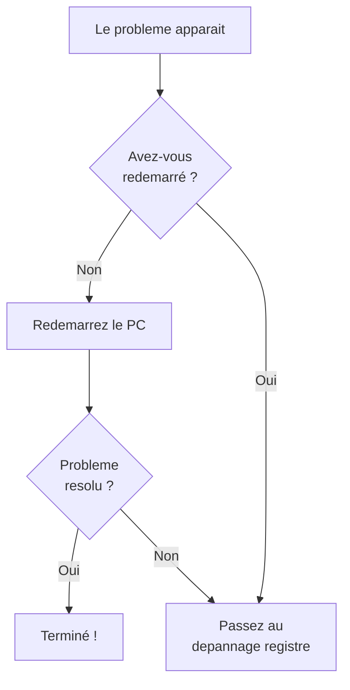

---
tags:
  - registre
  - débutant
  - dépannage
---

# Mon premier depannage

!!! abstract "Ce que vous allez apprendre"
    - Resoudre 5 problemes courants de Windows via le registre
    - Utiliser Process Monitor de maniere simplifiee
    - Reconnaitre quand un probleme depasse vos competences
    - La regle d'or : redemarrer d'abord, investiguer ensuite

!!! warning "Rappel essentiel"
    Avant **chaque** modification du registre, exportez la cle concernee. Toujours. Meme pour un depannage rapide. Relisez le chapitre 5 si necessaire.

---

## Comment trouver la bonne cle registre

Quand vous changez un parametre dans Windows, il existe souvent une valeur registre derrière.
Le plus dur n'est pas toujours de modifier cette valeur.
Le plus dur est de trouver **la bonne clé**.

### Methode 1 : Ctrl+F dans Regedit

Ouvrez Regedit, appuyez sur ++ctrl+f++, puis tapez un mot-cle.
Par exemple : `Searchbox`, `Explorer`, `Taskbar`, `Wallpaper`.

C'est simple, mais lent.
Regedit ne trouve que ce qui est chargé et visible dans les ruches ouvertes.

### Methode 2 : Process Monitor

Process Monitor montre ce que Windows fait en temps réel.

1. Lancez **ProcMon** en administrateur
2. Ajoutez le filtre : `Operation` `is` `RegSetValue` puis **Include**
3. Cliquez sur la gomme pour vider l'affichage
4. Changez le parametre dans Windows
5. Regardez quelle clé a été modifiée

!!! tip "Methode la plus fiable"
    La methode ProcMon est la plus fiable car elle montre exactement ce que Windows fait en temps reel.

### Methode 3 : Regshot

Regshot compare deux instantanés du registre.

1. Prenez un snapshot avant le changement
2. Modifiez le parametre dans Windows
3. Prenez un snapshot apres
4. Comparez les deux

L'outil montre ce qui a été ajouté, modifié ou supprimé.
C'est très pratique quand vous ne savez pas quel processus écrit la valeur.

### Methode 4 : recherche web

Tapez le nom du parametre + `registry key` dans un moteur de recherche.
Exemple : `Windows search box taskbar registry key`.

!!! warning "Verifier avant d'appliquer"
    Les résultats web peuvent être anciens ou faux.
    Vérifiez toujours la clé, la version Windows concernée et la source.
    Le chapitre 10 explique comment évaluer les tutoriels avant de les suivre.

---

## Pourquoi mon changement registre ne fonctionne pas

Le registre a un **ordre de precedence**.
Votre modification peut être écrasée par un niveau supérieur.

| Priorite | Source | Ou ca s'ecrit |
|:--------:|--------|---------------|
| 1 (plus fort) | Intune / MDM | `HKLM\SOFTWARE\Microsoft\PolicyManager\...` |
| 2 | GPO domaine | `HKLM\SOFTWARE\Policies\...` ou `HKCU\Software\Policies\...` |
| 3 | GPO locale | Meme chemin que GPO domaine |
| 4 | Application | Variable, souvent `HKCU\Software\<Editeur>\<App>` |
| 5 (plus faible) | Vous (Regedit) | Variable |

Si vous modifiez une valeur dans Regedit mais qu'une GPO écrit au même endroit, votre changement sera écrasé au prochain `gpupdate`.
Par défaut, un rafraîchissement GPO arrive environ toutes les 90 minutes, avec une variation aléatoire.

Comment vérifier rapidement :

1. Regardez le chemin de la clé
2. Si elle est sous `HKLM\SOFTWARE\Policies\` ou `HKCU\Software\Policies\`, elle est gérée par GPO
3. Dans ce cas, la modification doit passer par la GPO, pas par Regedit

!!! tip "Reflexe"
    Avant de modifier une valeur, vérifiez si elle est sous `Policies\`.
    Si oui, cherchez la GPO responsable au lieu de corriger localement.

---

## La regle du redemarrage

Avant de plonger dans le registre, essayez toujours **la solution la plus simple** :



!!! tip "Pourquoi ca marche souvent"
    Un redemarrage vide la memoire, relance les services, et recharge le registre depuis le disque. Beaucoup de problemes sont causes par un **etat temporaire corrompu** qui disparait au reboot.

    C'est comme eteindre et rallumer la lumiere quand elle clignote. Ca ne resout pas une ampoule cassee, mais ca resout un faux contact.

!!! quote "En resume"
    - Avant de toucher au registre, essayez toujours un **redemarrage** : cela vide la memoire, relance les services et recharge le registre.
    - Beaucoup de problemes sont causes par un etat temporaire corrompu qui disparait au reboot.

---

## Probleme 1 : "Mon programme ne se lance plus"

### Les symptomes

Vous double-cliquez sur un programme, et rien ne se passe. Ou bien une erreur apparait, puis le programme se ferme.

### Ou chercher dans le registre

Les parametres de la plupart des applications sont stockes dans :

```
HKEY_CURRENT_USER\Software\<NomEditeur>\<NomApplication>
```

ou

```
HKEY_LOCAL_MACHINE\SOFTWARE\<NomEditeur>\<NomApplication>
```

### Etape par etape

**Etape 1** -- Verifiez que l'application est toujours installee :

```powershell
# Search for the app in the uninstall registry
reg query "HKLM\SOFTWARE\Microsoft\Windows\CurrentVersion\Uninstall" /s /f "NomDuProgramme"
```

```title="Resultat attendu"
HKEY_LOCAL_MACHINE\SOFTWARE\Microsoft\Windows\CurrentVersion\Uninstall\NomDuProgramme
    DisplayName    REG_SZ    NomDuProgramme
    InstallLocation    REG_SZ    C:\Program Files\NomDuProgramme
```

Si rien ne s'affiche, l'application est probablement **desinstallee** ou corrompue.

---

**Etape 2** -- Cherchez les parametres de l'application :

```powershell
# Look for the app's settings in the current user hive
reg query "HKCU\Software" /s /f "NomDuProgramme"
```

```title="Resultat attendu"
HKEY_CURRENT_USER\Software\NomEditeur\NomDuProgramme
    SettingA    REG_SZ    valeur1
    SettingB    REG_DWORD    0x1

Fin de la recherche : 1 correspondance(s) trouvee(s).
```

**Etape 3** -- Si les parametres existent mais semblent corrompus, la solution la plus simple est de **les supprimer** pour forcer une reinitialisation :

!!! danger "Sauvegardez d'abord"
    ```powershell
    # Export the key before deleting it
    reg export "HKCU\Software\NomEditeur\NomApp" "C:\Users\User\Desktop\backup-monapp.reg"
    ```

    ```title="Resultat attendu"
    L'operation a reussi.
    ```

    Puis supprimez :

    ```powershell
    reg delete "HKCU\Software\NomEditeur\NomApp" /f
    ```

    ```title="Resultat attendu"
    L'operation a reussi.
    ```

    Relancez l'application. Elle recree ses parametres par defaut.

**Etape 4** -- Si ca ne marche toujours pas, **reinstallez** l'application. C'est souvent la solution la plus fiable.

!!! quote "En resume"
    - Les parametres des applications sont generalement sous `HKCU\Software\<Editeur>\<App>`.
    - Supprimer les parametres corrompus (apres sauvegarde) force l'application a recreer ses valeurs par defaut au prochain lancement.

---

## Probleme 2 : "Profil temporaire"

### Les symptomes

Au lieu de voir votre Bureau habituel, Windows affiche un Bureau vide et un message :

> "Vous avez ete connecte avec un profil temporaire."

Vos fichiers, votre fond d'ecran, et vos parametres ont disparu. Pas de panique : ils sont toujours la, mais Windows ne trouve plus votre profil.

!!! info "L'analogie"
    C'est comme si l'hotel vous donnait une chambre temporaire parce qu'il ne retrouve plus la reservation de votre suite. Votre suite existe toujours, il faut juste mettre a jour le registre des reservations.

### La cause

La cle `ProfileList` contient la correspondance entre chaque utilisateur (SID) et son dossier de profil. Si cette correspondance est cassee, Windows cree un profil temporaire.

### Etape par etape

**Etape 1** -- Ouvrez Regedit (++win+r++ > `regedit`) et naviguez vers :

```
HKEY_LOCAL_MACHINE\SOFTWARE\Microsoft\Windows NT\CurrentVersion\ProfileList
```

**Etape 2** -- Vous verrez des sous-cles avec des noms comme `S-1-5-21-...`. Cherchez votre SID. Pour trouver le votre :

!!! info "Qu'est-ce qu'un SID ?"
    Un **SID** (Security Identifier) est un identifiant unique que Windows attribue a chaque utilisateur, groupe et machine. Il ressemble a ceci :

    `S-1-5-21-3623811015-3361044348-30300820-1013`

    - Les 3 blocs de chiffres au milieu identifient votre **domaine** (ou votre machine locale)
    - Le dernier chiffre (`1013`) est votre **identifiant personnel** dans ce domaine

    Windows utilise le SID en interne, pas votre nom d'utilisateur. C'est pourquoi quand un profil est corrompu, vous devez retrouver votre SID pour reparer la situation.

```powershell
# Find your SID
whoami /user
```

```title="Resultat attendu"
USER INFORMATION
----------------

User Name      SID
============== =============================================
PC\Jean        S-1-5-21-1234567890-1234567890-1234567890-1001
```

**Etape 3** -- Cherchez ce SID dans les sous-cles de `ProfileList`. Vous pourriez trouver :

| Situation | Ce que vous voyez |
|-----------|-------------------|
| Normale | `S-1-5-21-...-1001` avec `ProfileImagePath` = `C:\Users\Jean` |
| Problematique | `S-1-5-21-...-1001.bak` (avec un `.bak` a la fin) |
| Doublon | Les deux : `S-1-5-21-...-1001` ET `S-1-5-21-...-1001.bak` |

**Etape 4** -- Reparer selon la situation :

=== "Cas 1 : seul .bak existe"

    Renommez la cle :

    1. Clic droit sur `S-1-5-21-...-1001.bak`
    2. **Renommer**
    3. Supprimez le `.bak` a la fin

=== "Cas 2 : les deux existent"

    1. Renommez `S-1-5-21-...-1001` en `S-1-5-21-...-1001.temp`
    2. Renommez `S-1-5-21-...-1001.bak` en `S-1-5-21-...-1001`
    3. Supprimez `S-1-5-21-...-1001.temp`

**Etape 5** -- Dans la cle reparee, verifiez ces valeurs :

| Valeur | Donnees correctes |
|--------|:-----------------:|
| `ProfileImagePath` | `C:\Users\VotreNom` |
| `State` | `0` |
| `RefCount` | `0` |

!!! tip "Si `State` n'est pas a 0"
    Double-cliquez sur `State`, changez la valeur en `0`, puis cliquez OK.

**Etape 6** -- Redemarrez le PC. Vous devriez retrouver votre profil normal.

!!! quote "En resume"
    - Le profil temporaire est cause par une correspondance cassee dans `ProfileList` entre votre SID et votre dossier de profil.
    - La reparation consiste a renommer les sous-cles `.bak`, verifier `ProfileImagePath` et mettre `State` a `0`.

---

## Probleme 3 : "Les associations de fichiers sont cassees"

### Les symptomes

- Les fichiers `.txt` ne s'ouvrent plus avec le Bloc-notes
- Tous les fichiers ont la meme icone blanche generique
- Windows demande "Comment voulez-vous ouvrir ce fichier ?" a chaque clic

### La solution simple (sans registre)

Commencez par la methode la plus simple :

1. Parametres > Applications > Applications par defaut
2. Cliquez sur "Reinitialiser" en bas de la page

!!! tip "Si ca suffit, arretez-vous la"
    La methode via les Parametres resout 90 % des problemes d'association de fichiers. N'allez dans le registre que si ca ne marche pas.

### La solution registre

Les associations de fichiers sont stockees a deux endroits :

| Emplacement | Role |
|-------------|------|
| `HKCU\Software\Microsoft\Windows\CurrentVersion\Explorer\FileExts` | Choix de l'utilisateur |
| `HKCR\.<extension>` | Association par defaut du systeme |

**Etape 1** -- Naviguez vers l'extension problematique :

```
HKEY_CURRENT_USER\Software\Microsoft\Windows\CurrentVersion\Explorer\FileExts\.txt
```

**Etape 2** -- Sous cette cle, vous verrez une sous-cle `UserChoice` :

| Valeur | Role |
|--------|------|
| `ProgId` | Identifiant du programme associe |
| `Hash` | Hash de verification (genere par Windows) |

**Etape 3** -- Si `UserChoice` contient des donnees incorrectes :

!!! warning "On ne peut pas modifier UserChoice directement"
    Windows protege cette cle avec un hash. Si vous modifiez `ProgId`, le hash sera invalide et Windows ignorera la modification.

    **La bonne methode** : supprimez la cle `UserChoice` entierement, puis redefinissez l'association via les Parametres.

    ```powershell
    # Delete the corrupted UserChoice (requires elevation in some cases)
    reg delete "HKCU\Software\Microsoft\Windows\CurrentVersion\Explorer\FileExts\.txt\UserChoice" /f
    ```

    ```title="Resultat attendu"
    L'operation a reussi.
    ```

**Etape 4** -- Ouvrez un fichier `.txt`. Windows vous demandera quel programme utiliser. Choisissez le Bloc-notes et cochez "Toujours utiliser cette application".

!!! quote "En resume"
    - Les associations de fichiers sont protegees par un hash dans `UserChoice` ; on ne peut pas modifier `ProgId` directement.
    - La solution : supprimer la cle `UserChoice` et redefinir l'association via les Parametres.

---

## Probleme 4 : "Un programme se lance tout seul au demarrage"

### Les symptomes

Un programme que vous n'avez pas demande se lance a chaque demarrage de Windows. Vous l'avez ferme, mais il revient inlassablement.

### Ou chercher

Les programmes de demarrage sont enregistres dans plusieurs endroits du registre. Voici les principaux :

| Emplacement | Portee |
|-------------|--------|
| `HKCU\Software\Microsoft\Windows\CurrentVersion\Run` | Utilisateur courant |
| `HKCU\Software\Microsoft\Windows\CurrentVersion\RunOnce` | Une seule fois au prochain demarrage |
| `HKLM\SOFTWARE\Microsoft\Windows\CurrentVersion\Run` | Tous les utilisateurs |
| `HKLM\SOFTWARE\Microsoft\Windows\CurrentVersion\RunOnce` | Une seule fois pour tous |

### Etape par etape

**Etape 1** -- Ouvrez le Gestionnaire des taches (++ctrl+shift+esc++) et allez dans l'onglet **Demarrage**. Vous y verrez la liste des programmes.

!!! tip "La methode facile"
    Le Gestionnaire des taches vous permet de **desactiver** un programme de demarrage d'un simple clic droit > Desactiver. Si ca suffit, pas besoin du registre.

**Etape 2** -- Si le programme n'apparait pas dans le Gestionnaire des taches, il est peut-etre dans le registre. Cherchons :

```powershell
# List all startup entries for the current user
reg query "HKCU\Software\Microsoft\Windows\CurrentVersion\Run"
```

```title="Resultat attendu"
HKEY_CURRENT_USER\Software\Microsoft\Windows\CurrentVersion\Run
    SecurityHealth    REG_SZ    C:\Windows\System32\SecurityHealthSystray.exe
    OneDrive          REG_SZ    "C:\Program Files\Microsoft OneDrive\OneDrive.exe" /background
    ProgrammeIndesirable    REG_SZ    C:\ProgramData\Malware\bad.exe
```

**Etape 3** -- Identifiez l'entree indesirable et supprimez-la :

```powershell
# Remove the unwanted startup entry
reg delete "HKCU\Software\Microsoft\Windows\CurrentVersion\Run" /v "ProgrammeIndesirable" /f
```

```title="Resultat attendu"
L'operation a reussi.
```

**Etape 4** -- Verifiez aussi les autres emplacements :

```powershell
# Check machine-wide startup entries (requires admin)
reg query "HKLM\SOFTWARE\Microsoft\Windows\CurrentVersion\Run"
```

```title="Resultat attendu"
HKEY_LOCAL_MACHINE\SOFTWARE\Microsoft\Windows\CurrentVersion\Run
    SecurityHealth    REG_SZ    C:\Windows\System32\SecurityHealthSystray.exe
    RealTekAudio     REG_SZ    "C:\Program Files\Realtek\Audio\HDA\RAVCpl64.exe"
```

!!! warning "Attention aux faux positifs"
    Certaines entrees sont **legitimement necessaires** :

    | Entree | Role | Supprimer ? |
    |--------|------|:-----------:|
    | `SecurityHealth` | Windows Defender | Non |
    | `RealTek Audio` | Pilote audio | Optionnel |
    | `iTunesHelper` | Mise a jour iTunes | Optionnel |
    | Nom inconnu avec chemin suspect | Potentiellement malveillant | A investiguer |

    En cas de doute, **desactivez** plutot que de supprimer. Renommez la valeur en ajoutant `_disabled` a la fin.

!!! quote "En resume"
    - Les programmes de demarrage sont enregistres dans 4 cles `Run` et `RunOnce` (sous HKCU et HKLM).
    - En cas de doute sur une entree, **desactivez-la** (renommez avec `_disabled`) plutot que de la supprimer.

---

## Probleme 5 : "L'Explorateur de fichiers plante en boucle"

### Les symptomes

L'Explorateur de fichiers (`explorer.exe`) plante, redemarrage, plante a nouveau. Parfois, la barre des taches disparait completement.

### La cause la plus frequente

Une **extension shell** (shell extension) defectueuse. Les extensions shell sont des modules ajoutes par des logiciels tiers qui modifient le clic droit, l'affichage des fichiers, etc.

### Etape par etape

**Etape 1** -- Demarrez en **mode sans echec** :

1. Maintenez ++shift++ en cliquant sur **Redemarrer** dans le menu Demarrer
2. Depannage > Options avancees > Parametres de demarrage > Redemarrer
3. Appuyez sur ++4++ pour le mode sans echec

!!! info "Pourquoi le mode sans echec"
    En mode sans echec, la plupart des extensions shell tierces ne se chargent pas. Si l'Explorateur fonctionne en mode sans echec, le probleme vient d'une extension.

**Etape 2** -- En mode sans echec, ouvrez Regedit et naviguez vers :

```
HKEY_LOCAL_MACHINE\SOFTWARE\Microsoft\Windows\CurrentVersion\Shell Extensions\Approved
```

Cette cle contient la liste de toutes les extensions shell approuvees. Chaque entree est un GUID.

**Etape 3** -- Pour identifier l'extension fautive, la methode la plus efficace est de desactiver les extensions tierces une par une.

Les extensions shell non-Microsoft sont enregistrees dans :

```
HKEY_CLASSES_ROOT\*\shellex\ContextMenuHandlers
HKEY_CLASSES_ROOT\Directory\shellex\ContextMenuHandlers
HKEY_CLASSES_ROOT\Folder\shellex\ContextMenuHandlers
```

**Etape 4** -- Cherchez les extensions non-Microsoft :

```powershell
# List context menu handlers
reg query "HKCR\*\shellex\ContextMenuHandlers" /s
```

```title="Resultat attendu"
HKEY_CLASSES_ROOT\*\shellex\ContextMenuHandlers\7-Zip
    (Default)    REG_SZ    {23170F69-40C1-278A-1000-000100020000}

HKEY_CLASSES_ROOT\*\shellex\ContextMenuHandlers\WinRAR
    (Default)    REG_SZ    {B41DB860-64E4-11D2-9906-E49FADC173CA}
```

**Etape 5** -- Pour desactiver temporairement une extension suspecte, ajoutez un prefixe `_disabled_` au nom de la sous-cle.

!!! tip "Outil gratuit recommande : ShellExView"
    Plutot que de fouiller le registre a la main, l'outil **ShellExView** de NirSoft affiche toutes les extensions shell dans un tableau et permet de les desactiver en un clic.

    Telechargement : `https://www.nirsoft.net/utils/shexview.html`

**Etape 6** -- Apres avoir desactive une extension, **redemarrez en mode normal** et testez. Si l'Explorateur ne plante plus, vous avez trouve le coupable. Desinstallez ou mettez a jour le logiciel concerne.

!!! quote "En resume"
    - Les plantages en boucle de l'Explorateur sont souvent causes par une **extension shell** defectueuse.
    - Le diagnostic se fait en mode sans echec : desactivez les extensions tierces une par une dans `ContextMenuHandlers` ou avec ShellExView.

---

## Process Monitor pour les debutants

Process Monitor (ProcMon) est un outil de Sysinternals qui montre **tout** ce que fait votre PC en temps reel : acces aux fichiers, au registre, au reseau.

!!! info "C'est comme une camera de surveillance"
    Process Monitor filme tout ce qui se passe dans votre PC. C'est puissant mais ca genere enormement de donnees. La cle, c'est le **filtrage**.

### Telechargement et lancement

1. Allez sur `https://learn.microsoft.com/sysinternals/downloads/procmon`
2. Telechargez et extrayez l'archive
3. Lancez `Procmon64.exe` en administrateur

### Utilisation simplifiee

Des le lancement, ProcMon enregistre **tout**. C'est comme ouvrir un robinet d'eau. Il faut poser un filtre pour ne garder que ce qui nous interesse.

**Filtre pour le registre uniquement** :

1. Cliquez sur le menu **Filter** > **Filter...**
2. Ajoutez cette regle :

| Colonne | Condition | Valeur | Action |
|---------|-----------|--------|--------|
| `Operation` | begins with | `Reg` | Include |

3. Cliquez **Add**, puis **Apply**, puis **OK**

Maintenant, vous ne voyez que les operations de registre.

**Filtre pour un programme specifique** :

Ajoutez une deuxieme regle :

| Colonne | Condition | Valeur | Action |
|---------|-----------|--------|--------|
| `Process Name` | is | `monapp.exe` | Include |

!!! tip "La methode rapide"
    Clic droit sur n'importe quelle ligne > **Include 'monapp.exe'**. C'est le moyen le plus rapide de filtrer.

### Exemple concret

Vous voulez savoir ou `notepad.exe` lit ses parametres dans le registre :

1. Lancez ProcMon avec le filtre `Process Name is notepad.exe` + `Operation begins with Reg`
2. Ouvrez le Bloc-notes
3. Regardez les lignes qui apparaissent

Vous verrez des operations comme :

```
notepad.exe  RegOpenKey     HKCU\Software\Microsoft\Notepad  SUCCESS
notepad.exe  RegQueryValue  HKCU\...\Notepad\iWindowPosX     SUCCESS  0x00000064
notepad.exe  RegQueryValue  HKCU\...\Notepad\iWindowPosY     SUCCESS  0x00000064
notepad.exe  RegQueryValue  HKCU\...\Notepad\lfFaceName      SUCCESS  Consolas
```

Vous savez maintenant exactement ou le Bloc-notes stocke ses parametres.

!!! quote "En resume"
    - Process Monitor (ProcMon) montre en temps reel toutes les operations registre de votre PC ; filtrez par processus et par type d'operation pour ne garder que l'essentiel.
    - C'est l'outil ideal pour decouvrir **ou** un programme stocke ses parametres dans le registre.

---

## Quand demander de l'aide

Le registre, c'est puissant mais ce n'est pas un jouet. Voici un guide pour savoir quand continuer seul et quand demander de l'aide.

!!! tip "Continuez seul si..."
    - Le probleme concerne une **seule application** (pas le systeme entier)
    - Vous modifiez des cles dans **HKCU** (espace utilisateur, reversible)
    - Vous avez une **sauvegarde** de la cle
    - Vous **comprenez** ce que vous faites

!!! danger "Demandez de l'aide si..."
    - L'Explorateur ou le Bureau ne se lancent **plus du tout**
    - Vous devez modifier des cles dans `HKLM\SYSTEM` ou `HKLM\SECURITY`
    - Vous suspectez un **malware** (voir chapitre 11)
    - Vous avez deja tente plusieurs modifications sans succes
    - Le PC ne **demarre plus** normalement

### Ou demander de l'aide

| Ressource | Quand l'utiliser |
|-----------|-----------------|
| Forums Microsoft Community | Problemes courants |
| Reddit r/WindowsHelp | Problemes techniques |
| Support Microsoft officiel | Quand rien ne marche |
| Un technicien informatique | Donnees importantes en jeu |

!!! quote "En resume"
    - Continuez seul si le probleme concerne une seule application et que vous modifiez des cles dans **HKCU** avec une sauvegarde.
    - Demandez de l'aide si le PC ne demarre plus, si vous devez toucher a `HKLM\SYSTEM` ou `HKLM\SECURITY`, ou si vous suspectez un malware.

---

!!! quote "En resume"
    - **Redemarrez toujours d'abord** avant de toucher au registre
    - **Programme qui ne se lance plus** : cherchez dans `HKCU\Software`, supprimez les parametres corrompus
    - **Profil temporaire** : reparez la cle `ProfileList` en renommant les entrees `.bak`
    - **Associations fichiers** : supprimez `UserChoice` et redefinissez via les Parametres
    - **Programme au demarrage** : verifiez les 4 cles `Run` et `RunOnce`
    - **Explorateur en boucle** : desactivez les extensions shell en mode sans echec
    - **Process Monitor** : filtrez par processus et par type d'operation pour ne voir que ce qui compte
    - En cas de doute, **demandez de l'aide** plutot que de risquer d'aggraver le probleme
