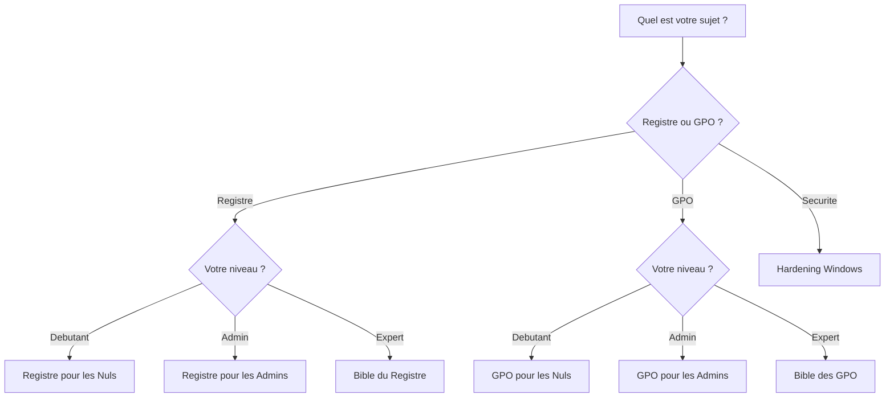

# Guide de lecture

## Decision matrix

| Votre profil | Votre besoin | Livre recommande |
|-------------|-------------|-----------------|
| Debutant | Comprendre le registre | [Registre pour les Nuls](../books/registre-pour-les-nuls/index.md) |
| Debutant | Comprendre les GPO | [GPO pour les Nuls](../books/gpo-pour-les-nuls/index.md) |
| Admin | Cas concrets registre : WSUS, SCCM, Intune | [Registre pour les Admins](../books/registre-pour-les-admins/index.md) |
| Admin | Cas concrets GPO : Office, Intune, RDS | [GPO pour les Admins](../books/gpo-pour-les-admins/index.md) |
| Architecte | Reference exhaustive registre | [Bible du Registre](../books/bible-registre-windows/index.md) |
| Architecte | Reference exhaustive GPO | [Bible des GPO](../books/bible-gpo/index.md) |
| Securite | Durcir Windows | [Hardening Windows](../books/hardening-windows/index.md) |

## Quel livre choisir ?

## Parcours recommandes

| Parcours | Ordre conseille | Objectif |
|---|---|---|
| Debutant | [Registre pour les Nuls](../books/registre-pour-les-nuls/index.md) -> [GPO pour les Nuls](../books/gpo-pour-les-nuls/index.md) -> premiers chapitres [Hardening](../books/hardening-windows/index.md) | Comprendre les bases avant de durcir |
| Admin | [Registre Admins](../books/registre-pour-les-admins/index.md) + [GPO Admins](../books/gpo-pour-les-admins/index.md) en parallele -> [Hardening](../books/hardening-windows/index.md) | Resoudre des cas terrain |
| Securite | [Hardening](../books/hardening-windows/index.md) -> [Bible GPO ch.13](../books/bible-gpo/13-securite-strategies.md) -> [AD Hardening](../books/hardening-windows/21-ad-hardening.md) | Prioriser les controles de securite |
| Migration cloud | [GPO Admins ch.18](../books/gpo-pour-les-admins/18-azure-ad-hybrid.md) -> [GPO Admins ch.19](../books/gpo-pour-les-admins/19-migration-intune.md) -> [Bible GPO ch.25](../books/bible-gpo/25-mdm-convergence.md) | Preparer la convergence GPO / Intune |

!!! tip "Lecture efficace"
    Si vous avez un incident, commencez par la reference rapide. Si vous devez comprendre le mecanisme, revenez au livre de fond.
