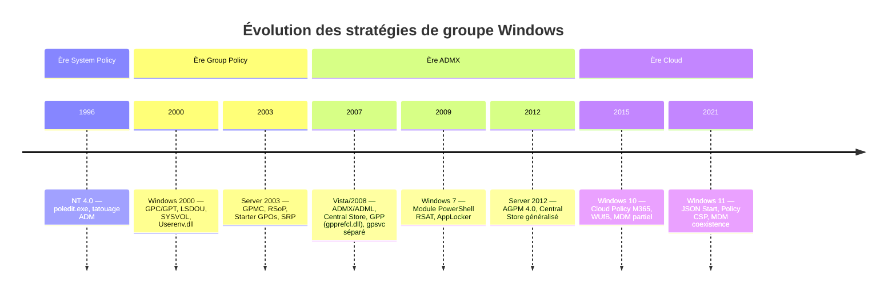

# Introduction et histoire des stratégies de groupe

!!! abstract "Ce que couvre ce chapitre"
    - Chronologie technique de NT 4.0 à Windows 11 : moteurs, formats de templates, mécanismes de stockage
    - L'effet de tatouage de System Policy et ses conséquences par rapport à la réversibilité des GPO
    - Architecture tripartite GPC / GPT / Lien : objets AD, SYSVOL, attributs `gPLink`
    - Transition ADM → ADMX/ADML : impact sur le stockage SYSVOL et la gestion multi-langues
    - Évolution du moteur de traitement : `Userenv.dll` (Winlogon) vers le service `gpsvc`
    - Migration SYSVOL de FRS vers DFS-R : états de migration, outils de détection, Event IDs
    - Tableau de référence OS/moteur/ADMX/GPP/MDM par version Windows

---

## Contexte historique : de System Policy à Group Policy

### NT 4.0 — System Policy et l'effet de tatouage

La gestion centralisée des postes Windows démarre avec **Windows NT 4.0** et l'outil `poledit.exe` (System Policy Editor). Le mécanisme repose sur un fichier `NTConfig.pol` déposé dans le partage `NETLOGON` du contrôleur de domaine.

Au téléchargement du fichier de stratégie, `poledit.exe` écrit les valeurs directement dans la ruche utilisateur (`HKCU`) ou machine (`HKLM`) du poste client. Ce comportement est connu sous le nom d'**effet de tatouage** (*tattooing*) : les modifications persistent dans le registre même après la suppression ou la désactivation de la stratégie. Il n'existe aucun mécanisme de nettoyage automatique.

Conséquences opérationnelles directes :

| Problème | Impact |
|----------|--------|
| Aucun nettoyage à la suppression de la stratégie | Les valeurs restent indéfiniment dans le registre |
| Aucun suivi de version | Impossible de savoir quelle version de la stratégie est appliquée |
| Format ADM binaire propriétaire | Pas d'édition externe, pas de diff, pas de versionning fiable |
| Pas d'intégration LDAP | La stratégie ne tient pas compte de la position de l'objet dans l'annuaire |
| Granularité limitée | Pas de ciblage par OU, uniquement par groupe NT |

Les fichiers ADM (Administrative Template) sont au format binaire. Ils sont embarqués dans chaque GPO et décrivent les paramètres exposés dans l'interface graphique de `poledit.exe`.

### Windows 2000 — Group Policy v1

Windows 2000 introduit le modèle **Group Policy** au sens moderne du terme. Le moteur de traitement est `Userenv.dll`, chargé dans le processus `Winlogon.exe` au démarrage de la machine et à la session utilisateur.

L'architecture repose sur deux composants distincts stockés à deux endroits différents (détaillés dans la section suivante) :

- **GPC** (Group Policy Container) : objet AD de classe `groupPolicyContainer` dans l'annuaire
- **GPT** (Group Policy Template) : dossier dans SYSVOL identifié par le GUID de la GPO

La **réversibilité** est le changement fondamental par rapport à NT 4.0. Les paramètres définis dans un GPO sont stockés dans des sections dédiées du registre (`HKLM\SOFTWARE\Policies\` et `HKCU\SOFTWARE\Policies\`) et sont supprimés automatiquement quand la GPO cesse de s'appliquer. Ce n'est plus du tatouage : c'est une configuration temporaire gérée par le moteur.

L'ordre d'application **LSDOU** (Local → Site → Domain → OU) est formalisé. Le SYSVOL, répliqué par FRS entre tous les contrôleurs de domaine, sert de point de distribution unique pour les fichiers de stratégie.

Le GPMC n'existe pas encore : la gestion des GPO se fait via **Active Directory Users and Computers**, la console `gpedit.msc`, et des manipulations ACL manuelles dans **ADSI Edit** pour les filtrages avancés.

### Windows Server 2003 — GPMC et RSoP

**Server 2003** apporte `Gpmc.msc` (Group Policy Management Console), téléchargeable séparément puis intégré au système. C'est le premier outil unifié pour la création, la liaison, la gestion des ACL et la sauvegarde/restauration des GPO.

Fonctionnalités introduites :

- **RSoP** (Resultant Set of Policy) : snap-in MMC permettant de simuler ou de journaliser les stratégies effectivement appliquées à un utilisateur ou une machine
- **Starter GPOs** : modèles de GPO réutilisables, stockés dans `\\domain\SYSVOL\domain\StarterGPOs\`
- **Software Restriction Policies (SRP)** : premier mécanisme de contrôle d'exécution applicatif via GPO
- **Copier/coller de GPO** et sauvegarde XML depuis la GPMC

Les fichiers ADM restent au format binaire et sont toujours dupliqués dans chaque GPO sous `\{GUID}\Adm\`.

### Windows Vista / Server 2008 — ADMX, GPP et extraction de gpsvc

Deux ruptures majeures se produisent simultanément :

**1. Remplacement ADM → ADMX**

Le format binaire ADM est remplacé par **ADMX** (XML pur) accompagné de fichiers de langue **ADML** (XML également). Le concept de **Central Store** est introduit : un répertoire unique `\\domain\SYSVOL\domain\Policies\PolicyDefinitions\` héberge l'ensemble des ADMX/ADML du domaine, éliminant la duplication par GPO.

**2. Group Policy Preferences (GPP)**

25 types d'extensions de préférences sont introduits via le nouveau CSE `gpprefcl.dll`. Contrairement aux paramètres de stratégie classiques, les préférences peuvent être configurées pour *ne pas* écraser les modifications locales (comportement `Update` vs `Replace`). Les types couvrent : lecteurs réseau, imprimantes, clés de registre, fichiers, raccourcis, variables d'environnement, tâches planifiées, sources de données ODBC, etc.

**3. Extraction de gpsvc de Winlogon**

Le moteur de traitement est extrait de `Winlogon.exe` et devient le service **Group Policy Client** (`gpsvc`), s'exécutant dans un processus `svchost.exe -k netsvcs`. Ce découplage permet le traitement asynchrone, une meilleure isolation des erreurs, et la reprise du traitement sans nécessiter de redémarrage ou de fermeture de session.

### Windows 7 / Server 2008 R2

- **Module PowerShell GroupPolicy** : disponible via RSAT, expose les cmdlets `Get-GPO`, `Set-GPRegistryValue`, `Get-GPResultantSetOfPolicy`, etc.
- **AppLocker** : remplace SRP, basé sur des règles par éditeur, chemin ou hash, avec une infrastructure d'audit plus fine
- **Amélioration de la détection des liaisons lentes** (*slow link*) : seuil configurable via GPO, permettant de désactiver certains CSE sur les connexions à faible bande passante

### Windows 8 / Server 2012

- Adoption généralisée du **Central Store** ADMX dans les nouvelles infrastructures
- **AGPM 4.0** (Advanced Group Policy Management) : gestion du cycle de vie des GPO avec workflow d'approbation
- Nouveaux ADMX pour les fonctionnalités Windows 8 (Internet Explorer 10, Store, etc.)
- **Fine-Grained Password Policies** accessibles directement depuis le GPMC (avant : uniquement via ADSI Edit ou PowerShell)

### Windows 10 / Server 2016 — Cloud Policy

- **Cloud Policy** pour Microsoft 365 Apps : application de paramètres via le service `config.office.com` sans nécessiter de GPO AD
- **Windows Update for Business** : nouveaux ADMX pour le contrôle des déploiements de mises à jour via GPO (`HKLM\SOFTWARE\Policies\Microsoft\Windows\WindowsUpdate`)
- **MDM enrollment** : les postes joints à Azure AD peuvent être gérés par Intune indépendamment des GPO AD — la coexistence commence

### Windows 11 / Server 2022 — Coexistence MDM

- **JSON Start menu layout** : le format XML de configuration du menu Démarrer (hérité de Windows 10) est remplacé par un format JSON via le paramètre `ConfigureStartPins`
- Nouveaux ADMX pour Widgets, Copilot, et fonctionnalités cloud
- **Policy CSP** : les paramètres GPO classiques sont mis en miroir dans le protocole MDM de Windows, permettant à Intune de gérer des paramètres historiquement réservés aux GPO AD
- **`cloudpolicysettings` ADMX** : permet de configurer depuis GPMC le comportement des stratégies cloud Microsoft 365
- Priorité de résolution en cas de conflit GPO/MDM : configurable via `HKLM\SOFTWARE\Policies\Microsoft\Windows\CloudManagedSettings`

---

### Tableau de référence : évolution par version Windows

| Version Windows | Moteur GPO | Format templates | Stockage | Nouveauté clé |
|----------------|-----------|-----------------|---------|--------------|
| Windows NT 4.0 | `poledit.exe` (tatouage) | ADM binaire | `NETLOGON\NTConfig.pol` | System Policy, effet tatouage |
| Windows 2000 | `Userenv.dll` (Winlogon) | ADM binaire | SYSVOL GPC+GPT | LSDOU, réversibilité, LDAP |
| Windows XP / Server 2003 | `Userenv.dll` (Winlogon) | ADM binaire | SYSVOL GPC+GPT | GPMC, RSoP, SRP, Starter GPOs |
| Windows Vista / Server 2008 | `gpsvc` (service) | ADMX/ADML XML | SYSVOL + Central Store | GPP (gpprefcl.dll), gpsvc séparé |
| Windows 7 / Server 2008 R2 | `gpsvc` (service) | ADMX/ADML XML | SYSVOL + Central Store | PowerShell RSAT, AppLocker |
| Windows 8.1 / Server 2012 R2 | `gpsvc` (service) | ADMX/ADML XML | SYSVOL + Central Store | AGPM 4.0, FGP depuis GPMC |
| Windows 10 / Server 2016 | `gpsvc` (service) | ADMX/ADML XML | SYSVOL + Central Store | Cloud Policy, WUfB, MDM partiel |
| Windows 11 / Server 2022 | `gpsvc` (service) | ADMX/ADML XML + JSON Start | SYSVOL + Central Store | Policy CSP, MDM coexistence complète |

!!! quote "En résumé"
    L'évolution des stratégies de groupe suit trois ruptures techniques majeures : la transition de System Policy (tatouage, NETLOGON) vers Group Policy (réversibilité, SYSVOL, LDAP) en 2000 ; le remplacement du format ADM binaire par ADMX/XML et l'introduction des préférences GPP en 2007-2008 ; l'extraction du moteur de traitement hors de Winlogon vers le service `gpsvc` indépendant. Depuis Windows 10, la montée en puissance de MDM/Intune via Policy CSP remet en question la place centrale des GPO dans les architectures nouvelles.

---

## L'architecture fondamentale : GPC + GPT + Lien

Une GPO n'est pas un objet unique. Elle est constituée de deux composants distincts synchronisés, liés à des conteneurs AD via un attribut.

### GPC — Group Policy Container

Le **GPC** est un objet AD de classe `groupPolicyContainer`, stocké dans :

```
CN={GUID},CN=Policies,CN=System,DC=domain,DC=tld
```

Il contient les métadonnées de la GPO : nom d'affichage, GUID, état (activé/désactivé pour le volet machine ou utilisateur), et surtout l'attribut **`versionNumber`** qui sert à la synchronisation avec le GPT.

Attributs LDAP clés du GPC :

| Attribut LDAP | Type | Description |
|---------------|------|-------------|
| `displayName` | String | Nom affiché dans la GPMC |
| `gPCFileSysPath` | String | Chemin UNC du GPT dans SYSVOL |
| `versionNumber` | Integer | Numéro de version composite (machine + utilisateur) |
| `gPCMachineExtensionNames` | String | GUIDs des CSE applicables côté machine |
| `gPCUserExtensionNames` | String | GUIDs des CSE applicables côté utilisateur |
| `flags` | Integer | 0=activé, 1=volet machine désactivé, 2=volet user désactivé, 3=les deux |

### GPT — Group Policy Template

Le **GPT** est un dossier dans SYSVOL :

```
\\domain\SYSVOL\domain\Policies\{GUID}\
```

Structure interne du dossier GPT :

```
{GUID}\
├── GPT.INI              ← version, DisplayName
├── Machine\
│   ├── Registry.pol     ← paramètres registre machine
│   ├── Scripts\         ← scripts Startup/Shutdown
│   └── Preferences\     ← données GPP machine
└── User\
    ├── Registry.pol     ← paramètres registre utilisateur
    ├── Scripts\         ← scripts Logon/Logoff
    └── Preferences\     ← données GPP utilisateur
```

Le fichier `GPT.INI` contient le numéro de version et le nom de la GPO :

```ini
[General]
Version=65537
displayName=New Group Policy Object
```

Le numéro de version dans `GPT.INI` est un entier 32 bits dont les 16 bits de poids fort représentent la version utilisateur et les 16 bits de poids faible la version machine. Il doit correspondre à l'attribut `versionNumber` du GPC.

### Lien — attribut gPLink

Le lien n'est **pas un objet AD séparé**. Il est représenté par l'attribut `gPLink` sur le conteneur cible (Site, domaine ou OU). Sa valeur est une chaîne qui liste les GPO liées avec leur statut :

```
[LDAP://cn={GUID1},cn=Policies,cn=System,DC=...;0][LDAP://cn={GUID2},...;2]
```

Valeurs du flag de lien :

| Flag | Signification |
|------|--------------|
| `0` | Lien actif |
| `1` | Lien désactivé |
| `2` | Lien enforced (pas de blocage d'héritage possible) |
| `3` | Lien désactivé et enforced |

L'attribut `gPLinkOptions` sur l'OU/domaine/site contrôle le **Block Inheritance** (`1` = héritage bloqué).

### Désynchronisation GPC/GPT : Event 1058

Quand le `versionNumber` du GPC ne correspond pas au champ `Version` de `GPT.INI`, le client considère la GPO comme corrompue ou inaccessible. Cela génère les événements suivants dans le journal **System** ou **Applications and Services Logs\Microsoft\Windows\GroupPolicy\Operational** :

| Event ID | Source | Signification |
|----------|--------|--------------|
| 1058 | Microsoft-Windows-GroupPolicy | Échec d'accès au GPT (chemin UNC inaccessible ou version incohérente) |
| 1030 | Userenv | Impossible de lire la liste des GPO (pré-Vista, journal System) |
| 7017 | Microsoft-Windows-GroupPolicy | Le CSE a dépassé le délai d'exécution |

!!! warning "Désynchronisation en production"
    Une désynchronisation GPC/GPT survient typiquement après une restauration partielle d'AD ou un problème de réplication SYSVOL. Le `versionNumber` LDAP reflète l'état avant restauration tandis que le GPT sur SYSVOL est à jour (ou l'inverse). Corriger manuellement le champ `Version` dans `GPT.INI` ou l'attribut `versionNumber` en LDAP résout le symptôme mais ne traite pas la cause de réplication.

!!! quote "En résumé"
    Une GPO existe en deux exemplaires : le GPC dans l'annuaire AD (métadonnées, version, GUIDs des CSE) et le GPT dans SYSVOL (fichiers de configuration réels). Le lien est un simple attribut LDAP `gPLink` sur le conteneur cible. La synchronisation entre GPC et GPT est garantie par le numéro de version ; toute divergence produit l'Event 1058.

---

## Diagramme : évolution chronologique



---

## De ADM à ADMX : la rupture de format

### Le format ADM et ses limites

Les fichiers **ADM** (Administrative Template) utilisés jusqu'à Windows Server 2003 sont en format binaire propriétaire. Chaque GPO embarque ses propres copies dans `\\domain\SYSVOL\domain\Policies\{GUID}\Adm\`. Cette architecture impose :

- **Duplication** : les fichiers ADM standards de Windows (environ 3 Mo par GPO pour les templates Microsoft) sont copiés dans chaque GPO, entraînant une consommation SYSVOL significative sur les domaines avec de nombreuses GPO
- **Absence d'Unicode complet** : certaines locales posent des problèmes d'encodage
- **Pas de séparation structure/langue** : un fichier ADM unique contient à la fois la définition des paramètres et les textes de l'interface dans une seule langue
- **Pas de namespacing** : risque de collision entre templates tiers

### Le format ADMX/ADML

**ADMX** (Administrative Template XML) est un fichier XML pur qui décrit les paramètres, leurs chemins de registre, leurs valeurs possibles et leurs métadonnées. Il est accompagné de fichiers **ADML** (Administrative Template Language), également XML, qui contiennent les chaînes de texte de l'interface dans une langue donnée.

Structure d'un ADMX :

```xml
<!-- Extrait type d'un ADMX Microsoft -->
<policy name="AllowTelemetry"
        class="Machine"
        displayName="$(string.AllowTelemetry)"
        explainText="$(string.AllowTelemetry_Help)"
        key="SOFTWARE\Policies\Microsoft\Windows\DataCollection"
        valueName="AllowTelemetry">
  <parentCategory ref="DataCollection" />
  <supportedOn ref="windows:SUPPORTED_Windows10" />
  <elements>
    <enum id="AllowTelemetry_Enum" valueName="AllowTelemetry">
      <item displayName="$(string.AllowTelemetry_0)">
        <value><decimal value="0" /></value>
      </item>
    </enum>
  </elements>
</policy>
```

### Le Central Store

Le **Central Store** est un répertoire SYSVOL créé manuellement (il n'existe pas par défaut) :

```
\\domain\SYSVOL\domain\Policies\PolicyDefinitions\
├── *.admx                     ← fichiers de définition (langage-neutre)
└── fr-FR\
│   └── *.adml                 ← fichiers de langue français
└── en-US\
    └── *.adml                 ← fichiers de langue anglais
```

Quand ce dossier existe, la GPMC l'utilise automatiquement à la place du répertoire local `%SystemRoot%\PolicyDefinitions\` de l'éditeur. Si le Central Store est absent, la GPMC utilise le répertoire local de la machine sur laquelle elle est exécutée — comportement source d'incohérences entre admins.

!!! warning "Central Store manquant"
    Sur les nouveaux domaines déployés sans Central Store, chaque administrateur voit les ADMX disponibles sur sa propre machine de gestion. Un admin sous Windows 11 22H2 verra des paramètres invisibles pour un admin sous Windows 10 20H2. En production, le Central Store doit être créé et maintenu à jour avec les ADMX correspondant à la version maximale des OS gérés.

### Impact sur les GPO existantes basées sur ADM

La migration vers ADMX ne nécessite aucune action sur les GPO existantes. Le moteur de traitement côté client (CSE) lit uniquement le fichier `registry.pol` — il ne consulte jamais les fichiers ADMX ou ADM. Les paramètres configurés avec d'anciens templates ADM continuent de s'appliquer.

En revanche, dans la GPMC, les paramètres configurés depuis des templates ADM dont l'ADMX équivalent est absent apparaissent sous la section **"Extra Registry Settings"**. C'est un indicateur visuel, pas un dysfonctionnement.

Les templates ADM tiers (anciens templates Office, templates de navigateurs obsolètes) restent visibles dans cette section jusqu'à :

1. La suppression des valeurs de `registry.pol` correspondantes
2. Ou l'ajout des ADMX équivalents dans le Central Store

### Détection des GPO avec paramètres ADM résiduels

```powershell title="Identifier les GPO contenant des Extra Registry Settings (ADM hérités)"
# Find GPOs with legacy ADM settings (Extra Registry Settings)
Get-GPO -All | ForEach-Object {
    $report = Get-GPOReport -Guid $_.Id -ReportType Xml
    if ($report -match "ExtraRegistrySettings") {
        [PSCustomObject]@{
            Name     = $_.DisplayName
            Guid     = $_.Id
            Created  = $_.CreationTime
            Modified = $_.ModificationTime
        }
    }
} | Format-Table -AutoSize
```

```powershell title="Résultat attendu"
Name                          Guid                                 Created              Modified
----                          ----                                 -------              --------
Legacy IE Settings GPO        {4A2F3B1C-...}                       15/03/2018 14:22:00  02/01/2023 09:11:00
Old Office 2010 Templates     {7C9E2D4F-...}                       20/06/2016 10:05:00  14/09/2021 16:44:00
```

!!! info "Namespacing ADMX"
    Chaque fichier ADMX déclare un namespace unique via l'attribut `namespace` dans sa balise `<policyNamespaces>`. Ce mécanisme évite les collisions entre templates Microsoft et tiers. Les templates Microsoft utilisent le namespace `Microsoft.Policies.*`. Les éditeurs tiers doivent utiliser leur propre namespace — son absence ou sa collision provoque des erreurs de chargement GPMC signalées dans l'Observateur d'événements sous `Microsoft-Windows-GroupPolicy/Operational`.

!!! quote "En résumé"
    La transition ADM → ADMX en 2007 élimine la duplication des templates dans SYSVOL et sépare la définition des paramètres (ADMX) de leur traduction (ADML). Le Central Store centralise les templates à l'échelle du domaine. Les GPO ADM existantes continuent de fonctionner sans modification — le CSE ne lit que `registry.pol`, pas les templates.

---

## Le moteur de traitement : de Userenv.dll à gpsvc

### NT 4.0 — XP / Server 2003 : Userenv.dll dans Winlogon

De Windows NT 4.0 à Windows XP / Server 2003, le moteur de traitement des stratégies est `Userenv.dll`, chargé directement dans le processus `Winlogon.exe`. Ce couplage fort avec Winlogon implique :

- Le traitement de stratégie est **synchrone** par défaut : la session ne s'ouvre qu'après la fin du traitement (sauf configuration explicite du traitement asynchrone via GPO)
- Un CSE défaillant peut bloquer ou ralentir l'ouverture de session
- Pas de reprise possible sans redémarrage ou fermeture/ouverture de session
- Les journaux d'événements liés aux GPO sont dans le journal **System** (sources `Userenv`, `SceCli`)

Clés de registre associées (configuration du comportement de traitement) :

| Clé de registre | Type | Description |
|----------------|------|-------------|
| `HKLM\SOFTWARE\Microsoft\Windows NT\CurrentVersion\Winlogon\GPExtensions` | Key | Liste des CSE enregistrés (sous-clés par GUID) |
| `HKLM\SOFTWARE\Microsoft\Windows NT\CurrentVersion\Winlogon\SyncForegroundPolicy` | DWORD | `1` = traitement synchrone machine |
| `HKCU\SOFTWARE\Microsoft\Windows NT\CurrentVersion\Winlogon\ParseAutoexec` | DWORD | Traitement de l'autoexec.bat en environnement (legacy) |

### Vista+ : le service gpsvc

À partir de Windows Vista, `Userenv.dll` est remplacé par le service **Group Policy Client** (`gpsvc`). Ce service s'exécute dans un processus `svchost.exe -k netsvcs` partagé avec d'autres services système.

Configuration du service dans le registre :

| Clé de registre | Valeur | Description |
|----------------|--------|-------------|
| `HKLM\SYSTEM\CurrentControlSet\Services\gpsvc` | — | Clé racine du service |
| `HKLM\SYSTEM\CurrentControlSet\Services\gpsvc\Parameters` | — | Paramètres opérationnels |
| `HKLM\SOFTWARE\Microsoft\Windows NT\CurrentVersion\Winlogon` | `GPExtensions` (REG_MULTI_SZ) | Liste héritée des GUID de CSE (compatibilité) |

Responsabilités du service `gpsvc` :

1. **Récupération de la liste des GPO** : requête LDAP vers le DC le plus proche pour lire les attributs `gPLink` et `gPOptions` sur le site, le domaine et les OU parentes
2. **Accès SYSVOL** : connexion SMB vers `\\domain\SYSVOL` pour lire les GPT
3. **Invocation des CSE** : appel de chaque CSE (DLL enregistrée dans `HKLM\SOFTWARE\Microsoft\Windows NT\CurrentVersion\Winlogon\GPExtensions`) en passant la liste des GPO ajoutées, supprimées et modifiées
4. **Cache des résultats** : écriture dans `%SystemRoot%\System32\GroupPolicy\` et `%SystemRoot%\System32\GroupPolicyUsers\`
5. **Journalisation opérationnelle** : écriture dans `Microsoft-Windows-GroupPolicy/Operational`

Cache du traitement GPO :

```
%SystemRoot%\System32\GroupPolicy\
├── Adm\           ← templates ADM locaux (si pas de Central Store)
├── DataStore\     ← cache XML des GPO traitées
└── Machine\
    ├── Registry.pol
    └── Scripts\

%SystemRoot%\System32\GroupPolicyUsers\{UserSID}\
└── User\
    ├── Registry.pol
    └── Scripts\
```

!!! warning "Isolation de gpsvc"
    `gpsvc` s'exécute dans un processus `svchost.exe` partagé. Si ce processus plante, tous les services du groupe `netsvcs` sont affectés. Depuis Windows 10 version 1703, les services à forte utilisation sont isolés dans leurs propres processus `svchost.exe` séparés sur les machines disposant de plus de 3,5 Go de RAM, améliorant l'isolation.

### Traçabilité : journal Operational

Le journal `Microsoft-Windows-GroupPolicy/Operational` (disponible depuis Vista) est la source principale pour le diagnostic. Il trace l'intégralité d'un cycle de traitement :

| Event ID | Signification |
|----------|--------------|
| 4000 | Début du traitement de stratégie machine |
| 4001 | Début du traitement de stratégie utilisateur |
| 4006 | Traitement terminé avec succès (machine) |
| 4007 | Traitement terminé avec succès (utilisateur) |
| 4016 | Début du traitement d'un CSE spécifique |
| 4017 | Fin du traitement d'un CSE spécifique |
| 5308 | Échec de la détection du DC (pas de connectivité LDAP) |
| 5312 | Aucune GPO applicable (liste vide) |
| 6006 | Lien lent détecté — certains CSE ne s'exécuteront pas |

!!! quote "En résumé"
    L'extraction de `gpsvc` hors de `Winlogon.exe` (Vista, 2007) est le changement architectural majeur du moteur de traitement. Le service gère indépendamment la récupération LDAP, l'accès SYSVOL, l'invocation des CSE et la mise en cache. Le journal `Operational` remplace les entrées éparpillées dans le journal System des versions précédentes.

---

## FRS vers DFS-R : la migration SYSVOL

### FRS — origines et obsolescence

Le service **FRS** (File Replication Service) assure la réplication SYSVOL depuis Windows 2000. Il repose sur le protocole `NtFrs` (service `NtFrs.exe`) et utilise une base de données Jet pour le suivi des modifications.

FRS est déprécié depuis **Windows Server 2008** et **supprimé dans Windows Server 2022**. Les domaines dont le niveau fonctionnel est inférieur à Windows Server 2008, ou ceux dont le SYSVOL n'a jamais été migré, fonctionnent toujours sur FRS si les contrôleurs de domaine sont encore présents.

Limites de FRS connues :

| Limitation | Impact |
|-----------|--------|
| Résolution de conflits basique | En cas d'édition simultanée, la dernière modification "gagne" sans fusion intelligente |
| Pas de contrôle de bande passante | Saturation des liens WAN possible lors de grandes opérations SYSVOL |
| Pas de compression | Transfert de fichiers complets même pour des modifications mineures |
| Journalisation limitée | Diagnostic difficile des problèmes de réplication |

### DFS-R — remplacement et migration

**DFS-R** (Distributed File System Replication) utilise le protocole `MS-FRS2`, avec compression différentielle (**RDC**, Remote Differential Compression), throttling de bande passante configurable, et une résolution de conflits par horodatage et taille de fichier.

La migration est gérée par `dfsrmig.exe` et s'effectue en 4 états séquentiels :

| État | Valeur | Description |
|------|--------|-------------|
| `Start` | 0 | FRS actif, DFS-R non initialisé pour SYSVOL |
| `Prepared` | 1 | DFS-R réplique SYSVOL en parallèle de FRS |
| `Redirected` | 2 | Les clients utilisent le SYSVOL DFS-R, FRS toujours actif |
| `Eliminated` | 3 | FRS désactivé pour SYSVOL, migration terminée |

!!! warning "Migration irréversible après l'état Eliminated"
    Le passage à l'état `Eliminated` (3) est irréversible. Avant de le déclencher, vérifier que tous les DC du domaine ont atteint l'état `Redirected` et que la réplication DFS-R est saine sur l'ensemble du domaine.

### Vérification de l'état de migration

```powershell title="Vérifier l'état de migration SYSVOL sur tous les DCs"
# Check global SYSVOL migration state
dfsrmig /getglobalstate

# Check SYSVOL migration state on each domain controller
Get-ADDomainController -Filter * | ForEach-Object {
    $dc = $_.HostName
    try {
        $state = Invoke-Command -ComputerName $dc -ScriptBlock {
            dfsrmig /getglobalstate 2>&1
        } -ErrorAction Stop
        [PSCustomObject]@{
            DC    = $dc
            Site  = $_.Site
            State = ($state | Out-String).Trim()
        }
    }
    catch {
        [PSCustomObject]@{
            DC    = $dc
            Site  = $_.Site
            State = "UNREACHABLE: $_"
        }
    }
} | Format-Table -AutoSize
```

```powershell title="Résultat attendu"
DC                          Site         State
--                          ----         -----
dc01.corp.contoso.com       Paris        Current DFSR global state: 'Eliminated (3)'.
dc02.corp.contoso.com       Lyon         Current DFSR global state: 'Eliminated (3)'.
dc03.corp.contoso.com       Remote-VPN   Current DFSR global state: 'Eliminated (3)'.
```

### Event IDs SYSVOL et DFS-R

| Event ID | Source | Journal | Signification |
|----------|--------|---------|--------------|
| 4602 | DFSR | Application | DFS-R a initialisé la réplication du dossier SYSVOL |
| 4604 | DFSR | Application | Dossier SYSVOL repliqué avec succès sur ce DC |
| 5008 | DFSR | Application | Conflit de réplication détecté (fichier en conflit déplacé dans `DfsrPrivate\ConflictAndDeleted`) |
| 2213 | DFSR | Application | La base de données DFS-R est corrompue — reconstruction requise |
| 1058 | Microsoft-Windows-GroupPolicy | System/Operational | GPO inaccessible (SYSVOL indisponible ou version incohérente) |
| 1202 | SceCli | System | Erreur lors du traitement des paramètres de sécurité — SYSVOL inaccessible |

!!! info "SYSVOL sur DFS-R et journaux"
    Les événements DFS-R sont dans le journal **Applications** (source `DFSR`). Les problèmes de traitement GPO consécutifs à une indisponibilité SYSVOL apparaissent dans **Microsoft-Windows-GroupPolicy/Operational** (Event 1058) ou dans **System** (Event 1202 pour les CSE de sécurité sur les systèmes pré-Vista).

!!! quote "En résumé"
    FRS est mort depuis Server 2022 et déprécié depuis 2008. Tout domaine utilisant encore FRS pour SYSVOL doit être migré vers DFS-R via `dfsrmig.exe` en 4 états séquentiels. L'état actuel se vérifie par `dfsrmig /getglobalstate` depuis n'importe quel DC. La santé de la réplication DFS-R se monitore via les événements DFSR dans le journal Application.

---

## Group Policy Preferences : les 25 types d'extensions

Introduites avec Windows Vista / Server 2008 et rétrocompatibles jusqu'à Windows XP SP3 via l'installation manuelle du client GPP, les **Group Policy Preferences** sont traitées par le CSE `{00000000-0000-0000-0000-000000000000}` (registre), mais surtout par `gpprefcl.dll` qui orchestre les 25 sous-extensions.

### Différence structurelle entre Paramètres et Préférences

| Critère | Paramètres (Settings) | Préférences (Preferences) |
|---------|----------------------|--------------------------|
| Fichier de configuration | `Registry.pol` | `\{GUID}\Machine\Preferences\` ou `\User\Preferences\` |
| Réversibilité | Automatique à la suppression | Configurable par `Action` (Create/Replace/Update/Delete) |
| Écrasement des modifs locales | Toujours | Dépend de l'action choisie |
| Item-Level Targeting | Non | Oui (par version OS, groupe de sécurité, variable d'env, etc.) |
| Format de stockage | Binaire (`Registry.pol`) | XML dans SYSVOL |

### Les 25 types de préférences GPP

**Volet Machine :**

| Type | DLL/Extension | Chemin SYSVOL |
|------|--------------|---------------|
| Drive Maps | `gpprefcl.dll` | `Machine\Preferences\Drives\Drives.xml` |
| Environment | `gpprefcl.dll` | `Machine\Preferences\EnvironmentVariables\EnvironmentVariables.xml` |
| Files | `gpprefcl.dll` | `Machine\Preferences\Files\Files.xml` |
| Folders | `gpprefcl.dll` | `Machine\Preferences\Folders\Folders.xml` |
| INI Files | `gpprefcl.dll` | `Machine\Preferences\IniFiles\IniFiles.xml` |
| Registry | `gpprefcl.dll` | `Machine\Preferences\Registry\Registry.xml` |
| Shortcuts | `gpprefcl.dll` | `Machine\Preferences\Shortcuts\Shortcuts.xml` |
| Data Sources (ODBC) | `gpprefcl.dll` | `Machine\Preferences\DataSources\DataSources.xml` |
| Devices | `gpprefcl.dll` | `Machine\Preferences\Devices\Devices.xml` |
| Local Users and Groups | `gpprefcl.dll` | `Machine\Preferences\Groups\Groups.xml` |
| Network Options (VPN/dial-up) | `gpprefcl.dll` | `Machine\Preferences\NetworkOptions\NetworkOptions.xml` |
| Network Shares | `gpprefcl.dll` | `Machine\Preferences\NetworkShares\NetworkShares.xml` |
| Power Options | `gpprefcl.dll` | `Machine\Preferences\PowerOptions\PowerOptions.xml` |
| Printers | `gpprefcl.dll` | `Machine\Preferences\Printers\Printers.xml` |
| Scheduled Tasks | `gpprefcl.dll` | `Machine\Preferences\ScheduledTasks\ScheduledTasks.xml` |
| Services | `gpprefcl.dll` | `Machine\Preferences\Services\Services.xml` |
| Start Menu | `gpprefcl.dll` | `Machine\Preferences\StartMenu\StartMenu.xml` |

**Volet Utilisateur :** Drive Maps, Environment, Files, Folders, INI Files, Registry, Shortcuts, Data Sources, Applications (Microsoft Office), Internet Settings, Local Users and Groups, Network Options, Power Options, Printers, Regional Options, Scheduled Tasks, Start Menu.

!!! info "GPP Registry vs paramètre Registry standard"
    Les préférences de type *Registry* écrivent dans n'importe quelle clé de registre, y compris en dehors de `HKLM\SOFTWARE\Policies\`. Elles ne bénéficient pas de la protection "read-only" des paramètres gérés et peuvent être écrasées par les utilisateurs ou les applications. Utiliser les préférences Registry pour des clés hors de l'espace `Policies` est intentionnel (configuration d'applications tierces), mais cela implique de comprendre que le contenu n'est pas "enforced" au sens fort du terme.

### Débogage des GPP

Les erreurs de traitement GPP sont journalisées dans le journal **Applications and Services Logs\Microsoft-Windows-GroupPolicy\Operational** avec les Event IDs 4016 (début) et 4017 (fin) par extension. Les erreurs spécifiques aux préférences apparaissent également dans :

```
%SYSTEMROOT%\debug\usermode\gppref*.log
```

Ces fichiers de log verbeux (activés par la clé `HKLM\SOFTWARE\Microsoft\Windows NT\CurrentVersion\Diagnostics\GPSvcDebugLevel`) permettent de tracer précisément quel item XML a échoué et pourquoi.

!!! quote "En résumé"
    Les GPP introduisent 25 types d'extensions configurées via des fichiers XML dans SYSVOL. Leur différence fondamentale avec les paramètres classiques est le contrôle de l'action (Create/Replace/Update/Delete) et la réversibilité configurable. Le CSE `gpprefcl.dll` les orchestre toutes. L'Item-Level Targeting permet un ciblage fin sans nécessiter de GPO distinctes.

---

## Décodage du numéro de version GPO

Le `versionNumber` d'une GPO est un entier 32 bits composite. Sa structure :

- **Bits 0-15 (poids faible)** : version du volet machine
- **Bits 16-31 (poids fort)** : version du volet utilisateur

Chaque modification du volet machine incrémente les bits de poids faible. Chaque modification du volet utilisateur incrémente les bits de poids fort. Ainsi, un `versionNumber` de `65537` (hex `0x00010001`) signifie :

- Version machine : `1`
- Version utilisateur : `1`

Un `versionNumber` de `131073` (hex `0x00020001`) signifie :

- Version machine : `1`
- Version utilisateur : `2`

```powershell title="Décoder le numéro de version d'une GPO"
# Decode GPO version number into machine and user components
function Get-GPOVersionComponents {
    param(
        [Parameter(Mandatory)]
        [string]$GPOName
    )

    $gpo = Get-GPO -Name $GPOName
    $versionNumber = $gpo.Computer.DSVersion  # LDAP versionNumber

    # Read GPT.INI version for cross-check
    $domain = (Get-ADDomain).DNSRoot
    $sysvol = "\\$domain\SYSVOL\$domain\Policies\{$($gpo.Id)}\GPT.INI"
    $gptContent = Get-Content $sysvol -ErrorAction SilentlyContinue
    $gptVersion = ($gptContent | Where-Object { $_ -match '^Version=' }) -replace 'Version=',''

    # Decode version number
    $machineVersion = $versionNumber -band 0xFFFF
    $userVersion    = ($versionNumber -shr 16) -band 0xFFFF

    [PSCustomObject]@{
        GPOName       = $GPOName
        LDAPVersion   = $versionNumber
        GPTVersion    = [int]$gptVersion
        MachineVer    = $machineVersion
        UserVer       = $userVersion
        InSync        = ($versionNumber -eq [int]$gptVersion)
    }
}

Get-GPOVersionComponents -GPOName "Default Domain Policy"
```

```powershell title="Résultat attendu"
GPOName               LDAPVersion GPTVersion MachineVer UserVer InSync
-------               ----------- ---------- ---------- ------- ------
Default Domain Policy 3           3          3          0       True
```

!!! warning "versionNumber à zéro"
    Un `versionNumber` de `0` dans le GPC LDAP est normal pour une GPO nouvellement créée avant la première modification. Après toute modification dans la GPMC, il passe à au minimum `1`. Un `versionNumber` de `0` sur une GPO ancienne est un indicateur de corruption ou de réplication AD incomplète.

---

## Central Store : création et maintenance

### Création du Central Store

Le Central Store n'est pas créé automatiquement. Sa création est une action manuelle, à effectuer une seule fois par domaine :

```powershell title="Créer le Central Store et y déployer les ADMX locaux"
# Create the Central Store for ADMX/ADML templates
$domain    = (Get-ADDomain).DNSRoot
$sysvol    = "\\$domain\SYSVOL\$domain\Policies"
$csPath    = "$sysvol\PolicyDefinitions"
$localADMX = "$env:SystemRoot\PolicyDefinitions"

# Create the PolicyDefinitions folder if it does not exist
if (-not (Test-Path $csPath)) {
    New-Item -ItemType Directory -Path $csPath | Out-Null
    Write-Host "Central Store created at: $csPath"
}

# Copy all ADMX files from local PolicyDefinitions
Get-ChildItem -Path $localADMX -Filter "*.admx" | ForEach-Object {
    Copy-Item -Path $_.FullName -Destination $csPath -Force
}

# Copy all ADML language folders
Get-ChildItem -Path $localADMX -Directory | ForEach-Object {
    $langDest = Join-Path $csPath $_.Name
    if (-not (Test-Path $langDest)) {
        New-Item -ItemType Directory -Path $langDest | Out-Null
    }
    Get-ChildItem -Path $_.FullName -Filter "*.adml" | ForEach-Object {
        Copy-Item -Path $_.FullName -Destination $langDest -Force
    }
}

Write-Host "ADMX/ADML files copied to Central Store."
```

### Audit du Central Store vs version OS

Quand les ADMX du Central Store sont en retard par rapport aux ADMX embarqués dans la version Windows des postes clients, des paramètres récents n'apparaissent pas dans la GPMC. Vérifier la cohérence de version :

```powershell title="Comparer les versions ADMX entre Central Store et OS local"
# Compare ADMX file count and modification dates between Central Store and local PolicyDefinitions
$domain   = (Get-ADDomain).DNSRoot
$csPath   = "\\$domain\SYSVOL\$domain\Policies\PolicyDefinitions"
$localDir = "$env:SystemRoot\PolicyDefinitions"

$csFiles    = Get-ChildItem -Path $csPath    -Filter "*.admx" -ErrorAction SilentlyContinue
$localFiles = Get-ChildItem -Path $localDir  -Filter "*.admx"

[PSCustomObject]@{
    CentralStoreCount = $csFiles.Count
    LocalCount        = $localFiles.Count
    CSLastModified    = ($csFiles | Sort-Object LastWriteTime -Descending | Select-Object -First 1).LastWriteTime
    LocalLastModified = ($localFiles | Sort-Object LastWriteTime -Descending | Select-Object -First 1).LastWriteTime
}
```

```powershell title="Résultat attendu"
CentralStoreCount LocalCount CSLastModified        LocalLastModified
----------------- ---------- --------------        -----------------
             387        412  14/10/2022 09:44:00   08/03/2024 14:22:00
```

Un écart entre `CentralStoreCount` et `LocalCount` indique que le Central Store n'a pas été mis à jour depuis la dernière mise à niveau du système d'exploitation de la machine d'administration.

!!! quote "En résumé"
    Le Central Store est une action de déploiement manuelle, non automatique. Sa maintenance régulière (à chaque nouveau niveau fonctionnel OS ou déploiement de nouveaux ADMX tiers) est indispensable pour garantir la cohérence des outils de gestion entre administrateurs. Un Central Store obsolète est invisible pour le client — seul l'affichage GPMC est affecté — mais génère des angles morts de configuration.

---

## Référence de version par OS

| OS | Build | gpsvc | ADMX | GPP | MDM coexistence |
|----|-------|-------|------|-----|----------------|
| Windows NT 4.0 | 4.0 | Non (`Userenv.dll`) | Non (ADM) | Non | Non |
| Windows 2000 | 5.0 | Non (`Userenv.dll`) | Non (ADM) | Non | Non |
| Windows XP / Server 2003 | 5.1 / 5.2 | Non (`Userenv.dll`) | Non (ADM) | Non | Non |
| Windows Vista / Server 2008 | 6.0 | Oui | Oui | Oui | Non |
| Windows 7 / Server 2008 R2 | 6.1 | Oui | Oui | Oui | Non |
| Windows 8.1 / Server 2012 R2 | 6.3 | Oui | Oui | Oui | Partiel (MDM enrollement Azure AD) |
| Windows 10 / Server 2016 | 10.0 | Oui | Oui | Oui | Oui (Cloud Policy, WUfB) |
| Windows 11 / Server 2022 | 10.0 22000+ | Oui | Oui (JSON Start) | Oui | Oui (Policy CSP complet) |

---

## Clés de registre de référence

Clés impliquées dans le traitement des stratégies de groupe, tous systèmes confondus :

| Clé de registre | Type | Description |
|----------------|------|-------------|
| `HKLM\SOFTWARE\Policies\` | Key | Espace de stockage des paramètres machine gérés (non tatouage) |
| `HKCU\SOFTWARE\Policies\` | Key | Espace de stockage des paramètres utilisateur gérés (non tatouage) |
| `HKLM\SOFTWARE\Microsoft\Windows\CurrentVersion\Group Policy` | Key | Métadonnées du dernier traitement : DCs interrogés, temps de traitement |
| `HKLM\SOFTWARE\Microsoft\Windows\CurrentVersion\Group Policy\History` | Key | Historique des GPO appliquées (nom, GUID, version) |
| `HKLM\SOFTWARE\Microsoft\Windows\CurrentVersion\Group Policy\State` | Key | État par GPO : version machine et utilisateur |
| `HKLM\SOFTWARE\Microsoft\Windows NT\CurrentVersion\Winlogon\GPExtensions` | Key | Enregistrement des CSE (sous-clés GUID) |
| `HKLM\SYSTEM\CurrentControlSet\Services\gpsvc` | Key | Configuration du service Group Policy Client |
| `HKLM\SOFTWARE\Policies\Microsoft\Windows\System` | Key | Paramètres système gérés (dont `ProcessGPOsWithNoChanges`) |
| `HKLM\SOFTWARE\Microsoft\Windows\CurrentVersion\Policies\System` | Key | Paramètres system legacy (superposés aux GPO dans certains cas) |

!!! info "Policies vs non-Policies"
    Les valeurs sous `HKLM\SOFTWARE\Policies\` et `HKCU\SOFTWARE\Policies\` sont gérées exclusivement par le moteur GPO. Elles sont supprimées automatiquement quand la GPO cesse de s'appliquer. Les valeurs sous `HKLM\SOFTWARE\Microsoft\Windows\CurrentVersion\Policies\` sont un espace legacy qui subsiste pour la compatibilité — certains paramètres y écrivent encore par défaut (notamment les paramètres de démarrage automatique et de contrôle d'accès utilisateur).

### Lecture du cache de traitement GPO depuis le registre

Le moteur `gpsvc` écrit l'état du dernier traitement dans le registre. Ces clés sont lisibles sans privilèges élevés sur la machine locale :

```powershell title="Lire le cache GPO depuis le registre local"
# Read Group Policy processing cache from registry
$gpStatePath = "HKLM:\SOFTWARE\Microsoft\Windows\CurrentVersion\Group Policy\State\Machine"

if (Test-Path $gpStatePath) {
    # List applied GPOs with their version
    Get-ChildItem "$gpStatePath\GPO-List" -ErrorAction SilentlyContinue | ForEach-Object {
        $props = Get-ItemProperty $_.PSPath
        [PSCustomObject]@{
            DisplayName   = $props.DisplayName
            GUID          = $props.GUID
            Version       = $props.Version
            Link          = $props.Link
            Options       = $props.Options
        }
    } | Format-Table -AutoSize
}
```

```powershell title="Résultat attendu"
DisplayName                    GUID                                   Version Link                                     Options
-----------                    ----                                   ------- ----                                     -------
Default Domain Policy          {31B2F340-016D-11D2-945F-00C04FB984F9}       3 LDAP://DC=corp,DC=contoso,DC=com              0
Security Baseline - Workstations {A4B2C1D3-...}                            17 LDAP://OU=Workstations,DC=corp,DC=contoso,DC=com  0
```

### CSE enregistrés : lecture depuis GPExtensions

Les CSE disponibles sur un poste sont enregistrés sous `HKLM\SOFTWARE\Microsoft\Windows NT\CurrentVersion\Winlogon\GPExtensions`. Chaque sous-clé est nommée par le GUID du CSE :

```powershell title="Lister les CSE enregistrés sur le poste local"
# List all registered Client-Side Extensions (CSEs)
$csePath = "HKLM:\SOFTWARE\Microsoft\Windows NT\CurrentVersion\Winlogon\GPExtensions"
Get-ChildItem $csePath | ForEach-Object {
    $props = Get-ItemProperty $_.PSPath -ErrorAction SilentlyContinue
    [PSCustomObject]@{
        GUID          = $_.PSChildName
        Name          = $props.'(default)'
        DLLName       = $props.DllName
        ProcessGPOs   = $props.ProcessGroupPolicy
        NoMachinePolicy = $props.NoMachinePolicy
        NoUserPolicy    = $props.NoUserPolicy
    }
} | Where-Object { $_.Name } | Sort-Object Name | Format-Table -AutoSize
```

Les CSE clés présents sur tout poste Windows Vista+ :

| GUID | Nom | DLL |
|------|-----|-----|
| `{00000000-0000-0000-0000-000000000000}` | Registry | `gpprefcl.dll` (GPP) |
| `{35378EAC-683F-11D2-A89A-00C04FBBCFA2}` | Registry (Settings) | `gpsvc.dll` |
| `{827D319E-6EAC-11D2-A4EA-00C04F79F83A}` | Security | `scecli.dll` |
| `{42B5FAAE-6536-11D2-AE5A-0000F87571E3}` | Scripts | `gpscript.dll` |
| `{B1BE8D72-6EAC-11D2-A4EA-00C04F79F83A}` | EFS Recovery | `gpscript.dll` |
| `{C6DC5466-785A-11D2-84D0-00C04FB169F7}` | Software Installation | `appmgmts.dll` |
| `{25537523-E3DA-4EB1-9672-4F3F800F0B73}` | Folder Redirection | `fdeploy.dll` |
| `{5794DAFD-BE60-433F-88A2-1A31939AC01F}` | Drive Maps (GPP) | `gpprefcl.dll` |
| `{6232C319-91AC-4931-9385-E70C2B099F0E}` | Printers (GPP) | `gpprefcl.dll` |

!!! quote "En résumé"
    Le registre local est la source de vérité pour l'état de traitement GPO : cache des GPO appliquées sous `Group Policy\State`, CSE disponibles sous `Winlogon\GPExtensions`. Ces clés permettent un diagnostic sans dépendance aux outils RSAT et sont accessibles via `Invoke-Command` sur des machines distantes.

---

## Références croisées

| Sujet | Chapitre |
|-------|---------|
| Architecture GPC/GPT en détail : structure LDAP complète, attributs, ACL par défaut | [Ch. 02 — Architecture et composants internes](02-architecture.md) |
| Client-Side Extensions : GUID, DLL, conditions d'invocation, diagnostic par CSE | [Ch. 03 — Client-Side Extensions en profondeur](03-cse.md) |
| SYSVOL : structure de dossiers, réplication DFS-R, permissions, GPT.INI | [Ch. 04 — SYSVOL : réplication et structure](04-sysvol.md) |
| Format ADMX/ADML : syntaxe XML, namespacing, Central Store, outils de validation | [Ch. 05 — Modèles d'administration (ADMX/ADML)](05-admx-adml.md) |
| Format binaire registry.pol : structure, lecture/écriture PowerShell | [Ch. 06 — Le format registry.pol](06-registry-pol.md) |
| Ordre d'application LSDOU, héritage, Block Inheritance, Enforced | [Ch. 08 — Héritage et ordre d'application (LSDOU)](08-heritage-lsdou.md) |
| Diagnostic RSoP, gpresult, journal Operational, résolution de problèmes | [Ch. 20 — Résultats de stratégie (RSoP) et diagnostic](20-rsop-diagnostic.md) |
| Convergence MDM/Intune et Policy CSP | [Ch. 25 — GPO et MDM : convergence et coexistence](25-mdm-convergence.md) |
| Introduction GPO niveau intermédiaire | [Les GPO pour les Administrateurs — Ch. 01](../gpo-pour-les-admins/index.md) |
| GPO et registre Windows : clés Policies, registry.pol et écriture directe | [La Bible du Registre — Ch. 20](../bible-registre-windows/20-gpo.md) |
