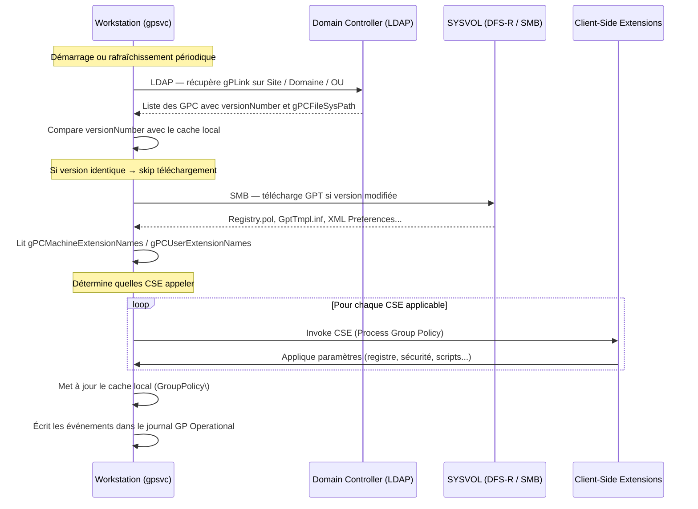

# Architecture et composants internes

!!! abstract "Ce que couvre ce chapitre"
    - La structure en trois couches d'une GPO : GPC (Active Directory), GPT (SYSVOL), et lien gPLink sur le conteneur AD
    - Les attributs LDAP critiques du GPC, notamment `versionNumber`, `flags` et `gPCFileSysPath`
    - L'arborescence exacte du GPT dans SYSVOL et le rôle du fichier `GPT.INI`
    - L'encodage binaire du numéro de version (16 bits machine / 16 bits utilisateur)
    - Le service `gpsvc` — son rôle d'orchestrateur, ses dépendances et son cache local
    - La synchronisation critique GPC ↔ GPT et les conséquences d'une divergence de version
    - Les attributs `gPCMachineExtensionNames` / `gPCUserExtensionNames` et leur impact sur les performances

---

## Les trois couches d'une GPO

:material-layers-triple: Une GPO n'est pas un objet unique. C'est une **construction distribuée** composée de trois éléments distincts qui doivent rester cohérents entre eux.

La compréhension de cette architecture est fondamentale. La quasi-totalité des incidents de stratégie de groupe — paramètres non appliqués, erreurs dans les journaux, comportements incohérents entre DC — trouve son explication dans la relation entre ces trois couches.

:material-numeric-1-circle: **GPC** (Group Policy Container) — côté Active Directory (réplication AD)

:material-numeric-2-circle: **GPT** (Group Policy Template) — côté SYSVOL (réplication DFS-R ou FRS)

:material-numeric-3-circle: **gPLink** — l'attribut de lien sur le conteneur (Site, Domaine, OU)

!!! info "Deux systèmes de réplication distincts"
    Le GPC est répliqué via le moteur de réplication AD (Knowledge Consistency Checker + RPC). Le GPT est répliqué via DFS-R (ou FRS sur les très anciens environnements). Ces deux systèmes ont des latences différentes, ce qui explique pourquoi les désynchronisations GPC/GPT sont possibles.

---

## Le GPC — Group Policy Container

:material-database: Le GPC est un objet Active Directory de classe `groupPolicyContainer`. Il réside sous :

```
CN=Policies,CN=System,DC=contoso,DC=local
```

Chaque GPO possède son propre GPC, identifié par un GUID unique. Ce GUID est stable pour toute la durée de vie de la GPO — il ne change pas si on renomme la GPO.

### Attributs LDAP du GPC

| Attribut LDAP | Type | Description |
|---|---|---|
| `distinguishedName` | DN | Chemin LDAP complet : `CN={GUID},CN=Policies,CN=System,DC=contoso,DC=local` |
| `name` | String | Le GUID brut de la GPO, ex. `{31B2F340-016D-11D2-945F-00C04FB984F9}` |
| `displayName` | String | Nom lisible en GPMC, ex. `Default Domain Policy` |
| `gPCFileSysPath` | String | Chemin UNC vers le GPT : `\\contoso.local\SYSVOL\contoso.local\Policies\{GUID}` |
| `gPCFunctionalityVersion` | Integer | Version du schéma GPO — toujours `2` depuis Windows 2000 |
| `versionNumber` | Integer | Version combinée de la GPO — doit correspondre à `GPT.INI` |
| `flags` | Integer | État d'activation — voir tableau ci-dessous |
| `gPCMachineExtensionNames` | String | GUID des CSE côté Machine utilisées par cette GPO |
| `gPCUserExtensionNames` | String | GUID des CSE côté Utilisateur utilisées par cette GPO |

:material-flag-variant: L'attribut `flags` contrôle quelles portions de la GPO sont actives :

| Valeur | Signification |
|---|---|
| `0` | GPO entièrement active |
| `1` | Portion Utilisateur désactivée |
| `2` | Portion Ordinateur désactivée |
| `3` | GPO entièrement désactivée (Utilisateur + Ordinateur) |

!!! warning "flags vs lien désactivé"
    `flags = 3` désactive la GPO elle-même. Un lien désactivé (flag `1` dans `gPLink`) ne désactive que l'application sur un conteneur spécifique. Ce sont deux mécanismes indépendants. Une GPO avec `flags = 3` est ignorée partout, quel que soit l'état de ses liens.

### Lire les attributs GPC avec PowerShell

```powershell title="Lecture des attributs GPC d'une GPO"
# Read GPC attributes for a specific GPO
$gpo = Get-GPO -Name "Default Domain Policy"
$domain = (Get-ADDomain).DistinguishedName

Get-ADObject `
    -Identity "CN={$($gpo.Id)},CN=Policies,CN=System,$domain" `
    -Properties gPCFileSysPath,
                versionNumber,
                flags,
                gPCFunctionalityVersion,
                gPCMachineExtensionNames,
                gPCUserExtensionNames |
    Select-Object Name, displayName, versionNumber, flags,
                  gPCFileSysPath, gPCMachineExtensionNames
```

```powershell title="Résultat attendu"
Name              : {31B2F340-016D-11D2-945F-00C04FB984F9}
displayName       : Default Domain Policy
versionNumber     : 131073
flags             : 0
gPCFileSysPath    : \\contoso.local\SYSVOL\contoso.local\Policies\{31B2F340-016D-11D2-945F-00C04FB984F9}
gPCMachineExtensionNames : [{35378EAC-683F-11D2-A89A-00C04FBBCFA2}{53D6AB1B-2488-11D1-A28C-00C04FB94F17}]
                           [{827D319E-6EAC-11D2-A4EA-00C04F79F83A}{803E14A0-B4FB-11D0-A0D0-00A0C90F574B}]
```

!!! info "Pourquoi `versionNumber` vaut 131073 ?"
    La valeur `131073` en décimal correspond à `0x00020001`. Les 16 bits de poids faible (`0x0001 = 1`) représentent la version machine. Les 16 bits de poids fort (`0x0002 = 2`) représentent la version utilisateur. Ce mécanisme est décrit en détail dans la section sur la synchronisation GPC/GPT.

!!! quote "En résumé"
    Le GPC est le visage AD de la GPO. Il contient les métadonnées (nom, chemin SYSVOL, état, version) mais pas les paramètres eux-mêmes. Les paramètres réels sont dans le GPT, côté SYSVOL.

---

## Le GPT — Group Policy Template

:material-folder-network: Le GPT est une arborescence de dossiers et fichiers dans SYSVOL. Son emplacement est toujours :

```
\\<domaine>\SYSVOL\<domaine>\Policies\{GUID}\
```

Ce chemin est précisément l'attribut `gPCFileSysPath` du GPC correspondant.

### Structure de l'arborescence GPT

```
{GUID}\
├── GPT.INI                                    ← synchronisation de version
│
├── Machine\
│   ├── Registry.pol                           ← paramètres registre (format binaire)
│   ├── Microsoft\
│   │   └── Windows NT\
│   │       └── SecEdit\
│   │           └── GptTmpl.inf               ← paramètres de sécurité (format INI)
│   ├── Scripts\
│   │   ├── Startup\                           ← scripts de démarrage
│   │   └── Shutdown\                          ← scripts d'arrêt
│   └── Preferences\
│       ├── Registry\                          ← préférences registre (XML)
│       ├── Files\                             ← préférences fichiers (XML)
│       ├── Shortcuts\                         ← préférences raccourcis (XML)
│       └── ...                               ← autres catégories GPP
│
└── User\
    ├── Registry.pol                           ← paramètres registre utilisateur
    ├── Scripts\
    │   ├── Logon\                             ← scripts de connexion
    │   └── Logoff\                            ← scripts de déconnexion
    └── Preferences\
        ├── Registry\
        └── ...
```

:material-file-document: Chaque sous-dossier n'existe que si au moins un paramètre de cette catégorie est configuré dans la GPO. Une GPO vide ne contient que `GPT.INI`.

### Le fichier GPT.INI

`GPT.INI` est le fichier de synchronisation de version entre le GPC (AD) et le GPT (SYSVOL). Son contenu est minimal :

```ini title="Contenu typique de GPT.INI"
[General]
Version=131073
displayName=New Group Policy Object
```

La valeur `Version` doit être identique à l'attribut `versionNumber` du GPC. Toute divergence déclenche une erreur côté client.

:material-information: Le champ `displayName` dans `GPT.INI` est une relique historique. Il n'est pas utilisé par le client GPO moderne — c'est l'attribut `displayName` du GPC qui fait foi.

### Décodage du numéro de version

:material-code-braces: La valeur de version est un entier 32 bits encodé ainsi :

- **Bits 0–15** (poids faible) : version de la politique Machine
- **Bits 16–31** (poids fort) : version de la politique Utilisateur

Chaque modification dans la partie Machine incrémente le compteur bas. Chaque modification dans la partie Utilisateur incrémente le compteur haut. Les deux compteurs sont indépendants.

```powershell title="Décodage du numéro de version GPT"
# Decode version number from GPT.INI or AD versionNumber
$version = 131073  # 0x00020001

$machineVersion = $version -band 0xFFFF
$userVersion    = ($version -shr 16) -band 0xFFFF

[PSCustomObject]@{
    RawVersion     = $version
    HexVersion     = "0x{0:X8}" -f $version
    MachineVersion = $machineVersion
    UserVersion    = $userVersion
}
```

```powershell title="Résultat attendu"
RawVersion     : 131073
HexVersion     : 0x00020001
MachineVersion : 1
UserVersion    : 2
```

!!! warning "Versionnage et modifications partielles"
    Si vous modifiez uniquement des paramètres Utilisateur, seul le compteur haut est incrémenté. La version Machine reste inchangée. Un client qui a déjà appliqué la version Machine actuelle ne retéléchargera pas `Machine\Registry.pol` — comportement correct et intentionnel.

!!! quote "En résumé"
    Le GPT contient les paramètres réels sous forme de fichiers (binaire, INI, XML). `GPT.INI` est le point de synchronisation entre AD et SYSVOL. Le numéro de version encode séparément les modifications Machine et Utilisateur dans un seul entier 32 bits.

---

## Le lien GPO — l'attribut gPLink

:material-link-variant: Le lien GPO n'est pas un objet AD distinct. C'est un **attribut** (`gPLink`) posé directement sur l'objet Site, Domaine ou OU.

Cette conception a une implication directe : supprimer un lien GPO ne touche pas la GPO elle-même (son GPC et son GPT restent intacts). On ne fait que retirer une référence.

### Format de l'attribut gPLink

Un attribut `gPLink` peut contenir plusieurs liens, chacun encapsulé entre crochets :

```
[LDAP://cn={GUID},cn=policies,cn=system,DC=contoso,DC=local;0][LDAP://cn={GUID2},...;2]
```

Chaque entrée se compose du chemin LDAP du GPC, suivi d'un point-virgule, suivi d'un flag numérique :

| Valeur du flag | Signification |
|---|---|
| `0` | Lien actif — la GPO est appliquée normalement |
| `1` | Lien désactivé — la GPO est ignorée sur ce conteneur |
| `2` | Lien appliqué (Enforced) — ne peut pas être bloqué par Block Inheritance |

:material-order-numeric-ascending: L'ordre des entrées dans `gPLink` est l'ordre de traitement. Le dernier lien listé est traité en premier (priorité décroissante de gauche à droite). La GPMC représente cet ordre visuellement avec des numéros d'ordre.

### Lire et décoder gPLink avec PowerShell

```powershell title="Lecture et décodage des liens GPO sur une OU"
# Read and decode GPO links on an OU
$ou = Get-ADOrganizationalUnit `
    -Identity "OU=Postes,DC=contoso,DC=local" `
    -Properties gPLink

if (-not $ou.gPLink) {
    Write-Output "No GPO links on this OU"
    return
}

$ou.gPLink -split '\]\[' |
    ForEach-Object {
        $entry = $_ -replace '^\[' -replace '\]$'
        if ($entry -match 'CN=\{([^}]+)\}') {
            $guid = $Matches[1]
        }
        $flag = ($entry -split ';')[-1]

        $flagLabel = switch ($flag) {
            '0' { 'Active' }
            '1' { 'Disabled' }
            '2' { 'Enforced' }
            default { "Unknown ($flag)" }
        }

        [PSCustomObject]@{
            GUID  = $guid
            Flag  = $flag
            State = $flagLabel
        }
    }
```

```powershell title="Résultat attendu"
GUID                                   Flag  State
----                                   ----  -----
31B2F340-016D-11D2-945F-00C04FB984F9   0     Active
6AC1786C-016F-11D2-945F-00C04FB984F9   2     Enforced
```

!!! info "L'attribut gPLinkOptions sur les OU"
    En plus de `gPLink`, les OU peuvent porter l'attribut `gPOptions`. La valeur `1` active le **Block Inheritance** sur ce conteneur. Cela empêche l'héritage des GPO des niveaux supérieurs, sauf celles marquées Enforced.

!!! quote "En résumé"
    `gPLink` est un attribut multivalué (encodé dans une chaîne) posé sur le conteneur AD. Supprimer un lien laisse la GPO intacte. Le flag par entrée contrôle l'état actif/désactivé/enforced de chaque lien individuellement.

---

## Le service Group Policy Client — gpsvc

:material-cog-sync: Le service `gpsvc` (Group Policy Client) est l'orchestrateur central du traitement des GPO sur le poste client. Il existe depuis Windows Vista — avant, le traitement était géré directement par `winlogon.exe`.

### Caractéristiques techniques du service

| Propriété | Valeur |
|---|---|
| Nom du service | `gpsvc` |
| Nom d'affichage | Group Policy Client |
| Exécutable | `svchost.exe -k netsvcs -p` |
| DLL implémentation | `%SystemRoot%\System32\gpsvc.dll` |
| Compte d'exécution | `LocalSystem` |
| Type de démarrage | Automatique |
| Dépendances | `RPCSS`, `Mup`, `NetLogon` |

:material-transit-connection-variant: La dépendance envers `Mup` (Multiple UNC Provider) est critique. `Mup` est le composant qui résout les chemins UNC (`\\serveur\partage`). Sans lui, `gpsvc` ne peut pas accéder au SYSVOL.

### Responsabilités du service gpsvc

`gpsvc` orchestre l'intégralité du pipeline de traitement en quatre étapes :

**1. Collecte de la liste des GPO applicables**

`gpsvc` émet des requêtes LDAP vers un contrôleur de domaine pour récupérer les attributs `gPLink` de tous les conteneurs AD dans le chemin LSDOU du compte machine ou utilisateur. Il récupère ensuite les GPC correspondants pour obtenir `versionNumber` et `gPCFileSysPath`.

**2. Accès au SYSVOL via SMB**

Pour chaque GPO dont la version a changé depuis le dernier traitement, `gpsvc` télécharge le contenu du GPT via SMB. Le chemin d'accès vient directement de `gPCFileSysPath`.

**3. Invocation des CSE**

`gpsvc` charge et appelle chaque Client-Side Extension (CSE) dans l'ordre approprié. Seules les CSE référencées dans `gPCMachineExtensionNames` ou `gPCUserExtensionNames` sont invoquées.

**4. Gestion du cache local**

`gpsvc` maintient un cache local des paramètres reçus. Ce cache permet le traitement en mode hors connexion (si `AllowX509CertificateForOfflineLogon` ou mode offline configuré).

### Structure du cache local

```
%SystemRoot%\System32\GroupPolicy\
├── Machine\
│   ├── Registry.pol         ← copie locale du registry.pol machine
│   └── Scripts\
│       ├── Startup\
│       └── Shutdown\
└── User\
    └── Registry.pol         ← non utilisé ici (voir ci-dessous)

%SystemRoot%\System32\GroupPolicyUsers\{SID utilisateur}\User\
└── Registry.pol             ← copie locale du registry.pol utilisateur par SID
```

:material-account-multiple: Le cache utilisateur est isolé par SID. Chaque utilisateur qui s'est connecté sur le poste dispose de son propre répertoire sous `GroupPolicyUsers`. Cela permet d'appliquer les paramètres utilisateur corrects même si plusieurs profils coexistent.

### Vérification du service avec PowerShell

```powershell title="Vérification de l'état du service gpsvc"
# Check Group Policy Client service status
Get-Service gpsvc |
    Select-Object Name, DisplayName, Status, StartType

# Verify the service DLL path
Get-ItemProperty `
    -Path "HKLM:\SYSTEM\CurrentControlSet\Services\gpsvc\Parameters" |
    Select-Object ServiceDll
```

```powershell title="Résultat attendu"
Name        DisplayName            Status  StartType
----        -----------            ------  ---------
gpsvc       Group Policy Client    Running Automatic

ServiceDll : %SystemRoot%\System32\gpsvc.dll
```

!!! warning "Ne jamais désactiver gpsvc manuellement"
    Désactiver ou stopper `gpsvc` empêche l'application de toutes les GPO. Windows refuse normalement de désactiver ce service via la console Services — la tentative échoue avec une erreur. Passer par la base de registre pour le désactiver est possible mais laisse le poste dans un état non supporté.

!!! quote "En résumé"
    `gpsvc` est le moteur central. Il interroge AD (LDAP), accède au SYSVOL (SMB), invoque les CSE, et maintient un cache local. Ses dépendances (`Mup`, `NetLogon`, `RPCSS`) doivent toutes être opérationnelles pour qu'il fonctionne.

---

## Architecture générale — flux d'application d'une GPO

:material-transit-connection: Le diagramme suivant représente le flux complet d'une application de stratégie de groupe, du démarrage du poste jusqu'à l'écriture des paramètres dans le registre.



:material-information-outline: Le flux est identique pour les politiques Machine (au démarrage) et Utilisateur (à la connexion). Seul le contexte d'exécution change — `SYSTEM` pour Machine, session de l'utilisateur pour User.

---

## La synchronisation GPC ↔ GPT : le numéro de version

:material-sync-alert: La synchronisation entre le GPC (côté AD) et le GPT (côté SYSVOL) est le point de défaillance le plus fréquent dans les environnements GPO. Toute divergence du numéro de version déclenche une erreur de traitement côté client.

### Pourquoi une divergence se produit-elle ?

**Cause 1 — Latence de réplication SYSVOL**

Quand un administrateur modifie une GPO, le PDC Emulator met à jour simultanément le GPC (via AD) et le GPT (via SYSVOL). La réplication AD est généralement plus rapide que la réplication SYSVOL (DFS-R). Un DC secondaire peut avoir la nouvelle version en AD mais pas encore dans SYSVOL.

**Cause 2 — Corruption de GPT.INI**

Une édition manuelle de `GPT.INI`, une erreur système ou un problème de permissions peut corrompre le fichier ou en modifier la valeur `Version`.

**Cause 3 — Blocage de la réplication DFS-R**

En environnement multi-site avec bande passante limitée, DFS-R peut être throttlé. Le GPT peut rester en retard de plusieurs cycles de réplication sur certains DC.

**Cause 4 — Réplication FRS bloquée (environnements anciens)**

Sur des domaines encore en mode de réplication FRS (Windows Server 2003/2008 non migrés vers DFS-R), les journaux FRS corrompus ou les conflits de réplication créent des divergences persistantes.

### Détecter les divergences GPC/GPT avec PowerShell

```powershell title="Détection des désynchronisations version GPC/GPT sur toutes les GPO"
# Detect GPC/GPT version mismatch for all GPOs in the domain
Get-GPO -All | ForEach-Object {
    $gpo = $_

    # GPC version: DS versions are split (machine + user)
    $gpcMachineVersion = $gpo.Computer.DSVersion
    $gpcUserVersion    = $gpo.User.DSVersion

    # Rebuild the combined versionNumber (same encoding as GPT.INI)
    $gpcCombined = ($gpcUserVersion -shl 16) -bor $gpcMachineVersion

    # Read GPT.INI from SYSVOL
    $gptPath = "\\$env:USERDNSDOMAIN\SYSVOL\$env:USERDNSDOMAIN\Policies\{$($gpo.Id)}\GPT.INI"

    if (Test-Path $gptPath) {
        $gptContent  = Get-Content $gptPath
        $gptVersionLine = $gptContent | Where-Object { $_ -match '^Version=' }
        $gptVersion  = [int]($gptVersionLine -replace 'Version=', '')

        $status = if ($gpcCombined -eq $gptVersion) { 'OK' } else { 'MISMATCH' }

        [PSCustomObject]@{
            GPO            = $gpo.DisplayName
            GUID           = $gpo.Id
            GPC_Combined   = $gpcCombined
            GPT_Version    = $gptVersion
            Status         = $status
        }
    } else {
        [PSCustomObject]@{
            GPO          = $gpo.DisplayName
            GUID         = $gpo.Id
            GPC_Combined = $gpcCombined
            GPT_Version  = 'N/A'
            Status       = 'GPT.INI UNREACHABLE'
        }
    }
} | Sort-Object Status -Descending | Format-Table -AutoSize
```

```powershell title="Résultat attendu (exemple avec une désynchronisation)"
GPO                       GUID                                   GPC_Combined  GPT_Version  Status
---                       ----                                   ------------  -----------  ------
Baseline Workstations     6AC1786C-016F-11D2-945F-00C04FB984F9   196609        65537        MISMATCH
Default Domain Policy     31B2F340-016D-11D2-945F-00C04FB984F9   131073        131073       OK
Default Domain Controllers Policy  6AC1786C-016F-11D2-945F-00C04FCA48E2  65537  65537      OK
```

### Événements Windows associés aux désynchronisations

| Event ID | Journal | Signification |
|---|---|---|
| `1058` | System | Accès SYSVOL impossible — permissions ou chemin UNC inaccessible |
| `1030` | System | Accès au partage SYSVOL échoué (SMB) |
| `5312` | GP Operational | Liste des GPO appliquées — permet de vérifier les versions effectivement traitées |
| `5320` | GP Operational | Traitement GPO réussi — inclut le GUID et la version traitée |
| `5016` | GP Operational | Traitement Machine terminé avec succès |
| `5017` | GP Operational | Traitement Machine échoué |

:material-book-open: Le journal **GP Operational** se consulte via l'Observateur d'événements sous :
`Applications and Services Logs\Microsoft\Windows\GroupPolicy\Operational`

!!! warning "Event 1058 en production"
    L'Event ID 1058 apparaissant régulièrement signale une incapacité persistante à lire le GPT. Les causes les plus fréquentes : pare-feu bloquant SMB, problème DNS empêchant la résolution de `\\domaine\SYSVOL`, ou permissions NTFS incorrectes sur le répertoire SYSVOL. Ne pas ignorer cet événement.

!!! quote "En résumé"
    Le numéro de version est le mécanisme de cohérence entre AD et SYSVOL. Une divergence bloque le traitement ou force un retéléchargement inutile. L'outil de détection PowerShell ci-dessus doit faire partie de la routine de surveillance d'un environnement GPO.

---

## Les attributs gPCMachineExtensionNames et gPCUserExtensionNames

:material-puzzle: Ces deux attributs LDAP du GPC jouent un rôle déterminant dans les **performances du traitement GPO**. Ils indiquent au service `gpsvc` quelles CSE (Client-Side Extensions) sont nécessaires pour cette GPO.

### Fonctionnement

À chaque traitement, `gpsvc` lit `gPCMachineExtensionNames` et `gPCUserExtensionNames`. Il n'invoque **que** les CSE dont le GUID apparaît dans ces attributs.

Cette conception est intentionnelle : une GPO qui ne configure que des paramètres de registre n'invoque pas la CSE de sécurité (`secedit`), ni celle de déploiement de logiciels, ni aucune autre. Le gain de performance est significatif dans les environnements avec de nombreuses GPO.

### Format de l'attribut

Chaque attribut est une chaîne contenant des paires de GUID encapsulées dans des crochets :

```
[{CSE-GUID}{Tool-GUID}][{CSE2-GUID}{Tool2-GUID}]...
```

- Le **CSE-GUID** identifie l'extension côté client (la DLL qui applique les paramètres)
- Le **Tool-GUID** identifie l'outil de gestion associé (GPMC snap-in, ADMX tool, etc.)

:material-update: Ces attributs sont mis à jour **automatiquement** par la GPMC (ou PowerShell) chaque fois qu'un paramètre est ajouté ou supprimé. Si vous supprimez tous les paramètres gérés par une CSE, son GUID disparaît de l'attribut — la CSE ne sera plus appelée pour cette GPO.

### CSE communes et leurs GUID

| CSE | GUID | Fichier DLL |
|---|---|---|
| Registry (ADMX) | `{35378EAC-683F-11D2-A89A-00C04FBBCFA2}` | `userenv.dll` |
| Security (secedit) | `{827D319E-6EAC-11D2-A4EA-00C04F79F83A}` | `scecli.dll` |
| Scripts | `{42B5FAAE-6536-11D2-AE5A-0000F87571E3}` | `gpscript.dll` |
| Software Installation | `{C6DC5466-785A-11D2-84D0-00C04FB169F7}` | `appmgmts.dll` |
| Folder Redirection | `{25537BA6-77A8-11D2-9B61-0000F805416C}` | `fdeploy.dll` |
| Internet Explorer | `{A2E30F80-D7DE-11d2-BBDE-00C04F86AE3B}` | `iedkcs32.dll` |
| GP Preferences (Registry) | `{B087BE9D-ED37-454f-AF9C-04291E351182}` | `gpprefcl.dll` |
| GP Preferences (Files) | `{7150F9BF-48AD-4DA4-A49C-29EF4A8369BA}` | `gpprefcl.dll` |

### Lire et décoder ces attributs avec PowerShell

```powershell title="Décodage des CSE utilisées par une GPO"
# Decode CSE GUIDs used by a specific GPO (machine side)
$gpoDN = "CN={31B2F340-016D-11D2-945F-00C04FB984F9},CN=Policies,CN=System,DC=contoso,DC=local"

$gpcObj = Get-ADObject -Identity $gpoDN `
    -Properties gPCMachineExtensionNames, gPCUserExtensionNames

Write-Host "=== Machine CSE ==="
$gpcObj.gPCMachineExtensionNames -split '\]\[' |
    ForEach-Object {
        $entry = $_ -replace '^\[' -replace '\]$'
        if ($entry -match '^\{([^}]+)\}\{([^}]+)\}$') {
            [PSCustomObject]@{
                Side     = 'Machine'
                CSE_GUID = $Matches[1]
                Tool_GUID = $Matches[2]
            }
        }
    } | Format-Table -AutoSize

Write-Host "=== User CSE ==="
$gpcObj.gPCUserExtensionNames -split '\]\[' |
    ForEach-Object {
        $entry = $_ -replace '^\[' -replace '\]$'
        if ($entry -match '^\{([^}]+)\}\{([^}]+)\}$') {
            [PSCustomObject]@{
                Side      = 'User'
                CSE_GUID  = $Matches[1]
                Tool_GUID = $Matches[2]
            }
        }
    } | Format-Table -AutoSize
```

```powershell title="Résultat attendu"
=== Machine CSE ===
Side    CSE_GUID                               Tool_GUID
----    --------                               ---------
Machine 35378EAC-683F-11D2-A89A-00C04FBBCFA2  53D6AB1B-2488-11D1-A28C-00C04FB94F17
Machine 827D319E-6EAC-11D2-A4EA-00C04F79F83A  803E14A0-B4FB-11D0-A0D0-00A0C90F574B

=== User CSE ===
Side    CSE_GUID                               Tool_GUID
----    --------                               ---------
User    35378EAC-683F-11D2-A89A-00C04FBBCFA2  53D6AB1B-2488-11D1-A28C-00C04FB94F17
```

### Impact sur les performances

:material-speedometer: Une GPO qui référence de nombreuses CSE force `gpsvc` à les invoquer toutes, même si elles n'ont que peu de paramètres à appliquer. En pratique, cela recommande de :

- Créer des GPO **à responsabilité unique** (une GPO = une fonction)
- Éviter les GPO "fourre-tout" qui mélangent sécurité, registre, scripts et préférences
- Désactiver la partie Machine ou Utilisateur (`flags = 1` ou `flags = 2`) quand une GPO ne configure qu'un seul côté

!!! info "Vérification des GPO avec les deux côtés actifs mais un seul utilisé"
    La GPMC signale graphiquement les GPO où `flags = 0` (les deux côtés actifs) mais où un côté ne contient aucun paramètre. Ce cas est courant et représente un overhead inutile que `flags` permet d'éliminer.

!!! quote "En résumé"
    `gPCMachineExtensionNames` et `gPCUserExtensionNames` sont les sélecteurs de CSE. Ils sont gérés automatiquement par la GPMC. Les comprendre permet d'anticiper les impacts de performance et d'expliquer pourquoi certains paramètres ne s'appliquent pas (CSE absente de l'attribut suite à une manipulation manuelle du GPC).

---

## Références croisées

| Sujet | Référence |
|---|---|
| CSE en détail — GUID, DLL, comportement par CSE | [Ch. 03 — Client-Side Extensions](03-cse.md) |
| Structure SYSVOL et réplication DFS-R | [Ch. 04 — SYSVOL](04-sysvol.md) |
| Format binaire de `registry.pol` | [Ch. 06 — Le format registry.pol](06-registry-pol.md) |
| Cycle complet de traitement par `gpsvc` | [Ch. 07 — Traitement des stratégies](07-traitement.md) |
| Héritage, `gPLink` et LSDOU en détail | [Ch. 08 — Héritage et ordre d'application](08-heritage-lsdou.md) |
| RSoP et diagnostic des versions appliquées | [Ch. 20 — RSoP et diagnostic](20-rsop-diagnostic.md) |
| Performances et optimisation GPO | [Ch. 23 — Performances et optimisation](23-performances.md) |
| Vue registre des paramètres GPO | [La Bible du Registre — Ch. 20](../bible-registre-windows/20-gpo.md) |
