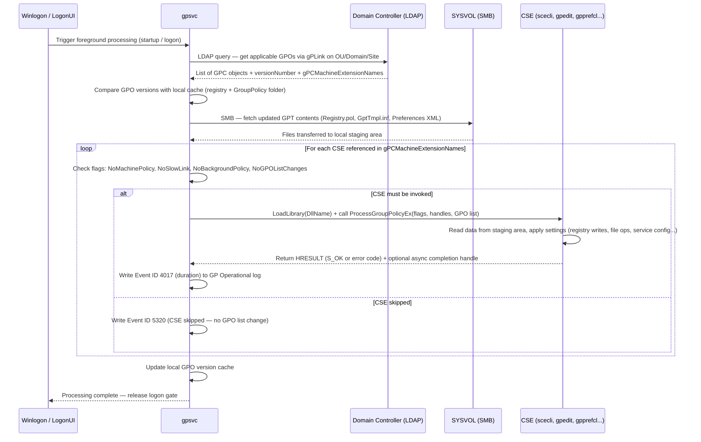

# Client-Side Extensions (CSE) en profondeur

!!! abstract "Ce que couvre ce chapitre"
    - Ce qu'est une CSE et pourquoi elle est l'unite atomique d'application des GPO
    - La structure complete d'une entree CSE dans le registre (`GPExtensions\{GUID}`) et la semantique de chaque valeur
    - Le tableau de reference des 18 CSE integrees avec leur DLL, leur GUID et leur contexte d'execution
    - Le cycle de vie complet : conditions de declenchement, foreground vs background, optimisation `NoGPOListChanges`
    - La meta-CSE `gpprefcl.dll` et ses 21 sous-categories de preferences
    - Les Event IDs operationnels pour diagnostiquer les CSE lentes ou defaillantes
    - Comment enregistrer une CSE personnalisee et les pieges a eviter

---

## :material-puzzle: Qu'est-ce qu'une CSE ?

Le service `gpsvc` (Group Policy Service) est responsable du traitement des strategies de groupe. Il orchestre l'ensemble du processus, mais il n'applique aucun parametre directement.

Pour chaque categorie de parametres — registre, securite, scripts, installation de logiciels, redirection de dossiers — c'est une DLL specialisee qui realise le travail concret. Ces DLL s'appellent des **Client-Side Extensions**, ou CSE.

Une CSE est une DLL Windows enregistree dans le registre qui exporte une ou deux fonctions precises. `gpsvc` la charge en memoire, l'appelle avec les donnees pertinentes, puis la decharge une fois le traitement termine.

Sans les CSE, Group Policy ne serait qu'un mecanisme de distribution de donnees sans aucun effet sur le systeme.

!!! info "Analogie technique"
    `gpsvc` est le scheduler. Les CSE sont les workers. Le registre `GPExtensions` est le registre de service qui indique a `gpsvc` quels workers existent et dans quelles conditions les invoquer.

### :material-key-variant: Le lien entre GPO et CSE

Chaque GPO contient dans son objet AD (le GPC) deux attributs multivalues :

- `gPCMachineExtensionNames` — liste des GUID de CSE qui doivent traiter les parametres machine de cette GPO
- `gPCUserExtensionNames` — liste des GUID de CSE qui doivent traiter les parametres utilisateur

Ces attributs sont ecrits automatiquement par la GPMC ou RSAT quand vous configurez un parametre. Si un attribut est absent ou vide, `gpsvc` n'invoque aucune CSE pour ce contexte, quelle que soit la taille des fichiers dans SYSVOL.

!!! warning "Consequence directe"
    Si vous copiez manuellement des fichiers dans SYSVOL sans mettre a jour `gPCMachineExtensionNames`, les CSE correspondantes ne seront jamais appelees. Les parametres resteront silencieusement inappliques.

!!! quote "En résumé"
    Une CSE est l'unite d'execution de Group Policy. `gpsvc` n'applique rien directement : il consulte le registre `GPExtensions`, determine quelles CSE sont concernees par les GPO en vigueur, et les appelle dans l'ordre. Chaque CSE est responsable d'une categorie de parametres.

---

## :material-registry: Anatomie d'une entree CSE dans le registre

Toutes les CSE enregistrees sur un systeme Windows se trouvent sous :

```
HKLM\SOFTWARE\Microsoft\Windows NT\CurrentVersion\Winlogon\GPExtensions\
```

Chaque sous-cle est nommee avec le GUID de la CSE. Elle contient un ensemble de valeurs qui controlent le comportement de `gpsvc` vis-a-vis de cette extension.

### :material-table: Table des valeurs d'une entree CSE

| Valeur | Type | Description |
|--------|------|-------------|
| `(Default)` | REG_SZ | Nom lisible de la CSE (affiché dans les logs et les outils de diagnostic) |
| `DllName` | REG_EXPAND_SZ | Chemin complet vers la DLL — les variables d'environnement sont acceptees |
| `ProcessGroupPolicy` | REG_SZ | Nom de la fonction exportee principale (ancienne API, pre-Vista) |
| `ProcessGroupPolicyEx` | REG_SZ | Nom de la fonction exportee etendue (API moderne, Windows Vista+, preferee) |
| `NoMachinePolicy` | REG_DWORD | `1` = ne jamais appeler cette CSE dans le contexte machine |
| `NoUserPolicy` | REG_DWORD | `1` = ne jamais appeler cette CSE dans le contexte utilisateur |
| `NoSlowLink` | REG_DWORD | `1` = ne pas appeler sur un lien lent (en dessous de 500 Kbps par defaut) |
| `NoBackgroundPolicy` | REG_DWORD | `1` = ne pas appeler lors du traitement en arriere-plan (refresh periodique) |
| `NoGPOListChanges` | REG_DWORD | `1` = ne pas appeler si la liste des GPO applicables n'a pas change depuis le dernier traitement |
| `EnableAsynchronousProcessing` | REG_DWORD | `1` = cette CSE peut etre appelee de facon asynchrone par rapport au reste du traitement |
| `MaxNoGPOListChangesInterval` | REG_DWORD | Intervalle maximal en minutes avant un appel force, meme si la liste de GPO n'a pas change |

!!! info "ProcessGroupPolicy vs ProcessGroupPolicyEx"
    `ProcessGroupPolicyEx` est l'API introduite avec Windows Vista. Elle ajoute des parametres supplementaires : un handle de jeton de securite, des flags etendus, et un pointeur vers une structure de contexte. Quand les deux sont definis, `gpsvc` utilise systematiquement `ProcessGroupPolicyEx`. L'ancienne API `ProcessGroupPolicy` n'est maintenue que pour la compatibilite avec les CSE tierces pre-Vista.

### :material-powershell: Lister toutes les CSE enregistrees

```powershell title="Lister toutes les CSE avec leur configuration"
$cseKey = "HKLM:\SOFTWARE\Microsoft\Windows NT\CurrentVersion\Winlogon\GPExtensions"
Get-ChildItem $cseKey | ForEach-Object {
    $props = Get-ItemProperty $_.PSPath
    [PSCustomObject]@{
        GUID             = $_.PSChildName
        Name             = $props.'(default)'
        DLL              = $props.DllName
        NoBackground     = $props.NoBackgroundPolicy
        NoSlowLink       = $props.NoSlowLink
        NoGPOListChanges = $props.NoGPOListChanges
        MaxInterval      = $props.MaxNoGPOListChangesInterval
    }
} | Format-Table -AutoSize
```

```text title="Résultat attendu (extrait)"
GUID                                   Name                     DLL                         NoBackground NoSlowLink NoGPOListChanges
----                                   ----                     ---                         ------------ ---------- ----------------
{35378EAC-683F-11D2-A89A-00C04FBBCFA2} Registry                 %SystemRoot%\System32\...            0          0               0
{827D319E-6EAC-11D2-A4EA-00C04F79F83A} Security                 %SystemRoot%\System32\...            1          1               1
{42B5FAAE-6536-11D2-AE5A-0000F87571E3} Scripts                  %SystemRoot%\System32\...            1          1               1
{0E28E245-9368-4853-AD84-6DA3BA35BB75} Group Policy Preferences %SystemRoot%\System32\...            0          0               0
```

!!! warning "Valeur absente vs valeur à 0"
    Une valeur `NoBackgroundPolicy` absente du registre est equivalente a `0` (la CSE peut etre appelee en arriere-plan). Ne confondez pas absence et desactivation. Verifiez toujours avec `Get-ItemProperty` plutot qu'avec un simple `reg query`.

!!! quote "En résumé"
    Chaque CSE est definie par une sous-cle GUID sous `GPExtensions`. Les valeurs `NoBackgroundPolicy`, `NoSlowLink` et `NoGPOListChanges` sont les trois leviers qui controlent dans quelles conditions `gpsvc` invoquera ou sautera la CSE. La connaitre, c'est comprendre pourquoi un parametre s'applique — ou ne s'applique pas.

---

## :material-table-large: Table de reference : les 18 CSE principales

Les CSE suivantes sont presentes sur tout systeme Windows joint a un domaine. Les colonnes Machine et User indiquent si la CSE peut etre invoquee dans le contexte machine (au demarrage) et/ou dans le contexte utilisateur (a l'ouverture de session).

| GUID | DLL | Nom | Machine | User |
|------|-----|-----|:-------:|:----:|
| `{00000000-0000-0000-0000-000000000000}` | `scecli.dll` | Local Users and Groups (legacy) | Oui | Non |
| `{35378EAC-683F-11D2-A89A-00C04FBBCFA2}` | `gpedit.dll` | Registry (ADMX-based) | Oui | Oui |
| `{42B5FAAE-6536-11D2-AE5A-0000F87571E3}` | `gpscript.dll` | Scripts | Oui | Oui |
| `{827D319E-6EAC-11D2-A4EA-00C04F79F83A}` | `scecli.dll` | Security | Oui | Non |
| `{B1BE8D72-6EAC-11D2-A4EA-00C04F79F83A}` | `fdeploy.dll` | Folder Redirection | Non | Oui |
| `{C6DC5466-785A-11D2-84D0-00C04FB169F7}` | `appmgmts.dll` | Software Installation (Machine) | Oui | Non |
| `{3610EDA5-77EF-11D2-8DC5-00C04FA31A66}` | `appmgmts.dll` | Software Installation (User) | Non | Oui |
| `{0F6B957E-509E-11D1-A7CC-0000F87571E3}` | `gptext.dll` | Wireless Policy | Oui | Non |
| `{0F6B957D-509E-11D1-A7CC-0000F87571E3}` | `gptext.dll` | EFS Recovery Policy | Oui | Non |
| `{25537523-E2C2-11D2-8DC5-00C04FA31A66}` | `dskquota.dll` | Disk Quota | Oui | Non |
| `{426031c0-0b47-4852-b0ca-ac3d37bfcb39}` | `gptext.dll` | QoS Packet Scheduler | Oui | Non |
| `{4CFB60C1-FAA6-47f1-89AA-0B18730C9FD3}` | `gptext.dll` | Internet Explorer Maintenance | Non | Oui |
| `{A2E30F80-D7DE-11D2-BBDE-00C04F86AE3B}` | `auditcse.dll` | Audit Policy (Basic) | Oui | Non |
| `{FC491EF1-C4AA-4CE1-B329-414B101DB823}` | `auditcse.dll` | Audit Policy (Advanced — SACL) | Oui | Non |
| `{0E28E245-9368-4853-AD84-6DA3BA35BB75}` | `gpprefcl.dll` | Group Policy Preferences | Oui | Oui |
| `{169EBF44-942F-4C43-87CE-13C93996EBBE}` | `gpprefcl.dll` | GP Preferences — Computer | Oui | Non |
| `{AADCED64-746C-4633-A97C-D61349046527}` | `gpprefcl.dll` | GP Preferences — User | Non | Oui |
| `{F3CCC681-B74C-4060-9F26-CD84525DCA2A}` | `fdeploy.dll` | Folder Redirection (legacy) | Non | Oui |

### :material-information: Notes sur les DLL partagees

Plusieurs CSE partagent la meme DLL physique. `scecli.dll` gere a la fois la securite locale et les anciens groupes locaux. `gptext.dll` regroupe les politiques sans fil, EFS, QoS et IE Maintenance. `gpprefcl.dll` est une DLL unique qui contient le moteur de toutes les preferences.

Le partage de DLL n'implique pas de partage d'etat entre CSE. Chaque appel est isole par son GUID et par les donnees passees par `gpsvc`.

!!! warning "auditcse.dll et les deux GUID d'audit"
    Les deux GUID `{A2E30F80...}` et `{FC491EF1...}` correspondent respectivement a l'audit basique (categories globales) et a l'audit avance (sous-categories individuelles). Ils ne sont pas interchangeables. Sur Windows Vista+, c'est systematiquement le GUID avance qui doit etre utilise pour eviter les conflits avec les parametres de securite avances (`auditpol`).

!!! quote "En résumé"
    Les 18 CSE integrees couvrent l'integralite du perimetre fonctionnel des GPO Windows. Memoriser les GUID des CSE les plus frequentes — Registry, Security, Preferences — est utile pour interpreter les attributs `gPCMachineExtensionNames` dans ADSI Edit et les logs operationnels.

---

## :material-sync: Cycle de vie d'une CSE

### :material-play-circle: Conditions de declenchement

`gpsvc` n'invoque une CSE que lorsque **toutes** les conditions suivantes sont reunies simultanement :

1. Au moins une GPO applicable contient le GUID de cette CSE dans `gPCMachineExtensionNames` ou `gPCUserExtensionNames`.
2. Le contexte courant (machine ou utilisateur) est compatible avec les flags `NoMachinePolicy` / `NoUserPolicy`.
3. La vitesse de lien est suffisante, ou `NoSlowLink` est a `0`.
4. Le mode de traitement (foreground ou background) est compatible avec `NoBackgroundPolicy`.
5. La liste de GPO a change depuis le dernier traitement, ou `NoGPOListChanges` est a `0`, ou `MaxNoGPOListChangesInterval` est echu.

Si l'une de ces conditions n'est pas remplie, la CSE est ignoree silencieusement pour ce cycle. Aucune erreur n'est journalisee — c'est un comportement intentionnel, pas une defaillance.

### :material-layers: Foreground vs Background

**Le traitement foreground** se produit a deux moments precis :

- Demarrage de la machine (contexte machine — Computer Policy)
- Ouverture de session utilisateur (contexte utilisateur — User Policy)

Le foreground est synchrone par defaut. Le bureau Windows n'apparait pas tant que les CSE foreground n'ont pas termine leur traitement (sauf si le traitement asynchrone est active).

**Le traitement background** se produit periodiquement, en tache de fond. L'intervalle par defaut est de 90 minutes, avec une variation aleatoire de ±30 minutes pour eviter les pics de charge sur les controleurs de domaine.

Plusieurs CSE critiques ne s'executent pas en background :

| CSE | `NoBackgroundPolicy` | Comportement en arriere-plan |
|-----|:--------------------:|------------------------------|
| Registry (ADMX) | `0` | S'execute a chaque refresh background |
| Group Policy Preferences | `0` | S'execute a chaque refresh background |
| Security (`scecli.dll`) | `1` | Foreground uniquement |
| Scripts (`gpscript.dll`) | `1` | Foreground uniquement |
| Folder Redirection | `1` | Foreground uniquement |
| Software Installation | `1` | Foreground uniquement |
| Audit Policy | `1` | Foreground uniquement |

!!! warning "Consequence pour les tests en production"
    Modifier une GPO de securite ou de redirection de dossiers ne prend effet qu'au prochain demarrage machine ou ouverture de session. Un `gpupdate /force` en session active applique uniquement les CSE avec `NoBackgroundPolicy = 0`. Pour les autres, seul un `gpupdate /force /boot` ou un `gpupdate /force /logoff` declenche un vrai foreground.

### :material-skip-next: `NoGPOListChanges` : l'optimisation cle

`NoGPOListChanges = 1` indique a `gpsvc` de sauter completement la CSE si la liste des GPO applicables est identique a celle du dernier cycle de traitement.

C'est l'optimisation de performance la plus impactante du mecanisme Group Policy. Sur la majorite des machines en production, la liste de GPO ne change pas entre deux refreshes. Avec `NoGPOListChanges = 1`, la CSE n'est meme pas chargee en memoire.

`MaxNoGPOListChangesInterval` est la soupape de securite. Cette valeur, exprimee en minutes, force un appel periodique meme sans changement de liste. La CSE Security l'utilise pour garantir une reapplication reguliere des parametres de securite, typiquement toutes les 16 heures.

```powershell title="Vérifier MaxNoGPOListChangesInterval pour la CSE Security"
$securityCSE = "{827D319E-6EAC-11D2-A4EA-00C04F79F83A}"
$keyPath = "HKLM:\SOFTWARE\Microsoft\Windows NT\CurrentVersion\Winlogon\GPExtensions\$securityCSE"
Get-ItemProperty $keyPath | Select-Object NoGPOListChanges, MaxNoGPOListChangesInterval
```

```text title="Résultat attendu"
NoGPOListChanges MaxNoGPOListChangesInterval
---------------- --------------------------
               1                        960
```

!!! info "960 minutes = 16 heures"
    La valeur `960` signifie que meme si la liste de GPO n'a pas change, la CSE Security reapplique les parametres de securite au maximum toutes les 16 heures. C'est le mecanisme qui garantit que les parametres de securite ne restent pas indefiniment non appliques sur des machines qui ne redemarrent pas souvent.

!!! quote "En résumé"
    Le cycle de vie d'une CSE est entierement pilote par des conditions cumulatives. Les flags `NoBackgroundPolicy` et `NoGPOListChanges` sont les deux principales causes de "pourquoi mon parametre n'est pas applique apres un gpupdate". Les connaitre elimine la majorite des incidents de premier niveau.

---

## :material-animation-play: Diagramme de sequence : foreground processing

Le diagramme suivant detaille les interactions entre les composants lors d'un traitement foreground machine (au demarrage).



!!! info "La porte de logon"
    En foreground synchrone, `Winlogon` maintient une "porte" fermee qui bloque l'affichage du bureau. `gpsvc` ne relache cette porte qu'une fois toutes les CSE synchrones terminees. C'est pourquoi une CSE lente (Software Installation, Folder Redirection sur un reseau lent) allonge directement le temps de demarrage ou d'ouverture de session.

!!! warning "Traitement asynchrone : attention aux dependances"
    Si `EnableAsynchronousProcessing = 1` est defini sur une CSE, `gpsvc` l'appelle en parallele des autres CSE et relache la porte de logon sans attendre sa completion. C'est performant, mais dangereux si cette CSE doit configurer l'environnement dont une CSE synchrone depend (ex. : mappages de lecteurs avant redirection de dossiers).

!!! quote "En résumé"
    Le foreground processing est une chaine sequentielle et bloquante. Chaque CSE est appelee dans l'ordre des GUID references dans `gPCMachineExtensionNames`. Une defaillance ou un timeout d'une CSE impacte directement l'experience utilisateur. Le diagramme ci-dessus est la carte mentale a avoir pour diagnostiquer n'importe quel probleme de traitement GPO.

---

## :material-puzzle-edit: La meta-CSE des preferences : `gpprefcl.dll`

`gpprefcl.dll` est un cas a part. Elle est enregistree sous trois GUID distincts (le GUID global `{0E28E245...}`, le GUID machine `{169EBF44...}` et le GUID utilisateur `{AADCED64...}`), mais il s'agit d'une seule et meme DLL.

En interne, `gpprefcl.dll` fonctionne comme un **moteur de distribution**. Elle charge les fichiers XML de preferences depuis SYSVOL et dispatche vers 21 sous-modules, chacun responsable d'une categorie.

### :material-server: Categories machine (Computer Configuration)

| Categorie | Chemin SYSVOL relatif |
|-----------|----------------------|
| Registry | `Machine\Preferences\Registry\` |
| Files | `Machine\Preferences\Files\` |
| Folders | `Machine\Preferences\Folders\` |
| Shortcuts | `Machine\Preferences\Shortcuts\` |
| Ini Files | `Machine\Preferences\IniFiles\` |
| Environment | `Machine\Preferences\EnvironmentVariables\` |
| Network Shares | `Machine\Preferences\NetworkShares\` |
| Printers | `Machine\Preferences\Printers\` |
| Services | `Machine\Preferences\Services\` |
| Drive Maps | `Machine\Preferences\Drives\` |
| Local Users and Groups | `Machine\Preferences\Groups\` |
| Scheduled Tasks | `Machine\Preferences\ScheduledTasks\` |
| Power Options | `Machine\Preferences\PowerOptions\` |
| Network Options | `Machine\Preferences\NetworkOptions\` |

### :material-account: Categories utilisateur (User Configuration)

| Categorie | Chemin SYSVOL relatif |
|-----------|----------------------|
| Registry | `User\Preferences\Registry\` |
| Files | `User\Preferences\Files\` |
| Folders | `User\Preferences\Folders\` |
| Shortcuts | `User\Preferences\Shortcuts\` |
| Ini Files | `User\Preferences\IniFiles\` |
| Environment | `User\Preferences\EnvironmentVariables\` |
| Network Shares | `User\Preferences\NetworkShares\` |
| Printers | `User\Preferences\Printers\` |
| Drive Maps | `User\Preferences\Drives\` |
| Internet Settings | `User\Preferences\InternetSettings\` |
| Scheduled Tasks | `User\Preferences\ScheduledTasks\` |
| Start Menu | `User\Preferences\StartMenu\` |

!!! info "Format XML des preferences"
    Chaque fichier de preference est un document XML valide. Le nom du fichier correspond a la categorie (ex. `Registry.xml`, `Drives.xml`). `gpprefcl.dll` parse ces fichiers et applique chaque element selon son attribut `action` : `C` (Create), `R` (Replace), `U` (Update), `D` (Delete) — le modele CRUD de GPP.

### :material-filter: Item-Level Targeting et gpprefcl.dll

`gpprefcl.dll` est la seule CSE native qui gere l'**Item-Level Targeting** (ILT). Pour chaque element XML, elle evalue les filtres ILT (version d'OS, groupe de securite, adresse IP, variable d'environnement, etc.) avant d'appliquer ou de sauter l'element.

Ce mecanisme se passe entierement cote client, dans la DLL. Il n'existe aucun objet AD supplementaire pour l'ILT — les criteres sont stockes inline dans le XML de la preference.

!!! warning "gpprefcl.dll et les droits eleves"
    Les preferences machine s'executent dans le contexte `SYSTEM`. Les preferences utilisateur s'executent dans le contexte de l'utilisateur connecte. Une preference de type "Network Share" en contexte utilisateur ne peut pas creer un partage reseau — elle manque de privileges. Ce type d'erreur se manifeste par un Event ID 4098 dans le log GP Operational.

!!! quote "En résumé"
    `gpprefcl.dll` est la CSE la plus riche de l'ecosysteme GPO. Ses 21 sous-categories couvrent la quasi-totalite de la configuration quotidienne d'un poste Windows. Sa capacite a lire du XML ILT en fait egalement la CSE la plus flexible — et potentiellement la plus lente si les fichiers XML sont volumineux ou si l'ILT evalue des criteres LDAP.

---

## :material-alert-circle: Event IDs operationnels des CSE

Le log `Microsoft-Windows-GroupPolicy/Operational` est la source principale de telemetrie sur le comportement des CSE. Il est disponible dans l'Observateur d'evenements sous **Applications and Services Logs > Microsoft > Windows > GroupPolicy > Operational**.

### :material-table: Table des Event IDs cles

| Event ID | Source / Log | Signification |
|:--------:|-------------|---------------|
| 4016 | GP Operational | Debut du traitement d'une CSE — contient le GUID et le nom |
| 4017 | GP Operational | Fin du traitement d'une CSE — contient la duree en millisecondes |
| 4098 | GP Operational | Erreur lors du traitement d'un element de preference (avec code d'erreur) |
| 5016 | GP Operational | Debut du traitement foreground complet |
| 5017 | GP Operational | Fin du traitement foreground complet — duree totale |
| 5320 | GP Operational | CSE ignoree — la liste de GPO n'a pas change (`NoGPOListChanges`) |
| 7016 | System | Erreur critique lors du traitement d'une CSE (avec HRESULT) |
| 7017 | System | Succes du traitement d'une CSE dans le log System |
| 7320 | System | Le traitement de la strategie de groupe a depasse le delai imparti |

!!! info "Event 4016 / 4017 : la paire de mesure"
    Chaque CSE invoquee genere un Event 4016 au debut et un Event 4017 a la fin. La duree en millisecondes dans l'Event 4017 est la mesure la plus precise disponible pour identifier les CSE qui ralentissent le demarrage ou l'ouverture de session.

### :material-powershell: Identifier les CSE les plus lentes

```powershell title="Top 10 des CSE par durée de traitement"
Get-WinEvent -LogName "Microsoft-Windows-GroupPolicy/Operational" |
    Where-Object { $_.Id -eq 4017 } |
    ForEach-Object {
        # Parse extension name and duration from message
        if ($_.Message -match "Extension (.+?) took (\d+) milliseconds") {
            [PSCustomObject]@{
                TimeCreated = $_.TimeCreated
                Extension   = $Matches[1]
                Ms          = [int]$Matches[2]
            }
        }
    } |
    Sort-Object Ms -Descending |
    Select-Object -First 10 |
    Format-Table -AutoSize
```

```text title="Résultat attendu"
TimeCreated           Extension                         Ms
-----------           ---------                         --
2026-04-05 08:12:34   Group Policy Preferences          4823
2026-04-05 08:12:30   Security                          1204
2026-04-05 08:12:28   Registry                           312
2026-04-05 08:12:27   Scripts                             89
```

### :material-powershell: Detecter les erreurs de CSE

```powershell title="CSE en erreur sur les dernières 24 heures"
$since = (Get-Date).AddHours(-24)
Get-WinEvent -LogName "Microsoft-Windows-GroupPolicy/Operational" -ErrorAction SilentlyContinue |
    Where-Object { $_.Id -eq 4098 -and $_.TimeCreated -gt $since } |
    Select-Object TimeCreated, Message |
    Format-List
```

```text title="Résultat attendu (exemple d'erreur GPP)"
TimeCreated : 2026-04-05 07:45:12
Message     : The user 'Drive Maps' preference item in the 'MyGPO {GUID}' Group Policy
              object did not apply because it failed with error code '0x80070005 : Access is denied.'
              This error was suppressed.
```

!!! warning "Erreurs supprimees dans le log"
    Par defaut, les erreurs de traitement des preferences (`gpprefcl.dll`) sont journalisees mais n'interrompent pas le traitement des autres elements. Le message "This error was suppressed" signifie que la CSE a continue apres l'echec. Ce comportement est configurable via la GPO **Computer Configuration > Administrative Templates > System > Group Policy > Configure registry policy processing**.

!!! quote "En résumé"
    Le log GP Operational est l'outil de diagnostic numero un pour les CSE. Les Event IDs 4016/4017 permettent de mesurer avec precision le temps de traitement de chaque extension. L'Event 5320 confirme qu'une CSE a ete skippee intentionnellement. L'Event 7016 signale une defaillance qui peut necessite un correctif ou une intervention.

---

## :material-code-braces: Creer une CSE personnalisee

### :material-checkbox-multiple-marked: Prerequis techniques

Une CSE personnalisee est une DLL Windows classique qui doit satisfaire trois contraintes :

1. **Exporter la fonction** `ProcessGroupPolicyEx` (signature definie dans `userenv.h` du SDK Windows).
2. **Etre enregistree** sous `HKLM\...\GPExtensions\{VOTRE-GUID}` avec au minimum `DllName` et `ProcessGroupPolicyEx`.
3. **Avoir un ADMX correspondant** dont les parametres pointent vers la cle de registre que la CSE lira.

!!! info "Langage requis"
    `ProcessGroupPolicyEx` est une fonction C/C++ exportee selon la convention `__stdcall`. Elle ne peut pas etre implementee directement en C# ou PowerShell. Un wrapper natif en C++ est obligatoire. Des projets open-source (ex. `GPCSEWrapper`) existent pour faciliter cette couche.

### :material-powershell: Enregistrement d'une CSE personnalisee

```powershell title="Enregistrer une CSE custom dans le registre"
# Replace {YOUR-CSE-GUID} with a newly generated GUID (use New-Guid)
$guid    = "{$(New-Guid).ToString().ToUpper()}"
$keyPath = "HKLM:\SOFTWARE\Microsoft\Windows NT\CurrentVersion\Winlogon\GPExtensions\$guid"

# Create the key
New-Item -Path $keyPath -Force | Out-Null

# Required: readable name and DLL path
Set-ItemProperty $keyPath -Name "(Default)"             -Value "My Custom CSE"
Set-ItemProperty $keyPath -Name "DllName"               -Value "%SystemRoot%\System32\MyCustomCSE.dll"
Set-ItemProperty $keyPath -Name "ProcessGroupPolicyEx"  -Value "ProcessGroupPolicyEx"

# Context flags — this CSE applies machine settings only
Set-ItemProperty $keyPath -Name "NoUserPolicy"          -Value 1   -Type DWord

# Behavior flags — run in background, skip if GPO list unchanged
Set-ItemProperty $keyPath -Name "NoBackgroundPolicy"    -Value 0   -Type DWord
Set-ItemProperty $keyPath -Name "NoGPOListChanges"      -Value 1   -Type DWord
Set-ItemProperty $keyPath -Name "NoSlowLink"            -Value 1   -Type DWord

Write-Host "CSE registered with GUID: $guid"
```

```text title="Résultat attendu"
CSE registered with GUID: {A1B2C3D4-E5F6-7890-ABCD-EF1234567890}
```

### :material-alert: Pieges courants lors du developpement

**Piege 1 : GUID en collision.** Generer un GUID avec `New-Guid` ou `uuidgen.exe`. Ne jamais reutiliser un GUID existant — cela remplacerait silencieusement une CSE systeme.

**Piege 2 : DLL non signee.** Sur Windows avec Secure Boot et WDAC actives, une DLL non signee dans `System32` sera bloquee au chargement. Prevoir la signature de code des le debut du projet.

**Piege 3 : Timeout de traitement.** `gpsvc` alloue un timeout par CSE (configurable, 600 secondes par defaut). Une CSE qui depasse ce delai est tuee et l'Event 7320 est emis. Les operations reseau longues doivent etre asynchrones.

**Piege 4 : `gPCMachineExtensionNames` non mis a jour.** Si l'ADMX ne cree pas de parametres qui referencent le GUID de la CSE, `gpsvc` ne l'invoquera jamais. L'attribut AD doit contenir le GUID, sinon la CSE reste inerte meme si elle est correctement enregistree.

!!! warning "Distribution de la DLL"
    La DLL doit etre deployee sur chaque machine cliente avant que la CSE ne soit referencee dans une GPO. L'ordre operationnel est : deployer la DLL (via SCCM/Intune/script), enregistrer la CSE (via GPO ou script), puis activer les parametres ADMX. L'inverser provoque des Event 7016 sur toutes les machines sans la DLL.

!!! quote "En résumé"
    Creer une CSE personnalisee est un projet de developpement natif, pas une configuration. La partie registro-graphique est simple ; la contrainte est la DLL C++. Pour 90 % des besoins de personnalisation, les Preferences GPP avec ILT ou un script PowerShell en CSE de scripts couvrent le besoin sans necessiter de code natif.

---

## :material-book-open-variant: Diagnostiquer une CSE defaillante : methodologie

### :material-numeric-1-circle: Verifier que le GUID est bien dans `gPCMachineExtensionNames`

Si une CSE ne s'execute pas, la premiere verification est l'attribut AD de la GPO.

```powershell title="Lire gPCMachineExtensionNames d'une GPO"
# Requires ActiveDirectory module or ADSI
$gpoGuid = "{GPO-GUID-HERE}"
$gpc = [ADSI]"LDAP://CN={$gpoGuid},CN=Policies,CN=System,DC=domain,DC=com"
$gpc.Properties["gPCMachineExtensionNames"].Value
```

```text title="Résultat attendu (exemple)"
[{35378EAC-683F-11D2-A89A-00C04FBBCFA2}{D02B1F72-3407-48AE-BA88-E8213C6761F1}]
[{827D319E-6EAC-11D2-A4EA-00C04F79F83A}{803E14A0-B4FB-11D0-A0D0-00A0C90F574B}]
```

Chaque paire `[{CSE-GUID}{Tool-GUID}]` indique qu'une CSE et l'outil de gestion correspondant sont actifs pour cette GPO.

### :material-numeric-2-circle: Verifier les flags de la CSE locale

```powershell title="Inspecter les flags d'une CSE specifique"
$cseGuid = "{827D319E-6EAC-11D2-A4EA-00C04F79F83A}"   # Security CSE
$keyPath = "HKLM:\SOFTWARE\Microsoft\Windows NT\CurrentVersion\Winlogon\GPExtensions\$cseGuid"
Get-ItemProperty $keyPath |
    Select-Object '(default)', DllName, NoBackgroundPolicy, NoSlowLink, NoGPOListChanges, MaxNoGPOListChangesInterval
```

### :material-numeric-3-circle: Lire le log GP Operational en temps reel

```powershell title="Surveiller les événements CSE en temps réel"
# Monitor GP Operational log for CSE events (4016, 4017, 7016)
Get-WinEvent -LogName "Microsoft-Windows-GroupPolicy/Operational" -MaxEvents 50 |
    Where-Object { $_.Id -in @(4016, 4017, 5320, 7016, 7017) } |
    Select-Object TimeCreated, Id, Message |
    Format-List
```

### :material-numeric-4-circle: Forcer un traitement foreground et capturer les logs

```powershell title="Forcer gpupdate et capturer les événements CSE"
# Clear the GP Operational log first (requires admin)
wevtutil cl "Microsoft-Windows-GroupPolicy/Operational"

# Force a full foreground-equivalent refresh (note: truly forces foreground on next reboot/logon)
gpupdate /force

# Capture all CSE events from this run
Start-Sleep -Seconds 10
Get-WinEvent -LogName "Microsoft-Windows-GroupPolicy/Operational" |
    Where-Object { $_.Id -in @(4016, 4017, 4098, 5016, 5017, 5320, 7016) } |
    Sort-Object TimeCreated |
    Select-Object TimeCreated, Id, @{N="Msg";E={$_.Message.Substring(0,[Math]::Min(200,$_.Message.Length))}} |
    Format-Table -Wrap
```

!!! info "gpupdate /force et NoBackgroundPolicy"
    `gpupdate /force` simule un traitement background force. Il ignore le cache de version GPO (`/force`) mais respecte toujours `NoBackgroundPolicy`. Les CSE avec `NoBackgroundPolicy = 1` ne seront pas appelees meme avec `/force`. Seul un redemarrage ou une deconnexion/reconnexion declenche un veritable foreground.

!!! quote "En résumé"
    La methodologie de diagnostic suit quatre etapes : verifier l'attribut AD, inspecter les flags locaux, lire le log operationnel, puis forcer un cycle et capturer. Dans plus de 80 % des cas, la cause est soit un GUID absent de `gPCMachineExtensionNames`, soit un flag `NoBackgroundPolicy = 1` sur une CSE qu'on espere voir s'executer lors d'un `gpupdate`.

---

## :material-database: La CSE Registry en detail : `gpedit.dll`

La CSE Registry (`{35378EAC-683F-11D2-A89A-00C04FBBCFA2}`) est la plus frequemment invoquee. Elle est responsable de l'application de tous les parametres ADMX — c'est-a-dire la quasi-totalite des parametres visibles dans l'editeur de GPO sous **Administrative Templates**.

### :material-file-code: Le fichier `Registry.pol`

Les parametres ADMX d'une GPO sont serialises dans un fichier binaire appele `Registry.pol`. Il existe deux instances par GPO :

- `{GUID}\Machine\Registry.pol` — parametres machine
- `{GUID}\User\Registry.pol` — parametres utilisateur

`gpedit.dll` lit ce fichier depuis le cache local (apres synchronisation depuis SYSVOL par `gpsvc`) et applique chaque entree en ecrivant directement dans le registre.

### :material-format-list-bulleted: Structure d'une entree `Registry.pol`

Le format binaire `Registry.pol` est documente publiquement. Chaque entree contient :

| Champ | Description |
|-------|-------------|
| Cle de registre | Chemin complet (ex. `Software\Policies\Microsoft\Windows\...`) |
| Nom de valeur | Nom de la valeur de registre cible |
| Type | Type REG_* (DWORD, SZ, EXPAND_SZ, MULTI_SZ, BINARY) |
| Taille | Taille des donnees en octets |
| Donnees | Valeur a ecrire |

!!! info "Lire un fichier Registry.pol avec PowerShell"
    Le module LGPO de Microsoft (disponible dans les Microsoft Security Compliance Toolkit) inclut `Parse-PolFile` pour lire les fichiers `.pol` en texte lisible. C'est l'outil de reference pour auditer le contenu d'une GPO sans ouvrir la GPMC.

    ```powershell title="Lire un Registry.pol avec LGPO Parse-PolFile"
    # Requires LGPO.exe from Microsoft Security Compliance Toolkit
    # Download: https://www.microsoft.com/en-us/download/details.aspx?id=55319
    & .\LGPO.exe /parse /m "\\domain\SYSVOL\domain\Policies\{GUID}\Machine\Registry.pol"
    ```

    ```text title="Résultat attendu (extrait)"
    Computer
    Software\Policies\Microsoft\Windows\WindowsUpdate
    WUServer
    SZ:http://wsus.corp.example.com:8530

    Computer
    Software\Policies\Microsoft\Windows\WindowsUpdate
    WUStatusServer
    SZ:http://wsus.corp.example.com:8530
    ```

### :material-delete: Tatouage de registre : le probleme des valeurs orphelines

Quand un parametre ADMX est defini dans une GPO puis supprime (passe a "Not Configured"), la valeur de registre correspondante devrait etre effacee. Mais ce n'est pas toujours le cas.

Deux mecanismes coexistent :

**1. Les cles `Software\Policies\` (managed)** : `gpedit.dll` nettoie automatiquement ces valeurs quand la GPO ne les definit plus. Toute la plage `HKCU\Software\Policies\` et `HKLM\Software\Policies\` est geree proprement.

**2. Les cles hors `Policies\` (tatouage)** : Certains anciens ADMX ecrivent directement dans `HKCU\Software\Microsoft\...` ou `HKLM\Software\Microsoft\...`, hors de l'espace `Policies`. Ces valeurs **ne sont pas automatiquement supprimees** quand la GPO est retiree. Elles "tatouent" le registre de facon permanente jusqu'a une intervention manuelle.

!!! warning "Identifier les ADMX qui tatouent le registre"
    Dans les fichiers `.admx`, les parametres ecrits dans des cles hors de `Software\Policies\` ou `Software\Microsoft\Windows\CurrentVersion\Policies\` sont les candidats au tatouage. Toujours verifier l'attribut `key=` dans l'ADMX avant de deployer un parametre sur un grand parc — un retrait de GPO ne suffit pas a annuler l'effet si la cle est en dehors de l'espace `Policies`.

### :material-powershell: Comparer le contenu de `Registry.pol` et l'etat reel du registre

```powershell title="Vérifier si Registry.pol est appliqué dans le registre"
# Example: check if a known ADMX key is written in registry
# This checks WSUS server configuration from Windows Update ADMX
$policyKey = "HKLM:\Software\Policies\Microsoft\Windows\WindowsUpdate"
if (Test-Path $policyKey) {
    Get-ItemProperty $policyKey |
        Select-Object WUServer, WUStatusServer, UseWUServer, DisableWindowsUpdateAccess
} else {
    Write-Host "Key not found — Registry CSE has not written this policy, or GPO is not linked"
}
```

```text title="Résultat attendu (WSUS configuré par GPO)"
WUServer                   : http://wsus.corp.example.com:8530
WUStatusServer             : http://wsus.corp.example.com:8530
UseWUServer                : 1
DisableWindowsUpdateAccess : 0
```

### :material-clock-fast: Performance de la CSE Registry

La CSE Registry (`gpedit.dll`) est la plus rapide des CSE integrees dans la plupart des environnements. Un `Registry.pol` typique de quelques dizaines de parametres est traite en moins de 100 ms.

Les cas de lenteur sont rares mais identifiables :

- **`Registry.pol` volumineux** : Une GPO avec plusieurs centaines de parametres ADMX (ex. baselines CIS) peut generer un fichier `.pol` de plusieurs centaines de Ko. L'impact reste generalement inferieur a 500 ms.
- **Contention SYSVOL** : Si la synchronisation DFS-R est en retard et que le `.pol` n'est pas encore dans le cache local, `gpsvc` doit le telecharger depuis SYSVOL via SMB. La latence reseau s'additionne.
- **ADMX personnalises avec de nombreuses valeurs** : Les ADMX d'editeurs tiers (VMware, Citrix, Chrome) peuvent introduire des centaines de valeurs supplementaires.

!!! info "La CSE Registry s'execute en background"
    Contrairement a Security ou Scripts, `gpedit.dll` a `NoBackgroundPolicy = 0`. Elle s'execute a chaque refresh de 90 minutes. C'est ce qui permet aux parametres ADMX d'etre mis a jour sans redemarrage — un comportement souvent attendu mais rarement explicitement configure.

!!! quote "En résumé"
    La CSE Registry est le cheval de bataille quotidien de Group Policy. Elle est rapide, fiable, et s'execute en background. Ses deux points de vigilance sont le tatouage de registre (cles hors `Policies\`) et la taille du fichier `Registry.pol` sur les GPO de type baseline avec de nombreux parametres ADMX.

---

## :material-speedometer: Detection du lien lent et impact sur les CSE

### :material-wifi-strength-1: Comment `gpsvc` mesure la vitesse du lien

Avant d'invoquer les CSE, `gpsvc` realise une mesure de la vitesse de connexion reseau vers le controleur de domaine. Cette mesure conditionne le comportement de toutes les CSE avec `NoSlowLink = 1`.

Le mecanisme utilise `DsGetSiteName` et `NetGetDCName` pour identifier le DC cible, puis effectue un transfert de donnees de test pour estimer la bande passante disponible.

Le seuil par defaut est de **500 Kbps**. En dessous de ce seuil, `gpsvc` considere que le lien est lent et applique les restrictions `NoSlowLink`.

### :material-table: Seuils et comportements selon la vitesse

| Condition | Seuil | Consequence pour les CSE avec NoSlowLink = 1 |
|-----------|:-----:|----------------------------------------------|
| Lien rapide | >= 500 Kbps | Toutes les CSE eligibles sont appelees |
| Lien lent | < 500 Kbps | Les CSE avec `NoSlowLink = 1` sont sautees |
| Pas de connectivite | N/A | Traitement depuis le cache local uniquement |

!!! info "Modifier le seuil de lien lent"
    Le seuil de 500 Kbps est configurable via la GPO **Computer Configuration > Administrative Templates > System > Group Policy > Configure Group Policy slow link detection**. Sur des environnements WAN avec des liens de 1 Mbps mais avec une forte latence, il peut etre pertinent d'ajuster ce seuil.

### :material-alert: Lien lent et Security CSE

La CSE Security a `NoSlowLink = 1`. Sur un lien lent, les parametres de securite ne sont pas reappliques. Pour les environnements avec des clients mobiles ou des sites distants avec des liaisons ADSL de secours, c'est un point d'attention critique.

```powershell title="Vérifier la détection de lien lent dans les logs"
# Event ID 5314 = slow link detected, 5315 = fast link
Get-WinEvent -LogName "Microsoft-Windows-GroupPolicy/Operational" |
    Where-Object { $_.Id -in @(5314, 5315) } |
    Select-Object TimeCreated, Id,
        @{N="Speed"; E={ if ($_.Id -eq 5314) { "Slow link detected" } else { "Fast link detected" } }},
        Message |
    Format-Table -AutoSize
```

```text title="Résultat attendu"
TimeCreated           Id    Speed
-----------           --    -----
2026-04-05 08:10:22   5315  Fast link detected
2026-04-05 07:55:11   5314  Slow link detected
```

!!! warning "VPN split-tunnel et faux lien lent"
    Sur un VPN en split-tunnel, le trafic AD peut passer par un tunnel avec une bande passante mesuree inferieure a 500 Kbps, meme si la connexion internet sous-jacente est rapide. `gpsvc` detectera un "lien lent" et sautera les CSE Security et Scripts. C'est un probleme connu avec GlobalProtect et certaines configurations Cisco AnyConnect. La solution est d'augmenter le seuil ou de forcer le routing AD hors du tunnel.

!!! quote "En résumé"
    La detection de lien lent est un mecanisme de protection contre la degradation de l'experience utilisateur sur des connexions de mauvaise qualite. Son effet de bord principal est le saut des CSE critiques (Security, Scripts) sur les clients distants ou VPN. La supervision des Event IDs 5314/5315 dans les logs operationnels permet de detecter les machines concernees.

---

## :material-sort-numeric-ascending: Ordre d'execution des CSE

### :material-information: L'ordre n'est pas alphabetique

`gpsvc` n'execute pas les CSE dans un ordre alphabetique ou arbitraire. L'ordre est determine par la sequence des GUID dans l'attribut `gPCMachineExtensionNames` de chaque GPO.

En pratique, les GUID dans cet attribut sont tries par ordre lexicographique. Les accolades et les tirets etant inclus dans la comparaison, l'ordre resultant peut paraitre non intuitif.

### :material-swap-horizontal: Dependances entre CSE

Certaines CSE ont des dependances implicites sur d'autres. L'architecture n'impose pas de mecanisme de dependance formel, mais l'ordre d'execution de fait respecte generalement ces besoins :

| CSE dependante | Depend de | Raison |
|----------------|-----------|--------|
| Folder Redirection | Registry (ADMX) | Les chemins de redirection peuvent referencer des variables d'env definies par Registry |
| Scripts (Logon) | Drive Maps (Preferences) | Les scripts de logon peuvent acceder a des lecteurs mappe par les Preferences |
| Software Installation | Security | Les politiques de restriction logicielle doivent etre en place avant l'installation |

!!! warning "Dependance non garantie"
    L'ordre d'execution reel depend de l'ordre des GUID dans `gPCMachineExtensionNames`, qui est determine par la GPMC lors de l'ecriture. Microsoft ne garantit pas un ordre specifique entre CSE independantes. Pour les dependances critiques, le seul mecanisme fiable est de separer les parametres dans des GPO differentes avec des priorites d'application distinctes (LSDOU + ordre de liaison).

!!! quote "En résumé"
    L'ordre d'execution des CSE est deterministe mais non configurable directement. Si une dependance entre CSE pose probleme en production, la solution architecturale est de reorganiser les parametres dans des GPO separees dont l'ordre d'application est controle par la priorite de liaison.

---

## :material-shield-lock: La CSE Security en detail : `scecli.dll`

La CSE Security (`{827D319E-6EAC-11D2-A4EA-00C04F79F83A}`) est la plus complexe des CSE integrees. Elle traite le template de securite `GptTmpl.inf` stocke dans SYSVOL.

### :material-file-document: Ce que traite `scecli.dll`

`scecli.dll` applique les categories suivantes depuis `GptTmpl.inf` :

| Categorie | Description |
|-----------|-------------|
| Account Policies | Politiques de mot de passe, verrouillage de compte, Kerberos |
| Local Policies | Audit (basique), droits utilisateur (`SeDebugPrivilege`, etc.), options de securite |
| Event Log | Taille et retention des logs d'evenements |
| Restricted Groups | Composition forcee des groupes locaux (`Administrators`, `Remote Desktop Users`) |
| System Services | Etat de demarrage et ACL des services Windows |
| Registry | ACL de cles de registre specifiques |
| File System | ACL de dossiers et fichiers |
| User Rights Assignment | Attribution de privileges systeme |

### :material-refresh: Le mecanisme de reapplication forcee

La CSE Security a une particularite unique dans l'ecosysteme GPO : elle reapplique les parametres periodiquement meme si rien n'a change, grace a `MaxNoGPOListChangesInterval = 960` (16 heures).

Ce mecanisme existe parce que les parametres de securite sont la cible d'attaques locales. Un attaquant qui obtient un acces `SYSTEM` peut modifier les ACL ou les droits utilisateur. La reapplication periodique garantit que les parametres definis par GPO reprennent le dessus.

!!! info "Forcer la reapplication immediate de la securite"
    En dehors de l'intervalle periodique, un admin peut forcer la reapplication avec :
    ```powershell
    # Force security policy reapplication immediately
    gpupdate /force /target:computer
    # Note: NoBackgroundPolicy=1 means this only works at next reboot
    # To truly force Security CSE in current session, use:
    secedit /configure /cfg %windir%\inf\defltbase.inf /db defltbase.sdb /verbose
    ```

### :material-account-group: Restricted Groups : le pieges des groupes imbriques

La categorie Restricted Groups de `scecli.dll` ecrase la composition des groupes locaux a chaque foreground processing. Si un technicien ajoute manuellement un compte dans le groupe `Administrators` local, ce compte sera supprime au prochain redemarrage si la GPO ne le prevoit pas.

```powershell title="Vérifier la configuration Restricted Groups dans une GPO"
# Path to the GPT security template in SYSVOL
$gpoGuid  = "GPO-GUID-HERE"
$domain   = $env:USERDNSDOMAIN.ToLower()
$gptPath  = "\\$domain\SYSVOL\$domain\Policies\{$gpoGuid}\Machine\Microsoft\Windows NT\SecEdit\GptTmpl.inf"

if (Test-Path $gptPath) {
    Get-Content $gptPath | Select-String -Pattern "Restricted Groups|Group Membership" -Context 0,5
} else {
    Write-Host "GptTmpl.inf not found — Security CSE not configured in this GPO"
}
```

!!! warning "Restricted Groups et les comptes de service"
    Si un compte de service doit etre membre d'un groupe local (ex. `Backup Operators`) sur certaines machines uniquement, il ne doit pas etre gere via Restricted Groups dans une GPO de large scope. Utiliser la GPO de Preferences (Local Users and Groups) avec ILT cible, qui utilise le mode `Update` au lieu d'`Overwrite`.

!!! quote "En résumé"
    `scecli.dll` est la CSE avec le plus grand impact sur la posture de securite d'un parc. Sa reapplication periodique est une fonctionnalite de securite, pas un bug. La categorie Restricted Groups est particulierement a surveiller en production : elle peut silencieusement supprimer des membres de groupes locaux ajoutes manuellement ou par d'autres outils de provisioning.

---

## :material-tools: Outils de reference pour travailler avec les CSE

### :material-microsoft: Outils Microsoft integres

**`gpresult`** est le premier outil de diagnostic. Il affiche quelles GPO ont ete appliquees, mais pas le detail par CSE.

```powershell title="Rapport RSoP HTML complet"
# Generate HTML RSoP report for current computer and user
gpresult /H "$env:TEMP\gpreport.html" /F
Start-Process "$env:TEMP\gpreport.html"
```

**`gpupdate`** avec ses options est l'outil de forçage.

| Commande | Effet |
|----------|-------|
| `gpupdate` | Refresh background (respecte `NoBackgroundPolicy`) |
| `gpupdate /force` | Ignore le cache de version, mais reste background |
| `gpupdate /force /boot` | Planifie un foreground machine au prochain redemarrage |
| `gpupdate /force /logoff` | Force une deconnexion pour un foreground utilisateur immediat |
| `gpupdate /target:computer` | Limite au contexte machine uniquement |
| `gpupdate /target:user` | Limite au contexte utilisateur uniquement |

### :material-application: LGPO.exe : l'outil de reference avance

LGPO.exe (Microsoft Security Compliance Toolkit) est l'outil incontournable pour :

- Parser le contenu binaire de `Registry.pol`
- Appliquer des parametres GPO localement sans domaine
- Exporter et importer des configurations de GPO locale
- Comparer l'etat du registre avec les valeurs attendues

```powershell title="Exporter la configuration GPO locale avec LGPO"
# Export current local Group Policy to text format
# Requires LGPO.exe in PATH or current directory
& LGPO.exe /parse /m "$env:SystemRoot\System32\GroupPolicy\Machine\Registry.pol" > machine_policy.txt
& LGPO.exe /parse /u "$env:SystemRoot\System32\GroupPolicy\User\Registry.pol"   > user_policy.txt
Write-Host "Export complete: machine_policy.txt and user_policy.txt"
```

### :material-microsoft-windows: GPO Diagnostic avec PowerShell natif

```powershell title="Rapport complet CSE : GUID, DLL, flags, dernière exécution"
$cseKey = "HKLM:\SOFTWARE\Microsoft\Windows NT\CurrentVersion\Winlogon\GPExtensions"

# Get CSE registry configuration
$cseConfig = Get-ChildItem $cseKey | ForEach-Object {
    $props = Get-ItemProperty $_.PSPath -ErrorAction SilentlyContinue
    [PSCustomObject]@{
        GUID           = $_.PSChildName
        Name           = $props.'(default)'
        DLL            = $props.DllName
        NoBackground   = [bool]$props.NoBackgroundPolicy
        NoSlowLink     = [bool]$props.NoSlowLink
        NoGPOChanges   = [bool]$props.NoGPOListChanges
        MaxInterval_h  = if ($props.MaxNoGPOListChangesInterval) { [math]::Round($props.MaxNoGPOListChangesInterval / 60, 1) } else { $null }
    }
}

# Cross-reference with last execution times from event log
$cseTimings = Get-WinEvent -LogName "Microsoft-Windows-GroupPolicy/Operational" -ErrorAction SilentlyContinue |
    Where-Object { $_.Id -eq 4017 } |
    ForEach-Object {
        if ($_.Message -match "Extension (.+?) took (\d+) milliseconds") {
            [PSCustomObject]@{ Name = $Matches[1]; LastMs = [int]$Matches[2]; LastRun = $_.TimeCreated }
        }
    } | Sort-Object LastRun -Descending | Group-Object Name | ForEach-Object { $_.Group[0] }

# Merge and display
$cseConfig | ForEach-Object {
    $timing = $cseTimings | Where-Object { $_.Name -like "*$($_.Name)*" } | Select-Object -First 1
    $_ | Add-Member -NotePropertyName LastRun -NotePropertyValue $timing.LastRun -PassThru |
         Add-Member -NotePropertyName LastMs  -NotePropertyValue $timing.LastMs  -PassThru
} | Sort-Object LastMs -Descending | Format-Table GUID, Name, NoBackground, NoSlowLink, LastRun, LastMs -AutoSize
```

```text title="Résultat attendu (extrait)"
GUID                                   Name                     NoBackground NoSlowLink LastRun                LastMs
----                                   ----                     ------------ ---------- -------                ------
{0E28E245-9368-4853-AD84-6DA3BA35BB75} Group Policy Preferences        False      False 2026-04-05 08:12:34      4823
{827D319E-6EAC-11D2-A4EA-00C04F79F83A} Security                         True       True 2026-04-05 08:01:12      1204
{35378EAC-683F-11D2-A89A-00C04FBBCFA2} Registry                        False      False 2026-04-05 08:12:28       312
```

!!! quote "En résumé"
    `gpresult /H` donne la vue GPO. Le log GP Operational avec les Event IDs 4016/4017 donne la vue CSE. LGPO.exe donne la vue fichier (`Registry.pol`). La maitrise de ces trois outils couvre l'integralite des scenarios de diagnostic liee aux CSE en production.

---

## :material-link-variant: Cross-references

| Sujet connexe | Reference |
|---------------|-----------|
| Attributs GPC et `gPCMachineExtensionNames` | Ch. 02 — Architecture et composants |
| Cycle de traitement complet et timeouts | Ch. 07 — Traitement des strategies |
| Preferences GPP et Item-Level Targeting | Ch. 11 — Preferences GPP |
| Performances et CSE lentes | Ch. 23 — Performances |
| Contexte registre des CSE (`GPExtensions`) | La Bible du Registre — Ch. 20 |
| Slow link detection et seuils | Ch. 07 — Traitement des strategies |
| Restricted Groups vs GPP Local Users | Ch. 13 — Securite : strategies avancees |
| Tatouage de registre et ADMX legacy | Ch. 05 — ADMX et ADML |
| `Registry.pol` : format et outils | Ch. 06 — Registry.pol en detail |
