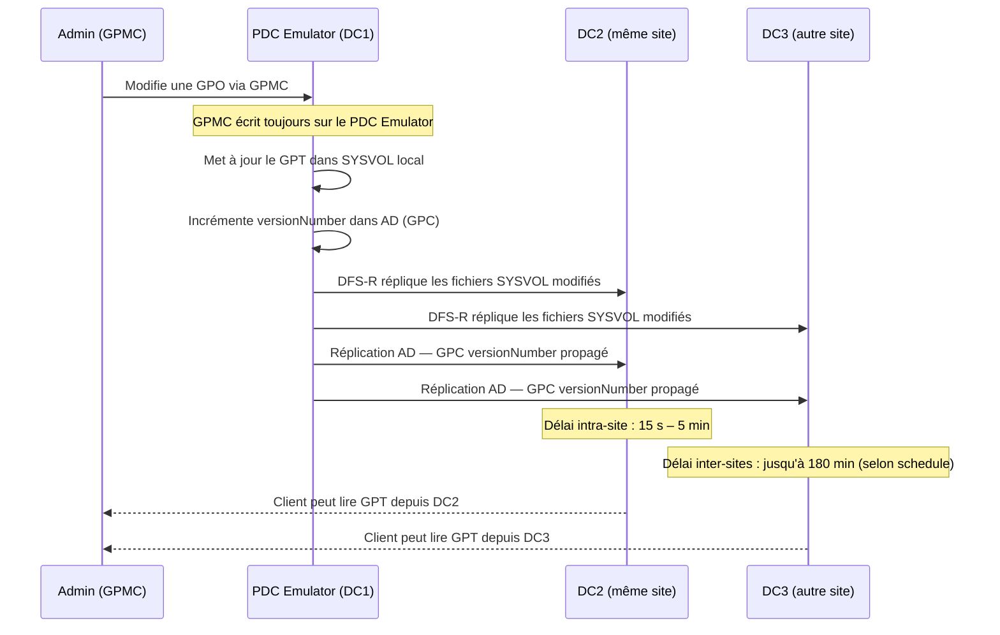
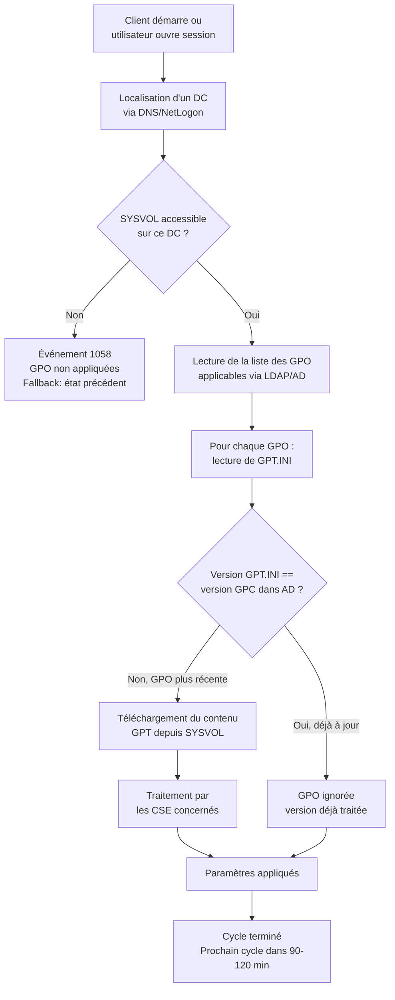

# SYSVOL : réplication et structure

!!! abstract "Ce que couvre ce chapitre"
    - Structure physique complète du répertoire SYSVOL et rôle de chaque sous-dossier
    - Encodage 32 bits du fichier `GPT.INI` et son rôle de marqueur de synchronisation GPC/GPT
    - Différences techniques entre FRS (déprécié) et DFS-R, et procédure de migration par états
    - Commandes de diagnostic de santé SYSVOL : backlog, accessibilité, intégrité des GPT
    - Permissions NTFS minimales requises sur le dossier `Policies` et impact en production
    - Détection des GPT orphelins (dossiers SYSVOL sans objet AD correspondant)
    - IDs d'événements Windows critiques pour la surveillance de la réplication SYSVOL

---

## :material-folder-network: Structure physique de SYSVOL

### Le partage SYSVOL

SYSVOL est un dossier partagé répliqué présent sur **tous les contrôleurs de domaine**.

Il est exposé sous deux partages UNC distincts :

- `\\<domaine>\SYSVOL` — accès complet à l'arborescence SYSVOL
- `\\<domaine>\NETLOGON` — raccourci vers le sous-dossier `scripts\`, utilisé pour les scripts d'ouverture de session

Le chemin physique sur le DC est `%SystemRoot%\SYSVOL\`. Ce chemin est configurable lors de la promotion du DC, mais il est rarement modifié en production.

!!! info "Junction point"
    Le dossier `%SystemRoot%\SYSVOL\domain\` n'est pas un vrai dossier. C'est un **point de jonction NTFS** qui pointe vers `%SystemRoot%\SYSVOL\sysvol\<domaine>\`. Ce mécanisme permet à `\\<domaine>\SYSVOL` de fonctionner sans connaître le nom de domaine en dur dans le chemin UNC.

---

### Arborescence complète

L'arborescence ci-dessous représente un déploiement standard avec un domaine `contoso.local` :

```
%SystemRoot%\SYSVOL\
├── domain\                          ← Junction → sysvol\contoso.local\
├── staging\                         ← Zone de transit DFS-R (fichiers en cours de réplication)
├── staging areas\                   ← Zones de transit par groupe de réplication
└── sysvol\
    └── contoso.local\
        ├── Policies\
        │   ├── {31B2F340-016D-11D2-945F-00C04FB984F9}\   ← Default Domain Policy
        │   │   ├── GPT.INI
        │   │   ├── Machine\
        │   │   │   ├── Registry.pol
        │   │   │   ├── Microsoft\Windows NT\SecEdit\GptTmpl.inf
        │   │   │   └── Scripts\
        │   │   │       ├── Startup\
        │   │   │       └── Shutdown\
        │   │   └── User\
        │   │       ├── Registry.pol
        │   │       └── Scripts\
        │   │           ├── Logon\
        │   │           └── Logoff\
        │   └── {6AC1786C-016F-11D2-945F-00C04fB984F9}\   ← Default Domain Controllers Policy
        │       ├── GPT.INI
        │       ├── Machine\
        │       └── User\
        ├── scripts\                 ← Netlogon scripts (accessible via \\domaine\NETLOGON)
        └── StarterGPOs\             ← Templates de Starter GPO
```

Chaque GPO possède **son propre sous-dossier** dans `Policies\`, nommé par son GUID. Ce GUID est identique à celui du GPC stocké dans Active Directory.

---

### GUIDs des GPO intégrées

Deux GPO existent dans tout domaine Active Directory depuis la création. Leurs GUIDs sont **fixes** et identiques dans tous les domaines :

| GUID | GPO |
|------|-----|
| `{31B2F340-016D-11D2-945F-00C04FB984F9}` | Default Domain Policy |
| `{6AC1786C-016F-11D2-945F-00C04fB984F9}` | Default Domain Controllers Policy |

Ces GUIDs étant connus, des outils d'audit et des scripts peuvent les cibler directement sans interroger AD. C'est aussi une surface d'attaque connue : ces deux GPO sont des cibles prioritaires en cas de compromission d'un DC.

!!! warning "Ne pas modifier les GPO par défaut"
    La bonne pratique est de ne **jamais modifier** la Default Domain Policy ni la Default Domain Controllers Policy. Créer des GPO dédiées à la place. En cas de corruption, la restauration d'une GPO par défaut est complexe (utiliser `dcgpofix.exe` en dernier recours).

---

### Rôle du dossier `staging`

Le dossier `staging\` est utilisé par DFS-R comme **zone de transit**. Les fichiers modifiés y sont copiés avant d'être envoyés aux partenaires de réplication.

La taille par défaut de la zone de staging est de **4 Go**. Sur un environnement avec de nombreuses GPO ou des scripts volumineux, cette limite peut être atteinte. Quand c'est le cas, DFS-R ralentit drastiquement.

!!! warning "Zone de staging saturée"
    Un journal d'événements DFS-R plein de warnings ID **2012** ou **2013** indique que la zone de staging est insuffisante. Augmenter la limite via les propriétés du groupe de réplication dans la console DFS Management ou via PowerShell.

---

!!! quote "En résumé"
    SYSVOL est une arborescence physique sur chaque DC, exposée via deux partages UNC. Chaque GPO y occupe un sous-dossier nommé par son GUID. Le dossier `domain\` est un point de jonction NTFS, pas un vrai répertoire. Les deux GPO intégrées ont des GUIDs universellement connus.

---

## :material-file-code: GPT.INI : le marqueur de synchronisation

### Rôle du fichier

`GPT.INI` est un fichier de configuration INI minimaliste présent à la racine de chaque dossier GPT dans SYSVOL.

Il joue un rôle central : le **numéro de version** qu'il contient doit être identique à l'attribut `versionNumber` du GPC correspondant dans Active Directory. Quand les deux valeurs divergent, le client détecte que la GPO a été modifiée et la retraite.

Ce mécanisme est décrit en détail dans le chapitre 02. Ce chapitre se concentre sur l'encodage du numéro de version et les opérations SYSVOL.

---

### Format du fichier

```ini
[General]
Version=131073
displayName=New Group Policy Object
```

Le fichier contient typiquement deux clés. `displayName` est le nom lisible de la GPO. `Version` est l'entier critique.

!!! info "Encodage 32 bits"
    `Version` est un entier 32 bits non signé. Il encode **deux compteurs indépendants** dans un seul entier, via une convention de mots haut et bas.

---

### Encodage du numéro de version

L'entier 32 bits est divisé en deux mots de 16 bits :

| Bits | Mot | Signification |
|------|-----|---------------|
| 0–15 (mot bas, low word) | Machine version | Incrémenté à chaque modification de la **Configuration ordinateur** |
| 16–31 (mot haut, high word) | User version | Incrémenté à chaque modification de la **Configuration utilisateur** |

**Exemple : `Version=131073`**

```
131073 en hexadécimal = 0x00020001

High word (bits 16-31) = 0x0002 = 2  → User Configuration modifiée 2 fois
Low word  (bits 0-15)  = 0x0001 = 1  → Machine Configuration modifiée 1 fois
```

Lorsqu'on modifie uniquement la configuration ordinateur d'une GPO, seul le mot bas est incrémenté. Le mot haut reste inchangé. Cette granularité permet au client de ne retraiter que la moitié pertinente de la GPO.

!!! info "Incréments séparés"
    Les CSE Machine et User sont traités indépendamment. Un client qui ne traite que la configuration utilisateur (ex. : traitement en arrière-plan utilisateur) peut ignorer un changement de version du mot bas si le mot haut n'a pas changé.

---

### PowerShell : décoder les versions de toutes les GPO

```powershell title="Résultat attendu"
# Read and decode GPT.INI version numbers for all GPOs in the domain
# Returns a table with GUID, raw version, and decoded machine/user counters

$sysvolPolicies = "\\$env:USERDNSDOMAIN\SYSVOL\$env:USERDNSDOMAIN\Policies"

Get-ChildItem $sysvolPolicies -Filter "GPT.INI" -Recurse | ForEach-Object {
    $content   = Get-Content $_.FullName
    $rawLine   = $content | Where-Object { $_ -match "^Version=" }
    $version   = [int]($rawLine -replace "Version=", "")
    $guid      = $_.DirectoryName | Split-Path -Leaf

    [PSCustomObject]@{
        GUID           = $guid
        RawVersion     = $version
        MachineVersion = $version -band 0xFFFF
        UserVersion    = ($version -shr 16) -band 0xFFFF
    }
} | Sort-Object GUID | Format-Table -AutoSize

# Expected output:
# GUID                                   RawVersion  MachineVersion  UserVersion
# ----                                   ----------  --------------  -----------
# {31B2F340-016D-11D2-945F-00C04FB984F9}     196608               0            3
# {6AC1786C-016F-11D2-945F-00C04fB984F9}      65537               1            1
# {A1B2C3D4-...}                              131073               1            2
```

---

### Comparer GPT.INI avec l'attribut AD versionNumber

Une divergence entre `GPT.INI` et l'attribut `versionNumber` du GPC dans AD indique une réplication partielle (SYSVOL ou AD en retard).

```powershell title="Résultat attendu"
# Cross-check GPT.INI version against AD GPC versionNumber
# Identifies GPOs where SYSVOL and AD are out of sync

Import-Module GroupPolicy
Import-Module ActiveDirectory

$domain       = $env:USERDNSDOMAIN
$sysvolBase   = "\\$domain\SYSVOL\$domain\Policies"
$gpoPoliciesOU = "CN=Policies,CN=System," + (Get-ADDomain).DistinguishedName

Get-ADObject -SearchBase $gpoPoliciesOU -Filter { ObjectClass -eq "groupPolicyContainer" } `
    -Properties DisplayName, versionNumber, Name | ForEach-Object {

    $guid       = $_.Name
    $adVersion  = $_.versionNumber
    $gptPath    = "$sysvolBase\$guid\GPT.INI"

    $gptVersion = $null
    if (Test-Path $gptPath) {
        $line       = Get-Content $gptPath | Where-Object { $_ -match "^Version=" }
        $gptVersion = [int]($line -replace "Version=", "")
    }

    [PSCustomObject]@{
        GPO         = $_.DisplayName
        GUID        = $guid
        AD_Version  = $adVersion
        GPT_Version = $gptVersion
        InSync      = ($adVersion -eq $gptVersion)
    }
} | Where-Object { -not $_.InSync } | Format-Table -AutoSize

# Expected output (if all in sync, no rows):
# GPO                  GUID          AD_Version  GPT_Version  InSync
# ---                  ----          ----------  -----------  ------
# Firewall - Servers   {A1B2C3...}        65538        65537   False
```

!!! warning "Désynchronisation persistante"
    Si la même GPO apparaît systématiquement désynchronisée après plusieurs cycles de réplication (>30 min), ce n'est pas un simple retard. Vérifier l'état de réplication DFS-R et l'état de réplication AD entre les DCs concernés.

---

!!! quote "En résumé"
    `GPT.INI` contient un entier 32 bits qui encode deux compteurs de version indépendants : machine (bits 0-15) et utilisateur (bits 16-31). Ce numéro doit être identique à l'attribut `versionNumber` du GPC dans AD. Une divergence persistante signale une réplication défaillante.

---

## :material-swap-horizontal: FRS vs DFS-R : comprendre la migration obligatoire

### File Replication Service (FRS) — déprécié et supprimé

FRS était le mécanisme de réplication SYSVOL originel, introduit avec Windows 2000.

Il présentait des limitations structurelles importantes :

- Aucun mécanisme de **throttling de bande passante**
- Résolution de conflits par "dernier-écrivant-gagne" — comportement non déterministe sous charge
- Pas de journalisation des conflits exploitable en production
- Architecture monolithique difficile à diagnostiquer

FRS a été **supprimé dans Windows Server 2022**. Un domaine dont la réplication SYSVOL est encore assurée par FRS **ne peut pas promouvoir un DC sous Server 2022 ou ultérieur**. C'est un bloquant dur.

!!! warning "FRS = dette technique critique"
    Si votre domaine a été créé sous Windows Server 2003 ou 2008 et n'a jamais été migré, il est possible que FRS soit encore actif. Vérifier immédiatement avec `dfsrmig /getmigrationstate`.

---

### DFS-R (Distributed File System Replication)

DFS-R remplace FRS à partir de Windows Server 2008 (facultatif) et Server 2008 R2 (recommandé). Il est obligatoire à partir de Server 2022.

Avantages techniques par rapport à FRS :

- **Compression différentielle (RDC)** — seuls les blocs modifiés sont transférés
- **Throttling de bande passante** configurable par plage horaire
- **Détection de conflits** basée sur les USN (Update Sequence Numbers) NTFS
- **Surveillance** via `dfsrdiag.exe`, WMI et le journal d'événements dédié
- **Staging area** avec taille configurable
- Intégration dans la console **DFS Management** (dfsmgmt.msc)

!!! info "Groupe de réplication SYSVOL"
    Sous DFS-R, SYSVOL est géré comme un groupe de réplication nommé **"Domain System Volume"** avec un dossier répliqué nommé **"SYSVOL Share"**. Ces noms apparaissent dans les commandes `dfsrdiag` et dans les journaux d'événements.

---

### Les quatre états de migration

La migration de FRS vers DFS-R utilise l'outil `dfsrmig.exe` et progresse à travers quatre états numérotés. La progression est **unidirectionnelle** — il n'existe pas de chemin de retour automatisé à partir de l'état REDIRECTED.

| État | Valeur | Description |
|------|--------|-------------|
| `START` | 0 | FRS réplique SYSVOL. État initial sur les domaines anciens. |
| `PREPARED` | 1 | DFS-R est initialisé. FRS et DFS-R fonctionnent en parallèle. |
| `REDIRECTED` | 2 | DFS-R est autoritaire. FRS continue de tourner mais ne gère plus SYSVOL. |
| `ELIMINATED` | 3 | FRS est arrêté et supprimé. Uniquement DFS-R. |

La transition entre états est commandée depuis le **PDC Emulator**. Elle se propage à tous les DCs via la réplication AD. Chaque DC doit atteindre l'état cible avant que la transition globale soit considérée complète.

!!! warning "Ne pas précipiter la migration"
    Attendre que **tous** les DCs aient atteint l'état courant avant de passer à l'état suivant. Avancer trop vite avec un DC hors ligne peut créer une situation où DFS-R est autoritaire mais un DC est encore sur FRS.

---

### Procédure de migration

```powershell title="Résultat attendu"
# Step 1: Check current global migration state across all DCs
# Run from PDC Emulator or any DC with RSAT

Get-ADDomainController -Filter * | ForEach-Object {
    $dc = $_.HostName
    $result = Invoke-Command -ComputerName $dc -ScriptBlock {
        (Get-WmiObject -Namespace "root\MicrosoftDFS" `
            -Class "DfsrMachineConfig" `
            -ErrorAction SilentlyContinue).SysvolReady
    } -ErrorAction SilentlyContinue

    [PSCustomObject]@{
        DC          = $dc
        SysvolReady = $result
        Site        = $_.Site
    }
} | Format-Table -AutoSize

# Expected output:
# DC               SysvolReady  Site
# --               -----------  ----
# dc01.contoso.com        True  Default-First-Site-Name
# dc02.contoso.com        True  Paris
# dc03.contoso.com        True  Lyon
```

```powershell title="Résultat attendu"
# Step 2: Get global migration state (run on PDC Emulator)
dfsrmig /getmigrationstate

# Expected output when all DCs are at ELIMINATED (state 3):
# All Domain Controllers have migrated successfully to Global state
# ('Eliminated'). SYSVOL is now replicated by DFS Replication.
#
# Migration has reached a consistent state on all Domain Controllers.
# Succeeded.
```

```powershell title="Commandes de transition (PDC Emulator uniquement)"
# Advance migration to PREPARED state — both FRS and DFS-R active
dfsrmig /setglobalstate 1

# Advance to REDIRECTED — DFS-R becomes authoritative
dfsrmig /setglobalstate 2

# Advance to ELIMINATED — FRS stopped permanently
dfsrmig /setglobalstate 3
```

!!! warning "Commande irréversible"
    `dfsrmig /setglobalstate 3` est irréversible. Une fois à l'état ELIMINATED, FRS ne peut pas être réactivé sans une intervention lourde (restauration depuis sauvegarde ou réinitialisation SYSVOL). Vérifier l'état de tous les DCs avec `dfsrmig /getmigrationstate` avant d'avancer.

---

### Vérifier que DFS-R est bien actif

```powershell title="Résultat attendu"
# Verify DFS-R replication group exists for SYSVOL
# This command should return results on a properly migrated domain

Get-WmiObject -Namespace "root\MicrosoftDFS" -Class "DfsrReplicationGroupConfig" |
    Where-Object { $_.ReplicationGroupName -eq "Domain System Volume" } |
    Select-Object ReplicationGroupName, ReplicationGroupGuid |
    Format-Table -AutoSize

# Expected output:
# ReplicationGroupName  ReplicationGroupGuid
# --------------------  --------------------
# Domain System Volume  {A1B2C3D4-E5F6-...}
```

---

!!! quote "En résumé"
    FRS est supprimé dans Server 2022. La migration vers DFS-R est obligatoire et se fait en 4 états via `dfsrmig.exe`. Ne jamais avancer d'un état avant que tous les DCs aient atteint l'état précédent. DFS-R offre la compression différentielle, le throttling et une surveillance exploitable.

---

## :material-heart-pulse: Santé SYSVOL : diagnostic de réplication

### Flux de réplication DFS-R

Comprendre le flux de réplication permet d'identifier à quelle étape une défaillance se produit.



La GPMC écrit **toujours** sur le PDC Emulator. Si le PDC Emulator est inaccessible, toute tentative de modification d'une GPO échoue avec le message : *"The domain specified is not available."*

---

### IDs d'événements critiques

Ces événements doivent être surveillés sur tous les DCs, idéalement via un SIEM ou un collecteur d'événements centralisé (WEC).

| Event ID | Journal | Source | Signification |
|----------|---------|--------|---------------|
| 1058 | System | GroupPolicy | Impossible d'accéder au SYSVOL d'un DC distant |
| 1030 | System | GroupPolicy | Impossible d'accéder au partage SYSVOL local |
| 4602 | DFS Replication | DFSR | Service DFS-R initialisé sur ce DC |
| 5002 | DFS Replication | DFSR | Réplication SYSVOL complète vers ce DC |
| 5014 | DFS Replication | DFSR | SYSVOL marqué READY — DC prêt à servir les clients |
| 5004 | DFS Replication | DFSR | DC admis dans le groupe de réplication |
| 2213 | DFS Replication | DFSR | Fichier en conflit détecté dans SYSVOL |
| 2012 | DFS Replication | DFSR | Zone de staging proche de la limite configurée |
| 2013 | DFS Replication | DFSR | Zone de staging saturée — réplication ralentie |

!!! info "Événement 1058 vs 1030"
    **1030** : le DC ne peut pas accéder à son propre SYSVOL local — problème local (service DFSR arrêté, NTFS corrompu). **1058** : le DC peut accéder à son propre SYSVOL mais pas à celui d'un autre DC — problème réseau ou de permissions.

---

### Vérifier l'accessibilité de SYSVOL sur tous les DCs

```powershell title="Résultat attendu"
# Check SYSVOL share accessibility on all domain controllers
# A False result indicates the DC cannot serve GPOs to clients

Get-ADDomainController -Filter * | ForEach-Object {
    $dc        = $_.HostName
    $sysvol    = Test-Path "\\$dc\SYSVOL" -ErrorAction SilentlyContinue
    $netlogon  = Test-Path "\\$dc\NETLOGON" -ErrorAction SilentlyContinue

    [PSCustomObject]@{
        DC              = $dc
        Site            = $_.Site
        SYSVOL          = $sysvol
        NETLOGON        = $netlogon
    }
} | Sort-Object DC | Format-Table -AutoSize

# Expected output (healthy domain):
# DC               Site                    SYSVOL  NETLOGON
# --               ----                    ------  --------
# dc01.contoso.com Default-First-Site-Name   True      True
# dc02.contoso.com Paris                     True      True
# dc03.contoso.com Lyon                      True      True
```

---

### Vérifier le backlog DFS-R entre deux DCs

Le backlog DFS-R indique le nombre de fichiers en attente de réplication entre deux membres.

```powershell title="Résultat attendu"
# Check DFS-R replication backlog between two DCs
# Replace DC01 and DC02 with actual hostnames

$rgName = "Domain System Volume"
$rfName = "SYSVOL Share"
$sender = "DC01"
$receiver = "DC02"

dfsrdiag backlog /RGName:"$rgName" /RFName:"$rfName" `
    /SendingMember:$sender /ReceivingMember:$receiver

# Expected output (healthy — no backlog):
# No backlog — member is up to date.

# Expected output (backlog present):
# 5 file(s) in backlog from DC01 to DC02.
# <list of pending files>
```

Un backlog de 0 est la cible. Un backlog persistant supérieur à quelques dizaines de fichiers mérite une investigation.

---

### Vérifier l'accessibilité des GPT.INI pour toutes les GPO

Ce script détecte les GPO dont le fichier `GPT.INI` est inaccessible depuis la machine courante.

```powershell title="Résultat attendu"
# Find GPOs with inaccessible GPT.INI in SYSVOL
# A missing GPT.INI means clients cannot process the GPO

Get-GPO -All | ForEach-Object {
    $guid = $_.Id.ToString().ToUpper()
    $path = "\\$env:USERDNSDOMAIN\SYSVOL\$env:USERDNSDOMAIN\Policies\{$guid}\GPT.INI"

    [PSCustomObject]@{
        GPO           = $_.DisplayName
        GUID          = "{$guid}"
        GPTAccessible = (Test-Path $path -ErrorAction SilentlyContinue)
    }
} | Where-Object { -not $_.GPTAccessible } | Format-Table -AutoSize

# Expected output (healthy — no rows):
# (empty — all GPOs have accessible GPT.INI)

# Expected output (problem detected):
# GPO                   GUID                                   GPTAccessible
# ---                   ----                                   -------------
# Security - Workstations {A1B2C3D4-E5F6-7890-ABCD-EF1234567890}         False
```

---

### Forcer une synchronisation DFS-R

Si un DC est en retard sur la réplication SYSVOL, il est possible de déclencher une synchronisation forcée.

```powershell title="Résultat attendu"
# Force DFS-R to poll for changes immediately on a specific DC
# Run locally on the DC that needs to catch up, or via Invoke-Command

Invoke-Command -ComputerName DC02 -ScriptBlock {
    # Restart DFS-R service to force re-initialization (disruptive but effective)
    # Use only if dfsrdiag does not resolve the issue
    # Restart-Service DFSR -Force

    # Preferred: trigger a manual poll without restarting
    $dfsrWmi = Get-WmiObject -Namespace "root\MicrosoftDFS" `
        -Class "DfsrReplicatedFolderConfig" |
        Where-Object { $_.ReplicatedFolderName -eq "SYSVOL Share" }

    if ($dfsrWmi) {
        Write-Output "DFS-R replicated folder found: $($dfsrWmi.ReplicatedFolderName)"
        Write-Output "Current state: check Event ID 5014 after replication completes"
    }
}
```

!!! warning "Redémarrage du service DFSR"
    Redémarrer le service DFSR sur un DC le rend temporairement indisponible pour les clients de ce site. Les clients basculent sur d'autres DCs via la découverte de site DNS. Planifier toute intervention en dehors des heures de bureau.

---

!!! quote "En résumé"
    La GPMC écrit toujours sur le PDC Emulator. Le backlog DFS-R mesure le retard de réplication. Les événements 1058/1030 signalent des problèmes d'accès SYSVOL. L'événement 5014 confirme qu'un DC est opérationnel après réplication. Surveiller ces événements de façon centralisée.

---

## :material-shield-lock: Permissions NTFS sur SYSVOL

### Pourquoi les permissions NTFS sont critiques

Les ACL sur le dossier `Policies\` de SYSVOL déterminent qui peut lire les GPT (fichiers de configuration des GPO).

Si un compte ordinateur ne peut pas lire `GPT.INI` au démarrage, la GPO n'est pas appliquée. Les erreurs sont silencieuses du point de vue de l'utilisateur mais visibles dans les journaux d'événements (ID 1058, 1030).

Les permissions NTFS sur SYSVOL doivent être **préservées** et ne jamais être modifiées manuellement sans comprendre l'impact.

---

### ACL minimales requises sur le dossier `Policies`

| Principal | Permissions | Portée |
|-----------|-------------|--------|
| `SYSTEM` | Contrôle total | Ce dossier, sous-dossiers et fichiers |
| `Domain Admins` | Contrôle total | Ce dossier, sous-dossiers et fichiers |
| `Enterprise Admins` | Contrôle total | Ce dossier, sous-dossiers et fichiers |
| `Authenticated Users` | Lecture et exécution | Ce dossier, sous-dossiers et fichiers |
| `CREATOR OWNER` | Contrôle total | Sous-dossiers et fichiers uniquement |

L'entrée `Authenticated Users` avec **Lecture et exécution** est absolument critique. Elle couvre les comptes ordinateurs qui lisent les GPT **avant l'ouverture de session utilisateur** — au démarrage de Windows, c'est le compte machine qui s'authentifie et lit les GPO de configuration ordinateur.

!!! warning "Ne jamais remplacer Authenticated Users par Domain Users"
    `Domain Users` n'inclut pas les comptes ordinateurs. Remplacer `Authenticated Users` par `Domain Users` empêche tous les ordinateurs de lire les GPO au démarrage. Cette erreur est fréquente lors de durcissements de sécurité mal maîtrisés.

---

### Vérifier les ACL du dossier Policies

```powershell title="Résultat attendu"
# Check NTFS ACL on the SYSVOL Policies folder
# Verify that Authenticated Users has Read & Execute

$sysvolPolicies = "\\$env:USERDNSDOMAIN\SYSVOL\$env:USERDNSDOMAIN\Policies"

(Get-Acl $sysvolPolicies).Access |
    Select-Object IdentityReference, FileSystemRights, AccessControlType, IsInherited |
    Format-Table -AutoSize

# Expected output (healthy):
# IdentityReference                    FileSystemRights  AccessControlType  IsInherited
# -----------------                    ----------------  -----------------  -----------
# NT AUTHORITY\Authenticated Users     ReadAndExecute...          Allow        False
# BUILTIN\Administrators               FullControl                Allow        False
# NT AUTHORITY\SYSTEM                  FullControl                Allow        False
# CONTOSO\Domain Admins                FullControl                Allow        False
# CONTOSO\Enterprise Admins            FullControl                Allow        False
# CREATOR OWNER                        FullControl                Allow        False
```

---

### Vérifier les ACL sur un dossier GPO spécifique

```powershell title="Résultat attendu"
# Check ACL on a specific GPO folder in SYSVOL
# Replace the GUID with the target GPO's GUID

$gpoGuid  = "{31B2F340-016D-11D2-945F-00C04FB984F9}"  # Default Domain Policy
$gpoPath  = "\\$env:USERDNSDOMAIN\SYSVOL\$env:USERDNSDOMAIN\Policies\$gpoGuid"

(Get-Acl $gpoPath).Access |
    Select-Object IdentityReference, FileSystemRights, AccessControlType |
    Format-Table -AutoSize

# Expected output:
# IdentityReference                  FileSystemRights  AccessControlType
# -----------------                  ----------------  -----------------
# NT AUTHORITY\Authenticated Users   ReadAndExecute...          Allow
# NT AUTHORITY\SYSTEM                FullControl                Allow
# CONTOSO\Domain Admins              FullControl                Allow
```

---

### Restaurer les permissions SYSVOL par défaut

Si les ACL SYSVOL ont été corrompues, `secedit.exe` et une réinitialisationde la sécurité peuvent les restaurer, mais la méthode la plus sûre est d'utiliser l'autorité du PDC Emulator comme source de vérité.

```powershell title="Résultat attendu"
# Reset SYSVOL permissions to defaults on the local DC
# WARNING: This modifies NTFS ACLs — test in a non-production environment first

$sysvolRoot = "$env:SystemRoot\SYSVOL\sysvol\$env:USERDNSDOMAIN"

# Use icacls to reset inheritance and apply default permissions
# This is a simplified example — adapt to your specific ACL requirements
icacls "$sysvolRoot\Policies" /reset /T /C /Q

# Then re-apply base permissions manually or via Group Policy Security templates
Write-Output "ACL reset complete. Verify with (Get-Acl).Access after propagation."

# Expected output:
# processed file: \\...\Policies
# Successfully processed 1 files; Failed processing 0 files
# ACL reset complete. Verify with (Get-Acl).Access after propagation.
```

!!! warning "Réinitialisation des ACL en production"
    Réinitialiser les ACL SYSVOL sur un DC actif est une opération à haut risque. La faire en dehors des heures d'utilisation, valider sur un DC de test d'abord, et s'assurer d'avoir une sauvegarde de l'état du système (VSS ou sauvegarde complète DC).

---

!!! quote "En résumé"
    Les permissions NTFS sur SYSVOL sont fonctionnelles, pas seulement sécuritaires. `Authenticated Users` avec Lecture est obligatoire pour que les ordinateurs lisent les GPT au démarrage. Ne jamais le remplacer par `Domain Users`. Vérifier régulièrement avec `Get-Acl` ou un outil d'audit des ACL.

---

## :material-alert-circle: Problèmes courants et résolutions

### GPT orphelin : dossier SYSVOL sans GPC dans AD

Un GPT orphelin est un dossier dans `SYSVOL\Policies\` dont le GUID ne correspond à aucun objet GPC dans Active Directory.

**Cause typique** : suppression incorrecte d'une GPO — le GPC dans AD a été supprimé (via ADSIEdit ou ldifde) mais le dossier dans SYSVOL n'a pas été supprimé. Ou inversement : la console GPMC a planté pendant une suppression.

Les GPT orphelins ne posent pas de problème fonctionnel immédiat, mais ils consomment de l'espace dans la zone de staging DFS-R et polluent les audits de sécurité.

```powershell title="Résultat attendu"
# Detect orphaned GPTs: SYSVOL folders with no matching AD GPC object
# Safe to run — read-only, no changes made

$domain      = $env:USERDNSDOMAIN
$sysvolBase  = "\\$domain\SYSVOL\$domain\Policies"
$gpoPoliciesOU = "CN=Policies,CN=System," + (Get-ADDomain).DistinguishedName

# Collect all GPT GUIDs from SYSVOL (folders starting with {)
$sysvolGPTs = Get-ChildItem $sysvolBase -Directory |
    Where-Object { $_.Name -match '^\{[0-9A-Fa-f\-]+\}$' } |
    Select-Object -ExpandProperty Name

# Collect all GPC GUIDs from Active Directory
$adGPOGuids = Get-ADObject -SearchBase $gpoPoliciesOU `
    -Filter { ObjectClass -eq "groupPolicyContainer" } |
    Select-Object -ExpandProperty Name

# Find GUIDs in SYSVOL with no AD counterpart
$orphans = $sysvolGPTs | Where-Object { $_ -notin $adGPOGuids }

if ($orphans.Count -eq 0) {
    Write-Output "No orphaned GPTs found."
} else {
    $orphans | ForEach-Object {
        [PSCustomObject]@{
            OrphanedGPT = $_
            Path        = "$sysvolBase\$_"
        }
    } | Format-Table -AutoSize
}

# Expected output (healthy):
# No orphaned GPTs found.

# Expected output (orphans detected):
# OrphanedGPT                            Path
# -----------                            ----
# {A1B2C3D4-E5F6-7890-ABCD-EF1234567890} \\contoso.local\SYSVOL\...\{A1B2C...}
```

!!! warning "Ne pas supprimer un GPT orphelin sans vérification"
    Avant de supprimer un dossier GPT orphelin, confirmer qu'il n'est pas référencé par un lien GPO dans une OU (attribut `gPLink` dans AD). Un dossier SYSVOL peut sembler orphelin si la recherche AD est incomplète (domaines de confiance, partitions de nommage non standard).

---

### GPC orphelin : objet AD sans GPT dans SYSVOL

L'inverse est également possible : un GPC existe dans AD mais son dossier GPT correspondant est absent de SYSVOL.

**Cause typique** : problème de réplication SYSVOL, ou suppression manuelle du dossier dans SYSVOL.

**Symptôme** : les clients qui tentent d'appliquer cette GPO génèrent l'événement 1058 en boucle.

```powershell title="Résultat attendu"
# Detect orphaned GPCs: AD objects with no matching SYSVOL folder
# These will cause Event ID 1058 on clients

$domain      = $env:USERDNSDOMAIN
$sysvolBase  = "\\$domain\SYSVOL\$domain\Policies"
$gpoPoliciesOU = "CN=Policies,CN=System," + (Get-ADDomain).DistinguishedName

$sysvolGPTs = Get-ChildItem $sysvolBase -Directory |
    Where-Object { $_.Name -match '^\{' } |
    Select-Object -ExpandProperty Name

Get-ADObject -SearchBase $gpoPoliciesOU `
    -Filter { ObjectClass -eq "groupPolicyContainer" } `
    -Properties DisplayName, Name | ForEach-Object {

    $gptExists = $_.Name -in $sysvolGPTs

    if (-not $gptExists) {
        [PSCustomObject]@{
            GPO          = $_.DisplayName
            GUID         = $_.Name
            MissingInSYSVOL = $true
        }
    }
} | Format-Table -AutoSize

# Expected output (healthy — no rows):
# (empty)
```

---

### PDC Emulator inaccessible : impact sur GPMC

La GPMC se connecte **toujours** au PDC Emulator pour lire et écrire les GPO. Si le PDC Emulator est inaccessible, toutes les modifications de GPO échouent.

Message d'erreur caractéristique dans GPMC :

> *"The following error occurred when saving Group Policy Object settings: The domain specified is not available."*

Ce message est trompeur. Ce n'est pas le domaine qui est indisponible — c'est le PDC Emulator spécifiquement.

```powershell title="Résultat attendu"
# Identify the current PDC Emulator and test connectivity
$pdcEmulator = (Get-ADDomain).PDCEmulator

Write-Output "PDC Emulator: $pdcEmulator"
Test-Connection -ComputerName $pdcEmulator -Count 2 | Select-Object Address, ResponseTime, StatusCode

# Verify SYSVOL share on PDC Emulator specifically
Test-Path "\\$pdcEmulator\SYSVOL"

# Expected output:
# PDC Emulator: dc01.contoso.com
#
# Address          ResponseTime  StatusCode
# -------          ------------  ----------
# dc01.contoso.com           1      Success
# dc01.contoso.com           1      Success
#
# True
```

!!! info "Saisir les opérations FSMO en urgence"
    Si le PDC Emulator est en panne prolongée, il est possible de saisir le rôle FSMO sur un autre DC avec `Move-ADDirectoryServerOperationMasterRole`. Cette opération doit être documentée et autorisée — elle ne se fait pas à la légère.

---

### Réinitialisation d'un SYSVOL non autoritaire

Lors de la restauration d'un DC depuis sauvegarde ou après une corruption DFS-R, il peut être nécessaire de marquer un DC comme **autoritaire** (authoritative restore de SYSVOL). Cela force les autres DCs à se synchroniser depuis ce DC.

```powershell title="Résultat attendu"
# Mark the local DC as authoritative for SYSVOL (DFS-R authoritative restore)
# Run on the DC that will be the authoritative source
# WARNING: All other DCs will overwrite their SYSVOL from this DC

# Step 1: Stop DFS-R service
Stop-Service DFSR

# Step 2: Set the authoritative restore flag in the registry
$regPath = "HKLM:\SYSTEM\CurrentControlSet\Services\DFSR\Parameters\SysVols\Seeding SysVols\<DOMAIN_GUID>"
# Replace <DOMAIN_GUID> with actual domain GUID from:
# (Get-ADDomain).ObjectGUID
Set-ItemProperty -Path $regPath -Name "Enable" -Value 1 -Type DWord

# Step 3: Start DFS-R — it will replicate SYSVOL out to all partners
Start-Service DFSR

Write-Output "DC marked as authoritative. Monitor Event ID 5014 for completion."

# Expected output:
# DC marked as authoritative. Monitor Event ID 5014 for completion.
```

!!! warning "Restauration autoritaire : opération de production critique"
    Une restauration autoritaire SYSVOL écrase le SYSVOL de tous les DCs partenaires avec le contenu de la source autoritaire. Si la source autoritaire est elle-même corrompue ou incomplète, les dommages se propagent à tout le domaine. Valider le contenu du SYSVOL source avant de déclencher la réplication autoritaire.

---

!!! quote "En résumé"
    Les trois problèmes les plus fréquents sont : GPT orphelins (dossiers sans GPC), GPC orphelins (objets AD sans dossier SYSVOL), et PDC Emulator inaccessible bloquant GPMC. Les GPT orphelins sont détectables par comparaison des GUIDs entre SYSVOL et AD. La restauration autoritaire est le dernier recours en cas de corruption totale.

---

## :material-table: Référence : clés de registre DFS-R

Ces clés de registre contrôlent le comportement du service DFS-R sur chaque DC. Elles sont rarement modifiées directement — préférer la console DFS Management ou les cmdlets WMI.

| Chemin | Valeur | Type | Description |
|--------|--------|------|-------------|
| `HKLM\SYSTEM\CurrentControlSet\Services\DFSR\Parameters` | `MinimumStagingSizeInMb` | DWORD | Taille minimale de la zone de staging (défaut : 4096 Mo) |
| `HKLM\SYSTEM\CurrentControlSet\Services\DFSR\Parameters` | `ConflictSizeInMb` | DWORD | Taille max du dossier ConflictAndDeleted (défaut : 660 Mo) |
| `HKLM\SYSTEM\CurrentControlSet\Services\DFSR\Parameters\Replication Groups\<GUID>\Replicated Folders\<RFGUID>` | `Enable` | DWORD | 0 = dossier répliqué désactivé, 1 = actif |
| `HKLM\SYSTEM\CurrentControlSet\Services\DFSR\Parameters\SysVols\Seeding SysVols\<DomainGUID>` | `Enable` | DWORD | 1 = DC marqué autoritaire pour SYSVOL |
| `HKLM\SYSTEM\CurrentControlSet\Services\Netlogon\Parameters` | `SysvolReady` | DWORD | 1 = SYSVOL est prêt à servir les clients (positionné par DFSR) |

!!! info "SysvolReady"
    La valeur `SysvolReady` sous la clé Netlogon est positionnée à `1` par le service DFSR une fois que le SYSVOL local est considéré synchronisé. C'est cette valeur qui détermine si le DC annonce le partage `SYSVOL` via DNS. Un DC avec `SysvolReady = 0` ne sera pas utilisé par les clients pour les GPO.

---

### Vérifier SysvolReady sur tous les DCs

```powershell title="Résultat attendu"
# Check SysvolReady registry value on all domain controllers
# A value of 0 means the DC is not advertising SYSVOL to clients

Get-ADDomainController -Filter * | ForEach-Object {
    $dc = $_.HostName
    $ready = Invoke-Command -ComputerName $dc -ScriptBlock {
        (Get-ItemProperty "HKLM:\SYSTEM\CurrentControlSet\Services\Netlogon\Parameters" `
            -Name "SysvolReady" -ErrorAction SilentlyContinue).SysvolReady
    } -ErrorAction SilentlyContinue

    [PSCustomObject]@{
        DC          = $dc
        SysvolReady = $ready
        Status      = if ($ready -eq 1) { "OK" } else { "NOT READY" }
    }
} | Format-Table -AutoSize

# Expected output (healthy):
# DC               SysvolReady  Status
# --               -----------  ------
# dc01.contoso.com           1  OK
# dc02.contoso.com           1  OK
# dc03.contoso.com           1  OK
```

---

!!! quote "En résumé"
    La clé `SysvolReady` sous Netlogon est le signal que le DC émet pour indiquer qu'il est prêt à servir les GPO. La taille de la zone de staging DFS-R (défaut 4 Go) est configurable et doit être augmentée sur les domaines avec de nombreuses GPO ou des scripts volumineux.

---

## :material-map: Rôle de SYSVOL dans le cycle de traitement GPO

SYSVOL est impliqué à chaque étape du cycle de traitement des GPO côté client. Comprendre cette implication aide à diagnostiquer les problèmes à la bonne couche.



Ce diagramme illustre deux points critiques :

1. Si SYSVOL est inaccessible, **toutes les GPO sont ignorées** — pas d'erreur bloquante pour l'utilisateur, mais les paramètres ne sont pas mis à jour.
2. La comparaison de version GPT.INI/GPC est le mécanisme d'optimisation qui évite de retraiter les GPO inchangées.

---

!!! quote "En résumé"
    SYSVOL est consulté à chaque cycle GPO pour deux raisons : déterminer si une GPO a changé (lecture GPT.INI) et télécharger les fichiers de configuration si c'est le cas. Un SYSVOL inaccessible ne bloque pas le démarrage mais empêche toute mise à jour des paramètres GPO.

---

## :material-book-open-variant: Références croisées

| Sujet | Chapitre |
|-------|----------|
| Architecture GPC/GPT et attribut versionNumber | [Ch. 02 — Architecture et composants internes](02-architecture.md) |
| Contenu et format de `registry.pol` | [Ch. 06 — Le format registry.pol](06-registry-pol.md) |
| Cycle de traitement GPO côté client | [Ch. 07 — Traitement des stratégies : cycle et modes](07-traitement.md) |
| Dépannage avec RSoP et événements 1058/1030 | [Ch. 20 — RSoP et diagnostic](20-rsop-diagnostic.md) |
| SYSVOL multi-sites et réplication inter-sites | [Les GPO pour les Admins — Ch. 07 — GPO multi-sites](../gpo-pour-les-admins/07-multi-sites.md) |
| Sauvegarde et restauration des GPO | [Les GPO pour les Admins — Ch. 05 — Sauvegarde et restauration](../gpo-pour-les-admins/05-backup-migration.md) |
| Central Store ADMX dans SYSVOL | [Ch. 05 — Modèles d'administration (ADMX/ADML)](05-admx-adml.md) |
