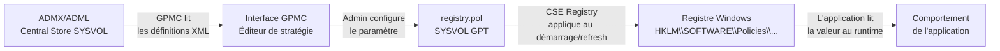

# Modèles d'administration (ADMX/ADML)

!!! abstract "Ce que couvre ce chapitre"
    - La rupture technique entre le format ADM binaire et le format ADMX XML, et son impact sur la gestion opérationnelle des modèles
    - La structure XML complète d'un fichier ADMX : espaces de noms, catégories, politiques et éléments
    - Les sept types d'éléments `<elements>` disponibles et leur correspondance avec les types de valeurs de registre
    - La structure du fichier ADML et le rôle de la `presentationTable` pour les contrôles d'interface complexes
    - La création, l'alimentation et la maintenance du Central Store dans SYSVOL
    - La gestion des ADMX tiers (Edge, Chrome, Firefox, Office 365) et les risques de conflits de namespace
    - La création complète d'un ADMX personnalisé avec les quatre types d'éléments principaux

---

## :material-history: Du format ADM au format ADMX

### Le problème du format ADM

Le format ADM (Administrative Templates) est le format historique utilisé jusqu'à Windows XP et Windows Server 2003.

Un fichier ADM est un fichier texte encodé dans un format propriétaire Microsoft. Il n'est pas du XML. Il ne supporte pas Unicode nativement.

Le défaut architectural majeur du format ADM est son mode de stockage : **chaque GPO embarque ses propres copies des fichiers ADM**. Dans SYSVOL, chaque dossier `{GUID}\Adm\` contient une copie de chaque fichier ADM utilisé dans la stratégie. Avec des dizaines ou des centaines de GPO, la taille de SYSVOL explose, et la réplication devient un problème.

!!! info "Taille typique avec ADM"
    Un fichier `system.adm` fait environ 2 Mo. Sur un domaine avec 200 GPO, cela représente 400 Mo de fichiers ADM dupliqués dans SYSVOL — rien que pour un seul fichier de modèle.

### La solution ADMX

Windows Vista et Windows Server 2008 introduisent le format ADMX. La philosophie change radicalement : les modèles ne sont plus stockés dans chaque GPO, mais dans un **dépôt central partagé**.

Les ADMX sont des fichiers XML au standard `UTF-8`. Ils séparent la logique du paramètre (dans le fichier `.admx`) des chaînes d'affichage (dans des fichiers `.adml` par langue).

| Caractéristique | ADM | ADMX |
|-----------------|-----|------|
| Format | Texte propriétaire | XML standard |
| Encodage | Non-Unicode (ANSI) | UTF-8 |
| Stockage | Copié dans chaque GPO (`{GUID}\Adm\`) | Dépôt central (`PolicyDefinitions\`) |
| Multilangue | Fichiers séparés par langue non standardisés | Fichiers `.adml` par dossier `lang-REGION\` |
| Conflit namespace | Non géré | Détecté et rejeté |
| Extensibilité | Limitée | Références croisées entre namespaces |

### Le comportement de GPMC lors de la lecture

Lorsque vous ouvrez la GPMC sur un poste d'administration, elle doit localiser les fichiers de modèles pour afficher les paramètres configurables.

GPMC cherche d'abord dans le **Central Store** SYSVOL. Si le Central Store existe (c'est-à-dire si le dossier `\\<domaine>\SYSVOL\<domaine>\Policies\PolicyDefinitions\` existe), GPMC l'utilise exclusivement.

Si le Central Store n'existe pas, GPMC se replie sur le **store local** : `%SystemRoot%\PolicyDefinitions\` de la machine d'administration.

!!! warning "Piège opérationnel"
    Si un paramètre a été configuré avec un ADMX présent dans le store local mais absent du Central Store, GPMC affiche ce paramètre comme **"Extra Registry Settings"** (paramètre de registre supplémentaire). Le paramètre est toujours appliqué sur les clients, mais vous ne pouvez plus le voir ni le modifier via GPMC. Cette situation est silencieuse et difficile à détecter.

!!! quote "En résumé"
    ADMX centralise les modèles dans un dépôt SYSVOL unique, élimine la duplication, et standardise le format en XML UTF-8. GPMC utilise le Central Store en priorité absolue sur le store local. Tout ADMX absent du Central Store rend ses paramètres configurés invisibles dans GPMC.

---

## :material-xml: Structure d'un fichier ADMX

### Le document XML racine

Un fichier ADMX est un document XML dont l'élément racine est `<policyDefinitions>`. Le namespace XML obligatoire est `http://schemas.microsoft.com/GroupPolicy/2008/06/PolicyDefinitions`.

```xml title="Structure racine d'un fichier ADMX"
<?xml version="1.0" encoding="utf-8"?>
<policyDefinitions
    xmlns="http://schemas.microsoft.com/GroupPolicy/2008/06/PolicyDefinitions"
    xmlns:xsd="http://www.w3.org/2001/XMLSchema"
    xmlns:xsi="http://www.w3.org/2001/XMLSchema-instance"
    revision="1.0"
    schemaVersion="1.0">

  <policyNamespaces>
    <target prefix="myapp" namespace="MyCompany.Policies.MyApp" />
    <using prefix="windows" namespace="Microsoft.Policies.Windows" />
  </policyNamespaces>

  <resources minRequiredRevision="1.0" />

  <supportedOn>
    <definitions>
      <definition name="SUPPORTED_Windows7"
                  displayName="$(string.SUPPORTED_Windows7)" />
    </definitions>
  </supportedOn>

  <categories>
    <category name="MyApp" displayName="$(string.MyApp_Category)">
      <parentCategory ref="windows:WindowsComponents" />
    </category>
  </categories>

  <policies>
    <!-- Policy definitions go here -->
  </policies>

</policyDefinitions>
```

### :material-sitemap: Les cinq sections principales

Un fichier ADMX se décompose en cinq sections dans l'ordre suivant.

**`policyNamespaces`** déclare l'identité de ce fichier et les namespaces externes qu'il référence. C'est la section la plus critique : le namespace déclaré dans `<target>` doit être globalement unique dans le Central Store.

**`resources`** déclare la version minimale de révision des fichiers ADML requis. Elle est presque toujours `1.0` en pratique.

**`supportedOn`** définit les systèmes d'exploitation sur lesquels les paramètres s'appliquent. Ces définitions sont référencées par chaque politique via `<supportedOn ref="..."/>`.

**`categories`** construit l'arborescence de navigation dans GPMC. Chaque nœud peut se rattacher à une catégorie parent, y compris dans un namespace externe.

**`policies`** contient les définitions réelles des paramètres de stratégie.

### :material-table: Tableau des éléments XML clés

| Élément XML | Rôle |
|-------------|------|
| `policyNamespaces/target` | Déclare le namespace unique de ce fichier ADMX |
| `policyNamespaces/using` | Importe un namespace externe pour référencer ses catégories |
| `categories/category` | Crée un nœud dans l'arbre de navigation GPMC |
| `parentCategory ref=` | Rattache la catégorie à un parent (notation `prefix:nom` pour un parent externe) |
| `policies/policy` | Définit un paramètre de stratégie complet |
| `policy class=` | Portée : `Machine`, `User`, ou `Both` |
| `policy key=` | Chemin de la clé de registre cible (sans la ruche) |
| `policy valueName=` | Nom de la valeur de registre pour les paramètres simples activé/désactivé |
| `enabledValue` | Valeur écrite dans le registre quand le paramètre est activé |
| `disabledValue` | Valeur écrite dans le registre quand le paramètre est désactivé |
| `elements` | Bloc optionnel définissant les contrôles UI et les valeurs supplémentaires |
| `supportedOn ref=` | Référence à une définition de système d'exploitation supporté |

### :material-cog: La définition d'une politique simple

Une politique activé/désactivé sans contrôles supplémentaires utilise uniquement `valueName`, `enabledValue` et `disabledValue`.

```xml title="Politique simple activé/désactivé"
<policy name="MyApp_EnableFeature"
        class="Machine"
        displayName="$(string.MyApp_EnableFeature)"
        explainText="$(string.MyApp_EnableFeature_Help)"
        key="SOFTWARE\Policies\MyCompany\MyApp"
        valueName="EnableFeature">
  <parentCategory ref="MyApp" />
  <supportedOn ref="SUPPORTED_Windows7" />
  <enabledValue>
    <decimal value="1" />
  </enabledValue>
  <disabledValue>
    <decimal value="0" />
  </disabledValue>
</policy>
```

Quand l'admin active ce paramètre dans GPMC, la valeur `EnableFeature` de type REG_DWORD est créée avec la valeur `1` sous `HKLM\SOFTWARE\Policies\MyCompany\MyApp`. Quand il désactive, la valeur est `0`.

!!! info "La valeur 'Non configuré'"
    Quand le paramètre est en état "Non configuré", **aucune valeur n'est écrite dans le registre**. La clé elle-même peut ne pas exister. C'est le comportement standard des paramètres basés sur les ADMX.

!!! quote "En résumé"
    Un fichier ADMX est un document XML structuré en cinq sections. Le namespace déclaré dans `<target>` est son identifiant unique. Les politiques mappent directement sur des valeurs de registre. La syntaxe `$(string.ClefID)` est une référence à une chaîne définie dans le fichier ADML correspondant.

---

## :material-form-select: Les types d'éléments dans `<elements>`

### Pourquoi utiliser `<elements>`

Un paramètre activé/désactivé ne suffit pas quand l'admin doit configurer une valeur spécifique : une URL, un délai en secondes, une liste de serveurs.

Le bloc `<elements>` permet de définir des contrôles d'interface supplémentaires. Ces contrôles sont affichés dans GPMC dans la section "Options" de la boîte de dialogue du paramètre.

Chaque élément écrit une valeur de registre distincte quand la politique est activée.

### :material-table: Tableau des sept types d'éléments

| Type d'élément | Contrôle GPMC | Cas d'usage typique | Type de registre |
|----------------|---------------|---------------------|------------------|
| `<boolean>` | Case à cocher | Activer une sous-option | REG_DWORD (`0` ou `1`) |
| `<decimal>` | Champ numérique (32 bits) | Timeout, intervalle, limite | REG_DWORD |
| `<longDecimal>` | Champ numérique (64 bits) | Taille en octets, timestamps | REG_QWORD |
| `<text>` | Zone de texte monoligne | URL, chemin, identifiant | REG_SZ |
| `<multiText>` | Zone de texte multiligne | Liste d'URLs, chemins multiples | REG_MULTI_SZ |
| `<enum>` | Liste déroulante | Niveau de sécurité, mode | REG_DWORD ou REG_SZ selon l'item |
| `<list>` | Liste éditable (ajout/suppression) | Liste de serveurs, liste blanche | Plusieurs valeurs REG_SZ |

### L'élément `<text>`

```xml title="Élément text — zone de saisie URL"
<policy name="MyApp_ServerURL"
        class="Machine"
        displayName="$(string.ServerURL)"
        explainText="$(string.ServerURL_Help)"
        key="SOFTWARE\Policies\MyCompany\MyApp">
  <parentCategory ref="MyApp" />
  <supportedOn ref="SUPPORTED_Windows7" />
  <elements>
    <text id="ServerURL_Value"
          valueName="ServerURL"
          maxLength="256"
          required="true" />
  </elements>
</policy>
```

L'attribut `id` est l'identifiant interne référencé par la `presentationTable` dans le fichier ADML. Il doit être unique dans la politique.

### L'élément `<decimal>`

```xml title="Élément decimal — champ numérique borné"
<elements>
  <decimal id="MaxConnections_Value"
           valueName="MaxConnections"
           minValue="1"
           maxValue="100"
           required="true" />
</elements>
```

Les attributs `minValue` et `maxValue` définissent les bornes de validation dans l'interface GPMC. La valeur est toujours stockée comme REG_DWORD.

### L'élément `<enum>`

```xml title="Élément enum — liste déroulante"
<elements>
  <enum id="LogLevel_Value" valueName="LogLevel">
    <item displayName="$(string.LogLevel_Off)">
      <value><decimal value="0" /></value>
    </item>
    <item displayName="$(string.LogLevel_Error)">
      <value><decimal value="1" /></value>
    </item>
    <item displayName="$(string.LogLevel_Verbose)">
      <value><decimal value="2" /></value>
    </item>
  </enum>
</elements>
```

Chaque `<item>` définit une entrée dans la liste déroulante. L'attribut `displayName` pointe vers une chaîne ADML. La valeur écrite dans le registre est celle définie dans le sous-élément `<value>`.

### L'élément `<list>`

```xml title="Élément list — liste éditable multi-valeurs"
<elements>
  <list id="AllowedServers_List"
        key="SOFTWARE\Policies\MyCompany\MyApp\AllowedServers"
        valuePrefix="" />
</elements>
```

L'élément `<list>` est particulier : il écrit ses valeurs dans une **sous-clé dédiée**, pas dans la clé principale de la politique. Les valeurs sont nommées `1`, `2`, `3`... par défaut (ou avec le préfixe défini dans `valuePrefix`).

!!! warning "Clé distincte pour les listes"
    L'attribut `key` de `<list>` est obligatoire et distinct du `key` de la politique parente. Si vous omettez `key`, le comportement est indéfini selon les versions de GPMC. Utilisez toujours une sous-clé explicite pour les listes.

!!! quote "En résumé"
    Les sept types d'éléments couvrent tous les besoins de configuration : booléens, entiers, chaînes, listes. Chaque élément `<elements>` écrit une valeur de registre indépendante. Les listes utilisent une sous-clé dédiée avec des valeurs numérotées.

---

## :material-translate: Structure d'un fichier ADML

### Le rôle du fichier ADML

Un fichier ADMX ne contient aucune chaîne lisible par l'homme. Tous les textes — noms de paramètres, descriptions, étiquettes d'interface — sont externalisés dans les fichiers ADML.

Un fichier ADML est associé à un fichier ADMX par son nom : `monapp.admx` doit avoir pour correspondant `en-US\monapp.adml` et `fr-FR\monapp.adml`.

Le fichier ADML à utiliser est déterminé par la langue de l'interface de la machine d'administration qui ouvre GPMC.

### La structure XML du fichier ADML

```xml title="Structure d'un fichier ADML fr-FR"
<?xml version="1.0" encoding="utf-8"?>
<policyDefinitionResources
    xmlns="http://schemas.microsoft.com/GroupPolicy/2008/06/PolicyDefinitions"
    revision="1.0"
    schemaVersion="1.0">

  <displayName />
  <description />

  <resources>
    <stringTable>
      <string id="SUPPORTED_Windows7">
        Windows 7, Windows Server 2008 R2 et versions ultérieures
      </string>
      <string id="MyApp_Category">Mon Application</string>
      <string id="MyApp_EnableFeature">
        Activer la fonctionnalité principale
      </string>
      <string id="MyApp_EnableFeature_Help">
        Activez ce paramètre pour activer la fonctionnalité principale de Mon Application.
        Si vous désactivez ou ne configurez pas ce paramètre, la fonctionnalité reste désactivée.
      </string>
      <string id="ServerURL">URL du serveur</string>
      <string id="ServerURL_Help">
        Définit l'URL du serveur backend utilisé par Mon Application.
        Exemple : https://serveur.contoso.local
      </string>
    </stringTable>

    <presentationTable>
      <presentation id="MyApp_ServerURL">
        <textBox refId="ServerURL_Value">
          <label>URL du serveur :</label>
          <defaultValue>https://serveur.contoso.local</defaultValue>
        </textBox>
      </presentation>
    </presentationTable>
  </resources>

</policyDefinitionResources>
```

### :material-table: Les deux sections de `<resources>`

| Section | Rôle | Obligatoire |
|---------|------|-------------|
| `stringTable` | Toutes les chaînes référencées par `$(string.ID)` dans l'ADMX | Oui |
| `presentationTable` | Définit l'interface graphique des paramètres avec des éléments | Non |

### La `presentationTable` en détail

La `presentationTable` est optionnelle mais fortement recommandée dès qu'un paramètre utilise un bloc `<elements>`.

Sans `presentationTable`, GPMC affiche les contrôles avec des noms génériques. Avec `presentationTable`, vous définissez des étiquettes claires, des valeurs par défaut affichées, et l'ordre d'affichage des contrôles.

Chaque `<presentation>` porte un attribut `id` qui correspond exactement au nom (`name=`) de la politique dans l'ADMX, pas à l'identifiant de l'élément.

```xml title="Presentation avec plusieurs contrôles"
<presentation id="MyApp_AdvancedSettings">
  <decimalTextBox refId="MaxConnections_Value"
                  defaultValue="10">
    Nombre maximum de connexions simultanées :
  </decimalTextBox>
  <dropdownList refId="LogLevel_Value"
                defaultItem="0">
    Niveau de journalisation :
  </dropdownList>
</presentation>
```

!!! info "La correspondance id/name"
    L'attribut `id` de `<presentation>` doit correspondre à l'attribut `name` de l'élément `<policy>` dans l'ADMX, et non à l'attribut `id` des éléments dans `<elements>`. Les attributs `refId` dans la présentation correspondent eux aux attributs `id` des éléments `<elements>`.

!!! quote "En résumé"
    L'ADML contient toutes les chaînes d'interface, séparées de la logique du paramètre dans l'ADMX. La `stringTable` est obligatoire. La `presentationTable` est optionnelle mais détermine la qualité de l'interface dans GPMC. Un ADMX sans ADML pour la langue active est ignoré par GPMC.

---

## :material-server-network: Le Central Store

### Pourquoi créer un Central Store

Sans Central Store, chaque machine d'administration utilise son propre `%SystemRoot%\PolicyDefinitions\`. Deux admins sur des postes différents peuvent avoir des versions différentes des ADMX installées.

Le Central Store centralise les ADMX dans SYSVOL, visible par tous les DCs et toutes les machines d'administration. Il garantit la cohérence de l'interface GPMC pour tous les administrateurs du domaine.

### :material-folder-tree: Structure du Central Store

```
\\<domaine>\SYSVOL\<domaine>\Policies\PolicyDefinitions\
├── *.admx                    ← Fichiers ADMX (logique des paramètres)
├── en-US\
│   └── *.adml                ← Chaînes en anglais
├── fr-FR\
│   └── *.adml                ← Chaînes en français
├── de-DE\
│   └── *.adml
└── ...
```

Le dossier `PolicyDefinitions` lui-même doit exister pour activer le Central Store. GPMC détecte automatiquement sa présence.

### Création du Central Store depuis le store local

Le script suivant doit être exécuté sur le **PDC Emulator** (le DC qui détient le rôle FSMO PDC) pour garantir que SYSVOL est d'abord disponible et à jour sur ce DC.

```powershell title="Création du Central Store depuis le store local"
# Run on PDC Emulator — requires ActiveDirectory module
Import-Module ActiveDirectory

$domain       = (Get-ADDomain).DNSRoot
$centralStore = "\\$domain\SYSVOL\$domain\Policies\PolicyDefinitions"
$localStore   = "$env:SystemRoot\PolicyDefinitions"

# Create the central store directory
New-Item -ItemType Directory -Path $centralStore -Force | Out-Null

# Copy all ADMX files
Copy-Item "$localStore\*.admx" -Destination $centralStore -Force

# Copy all language subdirectories
Get-ChildItem -Path $localStore -Directory | ForEach-Object {
    $langDest = Join-Path $centralStore $_.Name
    New-Item -ItemType Directory -Path $langDest -Force | Out-Null
    Copy-Item "$($_.FullName)\*.adml" -Destination $langDest -Force
}

Write-Host "Central Store created at: $centralStore"
```

```
Central Store created at: \\contoso.local\SYSVOL\contoso.local\Policies\PolicyDefinitions
```

### Vérification que le Central Store est actif

Après création, rouvrez une GPMC. Si le Central Store est reconnu, la barre de titre de l'éditeur de stratégie de groupe n'affiche plus le message :

> "Policy definitions (ADMX files) retrieved from the local computer."

Ce message disparaît dès que GPMC trouve le dossier `PolicyDefinitions` dans SYSVOL.

### Mise à jour du Central Store après un changement de version Windows

Quand vous déployez une nouvelle version de Windows (ex. : mise à jour vers Windows 11 24H2), les ADMX évoluent. De nouveaux paramètres apparaissent.

La mise à jour du Central Store consiste à copier les nouveaux fichiers ADMX depuis un poste à jour. Il est recommandé de faire cette opération depuis un poste d'administration **déjà mis à jour** vers la nouvelle version cible, pas depuis un serveur.

!!! warning "Ne pas mélanger les versions d'ADMX"
    Copier des ADMX d'une version Windows dans un Central Store contenant des ADMX d'une version antérieure peut créer des conflits. Les paramètres qui n'existent pas encore dans la version déployée sur les clients seront visibles dans GPMC mais sans effet. Ce n'est pas bloquant, mais c'est potentiellement confus.

!!! quote "En résumé"
    Le Central Store est un dossier `PolicyDefinitions` dans SYSVOL. Il prend la priorité absolue sur le store local de la machine d'administration. Il doit être créé manuellement à partir du store local du PDC Emulator, puis mis à jour à chaque évolution de version Windows ou déploiement de nouveaux ADMX tiers.

---

## :material-puzzle-plus: ADMX tiers : Chrome, Edge, Firefox, Office

### Pourquoi des ADMX tiers

Les ADMX Microsoft couvrent le système d'exploitation et les composants Windows. Pour piloter des applications tierces via GPO, les éditeurs fournissent leurs propres fichiers ADMX.

Ces ADMX tiers utilisent exactement le même format XML. Ils se déploient de la même façon dans le Central Store.

### :material-table: Principaux paquets ADMX tiers

| Application | Fichier principal | Namespace | Source |
|-------------|-----------------|-----------|--------|
| Microsoft Edge | `msedge.admx` | `microsoft.policies.edge` | Microsoft Download Center |
| Google Chrome | `chrome.admx` | `Google.Chrome` | Google Enterprise Bundle |
| Mozilla Firefox | `firefox.admx` | `Mozilla.Firefox` | Mozilla GitHub (mozilla-policy-templates) |
| Microsoft 365 Apps (Office) | `office16.admx` + fichiers par app | `office16` | Office Deployment Tool (ODT) |
| Microsoft OneDrive | `onedrive.admx` | `Microsoft.Policies.OneDriveNGSC` | Inclus avec le client OneDrive |
| Zoom | `zoom.admx` | `Zoom` | Zoom Support |

### Le risque de conflit de namespace

Si deux fichiers ADMX dans le Central Store déclarent le **même namespace** dans leur balise `<target>`, GPMC en ignore silencieusement un des deux. Le comportement exact (lequel est ignoré) dépend de l'ordre de chargement alphabétique.

Ce scénario se produit parfois lors d'une mise à jour : l'ancien fichier ADMX reste dans le Central Store à côté du nouveau.

```powershell title="Détection des conflits de namespace dans le Central Store"
# Detect ADMX namespace conflicts in the Central Store
$domain       = $env:USERDNSDOMAIN
$centralStore = "\\$domain\SYSVOL\$domain\Policies\PolicyDefinitions"

$namespaces = @{}
$conflicts  = @()

Get-ChildItem -Path $centralStore -Filter "*.admx" | ForEach-Object {
    $file = $_
    try {
        $xml = [xml](Get-Content -Path $file.FullName -Encoding UTF8)
        $ns  = $xml.policyDefinitions.policyNamespaces.target.namespace
        if ([string]::IsNullOrEmpty($ns)) { return }

        if ($namespaces.ContainsKey($ns)) {
            $conflicts += [PSCustomObject]@{
                Namespace = $ns
                File1     = $namespaces[$ns]
                File2     = $file.Name
            }
        } else {
            $namespaces[$ns] = $file.Name
        }
    } catch {
        Write-Warning "Failed to parse: $($file.Name) — $_"
    }
}

if ($conflicts.Count -eq 0) {
    Write-Host "No namespace conflicts detected."
} else {
    $conflicts | Format-Table -AutoSize
}
```

```
Namespace                    File1              File2
---------                    -----              -----
Microsoft.Policies.OneDrive  onedrive.admx      onedrive_old.admx
```

!!! warning "Mise à jour des ADMX tiers"
    Avant d'ajouter un nouvel ADMX tiers dans le Central Store, vérifiez qu'aucun fichier portant le même namespace n'y existe déjà. Supprimez ou archivez l'ancien fichier avant de copier le nouveau. Ne laissez jamais deux versions coexister.

!!! quote "En résumé"
    Les ADMX tiers s'intègrent dans le Central Store exactement comme les ADMX Microsoft. Le risque principal est le conflit de namespace : deux ADMX avec le même namespace font que GPMC en ignore un silencieusement. Vérifiez l'unicité des namespaces avant tout déploiement.

---

## :material-code-braces: Créer un ADMX personnalisé : exemple complet

### Contexte du cas d'usage

Une application interne `MonApp` lit sa configuration dans `HKLM\SOFTWARE\Policies\MonEntreprise\MonApp`.

Quatre paramètres doivent être pilotables via GPO :

| Paramètre registre | Type registre | Rôle |
|--------------------|---------------|------|
| `EnableLogging` | REG_DWORD | Activer/désactiver la journalisation |
| `ServerURL` | REG_SZ | URL du serveur backend |
| `MaxConnections` | REG_DWORD | Nombre max de connexions simultanées (1–100) |
| `AllowedUsers` | REG_MULTI_SZ | Liste des utilisateurs autorisés |

Ces quatre paramètres couvrent les types `<boolean>`, `<text>`, `<decimal>`, et `<list>`.

### Le fichier ADMX complet

```xml title="monapp.admx — Fichier ADMX complet"
<?xml version="1.0" encoding="utf-8"?>
<policyDefinitions
    xmlns="http://schemas.microsoft.com/GroupPolicy/2008/06/PolicyDefinitions"
    xmlns:xsd="http://www.w3.org/2001/XMLSchema"
    xmlns:xsi="http://www.w3.org/2001/XMLSchema-instance"
    revision="1.0"
    schemaVersion="1.0">

  <policyNamespaces>
    <!-- Unique namespace for this ADMX file -->
    <target prefix="monapp"
            namespace="MonEntreprise.Policies.MonApp" />
    <!-- Reference to Windows namespace for category parent -->
    <using prefix="windows"
           namespace="Microsoft.Policies.Windows" />
  </policyNamespaces>

  <resources minRequiredRevision="1.0" />

  <supportedOn>
    <definitions>
      <!-- Minimum supported OS: Windows 10 -->
      <definition name="SUPPORTED_Windows10"
                  displayName="$(string.SUPPORTED_Windows10)" />
    </definitions>
  </supportedOn>

  <categories>
    <!-- Root category: MonEntreprise -->
    <category name="MonEntreprise"
              displayName="$(string.MonEntreprise_Category)">
      <parentCategory ref="windows:WindowsComponents" />
    </category>
    <!-- Child category: MonApp -->
    <category name="MonApp"
              displayName="$(string.MonApp_Category)">
      <parentCategory ref="monapp:MonEntreprise" />
    </category>
  </categories>

  <policies>

    <!-- Policy 1: EnableLogging — uses boolean element for sub-option -->
    <policy name="MonApp_Logging"
            class="Machine"
            displayName="$(string.MonApp_Logging)"
            explainText="$(string.MonApp_Logging_Help)"
            key="SOFTWARE\Policies\MonEntreprise\MonApp"
            valueName="EnableLogging">
      <parentCategory ref="monapp:MonApp" />
      <supportedOn ref="monapp:SUPPORTED_Windows10" />
      <enabledValue>
        <decimal value="1" />
      </enabledValue>
      <disabledValue>
        <decimal value="0" />
      </disabledValue>
    </policy>

    <!-- Policy 2: ServerURL — text element for URL input -->
    <policy name="MonApp_ServerURL"
            class="Machine"
            displayName="$(string.MonApp_ServerURL)"
            explainText="$(string.MonApp_ServerURL_Help)"
            key="SOFTWARE\Policies\MonEntreprise\MonApp">
      <parentCategory ref="monapp:MonApp" />
      <supportedOn ref="monapp:SUPPORTED_Windows10" />
      <elements>
        <text id="ServerURL_Value"
              valueName="ServerURL"
              maxLength="512"
              required="true" />
      </elements>
    </policy>

    <!-- Policy 3: MaxConnections — decimal element with bounds -->
    <policy name="MonApp_MaxConnections"
            class="Machine"
            displayName="$(string.MonApp_MaxConnections)"
            explainText="$(string.MonApp_MaxConnections_Help)"
            key="SOFTWARE\Policies\MonEntreprise\MonApp">
      <parentCategory ref="monapp:MonApp" />
      <supportedOn ref="monapp:SUPPORTED_Windows10" />
      <elements>
        <decimal id="MaxConnections_Value"
                 valueName="MaxConnections"
                 minValue="1"
                 maxValue="100"
                 required="true" />
      </elements>
    </policy>

    <!-- Policy 4: AllowedUsers — list element writing to a dedicated subkey -->
    <policy name="MonApp_AllowedUsers"
            class="Machine"
            displayName="$(string.MonApp_AllowedUsers)"
            explainText="$(string.MonApp_AllowedUsers_Help)"
            key="SOFTWARE\Policies\MonEntreprise\MonApp">
      <parentCategory ref="monapp:MonApp" />
      <supportedOn ref="monapp:SUPPORTED_Windows10" />
      <elements>
        <list id="AllowedUsers_List"
              key="SOFTWARE\Policies\MonEntreprise\MonApp\AllowedUsers"
              valuePrefix="" />
      </elements>
    </policy>

  </policies>
</policyDefinitions>
```

### Le fichier ADML français complet

```xml title="fr-FR\monapp.adml — Fichier ADML complet"
<?xml version="1.0" encoding="utf-8"?>
<policyDefinitionResources
    xmlns="http://schemas.microsoft.com/GroupPolicy/2008/06/PolicyDefinitions"
    revision="1.0"
    schemaVersion="1.0">

  <displayName />
  <description />

  <resources>
    <stringTable>

      <!-- Supported OS string -->
      <string id="SUPPORTED_Windows10">
        Windows 10, Windows Server 2016 et versions ultérieures
      </string>

      <!-- Category names -->
      <string id="MonEntreprise_Category">Mon Entreprise</string>
      <string id="MonApp_Category">Mon Application</string>

      <!-- Policy 1: Logging -->
      <string id="MonApp_Logging">Activer la journalisation</string>
      <string id="MonApp_Logging_Help">
        Activez ce paramètre pour activer la journalisation de Mon Application.
        Les journaux sont écrits dans le journal des événements Application avec la source "MonApp".

        Si vous désactivez ce paramètre, aucun journal n'est écrit.
        Si vous ne configurez pas ce paramètre, la journalisation est désactivée par défaut.
      </string>

      <!-- Policy 2: ServerURL -->
      <string id="MonApp_ServerURL">URL du serveur backend</string>
      <string id="MonApp_ServerURL_Help">
        Définit l'URL complète du serveur backend utilisé par Mon Application.
        L'application contacte ce serveur au démarrage pour récupérer sa configuration distante.

        Format attendu : https://nom-serveur.domaine.local
        Maximum : 512 caractères.

        Si vous ne configurez pas ce paramètre, l'application utilise sa valeur par défaut interne.
      </string>

      <!-- Policy 3: MaxConnections -->
      <string id="MonApp_MaxConnections">Nombre maximum de connexions simultanées</string>
      <string id="MonApp_MaxConnections_Help">
        Limite le nombre de connexions simultanées que Mon Application peut établir vers le serveur.
        Valeur autorisée : entre 1 et 100.

        Une valeur trop élevée peut saturer le serveur backend sur des déploiements importants.
        Valeur recommandée en production : 10.

        Si vous ne configurez pas ce paramètre, l'application utilise sa limite interne par défaut.
      </string>

      <!-- Policy 4: AllowedUsers -->
      <string id="MonApp_AllowedUsers">Liste des utilisateurs autorisés</string>
      <string id="MonApp_AllowedUsers_Help">
        Définit la liste des noms d'utilisateurs (SAMAccountName) autorisés à utiliser Mon Application.
        Un utilisateur absent de cette liste se voit refuser l'accès au démarrage.

        Si la liste est vide ou si ce paramètre n'est pas configuré, tous les utilisateurs sont autorisés.
        Les noms d'utilisateurs sont sensibles à la casse.
      </string>

    </stringTable>

    <presentationTable>

      <!-- Presentation for ServerURL: text box with default value hint -->
      <presentation id="MonApp_ServerURL">
        <textBox refId="ServerURL_Value">
          <label>URL du serveur :</label>
          <defaultValue>https://serveur.contoso.local</defaultValue>
        </textBox>
      </presentation>

      <!-- Presentation for MaxConnections: numeric field with label -->
      <presentation id="MonApp_MaxConnections">
        <decimalTextBox refId="MaxConnections_Value"
                        defaultValue="10"
                        spinStep="1">
          Nombre maximum de connexions (1-100) :
        </decimalTextBox>
      </presentation>

      <!-- Presentation for AllowedUsers: list box with column header -->
      <presentation id="MonApp_AllowedUsers">
        <listBox refId="AllowedUsers_List">
          Utilisateurs autorisés (SAMAccountName) :
        </listBox>
      </presentation>

    </presentationTable>
  </resources>

</policyDefinitionResources>
```

### Déploiement dans le Central Store

```powershell title="Déploiement d'un ADMX personnalisé dans le Central Store"
# Deploy custom ADMX/ADML to the Central Store
$domain       = $env:USERDNSDOMAIN
$centralStore = "\\$domain\SYSVOL\$domain\Policies\PolicyDefinitions"
$sourceDir    = "C:\Temp\MonApp-ADMX"  # local directory containing monapp.admx and fr-FR\, en-US\

# Verify Central Store exists
if (-not (Test-Path $centralStore)) {
    Write-Error "Central Store not found at: $centralStore — create it first."
    exit 1
}

# Copy ADMX file
Copy-Item "$sourceDir\monapp.admx" -Destination $centralStore -Force

# Copy all language directories
Get-ChildItem -Path $sourceDir -Directory | ForEach-Object {
    $langDest = Join-Path $centralStore $_.Name
    New-Item -ItemType Directory -Path $langDest -Force | Out-Null
    Copy-Item "$($_.FullName)\monapp.adml" -Destination $langDest -Force
}

Write-Host "ADMX deployed. Reopen GPMC to see the new policies."
```

!!! quote "En résumé"
    Un ADMX personnalisé suit exactement le même schéma que les ADMX Microsoft. La paire ADMX/ADML couvre les quatre types d'éléments principaux : `<policy>` simple pour les booléens activé/désactivé, `<text>` pour les chaînes, `<decimal>` pour les entiers bornés, et `<list>` pour les valeurs multiples. Le déploiement dans le Central Store rend immédiatement les nouveaux paramètres disponibles dans GPMC.

---

## :material-transit-connection-variant: Relation ADMX → registry.pol → Registre

Le schéma ci-dessous illustre le flux complet depuis la définition du modèle jusqu'à l'effet sur le comportement de l'application.



### Les quatre étapes du flux

**Étape 1 — Lecture des définitions.** Quand GPMC ouvre l'éditeur de stratégie de groupe, il lit les fichiers ADMX dans le Central Store. Cette lecture est en temps réel : aucun cache n'est maintenu côté serveur.

**Étape 2 — Configuration par l'administrateur.** L'admin configure un paramètre dans l'interface GPMC. GPMC traduit ce choix en une entrée binaire dans le fichier `registry.pol` du GPT (le dossier SYSVOL de la GPO).

**Étape 3 — Application par la CSE Registry.** Sur le poste client, la CSE Registry (`userenv.dll` / `gpsvc`) lit le fichier `registry.pol` lors du traitement des GPO. Elle crée ou met à jour les valeurs de registre correspondantes.

**Étape 4 — Lecture par l'application.** L'application lit ses paramètres dans le registre au démarrage ou à intervalles réguliers. Elle ne connaît pas l'existence des GPO : elle lit simplement des valeurs de registre.

!!! info "Découplage complet"
    L'application n'a aucune connaissance des GPO, de SYSVOL, ni des ADMX. Elle lit uniquement le registre. Ce découplage est l'un des grands avantages du modèle GPO : n'importe quelle application qui lit le registre peut être pilotée via GPO sans modification de son code.

---

## :material-alert-circle-outline: Event ID 4017 : erreurs de parsing ADMX

### Quand survient l'Event ID 4017

Si un fichier ADMX dans le Central Store contient une erreur de syntaxe XML, la GPMC ne peut pas le charger. L'erreur est enregistrée dans le **journal des événements Application** avec l'Event ID `4017` et la source `Microsoft-Windows-GroupPolicy`.

L'Event ID 4017 est silencieux du point de vue de l'utilisateur : GPMC ne s'arrête pas, elle ignore simplement le fichier défaillant. Les paramètres définis dans cet ADMX sont invisibles dans l'interface.

!!! warning "Déploiement sans validation"
    Un ADMX mal formé déployé en production est découvert uniquement quand un admin remarque que des paramètres ont disparu de GPMC. Validez **systématiquement** la syntaxe avant tout déploiement dans le Central Store.

### Script de validation avant déploiement

```powershell title="Validation XML d'un fichier ADMX avant déploiement"
# Validate ADMX XML syntax before deploying to Central Store
param(
    [Parameter(Mandatory = $true)]
    [string]$AdmxPath
)

if (-not (Test-Path $AdmxPath)) {
    Write-Error "File not found: $AdmxPath"
    exit 1
}

$errors = [System.Collections.Generic.List[string]]::new()

try {
    $settings = New-Object System.Xml.XmlReaderSettings
    $settings.ValidationType = [System.Xml.ValidationType]::None
    $settings.IgnoreComments = $true

    $reader = [System.Xml.XmlReader]::Create($AdmxPath, $settings)
    $xml    = New-Object System.Xml.XmlDocument
    $xml.Load($reader)
    $reader.Close()

    # Check mandatory namespace
    $ns = $xml.policyDefinitions.policyNamespaces.target.namespace
    if ([string]::IsNullOrEmpty($ns)) {
        $errors.Add("Missing or empty namespace in <policyNamespaces><target>")
    }

    # Check that all $(string.X) references exist in at least one ADML
    $admxDir   = Split-Path $AdmxPath
    $admlFiles = Get-ChildItem -Path $admxDir -Filter "*.adml" -Recurse
    $allStrings = @{}
    foreach ($adml in $admlFiles) {
        try {
            $admlXml = [xml](Get-Content $adml.FullName -Encoding UTF8)
            foreach ($str in $admlXml.policyDefinitionResources.resources.stringTable.string) {
                $allStrings[$str.id] = $true
            }
        } catch {
            $errors.Add("ADML parse error in $($adml.Name): $_")
        }
    }

    $admxContent = Get-Content $AdmxPath -Raw
    $refs        = [regex]::Matches($admxContent, '\$\(string\.(\w+)\)')
    foreach ($ref in $refs) {
        $id = $ref.Groups[1].Value
        if (-not $allStrings.ContainsKey($id)) {
            $errors.Add("String reference not found in any ADML: `$(string.$id)`")
        }
    }

} catch {
    $errors.Add("XML parse error: $_")
}

if ($errors.Count -eq 0) {
    Write-Host "ADMX validation passed: $AdmxPath"
} else {
    Write-Warning "ADMX validation failed: $AdmxPath"
    $errors | ForEach-Object { Write-Warning "  - $_" }
    exit 1
}
```

```
ADMX validation passed: C:\Temp\MonApp-ADMX\monapp.admx
```

### Validation en lot du Central Store existant

```powershell title="Validation de tous les ADMX du Central Store"
# Batch validate all ADMX files in the Central Store
$domain       = $env:USERDNSDOMAIN
$centralStore = "\\$domain\SYSVOL\$domain\Policies\PolicyDefinitions"
$failed       = 0

Get-ChildItem -Path $centralStore -Filter "*.admx" | ForEach-Object {
    $file = $_
    try {
        $xml = [xml](Get-Content $file.FullName -Encoding UTF8)
        # Quick check: root element must be policyDefinitions
        if ($xml.policyDefinitions -eq $null) {
            Write-Warning "Invalid root element in: $($file.Name)"
            $failed++
        }
    } catch {
        Write-Warning "XML parse error in $($file.Name): $_"
        $failed++
    }
}

if ($failed -eq 0) {
    Write-Host "All ADMX files in Central Store are valid."
} else {
    Write-Warning "$failed file(s) failed validation. Check Event ID 4017 in Application log."
}
```

!!! quote "En résumé"
    L'Event ID 4017 signale un fichier ADMX non parsable dans le Central Store. GPMC ignore silencieusement le fichier défaillant. Validez la syntaxe XML et les références aux chaînes ADML avant tout déploiement. Un ADMX invalide en production passe inaperçu jusqu'à ce qu'un admin remarque des paramètres manquants.

---

## :material-link-variant: Références croisées

| Sujet | Référence |
|-------|-----------|
| Le fichier `registry.pol` produit par les ADMX | [Ch. 06 — registry.pol](06-registry-pol.md) |
| Gestion opérationnelle du Central Store | [Les GPO pour les Admins — Ch. 04](../gpo-pour-les-admins/index.md) |
| Mise à jour ADMX pour Windows 11 | [Les GPO pour les Nuls — Ch. 14](../gpo-pour-les-nuls/index.md) |
| Historique ADM → ADMX et timeline des versions | [Ch. 01 — Introduction](01-introduction.md) |
| Structure SYSVOL et emplacement du Central Store | [Ch. 04 — SYSVOL](04-sysvol.md) |
| CSE Registry qui applique `registry.pol` | [Ch. 03 — CSE](03-cse.md) |
