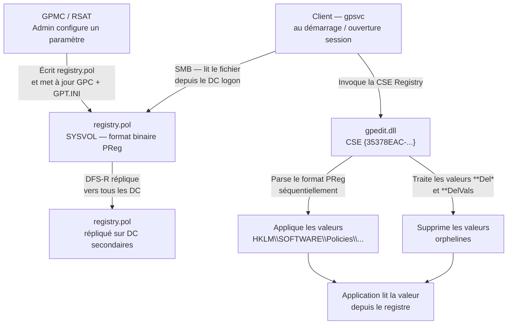
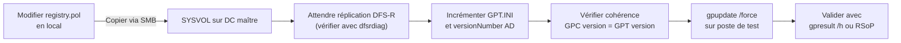

# Le format registry.pol

!!! abstract "Ce que couvre ce chapitre"
    - Le rôle exact de `registry.pol` dans la chaîne GPO et sa relation avec la CSE Registry (`gpedit.dll`)
    - La structure binaire complète du format PReg : en-tête 8 octets, délimiteurs UTF-16LE, layout des enregistrements
    - Le tableau complet des types de registre supportés avec leurs valeurs hexadécimales
    - Les valeurs spéciales `**Del`, `**DelVals`, `**DeleteValues`, `**DeleteKeys` et leurs effets précis
    - Un parseur PowerShell natif complet — sans dépendance externe
    - L'outil `LGPO.exe` : lecture et écriture du format texte intermédiaire
    - Les risques d'écriture directe dans `registry.pol` sans GPMC et comment incrémenter la version correctement


!!! tip "Si vous ne retenez qu'une chose"
    `registry.pol` est le format binaire intermédiaire entre la console GPMC et les clés de registre effectivement imposées sur le poste.

---

## :material-file-cog: Rôle de registry.pol

`registry.pol` est le fichier binaire situé dans SYSVOL qui stocke les paramètres de stratégie de groupe basés sur ADMX. C'est lui qui transporte les paramètres de registre du DC jusqu'au client.

Chaque GPO possède **deux** fichiers `registry.pol`, un par contexte :

| Fichier | Contexte | Appliqué sur |
|---------|----------|--------------|
| `{GUID}\Machine\Registry.pol` | Computer Configuration | `HKLM` |
| `{GUID}\User\Registry.pol` | User Configuration | `HKCU` |

Le fichier peut être absent si le contexte ne contient aucun paramètre de registre. Un fichier vide (8 octets — juste l'en-tête) est différent d'un fichier absent : le premier déclenche quand même la CSE.

:material-cog-transfer: La CSE Registry, identifiée par le GUID `{35378EAC-683F-11D2-A89A-00C04FBBCFA2}` et implémentée dans `gpedit.dll`, est la seule entité qui lit ce fichier et l'applique au registre. Elle est invoquée par `gpsvc` lors de chaque cycle de traitement GPO.

!!! info "Fichier texte vs fichier binaire"
    Ne pas confondre `registry.pol` avec les fichiers `.pol` de la stratégie de groupe locale sous Windows 9x. Les deux utilisent l'extension `.pol` mais leur format est totalement différent. `registry.pol` utilise le format PReg documenté dans la spécification MS-GPREG.

!!! quote "En résumé"
    `registry.pol` est le vecteur de transport des paramètres ADMX. Il réside dans SYSVOL, est répliqué par DFS-R, et est lu exclusivement par la CSE Registry. Deux instances existent par GPO — une pour la configuration machine, une pour la configuration utilisateur.

---

## :material-hexadecimal: Format binaire : structure détaillée

Le format `registry.pol` est officiellement documenté par Microsoft sous la référence **MS-GPREG** (Open Specifications). Sa structure est simple : un en-tête fixe de 8 octets suivi d'une séquence d'enregistrements de longueur variable.

Il n'y a pas d'index, pas de table d'allocation, pas de compression. La lecture se fait séquentiellement du début à la fin.

### :material-table-headers-eye: En-tête (8 octets)

Les 8 premiers octets sont fixes et identiques dans tous les fichiers `registry.pol` valides :

| Offset | Taille | Valeur hex | Description |
|--------|--------|------------|-------------|
| `0x00` | 4 octets | `50 52 65 67` | Signature ASCII `PReg` |
| `0x04` | 4 octets | `01 00 00 00` | Version `1` en little-endian |

La signature `PReg` est le moyen le plus rapide de valider un fichier. Tout outil qui manipule `registry.pol` doit vérifier ces 4 octets en premier.

!!! warning "Version toujours 1"
    La version dans l'en-tête est toujours `1` depuis Windows 2000. Elle ne reflète pas la version de la GPO (qui est dans `GPT.INI` et dans l'attribut `versionNumber` du GPC). Ne pas confondre les deux.

### :material-code-brackets: Structure d'un enregistrement

Après l'en-tête, le fichier contient une séquence d'enregistrements contiguës. Chaque enregistrement suit le format :

```
[ clé ; nom_valeur ; type ; taille ; données ]
```

Les délimiteurs sont des caractères Unicode encodés en UTF-16LE :

| Délimiteur | Octets | Rôle |
|-----------|--------|------|
| `[` | `5B 00` | Début d'enregistrement |
| `]` | `5D 00` | Fin d'enregistrement |
| `;` | `3B 00` | Séparateur de champs |

Toutes les chaînes de caractères (clé, nom de valeur) sont en **UTF-16LE, null-terminées**. Tous les entiers (type, taille, données DWORD) sont en **little-endian**.

### :material-code-braces-box: Exemple d'enregistrement annoté

Voici un enregistrement complet qui active un paramètre avec la valeur DWORD `1` :

```
5B 00                           [ (début d'enregistrement)

53 00 4F 00 46 00 54 00         S O F T
57 00 41 00 52 00 45 00         W A R E
5C 00 50 00 6F 00 6C 00         \ P o l
69 00 63 00 69 00 65 00         i c i e
73 00 5C 00 4D 00 79 00         s \ M y
41 00 70 00 70 00 00 00         A p p (null)
3B 00                           ; (séparateur)

45 00 6E 00 61 00 62 00         E n a b
6C 00 65 00 00 00               l e (null)
3B 00                           ; (séparateur)

04 00 00 00                     type = REG_DWORD (4)
3B 00                           ; (séparateur)

04 00 00 00                     size = 4 octets
3B 00                           ; (séparateur)

01 00 00 00                     data = 1

5D 00                           ] (fin d'enregistrement)
```

!!! info "Null terminator dans la taille"
    La taille dans le champ `size` ne compte **pas** le null terminator des chaînes REG_SZ. Pour une chaîne `"Enable"` (6 caractères), `size` vaut `14` (6 × 2 octets UTF-16LE + 2 octets null). Ceci est une source classique de bug dans les parseurs maison.

### :material-format-list-numbered: Types de registre supportés

Le champ `type` est un entier 32 bits little-endian. Les valeurs correspondent aux constantes Windows standard :

| Valeur hex | Constante | Description |
|-----------|-----------|-------------|
| `01 00 00 00` | `REG_SZ` | Chaîne Unicode null-terminée |
| `02 00 00 00` | `REG_EXPAND_SZ` | Chaîne avec variables d'environnement (`%SystemRoot%`, etc.) |
| `03 00 00 00` | `REG_BINARY` | Données binaires brutes, longueur quelconque |
| `04 00 00 00` | `REG_DWORD` | Entier 32 bits little-endian |
| `05 00 00 00` | `REG_DWORD_BIG_ENDIAN` | Entier 32 bits big-endian (rare) |
| `07 00 00 00` | `REG_MULTI_SZ` | Séquence de chaînes null-terminées, terminée par double null |
| `0B 00 00 00` | `REG_QWORD` | Entier 64 bits little-endian |

!!! warning "REG_MULTI_SZ et le double null"
    Pour `REG_MULTI_SZ`, le champ `data` contient plusieurs chaînes UTF-16LE null-terminées, terminées par un null supplémentaire (double null en fin de séquence). Le champ `size` inclut ces deux octets finaux. Les parseurs qui ne gèrent pas ce cas lisent des données corrompues.

!!! quote "En résumé"
    Le format PReg est intentionnellement simple : 8 octets d'en-tête puis des enregistrements `[clé;valeur;type;taille;données]` en UTF-16LE. Pas d'index, pas de structure hiérarchique. La lisibilité binaire avec un éditeur hex suffit pour diagnostiquer 90 % des problèmes.

---

## :material-eye: Visualisation du pipeline registry.pol

Le schéma suivant illustre le chemin complet d'un paramètre ADMX depuis la configuration par l'administrateur jusqu'à l'application sur le poste client.



:material-information-outline: Le client contacte toujours le DC logon pour lire SYSVOL. Si la réplication DFS-R est en retard, le client peut lire une version obsolète du fichier — même si le DC d'authentification a déjà la version récente.


!!! quote "En résumé"
    - Le client contacte toujours le DC logon pour lire SYSVOL.
    - Le schéma sur visualisation du pipeline registry.pol sert à visualiser l’ordre, les dépendances et les points de rupture du mécanisme.
    - Relisez cette vue d’ensemble avant un diagnostic : elle montre où une étape manquante casse tout le flux.
---

## :material-powershell: Lire registry.pol avec PowerShell

Il n'existe pas de cmdlet native pour lire `registry.pol`. L'approche standard consiste soit à utiliser `LGPO.exe` (voir section suivante), soit à écrire un parseur PowerShell.

Le parseur ci-dessous est autonome — aucune dépendance externe, aucun module tiers.

```powershell title="Parseur registry.pol natif PowerShell"
function Read-RegistryPol {
    <#
    .SYNOPSIS
        Parses a registry.pol file and returns its records as objects.
    .PARAMETER Path
        UNC or local path to the registry.pol file.
    #>
    param(
        [Parameter(Mandatory)]
        [string]$Path
    )

    $bytes = [System.IO.File]::ReadAllBytes($Path)

    # Validate PReg signature (bytes 0-3 = ASCII "PReg")
    $signature = [System.Text.Encoding]::ASCII.GetString($bytes[0..3])
    if ($signature -ne 'PReg') {
        throw "Invalid file: PReg signature not found at offset 0x00. Got: '$signature'"
    }

    # Validate version (bytes 4-7 = DWORD 1 little-endian)
    $version = [BitConverter]::ToInt32($bytes, 4)
    if ($version -ne 1) {
        Write-Warning "Unexpected PReg version: $version (expected 1)"
    }

    $offset = 8  # Skip 8-byte header
    $records = [System.Collections.Generic.List[PSCustomObject]]::new()

    while ($offset -lt $bytes.Length) {

        # Each record starts with '[' (0x5B 0x00 in UTF-16LE)
        if ($bytes[$offset] -ne 0x5B -or $bytes[$offset + 1] -ne 0x00) {
            break
        }
        $offset += 2

        # --- Read registry key path (UTF-16LE, null-terminated, ends at ';') ---
        $fieldStart = $offset
        while ($offset -lt $bytes.Length) {
            if ($bytes[$offset] -eq 0x3B -and $bytes[$offset + 1] -eq 0x00) { break }
            $offset += 2
        }
        $keyPath = [System.Text.Encoding]::Unicode.GetString($bytes[$fieldStart..($offset - 1)]).TrimEnd([char]0)
        $offset += 2  # Skip ';'

        # --- Read value name (UTF-16LE, null-terminated, ends at ';') ---
        $fieldStart = $offset
        while ($offset -lt $bytes.Length) {
            if ($bytes[$offset] -eq 0x3B -and $bytes[$offset + 1] -eq 0x00) { break }
            $offset += 2
        }
        $valueName = [System.Text.Encoding]::Unicode.GetString($bytes[$fieldStart..($offset - 1)]).TrimEnd([char]0)
        $offset += 2  # Skip ';'

        # --- Read type (4-byte DWORD) ---
        $regType = [BitConverter]::ToInt32($bytes, $offset)
        $offset += 4
        $offset += 2  # Skip ';'

        # --- Read size (4-byte DWORD) ---
        $dataSize = [BitConverter]::ToInt32($bytes, $offset)
        $offset += 4
        $offset += 2  # Skip ';'

        # --- Read raw data bytes ---
        $rawData = $bytes[$offset..($offset + $dataSize - 1)]
        $offset += $dataSize
        $offset += 2  # Skip ']'

        # Decode data based on registry type
        $decodedValue = switch ($regType) {
            1  { [System.Text.Encoding]::Unicode.GetString($rawData).TrimEnd([char]0) }  # REG_SZ
            2  { [System.Text.Encoding]::Unicode.GetString($rawData).TrimEnd([char]0) }  # REG_EXPAND_SZ
            4  { [BitConverter]::ToInt32($rawData, 0) }                                   # REG_DWORD
            11 { [BitConverter]::ToInt64($rawData, 0) }                                   # REG_QWORD
            7  {                                                                           # REG_MULTI_SZ
                [System.Text.Encoding]::Unicode.GetString($rawData).Split([char]0, [System.StringSplitOptions]::RemoveEmptyEntries)
            }
            default { $rawData }  # REG_BINARY and others: return raw bytes
        }

        $typeName = @{1='REG_SZ';2='REG_EXPAND_SZ';3='REG_BINARY';4='REG_DWORD';7='REG_MULTI_SZ';11='REG_QWORD'}[$regType] ?? "REG_UNKNOWN($regType)"

        $records.Add([PSCustomObject]@{
            KeyPath   = $keyPath
            ValueName = $valueName
            TypeId    = $regType
            TypeName  = $typeName
            DataSize  = $dataSize
            Value     = $decodedValue
        })
    }

    return $records
}
```

```powershell title="Utilisation du parseur"
# Read Machine-side registry.pol for a specific GPO
$polPath = "\\contoso.local\SYSVOL\contoso.local\Policies\{31B2F340-016D-11D2-945F-00C04FB984F9}\Machine\Registry.pol"
$records = Read-RegistryPol -Path $polPath

# Display all records
$records | Format-Table KeyPath, ValueName, TypeName, Value -AutoSize

# Filter on a specific key subtree
$records | Where-Object { $_.KeyPath -like '*\Policies\Microsoft\Windows\WindowsUpdate*' }

# Count records by type
$records | Group-Object TypeName | Sort-Object Count -Descending
```

```powershell title="Résultat attendu"
KeyPath                                              ValueName        TypeName   Value
-------                                              ---------        --------   -----
SOFTWARE\Policies\Microsoft\Windows\WindowsUpdate    WUServer         REG_SZ     https://wsus.contoso.local:8530
SOFTWARE\Policies\Microsoft\Windows\WindowsUpdate    WUStatusServer   REG_SZ     https://wsus.contoso.local:8530
SOFTWARE\Policies\Microsoft\Windows\WindowsUpdate\AU UseWUServer      REG_DWORD  1
SOFTWARE\Policies\Microsoft\Windows\WindowsUpdate\AU AUOptions        REG_DWORD  4
SOFTWARE\Policies\Microsoft\Windows\WindowsUpdate\AU ScheduledInstallDay REG_DWORD 0
```

!!! info "Lecture sans droits DC"
    Ce parseur fonctionne avec n'importe quel compte ayant accès en lecture au partage SYSVOL — ce qui inclut tous les comptes du domaine par défaut. Aucun droit d'administrateur n'est requis pour inspecter le contenu d'un `registry.pol`.

!!! warning "Encodage sur Windows PowerShell 5.1"
    Sur PowerShell 5.1, vérifiez que `[System.Text.Encoding]::Unicode` retourne bien UTF-16LE (c'est le cas par défaut). Sous certaines configurations de profil, `$OutputEncoding` peut être modifié sans affecter `System.Text.Encoding`, mais méfiez-vous des scripts qui redéfinissent l'encodage globalement.

!!! quote "En résumé"
    Un parseur PowerShell natif suffit pour inspecter `registry.pol` sans outil tiers. La logique est linéaire : vérifier la signature, puis lire les enregistrements un par un en suivant les délimiteurs UTF-16LE. Les cas edge sont les chaînes null-terminées et le double null de `REG_MULTI_SZ`.

---

## :material-tools: LGPO.exe : parse et écriture

`LGPO.exe` est distribué dans le **Microsoft Security Compliance Toolkit**. C'est l'outil officiel Microsoft pour manipuler les GPO locales et les fichiers `registry.pol` sans interface graphique.

Il est utilisable dans deux directions : **lecture** (parse vers texte) et **écriture** (texte vers `registry.pol`).

### :material-arrow-right-box: Parse d'un registry.pol existant

```cmd
:: Export Machine-side registry.pol to readable text
LGPO.exe /parse /m "\\contoso.local\SYSVOL\contoso.local\Policies\{GUID}\Machine\Registry.pol"

:: Export User-side registry.pol
LGPO.exe /parse /u "\\contoso.local\SYSVOL\contoso.local\Policies\{GUID}\User\Registry.pol"
```

Le format de sortie est un texte tabulé à 4 lignes par enregistrement :

```
Computer
SOFTWARE\Policies\Microsoft\Windows\WindowsUpdate
WUServer
SZ:https://wsus.contoso.local:8530

Computer
SOFTWARE\Policies\Microsoft\Windows\WindowsUpdate\AU
UseWUServer
DWORD:1
```

La première ligne est le contexte (`Computer` ou `User`), suivie de la clé, du nom de valeur, puis du type et de la valeur sous la forme `TYPE:valeur`.

### :material-arrow-left-box: Écriture dans la GPO locale

```cmd
:: Create a LGPO text file
echo Computer > settings.txt
echo SOFTWARE\Policies\MyApp >> settings.txt
echo Enable >> settings.txt
echo DWORD:1 >> settings.txt

:: Write to local GPO (C:\Windows\System32\GroupPolicy\Machine\Registry.pol)
LGPO.exe /t settings.txt
```

!!! warning "LGPO.exe cible la GPO locale"
    `/t` écrit dans `C:\Windows\System32\GroupPolicy\Machine\Registry.pol` — la GPO **locale** du poste. Il ne modifie pas directement une GPO de domaine dans SYSVOL. Pour modifier une GPO de domaine, copiez ensuite le fichier généré dans SYSVOL et incrémentez la version (voir section dédiée).

### :material-format-list-text: Types dans le format texte LGPO

| Format texte | Type registre |
|-------------|---------------|
| `DWORD:1` | `REG_DWORD` |
| `SZ:valeur` | `REG_SZ` |
| `EXSZ:valeur` | `REG_EXPAND_SZ` |
| `MULTISZ:val1\0val2` | `REG_MULTI_SZ` |
| `BINARY:48656C6C6F` | `REG_BINARY` (hex) |
| `QWORD:1234567890` | `REG_QWORD` |
| `DELETE` | Suppression de valeur (`**Del`) |
| `DELETEALLVALUES` | Suppression de toutes les valeurs (`**DelVals`) |

!!! info "LGPO.exe dans les pipelines CI/CD"
    LGPO.exe est souvent utilisé dans les pipelines de déploiement de baselines de sécurité (CIS, MSFT). Son format texte est versionnable dans Git, contrairement aux fichiers `.pol` binaires. La séquence typique est : générer le `.txt` dans le pipeline, appeler `LGPO.exe /t` sur le poste cible, puis copier le résultat dans SYSVOL avec incrémentation de version.

!!! quote "En résumé"
    `LGPO.exe` est l'outil officiel Microsoft pour lire et écrire `registry.pol` en ligne de commande. Son format texte intermédiaire est lisible, diffable et versionnable. Il cible la GPO locale — l'intégration avec SYSVOL nécessite une étape supplémentaire d'incrémentation de version.

---

## :material-delete-sweep: Valeurs spéciales : **Del, **DelVals, **DeleteValues

Le format PReg supporte des noms de valeur spéciaux préfixés par `**`. Ces valeurs ne correspondent à aucune valeur de registre réelle — elles encodent des **opérations de suppression** que la CSE Registry interprète à l'application.

### :material-table-remove: Tableau des valeurs spéciales

| Valeur spéciale | Effet lors de l'application |
|----------------|----------------------------|
| `**Del.NomValeur` | Supprime la valeur `NomValeur` sous la clé spécifiée |
| `**DelVals` | Supprime toutes les valeurs non gérées par GPO sous la clé |
| `**DeleteValues` | Identique à `**DelVals` (alias historique) |
| `**DeleteKeys` | Supprime toutes les sous-clés non gérées sous la clé |
| `**soft.NomValeur` | Écrit la valeur seulement si elle n'existe pas déjà |

### :material-lightbulb-on: Quand ces valeurs apparaissent-elles ?

Ces valeurs spéciales sont générées automatiquement par GPMC dans deux cas précis.

**Cas 1 — Paramètre ADMX configuré sur "Désactivé"** : si l'état "Disabled" d'un paramètre requiert l'écriture d'une valeur de désactivation ET la suppression de la valeur d'activation, GPMC écrit un enregistrement `**Del.NomValeur` pour la valeur d'activation.

**Cas 2 — Paramètre de liste exclusive** : certains modèles ADMX définissent une liste d'éléments autorisés. GPMC écrit `**DelVals` sous la clé de liste pour garantir qu'aucune entrée résiduelle (laissée par un paramètre précédent ou une configuration manuelle) ne subsiste.

!!! warning "Effet tatouage et **DelVals"
    `**DelVals` supprime toutes les valeurs sous la clé qui ne sont pas gérées par la GPO courante. Si une application écrit sa propre valeur sous une clé couverte par un `**DelVals`, elle sera supprimée à chaque refresh GPO. C'est un vecteur classique de régression applicative après déploiement de GPO.

### :material-code-json: Exemple de **Del dans le binaire

Un enregistrement `**Del.Enable` se représente ainsi dans le fichier :

```
5B 00                            [ (début)

53 00 4F 00 46 00 54 00...       clé = "SOFTWARE\Policies\MyApp"
3B 00                            ;

2A 00 2A 00 44 00 65 00          * * D e
6C 00 2E 00 45 00 6E 00          l . E n
61 00 62 00 6C 00 65 00 00 00    a b l e (null)
3B 00                            ;

01 00 00 00                      type = REG_SZ
3B 00                            ;

02 00 00 00                      size = 2 (null string)
3B 00                            ;

00 00                            data = "" (chaîne vide null-terminée)

5D 00                            ]
```

Le type est `REG_SZ` et la donnée est une chaîne vide. La CSE ignore la valeur des données pour les enregistrements `**Del*` — seul le nom de valeur compte.

!!! quote "En résumé"
    Les valeurs spéciales `**Del*` encodent des opérations de suppression dans `registry.pol`. Elles sont générées automatiquement par GPMC et interprétées par la CSE Registry. Comprendre leur fonctionnement est essentiel pour diagnostiquer les disparitions de valeurs de registre après un refresh GPO.

---

## :material-map-marker-path: Chemins machine vs utilisateur et ruches cibles

La distinction entre les deux fichiers `registry.pol` va au-delà du chemin dans SYSVOL. Elle détermine quelle ruche de registre est modifiée et dans quelle OU sont appliquées les règles.

### :material-folder-tree: Chemins dans SYSVOL

```
\\contoso.local\SYSVOL\contoso.local\Policies\
  └── {GUID-de-la-GPO}\
        ├── Machine\
        │     └── Registry.pol      ← Computer Configuration
        └── User\
              └── Registry.pol      ← User Configuration
```

### :material-table: Correspondance contexte → ruche

| Fichier | Contexte GPO | Ruches cibles standards |
|---------|--------------|------------------------|
| `Machine\Registry.pol` | Computer Configuration | `HKLM\SOFTWARE\Policies\` |
| `Machine\Registry.pol` | Computer Configuration | `HKLM\SOFTWARE\Microsoft\Windows\CurrentVersion\Policies\` |
| `User\Registry.pol` | User Configuration | `HKCU\SOFTWARE\Policies\` |
| `User\Registry.pol` | User Configuration | `HKCU\SOFTWARE\Microsoft\Windows\CurrentVersion\Policies\` |

!!! info "Pourquoi deux chemins de ruche ?"
    Le chemin `\Policies\` est le chemin moderne, utilisé par toutes les ADMX récentes. Le chemin `\CurrentVersion\Policies\` est l'emplacement historique de Windows NT 4.0, maintenu pour la compatibilité. Les deux sont traités de façon identique par la CSE Registry.

### :material-alert-decagram: Paramètres hors \Policies\ : l'effet tatouage

La CSE Registry peut écrire dans n'importe quel chemin de registre, pas seulement sous `\Policies\`. Mais les paramètres écrits **hors** des chemins `\Policies\` ont un comportement critique : ils **ne sont pas supprimés** quand la GPO est retirée ou désactivée.

Ce comportement s'appelle l'**effet tatouage** (tattoo effect). Il est propre aux GPO Preferences (`registry.pol` de type Preference), pas aux paramètres ADMX standards.

!!! warning "Tattoo effect en production"
    Si un paramètre écrit hors de `\Policies\` est retiré de la GPO, la valeur reste dans le registre du client indéfiniment. Le seul moyen de la supprimer est d'ajouter explicitement un enregistrement `**Del.NomValeur` dans `registry.pol`, ou de passer par Group Policy Preferences avec l'action "Remove".

!!! quote "En résumé"
    Les deux fichiers `registry.pol` ciblent des ruches distinctes : `HKLM` pour la configuration machine, `HKCU` pour la configuration utilisateur. Les paramètres ADMX écrits sous `\Policies\` sont non-tatouants et supprimés automatiquement si la GPO est retirée. Les paramètres hors `\Policies\` sont permanents.

---

## :material-pencil-box-multiple: Écrire dans registry.pol sans GPMC

Il existe des cas légitimes où l'on doit modifier `registry.pol` sans passer par la GPMC : pipelines CI/CD, corrections d'urgence, création scriptée de GPO.

Cette approche comporte des risques spécifiques qu'il faut maîtriser.

### :material-alert-circle: Le risque de version

Quand GPMC modifie une GPO, elle effectue automatiquement trois actions :

1. Met à jour `registry.pol` dans SYSVOL
2. Incrémente le champ `Version` dans `GPT.INI`
3. Incrémente l'attribut `versionNumber` dans l'objet AD (GPC)

Si vous modifiez `registry.pol` directement sans réaliser les étapes 2 et 3, le client compare la version du GPC avec la version du GPT lors du prochain refresh. Si les versions correspondent (même si elles sont obsolètes), le client considère que la GPO n'a pas changé et ne la retraite pas — vos modifications ne sont pas appliquées.

!!! info "Encodage du numéro de version"
    Le `versionNumber` est un entier 32 bits encodé en deux moitiés de 16 bits. Les 16 bits de poids fort sont la version **utilisateur**, les 16 bits de poids faible sont la version **machine**. Modifier uniquement `Machine\Registry.pol` nécessite d'incrémenter uniquement la partie machine (16 bits bas).

### :material-powershell: Script d'incrémentation de version

```powershell title="Incrémenter la version GPO après modification directe de registry.pol"
# Increment GPO version after manually editing registry.pol
# Run this AFTER copying the modified registry.pol to SYSVOL
param(
    [Parameter(Mandatory)]
    [string]$GPOGuid,

    [string]$Domain = $env:USERDNSDOMAIN,

    # Which side was modified: Machine, User, or Both
    [ValidateSet('Machine', 'User', 'Both')]
    [string]$Side = 'Machine'
)

$sysvolBase  = "\\$Domain\SYSVOL\$Domain\Policies"
$gptIniPath  = "$sysvolBase\{$GPOGuid}\GPT.INI"

# Read current version from GPT.INI
$iniContent     = Get-Content $gptIniPath -Raw
$currentVersion = [int]([regex]::Match($iniContent, '(?m)^Version=(\d+)').Groups[1].Value)

$machinePart = $currentVersion -band 0x0000FFFF
$userPart    = ($currentVersion -band 0xFFFF0000) -shr 16

# Increment the relevant counter(s)
if ($Side -eq 'Machine' -or $Side -eq 'Both') { $machinePart++ }
if ($Side -eq 'User'    -or $Side -eq 'Both') { $userPart++    }

$newVersion = ($userPart -shl 16) -bor $machinePart

# Update GPT.INI
$newContent = $iniContent -replace '(?m)^Version=\d+', "Version=$newVersion"
Set-Content -Path $gptIniPath -Value $newContent -Encoding ASCII -NoNewline

# Update versionNumber attribute on the GPC in Active Directory
$domainDN = (Get-ADDomain -Identity $Domain).DistinguishedName
$gpoDN    = "CN={$GPOGuid},CN=Policies,CN=System,$domainDN"
Set-ADObject -Identity $gpoDN -Replace @{ versionNumber = $newVersion }

Write-Host "GPO {$GPOGuid} version updated: $currentVersion --> $newVersion (machine=$machinePart, user=$userPart)"
```

```powershell title="Résultat attendu"
GPO {31B2F340-016D-11D2-945F-00C04FB984F9} version updated: 65537 --> 65538 (machine=2, user=1)
```

!!! warning "Forcer le refresh client après modification directe"
    Même après incrémentation correcte de la version, le client applique les changements au prochain cycle de refresh (90–120 min en arrière-plan). Pour une application immédiate, exécutez `gpupdate /force` sur le poste cible ou `Invoke-GPUpdate -Computer NomPoste -Force` depuis PowerShell.

!!! warning "Réplication avant refresh"
    Si vous modifiez `registry.pol` sur un DC spécifique, attendez que DFS-R ait répliqué le fichier sur tous les DC avant de lancer `gpupdate`. Un client qui contacte un DC encore sur l'ancienne version lira une version incohérente.

### :material-wrench-check: Workflow de modification directe recommandé



!!! quote "En résumé"
    Modifier `registry.pol` directement est techniquement possible mais risqué si la version n'est pas incrémentée. La règle est simple : toute modification de `registry.pol` dans SYSVOL doit être suivie d'une mise à jour synchronisée de `GPT.INI` et de l'attribut `versionNumber` dans AD. Sans cela, les clients ignorent silencieusement vos modifications.

---

## :material-bug: Diagnostiquer les problèmes liés à registry.pol

Les incidents liés à `registry.pol` se répartissent en quatre catégories : fichier corrompu, version désynchronisée, problème d'accès SMB, et paramètre appliqué mais absent du registre. Chacune a ses symptômes et ses outils de diagnostic.

### :material-alert-octagram: Fichier corrompu ou invalide

Un `registry.pol` corrompu provoque un échec silencieux ou une erreur dans les journaux d'événements. La CSE Registry abandonne le traitement du fichier dès qu'elle détecte une anomalie structurelle.

Les causes les plus fréquentes :

- Transfert SMB interrompu (réseau instable, timeout)
- Écriture partielle par un script qui n'a pas verrouillé le fichier
- Truncation lors d'une copie avec `xcopy` sur un fichier ouvert

Pour valider rapidement l'intégrité d'un fichier :

```powershell title="Validation rapide de l'intégrité d'un registry.pol"
function Test-RegistryPolIntegrity {
    param(
        [Parameter(Mandatory)]
        [string]$Path
    )

    if (-not (Test-Path $Path)) {
        Write-Warning "File not found: $Path"
        return $false
    }

    $bytes = [System.IO.File]::ReadAllBytes($Path)

    # Must have at least the 8-byte header
    if ($bytes.Length -lt 8) {
        Write-Warning "File too small: $($bytes.Length) bytes (minimum 8)"
        return $false
    }

    # Check PReg signature
    $sig = [System.Text.Encoding]::ASCII.GetString($bytes[0..3])
    if ($sig -ne 'PReg') {
        Write-Warning "Invalid signature: '$sig' (expected 'PReg')"
        return $false
    }

    # Check version
    $ver = [BitConverter]::ToInt32($bytes, 4)
    if ($ver -ne 1) {
        Write-Warning "Unexpected version: $ver (expected 1)"
        return $false
    }

    # Walk through records to detect truncation
    $offset = 8
    $count = 0
    try {
        while ($offset -lt $bytes.Length) {
            if ($bytes[$offset] -ne 0x5B) { break }
            $offset += 2
            # Skip key
            while ($bytes[$offset] -ne 0x3B -or $bytes[$offset+1] -ne 0x00) { $offset += 2 }
            $offset += 2
            # Skip value name
            while ($bytes[$offset] -ne 0x3B -or $bytes[$offset+1] -ne 0x00) { $offset += 2 }
            $offset += 2
            # Skip type (4) + semicolon (2)
            $offset += 6
            # Read size
            $size = [BitConverter]::ToInt32($bytes, $offset)
            $offset += 6  # size + semicolon
            # Skip data + closing bracket
            $offset += $size + 2
            $count++
        }
        Write-Host "OK: $count records, $($bytes.Length) bytes total"
        return $true
    }
    catch {
        Write-Warning "Parse error at offset 0x$($offset.ToString('X4')): $_"
        return $false
    }
}
```

```powershell title="Résultat attendu"
OK: 47 records, 3842 bytes total
```

### :material-clipboard-list: Event IDs liés à la CSE Registry

La CSE Registry logue ses activités dans le journal **Microsoft-Windows-GroupPolicy/Operational** (accessible via `eventvwr.msc` ou PowerShell).

| Event ID | Niveau | Signification |
|----------|--------|---------------|
| `4016` | Information | Début du traitement de la CSE Registry |
| `5016` | Information | Fin du traitement de la CSE Registry — succès |
| `6016` | Warning | Fin du traitement — avertissement non bloquant |
| `7016` | Error | Échec du traitement de la CSE Registry |
| `4098` | Warning | Fichier `registry.pol` illisible ou inaccessible |
| `1096` | Error | Erreur lors de l'application d'un paramètre de registre individuel |

```powershell title="Extraire les events CSE Registry des 24 dernières heures"
# Filter Group Policy operational log for Registry CSE events
$cutoff = (Get-Date).AddHours(-24)
Get-WinEvent -LogName 'Microsoft-Windows-GroupPolicy/Operational' -ErrorAction SilentlyContinue |
    Where-Object {
        $_.TimeCreated -gt $cutoff -and
        $_.Id -in @(4016, 5016, 6016, 7016, 4098, 1096)
    } |
    Select-Object TimeCreated, Id, LevelDisplayName, Message |
    Format-Table -AutoSize -Wrap
```

```powershell title="Résultat attendu"
TimeCreated           Id    LevelDisplayName  Message
-----------           --    ----------------  -------
05/04/2026 08:43:12   5016  Information       The Registry client-side extension ran successfully in ...
05/04/2026 08:43:11   4016  Information       Starting the Registry client-side extension processing ...
04/04/2026 17:22:08   7016  Error             The Registry client-side extension failed...
```

!!! info "Lire le détail d'un Event ID 7016"
    L'Event ID `7016` inclut dans son message le code d'erreur Windows (HRESULT) qui précise la cause. `0x80070005` = accès refusé (problème SMB ou permissions SYSVOL). `0x80070002` = fichier introuvable (GPO référencée dans AD mais absente de SYSVOL).

### :material-compare: Vérifier la cohérence version GPC ↔ GPT

Une désynchronisation de version est la cause la plus fréquente de paramètres non appliqués sans message d'erreur visible.

```powershell title="Comparer les versions GPC et GPT pour toutes les GPO"
# Compare GPC (AD) version with GPT (SYSVOL GPT.INI) version for all GPOs
Import-Module ActiveDirectory, GroupPolicy

Get-GPO -All | ForEach-Object {
    $gpo    = $_
    $guid   = $gpo.Id.ToString('B').ToUpper()
    $domain = $gpo.DomainName

    # Read version from AD (GPC)
    $gpoDN     = "CN=$guid,CN=Policies,CN=System,$((Get-ADDomain -Identity $domain).DistinguishedName)"
    $adVersion = (Get-ADObject -Identity $gpoDN -Properties versionNumber).versionNumber

    # Read version from GPT.INI
    $gptPath  = "\\$domain\SYSVOL\$domain\Policies\$guid\GPT.INI"
    $gptVer   = 0
    if (Test-Path $gptPath) {
        $line   = (Get-Content $gptPath) | Where-Object { $_ -match '^Version=' }
        $gptVer = [int]($line -replace 'Version=', '')
    }

    [PSCustomObject]@{
        GPOName    = $gpo.DisplayName
        GUID       = $guid
        ADVersion  = $adVersion
        GPTVersion = $gptVer
        InSync     = ($adVersion -eq $gptVer)
    }
} | Where-Object { -not $_.InSync } | Format-Table -AutoSize
```

```powershell title="Résultat attendu (GPO désynchronisées uniquement)"
GPOName                    GUID                                   ADVersion  GPTVersion  InSync
-------                    ----                                   ---------  ----------  ------
WSUS Configuration         {A1B2C3D4-...}                        65538      65537       False
```

!!! warning "Désynchronisation ≠ corruption"
    Une désynchronisation GPC/GPT n'est pas nécessairement le signe d'une corruption. Elle peut résulter d'une réplication AD ou DFS-R en retard. Attendez 15 minutes et re-vérifiez avant d'intervenir manuellement.

!!! quote "En résumé"
    Le diagnostic d'un problème `registry.pol` suit toujours le même ordre : vérifier l'intégrité du fichier, consulter les Event IDs 4016/5016/7016 dans le journal GPO Operational, puis comparer les versions GPC et GPT. La grande majorité des incidents se résolvent à l'une de ces trois étapes.

---

## :material-flask-outline: Cas pratique : inspecter la configuration WSUS

Voici un exemple concret d'utilisation du parseur `Read-RegistryPol` pour auditer la configuration WSUS déployée par GPO.

### :material-target: Objectif

Vérifier que la GPO WSUS est bien appliquée sur un parc et que les URL pointent vers le bon serveur, sans passer par `rsop.msc` ou `gpresult`.

### :material-powershell: Script d'audit WSUS via registry.pol

```powershell title="Audit WSUS — lecture directe des registry.pol du domaine"
# Audit WSUS configuration deployed via GPO by reading registry.pol directly
# No need for RSoP or gpresult — reads the source of truth in SYSVOL

param(
    [string]$Domain       = $env:USERDNSDOMAIN,
    [string]$WsusKeyPath  = 'SOFTWARE\Policies\Microsoft\Windows\WindowsUpdate'
)

$policiesRoot = "\\$Domain\SYSVOL\$Domain\Policies"
$wsusValues   = @('WUServer', 'WUStatusServer', 'UseWUServer', 'AUOptions', 'ScheduledInstallDay')

# Enumerate all GPOs
Get-GPO -All -Domain $Domain | ForEach-Object {
    $gpo  = $_
    $guid = $gpo.Id.ToString('B').ToUpper()
    $polPath = "$policiesRoot\$guid\Machine\Registry.pol"

    if (-not (Test-Path $polPath)) { return }

    # Parse and filter on WindowsUpdate key
    $records = Read-RegistryPol -Path $polPath |
        Where-Object { $_.KeyPath -like "$WsusKeyPath*" }

    if (-not $records) { return }

    Write-Host "`n=== GPO: $($gpo.DisplayName) ===" -ForegroundColor Cyan

    $records | ForEach-Object {
        $display = if ($_.Value -is [byte[]]) {
            "0x" + ($_.Value | ForEach-Object { $_.ToString('X2') }) -join ''
        } else { $_.Value }

        [PSCustomObject]@{
            Key       = $_.KeyPath -replace [regex]::Escape($WsusKeyPath), '...'
            ValueName = $_.ValueName
            Type      = $_.TypeName
            Value     = $display
        }
    } | Format-Table -AutoSize
}
```

```powershell title="Résultat attendu"
=== GPO: WSUS - Production ===

Key                    ValueName            Type       Value
---                    ---------            ----       -----
...                    WUServer             REG_SZ     https://wsus.contoso.local:8530
...                    WUStatusServer       REG_SZ     https://wsus.contoso.local:8530
...\AU                 UseWUServer          REG_DWORD  1
...\AU                 AUOptions            REG_DWORD  4
...\AU                 ScheduledInstallDay  REG_DWORD  0
...\AU                 ScheduledInstallTime REG_DWORD  3
```

### :material-check-circle-outline: Ce que révèle cet audit

La lecture directe de `registry.pol` permet de vérifier la **source** de la configuration, indépendamment de ce qui est effectivement présent dans le registre du client. Si le registre client diverge de `registry.pol`, c'est un signe que la GPO ne s'est pas appliquée — pas que la GPO est mal configurée.

!!! info "registry.pol comme source de vérité"
    `registry.pol` est toujours plus fiable que `gpresult /r` pour diagnostiquer ce qu'une GPO est censée déployer. `gpresult` reflète l'état du dernier traitement — il peut être obsolète si le refresh a échoué.

!!! quote "En résumé"
    Lire `registry.pol` directement depuis SYSVOL permet d'auditer la configuration cible sans dépendre du dernier cycle de refresh. C'est particulièrement utile pour vérifier des paramètres critiques comme WSUS, les proxys, ou les paramètres de sécurité, en s'assurant que la source (SYSVOL) correspond à ce que les clients devraient recevoir.

---

## :material-test-tube: Inspecter registry.pol sur un poste local

En dehors du domaine, les GPO locales stockent leurs `registry.pol` dans un emplacement fixe sur le poste. Cela est utile pour les postes workgroup ou pour tester un paramètre sans AD.

| Contexte | Chemin local |
|----------|-------------|
| GPO locale — Machine | `C:\Windows\System32\GroupPolicy\Machine\Registry.pol` |
| GPO locale — User | `C:\Windows\System32\GroupPolicy\User\Registry.pol` |
| GPO locale administrateurs | `C:\Windows\System32\GroupPolicyUsers\S-1-5-32-544\User\Registry.pol` |
| GPO locale non-administrateurs | `C:\Windows\System32\GroupPolicyUsers\S-1-5-32-545\User\Registry.pol` |

```powershell title="Inspecter la GPO locale machine"
# Read local machine GPO registry.pol
$localPol = Read-RegistryPol -Path "C:\Windows\System32\GroupPolicy\Machine\Registry.pol"
$localPol | Format-Table KeyPath, ValueName, TypeName, Value -AutoSize
```

!!! info "GPO locales multiples"
    Depuis Windows Vista, Windows supporte les GPO locales multiples (MLGPO). Chaque GPO locale stocke son `registry.pol` dans son propre répertoire sous `GroupPolicyUsers\{SID}\`. Les SIDs standards sont `S-1-5-32-544` (Administrateurs) et `S-1-5-32-545` (Utilisateurs).


!!! quote "En résumé"
    - En dehors du domaine, les GPO locales stockent leurs registry.pol dans un emplacement fixe sur le poste.
    - Cela est utile pour les postes workgroup ou pour tester un paramètre sans AD.
    - GPO locale — Machine : C:\Windows\System32\GroupPolicy\Machine\Registry.pol.
    - GPO locale — User : C:\Windows\System32\GroupPolicy\User\Registry.pol.
    - Le point clé de inspecter registry.pol sur un poste local doit être relu comme un repère de diagnostic et de conception.
---

## :material-link-box-variant: Cross-références

Ce chapitre s'appuie sur plusieurs concepts décrits ailleurs dans la Bible GPO et dans les autres livres de la collection.

| Sujet | Référence |
|-------|-----------|
| ADMX/ADML — source des paramètres qui alimentent `registry.pol` | [Ch. 05 — Modèles d'administration ADMX/ADML](05-admx-adml.md) |
| CSE Registry — la DLL qui lit et applique `registry.pol` | [Ch. 03 — Client-Side Extensions](03-cse.md) |
| `versionNumber`, `GPT.INI` et la synchronisation GPC/GPT | [Ch. 02 — Architecture et composants internes](02-architecture.md) |
| Traitement complet et cycle de vie d'un refresh GPO | [Ch. 07 — Traitement des GPO](07-traitement.md) |
| Écriture de `registry.pol` en pipeline CI/CD (cas complet) | Les GPO pour les Admins — Ch. 23 |
| Structure des chemins `\Policies\` dans le registre Windows | La Bible du Registre — Ch. 20 |
| Baselines et LGPO.exe dans les projets de durcissement | [Ch. 22 — Baselines et SCT](22-baselines.md) |

!!! quote "En résumé"
    - À relire : ADMX/ADML — source des paramètres qui alimentent registry.pol → Ch. 05 — Modèles d'administration ADMX/ADML.
    - À relire : CSE Registry — la DLL qui lit et applique registry.pol → Ch. 03 — Client-Side Extensions.
    - À relire : versionNumber, GPT.INI et la synchronisation GPC/GPT → Ch. 02 — Architecture et composants internes.
    - À relire : Traitement complet et cycle de vie d'un refresh GPO → Ch. 07 — Traitement des GPO.
    - À relire : Ch. 05 — Modèles d'administration ADMX/ADML.
