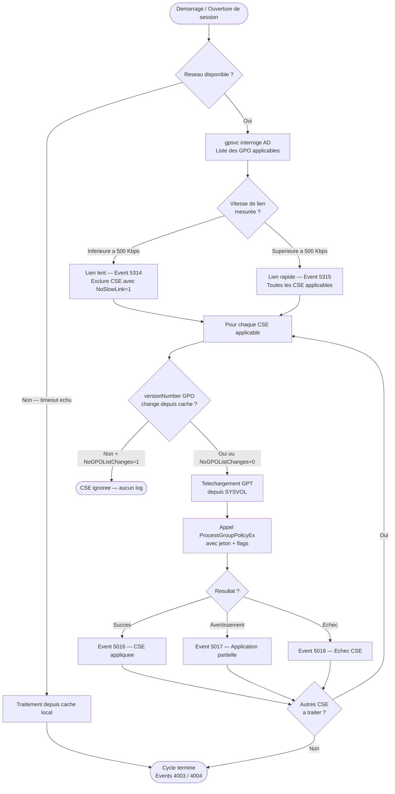

# Traitement des stratégies : cycle et modes

!!! abstract "Ce que couvre ce chapitre"
    - Les deux modes de traitement foreground (synchrone) et background (periodique) et la difference comportementale entre les deux
    - Le flag `SyncForegroundPolicy` et les CSE qui exigent le mode synchrone pour fonctionner correctement
    - La detection de lien lent et son seuil de 500 Kbps — quelles CSE s'executent et lesquelles sont ignorees
    - La syntaxe complete de `gpupdate` et `Invoke-GPUpdate` pour forcer le traitement a distance
    - Le journal d'evenements operationnel Group Policy : les Event IDs essentiels pour diagnostiquer un cycle defaillant
    - Le cache local des GPO — ou il se trouve, comment il est invalide, comment le vider proprement
    - Le mecanisme `WaitForNetwork` et ce qui se passe quand le reseau n'est pas disponible au demarrage


!!! tip "Si vous ne retenez qu'une chose"
    Comprendre une GPO revient à suivre sa séquence complète : découverte, filtrage, ordre d'application, puis exécution par CSE.

---

## :material-refresh: Vue d'ensemble du cycle de traitement

Le service `gpsvc` (Group Policy Client Service) est le chef d'orchestre de tout le traitement des GPO. Il ne dort jamais completement : il gere deux cycles distincts, chacun avec ses propres regles de declenchement.

Le **cycle foreground** se produit a des moments precisement definis du cycle de vie Windows — demarrage de la machine et ouverture de session utilisateur. Il est synchrone par defaut : le systeme attend que toutes les CSE aient fini avant de continuer.

Le **cycle background** se produit periodiquement, en tache de fond, pendant que l'utilisateur travaille. Il est leger par conception : de nombreuses CSE le sautent intentionnellement.

Ces deux cycles ne sont pas symetriques. Confondre leurs comportements est la source numero un des bugs de "la GPO ne s'applique pas".

!!! quote "En résumé"
    `gpsvc` orchestre deux types de cycles independants. Le foreground est precis et synchrone, declenche par des evenements systeme. Le background est periodique et allege. Comprendre lequel s'applique dans quel contexte est fondamental avant tout diagnostic.

---

## :material-monitor-screenshot: Le traitement foreground

### :material-play-circle: Quand se declenche-t-il ?

Le foreground machine se declenche au **demarrage** de la machine, avant que l'ecran de connexion n'apparaisse.

Le foreground utilisateur se declenche a l'**ouverture de session**, apres l'authentification mais avant que le bureau ne soit rendu visible.

Ces deux declencheurs sont discrets et invisibles a l'utilisateur final, mais ils constituent la fenetre d'application la plus importante pour les parametres critiques.

### :material-sync: Mode synchrone vs mode asynchrone

Par defaut sur Windows 10 et 11, le foreground s'execute en mode **asynchrone**. Le bureau apparait pendant que les CSE continuent leur travail en arriere-plan. Le demarrage parait plus rapide, mais certains parametres ne sont pas encore appliques quand l'utilisateur commence a travailler.

En mode **synchrone**, Windows attend que toutes les CSE foreground aient termine avant d'afficher le bureau ou l'ecran de connexion. Le demarrage est plus long, mais les parametres sont garantis au moment ou l'utilisateur prend la main.

La cle de registre qui controle ce comportement est :

```
HKLM\SOFTWARE\Microsoft\Windows NT\CurrentVersion\Winlogon
  SyncForegroundPolicy  REG_DWORD
    0 = asynchrone (defaut Windows 10/11)
    1 = synchrone
```

!!! info "Comment Windows decide du mode au demarrage"
    `gpsvc` ne lit pas uniquement cette valeur statique. Il detecte aussi les situations qui forcent le mode synchrone : premier demarrage apres une jointure de domaine, modification de la liste de GPO lors du dernier cycle, ou presence de CSE qui ont signale avoir besoin d'un prochain cycle synchrone via le flag `ERROR_SYNC_FOREGROUND_REFRESH_REQUIRED`.

### :material-alert: CSE qui exigent le mode synchrone

Certaines CSE ne peuvent pas fonctionner en mode asynchrone. Elles ont besoin que le systeme soit dans un etat stable avant de s'executer.

**Folder Redirection** (`fdeploy.dll`) doit absolument s'executer avant que le profil utilisateur ne soit charge. Si le bureau apparait avant que la redirection ne soit appliquee, le profil s'est charge depuis le mauvais emplacement. Le resultat : les documents de l'utilisateur pointent vers `C:\Users\...` au lieu du partage reseau.

**Software Installation** (`appmgmts.dll`) doit appliquer les installations et suppressions avant que l'utilisateur puisse lancer des applications. Un bureau asynchrone signifie qu'un utilisateur peut tenter de lancer une application qui est en cours d'installation.

Ces deux CSE positionnent le flag `ERROR_SYNC_FOREGROUND_REFRESH_REQUIRED` lors de leur premiere application, ce qui force Windows a passer en mode synchrone pour les cycles suivants jusqu'a ce que la situation soit stable.

!!! warning "Pieges en production"
    Si vous deployez Folder Redirection sur des machines qui ont deja des profils locaux, le premier demarrage en mode synchrone peut etre significativement plus long. Prevoyez ce comportement lors du deploiement et communiquez-le aux equipes de support.

### :material-powershell: Forcer le mode synchrone via GPO

La methode officielle pour activer le mode synchrone est via une GPO, pas via une modification directe du registre :

```
Computer Configuration
  → Administrative Templates
    → System
      → Logon
        → Always wait for the network at computer startup and logon
```

Cette GPO ecrit la valeur `GpNetworkStartTimeoutPolicyValue` et positionne `SyncForegroundPolicy` a `1`.

```powershell title="Vérifier le mode de traitement foreground actuel"
$winlogon = "HKLM:\SOFTWARE\Microsoft\Windows NT\CurrentVersion\Winlogon"
$sync = (Get-ItemProperty $winlogon -ErrorAction SilentlyContinue).SyncForegroundPolicy
if ($null -eq $sync) {
    Write-Host "SyncForegroundPolicy: absent (asynchronous by default)"
} else {
    Write-Host "SyncForegroundPolicy: $sync ($(if ($sync -eq 1) {'synchronous'} else {'asynchronous'}))"
}
```

```text title="Résultat attendu"
SyncForegroundPolicy: 1 (synchronous)
```

!!! quote "En résumé"
    Le foreground est le cycle d'application le plus complet. Il se declenche au demarrage et a l'ouverture de session. En mode asynchrone (defaut), le bureau apparait avant la fin du traitement — ce qui est invisible pour la plupart des CSE mais problematique pour Folder Redirection et Software Installation. Ces deux CSE forcent automatiquement le mode synchrone lors de leur premiere application.

---

## :material-timer-refresh-outline: Le traitement background

### :material-clock-outline: L'intervalle de 90 minutes

Le traitement background se produit toutes les **90 minutes**, avec une variation aleatoire de **0 a 30 minutes** ajoutee a cet intervalle.

Cette randomisation n'est pas anodine. Sur un parc de 5 000 machines, si toutes interrogeaient les controleurs de domaine exactement au meme instant, la charge serait insoutenable. La variation aleatoire etale les requetes dans le temps.

L'intervalle effectif est donc compris entre 90 et 120 minutes pour la plupart des machines.

### :material-cog-outline: Configurer l'intervalle background

La GPO de configuration se trouve a :

```
Computer Configuration
  → Administrative Templates
    → System
      → Group Policy
        → Set Group Policy refresh interval for computers
        → Set Group Policy refresh interval for users
```

Les deux parametres sont distincts : l'un controle le refresh de la strategie machine, l'autre controle le refresh de la strategie utilisateur.

Les cles de registre correspondantes :

```
HKLM\SOFTWARE\Policies\Microsoft\Windows\System
  GroupPolicyRefreshTime        REG_DWORD  (minutes — intervalle de base)
  GroupPolicyRefreshTimeOffset  REG_DWORD  (minutes — variation aleatoire maximale)
```

!!! info "Valeur 0 : attention"
    Positionner `GroupPolicyRefreshTime` a `0` ne desactive pas le refresh. Cela signifie que le refresh se produit toutes les 7 secondes — ce qui peut saturer les controleurs de domaine. Ne jamais mettre cette valeur a 0 en production.

### :material-cancel: Ce que le background ne fait pas

Le traitement background est deliberement allege. La plupart des CSE "lourdes" positionnent `NoBackgroundPolicy = 1` et sont donc completement ignorees lors des refreshes periodiques.

Les CSE qui s'executent en background :

- **Registry (ADMX)** — `NoBackgroundPolicy = 0` : applique les parametres de registre a chaque refresh
- **Group Policy Preferences** — `NoBackgroundPolicy = 0` : applique les preferences a chaque refresh

Les CSE qui ignorent le background :

- Scripts, Folder Redirection, Software Installation et Audit Policy — toutes avec `NoBackgroundPolicy = 1`

```powershell title="Identifier les CSE actives en background"
$cseKey = "HKLM:\SOFTWARE\Microsoft\Windows NT\CurrentVersion\Winlogon\GPExtensions"
Get-ChildItem $cseKey | ForEach-Object {
    $props = Get-ItemProperty $_.PSPath -ErrorAction SilentlyContinue
    $noBg  = $props.NoBackgroundPolicy
    [PSCustomObject]@{
        GUID         = $_.PSChildName
        Name         = $props.'(default)'
        BackgroundOK = if ($null -eq $noBg -or $noBg -eq 0) { "Oui" } else { "Non" }
    }
} | Where-Object { $_.BackgroundOK -eq "Oui" } | Format-Table -AutoSize
```

```text title="Résultat attendu"
GUID                                   Name                     BackgroundOK
----                                   ----                     ------------
{35378EAC-683F-11D2-A89A-00C04FBBCFA2} Registry                 Oui
{0E28E245-9368-4853-AD84-6DA3BA35BB75} Group Policy Preferences  Oui
```

!!! warning "Implication pour les changements de securite"
    La CSE Security peut etre reappliquee en background (`NoBackgroundPolicy = 0`), mais certains sous-composants voisins comme Scripts, Folder Redirection ou Software Installation restent dependants d'un vrai foreground. En production, distinguez bien ce qui releve de Security et ce qui exige encore `/boot` ou `/logoff`.

!!! quote "En résumé"
    Le background refresh se produit toutes les 90 a 120 minutes. Il est concu pour etre leger : seules les CSE Registry et Preferences s'executent reellement. Les parametres de securite, les scripts et la redirection de dossiers ne sont jamais mis a jour en background — ils attendent le prochain foreground.

---

## :material-speedometer-slow: Detection de lien lent

### :material-gauge: Le seuil de 500 Kbps

Avant d'appliquer les GPO, `gpsvc` mesure la vitesse de la connexion vers le controleur de domaine. Si cette vitesse est inferieure au seuil configure, la connexion est qualifiee de **lien lent** (slow link).

Le seuil par defaut est de **500 Kbps** (kilobits par seconde, pas kilooctets).

La GPO de configuration :

```
Computer Configuration
  → Administrative Templates
    → System
      → Group Policy
        → Configure Group Policy slow link detection
```

La cle de registre correspondante :

```
HKLM\SOFTWARE\Policies\Microsoft\Windows\System
  GroupPolicyMinTransferRate  REG_DWORD  (Kbps)
    0 = toujours considerer comme lien rapide
    500 = seuil par defaut
```

### :material-table: Comportement des CSE sur lien lent

Chaque CSE declare son comportement sur lien lent via le flag `NoSlowLink` dans sa cle de registre `GPExtensions`.

| CSE | `NoSlowLink` | Comportement sur lien lent |
|-----|:------------:|----------------------------|
| Registry (ADMX) | `0` | S'execute meme sur lien lent |
| Security | `0` | S'execute meme sur lien lent |
| Group Policy Preferences | `0` | S'execute meme sur lien lent |
| Folder Redirection | `1` | Ignore sur lien lent |
| Software Installation | `1` | Ignore sur lien lent |
| Scripts | `1` | Ignore sur lien lent |
| Disk Quota | `1` | Ignore sur lien lent |
| Wireless Policy | `1` | Ignore sur lien lent |

Les CSE qui s'executent sur lien lent sont celles dont les donnees a transferer sont legeres (fichiers `registry.pol`, fichiers de preferences XML). Les CSE qui sont ignorees sont celles qui necessitent le telechargement de fichiers volumineux depuis SYSVOL (packages MSI, scripts).

!!! info "La valeur 0 pour GroupPolicyMinTransferRate"
    Mettre le seuil a `0` force toutes les CSE a considerer la connexion comme un lien rapide, quelle que soit la vitesse reelle. Utile pour les environnements VPN ou la mesure de bande passante est peu fiable. A utiliser avec prudence : les installations de logiciels et scripts s'executeront meme sur des connexions tres lentes.

### :material-magnify: Journalisation de la detection de lien lent

La detection de lien lent est journalisee dans le journal operationnel Group Policy :

- **Event ID 5314** : lien lent detecte (avec la vitesse mesuree en Kbps)
- **Event ID 5315** : lien rapide detecte

```powershell title="Consulter les détections de lien lent récentes"
Get-WinEvent -LogName "Microsoft-Windows-GroupPolicy/Operational" -MaxEvents 1000 |
    Where-Object { $_.Id -in @(5314, 5315) } |
    Select-Object TimeCreated, Id,
        @{N="Type"; E={ if ($_.Id -eq 5314) {"Lien lent"} else {"Lien rapide"} }},
        @{N="Detail"; E={ $_.Message -replace "`n"," " }} |
    Sort-Object TimeCreated -Descending |
    Select-Object -First 20 |
    Format-Table -AutoSize -Wrap
```

```text title="Résultat attendu"
TimeCreated             Id   Type       Detail
-----------             --   ----       ------
2026-04-05 08:32:11     5315 Lien rapide The network bandwidth is 125000 Kbps...
2026-04-04 08:30:44     5315 Lien rapide The network bandwidth is 125000 Kbps...
```

!!! quote "En résumé"
    La detection de lien lent est une protection contre le telechargement de fichiers volumineux sur des connexions degradees. Le seuil par defaut de 500 Kbps exclut les CSE les plus gourmandes en bande passante. Les CSE de registre et de securite s'executent toujours. La valeur `0` desactive effectivement la detection — utile en VPN mais a documenter.

---

## :material-console: `gpupdate` : syntaxe complete et variantes

### :material-help-circle: Reference des parametres

`gpupdate` est la commande qui declenche manuellement un cycle de traitement Group Policy. Elle accepte plusieurs parametres qui modifient finement son comportement.

| Parametre | Description |
|-----------|-------------|
| `/force` | Reapplique toutes les GPO meme si la liste n'a pas change depuis le dernier cycle — ignore `NoGPOListChanges` |
| `/target:computer` | Applique uniquement la strategie machine (n'impacte pas l'utilisateur courant) |
| `/target:user` | Applique uniquement la strategie utilisateur |
| `/wait:N` | Attend N secondes que le traitement se termine (`0` = ne pas attendre, `-1` = attendre indefiniment) |
| `/logoff` | Deconnecte l'utilisateur apres application — necessaire pour Folder Redirection |
| `/boot` | Redemarre l'ordinateur apres application — necessaire pour Software Installation |
| `/sync` | Force le mode synchrone pour ce cycle uniquement |

!!! info "gpupdate sans /force"
    Sans `/force`, `gpupdate` respecte `NoGPOListChanges`. Si la liste de GPO n'a pas change, les CSE avec `NoGPOListChanges = 1` sont ignorees. Cela signifie qu'un `gpupdate` sans `/force` peut etre completement muet sur une machine stable — c'est normal et intentionnel.

### :material-code-tags: Exemples pratiques

```powershell title="Forcer un refresh complet et attendre la fin"
gpupdate /force /wait:-1
```

```powershell title="Appliquer uniquement la stratégie machine"
# Does not disturb the current user session
gpupdate /target:computer /force
```

```powershell title="Forcer avec redémarrage automatique si nécessaire"
# Useful for Software Installation policies that require a restart
gpupdate /force /boot
```

```powershell title="Forcer avec déconnexion pour Folder Redirection"
# The user will be logged off after GPO processing
gpupdate /force /logoff
```

### :material-remote-desktop: Refresh a distance via PowerShell

`Invoke-GPUpdate` est l'equivalent PowerShell de `gpupdate`, mais il peut cibler des machines distantes. Il s'appuie sur WMI pour creer une tache planifiee temporaire sur la machine cible.

```powershell title="Forcer le refresh sur une machine distante"
Invoke-GPUpdate -Computer "PC-DUPONT" -Force -RandomDelayInMinutes 0
```

```powershell title="Forcer le refresh sur toutes les machines d'une OU"
$ou = "OU=Postes-Standard,DC=contoso,DC=local"
Get-ADComputer -Filter * -SearchBase $ou |
ForEach-Object {
    try {
        Invoke-GPUpdate -Computer $_.Name -Force -RandomDelayInMinutes 0 -ErrorAction Stop
        Write-Host "Updated: $($_.Name)" -ForegroundColor Green
    } catch {
        Write-Warning "Failed: $($_.Name) — $_"
    }
}
```

```text title="Résultat attendu"
Updated: PC-ALICE
Updated: PC-BOB
WARNING: Failed: PC-CHARLIE — The computer 'PC-CHARLIE' cannot be reached...
Updated: PC-DENIS
```

!!! warning "Prerequis pour Invoke-GPUpdate a distance"
    La machine cible doit etre accessible via WMI (port 135 + ports dynamiques RPC). Le pare-feu Windows doit autoriser `Windows Management Instrumentation (WMI-In)`. Sur les reseaux segmentes, cette communication peut etre bloquee — dans ce cas, `gpupdate /force` via une session RDP ou PSEXEC reste l'alternative.

### :material-microsoft: Refresh via la GPMC

La GPMC (Group Policy Management Console) integre depuis Windows Server 2012 une fonctionnalite de refresh de masse.

1. Dans la GPMC, faire un clic droit sur une OU
2. Selectionner **"Group Policy Update..."**
3. La GPMC envoie via WMI une tache planifiee temporaire a chaque ordinateur de l'OU
4. Chaque machine execute `gpupdate /force` avec un delai aleatoire de 0 a 10 minutes

Cette interface est un alias graphique de `Invoke-GPUpdate` applique a tous les membres de l'OU. Elle n'est pas recursive : elle ne descend pas dans les sous-OU sauf si vous la lancez depuis chaque OU individuellement.

!!! info "Pourquoi le delai aleatoire de 10 minutes ?"
    Meme en refresh force, la GPMC preserve l'etalement temporel. Si vous forcez un refresh sur une OU de 200 machines, elles ne vont pas toutes interroger le controleur de domaine simultanement. Le delai de 0 a 10 minutes est calcule aleatoirement par la GPMC pour chaque machine au moment de l'envoi de la tache.

!!! quote "En résumé"
    `gpupdate /force` est l'outil du quotidien pour forcer un cycle de traitement. Les parametres `/logoff` et `/boot` sont indispensables pour les CSE qui ne s'executent qu'en foreground. `Invoke-GPUpdate` permet le refresh a distance depuis PowerShell ou via la GPMC, mais il exige une connectivite WMI.

---

## :material-chart-timeline-variant: Le journal d'evenements Group Policy Operational

### :material-folder-open: Acces au journal

Le journal operationnel Group Policy se trouve sous :

```
Observateur d'evenements
  → Journaux des applications et des services
    → Microsoft
      → Windows
        → GroupPolicy
          → Operational
```

Ce journal enregistre chaque etape du cycle de traitement, de la liste des GPO applicables jusqu'a l'execution de chaque CSE individuelle.

### :material-table-large: Reference des Event IDs essentiels

| Event ID | Niveau | Description |
|----------|--------|-------------|
| `4001` | Information | Debut du traitement Group Policy (contexte machine) |
| `4002` | Information | Debut du traitement Group Policy (contexte utilisateur) |
| `4003` | Information | Traitement Group Policy termine (contexte utilisateur) |
| `4004` | Information | Traitement Group Policy termine (contexte machine) |
| `4016` | Information | Debut du traitement par une CSE individuelle |
| `4017` | Information | Fin du traitement par une CSE individuelle (duree en millisecondes incluse) |
| `5016` | Information | CSE appliquee avec succes |
| `5017` | Avertissement | CSE appliquee avec avertissement (parametres partiellement appliques) |
| `5018` | Erreur | Echec de la CSE (parametres non appliques) |
| `5312` | Information | Liste complete des GPO applicables pour ce cycle |
| `5313` | Information | GPO ecartee avec la raison (filtre de securite, filtre WMI, lien desactive...) |
| `5314` | Information | Lien lent detecte (vitesse mesuree incluse) |
| `5315` | Information | Lien rapide detecte |
| `5320` | Information | Resultat d'evaluation d'un filtre WMI |

!!! info "Event 4017 : l'outil de mesure de performance"
    L'Event ID 4017 inclut la duree d'execution de chaque CSE en millisecondes. C'est le point d'entree pour diagnostiquer les demarrages lents : comparez les durees CSE par CSE pour identifier celle qui ralentit le processus.

### :material-powershell: Extraire les durees de traitement

```powershell title="Analyser les durées du dernier cycle de traitement"
$events = Get-WinEvent -LogName "Microsoft-Windows-GroupPolicy/Operational" -MaxEvents 500 |
    Where-Object { $_.Id -in @(4001, 4002, 4003, 4004) }

$events | Select-Object TimeCreated, Id,
    @{N="Contexte"; E={ if ($_.Id -in @(4001, 4004)) {"Machine"} else {"Utilisateur"} }},
    @{N="Phase";    E={ if ($_.Id -in @(4001, 4002)) {"Debut"} else {"Fin"} }} |
    Sort-Object TimeCreated |
    Format-Table -AutoSize
```

```text title="Résultat attendu"
TimeCreated             Id   Contexte     Phase
-----------             --   --------     -----
2026-04-05 08:30:01     4001 Machine      Debut
2026-04-05 08:30:04     4004 Machine      Fin
2026-04-05 08:30:22     4002 Utilisateur  Debut
2026-04-05 08:30:31     4003 Utilisateur  Fin
```

```powershell title="Extraire les durées par CSE (Event 4017)"
Get-WinEvent -LogName "Microsoft-Windows-GroupPolicy/Operational" -MaxEvents 200 |
    Where-Object { $_.Id -eq 4017 } |
    ForEach-Object {
        $xml = [xml]$_.ToXml()
        $ns  = @{ e = "http://schemas.microsoft.com/win/2004/08/events/event" }
        $cse = (Select-Xml -Xml $xml -Namespace $ns -XPath "//e:Data[@Name='CSEExtensionName']").Node.'#text'
        $ms  = (Select-Xml -Xml $xml -Namespace $ns -XPath "//e:Data[@Name='ElapsedTimeInMilliseconds']").Node.'#text'
        [PSCustomObject]@{
            Time         = $_.TimeCreated
            CSE          = $cse
            DurationMs   = [int]$ms
            DurationSec  = [math]::Round([int]$ms / 1000, 2)
        }
    } |
    Sort-Object DurationMs -Descending |
    Format-Table -AutoSize
```

```text title="Résultat attendu"
Time                    CSE                              DurationMs DurationSec
----                    ---                              ---------- -----------
2026-04-05 08:30:22     Group Policy Preferences         4823       4.82
2026-04-05 08:30:22     Security                         1201       1.20
2026-04-05 08:30:22     Registry                         312        0.31
2026-04-05 08:30:22     Scripts                          89         0.09
```

### :material-list-status: Lire la liste des GPO applicables

L'Event ID 5312 contient la liste complete des GPO qui ont ete appliquees lors du cycle. L'Event ID 5313 liste celles qui ont ete ecartees, avec la raison.

```powershell title="Afficher les GPO appliquées et refusées du dernier cycle"
$cycleEvents = Get-WinEvent -LogName "Microsoft-Windows-GroupPolicy/Operational" -MaxEvents 500 |
    Where-Object { $_.Id -in @(5312, 5313) } |
    Select-Object -First 20

$cycleEvents | Select-Object TimeCreated, Id,
    @{N="Statut"; E={ if ($_.Id -eq 5312) {"Appliquee"} else {"Ignoree"} }},
    @{N="Detail"; E={ ($_.Message -split "`n")[1..3] -join " " }} |
    Format-Table -AutoSize -Wrap
```

!!! warning "Journal Operational desactive par defaut sur certains systemes"
    Sur quelques configurations, le journal `GroupPolicy/Operational` peut etre desactive ou avoir une taille maximale tres petite. Verifiez qu'il est actif et qu'il conserve suffisamment d'entrees pour couvrir au moins 24 heures de cycles.

    ```powershell
    # Check and configure the operational log
    $log = Get-WinEvent -ListLog "Microsoft-Windows-GroupPolicy/Operational"
    $log.IsEnabled
    $log.MaximumSizeInBytes  # default: 4 MB — consider increasing to 20 MB
    ```

!!! quote "En résumé"
    Le journal operationnel Group Policy est l'outil de diagnostic principal. Les Event IDs 4001/4004 et 4002/4003 delimitent le debut et la fin de chaque cycle. Le 4017 mesure la duree de chaque CSE. Les 5312/5313 revelent quelles GPO ont ete appliquees et lesquelles ont ete ecartees et pourquoi.

---

## :material-wifi-off: Traitement sans reseau et WaitForNetwork

### :material-lan-disconnect: Quand le reseau n'est pas disponible

Au demarrage, si `gpsvc` ne peut pas joindre un controleur de domaine, il ne reste pas bloque indefiniment. Apres un delai configurable, il bascule sur le **cache local** et applique la derniere configuration connue.

La cle qui controle ce delai d'attente :

```
HKLM\SOFTWARE\Microsoft\Windows NT\CurrentVersion\Winlogon
  GpNetworkStartTimeoutPolicyValue  REG_DWORD  (secondes)
```

La valeur par defaut est de 30 secondes sur les machines recentes.

!!! info "La GPO correspondante"
    Cette valeur est configuree via la GPO `Computer Configuration → Administrative Templates → System → Logon → Always wait for the network at computer startup and logon`. Cette GPO ecrit simultanement `SyncForegroundPolicy = 1` et `GpNetworkStartTimeoutPolicyValue`.

### :material-database-alert: Comportement apres basculement sur cache

Quand `gpsvc` applique les politiques depuis le cache local, il ecrit dans le journal operationnel un evenement specifique. Le cycle est considere comme "partiellement reussi" : les parametres de la derniere session sont preserves, mais les eventuels changements de GPO depuis le dernier cycle ne sont pas visibles.

Point critique : une fois que `gpsvc` a traite le foreground depuis le cache (avec ou sans reseau), il ne retraite **pas** automatiquement les GPO quand le reseau devient disponible en cours de session. Le prochain cycle foreground aura lieu au prochain demarrage ou a la prochaine ouverture de session.

!!! warning "Pieges avec les postes portables"
    Sur un portable qui demarre hors reseau, se connecte au VPN, puis se connecte en RDP a des ressources du domaine, les GPO ne sont pas reappliquees automatiquement. Seul le prochain demarrage ou le prochain background refresh (pour les CSE compatibles) mettra a jour les parametres. Cela peut creer des incoherences visibles — notamment sur les mappings de lecteurs reseau geres par les GPO Preferences.

!!! quote "En résumé"
    Sans reseau, `gpsvc` attend jusqu'a `GpNetworkStartTimeoutPolicyValue` secondes puis traite les GPO depuis le cache local. Ce comportement est robuste pour la continuite de service, mais il signifie que les changements de GPO ne sont pas visibles avant le prochain cycle avec reseau disponible.

---

## :material-cached: Le cache local des GPO

### :material-folder: Emplacement des caches

Windows maintient deux caches GPO distincts sur chaque machine.

Le cache machine (Computer Policy) :

```
%SystemRoot%\System32\GroupPolicy\
```

Le cache utilisateur (User Policy, un repertoire par SID utilisateur) :

```
%SystemRoot%\System32\GroupPolicyUsers\{SID-de-l-utilisateur}\
```

Ces repertoires contiennent une copie locale du Group Policy Template (GPT) telecharge depuis SYSVOL lors du dernier cycle.

### :material-compare: Mecanisme d'invalidation du cache

`gpsvc` compare la version de la GPO en cache avec la version en cours dans Active Directory. Chaque GPO possede un attribut `versionNumber` dans son objet GPC (Group Policy Container). Ce numero est incremente a chaque modification dans la GPMC.

Si le `versionNumber` dans AD est superieur a celui dans le cache local, `gpsvc` re-telecharge le GPT complet depuis SYSVOL avant d'appeler la CSE correspondante.

Si le `versionNumber` est identique, `gpsvc` utilise les fichiers caches locaux et n'effectue aucun transfert reseau pour cette GPO.

Ce mecanisme est la raison pour laquelle les GPO non modifiees n'impliquent pas de trafic reseau lors des refreshes periodiques.

!!! info "Ou voir le versionNumber ?"
    Dans ADSI Edit, ouvrez le GPC de la GPO (sous `CN=Policies,CN=System,DC=...`). L'attribut `versionNumber` est un entier encode : les 16 bits de poids fort contiennent la version utilisateur, les 16 bits de poids faible contiennent la version machine. Chaque modification dans la GPMC incremente l'un ou l'autre selon ce qui a ete modifie.

### :material-delete-sweep: Vider le cache pour forcer un re-telechargement

Il est parfois necessaire de vider le cache local pour forcer un telechargement complet depuis SYSVOL. Cela est utile quand on suspecte une corruption du cache ou apres une restauration de GPO.

```powershell title="Vider le cache GPO local (nécessite les droits administrateur)"
# Stop Group Policy Client Service before clearing cache
Stop-Service gpsvc -Force

# Clear machine policy cache
Remove-Item "$env:SystemRoot\System32\GroupPolicy\*" -Recurse -Force -ErrorAction SilentlyContinue

# Clear all user policy caches
Remove-Item "$env:SystemRoot\System32\GroupPolicyUsers\*" -Recurse -Force -ErrorAction SilentlyContinue

# Restart the service
Start-Service gpsvc

# Trigger a full refresh (all CSEs will re-download from SYSVOL)
gpupdate /force /wait:-1
Write-Host "Cache cleared and full GPO refresh triggered." -ForegroundColor Green
```

```text title="Résultat attendu"
Updating Policy...
User Policy update has completed successfully.
Computer Policy update has completed successfully.
Cache cleared and full GPO refresh triggered.
```

!!! warning "Ne pas vider le cache en production sans raison valide"
    Vider le cache force le re-telechargement de **toutes** les GPO depuis SYSVOL. Sur un parc important, si vous effacez le cache de 500 machines simultanement, vous creerez un pic de charge significatif sur les controleurs de domaine et les serveurs DFS-R. Effectuez cette operation machine par machine, ou echelon-nez sur plusieurs heures.

!!! quote "En résumé"
    Le cache local stocke les GPT pour eviter les re-telechargements inutiles. L'invalidation est basee sur le `versionNumber` de l'objet GPC dans Active Directory. Vider le cache force un re-telechargement complet mais peut creer une charge significative sur les DC si effectue en masse.

---

## :material-chart-gantt: Flowchart du cycle complet

Le diagramme suivant represente le flux de decisions complet d'un cycle foreground, depuis le declenchement jusqu'a la journalisation du resultat.




!!! quote "En résumé"
    - Le schéma sur flowchart du cycle complet sert à visualiser l’ordre, les dépendances et les points de rupture du mécanisme.
    - Relisez cette vue d’ensemble avant un diagnostic : elle montre où une étape manquante casse tout le flux.
    - Cette section fixe l’essentiel à retenir sur flowchart du cycle complet.
    - Retenez surtout ce qui change la portée, l’ordre d’application ou le résultat final observé.
    - Ce résumé sert à vérifier que vous avez retenu le mécanisme, sa portée et sa conséquence pratique.
---

## :material-puzzle-outline: Interactions entre les mecanismes

### :material-link-variant: Comment les mecanismes s'influencent

Les differents mecanismes decrits dans ce chapitre ne sont pas independants. Ils interagissent a chaque cycle de traitement.

Un exemple concret : machine portable, utilisateur itinerant, VPN.

1. La machine demarre **hors reseau** → basculement sur le cache local apres 30 secondes
2. L'utilisateur ouvre une session → policies appliquees depuis le cache, versions en retard
3. L'utilisateur se connecte au VPN → le reseau est desormais disponible
4. Le prochain **background refresh** (dans 90 a 120 minutes) s'execute
5. `gpsvc` detecte le lien VPN → mesure de bande passante
6. Si la bande passante est inferieure a 500 Kbps → lien lent, Folder Redirection ignoree
7. Les parametres de registre et les preferences sont mis a jour via le cache invalide
8. La securite peut se reappliquer, mais Folder Redirection et les autres CSE foreground-only attendent toujours un vrai foreground

Ce scenario illustre pourquoi un utilisateur portable peut avoir des parametres incoherents en journee — et pourquoi la solution n'est pas seulement `gpupdate /force` : pour Folder Redirection et les autres CSE foreground-only, il faut un **redemarrage** ou une **reconnexion** avec reseau disponible.

!!! info "Priorite des mecanismes"
    L'ordre de priorite est : mode synchrone/asynchrone → detection de lien lent → `NoBackgroundPolicy` → `NoGPOListChanges`. Chaque mecanisme peut court-circuiter les suivants. Construisez votre diagnostic en remontant cet ordre.

### :material-timer-check: Recapitulatif des intervalles et seuils

| Parametre | Valeur par defaut | Configurable via GPO |
|-----------|:-----------------:|:--------------------:|
| Intervalle background machine | 90 min ± 30 min | Oui |
| Intervalle background utilisateur | 90 min ± 30 min | Oui |
| Seuil lien lent | 500 Kbps | Oui |
| Delai attente reseau | 30 secondes | Oui |
| MaxNoGPOListChangesInterval (Security) | 960 min (16h) | Non (hard-code CSE) |
| Delai aleatoire refresh GPMC | 0 a 10 min | Non |
| Delai aleatoire background natif | 0 a 30 min | Oui (offset) |

!!! quote "En résumé"
    Les mecanismes de traitement GPO forment un systeme de filtres en cascade. Chaque couche — mode synchrone, detection de lien lent, flags NoBackgroundPolicy — peut eliminer une CSE pour un cycle donne. Comprendre l'ordre de ces filtres est la cle d'un diagnostic efficace.

---

## :material-link: Cross-references

| Sujet | Reference |
|-------|-----------|
| Flags `NoBackgroundPolicy`, `NoSlowLink`, `NoGPOListChanges` par CSE | Ch. 03 — Client-Side Extensions |
| Cache local et mecanisme `versionNumber` / GPC | Ch. 02 — Architecture |
| RSoP et lecture des resultats de traitement | Ch. 20 — RSoP et diagnostic |
| Optimisation des temps de traitement et impact sur les DC | Ch. 23 — Performances |
| Diagnostic complet quand `gpupdate` ne fonctionne pas | Les GPO pour les Nuls — Ch. 12 |
| Comportement du traitement en environnement MDM hybride | Ch. 25 — MDM et convergence |

!!! quote "En résumé"
    - À relire : Flags NoBackgroundPolicy, NoSlowLink, NoGPOListChanges par CSE → Ch. 03 — Client-Side Extensions.
    - À relire : Cache local et mecanisme versionNumber / GPC → Ch. 02 — Architecture.
    - À relire : RSoP et lecture des resultats de traitement → Ch. 20 — RSoP et diagnostic.
    - À relire : Optimisation des temps de traitement et impact sur les DC → Ch. 23 — Performances.
    - Ces renvois prolongent le chapitre avec des mécanismes complémentaires ou des cas d’usage voisins.
