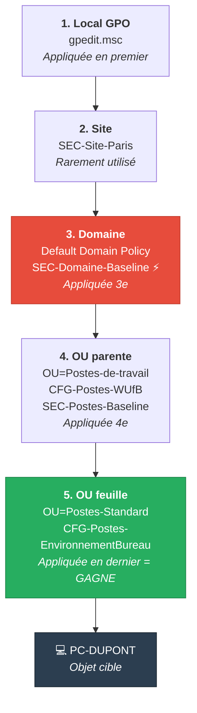

# Héritage et ordre d'application (LSDOU)

!!! abstract "Ce que couvre ce chapitre"
    - L'ordre d'application LSDOU et pourquoi le dernier appliqué gagne les conflits — avec le détail des OU imbriquées
    - L'attribut LDAP `gPLink` : format exact, valeurs de flag (0-3), et la relation contre-intuitive entre position dans la chaîne et Link Order affiché dans GPMC
    - L'attribut `gPOptions` et ce que Block Inheritance bloque réellement — et ce qu'il ne bloque PAS
    - Enforced (No Override) : propriété du lien, pas de la GPO — comportement en présence de Block Inheritance
    - Résolution de conflits entre plusieurs GPO liées à la même OU
    - PowerShell pour lire, décoder et auditer l'héritage en production

---

!!! tip "Si vous ne retenez qu'une chose"
    Le dernier mot appartient toujours à l'OU la plus proche de l'objet. Sauf si une GPO parente est marquée **Enforced** — dans ce cas, elle gagne toujours, quelle que soit la profondeur.

---

## :material-layers-outline: L'ordre LSDOU

LSDOU n'est pas un acronyme fantaisiste. C'est l'ordre exact dans lequel `gpsvc` empile les GPO avant d'appliquer les paramètres.

**L** → Local GPO (`gpedit.msc`, sur la machine elle-même)

**S** → Site GPO (liée au site Active Directory de la machine)

**D** → Domain GPO (liée à la racine du domaine)

**O** → OU GPO (liée à l'OU contenant l'objet, des OU parentes vers l'OU feuille)

Le principe fondamental : **le dernier appliqué l'emporte**. Une GPO appliquée en étape 5 écrase toujours une GPO appliquée en étape 2 sur le même paramètre.

### :material-numeric-1-circle: Local GPO

La Local GPO est unique à chaque machine. Elle s'applique en premier, donc elle est la plus facilement écrasable par n'importe quelle GPO AD.

Elle est gérée via `gpedit.msc` sur la machine locale ou via l'outil `LGPO.exe` pour l'automatisation. Son emplacement sur disque est `%SystemRoot%\System32\GroupPolicy\`.

!!! info "Multiple Local GPOs (MLGPO)"
    Depuis Windows Vista, il existe en réalité plusieurs Local GPOs : une pour "Local Computer", une pour "Administrators", une pour "Non-Administrators", et une par utilisateur local. Elles s'appliquent dans cet ordre. Le chapitre 21 couvre ce sujet en détail.

### :material-map-marker: Site GPO

Le site Active Directory représente une topologie réseau — typiquement un emplacement physique ou un sous-réseau. Les GPO liées à un site s'appliquent à tous les objets du domaine dont l'adresse IP appartient à ce site.

Les GPO de site sont rarement utilisées en pratique. Leur gestion est piégée : elles sont stockées dans le domaine de leur DC de référence mais s'appliquent potentiellement à des objets d'autres domaines dans une forêt.

!!! warning "Piège production : GPO de site et forêts multi-domaines"
    Dans une forêt multi-domaines, une GPO liée à un site s'applique aux machines de TOUS les domaines appartenant à ce site. Si votre GPO référence des paramètres spécifiques à un domaine (chemins UNC avec nom de domaine, etc.), vérifiez que la GPO est cohérente pour tous les domaines.

### :material-domain: Domain GPO

Les GPO liées à la racine du domaine (`DC=contoso,DC=local`) s'appliquent à tous les objets du domaine. C'est l'emplacement naturel pour les baselines de sécurité obligatoires.

La **Default Domain Policy** est liée ici par défaut. Elle contient les paramètres de politique de mot de passe et de verrouillage de compte — des paramètres qui **ne fonctionnent qu'au niveau domaine** pour les comptes AD.

!!! warning "Ne pas modifier la Default Domain Policy"
    La bonne pratique est de ne jamais modifier la Default Domain Policy directement. Créez une GPO séparée pour vos paramètres de sécurité domaine et liez-la aussi à la racine du domaine. Gardez la Default Domain Policy intacte comme référence de configuration minimale.

### :material-folder-multiple: OU GPO

Les GPO liées aux OU s'appliquent en dernier. Dans un arbre d'OU imbriquées, l'ordre va de l'OU parente vers l'OU enfant.

L'OU la plus proche de l'objet s'applique en dernier — et donc gagne tous les conflits avec les OU parentes, le domaine et le site.

!!! quote "En résumé"
    LSDOU définit une pile d'application. Chaque couche peut écraser la couche précédente. L'OU la plus proche de l'objet a le dernier mot — sauf intervention d'Enforced.

---

## :material-sitemap: OU imbriquées : l'ordre concret

Prenons un objet machine dans `OU=Postes-Standard,OU=Postes-de-travail,DC=contoso,DC=local`.

L'ordre d'application complet est :

| Étape | Conteneur | Exemple |
|-------|-----------|---------|
| 1 | Local GPO | `gpedit.msc` local |
| 2 | Site | GPO liée au site AD |
| 3 | Domaine | Default Domain Policy, SEC-Domaine-Baseline |
| 4 | OU parente | `OU=Postes-de-travail` — traitée en premier |
| 5 | OU feuille | `OU=Postes-Standard` — traitée en dernier, **gagne** |

L'étape 4 est souvent oubliée. Les GPO liées à `OU=Postes-de-travail` s'appliquent bien, mais elles sont écrasables par les GPO de `OU=Postes-Standard`.

Si l'objet était encore plus profond — `OU=Finance,OU=Postes-Standard,OU=Postes-de-travail` — une étape 6 s'ajouterait pour `OU=Finance`, qui deviendrait la gagnante des conflits.

### :material-arrow-decision: Visualisation du flux



La couleur rouge indique une GPO marquée **Enforced** (⚡) — elle gagne même face à l'OU verte.

!!! info "L'Enforced sur le schéma"
    `SEC-Domaine-Baseline ⚡` est marquée Enforced. Même si `OU=Postes-Standard` configure le même paramètre, c'est la valeur de la baseline qui s'applique. Les détails de ce mécanisme sont couverts dans la section Enforced ci-dessous.

!!! quote "En résumé"
    Pour chaque OU dans la hiérarchie, `gpsvc` ajoute ses GPO à la pile. Plus l'OU est profonde, plus ses GPO sont appliquées tard — et donc plus elles ont de priorité sur les conflits.

---

## :material-link-variant: gPLink : la mécanique interne

### :material-database: Qu'est-ce que gPLink ?

`gPLink` est un attribut LDAP présent sur les objets Site, Domain et OU. Il contient la liste ordonnée des GPO liées à ce conteneur.

C'est cet attribut — et uniquement lui — qui définit quelles GPO sont liées à un conteneur AD. GPMC ne fait que lire et écrire `gPLink`.

### :material-code-braces: Format de l'attribut

```
[LDAP://CN={GUID1},CN=Policies,CN=System,DC=contoso,DC=local;FLAG]
[LDAP://CN={GUID2},CN=Policies,CN=System,DC=contoso,DC=local;FLAG]
```

Chaque entrée est encadrée par des crochets. Plusieurs GPO = plusieurs paires de crochets concaténées dans une seule chaîne.

Chaque entrée contient deux informations séparées par un point-virgule :
- Le DN LDAP de l'objet GPO dans `CN=Policies,CN=System`
- Un entier de flag indiquant l'état du lien

### :material-flag-variant: Valeurs de flag

| Valeur | Signification |
|--------|---------------|
| `0` | Lien actif — GPO appliquée normalement |
| `1` | Lien désactivé — GPO listée mais non traitée |
| `2` | Lien Enforced (No Override) — GPO forcée |
| `3` | Lien désactivé ET Enforced — cas limite, rarement utile |

### :material-sort-numeric-ascending: Position dans la chaîne et Link Order

Voici le point contre-intuitif que beaucoup d'admins inversent.

**La DERNIÈRE entrée dans la chaîne `gPLink` correspond au Link Order 1 dans GPMC.**

Le Link Order 1 est le plus prioritaire parmi les GPO liées au même conteneur. GPMC l'affiche en haut de la liste.

Quand vous déplacez une GPO "vers le haut" dans GPMC (Link Order 1 → priorité plus haute), vous la déplacez en réalité vers la FIN de la chaîne `gPLink` dans l'annuaire.

!!! warning "Piège production : modification directe de gPLink"
    Si vous manipulez `gPLink` directement via LDAP (ADSI Edit, PowerShell `Set-ADObject`), respectez cette convention inverse. Une erreur ici inverse silencieusement la priorité de vos GPO sans aucun avertissement.

### :material-powershell: Lire et décoder gPLink

```powershell
# Read and decode gPLink on a specific OU
$ouDN = "OU=Postes-Standard,OU=Postes-de-travail,DC=contoso,DC=local"
$ou = Get-ADObject -Identity $ouDN -Properties gPLink, gPOptions

Write-Host "=== OU: $ouDN ===" -ForegroundColor Cyan
Write-Host "Block Inheritance: $(if ($ou.gPOptions -eq 1) { 'YES' } else { 'NO' })" -ForegroundColor Yellow
Write-Host ""

if ($ou.gPLink) {
    # Parse each GPO link from the gPLink string
    $links = [regex]::Matches($ou.gPLink, '\[LDAP://([^;]+);(\d+)\]')
    $order = $links.Count

    foreach ($link in $links) {
        $gpoDN  = $link.Groups[1].Value
        $flag   = [int]$link.Groups[2].Value
        $gpoGuid = [regex]::Match($gpoDN, 'CN=(\{[^}]+\})').Groups[1].Value

        try {
            $gpoName = (Get-GPO -Guid $gpoGuid.Trim('{}') -ErrorAction Stop).DisplayName
        }
        catch {
            $gpoName = "Unknown ($gpoGuid)"
        }

        $flagText = switch ($flag) {
            0 { "Enabled" }
            1 { "Disabled" }
            2 { "Enforced" }
            3 { "Disabled+Enforced" }
        }

        $color = if ($flag -eq 2 -or $flag -eq 3) { "Red" } elseif ($flag -eq 1) { "DarkGray" } else { "Green" }
        Write-Host "  Link Order ${order}: $gpoName [$flagText]" -ForegroundColor $color
        $order--
    }
} else {
    Write-Host "  No GPOs linked to this OU." -ForegroundColor DarkGray
}
```

```title="Résultat attendu"
=== OU: OU=Postes-Standard,OU=Postes-de-travail,DC=contoso,DC=local ===
Block Inheritance: NO

  Link Order 2: CFG-Postes-WUfB [Enabled]
  Link Order 1: CFG-Postes-EnvironnementBureau [Enabled]
```

!!! info "Pourquoi lire gPLink directement ?"
    `Get-GPInheritance` est plus pratique pour le diagnostic quotidien, mais il ne montre que le résultat final après résolution de l'héritage. Lire `gPLink` brut permet de voir exactement ce qui est configuré sur un conteneur spécifique, sans l'influence de l'héritage.

!!! quote "En résumé"
    `gPLink` est le registre de liaison des GPO dans AD. Son format est une chaîne de paires `[DN;flag]`. La position dans cette chaîne détermine le Link Order — et la position finale = Link Order 1 = priorité la plus haute dans le conteneur.

---

## :material-block-helper: gPOptions : Block Inheritance

### :material-information-outline: Définition

`gPOptions` est un attribut entier sur les objets OU (et domaine). Il contrôle si l'OU hérite des GPO des conteneurs parents.

| Valeur | Comportement |
|--------|--------------|
| `0` (ou absent) | Héritage normal — GPO parentes incluses dans la pile |
| `1` | Block Inheritance — GPO parentes exclues de la pile |

Block Inheritance est une propriété de **l'OU**, pas d'une GPO spécifique.

### :material-shield-off: Ce que Block Inheritance bloque

Quand `gPOptions = 1` sur une OU, `gpsvc` construit la pile GPO en ignorant :
- Les GPO liées aux OU parentes
- Les GPO liées au domaine
- Les GPO liées au site

Le résultat : seules les GPO liées directement à l'OU elle-même (et les GPO locales) sont appliquées.

### :material-shield-check: Ce que Block Inheritance ne bloque PAS

Block Inheritance a une limite absolue et non négociable.

**Les liens Enforced ignorent Block Inheritance.** Toujours.

Une GPO parente dont le lien est marqué Enforced s'applique même si l'OU enfant a Block Inheritance activé. C'est le mécanisme de contournement prévu par Microsoft pour les baselines de sécurité obligatoires.

La Local GPO s'applique également, puisqu'elle est hors de la hiérarchie AD.

!!! warning "Block Inheritance n'est pas un mécanisme de sécurité"
    Block Inheritance est un outil de gestion, pas de sécurité. Un administrateur de domaine peut placer un lien Enforced et contourner votre Block Inheritance à tout moment. Ne construisez jamais un modèle de sécurité qui repose sur Block Inheritance pour garantir l'isolation d'une OU.

### :material-powershell: Auditer les OU avec Block Inheritance

```powershell
# Find all OUs with Block Inheritance enabled across the domain
Get-ADOrganizationalUnit -Filter * -Properties gPOptions |
    Where-Object { $_.gPOptions -eq 1 } |
    Select-Object Name, DistinguishedName |
    Sort-Object DistinguishedName |
    Format-Table -AutoSize
```

```title="Résultat attendu"
Name              DistinguishedName
----              -----------------
Postes-Standard   OU=Postes-Standard,OU=Postes-de-travail,DC=contoso,DC=local
Kiosques          OU=Kiosques,OU=Postes-de-travail,DC=contoso,DC=local
```

### :material-toggle-switch: Activer et désactiver Block Inheritance

```powershell
# Enable Block Inheritance on an OU
Set-GPInheritance -Target "OU=Postes-Standard,OU=Postes-de-travail,DC=contoso,DC=local" `
                  -IsBlocked Yes

# Disable Block Inheritance
Set-GPInheritance -Target "OU=Postes-Standard,OU=Postes-de-travail,DC=contoso,DC=local" `
                  -IsBlocked No
```

!!! info "Vérifier l'effet de Block Inheritance dans GPMC"
    Dans GPMC, une OU avec Block Inheritance activé affiche une icône bleue de bouclier à côté de son nom. C'est le seul indicateur visuel. Pensez à vérifier cet état lors de vos audits de structure AD.

!!! quote "En résumé"
    `gPOptions = 1` coupe l'héritage des GPO parentes sur une OU. Mais un lien Enforced au niveau parent contourne ce blocage. Block Inheritance protège contre les GPO ordinaires — pas contre la volonté d'un administrateur qui utilise Enforced.

---

## :material-lock-outline: Enforced (No Override)

### :material-tag-outline: Propriété du lien, pas de la GPO

Enforced est souvent mal compris. Ce n'est **pas** une propriété de la GPO elle-même.

C'est une propriété du **lien** entre le conteneur et la GPO. La même GPO peut être liée avec Enforced à un conteneur et sans Enforced à un autre.

Conséquence : vous ne pouvez pas savoir si une GPO est "Enforced quelque part" en regardant l'objet GPO. Vous devez inspecter chaque lien individuellement.

### :material-shield-star: Comportement de Enforced

Quand un lien est marqué Enforced, deux règles s'appliquent :

**Règle 1 :** La GPO s'applique même si l'OU cible (ou une OU intermédiaire) a Block Inheritance activé.

**Règle 2 :** En cas de conflit entre une GPO Enforced parente et une GPO quelconque enfant, la GPO Enforced gagne — quelle que soit la profondeur de l'OU enfant.

### :material-scale-balance: Plusieurs GPO Enforced

Si plusieurs GPO sont marquées Enforced, elles ne se neutralisent pas mutuellement. Elles suivent l'ordre LSDOU normal entre elles.

Une GPO Enforced au niveau domaine gagne face à une GPO Enforced au niveau OU parente. La GPO Enforced la plus haute dans la hiérarchie gagne.

### :material-check-circle: Cas d'usage légitimes

**Baseline de sécurité :** Une GPO de baseline sécurité (politique de mots de passe, pare-feu, audit) doit s'appliquer à toute la flotte sans exception. Enforced garantit qu'aucun administrateur d'OU ne peut la contourner en jouant sur la priorité ou Block Inheritance.

**Conformité réglementaire :** Les paramètres imposés par une équipe sécurité ou un auditeur externe doivent être immuables. Enforced + niveau domaine est la combinaison standard.

**Verrouillage kiosque :** Une OU de kiosques qui a Block Inheritance activé doit quand même recevoir la baseline de sécurité réseau obligatoire. Enforced résout ce cas proprement.

!!! warning "Ne pas abuser de Enforced"
    Chaque lien Enforced introduit une rigidité dans votre modèle GPO. Si tout est Enforced, les administrateurs d'OU ne peuvent plus personnaliser leur périmètre — ce qui pousse à des contournements hors GPO. Réservez Enforced aux paramètres vraiment non négociables.

### :material-powershell: Gérer les liens Enforced

```powershell
# Set a GPO link as Enforced at the domain level
Set-GPLink -Name "SEC-Domaine-Baseline" `
           -Target "DC=contoso,DC=local" `
           -Enforced Yes

# Remove Enforced from a link (link remains active, just no longer forced)
Set-GPLink -Name "SEC-Domaine-Baseline" `
           -Target "DC=contoso,DC=local" `
           -Enforced No

# Check Enforced status on all links at a given target
Get-GPInheritance -Target "DC=contoso,DC=local" |
    Select-Object -ExpandProperty GpoLinks |
    Select-Object DisplayName, Enforced, Enabled, Order |
    Format-Table -AutoSize
```

```title="Résultat attendu"
DisplayName              Enforced Enabled Order
-----------              -------- ------- -----
Default Domain Policy    False    True        2
SEC-Domaine-Baseline     True     True        1
```

### :material-powershell: Auditer tous les liens Enforced dans le domaine

```powershell
# Audit all Enforced GPO links across the entire domain
$allContainers = @()

# Collect domain root
$allContainers += Get-ADDomain | Select-Object -ExpandProperty DistinguishedName

# Collect all OUs
$allContainers += Get-ADOrganizationalUnit -Filter * |
    Select-Object -ExpandProperty DistinguishedName

$results = foreach ($container in $allContainers) {
    $inheritance = Get-GPInheritance -Target $container
    $inheritance.GpoLinks | Where-Object { $_.Enforced -eq $true } | ForEach-Object {
        [PSCustomObject]@{
            Container   = $container
            GPOName     = $_.DisplayName
            LinkOrder   = $_.Order
            Enabled     = $_.Enabled
        }
    }
}

$results | Sort-Object Container | Format-Table -AutoSize
```

```title="Résultat attendu"
Container                          GPOName               LinkOrder Enabled
---------                          -------               --------- -------
DC=contoso,DC=local                SEC-Domaine-Baseline          1    True
OU=Servers,DC=contoso,DC=local     SEC-Servers-Hardening         1    True
```

!!! quote "En résumé"
    Enforced est une propriété du lien, pas de la GPO. Un lien Enforced ignore Block Inheritance et gagne tous les conflits avec les GPO enfants. En cas de plusieurs Enforced, l'ordre LSDOU s'applique entre eux — la position la plus haute dans la hiérarchie l'emporte.

---

## :material-tournament: Résolution de conflits dans la même OU

### :material-layers: Le problème

Plusieurs GPO peuvent être liées au même conteneur. Elles s'appliquent toutes — mais si deux d'entre elles configurent le même paramètre à des valeurs différentes, une seule valeur peut exister au final.

La règle est simple : **la GPO avec le Link Order le plus faible gagne** (Link Order 1 = priorité maximale).

### :material-sort: Rappel : Link Order dans GPMC

Dans GPMC, la GPO affichée en premier (Link Order 1) est celle qui a la **plus haute priorité** parmi les GPO liées à ce conteneur.

`gpsvc` traite les GPO dans l'ordre inverse de leur Link Order : il commence par le Link Order le plus élevé (priorité la plus basse) et finit par le Link Order 1 (priorité la plus haute). Le dernier traité gagne les conflits.

!!! info "Link Order n'est pas un tri alphabétique"
    Le Link Order est un entier explicitement géré dans `gPLink`. Il ne dépend pas du nom, de la date de création ou d'un autre attribut de la GPO. Vous pouvez le modifier dans GPMC en déplaçant les GPO avec les flèches haut/bas dans l'onglet **Linked Group Policy Objects** d'une OU.

### :material-powershell: Vérifier le Link Order d'une OU

```powershell
# Show GPO link order for a specific OU, sorted by priority
Get-GPInheritance -Target "OU=Postes-Standard,OU=Postes-de-travail,DC=contoso,DC=local" |
    Select-Object -ExpandProperty GpoLinks |
    Sort-Object Order |
    Select-Object DisplayName, GpoId, Order, Enabled, Enforced |
    Format-Table -AutoSize
```

```title="Résultat attendu"
DisplayName                        GpoId                                Order Enabled Enforced
-----------                        -----                                ----- ------- --------
CFG-Postes-EnvironnementBureau     {A1B2C3D4-...}                           1    True    False
CFG-Postes-WUfB                    {E5F6A7B8-...}                           2    True    False
```

Dans cet exemple, si les deux GPO configurent un même paramètre, `CFG-Postes-EnvironnementBureau` (Link Order 1) gagne.

### :material-swap-vertical: Modifier le Link Order

```powershell
# Move a GPO link to a specific order position
# Order 1 = highest priority within this container
Set-GPLink -Name "CFG-Postes-EnvironnementBureau" `
           -Target "OU=Postes-Standard,OU=Postes-de-travail,DC=contoso,DC=local" `
           -Order 1
```

!!! warning "Set-GPLink -Order renumérote automatiquement"
    Quand vous définissez `-Order 1` pour une GPO, toutes les autres GPO liées au même conteneur sont renumérotées automatiquement. Il n'est pas nécessaire (ni possible) de définir manuellement l'order de chaque GPO séparément.

!!! quote "En résumé"
    Dans un même conteneur, Link Order 1 gagne les conflits. GPMC affiche les GPO du Link Order 1 vers le plus élevé. `gpsvc` les traite dans l'ordre inverse, ce qui signifie que le Link Order 1 est toujours le dernier traité — et donc le gagnant.

---

## :material-magnify: Vérifier l'héritage en production

### :material-clipboard-check: Vue complète de l'héritage

```powershell
# Full inheritance report for a computer by its name
$computer = Get-ADComputer -Identity "PC-DUPONT"
$ouPath   = $computer.DistinguishedName -replace "^CN=[^,]+,", ""

$inheritance = Get-GPInheritance -Target $ouPath

Write-Host "=== Conteneur : $ouPath ===" -ForegroundColor Cyan
Write-Host "Block Inheritance : $(if ($inheritance.BlockInheritance) { 'OUI' } else { 'NON' })" -ForegroundColor Yellow
Write-Host ""

Write-Host "=== GPO appliquées (ordre de traitement, dernier = gagne) ===" -ForegroundColor Cyan
$inheritance.InheritedGpoLinks |
    Sort-Object Order -Descending |
    ForEach-Object {
        $enforced = if ($_.Enforced) { " [ENFORCED]" } else { "" }
        $enabled  = if (-not $_.Enabled) { " [DISABLED]" } else { "" }
        Write-Host "  Order $($_.Order): $($_.DisplayName)$enforced$enabled"
    }
```

```title="Résultat attendu"
=== Conteneur : OU=Postes-Standard,OU=Postes-de-travail,DC=contoso,DC=local ===
Block Inheritance : NON

=== GPO appliquées (ordre de traitement, dernier = gagne) ===
  Order 5: CFG-Postes-WUfB
  Order 4: Default Domain Policy
  Order 3: SEC-Domaine-Baseline [ENFORCED]
  Order 2: SEC-Postes-Baseline
  Order 1: CFG-Postes-EnvironnementBureau
```

Dans cet exemple, `CFG-Postes-EnvironnementBureau` (Order 1) gagne les conflits ordinaires. Mais `SEC-Domaine-Baseline` (Enforced) gagne sur tout le reste pour les paramètres qu'elle configure.

### :material-compare: Différence entre GpoLinks et InheritedGpoLinks

`Get-GPInheritance` retourne deux collections qu'il ne faut pas confondre.

`GpoLinks` contient uniquement les GPO directement liées au conteneur cible. C'est l'équivalent de ce que vous voyez dans l'onglet "Linked Group Policy Objects" de GPMC pour ce conteneur précis.

`InheritedGpoLinks` contient toutes les GPO qui s'appliqueront effectivement à cet objet après résolution complète de l'héritage — y compris les GPO héritées des conteneurs parents. C'est la pile complète qu'utilise `gpsvc`.

```powershell
# Compare direct links vs inherited links for an OU
$target = "OU=Postes-Standard,OU=Postes-de-travail,DC=contoso,DC=local"
$inh = Get-GPInheritance -Target $target

Write-Host "=== GPO directement liées à cette OU ===" -ForegroundColor Green
$inh.GpoLinks | Select-Object DisplayName, Order, Enabled, Enforced | Format-Table -AutoSize

Write-Host "=== GPO héritées (pile complète) ===" -ForegroundColor Cyan
$inh.InheritedGpoLinks | Select-Object DisplayName, Order, Enabled, Enforced | Format-Table -AutoSize
```

### :material-alert-circle: Détecter les GPO bloquées par Block Inheritance

```powershell
# Identify which GPOs are blocked by Block Inheritance on a given OU
$target = "OU=Postes-Standard,OU=Postes-de-travail,DC=contoso,DC=local"
$inh    = Get-GPInheritance -Target $target

if ($inh.BlockInheritance) {
    Write-Host "Block Inheritance is ACTIVE on this OU." -ForegroundColor Red
    Write-Host "The following parent GPOs are excluded (unless Enforced):" -ForegroundColor Yellow

    # Get parent OU inherited links (without the block)
    $parentOU = $target -replace "^OU=[^,]+,", ""
    $parentInh = Get-GPInheritance -Target $parentOU
    $parentGpoIds = $parentInh.InheritedGpoLinks | Select-Object -ExpandProperty GpoId

    # Find which ones are missing from the current OU's inherited list
    $currentGpoIds = $inh.InheritedGpoLinks | Select-Object -ExpandProperty GpoId
    $blockedIds = $parentGpoIds | Where-Object { $_ -notin $currentGpoIds }

    $parentInh.InheritedGpoLinks |
        Where-Object { $_.GpoId -in $blockedIds } |
        Select-Object DisplayName, Order, Enforced |
        Format-Table -AutoSize
} else {
    Write-Host "Block Inheritance is NOT active on this OU." -ForegroundColor Green
}
```

!!! quote "En résumé"
    `Get-GPInheritance` est l'outil central de diagnostic de l'héritage. `InheritedGpoLinks` reflète la réalité de ce que `gpsvc` va traiter. `GpoLinks` ne montre que les liens directs. La différence entre les deux révèle ce qui vient de l'héritage.

---

## :material-table-large: Tableau de synthèse : priorités et exceptions

| Mécanisme | Niveau | Qui gagne en cas de conflit |
|-----------|--------|-----------------------------|
| LSDOU normal | Toute la pile | L'OU la plus proche de l'objet |
| Link Order 1 vs Link Order 2 (même conteneur) | Conteneur | Link Order 1 |
| Block Inheritance | OU | Coupe l'héritage des parents (sauf Enforced) |
| Enforced + Block Inheritance | Parent vs OU bloquée | Enforced gagne toujours |
| Deux liens Enforced (niveaux différents) | Hiérarchie | Enforced le plus haut (domaine > OU) |
| GPO désactivée (`Enabled = No`) | GPO entière | Aucune — GPO complètement ignorée |
| Lien désactivé (`flag = 1` dans gPLink) | Lien spécifique | Lien ignoré, GPO non traitée sur ce conteneur |
| Section GPO désactivée (Computer ou User) | Section | Section ignorée, l'autre s'applique normalement |

---

## :material-book-open-variant: Références croisées

| Sujet | Référence |
|-------|-----------|
| Qui la GPO s'applique (filtrage sécurité, WMI) | Ch. 09 — Filtrage de sécurité et filtrage WMI |
| Loopback Processing — exception à l'ordre LSDOU | Ch. 10 — Loopback Processing |
| Cycle de traitement et gpsvc | Ch. 07 — Traitement des stratégies : cycle et modes |
| Architecture d'entreprise et règles de liaison | Les GPO pour les Admins — Ch. 01 |
| Introduction LSDOU niveau débutant | Les GPO pour les Nuls — Ch. 06 |
| Multiple Local GPOs (MLGPO) | Ch. 21 — LGPO et MLGPO |
| Diagnostic RSOP et gpresult | Ch. 20 — RSOP et diagnostic |
