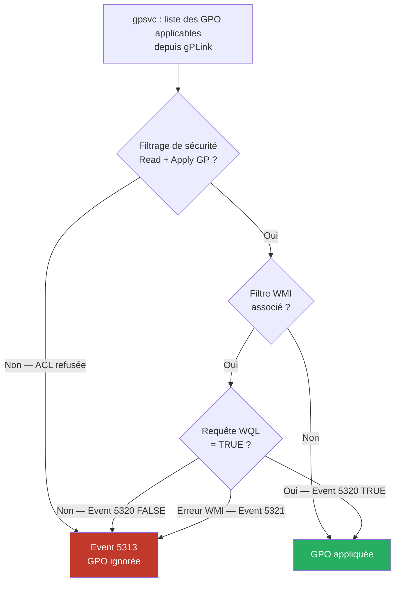

# Filtrage de sécurité et filtrage WMI

!!! abstract "Ce que couvre ce chapitre"
    - La structure DACL d'une GPO et les deux permissions requises — Read et Apply Group Policy — pour qu'une GPO s'applique
    - Le GUID `edacfd8f-ffb3-11d1-b41d-00a0c968f939` de la permission Apply Group Policy et comment le lire dans un ACL AD
    - Le piège classique de la suppression d'Authenticated Users : pourquoi cela casse le traitement côté machine et comment l'éviter
    - La technique du filtrage par exclusion avec DENY et ses limites opérationnelles
    - L'architecture des filtres WMI : objet AD `msWMI-Som`, localisation dans `CN=SOM,CN=WMIPolicy`, évaluation côté client
    - La sémantique des requêtes WQL : TRUE = GPO appliquée, FALSE ou erreur = GPO ignorée
    - Les Event IDs 5313, 5320 et 5321 pour diagnostiquer les refus de filtrage dans le journal opérationnel Group Policy

---

!!! tip "Si vous ne retenez qu'une chose"
    Le filtrage de sécurité contrôle **QUI** la GPO s'applique. Le filtrage WMI contrôle **DANS QUEL CONTEXTE** elle s'applique. Les deux sont évalués côté client — supprimer "Authenticated Users" sans ajouter un groupe de remplacement casse le traitement machine.

---

## :material-shield-account: Les ACL d'une GPO : ce que GPMC ne montre pas

### :material-database: Une GPO est un objet AD avec une DACL

Dans Active Directory, chaque GPO est représentée par un objet de classe `groupPolicyContainer`. Comme tout objet AD, il porte une liste de contrôle d'accès discrétionnaire — une **DACL**.

C'est cette DACL qui implémente le filtrage de sécurité. GPMC la présente dans l'onglet "Delegation" ou "Security Filtering", mais ce n'est qu'une vue simplifiée d'une structure ACL standard.

Deux entrées ACE sont nécessaires pour qu'une GPO s'applique à un principal :

1. **Read** — permet de lire les métadonnées et paramètres de la GPO
2. **Apply Group Policy** — la permission effective qui déclenche l'application

Les deux doivent être présentes. Read seul : le principal voit la GPO dans GPMC mais elle ne s'applique pas. Apply Group Policy seul : la GPO ne peut pas être lue, donc elle ne s'applique pas non plus.

!!! info "Le GUID de la permission Apply Group Policy"
    La permission "Apply Group Policy" est une extended right AD identifiée par le GUID `edacfd8f-ffb3-11d1-b41d-00a0c968f939`. Ce GUID est défini dans le schéma AD et est identique dans tous les domaines. Vous le retrouvez dans les ACL en utilisant `Get-Acl` sur le chemin AD de la GPO.

### :material-account-group: Le comportement par défaut

Par défaut, toute nouvelle GPO accorde **Read** et **Apply Group Policy** au groupe `Authenticated Users`.

Ce groupe inclut tous les utilisateurs et ordinateurs authentifiés dans le domaine. C'est intentionnel : une GPO liée à une OU s'applique à tous les objets de cette OU, sans distinction.

Modifier ce comportement est l'essence même du filtrage de sécurité.

!!! quote "En résumé"
    Une GPO s'applique à un principal si et seulement si ce principal possède les deux permissions Read et Apply Group Policy sur l'objet AD de la GPO. Par défaut, Authenticated Users possède les deux — ce qui signifie que toute GPO liée s'applique à tout le monde dans l'OU.

---

## :material-eye: Lire le filtrage de sécurité en PowerShell

### :material-powershell: Via les cmdlets GroupPolicy

Le module `GroupPolicy` expose une cmdlet dédiée pour lire les permissions :

```powershell title="Lister les permissions de filtrage d'une GPO"
Get-GPPermissions -Name "CFG-Postes-EnvironnementBureau" -All |
    Select-Object Trustee, Permission, Inherited |
    Format-Table -AutoSize
```

```powershell title="Résultat attendu"
Trustee                  Permission      Inherited
-------                  ----------      ---------
CONTOSO\Domain Admins    GpoEditDeleteModifySecurity False
CONTOSO\Enterprise Admins GpoEditDeleteModifySecurity False
CONTOSO\GRP-Postes-Std   GpoApply        False
NT AUTHORITY\Authenticated Users GpoRead False
BUILTIN\SYSTEM           GpoApply        False
```

La valeur `GpoApply` correspond à la permission "Apply Group Policy". La valeur `GpoRead` correspond à Read seul.

### :material-code-json: Via les ACL AD brutes

Pour obtenir le GUID de la permission et l'ACL complète :

```powershell title="Lire la DACL complète sur l'objet AD de la GPO"
# Retrieve the GPO's AD path first
$gpo = Get-GPO -Name "CFG-Postes-EnvironnementBureau"
$gpoDN = "CN={$($gpo.Id.ToString().ToUpper())},CN=Policies,CN=System,$(
    (Get-ADDomain).DistinguishedName)"

# Read the full ACL
$acl = Get-Acl -Path "AD:$gpoDN"
$acl.Access |
    Select-Object IdentityReference, ActiveDirectoryRights, AccessControlType |
    Format-Table -AutoSize
```

```powershell title="Résultat attendu"
IdentityReference               ActiveDirectoryRights     AccessControlType
-----------------               ---------------------     -----------------
CONTOSO\GRP-Postes-Std          ExtendedRight             Allow
NT AUTHORITY\Authenticated Users GenericRead               Allow
BUILTIN\SYSTEM                  ExtendedRight             Allow
```

!!! info "ExtendedRight = Apply Group Policy"
    Dans la DACL AD brute, la permission "Apply Group Policy" apparaît comme `ExtendedRight`. Son GUID spécifique — `edacfd8f-ffb3-11d1-b41d-00a0c968f939` — est encodé dans le champ `ObjectType` de l'ACE, visible uniquement avec `$acl.Access | Where-Object { $_.ObjectType -eq 'edacfd8f-ffb3-11d1-b41d-00a0c968f939' }`.

!!! quote "En résumé"
    `Get-GPPermissions` est la méthode rapide pour le quotidien. `Get-Acl` sur le chemin AD donne accès aux GUIDs bruts, utile pour les audits et l'automatisation avancée.

---

## :material-account-off: Supprimer Authenticated Users : le piège classique

### :material-alert-circle: Ce que GPMC fait automatiquement

Quand vous ajoutez un groupe spécifique dans l'onglet "Security Filtering" de GPMC — par exemple `GRP-Postes-Standard` — GPMC supprime automatiquement `Authenticated Users` de la liste.

C'est le comportement par défaut de l'interface. C'est aussi la source d'un problème très courant en production.

### :material-server: Le problème du traitement machine

Le compte ordinateur s'authentifie au démarrage de la machine, **avant** qu'un utilisateur ne se connecte. À ce stade, il n'appartient qu'aux groupes de sécurité dont il est membre directement — et notamment à `Authenticated Users`.

Si une GPO contient des paramètres dans **Computer Configuration** et que vous avez remplacé `Authenticated Users` par un groupe d'utilisateurs (`GRP-Postes-Standard` par exemple), le compte machine ne peut plus lire la GPO. Le traitement côté machine échoue silencieusement.

Le résultat : tous les paramètres Computer Configuration — politiques de sécurité, scripts de démarrage, configuration réseau — ne s'appliquent plus.

!!! warning "Le diagnostic est trompeur"
    L'Event ID 5313 apparaît dans le journal opérationnel Group Policy, mais uniquement si le compte machine peut accéder au contrôleur de domaine. Si le problème est détecté, il indique "Access denied" sur la GPO. Dans les cas silencieux, `gpresult /h` montre simplement que la GPO n'est pas dans la liste des GPO appliquées, sans explication claire.

### :material-check-circle: La règle des trois cas

Avant de modifier le filtrage de sécurité d'une GPO, identifiez ce qu'elle contient :

| Contenu de la GPO | Action recommandée |
|-------------------|--------------------|
| Computer Configuration uniquement | Garder Authenticated Users **ou** remplacer par un groupe d'**ordinateurs** |
| User Configuration uniquement | Remplacer Authenticated Users par un groupe d'**utilisateurs** — c'est sûr |
| Les deux sections | Utiliser deux groupes distincts — un pour les ordinateurs, un pour les utilisateurs |

La meilleure pratique est de **désactiver la section inutilisée** dans les propriétés de la GPO. Une GPO "Computer only" avec la section User Configuration désactivée est plus claire et plus performante.

### :material-powershell: Corriger le filtrage en PowerShell

```powershell title="Ajouter un groupe d'ordinateurs au filtrage"
# Grant GpoApply to the computer group
Set-GPPermissions -Name "CFG-Postes-EnvironnementBureau" `
    -TargetName "GRP-Ordinateurs-Standard" `
    -TargetType Group `
    -PermissionLevel GpoApply

# Downgrade Authenticated Users to Read-only (admins can still browse settings in GPMC)
Set-GPPermissions -Name "CFG-Postes-EnvironnementBureau" `
    -TargetName "Authenticated Users" `
    -TargetType Group `
    -PermissionLevel GpoRead
```

```powershell title="Résultat attendu après correction"
Trustee                          Permission  Inherited
-------                          ----------  ---------
CONTOSO\GRP-Ordinateurs-Standard GpoApply    False
NT AUTHORITY\Authenticated Users GpoRead     False
```

!!! info "Pourquoi garder Read pour Authenticated Users ?"
    Même si vous filtrez sur un groupe spécifique, conserver `GpoRead` pour `Authenticated Users` permet aux administrateurs de voir les paramètres de la GPO dans GPMC depuis n'importe quel poste. Sans Read, la GPO apparaît dans la liste mais les paramètres sont inaccessibles pour les non-propriétaires.

```powershell title="Vérifier qu'une GPO n'a plus Authenticated Users en GpoApply"
# Audit script: list all GPOs where Authenticated Users has GpoApply
Get-GPO -All | ForEach-Object {
    $gpo = $_
    $perms = Get-GPPermissions -Guid $gpo.Id -All -ErrorAction SilentlyContinue
    $authUsers = $perms | Where-Object {
        $_.Trustee.Name -eq "Authenticated Users" -and
        $_.Permission -eq "GpoApply"
    }
    if (-not $authUsers) {
        [PSCustomObject]@{
            GPOName    = $gpo.DisplayName
            Status     = "Authenticated Users NOT in GpoApply — verify computer group"
        }
    }
} | Format-Table -AutoSize
```

!!! quote "En résumé"
    Supprimer Authenticated Users du filtrage sans ajouter un groupe d'ordinateurs casse le traitement Computer Configuration. Vérifiez toujours le contenu de la GPO avant de modifier son filtrage. Conservez au minimum GpoRead pour Authenticated Users pour préserver la visibilité dans GPMC.

---

## :material-cancel: Filtrage par exclusion : le DENY

### :material-logic-and: La logique du DENY

Le filtrage de sécurité ne sert pas uniquement à cibler — il peut aussi **exclure**. La technique consiste à positionner un ACE DENY sur la permission Apply Group Policy pour un groupe spécifique.

Cas d'usage typique : appliquer une GPO à tous les utilisateurs de l'OU, **sauf** les administrateurs.

1. `Authenticated Users` possède Read + Apply Group Policy
2. Le groupe `GRP-Admins-IT` possède un DENY sur Apply Group Policy

Résultat : tout utilisateur membre de `GRP-Admins-IT` ne reçoit pas la GPO, même s'il est dans Authenticated Users.

!!! warning "DENY est prioritaire — sans exception"
    Un DENY l'emporte toujours sur un ALLOW, quelle que soit l'appartenance aux groupes. Un administrateur qui est simultanément dans `Authenticated Users` (Allow) et dans `GRP-Admins-IT` (Deny) ne recevra pas la GPO. Vérifiez les adhésions transitives avant d'ajouter un DENY.

### :material-tools: Limites de Set-GPPermissions avec DENY

La cmdlet `Set-GPPermissions` ne supporte pas nativement les ACE DENY. Pour ajouter un refus explicite, deux options :

**Option 1 — GPMC GUI** : onglet Delegation → Advanced → sélectionner le groupe → cocher Deny sur "Apply Group Policy".

**Option 2 — API .NET** :

```powershell title="Ajouter un ACE DENY via l'API .NET"
# Add an explicit DENY ACE on Apply Group Policy for a group
# Apply Group Policy extended right GUID
$applyGpGuid = [Guid]"edacfd8f-ffb3-11d1-b41d-00a0c968f939"

$gpo = Get-GPO -Name "CFG-Utilisateurs-BureauStandard"
$gpoDN = "CN={$($gpo.Id.ToString().ToUpper())},CN=Policies,CN=System,$(
    (Get-ADDomain).DistinguishedName)"

$acl = Get-Acl -Path "AD:$gpoDN"

# Resolve the group SID
$groupSid = (Get-ADGroup -Identity "GRP-Admins-IT").SID

# Build the DENY ACE for the extended right
$ace = New-Object System.DirectoryServices.ActiveDirectoryAccessRule(
    $groupSid,
    [System.DirectoryServices.ActiveDirectoryRights]::ExtendedRight,
    [System.Security.AccessControl.AccessControlType]::Deny,
    $applyGpGuid
)

$acl.AddAccessRule($ace)
Set-Acl -Path "AD:$gpoDN" -AclObject $acl
Write-Host "DENY ACE added for GRP-Admins-IT on $($gpo.DisplayName)"
```

!!! warning "DENY et comptes SYSTEM"
    Ne jamais ajouter un DENY qui affecte `SYSTEM` ou `Domain Controllers`. Ces comptes ont besoin d'accéder aux GPO pour le traitement background des politiques de sécurité. Un DENY mal ciblé peut bloquer le traitement sur tous les contrôleurs de domaine.

!!! quote "En résumé"
    Le DENY est un outil chirurgical pour les exclusions. Il prend la priorité sur tous les Allow, y compris les héritages de groupe. L'API .NET est nécessaire pour le scripting car Set-GPPermissions ne gère pas les ACE DENY. Utilisez cette technique avec parcimonie et documentez chaque DENY explicitement.

---

## :material-filter-cog: Les filtres WMI : architecture et fonctionnement

### :material-database-cog: Qu'est-ce qu'un filtre WMI ?

Un filtre WMI est un objet Active Directory distinct de la GPO. Il appartient à la classe `msWMI-Som` et réside dans le conteneur :

```
CN=SOM,CN=WMIPolicy,CN=System,DC=contoso,DC=local
```

Chaque filtre contient une ou plusieurs requêtes **WQL** (WMI Query Language). Une GPO peut être associée à au plus **un** filtre WMI.

L'association est stockée dans l'attribut `gPCWQLFilter` de l'objet GPO. Sa valeur est un chemin LDAP vers l'objet `msWMI-Som`.

### :material-play-network: Le processus d'évaluation

Voici ce qui se passe quand `gpsvc` traite une GPO associée à un filtre WMI :

1. Le client récupère la liste des GPO applicables depuis `gPLink` (comme d'habitude)
2. Pour chaque GPO avec un filtre WMI, `gpsvc` exécute la requête WQL localement
3. La requête s'exécute contre le service WMI local de la machine — **pas contre le DC**
4. Si la requête retourne **au moins une ligne** → résultat TRUE → GPO appliquée
5. Si la requête retourne **zéro ligne** → résultat FALSE → GPO ignorée
6. Si WMI retourne une erreur → GPO ignorée (comportement identique à FALSE)

!!! info "Évaluation côté client : implication importante"
    Le DC ne sait pas si le filtre WMI va retourner TRUE ou FALSE pour une machine donnée. Il envoie la GPO au client dans tous les cas — c'est le client qui décide. Cela signifie que les filtres WMI n'économisent pas de bande passante réseau sur le téléchargement initial de la GPO.

### :material-arrow-decision: Diagramme de décision



!!! quote "En résumé"
    Un filtre WMI est un objet AD distinct qui contient une requête WQL. L'évaluation est entièrement côté client. Un résultat vide ou une erreur WMI bloque l'application de la GPO. Le DC est transparent à ce processus.

---

## :material-magnify: Requêtes WQL pratiques

### :material-table: Catalogue de requêtes

| Cas d'usage | Namespace | Requête WQL |
|-------------|-----------|-------------|
| Windows 11 uniquement | `root\CIMv2` | `SELECT * FROM Win32_OperatingSystem WHERE Version >= "10.0.22000"` |
| Windows 10 uniquement | `root\CIMv2` | `SELECT * FROM Win32_OperatingSystem WHERE Version LIKE "10.0.%" AND Version < "10.0.22000"` |
| Windows Server 2022 | `root\CIMv2` | `SELECT * FROM Win32_OperatingSystem WHERE Version >= "10.0.20348" AND ProductType != 1` |
| Portables uniquement | `root\CIMv2` | `SELECT * FROM Win32_SystemEnclosure WHERE ChassisTypes = 9 OR ChassisTypes = 10 OR ChassisTypes = 14` |
| Stations fixes uniquement | `root\CIMv2` | `SELECT * FROM Win32_SystemEnclosure WHERE ChassisTypes = 3 OR ChassisTypes = 4 OR ChassisTypes = 6` |
| RAM ≥ 8 Go | `root\CIMv2` | `SELECT * FROM Win32_ComputerSystem WHERE TotalPhysicalMemory >= 8589934592` |
| Processeur ≥ 4 cœurs logiques | `root\CIMv2` | `SELECT * FROM Win32_Processor WHERE NumberOfLogicalProcessors >= 4` |
| Architecture 64 bits | `root\CIMv2` | `SELECT * FROM Win32_Processor WHERE AddressWidth = 64` |
| Logiciel installé (méthode rapide) | `root\CIMv2` | `SELECT * FROM Win32_InstalledWin32Program WHERE Name LIKE "%Microsoft 365%"` |
| Langue du système | `root\CIMv2` | `SELECT * FROM Win32_OperatingSystem WHERE MUILanguages = "fr-FR"` |
| Membre d'un domaine DNS spécifique | `root\CIMv2` | `SELECT * FROM Win32_NTDomain WHERE DnsForestName = "contoso.local"` |
| Batterie présente | `root\CIMv2` | `SELECT * FROM Win32_Battery WHERE BatteryStatus > 0` |

### :material-code-tags: Tester une requête WQL localement

Avant de créer un filtre WMI en production, testez toujours la requête sur une machine cible :

```powershell title="Tester une requête WQL avant de créer le filtre"
# Test a WQL query locally before deploying as a WMI filter
$namespace = "root\CIMv2"
$query     = "SELECT * FROM Win32_OperatingSystem WHERE Version >= '10.0.22000'"

$result = Get-WmiObject -Namespace $namespace -Query $query -ErrorAction SilentlyContinue

if ($result) {
    Write-Host "WMI filter result: TRUE — GPO would apply on this machine"
    $result | Select-Object Caption, Version | Format-Table
} else {
    Write-Host "WMI filter result: FALSE — GPO would NOT apply on this machine"
}
```

```powershell title="Résultat attendu sur Windows 11"
WMI filter result: TRUE — GPO would apply on this machine

Caption                          Version
-------                          -------
Microsoft Windows 11 Professionnel 10.0.22631
```

### :material-alert: Win32_Product : la requête interdite

`Win32_Product` est une classe WMI qui liste les logiciels installés. Elle semble parfaite pour filtrer sur la présence d'une application.

Ne l'utilisez **jamais** dans un filtre WMI de GPO.

Chaque interrogation de `Win32_Product` déclenche une **réparation MSI complète** pour chaque application installée. Sur une machine avec 50 applications, cela peut prendre plusieurs minutes. Ce comportement se produit sur chaque cycle de traitement GPO — toutes les 90 à 120 minutes.

Alternatives acceptables :

```powershell title="Alternatives à Win32_Product pour détecter un logiciel"
# Option 1: Win32_InstalledWin32Program (faster, no MSI reconfigure)
$query1 = "SELECT * FROM Win32_InstalledWin32Program WHERE Name LIKE '%Microsoft 365%'"

# Option 2: Registry-based detection (fastest)
# Check in HKLM:\SOFTWARE\Microsoft\Windows\CurrentVersion\Uninstall
# or HKLM:\SOFTWARE\WOW6432Node\Microsoft\Windows\CurrentVersion\Uninstall
$query2 = "SELECT * FROM Win32_OperatingSystem" # placeholder — use ILT for registry
# Note: for registry-based software detection, prefer Item-Level Targeting (Ch. 12)
# over WMI filters — ILT can query registry keys directly without performance impact
```

!!! quote "En résumé"
    Les requêtes WQL couvrent un large spectre : version OS, type de machine, matériel, langue, domaine. N'utilisez jamais `Win32_Product` — le coût en performance est prohibitif. Testez toujours votre requête localement avant de créer le filtre en production.

---

## :material-plus-circle: Créer et associer un filtre WMI

### :material-information: Absence de cmdlet native

Il n'existe pas de cmdlet PowerShell native dans le module `GroupPolicy` pour créer des filtres WMI. GPMC GUI permet de les créer interactivement, mais pour l'automatisation, il faut passer par l'API AD directement.

### :material-powershell: Fonction de création via l'API AD

```powershell title="Créer un filtre WMI via l'API AD .NET"
function New-GPWmiFilter {
    <#
    .SYNOPSIS
        Creates a WMI filter object in Active Directory.
    .PARAMETER Name
        Display name of the WMI filter.
    .PARAMETER Description
        Description stored in msWMI-Parm1.
    .PARAMETER Namespace
        WMI namespace for the query (default: root\CIMv2).
    .PARAMETER Query
        WQL query string.
    #>
    param(
        [Parameter(Mandatory)][string]$Name,
        [string]$Description = "",
        [string]$Namespace   = "root\CIMv2",
        [Parameter(Mandatory)][string]$Query
    )

    $domain        = (Get-ADDomain).DistinguishedName
    $wmiFilterPath = "CN=SOM,CN=WMIPolicy,CN=System,$domain"

    # Generate a unique GUID for the filter object name
    $guid = [System.Guid]::NewGuid().ToString("B").ToUpper()
    $now  = (Get-Date).ToUniversalTime().ToString("yyyyMMddHHmmss.ffffff-000")

    # msWMI-Parm2 format: "<version>;<filtercount>;<reserved>;<querylen>;WQL;<namespace>;<query>;"
    $parm2 = "1;3;10;$($Query.Length);WQL;$Namespace;$Query;"

    $attributes = @{
        "msWMI-Name"             = $Name
        "msWMI-Parm1"            = $Description
        "msWMI-Parm2"            = $parm2
        "msWMI-Author"           = "$env:USERNAME@$env:USERDNSDOMAIN"
        "msWMI-CreationDate"     = $now
        "msWMI-ChangeDate"       = $now
        "msWMI-ID"               = $guid
        "showInAdvancedViewOnly" = $true
    }

    New-ADObject -Name $guid `
                 -Type "msWMI-Som" `
                 -Path $wmiFilterPath `
                 -OtherAttributes $attributes `
                 -ErrorAction Stop

    Write-Host "WMI filter created: '$Name' — GUID: $guid"
    return $guid
}
```

```powershell title="Exemple d'utilisation"
# Create a filter for Windows 11 machines only
$filterId = New-GPWmiFilter `
    -Name        "WMI - Windows 11 Only" `
    -Description "Apply only to Windows 11 machines (build 22000+)" `
    -Query       "SELECT * FROM Win32_OperatingSystem WHERE Version >= '10.0.22000'"
```

### :material-link: Associer le filtre à une GPO

```powershell title="Associer un filtre WMI à une GPO existante"
function Set-GPWmiFilterLink {
    <#
    .SYNOPSIS
        Associates an existing WMI filter with a GPO.
    .PARAMETER GPOName
        Display name of the target GPO.
    .PARAMETER WmiFilterName
        Display name of the WMI filter to link.
    #>
    param(
        [Parameter(Mandatory)][string]$GPOName,
        [Parameter(Mandatory)][string]$WmiFilterName
    )

    $domain        = (Get-ADDomain).DistinguishedName
    $wmiFilterPath = "CN=SOM,CN=WMIPolicy,CN=System,$domain"

    # Find the WMI filter object by display name (msWMI-Name attribute)
    $filter = Get-ADObject -SearchBase $wmiFilterPath `
        -Filter { ObjectClass -eq "msWMI-Som" } `
        -Properties "msWMI-Name","msWMI-ID" |
        Where-Object { $_."msWMI-Name" -eq $WmiFilterName }

    if (-not $filter) {
        throw "WMI filter '$WmiFilterName' not found in $wmiFilterPath"
    }

    # Build the gPCWQLFilter value: ["<domain>\SOM\{GUID}";]
    $filterRef = "[`"$domain\SOM\$($filter.Name)`";]"

    # Update the GPO AD object
    $gpo    = Get-GPO -Name $GPOName
    $gpoDN  = "CN={$($gpo.Id.ToString().ToUpper())},CN=Policies,CN=System,$domain"

    Set-ADObject -Identity $gpoDN -Replace @{ "gPCWQLFilter" = $filterRef }
    Write-Host "WMI filter '$WmiFilterName' linked to GPO '$GPOName'"
}
```

```powershell title="Résultat attendu"
WMI filter 'WMI - Windows 11 Only' linked to GPO 'CFG-Win11-OptimisationsUI'
```

!!! warning "Supprimer l'association d'un filtre WMI"
    Pour dissocier un filtre WMI d'une GPO, utilisez `Set-ADObject -Identity $gpoDN -Clear gPCWQLFilter`. Ne supprimez jamais l'objet `msWMI-Som` tant qu'une GPO y fait référence — la GPO deviendrait en état d'erreur et serait ignorée par tous les clients.

!!! quote "En résumé"
    La création de filtres WMI requiert l'API AD directement. Le format `msWMI-Parm2` est strict. L'association GPO ↔ filtre se fait via l'attribut `gPCWQLFilter` de l'objet GPO. Documentez chaque filtre créé : GPMC les affiche mais ne donne pas toujours le contexte métier de leur existence.

---

## :material-speedometer: Performance : filtrage de sécurité vs filtrage WMI

### :material-compare: Tableau comparatif

| Critère | Filtrage de sécurité | Filtre WMI |
|---------|---------------------|------------|
| Évaluation | Côté DC (lecture des ACL AD) | Côté client (requête WMI locale) |
| Performance | Très rapide — lecture ACL en mémoire AD | Variable — de quelques ms à plusieurs secondes |
| Granularité | Par appartenance groupe AD | Par propriété machine (OS, matériel, logiciel) |
| Maintenance | Gérer les adhésions de groupes AD | Maintenir les requêtes WQL |
| Visibilité GPMC | Onglet "Security Filtering" | Conteneur "WMI Filters" |
| Event log succès/échec | Event 5313 (refus) | Events 5320 (résultat) et 5321 (erreur) |
| Impact bande passante | Réduit — GPO non envoyée si ACL refusée | Aucune économie — GPO envoyée avant évaluation |
| Adapté pour | Cibler un sous-ensemble d'utilisateurs ou d'ordinateurs | Cibler une configuration matérielle ou logicielle |

### :material-strategy: Quand utiliser quoi

**Utilisez le filtrage de sécurité** pour toutes les questions d'"à qui" :

- Ces paramètres ne s'appliquent qu'aux postes du service Comptabilité
- Cette GPO ne doit pas s'appliquer aux administrateurs
- Déployer un logiciel sur un groupe d'ordinateurs pilotes

**Utilisez un filtre WMI** pour toutes les questions de "dans quel contexte" :

- Ces paramètres ne s'appliquent qu'aux machines Windows 11
- Cette GPO ne doit s'appliquer qu'aux portables (batterie présente)
- Activer une fonctionnalité uniquement sur les machines avec assez de RAM

**Ne les substituez pas l'un à l'autre.** Un filtre WMI qui vérifie l'appartenance à une OU est fonctionnellement équivalent au filtrage de sécurité mais 10 à 100 fois plus lent.

!!! warning "Accumulation de filtres WMI"
    Chaque filtre WMI ajoute une requête WMI à chaque cycle de traitement. Sur un domaine avec 100 GPO liées et 30 filtres WMI actifs, chaque machine exécute 30 requêtes WMI supplémentaires à chaque cycle background. Mesurez l'impact en production avant de déployer massivement.

!!! quote "En résumé"
    Le filtrage de sécurité est plus rapide et doit être privilégié pour le ciblage par audience. Le filtrage WMI est réservé au ciblage contextuel (matériel, OS, logiciel). Évitez Win32_Product, limitez le nombre de filtres WMI actifs et mesurez leur impact sur les temps de traitement GPO.

---

## :material-bug: Diagnostic du filtrage : Event IDs et outils

### :material-table: Tableau des Event IDs

| Event ID | Journal | Signification | Action recommandée |
|----------|---------|---------------|-------------------|
| 5313 | GP Operational | GPO non appliquée — filtrage de sécurité refusé (accès refusé à l'ACL) | Vérifier les permissions Read et Apply GP sur la GPO |
| 5320 | GP Operational | Résultat d'évaluation du filtre WMI (TRUE ou FALSE) | Inspecter le message pour voir quelle requête a retourné FALSE |
| 5321 | GP Operational | Échec d'évaluation du filtre WMI (erreur WMI) | Vérifier le service WMI sur le client (`winmgmt`) |
| 5312 | GP Operational | Liste des GPO applicables récupérée avec succès | Contexte normal — utile pour corréler avec 5313 |
| 5314 | GP Operational | GPO ignorée en raison d'un filtre WMI — résultat FALSE | Complément de 5320 |

### :material-powershell: Interroger le journal opérationnel

```powershell title="Trouver les GPO refusées par filtrage de sécurité ou WMI"
# Query the Group Policy Operational log for filtering-related events
Get-WinEvent -LogName "Microsoft-Windows-GroupPolicy/Operational" `
    -MaxEvents 2000 -ErrorAction SilentlyContinue |
    Where-Object { $_.Id -in @(5313, 5320, 5321, 5314) } |
    Select-Object TimeCreated, Id,
        @{
            Name       = "Summary"
            Expression = {
                # Extract the first meaningful line from the event message
                ($_.Message -split "`n" |
                    Where-Object { $_ -match "GPO|WMI|filter|policy|denied" } |
                    Select-Object -First 2) -join " | "
            }
        } |
    Format-Table -AutoSize -Wrap
```

```powershell title="Résultat attendu (exemple)"
TimeCreated           Id   Summary
-----------           --   -------
2024-11-15 08:32:14   5313 The GPO did not apply because it was not applicable. | Reason: The user does not have permission...
2024-11-15 08:32:15   5320 WMI filter evaluation was successful. Result: FALSE. | Filter: WMI - Windows 11 Only
2024-11-15 08:32:16   5320 WMI filter evaluation was successful. Result: TRUE.  | Filter: WMI - Portables Only
```

### :material-tools: Vérifier l'état des filtres WMI sur un domaine

```powershell title="Lister tous les filtres WMI du domaine avec leurs requêtes"
$domain        = (Get-ADDomain).DistinguishedName
$wmiFilterPath = "CN=SOM,CN=WMIPolicy,CN=System,$domain"

Get-ADObject -SearchBase $wmiFilterPath `
    -Filter { ObjectClass -eq "msWMI-Som" } `
    -Properties "msWMI-Name","msWMI-Parm1","msWMI-Parm2","msWMI-Author","msWMI-ChangeDate" |
    Select-Object `
        @{N="Name";        E={ $_."msWMI-Name" }},
        @{N="Description"; E={ $_."msWMI-Parm1" }},
        @{N="Author";      E={ $_."msWMI-Author" }},
        @{N="LastChanged"; E={ $_."msWMI-ChangeDate" }},
        @{N="Query";       E={
            # Extract the WQL query from the msWMI-Parm2 encoded string
            $parts = $_."msWMI-Parm2" -split ";"
            if ($parts.Count -ge 7) { $parts[6] } else { $_."msWMI-Parm2" }
        }} |
    Format-Table -AutoSize -Wrap
```

### :material-file-chart: gpresult : voir le filtrage dans le rapport HTML

La commande `gpresult` capture l'état du traitement GPO sur une machine, y compris les GPO refusées et la raison :

```powershell title="Générer un rapport gpresult et analyser les refus"
# Generate a full HTML report on the local machine
gpresult /h "$env:TEMP\gpreport.html" /f
Start-Process "$env:TEMP\gpreport.html"

# For a remote machine (requires admin rights and WinRM)
gpresult /s NOM-POSTE /h "$env:TEMP\gpreport-remote.html" /f

# Console output: denied GPOs section
gpresult /r | Select-String -Pattern "Denied|Filtered|WMI" -Context 1,1
```

!!! info "Section « GPOs inapplicables » dans gpresult"
    Le rapport HTML de `gpresult` contient une section "GPO(s) not applied because they were filtered out". Chaque entrée précise la raison : "Inaccessible (Access Denied)" pour un refus ACL, ou "Denied (WMI Filter)" pour un filtre WMI évalué à FALSE.

!!! quote "En résumé"
    Les Event IDs 5313 (ACL refusée), 5320 (résultat WMI) et 5321 (erreur WMI) sont vos premiers alliés pour diagnostiquer un problème de filtrage. `gpresult /h` donne le tableau de bord complet du traitement GPO sur un poste, avec la liste des GPO refusées et leur motif.

---

## :material-playlist-check: Recettes opérationnelles courantes

### :material-recipe: Recette 1 — Déploiement progressif (pilote → production)

Objectif : appliquer une GPO à 10 % des postes en phase pilote, puis l'étendre.

```powershell title="Mise en place d'un déploiement progressif par groupe AD"
# Step 1: Create the pilot group and add test machines
New-ADGroup -Name "GRP-Postes-Pilotes-GPO-X" `
    -GroupScope DomainLocal `
    -GroupCategory Security `
    -Path "OU=Groupes,DC=contoso,DC=local"

# Add pilot machines to the group
Add-ADGroupMember -Identity "GRP-Postes-Pilotes-GPO-X" `
    -Members "POSTE-TEST-01$","POSTE-TEST-02$"

# Step 2: Configure GPO security filtering for pilot group only
Set-GPPermissions -Name "CFG-NouvelleConfiguration" `
    -TargetName "GRP-Postes-Pilotes-GPO-X" `
    -TargetType Group `
    -PermissionLevel GpoApply

Set-GPPermissions -Name "CFG-NouvelleConfiguration" `
    -TargetName "Authenticated Users" `
    -TargetType Group `
    -PermissionLevel GpoRead  # Read only — no apply

Write-Host "Pilot filtering configured. Link the GPO to the OU when ready."
```

Pour passer en production : remplacer `GRP-Postes-Pilotes-GPO-X` par `Authenticated Users` en `GpoApply` via `Set-GPPermissions`.

### :material-recipe: Recette 2 — GPO par OS avec filtre WMI

Objectif : maintenir deux versions d'une GPO — une pour Windows 10, une pour Windows 11.

```powershell title="Créer les deux filtres WMI OS et les associer"
# Create WMI filters for OS targeting
$win10Guid = New-GPWmiFilter `
    -Name        "WMI - Windows 10 Only" `
    -Description "Apply to Windows 10 machines (build < 22000)" `
    -Query       "SELECT * FROM Win32_OperatingSystem WHERE Version LIKE '10.0.%' AND Version < '10.0.22000'"

$win11Guid = New-GPWmiFilter `
    -Name        "WMI - Windows 11 Only" `
    -Description "Apply to Windows 11 machines (build >= 22000)" `
    -Query       "SELECT * FROM Win32_OperatingSystem WHERE Version >= '10.0.22000'"

# Link filters to their respective GPOs
Set-GPWmiFilterLink -GPOName "CFG-Win10-ParametresUI" -WmiFilterName "WMI - Windows 10 Only"
Set-GPWmiFilterLink -GPOName "CFG-Win11-ParametresUI" -WmiFilterName "WMI - Windows 11 Only"

Write-Host "WMI filters created and linked. Both GPOs can be linked to the same OU."
```

### :material-recipe: Recette 3 — Audit complet du filtrage sur un domaine

```powershell title="Audit : toutes les GPO avec leur filtrage de sécurité et WMI"
$domain        = (Get-ADDomain).DistinguishedName
$wmiFilterPath = "CN=SOM,CN=WMIPolicy,CN=System,$domain"

# Build a lookup table of WMI filter GUIDs to names
$wmiFilters = @{}
Get-ADObject -SearchBase $wmiFilterPath `
    -Filter { ObjectClass -eq "msWMI-Som" } `
    -Properties "msWMI-Name" |
    ForEach-Object { $wmiFilters[$_.Name] = $_."msWMI-Name" }

Get-GPO -All | Sort-Object DisplayName | ForEach-Object {
    $gpo = $_

    # Get security filtering
    $perms = Get-GPPermissions -Guid $gpo.Id -All -ErrorAction SilentlyContinue
    $applyTargets = ($perms |
        Where-Object { $_.Permission -eq "GpoApply" } |
        ForEach-Object { $_.Trustee.Name }) -join ", "

    # Get WMI filter link from AD object
    $gpoDN  = "CN={$($gpo.Id.ToString().ToUpper())},CN=Policies,CN=System,$domain"
    $gpoObj = Get-ADObject -Identity $gpoDN -Properties "gPCWQLFilter" -ErrorAction SilentlyContinue
    $wmiLink = "None"
    if ($gpoObj."gPCWQLFilter") {
        # Extract GUID from the gPCWQLFilter attribute value
        if ($gpoObj."gPCWQLFilter" -match "\{([A-F0-9\-]+)\}") {
            $filterGuid = $Matches[1]
            $wmiLink = if ($wmiFilters[$filterGuid]) { $wmiFilters[$filterGuid] } else { $filterGuid }
        }
    }

    [PSCustomObject]@{
        GPOName       = $gpo.DisplayName
        Status        = $gpo.GpoStatus
        ApplyTargets  = if ($applyTargets) { $applyTargets } else { "(none)" }
        WMIFilter     = $wmiLink
    }
} | Format-Table -AutoSize -Wrap
```

!!! quote "En résumé"
    Les recettes opérationnelles couvrent les cas les plus fréquents : déploiement progressif via groupes pilotes, ciblage par OS avec filtres WMI, et audit complet du domaine. Combinez filtrage de sécurité (pour l'audience) et filtre WMI (pour le contexte) pour un ciblage précis sans prolifération de GPO.

---

## :material-link-variant: Références croisées

| Sujet | Référence |
|-------|-----------|
| Héritage LSDOU et ordre d'application | [Ch. 08 — Héritage et ordre d'application](08-heritage-lsdou.md) |
| Item-Level Targeting (alternative aux filtres WMI pour GPP) | [Ch. 12 — Item-Level Targeting](12-ilt.md) |
| Diagnostic complet avec RSOP et gpresult | [Ch. 20 — RSOP et diagnostic](20-rsop-diagnostic.md) |
| Impact des filtres WMI sur les performances | [Ch. 23 — Performances](23-performances.md) |
| Audit des permissions GPO en environnement sécurisé | [Les GPO pour les Admins — Audits et gouvernance](../gpo-pour-les-admins/index.md) |
