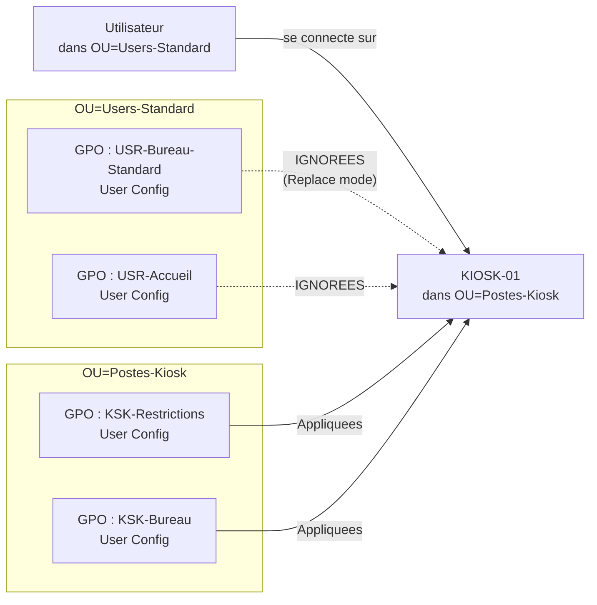
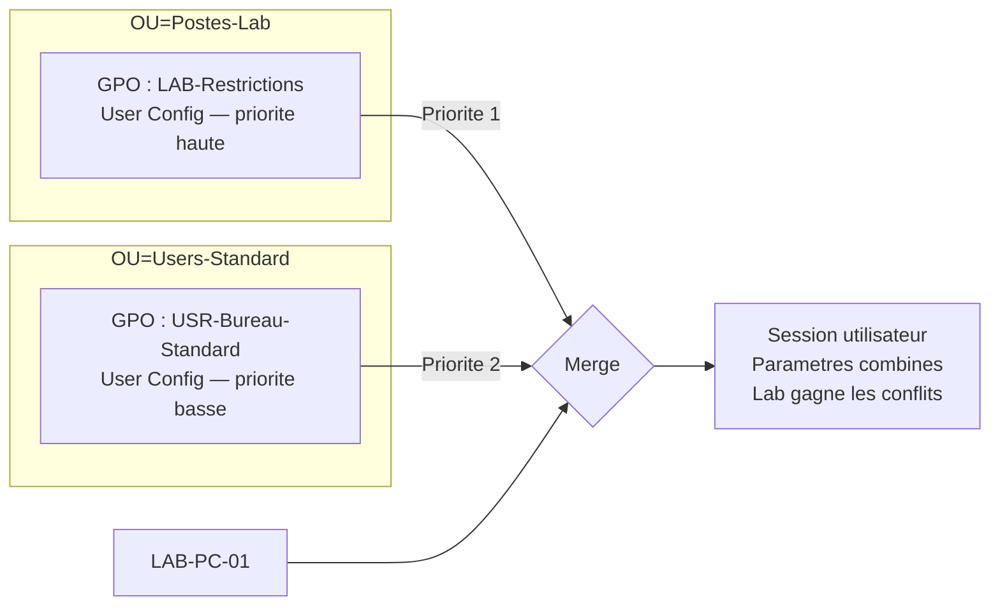
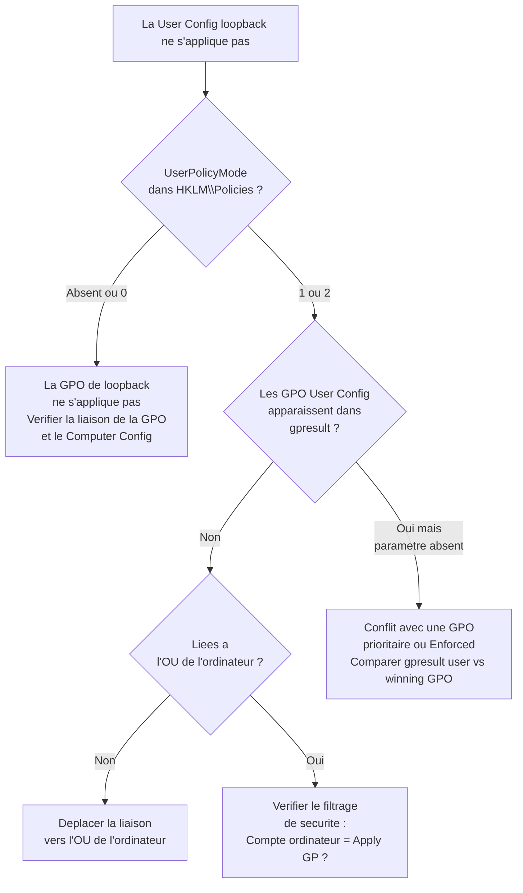

# Loopback Processing : modes et cas d'usage

!!! abstract "Ce que couvre ce chapitre"
    - Le probleme fondamental que le loopback resout : comment appliquer des parametres utilisateur bases sur l'**ordinateur**, pas sur l'utilisateur
    - Le mode **Replace** : la liste GPO utilisateur de l'OU de l'utilisateur est entierement ecartee, remplacee par celle de l'OU de l'ordinateur
    - Le mode **Merge** : les deux listes se combinent, avec priorite a l'OU de l'ordinateur en cas de conflit
    - La cle de registre ecrite par la GPO de loopback et comment la verifier a distance via PowerShell
    - Les cas d'usage production : RDS, kiosk d'accueil, Citrix/VDI, salles de formation
    - L'interaction du loopback avec Block Inheritance et les GPO Enforced
    - Le diagnostic complet : `gpresult`, journaux d'evenements, pieges de securite

!!! tip "Si vous ne retenez qu'une chose"
    Le loopback resout un probleme precis : appliquer des parametres utilisateur bases sur l'**ORDINATEUR** (pas sur l'utilisateur). Mode Replace = les GPO utilisateur de l'OU de l'ordinateur remplacent celles de l'OU de l'utilisateur. Mode Merge = les deux se combinent, l'ordinateur a priorite.

---

## :material-help-circle-outline: Le probleme que le loopback resout

### Comment fonctionne le traitement GPO normal

En fonctionnement normal, les GPO appliquent leur section **User Configuration** en fonction de l'OU **ou se trouve l'utilisateur** dans l'Active Directory.

Quand Alice (dans `OU=Users-Standard`) ouvre une session, Windows collecte toutes les GPO liees aux conteneurs parents de son compte : la racine du domaine, son Site, son Domaine, puis ses OU parentes, et enfin `OU=Users-Standard`. C'est la liste GPO utilisateur d'Alice.

Peu importe sur quelle machine Alice se connecte, c'est toujours **sa** liste qui s'applique.

### Le scenario ou ca pose probleme

:material-monitor-dashboard: Imaginez un poste kiosk dans `OU=Postes-Kiosk`.

L'objectif est de verrouiller completement la session : bureau minimaliste, pas d'acces au Panneau de configuration, pas de navigateur hormis un URL specifique. Ces restrictions sont configurees dans les GPO liees a `OU=Postes-Kiosk`.

Quand n'importe quel employe se connecte sur ce kiosk, ses GPO utilisateur proviennent de **son** OU (par exemple `OU=Users-Standard`). Les GPO de `OU=Postes-Kiosk` ne s'appliquent qu'a la section **Computer Configuration** — pas a la section User Configuration.

Resultat : la session n'est pas du tout verrouilee.

### La solution : inverser la logique

Le loopback processing **inverse** ce comportement. Avec le loopback actif, la section User Configuration est appliquee en fonction de l'OU **ou se trouve l'ordinateur**, non de l'OU ou se trouve l'utilisateur.

L'utilisateur connecte sur `KIOSK-01` recoit les parametres utilisateur definis dans les GPO de `OU=Postes-Kiosk`, quelle que soit son OU d'origine.

!!! quote "En resume"
    Le traitement normal fait dependre la User Configuration de l'OU de l'utilisateur. Le loopback processing deplace cette dependance vers l'OU de l'ordinateur. C'est la seule solution propre pour des environnements partages (kiosks, RDS, VDI) ou la machine doit imposer l'experience utilisateur, independamment de qui se connecte.

---

## :material-swap-horizontal: Mode Replace

### Principe

En mode **Replace**, la liste GPO utilisateur issue de l'OU de l'utilisateur est integralement **ignoree**. Elle est remplacee par la liste GPO utilisateur issue de l'OU de l'ordinateur.

L'utilisateur ne recoit absolument rien de son OU habituelle en termes de User Configuration.

### Sequence de traitement

Le traitement se deroule dans cet ordre precis :

1. La **Computer Configuration** s'applique normalement, depuis l'OU de l'ordinateur.
2. Windows collecte la liste GPO User Configuration de l'OU de l'**utilisateur** — cette liste est aussitot **ecartee**.
3. Windows collecte la liste GPO User Configuration de l'OU de l'**ordinateur**.
4. Cette seconde liste est appliquee a la session de l'utilisateur.

!!! warning "La liste utilisateur est vraiment ignoree"
    En mode Replace, aucun parametre User Configuration venant de l'OU de l'utilisateur ne s'applique. Ni les redirections de dossiers, ni les mappage de lecteurs, ni les parametres d'Internet Explorer, ni les preferences GPP. Tout doit etre reconfigure dans les GPO liees a l'OU de l'ordinateur.

### Quand utiliser Replace

Replace est le choix par defaut pour les environnements ou l'experience utilisateur doit etre **totalement controlee par la machine** :

- Postes kiosk (reception, salle d'attente, borne interactive)
- Serveurs RDS ou toutes les sessions doivent etre identiques
- Postes de bureau partages sans personnalisation individuelle

### Diagramme : Mode Replace



!!! quote "En resume"
    En mode Replace, l'OU de l'utilisateur n'a aucune influence sur sa User Configuration. Seule l'OU de l'ordinateur parle. C'est radical, c'est net, c'est exactement ce qu'il faut pour les kiosks et les serveurs RDS.

---

## :material-merge: Mode Merge

### Principe

En mode **Merge**, les deux listes GPO User Configuration sont preservees et **combinees**. La liste de l'OU de l'ordinateur prend priorite sur la liste de l'OU de l'utilisateur en cas de conflit.

L'utilisateur garde ses parametres habituels, mais la machine peut imposer des restrictions supplementaires ou ecraser certains parametres.

### Sequence de traitement

1. La **Computer Configuration** s'applique normalement.
2. Windows collecte la liste GPO User Configuration de l'OU de l'**utilisateur**.
3. Windows collecte la liste GPO User Configuration de l'OU de l'**ordinateur**.
4. Les deux listes sont fusionnees. En cas de conflit sur un meme parametre, la GPO de l'OU de l'ordinateur **gagne**.

!!! info "Priorite au sein de chaque liste"
    L'ordre interne a chaque liste est conserve. Les GPO de l'OU de l'ordinateur prennent priorite sur l'ensemble de la liste utilisateur, mais au sein de la liste ordinateur, les regles normales de precedence s'appliquent (ordre de liaison, Enforced, etc.).

### Quand utiliser Merge

Merge convient quand les utilisateurs doivent **conserver une partie de leurs parametres personnels**, mais la machine doit tout de meme imposer des contraintes supplementaires :

- Salles de formation : les stagiaires gardent leur profil, la salle interdit l'installation de logiciels
- Laboratoires : acces aux outils specifiques du lab, mais restrictions de securite de la machine
- Postes de travail partages ou certains utilisateurs ont des besoins distincts

### Diagramme : Mode Merge



!!! quote "En resume"
    Merge est le mode de compromis. Les utilisateurs gardent leurs parametres, la machine impose ses regles par-dessus. Ideal pour les environnements partages ou la personnalisation individuelle a encore un sens, mais doit etre encadree.

---

## :material-cog-outline: Activation du loopback

### Chemin dans la console GPO

Le parametre se trouve dans la section **Computer Configuration** d'une GPO, pas dans User Configuration.

```
Computer Configuration
  → Administrative Templates
    → System
      → Group Policy
        → Configure user Group Policy loopback processing mode
```

:material-alert-outline: Cette GPO doit etre liee a l'**OU de l'ordinateur**, pas a l'OU de l'utilisateur.

### Valeurs disponibles

| Etat | Comportement |
|------|-------------|
| `Not Configured` | Traitement normal (pas de loopback) |
| `Disabled` | Traitement normal (loopback explicitement desactive) |
| `Enabled` + Mode `Replace` | Loopback Replace actif |
| `Enabled` + Mode `Merge` | Loopback Merge actif |

### Cle de registre ecrite

Quand la GPO de loopback est appliquee sur un ordinateur, elle ecrit la valeur suivante :

```
HKLM\SOFTWARE\Policies\Microsoft\Windows\System
  UserPolicyMode  REG_DWORD
```

| Valeur | Signification |
|--------|--------------|
| Absente | Loopback desactive (traitement normal) |
| `0` | Loopback desactive (valeur explicite) |
| `1` | Loopback actif — Mode **Merge** |
| `2` | Loopback actif — Mode **Replace** |

!!! info "Cle protegee"
    Cette cle est dans la ruche `HKLM\SOFTWARE\Policies\`, zone reservee aux GPO. Ne pas la modifier manuellement en production — la GPO la reecrira au prochain rafraichissement.

### Verification via PowerShell

```powershell title="Resultat attendu"
# Check loopback mode on a remote computer
$computer = "KIOSK-01"
$value = Invoke-Command -ComputerName $computer -ScriptBlock {
    Get-ItemProperty -Path "HKLM:\SOFTWARE\Policies\Microsoft\Windows\System" `
                     -Name "UserPolicyMode" -ErrorAction SilentlyContinue
}

switch ($value.UserPolicyMode) {
    $null { "Loopback: Disabled (normal processing)" }
    0     { "Loopback: Disabled" }
    1     { "Loopback: Merge mode" }
    2     { "Loopback: Replace mode" }
}

# Expected output on a kiosk: Loopback: Replace mode
# Expected output on a standard workstation: Loopback: Disabled (normal processing)
```

```powershell title="Resultat attendu"
# Bulk check across an OU — requires RSAT or remote PS access
$computers = Get-ADComputer -Filter * -SearchBase "OU=Postes-Kiosk,DC=contoso,DC=com" |
    Select-Object -ExpandProperty Name

$results = foreach ($pc in $computers) {
    try {
        $val = Invoke-Command -ComputerName $pc -ScriptBlock {
            (Get-ItemProperty "HKLM:\SOFTWARE\Policies\Microsoft\Windows\System" `
                              -Name UserPolicyMode -ErrorAction SilentlyContinue).UserPolicyMode
        } -ErrorAction Stop
        [PSCustomObject]@{
            Computer = $pc
            Mode     = switch ($val) {
                $null { "Normal" }
                0     { "Disabled" }
                1     { "Merge" }
                2     { "Replace" }
            }
        }
    }
    catch {
        [PSCustomObject]@{ Computer = $pc; Mode = "Unreachable" }
    }
}

$results | Format-Table -AutoSize
# Expected: all kiosks show Replace, unreachable machines flagged
```

!!! quote "En resume"
    L'activation du loopback passe par une GPO Computer Configuration. La cle `UserPolicyMode` dans `HKLM\SOFTWARE\Policies\Microsoft\Windows\System` est le reflet direct de ce parametre. La valeur `2` = Replace, `1` = Merge. La verifier a distance via PowerShell est le premier reflexe de diagnostic.

---

## :material-server-network: Cas d'usage production

### :material-remote-desktop: RDS — Remote Desktop Services

Les serveurs RDS accueillent des utilisateurs provenant de n'importe quelle OU. Un directeur commercial, un technicien support et un stagiaire peuvent tous se connecter sur le meme serveur RDS.

Sans loopback, chacun recoit ses propres GPO utilisateur — avec des niveaux d'acces potentiellement tres differents. La session RDS ne peut pas etre uniformement securisee.

Avec loopback Replace, tous les utilisateurs qui se connectent sur les serveurs RDS de `OU=Serveurs-RDS` recoivent les memes parametres User Configuration, quelle que soit leur OU d'origine.

**Configuration typique RDS avec loopback Replace :**

| Parametre | Valeur recommandee | Raison |
|-----------|--------------------|--------|
| Redirection des lecteurs locaux | Desactivee | Securite des donnees |
| Redirection du presse-papiers | Lecture seule ou desactivee | Prevention d'exfiltration |
| Redirection des imprimantes | Desactivee (sauf imprimantes specifiques) | Stabilite |
| Fond d'ecran | Fond neutre fixe | Performance et coherence |
| Timeout de session | 30 min inactivite / 8h max | Gestion des ressources |
| Acces au Panneau de configuration | Restreint | Stabilite du serveur |

!!! warning "Ne pas oublier les GPO de redirection de dossiers"
    En mode Replace, les GPO de redirection de dossiers de l'OU utilisateur sont ignorees. Si vos utilisateurs ont des redirections de `Documents` ou `Desktop` definies dans leur OU, elles ne s'appliqueront plus sur le serveur RDS. Il faut reconfigurer les redirections dans les GPO liees a l'OU RDS — ou passer en mode Merge si la redirection utilisateur doit etre preservee.

---

### :material-monitor: Kiosks et postes d'accueil

Les bornes interactives, postes d'accueil, ordinateurs de salles de reunion — tous partagent la meme caracteristique : **n'importe qui peut se connecter, mais l'experience doit etre identique pour tous**.

Loopback Replace est la seule solution propre. Toutes les GPO User Configuration sont concentrees dans l'OU des kiosks. L'identite de l'utilisateur connecte n'a aucune importance.

**Architecture typique d'un kiosk :**

```
OU=Postes-Kiosk
  GPO: KSK-Shell-Restrictions     (User Config : shell de remplacement, pas d'Explorer)
  GPO: KSK-Lockdown               (User Config : pas de Panneau de config, Run, regedit)
  GPO: KSK-Wallpaper              (User Config : fond d'ecran obligatoire)
  GPO: KSK-Loopback-Replace       (Computer Config : active le loopback Replace)
```

!!! info "Ordre des GPO dans l'OU"
    La GPO qui active le loopback (`KSK-Loopback-Replace`) peut etre liee dans n'importe quel ordre — ce qui compte c'est qu'elle soit dans `OU=Postes-Kiosk`. Les GPO User Configuration liees a la meme OU seront appliquees lors de la prochaine connexion utilisateur.

---

### :material-cloud-outline: Citrix et VDI

Les environnements Citrix XenApp/XenDesktop et les infrastructures VDI (VMware Horizon, AVD) fonctionnent selon le meme principe que RDS.

Les machines virtuelles sont organisees par type (VDI-Finance, VDI-Support, VDI-Accueil) dans des OU distinctes. Chaque OU definit l'experience utilisateur de ses sessions, independamment de l'OU de l'utilisateur.

Loopback Replace garantit que :

- Un utilisateur du departement Finance qui se connecte sur un VDI de support recoit bien les restrictions du VDI-Support
- Les personnalisations de l'utilisateur ne "fuitent" pas dans des environnements ou elles seraient indesirables

!!! warning "Compatibilite avec les profils Citrix/FSLogix"
    Les technologies de profil comme FSLogix ou les profils Citrix UPM fonctionnent au niveau du systeme de fichiers, pas via GPO. Le loopback n'affecte pas leur chargement. En revanche, les **parametres GPO** dans le profil (registry.pol applique au profil) peuvent interagir — tester en environnement de preprod avant tout deploiement.

---

### :material-school: Salles de formation

Les salles de formation presentent un cas hybride interessant :

- Les **stagiaires** (OU=Users-Stagiaires) doivent avoir un environnement restreint pendant la formation
- Les **formateurs** (OU=Users-Formateurs) doivent garder la plupart de leurs outils habituels, mais les restrictions de la salle s'appliquent aussi

**Solution : Loopback Merge**

La GPO liee a `OU=Postes-Formation` active le loopback Merge. La GPO `FORM-Restrictions` (liee a cette OU) desactive l'installation de logiciels et fixe un fond d'ecran neutre.

Les stagiaires et formateurs gardent leurs mappage de lecteurs, leurs parametres personnels — mais les restrictions de la salle s'appliquent en priorite sur tout le monde.

| Utilisateur | Source des parametres | Resultat |
|-------------|----------------------|---------|
| Stagiaire | OU=Users-Stagiaires + OU=Postes-Formation | Profil basique + restrictions formation |
| Formateur | OU=Users-Formateurs + OU=Postes-Formation | Profil avance + restrictions formation |
| Visiteur | OU=Users-Invites + OU=Postes-Formation | Profil invite + restrictions formation |

!!! quote "En resume"
    Chaque cas d'usage production correspond a un mode precis. RDS et kiosks → Replace (controle total). Formation et labs → Merge (parametres utilisateur preserves, restrictions machines par-dessus). VDI et Citrix → selon la politique de securite, souvent Replace pour les sessions partagees.

---

## :material-shield-lock-outline: Interaction avec Block Inheritance et Enforced

### Ce que le loopback modifie — et ce qu'il ne modifie pas

Le loopback processing change **quelle liste de GPO** est utilisee pour la User Configuration. Il ne change pas les regles de priorite au sein de cette liste.

Block Inheritance, Enforced (No Override), et l'ordre de liaison continuent de s'appliquer normalement, mais sur la liste determinee par le loopback.

### GPO Enforced et loopback Replace

Une GPO Enforced au niveau du domaine (ou d'un Site) s'applique toujours, meme en loopback Replace.

```
Domaine
  GPO: DOM-Password-Policy  (Enforced, Computer Config)
  GPO: DOM-Audit-Policy     (Enforced, User Config)

OU=Postes-Kiosk
  GPO: KSK-Loopback-Replace
  GPO: KSK-Restrictions
```

Dans ce cas, `DOM-Audit-Policy` (Enforced) s'appliquera quand meme sur les sessions kiosk, meme si son User Configuration est normalement hors du perimetre loopback. Les GPO Enforced ignorent le loopback Replace.

!!! warning "Attention aux GPO Enforced sur les parametres utilisateur"
    Si une GPO Enforced au niveau du domaine configure des parametres utilisateur (fond d'ecran, restrictions), ces parametres s'appliqueront sur **tous** les ordinateurs du domaine, y compris les kiosks en Replace. A planifier en amont pour eviter les conflits avec la configuration kiosk.

### Block Inheritance et loopback

| Scenario | Comportement |
|----------|-------------|
| Block Inheritance sur l'OU de l'**ordinateur** | Reduit la liste loopback (les GPO parentes sont bloquees) |
| Block Inheritance sur l'OU de l'**utilisateur** | Sans effet en mode Replace (liste ignoree de toute facon) |
| Block Inheritance sur l'OU de l'utilisateur | Reduit la liste utilisateur en mode Merge |

:material-lightbulb-outline: En mode Replace, un Block Inheritance sur l'OU de l'utilisateur est completement inerte — la liste utilisateur est de toute facon ignoree.

### GPO liees au Site

Les GPO liees au Site Active Directory (AD Site) sont incluses dans les deux listes (utilisateur et ordinateur). En mode Merge, les GPO du Site de l'utilisateur et du Site de l'ordinateur peuvent toutes deux etre presentes si les deux machines sont sur des sites differents. Cas rare mais a avoir en tete dans les architectures multi-sites.

!!! quote "En resume"
    Le loopback determine *quelle* liste est utilisee, pas comment cette liste est traitee en interne. Les GPO Enforced transcendent le loopback — elles s'appliquent toujours. Block Inheritance sur l'OU de l'utilisateur est inutile en mode Replace. Planifier le loopback avec une vue complete des GPO Enforced existantes pour eviter les surprises.

---

## :material-stethoscope: Diagnostic loopback

### Verifier l'etat du loopback sur une session active

La commande `gpresult` est le premier outil a utiliser. Elle indique si le loopback est actif et dans quel mode.

```powershell title="Resultat attendu"
# Run on the target machine, as the logged-in user (or with /user flag)
gpresult /r 2>&1 | Select-String "loopback|bouclage|UserPolicyMode" -CaseSensitive:$false

# Expected output when loopback Replace is active:
# GROUP POLICY LOOPBACK PROCESSING: Replace mode
# (or French equivalent: Mode bouclage : Remplacement)

# If no output: loopback is not active or gpresult version does not report it
```

```powershell title="Resultat attendu"
# Full gpresult HTML report — includes loopback status in User Configuration section
gpresult /h "C:\Temp\gpresult-kiosk.html" /f
Start-Process "C:\Temp\gpresult-kiosk.html"
# Look for "Loopback Processing Mode" in the report header
```

### Consulter les journaux d'evenements Group Policy

```powershell title="Resultat attendu"
# Check the Group Policy Operational event log for loopback events
Get-WinEvent -LogName "Microsoft-Windows-GroupPolicy/Operational" -MaxEvents 500 |
    Where-Object { $_.Message -match "loopback|bouclage|replace|merge|UserPolicyMode" } |
    Select-Object TimeCreated, Id, Message |
    Format-Table -AutoSize -Wrap

# Key Event IDs related to loopback:
# 4016 — Starting User Group Policy processing (includes mode information)
# 5016 — Completed User Group Policy processing
# 4017 — Loopback merge/replace mode engaged
```

### Les trois causes les plus frequentes d'echec

:material-numeric-1-circle: **La GPO de loopback est liee a la mauvaise OU**

La GPO qui active le loopback est dans `Computer Configuration`. Elle doit etre liee a l'OU **ou se trouve l'ordinateur**. Si elle est liee a l'OU de l'utilisateur, le Computer Configuration de l'ordinateur ne la verra pas.

:material-numeric-2-circle: **Les GPO User Configuration ne sont pas liees a l'OU de l'ordinateur**

En mode Replace, seules les GPO liees a l'OU de l'**ordinateur** s'appliquent en User Config. Si les GPO de restrictions du kiosk sont liees a une autre OU (par exemple au domaine, ou a une OU parente non incluse dans le chemin de l'OU ordinateur), elles ne seront pas dans la liste loopback.

:material-numeric-3-circle: **Probleme de filtrage de securite sur les GPO User Config**

Les GPO User Configuration appliquees via loopback ont besoin que le **compte ordinateur** ait les permissions `Read` et `Apply Group Policy` sur la GPO. En traitement normal, c'est le compte utilisateur qui est verifie. Avec le loopback, c'est le compte ordinateur qui presente le token pour l'evaluation des permissions.

```powershell title="Resultat attendu"
# Verify that the computer account has Apply Group Policy on a specific GPO
$gpoName = "KSK-Restrictions"
$computerName = "KIOSK-01"

$gpo = Get-GPO -Name $gpoName
$computerAccount = Get-ADComputer -Identity $computerName

# Get the GPO permissions
Get-GPPermission -Guid $gpo.Id -All |
    Where-Object { $_.Trustee.Name -eq $computerAccount.Name -or
                   $_.Trustee.Name -match "Domain Computers|Authenticated Users" } |
    Select-Object Trustee, Permission

# Expected output: at least one line showing GpoApply for the computer or its group
# If missing: the GPO will not apply in loopback mode for this computer
```

### Arbre de decision pour le diagnostic



!!! quote "En resume"
    Le diagnostic loopback suit toujours le meme ordre : 1) verifier la cle registre pour confirmer que le loopback est actif, 2) verifier avec gpresult que les GPO User Config attendues sont presentes dans la liste, 3) controler le filtrage de securite si les GPO ne s'appliquent pas malgre leur presence. L'arbre de decision couvre 95% des cas rencontres en production.

---

## :material-table: Tableau recapitulatif des modes

| Mode | Scenario ideal | Source User Config | Priorite en conflit |
|------|---------------|-------------------|---------------------|
| **Normal** | Bureautique standard | OU de l'utilisateur | OU utilisateur la plus profonde |
| **Loopback Replace** | Kiosk, RDS, VDI session partagee | OU de l'ordinateur uniquement | OU ordinateur |
| **Loopback Merge** | Lab, formation, VDI personnalise | OUs ordinateur + utilisateur combinees | OU ordinateur > OU utilisateur |

---

## :material-link-variant: Comparaison Replace vs Merge : aide a la decision

| Critere | Replace | Merge |
|---------|---------|-------|
| Personnalisation utilisateur preservee | Non | Oui (partiellement) |
| Controle total de l'experience | Oui | Non (depend aussi de l'OU user) |
| Redirection de dossiers utilisateur | A reconfigurer dans l'OU ordi | Peut venir de l'OU user |
| Complexite de maintenance | Faible (tout centralise) | Moyenne (deux sources) |
| Risque de conflit de parametres | Nul | Possible (a tester) |
| Cas typique | Kiosk, RDS strict | Formation, lab, VDI semi-perso |

---

## :material-book-open-variant: Bonnes pratiques de deploiement

:material-check-circle-outline: **Creer une GPO dediee pour le loopback**

Ne pas melanger la GPO qui active le loopback avec les GPO qui configurent les parametres utilisateur. Une GPO `XXX-Loopback-Replace` qui ne contient que le parametre de loopback est plus facile a auditer et a depanner.

:material-check-circle-outline: **Documenter le perimetre dans le nom de la GPO**

Nommer les GPO de facon explicite : `KSK-Loopback-Replace`, `RDS-Loopback-Replace`, `FORM-Loopback-Merge`. Cela evite les confusions lors des audits GPO.

:material-check-circle-outline: **Tester avec un compte de test dans une OU differente**

Le but du loopback est de s'appliquer a des utilisateurs d'OU variees. Toujours tester avec au moins deux comptes : un de l'OU "normale", un de l'OU "admin" ou "technique". Les deux doivent recevoir la meme experience sur le poste kiosk/RDS.

:material-check-circle-outline: **Verifier les permissions de filtrage sur toutes les GPO User Config**

Apres activation du loopback, passer en revue les GPO User Configuration liees a l'OU de l'ordinateur. S'assurer que le groupe `Domain Computers` (ou le compte ordinateur specifique) a bien `Read` + `Apply Group Policy`.

:material-check-circle-outline: **Planifier la redirection de dossiers explicitement**

En mode Replace, les redirections de dossiers de l'OU utilisateur sont ignorees. Si les utilisateurs ont des `Documents` rediriges via leur GPO habituelle, configurer une redirection equivalente dans la GPO User Config de l'OU ordinateur — ou passer en mode Merge si la redirection utilisateur doit etre preservee.

!!! warning "Impact sur les scripts de connexion"
    Les scripts de connexion (User Configuration → Windows Settings → Scripts) sont eux aussi soumis au loopback. En mode Replace, seuls les scripts de l'OU ordinateur s'executent. Les scripts de l'OU utilisateur sont ignores. A verifier systematiquement lors d'un deploiement loopback sur un environnement existant.

---

## :material-crosshairs: Cross-references

| Sujet | Reference |
|-------|-----------|
| Heritage LSDOU et ordre d'application | Ch. 08 — Heritage et ordre d'application (LSDOU) |
| Filtrage de securite et filtrage WMI | Ch. 09 — Filtrage de securite et filtrage WMI |
| GPO pour les environnements RDS | La Bible des Admins — Ch. 11 |
| Configuration d'un kiosk complet | Les GPO pour les Nuls — Ch. 15 (Projet 2) |
| Diagnostic RSOP et gpresult avance | Ch. 20 — RSOP et diagnostic |
| Interaction avec MDM (Intune) | Ch. 25 — Convergence GPO et MDM |
