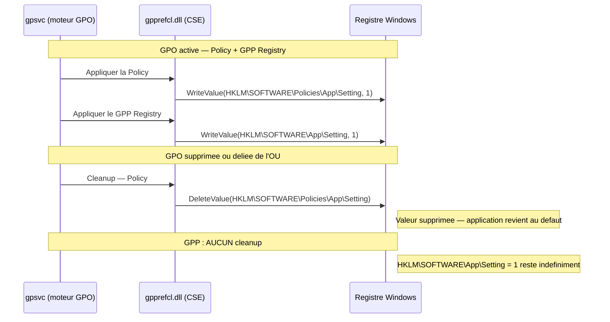

# Preferences de strategie de groupe (GPP)

!!! abstract "Ce que couvre ce chapitre"
    - La **distinction fondamentale** entre Policies (ADMX) et Preferences (GPP) : emplacement registre, nettoyage, verrouillage utilisateur
    - L'**architecture interne** : fichiers XML dans SYSVOL, GUIDs des CSE GPP, structure des items
    - Les **21 categories GPP** (Machine + User) et leurs fichiers XML associes
    - Le **format XML** d'un item Registry GPP et les attributs critiques
    - Les **4 actions CRUD** (Create / Replace / Update / Delete) et quand les utiliser
    - L'**effet tatouage** : pourquoi les valeurs GPP persistent apres suppression de la GPO et comment s'en proteger
    - L'impact sur les **performances de logon** et les strategies d'optimisation

!!! tip "Si vous ne retenez qu'une chose"
    Les **Policies** ecrivent sous `HKLM\SOFTWARE\**Policies**\` et sont **nettoyees** quand la GPO est supprimee ou deliee — le parametre revient a son defaut applicatif. Les **Preferences** ecrivent **hors** `\Policies\` (n'importe ou dans le registre) et **persistent indefiniment** apres suppression de la GPO : c'est l'**effet tatouage**. Ce n'est pas un bug, c'est le comportement voulu — mais c'est un piege redoutable pour les parametres de securite.

---

## :material-compare: Policies vs Preferences : la difference fondamentale

### Deux mecanismes, deux philosophies

GPO regroupe en realite deux mecanismes tres differents sous le meme nom. Confondre les deux est l'une des erreurs les plus courantes en production.

Les **Policies** (parametres ADMX/ADML) sont des parametres **autoritaires** : l'administrateur impose une valeur, l'utilisateur ne peut pas la modifier, et quand la GPO disparait, la valeur disparait avec elle. Elles ecrivent exclusivement sous `HKLM\SOFTWARE\Policies\` ou `HKCU\SOFTWARE\Policies\`.

Les **Preferences** (GPP) sont des parametres de **configuration initiale** : l'administrateur deploie une valeur, l'utilisateur peut la modifier apres coup (sauf si l'option "Run once" est desactivee), et quand la GPO disparait, la valeur reste. Elles ecrivent n'importe ou dans le registre, hors `\Policies\`.

### Tableau comparatif

| Critere | Policies (ADMX) | Preferences (GPP) |
|---------|----------------|-------------------|
| Emplacement registre | `HKLM\SOFTWARE\Policies\` | `HKLM\SOFTWARE\` (hors Policies) |
| Nettoyage a la suppression | :material-check: Oui — CSE supprime les valeurs | :material-close: Non — effet tatouage |
| L'utilisateur peut modifier | :material-close: Non — verrouille | :material-check: Oui — sauf "Run once" desactive |
| Item-Level Targeting | :material-close: Non disponible | :material-check: Oui — ciblage fin |
| Traitement en fond (background) | Selon la CSE specifique | :material-check: Oui — `gpprefcl.dll` |
| Source de verite | ADMX definit ce qui est gere | Aucune — ecriture directe au registre |
| Cas d'usage type | Securite, verrouillage | Configuration, raccourcis, lecteurs reseau |

!!! warning "Le piege classique"
    Deployer un parametre de securite (ex: niveau UAC, proxy) via GPP plutot que via une Policy ADMX. Quand la GPO est deliee ou la machine quitte le perimetre, la valeur de securite **reste** sur la machine. Ce scenario a cause des incidents de securite en production.

!!! quote "En resume"
    Policies = autoritaire + reverti a la suppression. Preferences = configuration initiale + persistant. Le choix entre les deux n'est pas une preference stylistique, c'est une decision architecturale.

---

## :material-folder-cog: Architecture interne des GPP

### Stockage dans SYSVOL

Contrairement aux parametres ADMX qui sont stockes dans `Registry.pol`, les items GPP sont stockes sous forme de **fichiers XML** dans SYSVOL, a l'interieur du dossier de la GPO.

Structure dans SYSVOL :
```
\\domaine.local\SYSVOL\domaine.local\Policies\{GPO-GUID}\
  Machine\
    Preferences\
      Registry\
        Registry.xml
      DriveMapSettings\
        DriveMapSettings.xml
      Services\
        Services.xml
      ...
  User\
    Preferences\
      Registry\
        Registry.xml
      DriveMapSettings\
        DriveMapSettings.xml
      ...
```

Chaque **categorie GPP** possede son propre sous-dossier et son propre fichier XML. Si une categorie n'est pas utilisee dans la GPO, son dossier n'existe pas — ce qui accelere le traitement.

### La CSE gpprefcl.dll

Une seule DLL gere toutes les categories GPP : `gpprefcl.dll`. C'est la **Client-Side Extension** des GPP. Elle est enregistree dans le registre avec plusieurs GUIDs selon la portee.

| GUID | Portee | Description |
|------|--------|-------------|
| `{0E28E245-9368-4853-AD84-6DA3BA35BB75}` | Machine + User | GPP global — dispatche vers les categories |
| `{169EBF44-942F-4C43-87CE-13C93996EBBE}` | Machine | GPP Machine uniquement |
| `{AADCED64-746C-4633-A97C-D61349046527}` | User | GPP User uniquement |

Verifier l'enregistrement de la CSE sur un poste :

```powershell title="Verifier l'enregistrement de gpprefcl.dll"
Get-ItemProperty `
  "HKLM:\SOFTWARE\Microsoft\Windows NT\CurrentVersion\Winlogon\GPExtensions\{0E28E245-9368-4853-AD84-6DA3BA35BB75}"
```

```powershell title="Resultat attendu"
DllName         : gpprefcl.dll
ProcessGroupPolicyEx : ProcessGroupPolicyExPreferences
...
```

### Comment gpprefcl.dll traite les items

Lors du traitement GPO, `gpprefcl.dll` :

1. Enumere tous les fichiers XML GPP de la GPO
2. Pour chaque item, evalue l'**Item-Level Targeting** (ILT) si present
3. Applique l'action (Create / Replace / Update / Delete) sur la cible (registre, fichier, service, etc.)
4. Ecrit le resultat dans le journal d'evenements `Microsoft-Windows-GroupPolicy/Operational`

!!! info "Pas de cache differentiel"
    Contrairement aux CSE ADMX qui maintiennent un cache et ne retraitent que les GPO modifiees (`NoGPOListChanges`), `gpprefcl.dll` **retraite tout** a chaque cycle GPO si au moins un item GPP est present dans une GPO modifiee. C'est un impact notable sur les performances de logon.

!!! quote "En resume"
    Les GPP sont des fichiers XML dans SYSVOL, traites par `gpprefcl.dll`. Un seul binaire gere 21 categories. L'absence de cache differentiel est l'explication principale de l'impact GPP sur les temps de logon.

---

## :material-view-list: Les 21 categories GPP

### Categories cote Machine (14)

Ces categories s'appliquent pendant le **demarrage de l'ordinateur**, independamment de l'utilisateur connecte.

| Categorie | Fichier XML | Cas d'usage typique |
|-----------|------------|---------------------|
| Registry | `Registry.xml` | Cles de registre hors `\Policies\` |
| Files | `Files.xml` | Copier, deplacer, supprimer des fichiers |
| Folders | `Folders.xml` | Creer ou supprimer des dossiers |
| Shortcuts | `Shortcuts.xml` | Raccourcis bureau ou menu Demarrer |
| Ini Files | `IniFiles.xml` | Modifier des fichiers `.ini` |
| Environment | `EnvironmentVariables.xml` | Variables d'environnement systeme |
| Network Shares | `NetworkShares.xml` | Creer/modifier des partages reseau locaux |
| Printers | `Printers.xml` | Deployer des imprimantes partagees |
| Services | `Services.xml` | Type de demarrage et etat d'un service |
| Drive Maps | `DriveMapSettings.xml` | Lecteurs reseau (machine) |
| Local Users and Groups | `Groups.xml` | Membres des groupes locaux (ex: Administrateurs) |
| Scheduled Tasks | `ScheduledTasks.xml` | Taches planifiees Windows |
| Power Options | `PowerOptions.xml` | Profils d'alimentation |
| Network Options | `NetworkOptions.xml` | Options dial-up et VPN |

### Categories cote User (12)

Ces categories s'appliquent lors de l'**ouverture de session** de l'utilisateur.

| Categorie | Fichier XML | Notes |
|-----------|------------|-------|
| Registry | `Registry.xml` | Cles `HKCU\` hors `\Policies\` |
| Files | `Files.xml` | Fichiers dans le profil utilisateur |
| Folders | `Folders.xml` | Dossiers du profil |
| Shortcuts | `Shortcuts.xml` | Raccourcis personnalises par utilisateur |
| Ini Files | `IniFiles.xml` | Fichiers INI de l'utilisateur |
| Environment | `EnvironmentVariables.xml` | Variables d'environnement utilisateur |
| Drive Maps | `DriveMapSettings.xml` | :material-star: Le plus utilise — lecteurs reseau |
| Printers | `Printers.xml` | Imprimantes par utilisateur |
| Internet Settings | `InternetSettings.xml` | Zones IE, proxy, parametres avances |
| Data Sources | `DataSources.xml` | Sources ODBC |
| Start Menu | `StartMenu.xml` | Options du menu Demarrer |
| Folder Options | `FolderOptions.xml` | Affichage des extensions, fichiers caches |

!!! info "Chevauchement Machine / User"
    Plusieurs categories existent des deux cotes (Registry, Files, Drive Maps...). La portee est determinee par l'emplacement du fichier XML : `Machine\Preferences\` ou `User\Preferences\`. Deux items identiques peuvent coexister — l'un s'applique au boot, l'autre au logon.

!!! quote "En resume"
    14 categories Machine (boot) + 12 categories User (logon) = 21 categories distinctes (avec chevauchements). Drive Maps User est de loin la plus deployee en production pour remplacer les scripts de logon.

---

## :material-xml: Format XML d'un item GPP Registry

### Structure d'un fichier Registry.xml

Chaque fichier XML GPP contient un element racine de categorie, qui contient des elements d'item individuels. Voici un exemple complet pour un item Registry Machine :

```xml title="Machine\Preferences\Registry\Registry.xml"
<?xml version="1.0" encoding="utf-8"?>
<RegistrySettings clsid="{A3CCFC41-DFDB-43a5-8D26-0FE8B954DA51}">
  <Registry clsid="{9CD4B2F4-923D-47f5-A062-E897DD1DAD50}"
            name="DisableWindowsUpdate"
            status="Enabled"
            image="7"
            changed="2026-04-05 10:00:00"
            uid="{ITEM-GUID}">
    <Properties action="U"
                displayDecimal="1"
                default="0"
                hive="HKEY_LOCAL_MACHINE"
                key="SOFTWARE\Microsoft\Windows\CurrentVersion\WindowsUpdate\Auto Update"
                name="NoAutoUpdate"
                type="REG_DWORD"
                value="00000001" />
  </Registry>
</RegistrySettings>
```

### Attributs de l'element `<Properties>`

Ce sont les attributs **operationnels** — ceux que `gpprefcl.dll` lit pour effectuer l'operation.

| Attribut | Valeurs possibles | Description |
|----------|-------------------|-------------|
| `action` | `C`, `R`, `U`, `D` | Create, Replace, Update, Delete |
| `hive` | `HKEY_LOCAL_MACHINE`, `HKEY_CURRENT_USER` | Ruche cible |
| `key` | Chemin de la cle | Sans la ruche — ex: `SOFTWARE\MonApp` |
| `name` | Nom de la valeur | Vide = valeur par defaut `(Default)` |
| `type` | `REG_DWORD`, `REG_SZ`, `REG_BINARY`, `REG_EXPAND_SZ`, `REG_MULTI_SZ`, `REG_QWORD` | Type de la valeur |
| `value` | Valeur en hexadecimal | Pour REG_DWORD : 4 octets little-endian ex: `00000001` |
| `displayDecimal` | `0`, `1` | Affichage dans la console GPMC (n'affecte pas l'ecriture) |
| `default` | `0`, `1` | Si `1`, supprime la valeur si la GPO est retraitee (comportement "restaurer defaut") |

### Attributs de l'element `<Registry>` (metadonnees)

| Attribut | Description |
|----------|-------------|
| `name` | Nom affiche dans la console GPMC |
| `status` | `Enabled` ou `Disabled` — un item desactive est ignore par la CSE |
| `uid` | GUID unique de l'item dans la GPO |
| `changed` | Horodatage de la derniere modification dans GPMC |
| `image` | Icone affichee dans GPMC (cosmétique) |

!!! info "Plusieurs items dans un meme fichier"
    Un fichier `Registry.xml` peut contenir des dizaines d'elements `<Registry>`. La CSE les traite dans l'ordre du document. L'ordre est donc deterministe — exploitable pour des dependances entre items.

!!! warning "Encodage des valeurs REG_DWORD"
    La valeur `00000001` est en hexadecimal **little-endian sur 4 octets**. `1` s'ecrit `00000001`, `256` s'ecrit `00000100`, `65536` s'ecrit `00010000`. La GPMC gere cette conversion automatiquement — mais si vous editez le XML a la main, attention.

!!! quote "En resume"
    Un item GPP Registry = un element `<Registry>` (metadonnees) contenant un element `<Properties>` (operation). L'attribut `action` determine le comportement CRUD. L'attribut `status="Disabled"` permet de desactiver temporairement un item sans le supprimer.

---

## :material-swap-horizontal: Les 4 actions CRUD

### Create (C)

:material-plus-circle: **Creer si absent.**

La CSE cree la cle ou la valeur **seulement si elle n'existe pas encore**. Si la valeur existe deja (quelle que soit sa valeur actuelle), la CSE ne touche a rien.

Cas d'usage : deployer une valeur par defaut sans ecraser une configuration existante. Utile pour les logiciels dont les utilisateurs peuvent modifier les parametres.

### Replace (R)

:material-cached: **Supprimer et recreer.**

La CSE **supprime** la cle ou valeur existante, puis la **recree** avec la valeur cible. Le resultat final est identique a Update, mais la suppression prealable est forcee — utile pour nettoyer des metadonnees ou des permissions sur une cle.

Cas d'usage : remplacer une cle avec des ACL problematiques, ou s'assurer qu'une valeur REG_SZ ne contient pas de caracteres residuels.

### Update (U)

:material-pencil: **Modifier si existe, creer si absent.**

C'est l'**action par defaut** et la plus utilisee. La CSE ecrit la valeur qu'elle existe ou non. Pas de suppression prealable.

Cas d'usage : 90% des deployments GPP Registry utilisent Update.

### Delete (D)

:material-delete: **Supprimer.**

La CSE supprime la cle ou la valeur. Si la cible n'existe pas, l'operation reussit silencieusement (pas d'erreur).

Cas d'usage : retirer une valeur de registre deployee par un ancien systeme, nettoyer apres une desinstallation.

### Tableau de synthese

| Action | Code | Cible existe | Cible absente | Cas d'usage principal |
|--------|------|-------------|---------------|----------------------|
| Create | `C` | Ignore | Cree | Valeur par defaut non ecrasable |
| Replace | `R` | Supprime + recree | Cree | Nettoyage forcé |
| Update | `U` | Modifie | Cree | Usage general (defaut) |
| Delete | `D` | Supprime | Succes silencieux | Nettoyage |

!!! warning "Create n'est pas idempotent dans le sens attendu"
    Si vous utilisez Create et que l'utilisateur a modifie la valeur, la CSE **ne corrigera pas** la valeur a chaque cycle GPO. Seul Update garantit que la valeur cible est toujours presente. Choisir entre Create et Update est une decision deliberee sur la politique de gestion des modifications utilisateur.

!!! quote "En resume"
    Update est l'action de 90% des deployments. Create pour les defauts non contraignants. Delete pour le nettoyage. Replace rarement — seulement quand la suppression prealable est necessaire.

---

## :material-alert-decagram: L'effet tatouage (tattooing)

### Qu'est-ce que le tatouage ?

Quand un item GPP Registry ecrit `HKLM\SOFTWARE\MonApp\Setting = 1`, la valeur est ecrite directement dans le registre Windows. Quand vous supprimez la GPO ou deliehez la GPO de l'OU, la CSE `gpprefcl.dll` **n'effectue aucun nettoyage**. La valeur `Setting = 1` reste indefiniment sur la machine.

Ce comportement est **voulu** : GPP est concu pour deployer des configurations qui doivent "coller" a la machine, meme si elle perd temporairement sa connectivite au domaine.

Mais c'est un **piege** quand on l'utilise pour des parametres de securite.

### Comparaison avec les Policies

```
Scenario : GPO avec un parametre Policy + un item GPP Registry
```

Quand la GPO est active :
- **Policy** ecrit `HKLM\SOFTWARE\Policies\MonApp\Setting = 1`
- **GPP** ecrit `HKLM\SOFTWARE\MonApp\Setting = 1`

Quand la GPO est supprimee :
- **Policy** : la CSE supprime `HKLM\SOFTWARE\Policies\MonApp\Setting` → l'application revient a son comportement par defaut
- **GPP** : **rien** → `HKLM\SOFTWARE\MonApp\Setting = 1` reste

### Cycle de vie : diagramme



### Detecter les valeurs tatouees

Pour identifier les valeurs GPP "orphelines" sur un poste (valeurs ecrites par GPP mais dont la GPO source n'existe plus) :

```powershell title="Lister les GPP appliquees et leur GPO source"
# Read the GPP history from the registry
# GPP records applied items under HKLM\SOFTWARE\Microsoft\Windows\CurrentVersion\Group Policy\History
$gppHistory = "HKLM:\SOFTWARE\Microsoft\Windows\CurrentVersion\Group Policy\History"

if (Test-Path $gppHistory) {
    Get-ChildItem $gppHistory -Recurse |
        Get-ItemProperty |
        Select-Object PSChildName, GPOName, DSPath |
        Format-Table -AutoSize
} else {
    Write-Host "No GPP history found on this machine."
}
```

```powershell title="Resultat attendu"
PSChildName   GPOName                  DSPath
-----------   -------                  ------
{0E28E245...} GPO-Workstations-Config  LDAP://CN={...},CN=Policies,...
{AADCED64...} GPO-Users-DriveMaps      LDAP://CN={...},CN=Policies,...
```

### Quand utiliser GPP vs Policies

| Parametre | Utiliser | Raison |
|-----------|----------|--------|
| Niveau UAC | **Policy** | Securite — doit etre retire si GPO supprimee |
| Regles de pare-feu | **Policy** | Securite — meme raison |
| URL de la page d'accueil | **GPP** ou **Policy** | Selon si l'utilisateur peut la modifier |
| Proxy HTTP | **Policy** | Securite reseau |
| Lecteurs reseau | **GPP** | Configuration — le tatouage est acceptable |
| Raccourcis bureau | **GPP** | Configuration non critique |
| Membres du groupe Administrateurs | **GPP** Local Users & Groups | Cas particulier — voir ci-dessous |

!!! warning "Local Users & Groups : le cas particulier"
    La categorie GPP "Local Users and Groups" peut **ajouter des membres** a un groupe local (ex: Administrateurs) avec l'action "Update". Si la GPO est supprimee, ces membres **restent** dans le groupe local. Pour les groupes de securite critiques, utilisez l'action **Replace** (qui reecrit la liste complete a chaque cycle) et documentez la GPO comme critique.

!!! info "Option 'Remove this item when it is no longer applied'"
    Depuis Windows Server 2008 R2, certaines categories GPP proposent l'option **"Remove this item when it is no longer applied"**. Cette option simule le comportement d'une Policy : la CSE supprime l'item quand la GPO n'est plus applicable. Elle n'est pas disponible pour toutes les categories — Registry la supporte.

!!! quote "En resume"
    L'effet tatouage est intentionnel mais dangereux pour les parametres de securite. La regle : si le parametre doit disparaitre quand la GPO disparait, utilisez une **Policy ADMX** ou activez **"Remove this item when it is no longer applied"**.

---

## :material-map-marker-path: Drive Maps : le cas d'usage le plus courant

### Remplacer les scripts de logon

Avant GPP, les lecteurs reseau etaient mappes via des scripts VBScript ou batch dans `NETLOGON`. Ces scripts etaient difficiles a maintenir, non cibles et peu lisibles dans les outils de diagnostic.

Les **Drive Maps GPP** (User-side) ont remplace cette approche dans la majorite des environnements modernes. Ils offrent :

- :material-target: **Item-Level Targeting** — mapper uniquement pour les membres d'un groupe AD
- :material-pencil: **Actions CRUD** — creer, modifier, supprimer un lecteur
- :material-variable: **Variables GPP** — `%USERNAME%`, `%USERDOMAIN%`, `%COMPUTERNAME%` resolues au moment du traitement
- :material-eye: **Visibilite** dans GPMC et `gpresult`

### Exemple XML : Drive Map utilisateur

```xml title="User\Preferences\DriveMapSettings\DriveMapSettings.xml"
<?xml version="1.0" encoding="utf-8"?>
<DriveMapSettings clsid="{8FDDCC1A-0C3C-43cd-A6B4-71A6DF20DA8C}">
  <Drive clsid="{935D1B74-9CB8-4e3c-9914-7DD559B7A417}"
         name="H:"
         status="H: (Mapped)"
         image="2"
         changed="2026-04-05 10:00:00"
         uid="{DRIVE-ITEM-GUID}">
    <Properties action="U"
                thisDrive="SHOW"
                allDrives="NOCHANGE"
                userName=""
                path="\\serveur\partage-utilisateurs\%USERNAME%"
                label="Mes Documents"
                persistent="1"
                useLetter="1"
                letter="H" />
  </Drive>
</DriveMapSettings>
```

### Variables GPP disponibles dans les chemins

| Variable | Valeur resolue | Exemple |
|----------|---------------|---------|
| `%USERNAME%` | Nom de compte de l'utilisateur | `jbombled` |
| `%USERDOMAIN%` | Domaine NetBIOS de l'utilisateur | `CORP` |
| `%COMPUTERNAME%` | Nom NetBIOS de la machine | `PC-JBOMBLED` |
| `%USERPROFILE%` | Chemin du profil utilisateur | `C:\Users\jbombled` |
| `%APPDATA%` | Dossier AppData\Roaming | `C:\Users\jbombled\AppData\Roaming` |
| `%LOCALAPPDATA%` | Dossier AppData\Local | `C:\Users\jbombled\AppData\Local` |

!!! info "Variables GPP vs variables d'environnement Windows"
    Les variables GPP (`%USERNAME%`, etc.) sont resolues par `gpprefcl.dll` au moment du traitement GPP — pas par `cmd.exe` ou PowerShell. Elles fonctionnent meme dans les chemins UNC, dans les valeurs de registre GPP, et dans les items Files/Folders. Ce sont des **expansions GPP**, pas des variables d'environnement au sens Windows.

!!! warning "Drive Maps Machine vs User"
    La categorie Drive Maps existe cote Machine et cote User. Les Drive Maps **Machine** s'appliquent au demarrage (avant logon), mais les lecteurs mappes en session systeme ne sont pas visibles pour les utilisateurs dans l'Explorateur. Utilisez **toujours** les Drive Maps **User** pour les lecteurs reseau destines aux utilisateurs.

### Verifier les Drive Maps appliques

```powershell title="Lister les lecteurs mappes et leur source GPP"
# List mapped drives via WMI
Get-WmiObject -Class Win32_MappedLogicalDisk |
    Select-Object Name, ProviderName, Description |
    Format-Table -AutoSize

# Cross-reference with GPP result
gpresult /r /scope user 2>&1 | Select-String -Pattern "Drive|Lecteur"
```

```powershell title="Resultat attendu"
Name  ProviderName                              Description
----  ------------                              -----------
H:    \\serveur\partage-utilisateurs\jbombled   Mes Documents
I:    \\serveur\partage-equipe                  Equipe RH
```

!!! quote "En resume"
    Drive Maps GPP est le successeur des scripts de logon VBScript. Il offre le ciblage ILT, les variables GPP dans les chemins UNC, et une visibilite complete dans GPMC. Utiliser la portee User (pas Machine) pour les lecteurs destines aux utilisateurs.

---

## :material-speedometer: Performances : l'impact GPP sur le logon

### Pourquoi les GPP sont couteuses

Contrairement aux CSE ADMX qui peuvent detecter l'absence de changement et sauter le traitement (`NoGPOListChanges`), `gpprefcl.dll` **retraite systematiquement** tous les items GPP si la liste de GPO a change ou si le traitement est force.

De plus, `gpprefcl.dll` ouvre et parse le XML de **chaque categorie presente** dans chaque GPO — meme si l'item ne s'applique pas a la machine (avant evaluation ILT).

### Estimation de l'impact

Ordres de grandeur mesures en production (varient selon le materiel et le reseau) :

| Scenario | Impact estime |
|----------|--------------|
| 1 GPO avec 1 categorie Drive Maps | ~50-150 ms |
| 1 GPO avec 5 categories (Registry + Drive Maps + Shortcuts + Files + Printers) | ~200-500 ms |
| 10 GPOs avec 2 categories chacune | ~1-3 secondes |
| 20 GPOs avec 3 categories chacune | ~3-8 secondes |

Ces chiffres s'accumulent avec le reste du traitement GPO (CSE ADMX, scripts, redirection de dossiers...).

### Strategies d'optimisation

**Consolider les GPO GPP.** Au lieu de 10 GPOs avec 1 item Drive Map chacune, regrouper dans 2-3 GPOs avec Item-Level Targeting. Chaque GPO entraine un acces SYSVOL et une initialisation de CSE.

**Desactiver les sections inutilisees.** Dans GPMC, clic droit sur la GPO → Proprietes → desactiver "User Configuration Settings" si la GPO ne contient que des items Machine (et vice versa).

**Utiliser Item-Level Targeting pour sauter les machines irrelevantes.** Un item avec ILT est quand meme parse par la CSE, mais l'operation de modification du registre/fichier est sautee. Le gain est reel mais moindre que la suppression pure de la GPO.

**Eviter les categories inutiles dans une GPO.** Ne pas creer de GPO "fourre-tout" avec toutes les categories actives. Garder les GPO specialisees.

```powershell title="Mesurer le temps de traitement GPP lors d'un gpupdate"
# Measure GPO processing time including GPP
$start = Get-Date
gpupdate /force 2>&1 | Out-Null
$elapsed = (Get-Date) - $start
Write-Host "Total gpupdate time: $($elapsed.TotalSeconds) seconds"

# For detailed CSE timing, read the event log after gpupdate
Get-WinEvent -LogName "Microsoft-Windows-GroupPolicy/Operational" |
    Where-Object { $_.Id -in @(4016, 5016, 7016) } |
    Select-Object TimeCreated, Id, Message |
    Sort-Object TimeCreated |
    Format-List
```

```powershell title="Resultat attendu"
Total gpupdate time: 4.7 seconds

TimeCreated : 2026-04-05 10:15:22
Id          : 4016
Message     : Starting processing for extension Preferences (Registry)...

TimeCreated : 2026-04-05 10:15:23
Id          : 5016
Message     : Completed processing for extension Preferences (Registry) in 847 ms.
```

!!! info "IDs d'evenements GPP utiles"
    - **4016** : debut de traitement d'une categorie GPP
    - **5016** : fin de traitement reussie (avec duree)
    - **6016** : avertissement pendant le traitement
    - **7016** : erreur pendant le traitement d'une categorie

!!! warning "GPP et les profils itinerants"
    Sur les environnements avec profils itinerants (Roaming Profiles), les Drive Maps User sont appliquees **avant** le chargement du profil itinerant. Si le profil contient des parametres qui remplacent les Drive Maps, il peut y avoir un conflit. Tester systematiquement en environnement RDS.

!!! quote "En resume"
    Chaque categorie GPP active dans une GPO = ~100-200 ms de temps de traitement. Avec 10 GPOs et 3 categories chacune, on depasse facilement 3 secondes. L'optimisation principale : consolider les GPOs et desactiver les sections inutilisees.

---

## :material-wrench-cog: Diagnostiquer les GPP

### Verifier l'application via gpresult

```powershell title="Generer un rapport HTML GPP detaille"
# Generate a full HTML report including GPP details
gpresult /h "C:\Temp\gpresult-$(hostname)-$(Get-Date -Format 'yyyyMMdd-HHmm').html" /f

# Quick text summary for GPP
gpresult /r /scope computer 2>&1 | Out-String
```

### Forcer le retraitement GPP

Par defaut, si la liste de GPO n'a pas change, `gpprefcl.dll` peut sauter le traitement. Pour forcer :

```powershell title="Forcer le retraitement de toutes les GPP"
# Force synchronous GPO processing including GPP
gpupdate /force /wait:0

# Or with PowerShell (requires RSAT)
Invoke-GPUpdate -Computer "NOM-PC" -Force -RandomDelayInMinutes 0
```

### Journaux d'evenements GPP

```powershell title="Lire les evenements GPP des 2 dernieres heures"
# Read GPP-related events from the Group Policy operational log
$since = (Get-Date).AddHours(-2)
Get-WinEvent -LogName "Microsoft-Windows-GroupPolicy/Operational" |
    Where-Object {
        $_.TimeCreated -ge $since -and
        $_.Id -in @(4016, 5016, 6016, 7016, 8016)
    } |
    Select-Object TimeCreated, Id, LevelDisplayName, Message |
    Format-List
```

### Lire les fichiers XML GPP directement

Pour auditer ce qu'une GPO deploie sans passer par GPMC :

```powershell title="Lire le Registry.xml d'une GPO depuis SYSVOL"
# Replace with your domain and GPO GUID
$domain  = "domaine.local"
$gpoGuid = "{00000000-0000-0000-0000-000000000000}"
$xmlPath = "\\$domain\SYSVOL\$domain\Policies\$gpoGuid\Machine\Preferences\Registry\Registry.xml"

if (Test-Path $xmlPath) {
    [xml]$xmlContent = Get-Content $xmlPath -Encoding UTF8
    $xmlContent.RegistrySettings.Registry | ForEach-Object {
        [PSCustomObject]@{
            Name   = $_.name
            Status = $_.status
            Action = $_.Properties.action
            Hive   = $_.Properties.hive
            Key    = $_.Properties.key
            Value  = $_.Properties.name
            Data   = $_.Properties.value
        }
    }
} else {
    Write-Host "Registry.xml not found for this GPO — no Registry GPP items configured."
}
```

```powershell title="Resultat attendu"
Name                 Status  Action Hive              Key                                         Value           Data
----                 ------  ------ ----              ---                                         -----           ----
DisableWindowsUpdate Enabled U      HKEY_LOCAL_MACHINE SOFTWARE\Microsoft\Windows\...\Auto Update NoAutoUpdate    00000001
ProxySettings        Enabled U      HKEY_LOCAL_MACHINE SOFTWARE\Microsoft\Windows\...\Internet... ProxyServer     00000000
```

!!! quote "En resume"
    Le diagnostic GPP repose sur trois outils : `gpresult /h` pour le rapport complet, le journal `Microsoft-Windows-GroupPolicy/Operational` pour les evenements de traitement, et la lecture directe des XML SYSVOL pour l'audit des items configures.

---

## :material-link-variant: Interactions avec les autres mecanismes GPO

### GPP et Block Inheritance

Block Inheritance (`gpInheritanceModeBlocked`) bloque les GPO parentes — y compris leurs items GPP. Une GPO Enforced (`GPLINK_OPT_ENFORCED`) traverse le Block Inheritance — ses items GPP sont appliques.

Ce comportement est identique pour les Policies et les Preferences. Pas de cas particulier GPP.

### GPP et le filtrage WMI / securite

Les filtres WMI et le filtrage de securite (permissions `Apply Group Policy`) s'appliquent a la GPO entiere — y compris ses items GPP. Si un utilisateur n'a pas les droits `Apply Group Policy` sur la GPO, aucun item GPP de cette GPO ne s'applique.

### GPP et le loopback

En mode Loopback Replace, les GPO User de l'OU de l'utilisateur sont ecartees — y compris leurs items GPP User (Drive Maps, etc.). Seuls les items GPP User des GPO de l'OU de l'ordinateur s'appliquent. C'est un comportement souvent oublie lors du deploiement de Drive Maps sur des serveurs RDS.

!!! info "Drive Maps en environnement RDS avec loopback Replace"
    Si vous utilisez le loopback Replace sur des serveurs RDS, les Drive Maps doivent etre configures dans des GPO liees a l'**OU des serveurs RDS** (pas l'OU des utilisateurs). Les Drive Maps des GPO liees a l'OU des utilisateurs sont ignorees.

### GPP et Intune / MDM

Microsoft Intune peut deployer des configurations de registre via des **OMA-URI** ou des profils de configuration personnalises. Ces configurations n'utilisent pas `gpprefcl.dll` — elles passent par le CSP de configuration MDM.

Il n'y a pas de mecanisme de deduplication automatique entre GPP et Intune. Une valeur ecrite par GPP et une valeur ecrite par Intune sur la meme cle de registre entrent en conflit selon l'ordre d'application — le dernier gagne.

!!! warning "Co-gestion GPP + Intune"
    En environnement de co-gestion (GPO + Intune simultanes), auditer systematiquement les cles de registre communes aux deux systemes. Utiliser Regedit ou PowerShell pour verifier quelle valeur est effectivement presente sur la machine, independamment de ce que les outils de gestion affichent.

!!! quote "En resume"
    GPP suit les memes regles d'heritage, filtrage et loopback que les Policies. La difference majeure est avec Intune : pas de deduplication automatique, le dernier qui ecrit gagne.

---

## :material-table-search: Referentiel rapide

### GUIDs des CSE GPP

| GUID | Portee | DLL |
|------|--------|-----|
| `{0E28E245-9368-4853-AD84-6DA3BA35BB75}` | Machine + User | `gpprefcl.dll` |
| `{169EBF44-942F-4C43-87CE-13C93996EBBE}` | Machine | `gpprefcl.dll` |
| `{AADCED64-746C-4633-A97C-D61349046527}` | User | `gpprefcl.dll` |

### Fichiers XML par categorie

| Categorie | Fichier XML | Portee |
|-----------|------------|--------|
| Registry | `Registry\Registry.xml` | Machine + User |
| Files | `Files\Files.xml` | Machine + User |
| Folders | `Folders\Folders.xml` | Machine + User |
| Shortcuts | `Shortcuts\Shortcuts.xml` | Machine + User |
| Ini Files | `IniFiles\IniFiles.xml` | Machine + User |
| Environment | `EnvironmentVariables\EnvironmentVariables.xml` | Machine + User |
| Drive Maps | `DriveMapSettings\DriveMapSettings.xml` | Machine + User |
| Printers | `Printers\Printers.xml` | Machine + User |
| Network Shares | `NetworkShares\NetworkShares.xml` | Machine uniquement |
| Services | `Services\Services.xml` | Machine uniquement |
| Local Users & Groups | `Groups\Groups.xml` | Machine uniquement |
| Scheduled Tasks | `ScheduledTasks\ScheduledTasks.xml` | Machine uniquement |
| Power Options | `PowerOptions\PowerOptions.xml` | Machine uniquement |
| Network Options | `NetworkOptions\NetworkOptions.xml` | Machine uniquement |
| Internet Settings | `InternetSettings\InternetSettings.xml` | User uniquement |
| Data Sources | `DataSources\DataSources.xml` | User uniquement |
| Start Menu | `StartMenu\StartMenu.xml` | User uniquement |
| Folder Options | `FolderOptions\FolderOptions.xml` | User uniquement |

### Actions CRUD — aide-memoire

| Action | Code | Quand l'utiliser |
|--------|------|-----------------|
| Create | `C` | Valeur par defaut — l'utilisateur peut la modifier et elle ne sera pas ecrasee |
| Replace | `R` | Remplacement force — nettoyer une cle avec ACL problematiques |
| Update | `U` | Cas general — 90% des deployments |
| Delete | `D` | Nettoyage, retrait d'une valeur residuelle |

### IDs d'evenements GPP

| ID | Journal | Signification |
|----|---------|---------------|
| 4016 | Microsoft-Windows-GroupPolicy/Operational | Debut de traitement d'une categorie GPP |
| 5016 | Microsoft-Windows-GroupPolicy/Operational | Fin de traitement reussie (avec duree en ms) |
| 6016 | Microsoft-Windows-GroupPolicy/Operational | Avertissement pendant le traitement |
| 7016 | Microsoft-Windows-GroupPolicy/Operational | Erreur pendant le traitement |
| 8016 | Microsoft-Windows-GroupPolicy/Operational | Item GPP individuel — erreur d'application |

---

## :material-crosshairs-gps: Renvois croisés

| Sujet | Chapitre |
|-------|---------|
| Item-Level Targeting avance — toutes les conditions | [Ch. 12 — ILT](12-ilt.md) |
| CSE `gpprefcl.dll` — enregistrement et cycle de traitement | [Ch. 03 — CSE](03-cse.md) |
| Registre hors `\Policies\` — risques et audit | La Bible du Registre — Ch. 20 |
| Preferences GPP niveau debutant — concepts de base | Les GPO pour les Nuls — Ch. 10 |
| Performances du traitement GPO | [Ch. 23 — Performances](23-performances.md) |
| Co-gestion GPO + Intune | [Ch. 25 — MDM et convergence](25-mdm-convergence.md) |
