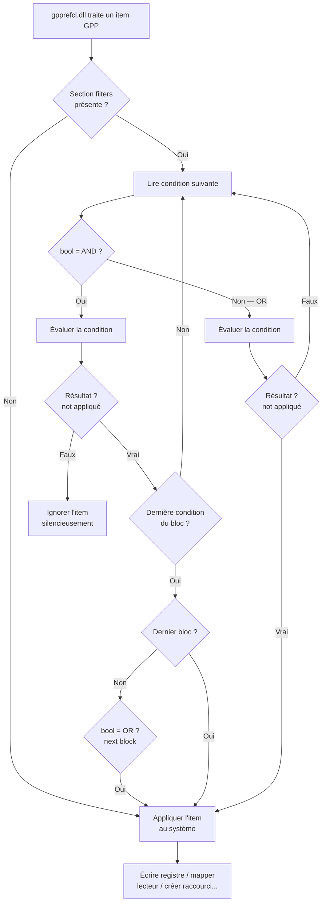

# Item-Level Targeting avancé

!!! abstract "Ce que couvre ce chapitre"
    - L'architecture interne de l'ILT : où les conditions sont stockées dans le XML GPP et quels attributs contrôlent la logique booléenne
    - Les 22 types de conditions disponibles avec leur sémantique précise, leur coût d'évaluation et leurs cas d'usage typiques
    - La logique AND/OR/NOT : comment GPMC la représente visuellement et ce qu'elle génère réellement dans le XML
    - Les trois conditions avancées — LDAP Query, Registry Match, WMI Query — avec leurs pièges de performance
    - Les stratégies d'optimisation pour éviter que l'ILT devienne un goulot d'étranglement à l'ouverture de session
    - La comparaison rigoureuse ILT / WMI Filter / Security Filtering pour choisir le bon mécanisme selon le contexte
    - Les Event IDs et les techniques PowerShell pour diagnostiquer un ILT silencieux

---

!!! tip "Si vous ne retenez qu'une chose"
    L'ILT évalue les conditions **côté client**, avant d'appliquer chaque item GPP individuellement. C'est plus granulaire qu'un filtre WMI (par item plutôt que par GPO), mais la logique est similaire. La combinaison AND/OR/NOT entre conditions vous permet de construire des règles de ciblage très précises — au prix d'un surcoût d'évaluation proportionnel au nombre d'items et à la lourdeur de chaque condition.

---

## :material-filter-cog: Qu'est-ce que l'ILT ?

### :material-puzzle: Un mécanisme de filtrage par item, pas par GPO

Group Policy Preferences (GPP) est la couche de configuration flexible de Group Policy. Elle gère les lecteurs réseau, les imprimantes, les entrées de registre, les raccourcis, les tâches planifiées et une vingtaine d'autres catégories.

Chacun de ces éléments — chaque item GPP — peut avoir ses propres règles de filtrage. C'est l'**Item-Level Targeting** (ILT).

Le Security Filtering et les WMI Filters opèrent au niveau de la GPO entière. L'ILT est orthogonal : il s'applique à chaque item individuellement, à l'intérieur d'une GPO qui a déjà passé les autres filtres.

### :material-cog-transfer: Qui évalue l'ILT ?

La DLL `gpprefcl.dll` est la CSE qui traite toutes les préférences GPP. C'est elle, et elle seule, qui implémente la logique ILT.

Lors du traitement d'une GPO, `gpprefcl.dll` parcourt chaque item. Pour chaque item, si une section `<filters>` est présente, elle évalue les conditions avant d'écrire quoi que ce soit sur le système. Si les conditions ne sont pas satisfaites, l'item est silencieusement ignoré.

Aucune trace n'est écrite dans le journal des événements pour un item ignoré par ILT — c'est un comportement normal, pas une erreur.

### :material-layers: Ce que l'ILT rend possible

Sans ILT, un lecteur réseau mappé par GPP s'applique à tous les objets dans la portée de la GPO. Avec l'ILT, ce même lecteur peut ne s'appliquer qu'aux machines portables, membres d'un groupe AD spécifique, sous Windows 11, situées dans un sous-réseau particulier.

Une seule GPO peut contenir :

- Un item qui s'applique uniquement aux portables (condition Battery Present)
- Un item qui s'applique uniquement aux postes fixes en salle de conférence (condition Computer Name = `CONF-*`)
- Un item qui s'applique uniquement aux membres du groupe `GRP-Ingénieurs` sous Windows 11 (conditions Security Group + OS Version)

!!! quote "En résumé"
    L'ILT est le mécanisme de filtrage **par item** de Group Policy Preferences. La CSE `gpprefcl.dll` évalue les conditions avant chaque application. Un item dont les conditions ILT échouent est ignoré sans erreur, sans log, sans trace visible.

---

## :material-code-braces: Architecture de l'ILT dans le XML GPP

### :material-file-xml: Où vivent les conditions

Les fichiers GPP sont des fichiers XML stockés dans SYSVOL, sous le dossier `User\Preferences` ou `Machine\Preferences` de chaque GPO. Chaque catégorie a son propre fichier : `Drives.xml`, `Printers.xml`, `Registry.xml`, etc.

Un item GPP sans ILT ressemble à ceci :

```xml title="Item sans ILT — Drive.xml"
<Drive clsid="{935D1B74-9CB8-4E3C-9914-7DD559B7A417}"
       name="H:" status="H:" image="2" changed="2024-01-15 09:00:00"
       uid="{A1B2C3D4-...}">
  <Properties action="U" path="\\srv-fichiers\home\%USERNAME%"
              letter="H" label="Dossier personnel"
              persistent="1" useLetter="1"/>
</Drive>
```

Dès qu'une condition ILT est ajoutée, une section `<filters>` apparaît :

```xml title="Item avec ILT — Drive.xml"
<Drive clsid="{935D1B74-9CB8-4E3C-9914-7DD559B7A417}"
       name="H:" status="H:" image="2" changed="2024-01-15 09:00:00"
       uid="{A1B2C3D4-...}">
  <Properties action="U" path="\\srv-fichiers\home\%USERNAME%"
              letter="H" label="Dossier personnel"
              persistent="1" useLetter="1"/>
  <filters>
    <!-- Condition 1: member of security group (AND, not negated) -->
    <filterGroup bool="AND" not="0"
                 name="CONTOSO\GRP-Employes-Permanents"
                 sid="S-1-5-21-3456789012-987654321-1234567890-1234"
                 localGroup="0" primaryGroup="0" userContext="1"
                 filterType="GROUP"/>
    <!-- Condition 2: OS range Windows 10/11 (AND, not negated) -->
    <filterOsRange bool="AND" not="0"
                   type="WINDOWS" edition=""
                   versionUpper="11.99.99999"
                   versionLower="10.0.0"/>
  </filters>
</Drive>
```

### :material-table: Les attributs clés de chaque condition

| Attribut | Valeurs possibles | Rôle |
|----------|------------------|------|
| `bool` | `AND` / `OR` | Opérateur logique avec la condition précédente |
| `not` | `0` / `1` | Négation de la condition (`1` = NOT) |
| `filterType` | Dépend du type | Identifie le type de condition |
| `userContext` | `0` / `1` | `1` = évaluer dans le contexte utilisateur |

!!! info "Le `bool` de la première condition"
    La première condition dans `<filters>` a toujours `bool="AND"` par convention, car il n'y a pas de condition précédente avec laquelle combiner. Cette valeur est ignorée pour le premier élément — seul le `bool` des conditions suivantes a un effet réel.

!!! warning "Ne jamais éditer le XML manuellement en production"
    Les GUIDs, SIDs et formats de version sont très sensibles. Une erreur de syntaxe XML rend l'item invalide — `gpprefcl.dll` ignore silencieusement les items malformés. Utilisez toujours la GPMC pour modifier les conditions ILT.

!!! quote "En résumé"
    Les conditions ILT vivent dans la section `<filters>` de chaque item dans les fichiers XML de SYSVOL. Les attributs `bool` et `not` contrôlent respectivement l'opérateur logique et la négation. La structure est lisible mais ne doit jamais être modifiée manuellement.

---

## :material-format-list-bulleted-type: Les 22 types de conditions ILT

### :material-table-large: Table de référence complète

| Type de condition | Ce qu'il évalue | Coût | Cas d'usage typique |
|-------------------|-----------------|------|---------------------|
| **Battery Present** | Présence d'une batterie | Très faible | Paramètres spécifiques portables |
| **Computer Name** | Nom de la machine (wildcards `*` et `?`) | Très faible | `PC-DEV-*`, `CONF-?-*` |
| **CPU Speed** | Vitesse du processeur en MHz | Faible | Paramètres selon les performances |
| **Date/Time** | Date et heure actuelles | Très faible | Configurations temporaires (événements) |
| **Disk Space** | Espace disque libre sur un volume | Faible | Alertes ou paramètres de stockage |
| **Domain** | Appartenance au domaine AD | Faible | Distinction domaine / workgroup |
| **Environment Variable** | Valeur d'une variable d'environnement | Très faible | `%COMPUTERNAME%`, `%APPDATA%` |
| **File Match** | Présence et/ou version d'un fichier | Faible | Détecter un logiciel par son exécutable |
| **IP Address Range** | Adresse IP dans une plage CIDR | Faible | Segmentation par sous-réseau |
| **Language** | Langue du système d'exploitation | Très faible | Paramètres régionaux différenciés |
| **LDAP Query** | Attribut AD quelconque (filtre LDAP) | **Élevé** | Attributs custom sur l'objet AD |
| **MAC Address** | Adresse MAC d'une interface | Faible | Identification matérielle précise |
| **MSI Query** | Package MSI installé (ProductCode) | Moyen | Ciblage selon logiciels déployés via MSI |
| **Operating System** | Version exacte de Windows | Très faible | `10.0.22000` = Windows 11 21H2 |
| **OS Range** | Plage de versions Windows | Très faible | Toutes versions Windows 10 et 11 |
| **OU** | OU de l'objet dans l'AD | Faible | Zone géographique ou département |
| **PCMCIA Present** | Présence d'un slot PCMCIA | Très faible | Matériel legacy (rare aujourd'hui) |
| **RAM** | Mémoire RAM disponible | Faible | Paramètres selon les ressources |
| **Registry Match** | Valeur de registre sur le client | Faible | Détecter une configuration ou un logiciel |
| **Security Group** | Appartenance à un groupe AD | Faible (cache) | Filtrage utilisateur ou ordinateur |
| **Site** | Site AD de la machine | Faible | Bureau régional, filiale |
| **Terminal Services** | Présence d'une session RDS/TS | Très faible | Comportement différent en RDS |
| **Time Range** | Heure de la journée | Très faible | Paramètres horaires |
| **User** | Compte utilisateur spécifique (SID) | Très faible | Ciblage nominatif (cas exceptionnels) |
| **WMI Query** | Requête WQL quelconque | **Élevé** | Propriétés matérielles ou OS avancées |

!!! info "OS vs OS Range"
    La condition **Operating System** cible une version exacte avec une chaîne de type `10.0.22000`. La condition **OS Range** accepte une borne inférieure et une borne supérieure — elle est plus robuste pour couvrir plusieurs mises à jour Feature Update d'un même OS.

### :material-laptop: La condition Battery Present

`Battery Present` est l'une des conditions les plus simples et les plus utiles. Elle évalue si `Win32_Battery` retourne au moins un objet.

Elle est idéale pour distinguer portables et fixes sans requête WMI explicite — c'est une requête WMI interne, mais déjà optimisée par Windows.

```xml title="Condition Battery Present dans le XML"
<filterBattery bool="AND" not="0"/>
```

### :material-ip-network: La condition IP Address Range

`IP Address Range` compare la première adresse IP routable de la machine avec une plage définie. Elle ne supporte pas nativement la notation CIDR — vous saisissez une adresse de début et une adresse de fin.

Pour `192.168.10.0/24`, vous entrez : début `192.168.10.1`, fin `192.168.10.254`.

```xml title="Condition IP Range dans le XML"
<filterIpRange bool="AND" not="0"
               ipLow="192.168.10.1"
               ipHigh="192.168.10.254"/>
```

!!! warning "VPN et adresses IP"
    Sur une machine connectée par VPN, la condition IP Range évalue l'adresse du tunnel VPN, pas l'adresse physique. Vérifiez l'ordre des interfaces réseau si les résultats sont inattendus.

### :material-account-group: La condition Security Group

`Security Group` vérifie l'appartenance d'un utilisateur ou d'un ordinateur à un groupe AD. C'est l'une des conditions les plus utilisées et l'une des moins coûteuses.

L'appartenance aux groupes AD est **mise en cache dans le token Kerberos**. L'évaluation ne génère pas d'appel LDAP supplémentaire — elle lit le token déjà présent en mémoire.

```xml title="Condition Security Group dans le XML"
<filterGroup bool="AND" not="0"
             name="CONTOSO\GRP-Postes-DevOps"
             sid="S-1-5-21-3456789012-987654321-1234567890-4567"
             localGroup="0" primaryGroup="0"
             userContext="0" filterType="GROUP"/>
```

L'attribut `userContext="0"` signifie que le groupe est évalué dans le contexte machine. `userContext="1"` évalue dans le contexte utilisateur.

!!! quote "En résumé"
    Les 22 types de conditions couvrent des critères hardware, réseau, système et AD. Le coût d'évaluation varie de négligeable (Battery Present, Computer Name) à élevé (LDAP Query, WMI Query). Choisir la condition la moins coûteuse qui exprime votre besoin est la règle d'or.

---

## :material-logic-and: Logique booléenne AND/OR/NOT

### :material-eye: Ce que GPMC affiche vs ce que le XML contient

Dans la GPMC, l'éditeur ILT présente les conditions dans une liste. Ce que l'interface appelle un "groupe de conditions" correspond à un bloc AND. Les blocs eux-mêmes sont combinés par OR.

Chaque condition a une case "NOT" qui correspond à l'attribut `not="1"` dans le XML.

La règle de lecture est la suivante :

```
Résultat = (Bloc1_Condition1 AND Bloc1_Condition2 AND ...) 
        OR (Bloc2_Condition1 AND Bloc2_Condition2 AND ...)
        OR ...
```

### :material-example: Exemples de combinaisons courantes

**Cas 1 : Portables membres d'un groupe**

```
Condition 1 : Battery Present          [bool=AND, not=0]
Condition 2 : Security Group = GRP-Portables  [bool=AND, not=0]
```

Résultat : la machine doit avoir une batterie ET appartenir au groupe.

**Cas 2 : Exclure les kiosques**

```
Condition 1 : Computer Name = KIOSK-*  [bool=AND, not=1]
```

Résultat : s'applique à toutes les machines dont le nom ne commence pas par `KIOSK-`.

**Cas 3 : Windows 10 OU Windows 11**

```
Bloc 1 — Condition 1 : OS Version = 10.0.x  [bool=AND, not=0]
                        [OR entre blocs]
Bloc 2 — Condition 1 : OS Version = 11.x    [bool=AND, not=0]
```

Dans la GPMC, cela se traduit par deux blocs séparés dans l'éditeur ILT, reliés par le bouton "OR".

!!! info "Priorité des opérateurs"
    L'ILT n'a pas de parenthèses libres. La structure est toujours : produit de sommes — AND à l'intérieur des blocs, OR entre les blocs. Si vous avez besoin d'une logique plus complexe (AND entre deux conditions OR), vous devrez la reformuler ou utiliser une condition WMI Query.

!!! quote "En résumé"
    La logique ILT est une forme normale disjonctive (FND) : OR de blocs AND. Chaque bloc est une liste de conditions toutes réunies par AND. La négation NOT s'applique condition par condition. Cette structure couvre la grande majorité des cas métier sans avoir recours aux conditions les plus coûteuses.

---

## :material-chart-timeline-variant: Diagramme d'évaluation ILT

Le diagramme suivant représente le flux d'évaluation exécuté par `gpprefcl.dll` pour chaque item GPP contenant une section `<filters>`.



!!! info "Court-circuit OR"
    Quand `gpprefcl.dll` rencontre un bloc OR dont la première condition est vraie, elle applique immédiatement l'item sans évaluer les blocs suivants. C'est le comportement standard de court-circuit booléen — placez les blocs OR les plus susceptibles d'être vrais en premier pour économiser des évaluations.

---

## :material-database-search: Condition avancée : LDAP Query

### :material-magnify: Principe

La condition `LDAP Query` est la plus puissante de toutes. Elle peut interroger n'importe quel attribut de n'importe quel objet AD en utilisant la syntaxe de filtre LDAP standard.

Exemples d'utilisation :

- Cibler les ordinateurs dont l'attribut `extensionAttribute1` vaut `"Poste-DevOps"`
- Cibler les utilisateurs dont le département est `"Ingénierie"` (`department`)
- Cibler les objets dont la description contient un code spécifique

```xml title="Configuration LDAP Query dans la GPMC"
Namespace : LDAP:                    (vide = contrôleur de domaine courant)
Filter     : (&(objectClass=computer)(extensionAttribute1=Poste-DevOps))
Binding    : Computer                (Computer ou User selon le contexte)
```

### :material-code-json: Dans le XML GPP

```xml title="Condition LDAP Query dans le XML"
<filterLdap bool="AND" not="0"
            binding="computer"
            ldapQuery="(&amp;(objectClass=computer)(extensionAttribute1=Poste-DevOps))"
            searchRoot=""
            dnsDomain="contoso.local"/>
```

!!! warning "Encodage XML des caractères spéciaux LDAP"
    Le caractère `&` utilisé dans les filtres LDAP composés (`(&(...)(...)...)`) doit être encodé en `&amp;` dans le XML. GPMC le fait automatiquement. Si vous lisez le XML brut, ne confondez pas l'encodage avec une erreur de syntaxe.

### :material-speedometer-slow: Impact sur les performances

Chaque condition `LDAP Query` génère **un appel LDAP au contrôleur de domaine** lors de l'évaluation. Cet appel est synchrone pendant le traitement GPP.

Estimation de l'impact :

| Nombre d'items avec LDAP Query | Latence DC (LAN) | Surcoût estimé |
|--------------------------------|------------------|----------------|
| 5 items | 20 ms/appel | +100 ms |
| 20 items | 20 ms/appel | +400 ms |
| 50 items | 20 ms/appel | **+1 seconde** |
| 50 items | 80 ms/appel (WAN) | **+4 secondes** |

Sur un lien WAN ou un accès via VPN avec de la latence, l'impact peut devenir significatif à l'ouverture de session.

!!! tip "Alternative : utilisez les attributs AD avec Security Group"
    Si vous utilisez `LDAP Query` uniquement pour tester un attribut booléen ou une classification, envisagez de créer un groupe AD (`GRP-DevOps-Machines`) et d'utiliser Security Group à la place. La vérification de groupe est gratuite (token Kerberos), la requête LDAP ne l'est pas.

!!! quote "En résumé"
    `LDAP Query` est la condition ILT la plus flexible — elle peut cibler n'importe quel attribut AD. Mais chaque utilisation coûte un aller-retour LDAP vers le DC. Réservez-la aux cas où aucune autre condition ne peut exprimer le même critère.

---

## :material-registry: Condition avancée : Registry Match

### :material-magnify: Principe

`Registry Match` vérifie l'existence ou la valeur d'une clé de registre sur le client local. C'est l'alternative recommandée à `WMI Query` pour détecter des logiciels installés.

Opérateurs disponibles :

| Opérateur | Comportement |
|-----------|-------------|
| `EXISTS` | La valeur ou la clé existe, quelle que soit sa donnée |
| `NOT EXISTS` | La valeur ou la clé n'existe pas |
| `IS` | La donnée est exactement égale à la valeur spécifiée |
| `IS NOT` | La donnée est différente de la valeur spécifiée |
| `CONTAINS` | La donnée contient la chaîne spécifiée (REG_SZ) |
| `DOES NOT CONTAIN` | La donnée ne contient pas la chaîne |
| `STARTS WITH` | La donnée commence par la chaîne |
| `ENDS WITH` | La donnée se termine par la chaîne |

### :material-application: Détecter un logiciel sans Win32_Product

L'exemple classique : appliquer un paramètre uniquement si Google Chrome est installé.

```xml title="Condition Registry Match — détection Chrome"
<!-- Check default value of the App Paths registry key -->
<filterRegistry bool="AND" not="0"
                hive="HKEY_LOCAL_MACHINE"
                key="SOFTWARE\Microsoft\Windows\CurrentVersion\App Paths\chrome.exe"
                value=""
                type="REG_SZ"
                operator="EXISTS"/>
```

Ou via la version installée dans Uninstall :

```xml title="Condition Registry Match — version Chrome"
<filterRegistry bool="AND" not="0"
                hive="HKEY_LOCAL_MACHINE"
                key="SOFTWARE\Google\Chrome\BLBeacon"
                value="version"
                type="REG_SZ"
                operator="EXISTS"/>
```

!!! info "Pourquoi éviter Win32_Product ?"
    `Win32_Product` déclenche un scan MSI complet sur toutes les applications installées. Ce scan peut prendre plusieurs secondes et peut déclencher une réparation MSI silencieuse sur certaines applications. `Registry Match` lit une valeur de registre — c'est des ordres de grandeur plus rapide.

### :material-powershell: Vérifier manuellement depuis PowerShell

```powershell title="Vérifier manuellement la condition ILT avant déploiement"
# Simulate what Registry Match checks for Chrome detection
$chromeKey = "HKLM:\SOFTWARE\Microsoft\Windows\CurrentVersion\App Paths\chrome.exe"
$chromeInstalled = Test-Path $chromeKey
Write-Output "Chrome detected: $chromeInstalled"

# Check specific value
$chromeBLBeacon = "HKLM:\SOFTWARE\Google\Chrome\BLBeacon"
if (Test-Path $chromeBLBeacon) {
    $version = (Get-ItemProperty $chromeBLBeacon -ErrorAction SilentlyContinue).version
    Write-Output "Chrome version from BLBeacon: $version"
}
```

!!! quote "En résumé"
    `Registry Match` est la méthode préférée pour détecter des logiciels ou des configurations locales dans l'ILT. Elle est rapide, sans effet de bord, et couvre tous les cas gérés par `Win32_Product` — en étant bien plus efficace.

---

## :material-database-cog: Condition avancée : WMI Query

### :material-magnify: Principe

`WMI Query` dans l'ILT fonctionne de la même façon qu'un filtre WMI au niveau GPO — une requête WQL est exécutée et si elle retourne au moins un objet, la condition est vraie.

La différence : un filtre WMI bloque toute la GPO. Une condition WMI Query ILT ne bloque que l'item concerné.

```xml title="Condition WMI Query dans le XML"
<filterWmi bool="AND" not="0"
           namespace="root\CIMv2"
           query="SELECT * FROM Win32_ComputerSystem WHERE Manufacturer LIKE '%Dell%'"/>
```

### :material-table: Exemples de requêtes WMI utiles pour l'ILT

```sql title="Fabricant de la machine"
SELECT * FROM Win32_ComputerSystem WHERE Manufacturer LIKE '%Dell%'
```

```sql title="Modèle de machine spécifique"
SELECT * FROM Win32_ComputerSystem WHERE Model = 'Latitude 5540'
```

```sql title="Machine physique (pas une VM)"
SELECT * FROM Win32_ComputerSystem WHERE HypervisorPresent = FALSE
```

```sql title="Connexion WiFi active"
SELECT * FROM Win32_NetworkAdapter 
WHERE NetConnectionStatus = 2 
AND PhysicalAdapter = TRUE 
AND Name LIKE '%Wireless%'
```

```sql title="Disque SSD (MediaType = 4)"
SELECT * FROM Win32_DiskDrive WHERE MediaType = 'Fixed hard disk media'
```

### :material-speedometer-slow: Pièges de performance WMI

Les classes WMI lentes à ne jamais utiliser dans l'ILT :

| Classe WMI | Problème |
|-----------|---------|
| `Win32_Product` | Déclenche un scan MSI complet, très lent |
| `Win32_InstalledWin32Program` | Scan de tous les programmes, lent |
| `Win32_Process` (avec JOIN) | JOINs WMI non optimisés |
| `Win32_UserAccount` (domaine) | Appel réseau potentiel |

Classes WMI rapides et sûres pour l'ILT :

| Classe WMI | Données exposées |
|-----------|-----------------|
| `Win32_ComputerSystem` | Fabricant, modèle, rôle |
| `Win32_OperatingSystem` | Version, SKU, architecture |
| `Win32_NetworkAdapter` | Interfaces réseau, type, statut |
| `Win32_BIOS` | Numéro de série, fabricant BIOS |
| `Win32_DiskDrive` | Modèle, taille, type de média |
| `Win32_Battery` | Présence, état de la batterie |

!!! warning "WMI Query ILT vs WMI Filter GPO"
    Un filtre WMI au niveau GPO est évalué une seule fois par GPO. Une condition `WMI Query` ILT est évaluée pour chaque item qui l'utilise. Si 30 items partagent la même requête WMI, elle est exécutée 30 fois. Regroupez les items avec la même condition WMI dans une GPO dédiée et utilisez un WMI Filter au niveau GPO à la place.

!!! quote "En résumé"
    `WMI Query` ILT est puissante pour cibler des propriétés matérielles non exposées par d'autres conditions. Évitez les classes lentes (`Win32_Product`) et préférez les classes de métadonnées système (`Win32_ComputerSystem`, `Win32_BIOS`). Si la même requête s'applique à de nombreux items, montez-la au niveau d'un WMI Filter sur la GPO.

---

## :material-speedometer: Impact sur les performances

### :material-calculator: Coût cumulatif des évaluations ILT

L'ILT a un coût d'évaluation cumulatif. Chaque item GPP avec des conditions ILT ajoute un temps d'évaluation au traitement GPP total.

Lors d'un traitement foreground (démarrage / ouverture de session), ce surcoût s'additionne directement au temps de logon perçu par l'utilisateur.

Estimation par type de condition :

| Type de condition | Temps moyen | Observation |
|-------------------|-------------|-------------|
| Battery Present | < 1 ms | Propriété WMI mise en cache |
| Computer Name | < 1 ms | Lecture `%COMPUTERNAME%` |
| Security Group | < 1 ms | Token Kerberos en mémoire |
| OS Version / Range | < 1 ms | Lecture registre local |
| Environment Variable | < 1 ms | Lecture variable en mémoire |
| IP Address Range | 2–5 ms | Énumération interfaces réseau |
| Registry Match | 1–3 ms | Accès registre local |
| File Match | 2–10 ms | Accès système de fichiers |
| Site AD | 10–30 ms | Appel au DC pour résolution de site |
| WMI Query (classe rapide) | 20–100 ms | Dépend de la classe |
| LDAP Query | 20–150 ms | Dépend de la latence DC |
| WMI Query (Win32_Product) | 2 000–30 000 ms | **À bannir absolument** |

### :material-chart-bar: Scénario concret : 50 items GPP avec LDAP Query

```
50 items × 50 ms/LDAP Query = 2,5 secondes de surcoût
50 items × 80 ms/LDAP Query (WAN) = 4 secondes de surcoût
```

Ces 4 secondes s'ajoutent à chaque traitement GPP foreground — démarrage machine et logon utilisateur.

### :material-lightbulb: Stratégies d'optimisation

**1. Remplacer LDAP Query par Security Group quand possible**

Créez un groupe AD qui matérialise le critère. Remplissez-le via un script ou un provisionnement automatique. La vérification de groupe coûte 0 ms.

**2. Exploiter le court-circuit OR**

Placez les conditions les moins coûteuses et les plus souvent vraies en premier dans un bloc OR. Dès qu'une est vraie, les suivantes ne sont pas évaluées.

```
Bloc 1 : Security Group = GRP-Machines-DevOps   [OR — très rapide, souvent vrai]
Bloc 2 : LDAP Query = extensionAttribute1=DevOps [OR — lent, fallback]
```

**3. Consolider les items avec la même condition WMI**

Si 20 items partagent la même requête `Win32_ComputerSystem WHERE Manufacturer LIKE '%Dell%'`, placez-les dans une GPO dédiée et remplacez la condition WMI par un WMI Filter au niveau GPO — exécuté une seule fois.

**4. Utiliser Registry Match plutôt que WMI Query pour la détection de logiciels**

Registry Match est 10 à 100 fois plus rapide que n'importe quelle requête WMI pour détecter un logiciel installé.

**5. Auditer les items ILT avec le journal Operational Group Policy**

```powershell title="Analyser les événements de traitement GPP"
# Read GPP processing events from the Operational log
Get-WinEvent -LogName "Microsoft-Windows-GroupPolicy/Operational" |
    Where-Object { $_.Id -in @(4016, 5016, 5017, 5018) } |
    Select-Object TimeCreated, Id, Message |
    Format-Table -AutoSize -Wrap
```

!!! quote "En résumé"
    L'ILT peut représenter une part significative du temps de logon si les conditions coûteuses (LDAP Query, WMI Query) sont utilisées massivement. L'audit du journal Operational et le remplacement systématique de LDAP Query par Security Group sont les deux leviers les plus efficaces.

---

## :material-scale-balance: ILT vs WMI Filter vs Security Filtering

### :material-table-large: Comparaison rigoureuse

| Critère | Security Filtering | WMI Filter | ILT |
|---------|:-----------------:|:----------:|:---:|
| **Granularité** | Par GPO entière | Par GPO entière | Par item GPP |
| **Évaluation** | DC (lecture ACL AD) | Client (WMI) | Client (varié) |
| **Applicable à** | Policies ET GPP | Policies ET GPP | GPP uniquement |
| **Types de conditions** | Groupes AD uniquement | WQL uniquement | 22 types |
| **Performance** | Très rapide | Lente à très lente | Variable |
| **Visibilité dans GPMC** | Onglet Delegation | Onglet WMI Filters | Dans chaque item |
| **Impact si condition fausse** | GPO entière ignorée | GPO entière ignorée | Item individuel ignoré |
| **Complexité logique** | Implicite (ACL) | WQL libre | AND/OR/NOT par item |

### :material-decision: Quand utiliser quoi ?

**Security Filtering** — quand toute la GPO doit être restreinte à un groupe AD. C'est le mécanisme le plus rapide et le plus simple. Le choix par défaut pour la grande majorité des GPO.

**WMI Filter** — quand une GPO entière doit s'appliquer uniquement dans un contexte matériel ou OS précis et que ce critère n'est pas exprimable par un groupe AD. Acceptable sur LAN avec des classes WMI rapides.

**ILT** — quand différents items GPP dans la même GPO doivent s'appliquer à des cibles différentes, ou quand la granularité par item est nécessaire. Inévitable dès que vous avez des préférences polymorphes dans une même GPO.

!!! info "ILT et WMI Filter sont cumulatifs"
    Un item GPP dans une GPO avec un WMI Filter doit passer les deux filtres pour être appliqué. Le WMI Filter est évalué en premier (au niveau GPO). Si le WMI Filter est faux, aucun item de la GPO n'est évalué, ILT inclus.

### :material-lightbulb: Règle de décision

```
Si vous voulez restreindre toute la GPO à un groupe AD → Security Filtering
Si vous voulez restreindre toute la GPO à une condition hardware/OS → WMI Filter
Si vous voulez des items différents selon des critères différents → ILT
Si les critères ILT sont tous identiques pour tous les items → reconsidérez WMI Filter
```

!!! quote "En résumé"
    Security Filtering, WMI Filter et ILT sont complémentaires, pas concurrents. La hiérarchie d'application est : Security Filtering → WMI Filter → ILT. Utilisez le mécanisme au niveau le plus haut qui exprime votre besoin — chaque niveau plus bas ajoute de la complexité et du coût d'évaluation.

---

## :material-bug-check: Diagnostiquer un ILT silencieux

### :material-alert-circle: Le problème de la transparence

Quand un item GPP est ignoré par ILT, Windows n'écrit aucune entrée dans le journal des événements par défaut. Du point de vue de l'administrateur, l'item "ne s'applique pas" sans explication visible.

Il existe plusieurs techniques pour comprendre pourquoi.

### :material-powershell: Vérifier le résultat RSoP pour les GPP

Le RSoP classique (Resultant Set of Policy) ne montre pas les détails ILT. Utilisez `gpresult` avec le flag HTML pour une vue plus détaillée :

```powershell title="Générer un rapport RSoP HTML complet"
# Run as the targeted user or with /USER parameter
gpresult /H C:\Temp\rsop-report.html /F
```

Ouvrez le fichier HTML et cherchez la section "Group Policy Preferences" — les items ignorés par ILT apparaissent avec le statut "Item filtered due to targeting".

### :material-powershell: Activer la journalisation détaillée GPP

La journalisation détaillée des GPP peut être activée par registre :

```powershell title="Activer la trace détaillée GPP (debug mode)"
# Enable verbose GPP logging — creates log files under C:\ProgramData\GroupPolicy\Preference
$gppTracingKey = "HKLM:\SOFTWARE\Microsoft\Windows NT\CurrentVersion\Diagnostics"
New-Item -Path $gppTracingKey -Force | Out-Null
Set-ItemProperty -Path $gppTracingKey -Name "GPSvcDebugLevel" -Value 0x30002 -Type DWord

# Force a GP refresh to generate logs
gpupdate /force

# Read the generated log
$logPath = "C:\ProgramData\GroupPolicy\Preference\Trace"
Get-ChildItem $logPath | Sort-Object LastWriteTime -Descending | Select-Object -First 5
```

!!! warning "Désactivez la trace après diagnostic"
    La journalisation détaillée GPP génère des fichiers de trace volumineux. Désactivez-la après le diagnostic en supprimant la valeur `GPSvcDebugLevel` ou en la remettant à `0`.

### :material-text-search: Event IDs pertinents

| Event ID | Journal | Signification |
|----------|---------|--------------|
| `4016` | GP/Operational | Début du traitement d'une extension (CSE) |
| `5016` | GP/Operational | Fin du traitement d'une extension — succès |
| `5017` | GP/Operational | Fin du traitement — échec |
| `7016` | GP/Operational | Traitement GPP complet avec durée |
| `4098` | GP/Operational | Item GPP ignoré (ILT ou erreur) |

!!! info "Event 4098 : votre meilleur allié"
    L'Event ID `4098` dans le journal `Microsoft-Windows-GroupPolicy/Operational` indique explicitement qu'un item GPP a été ignoré et pourquoi. Il n'est pas émis pour tous les cas ILT mais apparaît quand la condition a été évaluée et a échoué de façon déterministe.

```powershell title="Filtrer les Event 4098 du journal Group Policy"
# Find GPP items that were skipped (filtered or errored)
Get-WinEvent -LogName "Microsoft-Windows-GroupPolicy/Operational" |
    Where-Object { $_.Id -eq 4098 } |
    Select-Object TimeCreated, Message |
    Sort-Object TimeCreated -Descending |
    Format-List
```

### :material-test-tube: Simuler les conditions ILT manuellement

Avant de déployer, testez les conditions ILT directement sur une machine cible avec PowerShell pour vous assurer qu'elles retournent le résultat attendu.

```powershell title="Simuler les conditions ILT communes"
# --- Battery Present ---
$battery = Get-CimInstance -ClassName Win32_Battery -ErrorAction SilentlyContinue
Write-Output "Battery Present: $($null -ne $battery)"

# --- OS Version ---
$osVersion = [System.Environment]::OSVersion.Version.ToString()
Write-Output "OS Version: $osVersion"

# --- Security Group membership (computer context) ---
$computerGroups = ([Security.Principal.WindowsIdentity]::GetCurrent()).Groups |
    ForEach-Object { $_.Translate([Security.Principal.NTAccount]).Value }
Write-Output "Computer group memberships:"
$computerGroups | Sort-Object

# --- IP Address ---
$ipAddresses = Get-NetIPAddress -AddressFamily IPv4 |
    Where-Object { $_.IPAddress -notmatch '^(127\.|169\.254\.)' } |
    Select-Object -ExpandProperty IPAddress
Write-Output "Routable IPv4 addresses: $($ipAddresses -join ', ')"

# --- Registry Match simulation ---
$regPath = "HKLM:\SOFTWARE\Google\Chrome\BLBeacon"
$regExists = Test-Path $regPath
Write-Output "Chrome registry key exists: $regExists"

# --- WMI Query simulation ---
$dellQuery = Get-CimInstance -Query "SELECT * FROM Win32_ComputerSystem WHERE Manufacturer LIKE '%Dell%'"
Write-Output "Dell manufacturer WMI match: $($null -ne $dellQuery)"
```

!!! quote "En résumé"
    Le diagnostic ILT repose sur trois outils : `gpresult /H` pour le rapport RSoP enrichi, l'Event ID `4098` dans le journal Operational Group Policy, et la simulation manuelle des conditions avec PowerShell avant déploiement. La trace GPP détaillée est l'outil de dernier recours — puissant mais verbeux.

---

## :material-connection: Interaction ILT avec l'action GPP (C/U/R/D)

### :material-information: Ce que l'action fait quand ILT est faux

Chaque item GPP possède une action : Create (`C`), Update (`U`), Replace (`R`), ou Delete (`D`).

Quand les conditions ILT d'un item échouent, l'action n'est **jamais exécutée**, quelle que soit l'action configurée. Il n'y a pas d'effet de bord — pas de suppression, pas de remplacement, pas de rollback.

C'est un comportement important à comprendre pour les items avec l'action Delete (`D`) : si la condition ILT est fausse, l'item ne sera pas supprimé, même si l'intention était de supprimer une configuration pour les machines hors scope.

### :material-application-edit: Combinaison ILT + Action Delete : pattern de nettoyage ciblé

Un pattern avancé consiste à créer deux items pour le même objet :

1. **Item A** — Action `U` avec ILT = "membre du groupe GRP-Développeurs" → applique la configuration
2. **Item B** — Action `D` avec ILT = "NON membre du groupe GRP-Développeurs" → supprime la configuration sur les machines qui n'y appartiennent plus

Ce pattern garantit qu'une configuration est proprement retirée quand une machine quitte le groupe cible, sans avoir à créer une GPO de nettoyage séparée.

!!! tip "Ordre des items dans la GPMC"
    Dans la GPMC, les items GPP sont appliqués dans l'ordre d'apparition dans la liste. Pour le pattern ci-dessus, placez toujours l'item Delete avant l'item Update si les deux peuvent s'appliquer à la même machine dans des états différents.

!!! quote "En résumé"
    ILT ne modifie pas le comportement de l'action GPP — il décide simplement si l'action est exécutée ou non. Le pattern ILT + Action Delete permet de gérer proprement le cycle de vie des configurations (application et retrait) dans une seule GPO.

---

## :material-link-variant: Références croisées

| Sujet | Référence |
|-------|-----------|
| GPP — contexte général, actions C/U/R/D | [Ch. 11 — Préférences GPP](./11-preferences-gpp.md) |
| WMI Filters au niveau GPO | [Ch. 09 — Filtrage de sécurité et WMI](./09-filtrage.md) |
| CSE `gpprefcl.dll` et son GUID | [Ch. 03 — Client-Side Extensions](./03-cse.md) |
| Performances — temps de logon et GPO | [Ch. 23 — Performances](./23-performances.md) |
| ILT niveau débutant (Security Group uniquement) | Les GPO pour les Nuls — Ch. 10 |
| RSoP et diagnostic | [Ch. 20 — RSoP et diagnostic](./20-rsop-diagnostic.md) |
