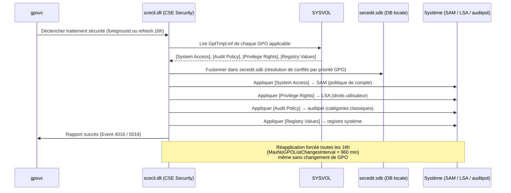

# Stratégies de sécurité (mot de passe, audit, droits)

!!! abstract "Ce que couvre ce chapitre"
    - Le mécanisme d'application des paramètres de sécurité : `scecli.dll`, le fichier `GptTmpl.inf` et pourquoi ils sont fondamentalement différents de `registry.pol`
    - La politique de mot de passe de domaine : pourquoi elle ne peut s'appliquer **que** depuis une GPO liée à la racine du domaine
    - Les Fine-Grained Password Policies (PSOs) : comment définir des règles distinctes par groupe et comment la priorité est résolue
    - Le verrouillage de compte : paramètres, Event IDs de diagnostic et localisation de la source des échecs
    - L'audit avancé Windows : 53 sous-catégories vs 9 catégories classiques, et lesquelles activer en priorité
    - Les droits utilisateur (User Rights) : les 9 privilèges les plus dangereux et leur valeur par défaut
    - Les options de sécurité critiques : NTLMv2, signature SMB, signature LDAP, UAC

---

!!! tip "Si vous ne retenez qu'une chose"
    Les paramètres de sécurité ne passent **pas** par `registry.pol`. Ils sont stockés dans `GptTmpl.inf` (format INI dans SYSVOL) et appliqués par `scecli.dll`. La politique de mot de passe de domaine ne peut être définie **que** dans une GPO liée à la **racine du domaine** — les GPO liées à des OUs enfants sont ignorées pour les comptes de domaine. Les Fine-Grained Password Policies (PSOs) sont le seul mécanisme légal pour dépasser cette contrainte.

---

## :material-shield-lock: Le mécanisme d'application : scecli.dll et GptTmpl.inf

### :material-file-code: Un fichier différent de registry.pol

Quand on pense à l'application des GPO, on pense naturellement à `registry.pol`. Mais les paramètres de sécurité ignorent ce fichier.

La CSE Security utilise son propre format : un fichier texte INI nommé **`GptTmpl.inf`**. Ce fichier contient l'ensemble des paramètres de sécurité configurés dans la GPO, organisés en sections.

Son chemin dans SYSVOL suit le schéma suivant :

```
\\DOMAIN\SYSVOL\DOMAIN\Policies\{GUID}\Machine\Microsoft\Windows NT\SecEdit\GptTmpl.inf
```

!!! info "Pourquoi un format INI ?"
    `GptTmpl.inf` est un héritage de l'outil `secedit.exe`, présent depuis Windows 2000. L'outil `secedit` utilise encore aujourd'hui ce même format pour importer et exporter des configurations de sécurité. La continuité architecturale a été préservée.

### :material-file-document-outline: Anatomie d'un GptTmpl.inf

Un fichier `GptTmpl.inf` complet ressemble à ceci :

```ini title="Exemple de GptTmpl.inf"
[Unicode]
Unicode=yes

[System Access]
MinimumPasswordLength = 12
PasswordComplexity = 1
MaximumPasswordAge = 365
MinimumPasswordAge = 1
PasswordHistorySize = 10
ClearTextPassword = 0
LockoutBadCount = 5
LockoutDuration = 30
ResetLockoutCount = 30

[Audit Policy]
AuditLogonEvents = 3
AuditAccountManage = 3
AuditObjectAccess = 1
AuditPolicyChange = 1

[Privilege Rights]
SeDebugPrivilege = *S-1-5-32-544
SeTcbPrivilege =
SeBackupPrivilege = *S-1-5-32-544,*S-1-5-32-551

[Registry Values]
MACHINE\SYSTEM\CurrentControlSet\Control\Lsa\LmCompatibilityLevel=4,5
MACHINE\SYSTEM\CurrentControlSet\Services\LanmanServer\Parameters\RequireSecuritySignature=4,1

[Version]
signature="$CHICAGO$"
Revision=1
```

Chaque section correspond à une catégorie distincte de paramètres de sécurité. Les valeurs numériques dans `[Audit Policy]` suivent un encodage binaire (bit 0 = succès, bit 1 = échec, donc `3` = succès + échec).

!!! warning "Encodage de [Audit Policy] vs auditpol"
    La section `[Audit Policy]` configure les **9 catégories classiques** (héritées de Windows 2000). Elle ne contrôle pas les **53 sous-catégories avancées** introduites avec Vista. Pour les sous-catégories avancées, il faut utiliser `Advanced Audit Policy Configuration` dans la GPMC — les données sont stockées dans un fichier CSV séparé : `Audit.csv`.

### :material-cog: La CSE Security : GUID et DLL

La CSE responsable des paramètres de sécurité est identifiée par :

| Attribut | Valeur |
|----------|--------|
| GUID | `{827D319E-6EAC-11D2-A4EA-00C04F79F83A}` |
| DLL | `scecli.dll` |
| Clé registre | `HKLM\SOFTWARE\Microsoft\Windows NT\CurrentVersion\Winlogon\GPExtensions\{827D319E-...}` |

Sa clé de registre expose des comportements importants qu'il faut connaître :

```
NoBackgroundPolicy = 0   (peut s'exécuter en arrière-plan)
NoGPOListChanges = 1     (optimisation activée par défaut)
MaxNoGPOListChangesInterval = 960  (minutes = 16 heures)
```

### :material-clock-alert: La réapplication automatique toutes les 16 heures

La valeur `MaxNoGPOListChangesInterval = 960` est un comportement fondamental à comprendre.

Même si la liste des GPO applicables **n'a pas changé** depuis le dernier traitement, `scecli.dll` force une réapplication complète des paramètres de sécurité toutes les 16 heures. C'est un mécanisme de drift remediation : si un administrateur local modifie manuellement un paramètre de sécurité, la GPO le rétablit dans les 16 heures au plus tard.

!!! info "Foreground vs Background"
    Par défaut, `scecli.dll` **peut** s'exécuter en arrière-plan (le flag `NoBackgroundPolicy` est absent ou à `0`). Cependant, certains paramètres — notamment la politique de compte (`[System Access]`) — ne sont effectivement appliqués qu'au traitement foreground (démarrage machine). Les paramètres d'audit et de droits utilisateur sont appliqués à chaque refresh.

### :material-database: La base de données de sécurité locale

`scecli.dll` ne lit pas `GptTmpl.inf` et n'applique pas directement. Elle fusionne d'abord toutes les GPO applicables dans une **base de données de sécurité locale** :

```
%SystemRoot%\security\database\secedit.sdb
```

C'est cette base qui est la source de vérité pour l'état courant des paramètres. L'outil `secedit.exe` permet de l'interroger directement.

```powershell title="Exporter la configuration de sécurité effective"
# Export the current security configuration from the local database
secedit /export /cfg C:\Temp\security-current.inf /quiet
```

!!! quote "En résumé"
    Les paramètres de sécurité GPO n'utilisent pas `registry.pol`. Ils transitent par `GptTmpl.inf` (format INI dans SYSVOL) et sont traités par `scecli.dll` (GUID `{827D319E-6EAC-11D2-A4EA-00C04F79F83A}`). La CSE fusionne toutes les GPO dans `secedit.sdb` puis applique les paramètres au système. Elle force une réapplication toutes les 16 heures, même sans changement de GPO.

---

## :material-key: Politique de mot de passe de domaine

### :material-domain: La règle de la racine du domaine

C'est l'une des règles les plus mal comprises de Group Policy. La politique de mot de passe s'applique aux **comptes de domaine**. Pour ces comptes, Windows lit la politique de mot de passe **uniquement** dans les GPO liées à la racine du domaine.

Une GPO liée à `OU=Utilisateurs,DC=contoso,DC=com` peut très bien contenir des paramètres de mot de passe — ils seront ignorés pour les comptes de domaine. En revanche, ils s'appliqueront aux **comptes locaux** des machines dans cette OU.

!!! warning "Confusion fréquente"
    Si vous configurez une politique de mot de passe dans une GPO liée à une OU, elle s'appliquera aux comptes locaux des machines concernées — mais **jamais** aux comptes Active Directory. Pour différencier les règles par groupe d'utilisateurs, vous devez utiliser les Fine-Grained Password Policies.

### :material-table: Paramètres de la politique de mot de passe

| Paramètre GPMC | Clé GptTmpl.inf | Valeur recommandée (ANSSI 2023) |
|----------------|-----------------|--------------------------------|
| Minimum password length | `MinimumPasswordLength` | 12 caractères minimum |
| Password must meet complexity requirements | `PasswordComplexity` | 1 (activé) |
| Maximum password age | `MaximumPasswordAge` | 365 jours |
| Minimum password age | `MinimumPasswordAge` | 1 jour |
| Enforce password history | `PasswordHistorySize` | 10 mots de passe |
| Store passwords using reversible encryption | `ClearTextPassword` | 0 (désactivé) |

Le chemin GPMC complet : `Computer Configuration → Policies → Windows Settings → Security Settings → Account Policies → Password Policy`

!!! info "Âge maximal 365 jours — évolution ANSSI"
    L'ANSSI a révisé sa recommandation en 2023 : un mot de passe long et complexe n'a plus besoin d'être changé tous les 90 jours. L'âge maximal de 365 jours, combiné à un historique de 10 entrées et une longueur minimale de 12 caractères, est désormais la référence. La rotation systématique tous les 90 jours tend à encourager les utilisateurs à choisir des mots de passe prévisibles.

### :material-powershell: Lire la politique en vigueur

```powershell title="Lire la politique de mot de passe du domaine"
# Read the effective domain password policy
Get-ADDefaultDomainPasswordPolicy | Select-Object `
    MinPasswordLength,
    PasswordHistoryCount,
    MaxPasswordAge,
    MinPasswordAge,
    ComplexityEnabled,
    LockoutThreshold,
    LockoutDuration,
    LockoutObservationWindow |
    Format-List
```

```powershell title="Résultat attendu"
MinPasswordLength        : 12
PasswordHistoryCount     : 10
MaxPasswordAge           : 365.00:00:00
MinPasswordAge           : 1.00:00:00
ComplexityEnabled        : True
LockoutThreshold         : 5
LockoutDuration          : 00:30:00
LockoutObservationWindow : 00:30:00
```

!!! quote "En résumé"
    La politique de mot de passe de domaine ne peut être définie qu'une seule fois, dans une GPO liée à la **racine du domaine**. Par convention, c'est la **Default Domain Policy** qui porte ces paramètres. Toute GPO liée à une OU enfant est ignorée pour les comptes AD. Pour des politiques différenciées par population, utilisez les PSOs.

---

## :material-shield-star: Fine-Grained Password Policy (FGPP)

### :material-information: Pourquoi les PSOs existent

La limitation du "une seule politique pour tout le domaine" est souvent inacceptable en entreprise. Les comptes de service, les administrateurs et les utilisateurs standards ont des besoins différents.

Les **Password Settings Objects (PSOs)** résolvent ce problème. Ce sont des objets AD de classe `msDS-PasswordSettings`, stockés dans :

```
CN=Password Settings Container,CN=System,DC=contoso,DC=com
```

Ils peuvent être appliqués à des **groupes de sécurité** ou à des **utilisateurs individuels** (déconseillé pour la maintenabilité).

### :material-sort-numeric-ascending: La résolution de priorité

Quand plusieurs PSOs s'appliquent à un utilisateur (via différents groupes), Windows utilise l'attribut `msDS-PasswordSettingsPrecedence`. La valeur la plus **basse** l'emporte.

La politique de domaine (GPO) a une priorité inférieure à **tout** PSO. Un utilisateur membre d'un groupe avec un PSO ne sera jamais soumis à la politique de domaine pour les paramètres couverts par le PSO.

!!! warning "PSO et utilisateurs individuels"
    Si un PSO est appliqué directement à un utilisateur **et** via un groupe, le PSO direct l'emporte toujours, quelle que soit sa valeur `Precedence`. L'assignation directe est une "wild card" qui surpasse toute assignation par groupe.

### :material-powershell: Créer et assigner un PSO

```powershell title="Créer un PSO pour les comptes administrateurs"
# Create a Fine-Grained Password Policy for admin accounts
New-ADFineGrainedPasswordPolicy `
    -Name "PSO-Admins" `
    -Precedence 10 `
    -MinPasswordLength 16 `
    -PasswordHistoryCount 20 `
    -MaxPasswordAge "90.00:00:00" `
    -MinPasswordAge "1.00:00:00" `
    -ComplexityEnabled $true `
    -ReversibleEncryptionEnabled $false `
    -LockoutThreshold 3 `
    -LockoutDuration "00:30:00" `
    -LockoutObservationWindow "00:30:00"

# Apply the PSO to a security group
Add-ADFineGrainedPasswordPolicySubject `
    -Identity "PSO-Admins" `
    -Subjects "GRP-Admins-IT"
```

```powershell title="Vérifier quel PSO s'applique à un utilisateur"
# Get the resultant PSO for a specific user account
Get-ADUserResultantPasswordPolicy -Identity "j.martin" | Select-Object `
    Name, Precedence, MinPasswordLength, MaxPasswordAge, LockoutThreshold
```

```powershell title="Résultat attendu"
Name              : PSO-Admins
Precedence        : 10
MinPasswordLength : 16
MaxPasswordAge    : 90.00:00:00
LockoutThreshold  : 3
```

### :material-table: Exemple d'architecture PSO

| PSO | Priorité | Cibles | Longueur min | Âge max | Seuil verrou |
|-----|----------|--------|--------------|---------|--------------|
| `PSO-Admins` | 10 | `GRP-Admins-IT` | 16 | 90 j | 3 |
| `PSO-Services` | 20 | `GRP-Comptes-Service` | 20 | 0 (jamais) | 0 (jamais) |
| `PSO-Utilisateurs` | 30 | `Domain Users` | 12 | 365 j | 5 |

!!! info "Comptes de service et PSO"
    Pour les comptes de service, il est courant de configurer `MaxPasswordAge = 0` (jamais expire) et `LockoutThreshold = 0` (jamais verrouillé). Attention : ces comptes doivent être protégés par d'autres moyens (mots de passe très longs, 30+ caractères, aléatoires — ou mieux, utiliser les **gMSA** qui gèrent eux-mêmes la rotation).

!!! quote "En résumé"
    Les PSOs permettent des politiques de mot de passe différenciées par groupe, sans dépendre des OU. La priorité est déterminée par `msDS-PasswordSettingsPrecedence` : valeur plus basse = priorité plus haute. Tout PSO prend le dessus sur la politique de domaine.

---

## :material-lock-alert: Verrouillage de compte

### :material-cog: Les trois paramètres à configurer ensemble

Le verrouillage de compte repose sur trois paramètres interdépendants. Les définir indépendamment ou partiellement génère des comportements inattendus.

| Paramètre | Valeur recommandée | Comportement si à 0 |
|-----------|-------------------|---------------------|
| Seuil de verrouillage (`LockoutBadCount`) | 5 à 10 tentatives | 0 = verrouillage désactivé |
| Durée de verrouillage (`LockoutDuration`) | 30 min | 0 = déverrouillage manuel uniquement |
| Réinitialisation du compteur (`ResetLockoutCount`) | 30 min | — |

`LockoutDuration = 0` signifie que seul un administrateur peut déverrouiller le compte. C'est une option valide pour les environnements haute sécurité, mais elle augmente la charge de support.

!!! warning "ResetLockoutCount doit être ≤ LockoutDuration"
    Si `ResetLockoutCount` (délai de remise à zéro du compteur) est supérieur à `LockoutDuration` (durée du verrou), un compte peut se déverrouiller alors que le compteur n'est pas encore remis à zéro. La tentative suivante peut immédiatement reverrouiller le compte. Configurez toujours `ResetLockoutCount` ≤ `LockoutDuration`.

### :material-list-status: Event IDs de diagnostic du verrouillage

Ces Event IDs sont enregistrés sur les **contrôleurs de domaine**, dans le journal `Security`.

| Event ID | Localisation | Description |
|----------|-------------|-------------|
| 4625 | DC (tous) | Échec d'ouverture de session — contient le type de logon et le poste source |
| 4740 | DC (tous) | Compte verrouillé — contient le nom du compte et le poste à l'origine |
| 4771 | DC (tous) | Échec de pré-authentification Kerberos — indique un mauvais mot de passe |
| 4776 | DC (tous) | Validation NTLM échouée — contient le compte et le poste appelant |
| 4767 | DC (tous) | Compte déverrouillé manuellement |

!!! info "Où chercher l'Event 4740 ?"
    L'Event 4740 est généré sur **tous** les DC qui reçoivent les tentatives. Mais le **PDC Emulator** consolide tous les verrouillages. Pour un diagnostic fiable, interrogez toujours le PDC Emulator en premier.

### :material-powershell: Trouver la source d'un verrouillage

```powershell title="Identifier la source des verrouillages de compte"
# Query the PDC Emulator for account lockout events
$pdc = (Get-ADDomain).PDCEmulator

Get-WinEvent -ComputerName $pdc `
    -FilterHashtable @{LogName = 'Security'; Id = 4740} `
    -MaxEvents 20 |
    Select-Object TimeCreated,
        @{N = "LockedAccount";    E = { $_.Properties[0].Value }},
        @{N = "CallerComputer";   E = { $_.Properties[1].Value }},
        @{N = "CallerDomain";     E = { $_.Properties[5].Value }} |
    Format-Table -AutoSize
```

```powershell title="Résultat attendu"
TimeCreated           LockedAccount   CallerComputer  CallerDomain
-----------           -------------   --------------  ------------
2026-04-04 08:12:44   j.martin        LAPTOP-HR-042   CONTOSO
2026-04-04 08:11:53   j.martin        LAPTOP-HR-042   CONTOSO
```

```powershell title="Vérifier l'état de verrouillage d'un compte"
# Check lockout status across all domain controllers
Get-ADDomainController -Filter * | ForEach-Object {
    $dc = $_.HostName
    $user = Get-ADUser "j.martin" -Server $dc `
        -Properties LockedOut, BadLogonCount, LastBadPasswordAttempt, BadPwdCount
    [PSCustomObject]@{
        DC                    = $dc
        LockedOut             = $user.LockedOut
        BadLogonCount         = $user.BadLogonCount
        LastBadPasswordAttempt = $user.LastBadPasswordAttempt
    }
} | Format-Table -AutoSize
```

!!! quote "En résumé"
    Les trois paramètres de verrouillage forment un ensemble indissociable. Le diagnostic passe par les Events 4740 (verrouillage) et 4625/4771/4776 (échecs d'authentification), à interroger en priorité sur le PDC Emulator. La propriété `CallerComputer` identifie le poste à l'origine des tentatives.

---

## :material-clipboard-list: Stratégie d'audit

### :material-history: Deux systèmes coexistent

Windows dispose de deux systèmes d'audit qui coexistent et peuvent se contredire :

1. **Audit Policy classique** — 9 catégories, héritées de Windows 2000, configurées dans `Security Settings → Local Policies → Audit Policy`
2. **Advanced Audit Policy Configuration** — 53 sous-catégories, introductes avec Vista, configurées dans `Security Settings → Advanced Audit Policy Configuration`

Les sous-catégories avancées sont **plus précises** et doivent être préférées. Elles permettent par exemple d'auditer les ouvertures de session réussies sans auditer les fermetures de session, ou d'auditer uniquement la création de processus sans tout l'accès aux objets.

!!! warning "Conflit entre les deux systèmes"
    Si vous configurez à la fois les 9 catégories classiques et les sous-catégories avancées, un paramètre de registre détermine lequel prime : `HKLM\SYSTEM\CurrentControlSet\Control\Lsa\SCENoApplyLegacyAuditPolicy`. Quand il vaut `1` (valeur par défaut depuis Vista), les sous-catégories avancées l'emportent sur les catégories classiques. Ne configurez pas les deux en parallèle.

### :material-table: Sous-catégories avancées recommandées

| Sous-catégorie | Recommandation | Events principaux |
|----------------|---------------|-------------------|
| Logon | Succès + Échec | 4624 (logon réussi), 4625 (logon échoué) |
| Logoff | Succès | 4634 (déconnexion) |
| Account Lockout | Échec | 4740 (compte verrouillé) |
| Special Logon | Succès | 4964 (logon avec privilèges sensibles) |
| User Account Management | Succès + Échec | 4720 (création), 4726 (suppression), 4738 (modification) |
| Security Group Management | Succès + Échec | 4728/4732/4756 (ajout membre), 4729/4733/4757 (retrait) |
| Computer Account Management | Succès + Échec | 4741 (création poste), 4743 (suppression poste) |
| Sensitive Privilege Use | Échec | 4673/4674 (utilisation de privilège) |
| Process Creation | Succès | 4688 (nouveau processus — indispensable pour EDR/SIEM) |
| Directory Service Changes | Succès | 5136 (objet AD modifié), 5137 (créé), 5139 (déplacé) |
| Audit Policy Change | Succès + Échec | 4719 (politique d'audit modifiée) |
| Authentication Policy Change | Succès | 4706 (nouvelle approbation de domaine) |
| Filtering Platform Connection | Échec | 5157 (connexion bloquée par WFP) |
| Object Access — File System | Optionnel | 4663 (accès fichier — volumeux, à cibler) |

!!! info "Process Creation et la ligne de commande"
    L'audit de Process Creation (Event 4688) peut être complété par l'activation de la ligne de commande dans les arguments : `Computer Configuration → Administrative Templates → System → Audit Process Creation → Include command line in process creation events`. Indispensable pour les investigations de malware et les outils SIEM/EDR.

### :material-table: Les 9 catégories classiques vs sous-catégories avancées

| Catégorie classique | Sous-catégories avancées équivalentes |
|--------------------|--------------------------------------|
| Account Logon | Credential Validation, Kerberos Authentication Service, Kerberos Service Ticket Operations |
| Account Management | User/Computer/Security Group/Distribution Group/Application Group Account Management |
| Directory Service Access | Directory Service Access, Directory Service Changes, Directory Service Replication |
| Logon Events | Logon, Logoff, Account Lockout, IPsec Main/Quick/Extended Mode, Special Logon |
| Object Access | File System, Registry, Kernel Object, SAM, Handle Manipulation, File Share, Filtering Platform Packet Drop/Connection |
| Policy Change | Audit Policy Change, Authentication Policy Change, Authorization Policy Change |
| Privilege Use | Sensitive/Non-Sensitive Privilege Use |
| Process Tracking | Process Creation, Process Termination, DPAPI Activity, RPC Events |
| System Events | Security State Change, Security System Extension, System Integrity, IPsec Driver, Other System Events |

### :material-powershell: Vérifier et configurer l'audit

```powershell title="Afficher la politique d'audit effective par sous-catégorie"
# Display the current effective audit policy for all subcategories
auditpol /get /category:* | Where-Object { $_ -match "Success|Failure|No Auditing" }
```

```powershell title="Résultat attendu (extrait)"
  Account Logon
    Credential Validation                  Success and Failure
    Kerberos Authentication Service        No Auditing
    Kerberos Service Ticket Operations     No Auditing
  Logon/Logoff
    Logon                                  Success and Failure
    Logoff                                 Success
    Account Lockout                        Failure
```

```powershell title="Activer des sous-catégories spécifiques via auditpol"
# Enable Logon auditing (success and failure)
auditpol /set /subcategory:"Logon" /success:enable /failure:enable

# Enable Process Creation (success only — for SIEM/EDR)
auditpol /set /subcategory:"Process Creation" /success:enable

# Enable Directory Service Changes (success only)
auditpol /set /subcategory:"Directory Service Changes" /success:enable
```

!!! info "GPO vs auditpol direct"
    `auditpol /set` modifie la politique locale directement. Si une GPO est en vigueur, elle sera réappliquée au prochain refresh (ou dans les 16 heures) et écrasera les modifications manuelles. Pour un changement permanent, configurez les sous-catégories avancées dans la GPO.

!!! quote "En résumé"
    Préférez systématiquement les **53 sous-catégories avancées** aux 9 catégories classiques. Activez en priorité : Logon (succès+échec), Process Creation (succès), Account Management (succès+échec) et Directory Service Changes (succès). Ces quatre sous-catégories fournissent l'essentiel de la visibilité nécessaire pour un SOC.

---

## :material-account-key: Droits utilisateur (User Rights Assignment)

### :material-information: Qu'est-ce qu'un droit utilisateur ?

Les droits utilisateur (ou privilèges) sont distincts des permissions sur les objets (fichiers, clés de registre). Ce sont des droits **système** accordés à des comptes ou groupes, indépendamment de tout objet.

Windows définit 44 privilèges. Ils sont configurés dans la section `[Privilege Rights]` de `GptTmpl.inf` et appliqués via le sous-système LSA.

Le chemin GPMC : `Computer Configuration → Policies → Windows Settings → Security Settings → Local Policies → User Rights Assignment`

### :material-table: Droits critiques à contrôler

| Privilege (constante) | Valeur par défaut | Risque si mal configuré |
|-----------------------|------------------|------------------------|
| `SeDebugPrivilege` | Administrators | Injection de code dans n'importe quel processus — vecteur de dump mémoire (LSASS) |
| `SeTcbPrivilege` | LocalSystem | Act as part of the OS — donne contrôle total ; ne pas assigner à des comptes humains |
| `SeBackupPrivilege` | Administrators, Backup Operators | Lit n'importe quel fichier quel que soit la DACL — y compris NTDS.dit |
| `SeImpersonatePrivilege` | Service, IIS, Network Service | Vecteur d'escalade (Potato attacks) — à restreindre aux comptes de service légitimes |
| `SeLoadDriverPrivilege` | Administrators | Charge des pilotes en mode noyau — vecteur rootkit |
| `SeAssignPrimaryTokenPrivilege` | LocalService, NetworkService | Remplacement du token primaire d'un processus — vecteur d'escalade |
| `SeNetworkLogonRight` | Everyone, Authenticated Users | Connexion réseau — restreindre pour les admins locaux (Pass-the-Hash mitigation) |
| `SeDenyNetworkLogonRight` | Guest | Refus explicite de connexion réseau — ajouter les admins locaux |
| `SeInteractiveLogonRight` | Administrators, Users, Backup Operators | Connexion locale interactive — restreindre sur les serveurs |
| `SeDenyInteractiveLogonRight` | Guest | Refus de connexion locale — étendre aux comptes de service |
| `SeRemoteInteractiveLogonRight` | Administrators, Remote Desktop Users | Connexion RDP — contrôler précisément |
| `SeShutdownPrivilege` | Administrators, Users (postes) | Arrêt du système — supprimer Users sur les serveurs |

!!! warning "SeDebugPrivilege et les administrateurs locaux"
    Même `SeDebugPrivilege` accordé uniquement au groupe `Administrators` peut être dangereux : tout administrateur local peut l'utiliser pour dumper la mémoire de LSASS et extraire des credentials. Sur les serveurs sensibles (DC, PKI), envisagez de le retirer complètement — les outils légitimes de débogage peuvent fonctionner avec `SeLocalDebugPrivilege` ou des mécanismes alternatifs.

### :material-powershell: Interroger les droits utilisateur

```powershell title="Afficher tous les privilèges de l'utilisateur courant"
# Display all privileges for the current user session
whoami /priv | Format-Table -AutoSize
```

```powershell title="Lire l'assignation des droits depuis une GPO"
# Get user rights assignment from a GPO report
$gpoName = "SEC-Postes-Baseline"
$report = Get-GPOReport -Name $gpoName -ReportType Xml
$xml = [xml]$report

# Extract User Rights Assignment section
$xml.GPO.Computer.ExtensionData.Extension.UserRightsAssignment |
    ForEach-Object {
        [PSCustomObject]@{
            Privilege = $_.Name
            Members   = ($_.Member.Name | Where-Object { $_ }) -join ", "
        }
    } |
    Format-Table -AutoSize
```

```powershell title="Résultat attendu"
Privilege                      Members
---------                      -------
SeDebugPrivilege               BUILTIN\Administrators
SeNetworkLogonRight            NT AUTHORITY\Authenticated Users, BUILTIN\Administrators
SeDenyNetworkLogonRight        CONTOSO\GRP-AdminsLocaux
SeInteractiveLogonRight        BUILTIN\Administrators
SeRemoteInteractiveLogonRight  BUILTIN\Administrators, BUILTIN\Remote Desktop Users
```

```powershell title="Vérifier les membres effectifs d'un droit sur un poste distant"
# Check who has a specific privilege on a remote machine
$computer = "SRV-APP-01"
$session  = New-PSSession -ComputerName $computer

Invoke-Command -Session $session -ScriptBlock {
    # Use secedit to export and read privilege assignments
    $tempFile = "$env:TEMP\privs.inf"
    secedit /export /cfg $tempFile /quiet
    $content = Get-Content $tempFile | Where-Object { $_ -match "SeDebugPrivilege" }
    $content
    Remove-Item $tempFile -Force
}
Remove-PSSession $session
```

### :material-shield-check: Recommandations de durcissement des droits

Ces recommandations s'alignent avec les baselines Microsoft Security (STIG/CIS) :

| Action | Droit concerné | Justification |
|--------|---------------|---------------|
| Retirer `Everyone` | `SeNetworkLogonRight` | Ajouter uniquement les groupes nécessaires |
| Ajouter admins locaux | `SeDenyNetworkLogonRight` | Mitigation Pass-the-Hash (KB2871997) |
| Vider la valeur | `SeTcbPrivilege` | Aucun compte humain ne doit Act as OS |
| Restreindre aux DCs | `SeEnableDelegationPrivilege` | Permet de configurer la délégation Kerberos |
| Supprimer sur serveurs | `SeShutdownPrivilege` pour Users | Les utilisateurs ne doivent pas arrêter un serveur |

!!! quote "En résumé"
    Les droits utilisateur sont des privilèges système indépendants des ACL. Les plus dangereux sont `SeDebugPrivilege` (dump mémoire), `SeImpersonatePrivilege` (Potato attacks), `SeBackupPrivilege` (lecture NTDS.dit) et `SeLoadDriverPrivilege` (rootkit). Auditez-les régulièrement via `whoami /priv` ou les rapports GPO.

---

## :material-tune: Options de sécurité critiques

### :material-information: Présentation

Les **Security Options** sont des paramètres de sécurité système qui ne rentrent dans aucune autre catégorie. Ils contrôlent des comportements du noyau, du protocole d'authentification, des communications réseau et de l'interface UAC.

Leur chemin GPMC : `Computer Configuration → Policies → Windows Settings → Security Settings → Local Policies → Security Options`

Dans `GptTmpl.inf`, ils apparaissent dans la section `[Registry Values]`.

### :material-table: Options critiques et leurs clés de registre

| Paramètre GPMC | Valeur recommandée | Clé de registre |
|----------------|-------------------|----------------|
| UAC : Behavior for elevation — Admin | Prompt for credentials | `HKLM\...\Policies\System\ConsentPromptBehaviorAdmin = 1` |
| UAC : Behavior for elevation — User | Automatically deny elevation | `HKLM\...\Policies\System\ConsentPromptBehaviorUser = 0` |
| UAC : Run all admins in Admin Approval Mode | Activé | `HKLM\...\Policies\System\EnableLUA = 1` |
| LAN Manager authentication level | Send NTLMv2 only / refuse LM & NTLM | `HKLM\SYSTEM\...\Lsa\LmCompatibilityLevel = 5` |
| SMB signing client — Always sign | Activé | `HKLM\SYSTEM\...\LanmanWorkstation\Parameters\RequireSecuritySignature = 1` |
| SMB signing server — Always sign | Activé | `HKLM\SYSTEM\...\LanmanServer\Parameters\RequireSecuritySignature = 1` |
| LDAP client signing | Require signing | `HKLM\SYSTEM\...\Services\NTDS\Parameters\LDAPServerIntegrity = 2` |
| LDAP server channel binding | Always | `HKLM\SYSTEM\...\Services\NTDS\Parameters\LdapEnforceChannelBinding = 2` |
| Do not store LAN Manager hash | Activé | `HKLM\SYSTEM\...\Control\Lsa\NoLMHash = 1` |
| Anonymous SID/Name translation | Désactivé | `HKLM\SYSTEM\...\Control\Lsa\TurnOffAnonymousBlock = 0` |

!!! warning "LmCompatibilityLevel et la compatibilité"
    Passer `LmCompatibilityLevel` à `5` (NTLMv2 uniquement, refus LM et NTLM) peut casser des applications legacy qui ne supportent pas NTLMv2. Avant déploiement, identifiez les applications qui utilisent encore NTLM via les Events 4776 (NTLM validation) sur les DCs. Un niveau `3` (NTLMv2, refus LM) est un compromis acceptable pendant la migration.

### :material-shield-check: NTLMv2 et la dégradation d'authentification

NTLMv1 et LM (LAN Manager) sont des protocoles cryptographiquement faibles, vulnérables aux attaques par dictionnaire et aux relais NTLM.

`LmCompatibilityLevel` contrôle quel protocole le client envoie **et** ce que le serveur accepte :

| Niveau | Client envoie | Serveur accepte |
|--------|--------------|----------------|
| 0 | LM + NTLM | LM + NTLM + NTLMv2 |
| 1 | LM + NTLM, NTLMv2 si négocié | LM + NTLM + NTLMv2 |
| 2 | NTLMv2 | LM + NTLM + NTLMv2 |
| 3 | NTLMv2 | NTLMv2 seulement |
| 4 | NTLMv2 | NTLMv2 seulement (idem 3 côté serveur membre) |
| **5** | **NTLMv2** | **NTLMv2 seulement — refuse LM et NTLM** |

### :material-powershell: Vérifier les options de sécurité en vigueur

```powershell title="Lire les valeurs critiques de sécurité depuis le registre"
# Read critical security option registry values
$keys = @{
    "LmCompatibilityLevel"    = "HKLM:\SYSTEM\CurrentControlSet\Control\Lsa"
    "EnableLUA"               = "HKLM:\SOFTWARE\Microsoft\Windows\CurrentVersion\Policies\System"
    "ConsentPromptBehaviorAdmin" = "HKLM:\SOFTWARE\Microsoft\Windows\CurrentVersion\Policies\System"
    "NoLMHash"                = "HKLM:\SYSTEM\CurrentControlSet\Control\Lsa"
}

$keys.GetEnumerator() | ForEach-Object {
    $value = (Get-ItemProperty -Path $_.Value -Name $_.Key -ErrorAction SilentlyContinue).$($_.Key)
    [PSCustomObject]@{
        Setting = $_.Key
        Value   = $value
        Path    = $_.Value
    }
} | Format-Table -AutoSize
```

```powershell title="Résultat attendu"
Setting                     Value  Path
-------                     -----  ----
LmCompatibilityLevel        5      HKLM:\SYSTEM\CurrentControlSet\Control\Lsa
EnableLUA                   1      HKLM:\SOFTWARE\Microsoft\Windows\...\System
ConsentPromptBehaviorAdmin  1      HKLM:\SOFTWARE\Microsoft\Windows\...\System
NoLMHash                    1      HKLM:\SYSTEM\CurrentControlSet\Control\Lsa
```

!!! quote "En résumé"
    Les options de sécurité critiques à configurer en priorité sont : NTLMv2 seul (`LmCompatibilityLevel = 5`), signature SMB obligatoire côté client et serveur, signature LDAP obligatoire, UAC en mode "prompt for credentials" et suppression du stockage des hashs LM. Ces paramètres forment le socle de durcissement réseau de toute infrastructure Windows.

---

## :material-sitemap: Flux d'application des stratégies de sécurité

Le diagramme suivant illustre le flux complet de traitement, de la détection des GPO jusqu'à l'application effective des paramètres sur le système.



### :material-information: Résolution des conflits entre GPO

Quand plusieurs GPO contiennent des paramètres de sécurité contradictoires, `scecli.dll` applique les règles LSDOU standard : la dernière GPO traitée (priorité la plus haute dans l'ordre d'application) l'emporte.

Pour les paramètres `[System Access]` (politique de mot de passe et de verrouillage), seules les GPO liées à la **racine du domaine** participent à cette résolution. Les GPO liées aux OUs enfants sont ignorées pour ces paramètres.

!!! warning "Paramètre absent ≠ non configuré"
    Si une GPO de priorité haute ne contient pas un paramètre, `scecli.dll` remonte aux GPO de priorité plus basse pour ce paramètre. Un paramètre absent dans `GptTmpl.inf` n'écrase pas le paramètre existant — contrairement à `registry.pol` où l'absence peut signifier une suppression de la valeur.

---

## :material-bug: Diagnostic et dépannage

### :material-magnify: Event IDs de la CSE Security

| Event ID | Journal | Description |
|----------|---------|-------------|
| 4016 | Application (GP Operational) | Début du traitement de la CSE Security |
| 5016 | Application (GP Operational) | Fin réussie du traitement de la CSE Security |
| 6016 | Application (GP Operational) | Fin avec avertissement (paramètre non applicable) |
| 7016 | Application (GP Operational) | Échec du traitement de la CSE Security |
| 4719 | Security | Politique d'audit modifiée (qui a changé quoi ?) |
| 4902 | Security | Table de politique d'audit par utilisateur créée |

```powershell title="Consulter les événements de la CSE Security"
# Get Security CSE processing events from the GP Operational log
Get-WinEvent -LogName "Microsoft-Windows-GroupPolicy/Operational" |
    Where-Object { $_.Id -in @(4016, 5016, 6016, 7016) } |
    Select-Object TimeCreated, Id, Message |
    Sort-Object TimeCreated -Descending |
    Select-Object -First 20 |
    Format-Table -Wrap -AutoSize
```

### :material-tools: Secedit pour le diagnostic

`secedit.exe` est l'outil natif pour interagir directement avec la base de sécurité locale.

```powershell title="Analyser les écarts entre la politique et l'état actuel"
# Export the configured security template (from GPO)
secedit /export /cfg C:\Temp\sec-configured.inf /quiet

# Analyze the current system state against the configured template
secedit /analyze /db C:\Temp\sec-analysis.sdb `
        /cfg C:\Temp\sec-configured.inf `
        /log C:\Temp\sec-analysis.log `
        /quiet

# View the analysis results
Get-Content C:\Temp\sec-analysis.log | Select-String "Mismatch|mismatch"
```

```powershell title="Forcer une réapplication immédiate de la politique de sécurité"
# Force an immediate reapplication of security policy (bypasses 16h timer)
Invoke-GPUpdate -Force -Computer "LAPTOP-HR-042" -Target Computer

# Or locally:
gpupdate /force /target:computer
```

!!! info "secedit /configure vs gpupdate"
    `secedit /configure /db secedit.sdb` réapplique la base de sécurité locale existante. `gpupdate /force` déclenche un cycle complet : téléchargement des GPO depuis SYSVOL, recalcul de `secedit.sdb`, puis application. Utilisez `secedit /configure` pour un test rapide local, `gpupdate /force` pour un test complet du pipeline GPO.

!!! quote "En résumé"
    Les Events 4016/5016 (journal Group Policy/Operational) tracent le cycle de traitement de `scecli.dll`. L'Event 4719 (journal Security) alerte sur toute modification de politique d'audit. `secedit /analyze` permet de détecter les dérives entre la politique configurée et l'état actuel du système.

---

## :material-link: Références croisées

| Sujet | Référence |
|-------|-----------|
| Mécanisme des CSE en détail | Ch. 03 — Client-Side Extensions |
| Filtrage des GPO (qui reçoit quoi) | Ch. 09 — Filtrage de sécurité et WMI |
| Baselines CIS / STIG / Microsoft Security | Ch. 22 — Baselines de sécurité |
| AppLocker et WDAC | Ch. 15 — AppLocker et WDAC |
| BitLocker via GPO | Ch. 16 — BitLocker |
| Déploiement pratique sécurité endpoint | Les GPO pour les Admins — Ch. 14 |
| Introduction sécurité niveau débutant | Les GPO pour les Nuls — Ch. 07 |
