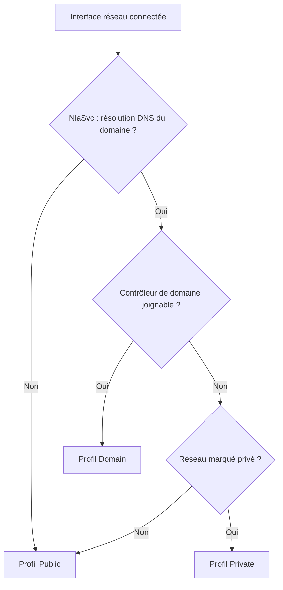
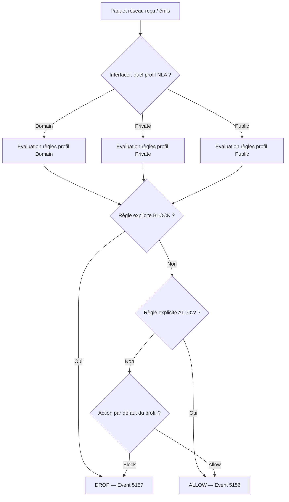

# Windows Firewall with Advanced Security via GPO

!!! abstract "Ce que vous allez apprendre"
    - La différence architecturale entre l'ancien Windows Firewall et WFAS, et où les GPO écrivent dans le registre
    - Le mécanisme NLA de détection de profil réseau (Domain, Private, Public) et ses implications sur l'application des règles
    - La structure complète d'une règle de pare-feu GPO : protocole, ports, programme, service, scope, action, direction
    - Le chemin GPMC et l'équivalent PowerShell `New-NetFirewallRule` pour chaque paramètre
    - Les avantages et les limites du déploiement GPO par rapport à `netsh advfirewall`
    - L'activation du logging pare-feu via GPO et les Event IDs critiques du journal Security
    - Le piège de production majeur : déployer "Block All Outbound" sans exception préalable

---

!!! tip "Si vous ne retenez qu'une chose"
    Une règle de pare-feu GPO n'est active que si le profil réseau actif correspond au profil de la règle. La détection de profil est effectuée par **NLA (Network Location Awareness)** au moment de la connexion réseau. Si NLA ne détecte pas le contrôleur de domaine, la machine tombe en profil **Public** — et toutes vos règles ciblant le profil Domain deviennent inactives. Comprendre NLA est donc un prérequis à tout déploiement de règles Domain.

---

## :material-shield-half-full: Architecture WFAS et ancrage registre

### :material-history: De Windows Firewall à WFAS

L'ancien Windows Firewall (présent jusqu'à XP SP2) était une solution mono-profil, mono-direction (entrant uniquement), sans gestion des règles sortantes ni intégration IPsec.

Windows Vista a introduit **Windows Firewall with Advanced Security (WFAS)**, un moteur unifié qui gère simultanément le filtrage de paquets et les règles IPsec. WFAS est un composant du service `MpsSvc` (Windows Defender Firewall service).

Les deux surfaces de configuration coexistent encore dans la GPMC pour des raisons de compatibilité ascendante, mais elles ciblent des nœuds de registre distincts.

### :material-database: Ancrage registre des GPO pare-feu

| Surface GPMC | Nœud de registre cible |
|---|---|
| Ancien Windows Firewall | `HKLM\SOFTWARE\Policies\Microsoft\WindowsFirewall\` |
| WFAS (profils + règles) | `HKLM\SOFTWARE\Policies\Microsoft\WindowsFirewall\FirewallRules\` |
| WFAS (paramètres globaux) | `HKLM\SOFTWARE\Policies\Microsoft\WindowsFirewall\DomainProfile\` |

!!! info "Priorité des clés"
    Les valeurs sous `HKLM\SOFTWARE\Policies\` ont **toujours** la priorité sur leurs équivalents sous `HKLM\SYSTEM\CurrentControlSet\Services\SharedAccess\Parameters\FirewallPolicy\`. Les GPO écrivent exclusivement sous `Policies\` — la configuration locale est écrasée à chaque refresh.

### :material-cog: La CSE Windows Firewall

La Client-Side Extension responsable du pare-feu est identifiée par :

| Attribut | Valeur |
|---|---|
| GUID | `{4CFB060C-16D2-11D4-8E6B-00902745EE2C}` |
| DLL | `fwpolicyiomgr.dll` |
| Chemin GPMC | `Computer Configuration → Policies → Windows Settings → Security Settings → Windows Firewall with Advanced Security` |

```powershell title="Vérifier l'enregistrement de la CSE Firewall"
# Read the CSE registration entry for Windows Firewall
Get-ItemProperty `
    "HKLM:\SOFTWARE\Microsoft\Windows NT\CurrentVersion\Winlogon\GPExtensions\{4CFB060C-16D2-11D4-8E6B-00902745EE2C}" |
    Select-Object DllName, NoBackgroundPolicy, NoGPOListChanges
```

```powershell title="Résultat attendu"
DllName           : fwpolicyiomgr.dll
NoBackgroundPolicy: 0
NoGPOListChanges  : 0
```

!!! info "NoGPOListChanges = 0"
    Contrairement à la CSE Registry (`NoGPOListChanges = 1`), la CSE Firewall **ne bénéficie pas de l'optimisation** qui saute le traitement si la liste de GPO n'a pas changé. Les règles pare-feu sont réappliquées à chaque refresh, qu'il y ait eu modification ou non.

!!! quote "En résumé"
    WFAS remplace l'ancien Windows Firewall depuis Vista. Les GPO écrivent sous `HKLM\SOFTWARE\Policies\Microsoft\WindowsFirewall\`. La CSE `fwpolicyiomgr.dll` applique les règles à chaque refresh sans optimisation de liste. Les valeurs sous `Policies\` ont la priorité absolue sur la configuration locale.

---

## :material-wifi: Les 3 profils réseau et la détection NLA

### :material-network: Domain, Private, Public

WFAS maintient trois profils indépendants. Chaque interface réseau d'une machine peut se trouver dans un profil différent. Une règle de pare-feu GPO peut cibler un, deux ou les trois profils simultanément.

| Profil | Déclencheur | Niveau de confiance typique |
|---|---|---|
| **Domain** | NLA détecte le DC du domaine joint | Élevé — réseau d'entreprise |
| **Private** | Profil marqué manuellement comme privé | Moyen — réseau domestique ou filiale |
| **Public** | Profil par défaut si aucun autre ne s'applique | Faible — réseau inconnu, hôtel, Wi-Fi public |

### :material-magnify: Mécanisme NLA

NLA (service `NlaSvc`) évalue le réseau au moment de la connexion. Pour détecter le profil Domain, NLA tente de joindre le contrôleur de domaine via **DNS** puis **LDAP**.



!!! warning "Piège VPN split-tunnel"
    Sur un poste connecté en VPN split-tunnel, l'interface VPN peut ne pas atteindre le DC assez rapidement au démarrage. NLA assigne alors le profil **Public** à l'interface VPN. Les règles Domain ne s'appliquent pas. La machine peut se retrouver plus restrictive que prévu — ou moins, selon la configuration des profils Public.

### :material-tune: Paramètres par profil dans la GPO

Chaque profil dispose de ses propres paramètres de base, configurables séparément dans la GPMC :

| Paramètre | Chemin GPMC | Clé registre (`DomainProfile\` / `PrivateProfile\` / `PublicProfile\`) |
|---|---|---|
| État du pare-feu | `Firewall State` | `EnableFirewall` (DWORD, 1=activé) |
| Connexions entrantes par défaut | `Inbound connections` | `DefaultInboundAction` (0=Allow, 1=Block) |
| Connexions sortantes par défaut | `Outbound connections` | `DefaultOutboundAction` (0=Allow, 1=Block) |
| Notifications | `Display a notification` | `DisableNotifications` (DWORD, 1=désactivé) |
| Unicast response to multicast | `Allow unicast response` | `DisableUnicastResponsesToMulticastBroadcast` |

```powershell title="Lire la configuration des profils actifs"
# Read active firewall profile configuration
Get-NetFirewallProfile | Select-Object Name, Enabled, DefaultInboundAction, DefaultOutboundAction, LogAllowed, LogBlocked
```

```powershell title="Résultat attendu"
Name    Enabled DefaultInboundAction DefaultOutboundAction LogAllowed LogBlocked
----    ------- -------------------- --------------------- ---------- ----------
Domain     True                Block                 Allow      False      False
Private    True                Block                 Allow      False      False
Public     True                Block                 Block      False       True
```

!!! quote "En résumé"
    Les trois profils (Domain, Private, Public) sont déterminés par NLA au moment de la connexion réseau. Le profil Domain exige que le DC soit joignable. En l'absence de DC détectable, la machine tombe en Public — configuration souvent plus restrictive mais potentiellement incompatible avec les règles Domain. Chaque profil a son propre état, comportement par défaut et configuration de log.

---

## :material-playlist-plus: Structure d'une règle de pare-feu GPO

### :material-format-list-bulleted: Les dimensions d'une règle

Une règle WFAS est définie par l'intersection de plusieurs dimensions. Toutes doivent correspondre pour que la règle s'applique.

| Dimension | Options possibles |
|---|---|
| **Direction** | Inbound / Outbound |
| **Action** | Allow / Block / Allow if secure (IPsec) |
| **Protocole** | TCP, UDP, ICMPv4, ICMPv6, Any, numéros custom (1-255) |
| **Ports locaux** | Numéros, plages, mots-clés (RPC, RPC-EPMap, IPHTTPS) |
| **Ports distants** | Numéros, plages |
| **Programme** | Chemin d'exécutable (ex : `%SystemRoot%\system32\svchost.exe`) |
| **Service** | Nom court du service Windows (ex : `wuauserv`) |
| **Adresses locales** | Subnet, plage IP, mots-clés (LocalSubnet, DNS, DHCP, WINS, DefaultGateway, Internet, Intranet) |
| **Adresses distantes** | Subnet, plage IP, mots-clés |
| **Profils** | Domain, Private, Public (sélection multiple possible) |
| **Interface** | Any, Wired, Wireless, Remote Access |

### :material-powershell: Créer une règle via PowerShell

```powershell title="Créer une règle WFAS équivalente à une règle GPO"
# Create inbound rule allowing RDP from corporate subnet only
New-NetFirewallRule `
    -Name "Corp-RDP-Inbound" `
    -DisplayName "RDP from Corporate Subnet" `
    -Description "Allow RDP inbound from 10.0.0.0/8 - corporate network only" `
    -Direction Inbound `
    -Protocol TCP `
    -LocalPort 3389 `
    -RemoteAddress "10.0.0.0/8" `
    -Action Allow `
    -Profile Domain `
    -Enabled True `
    -Group "Corporate Baseline"
```

```powershell title="Résultat attendu"
Name                  : Corp-RDP-Inbound
DisplayName           : RDP from Corporate Subnet
Enabled               : True
Profile               : Domain
Direction             : Inbound
Action                : Allow
EdgeTraversalPolicy   : Block
PrimaryStatus         : OK
Status                : The rule was parsed successfully from the store. (65536)
```

### :material-code-braces: Format de stockage registre

Dans le registre, chaque règle est stockée comme une valeur `REG_SZ` sous `HKLM\SOFTWARE\Policies\Microsoft\WindowsFirewall\FirewallRules\`. Le nom est libre (généralement le GUID de la règle), la valeur est une chaîne encodée avec des champs séparés par `|`.

```powershell title="Lire le format brut d'une règle dans le registre"
# Read raw firewall rule registry value
Get-ItemProperty `
    "HKLM:\SOFTWARE\Policies\Microsoft\WindowsFirewall\FirewallRules" |
    Select-Object -ExpandProperty "Corp-RDP-Inbound"
```

```text title="Résultat attendu"
v2.30|Action=Allow|Active=TRUE|Dir=In|Protocol=6|LPort=3389|
RA4=10.0.0.0/8|Name=RDP from Corporate Subnet|
Desc=Allow RDP inbound from 10.0.0.0/8|Profile=Domain|
App=%SystemRoot%\system32\svchost.exe|Svc=termservice|
EmbedCtxt=Corporate Baseline|
```

!!! info "Champ `Protocol`"
    Le champ `Protocol` utilise les numéros IANA : `6` = TCP, `17` = UDP, `1` = ICMPv4, `58` = ICMPv6. La valeur `*` signifie "tout protocole". Pour ICMP, les types et codes sont spécifiés séparément dans le champ `ICMP4` ou `ICMP6`.

### :material-folder-network: Chemin GPMC complet

```
Computer Configuration
  └── Policies
        └── Windows Settings
              └── Security Settings
                    └── Windows Firewall with Advanced Security
                          ├── Windows Firewall with Advanced Security - LDAP://...
                          ├── Inbound Rules
                          ├── Outbound Rules
                          └── Connection Security Rules
```

!!! quote "En résumé"
    Une règle WFAS est une intersection de dimensions : direction, action, protocole, ports, programme, service, scope d'adresses, profils et type d'interface. Toutes les dimensions actives doivent correspondre simultanément au paquet pour que la règle s'applique. Le stockage registre utilise une chaîne `|`-délimitée sous `FirewallRules\`.

---

## :material-compare: GPO vs netsh advfirewall

### :material-terminal: Le déploiement classique : netsh advfirewall

Avant les GPO pare-feu WFAS, l'outil de référence pour le déploiement en masse était `netsh advfirewall`. Il est encore utilisé dans des scripts de configuration initiale ou dans des images Sysprep.

```cmd title="Exporter la configuration pare-feu locale avec netsh"
:: Export current firewall configuration to a policy file
netsh advfirewall export "C:\Backup\firewall-policy.wfw"
```

```cmd title="Résultat attendu"
Ok.
```

```cmd title="Importer une configuration pare-feu avec netsh"
:: Import firewall policy from a previously exported file
netsh advfirewall import "\\SERVER\Share\firewall-baseline.wfw"
```

!!! warning "Import destructif"
    L'import `netsh advfirewall import` **remplace** la configuration pare-feu locale dans sa totalité. Il n'y a pas de fusion : toutes les règles existantes (y compris celles déployées par d'autres GPO) sont supprimées.

### :material-scale-balance: Comparatif GPO vs netsh

| Critère | GPO WFAS | netsh advfirewall |
|---|---|---|
| Centralisation | Oui — SYSVOL, contrôle AD | Non — script ou image locale |
| Auditabilité | Oui — GPMC, historique AD, versioning | Non — pas de traçabilité native |
| Versionning | Oui — via les révisions GPO dans AD | Non |
| Fusion multi-sources | Oui — plusieurs GPO peuvent contribuer des règles | Non — l'import est total et destructif |
| Règles par utilisateur | Non — uniquement par machine | Non |
| Granularité de scope | Élevée (subnets, mots-clés, FQDN avec Defender) | Moyenne (IPs et subnets uniquement) |
| Ciblage par OU / groupe | Oui — via filtrage de sécurité et WMI | Non |
| Application sans redémarrage | Oui — refresh GPO (~90 min ou `gpupdate`) | Oui — immédiat |

### :material-merge: Comportement de fusion des règles GPO

Lorsque plusieurs GPO contribuent des règles pare-feu, le comportement de fusion dépend d'un paramètre explicite dans chaque profil :

**`Apply local firewall rules`** (`AllowLocalFirewallRules`, DWORD) :

- `1` : les règles locales de la machine coexistent avec les règles GPO.
- `0` : seules les règles GPO s'appliquent. Les règles locales sont ignorées.

Ce paramètre est critique en environnement sécurisé : positionné à `0`, il garantit que seules les règles approuvées par la GPO sont actives, même si un administrateur local a ajouté des règles manuellement.

```powershell title="Vérifier le paramètre de fusion des règles locales"
# Check whether local rules are merged with GPO rules per profile
Get-NetFirewallProfile | Select-Object Name, AllowLocalFirewallRules
```

```powershell title="Résultat attendu"
Name    AllowLocalFirewallRules
----    -----------------------
Domain                    False
Private                    True
Public                    False
```

!!! quote "En résumé"
    Les GPO pare-feu apportent centralisation, auditabilité et fusion multi-sources que `netsh advfirewall` ne peut pas offrir. La limitation principale est l'absence de règles par utilisateur — WFAS est un mécanisme de filtrage par machine. En profil Domain, désactivez la fusion des règles locales (`AllowLocalFirewallRules = 0`) pour garantir l'exclusivité des règles GPO.

---

## :material-file-chart: Logging du pare-feu via GPO

### :material-toggle-switch: Activation du logging

Le logging pare-feu est désactivé par défaut. Il se configure indépendamment par profil, toujours dans `Computer Configuration → Policies → Windows Settings → Security Settings → Windows Firewall with Advanced Security → [Profil] → Logging`.

| Paramètre GPMC | Clé registre | Valeur recommandée |
|---|---|---|
| Log dropped packets | `LogDroppedPackets` | `Yes` (DWORD 1) |
| Log successful connections | `LogSuccessfulConnections` | `Yes` en investigation, `No` en production |
| Log file path | `LogFilePath` | `%systemroot%\system32\LogFiles\Firewall\pfirewall.log` |
| Log file size (KB) | `LogFileSize` | `16384` (16 MB) |

!!! warning "Performance en production"
    Activer `Log successful connections` sur des serveurs à fort trafic (contrôleurs de domaine, serveurs de fichiers) peut générer plusieurs centaines de Mo de logs par heure. Réservez cette option aux phases d'investigation. `Log dropped packets` est en revanche peu coûteux et recommandé en permanence.

```powershell title="Activer le logging des paquets bloqués via PowerShell"
# Enable dropped-packet logging for Domain profile
Set-NetFirewallProfile -Profile Domain `
    -LogBlocked True `
    -LogFileName "%systemroot%\system32\LogFiles\Firewall\pfirewall.log" `
    -LogMaxSizeKilobytes 16384
```

```powershell title="Résultat attendu"
Name   : Domain
LogBlocked    : True
LogAllowed    : False
LogFileName   : %systemroot%\system32\LogFiles\Firewall\pfirewall.log
LogMaxSizeKilobytes : 16384
```

### :material-text-search: Format du fichier log

Le fichier `pfirewall.log` est un fichier texte W3C. Chaque ligne correspond à un paquet.

```text title="Extrait pfirewall.log"
#Version: 1.5
#Software: Microsoft Windows Firewall
#Time Format: Local
#Fields: date time action protocol src-ip dst-ip src-port dst-port size tcpflags tcpsyn tcpack tcpwin icmptype icmpcode info path

2024-11-15 14:23:07 DROP TCP 203.0.113.42 10.10.1.15 54231 3389 52 S 3291847263 0 64240 - - - RECEIVE
2024-11-15 14:23:08 ALLOW TCP 10.0.5.22 10.10.1.15 49201 445 52 S 1847362910 0 65535 - - - RECEIVE
```

Le champ `action` prend les valeurs `ALLOW`, `DROP` ou `INFO-EVENTS-LOST` (paquets perdus si le buffer est saturé).

### :material-alert-circle: Event IDs dans le journal Security

Le pare-feu peut écrire dans le **journal Security** de l'Observateur d'événements (en complément du fichier log W3C). Ces événements sont générés par la politique d'audit `Filtering Platform Connection` et `Filtering Platform Policy Change`.

| Event ID | Description | Source d'audit |
|---|---|---|
| **5152** | Paquet bloqué par Windows Filtering Platform | Filtering Platform Connection |
| **5154** | Connexion sortante autorisée | Filtering Platform Connection |
| **5156** | Connexion autorisée (entrante ou sortante) | Filtering Platform Connection |
| **5157** | Connexion bloquée (entrante ou sortante) | Filtering Platform Connection |
| **5447** | Règle de filtrage WFP modifiée | Filtering Platform Policy Change |

!!! info "Event 5156 vs pfirewall.log"
    L'Event 5156 est plus riche que le log W3C : il contient le PID du processus, le nom de l'application, les adresses de couche réseau et le GUID de la règle qui a autorisé la connexion. Indispensable pour les investigations forensic.

```powershell title="Lire les 10 derniers événements de connexion bloquée"
# Retrieve last 10 blocked connection events from Security log
Get-WinEvent -FilterHashtable @{
    LogName   = "Security"
    Id        = 5157
} -MaxEvents 10 |
Select-Object TimeCreated,
    @{n="SourceIP";e={$_.Properties[2].Value}},
    @{n="DestPort";e={$_.Properties[4].Value}},
    @{n="Protocol";e={$_.Properties[7].Value}} |
Format-Table -AutoSize
```

```powershell title="Résultat attendu"
TimeCreated          SourceIP       DestPort Protocol
-----------          --------       -------- --------
15/11/2024 14:23:07  203.0.113.42   3389     6
15/11/2024 14:23:06  198.51.100.8   22       6
15/11/2024 14:23:05  203.0.113.42   445      6
```

!!! quote "En résumé"
    Le logging pare-feu se configure par profil dans la GPO. Activez toujours `Log dropped packets` en production. Réservez `Log successful connections` aux phases d'investigation. Les Event IDs 5152/5154/5156/5157 dans le journal Security fournissent plus de contexte que le fichier W3C (PID, nom d'application, GUID de règle).

---

## :material-transit-connection-variant: Flux de traitement d'un paquet

### :material-map-marker-path: Décision de filtrage WFAS

Le moteur WFP (Windows Filtering Platform) évalue chaque paquet selon un ordre précis. La décision finale suit ce flux :



### :material-layers-triple: Priorité des règles

WFAS n'a pas de numéro de priorité explicite comme les ACL réseau. Les règles BLOCK ont la priorité sur les règles ALLOW si les deux correspondent au même paquet.

| Type de règle | Priorité |
|---|---|
| Règle BLOCK explicite (toute source) | La plus haute |
| Règle ALLOW with IPsec (secure) | Haute |
| Règle ALLOW explicite | Normale |
| Action par défaut du profil | La plus basse |

!!! warning "BLOCK beats ALLOW"
    Si une règle GPO bloque le port 443 sortant et qu'une autre règle (même GPO ou autre) l'autorise, le BLOCK l'emporte. Il n'existe pas de mécanisme d'exception (`permit` après `deny`) comme dans les ACL Cisco. Concevez vos règles pour éviter les conflits plutôt que de compter sur un ordre d'évaluation.

---

## :material-bomb: Piège de production : Block All Outbound sans exception

### :material-skull: Le scénario catastrophe

C'est le piège le plus fréquent et le plus destructeur lors du déploiement de règles WFAS via GPO.

L'objectif semble légitime : passer de l'action par défaut "Allow Outbound" à "Block All Outbound" pour forcer une liste blanche explicite des flux sortants.

La séquence d'actions dans la GPMC :

1. Ouvrir les propriétés du profil Domain.
2. Modifier "Outbound connections" de `Allow` à `Block`.
3. Lier la GPO à l'OU cible.
4. Forcer un `gpupdate`.

**Résultat immédiat** : les machines ne peuvent plus joindre quoi que ce soit en sortie — y compris le contrôleur de domaine pour le prochain refresh GPO. La GPO corrective ne peut pas être appliquée. La seule sortie est l'intervention locale ou le redémarrage en mode sans échec.

### :material-check-all: La procédure correcte

```powershell title="Créer les règles d'exception AVANT de bloquer le trafic sortant"
# Step 1 — Allow DNS outbound (required for domain name resolution)
New-NetFirewallRule -Name "Corp-Allow-DNS-Out" -DisplayName "DNS Outbound" `
    -Direction Outbound -Protocol UDP -RemotePort 53 -Action Allow -Profile Domain

# Step 2 — Allow LDAP/Kerberos outbound (required for GPO and authentication)
New-NetFirewallRule -Name "Corp-Allow-LDAP-Out" -DisplayName "LDAP/Kerberos Outbound" `
    -Direction Outbound -Protocol TCP -RemotePort 88,389,636,3268,3269 `
    -Action Allow -Profile Domain

# Step 3 — Allow SMB outbound for SYSVOL access (required for GPO script/files)
New-NetFirewallRule -Name "Corp-Allow-SMB-Out" -DisplayName "SMB SYSVOL Outbound" `
    -Direction Outbound -Protocol TCP -RemotePort 445 `
    -RemoteAddress "10.0.0.0/8" -Action Allow -Profile Domain

# Step 4 — Allow NTP outbound (clock sync for Kerberos)
New-NetFirewallRule -Name "Corp-Allow-NTP-Out" -DisplayName "NTP Outbound" `
    -Direction Outbound -Protocol UDP -RemotePort 123 -Action Allow -Profile Domain

# Step 5 — ONLY THEN set default outbound to Block
Set-NetFirewallProfile -Profile Domain -DefaultOutboundAction Block
```

!!! warning "Liste minimale de services à autoriser avant de bloquer"
    Avant tout blocage sortant en profil Domain, ces flux **doivent** être explicitement autorisés dans la même GPO, **dans le même push** :

    - **DNS** (UDP/TCP 53) → résolution des noms
    - **Kerberos** (TCP/UDP 88) → authentification
    - **LDAP** (TCP 389, 636, 3268, 3269) → accès AD
    - **SMB** (TCP 445) → accès SYSVOL (scripts GPO, fichiers)
    - **NTP** (UDP 123) → synchronisation horaire Kerberos
    - **RPC** (TCP 135 + ports dynamiques 49152-65535) → si des services RPC sont utilisés

    Sans ces exceptions, la machine ne peut plus appliquer les GPO, s'authentifier ni accéder aux ressources réseau.

### :material-test-tube: Stratégie de déploiement sécurisée

Ne déployez jamais "Block All Outbound" directement sur un périmètre large. Suivez cette progression :

1. **Audit first** — activez le logging `Allow` pendant 72h pour cartographier les flux réels.
2. **Règles d'exception** — créez toutes les règles `Allow` nécessaires dans une GPO dédiée.
3. **Groupe pilote** — liez la GPO à un groupe restreint de machines de test.
4. **Validation** — vérifiez que les machines du groupe pilote fonctionnent normalement pendant 48h.
5. **Rollout progressif** — étendez par vagues, avec une procédure de rollback documentée.

```powershell title="Cartographier les flux sortants actifs avant de bloquer"
# Audit all outbound allowed connections from Security log (last 24h)
$StartTime = (Get-Date).AddHours(-24)
Get-WinEvent -FilterHashtable @{
    LogName   = "Security"
    Id        = 5156
    StartTime = $StartTime
} | Where-Object { $_.Properties[7].Value -eq "2" } | # Direction 2 = outbound
    ForEach-Object {
        [PSCustomObject]@{
            Time    = $_.TimeCreated
            App     = $_.Properties[1].Value
            DestIP  = $_.Properties[6].Value
            DestPort= $_.Properties[8].Value
            Protocol= $_.Properties[7].Value
        }
    } | Sort-Object DestPort -Unique | Format-Table -AutoSize
```

!!! quote "En résumé"
    Déployer "Block All Outbound" sans exceptions préalables bloque le refresh GPO lui-même — la machine devient impossible à corriger à distance. La règle d'or : créez toutes les exceptions (DNS, Kerberos, LDAP, SMB, NTP) dans la **même GPO**, **avant** de modifier l'action par défaut. Déployez en pilote progressif avec audit du trafic réel au préalable.

---

## :material-link: Références croisées

Les sujets connexes traités dans d'autres chapitres de cette série :

- **Déploiement pare-feu en entreprise** (règles d'exceptions par rôle serveur, segmentation) → [`../gpo-pour-les-admins/14-securite-endpoint.md`](../gpo-pour-les-admins/14-securite-endpoint.md)
- **Contexte d'audit et stratégies de sécurité globales** (Event IDs, Advanced Audit Policy) → [`13-securite-strategies.md`](13-securite-strategies.md)
- **AppLocker et WDAC** (contrôle des applications, complémentaire au pare-feu sortant) → [`15-applocker-wdac.md`](15-applocker-wdac.md)
