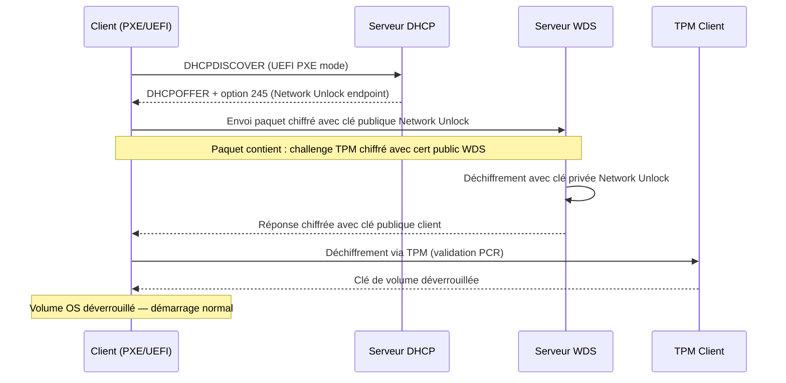
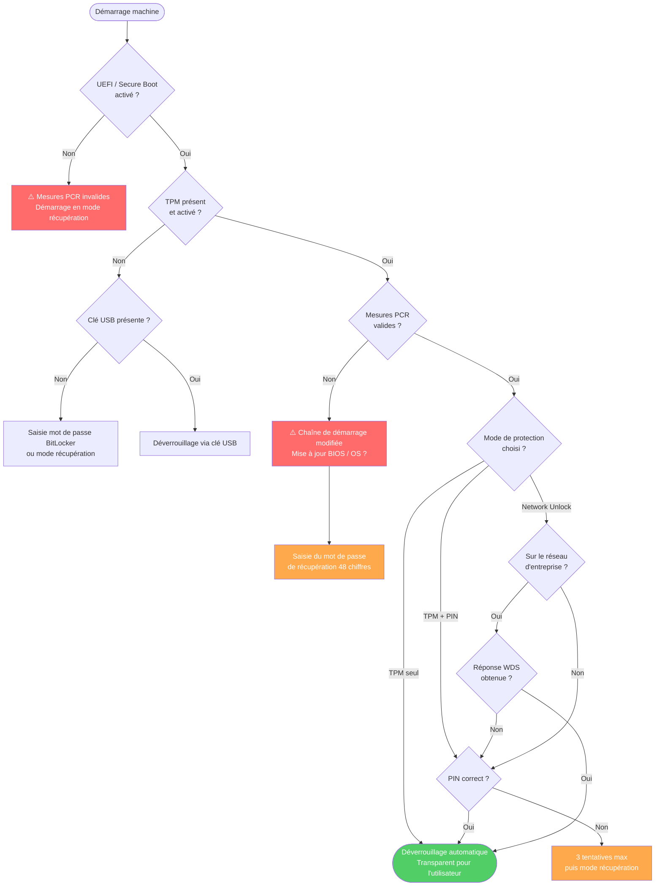

# BitLocker via GPO

!!! abstract "Ce que vous allez apprendre"
    - Comment la CSE Registry écrit les paramètres BitLocker dans `HKLM\SOFTWARE\Policies\Microsoft\FVE\` et pourquoi BitLocker n'a pas de CSE dédiée
    - Les méthodes de chiffrement : AES-CBC-128, AES-CBC-256, XTS-AES-128, XTS-AES-256 — différences de compatibilité et cas d'usage
    - Les modes de protection au démarrage : TPM seul, TPM+PIN, TPM+USB, et comment forcer chaque mode via GPO
    - Le backup obligatoire des clés de récupération dans AD DS avant chiffrement — attribut `msFVE-RecoveryInformation` et vérification PowerShell
    - BitLocker Network Unlock pour les parcs datacenter : infrastructure WDS + certificat, flux de déchiffrement automatique
    - Le pré-provisioning BitLocker en déploiement OSD (MDT/MECM) et l'interaction avec les GPO post-déploiement
    - Les pièges critiques de production : backup non configuré + panne disque = perte irrémédiable


!!! tip "Si vous ne retenez qu'une chose"
    **Sans backup de la clé de récupération dans AD DS, un poste BitLocker est potentiellement irrécupérable.** La GPO `Do not enable BitLocker until recovery information is stored to AD DS` est le seul garde-fou natif. Si vous n'activez pas cette option **avant** le premier chiffrement, une panne matérielle sur une machine sans sauvegarde de clé signifie une perte définitive des données. C'est le paramètre le plus critique de toute stratégie BitLocker d'entreprise.


---

## :material-chip: La CSE BitLocker : pas de CSE dédiée

### :material-information-outline: Une idée reçue courante

Contrairement à ce que l'on pourrait attendre, **BitLocker n'a pas de CSE (Client-Side Extension) dédiée**. Il n'existe pas de DLL spécifique chargée d'interpréter des paramètres BitLocker dans SYSVOL.

BitLocker est piloté exclusivement via des **valeurs de registre sous-politiques**, traitées par la CSE Registry standard (`{35378EAC-683F-11D2-A89A-00C04FBBCFA2}`). La GPMC génère un `registry.pol` ordinaire — BitLocker réagit ensuite aux valeurs présentes sous sa clé de registre dédiée.

### :material-folder-key: La clé FVE

Tous les paramètres BitLocker gérés par GPO aboutissent sous :

```
HKLM\SOFTWARE\Policies\Microsoft\FVE\
```

Le service `BitLocker Drive Encryption Service` (`BDESVC`) lit cette branche au démarrage et à chaque changement de politique pour déterminer ses contraintes opérationnelles.

!!! info "FVE = Full Volume Encryption"
    L'acronyme **FVE** (Full Volume Encryption) est le nom interne Microsoft de BitLocker, visible dans les noms de DLL (`fveapi.dll`, `fvecerts.dll`), les attributs AD DS (`msFVE-*`), et la clé de registre de politique.

### :material-table: Valeurs de registre FVE clés

| Valeur de registre | Type | Description |
|---|---|---|
| `EncryptionMethod` | `DWORD` | Algorithme de chiffrement (voir section suivante) |
| `EncryptionMethodWithXtsOs` | `DWORD` | Algorithme pour le volume OS avec XTS (Win 10+) |
| `EncryptionMethodWithXtsFdv` | `DWORD` | Algorithme pour les volumes de données fixes |
| `EncryptionMethodWithXtsRdv` | `DWORD` | Algorithme pour les volumes amovibles |
| `UseAdvancedStartup` | `DWORD` | Active la protection renforcée au démarrage (1 = oui) |
| `EnableBDEWithNoTPM` | `DWORD` | Autorise BitLocker sans TPM (1 = oui) |
| `UseTPM` | `DWORD` | TPM seul autorisé (0/1/2 = interdit/autorisé/obligatoire) |
| `UseTPMPIN` | `DWORD` | TPM+PIN (0/1/2) |
| `UseTPMKey` | `DWORD` | TPM+clé de démarrage USB (0/1/2) |
| `UseTPMKeyPIN` | `DWORD` | TPM+clé+PIN (0/1/2) |
| `ActiveDirectoryBackup` | `DWORD` | Activer le backup AD DS (1 = oui) |
| `RequireActiveDirectoryBackup` | `DWORD` | Bloquer le chiffrement si backup échoue (1 = oui) |
| `RecoveryKeyUsage` | `DWORD` | Autoriser la clé de récupération (0/1/2) |
| `RecoveryPasswordUsage` | `DWORD` | Autoriser le mot de passe de récupération (0/1/2) |
| `OSRequireActiveDirectoryBackup` | `DWORD` | Backup AD DS obligatoire pour le volume OS |
| `OSActiveDirectoryBackup` | `DWORD` | Backup AD DS activé pour le volume OS |
| `NetworkUnlock` | `DWORD` | Activer Network Unlock (1 = oui) |

!!! info "Encodage 0/1/2 pour les modes TPM"
    Les valeurs `UseTPM`, `UseTPMPIN`, etc. suivent la convention : `0` = interdit, `1` = autorisé, `2` = obligatoire. Mettre `UseTPM = 2` et `UseTPMPIN = 1` impose le TPM seul tout en autorisant optionnellement le PIN.

!!! quote "En résumé"
    - BitLocker n'a pas de CSE dédiée — la CSE Registry standard traite ses paramètres.
    - Les valeurs atterrissent sous `HKLM\SOFTWARE\Policies\Microsoft\FVE\`.
    - Le service `BDESVC` lit cette clé pour déterminer ses contraintes opérationnelles.
    - Comprendre les valeurs individuelles est indispensable pour diagnostiquer un comportement BitLocker inattendu.

---

## :material-lock: Paramètres GPO BitLocker

### :material-map: Chemin GPMC

L'ensemble des paramètres BitLocker se trouve à :

```
Computer Configuration
  └── Policies
        └── Administrative Templates
              └── Windows Components
                    └── BitLocker Drive Encryption
```

Trois sous-nœuds distincts existent pour le volume OS, les volumes de données fixes, et les volumes amovibles.

### :material-encryption: Méthode de chiffrement

Le paramètre **"Choose drive encryption method and cipher strength"** contrôle l'algorithme appliqué au moment du chiffrement initial.

| Algorithme | DWORD | Windows minimum | Cas d'usage recommandé |
|---|---|---|---|
| AES-CBC 128 bits | `3` | Windows 7 | Compatibilité maximale, hors usage |
| AES-CBC 256 bits | `4` | Windows 7 | Compatibilité large, performance dégradée |
| XTS-AES 128 bits | `6` | Windows 10 1511 | Volumes fixes, bon équilibre perf/sécurité |
| XTS-AES 256 bits | `7` | Windows 10 1511 | Volumes OS et fixes, recommandé ANSSI |

!!! info "Windows 11 : chiffrement par défaut"
    Depuis Windows 11, le chiffrement automatique des nouveaux volumes utilise
    **XTS-AES-128** (contre AES-CBC-128 sur Windows 10 en mode compatible).

    Pour forcer XTS-AES-256 via GPO :

    - Chemin : `Computer Configuration > Administrative Templates > Windows Components > BitLocker Drive Encryption`
    - Paramètre : **Choose drive encryption method and cipher strength (Windows 10 [Version 1511] and later)**
    - Valeur : `XTS-AES 256-bit` pour les lecteurs du système d'exploitation

    !!! warning "Compatibilité"
        XTS-AES n'est pas compatible avec les versions Windows antérieures à 10 1511.
        Sur les environnements mixtes, évaluer AES-CBC-256 pour les lecteurs amovibles.

!!! warning "AES-CBC sur les volumes amovibles"
    XTS-AES **n'est pas compatible** avec les volumes amovibles destinés à être lus sur des systèmes Windows 7 ou 8.1. Pour les clés USB partagées avec des systèmes anciens, conserver AES-CBC 256 bits sur les volumes amovibles. Configurer XTS-AES uniquement pour les volumes OS et les disques fixes.

!!! warning "L'algorithme est figé au premier chiffrement"
    Modifier la GPO après chiffrement ne re-chiffre pas le disque avec le nouvel algorithme. Le changement ne prend effet que lors d'un nouveau chiffrement complet. Pour migrer un parc vers XTS-AES-256, il faut déchiffrer puis re-chiffrer chaque volume — ou utiliser `manage-bde -upgrade`.

### :material-shield-key: Protection au démarrage

Le paramètre **"Require additional authentication at startup"** contrôle ce que BitLocker vérifie avant de déverrouiller le volume OS.

**TPM seul** — le déverrouillage est transparent, aucune interaction utilisateur. C'est le mode par défaut recommandé pour les flottes de postes standards. La protection repose sur l'intégrité de la chaîne de démarrage mesurée par le TPM.

**TPM + PIN** — l'utilisateur saisit un PIN numérique (4 à 20 chiffres) ou un PIN renforcé alphanumérique. Résistant aux attaques physiques par extraction de clé. Recommandé pour les populations à risque élevé (dirigeants, équipes sécurité, accès à des données classifiées).

**TPM + Clé USB** — la clé de démarrage est stockée sur une clé USB qui doit être présente à chaque démarrage. Rare en entreprise car contraignant, utilisé dans des contextes très spécifiques (postes fixes dans des locaux sécurisés).

**Sans TPM** — BitLocker déverrouille via un mot de passe ou une clé USB uniquement. Nécessite d'activer `EnableBDEWithNoTPM = 1`. Acceptable uniquement sur des machines sans TPM 2.0 en environnement contrôlé.

```ini title="Extrait de registry.pol résultant — TPM+PIN obligatoire"
[HKEY_LOCAL_MACHINE\SOFTWARE\Policies\Microsoft\FVE]
"UseAdvancedStartup"=dword:00000001
"UseTPM"=dword:00000000
"UseTPMPIN"=dword:00000002
"UseTPMKey"=dword:00000000
"UseTPMKeyPIN"=dword:00000000
```

!!! info "TPM version 1.2 vs 2.0"
    Le TPM 2.0 est obligatoire pour Windows 11, mais BitLocker fonctionne avec TPM 1.2 sur Windows 10. La différence principale : TPM 2.0 supporte les algorithmes SHA-256 pour les mesures PCR, offrant une meilleure résistance aux attaques par extension de registre. Auditer la version TPM de votre parc avant de définir une stratégie PIN.

### :material-key-variant: Options de récupération

Le paramètre **"Choose how BitLocker-protected operating system drives can be recovered"** définit ce qui est disponible si la chaîne de démarrage normale échoue.

La récupération peut se faire via :

- **Mot de passe de récupération** (48 chiffres) — stocké dans AD DS, imprimable, sauvegardable manuellement.
- **Agent de récupération de données (DRA)** — un certificat de déchiffrement d'entreprise, nécessite une PKI interne.

Pour une entreprise sans PKI dédiée, le mot de passe de récupération avec backup AD DS est la seule option viable.

!!! quote "En résumé"
    - La méthode de chiffrement est figée au premier chiffrement — migrer vers XTS-AES-256 requiert un re-chiffrement complet.
    - XTS-AES n'est pas compatible avec les volumes amovibles lus sur Windows 7/8.1.
    - Le mode TPM seul est le standard de flotte ; TPM+PIN est réservé aux populations à risque élevé.
    - Pour la récupération, le mot de passe 48 chiffres avec backup AD DS est la référence sans PKI.

---

## :material-database-lock: Backup des clés de récupération dans AD DS

### :material-folder-account: L'attribut msFVE-RecoveryInformation

Quand BitLocker sauvegarde une clé de récupération dans AD DS, il crée un **objet enfant** sur l'objet ordinateur concerné. Cet objet enfant est de classe `msFVE-RecoveryInformation`.

Chaque objet `msFVE-RecoveryInformation` contient :

| Attribut AD | Contenu |
|---|---|
| `msFVE-RecoveryPassword` | Le mot de passe de récupération 48 chiffres |
| `msFVE-RecoveryGuid` | L'identifiant unique de cette clé de récupération |
| `msFVE-VolumeGuid` | L'identifiant du volume chiffré |
| `msFVE-KeyPackage` | Le paquet de clé (pour la récupération bas niveau) |
| `whenCreated` | Horodatage du backup |

Un ordinateur peut avoir plusieurs objets `msFVE-RecoveryInformation` si le volume a été re-chiffré ou si plusieurs clés ont été générées.

!!! warning "Droits d'accès à msFVE-RecoveryPassword"
    Par défaut, seuls les membres de **Domain Admins** peuvent lire `msFVE-RecoveryPassword`. C'est intentionnel. Si votre helpdesk doit effectuer des récupérations, déléguer l'accès en lecture à cet attribut spécifiquement via ADSI Edit — ne pas élever le helpdesk en Domain Admins pour cette raison.

### :material-powershell: Vérifier la présence d'un backup avant déploiement

Avant d'activer BitLocker sur un grand nombre de machines, il est indispensable de s'assurer que la configuration AD DS est correcte. Ce script vérifie, pour une OU donnée, quels ordinateurs ont une clé de récupération sauvegardée.

```powershell title="Check-BitLockerADBackup.ps1 — Audit des backups de clés"
# Verify BitLocker recovery key backup in AD DS for a given OU
# Returns a report of computers with and without keys stored
#Requires -Module ActiveDirectory

param (
    [Parameter(Mandatory)]
    [string]$SearchBase,

    [string]$OutputCsvPath = "$env:TEMP\bitlocker-backup-audit.csv"
)

$computers = Get-ADComputer -Filter { Enabled -eq $true } `
    -SearchBase $SearchBase `
    -Properties distinguishedName, operatingSystem

$results = foreach ($computer in $computers) {
    $recoveryObjects = Get-ADObject `
        -Filter { objectClass -eq 'msFVE-RecoveryInformation' } `
        -SearchBase $computer.DistinguishedName `
        -Properties msFVE-RecoveryGuid, whenCreated `
        -ErrorAction SilentlyContinue

    [PSCustomObject]@{
        ComputerName     = $computer.Name
        OperatingSystem  = $computer.OperatingSystem
        HasRecoveryKey   = [bool]$recoveryObjects
        KeyCount         = ($recoveryObjects | Measure-Object).Count
        LatestBackup     = ($recoveryObjects | Sort-Object whenCreated -Descending | Select-Object -First 1).whenCreated
        DN               = $computer.DistinguishedName
    }
}

$results | Export-Csv -Path $OutputCsvPath -NoTypeInformation -Encoding UTF8

$withKey    = ($results | Where-Object { $_.HasRecoveryKey }).Count
$withoutKey = ($results | Where-Object { -not $_.HasRecoveryKey }).Count

Write-Host "Computers with recovery key   : $withKey"
Write-Host "Computers without recovery key: $withoutKey"
Write-Host "Report exported to: $OutputCsvPath"
```

```powershell title="Résultat attendu"
Computers with recovery key   : 142
Computers without recovery key: 8
Report exported to: C:\Users\Admin\AppData\Local\Temp\bitlocker-backup-audit.csv
```

### :material-key-chain: Récupérer une clé depuis AD DS

La récupération se fait via l'interface GPMC (onglet **BitLocker Recovery** sur l'objet ordinateur dans ADUC) ou via PowerShell.

```powershell title="Retrieve-BitLockerRecoveryKey.ps1 — Récupérer la clé depuis AD DS"
# Retrieve BitLocker recovery password from AD DS for a specific computer
# Requires 'Read msFVE-RecoveryPassword' permission on the computer object
param (
    [Parameter(Mandatory)]
    [string]$ComputerName
)

$computer = Get-ADComputer -Identity $ComputerName -Properties distinguishedName

$recoveryObjects = Get-ADObject `
    -Filter { objectClass -eq 'msFVE-RecoveryInformation' } `
    -SearchBase $computer.DistinguishedName `
    -Properties msFVE-RecoveryPassword, msFVE-RecoveryGuid, whenCreated |
    Sort-Object whenCreated -Descending

foreach ($obj in $recoveryObjects) {
    [PSCustomObject]@{
        RecoveryGuid     = $obj.'msFVE-RecoveryGuid'
        RecoveryPassword = $obj.'msFVE-RecoveryPassword'
        BackupDate       = $obj.whenCreated
    }
}
```

!!! info "Key ID sur l'écran de récupération BitLocker"
    L'écran de récupération Windows affiche un **Key ID** (8 premiers caractères du GUID de récupération). Ce Key ID correspond au début de `msFVE-RecoveryGuid`. Il permet d'identifier rapidement quelle entrée AD DS correspond à la machine en cours de récupération lorsque plusieurs backups existent.

### :material-shield-alert: Le paramètre de blocage critique

Le paramètre GPO **"Do not enable BitLocker until recovery information is stored to AD DS for (OS|fixed|removable) drives"** est le garde-fou fondamental.

Lorsqu'il est activé (`RequireActiveDirectoryBackup = 1` et `OSRequireActiveDirectoryBackup = 1`), BitLocker **refuse de commencer le chiffrement** si la communication avec AD DS échoue au moment de la sauvegarde de la clé.

Cela signifie qu'une machine hors domaine au moment du chiffrement ne sera pas chiffrée — ce qui est le comportement correct. Un disque non chiffré est récupérable. Un disque chiffré sans clé sauvegardée est perdu.

!!! warning "Machines provisionnées hors réseau d'entreprise"
    En déploiement OSD sur site distant sans connectivité DC, ce paramètre bloque le chiffrement. Deux options : différer le chiffrement à la première connexion réseau (via une tâche planifiée ou Endpoint Manager), ou configurer un point de récupération alternatif (Microsoft Entra ID / Intune pour les environnements hybrides).

!!! quote "En résumé"
    - Les clés de récupération sont stockées dans des objets enfants `msFVE-RecoveryInformation` sur l'objet ordinateur AD.
    - Auditer régulièrement les machines sans clé sauvegardée via PowerShell avant tout incident.
    - Activer impérativement `RequireActiveDirectoryBackup = 1` — sans cela, le chiffrement peut démarrer sans que la clé soit sauvegardée.
    - Déléguer l'accès à `msFVE-RecoveryPassword` au helpdesk sans élever ses privilèges AD.

---

## :material-server-network: BitLocker Network Unlock

### :material-lan: Le problème datacenter

En environnement datacenter ou salle serveur, le mode TPM+PIN crée un problème opérationnel majeur : chaque redémarrage non planifié (mise à jour, crash, maintenance) requiert une intervention physique pour saisir le PIN. Sur un parc de centaines de serveurs, c'est inacceptable.

**BitLocker Network Unlock** résout ce problème. Un serveur sur le réseau interne peut être déverrouillé automatiquement au démarrage, **sans PIN**, à condition qu'il soit sur le réseau d'entreprise au moment du boot. Si le réseau n'est pas accessible (démarrage hors site, démarrage sur un réseau inconnu), le mode de repli (PIN ou récupération) s'applique.

### :material-cog-outline: Infrastructure requise

Network Unlock nécessite :

| Composant | Rôle |
|---|---|
| **WDS (Windows Deployment Services)** | Fournit le service DHCP option 245 et transmet la réponse de déverrouillage |
| **Certificat de serveur Network Unlock** | Chiffre la clé de réponse — émis par une PKI interne (déployé dans AD DS) |
| **GPO Network Unlock** | Active le mécanisme côté client et distribue le certificat public |
| **TPM 2.0 sur les clients** | Requis — Network Unlock ne fonctionne pas avec TPM 1.2 |

!!! warning "WDS obligatoire même sans PXE"
    WDS doit être installé et configuré, mais n'a pas besoin d'être actif pour le déploiement PXE. Il sert uniquement de relais pour les paquets Network Unlock. Désactiver le service PXE si vous ne l'utilisez pas pour éviter les interférences avec votre infrastructure DHCP.

### :material-certificate: Déploiement du certificat

Le certificat de Network Unlock est un certificat x509 avec une utilisation étendue de clé spécifique. Il est déployé via GPO dans :

```
Computer Configuration
  └── Policies
        └── Windows Settings
              └── Security Settings
                    └── Public Key Policies
                          └── BitLocker Drive Encryption Network Unlock Certificate
```

La clé privée reste sur le serveur WDS. Les clients reçoivent uniquement la clé publique via GPO pour chiffrer leur requête de déverrouillage au boot.

### :material-wifi-arrow-left-right: Flux de déverrouillage Network Unlock



!!! info "Conditions PCR validées par le TPM"
    Même en mode Network Unlock, le TPM valide toujours ses mesures PCR (état du firmware UEFI, Secure Boot, etc.). Si la chaîne de démarrage a été modifiée, le TPM refuse le déverrouillage même si la réponse WDS est valide. Network Unlock ne contourne pas la protection d'intégrité du démarrage.

!!! quote "En résumé"
    - Network Unlock supprime la contrainte de PIN pour les redémarrages des serveurs en datacenter.
    - Il requiert WDS (comme relais), un certificat PKI, et TPM 2.0 sur les clients.
    - Le déverrouillage automatique ne fonctionne que sur le réseau d'entreprise — un démarrage hors réseau bascule sur le mode de récupération.
    - Le TPM continue de valider l'intégrité de la chaîne de démarrage — Network Unlock ne la contourne pas.

---

## :material-wrench-cog: Pré-provisioning BitLocker en OSD

### :material-package-variant: Le problème du chiffrement post-OSD

En déploiement classique MDT ou MECM/SCCM, BitLocker est activé après l'installation de l'OS. Si le disque n'a pas été pré-provisionné, le chiffrement intégral du disque prend **plusieurs heures** sur des disques de grande capacité — bloquant la séquence de tâches ou nécessitant de laisser la machine disponible pendant le chiffrement.

### :material-speedometer: Le pré-provisioning pendant WinPE

La solution est d'activer BitLocker **pendant la phase WinPE**, avant même que l'OS ne soit installé. À ce stade, le volume OS est vide — le chiffrement est quasi-instantané.

```cmd title="Séquence de tâches MDT — Pré-provisioning BitLocker en WinPE"
REM Step 1: Enable BitLocker pre-provisioning on the OS volume (WinPE phase)
REM The drive letter may vary — use the letter assigned to the OS partition
manage-bde -on %OSDisk% -used -skiphardwaretest

REM Step 2: Protect with TPM (key protector added before OS install)
manage-bde -protectors -add %OSDisk% -tpm
```

!!! info "L'option -used"
    Le flag `-used` indique à BitLocker de ne chiffrer que l'espace utilisé, pas l'espace vide. En WinPE avant installation, cela représente quelques mégaoctets. L'espace restant sera chiffré au fil des écritures post-installation. C'est le mode recommandé pour les déploiements OSD — jamais pour des machines en production avec données existantes.

### :material-step-forward: Interaction avec les GPO post-déploiement

Après l'installation de l'OS et la jonction au domaine, les GPO BitLocker s'appliquent pour la première fois. Plusieurs cas à anticiper :

**Cas 1 — GPO compatible avec le pré-provisioning.** Le volume est déjà chiffré avec TPM. Si la GPO impose TPM seul, aucune action requise — BitLocker est déjà dans l'état attendu.

**Cas 2 — GPO impose TPM+PIN, pré-provisioning TPM seul.** BitLocker détecte un écart entre la politique et l'état actuel. Sur Windows 10/11, le système **ne dégrade pas** la protection existante. L'administrateur doit ajouter le protecteur PIN manuellement ou via script post-déploiement.

**Cas 3 — GPO impose le backup AD DS, backup non encore effectué.** La GPO déclenche automatiquement le backup de la clé TPM au prochain refresh. Vérifier via PowerShell après jonction domaine.

```powershell title="Post-OSD-BitLockerVerify.ps1 — Vérifier l'état après jonction domaine"
# Verify BitLocker state and trigger AD DS backup if key not yet stored
# Run as part of post-OSD configuration script

$volume = Get-BitLockerVolume -MountPoint $env:SystemDrive

Write-Host "Protection status : $($volume.ProtectionStatus)"
Write-Host "Encryption method : $($volume.EncryptionMethod)"
Write-Host "Key protectors    : $($volume.KeyProtector.KeyProtectorType -join ', ')"

# Force AD DS backup of the numerical password protector
$numericProtector = $volume.KeyProtector | Where-Object { $_.KeyProtectorType -eq 'RecoveryPassword' }

if ($numericProtector) {
    Backup-BitLockerKeyProtector `
        -MountPoint $env:SystemDrive `
        -KeyProtectorId $numericProtector.KeyProtectorId
    Write-Host "Recovery key backed up to AD DS successfully."
} else {
    Write-Warning "No RecoveryPassword protector found — verify GPO configuration."
}
```

```powershell title="Résultat attendu"
Protection status : On
Encryption method : XtsAes256
Key protectors    : Tpm, RecoveryPassword
Recovery key backed up to AD DS successfully.
```

!!! warning "manage-bde vs PowerShell BitLocker"
    `manage-bde` et les cmdlets PowerShell `*-BitLockerVolume` ne sont pas toujours équivalents. `manage-bde` est disponible en WinPE, les cmdlets PowerShell ne le sont pas. En séquence de tâches WinPE, utiliser exclusivement `manage-bde`. Post-installation, préférer les cmdlets PowerShell pour leur meilleure intégration scripting.

!!! quote "En résumé"
    - Le pré-provisioning via `manage-bde -on -used` en WinPE réduit le chiffrement à quelques secondes avant installation.
    - Les GPO post-déploiement peuvent créer un écart entre l'état du pré-provisioning et la politique imposée — anticiper ces cas dans la séquence de tâches.
    - Toujours déclencher explicitement le backup AD DS via `Backup-BitLockerKeyProtector` dans le script post-OSD.
    - `manage-bde` en WinPE, cmdlets PowerShell post-installation — ne pas mélanger les deux dans les mêmes scripts.

---

## :material-transit-connection-variant: Séquence de démarrage avec BitLocker

### :material-chart-timeline-variant: Arbre de décision au démarrage



### :material-information: Décodage des états de démarrage

**Mesures PCR invalides** — le TPM a détecté un changement dans la chaîne de démarrage. Causes légitimes : mise à jour firmware UEFI, activation/désactivation Secure Boot, changement de bootloader. Dans ce cas, la récupération via mot de passe 48 chiffres est normale. Après récupération, le TPM se resynchronise.

**3 tentatives PIN puis récupération** — comportement par défaut configurable via GPO (`OSLockoutDurationMinutes`). En environnement haute sécurité, réduire à 1 tentative.

**Network Unlock — repli sur PIN** — si le serveur WDS est indisponible ou que le réseau est inaccessible, la machine bascule silencieusement sur le protecteur PIN (s'il existe) ou sur la récupération. Documenter ce comportement pour les équipes d'astreinte.


!!! quote "En résumé"
    - Mesures PCR invalides — le TPM a détecté un changement dans la chaîne de démarrage.
    - Causes légitimes : mise à jour firmware UEFI, activation/désactivation Secure Boot, changement de bootloader.
    - Dans ce cas, la récupération via mot de passe 48 chiffres est normale.
    - Le schéma sur séquence de démarrage avec bitlocker sert à visualiser l’ordre, les dépendances et les points de rupture du mécanisme.
    - Relisez cette vue d’ensemble avant un diagnostic : elle montre où une étape manquante casse tout le flux.
---

## :material-alert-circle: Pièges de production

### :material-bomb: Piège 1 — Backup non configuré + panne disque

C'est le scénario catastrophe. Si `RequireActiveDirectoryBackup` n'est pas activé et qu'un poste est chiffré sans que la clé ait été sauvegardée, une panne disque nécessitant un remplacement partiel du matériel (carte mère avec nouveau TPM) rend les données **définitivement inaccessibles**.

Ce scénario arrive plus souvent qu'on ne le croit, typiquement lors d'un déploiement rapide où le paramètre de backup a été oublié.

!!! warning "Audit de rattrapage"
    Si vous héritez d'un parc BitLocker existant et suspectez que le backup n'était pas configuré, exécutez immédiatement le script d'audit `Check-BitLockerADBackup.ps1` fourni plus haut. Pour chaque machine sans clé dans AD DS, déclencher manuellement le backup via `Backup-BitLockerKeyProtector` **avant** que le premier incident matériel ne survienne.

### :material-clock-alert-outline: Piège 2 — Migration AES-CBC vers XTS-AES

De nombreux parcs déployés avant Windows 10 1511 utilisent encore AES-CBC-128. La GPO peut être mise à jour pour imposer XTS-AES-256 — mais le changement **ne s'applique pas aux volumes déjà chiffrés**.

```powershell title="Audit-EncryptionMethod.ps1 — Inventaire des méthodes de chiffrement"
# Audit encryption method across managed computers via CIM
# Requires WinRM enabled on targets

param (
    [Parameter(Mandatory)]
    [string[]]$ComputerNames
)

$results = foreach ($computer in $ComputerNames) {
    try {
        $volumes = Get-CimInstance -ClassName Win32_EncryptableVolume `
            -Namespace root\cimv2\Security\MicrosoftVolumeEncryption `
            -ComputerName $computer `
            -ErrorAction Stop

        foreach ($vol in $volumes) {
            [PSCustomObject]@{
                Computer         = $computer
                DriveLetter      = $vol.DriveLetter
                EncryptionMethod = $vol.EncryptionMethod
                ProtectionStatus = $vol.ProtectionStatus
            }
        }
    } catch {
        [PSCustomObject]@{
            Computer         = $computer
            DriveLetter      = 'N/A'
            EncryptionMethod = "ERROR: $($_.Exception.Message)"
            ProtectionStatus = -1
        }
    }
}

$results | Group-Object EncryptionMethod | ForEach-Object {
    Write-Host "$($_.Name): $($_.Count) volume(s)"
}

$results | Export-Csv "$env:TEMP\encryption-method-audit.csv" -NoTypeInformation -Encoding UTF8
```

```powershell title="Résultat attendu"
AES_128: 47 volume(s)
XTS_AES_256: 203 volume(s)
XTS_AES_128: 12 volume(s)
```

La migration des 47 volumes AES_128 nécessite une opération manuelle ou scriptée (`manage-bde -upgrade` ou déchiffrement + re-chiffrement).

### :material-usb-flash-drive-outline: Piège 3 — Volumes amovibles et compatibilité

Un volume amovible chiffré avec XTS-AES ne peut pas être lu sur Windows 7 ou 8.1 — même avec `BitLocker To Go Reader`. Ces versions ne comprennent pas le format XTS.

Si votre organisation utilise encore des postes Windows 7 (en fin de vie mais parfois présents dans des environnements industriels), conserver impérativement AES-CBC pour les volumes amovibles.

!!! info "BitLocker To Go Reader"
    `BitLocker To Go Reader` permettait aux utilisateurs Windows XP et Vista de lire (sans écriture) des volumes FAT chiffrés avec BitLocker To Go. Cet outil n'existe plus pour XTS-AES. Sur Windows 7, la lecture d'un volume XTS-AES échoue sans message d'erreur explicite — la clé USB apparaît simplement comme non formatée.

### :material-update: Piège 4 — Mise à jour firmware et PCR

Une mise à jour firmware UEFI modifie les mesures PCR. Si BitLocker utilise les PCR 0 (firmware) dans son profil de validation — ce qui est le cas par défaut — chaque mise à jour firmware déclenche une entrée en mode récupération au redémarrage suivant.

Deux approches pour gérer ce cas :

**Option A — Suspendre BitLocker avant mise à jour firmware** (recommandé)

```powershell title="Suspend-BitLockerForFirmwareUpdate.ps1"
# Suspend BitLocker protection for one reboot cycle before firmware update
# BitLocker automatically resumes after the next boot
Suspend-BitLocker -MountPoint $env:SystemDrive -RebootCount 1
Write-Host "BitLocker suspended for 1 reboot cycle. Apply firmware update and reboot."
```

**Option B — Exclure PCR 0 du profil de validation** (à utiliser avec précaution)

Cette option réduit la surface de protection — elle est acceptable uniquement dans des environnements avec Secure Boot robuste et gestion rigoureuse des mises à jour firmware.

!!! warning "MECM / WSUS et mises à jour firmware"
    Si vous déployez des mises à jour firmware via MECM ou un outil tiers, intégrer la suspension BitLocker comme étape préalable dans la séquence de déploiement. Un parc de 500 machines entrant en mode récupération simultanément après une mise à jour firmware mal anticipée représente une charge opérationnelle significative pour le helpdesk.

### :material-key-remove: Piège 5 — Suppression de l'objet ordinateur AD

Quand un objet ordinateur est supprimé d'AD DS (par nettoyage de comptes inactifs, par exemple), **tous les objets `msFVE-RecoveryInformation` enfants sont supprimés avec lui**. Si la machine est ensuite réintégrée au domaine avec un nouvel objet ordinateur, l'ancienne clé de récupération n'est plus dans AD DS.

Toujours vérifier que la machine est re-chiffrée ou que la clé est re-sauvegardée après réintégration.

!!! quote "En résumé"
    - Activer `RequireActiveDirectoryBackup` avant tout déploiement — c'est le seul garde-fou contre la perte définitive de données.
    - Auditer régulièrement les méthodes de chiffrement — une GPO mise à jour ne re-chiffre pas les volumes existants.
    - Conserver AES-CBC pour les volumes amovibles si le parc inclut des Windows 7/8.1.
    - Suspendre BitLocker avant toute mise à jour firmware pour éviter les entrées en masse en mode récupération.
    - La suppression d'un objet ordinateur AD détruit ses clés de récupération associées.

---

## :material-link-variant: Références croisées

- **[Chapitre 13 — Stratégies de sécurité](13-securite-strategies.md)** — Contexte général des mécanismes de sécurité GPO, `scecli.dll`, et audit avancé. BitLocker s'inscrit dans une stratégie de sécurité endpoint plus large.
- **[Gpo pour les Admins — Chapitre 17 : BitLocker et LAPS](../gpo-pour-les-admins/17-bitlocker-laps.md)** — Déploiement enterprise de BitLocker avec LAPS, intégration Intune/Entra ID, et gestion du cycle de vie des clés dans un environnement hybride.

!!! quote "En résumé"
    - À relire : Chapitre 13 — Stratégies de sécurité.
    - À relire : Gpo pour les Admins — Chapitre 17 : BitLocker et LAPS.
    - Ces renvois prolongent le chapitre avec des mécanismes complémentaires ou des cas d’usage voisins.
    - Gardez ces chapitres sous la main pour le diagnostic ou la conception d’une GPO liée à ce thème.
