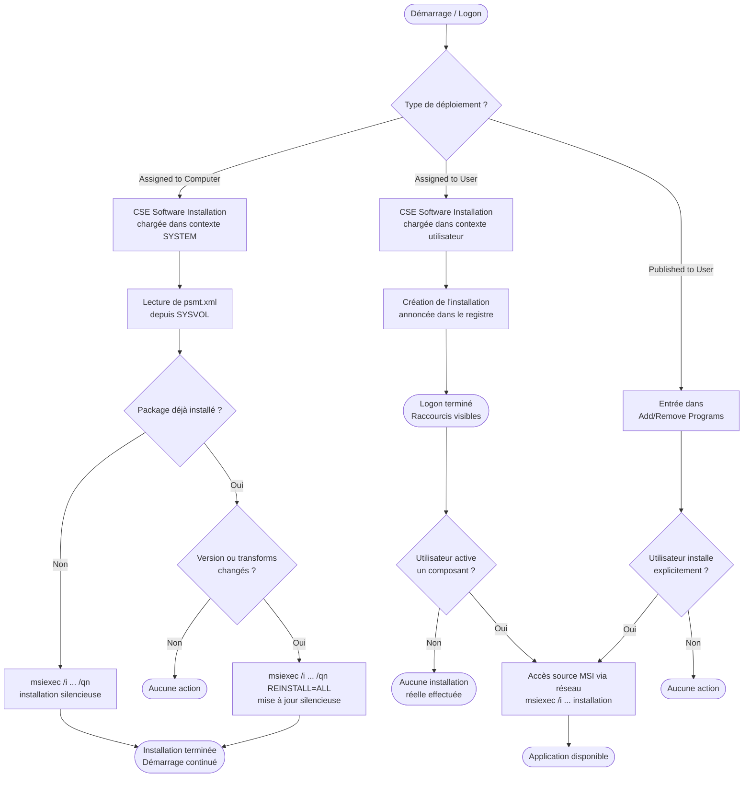

# Déploiement de logiciels via GPO (MSI)

!!! abstract "Ce que vous allez apprendre"
    - Le rôle de la CSE Software Installation (`{942A8E4F-A261-11D1-A760-00C04FB9603F}`) et la structure du fichier `psmt.xml` dans le GPT
    - Les trois modes de déploiement — Assigned to Computer, Assigned to User, Published to User — leurs différences comportementales et leurs limites
    - La clé de registre `HKLM\SOFTWARE\Microsoft\Windows\CurrentVersion\Group Policy\AppMgmt\` et ce qu'elle contient
    - Le format ZAP pour les exécutables non-MSI : syntaxe, contraintes et cas d'usage
    - Les transforms `.mst` : personnalisation du MSI avant déploiement, association dans la GPO, outils (`msiexec /a`, Orca)
    - La gestion des montées de version : table `Upgrades`, `ProductCode`, et mécanisme de redéploiement
    - Les limites structurelles du déploiement MSI par GPO et les alternatives modernes

---

!!! tip "Si vous ne retenez qu'une chose"
    **La CSE Software Installation opère uniquement au premier plan (foreground) — lors du démarrage machine ou de la session utilisateur.** Elle n'intervient pas lors des refreshs périodiques en arrière-plan. Un package assigné à l'ordinateur ne s'installe pas en tâche de fond entre deux reboots : il attend le prochain démarrage. Ce comportement, fondamental, est souvent mal compris et génère des tickets de non-conformité sur les parcs où les machines ne redémarrent pas régulièrement.

---

## :material-puzzle-outline: La CSE Software Installation

### :material-identifier: GUID et enregistrement

La CSE Software Installation est identifiée par le GUID :

```
{942A8E4F-A261-11D1-A760-00C04FB9603F}
```

Elle est implémentée dans `appmgmts.dll`, chargée par `gpsvc` dans le contexte SYSTEM pour le traitement machine, et dans le contexte de la session utilisateur pour le traitement utilisateur.

Son entrée de registre se trouve sous :

```
HKLM\SOFTWARE\Microsoft\Windows NT\CurrentVersion\Winlogon\GPExtensions\
  {942A8E4F-A261-11D1-A760-00C04FB9603F}
```

### :material-table: Valeurs de registre de la CSE

| Valeur | Contenu typique | Signification |
|---|---|---|
| `(Default)` | `Software Installation` | Nom affiché dans les logs |
| `DllName` | `%SystemRoot%\system32\appmgmts.dll` | DLL portant la CSE |
| `ProcessGroupPolicyEx` | `ProcessSoftwareInstallation` | Fonction exportée principale |
| `NoBackgroundPolicy` | `1` | Jamais appelée en arrière-plan |
| `NoSlowLink` | `1` | Désactivée sur liens lents |
| `NoGPOListChanges` | `0` | Toujours appelée même si la liste GPO n'a pas changé |
| `EnableAsynchronousProcessing` | `0` | Traitement synchrone obligatoire |

!!! info "NoBackgroundPolicy = 1"
    La valeur `NoBackgroundPolicy = 1` est non-négociable : le déploiement MSI nécessite un accès au réseau, à SYSVOL, et potentiellement à un partage de source. Il ne peut pas s'exécuter de manière fiable pendant une session ouverte, en tâche de fond.

### :material-file-code: Le fichier `psmt.xml` dans le GPT

Chaque GPO contenant des packages Software Installation dispose d'un fichier `psmt.xml` dans son GPT (Group Policy Template), au chemin :

```
\\<domain>\SYSVOL\<domain>\Policies\{GPO-GUID}\
  Machine\Applications\psmt.xml     ← packages assignés à l'ordinateur
  User\Applications\psmt.xml        ← packages assignés/publiés à l'utilisateur
```

Ce fichier XML est le manifeste que la CSE lit pour connaître la liste des packages à appliquer, leurs ProductCode, leurs transforms associées et leurs règles de mise à niveau.

```xml title="Exemple de psmt.xml (fragment)"
<MachinePackages>
  <Package
    name="7-Zip 23.01"
    productCode="{23170F69-40C1-2702-2301-000001000000}"
    deploymentType="Assigned"
    scriptName="\\server\share\7zip-2301.msi"
    transformList="\\server\share\transforms\7zip-corp.mst"
    upgradeProductCode=""
    removalPolicy="uninstall" />
</MachinePackages>
```

!!! warning "psmt.xml est géré exclusivement par la GPMC"
    Ne modifiez jamais `psmt.xml` manuellement. La GPMC maintient la cohérence entre ce fichier, les attributs `gPCMachineExtensionNames` dans l'objet AD, et les données stockées dans AD (pour les packages assignés aux utilisateurs). Une modification manuelle peut rendre la GPO silencieusement non fonctionnelle.

### :material-database: La clé de registre AppMgmt

Lors de l'application des packages, la CSE écrit les données dans :

```
HKLM\SOFTWARE\Microsoft\Windows\CurrentVersion\Group Policy\AppMgmt\
```

Cette clé contient une sous-clé par package déployé, nommée par le ProductCode MSI (GUID).

```
HKLM\...\AppMgmt\
  {23170F69-40C1-2702-2301-000001000000}\
    ProductName    REG_SZ     "7-Zip 23.01"
    AssignCount    REG_DWORD  0x00000001
    DeploymentType REG_DWORD  0x00000001   (1=Assigned, 2=Published)
    ScriptPath     REG_SZ     "\\server\share\7zip-2301.msi"
    Transforms     REG_SZ     "\\server\share\transforms\7zip-corp.mst"
```

!!! info "Diagnostic par AppMgmt"
    La clé `AppMgmt` est votre premier point de vérification lors d'un incident. Si un package est absent de cette clé sur un poste ciblé, la CSE n'a pas traité la GPO — problème de portée, de filtrage, ou de connectivité à SYSVOL. Si la clé est présente mais le package absent des programmes installés, l'installation elle-même a échoué (consultez le journal `Application` pour les Event ID `1022`, `1023`, `1024`).

### :material-table: GUIDs complémentaires

| GUID | CSE associée | Rôle |
|---|---|---|
| `{942A8E4F-A261-11D1-A760-00C04FB9603F}` | Software Installation | Déploiement MSI/ZAP |
| `{35378EAC-683F-11D2-A89A-00C04FBBCFA2}` | Registry | Politiques de registre |
| `{0ACDD3F3-B1B2-40F1-9E34-3C81FF6DDBFF}` | Wireless Policy | Configuration Wi-Fi |
| `{827D319E-6EAC-11D2-A4EA-00C04F79F83A}` | Security | Stratégie de sécurité locale |
| `{B1BE8D72-6EAC-11D2-A4EA-00C04F79F83A}` | EFS Recovery | Politiques de chiffrement EFS |
| `{25537523-E2DC-11D2-A6E8-00C04FB997CB}` | Folder Redirection | Redirection de dossiers |
| `{7B849A69-220F-451E-B3FE-2CB811AF94AE}` | Internet Explorer Maint. | Paramètres IE (obsolète) |

!!! quote "En résumé"
    - La CSE Software Installation (`appmgmts.dll`) est invoquée uniquement au premier plan, jamais en arrière-plan.
    - Elle lit `psmt.xml` depuis le GPT pour connaître les packages à appliquer.
    - Elle écrit l'état des packages dans `HKLM\...\Group Policy\AppMgmt\`.
    - `psmt.xml` ne doit jamais être modifié manuellement — la GPMC est le seul outil légitime.

---

## :material-package-variant-closed: Modes d'assignation et de publication

### :material-monitor: Assigned to Computer

Le package est assigné à l'**objet ordinateur**. L'installation est déclenchée au **démarrage de la machine**, avant l'ouverture de session, dans le contexte SYSTEM.

Ce mode est **silencieux** : aucune interaction utilisateur n'est possible ni requise. Le package s'installe (ou se désinstalle) sans UI visible. C'est le mode recommandé pour les packages d'infrastructure.

La commande MSI sous-jacente est équivalente à :

```bat title="Commande d'installation déclenchée par la CSE (Computer)"
msiexec /i "\\server\share\package.msi" /qn TRANSFORMS="\\server\share\package.mst" ALLUSERS=1
```

### :material-account: Assigned to User

Le package est assigné à l'**objet utilisateur**. Le comportement diffère fondamentalement du mode Computer.

Au lieu d'une installation immédiate, Windows crée une **installation annoncée** (*advertised*). Des raccourcis, des extensions de fichier et des entrées dans `Add/Remove Programs` sont enregistrés, mais les fichiers du package ne sont pas copiés.

L'installation réelle se déclenche sur **activation** : ouverture du raccourci, double-clic sur un fichier de l'extension associée, ou lancement d'un composant annoncé. Le package se termine en quelques secondes à quelques minutes selon sa taille.

!!! warning "Attention à la source MSI"
    Lors de l'activation, la CSE accède au réseau pour lire le fichier MSI. **La source doit être accessible au moment de l'activation.** Un utilisateur nomade hors VPN qui ouvre un raccourci annoncé obtiendra une erreur ou une tentative de résolution infructueuse.

### :material-store: Published to User

Le package est **disponible** dans `Add/Remove Programs` → `Add Programs`, mais n'est ni installé ni annoncé automatiquement. L'utilisateur choisit d'installer ou non.

Ce mode ne supporte pas les packages MSI pour des raisons de compatibilité. Pour les exécutables non-MSI, le format ZAP (voir section suivante) permet exclusivement ce mode Published.

!!! info "Published : pas de raccourci, pas d'extension"
    Contrairement à Assigned to User, Published ne crée aucun raccourci et n'associe aucune extension. L'utilisateur doit activement ouvrir le panneau de contrôle pour déclencher l'installation.

### :material-compare: Tableau comparatif des modes

| Critère | Assigned to Computer | Assigned to User | Published to User |
|---|---|---|---|
| **Cible** | Objet ordinateur | Objet utilisateur | Objet utilisateur |
| **Déclencheur** | Démarrage machine | Logon + activation | Action utilisateur |
| **Silencieux** | Oui | Partiel | Non |
| **Raccourcis créés** | Oui (pour tous) | Oui (annoncés) | Non |
| **Associations fichiers** | Oui | Oui (annoncées) | Non |
| **Désinstallation auto** | Oui (si GPO supprimée) | Oui | Non |
| **MSI uniquement** | Oui | Oui | Non (ZAP aussi) |
| **Nomades hors réseau** | Risqué (source MSI) | Risqué (activation) | N/A |

### :material-chart-timeline: Cycle de vie d'une installation MSI par GPO



!!! quote "En résumé"
    - Assigned to Computer : installation silencieuse au démarrage, recommandé pour l'infrastructure.
    - Assigned to User : installation annoncée, déclenchée sur activation — la source MSI doit être accessible au moment de l'activation.
    - Published to User : disponible dans Add/Remove Programs, aucune automatisation, uniquement MSI et ZAP.
    - Les trois modes opèrent uniquement au premier plan — jamais en tâche de fond.

---

## :material-file-document-outline: Format ZAP

### :material-information-outline: Contexte et limitations

Le format ZAP (*Zero Administration Package*) permet de référencer des **exécutables non-MSI** dans un déploiement Software Installation GPO. Il s'agit d'un fichier texte avec l'extension `.zap` qui décrit le setup à lancer.

ZAP supporte **uniquement le mode Published to User**. Il n'est pas possible d'assigner un package ZAP à un ordinateur ou à un utilisateur. Il n'y a aucun mécanisme de désinstallation automatique, aucun suivi de version, aucune gestion de montée de version.

!!! warning "ZAP : publication et c'est tout"
    Un package ZAP ne peut être ni assigné à l'ordinateur, ni assigné à l'utilisateur. Toute tentative dans la GPMC affiche une erreur. ZAP est uniquement une commodité pour exposer un setup dans `Add/Remove Programs` — sans aucune garantie sur l'état post-installation.

### :material-code-tags: Syntaxe d'un fichier ZAP

```ini title="notepadplusplus.zap"
[Application]
FriendlyName = "Notepad++ 8.6.4"
SetupCommand = "\\server\share\npp-864.exe /S"
DisplayVersion = 8.6.4
Publisher = Notepad++ Team
URL = https://notepad-plus-plus.org

[Ext]
.txt
.log
.ini
.xml
```

Les sections reconnues sont :

| Section / Clé | Description |
|---|---|
| `[Application]` | Section obligatoire — métadonnées du package |
| `FriendlyName` | Nom affiché dans Add/Remove Programs |
| `SetupCommand` | Chemin UNC + paramètres du setup (doit être accessible) |
| `DisplayVersion` | Version affichée (cosmétique uniquement) |
| `Publisher` | Éditeur affiché |
| `URL` | URL d'information |
| `[Ext]` | Extensions de fichiers à associer au package (optionnel) |

!!! info "SetupCommand et UNC"
    Le chemin dans `SetupCommand` doit être un chemin UNC accessible depuis le contexte utilisateur au moment de l'installation. Les variables d'environnement ne sont pas interprétées dans les fichiers ZAP.

### :material-publish: Déployer un fichier ZAP

Dans la GPMC, la procédure est identique à un package MSI :

```
User Configuration
  └── Policies
        └── Software Settings
              └── Software Installation
                    └── Clic droit → New → Package...
```

Sélectionnez le fichier `.zap` dans le dialogue. La GPMC force automatiquement le mode **Published** — les modes Assigned ne sont pas proposés.

!!! quote "En résumé"
    - ZAP est un fichier `.ini` décrivant un setup non-MSI, publiable via Software Installation GPO.
    - Il ne supporte que le mode Published — aucune assignation, aucune désinstallation automatique.
    - Pour les environnements exigeant des garanties d'état, MSI (ou SCCM/Intune) est la seule option viable.

---

## :material-wrench-outline: Transforms MSI (`.mst`)

### :material-information-outline: Principe

Un transform (fichier `.mst`) est une **base de données différentielle** au format MSI qui modifie le comportement du package parent au moment de l'installation. Il ne modifie pas le MSI d'origine — il lui est appliqué en superposition par le moteur Windows Installer.

Les usages typiques en entreprise :

- Changer le répertoire d'installation (`INSTALLDIR`)
- Désactiver des composants optionnels (telemetrie, mise à jour automatique de l'éditeur)
- Pré-remplir des propriétés (`COMPANY`, `SERIAL`, `TARGETDIR`)
- Modifier le niveau de langue d'un package multilingue
- Réduire l'espace disque en excluant des sous-composants

### :material-tools: Créer un transform avec Orca

**Orca** est l'éditeur MSI inclus dans le Windows SDK. Il permet de visualiser et modifier les tables internes d'un MSI, et d'exporter un transform.

```bat title="Extraire les fichiers d'un MSI en mode admin (pour inspection)"
msiexec /a "\\server\share\package.msi" TARGETDIR="C:\MSI_Extract" /qn
```

!!! info "msiexec /a vs Orca"
    `msiexec /a` extrait le contenu fichier du MSI dans un répertoire. Il ne modifie pas le MSI et ne produit pas de transform. Orca est l'outil pour lire et éditer les tables internes (`Property`, `Feature`, `Component`, `InstallExecuteSequence`) et générer un `.mst`.

Procédure dans Orca :

1. `File → Open` → sélectionner le `.msi`
2. `Transform → New Transform`
3. Modifier les tables souhaitées (ex. : table `Property` → changer `INSTALLDIR`)
4. `Transform → Generate Transform...` → enregistrer le `.mst`

```bat title="Tester le transform localement avant déploiement"
msiexec /i "C:\test\package.msi" TRANSFORMS="C:\test\package.mst" /l*v "C:\logs\install.log"
```

```bat title="Résultat attendu — extrait de install.log"
MSI (s) (A0:C4) [10:32:14:441]: Applying multiple transforms to a product
MSI (s) (A0:C4) [10:32:14:443]: TRANSFORMS property is now: C:\test\package.mst
MSI (s) (A0:C4) [10:32:14:445]: PROPERTY CHANGE: Adding INSTALLDIR property. Its value is 'D:\Apps\VendorApp\'
```

### :material-connection: Associer un transform dans la GPO

Dans la GPMC, lors de l'ajout d'un package :

```
Software Installation → New → Package...
→ Sélectionner le .msi
→ Dans le dialogue "Deploy Software" : choisir "Advanced"
→ Onglet "Modifications"
→ "Add..." → sélectionner le .mst (chemin UNC)
```

!!! warning "Le chemin du transform doit être un UNC accessible"
    Le transform doit être accessible par le contexte dans lequel la CSE s'exécute (SYSTEM pour Computer, utilisateur pour User). Placez le `.mst` sur le même partage que le `.msi`, ou dans un sous-répertoire du GPT. Ne référencez jamais un chemin local — il ne sera pas accessible depuis d'autres machines.

Le chemin est stocké dans `psmt.xml` dans la propriété `transformList`. Il peut contenir plusieurs transforms séparés par des points-virgules — ils sont appliqués dans l'ordre déclaré.

!!! warning "Ordre des transforms : irréversible"
    Plusieurs transforms appliqués séquentiellement peuvent se contrarier. Si Transform A change `INSTALLDIR` et Transform B remet la valeur d'origine, le résultat final dépend de l'ordre. Testez systématiquement la combinaison complète avant déploiement en production.

!!! quote "En résumé"
    - Un transform `.mst` est une base de données différentielle appliquée au MSI au moment de l'installation — le MSI d'origine n'est pas modifié.
    - Orca (Windows SDK) est l'outil de référence pour créer et inspecter les transforms.
    - Dans la GPO, le chemin UNC du `.mst` est stocké dans `psmt.xml` et appliqué par le moteur Windows Installer lors de l'installation.
    - Testez toujours la combinaison MSI + transform en local avant le déploiement.

---

## :material-update: Montée de version et redéploiement

### :material-identifier: ProductCode et UpgradeCode

Chaque package MSI est identifié par deux GUIDs distincts :

| GUID | Rôle |
|---|---|
| `ProductCode` | Identifie une version précise d'un package — change à chaque release majeure |
| `UpgradeCode` | Identifie la "famille" du produit — constant entre les versions d'un même éditeur |

Le `ProductCode` est la clé utilisée par `AppMgmt` et par le moteur Windows Installer pour identifier un package installé. Une montée de version qui change le `ProductCode` est traitée comme un **nouveau produit** par Windows Installer si la table `Upgrades` ne le spécifie pas explicitement.

### :material-arrow-up-circle: Déclarer un Upgrade dans la GPO

Dans la GPMC, pour remplacer un ancien package par un nouveau :

```
Software Installation → [nouveau package] → clic droit → Properties
→ Onglet "Upgrades"
→ "Add..." → sélectionner l'ancien package dans la même GPO ou une autre
→ Choisir le comportement : "Uninstall existing package, then install the upgrade package"
   ou "Package can upgrade over the existing package"
```

La CSE traite cet upgrade en deux phases lors du prochain démarrage ou logon :

1. Désinstallation de l'ancien `ProductCode` via `msiexec /x {ancien-GUID} /qn`
2. Installation du nouveau package avec le transform éventuel

```bat title="Équivalent manuel de l'upgrade traité par la CSE"
msiexec /x {23170F69-40C1-2702-2301-000001000000} /qn
msiexec /i "\\server\share\7zip-2400.msi" TRANSFORMS="\\server\share\7zip-corp.mst" /qn ALLUSERS=1
```

```bat title="Résultat attendu — Event Log Application"
Source: MsiInstaller  EventID: 1034
Product: 7-Zip 23.01 -- Removal completed successfully.

Source: MsiInstaller  EventID: 1033
Product: 7-Zip 24.00 -- Installation completed successfully.
```

### :material-refresh: Redéploiement forcé

Le **redéploiement** force la réinstallation d'un package dont le `ProductCode` n'a pas changé — utile pour rétablir un package corrompu ou pour propager une mise à jour mineure (correctif).

Dans la GPMC :

```
Software Installation → [package] → clic droit → "All Tasks" → "Redeploy application"
```

La CSE détecte que le package est marqué pour redéploiement et exécute :

```bat title="Équivalent de la commande de redéploiement"
msiexec /i "\\server\share\package.msi" TRANSFORMS="..." REINSTALL=ALL REINSTALLMODE=vomus /qn
```

!!! warning "Redéploiement ≠ mise à jour silencieuse"
    Le redéploiement retraite l'ensemble du package. Sur des environnements avec des centaines de machines, un redéploiement non planifié peut générer une charge réseau significative sur SYSVOL. Planifiez le redéploiement en dehors des heures de pic et assurez-vous que la source MSI est hébergée sur un partage dédié, pas directement sur SYSVOL.

### :material-table: Scénarios de gestion de version

| Scénario | Mécanisme | Déclencheur |
|---|---|---|
| Nouvelle version (ProductCode différent) | Table Upgrades + Assigned | Prochain démarrage/logon |
| Correctif mineur (même ProductCode) | Redeploy dans GPMC | Prochain démarrage/logon |
| Suppression totale | Retrait du package de la GPO | Prochain démarrage/logon |
| Remplacement d'un package par un autre éditeur | Upgrade déclaré manuellement | Prochain démarrage/logon |

!!! info "Absence du package des programmes installés"
    Si un package doit être désinstallé (GPO retirée, upgrade), la CSE vérifie la présence du `ProductCode` dans la base de données Windows Installer locale (`HKLM\SOFTWARE\Microsoft\Windows\CurrentVersion\Uninstall\`). Si la clé est absente (package déjà désinstallé manuellement), la CSE ne produit pas d'erreur — elle considère l'état cible comme atteint.

!!! quote "En résumé"
    - `ProductCode` identifie une version précise — il doit être déclaré dans la table Upgrades pour orchestrer une transition propre entre versions.
    - Le redéploiement force la réinstallation sans changement de version — utile pour corriger une installation corrompue.
    - Tous les changements d'état (install, upgrade, uninstall, redeploy) sont traités uniquement au premier plan, au prochain démarrage ou logon.

---

## :material-alert-circle-outline: Limites et alternatives

### :material-server-network: SYSVOL n'est pas un dépôt de packages

Le déploiement MSI par GPO suppose que le fichier `.msi` soit accessible depuis le poste client. Il existe deux approches :

1. **Hébergement direct dans SYSVOL** — techniquement possible, fortement déconseillé. SYSVOL est répliqué par DFS-R entre tous les DC. Un MSI de 200 Mo répliqué sur 10 DC représente 2 Go de données dans DFS-R, avec un impact direct sur la bande passante de réplication AD.

2. **Partage dédié** — approche recommandée. Le MSI est hébergé sur un partage de fichiers dédié (`\\server\AppDeploy\`), accessible en lecture seule pour les comptes ordinateurs et utilisateurs. La GPO référence ce chemin UNC.

!!! warning "La source MSI doit être disponible à l'installation ET à la réparation"
    Windows Installer conserve le chemin source du MSI. En cas de réparation ultérieure (déclenchée par l'utilisateur ou une application), Windows Installer accède à nouveau à ce chemin. Si le partage source est retiré ou renommé, toutes les tentatives de réparation et certaines mises à jour échoueront.

### :material-chart-line: Absence de reporting natif

Le mécanisme Software Installation GPO ne propose aucun reporting consolidé. Pour savoir si un package est installé sur 500 postes, vous devez :

- Interroger le registre `HKLM\SOFTWARE\Microsoft\Windows\CurrentVersion\Uninstall\` de chaque poste via un script
- Utiliser RSOP (Resultant Set of Policy) poste par poste
- Exploiter les Event Logs (`Application` / `MsiInstaller`) de chaque machine

Il n'existe aucun tableau de bord central nativement intégré à la GPMC.

### :material-compare-horizontal: Comparatif avec les alternatives modernes

| Critère | Software Installation GPO | SCCM / MECM | Intune (MSIX/Win32) |
|---|---|---|---|
| **Reporting** | Aucun natif | Complet | Complet |
| **Ciblage** | GPO scope (OU/filtre WMI) | Collections SCCM | Groupes AAD |
| **Packages supportés** | MSI, ZAP | MSI, EXE, Script, MSIX | MSI, EXE, MSIX, Script |
| **Réseau** | SYSVOL / partage UNC | Distribution Points | CDN Microsoft / CMG |
| **Nomades hors réseau** | Non | Partiel (Internet-based) | Oui (natif cloud) |
| **Désinstallation fiable** | MSI uniquement | Oui | Oui |
| **Séquencement de dépendances** | Non | Oui | Oui |
| **Coût d'infrastructure** | Aucun | Élevé (SQL, IIS, DP...) | Licences M365 |

### :material-check-circle-outline: Cas où Software Installation GPO reste pertinent

Malgré ses limites, le déploiement MSI par GPO reste une option valide dans certains contextes :

- **Environnement sans SCCM ni Intune** : PME, infrastructure isolée, réseau classifié air-gap
- **Packages légers** (< 50 Mo) assignés à l'ordinateur, sans dépendances complexes
- **Déploiement de certificats via MSI** ou de drivers WHQL packagés en MSI
- **Migration temporaire** avant déploiement d'une solution MDM ou SCCM
- **Scripts de configuration packagés en MSI** pour bénéficier des garanties d'état Windows Installer

!!! warning "Grands parcs : risque de SYSVOL saturé"
    Sur un parc de plus de 500 machines avec des packages MSI de taille significative, le comportement de la CSE peut générer des pics de charge sur les DC lors des démarrages simultanés (lundi matin, retour de congés). Prévoyez un partage de distribution dédié avec un système de load balancing (DFS Namespace avec plusieurs cibles).

!!! info "Voir aussi"
    Pour le déploiement d'applications tierces dans un contexte GPO/préférences sans SCCM, voir le chapitre [Applications tierces via GPO](../gpo-pour-les-admins/21-apps-tierces.md).

    Pour les alternatives modernes (SCCM/MECM, Intune, Co-management), voir le chapitre [SCCM/MECM et GPO](../gpo-pour-les-admins/20-sccm-mecm.md).

!!! quote "En résumé"
    - SYSVOL n'est pas conçu pour héberger des MSI — utilisez un partage dédié.
    - Il n'existe aucun reporting natif : sans outil tiers ou script, vous ne savez pas si vos packages sont installés sur votre parc.
    - SCCM/MECM et Intune ont remplacé ce mécanisme dans les environnements d'entreprise modernes en raison du reporting, du ciblage dynamique et de la gestion des nomades.
    - Software Installation GPO reste pertinent pour les petits parcs sans infrastructure MDM, les packages légers, et les environnements isolés.
