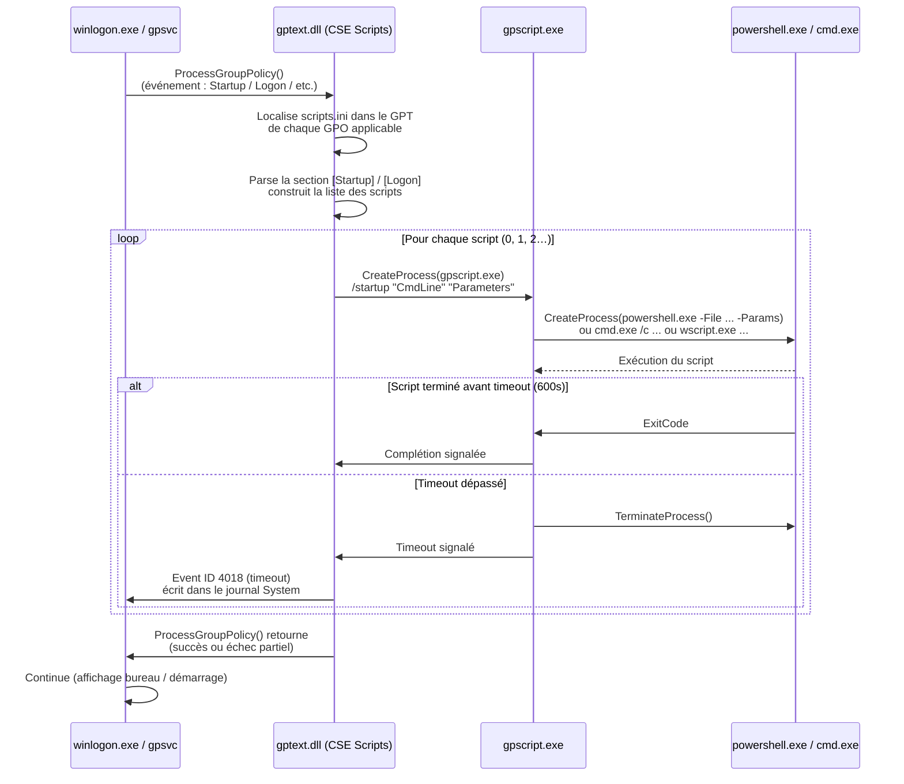

# Scripts et planification via GPO

!!! abstract "Ce que vous allez apprendre"
    - Les 4 types de scripts GPO (Startup, Shutdown, Logon, Logoff) — leur emplacement dans le GPT, leur fichier de configuration `scripts.ini`, et les GUIDs des CSE associées
    - Le format exact de `scripts.ini` : sections, clés numérotées, ordre d'exécution de scripts multiples
    - Le fonctionnement de `gpscript.exe` : processus lanceur, politique d'exécution PowerShell requise, timeout par défaut de 600 secondes et comment le modifier
    - Les valeurs de registre contrôlant le mode synchrone/asynchrone et l'impact sur l'expérience d'ouverture de session
    - GPP Scheduled Tasks : types disponibles, format XML dans SYSVOL, différences architecturales avec les scripts GPO, et pourquoi ce mécanisme est préférable pour les tâches longues
    - Les Event IDs opérationnels (4016, 4017, 4018) pour diagnostiquer les délais de logon imputables aux scripts

---

!!! tip "Si vous ne retenez qu'une chose"
    **Un script GPO Logon synchrone retarde l'ouverture de session jusqu'à sa complétion.** Si ce script dure 45 secondes, l'utilisateur attend 45 secondes devant un écran vide. La solution n'est pas de réduire le timeout — c'est de migrer vers une **GPP Scheduled Task de type Immediate**, qui s'exécute dans le contexte SYSTEM en tâche de fond, sans bloquer la session.

---

## :material-file-document-multiple-outline: Les 4 types de scripts GPO

### :material-layers-outline: Vue d'ensemble

Group Policy permet d'attacher des scripts à quatre événements du cycle de vie machine/utilisateur.

Deux événements sont liés à la **machine** : Startup (démarrage) et Shutdown (arrêt). Deux événements sont liés à l'**utilisateur** : Logon (ouverture de session) et Logoff (fermeture de session). Ces quatre points d'accroche correspondent à des CSE distinctes et à des emplacements distincts dans le GPT.

### :material-folder-outline: Emplacement dans le GPT

Les scripts sont stockés dans SYSVOL, à l'intérieur du dossier de la GPO :

```
\\<domain>\SYSVOL\<domain>\Policies\{GPO-GUID}\
  Machine\
    Scripts\
      Startup\         ← scripts de démarrage machine
      Shutdown\        ← scripts d'arrêt machine
      scripts.ini      ← configuration de tous les scripts machine
  User\
    Scripts\
      Logon\           ← scripts d'ouverture de session utilisateur
      Logoff\          ← scripts de fermeture de session utilisateur
      scripts.ini      ← configuration de tous les scripts utilisateur
```

Les fichiers de script eux-mêmes (`.bat`, `.ps1`, `.vbs`) doivent être copiés dans le sous-dossier correspondant à leur type. Si vous référencez un script par son nom seul dans `scripts.ini`, Windows le cherche dans ce sous-dossier. Vous pouvez aussi spécifier un chemin UNC absolu — le script n'a alors pas besoin d'être dans le GPT.

!!! info "Chemin UNC vs chemin relatif"
    Un chemin relatif (ex. : `Setup.ps1`) est résolu relativement au sous-dossier du type de script dans le GPT. Un chemin UNC absolu (ex. : `\\server\scripts\Setup.ps1`) est utilisé tel quel — le compte d'exécution doit avoir accès à ce partage.

### :material-identifier: GUIDs des CSE Scripts

Chaque type de script est géré par une CSE enregistrée sous `HKLM\SOFTWARE\Microsoft\Windows NT\CurrentVersion\Winlogon\GPExtensions\`.

| Type de script | GUID de la CSE | DLL |
|---|---|---|
| **Startup** (Machine) | `{42B5FAAE-6536-11D2-AE5A-0000F87571E3}` | `gptext.dll` |
| **Shutdown** (Machine) | `{42B5FAAE-6536-11D2-AE5A-0000F87571E3}` | `gptext.dll` |
| **Logon** (User) | `{42B5FAAE-6536-11D2-AE5A-0000F87571E3}` | `gptext.dll` |
| **Logoff** (User) | `{42B5FAAE-6536-11D2-AE5A-0000F87571E3}` | `gptext.dll` |

!!! info "Un seul GUID pour les quatre types"
    Les quatre types de scripts partagent le même GUID de CSE (`{42B5FAAE-6536-11D2-AE5A-0000F87571E3}`) et la même DLL `gptext.dll`. C'est la section dans `scripts.ini` qui détermine le type et le moment d'exécution — pas la CSE elle-même.

### :material-table: Comparatif des 4 types

| Type | Contexte | Compte d'exécution | Moment | Réseau disponible |
|---|---|---|---|---|
| **Startup** | Machine | SYSTEM | Démarrage, avant logon | Oui (réseau déjà actif) |
| **Shutdown** | Machine | SYSTEM | Arrêt, après logoff | Variable selon la vitesse d'arrêt |
| **Logon** | User | Utilisateur connecté | Ouverture de session | Oui |
| **Logoff** | User | Utilisateur connecté | Fermeture de session | Variable |

### :material-book-open-outline: Lecture de `scripts.ini` par la CSE

Au moment du traitement (Startup, Logon, etc.), `gpsvc` invoque `gptext.dll`. Celle-ci localise `scripts.ini` dans le GPT de chaque GPO applicable, lit la section correspondante au type d'événement, et lance `gpscript.exe` pour chaque script déclaré.

`gpscript.exe` est le processus intermédiaire responsable du lancement effectif. Il détermine le moteur à utiliser (cmd, PowerShell, wscript) en fonction de l'extension du script, et signale à `gpsvc` la complétion ou le timeout.

!!! quote "En résumé"
    - Quatre types de scripts GPO : Startup et Shutdown (machine, compte SYSTEM), Logon et Logoff (utilisateur).
    - Tous partagent la même CSE (`{42B5FAAE-6536-11D2-AE5A-0000F87571E3}`, `gptext.dll`).
    - Les scripts sont stockés dans `{GUID}/Machine/Scripts/{Type}/` ou `{GUID}/User/Scripts/{Type}/`.
    - La configuration est dans `scripts.ini`, lu par `gptext.dll`, exécuté via `gpscript.exe`.

---

## :material-file-cog-outline: Format de `scripts.ini`

### :material-code-tags: Structure générale

`scripts.ini` est un fichier INI standard avec quatre sections possibles, une par type de script.

```ini title="{GPO-GUID}/Machine/scripts.ini — structure de base"
[Startup]
0CmdLine=MonScript.ps1
0Parameters=-Mode Deploy -Verbose

[Shutdown]
0CmdLine=Cleanup.bat
0Parameters=
```

```ini title="{GPO-GUID}/User/scripts.ini — structure de base"
[Logon]
0CmdLine=MapDrives.ps1
0Parameters=-Env Prod

[Logoff]
0CmdLine=AuditSession.ps1
0Parameters=
```

### :material-numeric: Clés numérotées et ordre d'exécution

Chaque script dans une section est défini par deux clés numérotées : `NCmdLine=` (chemin du script) et `NParameters=` (paramètres à passer). La numérotation commence à `0` et est continue.

```ini title="{GPO-GUID}/Machine/scripts.ini — deux scripts Startup avec ordre explicite"
[Startup]
; Premier script : configuration réseau
0CmdLine=ConfigNetwork.ps1
0Parameters=-SiteCode PAR01

; Deuxième script : déploiement d'agent
1CmdLine=\\deploy.corp.local\agents\InstallAgent.ps1
1Parameters=-Silent -NoRestart
```

L'ordre d'exécution respecte la numérotation : `0` est exécuté avant `1`, `1` avant `2`, etc. Si une GPO de niveau supérieur et une GPO de niveau inférieur définissent toutes les deux des scripts Startup, ils sont fusionnés — les scripts de la GPO la plus haute dans LSDOU sont exécutés en **premier** pour Startup/Logon, et en **dernier** pour Shutdown/Logoff.

!!! warning "Numérotation discontinue = scripts manquants silencieux"
    Si vous avez `0CmdLine` et `2CmdLine` mais pas `1CmdLine`, `gptext.dll` s'arrête à `0` et n'exécute pas `2`. La numérotation doit être strictement continue et commencer à `0`. Ne modifiez jamais `scripts.ini` manuellement : laissez la GPMC gérer ce fichier.

### :material-magnify: Clés reconnues dans `scripts.ini`

| Clé | Description |
|---|---|
| `NCmdLine=` | Chemin du script (relatif au sous-dossier du type, ou UNC absolu) |
| `NParameters=` | Paramètres passés au script (peut être vide mais la clé doit exister) |

Les autres clés sont ignorées. Il n'y a pas de clé pour définir le timeout ou le compte d'exécution dans `scripts.ini` — ces comportements sont contrôlés par les Administrative Templates et les valeurs de registre Winlogon.

!!! warning "La clé `NParameters=` doit toujours être présente"
    Pour chaque script `NCmdLine=`, la clé `NParameters=` correspondante doit exister même si elle est vide. Un `0CmdLine` sans `0Parameters` peut provoquer un comportement indéfini selon la version de `gptext.dll`.

!!! quote "En résumé"
    - `scripts.ini` contient quatre sections possibles : `[Startup]`, `[Shutdown]`, `[Logon]`, `[Logoff]`.
    - Chaque script est défini par une paire `NCmdLine=` / `NParameters=` numérotée à partir de `0`.
    - L'ordre d'exécution respecte la numérotation — les trous dans la numérotation stoppent silencieusement l'exécution.
    - Ce fichier est géré exclusivement par la GPMC — ne l'éditez pas manuellement.

---

## :material-powershell: Scripts PowerShell dans le contexte GPO

### :material-shield-check-outline: Politique d'exécution requise

Par défaut, la politique d'exécution PowerShell sur les systèmes Windows est `Restricted` — aucun script n'est autorisé. Pour exécuter des scripts GPO en PowerShell, la politique doit être au minimum `RemoteSigned`.

La méthode recommandée est de la définir via GPO :

```
Computer Configuration
  └── Policies
        └── Administrative Templates
              └── Windows Components
                    └── Windows PowerShell
                          └── Turn on Script Execution
                                → Enabled : Allow local scripts and remote signed scripts
                                  (équivalent à RemoteSigned)
```

!!! warning "Ne jamais passer `-ExecutionPolicy Bypass` dans les paramètres"
    Certains guides recommandent d'ajouter `-ExecutionPolicy Bypass` dans le champ `NParameters=` de `scripts.ini`. Cette approche contourne la politique de sécurité de l'organisation et constitue une mauvaise pratique. Définissez la politique correctement via ADMX.

### :material-launch: Le processus `gpscript.exe`

`gpscript.exe` est le lanceur de scripts GPO. Il est invoqué par `gptext.dll` pour chaque script à exécuter.

Pour un script PowerShell, `gpscript.exe` construit et exécute une commande de la forme :

```bat title="Commande construite par gpscript.exe pour un script .ps1"
powershell.exe -NonInteractive -NoProfile -ExecutionPolicy RemoteSigned
  -File "\\domain\SYSVOL\domain\Policies\{GUID}\Machine\Scripts\Startup\MonScript.ps1"
  -Mode Deploy -Verbose
```

Pour un script `.bat` ou `.cmd`, il invoque `cmd.exe /c`. Pour un `.vbs`, il invoque `wscript.exe` ou `cscript.exe`.

`gpscript.exe` est visible dans le Gestionnaire des tâches et dans Process Monitor pendant la phase de traitement des scripts. Son PID parent est le processus `gpsvc` ou `winlogon.exe` selon le contexte.

### :material-timer-outline: Timeout par défaut : 600 secondes

Par défaut, `gpscript.exe` attend **600 secondes** (10 minutes) l'exécution de chaque script avant de considérer le traitement comme échoué. Si le script dépasse ce délai, il est terminé de force et un événement d'erreur est consigné.

Ce timeout est modifiable via GPO :

```
Computer Configuration
  └── Policies
        └── Administrative Templates
              └── System
                    └── Scripts
                          ├── Maximum wait time for Group Policy scripts
                          │     → Valeur en secondes (0 = attente infinie, déconseillé)
                          └── (Paramètres séparés pour Startup, Shutdown, Logon, Logoff)
```

!!! warning "Timeout à 0 : risque de blocage permanent"
    Définir le timeout à `0` (attente infinie) est dangereux. Un script qui se bloque sur une ressource réseau inaccessible peut bloquer indéfiniment le démarrage ou la session. Augmentez le timeout jusqu'à une valeur raisonnable plutôt que de le supprimer.

### :material-variable: Passer des paramètres à un script PowerShell

Les paramètres définis dans `NParameters=` sont transmis directement à la ligne de commande PowerShell. Ils doivent être compatibles avec la syntaxe `-File` de PowerShell — c'est-à-dire des paramètres nommés correspondant aux `param()` déclarés dans le script.

```powershell title="MonScript.ps1 — déclaration des paramètres attendus"
param(
    [string]$Mode = "Default",
    [switch]$Verbose
)

# Corps du script...
Write-EventLog -LogName Application -Source "GPO-Scripts" `
    -EventId 9000 -Message "Script executed in mode: $Mode"
```

```ini title="scripts.ini — passage des paramètres correspondants"
[Startup]
0CmdLine=MonScript.ps1
0Parameters=-Mode Deploy -Verbose
```

!!! info "Pas de guillemets dans NParameters pour les valeurs avec espaces"
    Si un paramètre contient des espaces, encadrez la valeur avec des guillemets dans `NParameters=` : `-Path "C:\Program Files\App"`. Les guillemets sont transmis tels quels à PowerShell.

!!! quote "En résumé"
    - La politique d'exécution PowerShell doit être `RemoteSigned` minimum — définissez-la via ADMX, pas en ligne de commande.
    - `gpscript.exe` est le processus lanceur ; il construit la commande PowerShell avec `-NonInteractive -NoProfile`.
    - Le timeout par défaut est de 600 secondes — modifiable via `Computer Configuration > Administrative Templates > System > Scripts`.
    - Les paramètres dans `NParameters=` sont transmis directement comme arguments `-File`.

---

## :material-sync: Scripts synchrones vs asynchrones

### :material-tune-variant: Valeurs de registre Winlogon

Le comportement synchrone ou asynchrone des scripts GPO est contrôlé par des valeurs DWORD sous :

```
HKLM\SOFTWARE\Microsoft\Windows NT\CurrentVersion\Winlogon
```

| Valeur | Type | Défaut | Effet |
|---|---|---|---|
| `RunStartupScriptSync` | REG_DWORD | `1` | `1` = Startup synchrone (bloque le logon) |
| `RunLogonScriptSync` | REG_DWORD | `0` | `1` = Logon synchrone (bloque l'affichage du bureau) |
| `RunShutdownScriptSync` | REG_DWORD | `1` | `1` = Shutdown synchrone (bloque l'arrêt) |

Ces valeurs sont **écrites par la GPO** via les Administrative Templates (`System > Scripts`) — ne les modifiez pas directement dans le registre sans GPO associée, car un refresh GPO les écrasera.

```powershell title="Lire l'état de synchronicité des scripts sur un poste"
Get-ItemProperty `
    "HKLM:\SOFTWARE\Microsoft\Windows NT\CurrentVersion\Winlogon" |
    Select-Object RunStartupScriptSync, RunLogonScriptSync, RunShutdownScriptSync
```

```powershell title="Résultat attendu"
RunStartupScriptSync  RunLogonScriptSync  RunShutdownScriptSync
--------------------  ------------------  ---------------------
                   1                   0                      1
```

### :material-check-circle-outline: Mode synchrone : comportement

En mode **synchrone**, Windows attend la complétion de tous les scripts du type concerné avant de continuer.

Pour **Startup synchrone** (`RunStartupScriptSync=1`) : la machine ne présente pas l'écran de logon tant que tous les scripts Startup ne sont pas terminés. L'utilisateur voit l'écran "Applying computer settings..." pendant toute la durée.

Pour **Logon synchrone** (`RunLogonScriptSync=1`) : le bureau de l'utilisateur n'est pas affiché tant que tous les scripts Logon ne sont pas terminés. L'utilisateur voit l'écran "Applying your settings..." pendant toute la durée.

### :material-alpha-a-circle-outline: Mode asynchrone : comportement

En mode **asynchrone** (défaut pour Logon), les scripts sont lancés en arrière-plan. Le bureau apparaît immédiatement et les scripts continuent de s'exécuter en parallèle.

L'impact visible est minimal pour l'utilisateur. Mais si le script doit produire un effet visible avant que l'utilisateur interagisse (mapper un lecteur réseau, créer un fichier de configuration), il peut ne pas être terminé au moment où l'utilisateur en a besoin.

### :material-alert-outline: Quand le mode asynchrone est dangereux

Certaines tâches **doivent impérativement être terminées** avant que l'utilisateur accède au bureau :

- Mappage de lecteurs réseau utilisés par des applications lancées au démarrage
- Configuration de proxy requise pour l'accès à l'intranet
- Création de profil ou de répertoire utilisateur absent

Pour ces cas, le script doit être synchrone — ou migré vers une GPP Scheduled Task de type **Immediate** qui s'exécute dans le contexte SYSTEM sans impacter le logon.

!!! warning "Logon synchrone sur VPN ou lien lent"
    Un script Logon synchrone qui accède à une ressource réseau distante via VPN peut bloquer la session pendant plusieurs minutes si la latence est élevée ou si le VPN n'est pas encore établi. Testez toujours vos scripts dans les conditions réseau les plus défavorables de votre parc.

!!! quote "En résumé"
    - `RunStartupScriptSync=1` (défaut) : Startup synchrone — bloque l'affichage du logon.
    - `RunLogonScriptSync=0` (défaut) : Logon asynchrone — le bureau s'affiche sans attendre la fin des scripts.
    - Le mode synchrone est requis pour les scripts dont la complétion est une précondition à l'utilisation du bureau.
    - Ces valeurs sont écrites par les ADMX `System > Scripts` — ne les modifiez pas directement.

---

## :material-chart-timeline-variant: Cycle de vie de gpscript.exe

Le diagramme suivant illustre le flux complet depuis l'appel de `gpsvc` jusqu'à la complétion ou l'expiration du timeout.



!!! info "gpscript.exe est un processus éphémère"
    `gpscript.exe` est créé pour chaque script et se termine dès que le script est fini ou en timeout. Il ne reste pas résident en mémoire. En mode synchrone, `gptext.dll` attend la fin du processus `gpscript.exe` avant de lancer le suivant.

---

## :material-calendar-clock: GPP Scheduled Tasks

### :material-layers-triple-outline: Pourquoi GPP Scheduled Tasks plutôt que scripts GPO

Les scripts GPO (Startup/Logon) présentent des limitations architecturales importantes :

- Ils s'exécutent dans un seul contexte temporel défini par l'événement système.
- Ils bloquent la session en mode synchrone.
- Ils ne supportent pas de déclencheurs avancés (délai, heure précise, inactivité).
- Ils n'offrent aucun reporting natif.

Les **GPP Scheduled Tasks** (Group Policy Preferences > Scheduled Tasks) permettent de créer, modifier ou supprimer des tâches planifiées Windows via GPO, avec toute la puissance du moteur de tâches planifiées Windows.

### :material-tag-multiple-outline: Types de tâches GPP

La GPMC propose plusieurs types de tâches dans `Computer/User Configuration > Preferences > Control Panel Settings > Scheduled Tasks` :

| Type | Comportement | Déclencheur |
|---|---|---|
| **Immediate Task** (Windows Vista+) | S'exécute **une seule fois dès l'application de la GPO** | Immédiat (à chaque refresh GPO si non marqué "run once") |
| **Scheduled Task** (Windows Vista+) | Tâche planifiée standard — déclencheurs multiples | Heure, événement, démarrage, session, inactivité |
| **On Demand Task** | Exécution manuelle via `schtasks /run` | Sur demande uniquement |
| **At Log On** | Exécution à chaque logon | Ouverture de session |
| **At Startup** | Exécution au démarrage système | Démarrage Windows |

!!! info "Immediate Task : le couteau suisse du déploiement"
    Le type **Immediate Task** est exécuté dès que la GPO est appliquée lors du prochain refresh. Contrairement à un script Startup qui attend le prochain redémarrage, une Immediate Task s'exécute dans les 90 à 120 minutes suivant sa création si le poste est allumé. C'est le mécanisme de déploiement ponctuel le plus réactif sans reboot.

### :material-xml: Format XML dans SYSVOL

Les tâches GPP sont stockées dans SYSVOL sous forme de fichiers XML :

```
\\<domain>\SYSVOL\<domain>\Policies\{GPO-GUID}\
  Machine\
    Preferences\
      ScheduledTasks\
        ScheduledTasks.xml
  User\
    Preferences\
      ScheduledTasks\
        ScheduledTasks.xml
```

Exemple de `ScheduledTasks.xml` pour une Immediate Task PowerShell exécutée en SYSTEM :

```xml title="{GPO-GUID}/Machine/Preferences/ScheduledTasks/ScheduledTasks.xml"
<?xml version="1.0" encoding="utf-8"?>
<ScheduledTasks clsid="{CC63F200-7309-4ba0-B154-A0CE60491FE6}">
  <ImmediateTaskV2
    clsid="{9756B581-76EC-4169-9AFC-0CA8D43ADB5F}"
    name="Deploy-AgentCorp"
    image="0"
    changed="2025-03-01 09:00:00"
    uid="{A1B2C3D4-E5F6-7890-ABCD-EF1234567890}"
    userContext="0"
    removePolicy="0">
    <Properties
      action="C"
      name="Deploy-AgentCorp"
      runAs="NT AUTHORITY\System"
      logonType="S4U">
      <Task version="1.3">
        <RegistrationInfo>
          <Author>CORP\gpo-admin</Author>
          <Description>Deploy monitoring agent via GPO</Description>
        </RegistrationInfo>
        <Principals>
          <Principal id="Author">
            <UserId>NT AUTHORITY\System</UserId>
            <RunLevel>HighestAvailable</RunLevel>
          </Principal>
        </Principals>
        <Settings>
          <MultipleInstancesPolicy>IgnoreNew</MultipleInstancesPolicy>
          <DisallowStartIfOnBatteries>false</DisallowStartIfOnBatteries>
          <StopIfGoingOnBatteries>false</StopIfGoingOnBatteries>
          <ExecutionTimeLimit>PT30M</ExecutionTimeLimit>
        </Settings>
        <Actions>
          <Exec>
            <Command>powershell.exe</Command>
            <Arguments>-NonInteractive -NoProfile -ExecutionPolicy RemoteSigned
              -File "\\deploy.corp.local\scripts\Install-Agent.ps1" -Silent</Arguments>
          </Exec>
        </Actions>
      </Task>
    </Properties>
  </ImmediateTaskV2>
</ScheduledTasks>
```

!!! warning "Ne jamais éditer ScheduledTasks.xml manuellement"
    Ce fichier est généré et maintenu par la GPMC. Une modification manuelle peut corrompre le GUID de l'item, provoquer des erreurs de parsing par `gpprefcl.dll`, ou désynchroniser l'état entre le fichier XML et les attributs GPO dans AD.

### :material-compare-horizontal: GPP Scheduled Tasks vs Scripts GPO

| Critère | Scripts GPO | GPP Scheduled Tasks |
|---|---|---|
| **Déclencheurs** | Startup, Shutdown, Logon, Logoff uniquement | Démarrage, session, heure, événement, inactivité, immédiat |
| **Compte d'exécution** | SYSTEM (machine) ou utilisateur (user) | SYSTEM, utilisateur spécifique, service account |
| **Timeout configurable** | Oui (via ADMX, global) | Oui (par tâche, `ExecutionTimeLimit`) |
| **Impact sur le logon** | Oui si synchrone | Aucun (s'exécute en tâche de fond) |
| **Déclenchement sans reboot** | Non — attend l'événement système | Oui — Immediate Task au prochain refresh GPO |
| **Visibilité dans le planificateur** | Non (gpscript.exe, éphémère) | Oui — visible dans Task Scheduler |
| **Reporting** | Event Log uniquement | Task Scheduler + Event Log |
| **Suppression automatique** | Non | Configurable (`removePolicy`) |

### :material-account-cog-outline: Options de compte d'exécution

Les GPP Scheduled Tasks offrent plusieurs options pour le compte sous lequel la tâche s'exécute :

- **NT AUTHORITY\System** : recommandé pour les tâches d'infrastructure (installation, configuration système). Accès complet à la machine locale, mais pas d'accès aux ressources réseau avec l'identité de la machine.
- **Utilisateur connecté** (`logonType="InteractiveToken"`) : la tâche s'exécute dans le contexte de la session courante — utile pour les tâches utilisateur avec accès à la session graphique.
- **Compte de service** : un compte de service AD dédié — requis si la tâche doit accéder à des ressources réseau authentifiées (partages, bases de données).

!!! info "NT AUTHORITY\System et les ressources réseau"
    Une tâche exécutée en SYSTEM peut accéder aux ressources réseau **via le compte machine** (`DOMAIN\COMPUTERNAME$`). Si le partage cible accorde des permissions au compte machine ou à un groupe de machines, l'accès est possible. Sinon, utilisez un compte de service dédié.

### :material-play-circle-outline: Exemple complet : PowerShell en SYSTEM au démarrage

Scénario : déployer un agent de supervision lors du démarrage, sans bloquer la session.

Dans la GPMC :

```
Computer Configuration
  └── Preferences
        └── Control Panel Settings
              └── Scheduled Tasks
                    └── Clic droit → New → Immediate Task (Windows Vista and later)
                          → General : Run as NT AUTHORITY\System, Run whether user is logged on or not
                          → Actions : powershell.exe
                            Arguments : -NonInteractive -NoProfile -ExecutionPolicy RemoteSigned
                                        -File "\\deploy.corp.local\scripts\Install-Agent.ps1" -Silent
                          → Settings : Stop task if it runs longer than 30 minutes
```

Vérification sur le poste cible :

```powershell title="Vérifier la création de la tâche sur le poste cible"
Get-ScheduledTask -TaskName "Deploy-AgentCorp" |
    Select-Object TaskName, State, @{n="LastRunTime";e={$_.LastRunTime}},
                  @{n="LastResult";e={$_.LastTaskResult}}
```

```powershell title="Résultat attendu"
TaskName         State    LastRunTime          LastResult
--------         -----    -----------          ----------
Deploy-AgentCorp Ready    2025-03-01 09:14:32           0
```

Un `LastResult` de `0` indique une exécution réussie (`0x00000000 = S_OK`).

!!! quote "En résumé"
    - GPP Scheduled Tasks offre des déclencheurs, des comptes d'exécution et un reporting bien supérieurs aux scripts GPO.
    - Le type **Immediate Task** s'exécute sans attendre un redémarrage ou un logon — au prochain refresh GPO.
    - Les tâches sont stockées dans `{GUID}/Machine/Preferences/ScheduledTasks/ScheduledTasks.xml`.
    - Pour les opérations d'infrastructure longues ou potentiellement lentes, GPP Scheduled Tasks est toujours préférable aux scripts Startup/Logon synchrones.

---

## :material-magnify-scan: Event IDs pour le diagnostic des scripts

### :material-table: Tableau des Event IDs Scripts CSE

Les événements liés au traitement des scripts GPO sont enregistrés dans le journal `System` (pour les scripts Machine) et `Application` (pour certains scripts utilisateur), sous la source `Microsoft-Windows-GroupPolicy`.

| Event ID | Journal | Source | Signification |
|---|---|---|---|
| `4016` | System / Application | GroupPolicy | Début du traitement par la CSE Scripts |
| `4017` | System / Application | GroupPolicy | Fin du traitement par la CSE Scripts |
| `4018` | System / Application | GroupPolicy | **Timeout** — un script a dépassé le délai maximum |
| `5308` | System | GroupPolicy | Traitement des scripts ignoré (lien lent détecté) |

### :material-clock-alert-outline: Analyser les délais de logon avec Event ID 4018

L'Event ID `4018` contient les informations critiques pour identifier le script incriminé et la durée dépassée.

```
Log Name:    System
Source:      Microsoft-Windows-GroupPolicy
Event ID:    4018
Level:       Error
Description: The Group Policy Scripts Client Side Extension timed out
             (600 seconds) while processing Logon script for user CORP\jdoe.
             The script was: \\corp.local\SYSVOL\corp.local\Policies\
             {A1B2C3D4-...}\User\Scripts\Logon\MapDrives.ps1
```

### :material-timer-check-outline: Mesurer la durée réelle avec les Event IDs 4016 et 4017

Les Event IDs `4016` (début) et `4017` (fin) permettent de calculer la durée exacte du traitement de la CSE Scripts.

```powershell title="Calculer la durée de traitement des scripts au dernier logon"
$start = Get-WinEvent -LogName System |
    Where-Object { $_.Id -eq 4016 -and $_.ProviderName -eq "Microsoft-Windows-GroupPolicy" } |
    Sort-Object TimeCreated -Descending |
    Select-Object -First 1

$end = Get-WinEvent -LogName System |
    Where-Object { $_.Id -eq 4017 -and $_.ProviderName -eq "Microsoft-Windows-GroupPolicy" } |
    Sort-Object TimeCreated -Descending |
    Select-Object -First 1

$duration = $end.TimeCreated - $start.TimeCreated
Write-Output "Scripts CSE duration: $($duration.TotalSeconds) seconds"
```

```powershell title="Résultat attendu"
Scripts CSE duration: 47.38 seconds
```

!!! info "Event ID 4016 et 4017 dans le journal opérationnel"
    Sur les systèmes récents, les Event IDs les plus détaillés se trouvent dans le journal analytique **Microsoft-Windows-GroupPolicy/Operational** (`Applications and Services Logs > Microsoft > Windows > GroupPolicy > Operational`). Ce journal doit être activé manuellement s'il ne l'est pas.

```powershell title="Activer le journal opérationnel GroupPolicy si absent"
wevtutil set-log "Microsoft-Windows-GroupPolicy/Operational" /enabled:true
```

### :material-alert-circle-outline: Corrélation avec le délai perçu par l'utilisateur

En mode Logon synchrone, la durée entre les Event IDs `4016` et `4017` (ou le timeout `4018`) correspond exactement au délai que l'utilisateur perçoit entre la saisie de ses credentials et l'apparition du bureau.

Un délai > 10 secondes mérite investigation. Un délai > 30 secondes est un incident de niveau 2.

!!! quote "En résumé"
    - Event ID `4016` / `4017` : début et fin du traitement de la CSE Scripts — permettent de mesurer la durée exacte.
    - Event ID `4018` : timeout — contient le nom du script, le type d'événement, et l'utilisateur concerné.
    - Le journal `Microsoft-Windows-GroupPolicy/Operational` fournit le détail le plus fin — activez-le sur les postes de diagnostic.
    - La durée `4016`→`4017` en logon synchrone = délai ressenti par l'utilisateur.

---

## :material-bug-outline: Piège de production : logon bloqué par un script lent

### :material-alert-decagram-outline: Symptôme

Un parc de 300 postes présente un délai d'ouverture de session systématique de 35 à 50 secondes après l'entrée des credentials. L'écran "Applying your settings..." reste affiché pendant toute cette durée. Le phénomène est apparu après le déploiement d'un nouveau script Logon GPO il y a deux semaines.

### :material-magnify: Diagnostic

**Étape 1 : Identifier le délai dans les Event Logs.**

Sur un poste affecté, dans le journal `System` (source `Microsoft-Windows-GroupPolicy`) :

```powershell title="Trouver les events Scripts CSE du dernier logon"
Get-WinEvent -LogName System -MaxEvents 500 |
    Where-Object {
        $_.ProviderName -eq "Microsoft-Windows-GroupPolicy" -and
        $_.Id -in @(4016, 4017, 4018)
    } |
    Select-Object TimeCreated, Id, Message |
    Sort-Object TimeCreated
```

```powershell title="Résultat attendu"
TimeCreated           Id   Message
-----------           --   -------
2025-03-15 08:42:11  4016  The Group Policy Scripts Client Side Extension...
2025-03-15 08:42:56  4017  The Group Policy Scripts Client Side Extension...
```

La différence : **45 secondes**. C'est le temps que prend la CSE Scripts à traiter tous les scripts Logon.

**Étape 2 : Identifier le script responsable.**

Avec le journal opérationnel activé, les Event IDs `5000`–`5010` détaillent chaque script individuel et sa durée.

```powershell title="Isoler les scripts lents dans le journal opérationnel"
Get-WinEvent -LogName "Microsoft-Windows-GroupPolicy/Operational" |
    Where-Object { $_.Message -match "script" -and $_.Level -ne 4 } |
    Select-Object TimeCreated, Id, Message |
    Sort-Object TimeCreated -Descending |
    Select-Object -First 20
```

Le résultat pointe vers `MapNetworkDrives.ps1` — un script qui tente de mapper 8 lecteurs réseau via des chemins UNC vers un serveur de fichiers distant, avec un timeout de connexion de 5 secondes par lecteur.

**Étape 3 : Confirmer la cause.**

Le script `MapNetworkDrives.ps1` effectue une résolution DNS pour chaque serveur de fichiers et attend une réponse réseau. Sur des sites distants avec une latence WAN élevée, cela prend 4 à 6 secondes par lecteur × 8 lecteurs = 32 à 48 secondes.

### :material-wrench-check-outline: Résolution

**Option 1 (recommandée) : Migrer vers une GPP Drive Map.**

La GPP `Drive Maps` est conçue exactement pour ce cas d'usage. Elle s'exécute en arrière-plan (asynchrone par design), supporte l'Item-Level Targeting, et ne bloque pas le logon.

```
User Configuration
  └── Preferences
        └── Windows Settings
              └── Drive Maps
                    └── New → Mapped Drive
                          Action : Create
                          Location : \\server\share
                          Drive Letter : H
                          Label : Profil (H:)
                          Connect As : (laisser vide pour l'utilisateur connecté)
```

**Option 2 (si le script doit rester) : Le convertir en GPP Scheduled Task asynchrone.**

Si le script contient une logique complexe qui ne peut pas être remplacée par une Drive Map native :

1. Supprimer le script du nœud `User Configuration > Policies > Windows Settings > Scripts > Logon`.
2. Créer une **GPP Scheduled Task de type Immediate Task** dans `User Configuration > Preferences > Control Panel Settings > Scheduled Tasks`.
3. Configurer l'action : `powershell.exe -NonInteractive -NoProfile -ExecutionPolicy RemoteSigned -File "\\server\scripts\MapNetworkDrives.ps1"`.
4. Compte d'exécution : utilisateur connecté (`logonType="InteractiveToken"`).

La tâche s'exécute en arrière-plan pendant que le bureau se charge. Les lecteurs réseau seront disponibles quelques secondes après l'apparition du bureau — délai imperceptible pour l'utilisateur.

!!! warning "Immediate Task en contexte utilisateur : la session doit exister"
    Une Immediate Task configurée dans `User Configuration` s'exécute dans le contexte de la session de l'utilisateur. Si la tâche est créée alors qu'aucun utilisateur n'est connecté, elle sera en attente jusqu'au prochain logon. Ce comportement est attendu et correct.

**Option 3 (si le script Logon doit rester synchrone) : Optimiser le script.**

Si la synchronicité est indispensable (ex. : mappage requis avant le lancement d'une application de démarrage) :

- Remplacer les timeouts de connexion par des tests préalables (`Test-NetConnection` avec `-InformationLevel Quiet -Count 1`).
- Paralléliser les mappages avec `Start-Job` ou `ForEach-Object -Parallel` (PowerShell 7+).
- Supprimer les mappages de lecteurs inutilisés du script.

!!! quote "En résumé"
    - Un script Logon synchrone qui prend 45 secondes bloque la session 45 secondes — Event ID `4016`/`4017` mesure ce délai exactement.
    - La migration vers **GPP Drive Maps** est la solution la plus propre pour les mappages réseau.
    - Si le script doit rester, une **GPP Immediate Task en contexte utilisateur** l'exécute en arrière-plan sans bloquer le logon.
    - Toujours mesurer avant d'optimiser : les Event IDs `4016` et `4017` fournissent la durée exacte.

---

## :material-link-variant: Voir aussi

- [03 — Client-Side Extensions (CSE)](03-cse.md) — structure interne de la CSE Scripts (`gptext.dll`), cycle de déclenchement, valeurs de registre `GPExtensions`
- [07 — Traitement des GPO](07-traitement.md) — contexte du traitement synchrone vs asynchrone, foreground vs background, impact sur les CSE
- [11 — Preferences GPP](11-preferences-gpp.md) — architecture GPP, Drive Maps, ScheduledTasks XML, Item-Level Targeting
