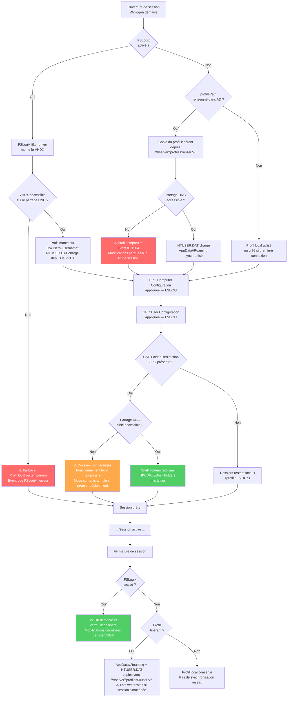

# Redirection de dossiers et profils via GPO

!!! abstract "Ce que vous allez apprendre"
    - Le rôle des CSE Folder Redirection (`{25537BA6-77A8-11D2-9B6C-0000F8080861}`) et Offline Files (`{C631DF4C-088F-4156-B058-4375F0853CD8}`), leur format XML dans le GPT et leur interaction
    - Les 9 dossiers redirectibles, leurs chemins de registre sous `HKCU\Software\Microsoft\Windows\CurrentVersion\Explorer\Shell Folders`, la redirection de base et avancée (par groupe)
    - Le mécanisme des profils itinérants (Roaming Profiles) : attribut `profilePath`, extension `.V6`, fichier `NTUSER.DAT`, comportement de fusion à la déconnexion, Event IDs clés
    - Les profils obligatoires : renommage en `ntuser.man`, comportement en lecture seule, cas d'usage kiosk, piège des fichiers `.LOG`
    - FSLogix Profile Container : VHD/VHDX monté à l'ouverture de session, clés de registre `HKLM\SOFTWARE\FSLogix\Profiles\`, déploiement via préférences de registre GPO
    - L'architecture cible correcte : FSLogix + redirection de dossiers pour les Documents (pourquoi les deux ensemble)
    - Les pièges de production : perte de données avec "Move contents", profil itinérant non borné, conflits de version `.V2`/`.V6`

!!! tip "Si vous ne retenez qu'une chose"
    La redirection de dossiers et les profils itinérants répondent à des besoins distincts. La redirection déplace des **données** (Documents, Desktop) vers un UNC — elles restent sur le serveur de fichiers, le profil local ne les contient pas. Le profil itinérant déplace le **profil entier** (`NTUSER.DAT` + `AppData\Roaming`) d'une machine à l'autre. Les deux peuvent coexister, et avec FSLogix c'est l'architecture recommandée pour les environnements multi-sessions.

---

## :material-folder-sync-outline: CSE Folder Redirection et Offline Files

### :material-identifier: GUIDs et enregistrement

Deux CSE interviennent dans la redirection de dossiers. Elles sont distinctes et ont des rôles complémentaires.

| CSE | GUID | DLL | Rôle |
|-----|------|-----|------|
| Folder Redirection | `{25537BA6-77A8-11D2-9B6C-0000F8080861}` | `fdeploy.dll` | Lit la configuration XML et redirige les Shell Folders |
| Offline Files | `{C631DF4C-088F-4156-B058-4375F0853CD8}` | `cscui.dll` | Configure la mise en cache hors connexion du partage cible |

Les entrées de registre de ces CSE se trouvent sous :

```
HKLM\SOFTWARE\Microsoft\Windows NT\CurrentVersion\Winlogon\GPExtensions\
  {25537BA6-77A8-11D2-9B6C-0000F8080861}   ← Folder Redirection
  {C631DF4C-088F-4156-B058-4375F0853CD8}   ← Offline Files
```

### :material-file-xml-box: Format XML dans le GPT

La configuration de la redirection n'est pas stockée dans `registry.pol`. Elle est stockée dans un fichier XML dédié dans le GPT (Group Policy Template) de la GPO, au chemin :

```
\\<domaine>\SYSVOL\<domaine>\Policies\{GPO-GUID}\
  User\Documents & Settings\fdeploy.ini   ← format legacy (Windows 2000/XP)
  User\Documents & Settings\<GUID>.xml    ← format actuel (Vista+)
```

Le fichier XML est nommé avec le GUID de la CSE Folder Redirection. La CSE `fdeploy.dll` le lit lors du traitement User Configuration et effectue les redirections.

```xml title="Extrait d'un fichier de configuration Folder Redirection"
<GPFolderRedirectionPolicy>
  <FolderRedirectionPolicy>
    <Id>{FOLDERID_Documents}</Id>
    <FolderRedirectionType>Basic</FolderRedirectionType>
    <GrantUserExclusiveRights>true</GrantUserExclusiveRights>
    <MoveContents>true</MoveContents>
    <RedirectToLocal>false</RedirectToLocal>
    <TargetPath>\\fileserver\redirections\%username%\Documents</TargetPath>
  </FolderRedirectionPolicy>
</GPFolderRedirectionPolicy>
```

### :material-link-variant: Interaction entre les deux CSE

La CSE Folder Redirection redirige le chemin. La CSE Offline Files configure la disponibilité hors ligne du chemin UNC cible.

L'interaction est importante : si Offline Files est désactivé par GPO sur le chemin cible, les dossiers redirigés ne sont disponibles que lorsque le partage réseau est accessible. Un UNC inaccessible à l'ouverture de session = profil incomplet.

!!! warning "Offline Files et les serveurs RDS"
    Sur les serveurs RDS, Offline Files doit être **désactivé** (GPO Computer Configuration → Administrative Templates → Network → Offline Files → Allow or Disallow use of the Offline Files feature). Les serveurs RDS n'ont pas vocation à mettre en cache des données localement. Activer Offline Files sur un RDS génère une consommation disque croissante et des conflits de synchronisation.

!!! quote "En résumé"
    La CSE Folder Redirection (`fdeploy.dll`) lit un fichier XML dans le GPT et réécrit les Shell Folders de l'utilisateur. La CSE Offline Files gère la disponibilité hors ligne des chemins UNC résultants. Les deux sont distinctes : l'une configure *où* vont les dossiers, l'autre configure *si* ils sont disponibles sans réseau.

---

## :material-folder-multiple-outline: Dossiers redirectibles

### :material-table: Les 9 dossiers et leurs chemins de registre

Windows expose neuf dossiers redirectibles via GPO. Tous écrivent leur chemin effectif sous la clé de registre `HKCU\Software\Microsoft\Windows\CurrentVersion\Explorer\Shell Folders` (et la clé miroir `User Shell Folders` pour les chemins persistants).

| Dossier Shell | FOLDERID | Valeur registre (`Shell Folders`) | Chemin par défaut |
|---------------|----------|----------------------------------|-------------------|
| Documents | `FOLDERID_Documents` | `Personal` | `%USERPROFILE%\Documents` |
| Desktop | `FOLDERID_Desktop` | `Desktop` | `%USERPROFILE%\Desktop` |
| AppData (Roaming) | `FOLDERID_RoamingAppData` | `AppData` | `%USERPROFILE%\AppData\Roaming` |
| Start Menu | `FOLDERID_StartMenu` | `Start Menu` | `%USERPROFILE%\AppData\Roaming\Microsoft\Windows\Start Menu` |
| Favorites | `FOLDERID_Favorites` | `Favorites` | `%USERPROFILE%\Favorites` |
| Music | `FOLDERID_Music` | `My Music` | `%USERPROFILE%\Music` |
| Pictures | `FOLDERID_Pictures` | `My Pictures` | `%USERPROFILE%\Pictures` |
| Videos | `FOLDERID_Videos` | `My Video` | `%USERPROFILE%\Videos` |
| Contacts | `FOLDERID_Contacts` | `Contacts` | `%USERPROFILE%\Contacts` |

!!! info "Vérification des chemins effectifs après redirection"
    Après application de la GPO, les valeurs de `HKCU\Software\Microsoft\Windows\CurrentVersion\Explorer\User Shell Folders` doivent pointer vers les UNC cibles. La clé `Shell Folders` est mise à jour dynamiquement par Explorer. Une discordance entre les deux clés indique un problème d'application de la CSE.

### :material-cog-outline: Chemin UNC cible

La convention recommandée est d'inclure `%username%` dans le chemin pour garantir l'isolation entre utilisateurs :

```
\\fileserver\redirections\%username%\Documents
\\fileserver\redirections\%username%\Desktop
```

La variable `%username%` est résolue par la CSE au moment de l'application, pas par le shell. Le partage `redirections` doit avoir les permissions NTFS correctes.

```
NTFS sur \\fileserver\redirections :
  Admins du domaine : Contrôle total
  Utilisateurs du domaine : Lecture et exécution (sur le dossier racine uniquement)
  CREATOR OWNER : Contrôle total (hérité sur sous-dossiers et fichiers)
```

L'option **"Grant user exclusive rights"** dans la GPO configure automatiquement les ACL NTFS pour que seul l'utilisateur concerné accède à son dossier. Ce mode est recommandé en production.

### :material-source-branch: Redirection de base vs redirection avancée

La **redirection de base** envoie tous les utilisateurs vers le même chemin UNC (avec `%username%` pour l'isolation).

La **redirection avancée** permet de cibler un UNC différent selon le groupe de sécurité de l'utilisateur.

```
Groupe "Finance-Users"  → \\fileserver-finance\redirections\%username%\Documents
Groupe "IT-Users"       → \\fileserver-it\redirections\%username%\Documents
Groupe "Everyone else"  → \\fileserver\redirections\%username%\Documents
```

!!! info "Evaluation des groupes en redirection avancée"
    L'évaluation se fait côté client, au moment où la CSE s'exécute. La CSE appelle `CheckTokenMembership` pour chaque groupe listé dans la configuration avancée, dans l'ordre défini. Le premier groupe qui correspond est utilisé. Si aucun groupe ne correspond et qu'un fallback n'est pas configuré, le dossier n'est pas redirigé.

### :material-transfer: Migration de contenu ("Move contents")

L'option **"Move the contents of [folder] to the new location"** demande à la CSE de déplacer les fichiers existants du profil local vers le nouveau chemin UNC lors de la première application.

C'est le comportement attendu en déploiement initial. C'est aussi le piège le plus dangereux en production.

!!! warning "Move contents + UNC inaccessible = perte de données potentielle"
    Si la CSE tente de déplacer les fichiers et que le partage UNC est inaccessible ou plein, la migration peut se terminer partiellement. Des fichiers auront été supprimés du profil local mais pas copiés sur le partage. Windows ne restitue pas automatiquement les données non migrées. Avant tout déploiement avec "Move contents", vérifier que le partage est accessible, dimensionné correctement et que les permissions NTFS sont en place. Tester sur un pilote avec des comptes non critiques.

!!! quote "En résumé"
    Neuf dossiers sont redirectibles via GPO Folder Redirection. Chacun écrit son chemin effectif dans `HKCU\Software\Microsoft\Windows\CurrentVersion\Explorer\Shell Folders`. La redirection avancée permet des cibles différentes par groupe de sécurité. L'option "Move contents" migre les données existantes mais doit être testée soigneusement — un UNC inaccessible au moment de la migration peut causer une perte de données partielle.

---

## :material-account-sync: Profils itinérants (Roaming Profiles)

### :material-account-cog: Configuration sur l'objet utilisateur AD

Le profil itinérant est activé en renseignant l'attribut `profilePath` sur le compte utilisateur Active Directory.

```powershell title="Configurer le chemin de profil itinérant via PowerShell"
# Set roaming profile path for a single user
Set-ADUser -Identity "jdupont" `
           -ProfilePath "\\fileserver\profiles$\jdupont"

# Bulk configuration — all users in an OU
Get-ADUser -Filter * -SearchBase "OU=Users,DC=contoso,DC=com" | ForEach-Object {
    Set-ADUser -Identity $_ -ProfilePath "\\fileserver\profiles$\$($_.SamAccountName)"
}
```

```powershell title="Résultat attendu"
# Verify the attribute was written correctly
Get-ADUser -Identity "jdupont" -Properties ProfilePath | Select-Object Name, ProfilePath

# Expected output:
# Name     ProfilePath
# ----     -----------
# jdupont  \\fileserver\profiles$\jdupont
```

### :material-tag-outline: Extension de version du profil

Windows ajoute automatiquement un suffixe de version au dossier de profil sur le partage, selon la version du système d'exploitation.

| Version Windows | Extension | Dossier sur le partage |
|----------------|-----------|------------------------|
| Windows XP / 2003 | (aucune) | `jdupont` |
| Windows Vista / 7 / 2008 R2 | `.V2` | `jdupont.V2` |
| Windows 8 / 2012 | `.V3` | `jdupont.V3` |
| Windows 8.1 / 2012 R2 | `.V4` | `jdupont.V4` |
| Windows 10 / 2016 / 2019 / 2022 | `.V6` | `jdupont.V6` |
| Windows 11 | `.V6` | `jdupont.V6` |

!!! warning "Piège de migration : conflit de version"
    Si `profilePath` pointe vers `\\fileserver\profiles$\jdupont` et que le partage contient à la fois `jdupont.V2` (Windows 7) et `jdupont.V6` (Windows 10), les deux coexistent sans interférence. En revanche, si un administrateur renomme manuellement un dossier `.V2` en `.V6` pour "récupérer" un ancien profil, les paramètres d'application incompatibles (ruches de registre différentes) corrompront la session ou provoqueront des crashs d'applications.

### :material-database: La ruche NTUSER.DAT

Le profil itinérant synchronise le dossier `AppData\Roaming` et le fichier `NTUSER.DAT` (la ruche de registre HKCU de l'utilisateur).

À l'ouverture de session, Windows charge `NTUSER.DAT` depuis le partage. À la fermeture de session, il copie la ruche locale modifiée vers le partage.

Le comportement en cas de conflit (même compte ouvert sur deux machines simultanément) est déterminé par le mécanisme de **"last writer wins"** : le dernier profil fermé écrase le profil sur le partage. Les modifications effectuées sur la première machine sont perdues.

!!! warning "Sessions simultanées et perte de modifications"
    Les profils itinérants ne gèrent pas les conflits de session multi-machine. Si un utilisateur a une session ouverte sur MACHINE-A et en ouvre une seconde sur MACHINE-B, la fermeture de MACHINE-B écrasera les modifications de MACHINE-A sur le partage. Ce problème est fondamental et ne peut pas être résolu par GPO — c'est l'une des raisons pour lesquelles FSLogix a été développé.

### :material-folder-remove-outline: Exclusion de AppData\Local

`AppData\Local` n'est jamais synchronisé par les profils itinérants (par conception). En revanche, `AppData\Roaming` est synchronisé intégralement, ce qui peut conduire à des profils de plusieurs gigaoctets si des applications y stockent des données volumineuses.

La GPO **"Exclude directories in roaming profile"** permet d'exclure des sous-dossiers spécifiques de `AppData\Roaming` :

```
Computer Configuration
  → Administrative Templates
    → System
      → User Profiles
        → Exclude directories in roaming profile
```

```
# Common paths to exclude (relative to AppData\Roaming)
Microsoft\Teams
Zoom
Spotify
discord
```

!!! info "Le chemin est relatif à AppData\Roaming"
    La GPO prend des chemins relatifs au dossier `AppData\Roaming`. Écrire `Microsoft\Teams` exclut `%APPDATA%\Microsoft\Teams`. Ne pas inclure `AppData\Roaming\` dans la valeur.

### :material-alert-circle-outline: Event IDs de profil itinérant

| Event ID | Source | Signification |
|----------|--------|---------------|
| `1500` | User Profile Service | Chargement du profil itinérant réussi |
| `1502` | User Profile Service | Profil itinérant chargé avec avertissements (dossier UNC inaccessible, profil temporaire utilisé) |
| `1504` | User Profile Service | Impossible de charger le profil itinérant — profil local temporaire créé |
| `1509` | User Profile Service | Certains fichiers n'ont pas pu être copiés vers le profil itinérant à la déconnexion |
| `1511` | User Profile Service | Profil itinérant non disponible — profil local créé |
| `1530` | User Profile Service | Windows a détecté que le fichier de registre est encore utilisé par d'autres applications (profil déjà ouvert) |

```powershell title="Requêter les événements de profil itinérant"
# Collect profile events on a remote machine — last 7 days
$computer = "WS-FINANCE-01"
Get-WinEvent -ComputerName $computer -FilterHashtable @{
    LogName   = "Application"
    ProviderName = "Microsoft-Windows-User Profiles Service"
    Id        = 1500, 1502, 1504, 1509, 1511, 1530
    StartTime = (Get-Date).AddDays(-7)
} | Select-Object TimeCreated, Id, Message | Format-Table -Wrap -AutoSize
```

```powershell title="Résultat attendu"
# Expected on a healthy workstation: only 1500 events
# TimeCreated          Id  Message
# -----------          --  -------
# 2025-03-20 08:14:22  1500  Windows successfully loaded the users registry...
# 2025-03-19 08:02:11  1500  Windows successfully loaded the users registry...

# Event 1504 means a temp profile was used — investigate UNC path reachability
```

!!! quote "En résumé"
    Le profil itinérant synchronise `NTUSER.DAT` et `AppData\Roaming` entre le partage et la machine locale. L'extension `.V6` s'applique à Windows 10 et 11. La règle "last writer wins" à la déconnexion est la limite fondamentale des profils itinérants. Les Event IDs 1500–1530 dans le journal Application sont les premiers éléments à consulter lors d'un problème de chargement de profil.

---

## :material-lock-outline: Profils obligatoires

### :material-information-outline: Principe

Un profil obligatoire est un profil itinérant **en lecture seule**. Les modifications faites pendant la session ne sont jamais sauvegardées sur le partage à la déconnexion. L'utilisateur retrouve toujours le même état de profil à chaque connexion.

C'est la solution pour les kiosks, les postes de vote, les postes de démonstration — tout environnement où l'état de l'utilisateur ne doit pas persister.

### :material-wrench-outline: Création d'un profil obligatoire

La transformation d'un profil itinérant en profil obligatoire se fait en renommant le fichier de ruche.

**Étape 1 — Créer un profil de base**

Ouvrir une session avec le compte modèle, configurer l'environnement (fond d'écran, applications épinglées, paramètres souhaités), fermer la session. Le profil est synchronisé sur le partage.

**Étape 2 — Accéder au profil sur le partage**

```
\\fileserver\profiles$\compte-modele.V6\
```

**Étape 3 — Renommer le fichier de ruche**

```cmd title="Renommage du fichier de ruche (à exécuter en tant qu'administrateur)"
:: Access the profile share
pushd \\fileserver\profiles$\compte-modele.V6

:: Rename the registry hive to make the profile mandatory
ren ntuser.dat ntuser.man

:: Also rename the transaction log files
ren ntuser.dat.LOG1 ntuser.man.LOG1
ren ntuser.dat.LOG2 ntuser.man.LOG2
```

!!! warning "Les fichiers .LOG doivent aussi être renommés"
    Windows utilise `ntuser.dat.LOG1` et `ntuser.dat.LOG2` comme journaux de transaction pour la ruche NTUSER. Si ces fichiers ne sont pas renommés en `.man.LOG1` et `.man.LOG2`, Windows tente de les créer lors de la session et génère une erreur car le profil est en lecture seule. Cela provoque des avertissements dans l'Event Log et peut empêcher le chargement correct du profil sur certaines versions.

**Étape 4 — Pointer le profilePath vers le profil obligatoire**

```powershell title="Appliquer le profil obligatoire à un ensemble d'utilisateurs"
# Point kiosk users to the mandatory profile
$mandatoryProfilePath = "\\fileserver\profiles$\compte-modele.V6"

Get-ADUser -Filter * -SearchBase "OU=Kiosk-Users,DC=contoso,DC=com" | ForEach-Object {
    Set-ADUser -Identity $_ -ProfilePath $mandatoryProfilePath
}
```

!!! info "Un seul profil obligatoire pour plusieurs utilisateurs"
    Tous les utilisateurs kiosk peuvent pointer vers le même chemin de profil obligatoire. Comme le profil ne se modifie jamais, il n'y a pas de conflit. Les permissions NTFS doivent autoriser tous ces utilisateurs en lecture.

### :material-shield-check-outline: Permissions NTFS pour un profil obligatoire

```
\\fileserver\profiles$\compte-modele.V6 :
  SYSTEM                    : Contrôle total
  Admins du domaine         : Contrôle total
  Utilisateurs kiosk (groupe) : Lecture et exécution, Affichage du contenu du dossier, Lecture
  → Pas de droit d'écriture pour les utilisateurs
```

!!! quote "En résumé"
    Le profil obligatoire se crée en renommant `ntuser.dat` en `ntuser.man` (et les fichiers `.LOG` associés). Les modifications de session ne sont jamais persistées. Plusieurs utilisateurs peuvent partager le même profil obligatoire en lecture. C'est la solution de référence pour les kiosks et les postes à usage unique.

---

## :material-database-sync-outline: FSLogix Profile Container

### :material-lightbulb-on-outline: Positionnement

FSLogix Profile Container n'est pas un mécanisme GPO natif. C'est un agent qui s'installe sur la machine (RDS, VDI, AVD) et qui monte un disque VHD/VHDX à l'ouverture de session, exposant le profil comme s'il était local.

Il est **déployé via GPO** (préférences de registre ou ADMX), mais son fonctionnement est indépendant des CSE traditionnelles.

Il a été acquis par Microsoft en 2018 et est inclus sans surcoût dans les licences Microsoft 365 E3/E5, RDS SAL et Windows Virtual Desktop.

### :material-server-outline: Architecture de stockage

Le VHD/VHDX est stocké sur un partage réseau. À l'ouverture de session, l'agent FSLogix monte ce disque via une opération de niveau noyau (filter driver). Le profil apparaît à Windows comme un profil local sur `C:\Users\<username>`.

```
\\fileserver\fslogix\%username%\Profile_%username%.vhdx
  └─ Monté sur C:\Users\<username>\ à l'ouverture de session
     └─ Contient : NTUSER.DAT, AppData, Documents, Desktop, ...
```

### :material-key-variant: Clés de registre FSLogix

La configuration de l'agent FSLogix se fait via des clés de registre sous `HKLM\SOFTWARE\FSLogix\Profiles\`. Ces clés sont typiquement déployées via une GPO de préférences de registre.

| Clé | Type | Valeur recommandée | Description |
|-----|------|--------------------|-------------|
| `Enabled` | `REG_DWORD` | `1` | Active FSLogix Profile Container |
| `VHDLocations` | `REG_MULTI_SZ` | `\\server\fslogix` | Chemin(s) UNC du stockage VHD |
| `DeleteLocalProfileWhenVHDShouldApply` | `REG_DWORD` | `1` | Supprime les profils locaux existants si FSLogix doit s'appliquer |
| `SizeInMBs` | `REG_DWORD` | `30720` | Taille max du VHD en Mo (défaut : 30 Go) |
| `VolumeType` | `REG_SZ` | `VHDX` | Format du disque virtuel (VHDX recommandé) |
| `FlipFlopProfileDirectoryName` | `REG_DWORD` | `1` | Nomme le dossier `%username%_S-1-5-...` au lieu de `S-1-5-..._username` |
| `ProfileType` | `REG_DWORD` | `0` | `0` = profil normal, `3` = profil en lecture seule (Try mode) |
| `RoamSearch` | `REG_DWORD` | `1` | Déplace également l'index de recherche Windows |

```powershell title="Déployer la configuration FSLogix via préférences de registre GPO (ou directement)"
# These values are typically deployed via GPO Registry Preferences
# Path: Computer Configuration → Preferences → Windows Settings → Registry

$fslogixKeys = @{
    "Enabled"                               = 1
    "VHDLocations"                          = "\\fileserver\fslogix"
    "DeleteLocalProfileWhenVHDShouldApply"  = 1
    "SizeInMBs"                             = 30720
    "VolumeType"                            = "VHDX"
    "FlipFlopProfileDirectoryName"          = 1
}

$regPath = "HKLM:\SOFTWARE\FSLogix\Profiles"

foreach ($key in $fslogixKeys.GetEnumerator()) {
    Set-ItemProperty -Path $regPath -Name $key.Key -Value $key.Value -Force
}
```

```powershell title="Résultat attendu"
# Verify FSLogix configuration on a session host
Get-ItemProperty "HKLM:\SOFTWARE\FSLogix\Profiles" |
    Select-Object Enabled, VHDLocations, SizeInMBs, VolumeType

# Expected output:
# Enabled       : 1
# VHDLocations  : \\fileserver\fslogix
# SizeInMBs     : 30720
# VolumeType    : VHDX
```

### :material-layers-outline: Coexistence avec la redirection de dossiers GPO

FSLogix Profile Container et la redirection de dossiers GPO peuvent coexister, et leur combinaison est l'**architecture recommandée** pour les environnements RDS/AVD.

**Pourquoi FSLogix seul ne suffit pas pour les Documents ?**

Si FSLogix porte les Documents dans le VHDX, et que l'utilisateur a des fichiers volumineux, le VHDX grossit sans limite et l'accès aux fichiers est tributaire d'un seul point de stockage. La redirection de dossiers pour Documents vers un partage DFS-N offre une meilleure résilience et une visibilité directe des fichiers dans le partage.

**Architecture cible :**

```
FSLogix Profile Container
  → Porte : NTUSER.DAT, AppData\Roaming, AppData\Local, paramètres applicatifs
  → Ne porte pas : Documents (redirigé séparément)

GPO Folder Redirection
  → Documents  → \\fileserver\redirections\%username%\Documents
  → Desktop    → \\fileserver\redirections\%username%\Desktop  (optionnel)

Résultat : profil léger dans le VHDX, données métier sur le serveur de fichiers
```

!!! info "Configurer FSLogix pour exclure les dossiers redirigés"
    Utiliser la clé `RedirXMLSourceFolder` ou la configuration d'exclusion FSLogix pour éviter que FSLogix ne porte les dossiers déjà redirigés par GPO. Sans cette configuration, les deux mécanismes gèrent le même dossier et peuvent créer des conflits de chemin.

!!! quote "En résumé"
    FSLogix Profile Container monte un VHDX à l'ouverture de session, résolvant les problèmes de "last writer wins" des profils itinérants et les problèmes de performance des profils locaux en VDI. Il se déploie via des clés de registre sous `HKLM\SOFTWARE\FSLogix\Profiles\`, typiquement poussées par GPO de préférences. L'architecture correcte combine FSLogix (pour le profil) et la redirection de dossiers GPO (pour les Documents) — les deux rôles sont distincts.

---

## :material-transit-connection-variant: Séquence de chargement du profil — Diagramme



**Points de défaillance identifiés dans le diagramme :**

| Point | Symptôme | Cause fréquente |
|-------|----------|-----------------|
| VHDX inaccessible (FSLogix) | Profil temporaire, données perdues | Partage SMB saturé, permissions NTFS incorrectes, verrou VHDX (session zombie) |
| UNC inaccessible (profil itinérant) | Event ID 1504, profil local temporaire | Serveur de fichiers inaccessible, problème DNS, pare-feu SMB |
| CSE Folder Redirection échoue | Dossiers non redirigés silencieusement | Partage UNC inaccessible au moment de la GPO, permissions manquantes |
| Last writer wins | Données perdues pour l'utilisateur qui ferme en premier | Sessions simultanées sur plusieurs machines (profils itinérants sans FSLogix) |

---

## :material-bomb: Pièges de production

### :material-numeric-1-circle: "Move contents" avec UNC inaccessible

Le piège le plus courant lors d'un déploiement initial de redirection de dossiers.

La GPO est déployée avec "Move the contents of Documents to the new location". Lors de la première connexion d'un utilisateur, la CSE Folder Redirection tente de déplacer les fichiers du profil local vers `\\fileserver\redirections\%username%\Documents`.

Si le partage est inaccessible, ou si les permissions NTFS sont incorrectes, ou si le disque est plein, la CSE log une erreur mais **ne restitue pas les fichiers au profil local**. Dans le pire cas, une migration partielle a eu lieu.

```powershell title="Vérifier l'état des événements Folder Redirection avant déploiement"
# Check for folder redirection errors on pilot machines
Get-WinEvent -LogName "Application" -FilterHashtable @{
    ProviderName = "Microsoft-Windows-Folder Redirection"
    Level        = 2, 3   # Error, Warning
    StartTime    = (Get-Date).AddDays(-3)
} | Select-Object TimeCreated, Id, Message | Format-Table -Wrap
```

**Mesures préventives :**

- Déployer d'abord sans "Move contents" — vérifier que la redirection fonctionne
- Activer "Move contents" en deuxième phase, sur un pilote
- Vérifier que le partage est accessible depuis toutes les machines du périmètre avant de pousser la GPO
- Avoir un snapshot ou une sauvegarde du profil local avant la migration

### :material-numeric-2-circle: Profil itinérant non borné (AppData bloat)

Sans configuration d'exclusion, `AppData\Roaming` est synchronisé intégralement. Des applications comme Microsoft Teams, Zoom ou les caches d'applications web peuvent stocker des gigaoctets dans ce dossier.

Un profil de 10 Go synchronisé à chaque ouverture/fermeture de session = temps de connexion de plusieurs minutes et saturation du serveur de fichiers.

```powershell title="Mesurer la taille de AppData\\Roaming sur un profil itinérant"
# Measure roaming profile size and identify top contributors
$profileShare = "\\fileserver\profiles$"
$username = "jdupont"
$profilePath = "$profileShare\$username.V6\AppData\Roaming"

$sizes = Get-ChildItem -Path $profilePath -ErrorAction SilentlyContinue |
    ForEach-Object {
        $size = (Get-ChildItem $_.FullName -Recurse -ErrorAction SilentlyContinue |
                 Measure-Object -Property Length -Sum).Sum
        [PSCustomObject]@{
            Folder  = $_.Name
            SizeMB  = [math]::Round($size / 1MB, 1)
        }
    } | Sort-Object SizeMB -Descending

$sizes | Select-Object -First 10 | Format-Table -AutoSize
```

```powershell title="Résultat attendu"
# Expected output showing bloat sources:
# Folder              SizeMB
# ------              ------
# Microsoft           4521.3   ← Teams, Office cache
# Zoom                1203.8
# Code                 892.1   ← VS Code extensions
# discord              445.2
# ...
```

**Solution :** configurer la GPO "Exclude directories in roaming profile" pour les dossiers identifiés comme sources de bloat.

### :material-numeric-3-circle: Conflit de version `.V2` / `.V6`

Une migration de Windows 7 vers Windows 10 sans nettoyage des profils laisse des dossiers `.V2` et `.V6` sur le partage. Windows 10 crée automatiquement un nouveau profil `.V6` vide lors de la première connexion — l'utilisateur perd ses paramètres du profil `.V2`.

C'est le comportement attendu par conception (les ruches de registre ne sont pas rétrocompatibles). Mais sans communication préalable, les utilisateurs voient leurs paramètres disparaître.

!!! warning "Ne pas fusionner manuellement .V2 dans .V6"
    Copier le contenu d'un profil `.V2` (Windows 7) dans un profil `.V6` (Windows 10) copie une ruche `NTUSER.DAT` dont les clés de registre sont incompatibles avec les applications Windows 10. Cela provoque des crashs d'applications et un profil instable. La seule migration propre est de laisser Windows créer un profil `.V6` neuf et de reconfigurer les paramètres applicatifs via GPO ou scripts.

### :material-numeric-4-circle: Profil "en cours d'utilisation" (verrou VHDX)

Avec FSLogix, le VHDX est verrouillé pendant que la session est active. Si la session se termine anormalement (déconnexion réseau, crash), le fichier peut rester verrouillé pendant plusieurs minutes (jusqu'à ce que le timeout SMB libère le verrou).

Un utilisateur qui tente de se reconnecter immédiatement après un crash voit FSLogix échouer à monter le VHDX.

```powershell title="Débloquer un VHDX verrouillé (intervention d'urgence)"
# List open SMB sessions on the file server
Get-SmbOpenFile -FileNameContains "Profile_jdupont.vhdx" |
    Select-Object FileId, SessionId, Path, ClientComputerName

# Close the specific open file (use FileId from previous command)
Close-SmbOpenFile -FileId <FileId> -Force

# Alternatively, close all sessions for a specific user
Get-SmbSession | Where-Object { $_.ClientUserName -like "*jdupont*" } |
    Remove-SmbSession -Force
```

!!! info "Configurer le délai de libération du verrou FSLogix"
    La clé `VHDLocations` de type MULTI_SZ permet de lister plusieurs chemins de stockage (failover). La clé `PreventLoginWithFailure` (REG_DWORD = 0) permet à l'utilisateur de se connecter avec un profil local si le VHDX est inaccessible, plutôt que de bloquer complètement la connexion.

!!! quote "En résumé"
    Les quatre pièges de production sont : (1) perte de données avec "Move contents" sur UNC inaccessible — déployer en deux phases, (2) profil itinérant non borné — exclure les dossiers de cache via GPO, (3) confusion de version `.V2`/`.V6` lors de migrations OS — ne pas fusionner manuellement, (4) verrou VHDX FSLogix après déconnexion brutale — `Close-SmbOpenFile` comme intervention d'urgence.

---

## :material-table-check: Tableau de décision : quelle solution pour quel environnement

| Environnement | Solution recommandée | Raison |
|---------------|---------------------|--------|
| Postes de travail fixes, utilisateur unique | Profil local + redirection Documents | Simple, performant, pas de synchronisation réseau superflue |
| Postes partagés (accueil, formation) | Profil obligatoire + redirection Documents | État toujours propre, données utilisateur isolées par redirection |
| RDS / Serveurs de sessions | FSLogix Profile Container + redirection Documents | Résout les conflits de session simultanée, performances I/O optimales |
| Azure Virtual Desktop (AVD) | FSLogix Profile Container + redirection Documents | Recommandation Microsoft officielle pour AVD |
| Citrix XenApp / XenDesktop | FSLogix Profile Container + redirection Documents (ou Citrix UPM) | FSLogix ou Citrix UPM — ne pas mélanger les deux |
| VDI non persistent | FSLogix Profile Container + redirection Documents | Profil reconstruit à chaque session depuis le VHDX |
| Kiosk à compte unique | Profil obligatoire (pas de redirection) | Aucune donnée à conserver entre les sessions |

---

## :material-link-variant: Cross-références

| Sujet | Référence |
|-------|-----------|
| Profils et sessions RDS | [Gestion des profils RDS](../gpo-pour-les-admins/11-rds.md) |
| Loopback et environnements multi-utilisateurs | [Loopback Processing](10-loopback.md) |
| Déploiement de préférences de registre via GPP | Ch. 11 — Préférences de stratégie de groupe (GPP) |
| Diagnostic RSOP et gpresult | Ch. 20 — RSOP et diagnostic |
| Filtrage de sécurité et WMI | Ch. 09 — Filtrage de sécurité et filtrage WMI |
