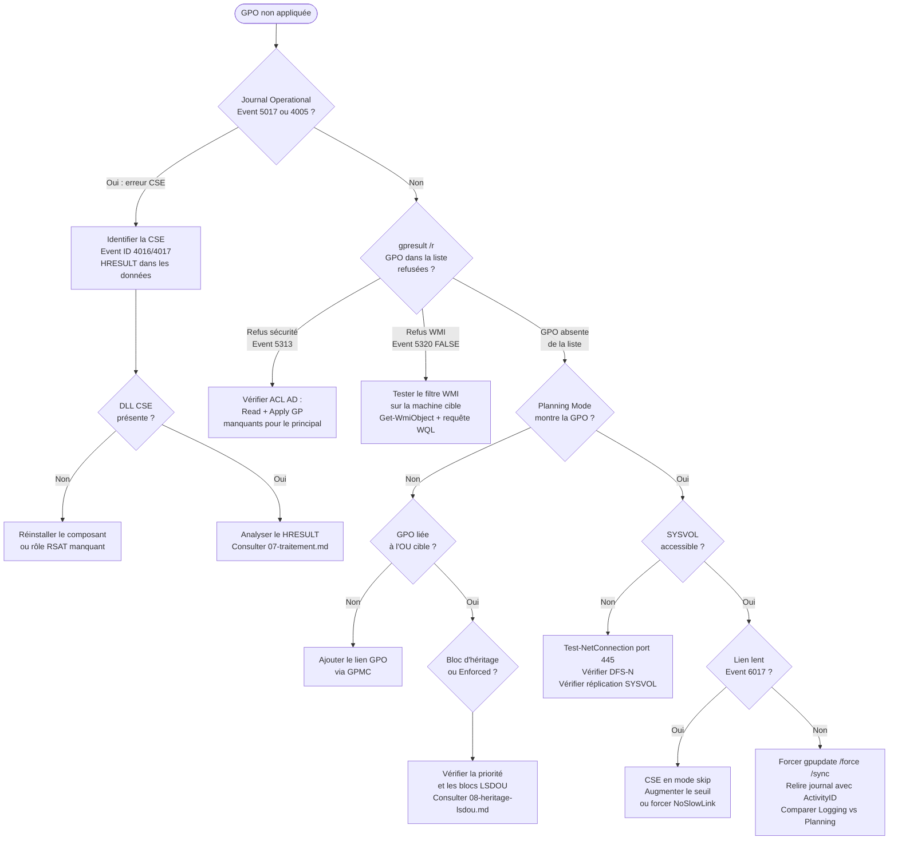

# RSoP et diagnostic des stratégies de groupe

!!! abstract "Ce que vous allez apprendre"
    - Les deux modes RSoP — Logging (GPO effectivement appliquées) et Planning (simulation avant déploiement) — et pourquoi `rsop.msc` est déprécié mais Planning mode reste pertinent
    - Toutes les options de `gpresult` : `/r`, `/v`, `/h`, `/x`, `/scope`, `/user`, `/s` et l'exploitation programmatique du XML via `Select-Xml` et XPath
    - `Get-GPResultantSetOfPolicy` en LoggingMode et PlanningMode, avec collecte en parallèle sur 50 machines
    - La structure du journal `Microsoft-Windows-GroupPolicy/Operational` : les Event IDs clés, le champ `ActivityID` pour corréler les événements d'une session GPO
    - Les requêtes PowerShell `Get-WinEvent -FilterHashtable` pour interroger le journal de manière précise et efficace
    - La séquence de diagnostic recommandée en six étapes, de l'événement initial à `gpupdate /force`

!!! tip "Si vous ne retenez qu'une chose"
    Le journal `Microsoft-Windows-GroupPolicy/Operational` et le champ `ActivityID` sont la clé de voûte du diagnostic. Avant d'ouvrir `gpresult` ou `rsop.msc`, lisez le journal de la machine cible — le moteur GPO y consigne la cause exacte de chaque refus d'application, y compris les filtres WMI et les erreurs CSE.

---

## :material-sitemap: RSoP : Logging Mode et Planning Mode

### :material-history: Définition et dualité

RSoP — Resultant Set of Policy — est le mécanisme par lequel Windows calcule l'ensemble de paramètres effectivement applicables à un couple objet/contexte donné.

Il existe en deux modes fondamentaux :

- **Logging Mode** : interroge la machine ou l'utilisateur cible pour obtenir les GPO réellement appliquées lors du dernier cycle de traitement. C'est une lecture d'un état passé, stocké localement par `gpsvc`.
- **Planning Mode** : simule l'application des GPO pour un utilisateur ou un ordinateur hypothétique, dans un contexte donné, sans aucun cycle réel. C'est un what-if qui ne touche pas la machine cible.

Ces deux modes répondent à des questions différentes. Logging Mode répond à "qu'est-ce qui s'est appliqué ?", Planning Mode à "qu'est-ce qui s'appliquerait si ?".

### :material-application: `rsop.msc` : limites et statut

`rsop.msc` est la console MMC historique du RSoP. Elle est **officiellement dépréciée** depuis Windows Server 2012 R2 et son successeur fonctionnel est la GPMC.

Ses limitations sont structurelles et non contournables :

- Elle **n'inclut pas les Préférences de Stratégie de Groupe (GPP)**. Les paramètres GPP — registre, fichiers, raccourcis, sources de données ODBC — sont invisibles dans `rsop.msc`.
- Elle ne permet pas de filtrer par CSE ou par paramètre individuel.
- Elle ne corrèle pas ses résultats avec les Event IDs du journal opérationnel.
- Son Planning Mode est moins précis que celui de GPMC (pas de prise en compte de l'appartenance aux groupes de sécurité dynamiques).

!!! warning "Piège en production"
    Utiliser `rsop.msc` pour diagnostiquer une GPP non appliquée est une perte de temps garantie. La console affichera un résultat vide pour tous les nœuds GPP, laissant croire que la configuration n'existe pas. Utilisez `gpresult /v` ou le rapport HTML de GPMC.

### :material-chart-gantt: Pourquoi Planning Mode reste utile

Malgré la dépréciation de `rsop.msc`, le **Planning Mode** — accessible via GPMC ou `Get-GPResultantSetOfPolicy -Mode PlanningMode` — reste la seule méthode pour simuler l'application d'une GPO **avant un déploiement**.

Les cas d'usage qui justifient son emploi systématique :

- Vérifier qu'une GPO avec filtrage de sécurité complexe atteindra bien les bonnes machines après liaison à une OU.
- Tester l'effet d'un nouveau lien GPO sans passer par un `gpupdate /force` en production.
- Simuler le résultat pour un utilisateur spécifique dans une OU différente de la sienne (scenarios de migration).
- Valider qu'une règle de priorité ou de bloc d'héritage produit bien l'effet attendu.

!!! info "Planning Mode et SYSVOL"
    Le Planning Mode ne contacte pas SYSVOL. Il interroge uniquement Active Directory pour lire les liaisons, les ACL et les filtres WMI. Les fichiers de modèles ADMX et les scripts ne sont pas lus. C'est pourquoi son résultat peut diverger de Logging Mode si un paramètre GPP dépend d'un script ou d'un fichier côté SYSVOL.

!!! quote "En résumé"
    - `rsop.msc` est déprécié et aveugle aux GPP — ne pas l'utiliser pour diagnostiquer des paramètres de préférences.
    - Logging Mode lit l'état appliqué réel, stocké localement par `gpsvc`.
    - Planning Mode simule un déploiement sans toucher la cible — irremplaçable en pré-production.
    - Le Planning Mode GPMC est supérieur à celui de `rsop.msc` (prise en compte des groupes de sécurité AD dynamiques).

---

## :material-console: `gpresult` : référence complète

### :material-flag: Options et modes de sortie

`gpresult` est l'outil en ligne de commande principal pour interroger le RSoP en Logging Mode. Il accepte plusieurs formats de sortie et plusieurs niveaux de détail.

| Option | Effet |
|--------|-------|
| `/r` | Résumé : liste des GPO appliquées et refusées, scope machine et utilisateur |
| `/v` | Verbose : tous les paramètres appliqués, valeur par valeur, pour chaque CSE |
| `/h <fichier.html>` | Rapport HTML interactif — le plus lisible pour un audit ponctuel |
| `/x <fichier.xml>` | Export XML brut — le plus exploitable programmatiquement |
| `/scope computer` | Limite la sortie au scope machine uniquement |
| `/scope user` | Limite la sortie au scope utilisateur uniquement |
| `/user <domaine\utilisateur>` | Cible un autre utilisateur que l'utilisateur courant |
| `/s <machine>` | Exécution à distance sur une machine cible (RPC requis) |
| `/f` | Force le rapport même si les paramètres RSoP sont inaccessibles |

!!! info "Droits requis pour `/s`"
    L'exécution distante via `/s` requiert des droits d'administration locale sur la machine cible et que le pare-feu Windows autorise le trafic RPC entrant (`Remote Registry` et `File and Printer Sharing`). En l'absence de ces droits, `gpresult /s` retourne `ERROR: The RSoP data was not generated.`

### :material-text-long: `gpresult /r` : lecture rapide

La sortie `/r` est structurée en deux blocs : **COMPUTER SETTINGS** et **USER SETTINGS**. Chaque bloc indique le nom du site AD, le domaine, l'OU cible, et la liste des GPO appliquées avec leur état.

```cmd title="Résumé RSoP pour la machine courante"
gpresult /r /scope computer
```

```text title="Résultat attendu"
Microsoft (R) Windows (R) Operating System Group Policy Result tool v2.0

Created on 04/05/2026 at 11:32:14

RSOP data for CONTOSO\WKS-JSMITH$ on WKSTN-JSMITH : Logging Mode
-----------------------------------------------------------------

OS Configuration:           Member Workstation
OS Version:                 10.0.19045
Site Name:                  SITE-PARIS
Roaming Profile:            N/A
Local Profile:              C:\Users\jsmith
Connected over a slow link?: No

COMPUTER SETTINGS
-----------------
    CN=WKS-JSMITH,OU=Postes,OU=Paris,DC=contoso,DC=lan
    Last time Group Policy was applied: 04/05/2026 at 09:14:02
    Group Policy was applied from:      DC-PARIS-01.contoso.lan
    Group Policy slow link threshold:   500 kbps
    Domain Name:                        CONTOSO
    Domain Type:                        Windows 2016 or later

    Applied Group Policy Objects
    -----------------------------
        CFG-Postes-SecuBase
        CFG-Postes-Firewall
        Default Domain Policy

    The following GPOs were not applied because they were filtered out
    -------------------------------------------------------------------
        CFG-Postes-HR
            Filtering:  Not Applied (Security)
```

### :material-xml: Exploiter le XML avec `Select-Xml`

Le format `/x` produit un XML structuré qui se prête à l'automatisation. Le schéma RSoP XML est documenté sous le namespace `http://www.microsoft.com/GroupPolicy/Rsop`.

```powershell title="Extraire tous les noms de GPO appliquées depuis le XML"
# Generate XML report locally
gpresult /x C:\Temp\rsop.xml /f

# Load and query with XPath
$xml = [xml](Get-Content C:\Temp\rsop.xml)
$ns = @{ rsop = "http://www.microsoft.com/GroupPolicy/Rsop" }

$appliedGPOs = Select-Xml -Xml $xml `
    -XPath "//rsop:AppliedGPO/rsop:Name" `
    -Namespace $ns

$appliedGPOs | ForEach-Object { $_.Node.InnerText }
```

```text title="Résultat attendu"
CFG-Postes-SecuBase
CFG-Postes-Firewall
Default Domain Policy
```

```powershell title="Extraire les GPO refusées et leur motif"
$deniedGPOs = Select-Xml -Xml $xml `
    -XPath "//rsop:FilteredGPO" `
    -Namespace $ns

$deniedGPOs | ForEach-Object {
    [PSCustomObject]@{
        Name   = $_.Node.SelectSingleNode("rsop:Name", $ns.GetNamespaces()).InnerText
        Reason = $_.Node.SelectSingleNode("rsop:FilterReasons/rsop:FilterReason", $ns.GetNamespaces()).InnerText
    }
}
```

!!! warning "Namespace XPath strict"
    Le XML généré par `gpresult /x` utilise des namespaces explicites. Une requête XPath sans déclaration de namespace retournera toujours zéro résultat. L'hashtable `$ns` passée à `-Namespace` est obligatoire.

!!! quote "En résumé"
    - `/r` pour un diagnostic rapide en ligne de commande.
    - `/v` pour voir chaque paramètre appliqué, indispensable quand la valeur effective est douteuse.
    - `/h` pour un rapport présentable à un tiers.
    - `/x` pour l'automatisation et l'audit en masse — exploitable via `Select-Xml` avec XPath.
    - `/s` pour interroger une machine distante — requiert RPC et droits admin locaux.

---

## :material-powershell: `Get-GPResultantSetOfPolicy` : usage avancé

### :material-cog: Paramètres essentiels

`Get-GPResultantSetOfPolicy` est la cmdlet PowerShell du module `GroupPolicy` qui encapsule les deux modes RSoP. Elle génère un rapport HTML ou XML.

```powershell title="Syntaxe de base — Logging Mode"
Get-GPResultantSetOfPolicy `
    -ReportType Html `
    -Path "C:\Rapports\rsop-jsmith.html" `
    -Computer "WKS-JSMITH" `
    -User "CONTOSO\jsmith" `
    -Mode LoggingMode
```

```powershell title="Syntaxe de base — Planning Mode"
Get-GPResultantSetOfPolicy `
    -ReportType Html `
    -Path "C:\Rapports\rsop-simulation.html" `
    -TargetComputer "WKS-TYPE-COMPTABLE" `
    -TargetUser "CONTOSO\template-rh" `
    -Mode PlanningMode
```

| Paramètre | LoggingMode | PlanningMode |
|-----------|-------------|--------------|
| `-Computer` | Machine réelle cible | N/A |
| `-User` | Utilisateur réel cible | N/A |
| `-TargetComputer` | N/A | DN ou nom de la machine simulée |
| `-TargetUser` | N/A | DN ou UPN de l'utilisateur simulé |
| `-ReportType` | Html ou Xml | Html ou Xml |

!!! info "PlanningMode et le DC de simulation"
    En PlanningMode, la cmdlet contacte le DC détenu par la machine locale pour calculer la simulation. Pour cibler un DC spécifique (par exemple un DC de staging), utilisez le paramètre `-DomainController`.

### :material-speedometer: Audit en masse avec `ForEach-Object -Parallel`

PowerShell 7+ permet de collecter les RSoP de multiples machines simultanément grâce au paramètre `-Parallel` de `ForEach-Object`.

```powershell title="Collecte RSoP parallèle sur une liste de machines"
# Requires PowerShell 7+ and RSAT GroupPolicy module
$machines = Get-Content "C:\Scripts\liste-machines.txt"  # One hostname per line
$outputDir = "C:\Rapports\RSoP-Audit-$(Get-Date -Format 'yyyyMMdd')"
New-Item -ItemType Directory -Path $outputDir -Force | Out-Null

$machines | ForEach-Object -Parallel {
    $machine = $_
    $outFile = Join-Path $using:outputDir "$machine.xml"
    try {
        Get-GPResultantSetOfPolicy `
            -ReportType Xml `
            -Path $outFile `
            -Computer $machine `
            -Mode LoggingMode `
            -ErrorAction Stop
        Write-Host "[OK] $machine"
    } catch {
        Write-Warning "[FAIL] $machine — $($_.Exception.Message)"
    }
} -ThrottleLimit 10

Write-Host "Reports saved to $outputDir"
```

```text title="Résultat attendu"
[OK] WKS-JSMITH
[OK] WKS-ADUPONT
[FAIL] WKS-HORS-LIGNE — The RPC server is unavailable.
[OK] WKS-MARTIN
...
Reports saved to C:\Rapports\RSoP-Audit-20260405
```

!!! warning "ThrottleLimit et charge réseau"
    Un `-ThrottleLimit` trop élevé (>20) sur un domaine avec des DC peu dimensionnés peut générer un pic de requêtes LDAP/RPC perceptible. Sur des domaines de plus de 500 machines, préférez un `ThrottleLimit 10` avec des batches de 50 machines et un délai inter-batch.

```powershell title="Parser les XML collectés pour extraire les GPO appliquées"
$ns = @{ rsop = "http://www.microsoft.com/GroupPolicy/Rsop" }

Get-ChildItem -Path $outputDir -Filter "*.xml" | ForEach-Object {
    $xml = [xml](Get-Content $_.FullName)
    $machine = $_.BaseName

    $applied = Select-Xml -Xml $xml -XPath "//rsop:AppliedGPO/rsop:Name" -Namespace $ns |
        ForEach-Object { $_.Node.InnerText }

    [PSCustomObject]@{
        Machine     = $machine
        GPOCount    = $applied.Count
        GPOs        = $applied -join "; "
    }
} | Export-Csv "C:\Rapports\audit-gpo-summary.csv" -NoTypeInformation -Encoding UTF8
```

!!! quote "En résumé"
    - `Get-GPResultantSetOfPolicy` en LoggingMode est l'équivalent PowerShell de `gpresult /h` — avec la même dépendance à RPC.
    - PlanningMode ne contacte pas la machine cible, il simule depuis AD : utilisable même si la machine est éteinte.
    - `-Parallel` avec `-ThrottleLimit 10` permet un audit RSoP de 50 machines en moins de 2 minutes dans des conditions réseau normales.

---

## :material-text-box-search: Journal opérationnel Group Policy

### :material-folder-open: Structure et localisation

Le journal `Microsoft-Windows-GroupPolicy/Operational` est le registre d'activité complet du moteur `gpsvc`. Il est disponible sur chaque client Windows depuis Vista.

Chemin dans l'Observateur d'événements :

```
Applications and Services Logs
  └── Microsoft
        └── Windows
              └── GroupPolicy
                    └── Operational
```

Chemin PowerShell pour `Get-WinEvent` :

```
Microsoft-Windows-GroupPolicy/Operational
```

Ce journal trace chaque cycle GPO depuis son démarrage jusqu'à la terminaison de chaque CSE, avec les résultats de chaque filtre WMI, la détection de lien lent, et les codes d'erreur HRESULT.

### :material-table: Table des Event IDs essentiels

| Event ID | Niveau | Signification |
|----------|--------|---------------|
| 4001 | Information | Démarrage d'un cycle de traitement GPO (foreground ou background) |
| 4002 | Information | Fin du cycle GPO — succès global |
| 4004 | Information | Traitement des GPO machine terminé avec succès |
| 4005 | Warning | Traitement des GPO machine terminé avec erreurs |
| 4006 | Information | Traitement des GPO utilisateur terminé avec succès |
| 4007 | Warning | Traitement des GPO utilisateur terminé avec erreurs |
| 4016 | Information | Démarrage d'une CSE (Extension Client-Side) |
| 4017 | Information | Fin d'une CSE — résultat dans les données de l'événement |
| 5016 | Information | CSE appliquée avec succès |
| 5017 | Error | CSE en échec — HRESULT dans les données |
| 5310 | Information | Liste des GPO à appliquer établie |
| 5312 | Information | GPO ignorée — hors scope (pas liée, pas applicable) |
| 5313 | Information | GPO refusée par filtrage de sécurité (ACL) |
| 5320 | Information | Résultat d'évaluation d'un filtre WMI (TRUE ou FALSE) |
| 5321 | Warning | Filtre WMI en erreur — GPO ignorée par défaut |
| 6017 | Warning | Lien lent détecté — certaines CSE passées en mode skip |
| 6320 | Information | Détection de lien lent : mesure de bande passante |

!!! info "Event IDs 4004/4005 vs 4006/4007"
    Les IDs 4004/4005 concernent le scope **Computer**, les IDs 4006/4007 concernent le scope **User**. Un cycle foreground machine génère 4001 → (4016/4017 × N CSEs) → 4004. Un cycle foreground utilisateur génère 4001 → (4016/4017 × N CSEs) → 4006.

### :material-link: Le champ `ActivityID` : corrélation des événements

Chaque cycle GPO est associé à un **ActivityID** — un GUID unique généré au démarrage du cycle (Event ID 4001). Tous les événements appartenant au même cycle portent ce même ActivityID dans leurs données d'événement.

C'est la clé de lecture du journal : sans cette corrélation, les événements de cycles simultanés (machine + utilisateur peuvent se chevaucher) sont impossibles à distinguer.

```powershell title="Lire tous les événements d'une session GPO par ActivityID"
# Step 1 — find the most recent GPO processing start
$startEvent = Get-WinEvent -FilterHashtable @{
    LogName = "Microsoft-Windows-GroupPolicy/Operational"
    Id      = 4001
} -MaxEvents 1

$activityId = $startEvent.ActivityId.ToString()

# Step 2 — retrieve all events for this session
Get-WinEvent -FilterHashtable @{
    LogName = "Microsoft-Windows-GroupPolicy/Operational"
} | Where-Object { $_.ActivityId -eq $startEvent.ActivityId } |
    Select-Object TimeCreated, Id, LevelDisplayName, Message |
    Format-Table -Wrap
```

```text title="Résultat attendu"
TimeCreated          Id    LevelDisplayName  Message
-----------          --    ----------------  -------
04/05/2026 09:14:00  4001  Information       Starting Group Policy processing...
04/05/2026 09:14:00  5310  Information       The list of applicable Group Policy...
04/05/2026 09:14:01  4016  Information       Starting computer Extension CSE...
04/05/2026 09:14:02  5016  Information       Completed computer Extension CSE...
04/05/2026 09:14:02  4004  Information       Completed computer Group Policy...
```

### :material-magnify: Requêtes ciblées avec `Get-WinEvent`

```powershell title="Rechercher les erreurs CSE des dernières 24 heures"
$since = (Get-Date).AddHours(-24)

Get-WinEvent -FilterHashtable @{
    LogName   = "Microsoft-Windows-GroupPolicy/Operational"
    Id        = 5017          # CSE failure
    StartTime = $since
} | Select-Object TimeCreated, Message | Format-List
```

```powershell title="Identifier les GPO refusées par filtrage de sécurité"
Get-WinEvent -FilterHashtable @{
    LogName = "Microsoft-Windows-GroupPolicy/Operational"
    Id      = 5313
} -MaxEvents 20 | ForEach-Object {
    $_.Message
}
```

```powershell title="Vérifier les évaluations de filtres WMI"
Get-WinEvent -FilterHashtable @{
    LogName = "Microsoft-Windows-GroupPolicy/Operational"
    Id      = 5320
} -MaxEvents 10 | Select-Object TimeCreated, Message
```

```powershell title="Exécution distante sur une machine cible"
# Requires WinRM enabled on target
$session = New-CimSession -ComputerName "WKS-JSMITH"

Get-WinEvent -CimSession $session -FilterHashtable @{
    LogName = "Microsoft-Windows-GroupPolicy/Operational"
    Id      = @(5017, 5321, 4005, 4007)
} -MaxEvents 50 | Select-Object TimeCreated, Id, Message

Remove-CimSession $session
```

!!! warning "Taille du journal et rétention"
    Par défaut, le journal `Microsoft-Windows-GroupPolicy/Operational` est limité à **4 MB**. Sur des machines où `gpupdate` est déclenché fréquemment (scripts, MDM, tests), ce journal peut être écrasé en quelques heures. Augmentez sa taille via GPO (`Computer Configuration > Administrative Templates > Windows Components > Event Log Service > GroupPolicy`).

!!! quote "En résumé"
    - Le journal opérationnel Group Policy est la source de vérité du cycle GPO — plus précis que `gpresult`.
    - Le champ `ActivityID` permet de corréler tous les événements d'un même cycle, même en cas d'interleaving.
    - L'Event ID 5017 indique un échec CSE avec HRESULT — c'est le premier endroit à regarder quand un paramètre ne s'applique pas.
    - `Get-WinEvent -FilterHashtable` est nettement plus rapide que `Get-EventLog` sur de gros volumes — utilisez toujours l'approche hashtable.

---

## :material-ladder: Séquence de diagnostic recommandée

### :material-numeric-1-circle: Étape 1 — Lire le journal opérationnel en premier

Ne lancez pas `gpresult` avant d'avoir lu le journal. Le journal contient le contexte du dernier cycle et la cause exacte de tout refus.

```powershell title="Vue rapide des 50 derniers événements GPO"
Get-WinEvent -FilterHashtable @{
    LogName = "Microsoft-Windows-GroupPolicy/Operational"
} -MaxEvents 50 |
    Select-Object TimeCreated, Id, LevelDisplayName, Message |
    Out-GridView -Title "Group Policy Operational Log"
```

Cherchez en priorité les niveaux `Warning` et `Error`. Un `5017` ou `4005`/`4007` signale immédiatement quel composant a échoué.

### :material-numeric-2-circle: Étape 2 — `gpresult /v` pour l'état appliqué

Une fois les événements du journal identifiés, utilisez `gpresult /v` pour voir la valeur effective de chaque paramètre.

```cmd title="Rapport verbose scope machine"
gpresult /v /scope computer > C:\Temp\rsop-verbose.txt
notepad C:\Temp\rsop-verbose.txt
```

```powershell title="Version PowerShell avec capture de sortie"
$rsopVerbose = gpresult /v /scope computer 2>&1
$rsopVerbose | Select-String -Pattern "Applied Group Policy|Filtered|Error" |
    Format-List
```

### :material-numeric-3-circle: Étape 3 — Planning Mode pour vérifier ce qui devrait s'appliquer

Si `gpresult /v` montre que la GPO n'est pas appliquée, utilisez le Planning Mode pour vérifier si elle devrait l'être selon la configuration AD actuelle.

```powershell title="Simulation Planning Mode depuis GPMC PowerShell"
Get-GPResultantSetOfPolicy `
    -ReportType Html `
    -Path "C:\Temp\planning-simulation.html" `
    -TargetComputer "WKS-JSMITH" `
    -TargetUser "CONTOSO\jsmith" `
    -Mode PlanningMode

Start-Process "C:\Temp\planning-simulation.html"
```

Si la GPO apparaît en Planning Mode mais pas en Logging Mode, le problème est dans le cycle d'application (SYSVOL, timing, CSE). Si elle n'apparaît pas non plus en Planning Mode, le problème est dans le filtrage ou la liaison AD.

### :material-numeric-4-circle: Étape 4 — Vérifier l'accès SYSVOL

Un SYSVOL inaccessible empêche `gpsvc` de lire les fichiers de GPO. La machine peut lire AD mais pas appliquer les paramètres.

```powershell title="Test de connectivité SYSVOL"
$domain = (Get-WmiObject Win32_ComputerSystem).Domain

# Test SMB access to SYSVOL share
Test-NetConnection -ComputerName $domain -Port 445 -InformationLevel Detailed

# Test actual SYSVOL path access
$sysvolPath = "\\$domain\SYSVOL\$domain\Policies"
if (Test-Path $sysvolPath) {
    Write-Host "[OK] SYSVOL accessible : $sysvolPath"
    (Get-ChildItem $sysvolPath).Count | ForEach-Object { Write-Host "  GPO count : $_" }
} else {
    Write-Warning "[FAIL] SYSVOL inaccessible : $sysvolPath"
}
```

```powershell title="Vérifier que DFS-N résout correctement le namespace SYSVOL"
# Check DFS referral for SYSVOL
dfsutil /PktInfo 2>$null | Select-String -Pattern "SYSVOL"
```

### :material-numeric-5-circle: Étape 5 — Vérifier les GUIDs CSE dans le registre

Chaque CSE est enregistrée dans le registre de la machine. Si une CSE est absente ou son GUID est incorrect, les paramètres qu'elle gère ne seront jamais appliqués.

```powershell title="Lister les CSE enregistrées sur la machine"
$cseKey = "HKLM:\SOFTWARE\Microsoft\Windows NT\CurrentVersion\Winlogon\GPExtensions"

Get-ChildItem $cseKey | ForEach-Object {
    $guid = $_.PSChildName
    $name = (Get-ItemProperty $_.PsPath)."(Default)" 2>$null
    $dll  = (Get-ItemProperty $_.PsPath).DllName 2>$null
    [PSCustomObject]@{
        GUID = $guid
        Name = $name
        DLL  = $dll
    }
} | Format-Table -AutoSize
```

```powershell title="Vérifier une CSE spécifique — ex. Registry CSE"
$registryCseGuid = "{35378EAC-683F-11D2-A89A-00C04FBBCFA2}"
$csePath = "HKLM:\SOFTWARE\Microsoft\Windows NT\CurrentVersion\Winlogon\GPExtensions\$registryCseGuid"

if (Test-Path $csePath) {
    Get-ItemProperty $csePath | Select-Object DllName, ProcessGroupPolicy, NoSlowLink
} else {
    Write-Warning "CSE GUID not found : $registryCseGuid"
}
```

### :material-numeric-6-circle: Étape 6 — `gpupdate /force /sync` et re-lecture du journal

Après avoir identifié et corrigé la cause, forcez un cycle complet synchrone et relisez le journal.

```cmd title="Forcer un cycle GPO synchrone complet"
gpupdate /force /sync
```

```powershell title="Attendre la fin du cycle puis lire le résultat"
# /sync blocks until completion — no sleep needed
Start-Process -Wait -FilePath "gpupdate.exe" -ArgumentList "/force /sync" -NoNewWindow

# Read the most recent processing session
$latestStart = Get-WinEvent -FilterHashtable @{
    LogName = "Microsoft-Windows-GroupPolicy/Operational"
    Id      = 4001
} -MaxEvents 1

Get-WinEvent -FilterHashtable @{
    LogName = "Microsoft-Windows-GroupPolicy/Operational"
} | Where-Object { $_.ActivityId -eq $latestStart.ActivityId } |
    Where-Object { $_.Level -in @(2, 3) } |   # Error and Warning only
    Select-Object TimeCreated, Id, Message |
    Format-List
```

!!! info "`gpupdate /force` vs `gpupdate /force /sync`"
    Sans `/sync`, `gpupdate` lance le cycle et rend la main immédiatement — le cycle continue en arrière-plan. Avec `/sync`, le processus attend la fin complète du cycle avant de terminer. Pour un diagnostic, utilisez toujours `/sync` afin de pouvoir lire le journal immédiatement après.

!!! quote "En résumé"
    - Toujours commencer par le journal opérationnel — il contient la cause, pas juste le symptôme.
    - `gpresult /v` confirme l'état appliqué ; Planning Mode confirme l'état attendu selon AD.
    - Un écart entre Planning Mode et Logging Mode indique un problème d'exécution (SYSVOL, CSE, lien lent).
    - `gpupdate /force /sync` + relecture du journal via `ActivityID` est la conclusion systématique de tout diagnostic.

---

## :material-transit-connection-variant: Arbre de décision : GPO non appliquée




!!! quote "En résumé"
    - Le schéma sur arbre de décision : gpo non appliquée sert à visualiser l’ordre, les dépendances et les points de rupture du mécanisme.
    - Relisez cette vue d’ensemble avant un diagnostic : elle montre où une étape manquante casse tout le flux.
    - Cette section fixe l’essentiel à retenir sur arbre de décision : gpo non appliquée.
    - Retenez surtout ce qui change la portée, l’ordre d’application ou le résultat final observé.
    - Ce résumé sert à vérifier que vous avez retenu le mécanisme, sa portée et sa conséquence pratique.
---

## :material-book-open-variant: Références croisées

- **[Débutant — Diagnostic GPO](../gpo-pour-les-nuls/12-diagnostic.md)** : introduction aux outils et concepts de base du RSoP.
- **[Terrain — Dépannage avancé](../gpo-pour-les-admins/22-depannage-terrain.md)** : cas réels documentés (WSUS, GlobalProtect, déploiement MSI en échec).
- **[Traitement — Cycle et Event IDs](07-traitement.md)** : Event IDs du cycle foreground/background, `SyncForegroundPolicy`, détection de lien lent.
- **[Filtrage — Sécurité et WMI](09-filtrage.md)** : structure DACL, GUID de la permission Apply GP, diagnostic des Event IDs 5313/5320.

!!! quote "En résumé"
    - À relire : Débutant — Diagnostic GPO.
    - À relire : Terrain — Dépannage avancé.
    - À relire : Traitement — Cycle et Event IDs.
    - À relire : Filtrage — Sécurité et WMI.
    - Ces renvois prolongent le chapitre avec des mécanismes complémentaires ou des cas d’usage voisins.
