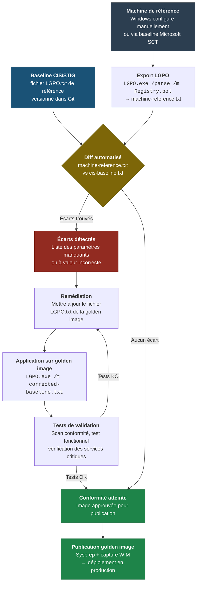

# LGPO et stratégies locales multiples

!!! abstract "Ce que vous allez apprendre"
    - L'architecture MLGPO (Multiple Local Group Policy Objects) introduite avec Windows Vista : les trois niveaux de couches locales, leur ordre d'application, et comment plusieurs classes d'utilisateurs peuvent coexister sur la même machine
    - Les chemins de stockage exacts des couches MLGPO sur disque (`%SYSTEMROOT%\System32\GroupPolicy\` et `%SYSTEMROOT%\System32\GroupPolicyUsers\{SID}\`) et leur relation avec le format GPT
    - Comment éditer les couches Administrators et Non-Administrators via MMC, alors que `gpedit.msc` n'expose que la couche Local Computer
    - `LGPO.exe` (Security Compliance Toolkit) : syntaxe complète du format `LGPO.txt`, import/export de `registry.pol`, backup et restore intégral des politiques locales
    - Les types de valeurs supportés dans LGPO.txt (`DWORD`, `SZ`, `EXSZ`, `MULTI_SZ`, `QWORD`, `BINARY`, `DELETE`, `DELETEALLVALUES`) et un exemple de baseline minimale commentée
    - Cas d'usage production : hardening de machine autonome, préparation de golden image, pipeline CI/CD de validation de baselines CIS avant publication
    - Interactions entre Local GPO et GPO de domaine dans LSDOU — y compris le cas LAPS


!!! tip "Si vous ne retenez qu'une chose"
    La Local GPO n'est pas une — elle est multiple. Depuis Windows Vista, MLGPO permet de configurer des paramètres différents pour les administrateurs locaux, les utilisateurs standard, et chaque compte nommé, sur la même machine. L'outil `LGPO.exe` permet d'automatiser la totalité de ce système via un format texte, sans domaine, sans GPMC — ce qui en fait la base incontournable de tout pipeline de hardening autonome.


---

## :material-layers-triple: MLGPO : Multiple Local Group Policy Objects

### :material-history: Origine et contexte

Avant Windows Vista, une machine Windows n'avait qu'une seule Local Group Policy Object. Elle s'appliquait à tous les utilisateurs de la machine, sans distinction.

Windows Vista a introduit MLGPO pour permettre des configurations différenciées selon le type de compte. Cette évolution répond à un besoin réel : sur un poste partagé ou un kiosque, les contraintes qui s'appliquent à un utilisateur standard ne doivent pas s'appliquer à l'administrateur local qui effectue la maintenance.

### :material-layers-outline: Les trois niveaux de couches

MLGPO définit une hiérarchie de quatre couches locales traitées dans cet ordre :

| Ordre | Couche | Cible | Chemin de stockage |
|-------|--------|-------|--------------------|
| 1 | **Local Computer** | Machine entière (section Computer uniquement) | `%SystemRoot%\System32\GroupPolicy\` |
| 2 | **Administrators** | Membres du groupe local Administrators | `%SystemRoot%\System32\GroupPolicyUsers\S-1-5-32-544\` |
| 3 | **Non-Administrators** | Tout compte non-administrateur | `%SystemRoot%\System32\GroupPolicyUsers\S-1-5-32-545\` |
| 4 | **User-specific** | Compte nommé par son SID | `%SystemRoot%\System32\GroupPolicyUsers\{SID-utilisateur}\` |

La couche **Local Computer** est la seule à posséder une section Machine ET une section User.

Les couches **Administrators**, **Non-Administrators** et **User-specific** ne contiennent qu'une section User — elles ne configurent que des paramètres utilisateur.

!!! info "Pourquoi la section Machine n'existe qu'au niveau Local Computer ?"
    La section Machine d'une GPO s'applique au démarrage de la machine, avant qu'aucun utilisateur ne soit connecté. Le concept de "paramètre Machine pour les administrateurs uniquement" n'a pas de sens à ce stade — il n'y a pas encore d'utilisateur. Seule la couche Local Computer peut donc configurer des paramètres Machine.

### :material-sort-ascending: Ordre d'application et précédence

Au sein de la pile MLGPO, l'ordre est strict et non configurable.

La couche Local Computer s'applique en premier (section Machine au démarrage, section User à la session). Ensuite viennent Administrators ou Non-Administrators selon le type de compte, puis la couche User-specific si elle existe pour le SID concerné.

Le principe fondamental reste identique à LSDOU : **le dernier appliqué l'emporte**. La couche User-specific, appliquée en dernier, gagne tous les conflits avec les couches précédentes.

!!! warning "MLGPO dans LSDOU : couche la plus basse"
    La totalité de la pile MLGPO est la couche **L** de LSDOU. Elle s'applique avant le Site, avant le Domaine, avant les OU. Toute GPO de domaine configurant le même paramètre écrasera la politique locale, quelle que soit la couche MLGPO concernée. Les politiques locales ne résistent pas au domaine — elles complètent ce que le domaine n'a pas configuré.

### :material-account-check: Cas d'usage MLGPO

**Poste partagé avec comptes nommés :** Sur un poste utilisé par plusieurs techniciens, la couche Non-Administrators impose des restrictions (pas d'accès au panneau de configuration, fond d'écran verrouillé). La couche Administrators laisse l'environnement standard. Une couche User-specific pour un compte de kiosque ajoute des restrictions supplémentaires.

**Poste de développement autonome :** La couche Local Computer configure la politique d'audit et les paramètres de sécurité réseau (Schannel, SMB). La couche Non-Administrators verrouille les postes de travail des stagiaires. Les développeurs seniors sont dans le groupe Administrators et ne reçoivent que la couche Local Computer.

**Golden image avant domaine :** Une baseline de sécurité est appliquée via LGPO.exe dans la couche Local Computer avant sysprep. À la jonction de domaine, les GPO de domaine complètent et écrasent les paramètres locaux selon LSDOU.

!!! quote "En résumé"
    - MLGPO = 4 couches locales ordonnées : Local Computer → Administrators → Non-Administrators → User-specific
    - Seule la couche Local Computer configure des paramètres Machine
    - Les couches Administrators/Non-Administrators/User-specific ne configurent que des paramètres User
    - La couche la plus spécifique (User-specific) gagne les conflits dans la pile locale
    - La totalité de MLGPO est écrasable par n'importe quelle GPO de domaine (LSDOU)

---

## :material-folder-open: Chemins de stockage MLGPO

### :material-file-tree: Structure sur disque

Chaque couche MLGPO est stockée sous la forme d'une GPT (Group Policy Template) — le même format que les GPO de domaine dans SYSVOL, mais en local.

La couche **Local Computer** occupe un emplacement fixe :

```
%SystemRoot%\System32\GroupPolicy\
├── Machine\
│   ├── Registry.pol
│   └── Scripts\
│       ├── Startup\
│       └── Shutdown\
└── User\
    ├── Registry.pol
    └── Scripts\
        ├── Logon\
        └── Logoff\
```

Les couches **Administrators**, **Non-Administrators** et **User-specific** sont stockées dans `GroupPolicyUsers\` avec le SID comme nom de dossier :

```
%SystemRoot%\System32\GroupPolicyUsers\
├── S-1-5-32-544\        ← Administrators (SID groupe bien connu)
│   └── User\
│       └── Registry.pol
├── S-1-5-32-545\        ← Non-Administrators (SID groupe bien connu)
│   └── User\
│       └── Registry.pol
└── S-1-5-21-...-1001\   ← SID d'un compte utilisateur nommé
    └── User\
        └── Registry.pol
```

!!! info "SID de groupes bien connus"
    `S-1-5-32-544` et `S-1-5-32-545` sont des SID universels définis par Microsoft. `S-1-5-32-544` désigne toujours le groupe Administrators local, quelle que soit la machine. Ces SID ne changent pas entre les installations.

### :material-magnify: Localiser les couches sur une machine

```powershell title="Inventaire des couches MLGPO présentes sur la machine"
# Enumerate all MLGPO layers present on this machine
$gpBase     = "$env:SystemRoot\System32\GroupPolicy"
$gpUsers    = "$env:SystemRoot\System32\GroupPolicyUsers"

Write-Host "=== Local Computer layer ===" -ForegroundColor Cyan
$machPol = Join-Path $gpBase "Machine\Registry.pol"
$userPol  = Join-Path $gpBase "User\Registry.pol"
Write-Host "  Machine\Registry.pol : $(if (Test-Path $machPol) { 'EXISTS' } else { 'absent' })"
Write-Host "  User\Registry.pol    : $(if (Test-Path $userPol) { 'EXISTS' } else { 'absent' })"

Write-Host ""
Write-Host "=== User-class and named-user layers ===" -ForegroundColor Cyan

if (Test-Path $gpUsers) {
    Get-ChildItem $gpUsers -Directory | ForEach-Object {
        $sid    = $_.Name
        $polFile = Join-Path $_.FullName "User\Registry.pol"

        # Resolve SID to a readable name
        try {
            $account = ([System.Security.Principal.SecurityIdentifier]$sid).Translate(
                [System.Security.Principal.NTAccount]
            ).Value
        }
        catch {
            $account = "(unresolvable SID)"
        }

        $exists = if (Test-Path $polFile) { 'Registry.pol present' } else { 'no Registry.pol' }
        Write-Host "  $sid  =>  $account  [$exists]"
    }
} else {
    Write-Host "  GroupPolicyUsers directory does not exist (no user-class layers configured)"
}
```

```title="Résultat attendu"
=== Local Computer layer ===
  Machine\Registry.pol : EXISTS
  User\Registry.pol    : absent

=== User-class and named-user layers ===
  S-1-5-32-544  =>  BUILTIN\Administrators  [Registry.pol present]
  S-1-5-32-545  =>  BUILTIN\Guests          [no Registry.pol]
```

!!! warning "Piège production : dossiers vides ≠ politique vide"
    La présence d'un dossier dans `GroupPolicyUsers\` ne signifie pas que la couche est active. Si `Registry.pol` est absent ou vide, la couche n'a aucun effet. Un dossier peut être créé par une ancienne configuration et ne plus rien contenir. Vérifiez toujours la présence et la taille du fichier `Registry.pol`.

!!! quote "En résumé"
    - `%SystemRoot%\System32\GroupPolicy\` = couche Local Computer (Machine + User)
    - `%SystemRoot%\System32\GroupPolicyUsers\{SID}\User\` = couches Administrators, Non-Administrators, User-specific
    - Le format sur disque est identique au format GPT de SYSVOL
    - La présence du dossier ne garantit pas l'existence de politiques actives — vérifier `Registry.pol`

---

## :material-application-cog: Éditer les couches MLGPO avec gpedit.msc

### :material-alert: Limitation de gpedit.msc

`gpedit.msc` lancé sans argument n'expose qu'une seule couche : **Local Computer**.

C'est le comportement par défaut et intentionnel. La console charge systématiquement la couche Local Computer, sans possibilité de switcher vers les couches Administrators ou Non-Administrators depuis l'interface.

Pour éditer les autres couches, il faut utiliser MMC avec le snap-in **Group Policy Object Editor** ciblant explicitement la couche souhaitée.

### :material-console: Éditer la couche Administrators

```cmd title="Ouvrir MMC pour éditer la couche Administrators"
mmc /gpcomputer:localhost
```

Cette commande ouvre une console MMC vide. Ajouter ensuite le snap-in **Éditeur d'objets de stratégie de groupe** via Fichier → Ajouter/Supprimer un composant logiciel enfichable, puis sélectionner **Cet ordinateur** et cliquer sur **Parcourir** pour choisir la couche.

La méthode plus directe est de créer un fichier MSC dédié :

```powershell title="Créer un raccourci MSC pour la couche Administrators"
# Create an MSC file targeting the Administrators MLGPO layer
$mscContent = @"
<?xml version="1.0" encoding="UTF-8"?>
<MMC_ConsoleFile>
  <StringTables>
    <StringTable LanguageID="0" Text="Local GPO - Administrators Layer"/>
  </StringTables>
</MMC_ConsoleFile>
"@
# Use the MMC snap-in path directly for Administrators layer (SID S-1-5-32-544)
$target = "$env:SystemRoot\System32\GroupPolicyUsers\S-1-5-32-544"
Start-Process mmc -ArgumentList "$env:SystemRoot\system32\gpedit.msc", "/gpcomputer:$target"
```

!!! info "Approche recommandée en production : LGPO.exe"
    En pratique, l'édition manuelle via MMC est réservée aux environnements de test ou à la création initiale d'une configuration. Pour tout déploiement reproductible, utilisez `LGPO.exe` avec un fichier `LGPO.txt`. L'interface graphique ne scale pas — le format texte oui.

### :material-layers-edit: Éditer une couche User-specific par SID

Pour éditer la couche d'un utilisateur nommé, il faut connaître son SID local :

```powershell title="Récupérer le SID d'un compte local"
# Get the SID of a local user account
$username = "kiosk-user"
$sid = (Get-LocalUser -Name $username).SID.Value
Write-Host "SID for ${username}: $sid"

# The MLGPO layer path for this user
$layerPath = "$env:SystemRoot\System32\GroupPolicyUsers\$sid"
Write-Host "Layer path: $layerPath"
```

```title="Résultat attendu"
SID for kiosk-user: S-1-5-21-3623811015-3361044348-30300820-1002
Layer path: C:\Windows\System32\GroupPolicyUsers\S-1-5-21-3623811015-3361044348-30300820-1002
```

!!! quote "En résumé"
    - `gpedit.msc` seul = couche Local Computer uniquement
    - Les couches Administrators/Non-Administrators/User-specific s'éditent via MMC ou, de préférence, via `LGPO.exe`
    - Le SID du groupe ou de l'utilisateur détermine le dossier cible dans `GroupPolicyUsers\`

---

## :material-tools: LGPO.exe : l'outil Microsoft de référence

### :material-download: Origine et obtention

`LGPO.exe` est un outil Microsoft distribué dans le **Security Compliance Toolkit (SCT)**. Il n'est pas livré avec Windows — il doit être téléchargé séparément.

**URL officielle :** [Microsoft Security Compliance Toolkit](https://www.microsoft.com/en-us/download/details.aspx?id=55319)

Le toolkit contient également les baselines CIS/Microsoft pour Windows Server et Windows Client. `LGPO.exe` est l'outil officiel pour appliquer ces baselines sur des machines autonomes ou dans des pipelines CI/CD.

!!! info "Version recommandée"
    Utilisez toujours la version la plus récente de LGPO.exe. Les versions antérieures à 3.0 ne supportent pas certains types de valeurs (notamment `EXSZ` pour les variables d'environnement expandables).

### :material-function-variant: Fonctions principales

| Opération | Commande | Description |
|-----------|----------|-------------|
| Appliquer un fichier texte LGPO | `LGPO.exe /t baseline.txt` | Importer des paramètres depuis un fichier LGPO.txt |
| Appliquer à une couche User | `LGPO.exe /t baseline.txt /u` | Cibler la section User de Local Computer |
| Importer un registry.pol | `LGPO.exe /m Machine\Registry.pol` | Import direct d'un fichier registry.pol (Machine) |
| Importer un registry.pol User | `LGPO.exe /u User\Registry.pol` | Import direct d'un fichier registry.pol (User) |
| Parser un registry.pol en texte | `LGPO.exe /parse /m Registry.pol` | Convertir registry.pol en format LGPO.txt lisible |
| Backup complet des politiques locales | `LGPO.exe /b C:\Backup` | Export de toutes les couches MLGPO dans un dossier |
| Restore depuis backup | `LGPO.exe /r C:\Backup` | Restaurer une configuration complète |
| Exporter en GPO domain-compatible | `LGPO.exe /e` | Export au format SYSVOL GPT |

### :material-export: Exporter et parser un registry.pol existant

```powershell title="Parser la politique Machine locale et l'enregistrer en texte"
# Parse the local Machine registry.pol to a human-readable LGPO.txt
$lgpoExe  = "C:\Tools\LGPO\LGPO.exe"
$polFile  = "$env:SystemRoot\System32\GroupPolicy\Machine\Registry.pol"
$outFile  = "C:\Audit\machine-baseline.txt"

if (Test-Path $polFile) {
    & $lgpoExe /parse /m $polFile | Out-File -FilePath $outFile -Encoding utf8
    Write-Host "Parsed to: $outFile"
    Get-Content $outFile | Select-Object -First 30
} else {
    Write-Host "No Machine\Registry.pol found — Local Computer Machine layer is empty."
}
```

```title="Résultat attendu"
Parsed to: C:\Audit\machine-baseline.txt
; ---- LGPO.txt ----
Computer
SOFTWARE\Policies\Microsoft\Windows\WindowsUpdate\AU
NoAutoUpdate
DWORD:0

Computer
SOFTWARE\Policies\Microsoft\Windows NT\CurrentVersion\Winlogon
DisableLockWorkstation
DWORD:0
```

### :material-backup-restore: Backup et restore complet MLGPO

```powershell title="Backup de toutes les couches MLGPO"
# Full backup of all MLGPO layers to a timestamped directory
$lgpoExe   = "C:\Tools\LGPO\LGPO.exe"
$timestamp = Get-Date -Format "yyyyMMdd-HHmmss"
$backupDir = "C:\Backup\LGPO\$timestamp"

New-Item -ItemType Directory -Path $backupDir -Force | Out-Null
& $lgpoExe /b $backupDir

Write-Host "Backup complete: $backupDir"
Get-ChildItem $backupDir -Recurse | Select-Object FullName, Length
```

```title="Résultat attendu"
Backup complete: C:\Backup\LGPO\20260405-143022
FullName                                          Length
--------                                          ------
C:\Backup\LGPO\20260405-143022\{backup.xml}         1842
C:\Backup\LGPO\20260405-143022\DomainSysvol\...
C:\Backup\LGPO\20260405-143022\GPO\...
```

!!! warning "Piège production : LGPO.exe requiert des privilèges élevés"
    `LGPO.exe` doit être exécuté en tant qu'administrateur local. Sur les machines membres d'un domaine avec UAC activé, un simple compte admin de domaine peut ne pas suffire si le token n'est pas élevé. Lancez toujours `LGPO.exe` depuis une session PowerShell en mode Run as Administrator.

!!! quote "En résumé"
    - `LGPO.exe` est disponible dans le Microsoft Security Compliance Toolkit, pas dans Windows
    - Il couvre l'intégralité du cycle : parse, import, export, backup, restore
    - `/t` pour appliquer un fichier texte, `/parse` pour convertir un registry.pol en texte, `/b` pour le backup complet
    - Nécessite une session élevée

---

## :material-file-document-edit: Le format LGPO.txt

### :material-format-list-bulleted: Structure générale

Le format LGPO.txt est un fichier texte brut organisé en blocs. Chaque bloc définit un paramètre de registre à appliquer dans une politique locale.

Un bloc se compose de quatre lignes dans cet ordre exact :

```
<scope>
<registry-path>
<value-name>
<type>:<value>
```

**`<scope>`** : `Computer` ou `User` — détermine quelle section de la politique locale est ciblée.

**`<registry-path>`** : chemin de la clé de registre sous `HKLM\Software\Policies` (pour Computer) ou `HKCU\Software\Policies` (pour User), **sans le préfixe HKLM/HKCU**.

**`<value-name>`** : nom de la valeur de registre. Utiliser `**del** ` pour la suppression.

**`<type>:<value>`** : type de valeur suivi de deux-points et de la valeur.

Les blocs sont séparés par une ligne vide. Les lignes commençant par `;` sont des commentaires.

### :material-table: Types de valeurs supportés

| Type LGPO | Type registre Windows | Format de la valeur |
|-----------|----------------------|---------------------|
| `DWORD` | REG_DWORD | Entier décimal : `DWORD:1` |
| `SZ` | REG_SZ | Chaîne littérale : `SZ:valeur` |
| `EXSZ` | REG_EXPAND_SZ | Chaîne avec variables : `EXSZ:%SystemRoot%\log` |
| `MULTI_SZ` | REG_MULTI_SZ | Valeurs séparées par `\0` : `MULTI_SZ:val1\0val2` |
| `QWORD` | REG_QWORD | Entier 64 bits décimal : `QWORD:4294967296` |
| `BINARY` | REG_BINARY | Octets hexadécimaux : `BINARY:01 02 03 FF` |
| `DELETE` | — | Supprime la valeur nommée : `DELETE` |
| `DELETEALLVALUES` | — | Supprime toutes les valeurs de la clé : `DELETEALLVALUES` |

!!! warning "DELETEALLVALUES efface toute la clé"
    `DELETEALLVALUES` supprime **toutes** les valeurs sous la clé spécifiée. C'est un outil de nettoyage radical — utile pour réinitialiser une politique, dangereux si la clé contient des paramètres hors-politique. À utiliser exclusivement sur des clés `Software\Policies\*` que vous contrôlez entièrement.

### :material-code-json: Référence de syntaxe complète

```title="Référence LGPO.txt — tous les types"
; ============================================================
; LGPO.txt syntax reference
; Scope: Computer | User
; Registry path: relative to HKLM\Software\Policies (Computer)
;                or HKCU\Software\Policies (User)
; ============================================================

; --- DWORD (REG_DWORD) ---
Computer
SOFTWARE\Policies\Example\Section
EnableFeature
DWORD:1

; --- SZ (REG_SZ) ---
Computer
SOFTWARE\Policies\Example\Section
ServerName
SZ:server.contoso.local

; --- EXSZ (REG_EXPAND_SZ) ---
Computer
SOFTWARE\Policies\Example\Section
LogPath
EXSZ:%SystemRoot%\Logs\App

; --- MULTI_SZ (REG_MULTI_SZ) ---
Computer
SOFTWARE\Policies\Example\Section
AllowedHosts
MULTI_SZ:host1.contoso.local\0host2.contoso.local

; --- QWORD (REG_QWORD) ---
Computer
SOFTWARE\Policies\Example\Section
MaxFileSize
QWORD:10737418240

; --- BINARY (REG_BINARY) ---
Computer
SOFTWARE\Policies\Example\Section
RawConfig
BINARY:01 00 00 00 FF 0A

; --- DELETE (remove a single named value) ---
Computer
SOFTWARE\Policies\Example\Section
ObsoleteValue
DELETE

; --- DELETEALLVALUES (remove all values under the key) ---
Computer
SOFTWARE\Policies\Example\Section
**delvals.
DELETEALLVALUES
```

!!! info "La valeur de nom spéciale `**delvals.`"
    Pour utiliser `DELETEALLVALUES`, le nom de valeur doit être `**delvals.` (avec les deux astérisques et le point final). C'est une convention interne de LGPO.exe — ne pas modifier ce nom.

### :material-security: Exemple annoté : baseline de hardening minimale

Cette baseline couvre cinq paramètres essentiels pour un poste Windows 10/11 autonome. Elle illustre la structure réelle d'un fichier LGPO.txt de production.

```title="minimal-hardening-baseline.txt"
; ============================================================
; Minimal Hardening Baseline — LGPO.txt
; Target: Windows 10/11 standalone workstation
; Apply with: LGPO.exe /t minimal-hardening-baseline.txt
; ============================================================

; --- 1. Disable autoplay on all drives ---
; Prevents malware execution from removable media
Computer
SOFTWARE\Policies\Microsoft\Windows\Explorer
NoDriveTypeAutoRun
DWORD:255

; --- 2. Disable SMBv1 client ---
; SMBv1 is deprecated and exploitable (EternalBlue)
Computer
SYSTEM\CurrentControlSet\Services\LanmanWorkstation\Parameters
SMB1
DWORD:0

; --- 3. Set PowerShell execution policy to RemoteSigned ---
; Blocks unsigned scripts from remote sources
Computer
SOFTWARE\Policies\Microsoft\Windows\PowerShell
EnableScripts
DWORD:1

Computer
SOFTWARE\Policies\Microsoft\Windows\PowerShell
ExecutionPolicy
SZ:RemoteSigned

; --- 4. Require NTLMv2 and refuse LM/NTLM ---
; Prevents downgrade attacks on authentication
Computer
SYSTEM\CurrentControlSet\Control\Lsa
LmCompatibilityLevel
DWORD:5

; --- 5. Enable Windows Defender real-time protection ---
; Ensures real-time scanning is enforced by policy
Computer
SOFTWARE\Policies\Microsoft\Windows Defender\Real-Time Protection
DisableRealtimeMonitoring
DWORD:0
```

```powershell title="Appliquer la baseline minimale"
# Apply the minimal hardening baseline to the Local Computer Machine layer
$lgpoExe = "C:\Tools\LGPO\LGPO.exe"
$baseline = "C:\Baselines\minimal-hardening-baseline.txt"

if (-not (Test-Path $lgpoExe)) {
    throw "LGPO.exe not found at $lgpoExe. Download from Microsoft Security Compliance Toolkit."
}

Write-Host "Applying baseline: $baseline" -ForegroundColor Cyan
& $lgpoExe /t $baseline

if ($LASTEXITCODE -eq 0) {
    Write-Host "Baseline applied successfully." -ForegroundColor Green
} else {
    Write-Host "LGPO.exe returned exit code $LASTEXITCODE — check event log." -ForegroundColor Red
}
```

```title="Résultat attendu"
Applying baseline: C:\Baselines\minimal-hardening-baseline.txt
LGPO.exe v3.0.0.0
Updating machine settings...
Settings updated successfully.
Baseline applied successfully.
```

!!! quote "En résumé"
    - Un bloc LGPO.txt = 4 lignes : scope, chemin registre, nom de valeur, type:valeur
    - Huit types supportés : `DWORD`, `SZ`, `EXSZ`, `MULTI_SZ`, `QWORD`, `BINARY`, `DELETE`, `DELETEALLVALUES`
    - Les commentaires commencent par `;`
    - `DELETEALLVALUES` nécessite `**delvals.` comme nom de valeur
    - Le format est stable et versionnable dans un dépôt Git — traiter les fichiers LGPO.txt comme du code

---

## :material-factory: Cas d'usage production

### :material-shield-lock: Hardening de machine autonome (hors domaine)

Un poste autonome n'a pas de GPO de domaine pour le protéger. `LGPO.exe` comble ce vide en appliquant une baseline de sécurité directement dans les couches MLGPO.

Le workflow standard pour une machine hors domaine :

1. Télécharger le Security Compliance Toolkit et extraire la baseline pour la version Windows cible
2. Adapter le fichier LGPO.txt aux contraintes locales (proxy, nom de domaine interne si rejoindre plus tard)
3. Appliquer avec `LGPO.exe /t baseline.txt` depuis une session élevée
4. Vérifier avec `LGPO.exe /parse /m` que les paramètres sont bien écrits dans `Registry.pol`
5. Documenter la version de baseline appliquée (commit Git, changelog)

```powershell title="Vérification post-application : comparer registre attendu vs registre réel"
# Spot-check a DWORD value after applying baseline
$key    = "HKLM:\SOFTWARE\Policies\Microsoft\Windows\Explorer"
$name   = "NoDriveTypeAutoRun"
$expect = 255

$actual = (Get-ItemProperty -Path $key -Name $name -ErrorAction SilentlyContinue).$name

if ($actual -eq $expect) {
    Write-Host "[OK] $name = $actual (expected $expect)" -ForegroundColor Green
} else {
    Write-Host "[FAIL] $name = $actual (expected $expect)" -ForegroundColor Red
}
```

### :material-image-multiple: Préparation de golden image

La golden image est le modèle d'installation utilisé pour déployer les postes. Elle doit embarquer une baseline de sécurité **avant** le sysprep, pour que chaque poste déployé soit conforme dès le premier démarrage.

Le processus de durcissement d'une golden image :

1. Installer Windows sur la machine ou VM de référence
2. Appliquer les mises à jour et les logiciels métier
3. Appliquer la baseline LGPO avec `LGPO.exe /t`
4. Valider avec un scan de conformité (voir section CI/CD)
5. Exécuter `sysprep /oobe /generalize /shutdown`
6. Capturer l'image avec WinPE + DISM ou l'outil de déploiement en place

!!! warning "Piège golden image : sysprep et SID utilisateur"
    Les couches MLGPO User-specific (dossiers nommés par SID dans `GroupPolicyUsers\`) survivent au sysprep. Si la golden image contient une couche User-specific créée pour un compte temporaire de configuration, cette couche sera présente sur tous les postes déployés et s'appliquera au premier utilisateur avec le même SID relatif (RID 1001). Supprimez toujours les couches User-specific avant sysprep.

```powershell title="Nettoyage des couches User-specific avant sysprep"
# Remove all user-specific MLGPO layers before sysprep
# (keep only S-1-5-32-544 Administrators and S-1-5-32-545 Non-Administrators)
$wellKnownSids = @("S-1-5-32-544", "S-1-5-32-545")
$gpUsers = "$env:SystemRoot\System32\GroupPolicyUsers"

if (Test-Path $gpUsers) {
    Get-ChildItem $gpUsers -Directory | Where-Object {
        $_.Name -notin $wellKnownSids
    } | ForEach-Object {
        Write-Host "Removing user-specific layer: $($_.Name)"
        Remove-Item $_.FullName -Recurse -Force
    }
    Write-Host "Cleanup complete." -ForegroundColor Green
} else {
    Write-Host "No GroupPolicyUsers directory found." -ForegroundColor DarkGray
}
```

### :material-pipe: Pipeline CI/CD de validation de baselines

Le cas d'usage le plus avancé : valider automatiquement qu'une golden image respecte une baseline CIS avant publication.

```powershell title="Pipeline de comparaison baseline CIS vs image de référence"
# CI/CD pipeline: compare current Local GPO against a CIS baseline
# Step 1: Export current Local Computer Machine policy to text
$lgpoExe    = "C:\Tools\LGPO\LGPO.exe"
$polFile    = "$env:SystemRoot\System32\GroupPolicy\Machine\Registry.pol"
$currentTxt = "C:\Pipeline\current-machine.txt"
$baselineTxt = "C:\Pipeline\cis-baseline.txt"
$diffOut    = "C:\Pipeline\diff-result.txt"

# Export current state
& $lgpoExe /parse /m $polFile | Out-File $currentTxt -Encoding utf8

# Compare with reference baseline (line-by-line diff)
$current  = Get-Content $currentTxt  | Where-Object { $_ -notmatch '^;' -and $_ -ne '' }
$baseline = Get-Content $baselineTxt | Where-Object { $_ -notmatch '^;' -and $_ -ne '' }

$missing = $baseline | Where-Object { $_ -notin $current }

if ($missing.Count -eq 0) {
    Write-Host "[PASS] Machine policy matches baseline." -ForegroundColor Green
    exit 0
} else {
    Write-Host "[FAIL] $($missing.Count) baseline entries not found in current policy:" -ForegroundColor Red
    $missing | ForEach-Object { Write-Host "  $_" -ForegroundColor Yellow }
    $missing | Out-File $diffOut -Encoding utf8
    exit 1
}
```

```title="Résultat attendu (non-conformité détectée)"
[FAIL] 3 baseline entries not found in current policy:
  DWORD:255
  DWORD:0
  DWORD:5
```

!!! info "Intégration dans un pipeline GitHub Actions ou Azure DevOps"
    `LGPO.exe` fonctionne depuis la ligne de commande avec un code de sortie standard (0 = succès). Il s'intègre directement dans un step de pipeline. La machine de build doit être Windows, et le step doit tourner avec des privilèges administrateur. Pour les pipelines Azure DevOps, utilisez un Self-Hosted Agent sur une VM Windows.

!!! quote "En résumé"
    - Machine autonome : appliquer directement `LGPO.exe /t baseline.txt`, vérifier avec `/parse`
    - Golden image : appliquer avant sysprep, nettoyer les couches User-specific avant capture
    - CI/CD : exporter avec `/parse`, differ contre la baseline de référence, bloquer le pipeline si non-conforme

---

## :material-source-branch: Diagramme : pipeline CI/CD LGPO




!!! quote "En résumé"
    - Le schéma sur diagramme : pipeline ci/cd lgpo sert à visualiser l’ordre, les dépendances et les points de rupture du mécanisme.
    - Relisez cette vue d’ensemble avant un diagnostic : elle montre où une étape manquante casse tout le flux.
    - Cette section fixe l’essentiel à retenir sur diagramme : pipeline ci/cd lgpo.
    - Retenez surtout ce qui change la portée, l’ordre d’application ou le résultat final observé.
    - Ce résumé sert à vérifier que vous avez retenu le mécanisme, sa portée et sa conséquence pratique.
---

## :material-domain: Interactions avec les GPO de domaine

### :material-priority-high: LSDOU : la Local GPO en premier

Lorsqu'une machine est membre d'un domaine, la pile MLGPO complète continue de s'appliquer. Elle constitue la couche **L** de LSDOU.

`gpsvc` traite les couches dans cet ordre : Local Computer Machine → Site → Domain → OU. La pile MLGPO est donc traitée en premier, avant toute GPO de domaine.

Conséquence directe : **toute GPO de domaine qui configure le même paramètre qu'une politique locale écrase la valeur locale**. La politique locale ne "gagne" que sur les paramètres que le domaine n'a pas configurés (paramètre laissé à "Non configuré" dans la GPO de domaine).

!!! info "Ce que le domaine ne configure pas, la machine locale gère"
    C'est précisément l'intérêt d'une baseline LGPO sur une golden image : elle configure des paramètres de sécurité bas niveau que les GPO de domaine n'auront peut-être pas couverts (paramètres SCHANNEL, valeurs de registre hors-ADM, etc.). Ces paramètres restent actifs même après la jonction de domaine, tant que la GPO de domaine ne les redéfinit pas.

### :material-priority-low: Paramètres locaux non écrasés

Un paramètre configuré dans la politique locale mais laissé à "Non configuré" dans toutes les GPO de domaine **reste actif** sur la machine.

Ce cas se présente souvent pour :
- Les paramètres de registre hors-ADMX écrits directement dans `Registry.pol` via LGPO.txt
- Les paramètres de versions Windows récentes pas encore couverts par les templates ADMX du domaine
- Les configurations spécifiques au matériel (drivers, firmware) sans modèle ADMX

### :material-sync: LAPS : l'exception notable

**Local Administrator Password Solution (LAPS)** est un cas particulier dans l'interaction domaine/local.

LAPS est configuré via des GPO de domaine, mais son effet concret est d'écrire un mot de passe généré dans un attribut AD **et** de modifier le mot de passe du compte administrateur local de la machine.

Techniquement, LAPS ne "passe pas par" les politiques locales pour modifier le mot de passe — il appelle directement l'API `NetUserSetInfo`. Mais il illustre un principe important : **une GPO de domaine peut avoir un effet sur la configuration locale** sans passer par le mécanisme Registry.pol de la politique locale.

!!! warning "Piège production : politique locale et LAPS"
    Si une politique locale (couche Local Computer) configure le compte Administrator local (renommage, désactivation), et que LAPS gère également ce compte, les deux peuvent entrer en conflit. LAPS cible le SID S-1-5-21-*-500 (compte Administrator intégré) indépendamment du nom. Une politique locale qui désactive ce compte bloquera LAPS. Auditez les interactions avant déploiement.

### :material-shield-half-full: Coexistence locale/domaine : tableau de décision

| Situation | Paramètre Local | Paramètre Domaine | Résultat |
|-----------|----------------|-------------------|----------|
| Machine hors domaine | Configuré | N/A | Politique locale active |
| Machine dans domaine | Configuré | Non configuré | Politique locale active |
| Machine dans domaine | Configuré | Configuré (même valeur) | Domaine gagne (même résultat) |
| Machine dans domaine | Configuré | Configuré (valeur différente) | **Domaine gagne** — valeur locale ignorée |
| Machine dans domaine | Configuré | Enforced | **Domaine gagne** — Enforced écrase tout |
| Machine dans domaine | Non configuré | Configuré | Domaine s'applique |

!!! quote "En résumé"
    - La pile MLGPO est la couche L de LSDOU — elle s'applique avant tout le reste
    - Tout paramètre de domaine configuré (même "Désactivé") écrase le paramètre local correspondant
    - Les paramètres locaux survivent uniquement si le domaine les laisse "Non configuré"
    - LAPS est un cas à auditer séparément — il modifie l'état local via un mécanisme hors Registry.pol

---

## :material-book-open-variant: Références croisées

| Sujet | Référence |
|-------|-----------|
| Héritage LSDOU et la couche Local | [Ch. 08 — Héritage et ordre d'application (LSDOU)](08-heritage-lsdou.md) |
| Appliquer des baselines CIS/STIG avec LGPO.exe | [Ch. 22 — Baselines de sécurité](22-baselines.md) |
| LGPO dans un pipeline CI/CD complet | [Les GPO pour les Admins — Ch. 23 — Automatisation CI/CD](../gpo-pour-les-admins/23-automation-cicd.md) |
| Format registry.pol et structure binaire | [Ch. 06 — Le format registry.pol](06-registry-pol.md) |
| LAPS et GPO de domaine | [Les GPO pour les Admins — Ch. 17 — BitLocker et LAPS](../gpo-pour-les-admins/17-bitlocker-laps.md) |

!!! quote "En résumé"
    - À relire : Héritage LSDOU et la couche Local → Ch. 08 — Héritage et ordre d'application (LSDOU).
    - À relire : Appliquer des baselines CIS/STIG avec LGPO.exe → Ch. 22 — Baselines de sécurité.
    - À relire : LGPO dans un pipeline CI/CD complet → Les GPO pour les Admins — Ch. 23 — Automatisation CI/CD.
    - À relire : Format registry.pol et structure binaire → Ch. 06 — Le format registry.pol.
    - À relire : Ch. 08 — Héritage et ordre d'application (LSDOU).
