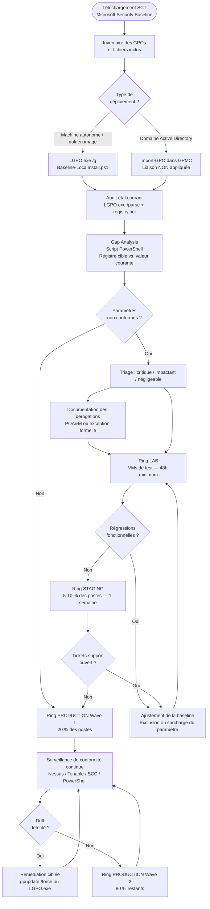

# Baselines de sécurité (CIS, STIG, Microsoft)

!!! abstract "Ce que vous allez apprendre"
    - Le contenu exact d'une **Microsoft Security Baseline** : GPOs prêtes à l'emploi, LGPO.exe, script `Baseline-LocalInstall.ps1`, et ce qui se passe concrètement lors de l'exécution
    - Les **CIS Benchmarks** : structure (Level 1 / Level 2), format des règles (chapitre → paramètre → clé de registre), et une table des 10 paramètres L1 les plus courants avec leurs valeurs recommandées
    - Les **STIG** (Security Technical Implementation Guide) : format XCCDF, outil STIG Viewer, STIG Checker, mapping vers les Event IDs et clés de registre
    - La **table comparative** des trois référentiels : organisation émettrice, fréquence de mise à jour, format, niveau de durcissement, outillage
    - Le **workflow enterprise** d'application d'une baseline : audit → gap analysis → déploiement progressif par ring
    - `LGPO.exe /g` pour appliquer une baseline Microsoft sans GPMC sur des machines autonomes ou golden images
    - Un **script PowerShell de gap analysis** : comparer les valeurs courantes du registre avec les valeurs cibles d'une baseline

---

!!! tip "Si vous ne retenez qu'une chose"
    Une baseline n'est pas un commutateur à basculer en production. C'est un **référentiel de départ** qui doit être audité, filtré selon votre contexte, puis déployé par ring progressif. La Microsoft Security Baseline appliquée telle quelle casse des applications legacy. Le CIS L2 désactive des fonctionnalités utilisées dans 30 % des parcs. La valeur réelle d'une baseline est dans la **gap analysis** — mesurer l'écart entre votre état actuel et la cible — pas dans l'application aveugle.

---

## :material-microsoft: Microsoft Security Baseline

### :material-package-variant: Contenu du package

La **Microsoft Security Baseline** est distribuée dans le **Security Compliance Toolkit (SCT)**, téléchargeable gratuitement sur le Microsoft Download Center.

**URL officielle :** [Security Compliance Toolkit](https://www.microsoft.com/en-us/download/details.aspx?id=55319)

Chaque baseline couvre une version spécifique de Windows. Les packages disponibles incluent :

| Produit | Version baseline courante |
|---------|--------------------------|
| Windows 11 | 23H2 (build 22631) |
| Windows 10 | 22H2 |
| Windows Server 2022 | GA |
| Windows Server 2019 | GA |
| Microsoft 365 Apps for Enterprise | v2306+ |
| Microsoft Edge | v117+ |

Chaque package contient trois éléments distincts :

1. **Un dossier `GPOs\`** — des GPOs prêtes à importer dans GPMC, au format GPT (GUID + GptTmpl.inf + registry.pol)
2. **`LGPO.exe`** — l'outil Microsoft d'application locale (voir chapitre [21 — LGPO](21-lgpo.md))
3. **`Baseline-LocalInstall.ps1`** — le script d'application autonome pour machines hors domaine ou golden images

### :material-folder-open: Structure d'un package SCT

```
Windows 11 v23H2 Security Baseline\
├── Documentation\
│   └── Windows 11 v23H2 Security Baseline.xlsx
├── GPOs\
│   ├── MSFT Windows 11 - Computer\
│   │   ├── {GUID}\
│   │   │   ├── GPT.INI
│   │   │   ├── Machine\
│   │   │   │   ├── Registry.pol
│   │   │   │   └── Microsoft\Windows NT\SecEdit\GptTmpl.inf
│   │   │   └── User\
│   │   │       └── Registry.pol
│   │   └── Backup.xml
│   ├── MSFT Windows 11 - User\
│   └── MSFT Windows 11 - Domain Security\
├── Scripts\
│   ├── Baseline-LocalInstall.ps1
│   ├── MapGuidsToGpoNames.ps1
│   └── LGPO.exe
└── Templates\
    └── PolicyDefinitions\
        ├── *.admx
        └── en-US\*.adml
```

### :material-cog-play: `Baseline-LocalInstall.ps1` : ce qui se passe réellement

Le script `Baseline-LocalInstall.ps1` est le point d'entrée pour appliquer une baseline sur une machine autonome.

Voici exactement ce qu'il exécute, dans l'ordre :

**Étape 1 — Préparation de l'environnement :** Le script vérifie que `LGPO.exe` est présent dans le même dossier que lui. Il monte les ADMX/ADML de la baseline dans `%SystemRoot%\PolicyDefinitions\` si le paramètre `-installADMX` est passé.

**Étape 2 — Application via LGPO.exe :** Pour chaque GPO du dossier `GPOs\`, le script appelle `LGPO.exe /g <chemin-gpo>`. Cette commande importe le contenu complet d'une GPO (registry.pol + GptTmpl.inf) dans la Local Group Policy.

**Étape 3 — Import GPMC (optionnel) :** Si la machine est jointe à un domaine et que `-installGPOs` est passé, le script utilise `Import-GPO` pour importer les GPOs dans GPMC.

```powershell title="Exécution de Baseline-LocalInstall.ps1"
# Run from the Scripts\ folder of the SCT package, elevated
# Apply baseline to Local Policy only (standalone / golden image)
.\Baseline-LocalInstall.ps1

# Apply baseline AND import GPOs into GPMC (domain-joined machine, GPMC installed)
.\Baseline-LocalInstall.ps1 -installGPOs

# Apply baseline AND copy ADMX/ADML templates to PolicyDefinitions
.\Baseline-LocalInstall.ps1 -installADMX
```

```title="Résultat attendu"
Applying machine settings via LGPO...
LGPO.exe — version 3.0.2004.13001
Command line: LGPO.exe /g "C:\SCT\GPOs\MSFT Windows 11 - Computer\{GUID}"
...
Applying user settings via LGPO...
Command line: LGPO.exe /g "C:\SCT\GPOs\MSFT Windows 11 - User\{GUID}"
...
Done. Machine must be rebooted for all settings to take effect.
```

### :material-import: Importer les GPOs dans GPMC

Pour importer manuellement les GPOs d'une baseline dans GPMC, sans passer par le script :

```powershell title="Import manuel d'une GPO baseline dans GPMC"
# Import the Computer baseline GPO into GPMC
# Requires the GPMC module and domain connectivity
Import-Module GroupPolicy

$backupPath = "C:\SCT\GPOs\MSFT Windows 11 - Computer"
$gpoName    = "MSFT Windows 11 v23H2 - Computer"
$domain     = (Get-ADDomain).DNSRoot

# Create a new GPO with the target name, then import the backup into it
$gpo = New-GPO -Name $gpoName -Domain $domain
Import-GPO -BackupGpoName "MSFT Windows 11 - Computer" `
           -Path $backupPath `
           -TargetName $gpoName `
           -Domain $domain
```

!!! warning "Ne pas lier directement la baseline en production"
    Importer une baseline dans GPMC ne la lie pas automatiquement. Ne la liez jamais directement à une OU de production sans avoir réalisé la gap analysis décrite plus loin dans ce chapitre. Appliquez-la d'abord à un ring de lab.

!!! quote "En résumé"
    - Le SCT contient des GPOs prêtes à l'emploi, LGPO.exe et `Baseline-LocalInstall.ps1`
    - `Baseline-LocalInstall.ps1` applique la baseline via `LGPO.exe /g` sur la Local Policy
    - L'import dans GPMC est possible via `Import-GPO`, mais la liaison reste manuelle et délibérée
    - Les versions de baseline sont alignées sur les versions de Windows (W11 23H2, Server 2022, etc.)

---

## :material-shield-check: CIS Benchmarks

### :material-book-open-variant: Structure d'un benchmark CIS

Les **CIS Benchmarks** (Center for Internet Security) sont des guides de configuration publiés par une organisation à but non lucratif et révisés par une communauté internationale de praticiens.

Chaque benchmark est un document PDF (et un fichier XCCDF pour l'automatisation) organisé en chapitres. Chaque règle suit le schéma :

```
<Numéro> <Titre>
  Profile Applicability: Level 1 ou Level 2
  Description: pourquoi ce paramètre est important
  Rationale: justification sécurité
  Audit: comment vérifier l'état courant
  Remediation: comment corriger (via GPO ou registre)
  Default Value: valeur par défaut de Windows
  References: mapping CVE, STIG, NIST SP 800-53
```

Le mapping **règle CIS → chemin GPO → clé de registre** est explicite dans chaque règle. Il n'y a pas d'ambiguïté.

### :material-layers-outline: Level 1 vs Level 2

| Niveau | Philosophie | Impact sur les fonctionnalités | Recommandé pour |
|--------|-------------|-------------------------------|-----------------|
| **L1** | Paramètres de sécurité raisonnables, applicables à la majorité des entreprises | Minimal — peu d'applications affectées | Tout parc, point de départ universel |
| **L2** | Durcissement maximal, profil haute sécurité | Significatif — certaines fonctionnalités désactivées | Postes sensibles, VDI, serveurs de haute criticité |

!!! warning "CIS L2 : liste des fonctionnalités cassées couramment"
    En L2, les paramètres suivants sont souvent problématiques en entreprise standard : désactivation de Windows Remote Management (WinRM), restriction des connexions Microsoft (OneDrive, MSA), désactivation de la recherche web dans le menu Démarrer, et restriction des drivers Bluetooth. Testez systématiquement avant déploiement.

### :material-table: 10 paramètres CIS L1 représentatifs (Windows 11)

| Règle CIS | Description | Chemin GPO | Clé de registre | Valeur recommandée |
|-----------|-------------|------------|-----------------|-------------------|
| 1.1.1 | Longueur minimale du mot de passe | Computer Config > Windows Settings > Security Settings > Account Policies | — (GptTmpl.inf `MinimumPasswordLength`) | `14` |
| 2.3.1.1 | Désactiver le compte Administrateur intégré | Computer Config > ... > Local Policies > Security Options | `MACHINE\SAM\SAM\Domains\Account\Users\000001F4` | `0` (désactivé) |
| 2.3.7.3 | Durée d'inactivité max avant verrouillage | Computer Config > ... > Security Options | `HKLM\SOFTWARE\Microsoft\Windows\CurrentVersion\Policies\System\InactivityTimeoutSecs` | `900` (15 min) |
| 2.3.11.3 | Signature LDAP requise | Computer Config > ... > Security Options | `HKLM\SYSTEM\CurrentControlSet\Services\NTDS\Parameters\LDAPServerIntegrity` | `2` |
| 2.3.15.1 | Renforcer les objets système globaux | Computer Config > ... > Security Options | `HKLM\SYSTEM\CurrentControlSet\Control\Session Manager\ProtectionMode` | `1` |
| 9.1.1 | Pare-feu : activer pour le profil Domain | Computer Config > ... > Windows Firewall > Domain Profile | `HKLM\SOFTWARE\Policies\Microsoft\WindowsFirewall\DomainProfile\EnableFirewall` | `1` |
| 17.1.1 | Auditer la gestion des comptes | Computer Config > ... > Advanced Audit Policy > Account Management | — (GptTmpl.inf Audit) | `Success and Failure` |
| 18.1.1.1 | Empêcher l'activation des personnalisations | Computer Config > Admin Templates > Control Panel > Personalization | `HKLM\SOFTWARE\Policies\Microsoft\Windows\Personalization\NoLockScreenCamera` | `1` |
| 18.9.13.1 | Désactiver Windows Error Reporting | Computer Config > Admin Templates > Windows Components > WER | `HKLM\SOFTWARE\Policies\Microsoft\Windows\Windows Error Reporting\Disabled` | `1` |
| 18.9.77.11 | Désactiver Solicited Remote Assistance | Computer Config > Admin Templates > System > Remote Assistance | `HKLM\SOFTWARE\Policies\Microsoft\Windows NT\Terminal Services\fAllowToGetHelp` | `0` |

!!! info "Le benchmark CIS est téléchargeable gratuitement (avec inscription)"
    [https://www.cisecurity.org/cis-benchmarks/](https://www.cisecurity.org/cis-benchmarks/) — La version PDF est libre. Les builds SCM (Security Configuration Manager) et les fichiers XCCDF automatisés nécessitent un abonnement CIS SecureSuite.

### :material-map-marker-path: Mapping CIS → chemin GPO

Chaque règle CIS mentionne explicitement le chemin dans l'éditeur GPO sous la forme :

```
Computer Configuration\Policies\Windows Settings\Security Settings\
  Local Policies\Security Options\
    Network security: LAN Manager authentication level
```

Ce chemin correspond directement à un nœud de `gpedit.msc` ou GPMC. Le fichier de stockage peut être `GptTmpl.inf` (pour les Security Settings) ou `registry.pol` (pour les Administrative Templates).

!!! quote "En résumé"
    - CIS Benchmarks = règles organisées par chapitre, chacune mappée vers un chemin GPO et une clé de registre
    - L1 = applicable partout avec impact minimal ; L2 = haute sécurité avec risque de casser des fonctionnalités
    - Chaque règle inclut l'audit et la remédiation — le document est auto-suffisant pour un pentest ou une revue de conformité
    - Le mapping CIS → registre est explicite dans chaque règle, sans ambiguïté

---

## :material-army: STIG (Security Technical Implementation Guide)

### :material-file-document: Format et origine

Les **STIG** sont publiés par la **DISA** (Defense Information Systems Agency, département de la Défense américain). Ils définissent les exigences de configuration pour les systèmes déployés dans les réseaux du DoD américain.

Bien que d'origine DoD, les STIG sont publiquement accessibles et adoptés par certaines entreprises européennes dans des contextes de haute assurance (banques, opérateurs d'importance vitale, industries de défense).

**URL officielle :** [https://public.cyber.mil/stigs/](https://public.cyber.mil/stigs/)

Chaque STIG est un fichier **XCCDF** (Extensible Configuration Checklist Description Format) — un XML structuré décrivant les règles, leur sévérité, et les procédures de vérification.

### :material-alert-rhombus: Niveaux de sévérité STIG

| Catégorie | Code | Signification | Exemple |
|-----------|------|---------------|---------|
| **CAT I** | High | Vulnérabilité critique — exploitation directement possible | Compte sans mot de passe, telnet activé |
| **CAT II** | Medium | Vulnérabilité significative | Audit insuffisant, SMBv1 activé |
| **CAT III** | Low | Bonne pratique, impact limité si non corrigé | Configuration de banner de login |

!!! info "Règle de gestion STIG"
    Dans les environnements DoD, toutes les CAT I doivent être corrigées ou justifiées par un **POA&M** (Plan of Action and Milestones). Les CAT II ont un délai de 90 jours. Les CAT III sont optionnelles mais documentées.

### :material-application: STIG Viewer

**STIG Viewer** est l'outil officiel DISA pour consulter et gérer les STIG. Il s'agit d'une application Java desktop téléchargeable sur [public.cyber.mil](https://public.cyber.mil/stigs/srg-stig-tools/).

STIG Viewer permet de :

1. **Charger un fichier XCCDF** — importez le STIG ZIP directement depuis l'interface
2. **Créer une checklist** — instanciez le STIG pour une machine cible, documentez l'état de chaque règle (Open, Not a Finding, Not Applicable, Not Reviewed)
3. **Exporter une checklist** — format `.ckl` (XML) utilisable par les outils d'automatisation DISA et les scanners de conformité

```powershell title="Exporter une checklist STIG Viewer en PowerShell (lecture .ckl)"
# Parse a STIG Viewer checklist (.ckl) to extract non-compliant rules
[xml]$checklist = Get-Content "C:\Audit\Win11-STIG.ckl"

$results = $checklist.CHECKLIST.STIGS.iSTIG.VULN | ForEach-Object {
    $status    = ($_.STATUS)
    $vulnId    = ($_.STIG_DATA | Where-Object { $_.VULN_ATTRIBUTE -eq "Vuln_Num" }).ATTRIBUTE_DATA
    $severity  = ($_.STIG_DATA | Where-Object { $_.VULN_ATTRIBUTE -eq "Severity" }).ATTRIBUTE_DATA
    $ruleTitle = ($_.STIG_DATA | Where-Object { $_.VULN_ATTRIBUTE -eq "Rule_Title" }).ATTRIBUTE_DATA

    [PSCustomObject]@{
        VulnID    = $vulnId
        Severity  = $severity
        Status    = $status
        Title     = $ruleTitle
    }
}

# Show only Open findings (non-compliant)
$openFindings = $results | Where-Object { $_.Status -eq "Open" }
$openFindings | Sort-Object Severity | Format-Table -AutoSize
```

```title="Résultat attendu"
VulnID    Severity Status Title
------    -------- ------ -----
V-253260  high     Open   Windows 11 accounts must require passwords.
V-253262  medium   Open   Windows 11 must be configured to audit Account Logon...
V-253301  medium   Open   Windows 11 AutoPlay must be disabled for all drives.
```

### :material-link-variant: Mapping STIG → clés de registre et Event IDs

Chaque règle STIG inclut une section **Check** décrivant la procédure de vérification. Pour les paramètres de registre, elle spécifie :

- Le chemin de clé exact (`HKLM\...`)
- La valeur attendue
- L'Event ID associé si applicable

Exemple de règle STIG (extraite de la section Check) :

```
Rule: V-253260 — WN11-AC-000040
Check: HKEY_LOCAL_MACHINE\SOFTWARE\Microsoft\Windows\CurrentVersion\Policies\System
       Value Name: EnableSmartScreen
       Value Type: REG_DWORD
       Value: 1
       
Event ID associé: 4657 (modification d'une valeur de registre auditée)
```

!!! info "STIG Checker (SCC) pour l'audit automatisé"
    **SCAP Compliance Checker (SCC)**, distribué par DISA, automatise la vérification des STIG. Il lit les fichiers XCCDF et OVAL, exécute les checks sur la machine locale, et produit un rapport HTML et un fichier `.ckl` exploitable par STIG Viewer. Disponible sur [public.cyber.mil/stigs/scap/](https://public.cyber.mil/stigs/scap/).

!!! quote "En résumé"
    - Les STIG sont des référentiels DoD en format XCCDF, publiquement accessibles
    - CAT I = critique (à corriger en priorité), CAT II = significatif, CAT III = best practice
    - STIG Viewer = outil de consultation, création et gestion de checklists `.ckl`
    - SCC (SCAP Compliance Checker) automatise la vérification des règles STIG sur une machine
    - Chaque règle STIG mappe vers une clé de registre, une valeur et souvent un Event ID

---

## :material-compare: Comparaison des trois référentiels

| Critère | Microsoft Security Baseline | CIS Benchmark | STIG (DISA) |
|---------|-----------------------------|---------------|-------------|
| **Organisation émettrice** | Microsoft | Center for Internet Security (ONG) | DISA (DoD américain) |
| **Public cible** | Entreprises Microsoft-centric | Toutes entreprises | DoD + hauts niveaux d'assurance |
| **Fréquence de mise à jour** | À chaque version Windows (6-12 mois) | Annuel à bi-annuel | Trimestriel à semestriel |
| **Format de distribution** | GPOs + LGPO.exe + XLSX | PDF + XCCDF (SecureSuite) | ZIP XCCDF + OVAL |
| **Niveau de durcissement** | Modéré — orienté praticabilité | L1 modéré / L2 élevé | Très élevé (orienté DoD) |
| **Couverture** | Windows, M365 Apps, Edge | Windows, Linux, réseau, cloud | Windows, Linux, réseau, applis |
| **Outillage natif** | LGPO.exe, `Baseline-LocalInstall.ps1`, SCM | SCM, CIS-CAT (SecureSuite) | STIG Viewer, SCC (SCAP) |
| **Mapping GPO** | Direct (GPOs livrées) | Manuel (chemin indiqué dans la règle) | Manuel (clé de registre dans la règle Check) |
| **Coût** | Gratuit | PDF gratuit / XCCDF payant (SecureSuite) | Gratuit |
| **Adoption en France** | Très large | Large (DSI et RSSI) | Niche (OIV, défense, finance) |
| **Compatibilité ANSSI** | Partielle | Partielle | Partielle (mapping STIG ↔ ANSSI possible) |

!!! info "Microsoft Security Compliance Manager (SCM)"
    Le **Security Compliance Manager** est un outil Microsoft (distinct du SCT) qui permet de comparer les paramètres d'une baseline avec la configuration courante d'une machine et d'exporter des rapports de conformité. Il utilise le même format de données que les GPOs du SCT.

---

## :material-sitemap: Workflow enterprise d'application d'une baseline

### :material-chart-timeline: Les quatre phases

L'application d'une baseline en production ne se fait pas en une seule opération. Elle suit un workflow structuré en quatre phases.

**Phase 1 — Audit de l'état courant :** Capturez la configuration réelle des machines de référence. Exportez les `registry.pol` existants via `LGPO.exe /parse`. Documentez les dérogations déjà en place.

**Phase 2 — Gap analysis :** Comparez l'état courant avec les valeurs cibles de la baseline. Identifiez les paramètres qui différent. Classez-les par criticité (paramètres de sécurité critiques vs. paramètres de confort).

**Phase 3 — Application par ring progressif :** Déployez sur un ring de lab (machines de test sans données production), puis sur un ring de staging (machines pilotes avec utilisateurs volontaires), puis en production par vague contrôlée.

**Phase 4 — Surveillance de conformité continue :** Mesurez l'écart de conformité en continu. Toute GPO ou script qui modifie un paramètre couvert par la baseline doit être tracé.

### :material-source-branch: Les rings de déploiement

| Ring | Population | Durée minimale | Critères de passage |
|------|------------|----------------|---------------------|
| **Lab** | Machines virtuelles de test | 48h | Aucune régression fonctionnelle détectée |
| **Staging** | 5-10 % des postes, volontaires | 1 semaine | Aucun ticket support ouvert sur les paramètres baseline |
| **Production Wave 1** | 20 % des postes (early adopters) | 2 semaines | Taux d'incidents < seuil défini |
| **Production Wave 2** | 80 % restants | Selon capacité | — |

### :material-tools: Outils de mesure de conformité

| Outil | Type | Usage principal |
|-------|------|-----------------|
| **Microsoft SCM** | Desktop | Comparaison baseline GPO vs. machine locale |
| **Nessus** (plugin Windows Compliance) | Scanner réseau | Audit de conformité à distance, reporting SIEM |
| **Tenable.sc / Tenable.io** | Plateforme | Conformité continue, dashboards CIS/STIG, ticketing |
| **SCC (SCAP Compliance Checker)** | Desktop | Audit STIG automatisé, export `.ckl` |
| **CIS-CAT Pro** | SaaS/Desktop | Audit CIS Benchmarks automatisé (SecureSuite) |
| **PowerShell** | Script | Gap analysis ad hoc, intégration CI/CD |

### :material-code-braces: Script PowerShell de gap analysis

Ce script compare un ensemble de valeurs de registre cibles (définies dans un CSV ou une hashtable) avec les valeurs réellement présentes sur la machine.

```powershell title="Gap analysis : baseline registry check"
# Baseline Gap Analysis Script
# Compare current registry values against a defined baseline

# Define the baseline as an array of target settings
# Format: Path, ValueName, ExpectedData, ValueType (REG_DWORD | REG_SZ | REG_QWORD)
$baselineTargets = @(
    # CIS L1 / Microsoft Baseline — sample parameters
    [PSCustomObject]@{
        Path     = 'HKLM:\SOFTWARE\Policies\Microsoft\Windows\WindowsUpdate\AU'
        Name     = 'NoAutoUpdate'
        Expected = 0
        Type     = 'DWORD'
        RuleRef  = 'CIS 18.9.101.2'
    },
    [PSCustomObject]@{
        Path     = 'HKLM:\SYSTEM\CurrentControlSet\Services\LanmanServer\Parameters'
        Name     = 'SMB1'
        Expected = 0
        Type     = 'DWORD'
        RuleRef  = 'CIS 18.3.3 / STIG V-253381'
    },
    [PSCustomObject]@{
        Path     = 'HKLM:\SYSTEM\CurrentControlSet\Control\Lsa'
        Name     = 'LmCompatibilityLevel'
        Expected = 5
        Type     = 'DWORD'
        RuleRef  = 'CIS 2.3.11.7 / MSFT Baseline'
    },
    [PSCustomObject]@{
        Path     = 'HKLM:\SOFTWARE\Policies\Microsoft\Windows NT\Terminal Services'
        Name     = 'fAllowToGetHelp'
        Expected = 0
        Type     = 'DWORD'
        RuleRef  = 'CIS 18.9.77.11'
    },
    [PSCustomObject]@{
        Path     = 'HKLM:\SOFTWARE\Microsoft\Windows\CurrentVersion\Policies\System'
        Name     = 'EnableSmartScreen'
        Expected = 1
        Type     = 'DWORD'
        RuleRef  = 'STIG V-253260'
    },
    [PSCustomObject]@{
        Path     = 'HKLM:\SYSTEM\CurrentControlSet\Control\Lsa'
        Name     = 'RestrictAnonymous'
        Expected = 1
        Type     = 'DWORD'
        RuleRef  = 'CIS 2.3.10.2 / MSFT Baseline'
    }
)

# Run the gap analysis
$results = foreach ($target in $baselineTargets) {
    $currentValue = $null
    $status       = 'UNKNOWN'

    try {
        $regItem = Get-ItemProperty -Path $target.Path -Name $target.Name -ErrorAction Stop
        $currentValue = $regItem.($target.Name)

        $status = if ($currentValue -eq $target.Expected) { 'COMPLIANT' } else { 'NON-COMPLIANT' }
    }
    catch [System.Management.Automation.ItemNotFoundException] {
        $status       = 'MISSING'
        $currentValue = '(key or value not found)'
    }

    [PSCustomObject]@{
        Rule        = $target.RuleRef
        Path        = $target.Path -replace 'HKLM:\\', 'HKLM\'
        ValueName   = $target.Name
        Expected    = $target.Expected
        Current     = $currentValue
        Status      = $status
    }
}

# Display summary
$compliant    = ($results | Where-Object Status -eq 'COMPLIANT').Count
$nonCompliant = ($results | Where-Object Status -eq 'NON-COMPLIANT').Count
$missing      = ($results | Where-Object Status -eq 'MISSING').Count

Write-Host "`n=== Gap Analysis Results ===" -ForegroundColor Cyan
Write-Host "  Compliant     : $compliant" -ForegroundColor Green
Write-Host "  Non-Compliant : $nonCompliant" -ForegroundColor Red
Write-Host "  Missing       : $missing" -ForegroundColor Yellow
Write-Host ""

$results | Sort-Object Status | Format-Table Rule, ValueName, Expected, Current, Status -AutoSize

# Export to CSV for reporting
$reportPath = "C:\Audit\gap-analysis-$(Get-Date -Format 'yyyyMMdd-HHmmss').csv"
$results | Export-Csv -Path $reportPath -NoTypeInformation -Encoding UTF8
Write-Host "Report exported to: $reportPath"
```

```title="Résultat attendu"
=== Gap Analysis Results ===
  Compliant     : 4
  Non-Compliant : 1
  Missing       : 1

Rule                        ValueName              Expected Current  Status
----                        ---------              -------- -------  ------
CIS 18.3.3 / STIG V-253381  SMB1                   0        0        COMPLIANT
CIS 18.9.101.2              NoAutoUpdate           0        0        COMPLIANT
CIS 18.9.77.11              fAllowToGetHelp        0        0        COMPLIANT
STIG V-253260               EnableSmartScreen      1        0        NON-COMPLIANT
CIS 2.3.10.2 / MSFT Baseline RestrictAnonymous    1        (key..)  MISSING
CIS 2.3.11.7 / MSFT Baseline LmCompatibilityLevel 5        5        COMPLIANT

Report exported to: C:\Audit\gap-analysis-20240315-142301.csv
```

!!! warning "Gap analysis vs. état GPO effectif"
    Ce script lit les valeurs de registre directement. Une valeur conforme peut être écrite par une GPO ou par une application. Une valeur non conforme peut être absente parce qu'aucune GPO ne la configure, ou parce qu'une GPO est en conflit. Pour distinguer origine GPO vs. application, utilisez `LGPO.exe /parse` ou `RSoP` (voir [20 — RSoP et diagnostic](20-rsop-diagnostic.md)).

!!! quote "En résumé"
    - Workflow baseline = audit → gap analysis → lab → staging → production par vague
    - Ne jamais appliquer une baseline en production sans gap analysis préalable
    - Outils de mesure : SCM (Microsoft), Nessus/Tenable (réseau), SCC (STIG), PowerShell (ad hoc)
    - Le script de gap analysis lit le registre en direct — complément de RSoP, pas substitut

---

## :material-server: Appliquer une baseline sans GPMC : LGPO.exe `/g`

### :material-target: Cas d'usage

`LGPO.exe /g` est la commande centrale pour appliquer une baseline Microsoft sur une machine **sans domaine Active Directory** et **sans GPMC installé**.

Cas d'usage typiques :
- Machine autonome (workgroup, laptop de terrain)
- Préparation d'une **golden image** avant sysprep
- Pipeline CI/CD de validation de configuration (VM provisionnée, baseline appliquée, tests, snapshot)
- Poste nouvellement installé avant jonction de domaine

### :material-play-circle: Syntaxe de `LGPO.exe /g`

```cmd title="Appliquer une GPO complète via LGPO.exe /g"
REM Apply a full GPO backup folder to the Local Group Policy
REM The folder must contain a valid GPT structure (GPT.INI + Machine\ or User\)
LGPO.exe /g "C:\SCT\GPOs\MSFT Windows 11 - Computer\{GUID}"

REM Apply multiple GPOs in sequence
LGPO.exe /g "C:\SCT\GPOs\MSFT Windows 11 - Computer\{GUID}"
LGPO.exe /g "C:\SCT\GPOs\MSFT Windows 11 - User\{GUID}"
LGPO.exe /g "C:\SCT\GPOs\MSFT Windows 11 - Domain Security\{GUID}"
```

La commande `/g` lit le dossier GPO (au format GPT, avec `GPT.INI` et les sous-dossiers `Machine\` et/ou `User\`) et applique son contenu à la Local Group Policy via les mêmes mécanismes que si la GPO était liée à l'OU de la machine.

!!! info "Différence entre /g, /t et /m"
    - `/g <dossier>` : applique une GPO complète (registry.pol + GptTmpl.inf si présent)
    - `/t <fichier.txt>` : applique un fichier LGPO.txt (format texte, registre uniquement)
    - `/m <registry.pol>` : importe un fichier `registry.pol` spécifique (section Machine)
    - `/u <registry.pol>` : importe un fichier `registry.pol` spécifique (section User)

### :material-file-document-outline: Internals de `Baseline-LocalInstall.ps1`

Voici la logique centrale du script, reconstituée pour comprendre ce qu'il fait réellement :

```powershell title="Logique centrale de Baseline-LocalInstall.ps1 (reconstituée)"
# Core logic of Baseline-LocalInstall.ps1 — simplified for clarity
param(
    [switch]$installGPOs,
    [switch]$installADMX
)

$scriptDir = Split-Path -Parent $MyInvocation.MyCommand.Path
$lgpoExe   = Join-Path $scriptDir "LGPO.exe"
$gposDir   = Join-Path $scriptDir "..\GPOs"

# Verify LGPO.exe is present
if (-not (Test-Path $lgpoExe)) {
    Write-Error "LGPO.exe not found at $lgpoExe. Aborting."
    exit 1
}

# Optionally install ADMX templates
if ($installADMX) {
    $templateSrc = Join-Path $scriptDir "..\Templates\PolicyDefinitions"
    $templateDst = "$env:SystemRoot\PolicyDefinitions"
    Copy-Item -Path "$templateSrc\*" -Destination $templateDst -Recurse -Force
    Write-Host "ADMX templates installed to $templateDst"
}

# Apply each GPO folder via LGPO.exe /g
Get-ChildItem -Path $gposDir -Directory | ForEach-Object {
    $gpoFolder = $_.FullName
    # Each GPO backup contains a subfolder named with the GPO's GUID
    $guidFolders = Get-ChildItem -Path $gpoFolder -Directory -Filter '{*}'

    foreach ($guidFolder in $guidFolders) {
        Write-Host "Applying: $($_.Name) [$($guidFolder.Name)]"
        & $lgpoExe /g $guidFolder.FullName
        if ($LASTEXITCODE -ne 0) {
            Write-Warning "LGPO.exe returned exit code $LASTEXITCODE for $($guidFolder.FullName)"
        }
    }
}

Write-Host "Baseline application complete. Reboot required."

# Optionally import GPOs into GPMC (domain-joined only)
if ($installGPOs) {
    Import-Module GroupPolicy -ErrorAction Stop
    # [Import logic — calls Import-GPO for each GPO folder]
}
```

!!! warning "Droits requis : SYSTEM ou Administrateur local élevé"
    `LGPO.exe /g` doit être exécuté en tant qu'administrateur local avec élévation UAC. Pour les pipelines CI/CD ou les scripts de golden image, exécutez-le via une session élevée ou depuis le contexte SYSTEM (ex. : tâche planifiée SYSTEM, MDT, Configuration Manager).

!!! quote "En résumé"
    - `LGPO.exe /g <dossier-gpo>` applique une GPO complète à la Local Policy sans domaine ni GPMC
    - `Baseline-LocalInstall.ps1` itère sur les dossiers GPO du SCT et appelle `/g` sur chacun
    - Cas d'usage : machine autonome, golden image, pipeline CI/CD
    - Droits requis : administrateur local élevé ou SYSTEM

---

## :material-chart-gantt: Diagramme : cycle de vie du déploiement d'une baseline



!!! info "Drift de conformité"
    Le **drift** est l'écart progressif entre la baseline appliquée et l'état réel de la machine, causé par des mises à jour Windows, des scripts de déploiement, des GPOs concurrentes ou des modifications manuelles. La surveillance continue est indispensable — une baseline appliquée une fois ne reste pas conforme indéfiniment.

---

## :material-link: Références croisées

- **[13 — Stratégies de sécurité](13-securite-strategies.md)** — Les paramètres `GptTmpl.inf` (mot de passe, audit, droits utilisateur, options de sécurité) sont au cœur de toute baseline. Les baselines Microsoft et CIS les configurent massivement.
- **[21 — LGPO et stratégies locales multiples](21-lgpo.md)** — `LGPO.exe` est l'outil d'application des baselines sur machines autonomes. Ce chapitre couvre le format `LGPO.txt`, les couches MLGPO et les cas d'usage de golden image.
- **[../gpo-pour-les-admins/06-audit-conformite.md](../gpo-pour-les-admins/06-audit-conformite.md)** — Mesurer la conformité à une baseline en environnement de domaine : RSoP, rapports GPMC, intégration Nessus.
