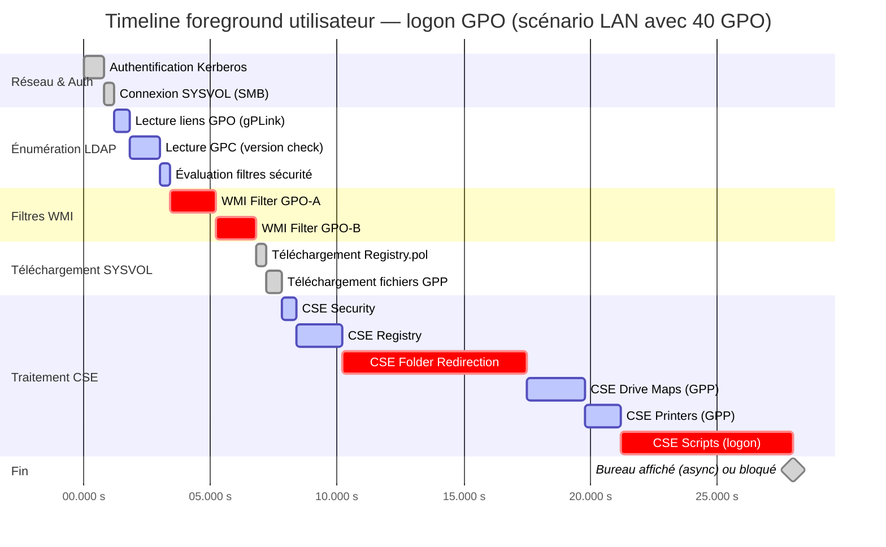

# Performances et optimisation des GPO

!!! abstract "Ce que vous allez apprendre"
    - Comment mesurer précisément le temps de traitement GPO par CSE avec les Event IDs 4001, 4016, 4017, 5016 et 5017
    - Les cinq causes les plus fréquentes de dégradation du logon time et leurs méthodes de détection
    - Le compromis consolidation vs séparation des GPO et l'impact mesurable du nombre de GPO sur l'énumération LDAP
    - Les flags de traitement asynchrone (`NoGPOListChanges`, `EnableAsynchronousProcessing`) et quelles CSE les supportent
    - La structure et le comportement du cache local dans `%SystemRoot%\System32\GroupPolicy\`
    - La lecture du journal opérationnel Group Policy avec PowerShell pour construire un tableau de bord de temps de logon
    - Les seuils d'alerte opérationnels et les points de contrôle d'un logon timeline annoté

!!! tip "Si vous ne retenez qu'une chose"
    Le temps de traitement foreground GPO se mesure avec précision dans le journal `Microsoft-Windows-GroupPolicy/Operational`. Chaque CSE émet des événements de début et de fin avec des timestamps. Un temps de traitement foreground supérieur à 30 secondes est le seuil d'investigation. Au-delà de cette valeur, la cause est presque toujours l'une des cinq identifiées dans ce chapitre.

---

## :material-chart-timeline: Métriques de mesure du traitement GPO

### :material-identifier: Les Event IDs essentiels

Le journal `Microsoft-Windows-GroupPolicy/Operational` est la source de vérité pour mesurer les performances GPO. Il est activé par défaut sur tous les systèmes Windows Vista et ultérieurs.

Chaque cycle de traitement complet produit une séquence d'événements traçables. Les cinq Event IDs fondamentaux pour l'analyse de performance sont :

| Event ID | Signification | Données utiles |
|----------|--------------|----------------|
| **4001** | Démarrage du traitement foreground machine | Timestamp de début de cycle |
| **4016** | Démarrage du traitement d'une CSE spécifique | GUID CSE, nom CSE, contexte (machine/user) |
| **4017** | Fin du traitement d'une CSE spécifique | GUID CSE, durée en millisecondes |
| **5016** | Fin du traitement foreground complet | Durée totale, nombre de GPO traitées |
| **5017** | Fin du traitement background complet | Durée totale, statut de chaque CSE |

!!! info "Foreground vs background"
    Les IDs 4001/5016 couvrent le cycle foreground (démarrage machine ou ouverture de session). Le cycle background génère des événements distincts mais avec la même logique de paires début/fin par CSE.

!!! check "Point de contrôle"
    Avant de continuer, vérifiez que vous avez bien compris :
    - les repères de lecture du tableau précédent : `Event ID`, `Signification`, `Données utiles`
    - l'artefact technique à savoir relire sans chercher : `Microsoft-Windows-GroupPolicy/Operational`
    - le contrôle terrain à effectuer avant de passer à la suite de **Les Event IDs essentiels**

### :material-timer: Calculer le temps par CSE en PowerShell

Le script suivant parse le journal opérationnel et calcule le temps de traitement de chaque CSE pour le dernier cycle foreground utilisateur.

```powershell title="Get-GPOLogonPerf.ps1"
# Parse Group Policy Operational log and calculate per-CSE processing time
# Covers the most recent foreground user logon cycle

$logName = 'Microsoft-Windows-GroupPolicy/Operational'

# Retrieve CSE start (4016) and end (4017) events
$startEvents = Get-WinEvent -LogName $logName -FilterXPath `
    "*[System[EventID=4016]]" -ErrorAction SilentlyContinue

$endEvents = Get-WinEvent -LogName $logName -FilterXPath `
    "*[System[EventID=4017]]" -ErrorAction SilentlyContinue

# Build a hashtable keyed on ActivityID to correlate start/end pairs
$startTable = @{}
foreach ($evt in $startEvents) {
    $actId = $evt.ActivityId
    if (-not $startTable.ContainsKey($actId)) {
        $startTable[$actId] = $evt
    }
}

$results = foreach ($evt in $endEvents) {
    $actId = $evt.ActivityId
    if ($startTable.ContainsKey($actId)) {
        $startEvt = $startTable[$actId]
        $xml = [xml]$evt.ToXml()
        $cseName = ($xml.Event.EventData.Data |
            Where-Object { $_.Name -eq 'CSEExtensionName' }).'#text'
        $durationMs = ($xml.Event.EventData.Data |
            Where-Object { $_.Name -eq 'ElapsedTimeInMilliseconds' }).'#text'
        [PSCustomObject]@{
            CSEName    = $cseName
            StartTime  = $startEvt.TimeCreated
            EndTime    = $evt.TimeCreated
            DurationMs = [int]$durationMs
        }
    }
}

$results |
    Sort-Object DurationMs -Descending |
    Format-Table CSEName, StartTime, DurationMs -AutoSize
```

```powershell title="Résultat attendu"
CSEName                                    StartTime            DurationMs
-------                                    ---------            ----------
Folder Redirection                         2026-04-05 08:14:22    8 432
Registry                                   2026-04-05 08:14:18    3 210
Group Policy Preferences (Drive Maps)      2026-04-05 08:14:30    2 847
Security                                   2026-04-05 08:14:16      512
Scripts                                    2026-04-05 08:14:31      234
```

!!! check "Point de contrôle"
    Avant de continuer, vérifiez que vous avez bien compris :
    - le but précis de cette sous-section : **Calculer le temps par CSE en PowerShell**
    - la valeur, le GUID ou le paramètre qui change réellement le résultat dans **Calculer le temps par CSE en PowerShell**
    - la commande ou l'étape de validation à pouvoir rejouer en labo : `$logName = 'Microsoft-Windows-GroupPolicy/Operational'`

### :material-speedometer: Valeurs normales et seuils d'alerte

Un cycle foreground sain sur un réseau LAN avec 20 à 40 GPO typiques produit les valeurs suivantes :

| Indicateur | Valeur normale | Seuil d'investigation |
|-----------|---------------|----------------------|
| Durée totale foreground (Event 5016) | < 10 secondes | > 30 secondes |
| Durée d'une CSE individuelle | < 2 secondes | > 5 secondes |
| Nombre de GPO énumérées | < 50 | > 100 |
| Requêtes LDAP générées | < 5 | > 20 |

!!! warning "L'impact sur l'expérience utilisateur"
    En mode synchrone (`SyncForegroundPolicy = 1`), chaque seconde de traitement GPO retarde directement l'affichage du bureau. Un logon à 45 secondes est perceptible et génère des tickets support. Au-delà de 60 secondes, les utilisateurs supposent une panne.

!!! check "Point de contrôle"
    Avant de continuer, vérifiez que vous avez bien compris :
    - les repères de lecture du tableau précédent : `Indicateur`, `Valeur normale`, `Seuil d'investigation`
    - l'artefact technique à savoir relire sans chercher : `SyncForegroundPolicy = 1`
    - le contrôle terrain à effectuer avant de passer à la suite de **Valeurs normales et seuils d'alerte**

### :material-network: Trafic LDAP généré par l'énumération des GPO

Avant même d'appeler une seule CSE, `gpsvc` interroge Active Directory pour construire la liste ordonnée des GPO applicables. Cette phase d'énumération génère plusieurs requêtes LDAP :

1. Requête sur les OU parentes pour récupérer les liens GPO (`gPLink`)
2. Requête sur chaque GPC (objet `groupPolicyContainer`) pour lire les attributs de version
3. Requête sur les filtres de sécurité (lecture des ACL de chaque GPO liée)
4. Évaluation des filtres WMI (côté client, aucune requête LDAP pour cette étape)

Avec 100 GPO liées sur le chemin d'une OU, l'étape 2 seule peut générer 100 requêtes LDAP individuelles. Chacune ajoute une latence réseau cumulée.

!!! quote "En résumé"
    - Les Event IDs 4016/4017 permettent de mesurer le temps de chaque CSE avec précision au milliseconde près
    - Le seuil d'alerte opérationnel est 30 secondes pour le cycle foreground complet (Event 5016)
    - L'énumération LDAP pré-CSE est coûteuse : elle est proportionnelle au nombre de GPO liées sur le chemin de l'OU
    - Le script `Get-GPOLogonPerf.ps1` suffit pour identifier la CSE responsable d'un logon lent

---

## :material-skull: Les cinq tueurs de performances GPO

### :material-table: Tableau de référence

| # | Problème | Impact | Détection | Correction |
|---|---------|--------|-----------|------------|
| 1 | **Filtres WMI** évalués côté client | +2 à +15 s par GPO filtrée | Event 4016/4017 sur la CSE `{00000000-0000-0000-0000-000000000000}` avec durée élevée | Remplacer par Security Filtering ou ILT Registry |
| 2 | **ILT avec requêtes LDAP** | +1 à +5 s par item LDAP | Event ID 4257 (GPP processing) + traces Netmon/Wireshark | Remplacer les conditions LDAP par des conditions Registry ou Group Membership |
| 3 | **Scripts de logon synchrones** | Bloque le bureau pendant toute la durée du script | Event 4016/4017 sur CSE Scripts avec durée > 5 s | Passer en asynchrone, ou migrer vers une tâche planifiée ou un package PSADT |
| 4 | **Folder Redirection sur lien lent** | +10 à +60 s si le serveur de fichiers est distant ou saturé | Event 4016/4017 sur CSE Folder Redirection ; Event 5016 indiquant une détection de lien lent | Configurer la politique de lien lent pour ignorer Folder Redirection sous 500 Kbps |
| 5 | **Trop de GPO liées** (100+) | +5 à +20 s en énumération LDAP pure | Comptage avec `Get-GPInheritance` ; corrélation avec la durée pré-CSE dans Event 4001→4016 | Consolider, supprimer les GPO vides, déplacer les GPO hors de scope |

!!! check "Point de contrôle"
    Avant de continuer, vérifiez que vous avez bien compris :
    - les repères de lecture du tableau précédent : `#`, `Problème`, `Impact`
    - l'artefact technique à savoir relire sans chercher : `{00000000-0000-0000-0000-000000000000}`
    - le second repère technique à retenir avant de continuer : `Get-GPInheritance`

### :material-filter-variant: 1. Les filtres WMI — coût côté client

Un filtre WMI est une requête WQL évaluée **sur le poste client** à chaque cycle de traitement. Il n'y a aucune mise en cache. Une GPO avec un filtre WMI coûte le temps d'exécution de la requête à chaque foreground et à chaque background.

Une requête WQL mal écrite qui parcourt `Win32_Product` (qui déclenche un MSI reconfiguration scan) peut prendre 30 secondes à elle seule. Même une requête `Win32_ComputerSystem` simple ajoute 200 à 800 ms selon la charge du poste.

!!! warning "Le piège Win32_Product"
    N'utilisez jamais `Win32_Product` dans un filtre WMI GPO. Cette classe WMI déclenche une vérification de cohérence de tous les packages MSI installés à chaque appel. Sur un poste avec 50 applications, cela peut dépasser 60 secondes et provoquer des repairs MSI involontaires.

La solution de remplacement pour la majorité des cas d'usage WMI est le **Security Filtering** ou une condition **ILT de type Registry** — toutes deux nettement moins coûteuses.

### :material-database-search: 2. L'ILT avec requêtes LDAP

Chaque item GPP configuré avec une condition ILT de type **LDAP Query** génère une requête LDAP distincte au moment de l'évaluation. Si vous avez 20 lecteurs réseau mappés avec une condition LDAP chacun, vous générez 20 requêtes LDAP pendant le logon.

Avec une latence AD de 5 ms par requête, cela représente 100 ms — négligeable. Avec une latence de 50 ms (site distant), cela monte à 1 seconde uniquement pour les requêtes LDAP d'évaluation ILT, avant même que les lecteurs soient mappés.

Pour les détails sur l'architecture ILT et les alternatives, voir [Chapitre 12 — Item-Level Targeting avancé](12-ilt.md).

### :material-script: 3. Les scripts de logon synchrones

La CSE Scripts (`{42B5FAAE-6536-11D2-AE5A-0000F87571E3}`) exécute les scripts dans l'ordre déclaré. Chaque script doit se terminer avant que le suivant démarre. En mode foreground synchrone, aucun bureau n'est affiché pendant ce temps.

Un script qui effectue un appel réseau (test de connectivité, lecture d'un partage), un timeout DNS, ou qui lance un processus lourd (Java, .NET heavy startup) peut bloquer le logon plusieurs dizaines de secondes.

La règle opérationnelle est simple : si un script de logon dépasse 3 secondes en conditions normales, il doit être asynchronisé ou remplacé par une tâche planifiée au démarrage de session.

### :material-folder-network: 4. La redirection de dossiers sur lien lent

La CSE Folder Redirection (`{25537523-E41F-11D2-B10E-00C04F799F7C}`) reconfigure les chemins shell (`%APPDATA%`, `%DESKTOP%`, etc.) pour pointer vers un partage réseau. Cette opération nécessite que le partage soit accessible et répond avant de continuer.

Sur un lien lent ou un serveur de fichiers surchargé, cette CSE peut attendre plusieurs dizaines de secondes une réponse SMB. Sur les postes mobiles hors réseau d'entreprise, le timeout peut atteindre la valeur configurée dans les stratégies de détection de lien lent.

La configuration correcte est de désactiver Folder Redirection sur les liens lents via `Computer Configuration > Policies > Administrative Templates > System > Group Policy > Configure Folder Redirection policy processing`.

### :material-graph: 5. Trop de GPO liées

L'énumération des GPO applicables est une opération LDAP proportionnelle au nombre de GPO liées sur le chemin OU → domaine → site. Chaque GPO nécessite au minimum une lecture de l'objet GPC pour vérifier la version.

```powershell title="Compter les GPO effectives sur une OU"
# Count all GPO links on the path from a target OU to the domain root
$ou = 'OU=Workstations,OU=Paris,DC=corp,DC=contoso,DC=com'
$inheritance = Get-GPInheritance -Target $ou
$inheritance.InheritedGpoLinks | Measure-Object | Select-Object Count
```

```text title="Résultat attendu"
Count
-----
   87
```

87 GPO sur le chemin signifie 87 lectures GPC au minimum. Sur un DC distant avec 10 ms de latence, c'est 870 ms de pure latence LDAP avant que la première CSE soit appelée.

!!! check "Point de contrôle"
    Avant de continuer, vérifiez que vous avez bien compris :
    - le but précis de cette sous-section : **5. Trop de GPO liées**
    - la valeur, le GUID ou le paramètre qui change réellement le résultat dans **5. Trop de GPO liées**
    - la commande ou l'étape de validation à pouvoir rejouer en labo : `$ou = 'OU=Workstations,OU=Paris,DC=corp,DC=contoso,DC=com'`

!!! quote "En résumé"
    - Les filtres WMI sont les plus coûteux car non mis en cache et évalués à chaque cycle
    - L'ILT LDAP multiplie les requêtes AD proportionnellement au nombre d'items ciblés
    - Les scripts synchrones bloquent le bureau pendant toute leur durée d'exécution
    - Folder Redirection sur lien lent peut générer des timeouts SMB de plusieurs dizaines de secondes
    - Au-delà de 100 GPO sur le chemin d'une OU, l'énumération LDAP devient elle-même un facteur limitant

---

## :material-merge: Optimisation du nombre de GPO

### :material-scale-balance: Le compromis fondamental

La consolidation des GPO réduit le coût d'énumération LDAP et simplifie la liste héritée. La séparation des GPO permet un ciblage précis, une délégation claire et une meilleure traçabilité des changements.

Il n'existe pas de nombre optimal universel. La décision dépend de la structure organisationnelle, des exigences de délégation et de la granularité de ciblage requise.

### :material-counter: Impact mesuré du nombre de GPO

Les valeurs suivantes sont des ordres de grandeur mesurés sur un environnement LAN standard avec un DC sur le même site.

| Nombre de GPO sur le chemin | Durée d'énumération LDAP estimée | Commentaire |
|-----------------------------|----------------------------------|-------------|
| 10 GPO | ~50 ms | Négligeable |
| 50 GPO | ~250 ms | Acceptable |
| 200 GPO | ~1 000 ms | Perceptible en mode synchrone |
| 500 GPO | ~3 000 ms | Problématique, investigation requise |

!!! info "Ces valeurs varient avec la latence DC"
    Sur un site avec 50 ms de latence vers le DC, multiplier les durées ci-dessus par 5. 200 GPO sur un lien distant = 5 secondes d'énumération pure, avant toute CSE.

!!! check "Point de contrôle"
    Avant de continuer, vérifiez que vous avez bien compris :
    - les repères de lecture du tableau précédent : `Nombre de GPO sur le chemin`, `Durée d'énumération LDAP estimée`, `Commentaire`
    - la valeur, le GUID ou le paramètre qui change réellement le résultat dans **Impact mesuré du nombre de GPO**
    - le contrôle terrain à effectuer avant de passer à la suite de **Impact mesuré du nombre de GPO**

### :material-check-all: Quand consolider

La consolidation est pertinente dans ces situations précises :

- **GPO orphelines ou vides** — une GPO sans paramètres configurés coûte une lecture GPC sans aucune valeur ajoutée. Audit trimestriel recommandé.
- **GPO de même scope** — deux GPO liées sur la même OU ciblant exactement les mêmes objets peuvent être fusionnées sans perte de granularité.
- **GPO de même priorité** — si l'ordre de priorité entre deux GPO ne change jamais, leur fusion est sans risque fonctionnel.

### :material-call-split: Quand séparer

La séparation est impérative dans ces cas :

- **Délégation différente** — si deux équipes différentes administrent des paramètres distincts, une GPO par périmètre de délégation est la seule option propre.
- **Cycles de changement distincts** — des paramètres qui changent fréquemment ne doivent pas être mélangés avec des paramètres stables. Le versioning et le rollback sont plus simples avec des GPO séparées.
- **Ciblage différent** — deux ensembles de paramètres qui s'appliquent à des sous-ensembles d'objets distincts ne doivent pas être fusionnés, même si les GPO sont liées au même endroit.

!!! warning "Le piège de la GPO fourre-tout"
    Une GPO unique contenant tous les paramètres d'un environnement est techniquement fonctionnelle mais opérationnellement désastreuse. Chaque modification touche tous les utilisateurs, le blast radius d'une erreur est maximal, et la délégation devient impossible.

!!! quote "En résumé"
    - L'impact du nombre de GPO est mesurable et proportionnel à la latence vers le DC
    - La consolidation cible les GPO vides, les GPO de même scope et les GPO de même priorité
    - La séparation est impérative dès qu'il y a des délégations, des cycles de changement ou des cibles différents
    - L'audit régulier des GPO orphelines ou sans paramètres est la mesure préventive la plus efficace

---

## :material-sync-off: Traitement asynchrone : flags d'optimisation par CSE

### :material-flag: NoGPOListChanges

Le flag `NoGPOListChanges` indique à `gpsvc` qu'une CSE peut être ignorée lors d'un cycle background **si la liste des GPO applicables n'a pas changé depuis le dernier cycle**.

Ce flag est déclaré dans le registre de chaque CSE sous :

```
HKLM\SOFTWARE\Microsoft\Windows NT\CurrentVersion\Winlogon\GPExtensions\{GUID-CSE}
  NoGPOListChanges  REG_DWORD  0x1
```

Lorsque cette valeur est à `1`, la CSE n'est appelée en background que si une GPO a été ajoutée, supprimée ou a changé de version depuis le dernier traitement. C'est le comportement le plus commun et le plus performant pour les CSE dont les paramètres ne changent pas à chaque cycle.

Pour les détails sur les valeurs de registre des CSE, voir [Chapitre 03 — Client-Side Extensions en profondeur](03-cse.md).

!!! check "Point de contrôle"
    Avant de continuer, vérifiez que vous avez bien compris :
    - le but précis de cette sous-section : **NoGPOListChanges**
    - l'artefact technique à savoir relire sans chercher : `NoGPOListChanges`
    - la commande ou l'étape de validation à pouvoir rejouer en labo : `HKLM\SOFTWARE\Microsoft\Windows NT\CurrentVersion\Winlogon\GPExtensions\{GUID-CSE}`

### :material-run-fast: EnableAsynchronousProcessing

Certaines CSE supportent un traitement asynchrone en foreground. Elles traitent leurs paramètres en parallèle du reste du cycle, sans bloquer l'affichage du bureau.

Ce flag est configuré via stratégie de groupe, pas directement dans le registre CSE. Il est disponible sous :

```
Computer Configuration > Policies > Administrative Templates > System > Group Policy
  > Configure <CSE name> policy processing
    ☑ Allow processing across a slow network connection
    ☑ Process even if the Group Policy objects have not changed
    ☑ Do not apply during periodic background processing
```

!!! check "Point de contrôle"
    Avant de continuer, vérifiez que vous avez bien compris :
    - le but précis de cette sous-section : **EnableAsynchronousProcessing**
    - la valeur, le GUID ou le paramètre qui change réellement le résultat dans **EnableAsynchronousProcessing**
    - la commande ou l'étape de validation à pouvoir rejouer en labo : `Computer Configuration > Policies > Administrative Templates > System > Group Policy`

### :material-table-check: Support des flags par CSE

| CSE | NoGPOListChanges | Asynchrone supporté | Notes |
|-----|-----------------|---------------------|-------|
| Registry (`{35378EAC...}`) | Oui (défaut) | Oui | CSE la plus courante, optimisée par défaut |
| Security (`{827D319E...}`) | Non | Non | Toujours synchrone — modifie les ACL et droits locaux |
| Scripts (`{42B5FAAE...}`) | Oui | Non (logon) / Oui (startup) | Les scripts de logon utilisateur sont toujours synchrones |
| Folder Redirection (`{25537523...}`) | Non | Non | Exige le mode synchrone pour garantir les chemins shell |
| Software Installation (`{C6DC5466...}`) | Non | Non | Toujours synchrone — installe des packages MSI |
| GPP Drive Maps (`{5794DAFD...}`) | Oui (défaut) | Oui | Peut être asynchrone sans impact fonctionnel |
| GPP Printers (`{BC75B1ED...}`) | Oui (défaut) | Oui | Même comportement que Drive Maps |
| GPP Registry (`{B087BE9D...}`) | Oui (défaut) | Oui | Écriture registre pure, sans dépendance d'ordre |
| Applocker / WDAC (`{D76B9641...}`) | Non | Non | Politique de sécurité, toujours synchrone |
| Wireless (`{0ACDD40C...}`) | Oui | Non | La connexion réseau dépend du timing |

!!! info "Règle générale"
    Les CSE qui modifient la posture de sécurité (Security, Software Installation, Applocker) sont toujours synchrones. Les CSE de confort (Drive Maps, Printers, GPP Registry) sont généralement asynchronisables.

!!! check "Point de contrôle"
    Avant de continuer, vérifiez que vous avez bien compris :
    - les repères de lecture du tableau précédent : `CSE`, `NoGPOListChanges`, `Asynchrone supporté`
    - l'artefact technique à savoir relire sans chercher : `{35378EAC...}`
    - le second repère technique à retenir avant de continuer : `{827D319E...}`

!!! quote "En résumé"
    - `NoGPOListChanges = 1` évite d'appeler une CSE si aucune GPO n'a changé — c'est l'optimisation background la plus efficace
    - Le traitement asynchrone permet aux CSE non critiques de s'exécuter sans bloquer l'affichage du bureau
    - Les CSE de sécurité (Security, Software Installation, Applocker) ne supportent pas l'asynchrone et ne doivent pas être forcées dans ce mode
    - La configuration se fait via les modèles d'administration GPO, pas en éditant le registre CSE directement

---

## :material-database: Cache local des GPO

### :material-folder: Emplacement et structure

Le moteur Group Policy maintient un cache local des GPO appliquées dans :

```
%SystemRoot%\System32\GroupPolicy\
%SystemRoot%\System32\GroupPolicyUsers\
```

La structure du cache machine est la suivante :

```text
C:\Windows\System32\GroupPolicy\
├── Machine\
│   ├── Registry.pol          ← Paramètres de registre machine compilés
│   ├── Scripts\
│   │   ├── Startup\          ← Copies locales des scripts de démarrage
│   │   └── Shutdown\
│   └── Applications\         ← Données Software Installation
└── User\
    ├── Registry.pol          ← Paramètres de registre utilisateur
    └── Scripts\
        ├── Logon\
        └── Logoff\
```

Le cache utilisateur est sous `%SystemRoot%\System32\GroupPolicyUsers\{SID}\` avec la même structure.

!!! check "Point de contrôle"
    Avant de continuer, vérifiez que vous avez bien compris :
    - le but précis de cette sous-section : **Emplacement et structure**
    - l'artefact technique à savoir relire sans chercher : `%SystemRoot%\System32\GroupPolicyUsers\{SID}\`
    - la commande ou l'étape de validation à pouvoir rejouer en labo : `%SystemRoot%\System32\GroupPolicy\`

### :material-shield-check: Fraîcheur du cache et repli SYSVOL

`gpsvc` compare la version locale (stockée dans le cache) avec la version lue depuis le GPC dans Active Directory. Si les versions correspondent, certaines CSE peuvent utiliser le cache sans télécharger à nouveau depuis SYSVOL.

Si SYSVOL est inaccessible au moment du cycle foreground, `gpsvc` utilise le cache existant. Ce comportement de repli garantit que les paramètres sont appliqués même en cas de problème réseau transitoire.

!!! warning "Le repli cache n'est pas infaillible"
    Si le cache local est corrompu ou absent (poste neuf, profil supprimé), et que SYSVOL est inaccessible, aucun paramètre GPO n'est appliqué. L'Event 1006 est généré dans ce cas. Ce scénario est particulièrement risqué pour les postes hors domaine temporaires.

### :material-refresh: Forcer l'invalidation du cache

Pour forcer `gpsvc` à ignorer le cache et re-télécharger toutes les GPO depuis SYSVOL au prochain cycle :

```powershell title="Force-GPOCacheInvalidation.ps1"
# Invalidate the local GPO cache by removing version tracking registry keys
# gpsvc will re-download all GPO data from SYSVOL on next processing cycle

$machineGPKey = 'HKLM:\SOFTWARE\Microsoft\Windows\CurrentVersion\Group Policy\State\Machine'
$userGPKey    = 'HKLM:\SOFTWARE\Microsoft\Windows\CurrentVersion\Group Policy\State\S-1-5-21-*'

# Remove version tracking (forces full re-evaluation)
if (Test-Path $machineGPKey) {
    Remove-ItemProperty -Path "$machineGPKey\GPO-List" -ErrorAction SilentlyContinue
}

# Force immediate refresh
gpupdate.exe /force /boot
```

!!! info "Différence entre /force et invalidation du cache"
    `gpupdate /force` force le retraitement de toutes les CSE même si les versions n'ont pas changé. L'invalidation du cache force en plus le re-téléchargement des fichiers depuis SYSVOL. Les deux opérations sont distinctes et complémentaires.

!!! check "Point de contrôle"
    Avant de continuer, vérifiez que vous avez bien compris :
    - le but précis de cette sous-section : **Forcer l'invalidation du cache**
    - l'artefact technique à savoir relire sans chercher : `gpsvc`
    - la commande ou l'étape de validation à pouvoir rejouer en labo : `$machineGPKey = 'HKLM:\SOFTWARE\Microsoft\Windows\CurrentVersion\Group Policy\State\Machine'`

### :material-ruler: Considérations de taille

Le cache GPO grossit avec le nombre et la taille des GPO. Les principaux contributeurs à la taille du cache sont :

- **Software Installation** — les descripteurs de packages MSI sont mis en cache localement
- **Scripts** — les scripts sont copiés depuis SYSVOL vers le cache local
- **ADMX/Modèles** — non mis en cache localement, lus depuis SYSVOL à chaque cycle

Sur un environnement standard (50 GPO, pas de Software Installation), le cache occupe moins de 50 Mo. Des tailles supérieures à 500 Mo indiquent généralement des packages Software Installation résiduels ou des scripts volumineux.

!!! quote "En résumé"
    - Le cache local est dans `%SystemRoot%\System32\GroupPolicy\` et permet le repli si SYSVOL est inaccessible
    - La fraîcheur est vérifiée par comparaison de version entre le GPC AD et l'état local
    - L'invalidation complète du cache force un re-téléchargement depuis SYSVOL au prochain cycle
    - Une taille de cache anormalement élevée indique généralement des packages Software Installation résiduels

---

## :material-chart-gantt: Timeline annotée du logon GPO

Le diagramme suivant représente les phases séquentielles d'un cycle foreground utilisateur avec les points de mesure, les CSE typiquement les plus lentes et les goulots d'étranglement habituels.



**Points de goulot typiques identifiés :**

- **Évaluation WMI (03.4s → 06.8s)** — 3,4 secondes pour deux filtres WMI. C'est ici que se concentre le gain le plus rapide.
- **CSE Folder Redirection (10.2s → 17.5s)** — 7,3 secondes. Souvent dû à la latence SMB vers le serveur de fichiers.
- **CSE Scripts (21.2s → 28.0s)** — 6,8 secondes. Un script de logon bloquant. Candidat immédiat à l'asynchronisation.

Le logon total dans ce scénario dépasse 28 secondes — au-delà du seuil d'alerte de 30 secondes.


!!! quote "En résumé"
    - Points de goulot typiques identifiés.
    - Le logon total dans ce scénario dépasse 28 secondes — au-delà du seuil d'alerte de 30 secondes.
    - Évaluation WMI (03.4s → 06.8s) — 3,4 secondes pour deux filtres WMI.
    - C'est ici que se concentre le gain le plus rapide.
    - Le schéma sur timeline annotée du logon gpo sert à visualiser l’ordre, les dépendances et les points de rupture du mécanisme.
---

## :material-monitor-dashboard: Mesure et monitoring continu

### :material-powershell: Dashboard de temps de logon avec Get-WinEvent

Le script suivant agrège les derniers cycles foreground utilisateur sur une machine et produit un résumé exploitable pour le monitoring.

```powershell title="Get-LogonTimeDashboard.ps1"
# Build a logon time dashboard from the Group Policy Operational log
# Covers the last N foreground user logon cycles

param(
    [int]$LastCycles = 5
)

$logName = 'Microsoft-Windows-GroupPolicy/Operational'

# Event 5016 marks the end of a complete foreground cycle
# Its message contains the total elapsed time
$completionEvents = Get-WinEvent -LogName $logName -FilterXPath `
    "*[System[EventID=5016]]" -MaxEvents $LastCycles -ErrorAction SilentlyContinue

if (-not $completionEvents) {
    Write-Warning "No Event ID 5016 found. Is the GP Operational log enabled?"
    return
}

$dashboard = foreach ($evt in $completionEvents) {
    $xml = [xml]$evt.ToXml()
    $elapsed = ($xml.Event.EventData.Data |
        Where-Object { $_.Name -eq 'ElapsedTimeInMilliseconds' }).'#text'
    $gpoCount = ($xml.Event.EventData.Data |
        Where-Object { $_.Name -eq 'NumberOfGPOs' }).'#text'

    $status = switch ([int]$elapsed) {
        { $_ -lt 10000 }  { 'OK'          }
        { $_ -lt 30000 }  { 'WARNING'     }
        default            { 'CRITICAL'    }
    }

    [PSCustomObject]@{
        Timestamp      = $evt.TimeCreated
        TotalMs        = [int]$elapsed
        TotalSeconds   = [math]::Round([int]$elapsed / 1000, 1)
        GPOCount       = [int]$gpoCount
        Status         = $status
    }
}

$dashboard | Format-Table Timestamp, TotalSeconds, GPOCount, Status -AutoSize
```

```powershell title="Résultat attendu"
Timestamp             TotalSeconds GPOCount Status
---------             ------------ -------- ------
2026-04-05 09:02:14           28.4       41 WARNING
2026-04-04 08:55:33            9.2       41 OK
2026-04-03 08:47:11           31.7       41 CRITICAL
2026-04-02 09:10:08           10.1       41 OK
2026-04-01 08:58:44            8.9       41 OK
```

!!! check "Point de contrôle"
    Avant de continuer, vérifiez que vous avez bien compris :
    - le but précis de cette sous-section : **Dashboard de temps de logon avec Get-WinEvent**
    - la valeur, le GUID ou le paramètre qui change réellement le résultat dans **Dashboard de temps de logon avec Get-WinEvent**
    - la commande ou l'étape de validation à pouvoir rejouer en labo : `param(`

### :material-bell-alert: Seuils d'alerte opérationnels

| Métrique | OK | WARNING | CRITICAL |
|----------|-----|---------|----------|
| Temps foreground total | < 10 s | 10 – 30 s | > 30 s |
| Durée d'une CSE individuelle | < 2 s | 2 – 5 s | > 5 s |
| Nombre de GPO sur le chemin | < 50 | 50 – 100 | > 100 |
| Taille cache GPO local | < 50 Mo | 50 – 200 Mo | > 200 Mo |

!!! check "Point de contrôle"
    Avant de continuer, vérifiez que vous avez bien compris :
    - les repères de lecture du tableau précédent : `Métrique`, `OK`, `WARNING`
    - la valeur, le GUID ou le paramètre qui change réellement le résultat dans **Seuils d'alerte opérationnels**
    - le contrôle terrain à effectuer avant de passer à la suite de **Seuils d'alerte opérationnels**

### :material-magnify: Procédure d'investigation d'un logon lent

Quand un Event 5016 dépasse 30 secondes, suivre cette séquence :

1. **Identifier la CSE la plus lente** — comparer les paires 4016/4017 sur la même session d'activité
2. **Vérifier la présence de filtres WMI** — `Get-GPO -All | Where-Object { $_.WmiFilter -ne $null }`
3. **Compter les GPO sur le chemin** — `Get-GPInheritance -Target <OU> | Select-Object -ExpandProperty InheritedGpoLinks | Measure-Object`
4. **Vérifier la latence SYSVOL** — `Test-NetConnection <DC> -Port 445` depuis le poste affecté
5. **Inspecter les scripts de logon** — durée réelle des scripts déclarés dans les GPO de scope

```powershell title="Identifier la CSE la plus lente sur le dernier logon"
$logName = 'Microsoft-Windows-GroupPolicy/Operational'
$endEvents = Get-WinEvent -LogName $logName -FilterXPath "*[System[EventID=4017]]" `
    -MaxEvents 50 -ErrorAction SilentlyContinue

$endEvents | ForEach-Object {
    $xml = [xml]$_.ToXml()
    [PSCustomObject]@{
        Time    = $_.TimeCreated
        CSE     = ($xml.Event.EventData.Data | Where-Object Name -eq 'CSEExtensionName').'#text'
        Ms      = [int]($xml.Event.EventData.Data | Where-Object Name -eq 'ElapsedTimeInMilliseconds').'#text'
    }
} | Sort-Object Ms -Descending | Select-Object -First 10 | Format-Table -AutoSize
```

!!! info "Corrélation avec le chapitre sur le traitement"
    La détection de lien lent (Event 5017 avec indication `SlowLink`) modifie le comportement de plusieurs CSE. Voir [Chapitre 07 — Traitement des stratégies : cycle et modes](07-traitement.md) pour la logique complète de détection de lien lent.

!!! check "Point de contrôle"
    Avant de continuer, vérifiez que vous avez bien compris :
    - le but précis de cette sous-section : **Procédure d'investigation d'un logon lent**
    - l'artefact technique à savoir relire sans chercher : `Get-GPO -All | Where-Object { $_.WmiFilter -ne $null }`
    - la commande ou l'étape de validation à pouvoir rejouer en labo : `$logName = 'Microsoft-Windows-GroupPolicy/Operational'`

!!! quote "En résumé"
    - Le seuil d'alerte opérationnel pour le temps foreground total est 30 secondes (Event 5016)
    - La procédure d'investigation commence toujours par identifier la CSE dominante via les paires 4016/4017
    - `Get-WinEvent` sur le journal `Microsoft-Windows-GroupPolicy/Operational` est l'outil de diagnostic principal
    - Un dashboard de 5 derniers cycles suffit pour identifier les régressions liées aux changements de configuration GPO

---

## :material-link: Références croisées

- [Chapitre 03 — Client-Side Extensions en profondeur](03-cse.md) — valeurs de registre `NoGPOListChanges`, `EnableAsynchronousProcessing` et GUID de chaque CSE
- [Chapitre 07 — Traitement des stratégies : cycle et modes](07-traitement.md) — détection de lien lent, mode synchrone vs asynchrone, comportement du cache
- [Chapitre 12 — Item-Level Targeting avancé](12-ilt.md) — coût des conditions LDAP et WMI dans l'ILT, alternatives de ciblage performantes

!!! quote "En résumé"
    - À relire : Chapitre 03 — Client-Side Extensions en profondeur.
    - À relire : Chapitre 07 — Traitement des stratégies : cycle et modes.
    - À relire : Chapitre 12 — Item-Level Targeting avancé.
    - Ces renvois prolongent le chapitre avec des mécanismes complémentaires ou des cas d’usage voisins.
    - Gardez ces chapitres sous la main pour le diagnostic ou la conception d’une GPO liée à ce thème.
