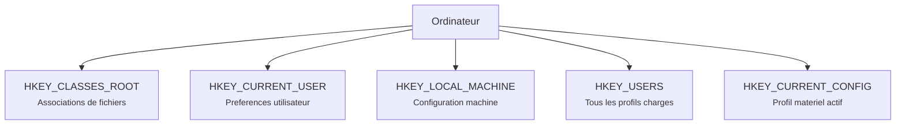

---
tags:
  - registre
  - introduction
---

# Introduction

## Ce que vous allez apprendre

- Ce qu'est la base de registre et pourquoi elle existe
- Le vocabulaire essentiel (ruche, cle, valeur, donnee)
- Comment le registre est organise physiquement sur le disque
- L'arborescence generale et ses 5 branches principales

---

## La base de registre en 30 secondes

Ouvrez un terminal et tapez ceci :

```batch
reg query "HKLM\SOFTWARE\Microsoft\Windows NT\CurrentVersion" /v ProductName
```

```title="Resultat attendu"
HKEY_LOCAL_MACHINE\SOFTWARE\Microsoft\Windows NT\CurrentVersion
    ProductName    REG_SZ    Windows 11 Pro
```

Vous venez de lire une **valeur** dans la base de registre.
Ce que vous avez fait, c'est demander a Windows : "quel est le nom de ton systeme d'exploitation ?".

!!! tip "Analogie"
    Pensez a la base de registre comme au **carnet de sante** de votre PC. Chaque parametre, chaque preference, chaque pilote y est consigne. Les applications le consultent pour savoir comment se comporter, et Windows lui-meme y lit sa propre configuration au demarrage.

!!! info "En resume"
    - Une simple commande `reg query` suffit pour lire une valeur du registre
    - Le registre est le carnet de sante centralise de votre PC
    - Chaque parametre systeme, preference et pilote y est consigne

---

## Qu'est-ce que la base de registre ?

Quand vous tapez `reg query "HKLM\SOFTWARE\Microsoft\Windows\CurrentVersion\Run"`, vous obtenez la liste des programmes lances automatiquement au demarrage de Windows. Quand vous tapez `reg query "HKCU\Control Panel\Desktop" /v Wallpaper`, vous obtenez le chemin de votre fond d'ecran. Ces deux informations -- et des millions d'autres -- sont stockees au meme endroit : la base de registre.

La base de registre Windows (*Windows Registry*) est une **base de donnees hierarchique centralisee**.
Elle stocke les parametres de configuration du systeme, des pilotes, des applications et des profils utilisateurs.

Elle a ete introduite avec Windows 3.1 en 1992 sous une forme basique.
C'est avec **Windows 95** et **Windows NT 4.0** qu'elle a pris sa forme actuelle.

!!! info "En resume"
    - Le registre est une base de donnees hierarchique centralisee
    - Il stocke la configuration du systeme, des pilotes, des applications et des profils utilisateurs
    - Il existe depuis Windows 3.1 (1992) et a pris sa forme actuelle avec Windows 95/NT 4.0

---

## Pourquoi existe-t-elle ?

Avant le registre, la configuration de Windows reposait sur des **fichiers texte disperses** :

| Fichier | Role |
|---------|------|
| `WIN.INI` | Parametres generaux de Windows |
| `SYSTEM.INI` | Configuration materielle et pilotes |
| `*.ini` par application | Preferences propres a chaque logiciel |

!!! example "Analogie : la cuisine desorganisee"
    Imaginez que vos recettes, votre liste de courses et vos preferences alimentaires soient ecrites sur des post-it colles un peu partout dans la cuisine. C'est exactement le probleme des fichiers `.ini` : tout est disperse, rien n'est protege, et deux personnes peuvent modifier le meme post-it en meme temps.

### Les problemes des fichiers `.ini`

| Probleme | Detail |
|----------|--------|
| **Fragmentation** | Fichiers disperses sur le disque, sans structure unifiee |
| **Limite de taille** | Chaque fichier `.ini` etait limite a 64 Ko |
| **Pas de hierarchie** | Structure plate, impossible d'organiser les donnees logiquement |
| **Aucune securite** | Pas de controle d'acces sur les parametres sensibles |
| **Conflits** | Plusieurs applications pouvaient ecrire le meme fichier en meme temps |

### Ce que le registre apporte

| Solution | Detail |
|----------|--------|
| Stockage centralise | Un seul "endroit" logique pour toute la configuration |
| Arborescence hierarchique | Organisation en arbre, comme un systeme de fichiers |
| Controles d'acces (ACL) | Qui peut lire ou ecrire chaque parametre |
| Acces transactionnel | Les ecritures sont protegees contre la corruption |
| API unifiee | Une seule interface pour lire et ecrire |

!!! info "En resume"
    Le registre remplace des centaines de fichiers `.ini` eparpilles par une base de donnees unique, structuree et securisee. C'est le **tableau de bord** central de Windows.

---

## L'arborescence : 5 branches principales

La base de registre est organisee comme un **systeme de fichiers** avec des dossiers et sous-dossiers :



Chaque branche principale est appelee **ruche** (*hive*).
Les ruches contiennent des **cles** (les dossiers), qui contiennent des **sous-cles** et des **valeurs** (les donnees).

!!! tip "Analogie"
    Si le registre etait un immeuble, les **ruches** seraient les etages, les **cles** seraient les appartements, et les **valeurs** seraient les meubles a l'interieur de chaque appartement.

!!! info "En resume"
    - Le registre est organise en 5 branches principales appelees ruches (*hives*)
    - Chaque ruche contient des cles (dossiers), des sous-cles et des valeurs (donnees)
    - La structure est hierarchique, comme un systeme de fichiers

---

## Historique complet

La base de registre n'est pas apparue d'un coup. Elle a evolue sur trois decennies, chaque version de Windows ajoutant de nouvelles capacites.

| Version | Annee | Changement majeur |
|---------|-------|-------------------|
| Windows 3.1 | 1992 | Premier registre : un seul fichier `REG.DAT`, utilise uniquement pour l'enregistrement OLE/COM |
| Windows NT 3.1 | 1993 | Naissance du registre moderne : Unicode, listes de controle d'acces (ACL), stockage des services |
| Windows 95 | 1995 | Premiere architecture multi-ruche : `SYSTEM.DAT` + `USER.DAT` |
| Windows NT 4.0 | 1996 | Le registre remplace la quasi-totalite des fichiers `.ini`. Separation des ruches SAM et SECURITY |
| Windows 2000 | 2000 | Integration avec Active Directory et les strategies de groupe (Group Policy) |
| Windows XP | 2001 | Integration avec la Restauration du systeme. Apparition du dossier `RegBack` pour les sauvegardes automatiques |
| Windows Vista | 2007 | Virtualisation UAC du registre. Introduction du registre transactionnel via le KTM (*Kernel Transaction Manager*) |
| Windows 7 | 2009 | Amelioration du mecanisme RegBack : sauvegardes planifiees toutes les 10 jours |
| Windows 8.1 | 2013 | Compression amelioree des ruches. Suppression progressive des profils materiels |
| Windows 10 1803+ | 2018 | RegBack desactive par defaut (les sauvegardes automatiques ne sont plus creees) |
| Windows 11 | 2021 | Poursuite de l'architecture existante. Renforcement de la securite VBS (*Virtualization-Based Security*) |

### Windows 3.1 : le prototype

Le fichier `REG.DAT`, situe dans le repertoire Windows, ne pesait que quelques kilo-octets. Il servait uniquement a enregistrer les associations OLE et les serveurs COM. Aucune configuration systeme n'y etait stockee -- les fichiers `WIN.INI` et `SYSTEM.INI` restaient maitres.

### Windows 95/98 : la premiere vraie architecture

Microsoft a scinde le registre en deux fichiers :

- `SYSTEM.DAT` : configuration machine
- `USER.DAT` : preferences utilisateur

Ces fichiers etaient au format binaire proprietaire, sans Unicode et sans controle d'acces. Windows creait automatiquement des copies de sauvegarde `.DA0` a chaque demarrage reussi.

### Windows NT : la fondation actuelle

La branche NT a introduit le registre tel qu'on le connait aujourd'hui :

- Support **Unicode** natif
- **ACL** sur chaque cle (droits de lecture, ecriture, suppression)
- Stockage des **services** et **pilotes** dans `HKLM\SYSTEM`
- Separation claire entre configuration machine et profils utilisateurs
- Fichiers de journalisation `.LOG` pour la protection anti-corruption

### Windows Vista et le KTM

Windows Vista a introduit deux innovations majeures :

1. **Virtualisation UAC** : les applications non elevees qui tentent d'ecrire dans `HKLM\SOFTWARE` sont redirigees silencieusement vers un emplacement virtuel dans `HKCU`. Cela evite les erreurs d'acces sans compromettre la securite.
2. **Registre transactionnel (KTM)** : les developpeurs peuvent regrouper plusieurs modifications dans une **transaction atomique**. Si une etape echoue, tout est annule automatiquement (*rollback*).

```powershell
# Check if RegBack folder exists and contains backups
Get-ChildItem "$env:SystemRoot\System32\config\RegBack" -ErrorAction SilentlyContinue
```

```title="Resultat attendu"
Le dossier RegBack s'affiche. Sur Windows 10 1803+, les fichiers peuvent faire 0 octet.
```

!!! warning "RegBack desactive depuis Windows 10 1803"
    Depuis la version 1803, Windows 10 ne remplit plus le dossier `RegBack` par defaut. Les fichiers existent mais font 0 octet. Pour reactiver cette fonctionnalite, il faut creer une valeur `DWORD` :

    ```
    HKLM\SYSTEM\CurrentControlSet\Control\Session Manager\Configuration Manager
        EnablePeriodicBackup = 1
    ```

    Un redemarrage est necessaire pour que le changement prenne effet.

!!! info "En resume"
    - Le registre a evolue sur 3 decennies, de `REG.DAT` (Windows 3.1) au format moderne avec ACL et Unicode (Windows NT)
    - Windows Vista a introduit la virtualisation UAC et le registre transactionnel (KTM)
    - Depuis Windows 10 1803, les sauvegardes automatiques RegBack sont desactivees par defaut

---

## Terminologie essentielle

| Terme | Equivalent familier | Definition |
|-------|---------------------|-----------|
| **Ruche** (*Hive*) | Etage de l'immeuble | Branche racine, stockee dans un fichier physique sur le disque |
| **Cle** (*Key*) | Dossier | Noeud de l'arborescence, peut contenir des sous-cles et des valeurs |
| **Sous-cle** (*Subkey*) | Sous-dossier | Cle enfant d'une autre cle |
| **Valeur** (*Value*) | Fichier | Paire nom/donnees stockee dans une cle |
| **Donnees** (*Data*) | Contenu du fichier | Le contenu effectif d'une valeur (chaine, nombre, binaire) |
| **Valeur par defaut** | -- | Valeur sans nom presente dans chaque cle, affichee `(Par defaut)` dans Regedit |
| **Chemin du registre** | Chemin de fichier | Adresse complete, ex : `HKLM\SOFTWARE\Microsoft` |

Voyons un exemple concret de cette hierarchie :

```
HKEY_CURRENT_USER                  ← Ruche
└── Software                       ← Cle
    └── Microsoft                  ← Sous-cle
        └── Windows                ← Sous-cle
            └── CurrentVersion     ← Sous-cle
                └── Run            ← Sous-cle
                    └── OneDrive = "C:\...\OneDrive.exe"  ← Valeur
```

!!! info "En resume"
    - Le vocabulaire essentiel : ruche (branche racine), cle (dossier), sous-cle (sous-dossier), valeur (donnee)
    - Chaque valeur a un nom et un contenu (chaine, nombre, binaire)
    - Un chemin du registre s'ecrit comme un chemin de fichier, ex : `HKLM\SOFTWARE\Microsoft`

---

## Navigation dans ce livre

Ce livre compte 30 chapitres. Selon votre profil et vos objectifs, vous n'avez pas besoin de tout lire dans l'ordre. Voici des parcours de lecture adaptes.

### Parcours par profil

| Profil | Chapitres recommandes | Objectif |
|--------|----------------------|----------|
| **Administrateur systeme** | 1-12, puis 16, 20, 24 | Maitriser la gestion quotidienne, les GPO, le deploiement et le monitoring |
| **Developpeur** | 1-5, puis 10, 15, 25, 27 | Comprendre l'architecture, les API, les transactions et l'integration applicative |
| **Forensique / Securite** | 1-3, 6, 16, 17, 22 | Analyser les artefacts, detecter les persistances malveillantes, auditer les acces |
| **Debutant venant du livre "Pour les Nuls"** | Commencer au chapitre 5 | Les 4 premiers chapitres reprennent des bases que vous connaissez deja |

### Lecture sequentielle

Si vous preferez une lecture de bout en bout, le livre est structure en blocs progressifs :

- **Chapitres 1-4** : Fondations (architecture, ruches, types de donnees)
- **Chapitres 5-9** : Outils et manipulation (Regedit, reg.exe, PowerShell, sauvegarde, restauration)
- **Chapitres 10-15** : Programmation et automatisation (API Win32, .NET, WMI, scripts)
- **Chapitres 16-22** : Securite, forensique et audit
- **Chapitres 23-27** : Scenarios avances (virtualisation, conteneurs, Active Directory)
- **Chapitres 28-30** : Annexes, reference et troubleshooting

!!! tip "Venant du livre *Pour les Nuls* ?"
    Si vous avez lu *Le Registre Windows Pour les Nuls*, vous avez deja une bonne base pratique. Vous pouvez sauter directement au chapitre 5 de cette Bible pour approfondir vos connaissances. Les chapitres 1 a 4 reprennent les fondamentaux de maniere plus technique -- consultez-les en reference si besoin.

!!! info "En resume"
    - Le livre propose des parcours adaptes selon votre profil (admin, dev, forensique, debutant)
    - Les 30 chapitres sont structures en blocs progressifs, des fondations aux scenarios avances
    - Si vous venez du livre "Pour les Nuls", commencez directement au chapitre 5

---

## Fichiers physiques sur le disque

La base de registre **n'est pas un fichier unique**. Elle est repartie dans plusieurs fichiers :

| Ruche | Fichier | Emplacement |
|-------|---------|-------------|
| SYSTEM | `SYSTEM` | `%SystemRoot%\System32\config\` |
| SOFTWARE | `SOFTWARE` | `%SystemRoot%\System32\config\` |
| SAM | `SAM` | `%SystemRoot%\System32\config\` |
| SECURITY | `SECURITY` | `%SystemRoot%\System32\config\` |
| DEFAULT | `DEFAULT` | `%SystemRoot%\System32\config\` |
| NTUSER.DAT | `NTUSER.DAT` | `%UserProfile%\` |
| UsrClass.dat | `UsrClass.dat` | `%LocalAppData%\Microsoft\Windows\` |

Chaque fichier est accompagne de fichiers auxiliaires (`.LOG`, `.LOG1`, `.LOG2`) utilises pour les transactions et la recuperation en cas de corruption.

!!! warning "Fichiers verrouilles"
    Ces fichiers sont **verrouilles en permanence** par le systeme. Vous ne pouvez pas les copier ou les modifier directement tant que Windows tourne. Il faut des outils specialises ou un demarrage depuis un support externe pour y acceder hors ligne.

!!! info "En resume"
    - Le registre est reparti dans plusieurs fichiers (SYSTEM, SOFTWARE, SAM, SECURITY, DEFAULT, NTUSER.DAT)
    - Chaque fichier est accompagne de journaux `.LOG` pour la protection anti-corruption
    - Ces fichiers sont verrouilles par le systeme et inaccessibles directement tant que Windows tourne

Verifiez par vous-meme que ces fichiers existent :

```batch
dir %SystemRoot%\System32\config\SYSTEM*
```

```title="Resultat attendu"
 Directory of C:\Windows\System32\config

01/15/2026  08:30 AM        16,777,216 SYSTEM
01/15/2026  08:30 AM           262,144 SYSTEM.LOG1
01/15/2026  08:30 AM           262,144 SYSTEM.LOG2
```

## Les 5 reflexes avant de modifier le registre

Avant de toucher quoi que ce soit dans le registre, adoptez ces 5 reflexes. Ils vous eviteront des heures de depannage -- ou pire, une reinstallation.

| # | Reflexe | Detail |
|---|---------|--------|
| 1 | **Toujours sauvegarder** | Exportez la cle ou la branche avant toute modification. Utilisez `reg export` ou la fonction d'export de Regedit. Une sauvegarde complete est detaillee au chapitre 7. |
| 2 | **Verifier le chemin exact** | Ne confondez pas `HKCU` et `HKLM`. Une modification dans la mauvaise ruche peut n'avoir aucun effet -- ou affecter tous les utilisateurs au lieu d'un seul. |
| 3 | **Tester sur une machine non critique** | Utilisez une machine virtuelle ou un poste de test. Ne faites jamais vos premiers essais sur un serveur de production. |
| 4 | **Documenter la modification** | Notez ce que vous avez change, pourquoi, et quelle etait la valeur precedente. Un simple fichier texte suffit. |
| 5 | **Verifier apres redemarrage** | Certaines modifications ne prennent effet qu'au redemarrage. Verifiez que la valeur est toujours presente et que le systeme se comporte comme attendu. |

```powershell
# Example: export a key before modifying it
reg export "HKCU\Software\Microsoft\Windows\CurrentVersion\Run" "$env:USERPROFILE\Desktop\run_backup.reg" /y
```

```title="Resultat attendu"
The operation completed successfully.
```

!!! danger "Pas de retour arriere sans sauvegarde"
    Le registre n'a **pas de Ctrl+Z**. Si vous supprimez une cle sans l'avoir exportee au prealable, elle est perdue. La seule solution sera de restaurer depuis une sauvegarde systeme -- si elle existe.

!!! info "En resume"
    - Toujours sauvegarder avant de modifier (pas de Ctrl+Z dans le registre)
    - Verifier le chemin exact pour ne pas confondre `HKCU` et `HKLM`
    - Tester sur une machine non critique et documenter chaque modification

---

!!! note "Pour les debutants"
    Si cette introduction vous semble dense, commencez par [La Base de Registre pour les Nuls](../registre-pour-les-nuls/index.md) qui explique les memes concepts avec des analogies et des exercices pas a pas.

!!! info "En resume"
    La base de registre est le **carnet de sante centralise** de Windows. Elle remplace les anciens fichiers `.ini` par une base hierarchique, securisee et transactionnelle. Elle se compose de 5 ruches principales, stockees dans des fichiers binaires sur le disque. Chaque ruche contient des cles, des sous-cles et des valeurs -- comme un systeme de fichiers dans le systeme de fichiers.
