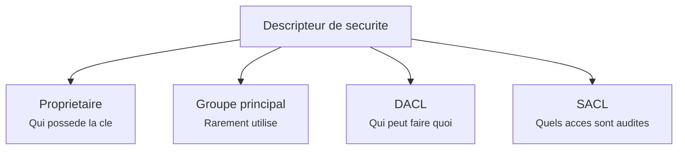
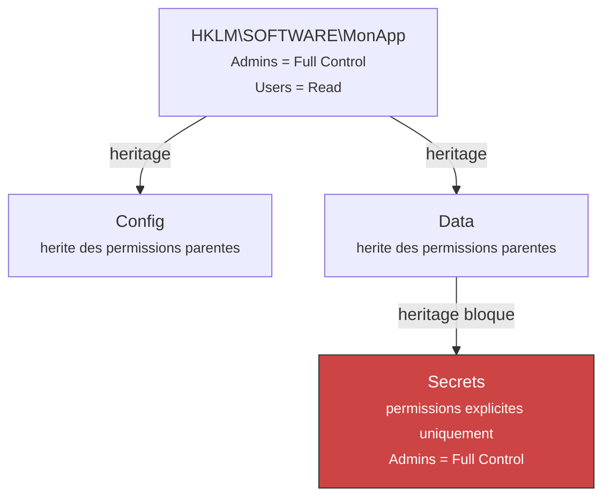

---
tags:
  - registre
  - sécurité
  - permissions
  - ACL
---

# Securite et permissions

## Ce que vous allez apprendre

- Comment les permissions du registre fonctionnent (DACL, SACL, heritage)
- Comment lire et modifier les permissions via Regedit et PowerShell
- La redirection WoW64 pour les applications 32 bits sur systemes 64 bits
- La virtualisation UAC et ses effets surprenants

---

## Exemple concret d'abord

Regardons les permissions d'une cle du registre avec PowerShell :

```powershell
$acl = Get-Acl "HKLM:\SOFTWARE\Microsoft\Windows NT\CurrentVersion"
$acl.Access | Format-Table IdentityReference, RegistryRights, AccessControlType -AutoSize
```

```title="Resultat attendu"
IdentityReference              RegistryRights AccessControlType
------------------              -------------- -----------------
BUILTIN\Users                        ReadKey             Allow
BUILTIN\Administrators              FullControl             Allow
NT AUTHORITY\SYSTEM                 FullControl             Allow
```

Les **utilisateurs** peuvent lire, mais seuls les **administrateurs** et le **systeme** ont le controle total.
C'est le modele de securite du registre en action.

!!! tip "Analogie"
    Les permissions du registre fonctionnent comme les **serrures d'un immeuble**. Certaines portes sont ouvertes a tous (lecture), d'autres ne s'ouvrent qu'avec la cle du proprietaire (ecriture), et quelques-unes sont reservees au gardien de l'immeuble (SYSTEM).

!!! info "En resume"
    - `Get-Acl` en PowerShell affiche les permissions d'une cle du registre
    - Les utilisateurs standards ont generalement un acces en lecture seule
    - Seuls les administrateurs et le compte SYSTEM disposent du controle total

---

## Le modele de securite

Chaque cle du registre possede un **descripteur de securite** (*security descriptor*).
C'est exactement le meme systeme que pour les fichiers NTFS.

Un descripteur contient 4 elements :



| Element | Role |
|---------|------|
| **Proprietaire** | Le compte qui possede la cle (peut toujours modifier les permissions) |
| **Groupe principal** | Rarement utilise sous Windows |
| **DACL** (*Discretionary ACL*) | Liste des regles : qui a le droit de faire quoi |
| **SACL** (*System ACL*) | Liste des acces a enregistrer dans le journal de securite |

!!! note "DACL vs SACL"
    La **DACL** controle l'acces (autoriser / refuser). La **SACL** ne controle rien, elle **enregistre** les acces dans le journal d'evenements pour l'audit. Ce sont deux mecanismes complementaires.

!!! info "En resume"
    - Chaque cle du registre possede un descripteur de securite, identique au systeme NTFS
    - La DACL definit qui peut lire, ecrire ou supprimer une cle
    - La SACL enregistre les acces dans le journal d'evenements pour l'audit

---

## Permissions detaillees

### Permissions individuelles

| Permission | Description |
|-----------|-------------|
| **Query Value** | Lire les valeurs d'une cle |
| **Set Value** | Creer, modifier ou supprimer des valeurs |
| **Create Subkey** | Creer des sous-cles |
| **Enumerate Subkeys** | Lister les sous-cles |
| **Notify** | Recevoir des notifications de modification |
| **Create Link** | Creer des liens symboliques (reserve au systeme) |
| **Delete** | Supprimer la cle |
| **Write DAC** | Modifier les permissions |
| **Write Owner** | Changer le proprietaire |
| **Read Control** | Lire les permissions |

### Permissions groupees (ce que vous voyez dans Regedit)

| Niveau | Inclut |
|--------|--------|
| **Lecture** (*Read*) | Query Value + Enumerate Subkeys + Notify + Read Control |
| **Controle total** (*Full Control*) | Toutes les permissions |

!!! example "Analogie"
    Les permissions individuelles sont comme les **cles d'un trousseau**. La cle "Query Value" ouvre le tiroir en lecture, la cle "Set Value" permet d'y ecrire. Le niveau "Controle total" est le **passe-partout** qui ouvre tout.

!!! info "En resume"
    Chaque cle a un descripteur de securite avec une DACL (qui peut faire quoi) et une SACL (quels acces sont audites). Les permissions vont du simple "Query Value" (lecture) au "Full Control" (tout).

---

## Gerer les permissions

### Via Regedit (graphique)

1. Clic droit sur une cle > **Autorisations**
2. Selectionnez un utilisateur ou groupe
3. Cochez les permissions souhaitees (Lecture, Controle total)
4. Pour des controles plus fins : cliquez sur **Avance** (heritage, audit, permissions individuelles)

---

### Via PowerShell (scriptable)

**Lire les permissions :**

```powershell
$acl = Get-Acl "HKLM:\SOFTWARE\MonApp"
$acl.Access | Format-Table IdentityReference, RegistryRights, AccessControlType
```

```title="Resultat attendu"
IdentityReference              RegistryRights AccessControlType
------------------              -------------- -----------------
BUILTIN\Administrators              FullControl             Allow
NT AUTHORITY\SYSTEM                 FullControl             Allow
```

**Ajouter une permission :**

```powershell
$acl = Get-Acl "HKLM:\SOFTWARE\MonApp"

# Create a rule: Users can read the key
$rule = New-Object System.Security.AccessControl.RegistryAccessRule(
    "BUILTIN\Users",          # Who
    "ReadKey",                # What
    "ContainerInherit,ObjectInherit",  # Inherited by subkeys
    "None",                   # No propagation flags
    "Allow"                   # Allow or Deny
)

$acl.AddAccessRule($rule)
Set-Acl "HKLM:\SOFTWARE\MonApp" $acl
```

```title="Resultat attendu"
Aucune sortie si la commande reussit. Un message d'erreur apparait en cas de probleme (acces refuse, cle introuvable).
```

**Prendre possession d'une cle :**

```powershell
$acl = Get-Acl "HKLM:\SOFTWARE\CleProtegee"
$admin = [System.Security.Principal.NTAccount]"BUILTIN\Administrators"
$acl.SetOwner($admin)
Set-Acl "HKLM:\SOFTWARE\CleProtegee" $acl
```

```title="Resultat attendu"
Aucune sortie si la commande reussit. Un message d'erreur apparait si le privilege SeTakeOwnershipPrivilege n'est pas disponible.
```

!!! warning "Droits requis"
    La modification des permissions necessite que vous ayez **Write DAC** sur la cle. La prise de possession necessite le privilege **SeTakeOwnershipPrivilege**. Dans les deux cas, vous devez executer PowerShell **en tant qu'administrateur**.

---

### Via SubInACL (outil Microsoft)

```batch
rem Display permissions
subinacl /keyreg "HKEY_LOCAL_MACHINE\SOFTWARE\MonApp" /display

rem Grant read access to Users
subinacl /keyreg "HKEY_LOCAL_MACHINE\SOFTWARE\MonApp" /grant=Utilisateurs=r
```

```title="Resultat attendu"
HKEY_LOCAL_MACHINE\SOFTWARE\MonApp : new ace for Utilisateurs
HKEY_LOCAL_MACHINE\SOFTWARE\MonApp : 1 change(s)
Elapsed Time: 00 00:00:00
Done: 1, Modified 1, Failed 0, Syntax errors 0
```

!!! note "SubInACL"
    `SubInACL` est un outil Microsoft telechargeable separement. Il est utile pour les scripts batch qui doivent manipuler les permissions en masse. Pour les taches ponctuelles, PowerShell est plus pratique.

!!! info "En resume"
    Trois facons de gerer les permissions : **Regedit** (graphique, ponctuel), **PowerShell** (scriptable, recommande), **SubInACL** (batch, masse). Toujours executer en tant qu'administrateur pour modifier les permissions.

---

## Heritage des permissions

Par defaut, les sous-cles **heritent** des permissions de leur cle parente.
C'est comme un dossier dont les fichiers heritent des permissions.



Trois comportements possibles :

| Action | Effet |
|--------|-------|
| **Desactiver l'heritage** | La cle ne conserve que ses permissions explicites |
| **Convertir les permissions heritees** | Les permissions heritees deviennent explicites, puis l'heritage est coupe |
| **Forcer l'heritage** | La cle parente impose ses permissions a toutes ses sous-cles |

!!! danger "Ne touchez pas aux cles systeme"
    Modifier les permissions de `HKLM\SYSTEM`, `HKLM\SAM` ou `HKLM\SECURITY` peut rendre Windows **non demarrable**. Ne modifiez jamais les permissions de ces cles sans une sauvegarde complete du systeme (image disque).

!!! info "En resume"
    - Par defaut, les sous-cles heritent des permissions de leur cle parente
    - L'heritage peut etre desactive, converti en permissions explicites, ou force par la cle parente
    - Ne jamais modifier les permissions des cles systeme (`HKLM\SYSTEM`, `SAM`, `SECURITY`) sans sauvegarde complete

---

## Redirection du registre (WoW64)

Sur un systeme **64 bits**, Windows isole les applications 32 bits grace a une redirection transparente.

!!! example "Analogie"
    C'est comme un **bureau de poste a double guichet**. Les applications 64 bits vont au guichet principal, les applications 32 bits sont automatiquement redirigees vers un guichet secondaire. Chacune croit aller au meme endroit, mais elles accedent a des boites aux lettres differentes.

### Comment ca marche

Quand une application **32 bits** demande a acceder a une cle, Windows la redirige silencieusement :

| L'application 32 bits demande... | Windows la redirige vers... |
|----------------------------------|--------------------------|
| `HKLM\SOFTWARE\MonApp` | `HKLM\SOFTWARE\WOW6432Node\MonApp` |
| `HKLM\SOFTWARE\Classes\CLSID\{GUID}` | `HKLM\SOFTWARE\Classes\WOW6432Node\CLSID\{GUID}` |

Certaines cles sont **partagees** et ne sont pas redirigees (la meme cle est vue par les processus 32 et 64 bits) :

- `HKLM\SOFTWARE\Microsoft\Windows NT\CurrentVersion`
- `HKLM\SOFTWARE\Classes` (partiellement)

### Forcer l'acces a une vue specifique

En code C, vous pouvez contourner la redirection :

```c
// Force 64-bit view from a 32-bit process
RegOpenKeyEx(HKEY_LOCAL_MACHINE, "SOFTWARE\\MonApp",
             0, KEY_READ | KEY_WOW64_64KEY, &hKey);

// Force 32-bit view from a 64-bit process
RegOpenKeyEx(HKEY_LOCAL_MACHINE, "SOFTWARE\\MonApp",
             0, KEY_READ | KEY_WOW64_32KEY, &hKey);
```

En PowerShell, specifiez la vue :

```powershell
# Open the 32-bit view from a 64-bit process
$key = [Microsoft.Win32.RegistryKey]::OpenBaseKey(
    [Microsoft.Win32.RegistryHive]::LocalMachine,
    [Microsoft.Win32.RegistryView]::Registry32
)
$subkey = $key.OpenSubKey("SOFTWARE\MonApp")
```

!!! info "En resume"
    Sur un systeme 64 bits, les applications 32 bits sont redirigees vers `WOW6432Node` de maniere transparente. Utilisez les flags `KEY_WOW64_64KEY` ou `KEY_WOW64_32KEY` pour forcer l'acces a une vue specifique.

---

## Virtualisation du registre (UAC)

C'est l'un des comportements les plus **surprenants** du registre.

Quand une application **non elevee** (sans droits admin) tente d'ecrire dans `HKLM\SOFTWARE`, au lieu de recevoir une erreur "Acces refuse", Windows **redirige silencieusement** l'ecriture vers :

```
HKCU\Software\Classes\VirtualStore\MACHINE\SOFTWARE\...
```

!!! warning "Le piege"
    L'application croit avoir ecrit dans `HKLM`, mais la donnee est en realite dans `HKCU`. A la relecture, Windows renvoie la version virtualisee. Cela peut creer des **bugs tres difficiles a diagnostiquer** : l'application fonctionne pour un utilisateur mais pas pour un autre, ou une modification "disparait" quand on passe en mode administrateur.

### Conditions de la virtualisation

| Condition | Virtualisee ? |
|-----------|---------------|
| Application 32 bits **sans** manifeste d'elevation | Oui |
| Application 64 bits | Non |
| Processus eleve (administrateur) | Non |
| Application avec manifeste `requestedExecutionLevel` | Non |

### Comment detecter la virtualisation

```
Gestionnaire des taches > onglet Details > clic droit sur l'en-tete > 
Selectionner des colonnes > cocher "Virtualisation UAC"
```

Cela affiche une colonne indiquant si chaque processus est virtualise.

!!! tip "Bonnes pratiques pour les developpeurs"
    Pour eviter la virtualisation, ajoutez un manifeste a votre application avec `<requestedExecutionLevel level="asInvoker"/>`. Cela desactive la virtualisation et vous obtiendrez des erreurs "Acces refuse" explicites au lieu de redirections silencieuses.

!!! info "En resume"
    La virtualisation UAC redirige silencieusement les ecritures dans `HKLM\SOFTWARE` vers `HKCU\...\VirtualStore\...` pour les anciennes applications 32 bits. C'est un mecanisme de compatibilite, pas une fonctionnalite. Pour les developpeurs, un manifeste d'elevation desactive ce comportement et rend les erreurs explicites.

---

!!! info "En resume"
    La securite du registre repose sur 4 piliers :

    1. **Permissions (DACL/SACL)** : controle granulaire de l'acces a chaque cle, avec heritage
    2. **Redirection WoW64** : isolation automatique des applications 32 bits sur systemes 64 bits
    3. **Virtualisation UAC** : redirection silencieuse des ecritures non elevees vers le profil utilisateur
    4. **Acces restreint** : certaines ruches (SAM, SECURITY) ne sont accessibles qu'au compte SYSTEM

    Ces mecanismes se superposent pour proteger le systeme tout en maintenant la compatibilite avec les anciens logiciels.

---

!!! note "Version simplifiee"
    Pour une introduction accessible a la securite du registre, consultez [Le registre et la securite](../registre-pour-les-nuls/11-securite.md) dans le guide pour debutants.
