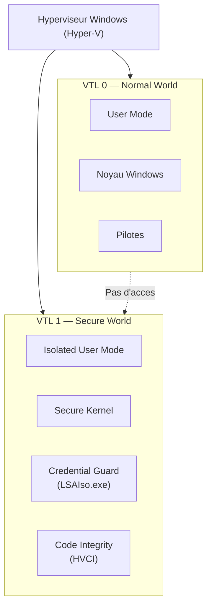
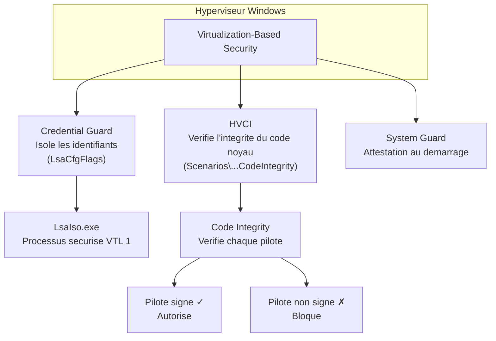
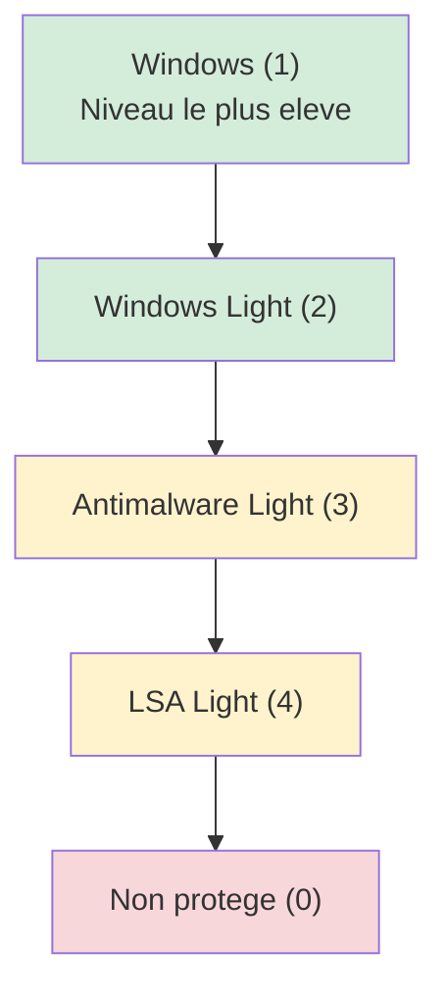

---
tags:
  - registre
  - sécurité
  - VBS
  - Credential Guard
  - HVCI
  - BitLocker
  - Defender
  - TPM
---

# Securite moderne

## Ce que vous allez apprendre

- Le fonctionnement de Virtualization-Based Security (VBS) et ses cles de registre
- La protection des identifiants avec Credential Guard (UEFI Lock vs non-UEFI Lock)
- Le controle d'applications avec WDAC (Windows Defender Application Control)
- L'integrite du code protegee par hyperviseur (HVCI) et son impact sur les pilotes
- Les cles de registre liees a Secure Boot et au TPM
- La configuration complete de BitLocker via le registre (FVE)
- Les sous-cles de Microsoft Defender : temps reel, exclusions, Tamper Protection, ASR
- La protection contre les exploits (IFEO, DEP, ASLR, CFG, CET)
- Le mecanisme Protected Process Light (PPL) et ses niveaux
- L'audit de securite avance via le registre
- Le depannage des fonctionnalites de securite modernes

---

## La securite moderne en un coup d'oeil

Avant de plonger dans les details, verifions l'etat de la securite basee sur la virtualisation de votre machine :

```powershell
# Query VBS and Device Guard status in a single call
Get-CimInstance -ClassName Win32_DeviceGuard -Namespace root\Microsoft\Windows\DeviceGuard |
    Select-Object VirtualizationBasedSecurityStatus,
                  SecurityServicesRunning,
                  SecurityServicesConfigured,
                  RequiredSecurityProperties |
    Format-List
```

```title="Resultat attendu"
VirtualizationBasedSecurityStatus : 2
SecurityServicesRunning           : {1, 2}
SecurityServicesConfigured        : {1, 2}
RequiredSecurityProperties        : {1, 2}
```

La valeur `2` pour `VirtualizationBasedSecurityStatus` signifie que VBS est **actif**. Les services `{1, 2}` correspondent a Credential Guard (1) et HVCI (2).

!!! tip "Analogie"
    La securite classique (chapitre 06) protege le registre comme des **serrures sur les portes** d'un batiment. La securite moderne, elle, place des zones critiques dans un **coffre-fort isole** a l'interieur du batiment. Meme si un cambrioleur penetre dans le batiment (le noyau), il ne peut pas ouvrir le coffre (l'enclave VBS).

!!! info "En resume"
    - La securite moderne repose sur la virtualisation (VBS) pour isoler les secrets du noyau lui-meme
    - La commande `Get-CimInstance Win32_DeviceGuard` permet de verifier l'etat de VBS, Credential Guard et HVCI en une seule requete
    - VBS est la fondation sur laquelle reposent Credential Guard, HVCI et System Guard

---

## Virtualization-Based Security (VBS)

### Principe

VBS utilise l'hyperviseur Windows (Hyper-V) pour creer une zone memoire isolee appelee **Virtual Secure Mode (VSM)**. Le noyau Windows lui-meme n'a pas acces a cette zone. Cela permet de proteger les secrets (identifiants, integrite du code) meme si le noyau est compromis.



Le systeme utilise deux niveaux de confiance (*Virtual Trust Levels*) :

| Niveau | Nom | Contenu |
|--------|-----|---------|
| **VTL 0** | Normal World | Noyau Windows, pilotes, applications |
| **VTL 1** | Secure World | Secure Kernel, Credential Guard, HVCI |

### Cles de registre

La configuration centrale de VBS se trouve sous :

```
HKLM\SYSTEM\CurrentControlSet\Control\DeviceGuard
```

| Valeur | Type | Donnees | Description |
|--------|------|---------|-------------|
| `EnableVirtualizationBasedSecurity` | `REG_DWORD` | `0` = desactive, `1` = active | Active ou desactive VBS |
| `RequirePlatformSecurityFeatures` | `REG_DWORD` | `1` = Secure Boot seul, `3` = Secure Boot + DMA Protection | Prerequis materiels exiges |
| `Locked` | `REG_DWORD` | `0` = non verrouille, `1` = verrouille UEFI | Empeche la desactivation sans acces physique |

### Activer VBS via le registre

```powershell
# Enable VBS with Secure Boot requirement
Set-ItemProperty -Path "HKLM:\SYSTEM\CurrentControlSet\Control\DeviceGuard" `
    -Name "EnableVirtualizationBasedSecurity" -Value 1 -Type DWord

# Require Secure Boot only (value 1) or Secure Boot + DMA (value 3)
Set-ItemProperty -Path "HKLM:\SYSTEM\CurrentControlSet\Control\DeviceGuard" `
    -Name "RequirePlatformSecurityFeatures" -Value 1 -Type DWord
```

```title="Resultat attendu"
Aucune sortie si la commande reussit. Un message d'erreur apparait en cas de probleme.
```

!!! warning "Redemarrage requis"
    L'activation de VBS necessite un redemarrage. De plus, les fonctionnalites de virtualisation imbriquee (*nested virtualization*) de certains hyperviseurs tiers peuvent etre incompatibles avec VBS.

### Verifier l'etat de VBS

```powershell
# Check VBS status via WMI
$dg = Get-CimInstance -ClassName Win32_DeviceGuard -Namespace root\Microsoft\Windows\DeviceGuard

switch ($dg.VirtualizationBasedSecurityStatus) {
    0 { "VBS is not enabled" }
    1 { "VBS is enabled but not running" }
    2 { "VBS is running" }
}
```

```title="Resultat attendu"
VBS is running
```

| VirtualizationBasedSecurityStatus | Signification |
|-----------------------------------|---------------|
| `0` | VBS non configure |
| `1` | VBS configure mais pas actif (probleme materiel probable) |
| `2` | VBS actif et operationnel |

### Prerequis materiels

VBS requiert :

- Processeur 64 bits avec extensions de virtualisation (Intel VT-x / AMD-V)
- SLAT (Second Level Address Translation) : Intel EPT / AMD RVI
- Secure Boot active dans le firmware UEFI
- TPM 2.0 (recommande, obligatoire avec `RequirePlatformSecurityFeatures` = 3)
- DMA Protection (IOMMU) pour une protection complete

!!! info "En resume"
    VBS cree une enclave isolee par l'hyperviseur ou le noyau Windows ne peut pas acceder. La cle `DeviceGuard\EnableVirtualizationBasedSecurity` (REG_DWORD = 1) l'active. La valeur `Locked` = 1 verrouille la configuration dans l'UEFI, empechant toute desactivation sans acces physique.

---

## Credential Guard

### Principe

Credential Guard utilise VBS pour isoler le processus LSASS (*Local Security Authority Subsystem Service*). Au lieu de stocker les hashes NTLM et les tickets Kerberos dans la memoire du noyau, ces secrets sont places dans un processus securise (`LsaIso.exe`) qui s'execute en VTL 1.

Un attaquant qui obtient des privileges noyau (VTL 0) ne peut pas extraire les identifiants de VTL 1.

### Cles de registre

```
HKLM\SYSTEM\CurrentControlSet\Control\Lsa
```

| Valeur | Type | Donnees | Description |
|--------|------|---------|-------------|
| `LsaCfgFlags` | `REG_DWORD` | `0` = desactive, `1` = active avec verrouillage UEFI, `2` = active sans verrouillage UEFI | Mode de deploiement de Credential Guard |
| `RunAsPPL` | `REG_DWORD` | `0` = desactive, `1` = active | Execute LSASS en mode Protected Process Light |

### Mode UEFI Lock vs mode sans verrouillage

| LsaCfgFlags | Mode | Comportement |
|-------------|------|--------------|
| `0` | Desactive | Credential Guard n'est pas actif |
| `1` | UEFI Lock | Active et verrouille dans l'UEFI. **Impossible a desactiver** a distance — il faut un acces physique pour modifier la variable UEFI |
| `2` | Sans verrouillage | Active mais peut etre desactive par une simple modification du registre suivi d'un redemarrage |

!!! danger "Attention au verrouillage UEFI"
    Avec `LsaCfgFlags` = 1, la desactivation de Credential Guard necessite un **acces physique** a la machine pour effacer la variable UEFI. En environnement de test, utilisez toujours la valeur `2` d'abord.

### Activer Credential Guard

```powershell
# Enable Credential Guard without UEFI lock (recommended for testing)
Set-ItemProperty -Path "HKLM:\SYSTEM\CurrentControlSet\Control\Lsa" `
    -Name "LsaCfgFlags" -Value 2 -Type DWord

# Also enable LSA protection (PPL) as defense in depth
Set-ItemProperty -Path "HKLM:\SYSTEM\CurrentControlSet\Control\Lsa" `
    -Name "RunAsPPL" -Value 1 -Type DWord

# VBS must also be enabled
Set-ItemProperty -Path "HKLM:\SYSTEM\CurrentControlSet\Control\DeviceGuard" `
    -Name "EnableVirtualizationBasedSecurity" -Value 1 -Type DWord
```

```title="Resultat attendu"
Aucune sortie si la commande reussit. Un redemarrage est necessaire pour appliquer les modifications.
```

### Impact sur les protocoles d'authentification

Credential Guard **casse** certains protocoles anciens :

| Protocole / Fonctionnalite | Impact |
|-----------------------------|--------|
| NTLMv1 | **Bloque** — seul NTLMv2 fonctionne |
| Delegation Kerberos non contrainte | **Bloque** — seul la delegation contrainte ou basee sur les ressources fonctionne |
| Digest Authentication | **Bloque** |
| CredSSP (connexion RDP avec NLA) | Fonctionne mais les credentials ne sont pas mis en cache |
| MS-CHAPv2 | **Bloque** |

### Diagnostiquer Credential Guard

```powershell
# Verify Credential Guard is running
$dg = Get-CimInstance -ClassName Win32_DeviceGuard -Namespace root\Microsoft\Windows\DeviceGuard
if ($dg.SecurityServicesRunning -contains 1) {
    "Credential Guard is active"
} else {
    "Credential Guard is NOT active"
}

# Check LSA protection mode
$lsa = Get-ItemProperty "HKLM:\SYSTEM\CurrentControlSet\Control\Lsa" -ErrorAction SilentlyContinue
"LsaCfgFlags: $($lsa.LsaCfgFlags)"
"RunAsPPL: $($lsa.RunAsPPL)"
```

```title="Resultat attendu"
Credential Guard is active
LsaCfgFlags: 2
RunAsPPL: 1
```

!!! info "En resume"
    Credential Guard isole les identifiants dans une enclave VBS inaccessible au noyau. `LsaCfgFlags` = 1 (verrouillage UEFI) ou 2 (sans verrouillage) l'active. `RunAsPPL` = 1 ajoute une couche de protection supplementaire sur le processus LSASS.

---

## Device Guard / WDAC (Windows Defender Application Control)

### Principe

WDAC (anciennement Device Guard Code Integrity) controle **quels binaires** sont autorises a s'executer sur le systeme. Contrairement a un antivirus qui cherche les logiciels malveillants connus, WDAC applique une politique d'**autorisation explicite** : seul ce qui est dans la liste blanche peut s'executer.

### Cles de registre

```
HKLM\SYSTEM\CurrentControlSet\Control\CI
```

| Valeur | Type | Donnees | Description |
|--------|------|---------|-------------|
| `UMCIAuditMode` | `REG_DWORD` | `0` = enforcement, `1` = audit seul | Mode User Mode Code Integrity |
| `UMCIDisabled` | `REG_DWORD` | `0` = actif, `1` = desactive | Desactive UMCI |
| `VerifiedAndReputablePolicyState` | `REG_DWORD` | Variable | Etat de la politique Smart App Control |

La sous-cle `CodeIntegrityPolicy` contient les informations de la politique active :

```
HKLM\SYSTEM\CurrentControlSet\Control\CI\CodeIntegrityPolicy
```

### Deploiement d'une politique WDAC

Les politiques WDAC sont des fichiers `.p7b` (signes) ou `.bin` (non signes) deployes dans :

```
%SystemRoot%\System32\CodeIntegrity\CiPolicies\Active\
```

Chaque politique est identifiee par un **PolicyTypeID** (GUID) :

| PolicyTypeID | Description |
|--------------|-------------|
| `{A244370E-44C9-4C06-B551-F6016E563076}` | Politique de base par defaut Windows |
| GUID personnalise | Politique d'entreprise deployee manuellement ou via GPO |

### Modes de fonctionnement

```powershell
# Check current CI policy enforcement mode
$ci = Get-ItemProperty "HKLM:\SYSTEM\CurrentControlSet\Control\CI" -ErrorAction SilentlyContinue
if ($ci.UMCIAuditMode -eq 1) {
    "WDAC is in AUDIT mode (logging only, not blocking)"
} else {
    "WDAC is in ENFORCEMENT mode (blocking unauthorized code)"
}
```

```title="Resultat attendu"
WDAC is in AUDIT mode (logging only, not blocking)
```

!!! warning "Mode audit d'abord"
    Deployer une politique WDAC en mode enforcement sans test prealable en mode audit peut rendre le systeme inutilisable si des applications legitimes ne sont pas couvertes par la politique.

### Journaux de diagnostic

Les evenements WDAC sont enregistres dans :

```
Event Log: Microsoft-Windows-CodeIntegrity/Operational
```

| Event ID | Signification |
|----------|---------------|
| 3076 | Binaire **bloque en mode audit** (serait bloque en enforcement) |
| 3077 | Binaire **bloque en mode enforcement** |
| 3089 | Chargement de la politique CI reussi |

```powershell
# View recent WDAC audit events
Get-WinEvent -LogName "Microsoft-Windows-CodeIntegrity/Operational" -MaxEvents 20 |
    Where-Object { $_.Id -in @(3076, 3077, 3089) } |
    Format-Table TimeCreated, Id, Message -Wrap
```

```title="Resultat attendu"
TimeCreated          Id Message
-----------          -- -------
2026-03-28 14:22:05 3089 Code Integrity policy has been loaded successfully.
2026-03-15 09:10:33 3076 Code Integrity determined that a process attempted to load
                         a binary that did not meet the policy requirements.
```

!!! info "En resume"
    WDAC controle l'execution de code au niveau du systeme. La cle `HKLM\...\CI\UMCIAuditMode` determine le mode (audit ou enforcement). Testez toujours en mode audit (valeur 1) avant de passer en enforcement (valeur 0).

---

## HVCI (Hypervisor-Protected Code Integrity)

### Principe

HVCI utilise VBS pour verifier l'integrite du code charge dans le noyau. Chaque pilote et chaque module noyau est verifie par le Secure Kernel (VTL 1) avant d'etre autorise a s'executer en VTL 0. Cela empeche un attaquant d'injecter du code non signe dans le noyau.

### Cles de registre

```
HKLM\SYSTEM\CurrentControlSet\Control\DeviceGuard\Scenarios\HypervisorEnforcedCodeIntegrity
```

| Valeur | Type | Donnees | Description |
|--------|------|---------|-------------|
| `Enabled` | `REG_DWORD` | `0` = desactive, `1` = active | Active HVCI |
| `Locked` | `REG_DWORD` | `0` = non verrouille, `1` = verrouille UEFI | Empeche la desactivation sans acces physique |
| `WasEnabledBy` | `REG_DWORD` | `0` = politique, `1` = mdm, `2` = registre | Indique comment HVCI a ete active |

### Activer HVCI

```powershell
# Create the Scenarios subkey if it does not exist
$path = "HKLM:\SYSTEM\CurrentControlSet\Control\DeviceGuard\Scenarios\HypervisorEnforcedCodeIntegrity"
if (-not (Test-Path $path)) {
    New-Item -Path $path -Force | Out-Null
}

# Enable HVCI without UEFI lock
Set-ItemProperty -Path $path -Name "Enabled" -Value 1 -Type DWord
Set-ItemProperty -Path $path -Name "Locked" -Value 0 -Type DWord
```

```title="Resultat attendu"
Aucune sortie si la commande reussit. Un redemarrage est necessaire pour appliquer HVCI.
```

### Architecture VBS complete



### Impact sur les pilotes

HVCI bloque tout pilote qui :

- N'est pas signe par Microsoft ou un certificat de confiance
- Utilise des allocations memoire en ecriture + execution simultanees (`WX`)
- Modifie des structures noyau protegees

```powershell
# Check HVCI compatibility of loaded drivers
$dg = Get-CimInstance -ClassName Win32_DeviceGuard -Namespace root\Microsoft\Windows\DeviceGuard
"HVCI Status: $($dg.SecurityServicesRunning -contains 2)"

# List drivers that may be incompatible with HVCI
$drivers = driverquery /v /fo csv | ConvertFrom-Csv
$drivers | Where-Object { $_."Is Signed" -eq "FALSE" } | Format-Table "Module Name", "Display Name", "Is Signed"
```

```title="Resultat attendu"
HVCI Status: True

Module Name    Display Name                    Is Signed
-----------    ------------                    ---------
olddriver      Legacy PCI Controller Driver    FALSE
vboxdrv        VirtualBox Support Driver       FALSE
```

!!! warning "Pilotes anciens"
    Les pilotes de peripheriques anciens (imprimantes, scanners, controleurs industriels) sont souvent incompatibles avec HVCI. Testez sur un poste pilote avant un deploiement a grande echelle.

!!! info "En resume"
    HVCI protege l'integrite du code noyau via l'hyperviseur. La cle `Scenarios\HypervisorEnforcedCodeIntegrity\Enabled` = 1 l'active. `Locked` = 1 verrouille dans l'UEFI. Les pilotes non signes ou utilisant des allocations memoire WX sont bloques.

---

## Secure Boot et le registre

### Principe

Secure Boot est une fonctionnalite du firmware UEFI qui verifie la signature numerique de chaque composant charge au demarrage (bootloader, noyau, pilotes de demarrage). Le registre ne **controle** pas Secure Boot (c'est le firmware UEFI qui le fait), mais il **reflete** son etat.

Pour le processus de demarrage complet, voir le [chapitre 13 — Processus de demarrage et BCD](13-demarrage-bcd.md).

### Cle de registre

```
HKLM\SYSTEM\CurrentControlSet\Control\SecureBoot\State
```

| Valeur | Type | Donnees | Description |
|--------|------|---------|-------------|
| `UEFISecureBootEnabled` | `REG_DWORD` | `0` = desactive, `1` = active | Reflete l'etat de Secure Boot dans le firmware |

!!! note "Lecture seule"
    Cette valeur est en **lecture seule** du point de vue du registre. Modifier cette valeur n'active pas Secure Boot. Seul le firmware UEFI peut activer ou desactiver Secure Boot.

### Verification

```powershell
# Check Secure Boot status via registry
$sb = Get-ItemProperty "HKLM:\SYSTEM\CurrentControlSet\Control\SecureBoot\State" -ErrorAction SilentlyContinue
if ($sb.UEFISecureBootEnabled -eq 1) {
    "Secure Boot is ENABLED"
} else {
    "Secure Boot is DISABLED or not supported"
}

# Alternative: use the Confirm-SecureBootUEFI cmdlet
try {
    $result = Confirm-SecureBootUEFI
    "Secure Boot UEFI confirmation: $result"
} catch {
    "Secure Boot not supported on this system"
}
```

```title="Resultat attendu"
Secure Boot is ENABLED
Secure Boot UEFI confirmation: True
```

### Cles liees a Secure Boot

```
HKLM\SYSTEM\CurrentControlSet\Control\SecureBoot
```

| Sous-cle / Valeur | Description |
|--------------------|-------------|
| `State\UEFISecureBootEnabled` | Etat actuel (0 ou 1) |
| `BootInformation` | Informations sur la chaine de demarrage |

!!! info "En resume"
    Secure Boot est gere par le firmware UEFI, pas par le registre. La cle `SecureBoot\State\UEFISecureBootEnabled` reflete l'etat actuel. VBS et Credential Guard dependent d'un Secure Boot actif pour un niveau de protection maximal.

---

## TPM et le registre

### Principe

Le TPM (*Trusted Platform Module*) est une puce cryptographique materielle (ou firmware) qui stocke des cles de chiffrement, effectue des mesures d'integrite au demarrage, et genere des nombres aleatoires. Windows 11 exige un TPM 2.0.

### Cles de registre

```
HKLM\SOFTWARE\Microsoft\Tpm
```

| Valeur | Type | Donnees | Description |
|--------|------|---------|-------------|
| `TpmReady` | `REG_DWORD` | `0` ou `1` | Le TPM est pret a l'utilisation |
| `TpmPresent` | `REG_DWORD` | `0` ou `1` | Un TPM est detecte dans le systeme |
| `TpmEnabled` | `REG_DWORD` | `0` ou `1` | Le TPM est active dans le firmware |

### Verification

```powershell
# Check TPM status via registry
$tpm = Get-ItemProperty "HKLM:\SOFTWARE\Microsoft\Tpm" -ErrorAction SilentlyContinue
"TPM Present: $($tpm.TpmPresent)"
"TPM Ready: $($tpm.TpmReady)"
"TPM Enabled: $($tpm.TpmEnabled)"

# Detailed TPM information via WMI
Get-CimInstance -Namespace "root\cimv2\Security\MicrosoftTpm" -ClassName Win32_Tpm |
    Select-Object IsActivated_InitialValue, IsEnabled_InitialValue, IsOwned_InitialValue,
                  ManufacturerIdTxt, ManufacturerVersion, SpecVersion |
    Format-List
```

```title="Resultat attendu"
IsActivated_InitialValue : True
IsEnabled_InitialValue   : True
IsOwned_InitialValue     : True
ManufacturerIdTxt        : INTC
ManufacturerVersion      : 403.1.0.0
SpecVersion              : 2.0, 0, 1.59
```

### Configuration Windows 11

Windows 11 verifie la presence d'un TPM 2.0 lors de l'installation. La cle de contournement souvent citee (mais non supportee par Microsoft) :

```
HKLM\SYSTEM\Setup\MoSetup
```

| Valeur | Type | Donnees | Description |
|--------|------|---------|-------------|
| `AllowUpgradesWithUnsupportedTPMOrCPU` | `REG_DWORD` | `1` | Contourne la verification TPM et CPU pour la mise a jour |

!!! danger "Non supporte"
    Cette cle de contournement n'est **pas supportee** par Microsoft. Elle fonctionne pour les mises a jour (*upgrade*), mais pas pour les installations propres. Les futures mises a jour de securite pourraient ne pas etre distribuees aux systemes non conformes.

!!! info "En resume"
    Le TPM est reflete dans `HKLM\SOFTWARE\Microsoft\Tpm` avec les valeurs `TpmPresent`, `TpmReady` et `TpmEnabled`. Windows 11 exige un TPM 2.0. La puce sert de fondation pour BitLocker, Secure Boot, Credential Guard et les mesures d'integrite au demarrage.

---

## BitLocker (FVE)

### Principe

BitLocker chiffre les volumes entiers pour proteger les donnees au repos. Sa configuration est largement pilotee par les strategie de groupe (GPO), qui se traduisent par des valeurs dans le registre sous la cle FVE (*Full Volume Encryption*).

### Cle de politique principale

```
HKLM\SOFTWARE\Policies\Microsoft\FVE
```

### Table complete des valeurs FVE

#### Demarrage et TPM

| Valeur | Type | Donnees | Description |
|--------|------|---------|-------------|
| `UseAdvancedStartup` | `REG_DWORD` | `0` = non, `1` = oui | Active les options de demarrage avancees |
| `EnableBDEWithNoTPM` | `REG_DWORD` | `0` = non, `1` = oui | Autorise BitLocker sans TPM (mot de passe ou cle USB) |
| `UseTPM` | `REG_DWORD` | `0` = interdit, `1` = requis, `2` = autorise | Utilisation du TPM seul |
| `UseTPMPIN` | `REG_DWORD` | `0` = interdit, `1` = requis, `2` = autorise | Utilisation du TPM + code PIN |
| `UseTPMKey` | `REG_DWORD` | `0` = interdit, `1` = requis, `2` = autorise | Utilisation du TPM + cle de demarrage USB |
| `UseTPMKeyPIN` | `REG_DWORD` | `0` = interdit, `1` = requis, `2` = autorise | Utilisation du TPM + code PIN + cle USB |

#### Methode de chiffrement

| Valeur | Type | Donnees | Description |
|--------|------|---------|-------------|
| `EncryptionMethod` | `REG_DWORD` | `3` = AES-CBC 128, `4` = AES-CBC 256, `6` = XTS-AES 128, `7` = XTS-AES 256 | Algorithme de chiffrement |
| `EncryptionMethodWithXtsOs` | `REG_DWORD` | `3`, `4`, `6`, `7` | Algorithme pour le volume du systeme d'exploitation |
| `EncryptionMethodWithXtsFdv` | `REG_DWORD` | `3`, `4`, `6`, `7` | Algorithme pour les volumes de donnees fixes |
| `EncryptionMethodWithXtsRdv` | `REG_DWORD` | `3`, `4`, `6`, `7` | Algorithme pour les volumes amovibles |

#### Recuperation

| Valeur | Type | Donnees | Description |
|--------|------|---------|-------------|
| `OSRecovery` | `REG_DWORD` | `1` = active | Active les options de recuperation pour le volume OS |
| `OSManageDRA` | `REG_DWORD` | `0` ou `1` | Autorise l'agent de recuperation de donnees |
| `OSRecoveryPassword` | `REG_DWORD` | `0` = interdit, `1` = requis, `2` = autorise | Mot de passe de recuperation numerique (48 chiffres) |
| `OSRecoveryKey` | `REG_DWORD` | `0` = interdit, `1` = requis, `2` = autorise | Cle de recuperation USB |
| `OSHideRecoveryPage` | `REG_DWORD` | `0` = visible, `1` = masque | Masque la page de recuperation de l'assistant |
| `OSActiveDirectoryBackup` | `REG_DWORD` | `0` ou `1` | Sauvegarde la cle de recuperation dans Active Directory |
| `OSActiveDirectoryInfoToStore` | `REG_DWORD` | `1` = mot de passe + package, `2` = mot de passe seul | Type d'information sauvegardee dans AD |
| `OSRequireActiveDirectoryBackup` | `REG_DWORD` | `0` ou `1` | Exige la sauvegarde AD avant le chiffrement |

### Etat de BitLocker

```
HKLM\SYSTEM\CurrentControlSet\Control\BitLockerStatus
```

| Valeur | Type | Description |
|--------|------|-------------|
| `BootStatus` | `REG_DWORD` | Etat du demarrage BitLocker |

### Commandes de verification

```powershell
# Check BitLocker status on all volumes
Get-BitLockerVolume | Select-Object MountPoint, VolumeStatus, ProtectionStatus,
    EncryptionMethod, EncryptionPercentage, KeyProtector | Format-List

# View FVE policy registry values
Get-ItemProperty "HKLM:\SOFTWARE\Policies\Microsoft\FVE" -ErrorAction SilentlyContinue |
    Select-Object -Property * -ExcludeProperty PS* | Format-List
```

```title="Resultat attendu"
MountPoint           : C:
VolumeStatus         : FullyEncrypted
ProtectionStatus     : On
EncryptionMethod     : XtsAes256
EncryptionPercentage : 100
KeyProtector         : {Tpm, RecoveryPassword}
```

!!! tip "XTS-AES vs AES-CBC"
    XTS-AES (valeurs 6 et 7) est l'algorithme recommande pour les volumes fixes. AES-CBC (valeurs 3 et 4) reste necessaire pour les volumes amovibles qui doivent etre lisibles sur des systemes plus anciens (Windows 7/8).

!!! info "En resume"
    BitLocker est configure via `HKLM\SOFTWARE\Policies\Microsoft\FVE`. Les valeurs `UseTPM*` controlent l'authentification au demarrage. `EncryptionMethodWithXts*` definit l'algorithme de chiffrement (XTS-AES 256 recommande). Les valeurs `OS*Recovery*` gerent la recuperation des cles.

---

## Microsoft Defender

### Architecture des cles

Microsoft Defender utilise deux emplacements principaux :

| Cle | Role |
|-----|------|
| `HKLM\SOFTWARE\Microsoft\Windows Defender` | Configuration **reelle** du service Defender |
| `HKLM\SOFTWARE\Policies\Microsoft\Windows Defender` | **Surcharges** appliquees par GPO/Intune |

Les politiques (quand presentes) ont **priorite** sur la configuration locale.

### Protection en temps reel

```
HKLM\SOFTWARE\Policies\Microsoft\Windows Defender\Real-Time Protection
```

| Valeur | Type | Donnees | Description |
|--------|------|---------|-------------|
| `DisableRealtimeMonitoring` | `REG_DWORD` | `0` = actif, `1` = desactive | Surveillance en temps reel |
| `DisableBehaviorMonitoring` | `REG_DWORD` | `0` = actif, `1` = desactive | Analyse comportementale |
| `DisableOnAccessProtection` | `REG_DWORD` | `0` = actif, `1` = desactive | Protection a l'acces fichier |
| `DisableScanOnRealtimeEnable` | `REG_DWORD` | `0` = actif, `1` = desactive | Analyse a l'activation du temps reel |
| `DisableIOAVProtection` | `REG_DWORD` | `0` = actif, `1` = desactive | Analyse des telechargements (IOAV) |

### Exclusions

```
HKLM\SOFTWARE\Microsoft\Windows Defender\Exclusions
```

| Sous-cle | Description |
|----------|-------------|
| `Paths` | Chemins exclus de l'analyse |
| `Extensions` | Extensions de fichier exclues |
| `Processes` | Processus exclus |
| `TemporaryPaths` | Exclusions temporaires |

```powershell
# List all Defender exclusions
$exBase = "HKLM:\SOFTWARE\Microsoft\Windows Defender\Exclusions"
"=== Path exclusions ==="
Get-ItemProperty "$exBase\Paths" -ErrorAction SilentlyContinue |
    Select-Object -Property * -ExcludeProperty PS*
"=== Extension exclusions ==="
Get-ItemProperty "$exBase\Extensions" -ErrorAction SilentlyContinue |
    Select-Object -Property * -ExcludeProperty PS*
"=== Process exclusions ==="
Get-ItemProperty "$exBase\Processes" -ErrorAction SilentlyContinue |
    Select-Object -Property * -ExcludeProperty PS*
```

```title="Resultat attendu"
=== Path exclusions ===
C:\DevTools   : 0
D:\VMs        : 0
=== Extension exclusions ===
.iso : 0
=== Process exclusions ===
devenv.exe    : 0
vmware-vmx.exe : 0
```

!!! danger "Exclusions = vecteur d'attaque"
    Les attaquants cherchent souvent les exclusions Defender pour y deposer leurs payloads. Minimisez les exclusions et auditez-les regulierement.

### Analyse (Scan)

```
HKLM\SOFTWARE\Policies\Microsoft\Windows Defender\Scan
```

| Valeur | Type | Donnees | Description |
|--------|------|---------|-------------|
| `ScanParameters` | `REG_DWORD` | `1` = rapide, `2` = complete | Type d'analyse planifiee |
| `ScheduleDay` | `REG_DWORD` | `0` = tous les jours, `1`-`7` = jour specifique | Jour de l'analyse planifiee |
| `ScheduleTime` | `REG_DWORD` | Minutes apres minuit | Heure de l'analyse planifiee |
| `DisableArchiveScanning` | `REG_DWORD` | `0` ou `1` | Analyse des archives (ZIP, RAR, etc.) |

### SpyNet / MAPS (Cloud Protection)

```
HKLM\SOFTWARE\Policies\Microsoft\Windows Defender\SpyNet
```

| Valeur | Type | Donnees | Description |
|--------|------|---------|-------------|
| `SpynetReporting` | `REG_DWORD` | `0` = desactive, `1` = basique, `2` = avance | Niveau de participation a MAPS |
| `SubmitSamplesConsent` | `REG_DWORD` | `0` = toujours demander, `1` = echantillons surs, `2` = ne jamais envoyer, `3` = tous les echantillons | Envoi automatique d'echantillons |

### Tamper Protection

Tamper Protection est un mecanisme qui **bloque les modifications directes du registre** pour les cles de Defender. Meme un administrateur local ne peut pas desactiver Defender via `regedit` ou PowerShell si Tamper Protection est active.

```
HKLM\SOFTWARE\Microsoft\Windows Defender\Features
```

| Valeur | Type | Donnees | Description |
|--------|------|---------|-------------|
| `TamperProtection` | `REG_DWORD` | `0` = desactive, `5` = active | Etat de Tamper Protection |
| `TamperProtectionSource` | `REG_DWORD` | Variable | Source de la configuration (locale, cloud, etc.) |

!!! danger "Tamper Protection"
    Quand `TamperProtection` = 5, les tentatives de modification directe des cles Defender via le registre sont **silencieusement ignorees**. Les modifications doivent passer par le portail Microsoft 365 Defender, Intune, ou l'interface graphique de Securite Windows. Les GPO de domaine continuent de fonctionner.

### SmartScreen

```
HKLM\SOFTWARE\Policies\Microsoft\Windows\System
```

| Valeur | Type | Donnees | Description |
|--------|------|---------|-------------|
| `EnableSmartScreen` | `REG_DWORD` | `0` = desactive, `1` = active avec avertissement, `2` = active avec blocage | Mode SmartScreen |
| `ShellSmartScreenLevel` | `REG_SZ` | `Warn` ou `Block` | Niveau de SmartScreen pour l'Explorateur |

```
HKLM\SOFTWARE\Policies\Microsoft\MicrosoftEdge\PhishingFilter
```

| Valeur | Type | Donnees | Description |
|--------|------|---------|-------------|
| `EnabledV9` | `REG_DWORD` | `0` = desactive, `1` = active | SmartScreen dans Edge (ancien) |

### ASR (Attack Surface Reduction)

Les regles ASR bloquent des comportements specifiques exploites par les logiciels malveillants (macros Office, scripts, injection de processus, etc.).

```
HKLM\SOFTWARE\Policies\Microsoft\Windows Defender\Windows Defender Exploit Guard\ASR
```

| Valeur | Type | Donnees | Description |
|--------|------|---------|-------------|
| `ExploitGuard_ASR_Rules` | `REG_DWORD` | `1` = active | Active les regles ASR |

Les regles individuelles sont sous :

```
HKLM\SOFTWARE\Policies\Microsoft\Windows Defender\Windows Defender Exploit Guard\ASR\Rules
```

Chaque regle est une valeur dont le nom est un GUID et la donnee est le mode :

- `0` = desactivee
- `1` = active (bloque)
- `2` = audit (enregistre sans bloquer)
- `6` = avertissement

### Table des regles ASR courantes

| GUID | Nom de la regle | Description |
|------|-----------------|-------------|
| `BE9BA2D9-53EA-4CDC-84E5-9B1EEEE46550` | Block executable content from email | Bloque les executables et scripts dans les pieces jointes |
| `D4F940AB-401B-4EFC-AADC-AD5F3C50688A` | Block Office children from creating child processes | Empeche les applications Office de lancer des sous-processus |
| `3B576869-A4EC-4529-8536-B80A7769E899` | Block Office from creating executable content | Empeche Office de creer des fichiers executables |
| `75668C1F-73B5-4CF0-BB93-3ECF5CB7CC84` | Block Office from injecting code into other processes | Empeche l'injection de code depuis les applications Office |
| `D3E037E1-3EB8-44C8-A917-57927947596D` | Block JavaScript or VBScript from launching downloaded executable content | Bloque les scripts JS/VBS qui lancent des executables telecharges |
| `5BEB7EFE-FD9A-4556-801D-275E5FFC04CC` | Block execution of potentially obfuscated scripts | Bloque les scripts potentiellement obfusques |
| `92E97FA1-2EDF-4476-BDD6-9DD0B4DDDC7B` | Block Win32 API calls from Office macros | Bloque les appels API Win32 depuis les macros Office |
| `01443614-CD74-433A-B99E-2ECDC07BFC25` | Block executable files from running unless they meet a prevalence, age, or trusted list criteria | Bloque les executables non reputes |
| `C1DB55AB-C21A-4637-BB3F-A12568109D35` | Use advanced protection against ransomware | Protection avancee contre les rancongiciels |
| `9E6C4E1F-7D60-472F-BA1A-A39EF669E4B2` | Block credential stealing from the Windows LSASS | Bloque le vol d'identifiants depuis LSASS |
| `D1E49AAC-8F56-4280-B9BA-993A6D77406C` | Block process creations originating from PSExec and WMI commands | Bloque les processus lances via PSExec et WMI |
| `B2B3F03D-6A65-4F7B-A9C7-1C7EF74A9BA4` | Block untrusted and unsigned processes that run from USB | Bloque les processus non signes sur cle USB |
| `26190899-1602-49E8-8B27-EB1D0A1CE869` | Block Office communication application from creating child processes | Bloque Outlook/Teams de lancer des sous-processus |
| `7674BA52-37EB-4A4F-A9A1-F0F9A1619A2C` | Block Adobe Reader from creating child processes | Bloque Adobe Reader de lancer des sous-processus |
| `E6DB77E5-3DF2-4CF1-B95A-636979351E5B` | Block persistence through WMI event subscription | Bloque la persistance via les abonnements WMI |

```powershell
# Enable LSASS credential theft protection in audit mode
$rulesPath = "HKLM:\SOFTWARE\Policies\Microsoft\Windows Defender\Windows Defender Exploit Guard\ASR\Rules"
if (-not (Test-Path $rulesPath)) {
    New-Item -Path $rulesPath -Force | Out-Null
}

# Set LSASS protection rule to audit mode (value 2)
Set-ItemProperty -Path $rulesPath `
    -Name "9E6C4E1F-7D60-472F-BA1A-A39EF669E4B2" -Value "2" -Type String

# List all configured ASR rules
Get-ItemProperty $rulesPath -ErrorAction SilentlyContinue |
    Select-Object -Property * -ExcludeProperty PS*
```

```title="Resultat attendu"
9E6C4E1F-7D60-472F-BA1A-A39EF669E4B2 : 2
BE9BA2D9-53EA-4CDC-84E5-9B1EEEE46550 : 1
D4F940AB-401B-4EFC-AADC-AD5F3C50688A : 1
```

!!! info "En resume"
    Microsoft Defender est configure via `HKLM\SOFTWARE\Microsoft\Windows Defender` (local) et `HKLM\SOFTWARE\Policies\Microsoft\Windows Defender` (GPO). Tamper Protection (valeur `5`) empeche les modifications directes du registre. Les regles ASR bloquent des comportements specifiques et sont configurees par GUID sous la sous-cle `ASR\Rules`.

---

## Exploit Protection (IFEO)

### Principe

Windows permet de configurer des protections contre les exploits (DEP, ASLR, CFG, CET) au niveau global ou par processus. La configuration par processus passe par la cle **Image File Execution Options** (IFEO).

### Cle de registre

```
HKLM\SOFTWARE\Microsoft\Windows NT\CurrentVersion\Image File Execution Options
```

Chaque sous-cle porte le nom d'un executable (ex. `notepad.exe`).

| Valeur | Type | Description |
|--------|------|-------------|
| `MitigationOptions` | `REG_BINARY` | Masque binaire definissant les mitigations actives |
| `MitigationAuditOptions` | `REG_BINARY` | Masque binaire pour le mode audit des mitigations |

### Mitigations disponibles

| Mitigation | Description | Position dans le masque |
|-----------|-------------|------------------------|
| **DEP** (*Data Execution Prevention*) | Empeche l'execution de code dans les zones de donnees | Bits 0-3 |
| **ASLR** (*Address Space Layout Randomization*) | Randomise les adresses memoire des modules | Bits 4-11 |
| **SEHOP** (*Structured Exception Handler Overwrite Protection*) | Protege la chaine de gestionnaires d'exceptions | Bits 12-15 |
| **CFG** (*Control Flow Guard*) | Verifie les cibles d'appels indirects | Bits 16-19 |
| **CET** (*Control-flow Enforcement Technology*) | Protection materielle (Intel CET) des piles d'appels | Bits specifiques |
| **Heap Protection** | Termine le processus en cas de corruption du tas | Bits 20-23 |

### Configuration via PowerShell

```powershell
# View current exploit protection settings for a specific process
Get-ProcessMitigation -Name notepad.exe

# Enable DEP and CFG for a specific process
Set-ProcessMitigation -Name notepad.exe -Enable DEP, CFG

# Enable ASLR (ForceRelocateImages) for a specific process
Set-ProcessMitigation -Name notepad.exe -Enable ForceRelocateImages

# View the system-wide defaults
Get-ProcessMitigation -System
```

```title="Resultat attendu"
ProcessName : notepad.exe
DEP         :
    Enable  : ON
    EmulateAtlThunks : NOTSET
ASLR        :
    ForceRelocateImages : ON
    RequireInfo         : NOTSET
    BottomUp            : NOTSET
    HighEntropy         : NOTSET
CFG         :
    Enable  : ON
    SuppressExports : NOTSET
    StrictMode : NOTSET
```

### Verification dans le registre

```powershell
# Read the raw MitigationOptions for a process
$ifeoPath = "HKLM:\SOFTWARE\Microsoft\Windows NT\CurrentVersion\Image File Execution Options\notepad.exe"
$mitigation = Get-ItemProperty $ifeoPath -Name "MitigationOptions" -ErrorAction SilentlyContinue
if ($mitigation) {
    "MitigationOptions (hex): " + [BitConverter]::ToString($mitigation.MitigationOptions)
} else {
    "No custom MitigationOptions set for this process"
}
```

```title="Resultat attendu"
MitigationOptions (hex): 01-01-01-00-00-00-00-00-00-00-00-00
```

### Configuration globale

Les parametres systeme globaux sont stockes dans :

```
HKLM\SYSTEM\CurrentControlSet\Control\Session Manager\kernel
```

| Valeur | Type | Description |
|--------|------|-------------|
| `MitigationOptions` | `REG_BINARY` | Mitigations systeme globales |
| `MitigationAuditOptions` | `REG_BINARY` | Mitigations systeme en mode audit |

!!! note "IFEO et debogage"
    La cle IFEO sert aussi a attacher un debogueur a un processus au lancement (valeur `Debugger`). C'est une technique legitime de developpement, mais aussi un vecteur d'attaque connu. Surveillez les valeurs `Debugger` inattendues dans les sous-cles IFEO.

!!! info "En resume"
    Les protections contre les exploits sont configurees par processus via `Image File Execution Options\{exe}\MitigationOptions` (REG_BINARY). `Set-ProcessMitigation` est la methode recommandee pour configurer ces valeurs. Les parametres globaux sont sous `Session Manager\kernel\MitigationOptions`.

---

## Protected Process Light (PPL)

### Principe

PPL est un mecanisme de protection au niveau du noyau qui empeche les processus non autorises d'injecter du code ou de lire la memoire d'un processus protege. C'est le mecanisme utilise pour proteger LSASS, les services antimalware, et certains services critiques.

Pour la configuration PPL des services, voir le [chapitre 14 — Services Windows](14-services.md).

### Valeur de registre

La valeur `LaunchProtected` dans la cle d'un service controle son niveau PPL :

```
HKLM\SYSTEM\CurrentControlSet\Services\{nom-du-service}
```

| Valeur | Type | Donnees | Description |
|--------|------|---------|-------------|
| `LaunchProtected` | `REG_DWORD` | `0`-`4` | Niveau de protection PPL |

### Niveaux PPL

| Valeur | Niveau | Description | Exemple |
|--------|--------|-------------|---------|
| `0` | None | Aucune protection | La plupart des services |
| `1` | Windows | Protection maximale, reserve aux composants Windows | `csrss.exe`, `smss.exe` |
| `2` | Windows Light | Protection forte, composants Windows secondaires | `wininit.exe` |
| `3` | Antimalware Light | Protection pour les services antimalware certifies | `MsMpEng.exe` (Defender) |
| `4` | LSA Light | Protection pour le processus LSA | `lsass.exe` (quand `RunAsPPL` = 1) |

### Hierarchie de confiance

Un processus PPL ne peut etre ouvert que par un processus de niveau **egal ou superieur** :



### Verification

```powershell
# Check PPL status of a service
$svc = Get-ItemProperty "HKLM:\SYSTEM\CurrentControlSet\Services\WinDefend" -ErrorAction SilentlyContinue
switch ($svc.LaunchProtected) {
    0 { "WinDefend: No PPL protection" }
    1 { "WinDefend: Windows PPL" }
    2 { "WinDefend: Windows Light PPL" }
    3 { "WinDefend: Antimalware Light PPL" }
    4 { "WinDefend: LSA Light PPL" }
}

# Check LSASS protection
$lsa = Get-ItemProperty "HKLM:\SYSTEM\CurrentControlSet\Control\Lsa" -ErrorAction SilentlyContinue
"LSASS RunAsPPL: $($lsa.RunAsPPL)"
```

```title="Resultat attendu"
WinDefend: Antimalware Light PPL
LSASS RunAsPPL: 1
```

!!! warning "Modification de LaunchProtected"
    Modifier `LaunchProtected` d'un service protege est **bloque** si Tamper Protection est active (pour Defender) ou si le systeme utilise Secure Boot avec des variables UEFI protegees. En pratique, seul un redemarrage en mode special ou un acces hors ligne permet de modifier ces valeurs.

!!! info "En resume"
    PPL protege les processus critiques contre l'injection de code et la lecture memoire. La valeur `LaunchProtected` (REG_DWORD, 0-4) dans la cle du service definit le niveau. `RunAsPPL` = 1 active la protection PPL pour LSASS.

---

## Audit de securite avance

### SACL sur les cles de registre

Une SACL (*System Access Control List*) definie sur une cle de registre enregistre les tentatives d'acces dans le journal de securite Windows. Contrairement a la DACL qui **autorise ou refuse** l'acces, la SACL **enregistre** les acces pour l'audit.

Pour la theorie des SACL, voir le [chapitre 06 — Securite et permissions](06-securite.md).

### Activer l'audit des objets

Pour que les SACL soient effectives, la politique d'audit **Audit Object Access** doit etre activee :

```powershell
# Enable auditing for registry object access
auditpol /set /subcategory:"Registry" /success:enable /failure:enable

# Verify the current audit policy
auditpol /get /subcategory:"Registry"
```

```title="Resultat attendu"
System audit policy
  Category/Subcategory                      Setting
  Object Access
    Registry                                Success and Failure
```

### Cles d'audit dans le registre

```
HKLM\SYSTEM\CurrentControlSet\Control\Lsa
```

| Valeur | Type | Donnees | Description |
|--------|------|---------|-------------|
| `AuditBaseObjects` | `REG_DWORD` | `0` = desactive, `1` = active | Audite l'acces aux objets systeme de base (dont le registre) |
| `FullPrivilegeAuditing` | `REG_BINARY` | `0x00` ou `0x01` | Audite toutes les utilisations de privileges |
| `SCENoApplyLegacyAuditPolicy` | `REG_DWORD` | `0` ou `1` | Controle l'utilisation de la politique d'audit avancee |
| `CrashOnAuditFail` | `REG_DWORD` | `0` = non, `1` = arret si journal plein, `2` = systeme en mode maintenance | Comportement en cas d'echec d'audit |

!!! danger "CrashOnAuditFail"
    La valeur `CrashOnAuditFail` = 1 arrete le systeme si le journal de securite est plein et ne peut pas enregistrer un evenement d'audit. C'est une exigence de certaines normes de conformite (C2/Common Criteria), mais cela peut rendre un systeme inutilisable si le journal n'est pas gere correctement.

### Configurer une SACL sur une cle de registre

```powershell
# Add an audit rule to track write attempts by everyone on a specific key
$acl = Get-Acl "HKLM:\SOFTWARE\MonApp"

$auditRule = New-Object System.Security.AccessControl.RegistryAuditRule(
    "Everyone",                          # Who to audit
    "SetValue,CreateSubKey,Delete",      # What operations
    "ContainerInherit,ObjectInherit",    # Inheritance
    "None",                              # Propagation
    "Success,Failure"                    # Audit on success, failure, or both
)

$acl.AddAuditRule($auditRule)
Set-Acl "HKLM:\SOFTWARE\MonApp" $acl
```

```title="Resultat attendu"
Aucune sortie si la commande reussit. Un message d'erreur apparait en cas de probleme
d'acces ou si la cle n'existe pas.
```

### Verification des evenements d'audit

Les evenements d'audit du registre apparaissent dans le journal de securite :

| Event ID | Description |
|----------|-------------|
| 4656 | Demande d'acces a un objet registre |
| 4657 | Valeur de registre modifiee |
| 4658 | Handle vers un objet registre ferme |
| 4660 | Objet registre supprime |
| 4663 | Tentative d'acces a un objet registre |

```powershell
# Search for recent registry audit events
Get-WinEvent -FilterHashtable @{
    LogName = "Security"
    Id = @(4656, 4657, 4663)
} -MaxEvents 20 | Format-Table TimeCreated, Id, Message -Wrap
```

```title="Resultat attendu"
TimeCreated          Id Message
-----------          -- -------
2026-04-02 11:45:22 4657 A registry value was modified.
                         Object Name: \REGISTRY\MACHINE\SOFTWARE\MonApp
                         Value Name:  Config
2026-04-02 11:44:58 4656 A handle to an object was requested.
                         Object Name: \REGISTRY\MACHINE\SOFTWARE\MonApp
```

!!! info "En resume"
    L'audit avance utilise les SACL pour enregistrer les acces au registre. `AuditBaseObjects` (REG_DWORD) active l'audit global. `CrashOnAuditFail` controle le comportement en cas de journal plein. Les evenements 4656, 4657 et 4663 tracent les acces dans le journal de securite.

---

## Depannage de la securite moderne

### VBS ne s'active pas

| Symptome | Verification registre | Cause probable | Solution |
|----------|----------------------|----------------|----------|
| `VirtualizationBasedSecurityStatus` = 0 | `DeviceGuard\EnableVirtualizationBasedSecurity` absent ou = 0 | VBS non configure | Creer la valeur et la definir a 1 |
| `VirtualizationBasedSecurityStatus` = 1 | Valeur presente et = 1 | Prerequis materiels non remplis | Verifier BIOS : VT-x/AMD-V, SLAT, Secure Boot |
| VBS actif mais services vides | `SecurityServicesRunning` = {} | Services individuels non configures | Configurer Credential Guard (`LsaCfgFlags`) et/ou HVCI (`Scenarios\...\Enabled`) |
| VBS incompatible | N/A | Hyperviseur tiers (VMware, VirtualBox) sans nested virtualization | Desactiver l'hyperviseur tiers ou activer la virtualisation imbriquee |

```powershell
# Full VBS diagnostic
$dg = Get-CimInstance -ClassName Win32_DeviceGuard -Namespace root\Microsoft\Windows\DeviceGuard
"VBS Status: $($dg.VirtualizationBasedSecurityStatus)"
"Available security properties: $($dg.AvailableSecurityProperties -join ', ')"
"Required security properties: $($dg.RequiredSecurityProperties -join ', ')"
"Services configured: $($dg.SecurityServicesConfigured -join ', ')"
"Services running: $($dg.SecurityServicesRunning -join ', ')"
```

```title="Resultat attendu"
VBS Status: 2
Available security properties: 1, 2, 3, 4, 5, 6, 7
Required security properties: 1, 2
Services configured: 1, 2
Services running: 1, 2
```

### Credential Guard casse l'authentification

| Symptome | Verification | Cause | Solution |
|----------|-------------|-------|----------|
| Echec NTLMv1 sur anciens serveurs | `Lsa\LsaCfgFlags` = 1 ou 2 | Credential Guard bloque NTLMv1 | Migrer vers NTLMv2 ou Kerberos |
| Delegation Kerberos echoue | Delegation non contrainte configuree | Credential Guard bloque la delegation non contrainte | Passer a la delegation contrainte ou basee sur les ressources |
| RDP echoue vers certains serveurs | `CredSSP` affecte | Ancienne configuration CredSSP | Mettre a jour le serveur cible |

### HVCI bloque des pilotes

| Symptome | Verification | Cause | Solution |
|----------|-------------|-------|----------|
| Peripherique non fonctionnel | Event Log CodeIntegrity | Pilote non signe ou incompatible HVCI | Mettre a jour le pilote ou creer une exception WDAC |
| Ecran bleu au demarrage | `Scenarios\...\Enabled` = 1 | Pilote de demarrage incompatible | Demarrer en Safe Mode et definir `Enabled` = 0 |
| Performance degradee | N/A | Pilote utilisant des allocations WX | Contacter le fournisseur pour un pilote compatible HVCI |

### BitLocker refuse de s'activer

| Symptome | Verification registre | Cause | Solution |
|----------|----------------------|-------|----------|
| "TPM not found" | `HKLM\SOFTWARE\Microsoft\Tpm\TpmPresent` = 0 | TPM absent ou desactive | Activer le TPM dans le BIOS/UEFI |
| "Group Policy prevents" | `FVE\UseAdvancedStartup` et `FVE\EnableBDEWithNoTPM` | Politique trop restrictive | Ajuster les valeurs FVE ou utiliser `manage-bde -on C: -rp` |
| "Secure Boot required" | `SecureBoot\State\UEFISecureBootEnabled` = 0 | Secure Boot desactive | Activer Secure Boot dans le firmware UEFI |

### Defender ne detecte plus rien

| Symptome | Verification registre | Cause | Solution |
|----------|----------------------|-------|----------|
| Protection temps reel desactivee | `Real-Time Protection\DisableRealtimeMonitoring` = 1 | GPO ou modification manuelle | Supprimer la valeur ou la definir a 0 |
| Tamper Protection bloque les changements | `Features\TamperProtection` = 5 | Tamper Protection active | Modifier via le portail Microsoft 365 ou l'interface Securite Windows |
| Exclusions trop larges | `Exclusions\Paths` contient `C:\` | Exclusion couvrant tout le volume | Restreindre les exclusions au minimum |
| ASR desactive | `ASR\ExploitGuard_ASR_Rules` absent ou = 0 | Regles ASR non deployees | Configurer les regles via GPO ou Intune |

### Script de diagnostic complet

```powershell
# Comprehensive modern security diagnostic script
Write-Host "=== VBS Status ===" -ForegroundColor Cyan
$dg = Get-CimInstance -ClassName Win32_DeviceGuard -Namespace root\Microsoft\Windows\DeviceGuard
"VBS: $($dg.VirtualizationBasedSecurityStatus) (0=off, 1=configured, 2=running)"
"Services running: $($dg.SecurityServicesRunning -join ', ') (1=CredGuard, 2=HVCI)"

Write-Host "`n=== Secure Boot ===" -ForegroundColor Cyan
$sb = Get-ItemProperty "HKLM:\SYSTEM\CurrentControlSet\Control\SecureBoot\State" -ErrorAction SilentlyContinue
"Secure Boot: $($sb.UEFISecureBootEnabled) (0=off, 1=on)"

Write-Host "`n=== TPM ===" -ForegroundColor Cyan
$tpm = Get-ItemProperty "HKLM:\SOFTWARE\Microsoft\Tpm" -ErrorAction SilentlyContinue
"TPM Present: $($tpm.TpmPresent) | Ready: $($tpm.TpmReady)"

Write-Host "`n=== Credential Guard ===" -ForegroundColor Cyan
$lsa = Get-ItemProperty "HKLM:\SYSTEM\CurrentControlSet\Control\Lsa" -ErrorAction SilentlyContinue
"LsaCfgFlags: $($lsa.LsaCfgFlags) (0=off, 1=UEFI lock, 2=no lock)"
"RunAsPPL: $($lsa.RunAsPPL) (0=off, 1=on)"

Write-Host "`n=== HVCI ===" -ForegroundColor Cyan
$hvci = Get-ItemProperty "HKLM:\SYSTEM\CurrentControlSet\Control\DeviceGuard\Scenarios\HypervisorEnforcedCodeIntegrity" -ErrorAction SilentlyContinue
"HVCI Enabled: $($hvci.Enabled) | Locked: $($hvci.Locked)"

Write-Host "`n=== BitLocker ===" -ForegroundColor Cyan
Get-BitLockerVolume -ErrorAction SilentlyContinue |
    Select-Object MountPoint, VolumeStatus, ProtectionStatus | Format-Table

Write-Host "`n=== Defender ===" -ForegroundColor Cyan
$def = Get-ItemProperty "HKLM:\SOFTWARE\Microsoft\Windows Defender\Real-Time Protection" -ErrorAction SilentlyContinue
"Real-Time Protection: $(if($def.DisableRealtimeMonitoring -eq 1){'DISABLED'}else{'ENABLED'})"
$feat = Get-ItemProperty "HKLM:\SOFTWARE\Microsoft\Windows Defender\Features" -ErrorAction SilentlyContinue
"Tamper Protection: $($feat.TamperProtection) (5=on)"

Write-Host "`n=== WDAC ===" -ForegroundColor Cyan
$ci = Get-ItemProperty "HKLM:\SYSTEM\CurrentControlSet\Control\CI" -ErrorAction SilentlyContinue
"UMCI Audit Mode: $($ci.UMCIAuditMode) (0=enforce, 1=audit)"

Write-Host "`n=== Audit ===" -ForegroundColor Cyan
auditpol /get /subcategory:"Registry" 2>$null
```

```title="Resultat attendu"
=== VBS Status ===
VBS: 2 (0=off, 1=configured, 2=running)
Services running: 1, 2 (1=CredGuard, 2=HVCI)

=== Secure Boot ===
Secure Boot: 1 (0=off, 1=on)

=== TPM ===
TPM Present: 1 | Ready: 1

=== Credential Guard ===
LsaCfgFlags: 2 (0=off, 1=UEFI lock, 2=no lock)
RunAsPPL: 1 (0=off, 1=on)

=== HVCI ===
HVCI Enabled: 1 | Locked: 0

=== BitLocker ===
MountPoint VolumeStatus   ProtectionStatus
---------- ------------   ----------------
C:         FullyEncrypted On

=== Defender ===
Real-Time Protection: ENABLED
Tamper Protection: 5 (5=on)

=== WDAC ===
UMCI Audit Mode: 1 (0=enforce, 1=audit)

=== Audit ===
System audit policy
  Category/Subcategory                      Setting
  Object Access
    Registry                                Success and Failure
```

---

!!! info "En resume"
    La securite moderne de Windows repose sur des couches de protection imbriquees, toutes configurables via le registre :

    1. **VBS** (`DeviceGuard\EnableVirtualizationBasedSecurity`) isole les secrets via l'hyperviseur
    2. **Credential Guard** (`Lsa\LsaCfgFlags`) protege les identifiants dans une enclave VTL 1
    3. **HVCI** (`Scenarios\HypervisorEnforcedCodeIntegrity\Enabled`) verifie l'integrite du code noyau
    4. **WDAC** (`CI\UMCIAuditMode`) controle l'execution des applications
    5. **BitLocker** (`FVE\*`) chiffre les volumes entiers
    6. **Defender** (sous-cles `Real-Time Protection`, `ASR\Rules`, `Features`) detecte et bloque les menaces
    7. **PPL** (`LaunchProtected`) protege les processus critiques
    8. **Exploit Protection** (`IFEO\*\MitigationOptions`) durcit chaque processus individuellement

    Chaque couche depend de la precedente : VBS necessite Secure Boot et un TPM, Credential Guard necessite VBS, et HVCI necessite VBS. Verifiez toujours les prerequis materiels avant de deployer ces fonctionnalites.
