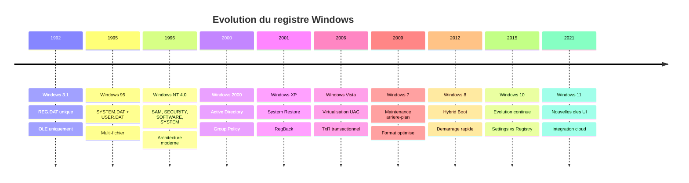
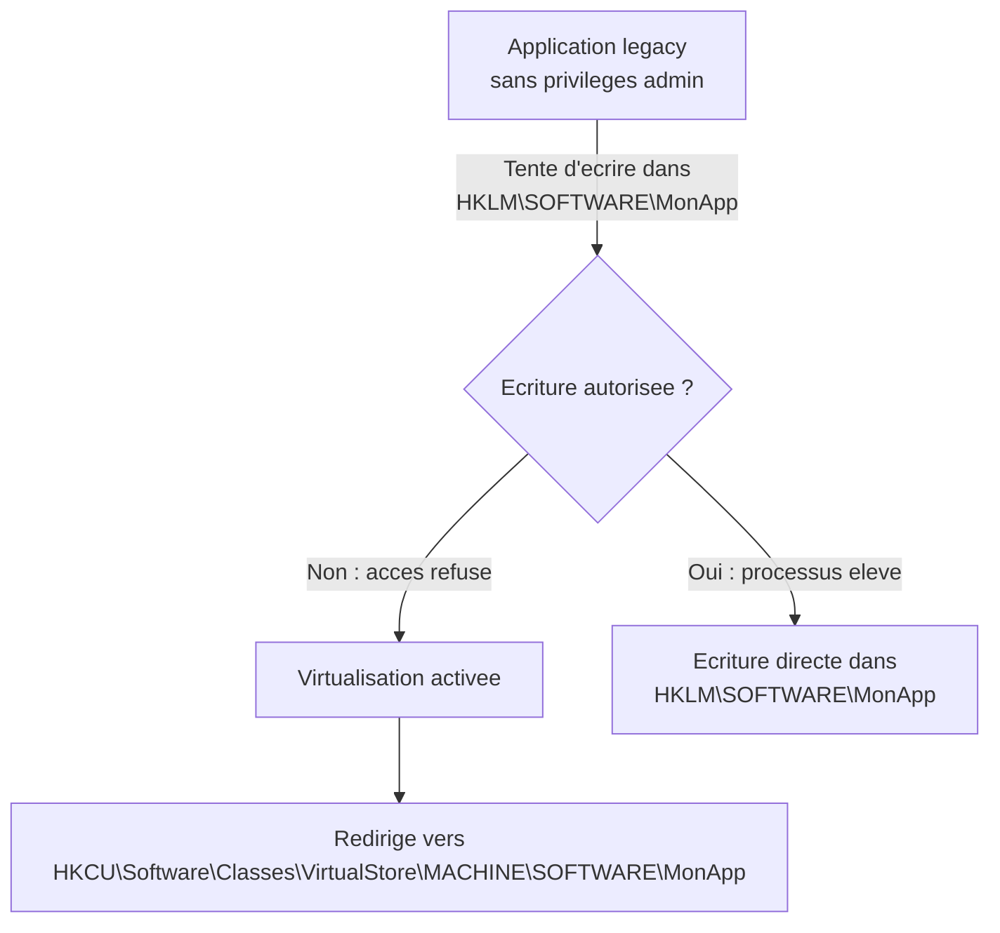
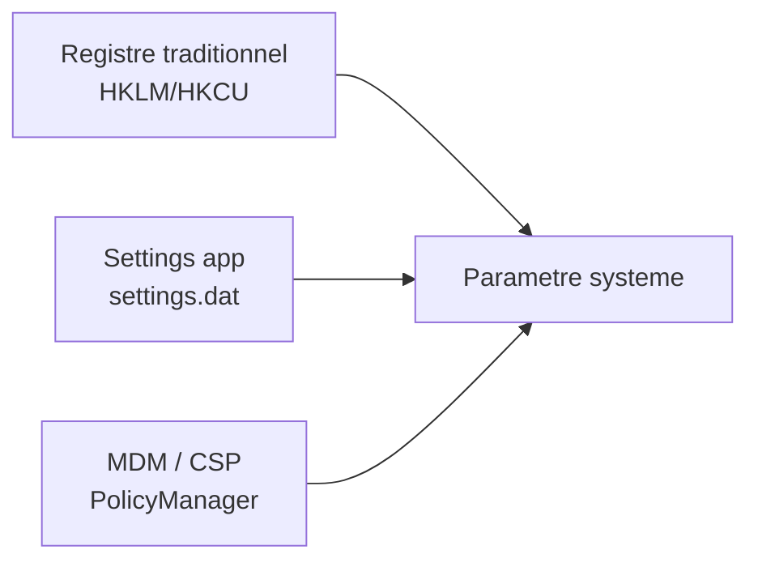
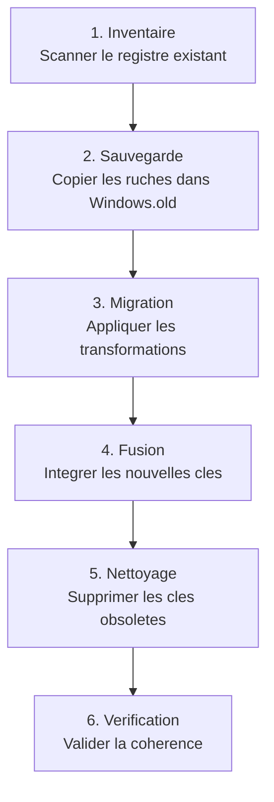
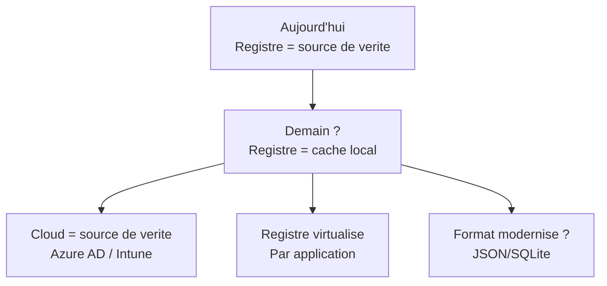

---
tags:
  - registre
  - versions
  - historique
---

# Evolution a travers les versions

## Ce que vous allez apprendre

- L'histoire complete du registre, de Windows 3.1 a Windows 11
- Les changements majeurs a chaque generation : format, structure, fonctionnalites
- L'evolution du format binaire des ruches (versions majeures/mineures)
- Les differences entre editions desktop et serveur
- Comment Windows preserve le registre lors des mises a niveau
- Les cles disparues et les fonctionnalites obsoletes
- L'avenir du registre face aux nouvelles approches de configuration

---

## Chronologie : 30 ans d'evolution



!!! info "En resume"
    - Le registre Windows a evolue sur 30 ans, de Windows 3.1 (1992) a Windows 11 (2021)
    - Chaque generation a apporte des changements majeurs : multi-fichier (95), securite et Unicode (NT), GPO (2000), virtualisation UAC et transactions (Vista), demarrage rapide (8), separation Settings/Registry (10)
    - Malgre ces evolutions, le format sous-jacent est reste fondamentalement compatible

---

## Windows 3.1 (1992) : la naissance

Le tout premier registre etait **d'une simplicite extreme**.

| Caracteristique | Detail |
|----------------|--------|
| Fichier | `REG.DAT` unique |
| Emplacement | `C:\WINDOWS\` |
| Taille typique | Quelques Ko |
| Contenu | Enregistrements OLE et associations de fichiers uniquement |
| Structure | Base de donnees plate, un seul niveau de hierarchie |

```
HKEY_CLASSES_ROOT
├── .doc = Word.Document
├── .xls = Excel.Sheet
└── Word.Document
    └── shell
        └── open
            └── command = C:\WINWORD\WINWORD.EXE %1
```

!!! tip "Analogie"
    Le registre de Windows 3.1 etait comme un **carnet d'adresses** avec une seule page : il ne servait qu'a dire "pour ouvrir un fichier `.doc`, lance Word".

Il n'y avait qu'**une seule ruche** : `HKEY_CLASSES_ROOT`.
Pas de configuration systeme, pas de profils utilisateurs, pas de securite.

L'editeur etait `REGEDIT.EXE`, deja present mais avec une interface tres basique.

!!! info "En resume"
    - Le premier registre Windows (3.1) se limitait a un fichier unique `REG.DAT` de quelques Ko
    - Il ne contenait que les associations de fichiers et les enregistrements OLE
    - Une seule branche existait (`HKEY_CLASSES_ROOT`), sans securite ni profils utilisateurs

---

## Windows 95/98/ME (1995-2000) : le registre multi-fichier

Avec Windows 95, le registre est devenu un **composant central** du systeme.

### Deux fichiers, deux roles

| Fichier | Role | Emplacement |
|---------|------|-------------|
| `SYSTEM.DAT` | Configuration machine (materiel, pilotes, logiciels) | `C:\WINDOWS\` |
| `USER.DAT` | Preferences utilisateur | `C:\WINDOWS\` ou `C:\WINDOWS\Profiles\<user>\` |

### Les branches sont apparues

```
HKEY_CLASSES_ROOT     ← Associations de fichiers (herite de 3.1)
HKEY_CURRENT_USER     ← NOUVEAU : preferences de l'utilisateur courant
HKEY_LOCAL_MACHINE    ← NOUVEAU : configuration de la machine
HKEY_USERS            ← NOUVEAU : tous les profils charges
HKEY_CURRENT_CONFIG   ← NOUVEAU : profil materiel actif
HKEY_DYN_DATA         ← NOUVEAU : donnees dynamiques (performances, Plug and Play)
```

!!! info "HKEY_DYN_DATA"
    Cette branche, unique a Windows 95/98/ME, contenait des **donnees en temps reel** sur les performances et le Plug and Play. Elle existait uniquement en memoire et a ete supprimee dans Windows NT/2000.

### Systeme de sauvegarde automatique

Windows 95 creait automatiquement des copies de secours :

| Fichier | Description |
|---------|-------------|
| `SYSTEM.DA0` | Copie de `SYSTEM.DAT` du dernier demarrage reussi |
| `USER.DA0` | Copie de `USER.DAT` du dernier demarrage reussi |

Windows ME a ajoute un **registre de restauration** via `scanreg` :

```batch
:: Windows 98/ME : restaurer le registre depuis une sauvegarde
scanreg /restore
```

```title="Resultat attendu"
L'utilitaire liste les sauvegardes disponibles et propose un retour a une copie precedente.
```

!!! warning "Pas de securite"
    Le registre de Windows 9x n'avait **aucun controle d'acces**. N'importe quel programme pouvait lire et ecrire n'importe quelle cle. C'etait un far west.

### Limites techniques

| Limite | Detail |
|--------|--------|
| Taille maximale | Pas de limite theorique, mais instabilite au-dela de quelques Mo |
| Format | Proprietaire, non documente |
| Pas de transactions | Corruption frequente en cas de crash |
| Pas de securite | Aucune ACL |
| Encodage | ANSI (pas Unicode) |

!!! info "En resume"
    - Windows 95 a transforme le registre en composant central avec deux fichiers (`SYSTEM.DAT` et `USER.DAT`)
    - Les cinq branches racines modernes sont apparues, dont `HKEY_CURRENT_USER` et `HKEY_LOCAL_MACHINE`
    - Aucun controle d'acces, pas de transactions, format ANSI : la stabilite et la securite etaient absentes

---

## Windows NT 3.1 a 4.0 (1993-1996) : l'architecture moderne

**C'est ici que nait le registre que nous connaissons aujourd'hui.**

Windows NT a ete concu en partant de zero par Dave Cutler et son equipe.
Le registre NT est fondamentalement different de celui de Windows 95 :

### Les cinq ruches fondamentales

| Ruche | Fichier | Role |
|-------|---------|------|
| SAM | `SAM` | Comptes utilisateurs et groupes locaux |
| SECURITY | `SECURITY` | Politiques de securite et droits |
| SOFTWARE | `SOFTWARE` | Configuration des logiciels installes |
| SYSTEM | `SYSTEM` | Configuration materielle et services |
| DEFAULT | `DEFAULT` | Profil par defaut pour les nouveaux utilisateurs |

Emplacement : `%SystemRoot%\System32\config\`

Chaque utilisateur possede egalement un fichier `NTUSER.DAT` dans son profil.

### Innovations majeures

| Innovation | Description |
|-----------|-------------|
| **Securite (ACL)** | Chaque cle a son propre descripteur de securite |
| **Unicode** | Support natif des caracteres internationaux |
| **Transactions** | Journaux `.LOG` pour la protection contre la corruption |
| **Hive format** | Format binaire structure avec cellules, bacs et en-tetes |
| **Configuration Manager** | Composant noyau dedie (`ntoskrnl.exe`) |
| **API unifiee** | `RegOpenKeyEx`, `RegSetValueEx`, `RegQueryValueEx`... |

!!! tip "Analogie"
    Si le registre de Windows 95 etait un **cahier d'ecolier**, le registre NT est un **coffre-fort bancaire** avec des serrures individuelles sur chaque tiroir, un journal de toutes les operations, et un gardien qui verifie les identites.

### Format binaire : version 1.3

Le format initial des ruches NT utilisait la signature `regf` avec :

- Version majeure : `1`
- Version mineure : `3`
- Taille de page : 4 096 octets (un *bin*)
- Cellules signees (negatif = alloue, positif = libre)

Ce format de base est reste compatible avec toutes les versions ulterieures.

!!! info "En resume"
    - Windows NT a pose les bases du registre moderne : cinq ruches, securite par ACL, Unicode natif et journaux de transactions
    - Le Configuration Manager, composant du noyau, gere le registre avec le format binaire `regf` version 1.3
    - Ce format est reste fondamentalement compatible avec toutes les versions ulterieures de Windows

---

## Windows 2000 (2000) : Active Directory et strategie de groupe

Windows 2000 n'a pas change la **structure** du registre, mais a transforme sa **gestion** en environnement entreprise.

### Active Directory et strategie de groupe (GPO)

| Nouveaute | Impact sur le registre |
|-----------|----------------------|
| **Group Policy Objects (GPO)** | Permet de configurer le registre de milliers de machines depuis un serveur central |
| **Registry Policy (Registry.pol)** | Fichier binaire dans le SYSVOL qui contient les modifications de registre a appliquer |
| **HKLM\SOFTWARE\Policies** | Nouvelle branche dediee aux politiques de groupe |
| **HKCU\SOFTWARE\Policies** | Politiques utilisateur appliquees via GPO |

### Group Policy Preferences

Les **preferences de strategie de groupe** permettent de creer, modifier ou supprimer des valeurs du registre sans les "tatouer" (elles persistent meme si la GPO est retiree).

### Autres ajouts

```
HKLM\SOFTWARE\Microsoft\Windows\CurrentVersion\Installer  ← Windows Installer (MSI)
HKLM\SOFTWARE\Microsoft\Cryptography                      ← Infrastructure PKI
HKLM\SYSTEM\CurrentControlSet\Services\DNS                 ← Service DNS integre
```

!!! info "En resume"
    - Windows 2000 a introduit les strategies de groupe (GPO) et les branches `Policies` dans le registre
    - Le fichier `Registry.pol` sur le SYSVOL permet de configurer le registre de milliers de machines depuis un serveur central
    - La structure des ruches n'a pas change, mais la gestion centralisee en entreprise a transforme l'usage du registre

---

## Windows XP (2001) : restauration systeme et protection

### System Restore et le registre

Windows XP a introduit la **Restauration du systeme** (*System Restore*) qui sauvegarde automatiquement les ruches du registre dans les points de restauration.

```
%SystemRoot%\System32\Restore
```

Les instantanes du registre sont stockes avec chaque point de restauration, permettant de revenir a un etat anterieur.

### RegBack : sauvegarde automatique

```
%SystemRoot%\System32\config\RegBack\
```

Windows XP a introduit une tache planifiee qui copie regulierement les ruches dans ce dossier :

```batch
dir %SystemRoot%\System32\config\RegBack
```

```title="Resultat attendu"
 Directory of C:\Windows\System32\config\RegBack

03/10/2024  03:00 AM      12,582,912 DEFAULT
03/10/2024  03:00 AM      12,582,912 SAM
03/10/2024  03:00 AM      12,582,912 SECURITY
03/10/2024  03:00 AM      67,108,864 SOFTWARE
03/10/2024  03:00 AM      16,777,216 SYSTEM
```

!!! warning "RegBack desactive depuis Windows 10 1803"
    A partir de Windows 10 version 1803, **RegBack est desactive par defaut**. Les fichiers existent toujours dans le dossier, mais ils ont une taille de **0 octet**. Microsoft a juge que cette sauvegarde etait redondante avec les points de restauration et les cliches instantanes (Volume Shadow Copies). La cle pour le reactiver :
    ```
    HKLM\SYSTEM\CurrentControlSet\Control\Session Manager\Configuration Manager
    EnablePeriodicBackup = 1 (REG_DWORD)
    ```

### Windows File Protection (WFP/SFC)

Le registre suit les fichiers systeme proteges :

```
HKLM\SOFTWARE\Microsoft\Windows NT\CurrentVersion\Winlogon\SFCDisable
```

### Last Known Good Configuration

Amelioration du mecanisme de "derniere bonne configuration connue" :

```
HKLM\SYSTEM\Select
    Current   : 1
    Default   : 1
    LastKnownGood : 2
    Failed    : 0
```

Windows garde **plusieurs jeux de configuration** (*ControlSet001*, *ControlSet002*) et peut revenir au dernier fonctionnel.

!!! info "En resume"
    - Windows XP a introduit la restauration systeme et le dossier `RegBack` pour la sauvegarde automatique des ruches
    - Le mecanisme *Last Known Good Configuration* permet de revenir a un jeu de configuration fonctionnel
    - Attention : `RegBack` est desactive par defaut depuis Windows 10 version 1803

---

## Windows Vista (2006) : trois revolutions

Windows Vista a apporte les trois plus grands changements au registre depuis Windows NT.

### 1. Virtualisation UAC du registre

Pour assurer la compatibilite avec les anciennes applications qui ecrivent dans `HKLM\SOFTWARE` sans privileges administrateur :



!!! info "Transparence"
    L'application ne sait pas qu'elle ecrit dans le VirtualStore. Pour elle, tout semble normal. C'est Windows qui intercepte et redirige silencieusement.

### 2. Registre transactionnel (KTM/TxR)

Windows Vista a introduit le **Kernel Transaction Manager** (KTM) et les **Transacted Registry** (TxR) pour permettre des modifications atomiques du registre :

```
C:\Windows\System32\config\TxR\  ← Fichiers de transactions
```

| Concept | Description |
|---------|-------------|
| **Transaction** | Groupe de modifications appliquees en bloc (tout ou rien) |
| **Commit** | Validation : toutes les modifications sont appliquees |
| **Rollback** | Annulation : aucune modification n'est appliquee |

Les journaux de transactions sont passes a un systeme dual (`.LOG1` + `.LOG2`) pour plus de robustesse.

### 3. Associations de fichiers par utilisateur

Avant Vista, les associations de fichiers etaient globales.
Depuis Vista, un utilisateur peut surcharger les associations machine :

```
HKCU\Software\Microsoft\Windows\CurrentVersion\Explorer\FileExts\.pdf\UserChoice
    ProgId = Acrobat.Document.DC
```

Cette cle `UserChoice` a priorite sur `HKCR\.pdf`.

!!! info "En resume"
    - Windows Vista a apporte trois revolutions : la virtualisation UAC du registre, les transactions atomiques (KTM/TxR) et les associations de fichiers par utilisateur
    - La virtualisation redirige les ecritures des applications legacy vers `HKCU\...\VirtualStore` de maniere transparente
    - Les journaux de transactions passent au systeme dual (`.LOG1` + `.LOG2`) pour une meilleure robustesse

---

## Windows 7 (2009) : optimisations

Windows 7 n'a pas apporte de revolution architecturale, mais des ameliorations incrementales :

### Maintenance en arriere-plan

Le Configuration Manager effectue desormais des optimisations automatiques :

| Optimisation | Description |
|-------------|-------------|
| Compactage | Recuperation de l'espace non alloue dans les ruches |
| Defragmentation interne | Reorganisation des cellules pour ameliorer les performances |
| Nettoyage | Suppression des donnees orphelines |

Ces operations sont invisibles et se produisent lors des periodes d'inactivite.

### Nouvelles cles notables

```
HKLM\SOFTWARE\Microsoft\Windows\CurrentVersion\HomeGroup  ← Groupe residentiel
HKCU\Software\Microsoft\Windows\CurrentVersion\Explorer\Taskband  ← Barre des taches repensee
HKLM\SOFTWARE\Microsoft\Windows\CurrentVersion\Reliability  ← Moniteur de fiabilite
```

### Version mineure du format

Le format des ruches passe a la version mineure `5` (version 1.5) pour supporter :

- Des checkpoints dans les journaux de transactions
- Un mecanisme de recuperation ameliore

!!! info "En resume"
    - Windows 7 a introduit la maintenance en arriere-plan du registre (compactage, defragmentation interne, nettoyage)
    - Le format des ruches passe a la version mineure 5 avec des checkpoints dans les journaux
    - Pas de revolution architecturale, mais des optimisations incrementales de performances et de fiabilite

---

## Windows 8 / 8.1 (2012-2013) : demarrage hybride

### Hybrid Boot (demarrage rapide)

Le changement majeur est le **Fast Startup** qui affecte directement le registre :

```
HKLM\SYSTEM\CurrentControlSet\Control\Session Manager\Power
    HiberbootEnabled = 1
```

Au lieu d'un arret complet, Windows 8 effectue une **hibernation partielle** du noyau.
Les ruches SYSTEM et SOFTWARE sont **sauvegardees en memoire** dans le fichier `hiberfil.sys`, ce qui accelere le demarrage.

!!! warning "Implication forensique"
    Avec le demarrage rapide, un "arret" de Windows n'ecrit **pas forcement** les ruches sur le disque de maniere propre. Les ruches chargees au demarrage suivant proviennent de l'etat hibernation, pas d'un etat frais.

### Interface moderne et nouvelles cles

```
HKCU\Software\Microsoft\Windows\CurrentVersion\ImmersiveShell  ← Interface Metro/Modern UI
HKLM\SOFTWARE\Microsoft\Windows\CurrentVersion\AppModel        ← Applications du Store
HKCU\Software\Microsoft\Windows\CurrentVersion\CloudStore      ← Synchronisation cloud
```

### Optimisations du format

| Amelioration | Detail |
|-------------|--------|
| Compression des donnees | Les grandes valeurs peuvent etre compressees |
| Chargement paresseux | Les sous-arbres rarement accedes sont charges a la demande |
| Prefetch du registre | Anticipation des lectures basee sur l'historique d'acces |

!!! info "En resume"
    - Le demarrage hybride (*Fast Startup*) sauvegarde les ruches SYSTEM et SOFTWARE dans `hiberfil.sys` pour accelerer le boot
    - De nouvelles cles apparaissent pour l'interface Modern UI, les applications du Store et la synchronisation cloud
    - Le format gagne en optimisations : compression des grandes valeurs, chargement paresseux et prefetch

---

## Windows 10 (2015-2021) : evolution continue

Windows 10 a introduit un modele de mises a jour semestrielles.
Le registre a evolue progressivement avec chaque version.

### 1507 - 1607 : la base

```
HKLM\SOFTWARE\Microsoft\Windows\CurrentVersion\WindowsUpdate  ← Windows Update revu
HKCU\Software\Microsoft\Windows\CurrentVersion\Themes\Personalize
    AppsUseLightTheme = 0  ← Theme sombre (nouveau)
HKLM\SOFTWARE\Microsoft\Windows\CurrentVersion\Policies\DataCollection
    AllowTelemetry = 1  ← Telemetrie (tres controverse)
```

### 1703 (Creators Update) : barre d'adresse dans Regedit

Enfin ! Regedit obtient une **barre d'adresse** permettant de coller directement un chemin :

```
HKCU\Software\Microsoft\Windows\CurrentVersion\Applets\Regedit
    View = ...  ← Nouvelles options d'affichage
```

!!! tip "Gain de productivite"
    Avant la version 1703, il fallait naviguer cle par cle dans l'arborescence. Depuis, vous pouvez coller `HKLM\SOFTWARE\Microsoft\Windows\CurrentVersion` dans la barre d'adresse et y acceder instantanement.

### 1803 (April 2018 Update) : RegBack desactive

```
HKLM\SYSTEM\CurrentControlSet\Control\Session Manager\Configuration Manager
    EnablePeriodicBackup = 0  ← RegBack desactive par defaut
```

Le dossier `RegBack` existe toujours, mais les fichiers sont **vides** (0 octet).

!!! danger "Impact en depannage"
    Cette modification a surpris de nombreux administrateurs qui comptaient sur RegBack pour reparer un registre corrompu. Desormais, il faut reactiver manuellement la sauvegarde ou utiliser les points de restauration.

### 1903+ : Settings vs Registry

Windows 10 a commence a deplacer certains parametres **hors du registre** :



Certains parametres de l'application **Parametres** (*Settings*) sont stockes dans des fichiers `settings.dat` (format binaire proprietaire) plutot que dans le registre.

```
%LocalAppData%\Packages\windows.immersivecontrolpanel_cw5n1h2txyewy\Settings\settings.dat
```

### 20H2+ : WDAC et politiques de securite

```
HKLM\SYSTEM\CurrentControlSet\Control\CI   ← Code Integrity / WDAC
HKLM\SOFTWARE\Policies\Microsoft\Windows\DeviceGuard
    EnableVirtualizationBasedSecurity = 1
    RequirePlatformSecurityFeatures = 3
```

### Recapitulatif des changements par version

| Version | Annee | Changement registre majeur |
|---------|-------|---------------------------|
| 1507 | 2015 | Telemetrie, Theme sombre |
| 1607 | 2016 | Windows Subsystem for Linux (cles Lxss) |
| 1703 | 2017 | Barre d'adresse Regedit |
| 1803 | 2018 | RegBack desactive par defaut |
| 1903 | 2019 | Separation Settings / Registry |
| 2004 | 2020 | WSL 2 (nouvelles cles) |
| 20H2 | 2020 | WDAC integration poussee |
| 21H1 | 2021 | Nettoyage cles obsoletes Edge Legacy |
| 21H2 | 2021 | Derniere version "majeure" |
| 22H2 | 2022 | Version finale de Windows 10 |

!!! info "En resume"
    - Windows 10 a introduit un modele de mises a jour semestrielles, faisant evoluer le registre progressivement
    - Changements majeurs : barre d'adresse dans Regedit (1703), `RegBack` desactive par defaut (1803), separation Settings/Registry (1903+)
    - Certains parametres migrent vers des fichiers `settings.dat` proprietaires, amorcant une diversification hors du registre

---

## Windows 11 (2021+) : interface repensee

Windows 11 a introduit de nombreuses nouvelles cles liees a son interface utilisateur revisitee.

### Alignement de la barre des taches

```reg
; Center (default)
[HKCU\Software\Microsoft\Windows\CurrentVersion\Explorer\Advanced]
"TaskbarAl"=dword:00000001

; Left alignment
[HKCU\Software\Microsoft\Windows\CurrentVersion\Explorer\Advanced]
"TaskbarAl"=dword:00000000
```

### Snap Layouts

```
HKCU\Software\Microsoft\Windows\CurrentVersion\Explorer\Advanced
    EnableSnapAssistFlyout = 1    ; Snap Layouts au survol du bouton Agrandir
    EnableSnapBar = 1             ; Barre de Snap en haut de l'ecran
    SnapAssist = 1                ; Assistance au positionnement
```

### Widgets

```
HKCU\Software\Microsoft\Windows\CurrentVersion\Explorer\Advanced
    TaskbarDa = 1    ; Afficher les widgets dans la barre des taches (1 = oui, 0 = non)
```

### Teams integration (versions initiales)

```
HKCU\Software\Microsoft\Windows\CurrentVersion\Explorer\Advanced
    TaskbarMn = 1    ; Icone Chat/Teams dans la barre des taches
```

!!! note "Teams retire"
    Microsoft a retire l'integration de Teams Chat de la barre des taches dans les versions recentes de Windows 11. La cle `TaskbarMn` n'a plus d'effet sur les builds recents.

### Menus contextuels

```reg
; Restore Windows 10 classic context menu
[HKCU\Software\Classes\CLSID\{86ca1aa0-34aa-4e8b-a509-50c905bae2a2}\InprocServer32]
@=""
```

```powershell
# Restore classic context menu
New-Item -Path "HKCU:\Software\Classes\CLSID\{86ca1aa0-34aa-4e8b-a509-50c905bae2a2}\InprocServer32" -Value "" -Force
# Restart Explorer for the change to take effect
Stop-Process -Name explorer -Force
```

```title="Resultat attendu"
Le menu contextuel classique revient apres redemarrage d'Explorer.
```

### Tableau des nouvelles cles Windows 11

| Cle / Valeur | Branche | Effet |
|-------------|---------|-------|
| `TaskbarAl` | `Explorer\Advanced` | Alignement barre des taches (0=gauche, 1=centre) |
| `TaskbarDa` | `Explorer\Advanced` | Widgets (0=masque, 1=affiche) |
| `TaskbarMn` | `Explorer\Advanced` | Chat Teams (0=masque, 1=affiche) |
| `TaskbarSi` | `Explorer\Advanced` | Taille barre des taches (0=petit, 1=moyen, 2=grand) |
| `Start_Layout` | `Explorer\Advanced` | Disposition du menu Demarrer (0=plus d'epingles, 1=defaut, 2=plus de recommandations) |
| `EnableSnapAssistFlyout` | `Explorer\Advanced` | Snap Layouts au survol |

!!! info "En resume"
    - Windows 11 a introduit de nombreuses nouvelles cles sous `Explorer\Advanced` pour personnaliser la barre des taches, les widgets et les Snap Layouts
    - Le menu contextuel classique peut etre restaure via une cle CLSID specifique dans `HKCU\Software\Classes`
    - Certaines cles comme `TaskbarMn` (Teams Chat) sont devenues obsoletes dans les builds recents

---

## Editions serveur : differences cles

Les editions Windows Server partagent le meme format de registre, mais leur **configuration par defaut** differe significativement.

### Cles specifiques aux serveurs

```
HKLM\SYSTEM\CurrentControlSet\Control\ProductOptions
    ProductType = "ServerNT"          ; Server standard
    ProductType = "LanmanNT"          ; Domain controller

HKLM\SOFTWARE\Microsoft\Windows NT\CurrentVersion
    InstallationType = "Server"       ; vs "Client" pour les editions desktop
    EditionID = "ServerStandard"      ; ou "ServerDatacenter"
```

### Differences de configuration par defaut

| Parametre | Desktop | Server |
|-----------|---------|--------|
| `DisableAntiSpyware` | 0 (Defender actif) | 1 (souvent desactive) |
| `NtfsDisableLastAccessUpdate` | 1 (desactive) | 1 (desactive) |
| `Start` des services multimedia | 2 (auto) | 4 (desactive) |
| IE Enhanced Security | Desactive | Active |
| Pare-feu profil domaine | Actif | Actif avec regles strictes |
| Telemetrie | Normal | Minimal |

### Server Core : registre minimal

Server Core n'a pas d'Explorateur Windows ni d'interface graphique.
De nombreuses cles liees au shell (`Explorer`, `Themes`, `Desktop`) sont absentes ou vides.

```powershell
# Check if running Server Core
$installType = (Get-ItemProperty "HKLM:\SOFTWARE\Microsoft\Windows NT\CurrentVersion").InstallationType
if ($installType -eq "Server Core") {
    Write-Output "Server Core detected - minimal registry"
}
```

```title="Resultat attendu"
Server Core detected - minimal registry
```

!!! info "En resume"
    - Les editions Windows Server partagent le meme format de registre mais ont une configuration par defaut differente (services multimedia desactives, securite renforcee)
    - La valeur `ProductType` dans `ProductOptions` distingue un serveur (`ServerNT`) d'un controleur de domaine (`LanmanNT`)
    - Server Core possede un registre minimal, sans les cles liees au shell graphique

---

## Format des ruches : versions majeures et mineures

Le format binaire des ruches a evolue au fil des versions de Windows.

| Version | Windows | Changements |
|---------|---------|-------------|
| 1.1 | NT 3.1 | Format initial |
| 1.2 | NT 3.5 | Corrections mineures |
| 1.3 | NT 4.0 | Format stable de reference |
| 1.4 | Vista | Support des journaux duaux (.LOG1/.LOG2) |
| 1.5 | 7/8 | Checkpoints dans les journaux |
| 1.6 | 10 | Optimisations internes |

!!! info "Compatibilite ascendante"
    La version majeure est restee `1` depuis le debut. Cela signifie que le format est **fondamentalement le meme** depuis NT 3.1. Un outil qui sait lire la version 1.3 peut generalement lire toutes les versions ulterieures. Les changements de version mineure ajoutent des fonctionnalites sans casser la compatibilite.

### Verifier la version d'une ruche

```python
import struct

# Read the hive header
with open("C:/Windows/System32/config/SYSTEM", "rb") as f:
    header = f.read(4096)

signature = header[0:4]
major_version = struct.unpack_from("<I", header, 0x14)[0]
minor_version = struct.unpack_from("<I", header, 0x18)[0]

print(f"Signature: {signature}")
print(f"Version: {major_version}.{minor_version}")
```

```title="Resultat attendu"
Signature: b'regf'
Version: 1.6
```

!!! info "En resume"
    - Le format binaire des ruches a evolue de la version 1.1 (NT 3.1) a la version 1.6 (Windows 10), mais la version majeure est restee `1`
    - Cette stabilite garantit une compatibilite ascendante : un outil lisant la version 1.3 peut generalement lire toutes les versions suivantes
    - La signature `regf` et la structure en cellules/bacs sont restees fondamentalement inchangees depuis 30 ans

---

## Migration : preservation du registre lors des mises a niveau

### Comment Windows preserve le registre

Lors d'une mise a niveau majeure (ex : Windows 10 vers Windows 11), Windows suit un processus en plusieurs etapes :



### Dossier Windows.old

Apres une mise a niveau, les anciennes ruches sont conservees dans :

```
C:\Windows.old\Windows\System32\config\
```

!!! tip "Duree de conservation"
    Windows garde le dossier `Windows.old` pendant **10 jours** (Windows 10/11). Passe ce delai, il est supprime automatiquement par la tache de nettoyage de disque. Pensez a copier les ruches si vous avez besoin de les comparer.

### Transformations appliquees

| Type de transformation | Exemple |
|-----------------------|---------|
| **Ajout de cles** | Nouvelles cles pour les fonctionnalites ajoutees |
| **Migration de valeurs** | Deplacer un parametre d'une cle a une autre |
| **Suppression de cles** | Retirer les cles de fonctionnalites supprimees |
| **Mise a jour de valeurs** | Modifier les valeurs par defaut |

Les regles de migration sont definies dans des fichiers **manifest** (`.man`) dans le dossier d'installation de Windows.

!!! info "En resume"
    - Lors d'une mise a niveau, Windows sauvegarde les anciennes ruches dans `Windows.old`, applique des transformations puis fusionne les nouvelles cles
    - Le dossier `Windows.old` est conserve 10 jours avant suppression automatique
    - Les regles de migration (ajout, deplacement, suppression de cles) sont definies dans des fichiers manifest du systeme

---

## Fonctionnalites obsoletes et traces residuelles

De nombreuses fonctionnalites disparues laissent des **vestiges** dans le registre :

| Fonctionnalite | Cle residuelle | Statut |
|---------------|---------------|--------|
| Internet Explorer | `HKLM\SOFTWARE\Microsoft\Internet Explorer` | Retire dans Win 11 24H2 |
| HomeGroup | `HKLM\SOFTWARE\Microsoft\Windows\CurrentVersion\HomeGroup` | Retire depuis Win 10 1803 |
| Windows Media Center | `HKLM\SOFTWARE\Microsoft\Windows\CurrentVersion\Media Center` | Retire depuis Win 10 |
| Windows Phone companion | `HKLM\SOFTWARE\Microsoft\Windows Phone` | Retire depuis Win 10 |
| Paint Classic (mspaint) | `HKCU\Software\Microsoft\Windows\CurrentVersion\Applets\Paint` | Remplace par Paint 3D puis revenu |
| Cortana standalone | `HKCU\Software\Microsoft\Windows\CurrentVersion\Search\CortanaConsent` | Retire dans Win 11 |
| Edge Legacy (EdgeHTML) | `HKLM\SOFTWARE\Microsoft\Windows\CurrentVersion\Appx\*edge*` | Remplace par Edge Chromium |
| Windows To Go | `HKLM\SOFTWARE\Policies\Microsoft\PortableOperatingSystem` | Retire depuis Win 10 2004 |

!!! info "Nettoyage"
    Windows ne supprime pas toujours les cles des fonctionnalites retirees. Elles restent dans le registre comme des **fossiles numeriques**. Cela peut preter a confusion lors du diagnostic, car une cle presente ne signifie pas que la fonctionnalite est active.

!!! info "En resume"
    - De nombreuses fonctionnalites retirees (Internet Explorer, HomeGroup, Cortana, Edge Legacy) laissent des cles residuelles dans le registre
    - Windows ne nettoie pas systematiquement ces vestiges lors des mises a jour
    - La presence d'une cle ne garantit pas que la fonctionnalite associee est active ou meme disponible

---

## L'avenir du registre

### Le registre est-il en voie de disparition ?

Plusieurs signaux suggerent une diversification des mecanismes de configuration :

| Mecanisme | Role | Remplace le registre ? |
|-----------|------|----------------------|
| **Settings app** | Parametres utilisateur | Partiellement (settings.dat) |
| **MDM / CSP** | Gestion d'entreprise via Intune | Ecrit souvent dans le registre, mais l'abstrait |
| **MSIX** | Paquets applicatifs | Registre virtualise dans le package |
| **Cloud Config** | Synchronisation Azure AD | Politique distribuee depuis le cloud |
| **DSC** (Desired State Configuration) | Automatisation | Utilise le registre comme backend |

!!! info "En resume"
    Le registre ne disparaitra **pas** de sitot. Il reste le **fondement** de la configuration Windows. Les nouvelles approches (Settings, MDM, MSIX) sont des **couches d'abstraction** au-dessus du registre, pas des remplacements. Meme dans Windows 11, la quasi-totalite des parametres finissent par atterrir dans le registre.

### Ce qui pourrait changer



Windows evolue vers un modele ou le registre pourrait devenir un **cache local** d'une configuration geree dans le cloud.
Mais pour les annees a venir, connaitre le registre reste une competence **indispensable** pour tout professionnel Windows.

!!! info "En resume"
    - Les nouvelles approches (Settings app, MDM/CSP, MSIX, cloud) sont des couches d'abstraction au-dessus du registre, pas des remplacements
    - Le registre pourrait evoluer vers un role de cache local d'une configuration geree dans le cloud
    - Pour les annees a venir, la maitrise du registre reste une competence indispensable pour tout professionnel Windows

---

!!! info "En resume"
    Le registre Windows est passe d'un simple fichier de correspondances OLE (Windows 3.1) a une base de donnees complexe, securisee et transactionnelle (NT et au-dela). Chaque generation a apporte des ameliorations sans jamais rompre la compatibilite fondamentale. Le format `regf` version 1.x est reste remarquablement stable pendant 30 ans. Meme si de nouvelles approches emergent (MDM, Settings, cloud), le registre reste le coeur de la configuration Windows.
