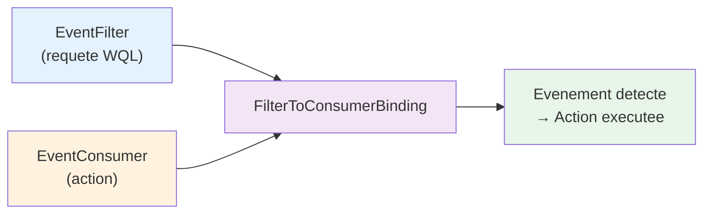

---
tags:
  - registre
  - WMI
  - CIM
  - administration à distance
  - PowerShell
  - automatisation
---

# WMI, CIM et le registre

## Ce que vous allez apprendre

- L'architecture WMI et le role de StdRegProv comme passerelle vers le registre
- La reference complete des methodes StdRegProv (lecture, ecriture, enumeration, securite)
- Les syntaxes PowerShell modernes (CIM) et historiques (WMI) pour manipuler le registre
- L'administration distante a grande echelle : CimSession, DCOM, WinRM, parallelisme
- La lecture de tous les types de donnees du registre via WMI, y compris l'enumeration recursive
- Les scenarios pratiques : inventaire logiciel, deploiement de masse, audit de conformite
- Les evenements WMI lies au registre (surveillance de modifications en temps reel et persistante)
- La configuration de WMI lui-meme via le registre
- Le depannage des problemes WMI courants

---

## Architecture WMI et le registre

Ouvrez une console PowerShell en tant qu'administrateur et executez :

```powershell
# Query the StdRegProv class to list all available methods
$class = [wmiclass]"root\default:StdRegProv"
$class.Methods | Select-Object Name | Sort-Object Name
```

```title="Resultat attendu"
Name
----
CheckAccess
CreateKey
DeleteKey
DeleteValue
EnumKey
EnumValues
GetBinaryValue
GetDWORDValue
GetExpandedStringValue
GetMultiStringValue
GetQWORDValue
GetSecurityDescriptor
GetStringValue
SetBinaryValue
SetDWORDValue
SetExpandedStringValue
SetMultiStringValue
SetQWORDValue
SetSecurityDescriptor
SetStringValue
```

!!! tip "Analogie"
    WMI fonctionne comme un **standard telephonique centralise** pour Windows. Chaque composant du systeme (disques, services, reseau, registre) a son "poste telephonique" -- un fournisseur WMI. Pour le registre, ce poste s'appelle **StdRegProv**. Que vous appeliez depuis la machine locale ou depuis un poste a 3000 km via le reseau, vous composez le meme numero et obtenez les memes reponses.

### Vue d'ensemble de WMI

WMI (Windows Management Instrumentation) est l'implementation Microsoft du standard **WBEM** (Web-Based Enterprise Management) et du modele **CIM** (Common Information Model). Il offre une interface unifiee pour interroger et configurer les composants Windows.

L'espace de noms principal est `root\cimv2` pour la plupart des classes systeme, mais StdRegProv vit dans un espace de noms different :

```
root\default
```

C'est une erreur frequente : chercher StdRegProv dans `root\cimv2` ne retourne rien. La classe est enregistree dans `root\default` depuis Windows 2000.

### StdRegProv : la classe WMI pour le registre

StdRegProv (Standard Registry Provider) est une classe **statique** -- elle n'a pas d'instances. Tous les acces se font par appels de methodes. Chaque methode prend au minimum deux parametres :

- **hDefKey** : la constante identifiant la ruche
- **sSubKeyName** : le chemin de la sous-cle (relatif a la ruche)

### Constantes des ruches

Les ruches sont identifiees par des constantes hexadecimales. En PowerShell, on les utilise sous forme d'entiers non signes (UInt32) :

| Constante | Valeur hexadecimale | Valeur decimale | Ruche |
|-----------|:-------------------:|:---------------:|-------|
| `HKEY_CLASSES_ROOT` | `&H80000000` | `2147483648` | HKCR |
| `HKEY_CURRENT_USER` | `&H80000001` | `2147483649` | HKCU |
| `HKEY_LOCAL_MACHINE` | `&H80000002` | `2147483650` | HKLM |
| `HKEY_USERS` | `&H80000003` | `2147483651` | HKU |
| `HKEY_CURRENT_CONFIG` | `&H80000005` | `2147483653` | HKCC |

```powershell
# Define hive constants for use throughout the session
$HKCR = [uint32]2147483648
$HKCU = [uint32]2147483649
$HKLM = [uint32]2147483650
$HKU  = [uint32]2147483651
$HKCC = [uint32]2147483653
```

### Reference complete des methodes StdRegProv

| Methode | Description | Parametres principaux |
|---------|-------------|----------------------|
| `GetStringValue` | Lit une valeur REG_SZ | hDefKey, sSubKeyName, sValueName |
| `GetDWORDValue` | Lit une valeur REG_DWORD | hDefKey, sSubKeyName, sValueName |
| `GetBinaryValue` | Lit une valeur REG_BINARY | hDefKey, sSubKeyName, sValueName |
| `GetMultiStringValue` | Lit une valeur REG_MULTI_SZ | hDefKey, sSubKeyName, sValueName |
| `GetExpandedStringValue` | Lit une valeur REG_EXPAND_SZ | hDefKey, sSubKeyName, sValueName |
| `GetQWORDValue` | Lit une valeur REG_QWORD | hDefKey, sSubKeyName, sValueName |
| `SetStringValue` | Ecrit une valeur REG_SZ | hDefKey, sSubKeyName, sValueName, sValue |
| `SetDWORDValue` | Ecrit une valeur REG_DWORD | hDefKey, sSubKeyName, sValueName, uValue |
| `SetBinaryValue` | Ecrit une valeur REG_BINARY | hDefKey, sSubKeyName, sValueName, uValue |
| `SetMultiStringValue` | Ecrit une valeur REG_MULTI_SZ | hDefKey, sSubKeyName, sValueName, sValue |
| `SetExpandedStringValue` | Ecrit une valeur REG_EXPAND_SZ | hDefKey, sSubKeyName, sValueName, sValue |
| `SetQWORDValue` | Ecrit une valeur REG_QWORD | hDefKey, sSubKeyName, sValueName, uValue |
| `CreateKey` | Cree une sous-cle | hDefKey, sSubKeyName |
| `DeleteKey` | Supprime une sous-cle (doit etre vide) | hDefKey, sSubKeyName |
| `DeleteValue` | Supprime une valeur | hDefKey, sSubKeyName, sValueName |
| `EnumKey` | Enumere les sous-cles | hDefKey, sSubKeyName |
| `EnumValues` | Enumere les valeurs et leurs types | hDefKey, sSubKeyName |
| `CheckAccess` | Verifie les permissions sur une cle | hDefKey, sSubKeyName, uRequired |
| `GetSecurityDescriptor` | Lit le descripteur de securite d'une cle | hDefKey, sSubKeyName |
| `SetSecurityDescriptor` | Definit le descripteur de securite d'une cle | hDefKey, sSubKeyName, Descriptor |

### Correspondance methode-type de donnees

`EnumValues` retourne un tableau de types (`iTypes`). Chaque entier correspond a un type de registre et a une methode de lecture specifique :

| Code type | Type registre | Methode de lecture | Methode d'ecriture |
|:---------:|---------------|--------------------|--------------------|
| `1` | REG_SZ | `GetStringValue` | `SetStringValue` |
| `2` | REG_EXPAND_SZ | `GetExpandedStringValue` | `SetExpandedStringValue` |
| `3` | REG_BINARY | `GetBinaryValue` | `SetBinaryValue` |
| `4` | REG_DWORD | `GetDWORDValue` | `SetDWORDValue` |
| `7` | REG_MULTI_SZ | `GetMultiStringValue` | `SetMultiStringValue` |
| `11` | REG_QWORD | `GetQWORDValue` | `SetQWORDValue` |

!!! note "Types non couverts par StdRegProv"
    Les types `REG_NONE` (0), `REG_DWORD_BIG_ENDIAN` (5), `REG_LINK` (6), `REG_RESOURCE_LIST` (8), `REG_FULL_RESOURCE_DESCRIPTOR` (9) et `REG_RESOURCE_REQUIREMENTS_LIST` (10) ne disposent pas de methodes dediees dans StdRegProv. Pour les lire, utilisez `GetBinaryValue` qui retourne les octets bruts, ou passez par le fournisseur de registre PowerShell natif (`Get-ItemProperty`).

!!! info "En resume"
    - WMI est l'implementation Microsoft de WBEM/CIM, avec StdRegProv comme classe dediee au registre dans le namespace `root\default`
    - StdRegProv est une classe statique sans instances : tous les acces passent par des appels de methodes (Get/Set/Enum/Delete)
    - Chaque methode necessite une constante de ruche (hDefKey) et un chemin de sous-cle relatif

---

## WMI local : PowerShell et VBScript

### Syntaxe historique : Invoke-WmiMethod

La syntaxe `Invoke-WmiMethod` est l'approche **historique** de PowerShell (v1-v2). Elle fonctionne toujours mais est consideree obsolete depuis PowerShell 3.0.

```powershell
# Read a REG_SZ value using legacy WMI syntax
$HKLM = [uint32]2147483650
$result = Invoke-WmiMethod -Namespace "root\default" -Class StdRegProv `
    -Name GetStringValue `
    -ArgumentList $HKLM, "SOFTWARE\Microsoft\Windows NT\CurrentVersion", "ProductName"

$result.sValue
```

```title="Resultat attendu"
Windows 11 Pro
```

```powershell
# Read a REG_DWORD value using legacy WMI syntax
$result = Invoke-WmiMethod -Namespace "root\default" -Class StdRegProv `
    -Name GetDWORDValue `
    -ArgumentList $HKLM, "SOFTWARE\Microsoft\Windows NT\CurrentVersion", "InstallationType"

# Note: InstallationType is REG_SZ, use GetStringValue instead
# This example reads CurrentBuildNumber (also REG_SZ) -- let's use a true DWORD
$result = Invoke-WmiMethod -Namespace "root\default" -Class StdRegProv `
    -Name GetDWORDValue `
    -ArgumentList $HKLM, "SOFTWARE\Microsoft\Windows NT\CurrentVersion", "UBR"

$result.uValue
```

```title="Resultat attendu"
4170
```

!!! warning "Invoke-WmiMethod est obsolete"
    Microsoft a marque les cmdlets `*-WmiObject` comme **depreciees** a partir de PowerShell 3.0. Elles sont absentes de PowerShell 7+. Utilisez systematiquement les cmdlets CIM dans tout nouveau script.

### Syntaxe moderne : Invoke-CimMethod

La syntaxe CIM est la methode **recommandee**. Elle utilise WinRM (WS-Management) par defaut au lieu de DCOM, offre une meilleure gestion des erreurs et fonctionne dans PowerShell 7+.

```powershell
# Read a REG_SZ value using modern CIM syntax
$HKLM = [uint32]2147483650

$params = @{
    hDefKey     = $HKLM
    sSubKeyName = "SOFTWARE\Microsoft\Windows NT\CurrentVersion"
    sValueName  = "ProductName"
}

$result = Invoke-CimMethod -Namespace "root\default" -ClassName StdRegProv `
    -MethodName GetStringValue -Arguments $params

$result.sValue
```

```title="Resultat attendu"
Windows 11 Pro
```

!!! note "Difference de syntaxe"
    Avec `Invoke-WmiMethod`, les arguments sont passes dans l'ordre via `-ArgumentList`. Avec `Invoke-CimMethod`, ils sont passes par nom dans une table de hachage (`-Arguments`). La syntaxe CIM est plus explicite et moins sujette aux erreurs d'ordre des parametres.

### Exemples complets en CIM

#### Lire une valeur DWORD

```powershell
# Read the Update Build Revision (UBR) number
$HKLM = [uint32]2147483650

$result = Invoke-CimMethod -Namespace "root\default" -ClassName StdRegProv `
    -MethodName GetDWORDValue -Arguments @{
        hDefKey     = $HKLM
        sSubKeyName = "SOFTWARE\Microsoft\Windows NT\CurrentVersion"
        sValueName  = "UBR"
    }

Write-Output "UBR: $($result.uValue)"
```

```title="Resultat attendu"
UBR: 4170
```

#### Enumerer les sous-cles

```powershell
# List all subkeys under the Run key
$HKLM = [uint32]2147483650

$result = Invoke-CimMethod -Namespace "root\default" -ClassName StdRegProv `
    -MethodName EnumKey -Arguments @{
        hDefKey     = $HKLM
        sSubKeyName = "SOFTWARE\Microsoft\Windows\CurrentVersion\Run"
    }

# EnumKey at this level might fail -- Run is a value container, not a key container
# Let's enumerate the Uninstall key instead
$result = Invoke-CimMethod -Namespace "root\default" -ClassName StdRegProv `
    -MethodName EnumKey -Arguments @{
        hDefKey     = $HKLM
        sSubKeyName = "SOFTWARE\Microsoft\Windows\CurrentVersion\Uninstall"
    }

$result.sNames | Select-Object -First 10
```

```title="Resultat attendu"
7-Zip
Git
Google Chrome
Microsoft Edge
Mozilla Firefox
Notepad++
Python 3.12
Visual Studio Code
VLC media player
WinRAR
```

#### Enumerer les valeurs et leurs types

```powershell
# List all values under the CurrentVersion key
$HKLM = [uint32]2147483650

$result = Invoke-CimMethod -Namespace "root\default" -ClassName StdRegProv `
    -MethodName EnumValues -Arguments @{
        hDefKey     = $HKLM
        sSubKeyName = "SOFTWARE\Microsoft\Windows NT\CurrentVersion"
    }

# Map type codes to names
$typeNames = @{
    1 = "REG_SZ"; 2 = "REG_EXPAND_SZ"; 3 = "REG_BINARY"
    4 = "REG_DWORD"; 7 = "REG_MULTI_SZ"; 11 = "REG_QWORD"
}

for ($i = 0; $i -lt $result.sNames.Count; $i++) {
    [PSCustomObject]@{
        Name = $result.sNames[$i]
        Type = $typeNames[[int]$result.Types[$i]]
    }
} | Format-Table -AutoSize
```

```title="Resultat attendu"
Name                    Type
----                    ----
SystemRoot              REG_EXPAND_SZ
BuildBranch             REG_SZ
BuildGUID               REG_SZ
BuildLab                REG_SZ
BuildLabEx              REG_SZ
CurrentBuild            REG_SZ
CurrentBuildNumber      REG_SZ
CurrentMajorVersionNumber REG_DWORD
CurrentMinorVersionNumber REG_DWORD
CurrentType             REG_SZ
CurrentVersion          REG_SZ
DisplayVersion          REG_SZ
EditionID               REG_SZ
InstallDate             REG_DWORD
InstallationType        REG_SZ
ProductName             REG_SZ
UBR                     REG_DWORD
...
```

#### Creer une cle

```powershell
# Create a new registry key
$HKLM = [uint32]2147483650

$result = Invoke-CimMethod -Namespace "root\default" -ClassName StdRegProv `
    -MethodName CreateKey -Arguments @{
        hDefKey     = $HKLM
        sSubKeyName = "SOFTWARE\MonEntreprise\Config"
    }

if ($result.ReturnValue -eq 0) {
    Write-Output "Key created successfully"
}
```

```title="Resultat attendu"
Key created successfully
```

#### Ecrire une valeur

```powershell
# Write a REG_SZ value
$HKLM = [uint32]2147483650

Invoke-CimMethod -Namespace "root\default" -ClassName StdRegProv `
    -MethodName SetStringValue -Arguments @{
        hDefKey     = $HKLM
        sSubKeyName = "SOFTWARE\MonEntreprise\Config"
        sValueName  = "Version"
        sValue      = "2.5.0"
    }

# Write a REG_DWORD value
Invoke-CimMethod -Namespace "root\default" -ClassName StdRegProv `
    -MethodName SetDWORDValue -Arguments @{
        hDefKey     = $HKLM
        sSubKeyName = "SOFTWARE\MonEntreprise\Config"
        sValueName  = "MaxRetries"
        uValue      = [uint32]5
    }
```

```title="Resultat attendu"
ReturnValue PSComputerName
----------- --------------
          0 localhost
```

#### Supprimer une valeur et une cle

```powershell
# Delete a value
$HKLM = [uint32]2147483650

Invoke-CimMethod -Namespace "root\default" -ClassName StdRegProv `
    -MethodName DeleteValue -Arguments @{
        hDefKey     = $HKLM
        sSubKeyName = "SOFTWARE\MonEntreprise\Config"
        sValueName  = "Version"
    }

# Delete all values first, then the key (key must be empty)
Invoke-CimMethod -Namespace "root\default" -ClassName StdRegProv `
    -MethodName DeleteValue -Arguments @{
        hDefKey     = $HKLM
        sSubKeyName = "SOFTWARE\MonEntreprise\Config"
        sValueName  = "MaxRetries"
    }

Invoke-CimMethod -Namespace "root\default" -ClassName StdRegProv `
    -MethodName DeleteKey -Arguments @{
        hDefKey     = $HKLM
        sSubKeyName = "SOFTWARE\MonEntreprise\Config"
    }
```

```title="Resultat attendu"
ReturnValue PSComputerName
----------- --------------
          0 localhost
```

### VBScript : l'heritage encore present

VBScript est officiellement obsolete (desactive par defaut dans Windows 11 24H2+), mais il reste **massivement present** dans les scripts d'entreprise et les GPO de demarrage/connexion deployes il y a parfois plus de 15 ans.

```vbscript
' Read a REG_SZ value from the registry using StdRegProv
Const HKLM = &H80000002

Set oReg = GetObject("winmgmts:{impersonationLevel=impersonate}!\\.\root\default:StdRegProv")

strKeyPath = "SOFTWARE\Microsoft\Windows NT\CurrentVersion"
strValueName = "ProductName"

lRC = oReg.GetStringValue(HKLM, strKeyPath, strValueName, strValue)

If lRC = 0 Then
    WScript.Echo "Product: " & strValue
Else
    WScript.Echo "Error: return code " & lRC
End If
```

```title="Resultat attendu"
Product: Windows 11 Pro
```

```vbscript
' Enumerate all subkeys under Uninstall
Const HKLM = &H80000002

Set oReg = GetObject("winmgmts:{impersonationLevel=impersonate}!\\.\root\default:StdRegProv")

strKeyPath = "SOFTWARE\Microsoft\Windows\CurrentVersion\Uninstall"

lRC = oReg.EnumKey(HKLM, strKeyPath, arrSubKeys)

If lRC = 0 Then
    For Each strSubKey In arrSubKeys
        ' Read DisplayName for each program
        oReg.GetStringValue HKLM, strKeyPath & "\" & strSubKey, "DisplayName", strDisplayName
        If Not IsNull(strDisplayName) Then
            WScript.Echo strDisplayName
        End If
    Next
End If
```

```title="Resultat attendu"
7-Zip 23.01 (x64)
Adobe Acrobat Reader DC
Google Chrome
Microsoft Edge
...
```

!!! warning "VBScript et Windows 11 24H2+"
    A partir de Windows 11 24H2, VBScript est une **fonctionnalite a la demande** (Feature on Demand). Sur les nouvelles installations, `cscript.exe` et `wscript.exe` peuvent ne pas etre disponibles. Si vous devez maintenir des scripts VBScript existants, activez la fonctionnalite via Parametres > Systeme > Fonctionnalites facultatives, ou migrez vers PowerShell.

### Comparaison CIM vs WMI

| Critere | WMI (legacy) | CIM (moderne) |
|---------|:------------:|:--------------:|
| Cmdlets | `Get-WmiObject`, `Invoke-WmiMethod` | `Get-CimInstance`, `Invoke-CimMethod` |
| Protocole par defaut | DCOM (RPC) | WinRM (WS-Management) |
| Port | TCP 135 + ports dynamiques | TCP 5985 (HTTP) / 5986 (HTTPS) |
| PowerShell 7+ | Non disponible | Disponible |
| Performances reseau | Bonnes en local, lentes a distance | Bonnes partout |
| Serialisation | Objets .NET vivants | Objets deserialises (inerts) |
| Firewall | Difficile (ports dynamiques) | Simple (un seul port) |
| Statut Microsoft | Obsolete | Recommande |

!!! info "En resume"
    - Invoke-WmiMethod est obsolete et absent de PowerShell 7+ ; utilisez Invoke-CimMethod systematiquement
    - La syntaxe CIM passe les arguments par nom (hashtable) au lieu de par position, ce qui reduit les erreurs
    - VBScript reste present dans les scripts d'entreprise anciens mais est desactive par defaut depuis Windows 11 24H2

---

## WMI distant : administration a grande echelle

C'est ici que WMI revele toute sa puissance. Le fournisseur de registre PowerShell natif (`HKLM:\`, `HKCU:\`) ne fonctionne **que localement**. StdRegProv via CIM permet de lire et modifier le registre de **milliers de machines** sans deployer d'agent.

### Prerequis

Avant de lancer des commandes distantes, verifiez ces points sur les machines cibles :

| Prerequis | Commande de verification | Remediation |
|-----------|--------------------------|-------------|
| WinRM actif | `Test-WSMan -ComputerName CIBLE` | `Enable-PSRemoting -Force` sur la cible |
| Pare-feu | `Get-NetFirewallRule -Name "WINRM*"` | `Enable-PSRemoting` cree les regles |
| Service WMI | `Get-Service winmgmt -ComputerName CIBLE` | `sc \\CIBLE start winmgmt` |
| Permissions | Membre du groupe Administrators local | Ajouter le compte au groupe |
| DNS | `Resolve-DnsName CIBLE` | Verifier les enregistrements DNS |

```powershell
# Quick test: verify WinRM connectivity to a remote machine
Test-WSMan -ComputerName "SRV-DC01" -ErrorAction Stop
```

```title="Resultat attendu"
wsmid           : http://schemas.dmtf.org/wbem/wsman/identity/1/wsmanidentity.xsd
ProtocolVersion : http://schemas.dmtf.org/wbem/wsman/1/wsman.xsd
ProductVendor   : Microsoft Corporation
ProductVersion  : OS: 10.0.20348 SP: 0.0 Stack: 3.0
```

### CimSession : la connexion persistante

Au lieu d'ouvrir une connexion pour chaque appel, creez une **session CIM** reutilisable :

```powershell
# Create a CIM session to a remote machine
$session = New-CimSession -ComputerName "SRV-DC01"

# Use the session for registry operations
$HKLM = [uint32]2147483650

$result = Invoke-CimMethod -CimSession $session `
    -Namespace "root\default" -ClassName StdRegProv `
    -MethodName GetStringValue -Arguments @{
        hDefKey     = $HKLM
        sSubKeyName = "SOFTWARE\Microsoft\Windows NT\CurrentVersion"
        sValueName  = "ProductName"
    }

Write-Output "$($session.ComputerName): $($result.sValue)"

# Clean up the session when done
Remove-CimSession $session
```

```title="Resultat attendu"
SRV-DC01: Windows Server 2022 Datacenter
```

### Transport DCOM vs WinRM

Sur les reseaux d'entreprise anciens, WinRM n'est pas toujours disponible. CIM supporte les deux transports :

```powershell
# Force DCOM transport (for legacy machines without WinRM)
$options = New-CimSessionOption -Protocol Dcom
$session = New-CimSession -ComputerName "LEGACY-SRV" -SessionOption $options

# Force WinRM (default, explicit for clarity)
$options = New-CimSessionOption -Protocol Wsman
$session = New-CimSession -ComputerName "SRV-DC01" -SessionOption $options
```

```title="Resultat attendu"
Aucune sortie si la commande reussit. La session CIM est creee et stockee dans $session.
```

| Critere | DCOM | WinRM |
|---------|:----:|:-----:|
| Port | TCP 135 + ports dynamiques (49152-65535) | TCP 5985 (HTTP) / 5986 (HTTPS) |
| Configuration pare-feu | Complexe | Simple |
| Chiffrement natif | Non (sauf RPC/HTTPS) | Oui (Kerberos ou HTTPS) |
| Compatibilite | Windows 2000+ | Windows 7/2008 R2+ |
| Performances | Bonnes | Meilleures (compression) |
| Traversee NAT/proxy | Impossible | Possible |
| Recommande | Non (sauf legacy) | Oui |

### Gerer des centaines de machines en parallele

PowerShell 7+ offre `ForEach-Object -Parallel` pour une execution reellement concurrente :

```powershell
# Read OS version from 100+ machines in parallel
$computers = Get-ADComputer -Filter {OperatingSystem -like "Windows Server*"} |
    Select-Object -ExpandProperty Name

$HKLM = [uint32]2147483650

$results = $computers | ForEach-Object -Parallel {
    try {
        $session = New-CimSession -ComputerName $_ -ErrorAction Stop
        $result = Invoke-CimMethod -CimSession $session `
            -Namespace "root\default" -ClassName StdRegProv `
            -MethodName GetStringValue -Arguments @{
                hDefKey     = $using:HKLM
                sSubKeyName = "SOFTWARE\Microsoft\Windows NT\CurrentVersion"
                sValueName  = "ProductName"
            }
        [PSCustomObject]@{
            Computer = $_
            Product  = $result.sValue
            Status   = "OK"
        }
        Remove-CimSession $session
    }
    catch {
        [PSCustomObject]@{
            Computer = $_
            Product  = $null
            Status   = $_.Exception.Message
        }
    }
} -ThrottleLimit 20

$results | Format-Table -AutoSize
```

```title="Resultat attendu"
Computer    Product                        Status
--------    -------                        ------
SRV-DC01    Windows Server 2022 Datacenter OK
SRV-DC02    Windows Server 2022 Datacenter OK
SRV-FILE01  Windows Server 2019 Standard   OK
SRV-SQL01   Windows Server 2022 Standard   OK
SRV-OLD     (null)                         WinRM cannot process the request
```

!!! warning "ThrottleLimit"
    Le parametre `-ThrottleLimit` controle le nombre de threads simultanes. Une valeur trop elevee (50+) peut saturer les ressources reseau et memoire de la machine source. Commencez par 20 et ajustez selon les resultats.

Pour PowerShell 5.1 (qui ne dispose pas de `-Parallel`), utilisez des **runspaces** ou des **workflows** :

```powershell
# PowerShell 5.1 alternative: create sessions in bulk, then query
$sessions = $computers | ForEach-Object {
    New-CimSession -ComputerName $_ -ErrorAction SilentlyContinue
}

$sessions | ForEach-Object {
    $result = Invoke-CimMethod -CimSession $_ `
        -Namespace "root\default" -ClassName StdRegProv `
        -MethodName GetStringValue -Arguments @{
            hDefKey     = $HKLM
            sSubKeyName = "SOFTWARE\Microsoft\Windows NT\CurrentVersion"
            sValueName  = "ProductName"
        }
    [PSCustomObject]@{
        Computer = $_.ComputerName
        Product  = $result.sValue
    }
}

# Clean up all sessions
$sessions | Remove-CimSession
```

```title="Resultat attendu"
Computer    Product
--------    -------
SRV-DC01    Windows Server 2022 Datacenter
SRV-DC02    Windows Server 2022 Datacenter
SRV-FILE01  Windows Server 2019 Standard
SRV-SQL01   Windows Server 2022 Standard
```

### Authentification : Kerberos vs NTLM

```powershell
# Default: uses Kerberos (recommended in domain environments)
$session = New-CimSession -ComputerName "SRV-DC01"

# Explicit credentials (prompts for password)
$cred = Get-Credential -UserName "DOMAIN\Admin"
$session = New-CimSession -ComputerName "SRV-DC01" -Credential $cred

# Force NTLM (for workgroup machines or cross-domain without trust)
$options = New-CimSessionOption -Protocol Wsman
$session = New-CimSession -ComputerName "192.168.1.50" `
    -Credential $cred `
    -SessionOption $options `
    -Authentication Negotiate
```

```title="Resultat attendu"
Aucune sortie si la commande reussit. La session CIM est creee et stockee dans $session.
```

| Protocole | Usage | Securite | Notes |
|-----------|-------|:--------:|-------|
| Kerberos | Domaine AD | Elevee | Authentification mutuelle, delegation possible |
| NTLM | Workgroup, IP, cross-domaine | Moyenne | Pas d'authentification mutuelle, vulnerable au relay |
| CredSSP | Delegation necessaire | Elevee (si TLS) | Necessite une configuration supplementaire |

!!! danger "Evitez NTLM quand c'est possible"
    NTLM est vulnerable aux attaques de type relay et pass-the-hash. Privilegiez toujours Kerberos dans les environnements Active Directory. Si vous devez utiliser NTLM (machines en workgroup, adresses IP), activez le signing SMB et limitez les comptes autorises.

!!! info "En resume"
    - CimSession permet de creer des connexions persistantes et reutilisables vers des machines distantes
    - WinRM (port 5985) est le transport recommande ; DCOM est reserve aux machines anciennes sans WinRM
    - ForEach-Object -Parallel (PowerShell 7+) permet d'interroger des centaines de machines en parallele avec un ThrottleLimit ajustable

---

## StdRegProv en profondeur

### Lire tous les types de donnees

Voici une fonction qui lit n'importe quelle valeur du registre via WMI en detectant automatiquement son type :

```powershell
function Read-RegistryValueWmi {
    param(
        [uint32]$Hive = 2147483650,  # HKLM
        [string]$Key,
        [string]$ValueName,
        [Microsoft.Management.Infrastructure.CimSession]$CimSession
    )

    $commonArgs = @{
        Namespace  = "root\default"
        ClassName  = "StdRegProv"
    }
    if ($CimSession) { $commonArgs["CimSession"] = $CimSession }

    # Step 1: enumerate values to find the type
    $enum = Invoke-CimMethod @commonArgs -MethodName EnumValues -Arguments @{
        hDefKey     = $Hive
        sSubKeyName = $Key
    }

    $idx = [Array]::IndexOf($enum.sNames, $ValueName)
    if ($idx -lt 0) {
        Write-Error "Value '$ValueName' not found in '$Key'"
        return
    }

    $type = $enum.Types[$idx]

    # Step 2: call the appropriate method based on type
    $methodMap = @{
        1  = @{ Method = "GetStringValue";         Property = "sValue" }
        2  = @{ Method = "GetExpandedStringValue";  Property = "sValue" }
        3  = @{ Method = "GetBinaryValue";          Property = "uValue" }
        4  = @{ Method = "GetDWORDValue";           Property = "uValue" }
        7  = @{ Method = "GetMultiStringValue";     Property = "sValue" }
        11 = @{ Method = "GetQWORDValue";           Property = "uValue" }
    }

    $entry = $methodMap[$type]
    if (-not $entry) {
        Write-Warning "Unsupported type code: $type -- falling back to GetBinaryValue"
        $entry = @{ Method = "GetBinaryValue"; Property = "uValue" }
    }

    $result = Invoke-CimMethod @commonArgs -MethodName $entry.Method -Arguments @{
        hDefKey     = $Hive
        sSubKeyName = $Key
        sValueName  = $ValueName
    }

    [PSCustomObject]@{
        ValueName = $ValueName
        Type      = $type
        Data      = $result.($entry.Property)
        ReturnVal = $result.ReturnValue
    }
}
```

```powershell
# Usage
Read-RegistryValueWmi -Key "SOFTWARE\Microsoft\Windows NT\CurrentVersion" -ValueName "ProductName"
Read-RegistryValueWmi -Key "SOFTWARE\Microsoft\Windows NT\CurrentVersion" -ValueName "UBR"
Read-RegistryValueWmi -Key "SOFTWARE\Microsoft\Windows NT\CurrentVersion" -ValueName "DigitalProductId"
```

```title="Resultat attendu"
ValueName  Type Data                ReturnVal
---------  ---- ----                ---------
ProductName   1 Windows 11 Pro              0
UBR           4 4170                        0
DigitalProductId 3 {164, 0, 0, 0...}        0
```

### Enumeration recursive

`EnumKey` ne retourne que les sous-cles **immediates**. Pour parcourir un arbre entier, il faut un appel recursif :

```powershell
function Get-RegistryTreeWmi {
    param(
        [uint32]$Hive = 2147483650,
        [string]$Key,
        [Microsoft.Management.Infrastructure.CimSession]$CimSession,
        [int]$Depth = 0,
        [int]$MaxDepth = 10
    )

    $commonArgs = @{
        Namespace = "root\default"
        ClassName = "StdRegProv"
    }
    if ($CimSession) { $commonArgs["CimSession"] = $CimSession }

    # Enumerate values at current level
    $values = Invoke-CimMethod @commonArgs -MethodName EnumValues -Arguments @{
        hDefKey     = $Hive
        sSubKeyName = $Key
    }

    if ($values.ReturnValue -eq 0 -and $values.sNames) {
        foreach ($name in $values.sNames) {
            [PSCustomObject]@{
                Path      = $Key
                ValueName = $name
                Depth     = $Depth
            }
        }
    }

    # Stop recursion if max depth reached
    if ($Depth -ge $MaxDepth) { return }

    # Enumerate subkeys and recurse
    $subkeys = Invoke-CimMethod @commonArgs -MethodName EnumKey -Arguments @{
        hDefKey     = $Hive
        sSubKeyName = $Key
    }

    if ($subkeys.ReturnValue -eq 0 -and $subkeys.sNames) {
        foreach ($subkey in $subkeys.sNames) {
            $childPath = if ($Key) { "$Key\$subkey" } else { $subkey }
            Get-RegistryTreeWmi -Hive $Hive -Key $childPath `
                -CimSession $CimSession -Depth ($Depth + 1) -MaxDepth $MaxDepth
        }
    }
}
```

```powershell
# List all values under a key tree (max 3 levels deep)
Get-RegistryTreeWmi -Key "SOFTWARE\MonEntreprise" -MaxDepth 3 | Format-Table -AutoSize
```

```title="Resultat attendu"
Path                                ValueName      Depth
----                                ---------      -----
SOFTWARE\MonEntreprise\Config       Version            1
SOFTWARE\MonEntreprise\Config       MaxRetries         1
SOFTWARE\MonEntreprise\Config\Sub1  Setting1           2
SOFTWARE\MonEntreprise\Config\Sub1  Setting2           2
```

!!! warning "Performances de l'enumeration recursive"
    Sur des cles volumineuses comme `HKLM\SOFTWARE`, une enumeration recursive sans limite de profondeur peut generer des **dizaines de milliers** d'appels WMI. Utilisez toujours le parametre `-MaxDepth` et ciblez la branche la plus specifique possible.

### Codes de retour et erreurs

Chaque methode StdRegProv retourne un entier `ReturnValue`. Voici les codes les plus frequents :

| Code | Signification | Cause typique |
|:----:|---------------|---------------|
| `0` | Succes | Operation reussie |
| `1` | Valeur non trouvee | Le nom de valeur n'existe pas |
| `2` | Acces refuse | Permissions insuffisantes sur la cle |
| `5` | Ruche non valide | Constante hDefKey incorrecte |
| `6` | Cle non valide | Le chemin de la sous-cle n'existe pas |
| `87` | Parametre non valide | Type de donnees incorrect pour la methode |
| `1346` | Etat de securite non valide | Descripteur de securite corrompu |

```powershell
# Always check ReturnValue before using the data
$result = Invoke-CimMethod -Namespace "root\default" -ClassName StdRegProv `
    -MethodName GetStringValue -Arguments @{
        hDefKey     = [uint32]2147483650
        sSubKeyName = "SOFTWARE\CleInexistante"
        sValueName  = "Test"
    }

switch ($result.ReturnValue) {
    0  { Write-Output "Value: $($result.sValue)" }
    1  { Write-Warning "Value not found" }
    2  { Write-Error "Access denied" }
    6  { Write-Error "Key does not exist" }
    default { Write-Error "Unexpected error: $($result.ReturnValue)" }
}
```

### GetSecurityDescriptor et SetSecurityDescriptor

Ces methodes permettent de gerer les **ACL** (listes de controle d'acces) des cles de registre a distance -- ce qui est impossible avec le fournisseur de registre PowerShell natif sans recourir a `Invoke-Command`.

```powershell
# Read the security descriptor of a registry key
$HKLM = [uint32]2147483650

$result = Invoke-CimMethod -Namespace "root\default" -ClassName StdRegProv `
    -MethodName GetSecurityDescriptor -Arguments @{
        hDefKey     = $HKLM
        sSubKeyName = "SOFTWARE\MonEntreprise"
    }

if ($result.ReturnValue -eq 0) {
    $sd = $result.Descriptor
    Write-Output "Owner: $($sd.Owner.Name)"
    Write-Output "DACL entries: $($sd.DACL.Count)"

    foreach ($ace in $sd.DACL) {
        [PSCustomObject]@{
            Trustee    = $ace.Trustee.Name
            AccessMask = "0x{0:X}" -f $ace.AccessMask
            AceType    = $ace.AceType  # 0=Allow, 1=Deny
        }
    }
}
```

```title="Resultat attendu"
Owner: BUILTIN\Administrators
DACL entries: 4

Trustee              AccessMask AceType
-------              ---------- -------
NT AUTHORITY\SYSTEM  0xF003F         0
BUILTIN\Administrators 0xF003F      0
CREATOR OWNER        0xF003F         0
BUILTIN\Users        0x20019         0
```

!!! danger "Prudence avec SetSecurityDescriptor"
    Modifier le descripteur de securite d'une cle de registre peut **verrouiller** l'acces a la cle, y compris pour les administrateurs. Sauvegardez toujours le descripteur existant (via `GetSecurityDescriptor`) avant toute modification. Pour restaurer l'acces en cas d'erreur, il faut prendre possession de la cle via `TakeOwnership` (qui n'est pas expose par StdRegProv -- utilisez `SetOwner` via la classe `Win32_SecurityDescriptorHelper` ou `SubInACL.exe`).

!!! info "En resume"
    - La fonction Read-RegistryValueWmi detecte automatiquement le type d'une valeur via EnumValues puis appelle la methode de lecture adaptee
    - L'enumeration recursive necessite des appels imbriques a EnumKey et doit etre limitee en profondeur (MaxDepth) pour eviter les surcharges
    - GetSecurityDescriptor et SetSecurityDescriptor permettent de gerer les ACL a distance, mais une erreur peut verrouiller definitivement l'acces a une cle

---

## Scenarios pratiques

### Inventaire logiciel sur 100+ machines

L'un des cas d'usage les plus frequents de StdRegProv en entreprise est l'inventaire des logiciels installes en lisant les cles `Uninstall` :

```powershell
function Get-InstalledSoftwareWmi {
    param(
        [string[]]$ComputerName,
        [int]$ThrottleLimit = 20
    )

    $HKLM = [uint32]2147483650

    # Both 64-bit and 32-bit uninstall locations
    $uninstallPaths = @(
        "SOFTWARE\Microsoft\Windows\CurrentVersion\Uninstall"
        "SOFTWARE\WOW6432Node\Microsoft\Windows\CurrentVersion\Uninstall"
    )

    $ComputerName | ForEach-Object -Parallel {
        $computer = $_
        try {
            $session = New-CimSession -ComputerName $computer -ErrorAction Stop

            foreach ($path in $using:uninstallPaths) {
                $keys = Invoke-CimMethod -CimSession $session `
                    -Namespace "root\default" -ClassName StdRegProv `
                    -MethodName EnumKey -Arguments @{
                        hDefKey     = $using:HKLM
                        sSubKeyName = $path
                    }

                if ($keys.ReturnValue -ne 0 -or -not $keys.sNames) { continue }

                foreach ($subkey in $keys.sNames) {
                    $fullPath = "$path\$subkey"

                    $displayName = (Invoke-CimMethod -CimSession $session `
                        -Namespace "root\default" -ClassName StdRegProv `
                        -MethodName GetStringValue -Arguments @{
                            hDefKey     = $using:HKLM
                            sSubKeyName = $fullPath
                            sValueName  = "DisplayName"
                        }).sValue

                    if (-not $displayName) { continue }

                    $version = (Invoke-CimMethod -CimSession $session `
                        -Namespace "root\default" -ClassName StdRegProv `
                        -MethodName GetStringValue -Arguments @{
                            hDefKey     = $using:HKLM
                            sSubKeyName = $fullPath
                            sValueName  = "DisplayVersion"
                        }).sValue

                    $publisher = (Invoke-CimMethod -CimSession $session `
                        -Namespace "root\default" -ClassName StdRegProv `
                        -MethodName GetStringValue -Arguments @{
                            hDefKey     = $using:HKLM
                            sSubKeyName = $fullPath
                            sValueName  = "Publisher"
                        }).sValue

                    [PSCustomObject]@{
                        Computer    = $computer
                        Name        = $displayName
                        Version     = $version
                        Publisher   = $publisher
                    }
                }
            }
            Remove-CimSession $session
        }
        catch {
            [PSCustomObject]@{
                Computer  = $computer
                Name      = "ERROR"
                Version   = $null
                Publisher  = $_.Exception.Message
            }
        }
    } -ThrottleLimit $ThrottleLimit
}
```

```powershell
# Run the inventory and export to CSV
$computers = Get-ADComputer -Filter * -SearchBase "OU=Workstations,DC=corp,DC=local" |
    Select-Object -ExpandProperty Name

$inventory = Get-InstalledSoftwareWmi -ComputerName $computers -ThrottleLimit 30

$inventory | Export-Csv -Path "C:\Reports\software_inventory.csv" -NoTypeInformation -Encoding UTF8

Write-Output "Inventoried $($inventory.Count) software entries across $($computers.Count) machines"
```

```title="Resultat attendu"
Inventoried 4832 software entries across 127 machines
```

### Deploiement de masse de cles de registre

```powershell
function Set-RegistryValueFleet {
    param(
        [string[]]$ComputerName,
        [uint32]$Hive = 2147483650,
        [string]$Key,
        [string]$ValueName,
        [string]$ValueData,
        [ValidateSet("String","DWord","ExpandString","MultiString","QWord")]
        [string]$ValueType = "String",
        [int]$ThrottleLimit = 20
    )

    $methodMap = @{
        "String"       = "SetStringValue"
        "DWord"        = "SetDWORDValue"
        "ExpandString" = "SetExpandedStringValue"
        "MultiString"  = "SetMultiStringValue"
        "QWord"        = "SetQWORDValue"
    }

    $method = $methodMap[$ValueType]

    $ComputerName | ForEach-Object -Parallel {
        $computer = $_
        try {
            $session = New-CimSession -ComputerName $computer -ErrorAction Stop

            # Create the key if it doesn't exist
            Invoke-CimMethod -CimSession $session `
                -Namespace "root\default" -ClassName StdRegProv `
                -MethodName CreateKey -Arguments @{
                    hDefKey     = $using:Hive
                    sSubKeyName = $using:Key
                } | Out-Null

            # Build the arguments based on value type
            $setArgs = @{
                hDefKey     = $using:Hive
                sSubKeyName = $using:Key
                sValueName  = $using:ValueName
            }

            switch ($using:ValueType) {
                "DWord"  { $setArgs["uValue"] = [uint32]$using:ValueData }
                "QWord"  { $setArgs["uValue"] = [uint64]$using:ValueData }
                default  { $setArgs["sValue"] = $using:ValueData }
            }

            $result = Invoke-CimMethod -CimSession $session `
                -Namespace "root\default" -ClassName StdRegProv `
                -MethodName $using:method -Arguments $setArgs

            [PSCustomObject]@{
                Computer    = $computer
                ReturnValue = $result.ReturnValue
                Status      = if ($result.ReturnValue -eq 0) { "OK" } else { "FAILED" }
            }

            Remove-CimSession $session
        }
        catch {
            [PSCustomObject]@{
                Computer    = $computer
                ReturnValue = -1
                Status      = $_.Exception.Message
            }
        }
    } -ThrottleLimit $ThrottleLimit
}
```

```powershell
# Deploy a registry setting to all workstations
$workstations = (Get-ADComputer -Filter {OperatingSystem -like "Windows 10*"}).Name

Set-RegistryValueFleet -ComputerName $workstations `
    -Key "SOFTWARE\Policies\MonEntreprise\Security" `
    -ValueName "EnforceEncryption" `
    -ValueData "1" `
    -ValueType "DWord" |
    Where-Object Status -ne "OK" |
    Format-Table -AutoSize
```

```title="Resultat attendu"
Seules les machines en echec sont affichees. Aucune sortie si toutes les ecritures reussissent.
```

### Audit de conformite

```powershell
function Test-RegistryCompliance {
    param(
        [string[]]$ComputerName,
        [hashtable[]]$Rules,   # @{ Key="..."; Value="..."; Expected="..."; Type="DWord" }
        [int]$ThrottleLimit = 20
    )

    $HKLM = [uint32]2147483650

    $ComputerName | ForEach-Object -Parallel {
        $computer = $_
        try {
            $session = New-CimSession -ComputerName $computer -ErrorAction Stop

            foreach ($rule in $using:Rules) {
                $methodMap = @{
                    "String" = @{ Method = "GetStringValue"; Prop = "sValue" }
                    "DWord"  = @{ Method = "GetDWORDValue";  Prop = "uValue" }
                }
                $m = $methodMap[$rule.Type]

                $result = Invoke-CimMethod -CimSession $session `
                    -Namespace "root\default" -ClassName StdRegProv `
                    -MethodName $m.Method -Arguments @{
                        hDefKey     = $using:HKLM
                        sSubKeyName = $rule.Key
                        sValueName  = $rule.Value
                    }

                $actual = $result.($m.Prop)
                $compliant = ($actual -eq $rule.Expected)

                [PSCustomObject]@{
                    Computer  = $computer
                    Rule      = "$($rule.Key)\$($rule.Value)"
                    Expected  = $rule.Expected
                    Actual    = $actual
                    Compliant = $compliant
                }
            }
            Remove-CimSession $session
        }
        catch {
            [PSCustomObject]@{
                Computer  = $computer
                Rule      = "CONNECTION"
                Expected  = "N/A"
                Actual    = $_.Exception.Message
                Compliant = $false
            }
        }
    } -ThrottleLimit $ThrottleLimit
}
```

```powershell
# Define compliance rules
$rules = @(
    @{
        Key      = "SOFTWARE\Policies\Microsoft\Windows\WindowsUpdate\AU"
        Value    = "NoAutoUpdate"
        Expected = 0
        Type     = "DWord"
    },
    @{
        Key      = "SOFTWARE\Policies\Microsoft\Windows\System"
        Value    = "EnableSmartScreen"
        Expected = 1
        Type     = "DWord"
    },
    @{
        Key      = "SOFTWARE\Policies\Microsoft\Windows Defender"
        Value    = "DisableAntiSpyware"
        Expected = 0
        Type     = "DWord"
    }
)

# Run the audit
$computers = (Get-ADComputer -Filter * -SearchBase "OU=Servers,DC=corp,DC=local").Name

$auditResults = Test-RegistryCompliance -ComputerName $computers -Rules $rules

# Summary report
$auditResults | Group-Object Compliant | Select-Object Name, Count

# Export non-compliant entries
$auditResults | Where-Object { -not $_.Compliant } |
    Export-Csv -Path "C:\Reports\compliance_failures.csv" -NoTypeInformation -Encoding UTF8
```

```title="Resultat attendu"
Name  Count
----  -----
True    285
False    15
```

!!! info "En resume"
    - L'inventaire logiciel a grande echelle s'effectue en lisant les cles Uninstall via StdRegProv sur des centaines de machines en parallele
    - Le deploiement de masse utilise CreateKey puis Set*Value pour ecrire des valeurs sur tout un parc
    - L'audit de conformite compare les valeurs du registre distant a des regles predefinies et exporte les ecarts

---

## WMI Events et le registre

WMI propose un mecanisme d'**evenements** capable de surveiller les modifications du registre en temps reel. Trois classes d'evenements sont disponibles :

| Classe | Surveillance | Granularite |
|--------|-------------|-------------|
| `__RegistryValueChangeEvent` | Modification d'une valeur specifique | Valeur unique |
| `__RegistryKeyChangeEvent` | Modification d'une cle (ajout/suppression de valeurs) | Cle unique (pas les sous-cles) |
| `__RegistryTreeChangeEvent` | Modification d'un arbre entier | Cle et toutes ses sous-cles |

### Proprietes des evenements

| Propriete | Type | Description |
|-----------|------|-------------|
| `Hive` | `string` | Nom de la ruche (ex: `HKEY_LOCAL_MACHINE`) |
| `KeyPath` | `string` | Chemin de la cle surveillee |
| `ValueName` | `string` | Nom de la valeur (uniquement pour `__RegistryValueChangeEvent`) |
| `TIME_CREATED` | `uint64` | Horodatage de l'evenement (format FILETIME) |

!!! note "Limitation importante"
    Les evenements WMI de registre signalent **qu'un changement a eu lieu**, mais ne fournissent **pas** l'ancienne ni la nouvelle valeur. Pour connaitre le detail du changement, il faut relire la valeur apres reception de l'evenement.

### Abonnement temporaire avec Register-CimIndicationEvent

L'abonnement temporaire vit **uniquement pendant la session PowerShell**. Il est ideal pour le diagnostic et le debogage.

```powershell
# Watch for changes to a specific registry value
$query = @"
SELECT * FROM __RegistryValueChangeEvent
WHERE Hive='HKEY_LOCAL_MACHINE'
AND KeyPath='SOFTWARE\\MonEntreprise\\Config'
AND ValueName='Version'
"@

Register-CimIndicationEvent -Namespace "root\default" `
    -Query $query `
    -SourceIdentifier "RegValueChange" `
    -Action {
        $event = $Event.SourceEventArgs.NewEvent
        $timestamp = [DateTime]::FromFileTime($event.TIME_CREATED)
        Write-Host "[$timestamp] Value changed: $($event.KeyPath)\$($event.ValueName)" -ForegroundColor Yellow
    }

Write-Output "Monitoring started. Modify the registry value to see events."
Write-Output "Run 'Unregister-Event RegValueChange' to stop."
```

```title="Resultat attendu"
Monitoring started. Modify the registry value to see events.
Run 'Unregister-Event RegValueChange' to stop.
```

```powershell
# Watch for any change in a registry tree
$query = @"
SELECT * FROM __RegistryTreeChangeEvent WITHIN 5
WHERE Hive='HKEY_LOCAL_MACHINE'
AND RootPath='SOFTWARE\\MonEntreprise'
"@

Register-CimIndicationEvent -Namespace "root\default" `
    -Query $query `
    -SourceIdentifier "RegTreeChange" `
    -Action {
        Write-Host "[$(Get-Date -Format 'HH:mm:ss')] Change detected in HKLM\SOFTWARE\MonEntreprise tree" -ForegroundColor Cyan
    }
```

```title="Resultat attendu"
Aucune sortie immediate. L'evenement se declenche lorsqu'une modification est detectee dans l'arbre.
```

!!! tip "La clause WITHIN"
    Pour `__RegistryTreeChangeEvent` et `__RegistryKeyChangeEvent`, la clause `WITHIN n` definit l'intervalle de polling en secondes. WMI verifie les modifications toutes les `n` secondes. Une valeur trop basse (1 seconde) augmente la charge CPU. Une valeur de 5 a 10 secondes est un bon compromis.

### Abonnement permanent

Un abonnement permanent survit aux redemarrages. Il est compose de **trois objets WMI** lies entre eux :

1. **EventFilter** : la requete WQL qui definit l'evenement a surveiller
2. **EventConsumer** : l'action a executer (script, commande, journal)
3. **FilterToConsumerBinding** : le lien entre les deux



```powershell
# Step 1: Create the EventFilter
$filterArgs = @{
    Namespace = "root\subscription"
    ClassName = "__EventFilter"
}

$filter = New-CimInstance @filterArgs -Property @{
    Name            = "MonitorRegistryChange"
    EventNamespace  = "root\default"
    QueryLanguage   = "WQL"
    Query           = @"
SELECT * FROM __RegistryValueChangeEvent
WHERE Hive='HKEY_LOCAL_MACHINE'
AND KeyPath='SOFTWARE\\MonEntreprise\\Config'
AND ValueName='SecurityPolicy'
"@
}

# Step 2: Create the EventConsumer (CommandLineEventConsumer)
$consumerArgs = @{
    Namespace = "root\subscription"
    ClassName = "CommandLineEventConsumer"
}

$consumer = New-CimInstance @consumerArgs -Property @{
    Name                = "LogRegistryChange"
    CommandLineTemplate = 'powershell.exe -NoProfile -Command "Add-Content -Path C:\Logs\reg_changes.log -Value \"[$(Get-Date)] SecurityPolicy value changed\""'
}

# Step 3: Bind the filter to the consumer
New-CimInstance -Namespace "root\subscription" -ClassName "__FilterToConsumerBinding" -Property @{
    Filter   = [ref]$filter
    Consumer = [ref]$consumer
}

Write-Output "Permanent WMI event subscription created."
```

```title="Resultat attendu"
Permanent WMI event subscription created.
```

Pour **supprimer** un abonnement permanent :

```powershell
# Remove binding
Get-CimInstance -Namespace "root\subscription" -ClassName "__FilterToConsumerBinding" |
    Where-Object { $_.Filter.Name -eq "MonitorRegistryChange" } |
    Remove-CimInstance

# Remove consumer
Get-CimInstance -Namespace "root\subscription" -ClassName "CommandLineEventConsumer" |
    Where-Object { $_.Name -eq "LogRegistryChange" } |
    Remove-CimInstance

# Remove filter
Get-CimInstance -Namespace "root\subscription" -ClassName "__EventFilter" |
    Where-Object { $_.Name -eq "MonitorRegistryChange" } |
    Remove-CimInstance
```

```title="Resultat attendu"
Aucune sortie si la commande reussit. Les trois objets WMI sont supprimes.
```

!!! danger "Securite des abonnements permanents"
    Les abonnements WMI permanents sont un **mecanisme de persistance** classique utilise par les attaquants. Un abonnement peut executer du code arbitraire a chaque modification d'une cle de registre, et ce **sans fichier visible** sur le disque (la configuration est stockee dans le referentiel WMI). Auditez regulierement les abonnements existants :

    ```powershell
    # Audit all permanent WMI event subscriptions
    Get-CimInstance -Namespace "root\subscription" -ClassName "__EventFilter"
    Get-CimInstance -Namespace "root\subscription" -ClassName "CommandLineEventConsumer"
    Get-CimInstance -Namespace "root\subscription" -ClassName "ActiveScriptEventConsumer"
    Get-CimInstance -Namespace "root\subscription" -ClassName "__FilterToConsumerBinding"
    ```

    Toute entree inconnue doit etre investiguee et supprimee si elle n'est pas legitime.

!!! info "En resume"
    - Trois classes d'evenements WMI surveillent le registre : valeur unique, cle unique ou arbre entier
    - Les abonnements temporaires (Register-CimIndicationEvent) vivent le temps de la session PowerShell ; les permanents survivent aux redemarrages
    - Les abonnements permanents sont un vecteur de persistance connu des attaquants : auditez-les regulierement

---

## Le registre de WMI lui-meme

WMI stocke sa propre configuration dans le registre. Comprendre ces cles est essentiel pour le depannage.

### HKLM\SOFTWARE\Microsoft\WBEM

```
HKLM\SOFTWARE\Microsoft\WBEM
```

| Sous-cle | Description |
|----------|-------------|
| `CIMOM` | Configuration du moteur WMI (referentiel, limites, journalisation) |
| `ESS` | Event Subsystem -- configuration du sous-systeme d'evenements |
| `Scripting` | Configuration des scripts WMI (securite, timeout) |
| `Transports` | Protocoles de transport WMI |
| `WDM` | Pont WMI/WDM (pilotes materiel) |

### HKLM\SOFTWARE\Microsoft\WBEM\CIMOM

La sous-cle `CIMOM` contient les parametres critiques du moteur WMI :

| Valeur | Type | Description | Par defaut |
|--------|------|-------------|------------|
| `Repository Directory` | `REG_SZ` | Chemin du referentiel WMI | `%SystemRoot%\System32\Wbem\Repository` |
| `Max DB Size` | `REG_DWORD` | Taille maximale du referentiel (octets) | Variable selon la version |
| `Max Object Count` | `REG_DWORD` | Nombre maximal d'objets en memoire | `8192` |
| `Logging` | `REG_SZ` | Niveau de journalisation (`0`=off, `1`=errors, `2`=verbose) | `1` |
| `Logging Directory` | `REG_SZ` | Repertoire des logs WMI | `%SystemRoot%\System32\Wbem\Logs` |
| `Autorecover MOFs` | `REG_MULTI_SZ` | Liste des fichiers MOF a recompiler lors de la reconstruction | Variable |
| `EnableEvents` | `REG_SZ` | Active le sous-systeme d'evenements | `TRUE` |

```powershell
# Read WMI configuration from the registry
Get-ItemProperty "HKLM:\SOFTWARE\Microsoft\WBEM\CIMOM" |
    Select-Object "Repository Directory", "Max DB Size", "Max Object Count", Logging
```

```title="Resultat attendu"
Repository Directory Max DB Size Max Object Count Logging
-------------------- ----------- ---------------- -------
C:\Windows\System32\Wbem\Repository                 8192 1
```

### Enregistrement des fournisseurs WMI dans le registre

Chaque fournisseur WMI (provider) est enregistre sous forme de serveur COM dans le registre :

```
HKLM\SOFTWARE\Classes\CLSID\{GUID}
```

Pour StdRegProv, le fournisseur est `stdprov.dll` :

```powershell
# Find the StdRegProv provider registration
Get-CimInstance -Namespace "root\default" -ClassName __Win32Provider |
    Where-Object Name -eq "RegProv" |
    Select-Object Name, CLSID, HostingModel
```

```title="Resultat attendu"
Name    CLSID                                  HostingModel
----    -----                                  ------------
RegProv {fe9af5c0-d3b6-11ce-a5b6-00aa00680c3f} NetworkServiceHost
```

Le CLSID pointe vers une entree dans le registre COM :

```
HKLM\SOFTWARE\Classes\CLSID\{fe9af5c0-d3b6-11ce-a5b6-00aa00680c3f}\InprocServer32
```

| Valeur | Type | Donnees |
|--------|:----:|---------|
| `(Default)` | `REG_SZ` | `%SystemRoot%\System32\wbem\stdprov.dll` |
| `ThreadingModel` | `REG_SZ` | `Both` |

### Reconstruction du referentiel WMI

Si le referentiel WMI est corrompu, sa reconstruction est un dernier recours. Le registre contient la liste des fichiers MOF a recompiler automatiquement :

```
HKLM\SOFTWARE\Microsoft\WBEM\CIMOM\Autorecover MOFs
```

Cette valeur `REG_MULTI_SZ` liste les chemins absolus de tous les fichiers `.mof` qui seront recompiles lors d'une reconstruction. Ajouter un fichier MOF personnalise a cette liste garantit qu'il sera restaure apres un `winmgmt /salvagerepository`.

!!! info "En resume"
    - La configuration de WMI est stockee sous `HKLM\SOFTWARE\Microsoft\WBEM`, avec la sous-cle CIMOM pour le moteur et ESS pour les evenements
    - StdRegProv (stdprov.dll) est enregistre comme serveur COM dans le registre avec le CLSID `{fe9af5c0-d3b6-11ce-a5b6-00aa00680c3f}`
    - La valeur Autorecover MOFs liste les fichiers MOF a recompiler lors d'une reconstruction du referentiel

---

## Depannage

### Corruption du referentiel WMI

Le referentiel WMI (stocke par defaut dans `%SystemRoot%\System32\Wbem\Repository`) peut se corrompre apres un arret brutal, une mise a jour ratee ou un manque d'espace disque.

**Symptomes** :

- Les requetes WMI retournent des erreurs `0x80041003` (Access Denied) ou `0x80041010` (Invalid Class)
- Le service `winmgmt` echoue au demarrage
- Les GPO ne s'appliquent plus (la CSE WMI Filter echoue)

**Etapes de reparation** (du moins invasif au plus invasif) :

```batch
rem Step 1: Verify the repository consistency
winmgmt /verifyrepository
```

```title="Resultat attendu"
WMI repository is consistent
```

```title="Resultat attendu"
WMI repository is INCONSISTENT
```

```batch
rem Step 2: Salvage -- attempts to repair without losing data
winmgmt /salvagerepository
```

```title="Resultat attendu"
WMI repository has been salvaged
```

```batch
rem Step 3: Reset -- rebuilds from scratch (LAST RESORT, loses custom classes)
winmgmt /resetrepository
```

```title="Resultat attendu"
WMI repository has been reset
```

!!! danger "Consequences de /resetrepository"
    La commande `/resetrepository` **supprime** toutes les classes WMI personnalisees, tous les abonnements permanents et toutes les extensions de fournisseurs tiers. Les fichiers MOF listes dans `Autorecover MOFs` seront recompiles, mais les classes enregistrees par des installeurs (SCCM, antivirus, monitoring) devront etre reinstallees. Utilisez toujours `/salvagerepository` en premier.

### Erreurs RPC et DCOM

Les acces WMI distants via DCOM echouent souvent avec des erreurs RPC :

| Erreur | Code | Cause | Solution |
|--------|:----:|-------|----------|
| RPC server unavailable | `0x800706BA` | Le service RPC ou WMI est arrete sur la cible | Verifier `winmgmt` et `RpcSs` sur la cible |
| Access denied | `0x80070005` | L'utilisateur n'a pas les permissions WMI | Ajouter l'utilisateur dans `wmimgmt.msc` > Securite |
| DCOM access denied | `0x80070005` | Configuration DCOM restrictive | Verifier `dcomcnfg` > Component Services > DCOM Config |
| The RPC server is too busy | `0x800706BB` | Trop de connexions simultanees | Reduire le ThrottleLimit, augmenter les limites RPC |
| Class not registered | `0x80040154` | Le fournisseur WMI n'est pas enregistre | Recompiler le fichier MOF : `mofcomp fichier.mof` |

```powershell
# Test WMI connectivity to a remote machine
try {
    $result = Get-CimInstance -ClassName Win32_OperatingSystem -ComputerName "SRV-TARGET" -ErrorAction Stop
    Write-Output "Connection OK: $($result.Caption)"
}
catch {
    Write-Error "WMI connection failed: $($_.Exception.Message)"

    # Detailed diagnostics
    Test-WSMan -ComputerName "SRV-TARGET" -ErrorAction SilentlyContinue
    Test-NetConnection -ComputerName "SRV-TARGET" -Port 5985
}
```

```title="Resultat attendu"
Connection OK: Microsoft Windows Server 2022 Datacenter
```

### Permissions DCOM

Si l'erreur provient de permissions DCOM, les cles de registre pertinentes sont :

```
HKLM\SOFTWARE\Microsoft\Ole
```

| Valeur | Type | Description |
|--------|------|-------------|
| `DefaultAccessPermission` | `REG_BINARY` | ACL par defaut pour l'acces DCOM |
| `DefaultLaunchPermission` | `REG_BINARY` | ACL par defaut pour le lancement DCOM |
| `MachineAccessRestriction` | `REG_BINARY` | Restriction d'acces machine (prioritaire) |
| `MachineLaunchRestriction` | `REG_BINARY` | Restriction de lancement machine (prioritaire) |

!!! warning "Ne modifiez pas ces valeurs manuellement"
    Les valeurs de permissions DCOM sont des descripteurs de securite binaires. Utilisez `dcomcnfg.exe` (Component Services) pour les modifier via l'interface graphique, ou le cmdlet PowerShell `Set-CimInstance` avec la classe `Win32_DCOMApplicationSetting`.

### Pare-feu WinRM

```powershell
# Enable WinRM firewall rules on a remote machine (via PSExec or local)
Enable-PSRemoting -Force

# Verify the rules are active
Get-NetFirewallRule -Name "WINRM-HTTP-In-TCP*" | Select-Object Name, Enabled, Profile
```

```title="Resultat attendu"
Name                    Enabled Profile
----                    ------- -------
WINRM-HTTP-In-TCP       True    Domain, Private
WINRM-HTTP-In-TCP-NoScope True  Public
```

### Table de diagnostic globale

| Symptome | Cause probable | Verification | Solution |
|----------|---------------|--------------|----------|
| `Get-CimInstance` echoue avec "Access denied" | Permissions WMI insuffisantes | `wmimgmt.msc` > Securite du namespace | Ajouter l'utilisateur avec les droits "Remote Enable" |
| Timeout sur `New-CimSession` | WinRM inactif ou pare-feu | `Test-WSMan -ComputerName CIBLE` | `Enable-PSRemoting -Force` sur la cible |
| "Invalid namespace" | Le namespace n'existe pas | `Get-CimInstance -Namespace root -ClassName __NAMESPACE` | Verifier l'orthographe du namespace |
| "Invalid class" | Referentiel corrompu ou classe manquante | `winmgmt /verifyrepository` | `/salvagerepository` puis verifier les fournisseurs |
| Les evenements ne se declenchent pas | Clause `WITHIN` trop longue ou mauvais namespace | Verifier la requete dans `wbemtest.exe` | Corriger le namespace (`root\default` pour le registre) |
| Performances degradees | ThrottleLimit trop eleve ou requetes non ciblees | Surveiller la memoire et le CPU | Reduire le parallelisme, limiter la profondeur |
| "RPC server unavailable" | Service arrete ou pare-feu bloquant | `Test-NetConnection -ComputerName CIBLE -Port 135` | Demarrer `winmgmt` et `RpcSs`, ouvrir le pare-feu |
| Abonnement permanent inactif | Binding rompu ou consumer en erreur | `Get-CimInstance -Namespace root\subscription -ClassName __FilterToConsumerBinding` | Supprimer et recreer les trois objets |

!!! info "En resume"
    - La corruption du referentiel WMI se repare progressivement : `/verifyrepository`, puis `/salvagerepository`, puis `/resetrepository` en dernier recours
    - Les erreurs RPC/DCOM sont les plus frequentes en distant : verifiez le service winmgmt, le pare-feu et les permissions DCOM
    - Les permissions DCOM sont stockees dans `HKLM\SOFTWARE\Microsoft\Ole` sous forme de descripteurs de securite binaires

---

!!! info "En resume"
    WMI et CIM offrent une interface uniforme pour acceder au registre, aussi bien en local qu'a distance sur des milliers de machines. La classe **StdRegProv** (dans le namespace `root\default`) expose toutes les operations necessaires : lecture et ecriture de tous les types de donnees, enumeration recursive, gestion des permissions et surveillance des modifications. La syntaxe moderne (`Invoke-CimMethod` avec CimSession) remplace definitivement l'ancienne approche WMI (`Invoke-WmiMethod`), avec un transport WinRM plus simple a securiser et de meilleures performances reseau. Les **evenements WMI** permettent de surveiller les changements du registre en temps reel (abonnement temporaire) ou de maniere persistante (abonnement permanent), mais ces derniers representent aussi un risque de securite car ils sont un vecteur de persistance privilegie par les attaquants. WMI lui-meme est configure via le registre sous `HKLM\SOFTWARE\Microsoft\WBEM`, et la reconstruction de son referentiel (`winmgmt /salvagerepository`) est l'ultime recours en cas de corruption. Maitrisez StdRegProv, et vous pourrez gerer le registre de l'ensemble de votre parc sans deployer le moindre agent.
