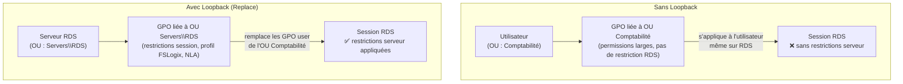

# Remote Desktop Services via GPO

!!! abstract "Ce que vous allez apprendre"
    - Comprendre pourquoi le **Loopback Processing** est non-négociable sur les hôtes de session RDS, et comment le configurer correctement
    - Maîtriser les **paramètres de session critiques** (timeouts, redirections, RemoteApp) avec leurs chemins de registre complets sous `HKLM\SOFTWARE\Policies\Microsoft\Windows NT\Terminal Services`
    - Choisir entre **profil itinérant GPO** et **FSLogix Profile Container** selon la taille et la criticité de votre ferme RDS
    - Déployer l'**impression RDS sans driver** via Easy Print et la redirection d'imprimantes avec ciblage ILT sur les serveurs de session
    - Enforcer **NLA + TLS 1.2 + certificat RDP** via GPO et valider la sécurité des connexions avec les bons Event IDs

!!! tip "Si vous ne retenez qu'une chose"
    Sans **Loopback Processing** activé sur les hôtes RDS, les GPO utilisateur qui s'appliquent sont celles de l'**OU de l'utilisateur** — pas de l'OU du serveur. Résultat : vos restrictions de session, vos chemins de profil, vos quotas — rien ne s'applique correctement. Le Loopback est la fondation de toute GPO RDS. Sans lui, tout le reste est du sable.

---

## Contexte de production

Les environnements Remote Desktop Services concentrent deux problèmes que les GPO classiques ne rencontrent jamais : plusieurs utilisateurs sur une même machine, et des profils qui doivent survivre aux déconnexions et aux basculements entre hôtes.

La GPO devient ici un outil de cloisonnement, pas seulement de configuration. Un paramètre mal placé — sur l'OU utilisateur au lieu de l'OU serveur — peut affecter des dizaines de sessions simultanément. La marge d'erreur est nulle en production.


!!! quote "En résumé"
    - La GPO devient ici un outil de cloisonnement, pas seulement de configuration.
    - Un paramètre mal placé — sur l'OU utilisateur au lieu de l'OU serveur — peut affecter des dizaines de sessions simultanément.
    - La marge d'erreur est nulle en production.
    - Le contexte de production fixe les contraintes réelles de réseau, de portée et d’exploitation qui gouvernent tout le chapitre.
    - Retenez les hypothèses opérationnelles avant de choisir un modèle de liaison ou de déploiement.
---

## :material-server-network: Architecture RDS et GPO : le rôle du Loopback

### Pourquoi le Loopback change tout

En mode standard, Windows applique les GPO utilisateur depuis l'OU **de l'utilisateur**. Cela fonctionne parfaitement sur un poste de travail personnel.

Sur un hôte RDS, c'est un problème structurel. Un utilisateur du service comptabilité qui se connecte au serveur de session RDS se voit appliquer les GPO de l'OU `Comptabilité` — pas les restrictions définies pour les serveurs de session.

Le **Loopback Processing** inverse cette logique : les GPO utilisateur appliquées sont celles liées à l'OU **de l'ordinateur** (le serveur RDS), quel que soit l'OU de l'utilisateur qui se connecte.

### Les deux modes du Loopback

Il existe deux modes de Loopback, et le choix est important :

| Mode | Comportement | Usage typique |
|------|-------------|---------------|
| **Replace** | Seules les GPO utilisateur de l'OU du serveur s'appliquent. Les GPO de l'OU de l'utilisateur sont ignorées. | Kiosques, RDS verrouillés, postes partagés |
| **Merge** | Les GPO de l'OU du serveur s'appliquent **en plus** de celles de l'OU de l'utilisateur. Les paramètres du serveur priment en cas de conflit. | Fermes RDS classiques avec restrictions partielles |

En production RDS, **Replace** est le mode recommandé. Il garantit que la configuration du serveur de session est souveraine.

### Chemin GPMC exact

```
Computer Configuration
  └─ Administrative Templates
       └─ System
            └─ Group Policy
                 └─ Configure user Group Policy loopback processing mode
```

**Valeur :** Enabled — Mode : **Replace**

**Chemin de registre correspondant :**

```
HKLM\SOFTWARE\Policies\Microsoft\Windows\System
  UserPolicyMode = 1   (Merge)
  UserPolicyMode = 2   (Replace)
```

### Modèle ADMX requis : TerminalServer.admx

Tous les paramètres RDS spécifiques sont regroupés dans `TerminalServer.admx`.

Ce fichier est présent dans `C:\Windows\PolicyDefinitions` sur tout Windows Server 2016+. Si vous utilisez un Central Store, copiez-y `TerminalServer.admx` et son fichier de langue `TerminalServer.adml`.

Le chemin GPMC de base pour tous les paramètres RDS est :

```
Computer Configuration
  └─ Administrative Templates
       └─ Windows Components
            └─ Remote Desktop Services
                 └─ Remote Desktop Session Host
```

### Pourquoi le Loopback est indispensable : schéma



!!! danger "Production — OU de liaison critique"
    La GPO contenant le Loopback **doit être liée à l'OU du serveur RDS**, pas à l'OU des utilisateurs. Lier cette GPO à l'OU utilisateur ne produit aucun effet — la section Computer Configuration n'est traitée que dans le contexte de l'ordinateur.

!!! quote "En résumé"
    - Le Loopback Processing est la fondation de toute configuration RDS par GPO
    - Mode **Replace** recommandé en production : les GPO de l'OU utilisateur sont ignorées sur l'hôte RDS
    - Modèle ADMX : `TerminalServer.admx` — à synchroniser dans le Central Store
    - La GPO Loopback doit être liée à l'**OU du serveur**, jamais à celle des utilisateurs
    - Chemin registre : `HKLM\SOFTWARE\Policies\Microsoft\Windows\System\UserPolicyMode`

---

## :material-timer-cog: Paramètres de session critiques

### Timeouts de session

Les timeouts RDS sont parmi les paramètres les plus impactants en production. Un timeout trop court génère des déconnexions intempestives. Un timeout absent laisse des sessions fantômes consommer des licences CAL.

Chemin GPMC commun pour tous les timeouts :

```
Computer Configuration
  └─ Administrative Templates
       └─ Windows Components
            └─ Remote Desktop Services
                 └─ Remote Desktop Session Host
                      └─ Session Time Limits
```

### Table de référence complète des paramètres de session

| Paramètre GPMC | Valeur registre | Clé complète | Valeur recommandée |
|---|---|---|---|
| Set time limit for active but idle sessions | `MaxIdleTime` | `HKLM\SOFTWARE\Policies\Microsoft\Windows NT\Terminal Services` | `7200000` (2h, en ms) |
| Set time limit for disconnected sessions | `MaxDisconnectionTime` | Même clé | `3600000` (1h, en ms) |
| Set time limit for active sessions | `MaxConnectionTime` | Même clé | `0` (pas de limite) ou `28800000` (8h) |
| End session when time limits are reached | `fResetBroken` | Même clé | `1` (déconnecter, pas fermer) |
| Allow reconnection from original client only | `fSingleSessionPerUser` | Même clé | `1` en kiosque, `0` en ferme |
| Limit number of connections | `MaxInstanceCount` | Même clé | Selon licence |
| Set RD Gateway server address | `TSGateway Server` | `HKLM\SOFTWARE\Policies\Microsoft\Windows NT\Terminal Services\TSGateway` | FQDN de la passerelle |

!!! warning "À surveiller — Unités des timeouts"
    Les valeurs `MaxIdleTime`, `MaxDisconnectionTime` et `MaxConnectionTime` sont en **millisecondes**, pas en minutes. `7200000` = 2 heures. Une erreur d'unité ici est invisible dans GPMC — le champ affiche la valeur brute, pas la durée convertie.

### Redirections : clipboard, lecteurs, imprimantes

Les redirections se configurent dans :

```
Computer Configuration
  └─ Administrative Templates
       └─ Windows Components
            └─ Remote Desktop Services
                 └─ Remote Desktop Session Host
                      └─ Device and Resource Redirection
```

| Paramètre GPMC | Valeur registre | Clé | Recommandation |
|---|---|---|---|
| Do not allow clipboard redirection | `fDisableClip` | `HKLM\...\Terminal Services` | `0` (autorisé) sauf DLP strict |
| Do not allow drive redirection | `fDisableCdm` | Même clé | `1` (bloqué) en production standard |
| Do not allow COM port redirection | `fDisableCcm` | Même clé | `1` (bloqué) |
| Do not allow printer redirection | `fDisableCpm` | Même clé | `0` (Easy Print autorisé) |
| Use Remote Desktop Easy Print printer driver first | `fEnableSmartPrinter` | Même clé | `1` (Easy Print en priorité) |

### RemoteApp : chemin du programme

Pour les déploiements RemoteApp, le chemin d'accès à l'application publiée s'écrit :

```
HKLM\SOFTWARE\Policies\Microsoft\Windows NT\Terminal Services
  InitialProgram = \\serveur\partage\application.exe
  WorkDirectory  = \\serveur\partage
```

Ces valeurs se définissent via GPP (Group Policy Preferences > Windows Settings > Registry) pour permettre des valeurs dynamiques par groupe de serveurs.

### Single Sign-On avec délégation Kerberos

Le SSO RDS nécessite deux configurations GPO coordonnées :

**Côté client** (`Computer Configuration > Administrative Templates > Windows Components > Remote Desktop Services > Remote Desktop Connection Client`) :

- `Specify SHA1 thumbprints of certificates representing trusted .rdp publishers` — autoriser le certificat de la passerelle RDS
- `Allow .rdp files from valid publishers and user's default .rdp settings` — Enabled

**Côté serveur**, la délégation Kerberos contrainte (KCD) se configure dans les propriétés AD de l'objet ordinateur du serveur RDS, avec le SPN `TERMSRV/nom-serveur`.

!!! quote "En résumé"
    - Timeouts en millisecondes : `MaxIdleTime` = 2h recommandé, `MaxDisconnectionTime` = 1h, `MaxConnectionTime` = 0 (pas de limite forcée)
    - Bloquer la redirection de lecteurs (`fDisableCdm = 1`) par défaut en production
    - Activer Easy Print (`fEnableSmartPrinter = 1`) pour éviter l'installation de drivers tiers
    - Clé registre de base pour tous les paramètres de session : `HKLM\SOFTWARE\Policies\Microsoft\Windows NT\Terminal Services`

---

## :material-account-box: Profils RDS : GPO vs FSLogix

### Le conflit GPO / attribut AD

Deux mécanismes peuvent définir le chemin de profil itinérant RDS :

1. **La GPO** : `Computer Configuration > Administrative Templates > Windows Components > Remote Desktop Services > Remote Desktop Session Host > Profiles > Set path for Remote Desktop Services Roaming User Profile`
2. **L'attribut AD** : propriété `terminalServicesProfilePath` sur l'objet utilisateur (onglet Profil de terminal dans ADUC)

**La GPO gagne toujours.** Si la GPO définit un chemin de profil, l'attribut AD est ignoré pour les connexions RDS. C'est une source de confusion fréquente lors des migrations.

**Clé registre GPO :**

```
HKLM\SOFTWARE\Policies\Microsoft\Windows NT\Terminal Services
  WFProfilePath = \\serveur-profils\RDSProfiles\%username%
```

### Profil itinérant GPO : quand l'utiliser

Le profil itinérant classique (dossier `%username%.V6` sur un partage réseau) reste pertinent dans des environnements réduits (moins de 50 sessions simultanées) avec des profils stables et peu de données utilisateur.

Ses limites deviennent problématiques à grande échelle : gonflement des profils, corruption lors de déconnexions brutales, lenteur au chargement avec des profils > 500 Mo.

### FSLogix Profile Container : quand basculer

FSLogix remplace le profil itinérant par un **disque VHD(X)** monté à la connexion. Le profil utilisateur est contenu dans ce disque — il n'y a pas de copie réseau à la connexion et à la déconnexion.

FSLogix est inclus dans les licences Microsoft 365 E3/E5, Windows E3/E5, et RDS SAL.

**Configuration FSLogix via GPO**

FSLogix dispose de ses propres modèles ADMX (`fslogix.admx`). Chemin GPMC :

```
Computer Configuration
  └─ Administrative Templates
       └─ FSLogix
            └─ Profile Containers
```

Clés de registre FSLogix (sous `HKLM\SOFTWARE\FSLogix\Profiles`) :

| Valeur | Type | Description |
|--------|------|-------------|
| `Enabled` | DWord | `1` pour activer FSLogix |
| `VHDLocations` | MultiString | `\\serveur\FSLogix\%username%` |
| `VolumeType` | String | `VHDX` (recommandé) |
| `SizeInMBs` | DWord | Taille max du VHDX (ex : `30000` = 30 Go) |
| `DeleteLocalProfileWhenVHDShouldApply` | DWord | `1` pour forcer la migration |
| `FlipFlopProfileDirectoryName` | DWord | `1` pour nommer `NOM_SID` plutôt que `SID_NOM` |

!!! danger "Production — Conflit FSLogix et profil itinérant GPO"
    Si FSLogix est activé **et** qu'une GPO définit encore `WFProfilePath`, FSLogix prend la main mais les journaux indiquent un conflit. Le comportement varie selon la version de FSLogix. Supprimez ou désactivez explicitement le paramètre `Set path for Remote Desktop Services Roaming User Profile` dans votre GPO avant d'activer FSLogix en production.

### Tableau comparatif de choix

| Critère | Profil itinérant GPO | FSLogix Container |
|---------|---------------------|------------------|
| Licence requise | Aucune supplémentaire | M365 E3+, RDS SAL, ou achat |
| Taille de profil | < 300 Mo recommandé | Jusqu'à plusieurs Go (disque dédié) |
| Résistance aux coupures | Faible (corruption possible) | Élevée (VHDX verrouillé) |
| Compatibilité OneDrive | Limitée | Native avec `Office Container` |
| Complexité de déploiement | Simple | Modérée (ADMX + partage + droits NTFS) |
| Recommandé pour | < 50 sessions, profils légers | Fermes > 50 sessions, AVD, profils Office |

### :material-powershell: Script de déploiement FSLogix via GPO

```powershell title="Deploy-FSLogixGPO.ps1"
# Configure FSLogix Profile Container settings via GPO registry preferences
# Requires: RSAT GroupPolicy module, FSLogix ADMX in Central Store

$gpoName    = "RDS-FSLogix-ProfileContainers"
$regBase    = "HKLM\SOFTWARE\FSLogix\Profiles"
$vhdShare   = "\\srv-profiles\FSLogix"

# Enable FSLogix Profile Container
Set-GPRegistryValue -Name $gpoName -Key $regBase `
    -ValueName "Enabled" -Type DWord -Value 1

# Set VHD storage location
Set-GPRegistryValue -Name $gpoName -Key $regBase `
    -ValueName "VHDLocations" -Type MultiString -Value $vhdShare

# Use VHDX format
Set-GPRegistryValue -Name $gpoName -Key $regBase `
    -ValueName "VolumeType" -Type String -Value "VHDX"

# Max container size: 30 GB
Set-GPRegistryValue -Name $gpoName -Key $regBase `
    -ValueName "SizeInMBs" -Type DWord -Value 30000

# Migrate existing local profiles to FSLogix on first logon
Set-GPRegistryValue -Name $gpoName -Key $regBase `
    -ValueName "DeleteLocalProfileWhenVHDShouldApply" -Type DWord -Value 1

# Name format: USERNAME_SID (more readable)
Set-GPRegistryValue -Name $gpoName -Key $regBase `
    -ValueName "FlipFlopProfileDirectoryName" -Type DWord -Value 1

Write-Host "FSLogix GPO settings applied to: $gpoName"
```

```powershell title="Verify-FSLogix.ps1"
# Verify FSLogix is active and containers are mounted on remote RDS hosts
$rdsHosts = Get-ADComputer -SearchBase "OU=RDS,OU=Servers,DC=contoso,DC=com" `
    -Filter * | Select-Object -ExpandProperty Name

foreach ($host in $rdsHosts) {
    Invoke-Command -ComputerName $host -ScriptBlock {
        $svc = Get-Service -Name "frxsvc" -ErrorAction SilentlyContinue
        $reg = Get-ItemProperty "HKLM:\SOFTWARE\FSLogix\Profiles" -EA SilentlyContinue

        [PSCustomObject]@{
            Host          = $env:COMPUTERNAME
            ServiceStatus = $svc.Status
            Enabled       = $reg.Enabled
            VHDLocation   = $reg.VHDLocations
            MountedVHDs   = (Get-WmiObject Win32_LogicalDisk | Where-Object { $_.VolumeName -like "Profile*" }).Count
        }
    }
}
```

```title="Résultat attendu"
Host          : RDSHOST01
ServiceStatus : Running
Enabled       : 1
VHDLocation   : \\srv-profiles\FSLogix
MountedVHDs   : 12
```

!!! quote "En résumé"
    - La GPO `WFProfilePath` écrase l'attribut AD `terminalServicesProfilePath` — toujours
    - FSLogix remplace les profils itinérants dès que la ferme dépasse 50 sessions ou que des profils Office (Outlook, Teams) sont impliqués
    - Désactiver le paramètre GPO de profil itinérant avant d'activer FSLogix — ne pas les laisser coexister
    - FSLogix est inclus dans M365 E3/E5 et RDS SAL — vérifiez votre licence avant d'acheter

---

## :material-printer: Impression RDS : Easy Print et GPP

### Easy Print : la solution sans driver

Avant Easy Print, chaque imprimante redirigée depuis le client RDS nécessitait l'installation du driver correspondant sur le serveur de session. Résultat : des serveurs RDS avec 80 drivers imprimante différents, des conflits, des Blue Screen of Death lors des mises à jour.

Easy Print résout ce problème en passant par un **driver générique XPS** côté serveur. L'imprimante est rendue sur le client via le mécanisme de redirection RDP — aucun driver tiers n'est installé sur le serveur.

**Conditions requises :**

- .NET Framework 3.0+ sur le serveur RDS (installé par défaut sur Server 2016+)
- Client RDP 6.1+ (Windows Vista et ultérieur — couvre 100 % des parcs actuels)

**Activation via GPO :**

```
Computer Configuration
  └─ Administrative Templates
       └─ Windows Components
            └─ Remote Desktop Services
                 └─ Remote Desktop Session Host
                      └─ Printer Redirection
```

Paramètres à configurer :

| Paramètre GPMC | Valeur registre | Recommandation |
|---|---|---|
| Use Remote Desktop Easy Print printer driver first | `fEnableSmartPrinter` | Enabled (`1`) |
| Do not allow client printer redirection | `fDisableCpm` | Disabled (`0`) — autoriser la redirection |
| Redirect only the default client printer | `RedirectOnlyDefaultClientPrinter` | Enabled si vous voulez limiter à 1 imprimante |

### Déploiement d'imprimantes réseau avec GPP et ciblage ILT

Pour pousser des imprimantes réseau spécifiques **uniquement sur les serveurs de session RDS**, utilisez les Group Policy Preferences avec le ciblage par nom de machine (Item-Level Targeting).

Chemin GPMC pour les GPP imprimantes :

```
User Configuration
  └─ Preferences
       └─ Control Panel Settings
            └─ Printers
                 └─ New > Shared Printer
```

**Ciblage ILT pour les serveurs RDS :**

Dans la GPP imprimante, cliquez sur `Common > Targeting` et ajoutez un filtre :

- Item : **Computer Name** — `srv-rds-*` (joker sur le nom des hôtes RDS)
- Ou : **Organizational Unit** — `OU=RDS,OU=Servers,DC=contoso,DC=com`

!!! warning "À surveiller — GPP imprimante côté User vs Computer"
    Les GPP imprimantes en `User Configuration` nécessitent le Loopback pour fonctionner correctement sur RDS. Si le Loopback n'est pas activé, les GPP imprimantes de l'OU utilisateur s'appliquent, pas celles de l'OU serveur. Ce point est lié directement à la section précédente sur le Loopback.

### Clé registre pour la redirection d'impression

```
HKLM\SOFTWARE\Policies\Microsoft\Windows NT\Terminal Services
  fDisableCpm         = 0   (autoriser la redirection)
  fEnableSmartPrinter = 1   (Easy Print en priorité)
```

### :material-powershell: Vérification des imprimantes en session RDS

```powershell title="Get-RDSPrinters.ps1"
# List redirected printers active in current or remote RDS sessions
$rdsHost = "srv-rds-01"

Invoke-Command -ComputerName $rdsHost -ScriptBlock {
    # Get all sessions with active printer redirections
    $sessions = query session 2>&1 | Select-String "Active"

    Get-Printer | Where-Object { $_.Name -like "*redirected*" -or $_.PortName -like "TS*" } |
    Select-Object Name, DriverName, PortName, PrinterStatus |
    Format-Table -AutoSize
}
```

```title="Résultat attendu"
Name                          DriverName                PortName   PrinterStatus
----                          ----------                --------   -------------
Microsoft XPS Document Writer Remote Desktop Easy Print TS004      Normal
HP LaserJet P2035 (redirected) Remote Desktop Easy Print TS004     Normal
```

!!! danger "Production — Easy Print vs driver legacy : le vrai arbitrage"
    Easy Print fonctionne dans 95 % des cas. Les 5 % restants concernent des imprimantes industrielles, des traceurs, ou des imprimantes avec options avancées (impression recto-verso forcée, bacs multiples) qui ne sont pas exposées via le protocole XPS générique.

    Si un groupe d'utilisateurs signale des options manquantes, installez le driver natif **uniquement** pour ce modèle, via GPO Preferences > Printers > TCP/IP Printer, ciblé sur le serveur RDS concerné. N'installez jamais tous les drivers "au cas où" — vous reviendriez au problème original.

!!! quote "En résumé"
    - Easy Print = driver générique XPS côté serveur — aucun driver tiers à installer
    - Activer `fEnableSmartPrinter = 1` et laisser `fDisableCpm = 0` pour autoriser la redirection
    - GPP imprimantes réseau avec ciblage ILT sur le nom ou l'OU des serveurs RDS
    - Les GPP imprimantes en `User Configuration` dépendent du Loopback pour s'appliquer correctement sur RDS
    - Driver natif uniquement pour les imprimantes spécialisées qui nécessitent des options XPS non couvertes

---

## :material-shield-lock: Sécurité RDS : NLA, TLS, certificat RDP

### NLA : Network Level Authentication

NLA exige que l'utilisateur s'authentifie **avant** l'établissement de la session RDP complète. Sans NLA, la session RDP s'ouvre jusqu'à l'écran de connexion Windows, qui est accessible à quiconque peut joindre le port 3389 — même sans credentials valides.

NLA réduit la surface d'attaque sur deux points : il empêche les attaques par déni de service sur les sessions RDP ouvertes, et il bloque l'accès à l'écran de connexion Windows pour les comptes non authentifiés.

**Chemin GPMC pour forcer NLA :**

```
Computer Configuration
  └─ Administrative Templates
       └─ Windows Components
            └─ Remote Desktop Services
                 └─ Remote Desktop Session Host
                      └─ Security
                           └─ Require user authentication for remote connections
                                by using Network Level Authentication
```

**Valeur :** Enabled

**Clé registre :**

```
HKLM\SOFTWARE\Policies\Microsoft\Windows NT\Terminal Services
  UserAuthentication = 1   (NLA obligatoire)
```

### Forcer TLS 1.2+ pour les connexions RDP

Le protocole RDP peut utiliser différents niveaux de chiffrement. En production, on force TLS pour le transport.

**Chemin GPMC :**

```
Computer Configuration
  └─ Administrative Templates
       └─ Windows Components
            └─ Remote Desktop Services
                 └─ Remote Desktop Session Host
                      └─ Security
                           └─ Require use of specific security layer for remote connections
```

**Valeur :** SSL (TLS 1.0+)

Pour restreindre davantage à TLS 1.2+ uniquement, le paramètre GPMC est insuffisant — il faut compléter via les paramètres Schannel (en dehors du scope RDS) ou via la politique de sécurité TLS au niveau OS.

| Paramètre GPMC | Valeur registre | Valeur |
|---|---|---|
| Security layer | `SecurityLayer` | `2` (SSL/TLS) |
| Encryption level | `MinEncryptionLevel` | `3` (High — 128 bits) |
| NLA obligatoire | `UserAuthentication` | `1` |

**Clé registre de base :** `HKLM\SOFTWARE\Policies\Microsoft\Windows NT\Terminal Services`

### Certificat RDP via GPO PKI

Par défaut, les hôtes RDS génèrent un certificat auto-signé. Ce certificat déclenche un avertissement sur chaque connexion client et ne peut pas être validé par la chaîne PKI d'entreprise.

**Déploiement du certificat RDP par GPO (auto-enrollment PKI) :**

Chemin GPMC :

```
Computer Configuration
  └─ Administrative Templates
       └─ Windows Components
            └─ Remote Desktop Services
                 └─ Remote Desktop Session Host
                      └─ Security
                           └─ Server authentication certificate template
```

**Valeur :** Nom du template de certificat PKI (ex : `RDPServerTemplate`)

**Clé registre :**

```
HKLM\SOFTWARE\Policies\Microsoft\Windows NT\Terminal Services
  CertTemplateName = "RDPServerTemplate"
```

Côté PKI, le template doit avoir :

- Usage étendu : `Server Authentication` (OID 1.3.6.1.5.5.7.3.1)
- SAN : DNS Name = `%computername%.contoso.com`
- Auto-enrôlement activé pour le groupe des serveurs RDS

Voir le chapitre [Certificats et PKI](15-certificats-pki.md) pour la configuration du template et de l'auto-enrôlement.

!!! danger "Production — Ne pas cumuler NLA et smart card sans test"
    NLA + carte à puce sans configuration de délégation Kerberos correcte produit des boucles d'authentification silencieuses. L'utilisateur voit l'invite de PIN, s'authentifie, et la connexion échoue sans message d'erreur explicite. Testez NLA + smart card sur un groupe pilote avec les traces `Microsoft-Windows-RemoteDesktopServices-RdpCoreTS/Operational` activées avant un déploiement général.

### Event IDs de référence pour la surveillance RDS

| Event ID | Source | Canal | Signification |
|----------|--------|-------|--------------|
| `4624` | Security | Security | Connexion réussie (Type 10 = RemoteInteractive pour RDP) |
| `4625` | Security | Security | Échec de connexion (vérifier le code de sous-statut) |
| `4648` | Security | Security | Connexion avec credentials explicites (Pass-the-Hash suspect) |
| `6272` | Microsoft-Windows-NetworkPolicyServer | Security | Accès réseau accordé par NPS |
| `6273` | Microsoft-Windows-NetworkPolicyServer | Security | Accès réseau refusé par NPS |
| `6280` | Microsoft-Windows-NetworkPolicyServer | Security | Compte verrouillé lors de l'authentification NPS |
| `261` | Microsoft-Windows-RemoteDesktopServices-RdpCoreTS | Operational | Connexion RDP échouée (TLS, NLA, certificat) |
| `131` | Microsoft-Windows-RemoteDesktopServices-RdpCoreTS | Operational | Connexion RDP établie avec succès |

Pour les connexions RDP, l'Event 4624 est suffisant en audit basique. Filtrer sur `LogonType = 10` pour isoler uniquement les sessions RDP.

### :material-powershell: Vérification sécurité post-déploiement

```powershell title="Verify-RDSSecurity.ps1"
# Verify NLA, TLS, and certificate settings on RDS hosts
$rdsHosts = Get-ADComputer -SearchBase "OU=RDS,OU=Servers,DC=contoso,DC=com" `
    -Filter * | Select-Object -ExpandProperty Name

$report = foreach ($rdsh in $rdsHosts) {
    Invoke-Command -ComputerName $rdsh -ErrorAction SilentlyContinue -ScriptBlock {
        $regPath = "HKLM:\SOFTWARE\Policies\Microsoft\Windows NT\Terminal Services"
        $reg     = Get-ItemProperty $regPath -ErrorAction SilentlyContinue

        # Check current RDP certificate thumbprint
        $certThumb = (Get-ItemProperty "HKLM:\SYSTEM\CurrentControlSet\Control\Terminal Server\WinStations\RDP-Tcp" `
            -Name SSLCertificateSHA1Hash -EA SilentlyContinue).SSLCertificateSHA1Hash

        $cert = if ($certThumb) {
            Get-ChildItem Cert:\LocalMachine\My |
                Where-Object { $_.Thumbprint -eq [System.BitConverter]::ToString($certThumb).Replace("-","") } |
                Select-Object -First 1
        }

        [PSCustomObject]@{
            Host                = $env:COMPUTERNAME
            NLAEnforced         = $reg.UserAuthentication       # should be 1
            SecurityLayer       = $reg.SecurityLayer            # should be 2
            MinEncryptionLevel  = $reg.MinEncryptionLevel       # should be 3
            CertTemplate        = $reg.CertTemplateName
            CertExpiry          = $cert.NotAfter
            CertIssuer          = $cert.Issuer
        }
    }
}

$report | Format-Table -AutoSize
```

```title="Résultat attendu"
Host       NLAEnforced SecurityLayer MinEncryptionLevel CertTemplate      CertExpiry          CertIssuer
----       ----------- ------------- ------------------ ------------      ----------          ----------
RDSHOST01  1           2             3                  RDPServerTemplate 2025-04-01 00:00:00 CN=Contoso-CA
RDSHOST02  1           2             3                  RDPServerTemplate 2025-04-01 00:00:00 CN=Contoso-CA
```

```powershell title="Get-RDPFailedConnections.ps1"
# Extract failed RDP connection attempts from Security log (last 24h)
$rdsHost = "srv-rds-01"

Invoke-Command -ComputerName $rdsHost -ScriptBlock {
    $filter = @{
        LogName   = "Security"
        Id        = 4625
        StartTime = (Get-Date).AddHours(-24)
    }

    Get-WinEvent -FilterHashtable $filter -ErrorAction SilentlyContinue |
    ForEach-Object {
        $xml  = [xml]$_.ToXml()
        $data = $xml.Event.EventData.Data

        $logonType = ($data | Where-Object { $_.Name -eq "LogonType" }).'#text'

        # Filter on RemoteInteractive (10) only
        if ($logonType -eq "10") {
            [PSCustomObject]@{
                Time          = $_.TimeCreated
                Account       = ($data | Where-Object { $_.Name -eq "TargetUserName" }).'#text'
                Domain        = ($data | Where-Object { $_.Name -eq "TargetDomainName" }).'#text'
                SourceIP      = ($data | Where-Object { $_.Name -eq "IpAddress" }).'#text'
                FailureReason = ($data | Where-Object { $_.Name -eq "SubStatus" }).'#text'
            }
        }
    } | Sort-Object Time -Descending | Format-Table -AutoSize
}
```

!!! quote "En résumé"
    - NLA obligatoire : `UserAuthentication = 1` — bloque l'accès à l'écran de connexion sans authentification préalable
    - Chiffrement TLS : `SecurityLayer = 2`, `MinEncryptionLevel = 3`
    - Certificat PKI via `CertTemplateName` — élimine les alertes de certificat auto-signé
    - Surveillance : Event 4624 (LogonType 10) pour les connexions RDS réussies, 4625 pour les échecs
    - NLA + smart card nécessite des tests préalables avec les traces RdpCoreTS activées

---

## :material-clipboard-remove: Piège de production : désactiver le presse-papiers

### Le scénario classique

Un RSSI décide de désactiver le presse-papiers RDS pour "éviter les exfiltrations de données". La GPO est déployée en une heure. `fDisableClip = 1`. Affaire classée côté sécurité.

Trois jours après, le service comptabilité appelle : ils ne peuvent plus copier les montants depuis leur ERP web vers Excel. Ils ont trouvé une solution : imprimer les écrans, les scanner, et retaper les données.

Le presse-papiers désactivé n'a pas bloqué l'exfiltration. Il a juste changé le vecteur — et créé une montagne de papier.

### Pourquoi la restriction brutale échoue

Désactiver le presse-papiers bloque les vecteurs évidents mais pas les contournements :

- Impression puis numérisation (comme ci-dessus)
- Photos avec smartphone de l'écran
- Copie manuelle dans un email personnel via le webmail (si Internet n'est pas filtré)
- Envoi de fichiers par USB si la redirection de lecteurs n'est pas également bloquée

La restriction par presse-papiers seule donne une fausse impression de contrôle.

### La bonne approche en production

| Risque à couvrir | Mesure adaptée | Mesure inefficace |
|---|---|---|
| Exfiltration de fichiers | Bloquer redirection de lecteurs (`fDisableCdm = 1`) + DLP endpoint | Désactiver presse-papiers |
| Copie de données sensibles | Solution DLP (Microsoft Purview, Symantec DLP) avec classification | Désactiver presse-papiers |
| Screenshots | Désactiver PrintScreen via GPO clavier + DLP | Presse-papiers seul |
| Copie vers email personnel | Filtrage HTTP + proxy + classification MIP | Aucun paramètre GPO seul |

**Si vous devez tout de même restreindre le presse-papiers**, faites-le avec un ciblage fin :

- Bloquer uniquement dans une direction : `fDisableClipClientToServer = 1` (client → serveur) tout en autorisant `fDisableClipServerToClient = 0` (serveur → client) — ou l'inverse selon le sens du risque
- Cibler uniquement les groupes à risque via GPO filtrée par groupe de sécurité AD, pas sur l'ensemble des serveurs RDS

!!! danger "Production — Le presse-papiers comme seul contrôle DLP"
    Présenter la désactivation du presse-papiers comme une mesure DLP suffisante à votre RSSI ou à un auditeur est une erreur. Ce paramètre figure dans les check-lists de durcissement CIS et STIG, mais dans un contexte de contrôle de base — pas comme substitut à une solution DLP. Si un auditeur le cite, demandez-lui d'évaluer le contournement par impression.

!!! warning "À surveiller — Impact métier non testé"
    Avant toute restriction de redirection en RDS (presse-papiers, lecteurs, imprimantes), testez le scénario de travail complet avec un utilisateur représentatif de chaque métier. Les workflows qui semblent ne pas utiliser le presse-papiers (copier-coller entre fenêtres de la même session) peuvent en dépendre via des macros VBA, des raccourcis applicatifs, ou des scripts d'automatisation métier.

!!! quote "En résumé"
    - Désactiver le presse-papiers seul ne constitue pas une mesure DLP — les utilisateurs contournent par impression ou photo
    - La bonne réponse à l'exfiltration : blocage de lecteurs (`fDisableCdm = 1`) + solution DLP endpoint
    - Si restriction nécessaire : cibler la direction (client→serveur ou serveur→client) et le groupe de sécurité concerné, pas l'ensemble de la ferme
    - Toujours tester l'impact métier avec un utilisateur de chaque profil avant déploiement

---

## :material-check-all: Vérification globale post-déploiement

### Checklist de validation RDS

```powershell title="Test-RDSDeployment.ps1"
# Full RDS GPO deployment validation — loopback, security, session limits, FSLogix
param(
    [Parameter(Mandatory)]
    [string[]]$RDSHosts,

    [string]$LogPath = "C:\Logs\RDS-Validation-$(Get-Date -Format 'yyyyMMdd').csv"
)

$results = foreach ($rdsh in $RDSHosts) {
    Invoke-Command -ComputerName $rdsh -ErrorAction SilentlyContinue -ScriptBlock {
        $ts  = "HKLM:\SOFTWARE\Policies\Microsoft\Windows NT\Terminal Services"
        $gp  = "HKLM:\SOFTWARE\Policies\Microsoft\Windows\System"
        $fsl = "HKLM:\SOFTWARE\FSLogix\Profiles"

        $tsReg  = Get-ItemProperty $ts  -EA SilentlyContinue
        $gpReg  = Get-ItemProperty $gp  -EA SilentlyContinue
        $fslReg = Get-ItemProperty $fsl -EA SilentlyContinue

        [PSCustomObject]@{
            Host                    = $env:COMPUTERNAME
            # Loopback
            LoopbackMode            = $gpReg.UserPolicyMode       # 1=Replace, 2=Merge
            # Session timeouts (ms)
            MaxIdleTime             = $tsReg.MaxIdleTime
            MaxDisconnectionTime    = $tsReg.MaxDisconnectionTime
            # Security
            NLAEnforced             = $tsReg.UserAuthentication    # 1
            SecurityLayer           = $tsReg.SecurityLayer         # 2
            MinEncryptionLevel      = $tsReg.MinEncryptionLevel    # 3
            # Redirections
            DriveRedirectionBlocked = $tsReg.fDisableCdm          # 1
            EasyPrintEnabled        = $tsReg.fEnableSmartPrinter  # 1
            ClipboardBlocked        = $tsReg.fDisableClip         # 0 recommended
            # FSLogix
            FSLogixEnabled          = $fslReg.Enabled
            FSLogixVHDPath          = $fslReg.VHDLocations
            # Service
            FSLogixService          = (Get-Service frxsvc -EA SilentlyContinue).Status
        }
    }
}

$results | Export-Csv -Path $LogPath -NoTypeInformation -Encoding UTF8
$results | Format-Table -AutoSize
Write-Host "Report saved: $LogPath"
```

```title="Résultat attendu"
Host       LoopbackMode NLAEnforced SecurityLayer DriveRedirectionBlocked EasyPrintEnabled FSLogixEnabled FSLogixService
----       ------------ ----------- ------------- ----------------------- ---------------- -------------- --------------
RDSHOST01  1            1           2             1                       1                1              Running
RDSHOST02  1            1           2             1                       1                1              Running
```


!!! quote "En résumé"
    - Validez toujours le résultat sur un poste ou un utilisateur réellement dans le périmètre avant d’élargir.
    - Conservez les commandes et résultats de contrôle comme preuve de conformité post-déploiement.
    - Cette section fixe l’essentiel à retenir sur vérification globale post-déploiement.
    - Retenez surtout ce qui change la portée, l’ordre d’application ou le résultat final observé.
    - Ce résumé sert à vérifier que vous avez retenu le mécanisme, sa portée et sa conséquence pratique.
---

## Références croisées

- [Bible GPO — Loopback Processing](../bible-gpo/10-loopback.md) — fonctionnement détaillé du Loopback en mode Replace et Merge
- [Bible GPO — Redirection de profils](../bible-gpo/19-redirection-profils.md) — profils itinérants, dossiers redirigés et interaction avec RDS
- [Certificats et PKI via GPO](15-certificats-pki.md) — configuration du template RDP et de l'auto-enrôlement PKI

!!! quote "En résumé"
    - À relire : Bible GPO — Loopback Processing.
    - À relire : Bible GPO — Redirection de profils.
    - À relire : Certificats et PKI via GPO.
    - Ces renvois prolongent le chapitre avec des mécanismes complémentaires ou des cas d’usage voisins.
    - Gardez ces chapitres sous la main pour le diagnostic ou la conception d’une GPO liée à ce thème.
