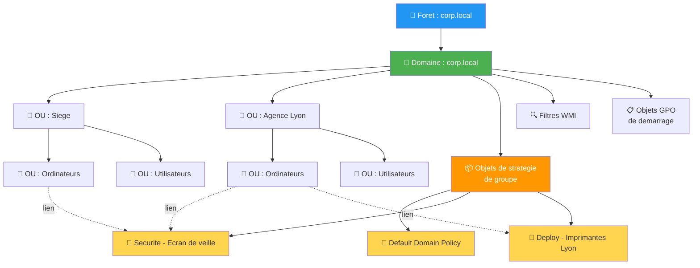
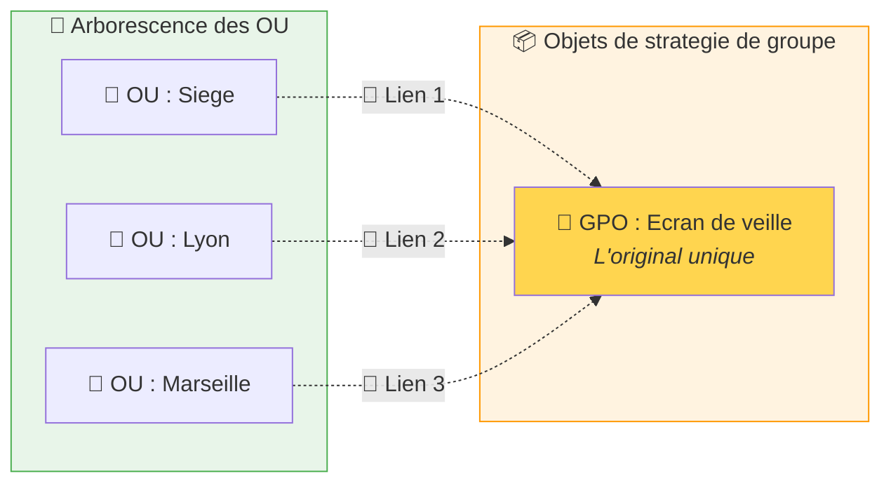

# La console GPMC : premiers pas

!!! abstract "Ce que vous allez apprendre"
    - Pourquoi GPMC remplace gpedit des qu'on travaille sur un domaine Active Directory
    - Comment installer GPMC sur votre poste (RSAT)
    - Comment naviguer dans l'interface et comprendre l'arborescence
    - Comment lire une GPO existante et interpreter son rapport de parametres
    - La difference cruciale entre une GPO et un **lien** de GPO

---

## De gpedit a GPMC : pourquoi un autre outil ?

Au chapitre 2, on a decouvert `gpedit.msc`. C'est pratique, c'est rapide, ca marche. Alors pourquoi un **autre** outil ?

### L'analogie de la regie

Imaginez un hotel avec 200 chambres. Chaque chambre a sa propre telecommande pour **sa** television.

`gpedit.msc`, c'est **la telecommande d'une seule chambre**. Vous etes devant la tele, vous changez les chaines, vous montez le volume. Ca fonctionne, mais uniquement pour cette chambre-la.

Maintenant, imaginez la **regie de l'hotel** : une salle avec des ecrans montrant toutes les televisions du batiment. Depuis cette regie, vous pouvez :

- :material-television: Voir ce qui passe sur chaque ecran
- :material-cog: Changer les reglages de 50 chambres d'un coup
- :material-link-variant: Appliquer la meme programmation a tout un etage

**GPMC** (Group Policy Management Console), c'est cette regie. Au lieu de gerer un seul PC, vous gerez **tout le domaine Active Directory** depuis un seul ecran.

### Comparaison cote a cote

| Critere | `gpedit.msc` | GPMC (`gpmc.msc`) |
|---------|-------------|-------------------|
| Portee | Le PC local uniquement | Tout le domaine Active Directory |
| Nombre de GPO | 1 seule (la strategie locale) | Toutes les GPO du domaine |
| Lien avec les OU | Aucun (pas de notion d'OU) | Gestion complete des liens |
| Rapport HTML | Non | Oui, onglet "Parametres" |
| Sauvegarde / Restauration | Non | Oui, integre |
| Delegation de droits | Non | Oui, onglet "Delegation" |
| Simulation (RSoP) | Non | Oui, modelisation integree |
| Necessite Active Directory | Non | Oui |
| Installe par defaut | Oui (editions Pro/Enterprise) | Non (necessite RSAT) |

### Quand utiliser lequel ?

En pratique, voici comment choisir :

- **Vous configurez un PC autonome** (pas dans un domaine) → `gpedit.msc`
- **Vous testez un parametre en local** avant de le deployer en GPO → `gpedit.msc`
- **Vous gerez des GPO pour un domaine** → GPMC
- **Vous voulez voir les GPO appliquees a un PC distant** → GPMC

!!! info "Pas de remplacement, un complement"
    `gpedit.msc` reste utile pour modifier rapidement la strategie locale d'un PC isole. GPMC est l'outil pour gerer les GPO de domaine. Les deux coexistent.

!!! quote "En resume"
    - `gpedit.msc` = la telecommande d'une seule tele (un seul PC)
    - GPMC = la regie de l'hotel (tout le domaine Active Directory)
    - GPMC ne remplace pas gpedit, il le **complete** pour les environnements Active Directory

---

## Installer GPMC

GPMC fait partie des **RSAT** (Remote Server Administration Tools). Ces outils ne sont pas installes par defaut sur un poste Windows client.

### Sur Windows 10 / 11 (Pro ou Enterprise)

#### Methode graphique

!!! example "Pas a pas"
    1. Ouvrez les **Parametres** (++win+i++)
    2. Allez dans **Applications** → **Fonctionnalites facultatives**
    3. Cliquez sur **Ajouter une fonctionnalite**
    4. Dans la barre de recherche, tapez `RSAT`
    5. Cochez **RSAT : Outils de gestion des strategies de groupe**
    6. Cliquez sur **Installer**
    7. Attendez la fin de l'installation (aucun redemarrage necessaire en general)

!!! tip "Windows 11 22H2+"
    Sur les versions recentes de Windows 11, le chemin peut etre **Parametres → Systeme → Fonctionnalites facultatives → Ajouter une fonctionnalite facultative**.

#### Methode PowerShell (plus rapide)

Ouvrez un terminal PowerShell **en administrateur** et lancez :

```powershell
# Install RSAT Group Policy Management Tools
Add-WindowsCapability -Online -Name Rsat.GroupPolicy.Management.Tools~~~~0.0.1.0
```

Pour verifier que l'installation a reussi :

```powershell
# Verify RSAT GP tools are installed
Get-WindowsCapability -Online -Name Rsat.GroupPolicy.Management.Tools~~~~0.0.1.0
```

Vous devez voir `State : Installed` dans la sortie.

!!! warning "Erreurs courantes a l'installation"
    Si la commande PowerShell echoue, verifiez ces points :

    - **Erreur 0x800f0954** : votre poste telecharge les mises a jour via WSUS et non Windows Update. Demandez a votre admin WSUS d'activer les features on demand, ou connectez-vous temporairement en direct a Windows Update.
    - **Erreur "acces refuse"** : vous n'avez pas lance PowerShell en administrateur. Faites un clic droit → **Executer en tant qu'administrateur**.
    - **Le composant n'apparait pas** : vous etes sur une edition Home. RSAT n'est pas disponible sur cette edition.

### Sur Windows Server

!!! info "Bonne nouvelle"
    Si votre serveur a le role **AD DS** (Active Directory Domain Services) installe, GPMC est **deja present**. Rien a faire.

Si vous travaillez sur un serveur membre (sans le role AD DS), vous pouvez ajouter GPMC via le **Gestionnaire de serveur** :

!!! example "Pas a pas"
    1. Ouvrez le **Gestionnaire de serveur**
    2. Cliquez sur **Gerer** → **Ajouter des roles et fonctionnalites**
    3. Avancez jusqu'a l'etape **Fonctionnalites**
    4. Cochez **Gestion des strategies de groupe**
    5. Terminez l'assistant

### Sur Windows Home

!!! warning "Edition non supportee"
    GPMC n'est **pas disponible** sur les editions Windows Home (Famille). Ces editions ne prennent pas en charge la jonction a un domaine Active Directory, donc GPMC n'aurait pas de sens.

    Si vous voulez experimenter avec GPMC, il vous faut au minimum une edition **Pro** ou **Enterprise**.

!!! quote "En resume"
    - GPMC fait partie des outils RSAT, a installer separement sur les postes clients
    - Sur Windows 10/11 Pro : **Fonctionnalites facultatives** ou PowerShell `Add-WindowsCapability`
    - Sur Windows Server avec AD DS : deja installe
    - Sur Windows Home : non disponible

---

## Ouvrir la console

Une fois GPMC installe, l'ouvrir est tres simple.

### Methode rapide (recommandee)

Appuyez sur ++win+r++, tapez `gpmc.msc`, puis appuyez sur ++enter++.

C'est la methode la plus rapide. Trois syllabes a retenir : `gpmc.msc`. Comme pour `gpedit.msc`, l'extension `.msc` signifie *Microsoft Management Console Snap-in*.

### Methode menu Demarrer

Ouvrez le menu Demarrer et recherchez **Gestion des strategies de groupe** (ou *Group Policy Management* si votre Windows est en anglais).

### Methode PowerShell

Vous pouvez aussi lancer GPMC depuis un terminal :

```powershell
# Launch GPMC from PowerShell
gpmc.msc
```

!!! tip "Epingler pour plus tard"
    Faites un clic droit sur l'icone et choisissez **Epingler a la barre des taches**. Vous allez ouvrir GPMC souvent.

!!! info "Faut-il etre administrateur ?"
    Pour **ouvrir et lire** les GPO dans GPMC, un compte utilisateur du domaine standard suffit dans la plupart des environnements. En revanche, pour **creer, modifier ou supprimer** des GPO, il faut un compte avec les droits d'administration adequats (typiquement un membre du groupe "Admins du domaine" ou un compte avec delegation specifique).

!!! warning "Acces refuse ?"
    Si GPMC s'ouvre mais affiche un message d'erreur pour acceder au domaine, verifiez que :

    - Votre poste est **joint au domaine** Active Directory
    - Vous etes connecte avec un **compte du domaine** (pas un compte local)
    - Votre poste peut **contacter un controleur de domaine** (connectivite reseau)
    - Le pare-feu ne bloque pas les ports RPC (TCP 135) et SMB (TCP 445)

!!! quote "En resume"
    - ++win+r++ → `gpmc.msc` → ++enter++ : c'est la facon la plus rapide d'ouvrir GPMC
    - Le `.msc` signifie Microsoft Management Console Snap-in
    - Votre poste doit etre joint au domaine et connecte au reseau de l'entreprise
    - En cas de probleme de connexion : verifiez le domaine, le compte et le reseau

---

## L'interface de GPMC

### L'analogie de l'explorateur de fichiers

Vous connaissez l'Explorateur de fichiers Windows ? L'arborescence de dossiers a gauche, le contenu a droite ?

GPMC fonctionne exactement pareil. Sauf qu'au lieu de naviguer dans vos documents, vous naviguez dans **la structure de votre domaine Active Directory** et dans **les regles (GPO)** qui s'y appliquent.

### Les trois panneaux

Quand vous ouvrez GPMC, vous voyez trois zones :

| Panneau | Position | Role |
|---------|----------|------|
| **Arborescence** | Gauche | Navigation dans la foret, les domaines, les OU et les GPO |
| **Details** | Centre | Informations et onglets pour l'element selectionne |
| **Actions** | Droite | Raccourcis vers les actions possibles (creer, lier, supprimer...) |

Le panneau de gauche est le plus important. C'est la que vous passez 80% de votre temps.

!!! tip "Redimensionner les panneaux"
    Si le panneau de gauche est trop etroit pour afficher les noms complets des OU, vous pouvez le redimensionner en faisant glisser la bordure entre les panneaux. Exactement comme dans l'Explorateur de fichiers.

### Les noeuds principaux de l'arborescence

Quand vous deployez l'arborescence, voici ce que vous trouvez :

| Noeud | Ce qu'il contient |
|-------|-------------------|
| **Foret** | Le conteneur racine (ex. `corp.local`) |
| **Domaines** | La liste des domaines de la foret |
| **[nom du domaine]** | Votre domaine (ex. `corp.local`) |
| **→ Unites d'organisation (OU)** | La structure organisationnelle (Service IT, Comptabilite, etc.) |
| **→ Objets de strategie de groupe** | Le conteneur central de **toutes** les GPO du domaine |
| **→ Filtres WMI** | Les filtres avances pour cibler des GPO par critere materiel/logiciel |
| **→ Objets GPO de demarrage** | Les modeles de GPO reutilisables (Starter GPOs) |
| **Sites** | Les sites Active Directory (pour les reseaux multi-sites) |
| **Modelisation de strategie de groupe** | Outil de simulation ("Et si je lie cette GPO ici ?") |
| **Resultats de strategie de groupe** | Diagnostic de ce qui s'applique reellement a un PC/utilisateur |

!!! tip "Ne paniquez pas"
    Vous n'avez pas besoin de tout comprendre maintenant. Pour l'instant, concentrez-vous sur deux elements : les **OU** (la structure) et les **Objets de strategie de groupe** (les GPO elles-memes). Le reste viendra naturellement.

!!! quote "En resume"
    - GPMC ressemble a l'Explorateur de fichiers : arborescence a gauche, details au centre, actions a droite
    - L'arborescence montre la foret, les domaines, les OU et un conteneur central pour toutes les GPO
    - Pour debuter, concentrez-vous sur les OU et le conteneur "Objets de strategie de groupe"

---

## Comprendre l'arborescence

L'arborescence de GPMC reflete la structure de votre Active Directory. Voici a quoi elle ressemble :



### Le point cle a retenir

Regardez bien le diagramme ci-dessus. Les GPO "vivent" dans le conteneur **Objets de strategie de groupe** (la boite orange). Mais elles sont **liees** aux OU par des liens (les lignes pointillees).

C'est comme un catalogue de produits dans un magasin : les produits existent dans l'entrepot (le conteneur), mais ils sont **affiches** dans differents rayons (les OU).

Une meme GPO peut etre liee a **plusieurs** OU. Par exemple, la GPO "Securite - Ecran de veille" est liee a la fois au Siege et a l'Agence Lyon.

### Les OU ne sont pas des GPO

Attention a ne pas confondre les **OU** et les **GPO** dans l'arborescence. Ce sont deux choses differentes :

- Les **OU** (Unites d'Organisation) sont des "dossiers" qui organisent vos utilisateurs et ordinateurs. Elles existent dans Active Directory independamment des GPO.
- Les **GPO** sont des ensembles de reglages que vous **liez** a ces OU.

Imaginez un immeuble de bureaux (Active Directory). Les etages et les pieces (les OU) existent meme sans affiche. Les GPO sont les affiches que vous choisissez de coller dans certaines pieces.

!!! info "Deux Default Policies"
    Quand vous ouvrez GPMC pour la premiere fois, vous trouverez toujours deux GPO deja presentes :

    - **Default Domain Policy** : liee a la racine du domaine, contient les parametres de mots de passe et de verrouillage de compte
    - **Default Domain Controllers Policy** : liee a l'OU "Domain Controllers", contient les parametres specifiques aux controleurs de domaine

    **Ne supprimez jamais ces deux GPO.** Elles sont essentielles au bon fonctionnement du domaine.

!!! quote "En resume"
    - L'arborescence GPMC reflete la structure Active Directory : foret → domaine → OU
    - Les GPO sont stockees dans le conteneur "Objets de strategie de groupe"
    - Les GPO sont **liees** aux OU (c'est le concept le plus important de ce chapitre)
    - Deux GPO par defaut existent toujours : Default Domain Policy et Default Domain Controllers Policy

---

## Lire une GPO existante

Avant de creer des GPO (ca, c'est le chapitre 5), apprenons a **lire** celles qui existent deja. On va examiner la **Default Domain Policy**, presente dans tous les domaines.

!!! example "Pas a pas"
    1. Ouvrez GPMC (++win+r++ → `gpmc.msc`)
    2. Deployez l'arborescence : **Foret** → **Domaines** → **[votre domaine]**
    3. Deployez le noeud **Objets de strategie de groupe**
    4. Cliquez sur **Default Domain Policy**

Vous voyez apparaitre **quatre onglets** dans le panneau central. Chacun raconte une partie de l'histoire de cette GPO.

### Onglet "Etendue" (Scope)

C'est le premier onglet, celui qui s'affiche par defaut.

Il repond a la question : **"Ou cette GPO est-elle appliquee ?"**

Vous y trouvez trois sections :

**Section "Liaisons"** : la liste des OU auxquelles cette GPO est liee. Pour la Default Domain Policy, c'est la racine du domaine (ex. `corp.local`). Si une GPO est liee a trois OU, les trois apparaissent ici.

**Section "Filtrage de securite"** : quels utilisateurs ou groupes sont concernes par cette GPO. Par defaut, c'est "Utilisateurs authentifies", ce qui signifie **tout le monde** dans le domaine. On peut restreindre a un groupe specifique (par exemple, seulement le groupe "Comptabilite").

**Section "Filtrage WMI"** : un filtre materiel ou logiciel optionnel. Par exemple, "appliquer cette GPO uniquement aux PC qui ont plus de 8 Go de RAM". C'est un sujet avance, vide par defaut.

!!! tip "L'onglet Etendue est votre premier reflexe"
    Avant de modifier une GPO, regardez **toujours** l'onglet Etendue en premier. Il vous dit exactement qui sera impacte par vos changements. C'est la question la plus importante.

### Onglet "Details"

C'est la carte d'identite de la GPO.

| Information | Description |
|-------------|-------------|
| **Proprietaire** | Le compte qui a cree la GPO |
| **Date de creation** | Quand la GPO a ete creee |
| **Date de modification** | Derniere modification |
| **Versions utilisateur / ordinateur** | Compteurs de version (s'incrementent a chaque modification) |
| **GUID** | L'identifiant unique de la GPO (utile pour le diagnostic) |
| **Etat de la GPO** | Active, desactivee, ou partiellement desactivee |

!!! tip "Le GUID, c'est quoi ?"
    Chaque GPO a un identifiant unique appele GUID (Globally Unique Identifier). Ca ressemble a `{6AC1786C-016F-11D2-945F-00C04fB984F9}`. Vous n'avez pas besoin de le retenir, mais il est utile pour le diagnostic avance et les scripts PowerShell.

!!! info "Les quatre etats possibles d'une GPO"
    Dans l'onglet Details, le champ **Etat de la GPO** peut avoir quatre valeurs :

    | Etat | Signification |
    |------|---------------|
    | **Active** | La GPO s'applique normalement (configurations ordinateur ET utilisateur) |
    | **Parametres de configuration utilisateur desactives** | Seule la partie "ordinateur" s'applique |
    | **Parametres de configuration ordinateur desactives** | Seule la partie "utilisateur" s'applique |
    | **Tous les parametres desactives** | La GPO existe mais ne fait rien (utile pour desactiver temporairement) |

    Desactiver une GPO au lieu de supprimer son lien est une bonne pratique quand vous voulez "mettre en pause" une regle le temps de diagnostiquer un probleme.

### Onglet "Parametres" (Settings)

C'est l'onglet le plus interessant. Il genere un **rapport HTML** qui montre tous les parametres configures dans la GPO.

!!! warning "Chargement"
    La premiere fois que vous cliquez sur cet onglet, GPMC peut afficher "Afficher tout" en haut du rapport. Cliquez dessus pour voir l'integralite des parametres.

Le rapport est organise en deux grandes sections :

- **Configuration ordinateur** : les parametres qui s'appliquent au PC (peu importe qui se connecte)
- **Configuration utilisateur** : les parametres qui s'appliquent a l'utilisateur (peu importe sur quel PC il se connecte)

Pour la Default Domain Policy, vous verrez typiquement les **strategies de mot de passe** (longueur minimale, complexite, expiration) et les **strategies de verrouillage de compte** (nombre de tentatives avant verrouillage).

### Onglet "Delegation"

Cet onglet montre **qui a le droit de faire quoi** sur cette GPO :

- **Lire** : voir les parametres
- **Modifier les parametres** : changer la configuration
- **Modifier les parametres, supprimer et modifier la securite** : controle total
- **Lire (a partir du filtrage de securite)** : necessaire pour que la GPO s'applique

!!! info "Pour les admins avances"
    La delegation est un sujet important quand on a une equipe de plusieurs administrateurs. Pour l'instant, sachez simplement que cet onglet existe. On y reviendra dans les chapitres avances.

!!! quote "En resume"
    - **Etendue** : ou la GPO est liee et a qui elle s'applique
    - **Details** : la carte d'identite (date de creation, version, GUID, etat)
    - **Parametres** : le rapport HTML de tous les reglages configures
    - **Delegation** : qui peut lire, modifier ou supprimer la GPO

---

## Comprendre les liens

C'est LE concept qui fait trebucher les debutants. Prenez le temps de bien le comprendre, ca vous evitera des heures de confusion par la suite.

### L'analogie de l'affiche

Imaginez que vous creez une **affiche** pour un evenement dans votre entreprise.

L'affiche existe en un seul exemplaire original (c'est la **GPO**).

Vous en faites des **copies** que vous scotchez sur differents panneaux d'affichage dans le batiment : a la cafeteria, dans le hall, pres de l'ascenseur (ce sont les **liens**).

Maintenant, quelques situations :

| Action | Ce qui se passe | Equivalent GPMC |
|--------|----------------|-----------------|
| Vous enlevez l'affiche de la cafeteria | Les gens du hall et de l'ascenseur la voient toujours. L'affiche originale existe toujours. | **Supprimer un lien** : la GPO existe encore, elle s'applique encore aux autres OU |
| Vous modifiez l'affiche originale | Toutes les copies sont mises a jour (c'est la meme affiche) | **Modifier une GPO** : le changement s'applique partout ou elle est liee |
| Vous jetez l'affiche originale | Plus aucun panneau d'affichage ne l'a | **Supprimer une GPO** : tous les liens disparaissent, la GPO n'existe plus |

### Visualiser le concept

Voici un diagramme qui illustre la difference entre la GPO et ses liens :



Les trois liens pointent vers **la meme GPO**. Si vous modifiez la GPO, le changement s'applique aux trois OU instantanement.

### La confusion classique

!!! warning "Supprimer un lien ≠ Supprimer une GPO"
    C'est l'erreur la plus courante chez les debutants. Et elle peut avoir des consequences serieuses.

    - **Supprimer un lien** (clic droit sur une GPO sous une OU → "Supprimer") : enleve l'affiche du panneau, mais l'affiche existe toujours dans le conteneur "Objets de strategie de groupe". Les autres OU liees ne sont pas affectees.
    - **Supprimer une GPO** (clic droit sur la GPO dans le conteneur "Objets de strategie de groupe" → "Supprimer") : **detruit** la GPO et tous ses liens partout. C'est irreversible (sauf si vous aviez fait une sauvegarde).

    GPMC vous avertit avec un message de confirmation dans les deux cas, mais lisez-le attentivement. Le message est different selon l'action.

### Desactiver un lien sans le supprimer

Il existe une option intermediaire entre "le lien existe" et "le lien est supprime" : la **desactivation du lien**.

Clic droit sur une GPO sous une OU → **Lien active** (decocher). L'icone de la GPO sous l'OU devient grisee. La GPO ne s'applique plus a cette OU, mais le lien reste en place. Vous pouvez le reactiver a tout moment.

C'est comme retourner l'affiche face contre le mur : elle est toujours scotchee au panneau, mais personne ne la voit. Pratique pour tester ou depanner.

### Comment creer un lien ?

On detaillera ca au chapitre 5, mais en bref :

- Clic droit sur une OU → **Lier un objet de strategie de groupe existant** → choisir la GPO dans la liste

C'est tout. La GPO n'est pas copiee, elle est simplement **referencee** par l'OU.

### Ordre des liens

Quand plusieurs GPO sont liees a la meme OU, elles s'appliquent dans un **ordre precis**. La GPO avec le numero de lien le plus bas a la **priorite la plus haute**.

Vous pouvez changer l'ordre en selectionnant l'OU et en utilisant les fleches haut/bas dans le panneau central. On approfondira ce sujet au chapitre 6 sur l'heritage.

!!! tip "Verifier les liens d'une GPO"
    Pour voir toutes les OU auxquelles une GPO est liee, selectionnez-la dans le conteneur "Objets de strategie de groupe" et regardez l'onglet **Etendue** → section **Liaisons**. Tres utile avant de modifier une GPO pour savoir qui sera impacte.

!!! quote "En resume"
    - Une GPO existe dans un seul endroit (le conteneur "Objets de strategie de groupe")
    - Elle est **liee** a une ou plusieurs OU : ce sont des references, pas des copies
    - Supprimer un **lien** n'affecte pas la GPO elle-meme
    - Supprimer la **GPO** supprime tous les liens partout
    - Avant de modifier une GPO, verifiez ses liens pour connaitre l'impact

---

## Le rapport de parametres

L'onglet **Parametres** d'une GPO est votre meilleur allie pour comprendre ce qu'une GPO fait reellement. C'est un rapport HTML lisible directement dans GPMC.

### Comment le consulter

!!! example "Pas a pas"
    1. Dans GPMC, naviguez jusqu'a la GPO (soit dans le conteneur "Objets de strategie de groupe", soit sous une OU)
    2. Cliquez sur l'onglet **Parametres** dans le panneau central
    3. Si vous voyez un lien "Afficher tout" en haut, cliquez dessus pour deployer toutes les sections

### Structure du rapport

Le rapport est divise en deux parties principales :

```
📋 Default Domain Policy
├── 🖥️ Configuration ordinateur
│   ├── Strategies
│   │   ├── Parametres Windows
│   │   │   └── Parametres de securite
│   │   │       ├── Strategies de compte
│   │   │       │   ├── Strategie de mot de passe
│   │   │       │   └── Strategie de verrouillage du compte
│   │   │       └── ...
│   │   └── Modeles d'administration
│   │       └── ...
│   └── Preferences
│       └── ...
└── 👤 Configuration utilisateur
    ├── Strategies
    │   └── ...
    └── Preferences
        └── ...
```

!!! tip "Seuls les parametres configures apparaissent"
    Le rapport ne montre pas les milliers de parametres disponibles. Il affiche uniquement ceux qui ont ete **explicitement configures** dans cette GPO. Si une section est vide, c'est qu'aucun parametre n'y a ete modifie.

### Exemple concret : la Default Domain Policy

Voici ce que vous verrez typiquement dans le rapport de la Default Domain Policy :

| Section | Parametre | Valeur typique |
|---------|-----------|----------------|
| Strategie de mot de passe | Longueur minimale du mot de passe | 7 caracteres |
| Strategie de mot de passe | Le mot de passe doit respecter des exigences de complexite | Active |
| Strategie de mot de passe | Duree de vie maximale du mot de passe | 42 jours |
| Strategie de mot de passe | Historique des mots de passe | 24 mots de passe memorises |
| Strategie de verrouillage | Seuil de verrouillage du compte | 0 tentatives (desactive) |

!!! info "Valeurs par defaut"
    Les valeurs ci-dessus sont celles que Microsoft configure par defaut lors de la creation d'un domaine. Votre environnement peut avoir des valeurs differentes si un administrateur les a modifiees.

### Exporter le rapport

Vous pouvez sauvegarder le rapport pour le partager ou l'archiver :

- **Clic droit** sur la GPO → **Enregistrer le rapport** → choisir un format (HTML ou XML)
- Le format **HTML** est lisible dans n'importe quel navigateur, parfait pour le partager avec un collegue ou un manager
- Le format **XML** est utile pour les scripts d'analyse et la comparaison entre GPO

Vous pouvez aussi utiliser PowerShell pour generer des rapports en masse :

```powershell
# Export all GPO reports to HTML files in a folder
Get-GPO -All | ForEach-Object {
    $name = $_.DisplayName -replace '[\\/:*?"<>|]', '_'
    Get-GPOReport -Guid $_.Id -ReportType Html -Path "C:\Temp\GPO-Reports\$name.html"
}
```

!!! info "Astuce de pro"
    Avant une migration ou un audit, exportez les rapports de toutes vos GPO. C'est une documentation instantanee de votre configuration. Un simple fichier HTML que vous pouvez ouvrir dans un navigateur, meme sans acces au domaine.

!!! quote "En resume"
    - L'onglet "Parametres" genere un rapport HTML lisible de tous les reglages configures dans une GPO
    - Le rapport est divise en "Configuration ordinateur" et "Configuration utilisateur"
    - Seuls les parametres explicitement configures apparaissent
    - Vous pouvez exporter le rapport en HTML ou XML pour le partager ou l'archiver

---

## Les filtres et la recherche

Dans un petit environnement avec 5 GPO, on retrouve tout facilement. Mais dans une entreprise avec 200 GPO, il faut pouvoir chercher.

### Rechercher une GPO par nom

!!! example "Pas a pas"
    1. Dans GPMC, faites un **clic droit** sur le noeud de votre domaine (ex. `corp.local`)
    2. Cliquez sur **Rechercher**
    3. Dans le champ **Element de recherche**, selectionnez le critere (nom de GPO, liaison, etc.)
    4. Tapez votre terme de recherche
    5. Cliquez sur **Rechercher**

Les resultats s'affichent dans une liste. Double-cliquez sur un resultat pour naviguer directement vers cette GPO.

### Criteres de recherche disponibles

| Critere | Utilite |
|---------|---------|
| **Nom de l'objet de strategie de groupe** | Trouver une GPO par son nom (ou une partie du nom) |
| **Liaisons de strategie de groupe** | Trouver les GPO liees a une OU specifique |
| **Autorisations de strategie de groupe** | Trouver les GPO qu'un utilisateur ou groupe peut modifier |
| **Filtres WMI** | Trouver les GPO utilisant un filtre WMI |

!!! tip "Convention de nommage"
    La recherche est beaucoup plus facile si vous adoptez une convention de nommage coherente des le depart. Par exemple :

    - `SEC - Ecran de veille 10 min` (securite)
    - `DEPLOY - Office 365` (deploiement logiciel)
    - `CONFIG - Proxy IE` (configuration)

    Avec ce systeme, il suffit de chercher `SEC` pour trouver toutes les GPO de securite.

### Rechercher avec PowerShell

Si vous preferez la ligne de commande, PowerShell permet de chercher encore plus vite :

```powershell
# Find all GPOs containing "securite" in their name
Get-GPO -All | Where-Object { $_.DisplayName -like "*securite*" }

# Find all GPOs linked to a specific OU
(Get-GPInheritance -Target "OU=Siege,DC=corp,DC=local").GpoLinks
```

### Filtrer l'affichage dans l'arborescence

En plus de la recherche, vous pouvez filtrer ce que GPMC affiche :

- **Clic droit** sur le conteneur "Objets de strategie de groupe" → **Afficher** permet de choisir quelles colonnes afficher
- Le **tri par nom** (cliquez sur l'en-tete de colonne) aide a retrouver rapidement une GPO
- Vous pouvez aussi **deployer** ou **reduire** les branches de l'arborescence pour ne voir que ce qui vous interesse

!!! quote "En resume"
    - Clic droit sur le domaine → **Rechercher** pour trouver une GPO par nom, liaison ou permissions
    - Adoptez une convention de nommage (SEC, DEPLOY, CONFIG...) pour faciliter les recherches
    - Dans un grand environnement, la recherche est indispensable

---

## Ou cliquer : aide-memoire visuel

Pour vous y retrouver dans GPMC, voici un recapitulatif des actions principales et ou les trouver :

| Je veux... | Ou cliquer |
|------------|------------|
| Voir toutes les GPO du domaine | Conteneur **Objets de strategie de groupe** |
| Voir ou une GPO est liee | Selectionner la GPO → onglet **Etendue** |
| Voir les parametres d'une GPO | Selectionner la GPO → onglet **Parametres** |
| Voir qui peut modifier une GPO | Selectionner la GPO → onglet **Delegation** |
| Creer une nouvelle GPO | Clic droit sur **Objets de strategie de groupe** → **Nouveau** |
| Lier une GPO a une OU | Clic droit sur l'OU → **Lier un objet de strategie de groupe existant** |
| Supprimer un lien (pas la GPO) | Clic droit sur la GPO **sous l'OU** → **Supprimer** |
| Supprimer la GPO entiere | Clic droit sur la GPO **dans le conteneur** → **Supprimer** |
| Rechercher une GPO | Clic droit sur le **domaine** → **Rechercher** |
| Exporter un rapport | Clic droit sur la GPO → **Enregistrer le rapport** |
| Sauvegarder une GPO | Clic droit sur la GPO → **Sauvegarder** |

!!! tip "Imprimez ce tableau"
    Pendant vos premieres semaines avec GPMC, gardez ce tableau a portee de main. Apres quelques utilisations, les reflexes viendront naturellement.

!!! quote "En resume"
    - GPMC utilise beaucoup le clic droit : la plupart des actions se trouvent dans le menu contextuel
    - L'endroit ou vous cliquez determine l'action : clic droit sur une GPO sous une OU ≠ clic droit sur la meme GPO dans le conteneur central

---

## Exercice pratique : explorer votre domaine

Rien ne vaut la pratique. Si vous avez acces a un domaine Active Directory (meme un environnement de test), essayez cet exercice.

!!! example "Pas a pas"
    **Objectif** : explorer GPMC et repondre aux questions ci-dessous.

    1. Ouvrez GPMC (++win+r++ → `gpmc.msc`)
    2. Deployez l'arborescence jusqu'a votre domaine
    3. Comptez le nombre d'**OU** dans votre domaine
    4. Ouvrez le conteneur **Objets de strategie de groupe** et comptez le nombre de GPO
    5. Selectionnez la **Default Domain Policy** et repondez :
        - A quelle(s) OU est-elle liee ? (onglet Etendue)
        - Quelle est sa date de creation ? (onglet Details)
        - Quels parametres de mot de passe sont configures ? (onglet Parametres)
    6. Selectionnez la **Default Domain Controllers Policy** et verifiez :
        - Elle est liee a quelle OU ?
        - Quels droits utilisateur sont configures ?

!!! tip "Pas d'environnement de test ?"
    Si vous n'avez pas acces a un domaine, vous pouvez creer un lab gratuitement avec **Hyper-V** (integre a Windows 10/11 Pro) :

    - Un Windows Server en controleur de domaine
    - Un Windows 10/11 Pro joint au domaine

    C'est un excellent investissement pour apprendre. De nombreux tutoriels en ligne expliquent comment monter un lab AD en moins d'une heure.

!!! quote "En resume"
    - La meilleure facon d'apprendre GPMC est de l'ouvrir et d'explorer
    - Commencez par les deux GPO par defaut : elles sont toujours presentes et sans risque a consulter
    - Si vous n'avez pas de domaine, un lab virtuel est la solution ideale

---

## Erreurs courantes du debutant

Avant de passer au chapitre suivant, voici les pieges classiques a eviter :

!!! warning "Piege n°1 : Modifier la Default Domain Policy pour tout"
    C'est tentant, mais **non**. La Default Domain Policy ne devrait contenir que les parametres de mots de passe et de verrouillage de compte. Pour tout le reste, creez une nouvelle GPO. Vous comprendrez pourquoi au chapitre 6 sur l'heritage.

!!! warning "Piege n°2 : Confondre lien et GPO"
    On l'a vu plus haut : supprimer un lien est different de supprimer une GPO. Lisez toujours le message de confirmation avant de cliquer sur "Oui".

!!! warning "Piege n°3 : Oublier ou on est dans l'arborescence"
    Quand vous selectionnez une GPO, regardez bien si vous etes dans le conteneur "Objets de strategie de groupe" (la GPO elle-meme) ou sous une OU (un lien vers la GPO). Les onglets et les actions disponibles sont differents.

!!! warning "Piege n°4 : Paniquer devant le nombre de parametres"
    Une GPO peut contenir des milliers de parametres. Mais dans la pratique, une bonne GPO ne configure qu'un **petit nombre** de reglages bien cibles. Qualite > Quantite.

!!! warning "Piege n°5 : Tester en production"
    Ne creez pas votre premiere GPO directement sur l'OU qui contient tous les utilisateurs de l'entreprise. Commencez par une **OU de test** avec quelques comptes/machines de test. On verra comment au chapitre 5.

!!! warning "Piege n°6 : Ignorer le filtrage de securite"
    Par defaut, une GPO s'applique a "Utilisateurs authentifies" (tout le monde). Si vous liez une GPO a une OU, **tous** les objets de cette OU seront concernes. Pensez a verifier le filtrage de securite dans l'onglet Etendue avant de lier une GPO.

!!! quote "En resume"
    - Ne surchargez pas la Default Domain Policy : reservez-la aux mots de passe et verrouillages
    - Lisez toujours les messages de confirmation avant de supprimer
    - Reperez ou vous etes dans l'arborescence (conteneur vs. lien sous une OU)
    - Testez toujours dans une OU de test avant de deployer en production
    - Verifiez le filtrage de securite pour savoir qui est concerne
    - Une bonne GPO = peu de parametres, bien cibles

---

## Vocabulaire cle de ce chapitre

Avant de continuer, assurons-nous que les termes sont clairs :

| Terme | Definition simple |
|-------|-------------------|
| **GPMC** | Group Policy Management Console : l'outil graphique pour gerer les GPO du domaine |
| **RSAT** | Remote Server Administration Tools : le pack d'outils d'administration dont GPMC fait partie |
| **OU** | Unite d'Organisation : un "dossier" dans Active Directory pour organiser utilisateurs et ordinateurs |
| **Lien** | Une reference entre une OU et une GPO (pas une copie) |
| **GUID** | Identifiant unique d'une GPO (ex. `{6AC1786C-...}`) |
| **Etendue** (Scope) | L'onglet GPMC qui montre ou et a qui une GPO s'applique |
| **Filtrage de securite** | Le mecanisme qui definit quels utilisateurs/groupes sont concernes par une GPO |
| **Rapport de parametres** | Le document HTML genere par GPMC montrant les reglages configures dans une GPO |

---

## Un mot sur PowerShell et GPMC

Tout ce que vous faites dans GPMC avec la souris, vous pouvez aussi le faire en **PowerShell**. C'est utile pour automatiser des taches repetitives ou pour gerer un grand nombre de GPO.

Voici un avant-gout des commandes que vous utiliserez plus tard :

```powershell
# List all GPOs in the domain
Get-GPO -All

# Get details of a specific GPO
Get-GPO -Name "Default Domain Policy"

# Generate an HTML report for a GPO
Get-GPOReport -Name "Default Domain Policy" -ReportType Html -Path "C:\Temp\DDP-report.html"
```

!!! info "Pour plus tard"
    Ne vous inquietez pas si ces commandes vous semblent obscures pour l'instant. On les abordera dans les chapitres avances. L'essentiel est de savoir que PowerShell existe comme alternative a l'interface graphique.

!!! quote "En resume"
    - Tout ce que fait GPMC peut aussi se faire en PowerShell
    - Les cmdlets `Get-GPO` et `Get-GPOReport` sont les plus courantes
    - PowerShell est ideal pour l'automatisation et les grands environnements

---

## Recapitulatif du chapitre

!!! quote "En resume"

    | Concept | Ce qu'il faut retenir |
    |---------|----------------------|
    | GPMC vs gpedit | gpedit = un PC, GPMC = tout le domaine |
    | Installation | RSAT sur Windows client, integre sur les serveurs AD DS |
    | Ouverture | ++win+r++ → `gpmc.msc` |
    | Interface | Arborescence a gauche, details au centre, actions a droite |
    | Arborescence | Foret → Domaine → OU + conteneur GPO |
    | Lire une GPO | 4 onglets : Etendue, Details, Parametres, Delegation |
    | Liens | Une GPO = un original, les liens = des references dans les OU |
    | Rapport | Onglet "Parametres" → rapport HTML des reglages configures |
    | Recherche | Clic droit sur le domaine → Rechercher |

---

## La suite : creer sa premiere GPO

Vous savez maintenant **naviguer** dans GPMC et **lire** les GPO existantes. C'est comme savoir lire une carte avant de prendre le volant.

Dans ce chapitre, vous avez appris a :

- :material-check: Installer GPMC via les outils RSAT
- :material-check: Ouvrir la console et comprendre son interface
- :material-check: Naviguer dans l'arborescence foret → domaine → OU
- :material-check: Lire les quatre onglets d'une GPO existante
- :material-check: Distinguer une GPO de ses liens (le concept le plus important)
- :material-check: Utiliser la recherche pour trouver une GPO

Au [chapitre 5](05-premiere-gpo.md), on passe a l'action : vous allez **creer votre premiere GPO de A a Z**, la **configurer** avec un parametre concret et la **lier** a une OU ciblee. Votre premiere regle de groupe, appliquee a de vrais utilisateurs.

C'est la que les choses deviennent vraiment interessantes.
