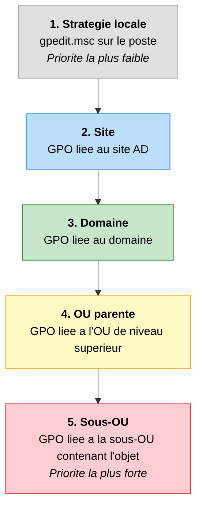
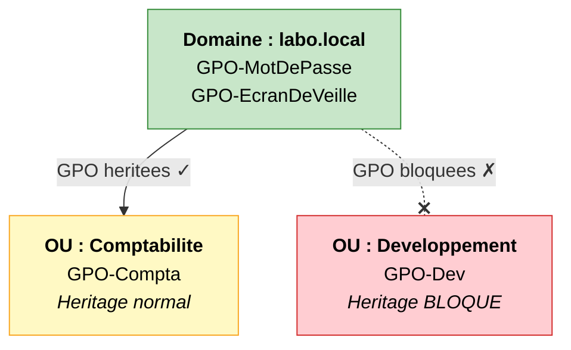
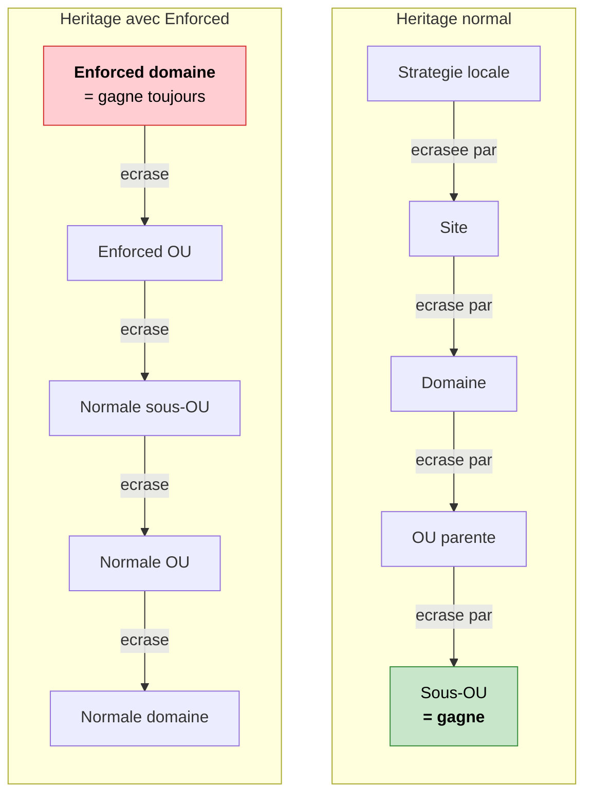

# Comprendre l'heritage et l'ordre d'application

!!! abstract "Ce que vous allez apprendre"
    - Comment les GPO se superposent comme des couches de vetements, et pourquoi la derniere couche gagne
    - L'ordre d'application LSDOU (Local, Site, Domaine, OU) et ce qui se passe a chaque niveau
    - Comment resoudre un conflit quand deux GPO se contredisent
    - Comment bloquer l'heritage et forcer une GPO (et pourquoi il faut y reflechir a deux fois)
    - Comment visualiser l'heritage effectif dans la console GPMC

---

## L'analogie des couches de vetements

Ce chapitre est probablement le plus important de tout le livre. Comprendre l'heritage, c'est comprendre **pourquoi** une GPO s'applique ou ne s'applique pas. Sans cette base, vous passerez des heures a vous demander pourquoi un parametre ne fonctionne pas, alors que la reponse est souvent simple.

Avant de plonger dans la theorie, on va utiliser une image que vous n'oublierez jamais.

Imaginez que vous vous habillez le matin en plein hiver.

- :material-tshirt-crew: D'abord, vous enfilez un **sous-vetement**. C'est la base. Vous le portez toujours, quoi qu'il arrive.
- :material-tshirt-v: Par-dessus, vous mettez un **t-shirt**. Il recouvre le sous-vetement.
- :material-hoodie: Ensuite, un **pull**. Il recouvre le t-shirt.
- :material-jacket-outline: Enfin, un **manteau**. C'est la couche la plus exterieure, celle qu'on voit.

Maintenant, posez-vous cette question : **quelle couleur voit-on de l'exterieur ?**

Celle du manteau. Toujours. Meme si votre t-shirt est rouge et votre pull est vert, c'est la couleur du manteau qui "gagne" visuellement. La derniere couche posee l'emporte.

Les GPO fonctionnent exactement de la meme facon.

| Couche de vetement | Niveau GPO | Exemple |
|:------------------:|:----------:|:-------:|
| :material-tshirt-crew: Sous-vetement | Strategie locale | La GPO editee avec `gpedit.msc` sur le poste |
| :material-tshirt-v: T-shirt | Site | GPO liee au site Active Directory "Paris" |
| :material-hoodie: Pull | Domaine | GPO liee au domaine `labo.local` |
| :material-jacket-outline: Manteau | OU (Unite d'organisation) | GPO liee a l'OU "Comptabilite" |

Quand deux couches definissent la meme chose (par exemple, la couleur du fond d'ecran), **c'est la derniere couche appliquee qui gagne**. Comme le manteau qui cache le pull.

Et si une couche ne dit rien sur un sujet ? Alors la couche precedente reste visible. Si votre manteau n'a pas de capuche, c'est celle du pull qui depasse.

!!! tip "Retenez l'image"
    Chaque fois que vous vous demandez "quelle GPO va gagner ?", pensez aux couches de vetements. La couche **la plus proche de l'objet** (utilisateur ou ordinateur) l'emporte toujours. Le manteau bat le pull, qui bat le t-shirt, qui bat le sous-vetement.

!!! quote "En resume"
    - Les GPO s'empilent comme des couches de vetements : locale, site, domaine, OU.
    - La derniere couche appliquee gagne en cas de conflit.
    - Si une couche ne definit rien, le parametre de la couche precedente reste en vigueur.

---

## L'ordre LSDOU

L'analogie des vetements, c'est bien. Mais maintenant, donnons les vrais noms. L'ordre d'application des GPO suit un acronyme simple : **LSDOU**.

- **L** = Local
- **S** = Site
- **D** = Domain (Domaine)
- **OU** = Organizational Unit (Unite d'organisation)

Chaque lettre represente un niveau ou Windows va chercher des GPO a appliquer. Il les traite dans cet ordre precis, et **le dernier parametre lu ecrase les precedents**.

### :material-monitor: L -- La strategie locale

C'est la GPO que vous editez avec `gpedit.msc` directement sur un poste. Elle est stockee sur le disque dur de la machine, pas dans Active Directory.

Elle s'applique **toujours**, meme si le poste n'est pas membre d'un domaine. C'est le sous-vetement : la base, la couche la plus faible.

En entreprise, elle est presque systematiquement ecrasee par les GPO de domaine. Mais elle existe, et elle s'applique en premier.

Exemple concret : un technicien configure `gpedit.msc` sur un PC de la salle de reunion pour desactiver l'ecran de veille. Si aucune GPO de domaine ne definit l'ecran de veille, ce reglage local reste actif. Mais des qu'une GPO de domaine impose un ecran de veille, elle ecrase le reglage local.

### :material-map-marker-outline: S -- Le site

Un site Active Directory represente un **emplacement physique** : un batiment, une ville, un datacenter. On relie des GPO aux sites quand on veut appliquer une regle a toutes les machines d'un lieu, independamment de leur position dans l'arborescence OU.

En pratique, les GPO de site sont **rarement utilisees**. La plupart des entreprises preferent organiser leurs OU par site plutot que d'utiliser les sites AD pour les GPO.

Un cas d'usage typique : une entreprise avec un bureau a Paris et un bureau a Lyon. Le bureau de Lyon utilise un serveur proxy different. Plutot que de creer une OU par site, l'administrateur peut lier une GPO au site AD "Lyon" pour configurer le proxy. Mais encore une fois, c'est un scenario peu courant.

### :material-domain: D -- Le domaine

Les GPO liees au domaine s'appliquent a **tous les objets** du domaine, sans exception. C'est ici qu'on met les regles universelles : politique de mots de passe, configuration de l'ecran de veille, interdiction d'installer des logiciels...

La `Default Domain Policy` que vous avez vue dans le chapitre precedent est liee a ce niveau.

C'est le niveau le plus utilise pour les regles qui concernent **tout le monde**. Si vous voulez que tous les utilisateurs du domaine aient un mot de passe d'au moins 12 caracteres, c'est ici que ca se passe.

### :material-folder-outline: OU -- L'unite d'organisation

C'est le niveau le plus proche des utilisateurs et des ordinateurs. Les GPO liees aux OU sont les dernieres appliquees, et donc **celles qui gagnent** en cas de conflit avec les niveaux precedents.

Si une OU contient des sous-OU, les GPO s'appliquent de la plus haute a la plus basse. La GPO liee a la sous-OU `Comptabilite\Stagiaires` s'applique apres celle liee a `Comptabilite`, et l'ecrase en cas de conflit.

Prenons un exemple concret avec une arborescence d'entreprise :

```
labo.local                          ← GPO-Domaine (mot de passe = 12 car.)
├── OU=Siege
│   ├── OU=Comptabilite             ← GPO-Compta (logiciel de facturation)
│   │   └── OU=Stagiaires           ← GPO-Stagiaires (USB desactive)
│   └── OU=RH                      ← GPO-RH (acces aux dossiers RH)
└── OU=Agences
    └── OU=Lyon                     ← GPO-Lyon (imprimante Lyon)
```

Un stagiaire de la comptabilite recoit, dans cet ordre :

1. La GPO du domaine (mot de passe = 12 caracteres)
2. La GPO de l'OU `Comptabilite` (logiciel de facturation)
3. La GPO de la sous-OU `Stagiaires` (USB desactive)

Il herite de **toutes** les GPO de ses OU parentes, plus celles de son propre niveau. Les trois s'appliquent car elles ne sont pas en conflit.

### Le diagramme complet

Voici l'ordre d'application visualise. Lisez de haut en bas : la derniere GPO appliquee gagne.



La fleche va du plus faible au plus fort. Si la strategie locale dit "fond d'ecran = bleu" et la sous-OU dit "fond d'ecran = rouge", c'est **rouge** qui s'affiche.

!!! info "Pourquoi cet ordre ?"
    Microsoft a concu cet ordre pour permettre une gestion de plus en plus fine. Le domaine fixe les grandes regles, et chaque OU peut affiner les parametres pour son groupe specifique. C'est comme un entonnoir : on part du general pour aller vers le particulier.

!!! quote "En resume"
    - L'ordre d'application est **LSDOU** : Local, Site, Domaine, OU (puis sous-OU).
    - Le dernier parametre lu ecrase les precedents (la derniere couche gagne).
    - En pratique, les GPO de site sont rarement utilisees. L'essentiel se joue entre le domaine et les OU.

---

## Que se passe-t-il quand deux GPO se contredisent ?

C'est la question que tout le monde se pose. Et la reponse est simple : **la GPO la plus proche de l'objet gagne**.

### Un scenario concret

Imaginons cette situation :

- :material-domain: Au niveau du **domaine**, une GPO nommee `GPO-FondEcran-Bleu` definit le fond d'ecran sur **bleu**.
- :material-folder-outline: Au niveau de l'**OU Comptabilite**, une GPO nommee `GPO-FondEcran-Rouge` definit le fond d'ecran sur **rouge**.

Marie travaille a la comptabilite. Son compte utilisateur est dans l'OU `Comptabilite`.

**Quel fond d'ecran voit-elle ?**

Rouge. Parce que la GPO de l'OU est appliquee **apres** celle du domaine. La derniere couche gagne.

### Et si les deux GPO parlent de choses differentes ?

Si `GPO-FondEcran-Bleu` au niveau domaine definit le fond d'ecran, et que `GPO-Ecran-Veille` au niveau OU configure uniquement l'ecran de veille, il n'y a **aucun conflit**. Les deux s'appliquent. Marie a un fond d'ecran bleu ET un ecran de veille configure.

Les GPO ne se contredisent que lorsqu'elles touchent **le meme parametre**. Si elles parlent de sujets differents, elles se completent.

C'est un point fondamental. Beaucoup de debutants pensent que si une GPO de domaine et une GPO d'OU sont liees au meme objet, elles s'annulent. Pas du tout. Elles se **fusionnent**, et seuls les parametres en conflit sont resolus par la regle "le plus proche gagne".

### Tableau des conflits

Voici quelques scenarios pour bien ancrer le concept :

| GPO au domaine | GPO a l'OU | Resultat pour l'utilisateur dans l'OU | Pourquoi ? |
|:--------------:|:----------:|:-------------------------------------:|:----------:|
| Fond d'ecran = bleu | Fond d'ecran = rouge | :material-check: **Rouge** | L'OU est plus proche, elle gagne |
| USB desactive | USB active | :material-check: **USB active** | L'OU ecrase le domaine |
| Ecran de veille = 5 min | *(rien sur l'ecran de veille)* | :material-check: **Ecran de veille = 5 min** | Pas de conflit, le domaine s'applique |
| *(rien sur le proxy)* | Proxy = 10.0.0.1 | :material-check: **Proxy = 10.0.0.1** | Pas de conflit, l'OU ajoute un parametre |

!!! warning "Le piege classique"
    Beaucoup de debutants pensent que la GPO de domaine "ecrase tout" parce qu'elle est plus haute. C'est l'inverse. La GPO de domaine est appliquee **en premier**, et la GPO de l'OU la **corrige** ensuite. Pensez aux vetements : le pull est pose avant le manteau, mais c'est le manteau qu'on voit.

!!! info "Non configure vs. Desactive : une distinction cruciale"
    Chaque parametre GPO peut etre dans trois etats :

    - **Non configure** : la GPO ne dit rien sur ce parametre. Le parametre du niveau superieur reste en vigueur.
    - **Active** : la GPO definit explicitement ce parametre (par exemple, "ecran de veille = 5 min").
    - **Desactive** : la GPO desactive explicitement ce parametre (par exemple, "pas d'ecran de veille").

    **Desactive** et **Non configure** ne sont pas la meme chose. Si une GPO de domaine active l'ecran de veille et qu'une GPO d'OU laisse le parametre **Non configure**, l'ecran de veille du domaine reste actif. Mais si la GPO d'OU **desactive** explicitement l'ecran de veille, il sera desactive. C'est une source de confusion frequente.

!!! quote "En resume"
    - Quand deux GPO definissent le meme parametre, c'est celle la plus proche de l'objet qui gagne.
    - Quand deux GPO parlent de sujets differents, elles se completent sans conflit.
    - La GPO de domaine n'est PAS prioritaire. C'est la GPO d'OU qui l'emporte en cas de conflit.

---

## L'ordre de liaison

On a vu que la GPO la plus proche de l'objet gagne. Mais que se passe-t-il quand **plusieurs GPO sont liees a la meme OU** ?

C'est la que l'**ordre de liaison** (*Link Order*) entre en jeu.

On est ici dans un cas de figure tres courant. Au fil du temps, les administrateurs ajoutent de nouvelles GPO a une OU sans forcement penser a l'ordre. Et un jour, deux GPO se contredisent au meme niveau. C'est l'ordre de liaison qui tranche.

### Le principe

Chaque GPO liee a une OU recoit un numero d'ordre. Ce numero determine l'ordre de traitement. Mais attention, c'est **contre-intuitif** :

:material-alert-circle: **La GPO avec le numero d'ordre le plus BAS a la priorite la plus HAUTE.**

- Ordre de liaison **1** = appliquee en dernier = **gagne** les conflits
- Ordre de liaison **2** = appliquee avant la 1 = **perd** en cas de conflit

C'est logique si on y reflechit : la GPO numero 1 est traitee en dernier, donc elle ecrase les autres. Exactement comme la derniere couche de peinture sur un mur.

### Exemple

L'OU `Comptabilite` a trois GPO liees :

| Ordre de liaison | GPO | Parametre |
|:----------------:|:---:|:---------:|
| 1 | GPO-Securite-Compta | Ecran de veille = 3 min |
| 2 | GPO-Reseau-Compta | Proxy = 10.0.0.1 |
| 3 | GPO-General-Compta | Ecran de veille = 10 min |

La GPO-General-Compta (ordre 3) est traitee en premier. Elle definit l'ecran de veille a 10 minutes.

Ensuite, GPO-Reseau-Compta (ordre 2) est traitee. Elle configure le proxy. Pas de conflit avec l'ecran de veille.

Enfin, GPO-Securite-Compta (ordre 1) est traitee en dernier. Elle redefinit l'ecran de veille a 3 minutes. Elle **ecrase** la valeur de GPO-General-Compta.

Resultat final : ecran de veille = **3 minutes**, proxy = **10.0.0.1**.

C'est exactement comme des couches de peinture sur un mur. La derniere couche est celle qu'on voit, mais les couches precedentes ne disparaissent pas : elles sont juste cachees. Si on "gratte" la derniere couche (en supprimant la GPO prioritaire), la couleur precedente reapparait.

### Modifier l'ordre de liaison

!!! example "Pas a pas"

    **Etape 1** : Ouvrir la console GPMC.

    Appuyez sur ++win+r++, tapez `gpmc.msc` et appuyez sur ++enter++.

    **Etape 2** : Selectionner l'OU concernee.

    Dans le panneau de gauche, naviguez jusqu'a l'OU dont vous voulez modifier l'ordre de liaison (par exemple `Comptabilite`).

    **Etape 3** : Regarder l'onglet **Objets de strategie de groupe lies**.

    Dans le panneau de droite, cliquez sur l'onglet **Objets de strategie de groupe lies**. Vous verrez la liste des GPO liees avec leur ordre de liaison.

    **Etape 4** : Modifier l'ordre.

    Selectionnez la GPO dont vous voulez changer la priorite, puis utilisez les fleches :material-arrow-up: et :material-arrow-down: a gauche de la liste pour monter ou descendre son ordre de liaison.

    - :material-arrow-up: Monter = numero plus bas = **priorite plus haute**
    - :material-arrow-down: Descendre = numero plus haut = **priorite plus basse**

    **Etape 5** : Verifier le resultat.

    Apres avoir modifie l'ordre, verifiez que les numeros correspondent a vos attentes. La GPO que vous voulez voir "gagner" en cas de conflit doit etre en position **1**.

!!! warning "L'ordre de liaison ne change PAS l'heritage LSDOU"
    L'ordre de liaison ne concerne que les GPO liees **au meme niveau** (a la meme OU). Il ne permet pas de faire gagner une GPO de domaine contre une GPO d'OU. L'heritage LSDOU reste la regle principale. L'ordre de liaison est un "departage" pour les GPO qui sont cote a cote au meme niveau.

!!! tip "Astuce pour s'en souvenir"
    Pensez a un podium sportif : la place **numero 1**, c'est le vainqueur. La GPO avec l'ordre de liaison **1** est celle qui "gagne" en cas de conflit. Le numero 1 est toujours le champion.

!!! quote "En resume"
    - Quand plusieurs GPO sont liees a la meme OU, l'**ordre de liaison** determine la priorite.
    - L'ordre de liaison **1** = priorite la plus haute (traitee en dernier, donc elle ecrase les autres).
    - On modifie l'ordre avec les fleches haut/bas dans l'onglet **Objets de strategie de groupe lies** de GPMC.

---

## Bloquer l'heritage

Jusqu'ici, tout est logique : les GPO du domaine descendent vers les OU, et les OU les plus proches de l'objet gagnent. Mais parfois, un administrateur veut qu'une OU **ignore completement** les GPO des niveaux superieurs.

C'est ce qu'on appelle **bloquer l'heritage**.

### L'analogie du casque anti-bruit

Imaginez que vous travaillez dans un open space bruyant. Vos collegues parlent, le telephone sonne, la machine a cafe gronde. Tout ce bruit vient "d'au-dessus" -- de l'environnement qui vous entoure.

Vous mettez un **casque anti-bruit**. D'un coup, silence total. Vous n'entendez plus rien de ce qui vient de l'exterieur. Le casque bloque **tout** le bruit, sans distinction. La voix de votre collegue qui vous pose une question ? Bloquee. L'annonce importante du directeur ? Bloquee aussi. Tout y passe.

Bloquer l'heritage, c'est exactement ca. Quand vous activez cette option sur une OU, elle **ignore toutes les GPO** heritees des niveaux superieurs (domaine, site, etc.). Seules les GPO directement liees a cette OU s'appliquent.

### Comment l'activer

!!! example "Pas a pas"

    **Etape 1** : Ouvrir GPMC (`gpmc.msc`).

    **Etape 2** : Dans le panneau de gauche, faites un **clic droit** sur l'OU concernee.

    **Etape 3** : Selectionnez **Bloquer l'heritage** (*Block Inheritance*).

    Un point d'exclamation bleu :material-exclamation-thick: apparait sur l'icone de l'OU pour signaler que l'heritage est bloque.

### Ce qui se passe concretement

Prenons un exemple. Avant le blocage :

- GPO du domaine : mot de passe = 12 caracteres
- GPO du domaine : ecran de veille = 5 min
- GPO de l'OU `Developpement` : proxy = 10.0.0.5

Les developpeurs recoivent les trois parametres.

Apres avoir bloque l'heritage sur l'OU `Developpement` :

- ~~GPO du domaine : mot de passe = 12 caracteres~~ :material-close: Bloque
- ~~GPO du domaine : ecran de veille = 5 min~~ :material-close: Bloque
- GPO de l'OU `Developpement` : proxy = 10.0.0.5 :material-check: Appliquee

Les developpeurs n'ont plus que le proxy. Les regles de mot de passe et d'ecran de veille du domaine ne s'appliquent plus.

### Le diagramme du blocage



L'OU `Comptabilite` recoit normalement les GPO du domaine. L'OU `Developpement` les bloque toutes.

### Pourquoi c'est rarement une bonne idee

!!! danger "Attention : le blocage est brutal"
    Bloquer l'heritage, c'est le casque anti-bruit : ca bloque **tout**, pas juste ce qui vous derange. Vous perdez aussi les GPO de securite, les politiques de mots de passe, les configurations reseau...

    Voici les problemes courants :

    - **Perte de securite** : les GPO de securite du domaine ne s'appliquent plus. Vos postes deviennent des passoires.
    - **Comportement invisible** : un collegue qui regarde GPMC au niveau du domaine ne comprendra pas pourquoi ses GPO ne fonctionnent pas sur cette OU. Rien ne l'indique visuellement (a part le petit point d'exclamation, facile a rater).
    - **Depannage cauchemardesque** : quand un parametre "ne fonctionne pas" sur une OU, le blocage d'heritage est la derniere chose a laquelle on pense. Des heures de debug pour decouvrir un clic droit pose il y a 6 mois.

    **Regle generale** : si vous avez besoin de bloquer l'heritage, c'est probablement que vos OU sont mal organisees. Reorganisez d'abord, bloquez en dernier recours.

!!! info "Comment detecter un blocage existant"
    Quand vous prenez en charge un domaine existant, verifiez s'il y a des blocages d'heritage en place. Dans GPMC, les OU avec un heritage bloque affichent un point d'exclamation bleu :material-exclamation-thick: sur leur icone. Parcourez l'arborescence et notez chaque OU avec ce symbole. C'est souvent la source de comportements inexpliques.

    Vous pouvez aussi utiliser PowerShell pour lister toutes les OU avec un heritage bloque :

    ```powershell
    # List all OUs with blocked inheritance
    Get-GPInheritance -Target "dc=labo,dc=local" | Where-Object { $_.GpoInheritanceBlocked -eq $true }
    ```

!!! quote "En resume"
    - Bloquer l'heritage = casque anti-bruit. Ca bloque **toutes** les GPO des niveaux superieurs, sans distinction.
    - Activation : clic droit sur l'OU > **Bloquer l'heritage** dans GPMC.
    - C'est une option a utiliser avec extreme prudence : perte de securite, comportement invisible, depannage difficile.
    - Privilegiez une bonne organisation des OU plutot que le blocage d'heritage.

---

## Forcer une GPO (Enforced)

On vient de voir que bloquer l'heritage est comme un casque anti-bruit. Mais que se passe-t-il si quelque chose est **tellement important** qu'il doit traverser meme le casque anti-bruit ?

C'est le role de l'option **Applique** (*Enforced*).

Dans l'interface francaise de GPMC, cette option s'appelle **Applique**. Dans les documentations en anglais, vous la trouverez sous le nom **Enforced**. Les deux termes designent exactement la meme chose. Dans ce livre, on utilisera les deux de maniere interchangeable pour que vous soyez a l'aise avec les deux vocabulaires.

### L'analogie de l'alarme incendie

Vous etes dans votre open space avec votre casque anti-bruit. Vous n'entendez plus rien. Soudain, l'**alarme incendie** se declenche.

L'alarme incendie est tellement forte, tellement vitale, qu'elle traverse le casque anti-bruit. Vous l'entendez quand meme. Elle est **concue pour ne jamais etre ignoree**. Peu importe votre casque, peu importe vos ecouteurs, peu importe a quel point vous essayez de l'ignorer : l'alarme passe.

C'est exactement ce que fait l'option Enforced sur une GPO. Une GPO forcee :

- :material-check: S'applique meme si l'OU a bloque l'heritage
- :material-check: Ecrase les GPO des niveaux inferieurs en cas de conflit
- :material-check: Ne peut pas etre contournee par les OU enfants

C'est l'arme ultime de l'administrateur pour les regles non negociables.

### Comment l'activer

!!! example "Pas a pas"

    **Etape 1** : Ouvrir GPMC (`gpmc.msc`).

    **Etape 2** : Dans le panneau de gauche, naviguez jusqu'au **lien** de la GPO que vous voulez forcer. Attention, ce n'est pas un clic droit sur la GPO elle-meme dans le conteneur "Objets de strategie de groupe", mais sur le **lien** de la GPO sous le domaine ou l'OU.

    **Etape 3** : Faites un **clic droit** sur le lien de la GPO.

    **Etape 4** : Selectionnez **Applique** (*Enforced*).

    Un petit cadenas :material-lock: apparait sur l'icone du lien pour signaler que la GPO est forcee.

!!! warning "Lien vs. objet GPO"
    L'option Enforced se configure sur le **lien**, pas sur l'objet GPO. Une meme GPO peut etre liee a plusieurs endroits : elle peut etre forcee a un endroit et pas a un autre. C'est un detail important que beaucoup de debutants ratent.

### Ce qui change avec Enforced

Sans Enforced, l'ordre normal s'applique : la GPO la plus proche de l'objet gagne.

Avec Enforced, **la GPO forcee gagne toujours**, meme si une GPO plus proche dit le contraire.

| Situation | GPO domaine (Enforced) | GPO OU | Resultat |
|:---------:|:----------------------:|:------:|:--------:|
| Conflit classique | Fond d'ecran = bleu | Fond d'ecran = rouge | :material-check: **Bleu** (Enforced gagne) |
| Heritage bloque sur l'OU | Ecran de veille = 5 min | *(heritage bloque)* | :material-check: **Ecran de veille = 5 min** (Enforced traverse le blocage) |
| Pas de conflit | USB desactive | Proxy = 10.0.0.1 | :material-check: **Les deux s'appliquent** |

### Quand utiliser Enforced ?

En un mot : **rarement**.

Enforced est reserve aux regles de securite **critiques** qui doivent s'appliquer partout, sans exception. Par exemple :

- :material-shield-lock: Politique de mots de passe minimale (longueur, complexite)
- :material-update: Configuration de Windows Update (les correctifs de securite doivent toujours s'appliquer)
- :material-fire: Parametres de pare-feu de base

Si vous forcez 15 GPO, vous avez un probleme d'architecture, pas un probleme de GPO.

### Que se passe-t-il avec plusieurs GPO Enforced ?

Si deux GPO Enforced se contredisent, la regle est l'inverse des GPO normales : **c'est la plus haute dans la hierarchie qui gagne**.

Exemple : une GPO Enforced au domaine dit "ecran de veille = 5 min", et une GPO Enforced a l'OU dit "ecran de veille = 10 min". C'est **5 minutes** qui gagne, parce que le domaine est plus haut que l'OU.

Pour les GPO normales, la plus proche gagne. Pour les GPO Enforced, la plus haute gagne. C'est logique quand on y pense : Enforced est fait pour que les administrateurs du domaine gardent le controle final.

!!! danger "Avec un grand pouvoir..."
    Forcer une GPO, c'est dire "cette regle est non negociable, point final". Si vous en abusez, vous perdez toute la flexibilite de l'heritage. Vos OU enfants ne pourront plus rien personnaliser, et l'interet meme de l'arborescence OU disparait.

!!! quote "En resume"
    - Enforced = alarme incendie. Ca traverse meme le casque anti-bruit (blocage d'heritage).
    - Activation : clic droit sur le **lien** de la GPO > **Applique** dans GPMC.
    - Une GPO forcee gagne toujours, quel que soit le niveau d'ou elle vient.
    - A reserver aux regles de securite critiques. Si vous en forcez plus de 2-3, reorganisez vos OU.

---

## La hierarchie complete des conflits

On a vu beaucoup de regles. Mettons tout a plat dans un tableau unique, de la priorite la plus haute a la plus basse.

| Priorite | Type de GPO | Description | Analogie |
|:--------:|:-----------:|:-----------:|:--------:|
| :material-numeric-1-circle: | **Enforced au domaine** | GPO forcee liee au domaine | Alarme incendie dans tout le batiment |
| :material-numeric-2-circle: | **Enforced a l'OU parente** | GPO forcee liee a une OU parente | Alarme incendie a l'etage |
| :material-numeric-3-circle: | **Enforced a la sous-OU** | GPO forcee liee a la sous-OU | Alarme incendie dans la piece |
| :material-numeric-4-circle: | **Normale a la sous-OU** | GPO non forcee, liee a la sous-OU la plus proche | Manteau |
| :material-numeric-5-circle: | **Normale a l'OU parente** | GPO non forcee, liee a l'OU parente | Pull |
| :material-numeric-6-circle: | **Normale au domaine** | GPO non forcee, liee au domaine | T-shirt |
| :material-numeric-7-circle: | **Normale au site** | GPO non forcee, liee au site | Sous-vetement fin |
| :material-numeric-8-circle: | **Strategie locale** | GPO locale editee avec `gpedit.msc` | Sous-vetement de base |

Ce tableau est votre reference ultime. En cas de doute sur la priorite d'une GPO, revenez ici et trouvez son type dans la liste. Le numero le plus bas gagne toujours.

!!! info "Comment lire ce tableau"
    Le numero 1 gagne toujours. Si une GPO Enforced au domaine dit "fond d'ecran = bleu" et qu'une GPO normale a la sous-OU dit "fond d'ecran = rouge", c'est **bleu** qui gagne. L'Enforced bat tout.

    En revanche, entre deux GPO normales (sans Enforced), c'est l'inverse : la plus proche de l'objet gagne. La sous-OU bat l'OU, qui bat le domaine, qui bat le site, qui bat la locale.

!!! warning "Enforced inverse la logique"
    C'est le piege le plus subtil de tout le systeme GPO. Pour les GPO normales, la plus proche gagne (la sous-OU bat le domaine). Pour les GPO forcees (Enforced), la plus **haute** gagne (le domaine bat la sous-OU).

    Relisez cette phrase deux fois. Elle est cruciale. La plupart des erreurs de conception GPO viennent d'une confusion sur ce point.

    Pour memoriser : "Normal = proche gagne, Enforced = haut gagne."

!!! quote "En resume"
    - Les GPO Enforced ont toujours la priorite sur les GPO normales.
    - Parmi les GPO Enforced, la plus haute dans la hierarchie gagne (domaine > OU > sous-OU).
    - Parmi les GPO normales, la plus proche de l'objet gagne (sous-OU > OU > domaine > site > locale).
    - La strategie locale a toujours la priorite la plus faible.

---

## Exercice : predire quelle GPO gagne

Mettez vos connaissances a l'epreuve. Pour chaque scenario, essayez de predire le resultat **avant** de lire la solution.

Prenez votre temps. Dessinez l'arborescence sur un papier si ca vous aide. L'objectif n'est pas de repondre vite, mais de comprendre **pourquoi** une GPO gagne.

### :material-pencil: Scenario 1 -- Le conflit basique

**Situation :**

- GPO-A est liee au **domaine** : fond d'ecran = **bleu**
- GPO-B est liee a l'**OU Ventes** : fond d'ecran = **vert**
- L'utilisateur Pierre est dans l'OU `Ventes`
- Aucune GPO n'est forcee, pas de blocage d'heritage

**Quel fond d'ecran voit Pierre ?**

??? note "Solution du scenario 1"
    :material-check: **Vert.**

    C'est le cas le plus simple. Les deux GPO sont normales (pas de Enforced). La GPO de l'OU `Ventes` est plus proche de Pierre que celle du domaine. La derniere couche appliquee gagne.

    Rappel : domaine = pull, OU = manteau. Le manteau est visible.

### :material-pencil: Scenario 2 -- Le blocage d'heritage

**Situation :**

- GPO-A est liee au **domaine** : ecran de veille = **5 min**
- GPO-B est liee au **domaine** : proxy = **10.0.0.1**
- L'**OU Developpement** a bloque l'heritage
- GPO-C est liee a l'**OU Developpement** : fond d'ecran = **noir**
- L'utilisateur Sophie est dans l'OU `Developpement`

**Quels parametres s'appliquent a Sophie ?**

??? note "Solution du scenario 2"
    :material-check: **Fond d'ecran = noir. C'est tout.**

    L'heritage est bloque sur l'OU `Developpement`. Les GPO du domaine (GPO-A et GPO-B) sont ignorees. Sophie ne recoit ni l'ecran de veille de 5 minutes, ni le proxy.

    Seule la GPO directement liee a son OU (GPO-C) s'applique.

    C'est le casque anti-bruit : tout ce qui vient d'au-dessus est bloque, sans distinction.

### :material-pencil: Scenario 3 -- Enforced contre blocage

**Situation :**

- GPO-A est liee au **domaine** avec l'option **Enforced** : mot de passe = **14 caracteres minimum**
- GPO-B est liee au **domaine** (normale) : ecran de veille = **5 min**
- L'**OU Direction** a bloque l'heritage
- GPO-C est liee a l'**OU Direction** : mot de passe = **8 caracteres minimum**
- L'utilisateur Marc est dans l'OU `Direction`

**Quels parametres s'appliquent a Marc ?**

??? note "Solution du scenario 3"
    :material-check: **Mot de passe = 14 caracteres minimum. Pas d'ecran de veille.**

    Decomposons etape par etape :

    1. L'OU `Direction` a bloque l'heritage. Donc GPO-B (ecran de veille, normale) est **bloquee**. Marc n'a pas d'ecran de veille.
    2. Mais GPO-A est **Enforced** (forcee). Elle traverse le blocage d'heritage comme une alarme incendie traverse le casque anti-bruit. La regle "mot de passe = 14 caracteres" s'applique.
    3. GPO-C (liee a l'OU) dit "mot de passe = 8 caracteres". Mais GPO-A est Enforced et vient du domaine : elle a la priorite absolue. C'est **14 caracteres** qui gagne.

    Resultat : mot de passe = 14 caracteres (Enforced), pas d'ecran de veille (bloquee), et c'est tout.

    Ce scenario illustre pourquoi Enforced est si puissant : il ignore a la fois le blocage d'heritage ET les GPO normales des niveaux inferieurs.

!!! quote "En resume"
    - Scenario simple : la GPO la plus proche gagne (OU bat domaine).
    - Avec blocage d'heritage : toutes les GPO des niveaux superieurs sont ignorees.
    - Enforced bat tout : il traverse le blocage d'heritage et ecrase les GPO normales des niveaux inferieurs.

---

## Visualiser l'heritage dans GPMC

Deviner quelle GPO s'applique, c'est bien pour apprendre. Mais en situation reelle, il existe un outil qui vous donne la reponse directement : l'onglet **Heritage de strategie de groupe** dans GPMC.

C'est l'equivalent d'un rayon X pour vos GPO : au lieu de deviner quelle couche est visible, vous voyez directement le resultat final. Tout administrateur devrait avoir le reflexe de consulter cet onglet avant de creer ou modifier une GPO.

### Ou le trouver

!!! example "Pas a pas"

    **Etape 1** : Ouvrir GPMC.

    Appuyez sur ++win+r++, tapez `gpmc.msc` et appuyez sur ++enter++.

    **Etape 2** : Naviguer jusqu'a l'OU que vous voulez analyser.

    Dans le panneau de gauche, developpez l'arborescence jusqu'a l'OU cible. Par exemple :

    **Foret** > **Domaines** > **labo.local** > **Comptabilite**

    **Etape 3** : Cliquer sur l'onglet **Heritage de strategie de groupe**.

    Dans le panneau de droite, cliquez sur l'onglet **Heritage de strategie de groupe** (*Group Policy Inheritance*).

    Vous verrez un tableau qui liste **toutes les GPO effectives** sur cette OU, classees par priorite :

    | Priorite | GPO | Emplacement du lien | Statut |
    |:--------:|:---:|:-------------------:|:------:|
    | 1 | GPO-Securite-Compta | Comptabilite | Appliquee |
    | 2 | GPO-Reseau-Compta | Comptabilite | Appliquee |
    | 3 | Default Domain Policy | labo.local | Appliquee |

    **Etape 4** : Lire le tableau.

    La GPO en haut du tableau (priorite 1) est celle qui gagne en cas de conflit. C'est le resultat final apres application de toutes les regles d'heritage, de liaison, de blocage et de forcage.

### Ce que cet onglet vous dit

- :material-check: Les GPO qui s'appliquent effectivement a cette OU, apres calcul de l'heritage
- :material-check: L'ordre de priorite final (la ligne 1 gagne en cas de conflit)
- :material-check: D'ou vient chaque GPO (domaine, OU parente, OU elle-meme)
- :material-check: Si une GPO est forcee (Enforced)

### Lire le resultat

Prenons un exemple. Vous cliquez sur l'OU `Comptabilite\Stagiaires` et vous ouvrez l'onglet Heritage de strategie de groupe. Voici ce que vous pourriez voir :

| Priorite | GPO | Emplacement du lien | Etat du lien |
|:--------:|:---:|:-------------------:|:------------:|
| 1 | GPO-Stagiaires | Stagiaires | Active |
| 2 | GPO-Securite-Compta | Comptabilite | Active |
| 3 | GPO-Reseau-Compta | Comptabilite | Active |
| 4 | Default Domain Policy | labo.local | Active |

Comment lire ce tableau ? De haut en bas, par priorite decroissante. Si GPO-Stagiaires et Default Domain Policy definissent toutes les deux l'ecran de veille, c'est GPO-Stagiaires (priorite 1) qui gagne.

Notez que les GPO de l'OU parente (`Comptabilite`) apparaissent aussi dans la liste : c'est justement l'heritage en action. Les GPO des niveaux superieurs "descendent" vers les niveaux inferieurs.

### Ce que cet onglet ne vous dit pas

- :material-close: Il ne montre pas les GPO qui ont ete bloquees par le blocage d'heritage (elles ont disparu de la liste)
- :material-close: Il ne montre pas les GPO qui sont liees mais desactivees
- :material-close: Il ne montre pas le filtrage de securite (on verra ca dans un prochain chapitre)
- :material-close: Il ne montre pas si un parametre specifique est defini ou non dans une GPO -- il montre juste la liste des GPO effectives

!!! tip "Le reflexe GPMC"
    Avant de vous arracher les cheveux a comprendre pourquoi une GPO ne s'applique pas, ouvrez cet onglet. En 10 secondes, vous voyez exactement quelles GPO sont effectives sur une OU donnee et dans quel ordre. C'est l'outil de diagnostic numero un pour les problemes d'heritage.

!!! info "Pour aller plus loin : gpresult"
    L'onglet Heritage de GPMC montre les GPO effectives sur une **OU**. Mais pour voir les GPO effectives sur un **utilisateur ou un ordinateur precis**, il existe un outil en ligne de commande : `gpresult /r`. On en reparlera en detail dans le chapitre sur le diagnostic.

!!! quote "En resume"
    - L'onglet **Heritage de strategie de groupe** dans GPMC montre les GPO effectives sur une OU apres calcul de l'heritage.
    - La GPO en priorite 1 est celle qui gagne en cas de conflit.
    - C'est le premier reflexe a avoir pour diagnostiquer un probleme d'heritage.
    - Pour un diagnostic par utilisateur/ordinateur, utilisez `gpresult /r` (chapitre diagnostic).

---

## Quand utiliser quoi ?

On a vu trois mecanismes pour influencer l'heritage : l'ordre de liaison, le blocage d'heritage et le forcage (Enforced). Mais lequel utiliser, et quand ?

### Le tableau de decision

| Besoin | Solution recommandee | Alternative a eviter |
|:------:|:--------------------:|:--------------------:|
| Donner la priorite a une GPO dans une OU | :material-check: **Modifier l'ordre de liaison** (GPO prioritaire = ordre 1) | Creer une sous-OU juste pour ca |
| Empecher les GPO du domaine de s'appliquer a une OU | :material-check: **Reorganiser les OU** pour que les GPO ciblent mieux | :material-close: Bloquer l'heritage (masque les problemes) |
| Imposer une regle de securite critique partout | :material-check: **Forcer (Enforced)** la GPO de securite au domaine | Dupliquer la GPO dans chaque OU |
| Une OU a des besoins tres differents du reste | :material-check: **Lier des GPO specifiques** a cette OU | :material-close: Bloquer l'heritage + tout redefinir |
| Deux GPO sur la meme OU se contredisent | :material-check: **Modifier l'ordre de liaison** ou fusionner les GPO | Creer une GPO "correctrice" supplementaire |

### La regle d'or de l'heritage

!!! tip "Conseil d'architecture"
    Dans 90% des cas, une bonne organisation des OU suffit. Si vous devez utiliser Bloquer l'heritage ou Enforced plus d'une ou deux fois dans votre domaine, c'est un signe que votre arborescence OU a besoin d'etre repensee.

    Les meilleurs administrateurs utilisent une architecture simple :

    - Les GPO de securite universelles sont liees au **domaine**
    - Les GPO specifiques a un departement sont liees a l'**OU du departement**
    - L'ordre de liaison gere les priorites au sein d'une meme OU
    - Enforced est reserve a 1 ou 2 GPO de securite critiques
    - Bloquer l'heritage n'est presque jamais utilise

    Avec cette approche, l'heritage fait naturellement le travail. Pas besoin de mecanismes avances.

### Le piege de la complexite

Chaque blocage ou forcage que vous ajoutez est une exception a la regle normale. Et chaque exception est un piege pour le futur :

- :material-calendar-clock: Dans 6 mois, vous aurez oublie pourquoi vous avez bloque l'heritage sur cette OU.
- :material-account-question: Votre collegue qui reprend le poste ne comprendra pas le comportement de cette OU.
- :material-bug: Un ticket de support prendra 3 heures au lieu de 10 minutes parce que personne ne pensera a verifier le blocage.

La simplicite est une vertu en administration systeme. Moins d'exceptions = moins de surprises.

### Un exemple d'architecture propre

Voici a quoi ressemble un domaine bien organise, sans blocage ni forcage excessif :

```
labo.local
│
├── GPO liees au domaine :
│   ├── Default Domain Policy        (mot de passe, verrouillage)
│   └── GPO-Securite-Base            (pare-feu, antivirus) ← Enforced
│
├── OU=Postes
│   ├── OU=Standards                 ← GPO-Config-Standard
│   ├── OU=Portables                 ← GPO-Config-Portable (VPN, BitLocker)
│   └── OU=Kiosques                  ← GPO-Kiosque (mode restreint)
│
└── OU=Utilisateurs
    ├── OU=Comptabilite              ← GPO-Compta
    ├── OU=Direction                 ← GPO-Direction
    └── OU=Stagiaires               ← GPO-Stagiaires
```

Dans cet exemple, une seule GPO est Enforced (`GPO-Securite-Base`), et il n'y a aucun blocage d'heritage. Chaque OU recoit les regles du domaine plus ses propres regles specifiques. Simple, lisible, maintenable.

!!! quote "En resume"
    - Premiere intention : **organiser les OU correctement** et utiliser l'ordre de liaison.
    - Deuxieme intention : **Enforced** pour 1-2 GPO de securite critiques non negociables.
    - Dernier recours : **Bloquer l'heritage**, et uniquement si toutes les autres options ont ete envisagees.
    - La simplicite est votre meilleure alliee : moins d'exceptions, moins de problemes.

---

## Recapitulatif du chapitre

Vous avez couvert beaucoup de terrain dans ce chapitre. Pas de panique si tout n'est pas parfaitement clair du premier coup. L'heritage des GPO est un sujet que meme les administrateurs experimentes revisitent regulierement.

L'essentiel est de retenir les grands principes. Les details viendront avec la pratique.

Voici l'ensemble des concepts de ce chapitre, condenses en un seul tableau de reference.

| Concept | Definition courte | Analogie | Quand l'utiliser |
|:-------:|:-----------------:|:--------:|:----------------:|
| Heritage | Les GPO des niveaux superieurs descendent vers les niveaux inferieurs | Les regles du college s'appliquent dans toutes les salles | C'est le comportement par defaut, toujours actif |
| LSDOU | Ordre d'application : Local → Site → Domaine → OU | Couches de vetements empilees | Retenir pour comprendre quel parametre gagne |
| Ordre de liaison | Quand plusieurs GPO sont liees a la meme OU, le numero 1 gagne | Le podium sportif (1 = champion) | Pour prioriser les GPO au sein d'une OU |
| Bloquer l'heritage | L'OU ignore toutes les GPO des niveaux superieurs | Casque anti-bruit | Presque jamais (dernier recours) |
| Enforced | La GPO forcee traverse le blocage et ecrase les niveaux inferieurs | Alarme incendie | 1-2 GPO de securite critiques maximum |
| Heritage GPMC | Onglet qui montre les GPO effectives apres calcul | Le diagnostic en un coup d'oeil | Premier reflexe en cas de probleme |



!!! tip "Le memo a retenir"
    - **Sans Enforced** : la plus proche de l'objet gagne (la sous-OU bat tout).
    - **Avec Enforced** : la plus haute gagne (le domaine bat tout).
    - **Blocage d'heritage** : bloque les GPO normales, mais pas les GPO Enforced.
    - **En cas de doute** : ouvrez l'onglet Heritage de strategie de groupe dans GPMC.

!!! warning "Imprimez ce chapitre"
    Serieusement. Ce chapitre est celui que vous relirez le plus souvent dans votre carriere d'administrateur. La prochaine fois qu'une GPO "ne fonctionne pas", revenez ici et suivez la logique LSDOU etape par etape. La reponse sera presque toujours dans l'heritage.

---

!!! tip "Les trois questions a se poser face a un probleme d'heritage"
    Quand une GPO ne s'applique pas comme prevu, posez-vous ces trois questions dans l'ordre :

    1. **Ou est l'objet ?** Dans quelle OU se trouve l'utilisateur ou l'ordinateur concerne ?
    2. **Quelles GPO sont liees entre cet objet et la racine du domaine ?** Listez-les de haut en bas.
    3. **Y a-t-il un blocage ou un forcage ?** Verifiez l'onglet Heritage de strategie de groupe dans GPMC.

    Ces trois questions resolvent 95% des problemes d'heritage.

!!! quote "En resume"
    - L'heritage est le mecanisme le plus important des GPO. Sans le comprendre, le depannage devient impossible.
    - Retenez les analogies : vetements (LSDOU), casque anti-bruit (blocage), alarme incendie (Enforced).
    - L'onglet Heritage de strategie de groupe dans GPMC est votre meilleur ami.
    - La simplicite paie toujours : bien organiser ses OU evite 90% des problemes d'heritage.

---

:material-arrow-right: Dans le **chapitre suivant**, on passera a la pratique avec [les parametres de securite essentiels](07-securite-base.md) a configurer en priorite via les GPO. Vous verrez comment appliquer les concepts d'heritage que vous venez d'apprendre pour deployer une politique de securite solide sur l'ensemble de votre domaine.
