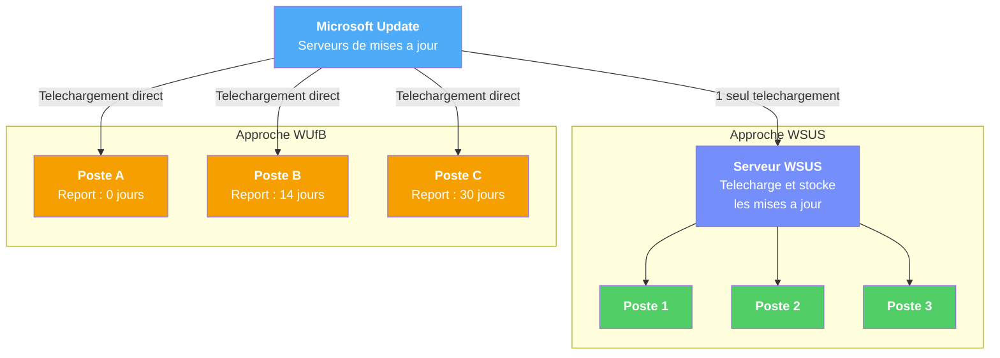

# Configurer Windows Update par GPO

!!! abstract "Ce que vous allez apprendre"
    - Pourquoi laisser Windows Update sans controle est dangereux en entreprise
    - La difference entre WSUS et Windows Update for Business (WUfB), et quand utiliser l'un ou l'autre
    - Configurer un serveur WSUS ou des reports de mises a jour via GPO
    - Empecher les redemarrages sauvages pendant les heures de travail
    - Verifier l'etat des mises a jour sur un poste avec PowerShell et le registre


!!! tip "Si vous ne retenez qu'une chose"
    Le bon réglage Windows Update consiste à contrôler le moment d'installation sans empêcher durablement la machine de se corriger.

---

## Pourquoi controler Windows Update ?

Imaginez un robinet d'eau. Sans GPO, ce robinet est **grand ouvert** : Windows telecharge et installe les mises a jour quand Microsoft le decide, sans vous demander votre avis.

Ca peut sembler pratique a la maison. Mais en entreprise, c'est une catastrophe.

### Le scenario cauchemar

Lundi matin, 9h30. La directrice financiere est en pleine cloture trimestrielle. Son PC affiche soudain : **"Redemarrage dans 15 minutes pour terminer l'installation des mises a jour"**.

Elle n'a rien demande. Elle n'a rien valide. Et elle ne peut rien faire pour l'empecher.

Maintenant, imaginez la meme chose sur **200 postes en meme temps**. Cloture trimestrielle, redemarrages en cascade, fichiers Excel non sauvegardes, reunion Teams coupee en plein milieu.

C'est exactement ce qui arrive quand Windows Update n'est pas controle par GPO.

### Les trois risques concrets

| Risque | Sans GPO | Avec GPO |
|:------:|:--------:|:--------:|
| :material-restart: Redemarrage imprevu | Windows redemarre quand il veut, meme en pleine presentation | Vous choisissez le creneau : nuit, week-end, ou jamais sans validation |
| :material-download: Bande passante saturee | 200 postes telechargent la meme mise a jour de 2 Go depuis Internet en meme temps | Un seul serveur WSUS telecharge la mise a jour, puis la distribue en local |
| :material-bug: Mise a jour defectueuse | Tous les postes installent la mise a jour immediatement, meme si elle casse quelque chose | Vous testez d'abord sur un petit groupe, puis vous deployez progressivement |

### L'analogie du robinet

Sans GPO, c'est un robinet sans vanne : l'eau coule quand le fournisseur le decide. Vous ne choisissez ni le debit, ni l'horaire.

Avec GPO, vous installez une **vanne** sur le robinet. L'eau (les mises a jour) arrive toujours, mais **vous** decidez :

- :material-clock-outline: **Quand** elle coule (la nuit, le week-end)
- :material-speedometer: **A quel debit** (un petit groupe d'abord, puis tout le monde)
- :material-gate: **Par quel tuyau** elle passe (votre serveur local plutot qu'Internet)

!!! quote "En resume"
    - Sans controle, Windows Update peut redemarrer 200 postes en pleine journee de travail.
    - Les trois risques majeurs : redemarrages imprevus, saturation reseau, et mises a jour defectueuses deployees partout d'un coup.
    - Les GPO vous donnent une **vanne** pour controler quand, comment et par ou les mises a jour arrivent.

---

## Les deux approches : WSUS vs Windows Update for Business

Il existe deux strategies principales pour controler Windows Update par GPO. Chacune a ses forces et ses limites.

### WSUS : le serveur local

**WSUS** (*Windows Server Update Services*) est un serveur que vous installez **dans votre reseau**. Il telecharge les mises a jour depuis Microsoft une seule fois, puis les redistribue a vos postes en local.

C'est comme une **citerne d'eau** dans votre immeuble. Le fournisseur remplit la citerne une fois, et chaque appartement se sert directement dedans. Pas besoin que chaque robinet aille chercher l'eau a la source.

### WUfB : le cloud de Microsoft

**WUfB** (*Windows Update for Business*) est une approche plus recente. Pas de serveur a installer : vous configurez des **regles de report** directement par GPO, et les postes telechargent les mises a jour depuis Microsoft, mais selon **votre calendrier**.

C'est comme garder le robinet connecte au reseau public, mais en installant un **programmateur horaire** dessus.

### Comparaison cote a cote

| Critere | :material-server: WSUS | :material-cloud-outline: WUfB |
|:-------:|:----------------------:|:-----------------------------:|
| Infrastructure | Necessite un serveur Windows Server dedie | Aucun serveur supplementaire |
| Approbation des mises a jour | Manuelle : vous approuvez chaque mise a jour | Automatique avec report configurable |
| Bande passante | Economies majeures (telechargement unique en local) | Chaque poste telecharge depuis Internet |
| Granularite | Tres fine : mise a jour par mise a jour | Par categorie : fonctionnalite ou qualite |
| Complexite | Elevee : installation, maintenance, nettoyage de la base | Faible : tout se configure par GPO |
| Cout | Gratuit (inclus dans Windows Server) | Gratuit (inclus dans Windows 10/11 Pro+) |
| Ideal pour | Entreprises avec infrastructure locale, besoin de controle total | PME, postes nomades, environnements cloud-first |

### Le flux visuel des deux approches



A gauche, WSUS : Microsoft envoie les mises a jour **une seule fois** au serveur WSUS, qui les redistribue aux postes en local. A droite, WUfB : chaque poste telecharge directement depuis Microsoft, mais selon un calendrier de report different.

!!! info "On peut combiner les deux"
    WSUS et WUfB ne sont pas mutuellement exclusifs. Certaines entreprises utilisent WSUS pour les serveurs (controle total) et WUfB pour les postes nomades (pas toujours connectes au reseau local). C'est une approche hybride tout a fait valable.

!!! tip "Quel choix pour un debutant ?"
    Si vous debutez et que vous n'avez pas de serveur WSUS en place, commencez par **WUfB**. C'est plus simple a configurer, ne necessite aucune infrastructure supplementaire, et couvre 80% des besoins. Vous pourrez toujours passer a WSUS plus tard si vous avez besoin de plus de controle.

!!! quote "En resume"
    - **WSUS** : serveur local, controle total, economies de bande passante, mais necessite de l'infrastructure et de la maintenance.
    - **WUfB** : zero infrastructure, reports configurables, ideal pour les PME et les postes nomades.
    - Les deux approches se configurent par GPO et peuvent etre combinees.
    - En cas de doute, commencez par WUfB.

---

## Configurer un serveur WSUS via GPO

Si votre entreprise dispose d'un serveur WSUS, voici comment rediriger les postes vers ce serveur par GPO. On ne couvre pas l'installation du serveur WSUS lui-meme (c'est un sujet a part entiere), mais uniquement la **configuration cote client**.

### Le chemin dans l'editeur de GPO

Tous les parametres Windows Update se trouvent au meme endroit :

:material-folder-open: **Configuration ordinateur** > **Strategies** > **Modeles d'administration** > **Composants Windows** > **Windows Update**

C'est un dossier assez fourni. Ne vous laissez pas impressionner par le nombre de parametres : on va se concentrer sur les essentiels.

### Les parametres WSUS essentiels

!!! example "Pas a pas"

    **Etape 1** : Specifier l'emplacement du serveur WSUS.

    Chemin : **Configuration ordinateur** > **Strategies** > **Modeles d'administration** > **Composants Windows** > **Windows Update** > **Specifier l'emplacement intranet du service de mise a jour Microsoft**

    1. Double-cliquez sur le parametre
    2. Selectionnez **Active**
    3. Dans **Configurer le service intranet de mise a jour pour la detection des mises a jour**, entrez l'URL de votre serveur WSUS :
        - Exemple : `http://wsus.labo.local:8530`
    4. Dans **Configurer le serveur intranet de statistiques**, entrez la meme URL :
        - Exemple : `http://wsus.labo.local:8530`
    5. Cliquez **OK**

    **Etape 2** : Configurer le comportement de telechargement et d'installation.

    Chemin : **Configuration ordinateur** > **Strategies** > **Modeles d'administration** > **Composants Windows** > **Windows Update** > **Configuration du service Mises a jour automatiques**

    1. Double-cliquez sur le parametre
    2. Selectionnez **Active**
    3. Dans **Configuration de la mise a jour automatique**, choisissez l'option qui vous convient (voir le tableau ci-dessous)
    4. Configurez le jour et l'heure d'installation planifiee
    5. Cliquez **OK**

    **Etape 3** : Empecher les connexions directes a Windows Update.

    Chemin : **Configuration ordinateur** > **Strategies** > **Modeles d'administration** > **Composants Windows** > **Windows Update** > **Ne pas se connecter a des emplacements Internet Windows Update**

    1. Double-cliquez sur le parametre
    2. Selectionnez **Active**
    3. Cliquez **OK**

    Ce parametre force les postes a utiliser **exclusivement** votre serveur WSUS. Sans lui, les postes peuvent contourner WSUS et telecharger directement depuis Microsoft.

### Les options de la mise a jour automatique

Le parametre **Configuration du service Mises a jour automatiques** propose quatre comportements :

| Option | Comportement | Ideal pour |
|:------:|:------------:|:----------:|
| **2** -- Notification de telechargement et d'installation | L'utilisateur est averti avant chaque telechargement et chaque installation | Postes de developpeurs, utilisateurs avances |
| **3** -- Telechargement automatique, notification avant installation | Windows telecharge en arriere-plan, mais demande avant d'installer | La plupart des postes de bureau |
| **4** -- Telechargement et installation automatiques selon la planification | Tout est automatique, selon le jour et l'heure que vous definissez | Postes partages, salles de reunion, kiosques |
| **5** -- Autoriser l'administrateur local a choisir | L'administrateur local du poste peut modifier le comportement | Postes de test, environnements speciaux |

!!! tip "L'option 3 est souvent le meilleur compromis"
    L'option **3** (telechargement automatique, notification avant installation) permet aux mises a jour d'arriver en arriere-plan sans deranger personne, tout en laissant a l'utilisateur ou a l'administrateur le choix du moment de l'installation.

### Tableau recapitulatif des parametres WSUS

| Parametre GPO | Valeur recommandee | Effet |
|:-------------:|:------------------:|:-----:|
| Specifier l'emplacement intranet du service de mise a jour Microsoft | `http://wsus.labo.local:8530` | Redirige les postes vers votre serveur WSUS |
| Configuration du service Mises a jour automatiques | Option 3 + planification | Telecharge automatiquement, notifie avant installation |
| Ne pas se connecter a des emplacements Internet Windows Update | Active | Empeche les postes de contourner WSUS |
| Autoriser le ciblage cote client | Active + nom du groupe WSUS | Permet d'affecter les postes a des groupes WSUS specifiques |
| Frequence de detection des mises a jour automatiques | 22 heures (par defaut) | Intervalle entre chaque verification aupres du serveur WSUS |
| Pas de redemarrage automatique avec des utilisateurs connectes | Active | Empeche le redemarrage force tant qu'un utilisateur est connecte |

!!! warning "Le port WSUS par defaut"
    Le port par defaut de WSUS est **8530** (HTTP) ou **8531** (HTTPS). Si votre administrateur a installe WSUS avec les anciens ports IIS, ce sera **80** (HTTP) ou **443** (HTTPS). Verifiez aupres de votre equipe serveur quel port utiliser. Une erreur de port = les postes ne trouvent pas le serveur WSUS.

!!! danger "N'oubliez pas d'activer le parametre"
    L'erreur la plus frequente avec WSUS : configurer l'URL du serveur mais **oublier de passer le parametre en "Active"**. Le parametre reste en "Non configure" et les postes continuent de telecharger depuis Microsoft. Verifiez toujours que le bouton "Active" est bien selectionne.

!!! quote "En resume"
    - Le chemin cle : **Composants Windows** > **Windows Update**.
    - Trois parametres minimum pour WSUS : l'URL du serveur, le comportement de mise a jour, et le blocage des connexions directes a Internet.
    - L'option 3 (telechargement automatique, notification avant installation) est le meilleur compromis pour la plupart des postes.
    - Verifiez le port (8530 ou 80) et n'oubliez pas de passer le parametre en **Active**.

---

## Reporter les mises a jour de fonctionnalites

Si vous avez choisi l'approche **WUfB** (sans serveur WSUS), c'est ici que ca se passe. On commence par les mises a jour de **fonctionnalites** -- les grosses mises a jour annuelles comme 23H2, 24H2, etc.

### Pourquoi reporter ?

Les mises a jour de fonctionnalites sont des mises a jour **majeures**. Elles changent des elements de l'interface, ajoutent de nouvelles fonctionnalites, et peuvent modifier le comportement de certains logiciels.

Le probleme : ces mises a jour ne sont pas toujours stables le jour de leur sortie. Des bugs, des incompatibilites avec certains pilotes ou logiciels, des problemes d'impression... Les premieres semaines apres la sortie d'une mise a jour majeure sont souvent mouvementees.

C'est comme un nouveau modele de voiture. Vous ne voulez pas etre le premier acheteur -- vous preferez attendre quelques mois pour que les rappels constructeur soient passes et que les premiers bugs soient corriges.

### Configurer le report

!!! example "Pas a pas"

    **Chemin** : **Configuration ordinateur** > **Strategies** > **Modeles d'administration** > **Composants Windows** > **Windows Update** > **Windows Update for Business** > **Selectionner le moment ou les versions d'evaluation et les mises a jour de fonctionnalites sont recues**

    1. Double-cliquez sur le parametre
    2. Selectionnez **Active**
    3. Dans **Selectionner le niveau de preparation de la build Windows a recevoir**, choisissez **Canal semi-annuel**
    4. Dans **Apres la publication d'une mise a jour de fonctionnalites, reporter son installation de ce nombre de jours**, entrez le nombre de jours souhaite
    5. Cliquez **OK**

### La strategie des anneaux de deploiement

Ne deployez jamais une mise a jour majeure sur tous les postes en meme temps. Utilisez une strategie par **anneaux** (rings) :

| Anneau | Cible | Report | Objectif |
|:------:|:-----:|:------:|:--------:|
| :material-flask: **Ring 0 -- IT Test** | Postes de l'equipe informatique | 0 jours | Decouvrir les problemes en premier |
| :material-account-group: **Ring 1 -- Pilote** | Groupe de volontaires (10-15% des postes) | 14 jours | Valider la compatibilite avec les logiciels metier |
| :material-domain: **Ring 2 -- Production** | Tous les autres postes | 30-90 jours | Deployer en toute confiance |

!!! info "Combien de jours reporter ?"
    Microsoft permet de reporter les mises a jour de fonctionnalites jusqu'a **365 jours**. En pratique, un report de **30 a 90 jours** pour la production est un bon compromis : assez long pour laisser les bugs etre decouverts et corriges, assez court pour ne pas accumuler trop de retard.

### Implementer les anneaux par GPO

Creez **trois GPO** distinctes, une par anneau :

1. `CFG-Postes-WUfB-Ring0-IT` : report de 0 jours, liee a l'OU des postes IT
2. `CFG-Postes-WUfB-Ring1-Pilote` : report de 14 jours, liee a l'OU des postes pilotes
3. `CFG-Postes-WUfB-Ring2-Production` : report de 30 jours (ou plus), liee a l'OU de production

Chaque GPO contient le meme parametre, avec une valeur de report differente. Simple, clair, efficace.

!!! tip "Commencez petit"
    Si vous n'avez pas le temps de mettre en place trois anneaux, commencez par **deux** : un anneau IT (0 jours) et un anneau Production (30 jours). Vous ajouterez l'anneau pilote quand votre processus sera rode.

!!! quote "En resume"
    - Les mises a jour de fonctionnalites sont les grosses mises a jour annuelles (23H2, 24H2...).
    - Reportez-les de **30 a 90 jours** en production pour eviter les bugs du jour 1.
    - Utilisez une strategie par **anneaux** : IT (0 jours) > Pilote (14 jours) > Production (30+ jours).
    - Creez une GPO par anneau, chacune avec un report different.

---

## Reporter les mises a jour qualite

Les mises a jour de **qualite** sont les correctifs de securite mensuels. Elles sont plus petites, plus frequentes, et generalement moins risquees que les mises a jour de fonctionnalites.

Mais "moins risquees" ne veut pas dire "sans risque". Certains Patch Tuesday ont cause des ecrans bleus, des problemes d'impression, ou des lenteurs sur certains modeles de PC.

### Configurer le report

!!! example "Pas a pas"

    **Chemin** : **Configuration ordinateur** > **Strategies** > **Modeles d'administration** > **Composants Windows** > **Windows Update** > **Windows Update for Business** > **Selectionner le moment ou les mises a jour qualite sont recues**

    1. Double-cliquez sur le parametre
    2. Selectionnez **Active**
    3. Dans **Apres la publication d'une mise a jour qualite, reporter son installation de ce nombre de jours**, entrez le nombre de jours souhaite
    4. Cliquez **OK**

### Recommandations de report

| Anneau | Report recommande | Justification |
|:------:|:-----------------:|:-------------:|
| :material-flask: **Ring 0 -- IT Test** | 0 jours | Les correctifs de securite sont critiques, l'equipe IT les teste en premier |
| :material-account-group: **Ring 1 -- Pilote** | 3-5 jours | Assez pour detecter un Patch Tuesday problematique |
| :material-domain: **Ring 2 -- Production** | 7-14 jours | Le temps que Microsoft publie un correctif si le patch cause des problemes |

!!! warning "Ne reportez pas trop longtemps"
    Les mises a jour qualite contiennent des correctifs de **securite**. Un report de 7 a 14 jours est raisonnable. Au-dela de 30 jours, vous laissez vos postes vulnerables a des failles connues et exploitees. C'est un equilibre entre stabilite et securite.

!!! info "La difference en un coup d'oeil"
    | Type de mise a jour | Frequence | Taille | Risque | Report recommande |
    |:-------------------:|:---------:|:------:|:------:|:-----------------:|
    | Fonctionnalite | 1 fois par an | 2-5 Go | Eleve (changements majeurs) | 30-90 jours |
    | Qualite | Tous les mois (Patch Tuesday) | 200-800 Mo | Modere (correctifs cibles) | 7-14 jours |

!!! quote "En resume"
    - Les mises a jour qualite sont les correctifs de securite mensuels.
    - Report recommande : **7 a 14 jours** en production.
    - Utilisez la meme strategie par anneaux que pour les mises a jour de fonctionnalites.
    - Ne depassez pas 30 jours de report : la securite prime sur la stabilite.

---

## Empecher le redemarrage automatique

C'est **le** parametre le plus demande par les utilisateurs. Et on les comprend : rien de pire qu'un PC qui redemarre tout seul en plein milieu d'un travail important.

Windows a tendance a etre insistant. Apres l'installation d'une mise a jour, il veut redemarrer. Et si vous ne le faites pas, il finit par le faire a votre place.

Les GPO permettent de civiliser ce comportement.

### Les heures d'activite

Le premier reflexe : definir les **heures d'activite** (*Active Hours*). Pendant ces heures, Windows s'interdit de redemarrer automatiquement.

!!! example "Pas a pas"

    **Chemin** : **Configuration ordinateur** > **Strategies** > **Modeles d'administration** > **Composants Windows** > **Windows Update** > **Gerer l'experience de l'utilisateur final** > **Configurer la plage d'heures d'activite pour les redemarrages automatiques**

    1. Double-cliquez sur le parametre
    2. Selectionnez **Active**
    3. Definissez l'heure de **debut** : `08:00`
    4. Definissez l'heure de **fin** : `18:00`
    5. Cliquez **OK**

!!! warning "La plage maximale est de 18 heures"
    Windows limite la plage d'heures d'activite a **18 heures**. Vous ne pouvez pas definir une plage de 24 heures (ce qui reviendrait a bloquer les redemarrages indefiniment). Si vous avez besoin de plus de flexibilite, combinez les heures d'activite avec les autres parametres ci-dessous.

### Le parametre anti-redemarrage force

Le parametre le plus direct pour empecher les redemarrages en presence d'un utilisateur connecte :

!!! example "Pas a pas"

    **Chemin** : **Configuration ordinateur** > **Strategies** > **Modeles d'administration** > **Composants Windows** > **Windows Update** > **Strategies heritees** > **Pas de redemarrage automatique avec des utilisateurs connectes pour les installations de mises a jour automatiques planifiees**

    1. Double-cliquez sur le parametre
    2. Selectionnez **Active**
    3. Cliquez **OK**

    Avec ce parametre, Windows **ne redemarre jamais** tant qu'un utilisateur est connecte. Le redemarrage n'aura lieu qu'a la prochaine fermeture de session ou au prochain arret manuel du PC.

### Tableau complet des parametres de redemarrage

| Parametre GPO | Chemin | Effet |
|:-------------:|:------:|:-----:|
| Configurer la plage d'heures d'activite pour les redemarrages automatiques | Gerer l'experience de l'utilisateur final | Definit la plage horaire pendant laquelle Windows ne redemarrera pas |
| Pas de redemarrage automatique avec des utilisateurs connectes | Strategies heritees | Interdit le redemarrage tant qu'un utilisateur est connecte |
| Desactiver le redemarrage automatique pendant les heures d'activite | Gerer l'experience de l'utilisateur final | Couche de protection supplementaire sur les heures d'activite |
| Specifier le delai d'engagement du redemarrage automatique pour les installations de mises a jour | Gerer l'experience de l'utilisateur final | Definit un nombre de jours avant que Windows force le redemarrage |
| Specifier la date limite avant le redemarrage automatique pour l'installation de la mise a jour | Gerer l'experience de l'utilisateur final | Definit une date limite absolue pour le redemarrage |

!!! danger "Ne bloquez pas les redemarrages indefiniment"
    Empecher les redemarrages pendant les heures de travail est une bonne pratique. Empecher les redemarrages **indefiniment** est une mauvaise idee. Certains correctifs de securite ne prennent effet qu'apres un redemarrage. Un PC qui n'a pas redemarrage depuis 3 mois est un risque de securite.

    La bonne approche : bloquer les redemarrages pendant les heures de travail, mais fixer une **date limite** au-dela de laquelle Windows force le redemarrage (par exemple, 7 jours apres l'installation de la mise a jour).

!!! tip "La combinaison ideale pour la plupart des entreprises"
    1. **Heures d'activite** : 8h00 - 18h00 (pas de redemarrage pendant le travail)
    2. **Pas de redemarrage avec utilisateurs connectes** : active (securite supplementaire)
    3. **Delai de redemarrage** : 7 jours (le PC doit redemarrer dans la semaine suivant l'installation)

    Avec cette combinaison, les utilisateurs ne seront jamais interrompus pendant leur travail, mais les redemarrages finiront par avoir lieu.

!!! quote "En resume"
    - Les **heures d'activite** definissent une plage horaire sans redemarrage (max 18 heures).
    - Le parametre **"Pas de redemarrage automatique avec des utilisateurs connectes"** est la protection la plus directe.
    - Combinez les deux pour une couverture optimale.
    - Fixez toujours une **date limite** pour eviter que les postes ne redemarrent jamais.

---

## Configurer les notifications

Les notifications de mises a jour sont ce que l'utilisateur voit a l'ecran. Trop de notifications, c'est agacant. Pas assez, et l'utilisateur ne sait pas que son PC a besoin d'un redemarrage depuis 3 semaines.

### Les differents types de notification

Windows peut notifier l'utilisateur a quatre moments differents :

| Moment | Ce que voit l'utilisateur | Parametre GPO |
|:------:|:-------------------------:|:-------------:|
| :material-download: Avant le telechargement | "Des mises a jour sont disponibles" | Configuration du service Mises a jour automatiques (option 2) |
| :material-package-down: Avant l'installation | "Des mises a jour sont pretes a etre installees" | Configuration du service Mises a jour automatiques (option 3) |
| :material-restart-alert: Avant le redemarrage | "Un redemarrage est necessaire pour terminer l'installation" | Configurer les notifications de redemarrage automatique |
| :material-timer-sand: Rappel de redemarrage | "Votre PC va redemarrer dans X heures" | Specifier le delai d'engagement du redemarrage automatique |

### Configurer les notifications de redemarrage

!!! example "Pas a pas"

    **Chemin** : **Configuration ordinateur** > **Strategies** > **Modeles d'administration** > **Composants Windows** > **Windows Update** > **Gerer l'experience de l'utilisateur final** > **Configurer les notifications de mise a jour automatique**

    1. Double-cliquez sur le parametre
    2. Selectionnez **Active**
    3. Choisissez le niveau de notification souhaite :
        - **1** : Desactiver toutes les notifications (deconseille)
        - **2** : Desactiver toutes les notifications, y compris les avertissements de redemarrage (fortement deconseille)
        - **3** : Autoriser les notifications avec rappels de redemarrage (recommande)
        - **4** : Autoriser les notifications de telechargement uniquement
    4. Cliquez **OK**

!!! warning "Ne desactivez pas toutes les notifications"
    L'option 1 ou 2 (desactiver toutes les notifications) peut sembler tentante pour eviter les plaintes des utilisateurs. C'est une mauvaise idee : l'utilisateur ne saura jamais que son PC doit redemarrer, et les mises a jour de securite resteront en attente indefiniment.

    Laissez au minimum les **avertissements de redemarrage** actifs. L'utilisateur doit savoir que son PC a besoin de redemarrer.

!!! quote "En resume"
    - Windows peut notifier a quatre moments : avant le telechargement, avant l'installation, avant le redemarrage, et en rappel.
    - L'option **3** (notifications avec rappels de redemarrage) est le meilleur compromis.
    - Ne desactivez **jamais** toutes les notifications : l'utilisateur doit savoir que son PC doit redemarrer.

---

## Verifier l'etat des mises a jour sur un poste

Vous avez configure vos GPO. Maintenant, comment savoir si un poste a bien recu les parametres et applique les mises a jour ?

### Verifier la configuration WSUS dans le registre

Les parametres de Windows Update sont stockes dans le registre. Voici comment les consulter avec PowerShell :

```powershell
# Check the WSUS configuration applied by GPO
Get-ItemProperty "HKLM:\SOFTWARE\Policies\Microsoft\Windows\WindowsUpdate" |
    Select-Object WUServer, WUStatusServer, DoNotConnectToWindowsUpdateInternetLocations
```

```title="Resultat attendu"
WUServer                                    : http://wsus.labo.local:8530
WUStatusServer                              : http://wsus.labo.local:8530
DoNotConnectToWindowsUpdateInternetLocations : 1
```

Si les valeurs correspondent a ce que vous avez configure dans la GPO, c'est bon. Si le chemin de registre n'existe pas, la GPO n'a pas ete appliquee.

### Verifier les parametres de mise a jour automatique

```powershell
# Check the automatic update configuration
Get-ItemProperty "HKLM:\SOFTWARE\Policies\Microsoft\Windows\WindowsUpdate\AU" |
    Select-Object NoAutoUpdate, AUOptions, ScheduledInstallDay, ScheduledInstallTime, NoAutoRebootWithLoggedOnUsers
```

```title="Resultat attendu"
NoAutoUpdate                  : 0
AUOptions                     : 3
ScheduledInstallDay           : 0
ScheduledInstallTime          : 3
NoAutoRebootWithLoggedOnUsers : 1
```

| Valeur | Signification |
|:------:|:-------------:|
| `NoAutoUpdate = 0` | Les mises a jour automatiques sont activees |
| `AUOptions = 3` | Telechargement automatique, notification avant installation |
| `ScheduledInstallDay = 0` | Tous les jours (0 = chaque jour, 1 = dimanche... 7 = samedi) |
| `ScheduledInstallTime = 3` | Installation planifiee a 3h00 du matin |
| `NoAutoRebootWithLoggedOnUsers = 1` | Pas de redemarrage avec un utilisateur connecte |

### Verifier les reports WUfB

```powershell
# Check WUfB deferral settings
Get-ItemProperty "HKLM:\SOFTWARE\Policies\Microsoft\Windows\WindowsUpdate" |
    Select-Object DeferFeatureUpdates, DeferFeatureUpdatesPeriodInDays,
                  DeferQualityUpdates, DeferQualityUpdatesPeriodInDays
```

```title="Resultat attendu"
DeferFeatureUpdates             : 1
DeferFeatureUpdatesPeriodInDays : 30
DeferQualityUpdates             : 1
DeferQualityUpdatesPeriodInDays : 7
```

### Verifier les GPO appliquees

La commande classique pour voir quelles GPO sont en vigueur :

```cmd
gpresult /r /scope:computer
```

Cherchez votre GPO Windows Update dans la section **Objets de strategie de groupe appliques**. Si elle n'y est pas, verifiez le lien dans la GPMC.

### Lire le journal Windows Update

Pour un diagnostic plus detaille, consultez le journal Windows Update :

```powershell
# Generate the Windows Update log (Windows 10/11)
Get-WindowsUpdateLog
```

Cette commande genere un fichier `WindowsUpdate.log` sur le bureau. Ouvrez-le dans un editeur de texte et cherchez les mots-cles `WSUS`, `Deferral`, ou `Error` pour comprendre ce qui se passe.

!!! tip "L'outil wuauclt"
    Sur les versions plus anciennes de Windows, la commande `wuauclt /detectnow` force le poste a verifier immediatement les mises a jour aupres du serveur WSUS. Sur Windows 10/11, cette commande est remplacee par `usoclient StartScan` (a executer en tant qu'administrateur).

!!! quote "En resume"
    - Les parametres WSUS sont dans `HKLM:\SOFTWARE\Policies\Microsoft\Windows\WindowsUpdate`.
    - Les parametres de mise a jour automatique sont dans la sous-cle `AU`.
    - `gpresult /r /scope:computer` confirme que la GPO est bien appliquee.
    - `Get-WindowsUpdateLog` genere un journal detaille pour le diagnostic.

---

## Scenario complet : deployer une politique Windows Update

On va maintenant tout assembler dans un exercice de bout en bout. L'objectif : creer et deployer une GPO Windows Update complete, de la creation a la verification.

### L'objectif

Creer une GPO nommee `CFG-Postes-WindowsUpdate` qui :

- Redirige les postes vers un serveur WSUS (ou configure un report WUfB)
- Definit les heures d'activite de 8h00 a 18h00
- Empeche le redemarrage automatique avec un utilisateur connecte
- Configure les notifications de redemarrage
- Fixe une date limite de redemarrage a 7 jours

### Etape par etape

!!! example "Pas a pas"

    **Etape 1** : Creer la GPO.

    1. Ouvrez `gpmc.msc`
    2. Naviguez vers **Objets de strategie de groupe**
    3. Clic droit > **Nouveau**
    4. Nom : `CFG-Postes-WindowsUpdate`
    5. Cliquez **OK**

    **Etape 2** : Configurer la source des mises a jour.

    Clic droit sur `CFG-Postes-WindowsUpdate` > **Modifier...**

    *Option A -- Si vous avez un serveur WSUS :*

    1. Naviguez vers **Configuration ordinateur** > **Strategies** > **Modeles d'administration** > **Composants Windows** > **Windows Update**
    2. Activez **Specifier l'emplacement intranet du service de mise a jour Microsoft**
    3. URL : `http://wsus.labo.local:8530` (adaptez a votre serveur)
    4. Activez **Ne pas se connecter a des emplacements Internet Windows Update**

    *Option B -- Si vous utilisez WUfB :*

    1. Naviguez vers **Windows Update** > **Windows Update for Business**
    2. Activez **Selectionner le moment ou les versions d'evaluation et les mises a jour de fonctionnalites sont recues** : report de **30 jours**
    3. Activez **Selectionner le moment ou les mises a jour qualite sont recues** : report de **7 jours**

    **Etape 3** : Configurer le comportement de mise a jour.

    1. Activez **Configuration du service Mises a jour automatiques** : option **3** (telechargement automatique, notification avant installation)
    2. Planification : **Tous les jours** a **03:00**

    **Etape 4** : Configurer les heures d'activite.

    1. Naviguez vers **Gerer l'experience de l'utilisateur final**
    2. Activez **Configurer la plage d'heures d'activite pour les redemarrages automatiques**
    3. Debut : **08:00**, Fin : **18:00**

    **Etape 5** : Empecher le redemarrage automatique.

    1. Naviguez vers **Strategies heritees**
    2. Activez **Pas de redemarrage automatique avec des utilisateurs connectes pour les installations de mises a jour automatiques planifiees**

    **Etape 6** : Configurer les notifications.

    1. Retournez dans **Gerer l'experience de l'utilisateur final**
    2. Activez **Configurer les notifications de mise a jour automatique** : option **3** (notifications avec rappels de redemarrage)

    **Etape 7** : Lier la GPO a l'OU de test.

    1. Fermez l'editeur de GPO
    2. Dans `gpmc.msc`, naviguez vers **OU-Test-GPO**
    3. Clic droit > **Lier un objet de strategie de groupe existant...**
    4. Selectionnez `CFG-Postes-WindowsUpdate`
    5. Cliquez **OK**

    **Etape 8** : Verifier sur le poste de test.

    Sur le poste `PC-TEST-01`, ouvrez une invite PowerShell :

    ```cmd
    gpupdate /force
    ```

    Puis verifiez les parametres dans le registre :

    ```powershell
    # Verify the WSUS or WUfB configuration
    Get-ItemProperty "HKLM:\SOFTWARE\Policies\Microsoft\Windows\WindowsUpdate" |
        Format-List
    ```

    ```powershell
    # Verify the automatic update behavior
    Get-ItemProperty "HKLM:\SOFTWARE\Policies\Microsoft\Windows\WindowsUpdate\AU" |
        Format-List
    ```

    Et confirmez avec `gpresult` :

    ```cmd
    gpresult /r /scope:computer
    ```

    ```title="Resultat attendu"
    RESULTAT ORDINATEUR
    -------------------

        Objets de strategie de groupe appliques
        ----------------------------------------
            CFG-Postes-WindowsUpdate
            Default Domain Policy
    ```

    Si `CFG-Postes-WindowsUpdate` apparait dans les objets appliques et que les valeurs du registre correspondent a votre configuration : tout est en ordre.

!!! tip "Avant de deployer en production"
    Gardez la GPO liee a l'OU de test pendant au moins **un cycle de mises a jour** (un Patch Tuesday) pour valider que tout fonctionne comme prevu. Verifiez que les mises a jour arrivent, que les notifications apparaissent, et que le redemarrage ne se produit pas pendant les heures d'activite.

!!! quote "En resume"
    - Creez une seule GPO qui regroupe tous les parametres Windows Update.
    - Configurez la source (WSUS ou WUfB), le comportement, les heures d'activite, le redemarrage et les notifications.
    - Testez dans une OU isolee pendant au moins un cycle de mises a jour avant de deployer.
    - Verifiez avec `gpupdate /force` + `gpresult /r` + registre.

---

## Erreurs courantes

Meme avec un bon guide, certaines erreurs reviennent regulierement. Les voici, avec la solution pour chacune.

### :material-close-circle: Erreur 1 : URL WSUS incorrecte

**Symptome** : les postes ne trouvent pas le serveur WSUS. Les mises a jour ne se telechargent pas.

**Causes possibles** :

- Faute de frappe dans l'URL (`htpp://` au lieu de `http://`)
- Mauvais port (8530 vs 80)
- Le nom du serveur n'est pas resolvable par DNS

**Solution** : verifiez l'URL dans le registre du poste client, puis testez la connexion :

```powershell
# Test the WSUS server connectivity
Test-NetConnection -ComputerName wsus.labo.local -Port 8530
```

```title="Resultat attendu"
ComputerName     : wsus.labo.local
RemotePort       : 8530
TcpTestSucceeded : True
```

Si `TcpTestSucceeded` est `False`, le poste ne peut pas joindre le serveur WSUS. Verifiez le DNS, le pare-feu et le port.

### :material-close-circle: Erreur 2 : parametre non active

**Symptome** : la GPO est liee, mais les postes continuent de telecharger depuis Microsoft.

**Cause** : le parametre **Specifier l'emplacement intranet du service de mise a jour Microsoft** est configure mais reste en etat **"Non configure"**. L'administrateur a renseigne l'URL sans cliquer sur le bouton **Active**.

**Solution** : rouvrez le parametre dans l'editeur de GPO et verifiez que le bouton **Active** est bien selectionne.

### :material-close-circle: Erreur 3 : heures d'activite trop etroites

**Symptome** : les postes redemarrent a 18h01, alors que certains employes travaillent jusqu'a 19h00.

**Cause** : les heures d'activite sont definies de 8h00 a 18h00, mais certains employes ont des horaires decales.

**Solution** : elargissez la plage a **7h00 - 20h00** (13 heures) ou combinez avec le parametre **Pas de redemarrage automatique avec des utilisateurs connectes** pour une protection supplementaire.

### :material-close-circle: Erreur 4 : reports non testes

**Symptome** : une mise a jour de fonctionnalites se deploie sur tous les postes alors que des reports sont configures.

**Cause** : les reports WUfB sont configures dans la GPO, mais la GPO est liee a la mauvaise OU, ou une autre GPO plus prioritaire ecrase les parametres.

**Solution** : utilisez `gpresult /h C:\diag.html` pour voir quelle GPO "gagne" pour les parametres Windows Update. Verifiez l'ordre de priorite des GPO liees a l'OU.

### :material-close-circle: Erreur 5 : conflit entre WSUS et WUfB

**Symptome** : comportement imprevisible des mises a jour. Certains postes utilisent WSUS, d'autres telechargent depuis Microsoft.

**Cause** : deux GPO differentes s'appliquent au meme poste : l'une configure WSUS, l'autre configure WUfB. Les parametres entrent en conflit.

**Solution** : choisissez **une seule approche** par groupe de postes. Si vous utilisez WSUS, ne configurez pas de reports WUfB sur les memes postes, et inversement.

| Erreur | Symptome | Verification rapide |
|:------:|:--------:|:-------------------:|
| URL WSUS incorrecte | Pas de telechargement | `Test-NetConnection -ComputerName wsus.labo.local -Port 8530` |
| Parametre non active | Postes sur Microsoft Update | Verifier le bouton **Active** dans l'editeur de GPO |
| Heures d'activite trop etroites | Redemarrages en fin de journee | Elargir la plage ou activer "Pas de redemarrage avec utilisateurs connectes" |
| Reports non testes | Deploiement premature | `gpresult /h C:\diag.html` |
| Conflit WSUS/WUfB | Comportement imprevisible | S'assurer qu'une seule approche s'applique par OU |

!!! quote "En resume"
    - La plupart des problemes viennent d'une URL incorrecte, d'un parametre non active, ou d'un conflit entre WSUS et WUfB.
    - `Test-NetConnection` verifie la connectivite au serveur WSUS.
    - `gpresult /h` est votre meilleur outil de diagnostic pour identifier les conflits de GPO.
    - Choisissez **une seule approche** (WSUS ou WUfB) par groupe de postes.

---

## Recapitulatif du chapitre

Voici un tableau recapitulatif de tous les parametres Windows Update couverts dans ce chapitre :

!!! quote "En resume"
    | Parametre | Chemin simplifie | Valeur recommandee |
    |:---------:|:----------------:|:------------------:|
    | URL du serveur WSUS | Windows Update | `http://votre-serveur:8530` |
    | Bloquer Internet Update | Windows Update | Active |
    | Comportement de mise a jour | Windows Update | Option 3 (telechargement auto, notification avant installation) |
    | Report fonctionnalites | Windows Update for Business | 30-90 jours (production) |
    | Report qualite | Windows Update for Business | 7-14 jours (production) |
    | Heures d'activite | Gerer l'experience de l'utilisateur final | 08:00 - 18:00 |
    | Pas de redemarrage avec utilisateur connecte | Strategies heritees | Active |
    | Date limite de redemarrage | Gerer l'experience de l'utilisateur final | 7 jours |
    | Notifications | Gerer l'experience de l'utilisateur final | Option 3 (avec rappels de redemarrage) |

    **Les cles de registre correspondantes :**

    | Cle de registre | Valeur | Signification |
    |:---------------:|:------:|:-------------:|
    | `HKLM:\...\WindowsUpdate\WUServer` | URL du serveur | Adresse du serveur WSUS |
    | `HKLM:\...\WindowsUpdate\WUStatusServer` | URL du serveur | Serveur de rapports WSUS |
    | `HKLM:\...\WindowsUpdate\DeferFeatureUpdatesPeriodInDays` | 30-90 | Jours de report des mises a jour de fonctionnalites |
    | `HKLM:\...\WindowsUpdate\DeferQualityUpdatesPeriodInDays` | 7-14 | Jours de report des mises a jour qualite |
    | `HKLM:\...\WindowsUpdate\AU\AUOptions` | 3 | Telechargement auto, notification avant installation |
    | `HKLM:\...\WindowsUpdate\AU\NoAutoRebootWithLoggedOnUsers` | 1 | Pas de redemarrage avec utilisateur connecte |

    **Les commandes essentielles :**

    | Commande | Utilite |
    |:--------:|:-------:|
    | `gpupdate /force` | Forcer l'application immediate de la GPO |
    | `gpresult /r /scope:computer` | Verifier les GPO appliquees a l'ordinateur |
    | `gpresult /h C:\diag.html` | Rapport HTML detaille |
    | `Get-ItemProperty "HKLM:\...\WindowsUpdate"` | Lire les parametres WSUS/WUfB dans le registre |
    | `Get-WindowsUpdateLog` | Generer le journal Windows Update |
    | `Test-NetConnection -ComputerName wsus -Port 8530` | Tester la connectivite au serveur WSUS |

---

## Et maintenant ?

Vos postes sont maintenant proteges contre les redemarrages sauvages et les mises a jour non controlees. Mais Windows Update n'est qu'un des nombreux parametres que vous pouvez configurer par GPO.

Dans le prochain chapitre, on va decouvrir un outil meconnu mais extremement puissant : les **preferences de strategie de groupe**. Contrairement aux parametres classiques (qui imposent des regles), les preferences permettent de **deployer des valeurs de registre, des raccourcis, des lecteurs reseau et bien plus encore** -- avec une flexibilite que les parametres classiques n'offrent pas.

**Chapitre suivant** : :material-arrow-right: [Les preferences de registre par GPO](10-preferences.md) -- Deployer des valeurs de registre, des raccourcis et des fichiers avec les preferences de strategie de groupe.

!!! quote "En résumé"
    - Vos postes sont maintenant proteges contre les redemarrages sauvages et les mises a jour non controlees.
    - Mais Windows Update n'est qu'un des nombreux parametres que vous pouvez configurer par GPO.
    - Prochaine étape utile : Les preferences de registre par GPO.
    - Le bon enchaînement reste de tester le chapitre courant avant d’ouvrir le suivant.
