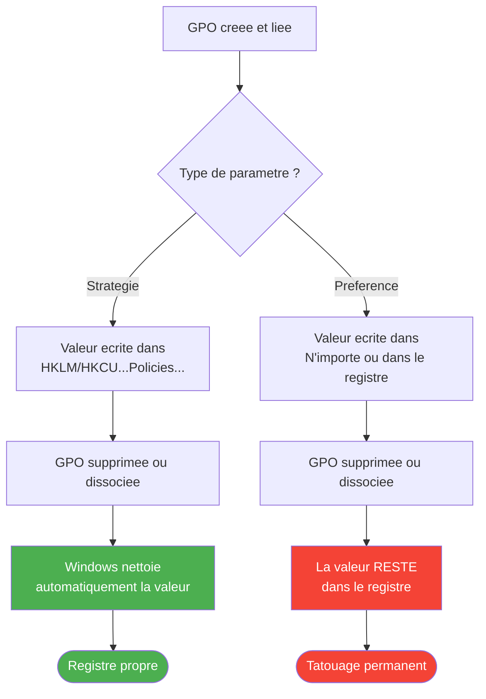

# Les preferences de registre par GPO

!!! abstract "Ce que vous allez apprendre"
    - La difference fondamentale entre une **strategie** (policy) et une **preference** de registre
    - Comment creer une preference de registre dans la console GPMC
    - Les quatre actions disponibles (Creer, Remplacer, Mettre a jour, Supprimer) et quand utiliser chacune
    - Le ciblage par element (Item-Level Targeting) pour appliquer une preference a un sous-ensemble precis de machines ou d'utilisateurs
    - L'effet "tatouage" des preferences et comment l'eviter

---

## Policies vs Preferences : deux mondes differents

Jusqu'ici dans ce livre, on a travaille avec des **strategies** (policies). Ce sont les parametres classiques que l'on trouve dans `Modeles d'administration` quand on edite une GPO. Vous avez configure des parametres de securite, impose des fonds d'ecran, ajuste Windows Update...

Mais il existe un deuxieme monde, moins connu des debutants : les **preferences**. Elles sont apparues avec Windows Server 2008, et elles ont revolutionne la facon dont les administrateurs deploient des configurations.

La confusion entre strategies et preferences est l'une des erreurs les plus frequentes chez les administrateurs juniors. Ce chapitre va dissiper cette confusion une bonne fois pour toutes.

### L'analogie des regles et des post-it

Imaginez un bureau dans une entreprise.

:material-gavel: **Les strategies (policies)**, ce sont des **regles gravees dans le marbre**. Le directeur a fait poser une plaque en metal sur le mur : *"Port du badge obligatoire"*. Tant que la plaque est la, tout le monde obeit. Si un jour on decroche la plaque, la regle disparait. Plus personne n'est oblige de porter le badge.

:material-note-text: **Les preferences**, ce sont des **post-it colles sur le bureau**. Quelqu'un a ecrit au feutre : *"Penser a eteindre la lumiere en partant"*. C'est une suggestion. Vous pouvez l'ignorer. Et surtout : **meme si la personne qui a colle le post-it quitte l'entreprise, le post-it reste colle sur le bureau**.

Cette difference est **capitale**. Relisez-la si necessaire.

### Tableau comparatif

| Aspect | :material-gavel: Strategies (Policies) | :material-note-text: Preferences |
|:-------|:--------------------------------------|:--------------------------------|
| **Emplacement dans le registre** | `HKLM\SOFTWARE\Policies\...` ou `HKCU\SOFTWARE\Policies\...` | N'importe ou dans le registre |
| **Comportement a la suppression de la GPO** | Le parametre est **supprime** | Le parametre **reste** (tatouage) |
| **L'utilisateur peut modifier ?** | Non (option grisee dans l'interface) | Oui, mais la GPO la remet au prochain cycle |
| **Ciblage avance (ILT)** | Non | Oui |
| **Modeles ADMX requis ?** | Oui | Non |
| **Types de donnees configurables** | Limites aux parametres prevus par le modele | Toutes les valeurs de registre possibles |

!!! info "Les branches Policies du registre"
    Si vous avez lu le livre *Le Registre pour les Nuls*, vous savez que les branches `HKLM\SOFTWARE\Policies` et `HKCU\SOFTWARE\Policies` sont des zones speciales du registre. Windows sait que tout ce qui se trouve dans ces branches est "gouverne" par une GPO. Quand la GPO est supprimee, Windows nettoie automatiquement ces branches. Les preferences, elles, ecrivent dans les branches **normales** du registre -- et Windows ne les nettoie pas.

### Le cycle de vie en image

Le diagramme ci-dessous montre ce qui se passe quand on lie une GPO, puis quand on la supprime, pour chacun des deux mecanismes :



!!! warning "Le piege du debutant"
    Beaucoup de debutants pensent : "Je supprime la GPO, donc le parametre disparait." C'est vrai pour les **strategies**. C'est **faux** pour les **preferences**. On reviendra en detail sur ce "tatouage" plus loin dans ce chapitre.

!!! quote "En resume"
    - Les **strategies** (policies) ecrivent dans les branches `Policies` du registre. Elles sont imposees, non modifiables par l'utilisateur, et disparaissent quand la GPO est supprimee.
    - Les **preferences** ecrivent n'importe ou dans le registre. Elles sont modifiables par l'utilisateur (mais remises au prochain cycle), et **restent** meme si la GPO est supprimee.
    - Les preferences offrent le **ciblage avance** (ILT), que les strategies n'ont pas.
    - Confondre les deux est l'une des erreurs les plus courantes chez les administrateurs juniors.

---

## Ou trouver les preferences dans GPMC ?

Ouvrez la console GPMC (`gpmc.msc`), faites un clic droit sur une GPO et choisissez **Modifier**. L'editeur de strategie de groupe s'ouvre.

### Le chemin exact

Les preferences de registre se trouvent a deux endroits, selon que vous ciblez l'ordinateur ou l'utilisateur :

- :material-desktop-tower: **Configuration ordinateur** → Preferences → Parametres Windows → **Registre**
- :material-account: **Configuration utilisateur** → Preferences → Parametres Windows → **Registre**

Attention a ne pas confondre avec le chemin des strategies :

- :material-gavel: **Configuration ordinateur** → **Modeles d'administration** → ... (ce sont les strategies)
- :material-note-text: **Configuration ordinateur** → **Preferences** → **Parametres Windows** → Registre (ce sont les preferences)

Les deux chemins se trouvent dans le meme editeur, mais ils menent a des mecanismes completement differents. Si vous ne voyez pas le noeud `Preferences`, verifiez que vous editez bien une GPO de domaine (via GPMC) et non la strategie locale (via `gpedit.msc`).

### Les autres categories de preferences

Le noeud **Preferences** ne contient pas que le registre. Voici un apercu rapide des autres categories disponibles :

| Categorie | Ce qu'elle permet |
|:----------|:-----------------|
| :material-application-variable: Variables d'environnement | Definir ou modifier des variables d'environnement (`%TEMP%`, variables personnalisees...) |
| :material-file-document: Fichiers | Copier, remplacer ou supprimer des fichiers |
| :material-folder: Dossiers | Creer, supprimer ou modifier des dossiers |
| :material-link-variant: Raccourcis | Creer des raccourcis sur le bureau ou dans le menu Demarrer |
| :material-registry: Registre | Creer, modifier ou supprimer des valeurs de registre |
| :material-harddisk: Lecteurs mappes | Connecter des lecteurs reseau |
| :material-printer: Imprimantes | Deployer des imprimantes |
| :material-cog: Services | Configurer le demarrage des services Windows |

Ce chapitre se concentre uniquement sur les **preferences de registre**. Les autres categories suivent la meme logique (actions, ciblage, tatouage) mais avec des interfaces differentes.

!!! info "Les Parametres du Panneau de configuration aussi"
    En plus de `Parametres Windows`, vous trouverez un deuxieme sous-noeud sous Preferences : **Parametres du Panneau de configuration**. Il contient des preferences pour les sources de donnees, les peripheriques, les options de dossier, les options Internet, les taches planifiees, etc. Ce sont des categories supplementaires avec la meme logique, mais une interface graphique dediee plutot qu'un acces direct au registre.

!!! tip "Comment distinguer strategies et preferences dans l'editeur ?"
    Dans l'arborescence de l'editeur GPO, les **strategies** se trouvent sous `Modeles d'administration` (et les autres noeuds au meme niveau). Les **preferences** se trouvent sous le noeud `Preferences`, clairement separe. Si vous ne voyez pas le noeud `Preferences`, vous utilisez peut-etre `gpedit.msc` (editeur local) sur une version ancienne de Windows -- les preferences ne sont disponibles que dans l'editeur de GPO de domaine (GPMC) ou sur les versions recentes de Windows.

!!! quote "En resume"
    - Les preferences de registre se trouvent dans **Configuration ordinateur** (ou utilisateur) → **Preferences** → **Parametres Windows** → **Registre**.
    - Le noeud Preferences contient d'autres categories (fichiers, dossiers, raccourcis, etc.) qui ne sont pas couvertes dans ce chapitre.
    - Ne confondez pas le noeud **Preferences** avec les **Modeles d'administration** : ce sont deux mecanismes differents.

---

## Creer une preference de registre

Passons a la pratique. On va creer une preference de registre etape par etape.

!!! example "Pas a pas"
    **Objectif :** creer une preference de registre qui definit une valeur dans `HKEY_CURRENT_USER`.

    1. Ouvrez la console GPMC (`gpmc.msc`).
    2. Faites un clic droit sur la GPO que vous souhaitez modifier → **Modifier**.
    3. Dans l'editeur, naviguez vers :
       **Configuration utilisateur** → **Preferences** → **Parametres Windows** → **Registre**.
    4. Faites un clic droit sur **Registre** → **Nouveau** → **Element Registre**.
    5. La fenetre **Nouvelles proprietes du Registre** s'ouvre. Remplissez les champs :

        | Champ | Description |
        |:------|:-----------|
        | **Action** | Choisissez parmi : Creer, Remplacer, Mettre a jour, Supprimer (on detaille chacune juste apres) |
        | **Ruche** | La ruche de registre cible : `HKEY_CURRENT_USER`, `HKEY_LOCAL_MACHINE`, etc. |
        | **Chemin de la cle** | Le chemin complet de la cle (sans la ruche). Exemple : `Software\MonApplication` |
        | **Nom de la valeur** | Le nom de la valeur de registre a creer ou modifier |
        | **Type de valeur** | Le type de donnees : `REG_SZ`, `REG_DWORD`, `REG_EXPAND_SZ`, etc. |
        | **Donnees de la valeur** | La valeur a ecrire |

    6. Cliquez sur **OK** pour valider.

C'est tout. La preference sera appliquee au prochain cycle de rafraichissement des GPO (environ toutes les 90 minutes) ou au prochain redemarrage / ouverture de session.

Pour forcer l'application immediate sans attendre le prochain cycle, utilisez la commande suivante dans un terminal administrateur sur le poste cible :

```powershell
# Force an immediate GPO refresh
gpupdate /force
```

!!! tip "Astuce : le bouton Parcourir"
    Dans la fenetre de proprietes, vous pouvez utiliser le bouton **...** (Parcourir) a cote du champ "Chemin de la cle" pour naviguer dans le registre distant d'une machine du domaine. C'est tres pratique pour eviter les fautes de frappe dans le chemin.

!!! warning "Ordinateur vs Utilisateur : le bon noeud"
    Si votre preference cible `HKEY_LOCAL_MACHINE`, placez-la sous **Configuration ordinateur**. Si elle cible `HKEY_CURRENT_USER`, placez-la sous **Configuration utilisateur**. Mettre une preference `HKCU` sous Configuration ordinateur ne produira pas le resultat attendu -- la valeur ne sera pas ecrite dans la ruche de l'utilisateur connecte.

!!! quote "En resume"
    - Creer une preference de registre prend moins d'une minute : clic droit → Nouveau → Element Registre.
    - Les six champs a remplir sont : **Action**, **Ruche**, **Chemin**, **Nom**, **Type** et **Donnees**.
    - La preference s'applique au prochain cycle de rafraichissement GPO.

---

## Les quatre actions

Quand vous creez un element de registre, le premier champ a renseigner est l'**Action**. Il y a quatre choix possibles, et choisir le mauvais est une source d'erreur frequente.

### :material-plus-circle: Creer

L'action **Creer** ecrit la valeur de registre **uniquement si elle n'existe pas deja**.

Si la valeur existe deja (avec une autre donnee, ou le meme type), la preference **ne fait rien**. Elle passe son tour silencieusement.

**Quand l'utiliser ?** Quand vous voulez definir une valeur par defaut sans ecraser une configuration existante. Par exemple, definir un parametre par defaut pour une nouvelle application, mais sans toucher aux postes ou l'application a deja ete configuree manuellement.

### :material-swap-horizontal: Remplacer

L'action **Remplacer** est plus agressive. Elle **supprime** la valeur existante (si elle existe), puis la **recree** avec les nouvelles donnees.

Si la valeur n'existe pas, elle la cree quand meme.

**Quand l'utiliser ?** Quand vous voulez etre certain que la valeur a exactement les donnees que vous definissez, en ecrasant tout ce qui existait avant. C'est l'option "table rase".

### :material-update: Mettre a jour (recommandee)

L'action **Mettre a jour** est la plus polyvalente :

- Si la valeur **n'existe pas**, elle la **cree**.
- Si la valeur **existe deja**, elle la **met a jour** avec les nouvelles donnees.

C'est le meilleur des deux mondes. Elle ne rate jamais sa cible.

**Quand l'utiliser ?** Dans la grande majorite des cas. C'est l'action recommandee par defaut. Si vous hesitez entre les quatre actions, choisissez **Mettre a jour**. Vous ne pouvez pas vous tromper avec cette action (sauf si vous ne voulez explicitement pas ecraser une valeur existante).

### :material-delete: Supprimer

L'action **Supprimer** fait exactement ce que son nom suggere : elle **supprime** la valeur de registre ciblee. Si la valeur n'existe pas, la preference ne fait rien.

Vous pouvez aussi supprimer une **cle entiere** (et toutes ses sous-cles et valeurs) en cochant l'option appropriee.

**Quand l'utiliser ?** Pour nettoyer des valeurs de registre obsoletes, ou pour annuler l'effet d'une preference precedente (rappelez-vous le tatouage).

### L'analogie du coffre-fort

Pour memoriser les quatre actions, imaginez un coffre-fort dans lequel vous voulez deposer un document :

- :material-plus-circle: **Creer** : vous deposez le document **seulement si** le coffre est vide. S'il y a deja quelque chose dedans, vous repartez sans rien faire.
- :material-swap-horizontal: **Remplacer** : vous videz completement le coffre, puis vous deposez votre document. Peu importe ce qu'il y avait avant.
- :material-update: **Mettre a jour** : vous deposez votre document. Si le coffre est vide, parfait. S'il y a deja un document, vous le remplacez par le votre. Dans les deux cas, le resultat est le meme.
- :material-delete: **Supprimer** : vous videz le coffre et vous repartez les mains vides.

### Tableau recapitulatif

| Action | La valeur n'existe pas | La valeur existe deja | Cas d'usage typique |
|:-------|:----------------------|:---------------------|:-------------------|
| :material-plus-circle: **Creer** | Cree la valeur | Ne fait rien | Definir un defaut sans ecraser |
| :material-swap-horizontal: **Remplacer** | Cree la valeur | Supprime puis recree | Forcer une valeur precise ("table rase") |
| :material-update: **Mettre a jour** | Cree la valeur | Met a jour la donnee | Usage general, **recommande** |
| :material-delete: **Supprimer** | Ne fait rien | Supprime la valeur | Nettoyage, annulation de tatouage |

!!! danger "Le piege de l'action Creer"
    Si vous utilisez **Creer** et que la valeur existe deja, la preference ne s'appliquera pas. Et vous n'aurez aucun message d'erreur. Vous chercherez pendant des heures pourquoi "la GPO ne marche pas". Dans le doute, utilisez **Mettre a jour**.

!!! quote "En resume"
    - Il existe quatre actions : **Creer**, **Remplacer**, **Mettre a jour** et **Supprimer**.
    - **Mettre a jour** est l'action recommandee dans la grande majorite des cas car elle cree la valeur si elle n'existe pas et la met a jour si elle existe.
    - L'action **Creer** est un piege classique : elle ne fait rien si la valeur existe deja.
    - L'action **Supprimer** est utile pour nettoyer les effets de tatouage.

---

## Le ciblage par element (Item-Level Targeting)

Voici l'une des fonctionnalites les plus puissantes des preferences, et qui n'existe **pas** pour les strategies classiques.

### Le probleme

Imaginez cette situation : vous avez une GPO liee a l'OU "Tous les postes". Mais vous voulez qu'une preference de registre ne s'applique qu'aux **PC du service comptabilite**. Ou uniquement aux machines sous **Windows 11**. Ou seulement si le PC a une **adresse IP dans la plage 10.0.1.x**.

Avec une strategie classique, vous seriez oblige de creer une OU separee et d'y deplacer les objets. Avec les preferences, vous pouvez utiliser le **ciblage par element** (Item-Level Targeting, ou ILT).

### Comment activer le ciblage

1. Dans la fenetre de proprietes de l'element de registre, allez dans l'onglet **Commun**.
2. Cochez la case **Ciblage au niveau de l'element**.
3. Cliquez sur le bouton **Ciblage...** qui apparait.
4. La fenetre de l'editeur de ciblage s'ouvre. Cliquez sur **Nouvel element** pour ajouter une condition.

### Les conditions disponibles

Voici les conditions de ciblage les plus utiles pour un debutant :

| Condition | Ce qu'elle filtre | Exemple |
|:----------|:-----------------|:--------|
| :material-account-group: **Groupe de securite** | L'utilisateur ou l'ordinateur est membre d'un groupe AD | Appliquer uniquement aux membres de `GRP-PC-Comptabilite` |
| :material-microsoft-windows: **Systeme d'exploitation** | La version de Windows du poste | Appliquer uniquement sur Windows 11 |
| :material-ip-network: **Plage d'adresses IP** | L'adresse IP du poste | Appliquer uniquement aux postes en 10.0.1.0/24 |
| :material-application-variable: **Variable d'environnement** | La valeur d'une variable d'environnement | Appliquer uniquement si `%COMPUTERNAME%` commence par `PC-COMPTA` |
| :material-database-search: **Requete WMI** | Le resultat d'une requete WMI personnalisee | Appliquer uniquement aux PC portables (requete sur le type de chassis) |
| :material-registry: **Correspondance du Registre** | La presence ou la valeur d'une cle de registre | Appliquer uniquement si une application est installee |

!!! info "Combiner les conditions"
    Vous pouvez ajouter **plusieurs conditions** et les combiner avec des operateurs logiques :

    - **ET** (toutes les conditions doivent etre vraies)
    - **OU** (au moins une condition doit etre vraie)
    - **NON** (inverser une condition)

    Exemple : appliquer la preference si le PC est dans le groupe `GRP-PC-Comptabilite` **ET** sous Windows 11.

### Exemple concret : cibler un groupe

Supposons que vous voulez appliquer une preference de registre uniquement aux ordinateurs membres du groupe `GRP-PC-Comptabilite` :

1. Dans l'onglet **Commun** de l'element de registre, cochez **Ciblage au niveau de l'element**.
2. Cliquez sur **Ciblage...**
3. Cliquez sur **Nouvel element** → **Groupe de securite**.
4. Cliquez sur **...** (Parcourir) et selectionnez le groupe `GRP-PC-Comptabilite`.
5. Assurez-vous que l'option **L'ordinateur est dans le groupe** est selectionnee (et non "L'utilisateur").
6. Cliquez sur **OK** deux fois pour valider.

La preference ne s'appliquera desormais qu'aux ordinateurs qui sont membres de ce groupe. Tous les autres postes dans l'OU seront ignores pour cet element.

### Exemple concret : cibler un systeme d'exploitation

Vous voulez deployer une valeur de registre uniquement sur les postes sous **Windows 11** (par exemple, un parametre specifique a Windows 11 qui n'existe pas sur Windows 10) :

1. Dans l'onglet **Commun**, cochez **Ciblage au niveau de l'element**.
2. Cliquez sur **Ciblage...**
3. Cliquez sur **Nouvel element** → **Systeme d'exploitation**.
4. Dans la liste deroulante **Produit**, selectionnez **Windows 11**.
5. Cliquez sur **OK** deux fois.

Les postes sous Windows 10 ignoreront completement cet element de preference. Aucune erreur, aucun message -- ils passent simplement leur tour.

### Les requetes WMI : pour les cas avances

La condition **Requete WMI** est la plus puissante, mais aussi la plus technique. Elle permet de filtrer sur pratiquement n'importe quelle caracteristique du poste : type de chassis (portable vs fixe), taille de la RAM, modele du processeur, etc.

Par exemple, pour cibler uniquement les **PC portables** :

```sql
SELECT * FROM Win32_SystemEnclosure WHERE ChassisTypes = '9' OR ChassisTypes = '10' OR ChassisTypes = '14'
```

Ne vous inquietez pas si le WMI vous semble opaque pour l'instant. Les conditions les plus courantes (groupe de securite, systeme d'exploitation, plage IP) couvrent 90% des besoins. Vous n'aurez recours au WMI que dans des cas tres specifiques.

!!! tip "ILT vs filtrage de securite"
    Le ciblage ILT et le filtrage de securite (vu au chapitre 5) sont deux mecanismes differents. Le **filtrage de securite** s'applique a toute la GPO. Le **ciblage ILT** s'applique a un **element** individuel de preference. On peut avoir une GPO qui contient 10 preferences, dont chacune a un ciblage ILT different. C'est beaucoup plus granulaire.

!!! quote "En resume"
    - Le **ciblage par element** (ILT) permet d'appliquer une preference uniquement si certaines conditions sont remplies.
    - Les conditions les plus courantes : groupe de securite, systeme d'exploitation, plage IP, variable d'environnement.
    - On peut combiner plusieurs conditions avec des operateurs **ET**, **OU** et **NON**.
    - Le ciblage ILT s'applique **element par element**, contrairement au filtrage de securite qui s'applique a toute la GPO.
    - Cette fonctionnalite est **exclusive aux preferences** -- les strategies classiques ne l'ont pas.

---

## Le tatouage : pourquoi les preferences restent

C'est LE concept le plus important de ce chapitre. Si vous ne devez retenir qu'une seule chose, c'est celle-ci.

### Le probleme en deux phrases

Quand vous supprimez ou dissociez une GPO, les **strategies** disparaissent du registre. Les **preferences** restent.

C'est ce qu'on appelle l'effet **tatouage** (*tattoo effect* en anglais).

### Pourquoi ca se passe comme ca ?

C'est une question de **ou** les donnees sont ecrites.

Les strategies ecrivent dans les branches protegees du registre :

- `HKLM\SOFTWARE\Policies\...`
- `HKCU\SOFTWARE\Policies\...`

Windows sait que tout ce qui est dans ces branches est "gouverne" par une GPO. Quand la GPO est supprimee, le moteur GPO fait le menage automatiquement dans ces branches.

Les preferences, en revanche, ecrivent dans les branches **normales** du registre :

- `HKCU\Software\Microsoft\Windows\CurrentVersion\...`
- `HKLM\SOFTWARE\MonApplication\...`
- N'importe quel autre chemin que vous definissez

Windows ne sait pas que ces valeurs viennent d'une GPO. Elles ressemblent exactement a des valeurs ecrites manuellement. Quand la GPO est supprimee, Windows ne touche a rien -- il n'a aucun moyen de savoir que ces valeurs etaient gerees par une preference.

### L'analogie du tatouage

C'est comme un vrai tatouage sur la peau.

:material-gavel: Une **strategie**, c'est un bracelet temporaire de festival. Quand le festival est fini (la GPO est supprimee), vous enlevez le bracelet et il ne reste aucune trace.

:material-note-text: Une **preference**, c'est un tatouage. Meme si vous quittez le festival (la GPO est supprimee), le tatouage reste sur votre bras. Pour l'enlever, il faut une intervention specifique (laser, c'est-a-dire une action de suppression).

### Comment eviter le tatouage ?

Deux solutions :

**Solution 1 : l'option "Supprimer cet element quand il ne s'applique plus"**

Dans l'onglet **Commun** de chaque element de preference, il existe une case a cocher : **Supprimer cet element quand il ne s'applique plus**. Si vous cochez cette case, la valeur de registre sera automatiquement supprimee quand la GPO est dissociee ou quand le ciblage ILT ne correspond plus.

C'est la methode recommandee. Prenez l'habitude de cocher cette case systematiquement.

**Solution 2 : creer une preference de suppression**

Si le tatouage est deja la (vous avez oublie de cocher la case, ou l'ancien administrateur ne l'avait pas fait), vous pouvez creer un nouvel element de registre avec l'action **Supprimer** qui cible la meme valeur. Deployez cette preference temporairement, attendez un cycle de rafraichissement, puis supprimez-la.

### Verifier si un tatouage existe

Pour savoir si une valeur de registre est un "tatouage" laisse par une ancienne preference, la methode la plus simple est de verifier avec PowerShell :

```powershell
# Check if a suspicious registry value exists outside the Policies branch
Get-ItemProperty -Path "HKCU:\Software\Microsoft\Windows\CurrentVersion\Internet Settings" -Name "ProxyServer" -ErrorAction SilentlyContinue
```

Si la valeur existe et qu'aucune GPO active ne la gere (verifiez avec `gpresult /r`), c'est probablement un tatouage.

### Le tableau avant/apres

| Scenario | Avant suppression de la GPO | Apres suppression de la GPO |
|:---------|:---------------------------|:---------------------------|
| Strategie qui definit le proxy | Proxy configure, parametre grise | Proxy supprime, parametres redeviennent editables |
| Preference qui definit le proxy (sans case cochee) | Proxy configure, parametre editable | Proxy **toujours configure** (tatouage) |
| Preference qui definit le proxy (avec case cochee) | Proxy configure, parametre editable | Proxy supprime |

!!! danger "L'erreur qui fait perdre des heures"
    Scenario classique du tatouage en action :

    1. L'administrateur cree une preference pour definir le proxy a `proxy.entreprise.fr:8080`.
    2. Deux mois plus tard, l'entreprise change de proxy. L'administrateur **supprime** la GPO.
    3. Il cree une nouvelle GPO avec le nouveau proxy.
    4. Resultat : **certains postes gardent l'ancien proxy**. Ceux qui n'ont pas encore recu la nouvelle GPO sont bloques.
    5. L'administrateur passe 3 heures a comprendre pourquoi "certains postes ne passent pas sur le nouveau proxy".

    La bonne methode : **modifier** la preference existante au lieu de supprimer et recreer la GPO. Ou utiliser la case "Supprimer cet element quand il ne s'applique plus".

!!! quote "En resume"
    - Les preferences ecrivent dans les branches **normales** du registre, pas dans les branches `Policies`. Windows ne les nettoie donc pas automatiquement.
    - C'est l'effet **tatouage** : la valeur reste meme apres la suppression de la GPO.
    - Pour eviter le tatouage, cochez la case **"Supprimer cet element quand il ne s'applique plus"** dans l'onglet Commun.
    - Pour nettoyer un tatouage existant, creez un element de registre avec l'action **Supprimer**.

---

## Trois exemples pratiques

Passons a trois cas concrets que vous rencontrerez frequemment en entreprise. Chaque exemple suit le meme schema : contexte, configuration, verification.

!!! info "Prerequis"
    Pour ces exemples, vous devez disposer d'un environnement Active Directory avec la console GPMC. Si vous n'avez pas encore cree d'OU de test, relisez le [chapitre 5](05-premiere-gpo.md). Pour les bases du registre (ruches, types de valeurs, navigation), consultez le livre *Le Registre pour les Nuls*.

Chaque exemple suit le meme schema en quatre etapes :

1. **Contexte** : pourquoi on fait ca
2. **Configuration** : les valeurs exactes a saisir (sous forme de tableau)
3. **Pas a pas** : les clics dans GPMC
4. **Verification** : la commande PowerShell pour confirmer que ca fonctionne

---

### :material-web: Exemple 1 : Definir la page d'accueil de Microsoft Edge

**Contexte :** Vous souhaitez que tous les navigateurs Edge de l'entreprise s'ouvrent sur le portail intranet `https://intranet.entreprise.fr`. Vous preferez utiliser une preference plutot qu'une strategie car vous voulez que les utilisateurs puissent modifier cette page d'accueil s'ils le souhaitent.

**Configuration de la preference :**

| Champ | Valeur |
|:------|:-------|
| **Action** | Mettre a jour |
| **Ruche** | `HKEY_LOCAL_MACHINE` |
| **Chemin de la cle** | `SOFTWARE\Policies\Microsoft\Edge` |
| **Nom de la valeur** | `HomepageLocation` |
| **Type de valeur** | `REG_SZ` |
| **Donnees de la valeur** | `https://intranet.entreprise.fr` |

!!! example "Pas a pas"
    1. Ouvrez GPMC → clic droit sur votre GPO → **Modifier**.
    2. Naviguez vers **Configuration ordinateur** → **Preferences** → **Parametres Windows** → **Registre**.
    3. Clic droit → **Nouveau** → **Element Registre**.
    4. Renseignez les champs selon le tableau ci-dessus.
    5. Dans l'onglet **Commun**, cochez **Supprimer cet element quand il ne s'applique plus**.
    6. Cliquez sur **OK**.

**Verification :** Apres un `gpupdate /force` sur le poste cible, ouvrez PowerShell et executez :

```powershell
# Verify the Edge homepage registry value
Get-ItemProperty -Path "HKLM:\SOFTWARE\Policies\Microsoft\Edge" -Name "HomepageLocation" -ErrorAction SilentlyContinue
```

Le resultat doit afficher `https://intranet.entreprise.fr`. Si la commande ne retourne rien, verifiez que le `gpupdate /force` a bien ete execute et que la GPO est bien liee a l'OU contenant le poste.

!!! tip "Edge : strategie ou preference ?"
    Pour Edge specifiquement, Microsoft fournit des modeles ADMX dedies qui offrent des **strategies** completes. Dans un environnement de production, vous utiliserez probablement les ADMX plutot qu'une preference manuelle. Cet exemple est avant tout pedagogique pour comprendre le mecanisme.

!!! quote "En resume"
    - La page d'accueil Edge peut etre configuree via une preference de registre dans `HKLM\SOFTWARE\Policies\Microsoft\Edge`.
    - L'action **Mettre a jour** garantit que la valeur sera creee ou mise a jour.
    - Pensez a cocher **Supprimer cet element quand il ne s'applique plus** pour eviter le tatouage.

---

### :material-earth: Exemple 2 : Configurer un proxy

**Contexte :** L'entreprise utilise un proxy pour l'acces Internet. Vous devez configurer automatiquement les parametres proxy sur tous les postes utilisateurs.

**Configuration de la preference :** Cet exemple necessite **trois** elements de registre dans la meme GPO.

**Element 1 : Activer le proxy**

| Champ | Valeur |
|:------|:-------|
| **Action** | Mettre a jour |
| **Ruche** | `HKEY_CURRENT_USER` |
| **Chemin de la cle** | `Software\Microsoft\Windows\CurrentVersion\Internet Settings` |
| **Nom de la valeur** | `ProxyEnable` |
| **Type de valeur** | `REG_DWORD` |
| **Donnees de la valeur** | `1` |

**Element 2 : Definir l'adresse du proxy**

| Champ | Valeur |
|:------|:-------|
| **Action** | Mettre a jour |
| **Ruche** | `HKEY_CURRENT_USER` |
| **Chemin de la cle** | `Software\Microsoft\Windows\CurrentVersion\Internet Settings` |
| **Nom de la valeur** | `ProxyServer` |
| **Type de valeur** | `REG_SZ` |
| **Donnees de la valeur** | `proxy.entreprise.fr:8080` |

**Element 3 : Definir les exceptions (sites locaux qui ne passent pas par le proxy)**

| Champ | Valeur |
|:------|:-------|
| **Action** | Mettre a jour |
| **Ruche** | `HKEY_CURRENT_USER` |
| **Chemin de la cle** | `Software\Microsoft\Windows\CurrentVersion\Internet Settings` |
| **Nom de la valeur** | `ProxyOverride` |
| **Type de valeur** | `REG_SZ` |
| **Donnees de la valeur** | `*.entreprise.fr;10.*;192.168.*;<local>` |

!!! example "Pas a pas"
    1. Ouvrez GPMC → clic droit sur votre GPO → **Modifier**.
    2. Naviguez vers **Configuration utilisateur** → **Preferences** → **Parametres Windows** → **Registre**.
    3. Creez le premier element (ProxyEnable) : clic droit → **Nouveau** → **Element Registre**, remplissez selon le tableau Element 1.
    4. Repetez pour le deuxieme element (ProxyServer) et le troisieme (ProxyOverride).
    5. Dans l'onglet **Commun** de chaque element, cochez **Supprimer cet element quand il ne s'applique plus**.
    6. Cliquez sur **OK** pour chaque element.

**Verification :**

```powershell
# Verify proxy settings in the current user registry
Get-ItemProperty -Path "HKCU:\Software\Microsoft\Windows\CurrentVersion\Internet Settings" |
    Select-Object ProxyEnable, ProxyServer, ProxyOverride
```

!!! warning "Attention au type REG_DWORD vs REG_SZ"
    `ProxyEnable` est un **REG_DWORD** (valeur numerique : 0 ou 1). `ProxyServer` et `ProxyOverride` sont des **REG_SZ** (chaines de texte). Si vous inversez les types, la preference s'appliquera sans erreur, mais le proxy ne fonctionnera pas. C'est une erreur tres difficile a diagnostiquer parce qu'aucun message d'erreur n'apparait.

!!! quote "En resume"
    - La configuration proxy necessite **trois valeurs** dans `HKCU\Software\Microsoft\Windows\CurrentVersion\Internet Settings` : `ProxyEnable`, `ProxyServer` et `ProxyOverride`.
    - Faites tres attention aux **types de donnees** : `REG_DWORD` pour l'activation, `REG_SZ` pour les adresses.
    - Placez ces preferences en **Configuration utilisateur** car les parametres proxy sont propres a chaque session utilisateur.

---

### :material-microsoft-edge: Exemple 3 : Desactiver la premiere execution de Edge

**Contexte :** A chaque premiere ouverture de Microsoft Edge sur un nouveau profil, une serie d'ecrans de bienvenue s'affiche : choix du navigateur par defaut, importation de favoris, configuration de la page d'accueil... Sur un parc de 500 postes, c'est 500 appels au support parce que les utilisateurs ne savent pas quoi repondre.

Vous voulez supprimer ces ecrans automatiquement.

**Configuration de la preference :**

| Champ | Valeur |
|:------|:-------|
| **Action** | Mettre a jour |
| **Ruche** | `HKEY_LOCAL_MACHINE` |
| **Chemin de la cle** | `SOFTWARE\Policies\Microsoft\Edge` |
| **Nom de la valeur** | `HideFirstRunExperience` |
| **Type de valeur** | `REG_DWORD` |
| **Donnees de la valeur** | `1` |

!!! example "Pas a pas"
    1. Ouvrez GPMC → clic droit sur votre GPO → **Modifier**.
    2. Naviguez vers **Configuration ordinateur** → **Preferences** → **Parametres Windows** → **Registre**.
    3. Clic droit → **Nouveau** → **Element Registre**.
    4. Renseignez les champs selon le tableau ci-dessus.
    5. Dans l'onglet **Commun**, cochez **Supprimer cet element quand il ne s'applique plus**.
    6. Cliquez sur **OK**.

**Verification :**

```powershell
# Verify the Edge first-run experience is disabled
Get-ItemProperty -Path "HKLM:\SOFTWARE\Policies\Microsoft\Edge" -Name "HideFirstRunExperience" -ErrorAction SilentlyContinue
```

La valeur doit etre `1`. Au prochain lancement de Edge, l'ecran de premiere execution ne s'affichera plus. Testez en ouvrant Edge : si vous ne voyez plus l'assistant de premiere configuration, c'est que la preference fonctionne.

!!! info "Cette preference est aussi disponible en strategie"
    Si vous avez importe les modeles ADMX de Microsoft Edge, ce parametre est egalement disponible en tant que **strategie** dans : Configuration ordinateur → Modeles d'administration → Microsoft Edge. La strategie a l'avantage de disparaitre proprement quand la GPO est supprimee. La preference, elle, necessite la case "Supprimer cet element quand il ne s'applique plus" pour eviter le tatouage.

!!! quote "En resume"
    - La valeur `HideFirstRunExperience` (REG_DWORD = 1) dans `HKLM\SOFTWARE\Policies\Microsoft\Edge` desactive l'ecran de bienvenue de Edge.
    - C'est un cas classique ou strategie et preference sont toutes les deux possibles -- la strategie (via ADMX) est generalement preferable pour ce type de parametre.
    - Verifiez toujours le resultat avec PowerShell apres un `gpupdate /force`.

---

## Preferences vs Policies : quand utiliser quoi ?

Maintenant que vous connaissez les deux mecanismes, voici un guide de decision rapide.

### Le tableau de decision

| Situation | :material-arrow-right: Utilisez | Pourquoi |
|:----------|:-------------------------------|:---------|
| Parametre de securite critique (mot de passe, pare-feu...) | :material-gavel: **Strategie** | L'utilisateur ne doit pas pouvoir le modifier |
| Configuration qui **doit disparaitre** si la GPO est supprimee | :material-gavel: **Strategie** | Les strategies se nettoient automatiquement |
| Parametre qui **n'existe pas** dans les modeles ADMX | :material-note-text: **Preference** | Les preferences peuvent ecrire n'importe quelle valeur de registre |
| Besoin de **ciblage avance** (ILT) | :material-note-text: **Preference** | Seules les preferences supportent le ciblage par element |
| Configuration d'une **application tierce** | :material-note-text: **Preference** | Les applications tierces n'ont generalement pas de modeles ADMX |
| Parametre que l'utilisateur peut **temporairement modifier** | :material-note-text: **Preference** | Les preferences n'empechent pas la modification manuelle |
| Deploiement d'un parametre sur **un sous-ensemble precis** sans creer d'OU | :material-note-text: **Preference** | Le ciblage ILT evite de multiplier les OU |

### La regle d'or

> **Si un modele ADMX existe pour votre parametre, utilisez la strategie. Sinon, utilisez la preference.**

C'est la regle la plus simple et la plus fiable. Les strategies sont plus propres, plus securisees, et se nettoient automatiquement. Les preferences sont un outil complementaire pour les cas ou les strategies ne suffisent pas.

### Exemple de prise de decision

Vous devez deployer un parametre pour Google Chrome. Voici le raisonnement :

1. **Est-ce que Google fournit des modeles ADMX pour Chrome ?** Oui, ils sont disponibles en telechargement sur le site de Google.
2. **Le parametre que je cherche existe-t-il dans ces modeles ?** Je verifie dans l'editeur GPO apres avoir importe les ADMX.
3. **Si oui** → j'utilise la **strategie** via les Modeles d'administration.
4. **Si non** → j'utilise une **preference** de registre qui ecrit directement dans la branche de Chrome.

Ce raisonnement en trois questions vous guidera a chaque fois.

!!! tip "Verifier si un ADMX existe"
    Avant de creer une preference de registre, faites une recherche rapide dans l'editeur GPO : tapez le nom du parametre dans la barre de recherche (icone :material-magnify:) des Modeles d'administration. Si le parametre existe en strategie, privilegiez-le. Vous pouvez aussi consulter la documentation officielle de l'editeur en question (Microsoft Edge, Google Chrome, Adobe Reader, etc.) qui fournit souvent des fichiers ADMX telechargeables.

!!! quote "En resume"
    - **Strategie** pour la securite, les parametres critiques et quand un modele ADMX existe.
    - **Preference** pour les applications tierces, le ciblage avance et les valeurs de registre "libres".
    - Regle simple : si un ADMX existe, utilisez-le. Sinon, utilisez une preference.

---

## Bonnes pratiques

Avant de parler des erreurs, voici les bonnes habitudes a prendre des le depart.

### :material-numeric-1-circle-outline: Nommez vos elements

Par defaut, chaque element de registre dans une preference porte un nom generique comme "Element Registre". Si votre GPO contient 15 elements, vous ne saurez plus lequel fait quoi.

Dans l'onglet **Commun**, decochez la case **Interrompre le traitement des elements si une erreur se produit sur cet element** et prenez surtout l'habitude de nommer vos elements de maniere descriptive en ajoutant un commentaire dans le champ **Description**. Par exemple : "Proxy - Activer", "Proxy - Adresse", "Edge - Desactiver FirstRun".

### :material-numeric-2-circle-outline: Un GPO par fonction

Ne mettez pas toutes vos preferences dans une seule GPO geante. Creez une GPO par fonction metier :

- `GPO-PREF-Proxy` : les preferences liees au proxy
- `GPO-PREF-Edge` : les preferences liees a Edge
- `GPO-PREF-Comptabilite` : les preferences specifiques au service comptabilite

Cela facilite le diagnostic, la maintenance et le ciblage.

### :material-numeric-3-circle-outline: Documentez le "pourquoi"

Utilisez le champ **Description** de l'onglet Commun pour noter **pourquoi** vous avez cree cette preference. Par exemple : "Demande du service reseau - ticket INC-2024-0456 - proxy obligatoire pour acces Internet". Dans six mois, quand quelqu'un (ou vous-meme) se demandera pourquoi cette preference existe, la reponse sera dans la description.

### :material-numeric-4-circle-outline: Cochez toujours la case anti-tatouage

On l'a deja dit et on le redit : cochez **systematiquement** la case "Supprimer cet element quand il ne s'applique plus" dans l'onglet Commun. Il n'y a quasiment aucune raison de ne pas le faire.

!!! quote "En resume"
    - Nommez et documentez chaque element de preference pour faciliter la maintenance.
    - Creez une GPO par fonction metier, pas une GPO fourre-tout.
    - Utilisez le champ Description pour noter le "pourquoi" (numero de ticket, demande...).
    - Cochez **toujours** la case "Supprimer cet element quand il ne s'applique plus".

---

## Erreurs courantes

Voici les quatre erreurs que l'on retrouve le plus souvent chez les administrateurs qui decouvrent les preferences de registre.

### :material-numeric-1-circle: Oublier le tatouage

C'est l'erreur numero un. L'administrateur cree une preference, la deploie, puis un jour decide de supprimer la GPO en pensant que le parametre va disparaitre.

**Le resultat :** la valeur de registre reste sur tous les postes. Sur des centaines de machines. Et il faut maintenant deployer une **nouvelle** preference avec l'action Supprimer pour nettoyer le tatouage.

**La prevention :** cochez **systematiquement** la case "Supprimer cet element quand il ne s'applique plus" dans l'onglet Commun.

### :material-numeric-2-circle: Utiliser "Creer" au lieu de "Mettre a jour"

L'administrateur choisit l'action **Creer** pour deployer une valeur de registre. Sur les postes neufs, tout fonctionne. Mais sur les postes ou la valeur existait deja (ancienne configuration, modification manuelle...), la preference **ne fait rien**.

**Le resultat :** une partie du parc a la bonne configuration, l'autre garde l'ancienne. L'administrateur cherche un probleme de GPO alors que le probleme est dans le choix de l'action.

**La prevention :** utilisez **Mettre a jour** par defaut. Reservez **Creer** aux cas ou vous voulez explicitement ne pas ecraser une valeur existante.

### :material-numeric-3-circle: Se tromper de type de donnees

L'administrateur ecrit une valeur `REG_SZ` (chaine de texte) la ou l'application attend un `REG_DWORD` (nombre), ou inversement.

**Le resultat :** la valeur est bien presente dans le registre, mais l'application ne la lit pas correctement. Aucun message d'erreur cote GPO, aucun message d'erreur cote application. Le parametre semble "ne pas marcher".

**La prevention :** verifiez toujours le type attendu dans la documentation de l'application. En cas de doute, regardez ce que l'application ecrit elle-meme quand on configure le parametre manuellement (via `regedit` ou PowerShell).

### :material-numeric-4-circle: Oublier de tester le ciblage ILT

L'administrateur configure un ciblage ILT (par exemple, "appliquer uniquement aux membres du groupe GRP-PC-Comptabilite"), mais ne teste pas sur un poste cible. Il decouvre trois jours plus tard que le ciblage ne fonctionne pas parce que les ordinateurs n'ont pas ete ajoutes au bon groupe, ou parce que la condition est inversee.

**Le resultat :** la preference ne s'applique a aucun poste (ou s'applique a tous les postes, ce qui est encore pire).

**La prevention :** testez toujours sur **un seul poste** dans votre OU de test avant de deployer largement. Utilisez `gpresult /r` pour verifier si la preference est bien evaluee. Regardez la section "Extensions Client (CSE)" du rapport -- les preferences de registre doivent y apparaitre.

### :material-numeric-5-circle: Ne pas utiliser l'onglet Commun

L'onglet **Commun** est souvent ignore par les debutants. C'est pourtant la que se trouvent les options les plus importantes :

- **Supprimer cet element quand il ne s'applique plus** (anti-tatouage)
- **Appliquer une seule fois et ne plus reappliquer** (utile pour les valeurs que l'utilisateur doit pouvoir modifier durablement)
- **Ciblage au niveau de l'element** (ILT)
- **Description** (documentation)

Prenez l'habitude de toujours passer par cet onglet avant de cliquer sur OK.

!!! danger "Le combo fatal"
    L'erreur la plus couteuse combine les erreurs 1 et 4 : l'administrateur oublie le ciblage ILT **et** oublie le tatouage. La preference s'applique a **tous** les postes au lieu d'un sous-ensemble, et quand il s'en rend compte et supprime la GPO, la valeur reste sur tous les postes. Il faut alors deployer un nettoyage sur l'ensemble du parc.

!!! quote "En resume"
    - **Erreur 1 :** Oublier le tatouage → cochez "Supprimer cet element quand il ne s'applique plus".
    - **Erreur 2 :** Utiliser Creer au lieu de Mettre a jour → privilegiez toujours Mettre a jour.
    - **Erreur 3 :** Mauvais type de donnees → verifiez dans la documentation ou dans regedit.
    - **Erreur 4 :** Ne pas tester le ciblage ILT → testez sur un seul poste d'abord avec `gpresult /r`.

---

## Recapitulatif du chapitre

Voici un tableau de synthese de tout ce que vous avez appris dans ce chapitre :

| Concept | Ce qu'il faut retenir |
|:--------|:---------------------|
| **Strategies vs Preferences** | Les strategies ecrivent dans les branches `Policies`, sont imposees et disparaissent avec la GPO. Les preferences ecrivent partout, sont modifiables et persistent (tatouage). |
| **Emplacement dans GPMC** | Configuration ordinateur/utilisateur → Preferences → Parametres Windows → Registre |
| **Les 4 actions** | Creer (si absent), Remplacer (table rase), **Mettre a jour** (recommandee), Supprimer (nettoyage) |
| **Ciblage ILT** | Filtrage element par element : groupe, OS, IP, variable d'environnement, WMI |
| **Tatouage** | Les preferences restent apres suppression de la GPO. Cochez "Supprimer cet element quand il ne s'applique plus". |
| **Quand utiliser une preference** | Application tierce sans ADMX, ciblage avance, valeur libre dans le registre |
| **Quand utiliser une strategie** | Securite, parametre critique, ADMX disponible, nettoyage automatique requis |
| **Verification** | `gpupdate /force` puis `Get-ItemProperty` en PowerShell, ou `gpresult /r` pour le diagnostic |

!!! tip "Les trois reflexes a adopter"
    A chaque fois que vous creez une preference de registre, posez-vous ces trois questions :

    1. **Action :** Est-ce que j'ai bien choisi **Mettre a jour** ? (sauf besoin specifique)
    2. **Tatouage :** Est-ce que j'ai coche **"Supprimer cet element quand il ne s'applique plus"** ?
    3. **Test :** Est-ce que j'ai teste sur **un seul poste** avant de deployer ?

    Si la reponse est oui aux trois, vous etes tranquille.

!!! quote "En resume"
    - Les preferences de registre sont un outil **complementaire** aux strategies classiques, pas un remplacement.
    - Elles brillent quand il n'existe pas de modele ADMX, quand on a besoin de ciblage avance, ou quand on veut configurer des applications tierces.
    - Leur talon d'Achille est le **tatouage** : toujours activer la suppression automatique.
    - En cas de doute entre strategie et preference : **si un ADMX existe, utilisez la strategie**.
    - Les trois reflexes avant de valider : action **Mettre a jour**, case **anti-tatouage** cochee, **test** sur un seul poste.

---

### Les commandes de verification essentielles

Voici les commandes PowerShell a garder sous la main pour diagnostiquer vos preferences :

```powershell
# Force GPO refresh and see what happens
gpupdate /force

# Display all applied GPOs for the current user and computer
gpresult /r

# Generate a detailed HTML report of all applied GPOs
gpresult /h C:\Temp\gpo-report.html

# Check a specific registry value
Get-ItemProperty -Path "HKLM:\SOFTWARE\Policies\Microsoft\Edge" -Name "HomepageLocation" -ErrorAction SilentlyContinue

# List all values in a registry key
Get-ItemProperty -Path "HKCU:\Software\Microsoft\Windows\CurrentVersion\Internet Settings"
```

---

!!! tip "Gardez ces commandes a portee de main"
    Copiez ces commandes dans un fichier texte sur votre poste d'administration. Vous les utiliserez a chaque deploiement de preference pour verifier que tout fonctionne avant de deployer largement.

---

:material-arrow-right: Dans le [chapitre 11](11-sauvegarde.md), on verra comment **sauvegarder vos GPO** avant toute modification -- parce que meme les meilleurs administrateurs font des erreurs, et une bonne sauvegarde permet de revenir en arriere en quelques clics.
