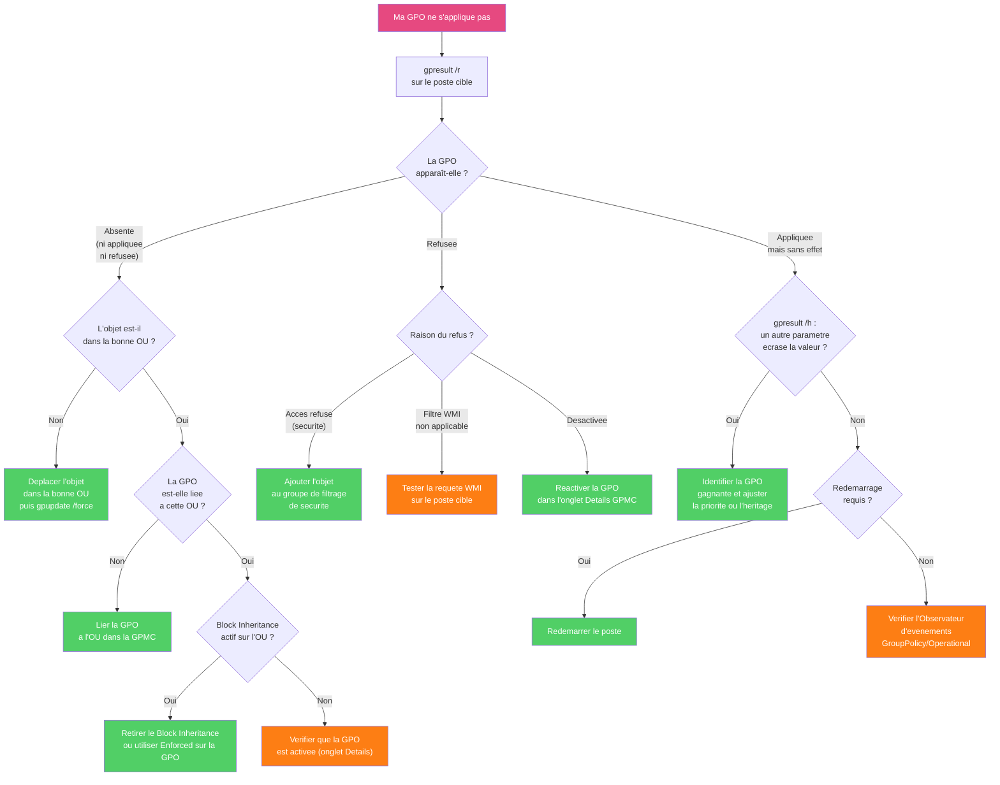

# Mon premier diagnostic GPO

!!! abstract "Ce que vous allez apprendre"
    - Utiliser `gpresult /r` pour obtenir un verdict en 30 secondes
    - Generer et lire le rapport HTML complet avec `gpresult /h`
    - Ouvrir `rsop.msc` pour voir les parametres reellement appliques
    - Identifier les 5 causes les plus courantes d'echec d'une GPO
    - Forcer un rafraichissement et lire les evenements dans l'Observateur d'evenements


!!! tip "Si vous ne retenez qu'une chose"
    Le diagnostic GPO commence toujours par trois questions : qui est ciblé, quelle GPO devait s'appliquer, et où le traitement a échoué.

---

## La question de depart

:material-help-circle-outline: **"Ma GPO ne marche pas."**

C'est la phrase la plus prononcee par les administrateurs Windows debutants. Et la bonne nouvelle : il y a **toujours** une raison. Les GPO n'ont pas de caprices. Elles suivent des regles tres precises.

Imaginez une voiture qui refuse de demarrer. Elle ne refuse pas par mauvaise volonte. Il y a une cause : batterie decharge, panne d'essence, contacteur defectueux. On n'appelle pas un voyant pour "demander a la voiture pourquoi". On suit une **methode de diagnostic** systematique.

C'est exactement pareil avec les GPO.

!!! tip "La regle d'or du diagnostic"
    Ne devinez jamais. Ne supposez jamais. **Cherchez les preuves**. Les outils Windows vous diront exactement ce qui s'est passe, pourquoi, et quand.


!!! quote "En résumé"
    - "Ma GPO ne marche pas.".
    - C'est la phrase la plus prononcee par les administrateurs Windows debutants.
    - Et la bonne nouvelle : il y a toujours une raison.
    - Le point clé de la question de depart doit être relu comme un repère de diagnostic et de conception.
---

## Etape 1 : gpresult /r — le verdict rapide

:material-console: `gpresult` est la commande la plus importante du diagnostic GPO. Elle demande a Windows : "Quelles GPO s'appliquent sur cette machine, pour cet utilisateur ?"

### Comment l'executer

Ouvrez une invite de commandes **en tant qu'administrateur** sur l'ordinateur concerne et tapez :

```cmd
gpresult /r
```

!!! info "En tant que qui ?"
    Si vous voulez le resultat pour **l'utilisateur courant**, lancez la commande en etant connecte en tant que cet utilisateur.

    Si vous voulez le resultat pour un **autre utilisateur** depuis un compte admin, ajoutez le parametre `/user` :

    ```cmd
    gpresult /r /user contoso\jean.dupont
    ```

### Lire le resultat

La sortie de `gpresult /r` est divisee en deux grandes sections. Voici ce qu'elle ressemble sur un poste de domaine :

```cmd title="Resultat attendu"
Microsoft (R) Windows (R) Operating System Group Policy Result tool v2.0
Copyright (C) Microsoft Corporation. All rights reserved.

Cree le 05/04/2026 a 09:14:32


INFORMATIONS DU SYSTEME
-----------------------
Nom de l'ordinateur :    PC-DUPONT
Nom du domaine :         contoso.local
Site :                   Default-First-Site-Name
Type de systeme d'exploitation : Microsoft Windows 11 Professionnel
Version du systeme d'exploitation : 10.0.22631
Nom du controleur de domaine :  \\DC01.contoso.local
Heure du dernier traitement des strategies de groupe : 05/04/2026 a 08:47:18


PARAMETRES DE L'ORDINATEUR
---------------------------
Nom CN :                 CN=PC-DUPONT,OU=Postes,OU=Paris,DC=contoso,DC=local

Objets de strategie de groupe appliques
-----------------------------------------
    Default Domain Policy
    SEC-Postes-BaselineSecurite
    CFG-WindowsUpdate-Mensuel

Objets de strategie de groupe refuses
---------------------------------------
    GPO-Test-FondEcran
        Filtrage : Acces refuse (securite)

La strategie de groupe a ete appliquee a la derniere connexion.


PARAMETRES DE L'UTILISATEUR
----------------------------
Nom CN :                 CN=Jean Dupont,OU=Utilisateurs,OU=Paris,DC=contoso,DC=local

Objets de strategie de groupe appliques
-----------------------------------------
    Default Domain Policy
    USR-Restrictions-Chrome

Objets de strategie de groupe refuses
---------------------------------------
    GPO-Test-FondEcran
        Filtrage : Acces refuse (securite)
```

### Les trois zones a surveiller

| Zone | Ce qu'elle signifie | Si elle pose probleme |
|------|---------------------|-----------------------|
| **Objets de strategie de groupe appliques** | Ces GPO ont bien ete appliquees | — |
| **Objets de strategie de groupe refuses** | Ces GPO ont ete bloquees | **C'est ici que chercher en premier** |
| **GPO absente** | La GPO ne figure nulle part | Probleme de liaison ou d'OU |

!!! danger "Les GPO refusees : la section la plus importante"
    Si votre GPO apparait dans **"Objets de strategie de groupe refuses"**, Windows vous dit exactement pourquoi. Regardez la ligne juste en dessous du nom :

    - `Filtrage : Acces refuse (securite)` → probleme de filtrage de securite
    - `Filtrage : Filtre WMI non applicable` → le filtre WMI a retourne false
    - `Desactivee (etat de la GPO)` → la GPO est desactivee dans la console GPMC

!!! quote "En resume"
    - `gpresult /r` est votre premier reflexe : il liste les GPO appliquees, les GPO refusees, et la raison du refus.
    - La section **"Objets de strategie de groupe refuses"** contient presque toujours la reponse a votre probleme.
    - Ajoutez `/user contoso\nom` pour verifier depuis un compte admin pour un utilisateur different.

---

## Etape 2 : gpresult /h — le rapport HTML complet

:material-file-chart: Quand `gpresult /r` ne suffit pas, ou quand vous voulez voir les **valeurs exactes** de chaque parametre applique, generez le rapport HTML. Il contient tout ce que `/r` affiche, plus les details de chaque parametre GPO.

### Generer et ouvrir le rapport

```cmd title="Resultat attendu"
gpresult /h C:\Temp\rapport-gpo.html && start C:\Temp\rapport-gpo.html

Le fichier rapport-gpo.html a ete cree dans C:\Temp.
Le navigateur s'ouvre automatiquement avec le rapport.
```

!!! tip "Dossier Temp"
    Si le dossier `C:\Temp` n'existe pas, creez-le d'abord :

    ```cmd
    mkdir C:\Temp
    ```

### Ce qu'on trouve dans le rapport

Le rapport HTML s'ouvre dans votre navigateur. Il est interactif : on peut deplier et replier les sections.

| Section du rapport | Utilite |
|--------------------|---------|
| **Informations sur l'ordinateur** | Domaine, site, controleur de domaine utilise |
| **GPO appliquees** | Liste des GPO avec leur GUID, leur emplacement, leur version |
| **GPO refusees** | Meme information que `/r`, mais avec plus de details |
| **Parametres** | **Le plus utile** : chaque parametre avec son nom, sa valeur, et la GPO qui l'a defini |

!!! info "La section Parametres en detail"
    Dans la section **Parametres**, vous voyez des lignes comme :

    ```
    Modeles d'administration : Windows Update
      Configurer les mises a jour automatiques
        Valeur : Active — Telechargement automatique et installation
        GPO gagnante : CFG-WindowsUpdate-Mensuel
    ```

    Si un autre parametre s'applique a la meme cle, il sera liste en dessous avec la mention "GPO perdante".

!!! example "Pas a pas"
    1. Ouvrez une invite de commandes en administrateur
    2. Tapez `mkdir C:\Temp` (si le dossier n'existe pas)
    3. Tapez `gpresult /h C:\Temp\rapport-gpo.html`
    4. Attendez le message de confirmation
    5. Tapez `start C:\Temp\rapport-gpo.html`
    6. Le rapport s'ouvre dans votre navigateur
    7. Cherchez la GPO qui vous interesse en utilisant ++ctrl+f++

!!! quote "En resume"
    - `gpresult /h` genere un rapport HTML interactif, plus lisible que la sortie texte de `/r`.
    - La section **Parametres** du rapport montre quelle GPO a "gagne" pour chaque reglage, et lesquelles ont "perdu".

---

## Etape 3 : rsop.msc — la vue graphique

:material-monitor-dashboard: `rsop.msc` signifie **Resultant Set of Policy**. C'est la "vue effective" de toutes les GPO appliquees sur la machine courante, presentee comme `gpedit.msc`.

La difference fondamentale :

| Outil | Ce qu'il montre |
|-------|-----------------|
| `gpedit.msc` | Ce que **vous pourriez configurer** sur la machine locale |
| `rsop.msc` | Ce qui est **reellement applique** sur cette machine en ce moment |

### Comment ouvrir rsop.msc

!!! example "Pas a pas"
    1. Appuyez sur ++win+r++
    2. Tapez `rsop.msc`
    3. Appuyez sur ++enter++
    4. Attendez quelques secondes : Windows analyse les GPO appliquees
    5. L'interface s'ouvre, identique a `gpedit.msc`

### Naviguer dans rsop.msc

L'arborescence est identique a `gpedit.msc`. Naviguez vers le parametre que vous cherchez.

**Exemple** : vous voulez verifier si le parametre "Configurer Windows Update" est bien applique.

```
Configuration ordinateur
  → Modeles d'administration
    → Composants Windows
      → Windows Update
        → Configurer les mises a jour automatiques
```

Double-cliquez sur le parametre. Une fenetre s'ouvre avec :

- La valeur actuelle (Active / Desactive / Non configure)
- **Le nom de la GPO qui l'a defini** (c'est la difference cle avec gpedit)
- La priorite (si plusieurs GPO definissent ce parametre)

!!! warning "rsop.msc vs gpresult /h"
    `rsop.msc` est pratique pour naviguer graphiquement. Mais pour les environnements complexes, `gpresult /h` est plus complet et plus fiable. Il indique aussi les GPO refusees, ce que `rsop.msc` ne montre pas.

!!! tip "rsop.msc ne se lance pas ?"
    Sur certaines versions de Windows 11, `rsop.msc` peut refuser de se lancer si aucune connexion a Active Directory n'est disponible. Dans ce cas, utilisez `gpresult /h` comme alternative.

!!! quote "En resume"
    - `rsop.msc` montre les parametres reellement appliques, avec le nom de la GPO "gagnante" pour chaque valeur.
    - C'est une vue graphique utile pour la navigation rapide. Pour un diagnostic complet, preferez `gpresult /h`.

---

## Les 5 raisons les plus courantes d'echec

:material-magnify: Dans 95 % des cas, une GPO qui ne s'applique pas est due a l'une de ces cinq causes. Apprenez a les reconnaitre et vous resoudrez la plupart des problemes en quelques minutes.

| # | Cause | Ce qu'on voit dans gpresult /r | Solution rapide |
|:-:|-------|--------------------------------|-----------------|
| 1 | **Filtrage de securite** | `Filtrage : Acces refuse (securite)` | Ajouter l'ordinateur ou l'utilisateur au groupe de filtrage |
| 2 | **Mauvaise OU** | GPO absente des deux sections | Verifier que l'objet est dans la bonne OU |
| 3 | **GPO desactivee** | `Desactivee (etat de la GPO)` | Verifier l'onglet Details dans la GPMC |
| 4 | **Heritage bloque** | GPO absente malgre une liaison parente | Verifier Block Inheritance sur l'OU enfant |
| 5 | **Filtre WMI echoue** | `Filtrage : Filtre WMI non applicable` | Tester la requete WMI sur le poste cible |

### Cause 1 : Filtrage de securite

C'est la cause numero 1. Par defaut, une GPO s'applique a **Utilisateurs authentifies** (Authenticated Users). Quand quelqu'un cree un filtrage de securite personnalise, il est facile d'oublier d'y ajouter les objets concernes.

**Symptome dans gpresult /r** :
```
Objets de strategie de groupe refuses
---------------------------------------
    GPO-Test-FondEcran
        Filtrage : Acces refuse (securite)
```

**Solution** : Ouvrez la GPMC, cliquez sur la GPO, allez dans l'onglet **Etendue**. Dans la section **Filtrage de securite**, verifiez que l'ordinateur (ou l'utilisateur) est bien present dans la liste, ou qu'il est membre d'un groupe qui y figure.

!!! info "Ajouter un ordinateur au filtrage de securite"
    Attention : quand vous ajoutez un **ordinateur** (et non un utilisateur), n'oubliez pas le signe `$` a la fin du nom. Par exemple `PC-DUPONT$`. Dans la GPMC, cherchez en ajoutant le `$`.

### Cause 2 : Mauvaise OU

Une GPO est **liee** a une OU. Elle s'applique uniquement aux objets (ordinateurs ou utilisateurs) qui sont **dans cette OU ou dans ses OU enfants**.

**Symptome dans gpresult /r** : la GPO n'apparait nulle part, ni dans les GPO appliquees ni dans les GPO refusees.

**Solution** : Verifiez ou se trouve l'objet dans Active Directory. Ouvrez `dsa.msc` (Utilisateurs et ordinateurs Active Directory) et localisez l'objet. Comparez son OU avec celle ou la GPO est liee.

```powershell
# Find the OU of a computer object in AD
Get-ADComputer -Identity "PC-DUPONT" -Properties DistinguishedName | Select DistinguishedName
```

```powershell title="Resultat attendu"
DistinguishedName
-----------------
CN=PC-DUPONT,OU=Postes-Test,OU=Paris,DC=contoso,DC=local
```

!!! tip "Lire le chemin distingue"
    Lisez le chemin de droite a gauche : `DC=contoso,DC=local` est le domaine, `OU=Paris` est l'OU parente, `OU=Postes-Test` est l'OU directe. Si votre GPO est liee a `OU=Postes` et que l'objet est dans `OU=Postes-Test`, la GPO ne s'applique pas car `Postes-Test` est en dehors de `Postes`.

### Cause 3 : GPO desactivee

Une GPO peut etre partiellement ou totalement desactivee. Cela arrive souvent apres un test : quelqu'un desactive la GPO et oublie de la reactiver.

**Symptome dans gpresult /r** :
```
Objets de strategie de groupe refuses
---------------------------------------
    GPO-Test-FondEcran
        Desactivee (etat de la GPO)
```

**Solution** : Dans la GPMC, cliquez sur la GPO, allez dans l'onglet **Details**. Regardez le champ **Etat de l'objet de strategie de groupe**. Il peut valoir :

| Etat | Signification |
|------|---------------|
| Active | Les deux parties (ordinateur et utilisateur) sont actives |
| Parametres de configuration ordinateur desactives | La partie ordinateur est desactivee |
| Parametres de configuration utilisateur desactives | La partie utilisateur est desactivee |
| Tous les parametres desactives | La GPO entiere est desactivee |

### Cause 4 : Heritage bloque

Une OU peut bloquer l'heritage des GPO des OU parentes. Dans ce cas, les GPO liees aux OU parentes ne "descendent" plus jusqu'a cette OU.

**Symptome** : la GPO est liee a l'OU parente mais n'apparait pas dans gpresult /r pour un objet de l'OU enfant.

**Solution** : Dans la GPMC, selectionnez l'OU enfant. Si elle a l'option **Bloquer l'heritage** activee, vous verrez une icone bleue (point d'exclamation) sur l'OU. Pour desactiver : clic droit sur l'OU > **Bloquer l'heritage** (pour retirer le blocage).

!!! warning "L'heritage bloque est intentionnel"
    Avant de desactiver le blocage d'heritage, assurez-vous que c'est bien voulu par votre administrateur. Ce blocage est souvent delibere pour proteger certaines OU des GPO generales.

### Cause 5 : Filtre WMI qui echoue

Les filtres WMI permettent de conditionner l'application d'une GPO a un critere (version de Windows, espace disque, etc.). Si la requete WMI echoue ou retourne false, la GPO est refusee.

**Symptome dans gpresult /r** :
```
Objets de strategie de groupe refuses
---------------------------------------
    GPO-Win11-Seulement
        Filtrage : Filtre WMI non applicable
```

**Solution** : Testez la requete WMI manuellement sur le poste cible.

```powershell
# Test a WMI filter query manually
Get-WmiObject -Query "SELECT * FROM Win32_OperatingSystem WHERE Version LIKE '10.0.2%'"
```

```powershell title="Resultat attendu"
# If the query returns a result, the filter would pass
SystemDirectory : C:\Windows\system32
Organization    :
BuildNumber     : 22631
RegisteredUser  : Jean Dupont
SerialNumber    : 00000-00000-00000-00000
Version         : 10.0.22631

# If the query returns nothing, the filter fails and the GPO is denied
```

!!! quote "En resume"
    - Les 5 causes les plus courantes : **filtrage de securite** (cause n°1), **mauvaise OU**, **GPO desactivee**, **heritage bloque**, **filtre WMI**.
    - Lisez toujours la ligne sous le nom de la GPO refusee dans `gpresult /r` : elle vous indique directement la cause.

---

## Etape 4 : Forcer le rafraichissement

:material-refresh: Meme si votre diagnostic montre que tout est correct, les GPO ne s'appliquent peut-etre pas encore parce que le **cycle de rafraichissement** n'a pas eu lieu.

Par defaut, les GPO se rafraichissent toutes les **90 minutes** (avec une variation aleatoire de 0 a 30 minutes) pour eviter que tous les postes interrogent le controleur de domaine en meme temps.

### gpupdate /force

```cmd title="Resultat attendu"
gpupdate /force

Mise a jour de la strategie...

Mise a jour de la strategie de configuration de l'ordinateur terminee correctement.
Mise a jour de la strategie de configuration utilisateur terminee correctement.
```

`gpupdate /force` force l'application **immediate** de toutes les GPO, meme celles qui n'ont pas change.

### Les variantes de gpupdate

Certains parametres GPO ne peuvent pas s'appliquer en session active. Ils necessitent un redemarrage ou une deconnexion.

| Commande | Quand l'utiliser |
|----------|-----------------|
| `gpupdate /force` | Cas general : force le rafraichissement immediat |
| `gpupdate /boot` | Quand le parametre necessite un redemarrage (ex : configuration ordinateur avec scripts) |
| `gpupdate /logoff` | Quand le parametre necessite une deconnexion (ex : scripts de connexion utilisateur) |
| `gpupdate /target:computer` | Rafraichit uniquement la partie **ordinateur** |
| `gpupdate /target:user` | Rafraichit uniquement la partie **utilisateur** |

!!! example "Pas a pas : rafraichir depuis la GPMC a distance"
    La GPMC permet de forcer un rafraichissement sur un groupe de machines sans se connecter dessus :

    1. Ouvrez la GPMC (`gpmc.msc`)
    2. Dans l'arborescence, clic droit sur une **OU**
    3. Cliquez sur **Mise a jour de la strategie de groupe...**
    4. Une fenetre liste les ordinateurs de l'OU
    5. Cliquez sur **Mise a jour** pour forcer le rafraichissement sur tous ces postes

    Windows envoie une tache planifiee a chaque poste via WMI. La commande PowerShell equivalente :

    ```powershell
    # Force GPO update on a remote computer
    Invoke-GPUpdate -Computer "PC-DUPONT" -Force -RandomDelayInMinutes 0
    ```

    ```powershell title="Resultat attendu"
    Computer      : PC-DUPONT
    StatusCode    : 0
    StatusMessage : Mise a jour de la strategie de groupe terminee.
    ```

!!! warning "Invoke-GPUpdate necessite les outils RSAT"
    La cmdlet `Invoke-GPUpdate` est disponible uniquement si le module RSAT GroupPolicy est installe :

    ```powershell
    # Install RSAT Group Policy Management Tools
    Add-WindowsCapability -Online -Name Rsat.GroupPolicy.Management.Tools~~~~0.0.1.0
    ```

!!! quote "En resume"
    - `gpupdate /force` force l'application immediate de toutes les GPO sur la machine courante.
    - Si le parametre necessite un redemarrage, utilisez `gpupdate /boot`. Si il necessite une deconnexion, utilisez `gpupdate /logoff`.
    - Depuis la GPMC, vous pouvez forcer le rafraichissement sur une OU entiere via clic droit > **Mise a jour de la strategie de groupe**.

---

## Etape 5 : L'Observateur d'evenements

:material-calendar-text: Quand `gpresult /r` ne suffit pas, l'Observateur d'evenements contient le journal detaille de **chaque traitement GPO**. Chaque fois que Windows applique ou refuse une GPO, il ecrit un evenement.

### Ou trouver les evenements GPO

Le journal GPO est dans :

```
Applications and Services Logs
  → Microsoft
    → Windows
      → GroupPolicy
        → Operational
```

!!! example "Pas a pas : ouvrir le journal GPO"
    1. Appuyez sur ++win+r++
    2. Tapez `eventvwr.msc` et appuyez sur ++enter++
    3. Dans le panneau de gauche, depliez **Journaux des applications et des services**
    4. Depliez **Microsoft** → **Windows** → **GroupPolicy**
    5. Cliquez sur **Operational**
    6. Le journal s'affiche dans le panneau central

### Les identifiants d'evenements importants

| ID | Signification | Gravite |
|----|---------------|:-------:|
| `4016` | Traitement GPO demarre | :material-information-outline: Info |
| `5312` | Liste des GPO applicables etablie | :material-information-outline: Info |
| `5313` | Liste des GPO non applicables | :material-information-outline: Info |
| `7016` | Traitement de l'extension de securite termine | :material-check-circle-outline: Info |
| `7017` | Traitement de tous les CSE termine | :material-check-circle-outline: Info |
| `1030` | Impossible d'acceder au SYSVOL | :material-alert-outline: Erreur |
| `1058` | Impossible d'acceder au fichier de la GPO | :material-alert-outline: Erreur |
| `8004` | Nom reseau introuvable | :material-alert-outline: Erreur |
| `1096` | Echec du traitement des preferences GPO | :material-alert-circle-outline: Erreur |

!!! tip "Filtrer par ID d'evenement"
    Le journal peut contenir des centaines d'entrees. Pour trouver rapidement les erreurs :

    1. Dans le panneau **Actions** a droite, cliquez sur **Filtrer le journal actuel...**
    2. Dans le champ **ID d'evenement**, tapez `1030, 1058, 8004`
    3. Cliquez OK

    Vous ne voyez plus que les erreurs critiques.

### Lire un evenement GPO

Cliquez sur un evenement pour voir son detail dans le panneau du bas. Voici un exemple d'evenement 1058 :

```
Journal : Microsoft-Windows-GroupPolicy/Operational
Source : GroupPolicy
ID de l'evenement : 1058
Niveau : Erreur
Date : 05/04/2026 09:12:45

Le traitement de la strategie de groupe a echoue. Windows n'a pas pu appliquer
les parametres du registre pour l'objet de strategie de groupe
{31B2F340-016D-11D2-945F-00C04FB984F9}. La strategie de groupe sera reappliquee
lors du prochain traitement.

Plus d'informations : l'heure sur le client differe de plus de 5 minutes
par rapport au controleur de domaine.
```

!!! danger "L'heure : un probleme silencieux"
    L'evenement 1058 ci-dessus illustre un probleme classique : si l'heure du client et du controleur de domaine different de plus de 5 minutes, Kerberos refuse l'authentification. Le client ne peut plus ni rejoindre le domaine ni appliquer les GPO.

    Solution : forcez une synchronisation de l'heure.

    ```cmd
    net time /domain /set /yes
    ```

    ```cmd title="Resultat attendu"
    L'heure du serveur \\DC01.contoso.local est 05/04/2026 a 09:14:32.
    L'heure actuelle du poste de travail local est 05/04/2026 a 09:14:33.
    La commande a ete executee correctement.
    ```

### Rechercher par activite

Chaque traitement GPO est identifie par un **ID d'activite** (ActivityID) unique. Tous les evenements du meme traitement partagent cet ID. Cela permet de reconstituer le "film" complet d'un traitement.

```powershell
# Retrieve the last 20 GPO events
Get-WinEvent -LogName "Microsoft-Windows-GroupPolicy/Operational" -MaxEvents 20 |
    Select TimeCreated, Id, LevelDisplayName, Message |
    Format-Table -AutoSize
```

```powershell title="Resultat attendu"
TimeCreated         Id  LevelDisplayName Message
-----------         --  ---------------- -------
05/04/2026 09:14:22 4016 Information     Le traitement de la strategie de groupe a demarre...
05/04/2026 09:14:22 5312 Information     La liste des objets de strategie de groupe applic...
05/04/2026 09:14:24 7016 Information     Le traitement de l'extension Registre s'est termi...
05/04/2026 09:14:25 7017 Information     Le traitement de la strategie de groupe s'est ter...
```

!!! quote "En resume"
    - Le journal GPO est dans l'Observateur d'evenements : **Applications and Services Logs → Microsoft → Windows → GroupPolicy → Operational**.
    - Les IDs 1030, 1058 et 8004 indiquent des problemes d'acces reseau ou SYSVOL : cherchez-les en priorite.
    - Filtrez par ID d'evenement pour trouver rapidement les erreurs sans lire des centaines d'entrees.

---

## L'arbre de decision

:material-chart-tree: Voici comment aborder systematiquement le diagnostic d'une GPO qui ne s'applique pas.




!!! quote "En résumé"
    - Voici comment aborder systematiquement le diagnostic d'une GPO qui ne s'applique pas.
    - Le schéma sur l'arbre de decision sert à visualiser l’ordre, les dépendances et les points de rupture du mécanisme.
    - Relisez cette vue d’ensemble avant un diagnostic : elle montre où une étape manquante casse tout le flux.
---

## Exercice de diagnostic

:material-school: Il est temps de pratiquer. Voici un scenario realiste. Suivez chaque etape et reflechissez avant de lire la suite.

### La situation

Vous venez de creer la GPO `GPO-Postes-Chrome` dans la GPMC. Elle doit deployer des parametres de Chrome (desactiver l'historique de navigation, forcer la page d'accueil de l'entreprise).

Vous avez lie la GPO a l'OU `OU=Postes,DC=contoso,DC=local`. Vous allez sur le poste `PC-MARTIN`, vous faites un `gpupdate /force`, puis vous lancez Chrome. Rien n'a change.

**Que faites-vous ?**

---
### Etape de diagnostic 1 : gpresult /r

Vous ouvrez une invite de commandes en administrateur sur `PC-MARTIN` et vous tapez `gpresult /r`.

```cmd title="Resultat attendu"
PARAMETRES DE L'ORDINATEUR
---------------------------
Nom CN :  CN=PC-MARTIN,OU=Postes,DC=contoso,DC=local

Objets de strategie de groupe appliques
-----------------------------------------
    Default Domain Policy
    SEC-Postes-BaselineSecurite

Objets de strategie de groupe refuses
---------------------------------------
    GPO-Postes-Chrome
        Filtrage : Acces refuse (securite)
```

:material-lightbulb: **Qu'avez-vous trouve ?** La GPO est bien liee a la bonne OU (l'ordinateur `PC-MARTIN` est dans `OU=Postes`). Mais elle est **refusee a cause du filtrage de securite**.

---
### Etape de diagnostic 2 : verifier le filtrage de securite

Vous ouvrez la GPMC (`gpmc.msc`) et vous cliquez sur `GPO-Postes-Chrome`. Dans l'onglet **Etendue**, section **Filtrage de securite**, vous voyez :

```
Nom                           Type
----                          ----
GPO-Postes-Chrome-AutorisesGRP Groupe de securite
```

Le groupe `GPO-Postes-Chrome-AutorisesGRP` est dans le filtrage. Mais `PC-MARTIN` est-il membre de ce groupe ?

---
### Etape de diagnostic 3 : verifier l'appartenance au groupe

```powershell
# Check group membership of the computer account
Get-ADGroupMember -Identity "GPO-Postes-Chrome-AutorisesGRP" | Select Name
```

```powershell title="Resultat attendu"
Name
----
PC-TEST01
PC-TEST02
```

:material-lightbulb: **La cause trouvee.** `PC-MARTIN` n'est pas dans le groupe `GPO-Postes-Chrome-AutorisesGRP`. Quand vous avez cree la GPO, vous avez cree un filtrage personnalise mais vous avez oublie d'y ajouter les postes de production.

---
### Etape de diagnostic 4 : corriger

```powershell
# Add the computer to the GPO security filter group
Add-ADGroupMember -Identity "GPO-Postes-Chrome-AutorisesGRP" -Members "PC-MARTIN$"
```

```powershell title="Resultat attendu"
# No output means success
```

!!! warning "Le signe $ est obligatoire"
    Quand vous ajoutez un **compte ordinateur** (et non un utilisateur) a un groupe, n'oubliez pas le `$` a la fin du nom : `PC-MARTIN$`. Sans ce signe, PowerShell cherchera un utilisateur du meme nom.

---
### Etape de diagnostic 5 : verifier et forcer

Maintenant, forcez le rafraichissement. Attention : les changements d'appartenance de groupe ne sont pris en compte qu'apres une **reouverture de session** ou un **redemarrage** (le token Kerberos doit etre regenere).

```cmd title="Resultat attendu"
gpupdate /boot

Mise a jour de la strategie...
Pour appliquer les modifications des parametres de la strategie de groupe,
l'ordinateur doit etre redémarre.
Voulez-vous redemarrer maintenant ? (O/N) O
```

Apres le redemarrage, relancez `gpresult /r`. La GPO apparait maintenant dans les GPO appliquees. Chrome charge bien la page d'accueil de l'entreprise.

!!! example "Pas a pas : resume de l'exercice"
    1. `gpresult /r` → GPO refusee, cause : filtrage securite
    2. GPMC → onglet Etendue → filtrage de securite → groupe trouve
    3. `Get-ADGroupMember` → `PC-MARTIN` absent du groupe
    4. `Add-ADGroupMember` → `PC-MARTIN$` ajoute au groupe
    5. `gpupdate /boot` → redemarrage pour regenerer le token Kerberos
    6. `gpresult /r` → GPO appliquee

!!! quote "En resume"
    - Le scenario le plus courant : GPO refusee a cause du filtrage de securite, avec l'objet absent du groupe.
    - Apres l'ajout d'un objet a un groupe, un **redemarrage** est necessaire pour regenerer le token Kerberos.
    - La methode : `gpresult /r` d'abord → identifier la cause → corriger → `gpupdate /force` ou `/boot` → verifier avec `gpresult /r`.

---

## Tableau de reference rapide

:material-table: Ce tableau est votre aide-memoire de diagnostic. Gardez-le sous la main.

| Probleme observe | Premiere commande | Ou regarder | Solution probable |
|-----------------|-------------------|-------------|-------------------|
| GPO absente de gpresult | `gpresult /r` | Aucune des deux sections | Verifier l'OU et la liaison GPO |
| GPO refusee, acces securite | `gpresult /r` | Section "Refuses" | Ajouter l'objet au groupe de filtrage |
| GPO refusee, desactivee | `gpresult /r` | Section "Refuses" | Reactiver dans GPMC > Details |
| GPO refusee, WMI | `gpresult /r` | Section "Refuses" | Tester la requete WMI |
| GPO appliquee mais sans effet | `gpresult /h` | Section Parametres | Verifier quelle GPO gagne |
| Erreur reseau SYSVOL | `eventvwr.msc` | GPO/Operational, ID 1030/1058 | Verifier la connectivite au DC |
| GPO ancienne version | `gpupdate /force` | Message de confirmation | Forcer le rafraichissement |
| Changement de groupe sans effet | `gpupdate /boot` | Redemarrage requis | Token Kerberos a regenerer |
| Parametre utilisateur absent | `gpresult /r /user` | Section utilisateur | Verifier l'OU de l'utilisateur |
| Conflit entre GPO | `gpresult /h` | Section Parametres (GPO gagnante) | Ajuster la priorite ou Enforced |

---
!!! quote "En resume"
    - **`gpresult /r`** est votre premier reflexe : 30 secondes pour savoir si la GPO est appliquee, refusee, ou absente.
    - **`gpresult /h`** genere un rapport HTML complet avec les valeurs exactes et la GPO "gagnante" pour chaque parametre.
    - **`rsop.msc`** offre une navigation graphique dans les parametres reellement appliques.
    - Les **5 causes** les plus courantes : filtrage de securite, mauvaise OU, GPO desactivee, heritage bloque, filtre WMI.
    - **`gpupdate /force`** force l'application immediate. Utilisez `/boot` si un redemarrage est necessaire pour valider un changement de groupe.
    - Le journal **GroupPolicy/Operational** dans l'Observateur d'evenements contient le detail de chaque traitement. Les IDs 1030 et 1058 signalent des problemes d'acces reseau.

---
:material-arrow-right: **Chapitre suivant** : [Les erreurs classiques a eviter](13-erreurs.md) — les pieges dans lesquels tombent meme les administrateurs experimentes, et comment les anticiper.
