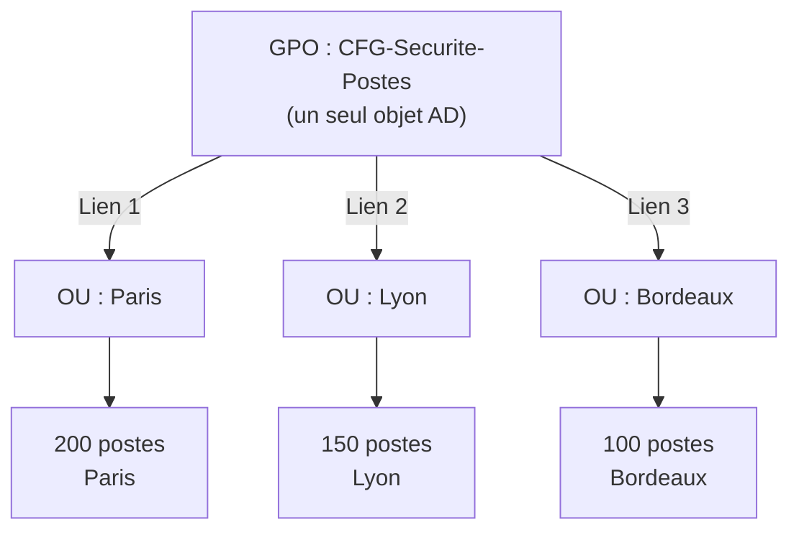

# Les erreurs classiques a eviter

!!! abstract "Ce que vous allez apprendre"
    - Pourquoi modifier la Default Domain Policy est l'une des erreurs les plus dangereuses en administration Active Directory
    - Comment une GPO par parametre peut rendre un domaine ingerable en quelques mois
    - Ce qui se passe reellement quand on supprime une GPO — et pourquoi c'est different de supprimer un lien
    - Pourquoi les preferences ne doivent jamais remplacer les strategies pour les parametres de securite
    - Les dix erreurs a connaître par coeur pour ne jamais les commettre


!!! tip "Si vous ne retenez qu'une chose"
    La plupart des incidents GPO viennent d'erreurs de portée, de nommage ou de test, pas d'un bug mystérieux de Windows.

---
Vous avez maintenant les bases solides pour administrer des GPO. Vous savez creer, lier, filtrer, diagnostiquer. Douze chapitres de technique pure.

Mais il existe un piege que personne ne vous dit : la plupart des catastrophes en production ne viennent pas d'un manque de connaissance technique. Elles viennent d'habitudes qui semblent raisonnables au debut, mais qui deviennent des bombes a retardement.

L'administrateur qui supprime accidentellement une GPO de securite sur 500 machines n'est pas incompetent. Il connait GPMC. Il sait ce qu'est une GPO. Il a simplement confondu deux operations qui se ressemblent visuellement. Une seconde d'inattention, une mauvaise lecture d'un menu contextuel.

L'administrateur qui surcharge la Default Domain Policy n'est pas paresseux. Il applique la logique qui dit "cette GPO s'applique a tout le monde, c'est exactement ce dont j'ai besoin". La logique est correcte. La pratique est dangereuse.

Ce chapitre est une liste de ces habitudes. Dix erreurs. Dix moments ou un administrateur bien intentionne fait quelque chose qui lui reviendra hanter a 3h du matin.

Lisez-le comme un recueil d'histoires vecues. Parce que ce sont exactement ca.

### Comment utiliser ce chapitre

Vous pouvez le lire d'une traite, comme un roman. Ou vous pouvez le parcourir en diagonale, en ne lisant que les blocs `!!! danger` et `!!! tip` de chaque section.

:material-bookmark: Si vous administrez deja un domaine existant, utilisez ce chapitre comme une checklist d'audit. Parcourez votre GPMC en lisant chaque erreur, et demandez-vous : "Est-ce que ca me ressemble ?"

Vous serez surpris de ce que vous trouverez.

---

## :material-alert-decagram: Erreur n°1 : Modifier la Default Domain Policy pour tout

!!! danger "La Default Domain Policy n'est pas un fourre-tout"
    Cette GPO s'applique a **tous les objets du domaine**, sans exception possible. Une erreur ici touche simultanement vos 500 postes, vos 20 serveurs, et vos controleurs de domaine.

### Ce que font beaucoup d'administrateurs debutants

Ils ouvrent la GPMC, voient la Default Domain Policy tout en haut de la liste, et se disent : "C'est parfait, elle s'applique a tout le monde, je vais mettre mes parametres la."

Alors ils y ajoutent le fond d'ecran de l'entreprise. Le parametrage du proxy. La configuration de Windows Update. Les restrictions USB. Et tant qu'on y est, le message de bienvenue a l'ouverture de session.

Le domaine fonctionne. Tout semble bien.

### Pourquoi c'est une bombe a retardement

La Default Domain Policy a un role **tres precis et tres limite** : contenir les parametres de securite qui s'appliquent a l'ensemble du domaine.

```
Default Domain Policy — contenu LEGITIME :
  └── Strategies de comptes (mot de passe, verrouillage)
  └── Strategie Kerberos
```

C'est tout. Rien d'autre ne devrait s'y trouver.

Le probleme avec tout le reste, c'est qu'on ne peut **pas exclure des objets** d'une GPO liee a la racine du domaine sans filtrage de securite. Vous voulez un fond d'ecran different pour les serveurs ? Impossible si c'est dans la Default Domain Policy — elle s'applique a tout le monde.

Pire : si vous cassez cette GPO — une faute de frappe, un parametre incompatible — vous cassez **l'authentification de tout le domaine**. Plus personne ne peut ouvrir une session. Serveurs, postes de travail, tout.

### L'analogie de la Constitution

:material-bank: La Default Domain Policy, c'est comme la **Constitution** d'un pays. Elle pose les regles fondamentales qui s'appliquent a tous les citoyens, sans exception. On n'y inscrit pas les horaires d'ouverture des mairies locales ou le reglement interieur d'une ecole. Ces regles vont dans des textes moins fondamentaux, modifiables plus facilement, et applicables a une population precise.

Ne mettez pas vos "ordonnances locales" dans la Constitution.

### Comment verifier l'etat de votre Default Domain Policy

Ouvrez GPMC, clic droit sur "Default Domain Policy" > **Modifier**. Naviguez dans l'arborescence et cherchez tout ce qui n'est pas sous `Configuration ordinateur > Parametres Windows > Parametres de securite > Strategies de comptes`.

Si vous voyez des parametres dans "Modeles d'administration", des preferences, ou d'autres branches de securite que les strategies de comptes — c'est a nettoyer.

!!! tip "La bonne approche"
    - Reservez la Default Domain Policy **uniquement** aux strategies de comptes et Kerberos.
    - Creez des GPO **dediees** pour chaque type de configuration, liees aux OU appropriees.
    - Si vous heritez d'une Default Domain Policy surchargee, nettoyez-la progressivement et avec des sauvegardes.
    - Avant tout nettoyage, faites une sauvegarde : clic droit sur la GPO > **Sauvegarder**.

!!! quote "En resume"
    - La Default Domain Policy s'applique a tout le domaine, sans exclusion possible.
    - Elle doit contenir uniquement les strategies de comptes et Kerberos.
    - Une erreur la-dedans peut bloquer toutes les ouvertures de session du domaine.
    - Creez des GPO separees pour tout le reste.

---

## :material-alert-decagram: Erreur n°2 : Creer une GPO par parametre

!!! danger "200 GPOs en 6 mois"
    Certains domaines de production ont des centaines de GPOs dont personne ne sait plus a quoi elles servent. Le temps de traitement des GPO au demarrage des machines explose. Les administrateurs passent plus de temps a chercher "dans quelle GPO est ce parametre ?" qu'a administrer.

### Comment ca commence

Un administrateur cree "GPO-Wallpaper" pour le fond d'ecran. Puis "GPO-Screensaver" pour l'ecran de veille. "GPO-Proxy" pour le proxy. "GPO-WindowsUpdate" pour les mises a jour. "GPO-USB-Block" pour bloquer les USB. "GPO-IE-Settings" pour Internet Explorer.

Chaque GPO fait une chose, une seule chose. Ca semble propre et organise.

### Pourquoi c'est un desastre a long terme

Windows applique les GPO **une par une**, dans un ordre precis. Chaque GPO a un cout : elle doit etre telechargee depuis le controleur de domaine, parsee, et appliquee.

Avec 5 GPOs, c'est negligeable. Avec 200 GPOs, le demarrage d'un poste peut prendre plusieurs minutes supplementaires. Les utilisateurs se plaignent. Les serveurs souffrent.

Mais le vrai probleme, c'est la **lisibilite**. Au bout de six mois, vous avez :

- `GPO-Config-V2`
- `GPO-Config-V2-Final`
- `GPO-Config-V2-Final-VRAIMENT-FINAL`
- `GPO-Config-Test-Ne-Pas-Supprimer`
- `GPO-237` (personne ne sait ce que c'est)

Aucun administrateur ne peut maintenir ca serieusement.

### L'impact mesurable sur les performances

Windows mesure le temps de traitement de chaque GPO pendant le demarrage (mode foreground) et au rafraichissement en arriere-plan. Vous pouvez le consulter dans l'observateur d'evenements, sous `Applications et services > Microsoft > Windows > GroupPolicy`.

Avec 200 GPOs, les evenements de demarrage montrent souvent des temps de traitement de 2 a 5 minutes. Sur des machines avec des profils itinerants, ca peut atteindre 10 minutes. Les utilisateurs s'en souviennent — et ils en parlent.

Une infrastructure bien concue avec une vingtaine de GPOs bien organisees arrive en dessous de 30 secondes de traitement.

### L'analogie du classeur

:material-folder-multiple: Imaginez un classeur de bureau avec 200 pochettes transparentes, une par facture. Personne ne retrouve rien. Le bon classeur a des **intercalaires par categorie** : Fournisseurs, Clients, Contrats, Banque. Chaque intercalaire contient plusieurs documents du meme type.

Les GPO, c'est pareil. Groupez par **fonction** et par **audience**.

!!! tip "Convention de nommage et de regroupement"
    Regroupez les parametres par **fonction metier** et par **cible** :

    | Nom de la GPO | Contenu |
    |:---|:---|
    | `CFG-Postes-EnvironnementBureau` | Fond d'ecran, ecran de veille, barre des taches |
    | `CFG-Postes-Reseau` | Proxy, lecteurs reseau, parametres DNS |
    | `CFG-Postes-Securite` | Controle des USB, restrictions logicielles |
    | `CFG-Postes-WindowsUpdate` | Configuration WSUS et planification |
    | `CFG-Serveurs-Audit` | Parametres d'audit specifiques aux serveurs |

    Une GPO par **categorie fonctionnelle**, pas par parametre individuel.

!!! quote "En resume"
    - Une GPO par parametre cree une dette technique ingerable.
    - Le temps de traitement des GPO augmente avec leur nombre.
    - Groupez les parametres par fonction et par cible.
    - Adoptez une convention de nommage claire des le premier jour.

---

## :material-alert-decagram: Erreur n°3 : Oublier le filtrage de securite

!!! danger "Une GPO sans filtrage s'applique a TOUT le monde"
    Y compris vos controleurs de domaine. Y compris vos serveurs critiques. Y compris les comptes de service. Si vous liez une GPO a la racine du domaine ou a une OU qui contient des DC, sans filtrage, vous pouvez provoquer une catastrophe en production.

### Le scenario classique

Un administrateur cree une GPO pour configurer le bureau des utilisateurs du service comptabilite. Il la lie... a la racine du domaine, parce que "c'est plus simple". Il ne configure pas de filtrage de securite.

Le lendemain matin, les controleurs de domaine ont un fond d'ecran avec le logo de la comptabilite, des restrictions logicielles qui empechent l'execution de certains outils d'administration, et un message de connexion destine aux comptables.

Ce n'est pas dramatique ici. Mais remplacez "fond d'ecran" par "desactiver le bureau a distance" ou "bloquer certains ports reseau", et ca devient catastrophique.

Ou pire encore : une GPO de parametres de securite qui definit des droits utilisateur et qui s'applique aux controleurs de domaine avec des valeurs incompatibles. Dans ce cas, les DCs peuvent refuser les connexions des administrateurs. Vous vous retrouvez a essayer de reprendre la main sur votre propre infrastructure.

### Pourquoi ca arrive

Quand vous creez une GPO et que vous l'appliquez a une OU, le filtrage de securite par defaut est :

```
Authenticated Users — Lire + Appliquer la strategie de groupe
```

Cela signifie que **tout compte authentifie** — utilisateur, ordinateur, compte de service — dans la portee de la GPO est soumis a cette GPO.

### La question a toujours se poser

Avant de lier une GPO, posez-vous systematiquement cette question :

**"A qui cette GPO doit-elle s'appliquer, et a qui ne doit-elle PAS s'appliquer ?"**

Si la reponse inclut "pas aux serveurs" ou "pas aux DC", configurez le filtrage avant de lier.

!!! tip "Comment configurer le filtrage correctement"
    Dans GPMC, selectionnez votre GPO et allez dans l'onglet **Etendue** :

    1. Retirez `Authenticated Users` de la section **Filtrage de securite**.
    2. Ajoutez le groupe de securite qui contient uniquement les machines ou utilisateurs cibles.
    3. Verifiez avec `gpresult /r` sur une machine cible et sur une machine qui ne devrait pas etre concernee.

    Si vous n'avez pas de groupe dedie, creez-en un. C'est quelques minutes de travail qui evitent des heures de depannage.

### L'exception : les GPOs de configuration utilisateur

Attention : pour les GPOs de **configuration utilisateur**, le filtrage s'applique sur les **comptes utilisateur**, pas sur les comptes ordinateur. Si vous creez une GPO qui configure le bureau d'un utilisateur, le filtrage doit inclure les comptes utilisateur des personnes concernees — pas les comptes machine.

Les deux filtres (utilisateur ET ordinateur dans la meme GPO) fonctionnent independamment. Une GPO avec des parametres ordinateur ET des parametres utilisateur peut necessiter deux groupes de filtrage differents. C'est l'une des raisons pour lesquelles il vaut mieux separer les GPOs "postes" des GPOs "utilisateurs".

!!! warning "Les GPOs liees a la racine du domaine"
    Une GPO liee directement a la racine du domaine s'applique a **tous les objets** du domaine. C'est le bon endroit uniquement si vous avez un parametre vraiment universel — et dans ce cas, le filtrage doit quand meme etre verifie. En cas de doute, liez plus bas dans la hierarchie des OU.

!!! quote "En resume"
    - Par defaut, une GPO s'applique a tous les objets Authenticated Users dans sa portee.
    - Avant de lier, identifiez precisement qui doit etre soumis a la GPO.
    - Retirez Authenticated Users et ajoutez un groupe de securite specifique si necessaire.
    - Verifiez toujours avec `gpresult /r` sur plusieurs types de machines.

---

## :material-alert-decagram: Erreur n°4 : Confondre supprimer le lien et supprimer la GPO

!!! danger "Supprimer la GPO = supprimer les parametres sur TOUTES les machines"
    Ce n'est pas la meme chose que de supprimer un lien dans une OU. Cette confusion a provoque des incidents majeurs dans des centaines d'entreprises.

### Comprendre la structure : GPO vs Lien

Une GPO est un **objet unique** stocke dans Active Directory (dans le dossier SYSVOL et dans la partition de configuration). Elle peut etre **liee** a plusieurs OUs, plusieurs sites, ou plusieurs domaines.

Voici ce que ca donne en pratique :



**Supprimer le lien sur "Paris"** : les 200 postes de Paris ne recoivent plus cette GPO. Les 250 postes de Lyon et Bordeaux continuent normalement. L'objet GPO existe toujours dans AD.

**Supprimer la GPO** : l'objet AD est detruit. Les trois liens disparaissent. Les 450 postes ne recoivent plus la GPO. Au prochain `gpupdate`, les parametres qu'elle definissait sont supprimes des machines.

### L'histoire d'horreur

Un administrateur veut retirer une GPO de securite de l'OU "Lyon", parce que Lyon passe sous une autre politique. Il ouvre GPMC, fait un clic droit sur la GPO dans le panneau central... et au lieu de cliquer sur **"Supprimer le lien"**, il clique sur **"Supprimer"**.

Confirmation : "Voulez-vous supprimer cette GPO ?" Il clique Oui sans lire attentivement.

Resultat : 500 postes perdent leurs parametres de securite. Les comptes locaux ne sont plus verrouilles. Les audits sont desactives. Le pare-feu est reconfigure aux valeurs par defaut.

Il faudra plusieurs heures pour restaurer la GPO depuis la sauvegarde — en esperant qu'elle existe et qu'elle est recente.

### L'analogie du document partage

:material-file-multiple: Imaginez un document Word partage en reseau, dans trois dossiers differents — pas une copie, mais le **meme fichier** avec trois raccourcis qui pointent vers lui. Si vous supprimez un raccourci du dossier "Marketing", le fichier existe toujours et les raccourcis de "Finance" et "Direction" fonctionnent encore. Mais si vous supprimez le fichier lui-meme, les trois raccourcis deviennent invalides.

Une GPO, c'est le fichier. Les liens, ce sont les raccourcis.

### Comment distinguer les deux operations dans GPMC

Dans GPMC, quand vous faites un clic droit sur **une GPO dans l'arborescence des OU** (sous l'OU ou elle est liee), vous obtenez l'option **"Supprimer le lien"**.

Quand vous faites un clic droit sur **une GPO dans le conteneur "Objets de strategie de groupe"**, vous obtenez l'option **"Supprimer"** — qui supprime l'objet lui-meme.

!!! tip "La regle de securite : toujours desactiver avant de supprimer"
    Avant de supprimer quoi que ce soit, commencez par **desactiver le lien** (clic droit > Lien active > decocher). Observez l'effet pendant 24h. Si tout va bien, supprimez le lien. Et si vous voulez supprimer la GPO entierement, verifiez d'abord dans l'onglet **Etendue** qu'elle n'est liee nulle part ailleurs.

!!! warning "Les preferences et le tatouage"
    Si votre GPO contenait des **preferences** (et non des strategies), supprimer la GPO ne supprime pas les valeurs sur les machines. Elles sont tattouees. Relisez le chapitre 10 si necessaire.

!!! quote "En resume"
    - Une GPO est un objet unique qui peut etre lie a plusieurs OUs.
    - Supprimer un lien retire la GPO d'une OU seulement.
    - Supprimer la GPO la retire de toutes les OUs et supprime les parametres sur toutes les machines.
    - Desactivez toujours avant de supprimer. Verifiez l'onglet Etendue avant de supprimer l'objet.

---

## :material-alert-decagram: Erreur n°5 : Ne pas tester en OU de test

!!! danger "Deployer directement en production sans test = jouer a la roulette russe"
    Meme un "petit changement" peut avoir des effets inattendus. Un parametre qui semble anodin peut interagir avec un autre parametre, un logiciel tiers, ou une configuration locale specifique a certaines machines.

### La tentation du raccourci

Modifier une GPO existante et l'appliquer directement en production semble rapide. C'est souvent ce qu'on fait quand on est sous pression, quand le changement parait trivial, ou quand on est confiant dans sa connaissance du parametre.

C'est presque toujours a ce moment-la que les incidents se produisent.

### Le cas du "simple" parametre reseau

Un administrateur doit changer l'adresse du serveur proxy de l'entreprise. Parametre simple, une ligne de configuration, il connait ca par coeur. Il modifie la GPO en production.

Ce qu'il ne savait pas : certaines machines dans la meme OU avaient un logiciel de supervision reseau qui utilisait le proxy pour ses communications. Ce logiciel n'avait pas de gestion d'erreur propre en cas de changement de proxy. La modification a provoquer des alertes erronees pendant deux jours avant que quelqu'un fasse le lien.

Un test sur une seule machine dans une OU de test aurait revele le probleme en 20 minutes.

### L'analogie du medicament

:material-pill: Aucun medicament n'est mis sur le marche sans passer par des phases d'essais cliniques — meme quand les chercheurs sont convaincus que ca marche, meme quand c'est urgent. Pas parce qu'on doute de leur competence, mais parce que les systemes complexes ont des interactions imprevues.

Un domaine Active Directory avec 500 machines et 50 applications est un systeme complexe. Le "test clinique", c'est votre OU de test.

### Ce que doit contenir une OU de test

:material-beaker: Toute infrastructure GPO serieuse dispose d'au moins une OU de test. Cette OU contient :

- Un **poste de travail de test** representatif (meme OS, meme logiciels que la production)
- Un **compte utilisateur de test** (pas le compte admin, un compte utilisateur standard)
- Parfois un **serveur de test** si les GPO s'appliquent aussi aux serveurs

L'OU de test recoit les GPOs en premier, avant n'importe quelle OU de production.

!!! tip "Le workflow de deploiement en 4 etapes"
    1. Creez et configurez la GPO sur une copie ou une GPO de test dans l'OU de test.
    2. Forcez l'application sur le poste de test : `gpupdate /force`.
    3. Verifiez le comportement avec `gpresult /h rapport.html` et en observant la machine.
    4. Si OK, liez la GPO a l'OU de production. Si probleme, corrigez dans l'OU de test et recommencez.

    Ce workflow prend 30 minutes. L'incident de production peut prendre une journee.

!!! warning "Les parametres qui necessitent un redemarrage"
    Certains parametres de securite ne s'appliquent qu'au demarrage de la machine, pas avec `gpupdate /force`. Redemarrez la machine de test pour valider completement avant de deployer.

!!! quote "En resume"
    - Toujours avoir une OU de test avec un poste et un utilisateur representatifs.
    - Tester chaque changement dans l'OU de test avant de deployer en production.
    - Forcer l'application avec `gpupdate /force` et verifier avec `gpresult`.
    - Certains parametres ne s'appliquent qu'au redemarrage — testez avec un redemarrage complet.

---

## :material-alert-decagram: Erreur n°6 : Ignorer l'heritage et les conflits

!!! danger "Un parametre peut etre configure a plusieurs niveaux simultanement"
    Si deux GPOs definissent le meme parametre avec des valeurs differentes, laquelle gagne ? Beaucoup d'administrateurs ne le savent pas, et c'est la source de nombreux comportements inexpliques.

### Rappel sur l'heritage GPO

Les GPOs s'appliquent dans un ordre precis, du niveau le plus haut au niveau le plus bas :

```
1. Site
2. Domaine
3. OU parente
4. OU enfant
5. OU petite-enfant
...
```

En cas de conflit, la GPO **la plus proche de l'objet** gagne. Une GPO liee a l'OU "Comptabilite" ecrase une GPO liee au domaine si elles definissent le meme parametre.

### L'erreur courante

Un administrateur veut configurer Windows Update pour l'OU "Serveurs". Il cree une GPO et la lie a l'OU Serveurs. Mais il ne sait pas qu'une autre GPO liee au domaine definit deja les memes parametres Windows Update, avec des valeurs differentes.

Les serveurs recoivent les deux GPOs. Laquelle gagne ? Celle de l'OU Serveurs, parce qu'elle est plus proche. Mais l'administrateur pensait que c'etait celle du domaine qui s'appliquait. Il depanne pendant une heure quelque chose qui "ne marche pas" alors que ca marche — juste pas comme il le croit.

### Verifier avant et apres

La commande `gpresult` est votre meilleure amie pour comprendre ce qui s'applique reellement.

```cmd
rem Generate an HTML report of applied GPOs and winning settings
gpresult /h "C:\temp\rapport-gpo.html" /f

rem Show a summary directly in the console
gpresult /r
```

Lisez le rapport **avant** de faire un changement pour comprendre l'etat actuel. Lisez-le **apres** pour verifier que votre changement a produit l'effet attendu.

### Les conflits silencieux

Le cas le plus dangereux est celui ou un parametre semble s'appliquer correctement, mais une GPO plus haute dans la hierarchie le remplace silencieusement. L'administrateur modifie la GPO de son OU, ne voit aucun effet, et cherche un probleme technique alors que c'est simplement un conflit d'heritage.

### L'onglet Parametres resultants dans GPMC

GPMC dispose d'une fonctionnalite tres utile : le **Modeleur de strategie de groupe** (Group Policy Modeling) et les **Resultats de strategie de groupe**. Ces deux outils simulent ou rapportent les GPOs effectivement appliquees a un objet, en tenant compte de tout l'heritage.

Dans GPMC, clic droit sur **Resultats de strategie de groupe** > **Assistant**. Choisissez un ordinateur et un utilisateur. Le rapport resultant vous montre exactement quelles GPOs s'appliquent, dans quel ordre, et pour chaque parametre en conflit, quelle GPO a "gagne".

C'est votre meilleur outil pour diagnostiquer les conflits d'heritage avant qu'ils deviennent des incidents.

!!! tip "Comment eviter les conflits d'heritage"
    - Avant de creer une GPO pour un parametre, verifiez dans `gpresult` si ce parametre est deja configure par une GPO parente.
    - Si un parametre doit etre different selon les OUs, definissez-le dans les OUs enfants — pas dans une GPO parente que vous essayez ensuite de "corriger" par des GPOs enfants.
    - Documentez quelle GPO est "autorite" pour chaque categorie de parametres.

!!! warning "Enforcement et blocage de l'heritage"
    Si vous avez active **Enforced** sur une GPO parente, les GPOs enfants ne peuvent pas l'ecraser — meme si elles sont plus proches. Et si vous avez active **Bloquer l'heritage** sur une OU, les GPOs parentes ne s'appliquent pas. Ces deux mecanismes existent pour des cas precis. Utilises sans raison claire, ils rendent la hierarchie GPO incomprehensible.

!!! quote "En resume"
    - En cas de conflit, la GPO la plus proche de l'objet gagne.
    - Utilisez `gpresult /h rapport.html` avant et apres chaque changement.
    - Verifiez qu'un parametre n'est pas deja defini par une GPO parente avant d'en creer une nouvelle.
    - Documentez l'usage de Enforced et Bloquer l'heritage.

---

## :material-alert-decagram: Erreur n°7 : Activer trop de parametres d'audit

!!! danger "Un journal d'evenements plein noie les alertes critiques"
    Si vous auditez tout, vous auditez rien. Un journal de securite qui produit des millions d'evenements par jour devient impossible a surveiller. Les vraies alertes se perdent dans le bruit.

### La tentation de l'audit total

Quand un administrateur decouvre les parametres d'audit, il est tente d'activer tout ce qu'il peut. "Audit des acces aux objets" sur tous les serveurs ? Active. "Audit des changements de strategie" ? Active. "Audit des evenements systeme" ? Active. "Audit des connexions" ? Active en mode succes et echec.

Dans un domaine de 500 machines, ca peut generer plusieurs millions d'evenements par jour.

### Ce que ca provoque concretement

:material-database: Le journal de securite de Windows a une taille maximale configurable. Quand il est plein, soit les nouveaux evenements ecrasent les anciens (et vous perdez l'historique), soit le systeme s'arrete (pour eviter de perdre des preuves — comportement configurable).

Dans le meilleur cas, votre SIEM (systeme de collecte de logs) est submerge et les equipes securite n'arrivent plus a distinguer les vraies alertes du bruit de fond.

Dans le pire cas, un evenement critique — une tentative d'intrusion, une escalade de privileges, une exfiltration de donnees — passe completement inapercu parce qu'il est noye dans 50 000 evenements d'acces aux fichiers.

### L'analogie de l'alarme incendie

:material-fire-alert: Imaginez un systeme d'alarme incendie qui se declenche chaque fois qu'une porte s'ouvre, chaque fois que quelqu'un marche dans le couloir, chaque fois qu'une fenetre bouge. Au bout de quelques jours, les employes eteignent l'alarme des qu'elle sonne — y compris le jour ou il y a un vrai incendie.

Un audit qui produit trop de bruit est pire qu'aucun audit.

### Les parametres d'audit minimalistes et efficaces

Commencez avec uniquement ces deux categories :

| Categorie d'audit | Mode | Pourquoi |
|:---|:---:|:---|
| Echecs de connexion (Logon Failures) | Echec seulement | Detecte les tentatives de brute force |
| Gestion des comptes (Account Management) | Succes + Echec | Detecte la creation/modification/suppression de comptes |

Quand vous etes plus a l'aise et que vous avez verifie que ces deux categories ne surchargent pas vos journaux, vous pouvez envisager d'ajouter :

| Categorie d'audit | Mode | Pourquoi l'ajouter |
|:---|:---:|:---|
| Changements de strategie d'audit | Succes | Detecte si quelqu'un desactive l'audit |
| Utilisation des privileges (Privilege Use) | Echec | Detecte les tentatives d'escalade de privileges |
| Ouverture de session de compte | Echec | Authentifications Kerberos echouees |

Ajoutez des categories supplementaires uniquement quand vous avez une raison precise — une exigence de conformite, une investigation en cours, ou une recommandation de votre equipe securite.

!!! tip "Audit par categorie avancee"
    Windows Vista et versions ulterieures supportent l'**audit par sous-categorie**, beaucoup plus fin que les categories generiques. Utilisez la commande `auditpol` pour configurer l'audit a ce niveau, ou passez par les GPOs avancees (`Configuration ordinateur > Parametres Windows > Parametres de securite > Configuration avancee de la strategie d'audit`).

    ```cmd
    rem Show current audit configuration by subcategory
    auditpol /get /category:*
    ```

!!! warning "Taille du journal de securite"
    Verifiez la taille configuree pour votre journal de securite (`eventvwr.msc` > Journal de securite > Proprietes). La valeur par defaut (20 Mo sur les versions recentes) est insuffisante pour un serveur actif. En production, configurez une taille adaptee et une politique de retention via GPO.

!!! quote "En resume"
    - Trop d'audit est aussi problematique que pas d'audit.
    - Commencez avec les echecs de connexion et la gestion des comptes.
    - Ajoutez des categories au fur et a mesure, avec une raison precise pour chacune.
    - Surveillez la taille et le taux de remplissage du journal de securite.

---

## :material-alert-decagram: Erreur n°8 : Utiliser les preferences pour des parametres de securite

!!! danger "L'effet tatouage est permanent"
    Si vous deployez un parametre de securite via une **preference** et que vous supprimez ensuite la GPO, le parametre reste sur la machine. Pour toujours. Meme si la politique de securite a change. Meme si l'administrateur suivant ne sait pas que ce parametre a ete pose la.

### Rappel sur la difference fondamentale

Vous avez vu ca en detail dans le chapitre 10. Voici l'essentiel :

:material-gavel: **Les strategies (Policies)** ecrivent dans les branches protegees du registre (`HKLM\SOFTWARE\Policies\...`). Quand la GPO est supprimee, Windows supprime automatiquement ces valeurs.

:material-note-text: **Les preferences** ecrivent n'importe ou dans le registre. Quand la GPO est supprimee, les valeurs restent. C'est le **tatouage**.

### Pourquoi c'est particulierement dangereux pour la securite

Imaginons que vous deployez via une preference le parametre qui desactive l'ouverture automatique de session. Six mois plus tard, la GPO est reorganisee. Un administrateur supprime l'ancienne GPO de preferences. Le parametre d'ouverture de session reste configure sur les machines — mais personne ne sait pourquoi ni comment il a ete mis la.

Maintenant imaginez le cas inverse : vous activez via une preference un parametre de securite important. Mais vous liez la GPO a la mauvaise OU, ou a une OU temporaire. Quand vous supprimez le lien, vous pensez avoir retire la configuration. En realite, elle est tatouee sur toutes les machines qui ont recu la preference. Votre perimetre de securite est different de ce que vous croyez.

### Comment detecter les preferences de securite deja en place

Si vous reprenez un domaine existant, comment savoir si des preferences ont ete utilisees pour des parametres de securite ?

La commande `gpresult /h rapport.html` vous montre les preferences appliquees, mais pas facilement ce qu'elles contiennent. La methode la plus fiable est d'ouvrir chaque GPO suspecte dans l'editeur et de naviguer dans `Configuration ordinateur > Preferences` et `Configuration utilisateur > Preferences` pour voir ce qui a ete configure.

Cherchez particulierement dans : **Parametres Windows > Registre**, **Parametres Windows > Securite locale** (si disponible), et **Parametres du panneau de configuration**.

### La regle simple

:material-shield-check: **Pour tout ce qui concerne la securite, utilisez des strategies (Policies), jamais des preferences.**

Les preferences sont utiles pour : les lettres de lecteur reseau, les imprimantes, les raccourcis, les fichiers a deployer, les parametres de confort utilisateur. Pas pour la securite.

!!! tip "Comment savoir si un parametre existe en strategie"
    Avant d'utiliser une preference de registre pour un parametre de securite, verifiez s'il existe dans les **Modeles d'administration** ou dans **Parametres de securite** de l'editeur GPO. Si c'est le cas, utilisez toujours la version strategie plutot que la preference. Si ca n'existe pas en strategie, documentez explicitement que le parametre est une preference et ses implications.

!!! warning "Les preferences avec l'action 'Supprimer'"
    Une preference configuree avec l'action **Supprimer** peut supprimer une valeur de registre quand la GPO s'applique. Si la GPO est ensuite supprimee, la valeur ne revient pas. Ce comportement peut supprimer definitivement des configurations critiques.

!!! quote "En resume"
    - Les preferences tattouent les valeurs dans le registre — elles restent apres suppression de la GPO.
    - N'utilisez jamais les preferences pour des parametres de securite.
    - Pour la securite, utilisez toujours les strategies (Policies) qui sont revertibles.
    - Documentez tout parametre deploye via preference pour les futurs administrateurs.

---

## :material-alert-decagram: Erreur n°9 : Ne pas documenter ses GPO

!!! danger "Dans 3 mois, vous ne saurez plus pourquoi GPO-237 existe"
    Et si vous quittez l'entreprise, votre successeur non plus. Les GPO non documentees sont des mines antipersonnel pour les administrateurs futurs.

### Le cimetiere des GPOs orphelines

Apres quelques annees d'administration, un domaine accumule inevitablement des GPOs dont personne ne connait plus l'origine, la raison, ou la cible.

- `GPO-Config-V2-Final-VRAIMENT-FINAL` : version de quoi ? Finale depuis quand ?
- `GPO-Test-Jean` : qui est Jean ? Est-ce que ca s'applique encore a quelque chose ?
- `GPO-237` : mystere complet.
- `GPO-Temporaire-Migration` : la migration est terminee depuis 2019, la GPO est toujours liee.

Ces GPOs creent trois problemes : elles allongent inutilement le temps de traitement, personne n'ose les supprimer de peur de casser quelque chose, et elles rendent les audits de securite cauchemar esques.

### Identifier et nettoyer les GPOs orphelines

Une **GPO orpheline** est une GPO qui existe dans Active Directory mais qui n'est liee a aucune OU, aucun site, aucun domaine. Elle ne s'applique a rien — mais elle occupe de l'espace et ajoute du bruit.

Dans GPMC, le conteneur **Objets de strategie de groupe** liste toutes les GPOs du domaine. Pour chaque GPO, l'onglet **Etendue** vous montre ou elle est liee. Une GPO avec une liste de liens vide est orpheline.

Vous pouvez aussi utiliser PowerShell pour lister toutes les GPOs non liees :

```powershell
# List all GPOs that have no links in any OU, site, or domain
Import-Module GroupPolicy
Get-GPO -All | Where-Object {
    # Get-GPOReport returns an XML; check if no SOM links exist
    ([xml](Get-GPOReport -Guid $_.Id -ReportType Xml)).GPO.LinksTo -eq $null
} | Select-Object DisplayName, CreationTime, ModificationTime
```

Ce script vous donne une liste de GPOs candidates au nettoyage. Verifiez chacune avant de supprimer — une GPO peut etre "en attente de lien" pour une raison valide.

### L'analogie du code sans commentaires

:material-code-tags: Un programmeur qui ecrit du code sans commentaires est considere comme un mauvais collegue. Il impose a tous ceux qui liront son code apres lui de deviner ses intentions. La meme logique s'applique aux GPO.

Une GPO non documentee est de la dette technique.

### Le probleme du "je m'en souviendrai"

Quand on cree une GPO, on est en contexte. On sait pourquoi on la cree, pour qui, dans quel cadre. Il semble evident qu'on s'en souviendra.

Trois mois plus tard, on a cree 15 autres GPOs, gere 30 tickets, fait evoluer l'infrastructure. Le contexte a disparu. La GPO de trois mois ressemble maintenant a toutes les autres GPOs mysterieuses du domaine.

Ce n'est pas une question de memoire. C'est une question de volume. Personne n'est capable de maintenir le contexte de toutes les decisions techniques d'un domaine Active Directory. La documentation est la memoire externe du systeme.

### Les trois outils de documentation disponibles

**1. Le champ Description dans GPMC**

Chaque GPO a un champ "Description" que vous pouvez modifier. C'est le minimum. Mettez-y :

- L'objectif de la GPO (en une phrase)
- La population cible (exemple : "Postes utilisateurs standard hors serveurs")
- La date de creation et l'auteur
- Les changements majeurs (avec date)

**2. La convention de nommage**

Un bon nom de GPO repond a trois questions sans qu'on ait besoin d'ouvrir la GPO :

```
[Environnement]-[Population]-[Fonction]

Exemples :
  CFG-Postes-EnvironnementBureau
  SEC-Serveurs-AuditAvance
  CFG-DC-NTPConfiguration
```

**3. Un changelog externe**

Pour les domaines d'une certaine taille, maintenez un document externe (wiki, SharePoint, fichier Excel) avec une ligne par GPO : nom, description, date de creation, auteur, derniere modification, lien vers le ticket de changement.

!!! tip "Le champ Description : comment l'editer"
    Dans GPMC, faites un clic droit sur la GPO > **Modifier**. Le champ Description n'est pas dans l'editeur de GPO. Retournez dans GPMC, cliquez sur la GPO dans le panneau central, onglet **Details**. Ou clic droit sur la GPO dans l'arbre > **Proprietes**.

!!! warning "La tentation de l'urgence"
    En situation d'urgence, on cree des GPOs "temporaires" sans documentation. Ces GPOs temporaires restent en production pendant des annees. Prenez 2 minutes pour remplir le champ Description, meme en urgence. "GPO temporaire — Migration serveur proxy — A supprimer apres 2024-03-15 — Jean D." vaut infiniment mieux que rien.

!!! quote "En resume"
    - Remplissez toujours le champ Description d'une GPO au moment de sa creation.
    - Adoptez une convention de nommage et appliquez-la sans exception.
    - Maintenez un changelog des modifications importantes.
    - Auditez regulierement les GPOs orphelines ou inutilisees.

---

## :material-alert-decagram: Erreur n°10 : Oublier la replication AD

!!! danger "Une GPO sauvegardee n'est pas immediatement disponible partout"
    Active Directory repond a vos modifications en les stockant sur un controleur de domaine specifique (le PDC Emulator par defaut pour les GPOs). Ces modifications doivent ensuite se repliquer sur tous les autres DCs. Cela prend du temps.

### Ce qui se passe quand vous sauvegardez une GPO

Quand vous modifiez et sauvegardez une GPO dans GPMC, la modification est ecrite sur le **PDC Emulator** (le controleur de domaine primaire emule). C'est lui qui fait autorite pour les GPOs.

Mais vos autres controleurs de domaine ne recoivent pas la modification immediatement. La replication Active Directory entre DCs d'un meme site prend entre **15 secondes et 5 minutes** dans des conditions normales. Entre des sites connectes par des liens lents, ca peut etre bien plus long — jusqu'a l'intervalle de replication configure, qui est souvent de 15 a 180 minutes.

### Le scenario qui trompe

Vous modifiez une GPO pour corriger un probleme urgent. Vous allez immediatement sur un poste de test et lancez `gpupdate /force`. Ca ne fonctionne pas. Vous verifiez la GPO dans GPMC — elle est correcte. Vous refaites `gpupdate /force`. Toujours rien.

Vous commencez a douter de votre modification. Vous la refaites. Vous creez une deuxieme GPO. Vous redebutez tout. Vous passez 45 minutes a deboguer...

...alors que le probleme est simplement que le poste de test a contacte un DC qui n'a pas encore recu la replication.

### Verifier l'etat de la replication

Avant de conclure qu'une GPO ne s'applique pas, verifiez l'etat de la replication :

```cmd
rem Show replication status between all domain controllers
repadmin /showrepl

rem Force replication from all partners immediately
repadmin /syncall /AdeP

rem Show which DC a machine is currently using
nltest /dsgetdc:votre-domaine.com
```

La commande `repadmin /showrepl` affiche l'etat de la derniere replication entre chaque paire de DCs. Si une replication est en echec ou en retard, c'est votre piste.

### Forcer la replication manuellement

Pour qu'une modification urgente se propage immediatement :

```cmd
rem Force replication from all partners to all DCs
repadmin /syncall /AdeP
```

Attendez une minute, puis forcez l'application de la GPO sur le poste de test :

```cmd
rem Force immediate group policy refresh
gpupdate /force
```

### Comment savoir depuis quel DC une machine a obtenu sa GPO

Apres un `gpupdate /force`, lancez `gpresult /r`. Regardez la ligne qui indique le controleur de domaine utilise pour les GPOs ordinateur et utilisateur. Si c'est un DC secondaire qui n'a pas encore recu la replication, vos modifications ne sont pas encore visibles.

```cmd
rem Show which DC provided group policies for the current session
gpresult /r | findstr /i "controleur\|controller\|DC"
```

Si le DC source n'a pas recu la replication, deux options : attendre, ou forcer le poste a utiliser un DC specifique :

```cmd
rem Force the machine to use a specific DC for the next gpupdate
gpupdate /force /target:computer
```

(Cette commande ne force pas le choix du DC, mais vous pouvez utiliser `nltest /server:NOM-DC` pour des operations specifiques sur un DC precis.)

!!! tip "SYSVOL et GPO : deux canaux de replication"
    Une GPO a deux composantes : ses **metadonnees** dans Active Directory (repliquees par la replication AD standard) et ses **fichiers** dans le dossier SYSVOL (repliques par DFS-R sur les domaines modernes). Une replication partielle — AD OK mais SYSVOL en retard — peut provoquer des comportements incoherents. Verifiez les deux.

    ```cmd
    rem Check DFS-R replication status for SYSVOL
    dfsrdiag replicationstate
    ```

!!! warning "Ne testez pas immediatement apres une modification urgente"
    En situation de stress, le reflexe est de tester immediatement. Prenez l'habitude d'attendre au moins 5 minutes avant de tester, ou de verifier explicitement sur quel DC le poste a obtenu sa GPO (`gpresult /r` affiche le nom du DC source).

!!! quote "En resume"
    - Une GPO sauvegardee se reprique sur les autres DCs dans un delai de quelques secondes a quelques minutes.
    - Utilisez `repadmin /showrepl` pour verifier l'etat de la replication.
    - Forcez la replication avec `repadmin /syncall /AdeP` en cas d'urgence.
    - Ne concluez jamais a un dysfonctionnement de GPO sans avoir verifie la replication.

---

## :material-clipboard-check: Checklist d'audit rapide

Avant de passer au tableau final, voici une checklist que vous pouvez utiliser pour auditer votre propre domaine. Ouvrez GPMC et cochez chaque point.

**Audit de la Default Domain Policy**

- [ ] La DDP ne contient que des strategies de comptes et Kerberos
- [ ] Aucun parametre de Modeles d'administration dans la DDP
- [ ] Aucune preference dans la DDP

**Audit des GPOs existantes**

- [ ] Toutes les GPOs ont un nom qui respecte une convention lisible
- [ ] Toutes les GPOs ont un champ Description rempli
- [ ] Aucune GPO avec un nom "Final", "V2", "Test", "Temp" sans explication
- [ ] Les GPOs liees a la racine du domaine ont un filtrage de securite explicite

**Audit du filtrage de securite**

- [ ] Aucune GPO de postes n'est liee a une OU contenant des DCs sans filtrage
- [ ] Les GPOs de serveurs ne s'appliquent pas aux postes de travail

**Audit technique**

- [ ] Une OU de test existe avec un poste representatif
- [ ] La replication AD est saine (`repadmin /showrepl` ne montre pas d'erreurs)
- [ ] Les journaux de securite ont une taille configuree adequatement


!!! quote "En résumé"
    - [ ] La DDP ne contient que des strategies de comptes et Kerberos.
    - [ ] Aucun parametre de Modeles d'administration dans la DDP.
    - [ ] Aucune preference dans la DDP.
    - Avant de passer au tableau final, voici une checklist que vous pouvez utiliser pour auditer votre propre domaine.
    - Ouvrez GPMC et cochez chaque point.
---

## :material-table: Recapitulatif des dix erreurs

Ce tableau est votre aide-memoire. Imprimez-le, affichez-le, envoyez-le a vos collegues.

| # | Erreur | Risque | Comment l'eviter |
|:---:|:---|:---|:---|
| 1 | Modifier la Default Domain Policy pour tout | Bloquer toutes les ouvertures de session du domaine | Reserver la DDP aux strategies de comptes et Kerberos uniquement |
| 2 | Creer une GPO par parametre | Domaine ingerable, temps de demarrage allonge | Grouper par fonction et audience avec une convention de nommage |
| 3 | Oublier le filtrage de securite | GPO appliquee aux DCs et serveurs critiques | Toujours definir qui doit recevoir la GPO avant de la lier |
| 4 | Confondre supprimer le lien et supprimer la GPO | Perte des parametres sur toutes les machines | Desactiver avant de supprimer, verifier l'onglet Etendue |
| 5 | Ne pas tester en OU de test | Incident de production imprévisible | Toujours tester dans une OU de test avec machine representative |
| 6 | Ignorer l'heritage et les conflits | Parametres inattendus, debogage impossible | Utiliser `gpresult` avant et apres chaque changement |
| 7 | Activer trop de parametres d'audit | Journal plein, alertes critiques noyees dans le bruit | Commencer minimal, ajouter uniquement avec une raison precise |
| 8 | Utiliser les preferences pour la securite | Parametres de securite tattoues apres suppression de la GPO | Toujours utiliser des strategies (Policies) pour la securite |
| 9 | Ne pas documenter ses GPOs | GPOs orphelines, dette technique, risque lors des audits | Champ Description + convention de nommage + changelog |
| 10 | Oublier la replication AD | Debogage sans fin d'un probleme qui n'en est pas un | Attendre la replication ou forcer avec `repadmin /syncall /AdeP` |


!!! quote "En résumé"
    - 1 : Reserver la DDP aux strategies de comptes et Kerberos uniquement.
    - 2 : Grouper par fonction et audience avec une convention de nommage.
    - 3 : Toujours definir qui doit recevoir la GPO avant de la lier.
    - 4 : Desactiver avant de supprimer, verifier l'onglet Etendue.
    - Ce tableau est votre aide-memoire.
---

## :material-flag-checkered: Et maintenant ?

Vous venez de parcourir les dix erreurs qui font la difference entre un administrateur GPO qui subit son infrastructure et un qui la maitrise.

Ces erreurs ne sont pas des anecdotes inventees. Elles sont le resume de milliers d'heures d'incidents de production, de nuits de depannage, et de sessions de post-mortem.

La bonne nouvelle : maintenant que vous les connaissez, vous pouvez les eviter. Et vous pouvez reconnaitre dans votre propre domaine celles qui sont peut-etre deja en train de se developper.

Dans le **chapitre 14**, on quitte les fondamentaux pour aborder les specificites de **Windows 11 et des environnements modernes** : le comportement des GPOs dans les domaines hybrides Azure AD, les nouveaux modeles ADMX pour Windows 11, et ce qui change quand vos machines sont comanagees par Intune.

Les GPOs que vous avez apprises dans ce livre continuent de fonctionner dans ces environnements modernes — mais avec quelques nuances importantes. Le chapitre 14 vous donnera les cles pour adapter vos pratiques.

!!! tip "Avant de passer au chapitre 14"
    Prenez le temps de verifier votre propre domaine sur les dix points de ce chapitre. Combien de GPOs n'ont pas de description ? Y a-t-il des parametres dans votre Default Domain Policy qui n'ont rien a y faire ? Un quart d'heure d'audit maintenant vous evitera des heures d'incident plus tard.

    Utilisez le script PowerShell de la section "Erreur n°9" pour lister les GPOs sans liens. Et lancez `repadmin /showrepl` pour verifier que votre replication AD est saine. Ces deux verifications prennent moins de cinq minutes.


!!! quote "En résumé"
    - Ces erreurs ne sont pas des anecdotes inventees.
    - Elles sont le resume de milliers d'heures d'incidents de production, de nuits de depannage, et de sessions de post-mortem.
    - Le bon enchaînement reste de tester le chapitre courant avant d’ouvrir le suivant.
---

## :material-school: Pour aller plus loin

Ce chapitre couvre les erreurs les plus frequentes, mais l'administration GPO est un domaine vaste. Voici quelques pistes pour continuer a progresser.

### Les outils de diagnostic avances

Au-dela de `gpresult` et `repadmin`, deux outils meritent votre attention :

**Group Policy Modeling** (dans GPMC) simule l'application des GPOs pour un utilisateur ou un ordinateur **avant** de faire le moindre changement. C'est l'equivalent d'un "mode preview" pour votre configuration GPO. Vous pouvez tester "que se passerait-il si je deplacais cette machine dans cette OU ?" sans bouger quoi que ce soit.

**Group Policy Results** (dans GPMC) genere un rapport complet des GPOs effectivement appliquees a une machine ou un utilisateur, depuis le controleur de domaine. C'est plus complet que `gpresult /r` local, car il va chercher l'information directement dans AD.

### Les journaux d'evenements GPO

Windows enregistre les evenements de traitement GPO dans l'observateur d'evenements, sous :

```
Journaux des applications et des services
  └── Microsoft
        └── Windows
              └── GroupPolicy
                    └── Operational
```

Ce journal contient un evenement pour chaque cycle de traitement GPO. Si une GPO echoue a s'appliquer, la raison est consignee ici avec un code d'erreur et un message explicatif. C'est votre premier reflexe quand `gpresult` ne suffit pas.

```cmd
rem Open the Group Policy Operational log in Event Viewer
wevtutil qe Microsoft-Windows-GroupPolicy/Operational /f:text /c:20 /rd:true
```

### La documentation Microsoft officielle

La reference officielle des parametres GPO est disponible via les **fichiers ADMX** et leur documentation associee. Pour chaque parametre, la description dans l'editeur GPO explique son comportement, les valeurs possibles, et les versions de Windows supportees.

Prenez l'habitude de lire cette documentation avant d'activer un parametre que vous ne connaissez pas. Un parametre mal compris vaut autant que dix erreurs de ce chapitre reunies.

!!! quote "En résumé"
    - Ce chapitre couvre les erreurs les plus frequentes, mais l'administration GPO est un domaine vaste.
    - Voici quelques pistes pour continuer a progresser.
    - Le bon enchaînement reste de tester le chapitre courant avant d’ouvrir le suivant.
