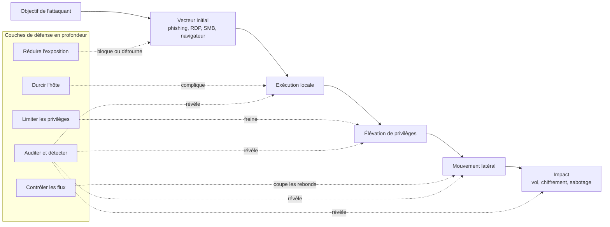

---
tags:
  - hardening
  - securite
  - philosophie
---

# Philosophie du hardening

!!! abstract "Ce que vous allez apprendre"
    - Définir le hardening comme une réduction méthodique du risque.
    - Prioriser les mesures qui réduisent vraiment la surface d'attaque.
    - Comprendre les rôles respectifs du registre, des GPO et du MDM.
    - Préparer un déploiement progressif sans casser la production.

Le hardening Windows n'est pas une collection de "tweaks".
C'est une discipline d'ingénierie.

Son but est simple.
Rendre la compromission plus difficile, la propagation plus coûteuse et la détection plus rapide.

!!! info "Point de départ"
    Un poste ou un serveur Windows "par défaut" n'est pas forcément faible, mais il est souvent plus permissif que nécessaire pour votre contexte.
    Le hardening consiste à ajuster ce niveau d'ouverture au juste besoin opérationnel.

## Qu'est-ce que le hardening ?

Le hardening est l'ensemble des actions qui réduisent l'exposition inutile d'un système.
On retire, limite ou encadre ce qui n'est pas requis pour le service rendu.

Sur Windows, cela touche plusieurs couches.
Le firmware, le noyau, les services, le réseau, l'authentification, les applications et l'administration.

Le hardening ne remplace pas le patching.
Il ne remplace pas non plus l'EDR, l'antivirus ou la supervision.

Il agit en amont.
Il réduit le nombre d'occasions offertes à l'attaquant.

!!! tip "Réduction de la surface d'attaque"
    Réduire la surface d'attaque consiste à diminuer le nombre de points d'entrée exploitables :
    services exposés, protocoles hérités, privilèges excessifs, applications inutiles, scripts non contrôlés, règles réseau trop larges.

!!! example "Exemples très concrets"
    - Désactiver SMBv1 retire un protocole ancien encore exploité dans des scénarios de mouvement latéral.
    - Exiger la NLA sur RDP évite une partie des attaques avant authentification.
    - Retirer les droits d'administrateur local aux utilisateurs standard bloque une grande partie des élévations triviales.
    - Activer des journaux d'audit utiles facilite la détection au lieu de subir une compromission silencieuse.

Le second pilier est la défense en profondeur.
On n'attend pas qu'une seule mesure arrête toute l'attaque.

On empile des contrôles.
Si un contrôle échoue, le suivant doit ralentir, contenir ou révéler l'activité adverse.

!!! warning "Erreur classique"
    Confondre hardening et verrouillage total.
    Un système trop fermé mais non exploitable par l'équipe d'exploitation devient une dette opérationnelle, pas une victoire sécurité.

!!! quote "En résumé"
    Le hardening vise à réduire ce qui est inutile, dangereux ou trop permissif.
    Il ne cherche pas l'invulnérabilité.
    Il cherche un système plus sobre, plus prévisible et plus défendable.

## Les trois axes du hardening

Un programme de durcissement utile tient sur trois axes.
Ils correspondent aux moments clés d'une compromission.

### 1. Réduire l'exposition

On cherche ici à empêcher ou décourager l'accès initial.
C'est la partie la plus rentable.

Elle inclut par exemple :

- désactiver les services et rôles inutiles ;
- fermer les ports et les règles de pare-feu superflus ;
- supprimer les protocoles hérités ;
- limiter les interfaces d'administration ;
- imposer des paramètres d'authentification plus robustes.

### 2. Limiter la propagation

On part du principe qu'un poste finira tôt ou tard compromis.
Le sujet devient alors le confinement.

Cette logique couvre :

- le moindre privilège ;
- la segmentation réseau ;
- la séparation des comptes d'administration ;
- la réduction des chemins de mouvement latéral ;
- le contrôle applicatif et des scripts.

### 3. Augmenter la détection

Une bonne mesure de sécurité non observable est incomplète.
Il faut savoir qu'elle existe, qu'elle est encore appliquée et qu'elle est contournée ou non.

Cela implique :

- des journaux d'audit réellement utiles ;
- une centralisation des événements ;
- des règles de corrélation réalistes ;
- des contrôles de conformité réguliers ;
- une capacité de réponse sur incident.

!!! info "Lecture pratique"
    Réduire l'exposition traite le "comment entrer ?".
    Limiter la propagation traite le "jusqu'où aller ?".
    Augmenter la détection traite le "comment le voir assez tôt ?".

| Axe | Question posée | Mesures typiques |
|---|---|---|
| Réduire l'exposition | Comment empêcher l'entrée ? | Désactivation de services, retrait de protocoles obsolètes, restriction RDP/SMB, patching |
| Limiter la propagation | Comment empêcher l'attaquant de rebondir ? | Moindre privilège, segmentation, Credential Guard, filtrage local, comptes séparés |
| Augmenter la détection | Comment voir et comprendre l'attaque ? | Audit avancé, Event Forwarding, EDR, conformité, alerting |

!!! danger "Ce qu'il faut éviter"
    Investir uniquement dans le troisième axe.
    Détecter parfaitement un protocole ancien que l'on aurait pu simplement désactiver est rarement un bon arbitrage.

!!! quote "En résumé"
    Les trois axes se complètent.
    On évite d'abord l'exposition inutile, puis on prépare le confinement, puis on améliore la visibilité.

## Attaque, vecteur et défense en profondeur

Une attaque ne commence pas au moment où l'attaquant obtient `NT AUTHORITY\SYSTEM`.
Elle commence bien avant.

Le plus souvent, on observe une chaîne.
Vecteur initial, exécution, élévation, propagation, impact.

Le hardening casse cette chaîne à plusieurs endroits.
C'est précisément l'intérêt de la défense en profondeur.

!!! example "Lecture du schéma"
    Désactiver SMBv1 agit tôt.
    LSA Protection ou Credential Guard rendent l'étape de vol d'identifiants plus difficile.
    Le pare-feu local et la segmentation compliquent le rebond.
    L'audit et l'EDR donnent la capacité de voir la chaîne plutôt que son seul effet final.

Une bonne architecture de hardening n'attend pas un contrôle "miracle".
Elle combine des contrôles simples, cohérents et maintenables.

Le système devient alors moins fragile.
Pas parce qu'il est parfait, mais parce qu'il oblige l'attaquant à faire plus de bruit et plus d'erreurs.

!!! quote "En résumé"
    Une attaque suit rarement un seul saut.
    La défense en profondeur consiste à gêner chaque étape, pas seulement l'accès initial.

## Hardening et performance : trouver le bon équilibre

Toute mesure de sécurité a un coût.
Parfois en CPU, parfois en I/O, parfois en complexité d'exploitation.

Le bon réflexe n'est pas de refuser ce coût.
C'est de le mesurer et de le placer là où il produit le plus de réduction de risque.

Quelques exemples de compromis classiques sous Windows :

| Mesure | Gain sécurité | Coût possible | Comment arbitrer |
|---|---|---|---|
| Credential Guard / VBS | Réduction du vol d'identifiants | Incompatibilités pilotes ou applications anciennes | Tester sur matériel réel et versions de pilotes exactes |
| Audit avancé étendu | Meilleure visibilité SOC | Volume de logs, stockage, bruit | Sélectionner les catégories utiles avant de tout activer |
| SMB signing / SMB encryption | Intégrité et confidentialité des échanges | Latence ou CPU sur anciens équipements | Cibler les segments et serveurs qui le justifient |
| Règles ASR | Réduction d'exécution malveillante | Faux positifs sur scripts et softs métier | Déployer en audit, puis en blocage |
| Contrôle applicatif | Très forte réduction du risque d'exécution | Coût de packaging et de support | Réserver aux périmètres les plus exposés ou sensibles |

!!! warning "Mauvaise méthode"
    Déployer une mesure sur tout le parc parce qu'elle est "bonne sur le papier", sans pilote représentatif.
    En hardening, la dette d'exception mal documentée détruit vite le bénéfice initial.

Le bon compromis dépend du type d'actif.
Un poste bureautique, un serveur de fichiers et un contrôleur de domaine n'ont pas le même budget de risque.

Le niveau de protection doit suivre la criticité.
Plus l'impact d'une compromission est élevé, plus on accepte des contraintes opérationnelles fortes.

!!! tip "Règle d'arbitrage"
    Posez trois questions avant d'activer un réglage :
    1. Quel scénario d'attaque concret ce réglage réduit-il ?
    2. Quel impact métier peut-il provoquer ?
    3. Comment vais-je vérifier son effet et son maintien dans le temps ?

!!! quote "En résumé"
    Le hardening n'est pas gratuit.
    L'objectif n'est pas d'éliminer tout coût, mais d'acheter la réduction de risque au meilleur prix opérationnel.

## La règle des 80/20

Tous les paramètres n'ont pas la même valeur.
Certains donnent beaucoup de protection pour très peu d'effort.

La logique 80/20 consiste à déployer d'abord les mesures les plus rentables.
Ce sont elles qui transforment rapidement la posture d'un parc.

### Mesures souvent très rentables

| Mesure | Effort | Gain attendu | Remarque |
|---|---|---|---|
| Appliquer une baseline Microsoft adaptée à l'OS | Faible à moyen | Élevé | Bon socle pour éviter les oublis |
| Supprimer les droits d'admin local aux utilisateurs | Moyen | Très élevé | Impact majeur sur les élévations triviales |
| Désactiver SMBv1 | Faible | Élevé | Très peu de justification moderne |
| Désactiver LLMNR si non requis | Faible | Élevé | Réduit plusieurs scénarios de rebond/résolution abusive |
| Exiger la NLA sur RDP | Faible | Élevé | À compléter par filtrage réseau et MFA si possible |
| Activer un audit pertinent et centralisé | Moyen | Élevé | Sans visibilité, pas de détection sérieuse |
| Isoler les comptes d'administration | Moyen | Très élevé | Mesure structurante, pas cosmétique |

### Mesures utiles mais plus coûteuses

- déploiement de WDAC ;
- VBS sur un parc ancien hétérogène ;
- durcissement très fin de chaque rôle serveur ;
- bascules agressives vers des niveaux de conformité type STIG sans phase d'écart.

!!! info "Approche recommandée"
    Commencez par le socle qui ferme les trous les plus fréquents.
    Réservez les contrôles lourds aux actifs les plus critiques ou aux zones les plus exposées.

Une organisation gagne souvent plus à bien exécuter vingt réglages essentiels qu'à en définir deux cents non maintenus.
Le vrai ennemi est la dérive.

Un paramètre excellent mais jamais contrôlé finit tôt ou tard par disparaître.
Un paramètre simple, vérifié et documenté reste utile.

!!! quote "En résumé"
    Le 80/20 du hardening consiste à traiter d'abord les chemins d'attaque les plus probables avec les réglages les plus soutenables.
    Le meilleur paramètre n'est pas seulement efficace.
    Il est aussi déployable et vérifiable.

## Registre, GPO et MDM : qui écrit quoi, lequel gagne ?

C'est une question centrale sur Windows.
Le piège consiste à croire qu'il existe toujours une hiérarchie unique.

En réalité, il faut distinguer le plan de stockage et le plan de gestion.
Le registre est souvent le stockage final.
La GPO et le MDM sont des mécanismes de pilotage.

### Le registre

Le registre porte énormément d'états de configuration.
Beaucoup de stratégies finissent sous `HKLM\Software\Policies` ou `HKCU\Software\Policies`.

Mais pas toutes.
Certaines stratégies de sécurité vivent dans la base locale de sécurité, les modèles `secedit`, les fichiers `audit.csv`, les magasins de stratégie ou des composants dédiés.

### La GPO

Une GPO exprime une intention d'administration.
Elle s'applique via des extensions côté client.

Selon le type de paramètre, elle peut :

- écrire un `registry.pol` ;
- appliquer un modèle de sécurité ;
- configurer l'audit avancé ;
- poser des fichiers, tâches ou préférences ;
- appeler une extension spécifique.

En environnement AD, la logique d'ordre reste celle de l'héritage des stratégies.
La stratégie locale vient avant les GPO de domaine.

### Le MDM

Le MDM pilote surtout les terminaux modernes et hybrides.
Sous Windows, il passe beaucoup par les CSP et `PolicyManager`.

Quand un réglage MDM a un équivalent GPO dans `Policy CSP`, la coexistence doit être pensée explicitement.
Sinon, vous introduisez de la concurrence de configuration.

!!! warning "Nuance importante sur la priorité"
    Microsoft documente `MDMWinsOverGP`.
    Ce mécanisme ne s'applique qu'aux stratégies exposées dans `Policy CSP` et disposant d'un mappage GPO.
    Il ne s'applique pas à tous les réglages MDM ni à tous les réglages GPO.

### Règles pratiques de lecture

1. Si un réglage est administré par GPO et stocké dans le registre, une modification manuelle directe du registre peut être réécrasée au prochain `gpupdate`.
2. Si le même réglage est administré en MDM et en GPO sans règle de priorité claire, vous créez une course de configuration.
3. Si le réglage n'est pas un simple paramètre de registre, `Get-ItemProperty` ne suffira pas pour l'auditer.

!!! tip "Raccourcis utiles"
    - `++win++` + `++r++`, puis `regedit` pour voir le stockage brut.
    - `++win++` + `++r++`, puis `gpedit.msc` pour la stratégie locale.
    - `++win++` + `++r++`, puis `rsop.msc` pour le résultat de stratégie.
    - `++ctrl++` + `++shift++` + `++enter++` pour lancer une console élevée.

| Cas | Réalité opérationnelle |
|---|---|
| Valeur écrite uniquement à la main dans le registre | Rapide, mais non gouvernée et fragile |
| Valeur écrite par GPO | Réappliquée par le moteur de stratégie, plus gouvernée |
| Valeur écrite par MDM Policy CSP | Pilotée par le canal MDM, parfois en concurrence avec GPO |
| Même réglage géré partout | Risque de dérive et de diagnostic difficile |

!!! quote "En résumé"
    Le registre est souvent l'endroit où la valeur atterrit.
    La vraie question n'est pas seulement "où est la clé ?", mais "qui possède l'autorité de configuration ?".

## Exemples concrets de paramètres de hardening

Tous les réglages ne vivent pas au même endroit.
Le tableau ci-dessous aide à raisonner correctement.

| Paramètre hardening | Où il vit | Qui le déploie |
|---|---|---|
| Désactiver SMBv1 côté serveur | `HKLM\SYSTEM\CurrentControlSet\Services\LanmanServer\Parameters\SMB1` | GPO MS Security Guide, `LGPO.exe`, script PowerShell |
| Désactiver SMBv1 côté client | `HKLM\SYSTEM\CurrentControlSet\Services\mrxsmb10\Start` | GPO MS Security Guide, `LGPO.exe`, script PowerShell |
| Désactiver LLMNR | `HKLM\SOFTWARE\Policies\Microsoft\Windows NT\DNSClient\EnableMulticast` | GPO ADMX, LGPO, Intune Settings Catalog |
| Exiger la NLA sur RDP | `HKLM\SYSTEM\CurrentControlSet\Control\Terminal Server\WinStations\RDP-Tcp\UserAuthentication` | GPO, script, image de référence |
| Activer une stratégie d'audit avancé | `audit.csv` / base locale de sécurité, pas seulement le registre | GPO Security Settings, `LGPO.exe /a`, baseline |

!!! example "Ce que montre ce tableau"
    Un bon ingénieur Windows ne cherche pas une clé de registre par réflexe.
    Il identifie d'abord le type de stratégie, puis le moteur qui l'applique, puis la méthode d'audit adaptée.

Deux conséquences pratiques suivent.

La première :
plus un réglage est piloté centralement, moins une correction manuelle locale est durable.

La seconde :
la méthode de vérification dépend du support réel.
Registre, `RSoP`, `secedit`, rapport MDM ou journal d'événements n'offrent pas la même vérité.

!!! quote "En résumé"
    Un paramètre de hardening n'est pas seulement une valeur.
    C'est un couple : emplacement technique et autorité de déploiement.

## Avant de commencer

Le hardening échoue rarement pour une raison purement technique.
Il échoue surtout à cause d'un manque de préparation.

### 1. Faire l'inventaire

Recensez les versions Windows, les rôles installés, les applications critiques, les dépendances réseau et les profils d'usage.
Un poste VDI, un laptop nomade et un serveur IIS ne partagent pas les mêmes contraintes.

### 2. Fixer une baseline de départ

Choisissez un référentiel.
Microsoft Security Baseline, CIS, STIG ou un profil interne documenté.

L'objectif n'est pas de tout activer.
L'objectif est d'avoir un point de comparaison stable.

### 3. Construire un environnement de test

Le laboratoire doit représenter le réel.
Même version d'OS, mêmes agents, mêmes logiciels métiers et si possible mêmes pilotes.

Un test sur VM propre sans applicatif ne valide presque rien.
Il valide surtout que Windows sait encore démarrer.

### 4. Déployer progressivement

Commencez par un pilote réduit.
Puis une vague restreinte.
Puis le reste du parc.

Définissez dès le départ les critères de succès.
Démarrage, authentification, accès aux partages, impression, VPN, téléphonie, outils d'administration, performance perçue.

### 5. Préparer le retour arrière

Un hardening sérieux prévoit aussi son rollback.
Sauvegarde de GPO, export de baseline, documentation des écarts et procédure de retrait.

### 6. Documenter les exceptions

Si un réglage casse un logiciel métier, ne le supprimez pas en silence.
Documentez l'exception, sa justification, son périmètre et sa date de revue.

!!! danger "Interdit en production"
    Modifier directement des dizaines de paramètres sur un serveur critique via `regedit` ou `gpedit.msc` sans plan de retour arrière.
    Le gain apparent de vitesse est presque toujours perdu pendant le diagnostic.

!!! tip "Checklist minimale avant pilote"
    - Inventaire des rôles et logiciels sensibles.
    - Baseline choisie et version figée.
    - Groupe pilote identifié.
    - Procédure de retour arrière écrite.
    - Méthode de vérification définie.

Le hardening est un processus.
Pas un acte unique.

On mesure, on ajuste, on déploie, on surveille.
Puis on recommence quand l'OS, les menaces ou les usages changent.

!!! quote "En résumé"
    Avant de durcir, il faut connaître l'existant, choisir un référentiel, tester dans un contexte réaliste et déployer par vagues.
    Le bon hardening est reproductible.
    Le meilleur hardening est aussi réversible.
