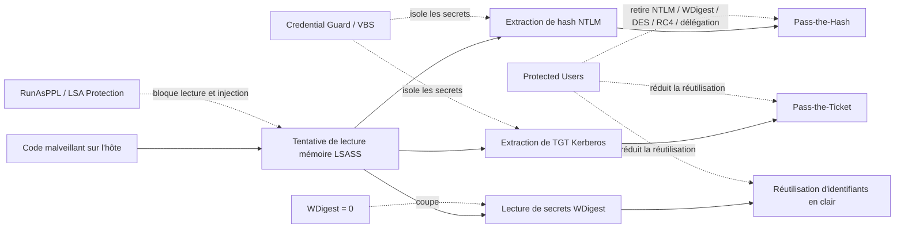

---
tags:
  - hardening
  - credentials
  - LSASS
  - CredentialGuard
---

# Protection des identifiants

!!! abstract "Ce que vous allez apprendre"
    - Comprendre pourquoi `LSASS`, `NTLM`, `Kerberos` et les secrets de session sont des cibles prioritaires.
    - Désactiver `WDigest` proprement et vérifier l'état réel du système.
    - Déployer `LSA Protection` et `Credential Guard` sans les confondre.
    - Utiliser `Protected Users` sur les bons comptes et éviter les pièges de compatibilité.

Le durcissement Windows ne protège pas seulement des services ou des ports.
Il protège surtout des secrets.

Quand un attaquant obtient des identifiants, il n'a plus besoin d'exploit.
Il commence à se déplacer en utilisant les mécanismes légitimes de l'OS.

!!! info "Fil directeur"
    Sur un poste ou un serveur Windows, la bataille se joue souvent autour de trois objets :
    `lsass.exe`, les tickets Kerberos et les secrets dérivés de NTLM.

## Pourquoi les identifiants sont la cible prioritaire des attaquants

Un attaquant ne cherche pas toujours à casser un mot de passe.
Il cherche souvent à réutiliser un secret déjà présent.

Dans un environnement Active Directory, cette logique est redoutable.
Un poste compromis devient une station de collecte d'identifiants et de tickets.

### Pass-the-Hash

Le `pass-the-hash` consiste à réutiliser un condensat `NTLM`.
L'attaquant n'a pas besoin du mot de passe en clair.

Si le hash permet d'authentifier une session réseau, il devient exploitable.
Le vol d'un hash peut donc suffire à pivoter vers d'autres systèmes.

### Pass-the-Ticket

Le `pass-the-ticket` vise les tickets Kerberos.
La cible la plus intéressante reste souvent le `TGT`.

Si l'attaquant récupère un ticket valide, il peut l'injecter dans une autre session.
Le mouvement latéral devient alors beaucoup plus discret.

### Credential dumping depuis `LSASS`

`LSASS` gère l'authentification locale et distante.
C'est aussi un point d'agrégation de secrets sensibles.

Selon la configuration de la machine, un attaquant avec des privilèges élevés peut chercher à :

- lire la mémoire de `lsass.exe` ;
- injecter du code dans le processus ;
- extraire des hashes `NTLM` ;
- extraire des tickets Kerberos ;
- récupérer des secrets stockés par des composants d'authentification.

Microsoft documente explicitement deux grandes familles d'attaque ici :
`pass-the-hash` et `pass-the-ticket`.

!!! warning "Point important"
    Le vrai risque ne vient pas seulement de l'accès initial.
    Il vient du moment où un compte privilégié se connecte sur une machine insuffisamment durcie.

### Pourquoi cette cible est si rentable

Un secret d'authentification est réutilisable.
Il donne souvent accès à plusieurs systèmes.

De plus, il ouvre la voie à un usage "légitime" des protocoles Windows.
L'attaquant utilise alors SMB, WinRM, RPC ou RDP avec des preuves d'identité valides.

Cette asymétrie explique pourquoi la protection des identifiants est structurante.
On ne cherche pas seulement à éviter un vol local, mais un effet domino sur tout le domaine.

!!! example "Scénario typique"
    Un poste utilisateur est compromis.
    Un administrateur local ou serveur s'y connecte.
    L'attaquant tente ensuite un `credential dumping`, puis réutilise le hash ou le ticket sur un autre hôte.

!!! quote "En résumé"
    Les identifiants sont la cible prioritaire car ils transforment une compromission locale en capacité de rebond.
    Protéger `LSASS`, `NTLM` et `Kerberos` revient à casser la chaîne d'escalade la plus rentable pour l'attaquant.

## WDigest : comprendre le risque

`WDigest` est un mécanisme historique.
Son principal risque vient du stockage en mémoire des informations nécessaires à certaines authentifications.

Sur les systèmes anciens ou mal configurés, `WDigest` peut conduire à conserver des secrets en mémoire.
C'est précisément ce que les outils de `credential dumping` cherchent à exploiter.

Microsoft indique qu'après l'évolution introduite avec l'avis de sécurité de 2014 :

- `UseLogonCredential = 0` empêche `WDigest` de stocker les identifiants en mémoire ;
- `UseLogonCredential = 1` autorise ce stockage ;
- sur `Windows 8.1` / `Windows Server 2012 R2` et versions ultérieures, l'absence de valeur revient par défaut à un comportement désactivé.

### Emplacement registre

Le paramètre vit ici :

```text
HKLM\SYSTEM\CurrentControlSet\Control\SecurityProviders\WDigest
```

La valeur à poser est :

```text
UseLogonCredential = 0
Type = REG_DWORD
```

### Pourquoi le régler explicitement

Sur des parcs hétérogènes, une valeur absente n'est pas toujours confortable à auditer.
Poser explicitement `0` simplifie la conformité.

Cela permet aussi de rendre l'intention de durcissement visible.
On évite les ambiguïtés entre défaut système, héritage d'image et dérive locale.

!!! tip "Recommandation de terrain"
    Même si les versions récentes désactivent `WDigest` par défaut quand la valeur n'existe pas, écrire explicitement `0` reste une bonne pratique d'audit et d'industrialisation.

### Déploiement via GPO ou script

Il n'existe pas de réglage de sécurité classique `secpol.msc` dédié à `WDigest`.
En pratique, on le déploie par :

- `Group Policy Preferences` de type registre ;
- script `PowerShell` ;
- baseline interne ;
- solution MDM ou CSP personnalisée si nécessaire.

### Exemple PowerShell

```powershell
New-Item -Path "HKLM:\SYSTEM\CurrentControlSet\Control\SecurityProviders\WDigest" -Force | Out-Null
Set-ItemProperty `
  -Path "HKLM:\SYSTEM\CurrentControlSet\Control\SecurityProviders\WDigest" `
  -Name UseLogonCredential `
  -Type DWord `
  -Value 0
```

### Vérification PowerShell

```powershell
Get-ItemProperty `
  -Path "HKLM:\SYSTEM\CurrentControlSet\Control\SecurityProviders\WDigest" `
  -Name UseLogonCredential `
  -ErrorAction SilentlyContinue | Select-Object UseLogonCredential
```

### Lecture du résultat

- `0` : le stockage mémoire par `WDigest` est désactivé ;
- `1` : le stockage mémoire est autorisé ;
- aucune valeur : sur les versions modernes, le comportement par défaut est normalement désactivé, mais il faut valider votre standard interne.

!!! danger "Erreur classique"
    Réactiver `UseLogonCredential = 1` pour contourner un cas applicatif ponctuel expose à nouveau le poste au vol de secrets en mémoire.
    Toute exception doit être documentée et limitée.

!!! quote "En résumé"
    `WDigest` est un risque historique encore pertinent dans les audits.
    La valeur sûre est `UseLogonCredential = 0`, posée explicitement et vérifiée dans le temps.

## LSA Protection : `RunAsPPL`

La `LSA Protection` vise `LSASS` directement.
Son objectif est d'empêcher les processus non protégés de lire sa mémoire ou d'y injecter du code.

Microsoft parle ici de `Protected Process Light`, ou `PPL`.
Une fois activé, `LSASS` s'exécute comme processus protégé.

### Emplacement registre

Le paramètre se trouve ici :

```text
HKLM\SYSTEM\CurrentControlSet\Control\Lsa
```

### Valeurs officiellement documentées

La documentation Microsoft Learn actuelle documente :

- `RunAsPPL = 1` : activation avec variable `UEFI` ;
- `RunAsPPL = 2` : activation sans variable `UEFI`, applicable sur `Windows 11 22H2+` ;
- `RunAsPPL = 0` ou absence de valeur : désactivation.

### Nuance importante sur la valeur `4`

La valeur `4` circule souvent dans des billets terrain.
Ce n'est pas la valeur principale actuellement documentée pour configurer `RunAsPPL` dans le registre.

En revanche, Microsoft documente bien l'événement `WinInit` suivant pour la vérification :

```text
12: LSASS.exe was started as a protected process with level: 4
```

Autrement dit :
`4` est une valeur de niveau observée dans la télémétrie de démarrage, pas la valeur de configuration registre mise en avant par Microsoft Learn.

!!! info "Position retenue dans ce chapitre"
    Pour un déploiement registre documenté et supportable, retenez `RunAsPPL = 2` sans verrou `UEFI`, ou la stratégie de groupe équivalente.
    N'utilisez pas `4` comme valeur primaire de configuration sans référentiel officiel interne qui le justifie.

### Effet de sécurité

Quand `LSASS` tourne en `PPL`, les composants non conformes ne peuvent plus se comporter librement autour du processus.
Cela réduit fortement certaines formes de `credential dumping`.

Ce n'est pas équivalent à `Credential Guard`.
`LSA Protection` protège le processus `LSASS`, alors que `Credential Guard` isole certains secrets via `VBS`.

### UEFI, Secure Boot et verrou firmware

Microsoft indique qu'avec `Secure Boot` et `UEFI`, on peut stocker la configuration comme variable firmware.
Dans ce cas, la désactivation par simple changement de registre ne suffit plus.

Cela renforce la résistance au contournement.
Le coût est un retrait plus contraint si un rollback devient nécessaire.

### Déploiement via GPO

Le chemin GPO documenté par Microsoft est :

```text
Computer Configuration
  > Administrative Templates
  > System
  > Local Security Authority
  > Configures LSASS to run as a protected process
```

Les options proposées sont :

- `Enabled with UEFI Lock` ;
- `Enabled without lock` ;
- `Disabled`.

### Déploiement via registre

```powershell
Set-ItemProperty `
  -Path "HKLM:\SYSTEM\CurrentControlSet\Control\Lsa" `
  -Name RunAsPPL `
  -Type DWord `
  -Value 2
```

### Vérification PowerShell

Vérification de la valeur de configuration :

```powershell
Get-ItemProperty `
  -Path "HKLM:\SYSTEM\CurrentControlSet\Control\Lsa" `
  -Name RunAsPPL `
  -ErrorAction SilentlyContinue | Select-Object RunAsPPL
```

Vérification du démarrage protégé de `LSASS` :

```powershell
Get-WinEvent -FilterHashtable @{
    LogName = 'System'
    ProviderName = 'Microsoft-Windows-WinInit'
    Id = 12
} -MaxEvents 1 | Select-Object TimeCreated, Id, Message
```

### Ce qu'il faut tester avant activation

Microsoft recommande d'identifier tous les plug-ins et pilotes LSA utilisés :

- pilotes de cartes à puce ;
- plug-ins cryptographiques ;
- filtres de mot de passe ;
- composants internes chargés par `LSASS`.

Ils doivent respecter les exigences de signature Microsoft.
Sinon ils peuvent ne plus se charger.

!!! warning "Piège fréquent"
    Un ancien agent de sécurité, un ancien EDR ou un composant d'authentification qui s'appuie sur des mécanismes de `hooking` autour de `LSASS` peut cesser de fonctionner après activation de `RunAsPPL`.

!!! quote "En résumé"
    `RunAsPPL` protège `LSASS` comme processus.
    C'est une mesure forte contre la lecture mémoire et l'injection, mais elle exige un test sérieux des plug-ins et composants de sécurité.

## Credential Guard : protection des secrets via `VBS`

`Credential Guard` va plus loin que `RunAsPPL`.
Il ne protège pas seulement le processus.

Il isole des secrets d'authentification au moyen de `Virtualization-Based Security`.
Microsoft cite explicitement la protection des hashes `NTLM`, des `TGT` Kerberos et des identifiants stockés comme informations d'identification de domaine.

### Ce que Credential Guard bloque

L'objectif principal est de casser les techniques de vol qui mènent à :

- `pass-the-hash` ;
- `pass-the-ticket` ;
- extraction de secrets dérivés depuis l'OS courant.

Microsoft indique aussi qu'un malware déjà administrateur dans l'OS ne peut pas extraire les secrets protégés par `VBS`.
C'est la différence structurante avec une simple protection de processus.

### Prérequis : ce qu'il faut dire précisément

En pratique, un déploiement moderne retient souvent :

- `VBS` ;
- `Secure Boot` ;
- une plateforme `UEFI` ;
- idéalement `TPM 2.0`.

Mais la documentation Microsoft actuelle précise :

- `Credential Guard` requiert `VBS` ;
- `Secure Boot` est requis ;
- `TPM` est recommandé, avec prise en charge `1.2` et `2.0` ;
- sur `Windows 11`, `TPM 2.0` est de toute façon imposé au niveau plateforme.

!!! info "Interprétation correcte"
    Pour un poste `Windows 11` d'entreprise, parler de `TPM 2.0 + UEFI Secure Boot + VBS` reste juste en pratique.
    Pour la fonctionnalité `Credential Guard` elle-même, Microsoft documente surtout `VBS` et `Secure Boot` comme nécessaires, et `TPM` comme recommandé.

### Clés registre utiles

Le couple de clés le plus important est :

```text
HKLM\SYSTEM\CurrentControlSet\Control\DeviceGuard\EnableVirtualizationBasedSecurity = 1
HKLM\SYSTEM\CurrentControlSet\Control\Lsa\LsaCfgFlags = 1 ou 2
```

Avec en complément :

```text
HKLM\SYSTEM\CurrentControlSet\Control\DeviceGuard\RequirePlatformSecurityFeatures
1 = Secure Boot
3 = Secure Boot + DMA protection
```

### Pourquoi la clé `EnableVirtualizationBasedSecurity = 1` ne suffit pas

Activer `VBS` n'active pas automatiquement `Credential Guard`.
Il faut aussi configurer `LsaCfgFlags`.

Les valeurs Microsoft documentées sont :

- `1` : `Credential Guard` activé avec verrou `UEFI` ;
- `2` : activé sans verrou ;
- `0` : désactivé.

### Déploiement via GPO

Le chemin officiel est :

```text
Computer Configuration
  > Administrative Templates
  > System
  > Device Guard
  > Turn On Virtualization Based Security
```

Dans cette stratégie, on choisit ensuite :

- `Credential Guard Configuration` ;
- `Enabled with UEFI lock` ou `Enabled without lock`.

### Déploiement via registre

```powershell
Set-ItemProperty `
  -Path "HKLM:\SYSTEM\CurrentControlSet\Control\DeviceGuard" `
  -Name EnableVirtualizationBasedSecurity `
  -Type DWord `
  -Value 1

Set-ItemProperty `
  -Path "HKLM:\SYSTEM\CurrentControlSet\Control\DeviceGuard" `
  -Name RequirePlatformSecurityFeatures `
  -Type DWord `
  -Value 1

Set-ItemProperty `
  -Path "HKLM:\SYSTEM\CurrentControlSet\Control\Lsa" `
  -Name LsaCfgFlags `
  -Type DWord `
  -Value 2
```

### Vérification PowerShell

Microsoft recommande une vérification via `Win32_DeviceGuard` :

```powershell
(Get-CimInstance `
  -ClassName Win32_DeviceGuard `
  -Namespace root\Microsoft\Windows\DeviceGuard).SecurityServicesRunning
```

Interprétation minimale :

- `0` : `Credential Guard` non actif ;
- `1` : `Credential Guard` actif.

Microsoft précise aussi que la simple présence de `LsaIso.exe` dans le Gestionnaire des tâches n'est pas une méthode de vérification recommandée.

### Limites et impacts applicatifs

`Credential Guard` n'est pas neutre.
Microsoft documente des incompatibilités quand des applications ou protocoles dépendent de :

- `Kerberos DES` ;
- délégation Kerberos non contrainte ;
- extraction de `TGT` ;
- `NTLMv1` ;
- `Digest` ;
- `CredSSP` ;
- `MS-CHAPv2`.

Microsoft ajoute que certaines applications peuvent aussi provoquer des problèmes de performance en tentant de s'accrocher au processus isolé `LSAIso.exe`.

!!! warning "Deux pièges à retenir"
    - `Credential Guard` n'est pas recommandé sur les contrôleurs de domaine.
    - `Credential Guard` n'est pas supporté sur Exchange Server et peut y provoquer des problèmes de performance.

!!! quote "En résumé"
    `Credential Guard` protège les secrets par isolation `VBS`.
    C'est plus fort que `RunAsPPL`, mais aussi plus exigeant en prérequis et en compatibilité.

## `Credential Guard` vs `LSA Protection`

Les deux contrôles visent les identifiants.
Ils n'agissent pas au même niveau.

| Critère | `LSA Protection / RunAsPPL` | `Credential Guard` |
|---|---|---|
| Cible principale | Le processus `LSASS` | Les secrets `NTLM` / `Kerberos` / credentials dérivés |
| Mécanisme | `Protected Process Light` | `VBS` + isolation dans un environnement protégé |
| Registre principal | `HKLM\SYSTEM\CurrentControlSet\Control\Lsa\RunAsPPL` | `HKLM\SYSTEM\CurrentControlSet\Control\DeviceGuard\EnableVirtualizationBasedSecurity` + `HKLM\SYSTEM\CurrentControlSet\Control\Lsa\LsaCfgFlags` |
| Valeur de base | `2` sans lock ou stratégie équivalente | `EnableVirtualizationBasedSecurity = 1` puis `LsaCfgFlags = 1/2` |
| Ce que ça bloque | Lecture mémoire et injection autour de `LSASS` | Extraction de secrets protégés par `VBS`, `pass-the-hash`, `pass-the-ticket` |
| Impact typique | Plug-ins/pilotes LSA non conformes | Protocoles/applications reposant sur `NTLMv1`, `Digest`, `CredSSP`, délégation non contrainte |

### Positionnement opérationnel

Sur un poste d'administration ou un laptop sensible, les deux contrôles sont complémentaires.
`RunAsPPL` protège l'enveloppe.

`Credential Guard` protège le contenu sensible.
Les cumuler est cohérent si le matériel et les usages le permettent.

!!! tip "Règle simple"
    Si vous ne pouvez en déployer qu'un rapidement, `RunAsPPL` est souvent plus simple.
    Si la plateforme est prête pour `VBS`, `Credential Guard` apporte une protection supérieure contre le réemploi des secrets.

!!! quote "En résumé"
    `RunAsPPL` et `Credential Guard` ne sont pas concurrents.
    Le premier protège `LSASS`, le second isole des secrets pour rendre leur vol beaucoup plus difficile.

## Groupe de sécurité `Protected Users`

`Protected Users` est un groupe de sécurité global d'Active Directory.
Il sert à réduire l'exposition des comptes les plus sensibles au vol d'identifiants.

Ce groupe applique des protections non configurables.
Elles s'activent lorsque l'utilisateur membre se connecte.

### Effets côté poste

Microsoft documente notamment les protections suivantes :

- `CredSSP` ne met plus en cache les identifiants en clair ;
- `Windows Digest` ne met plus en cache les identifiants en clair ;
- `NTLM` cesse de mettre en cache les secrets nécessaires ;
- `Kerberos` ne crée plus de clés `DES` ou `RC4` ;
- le système ne crée plus de `cached verifier`, ce qui retire la prise en charge de la connexion hors ligne.

### Effets côté contrôleur de domaine

Les membres `Protected Users` ne peuvent plus :

- s'authentifier en `NTLM` ;
- utiliser `DES` ou `RC4` en préauthentification Kerberos ;
- déléguer avec délégation contrainte ou non contrainte ;
- renouveler indéfiniment leur `TGT`, la durée étant ramenée à quatre heures.

### Quand l'utiliser

Le bon périmètre est clair :

- comptes d'administration sensibles ;
- comptes d'exploitation hautement privilégiés ;
- comptes d'accès ponctuel ;
- comptes "glass-break" bien testés.

### Quand ne pas l'utiliser

Microsoft déconseille explicitement d'ajouter :

- les comptes de service ;
- les comptes machine ;
- des groupes très privilégiés sans phase de test sérieuse.

La raison est simple :
ces comptes dépendent souvent de mécanismes incompatibles avec les restrictions du groupe.

### Prérequis

La documentation Microsoft demande notamment :

- un niveau fonctionnel de domaine `Windows Server 2012 R2` ou supérieur ;
- des hôtes clients compatibles ;
- des tests de compatibilité avant généralisation.

!!! danger "Service accounts exclus"
    Ne placez pas les comptes de service ni les comptes ordinateurs dans `Protected Users`.
    Le groupe n'est pas conçu pour eux et peut casser des scénarios d'authentification légitimes.

!!! example "Bon usage"
    Un compte d'administration `Tier 0` utilisé uniquement depuis un poste d'administration dédié est un bon candidat à `Protected Users`.

!!! quote "En résumé"
    `Protected Users` est une protection Active Directory très efficace pour les comptes humains sensibles.
    Ce n'est pas un groupe à usage générique, et encore moins pour les comptes de service.

## Diagramme : du `credential dumping` aux contrôles de blocage

Le schéma ci-dessous aide à visualiser où chaque contrôle agit.
Il ne faut pas les voir comme des doublons.



### Lecture du schéma

`WDigest` traite un cas historique très ciblé.
`RunAsPPL` protège la porte d'entrée autour de `LSASS`.

`Credential Guard` protège la valeur elle-même.
`Protected Users` agit sur le comportement des comptes les plus sensibles.

!!! quote "En résumé"
    Aucun contrôle ne couvre tout seul tout le cycle du vol d'identifiants.
    La bonne stratégie combine désactivation des héritages dangereux, protection de `LSASS`, isolation des secrets et restriction des comptes sensibles.

## Tableau de synthèse

Le tableau suivant résume les contrôles les plus utiles pour ce chapitre.
Il aide aussi à choisir la bonne méthode de déploiement.

| Contrôle | Clé registre | Équivalent GPO | Niveau de protection |
|---|---|---|---|
| Désactiver `WDigest` | `HKLM\SYSTEM\CurrentControlSet\Control\SecurityProviders\WDigest\UseLogonCredential = 0` | Pas de sécurité option native ; déploiement via `GPP Registry` ou script | Bon durcissement ciblé |
| `LSA Protection` | `HKLM\SYSTEM\CurrentControlSet\Control\Lsa\RunAsPPL = 2` | `Computer Configuration\Administrative Templates\System\Local Security Authority\Configures LSASS to run as a protected process` | Élevé contre lecture/injection LSASS |
| `VBS` pour `Credential Guard` | `HKLM\SYSTEM\CurrentControlSet\Control\DeviceGuard\EnableVirtualizationBasedSecurity = 1` | `Computer Configuration\Administrative Templates\System\Device Guard\Turn On Virtualization Based Security` | Préparation nécessaire |
| `Credential Guard` | `HKLM\SYSTEM\CurrentControlSet\Control\Lsa\LsaCfgFlags = 1/2` | Même stratégie `Device Guard`, option `Credential Guard Configuration` | Très élevé contre vol de secrets protégés |
| `Protected Users` | Aucun registre local principal ; contrôle AD | Ajout au groupe AD `Protected Users` | Très élevé pour comptes sensibles, usage ciblé |

!!! tip "Lecture du niveau de protection"
    Le niveau "très élevé" ne veut pas dire "déployer partout".
    Il veut dire "fortement efficace si la compatibilité et le modèle d'administration sont maîtrisés".

!!! quote "En résumé"
    Le bon déploiement combine plusieurs couches.
    La clé de registre n'est qu'un détail d'implémentation ; la vraie question reste le bon contrôle sur le bon périmètre.

## Pièges et stratégie de déploiement

Les protections d'identifiants sont puissantes.
Elles sont aussi parmi les plus susceptibles d'exposer des dépendances cachées.

### Piège 1 : activer `RunAsPPL` sans inventaire

Si un composant LSA n'est pas conforme aux exigences de signature Microsoft, il peut ne plus charger.
Le système ne casse pas toujours immédiatement, mais le flux d'authentification ou l'agent concerné peut se dégrader.

Les catégories à auditer avant activation sont :

- agents de sécurité anciens ;
- composants smart card ;
- filtres de mot de passe ;
- modules cryptographiques ;
- composants internes chargés par `LSASS`.

### Piège 2 : activer `Credential Guard` sans lire les exigences applicatives

Microsoft documente des incompatibilités sur des usages précis :

- `NTLMv1` ;
- `Digest` ;
- `MS-CHAPv2` ;
- `CredSSP` avec certains scénarios de délégation ;
- délégation Kerberos non contrainte ;
- certains scénarios `Wi-Fi` ou `VPN` basés sur des protocoles anciens.

### Piège 3 : croire que `Credential Guard` remplace tout

`Credential Guard` ne protège pas :

- la base `Active Directory` sur les contrôleurs de domaine ;
- le `SAM` local ;
- toutes les erreurs de pratique d'administration.

Si un compte `Tier 0` se connecte sur un poste non maîtrisé, le risque demeure.
Il change de forme, mais il ne disparaît pas.

### Piège 4 : généraliser `Protected Users`

Le groupe est excellent pour les comptes humains sensibles.
Il est mauvais pour les comptes de service.

Un ajout massif sans phase de test peut créer des échecs d'authentification ou de délégation.
Sur des groupes très privilégiés, cela peut même provoquer un verrouillage opérationnel.

### Ordre de déploiement conseillé

1. Poser `WDigest = 0` partout où c'est pertinent.
2. Piloter `RunAsPPL` sur un lot représentatif.
3. Vérifier `CodeIntegrity` et les agents de sécurité.
4. Tester `Credential Guard` sur le matériel et les scénarios d'authentification réels.
5. Ajouter `Protected Users` sur un périmètre très restreint de comptes humains privilégiés.

!!! warning "Point de méthode"
    Les postes d'administration et les comptes sensibles doivent être les premiers bénéficiaires.
    Ce sont aussi les premiers endroits où une exception non documentée devient dangereuse.

!!! quote "En résumé"
    La protection des identifiants est un domaine où l'ordre de déploiement compte presque autant que le réglage lui-même.
    On commence simple, on valide les dépendances, puis on élève le niveau de protection.
