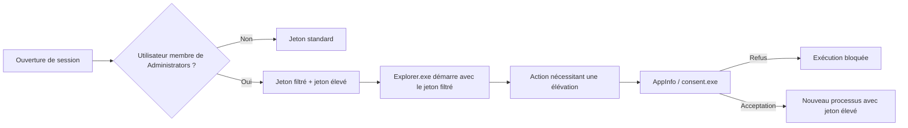
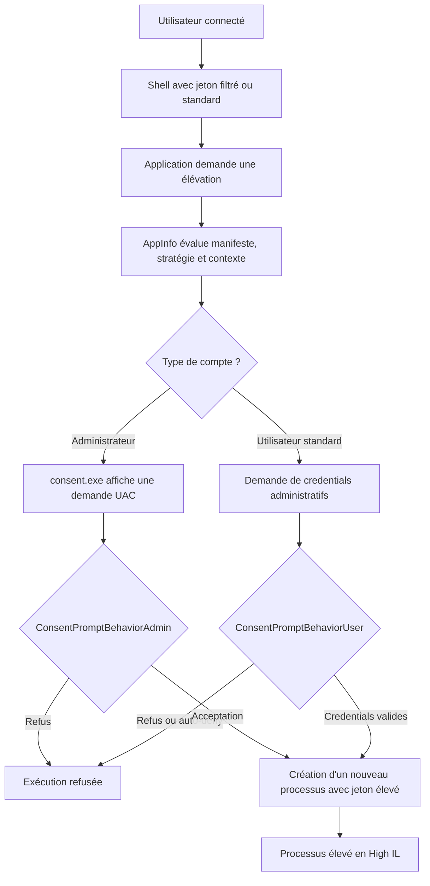

---
tags:
  - hardening
  - UAC
  - privileges
  - token
---

# UAC et privilèges

!!! abstract "Ce que couvre ce chapitre"
    L'User Account Control (UAC) n'est pas un simple pop-up.
    C'est un mécanisme de séparation des jetons, de réduction de l'exposition aux privilèges élevés et de contrôle des demandes d'élévation.
    Bien configuré, il freine l'exécution silencieuse avec droits d'administration et réduit la valeur d'un poste compromis.

## Pourquoi UAC reste un contrôle de hardening

UAC cherche à empêcher qu'un utilisateur membre du groupe `Administrators`
travaille en permanence avec un jeton d'administration complet.
L'objectif est de limiter l'exposition des privilèges élevés.

Microsoft décrit ce modèle comme la base de l'Admin Approval Mode.
En pratique, un administrateur interactif reçoit deux contextes d'exécution.
Le poste utilise d'abord le contexte le moins privilégié.

Sur un poste où tout le monde travaille administrateur local,
le code malveillant hérite plus facilement de privilèges puissants.
Le passage par une demande d'élévation ajoute une rupture utile.

!!! info "Effet opérationnel"
    UAC ne remplace ni AppLocker, ni WDAC, ni un EDR.
    En revanche, il réduit les élévations triviales et rend plus visible l'usage du privilège.

!!! warning "Erreur classique"
    Désactiver UAC parce qu'une application ancienne le supporte mal
    revient à supprimer un garde-fou central.
    Microsoft déconseille explicitement de désactiver `EnableLUA`.

!!! quote "En résumé"
    UAC sert à empêcher l'usage permanent du jeton élevé.
    Sa valeur vient de la séparation entre travail quotidien et privilège d'administration.

## Comment fonctionne UAC

Quand un utilisateur standard ouvre une session,
il reçoit un jeton standard.
Toute action nécessitant des droits élevés doit présenter des identifiants.

Quand un utilisateur membre de `Administrators` ouvre une session,
Windows crée deux jetons.
Ce modèle est couramment appelé `split-token`.

Le premier est un jeton filtré.
Les SID d'administration et plusieurs privilèges puissants sont retirés ou désactivés.
Le shell interactif s'exécute en général avec ce jeton filtré.

Le second est un jeton élevé.
Il n'est utilisé qu'après approbation UAC.
Cette séparation évite d'exposer d'emblée le contexte administrateur complet.

Le composant qui présente l'interface de consentement est `consent.exe`.
Sur un système Windows actuel, sa description de fichier est
`Interface utilisateur de consentement pour des applications administratives`.

!!! example "Chemin d'élévation typique"
    1. L'utilisateur lance une action nécessitant un niveau plus élevé.
    2. Le service `AppInfo` détermine si une élévation est requise.
    3. `consent.exe` affiche la demande de consentement ou de credentials.
    4. Si la demande est approuvée, le processus démarre avec le jeton élevé.

!!! tip "Raccourci utile"
    `++ctrl++` + `++shift++` + `++enter++` depuis le menu Démarrer
    ou la boîte `++win++` + `++r++`
    force une demande d'élévation pour l'application ciblée.



!!! quote "En résumé"
    Le coeur d'UAC est la dualité jeton filtré / jeton élevé.
    `consent.exe` n'accorde pas plus de droits au shell existant.
    Il déclenche la création d'un nouveau contexte élevé.

## Les clés de registre UAC à connaître

Les réglages UAC principaux vivent sous :
`HKLM\SOFTWARE\Microsoft\Windows\CurrentVersion\Policies\System`.
Ils peuvent être lus localement, pilotés par GPO ou imposés par baseline.

Le paramètre le plus critique est `EnableLUA`.
S'il vaut `0`, le modèle UAC est désactivé.
Le poste cesse alors d'utiliser l'Admin Approval Mode.

Microsoft recommande de laisser `EnableLUA = 1`.
La désactivation supprime les invites UAC et fait travailler
les comptes administrateurs avec leur jeton complet.

`ConsentPromptBehaviorAdmin` pilote le comportement des membres
du groupe `Administrators` quand une élévation est nécessaire.
`ConsentPromptBehaviorUser` pilote celui des utilisateurs standards.

!!! info "Clés principales"
    Chemin :
    `HKLM\SOFTWARE\Microsoft\Windows\CurrentVersion\Policies\System`

| Valeur | Type | Rôle |
|---|---|---|
| `EnableLUA` | `REG_DWORD` | Active le modèle UAC |
| `ConsentPromptBehaviorAdmin` | `REG_DWORD` | Détermine la demande d'élévation pour les admins |
| `ConsentPromptBehaviorUser` | `REG_DWORD` | Détermine la demande d'élévation pour les utilisateurs standards |
| `PromptOnSecureDesktop` | `REG_DWORD` | Place l'invite sur le bureau sécurisé |
| `ValidateAdminCodeSignatures` | `REG_DWORD` | Force la validation de signature pour les exécutables élevés |

!!! danger "Ne jamais désactiver `EnableLUA`"
    Passer `EnableLUA` à `0` casse l'hypothèse de séparation des jetons.
    Ce n'est pas un réglage de confort.
    C'est un changement d'architecture de sécurité.

!!! example "Vérification PowerShell"
    ```powershell
    $Path = 'HKLM:\SOFTWARE\Microsoft\Windows\CurrentVersion\Policies\System'
    Get-ItemProperty -Path $Path |
      Select-Object EnableLUA,
                    ConsentPromptBehaviorAdmin,
                    ConsentPromptBehaviorUser,
                    PromptOnSecureDesktop,
                    ValidateAdminCodeSignatures
    ```

!!! quote "En résumé"
    La ruche `Policies\System` concentre les réglages UAC structurants.
    Le premier impératif est simple : `EnableLUA` doit rester à `1`.

## Lire correctement `ConsentPromptBehaviorAdmin`

Cette valeur décide comment Windows traite
les demandes d'élévation pour un administrateur en Admin Approval Mode.
Elle ne change pas les ACL ; elle change le chemin d'accès au jeton élevé.

La valeur `5` est la valeur par défaut sur les clients Windows.
Elle déclenche un consentement pour les binaires non Windows.
Elle est donc plus permissive que `2`.

La valeur `2` demande un consentement
sur le bureau sécurisé.
Elle constitue le choix de hardening le plus courant côté poste utilisateur.

| `ConsentPromptBehaviorAdmin` | Comportement | Lecture sécurité |
|---|---|---|
| `0` | Élévation sans invite | Très faible |
| `1` | Demande de credentials sur bureau sécurisé | Élevée, mais plus lourde |
| `2` | Demande de consentement sur bureau sécurisé | Élevée, compromis fréquent |
| `3` | Demande de credentials | Moyenne à élevée |
| `4` | Demande de consentement | Moyenne |
| `5` | Consentement pour binaires non Windows | Moyenne, valeur par défaut |

!!! warning "Valeur `0`"
    `ConsentPromptBehaviorAdmin = 0`
    revient à autoriser l'élévation silencieuse des administrateurs.
    Ce réglage supprime une barrière utile face aux abus locaux.

!!! tip "Lecture rapide"
    Plus la valeur réduit le nombre de cas silencieux,
    plus elle est robuste.
    Le bureau sécurisé ajoute une protection contre l'interposition visuelle.

!!! quote "En résumé"
    Pour les administrateurs, la question n'est pas de savoir
    s'il faut un prompt, mais quel type de prompt.
    En hardening, `2` est généralement le point d'équilibre.

## Lire correctement `ConsentPromptBehaviorUser`

Pour un utilisateur standard,
UAC ne peut pas approuver une élévation sans identité administrative.
Le système doit soit demander des credentials, soit refuser.

La valeur `0` provoque un refus automatique.
Elle est utile dans des environnements très verrouillés
ou quand aucune élévation interactive n'est autorisée.

La valeur `1` demande des credentials sur le bureau sécurisé.
La valeur `3` demande des credentials hors bureau sécurisé.
Le `1` est donc plus robuste.

| `ConsentPromptBehaviorUser` | Comportement | Lecture sécurité |
|---|---|---|
| `0` | Refus automatique | Très élevée, mais restrictive |
| `1` | Demande de credentials sur bureau sécurisé | Élevée |
| `3` | Demande de credentials | Moyenne |

!!! info "Cas d'usage"
    Sur un poste d'administration ou un PAW,
    le refus automatique peut être pertinent.
    Sur un poste bureautique, la demande de credentials reste souvent plus praticable.

!!! quote "En résumé"
    Pour les utilisateurs standards, l'enjeu n'est pas le consentement.
    L'enjeu est de savoir si une identité administrative peut être fournie,
    et dans quelles conditions d'affichage.

## Recommandation de baseline : `ConsentPromptBehaviorAdmin = 2`

La recommandation de baseline la plus fréquente
consiste à exiger un consentement sur bureau sécurisé.
Elle limite l'élévation silencieuse sans imposer la saisie d'un mot de passe admin.

`ConsentPromptBehaviorAdmin = 2`
est souvent retenu sur les postes clients.
Il améliore la friction défensive tout en restant exploitable au quotidien.

Ce choix est plus strict que la valeur client par défaut `5`.
Il réduit les cas où un composant non Windows
ou un installateur opportuniste obtient une élévation avec trop peu de friction.

Le bureau sécurisé isole l'invite de la session interactive normale.
Le contenu affiché n'est alors plus dessiné
dans le même bureau que les applications utilisateur.

!!! tip "Couplage recommandé"
    Conserver également `PromptOnSecureDesktop = 1`.
    Le prompt perd une partie de son intérêt s'il revient sur le bureau standard.

!!! example "Déploiement local ou de test"
    ```powershell
    $Path = 'HKLM:\SOFTWARE\Microsoft\Windows\CurrentVersion\Policies\System'
    Set-ItemProperty -Path $Path -Name EnableLUA -Type DWord -Value 1
    Set-ItemProperty -Path $Path -Name ConsentPromptBehaviorAdmin -Type DWord -Value 2
    Set-ItemProperty -Path $Path -Name PromptOnSecureDesktop -Type DWord -Value 1
    ```

!!! info "Équivalent GPO"
    `Computer Configuration`
    -> `Windows Settings`
    -> `Security Settings`
    -> `Local Policies`
    -> `Security Options`

!!! quote "En résumé"
    La baseline recommandée ne cherche pas à supprimer l'administration.
    Elle impose que l'accès au jeton élevé passe par une décision visible,
    sur un bureau plus résistant à la manipulation.

## `ValidateAdminCodeSignatures` : ce que ce paramètre fait réellement

`ValidateAdminCodeSignatures`
est souvent mal interprété.
Il ne constitue pas un interrupteur universel contre toute auto-élévation Windows.

Sa fonction officielle est plus précise :
élever uniquement les exécutables signés et validés.
Il ajoute donc un contrôle de signature pour les applications interactives élevées.

La clé vit au même emplacement :
`HKLM\SOFTWARE\Microsoft\Windows\CurrentVersion\Policies\System\ValidateAdminCodeSignatures`.
Une valeur `1` active ce contrôle.

Il faut distinguer ce réglage du comportement par défaut `5`.
`ConsentPromptBehaviorAdmin = 5`
traite déjà différemment les binaires Windows et non Windows.
`ValidateAdminCodeSignatures` renforce la confiance accordée à l'exécutable.

!!! warning "Nuance importante"
    Certains composants Windows disposent de mécanismes d'auto-élévation
    liés à leur manifeste et au service `AppInfo`.
    `ValidateAdminCodeSignatures` ne remplace pas à lui seul une stratégie WDAC ou AppLocker.

!!! example "Vérification et activation"
    ```powershell
    $Path = 'HKLM:\SOFTWARE\Microsoft\Windows\CurrentVersion\Policies\System'
    Get-ItemProperty -Path $Path -Name ValidateAdminCodeSignatures

    Set-ItemProperty -Path $Path `
      -Name ValidateAdminCodeSignatures `
      -Type DWord `
      -Value 1
    ```

| Paramètre | Valeur | Effet |
|---|---|---|
| `ValidateAdminCodeSignatures = 0` | Désactivé | Windows n'exige pas cette validation supplémentaire |
| `ValidateAdminCodeSignatures = 1` | Activé | Seuls les exécutables signés et validés peuvent être élevés |

!!! quote "En résumé"
    `ValidateAdminCodeSignatures` renforce la confiance dans l'exécutable élevé.
    Ce n'est pas un remplaçant de WDAC.
    C'est un durcissement ciblé du chemin d'élévation.

## Comptes d'administration dédiés : la vraie frontière

Le meilleur réglage UAC ne compense pas une mauvaise hygiène des identités.
Si l'utilisateur quotidien est administrateur local,
le poste reste un lieu de forte exposition des privilèges.

Microsoft recommande de réserver les privilèges élevés
à des comptes administratifs distincts.
L'utilisateur principal doit rester standard pour les usages courants.

Cette séparation réduit l'exposition aux attaques locales.
Un malware exécuté dans la session bureautique
n'obtient pas immédiatement un contexte admin persistant.

Elle réduit aussi la valeur d'un poste compromis
pour les attaques de propagation.
Moins il y a de comptes privilégiés qui s'y connectent,
moins il y a de secrets, de jetons ou de traces d'usage à réutiliser.

!!! danger "Admin local partout = propagation facilitée"
    Réutiliser les mêmes comptes administratifs sur un grand nombre de postes
    augmente l'impact d'une compromission locale.
    C'est exactement le type de terrain exploité dans les mouvements latéraux.

!!! tip "Modèle recommandé"
    Un compte standard pour la bureautique.
    Un compte d'administration dédié pour les tâches de gestion.
    Idéalement, ce compte privilégié n'est utilisé que depuis un poste d'administration dédié.

Le modèle de tiers Microsoft
et les approches modernes de `Privileged Access Workstation`
vont dans ce sens.
Les identités les plus sensibles doivent travailler depuis des environnements séparés.

!!! example "Exploitation quotidienne"
    Ouvrir une console avec élévation via `++win++`, taper `powershell`,
    puis `++ctrl++` + `++shift++` + `++enter++`.
    Si la tâche est rare, préférer l'élévation ponctuelle à la session admin permanente.

!!! quote "En résumé"
    UAC contrôle l'accès au privilège.
    Les comptes dédiés contrôlent l'exposition même du privilège.
    Les deux doivent être pensés ensemble.

## Diagramme : de la demande d'élévation au jeton élevé

Le diagramme ci-dessous résume le chemin normal d'une élévation.
Il montre où interviennent le jeton filtré,
`consent.exe` et les réglages de policy.



!!! quote "En résumé"
    UAC ne convertit pas un processus existant en admin.
    Il arbitre la création d'un nouveau processus élevé,
    sous contrôle de la policy et du type de compte.

## GPO et registre : correspondances utiles

Pour l'exploitation,
il faut savoir relier une clé de registre à son paramètre GPO.
C'est ce qui permet de vérifier un poste, corriger un drift et documenter un écart.

| Contrôle | Registre | Équivalent GPO | Position de hardening |
|---|---|---|---|
| Activer UAC | `EnableLUA = 1` | `User Account Control: Run all administrators in Admin Approval Mode` | Obligatoire |
| Prompt admin sur bureau sécurisé | `ConsentPromptBehaviorAdmin = 2` | `User Account Control: Behavior of the elevation prompt for administrators in Admin Approval Mode` | Recommandé |
| Prompt user avec credentials | `ConsentPromptBehaviorUser = 1` ou `0` | `User Account Control: Behavior of the elevation prompt for standard users` | Selon contexte |
| Bureau sécurisé | `PromptOnSecureDesktop = 1` | `User Account Control: Switch to the secure desktop when prompting for elevation` | Recommandé |
| Validation de signature | `ValidateAdminCodeSignatures = 1` | `User Account Control: Only elevate executable files that are signed and validated` | Défense additionnelle |

!!! info "Vérification centralisée"
    `secpol.msc` permet une lecture rapide en local.
    `gpedit.msc` ou la GPMC donnent la vue de déploiement.
    Le registre reste utile pour confirmer l'état effectivement appliqué.

!!! quote "En résumé"
    Le hardening UAC se pilote bien par GPO,
    mais le registre reste la source de vérité immédiate sur la machine.

## LSAISO, VBS et isolation des secrets

UAC traite l'élévation interactive.
Il ne protège pas à lui seul les secrets du système.
Pour cela, il faut regarder du côté de VBS et de Credential Guard.

Quand Credential Guard est actif,
Windows isole certains secrets du sous-système LSA
dans un environnement virtualisé.
Le processus `LSAIso` matérialise cette séparation.

Cette isolation n'est pas un composant UAC.
Elle complète toutefois une même logique :
réduire ce qu'un compromis local peut lire ou réutiliser.

En pratique,
UAC réduit l'accès facile au jeton élevé.
Credential Guard et VBS réduisent ensuite la valeur des secrets exposés en mémoire.

!!! tip "Vision d'ensemble"
    UAC, comptes admin dédiés, Credential Guard, LSA protection et WDAC
    doivent être pensés comme des couches.
    Aucun de ces contrôles n'est suffisant seul.

!!! quote "En résumé"
    UAC gère l'accès au privilège.
    `LSAIso` et VBS gèrent l'exposition des secrets.
    Ensemble, ils réduisent l'impact d'une compromission locale.

## Pièges de déploiement

Le premier piège consiste à mesurer UAC au nombre de pop-ups.
Un UAC silencieux n'est pas un UAC efficace.
Il faut raisonner en exposition de privilèges, pas en confort apparent.

Le second piège consiste à tout résoudre avec `ConsentPromptBehaviorAdmin = 0`.
Ce réglage peut masquer un problème applicatif,
mais il crée une dette de sécurité immédiate.

Le troisième piège est organisationnel.
Un poste avec une policy UAC correcte,
mais utilisé quotidiennement avec un compte admin partagé,
reste faible face à la compromission locale.

!!! warning "Approche recommandée"
    Tester d'abord sur un lot restreint.
    Identifier les applications qui exigent une élévation fréquente.
    Corriger la conception ou le packaging avant d'assouplir la policy.

!!! example "Check-list minimale"
    - `EnableLUA = 1`
    - `ConsentPromptBehaviorAdmin = 2`
    - `PromptOnSecureDesktop = 1`
    - `ValidateAdminCodeSignatures = 1` après validation métier
    - aucun usage bureautique avec compte admin local permanent

!!! quote "En résumé"
    Le bon déploiement UAC se joue autant dans la gouvernance des comptes
    que dans les valeurs de registre.
    Si l'identité est mal gérée, la policy seule ne suffira pas.
