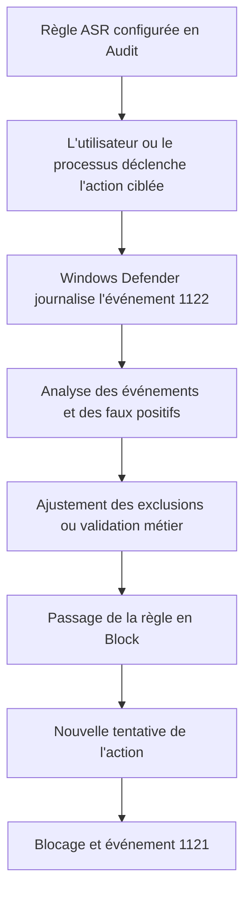

---
tags:
  - hardening
  - ASR
  - Defender
  - attack surface reduction
---

# Attack Surface Reduction (ASR)

!!! abstract "Ce que vous allez apprendre"
    - Ce qu'est réellement ASR, et ce qu'ASR n'est pas.
    - Les prérequis techniques et de licence avant tout déploiement.
    - Les cinq règles ASR les plus rentables, avec leurs GUID complets.
    - Comment piloter un passage propre de l'audit au blocage.

!!! warning "Point de vocabulaire"
    ASR est une capacité de **Microsoft Defender**.
    Ce n'est pas WDAC.
    ASR bloque des **comportements** à risque ; WDAC contrôle **ce qui a le droit de s'exécuter**.

## 1. Qu'est-ce que l'Attack Surface Reduction

Les règles ASR, pour *Attack Surface Reduction*,
font partie de Microsoft Defender.
Elles visent des techniques d'attaque précises,
pas une logique générale de liste blanche.

ASR ne dit pas "seuls ces binaires sont autorisés".
ASR dit plutôt "ce type d'action est interdit",
par exemple lorsqu'Office tente de créer un processus enfant,
ou lorsqu'un script fortement obfusqué s'exécute.

Cette différence est structurante.
ASR est un contrôle **comportemental ciblé**.
WDAC est un contrôle **d'autorisation d'exécution**.

Les règles ASR sont particulièrement utiles pour freiner :

- les chaînes Office macro -> `cmd.exe` -> `powershell.exe` ;
- les scripts obfusqués ou fortement encodés ;
- les scripts JavaScript et VBScript qui lancent du contenu téléchargé ;
- les tentatives d'accès à `lsass.exe` pour voler des secrets ;
- certaines phases préparatoires observées dans les campagnes ransomware.

ASR complète très bien AppLocker, WDAC et Defender.
Il ne les remplace pas.
Un poste bien durci cumule plusieurs couches,
chacune traitant un moment différent de la chaîne d'attaque.

| Contrôle | Question posée | Exemple |
|---|---|---|
| WDAC | Ce code a-t-il le droit de s'exécuter ? | Un EXE inconnu dans `%TEMP%` |
| AppLocker | Cette application ou ce script est-il autorisé selon la politique ? | Un script `.ps1` dans `Downloads` |
| ASR | Ce comportement précis doit-il être interdit ? | Word qui lance `powershell.exe` |

!!! info "Pourquoi ASR est utile même avec WDAC"
    WDAC empêche d'exécuter du code non approuvé.
    ASR protège aussi contre des usages abusifs d'applications déjà approuvées.
    Les deux approches se complètent.

!!! quote "En résumé"
    ASR est un ensemble de règles Microsoft Defender qui bloquent des comportements d'attaque ciblés.
    Ce n'est ni un produit séparé, ni une version simplifiée de WDAC.

## 2. Prérequis

Avant de déployer ASR, trois axes doivent être validés :
le moteur Defender, la version de Windows,
et le niveau de licence réellement disponible.

### 2.1 Microsoft Defender Antivirus actif

Microsoft documente un prérequis clair :
`Microsoft Defender Antivirus` doit être l'antivirus actif,
avec la protection en temps réel activée.

Si un autre antivirus est installé et prend la main,
Defender peut se désactiver.
Dans ce cas, les règles ASR ne sont pas dans l'état attendu.

Certaines règles s'appuient aussi sur des composants complémentaires,
comme AMSI ou la protection cloud.
Il faut donc maintenir Defender à jour :
plateforme, moteur et intelligence de sécurité.

### 2.2 Version minimale de Windows

ASR est disponible à partir de Windows 10 version 1709.
La couverture exacte varie ensuite selon la règle,
la version de Windows, et côté serveur selon l'OS.

Toutes les règles ne sont pas uniformément disponibles
sur toutes les versions Windows Server.
Il faut vérifier la matrice par règle avant de standardiser.

### 2.3 Licences

Microsoft recommande une licence `Microsoft Defender XDR E5`,
`Windows E5` ou `A5` pour tirer parti du reporting avancé
et du pilotage complet à grande échelle.

Pour le **jeu complet** des règles ASR et leur support officiel,
Microsoft renvoie aussi vers un niveau de licence Windows Enterprise.
Dans la pratique, certaines fonctions existent sur d'autres éditions,
mais il faut distinguer "fonctionne techniquement" et "supporté officiellement".

### 2.4 Vérifications utiles

| Élément | Attendu | Vérification rapide |
|---|---|---|
| Antivirus | Defender actif | `Get-MpComputerStatus` ou interface Sécurité Windows |
| Temps réel | Activé | Sécurité Windows ou stratégie Defender |
| Version OS | Windows 10 1709+ / Windows 11 / version serveur supportée | `winver` |
| Journaux | Disponibles | `eventvwr.msc` |
| Licence | Cohérente avec le design | Portail, contrat, baseline interne |

Ouvrez `winver`, `eventvwr.msc` ou `powershell.exe`
via ++win++ + ++r++.
Ne commencez pas par la GPO si les prérequis locaux ne sont pas valides.

!!! tip "Pratique recommandée"
    Vérifiez d'abord un poste pilote en local.
    Un design GPO propre n'aidera pas si Defender n'est pas réellement actif sur la machine cible.

!!! quote "En résumé"
    ASR exige un Defender actif, une version Windows compatible et une lecture claire du niveau de licence.
    Sans ces prérequis, l'audit sera incomplet et le blocage potentiellement incohérent.

## 3. Modes de fonctionnement

ASR prend en charge quatre états utiles en exploitation :
`Disabled`, `Audit`, `Block` et `Warn`.
Le choix du mode se fait **par règle**.

| Mode | Valeur | Effet |
|---|---|---|
| Disabled | `0` | Règle inactive |
| Block | `1` | Action interdite |
| Audit | `2` | Action autorisée mais journalisée |
| Warn | `6` | Action bloquée avec possibilité de contournement utilisateur sur les règles qui le supportent |

Le mode `Audit` est le mode de départ normal.
Il sert à mesurer l'impact réel.
Le mode `Block` ne devrait venir qu'après lecture des événements.

Le mode `Warn` peut être utile pour accompagner un changement,
mais il n'est pas universel.
Par exemple, la règle LSASS ne supporte pas `Warn`.

Il existe aussi la notion `Not configured` dans certaines interfaces de gestion.
Elle ne doit pas être confondue avec un vrai choix de sécurité.
Pour une politique maîtrisée, explicitez chaque règle importante.

!!! warning "Erreur fréquente"
    Un parc en `Audit` permanent n'est pas durci.
    Il est observé.
    L'audit n'a de valeur que s'il mène à des décisions de blocage ou d'exclusion.

!!! quote "En résumé"
    `Audit` sert à apprendre, `Block` à protéger, `Warn` à accompagner certains usages.
    Le bon pilotage consiste à traiter chaque règle comme un objet indépendant.

## 4. Les règles ASR les plus importantes

Les cinq règles ci-dessous offrent un excellent rendement défensif.
Elles couvrent des scénarios vus très souvent sur poste de travail.

### 4.1 Block Office apps from creating child processes

**GUID** : `D4F940AB-401B-4EFC-AADC-AD5F3C50688A`

Cette règle bloque les applications Office
lorsqu'elles tentent de créer des processus enfants.
Elle vise les chaînes Word ou Excel -> `cmd.exe`, `powershell.exe`, `wscript.exe`, etc.

Le bénéfice est immédiat contre les macros malveillantes,
les documents piégés et les charges utiles lancées via Office.
Le risque de faux positif existe dans les environnements
où Office déclenche des scripts métiers ou des tâches d'administration.

Microsoft précise aussi que certaines règles Office
s'appuient sur des chemins d'installation Office standard,
principalement sous `%ProgramFiles%` ou `%ProgramFiles(x86)%`.

### 4.2 Block execution of potentially obfuscated scripts

**GUID** : `5BEB7EFE-FD9A-4556-801D-275E5FFC04CC`

Cette règle bloque l'exécution de scripts potentiellement obfusqués.
Elle cible les scripts masqués, encodés, compressés
ou volontairement rendus illisibles pour contourner les contrôles.

Elle s'appuie sur Defender et AMSI.
La protection cloud renforce son efficacité.
Elle est très utile contre les chaînes PowerShell opportunistes.

Le faux positif est généralement modéré,
mais il faut surveiller certains frameworks internes
ou des scripts d'administration anciens fortement encapsulés.

### 4.3 Block JavaScript or VBScript from launching downloaded executable content

**GUID** : `D3E037E1-3EB8-44C8-A917-57927947596D`

Cette règle bloque les scripts JavaScript ou VBScript
lorsqu'ils essaient de lancer du contenu exécutable téléchargé.
Elle coupe un pattern classique de livraison initiale.

Elle est particulièrement pertinente contre les pièces jointes,
archives et lanceurs historiques basés sur `wscript` ou `cscript`.
Elle s'appuie elle aussi sur AMSI.

Dans un environnement moderne, le faux positif est souvent faible.
Dans un parc ancien avec scripts `.vbs` hérités,
l'audit préalable reste indispensable.

### 4.4 Block credential stealing from LSASS

**GUID** : `9E6C4E1F-7D60-472F-BA1A-A39EF669E4B2`

Cette règle durcit l'accès à `lsass.exe`
pour empêcher le vol de secrets mémoire.
Elle vise des techniques associées à des outils comme Mimikatz.

Microsoft précise un point essentiel :
si `LSA protection` est déjà activée,
cette règle ASR devient généralement non nécessaire, voire non applicable.
Dans un design moderne, il faut donc l'évaluer avec `Credential Guard` et la protection LSA.

Autre point important :
`Warn` n'est pas recommandé et n'est pas supporté pour cette règle.
Microsoft indique aussi qu'elle peut générer beaucoup de bruit en audit,
et qu'un passage direct en blocage sur un petit anneau pilote peut être acceptable.

### 4.5 Use advanced protection against ransomware

**GUID** : `C1DB55AB-C21A-4637-BB3F-A12568109D35`

Cette règle ajoute une détection et un blocage agressifs
contre des comportements associés aux ransomwares.
Elle complète la réduction de surface d'attaque sur la phase de chiffrement
ou sur des préparatifs compatibles avec les schémas observés par Defender.

La protection cloud améliore là encore l'efficacité.
Le faux positif dépend du parc.
Il est plus élevé si vous avez des logiciels qui manipulent massivement des fichiers
ou des outils d'automatisation peu communs.

| Règle | GUID complet | Effet principal |
|---|---|---|
| Office child processes | `D4F940AB-401B-4EFC-AADC-AD5F3C50688A` | Empêche Office de lancer des processus enfants |
| Obfuscated scripts | `5BEB7EFE-FD9A-4556-801D-275E5FFC04CC` | Bloque les scripts obfusqués |
| JS/VBS -> contenu téléchargé | `D3E037E1-3EB8-44C8-A917-57927947596D` | Empêche un script de lancer un exécutable téléchargé |
| Credential stealing from LSASS | `9E6C4E1F-7D60-472F-BA1A-A39EF669E4B2` | Réduit l'accès abusif à `lsass.exe` |
| Advanced protection against ransomware | `C1DB55AB-C21A-4637-BB3F-A12568109D35` | Renforce la détection et le blocage liés aux ransomwares |

!!! info "Dépendances à garder en tête"
    Les règles `obfuscated scripts`, `JS/VBS` et `advanced ransomware` tirent parti de Defender,
    d'AMSI et souvent de la protection cloud.
    Une politique ASR n'est jamais meilleure que l'état réel du moteur Defender sous-jacent.

!!! quote "En résumé"
    Les cinq règles prioritaires couvrent Office, les scripts, `lsass.exe` et le ransomware.
    Elles donnent un excellent rapport effort / réduction de risque lorsqu'elles sont déployées par étapes.

## 5. Déploiement via GPO

Le chemin GPO demandé est :

`Computer Configuration > Administrative Templates > Windows Components > Microsoft Defender Antivirus > Microsoft Defender Exploit Guard > Attack Surface Reduction`

Dans ce nœud, la stratégie clé est :
`Configure Attack Surface Reduction rules`

Ouvrez `gpmc.msc` via ++win++ + ++r++,
éditez une GPO dédiée,
puis saisissez chaque GUID avec son état.

!!! example "Exemple de saisie dans la stratégie GPO"
    `D4F940AB-401B-4EFC-AADC-AD5F3C50688A` = `2`
    `5BEB7EFE-FD9A-4556-801D-275E5FFC04CC` = `2`
    `D3E037E1-3EB8-44C8-A917-57927947596D` = `2`
    `9E6C4E1F-7D60-472F-BA1A-A39EF669E4B2` = `1`
    `C1DB55AB-C21A-4637-BB3F-A12568109D35` = `2`

Une stratégie distincte pour ASR simplifie :

- la lecture de l'intention ;
- le dépannage ;
- l'audit de changement ;
- le rollback si une règle pose problème.

Évitez de basculer toutes les règles prioritaires en `Block` le même jour.
Un anneau pilote IT, puis un anneau métier réduit,
permettent de lire les événements avant généralisation.

!!! tip "Séquence réaliste"
    1. Commencer en audit sur les règles Office, scripts et ransomware.
    2. Évaluer les événements pendant un cycle métier complet.
    3. Passer ensuite en blocage règle par règle.
    4. Traiter `LSASS` à part, avec son propre pilote.

!!! quote "En résumé"
    La GPO ASR se pilote au niveau `Microsoft Defender Exploit Guard`.
    Une GPO dédiée, des GUID explicites et un passage progressif de l'audit au blocage évitent la plupart des incidents.

## 6. Déploiement via registre

Le chemin registre demandé est :

`HKLM\SOFTWARE\Policies\Microsoft\Windows Defender\Windows Defender Exploit Guard\ASR\Rules`

Dans ce modèle,
chaque **nom de valeur** est le GUID de la règle,
et la **donnée** est l'état voulu.

| Donnée | Signification |
|---|---|
| `0` | Off / Disabled |
| `1` | Block |
| `2` | Audit |
| `6` | Warn |

Exemple conceptuel :

```text
HKLM\SOFTWARE\Policies\Microsoft\Windows Defender\Windows Defender Exploit Guard\ASR\Rules
  D4F940AB-401B-4EFC-AADC-AD5F3C50688A = 2
  5BEB7EFE-FD9A-4556-801D-275E5FFC04CC = 2
  D3E037E1-3EB8-44C8-A917-57927947596D = 2
  9E6C4E1F-7D60-472F-BA1A-A39EF669E4B2 = 1
  C1DB55AB-C21A-4637-BB3F-A12568109D35 = 2
```

!!! info "Nuance de documentation"
    La documentation ADMX de Microsoft expose aussi la valeur de stratégie `ExploitGuard_ASR_Rules`
    sous `...\ASR`.
    En administration directe et dans plusieurs baselines Microsoft, on retrouve bien le sous-chemin `...\ASR\Rules` avec une valeur par GUID.

Le registre est pratique pour :

- vérifier l'état effectivement poussé ;
- dépanner un poste ;
- comparer un poste sain et un poste en écart ;
- documenter une baseline de conformité.

Ouvrez `regedit` via ++win++ + ++r++.
Ne modifiez pas directement la production à la main sauf procédure prévue.
Le registre sert surtout ici de point de contrôle et de support de déploiement automatisé.

!!! warning "Piège classique"
    Un GUID correct avec une mauvaise donnée ne produit pas l'effet attendu.
    Vérifiez toujours la correspondance `0 / 1 / 2 / 6` avant de conclure qu'une règle ne fonctionne pas.

!!! quote "En résumé"
    Le registre ASR par règle utilise le chemin `...\ASR\Rules`, avec un GUID comme nom de valeur et `0`, `1`, `2` ou `6` comme donnée.
    C'est un excellent point de contrôle pour valider le mode réellement appliqué.

## 7. Passage de l'audit au blocage

Le passage propre d'ASR repose sur les événements Defender.
Pour ASR, le journal utile est :

`Applications and Services Logs > Microsoft > Windows > Windows Defender > Operational`

Microsoft documente notamment :

- `1121` pour certains événements de blocage ;
- `1122` pour certains événements d'audit ;
- `1129` pour les contournements utilisateur en mode `Warn` ;
- `5007` pour les changements de configuration.

Le schéma opérationnel minimal est le suivant :



Ce flux paraît simple.
Il échoue pourtant souvent pour une seule raison :
les événements ne sont pas relus, pas classés, ou pas corrélés à un contexte métier.

!!! tip "Bonne pratique"
    Une règle ne passe en `Block` qu'après lecture de ses événements d'audit.
    Sans cette étape, vous remplacez un risque cyber par un risque d'exploitation.

!!! quote "En résumé"
    La stratégie saine consiste à commencer en audit, à collecter les événements `1122`, puis à passer en blocage et vérifier les `1121`.
    ASR est efficace quand l'observabilité guide réellement la décision.

## 8. Tableau des cinq règles prioritaires

Le tableau ci-dessous résume un ordre de bataille réaliste.
Il ne remplace pas l'audit,
mais donne une base de départ solide.

| Règle prioritaire | GUID court | Mode recommandé au départ | Risque de faux positif |
|---|---|---|---|
| Block Office apps from creating child processes | `D4F940AB` | `Audit`, puis `Block` | Moyen |
| Block execution of potentially obfuscated scripts | `5BEB7EFE` | `Audit`, puis `Block` | Faible à moyen |
| Block JavaScript or VBScript from launching downloaded executable content | `D3E037E1` | `Audit`, puis `Block` | Faible |
| Block credential stealing from LSASS | `9E6C4E1F` | Petit pilote direct en `Block` ou `Audit` très court | Moyen à élevé en bruit |
| Use advanced protection against ransomware | `C1DB55AB` | `Audit`, puis `Block` | Moyen |

Le mode recommandé n'est pas universel.
Il suppose un parc raisonnablement standardisé,
un moteur Defender sain,
et une équipe capable de lire les événements.

Dans un parc très hétérogène,
allongez la phase d'audit pour Office et scripts.
Pour `LSASS`, raisonnez avec `Credential Guard` et la protection LSA,
pas comme une règle isolée.

!!! danger "Ce qu'il ne faut pas faire"
    Activer en blocage plusieurs règles ASR prioritaires sans pilote,
    sans lecture d'événements et sans propriétaire métier identifié,
    revient à transformer une bonne mesure de sécurité en incident de production.

!!! quote "En résumé"
    Les cinq règles prioritaires couvrent les scénarios les plus rentables.
    Commencez en audit, traitez `LSASS` séparément, puis industrialisez le blocage avec des événements et des exclusions maîtrisées.
