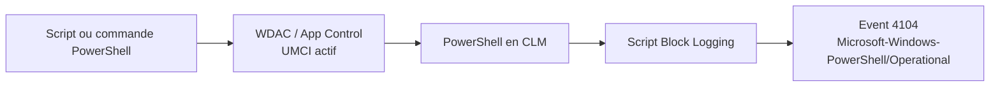

---
tags:
  - hardening
  - PowerShell
  - CLM
  - logging
---

# PowerShell, CLM et journalisation

!!! abstract "Ce que vous allez apprendre"
    - Pourquoi PowerShell reste une cible offensive majeure sur Windows.
    - Ce que recouvrent réellement les différents `Language Modes`.
    - Comment activer et vérifier le `Constrained Language Mode`.
    - Comment compléter CLM avec `Script Block Logging`, `Module Logging` et la transcription.

!!! info "Point de départ"
    PowerShell n'est pas seulement un shell d'administration.
    C'est aussi un moteur d'automatisation intégré à Windows,
    disponible sur une très grande partie des postes et serveurs.

## 1. Pourquoi PowerShell est une cible offensive majeure

PowerShell est apprécié des équipes d'exploitation pour les mêmes raisons qu'il est apprécié des attaquants : présence native, accès profond au système, et automatisation riche.

Dans une chaîne offensive, PowerShell permet de vivre sur les binaires déjà présents, sans déposer nécessairement un exécutable additionnel. C'est l'idée classique du `Living-off-the-Land`.

Il est également central dans les scénarios `fileless`. Le code peut être téléchargé, reconstruit ou évalué en mémoire, avec peu ou pas de traces de fichiers déposés sur disque.

Les `download cradles` sont l'exemple le plus connu. Ils utilisent PowerShell pour récupérer du contenu distant, puis l'exécuter directement dans la session.

`PsExec`, `WinRM`, certains agents RMM ou des comptes déjà compromis peuvent ensuite servir de vecteur de lancement à distance.

| Technique | Pourquoi PowerShell est utile à l'attaquant |
|---|---|
| Living-off-the-Land | Outil natif, souvent déjà autorisé |
| Fileless | Exécution mémoire, peu de fichiers déposés |
| Download cradle | Téléchargement et évaluation rapides |
| Mouvement latéral | Déclenchement à distance via outils d'admin et comptes légitimes |
| Post-exploitation | Inventaire, persistance, collecte, désactivation partielle de contrôles |

Le problème n'est donc pas PowerShell lui-même. Le problème est l'absence de garde-fous autour de son exécution, de ses droits et de sa journalisation.

!!! warning "Erreur classique"
    Désactiver quelques cmdlets ou miser sur `ExecutionPolicy`
    ne constitue pas une stratégie de défense sérieuse.
    `ExecutionPolicy` n'est pas une frontière de sécurité.

!!! quote "En résumé"
    PowerShell est une cible offensive majeure parce qu'il est natif, puissant et omniprésent.
    Sans contrôle d'exécution et sans logs, il devient un accélérateur de post-exploitation.

## 2. PowerShell Language Modes

PowerShell expose plusieurs modes de langage. Ils ne répondent pas au même objectif et ne doivent pas être confondus.

`FullLanguage` est le mode par défaut. Il autorise tous les éléments du langage dans une session standard Windows.

`ConstrainedLanguage` autorise toujours le shell et les cmdlets, mais réduit ce qui peut être fait avec les types et API sous-jacents. Il limite en particulier l'accès aux types .NET autorisés.

`NoLanguage` désactive complètement le langage PowerShell. Vous ne pouvez plus exécuter de script ni utiliser de variables. Seules les commandes natives et les cmdlets restent accessibles.

`RestrictedLanguage` est encore plus limité sur le plan syntaxique. Il est utilisé pour certains contextes restreints, notamment le traitement de manifests de modules.

| Mode | Usage typique | Ce qu'il autorise | Ce qu'il bloque ou réduit |
|---|---|---|---|
| `FullLanguage` | Session standard | Tout le langage | Rien de spécifique |
| `ConstrainedLanguage` | Hôte verrouillé par App Control | Cmdlets, structures de base, sous-ensemble de types | Types non autorisés, COM, `Add-Type` arbitraire |
| `NoLanguage` | JEA et runspaces ultra-restreints | Cmdlets et commandes natives | Scripts, variables, langage |
| `RestrictedLanguage` | Contextes restreints, manifests | Très petit sous-ensemble | Scriptblocks, affectations, appels de méthodes |

### 2.1 FullLanguage

`FullLanguage` est le mode le plus souple. Il autorise les opérateurs, les scripts, les types .NET, les méthodes et les accès complets au langage.

C'est le mode attendu sur une machine non verrouillée. Il convient à l'administration classique, mais il ne limite pas l'abus du moteur PowerShell.

### 2.2 ConstrainedLanguage Mode

`ConstrainedLanguage` n'est pas un simple "PowerShell cassé". C'est un mode pensé pour rester utile aux administrateurs, tout en réduisant certaines primitives abusables.

Les restrictions importantes sont les suivantes :

- limitation des types .NET utilisables ;
- `Add-Type` ne peut plus charger du code C# arbitraire ;
- `New-Object` est limité aux types autorisés ;
- les objets `COM` sont bloqués ;
- certaines capacités avancées sont neutralisées en mode verrouillé.

Point important : CLM ne supprime pas tous les opérateurs du langage. Cette restriction forte concerne plutôt `RestrictedLanguage`. En `CLM`, la réduction porte surtout sur les types et les API exposées.

### 2.3 NoLanguage

`NoLanguage` coupe le langage PowerShell lui-même. Vous ne pouvez plus faire de scripting, ni créer des variables, ni écrire de logique arbitraire.

Ce mode est particulièrement adapté aux sessions `JEA` ou aux runspaces construits pour un nombre très limité d'actions. Il ne convient pas à l'administration générale d'un poste.

### 2.4 RestrictedLanguage

`RestrictedLanguage` autorise l'exécution de commandes, mais empêche les `scriptblocks`. Les affectations, références de propriétés et appels de méthodes ne sont pas permis.

Ce mode apparaît surtout dans des contextes internes et restreints. Ce n'est pas le mode à viser pour durcir massivement un parc. Pour ce besoin, CLM + App Control reste l'approche utile.

!!! info "Nuance utile"
    `RestrictedLanguage` et `NoLanguage` sont plus contraints que `CLM`,
    mais ils servent des cas d'usage spécifiques.
    Pour le hardening du poste, la vraie combinaison défensive est `WDAC/App Control` + `CLM`.

!!! quote "En résumé"
    `FullLanguage` est le mode normal, `CLM` le mode de réduction de surface utile au hardening,
    `NoLanguage` le mode de verrouillage fort, et `RestrictedLanguage` un mode très restreint pour contextes spécifiques.

## 3. Comment activer CLM

Le point essentiel est le suivant : `CLM` seul n'est pas une frontière de sécurité fiable. Microsoft indique qu'il doit être utilisé avec `System Lockdown` et `App Control for Business`.

### 3.1 Via WDAC / App Control avec UMCI

Quand une politique `WDAC` ou `App Control for Business` active `UMCI`, PowerShell détecte le verrouillage système et bascule automatiquement en `ConstrainedLanguage`.

Dans ce modèle, le moteur PowerShell ne décide pas seul. Il s'aligne sur une politique d'intégrité de code plus large, ce qui réduit fortement les possibilités de contournement.

En pratique, c'est l'approche de production. Vous couplez contrôle d'exécution et réduction des capacités PowerShell. Le résultat est bien plus robuste qu'un simple réglage de session.

### 3.2 Via `__PSLockdownPolicy = 4`

Il existe une variable d'environnement nommée `__PSLockdownPolicy`. Elle a été prévue pour le débogage et les tests unitaires, pas comme mécanisme de sécurité de production.

Microsoft indique explicitement que cette approche n'est pas sûre. Un utilisateur ou un attaquant peut relancer une session dans un contexte non verrouillé et récupérer `FullLanguage`.

Si vous l'utilisez, faites-le uniquement pour de la validation locale ou du test, jamais comme mesure de durcissement durable.

### 3.3 Vérification du mode actif

La commande de vérification demandée est :

```powershell
$ExecutionContext.SessionState.LanguageMode
```

Sur une session `CLM`, la valeur renvoyée est `ConstrainedLanguage`. Sur une session standard, vous verrez `FullLanguage`.

Dans les sessions `NoLanguage` ou `RestrictedLanguage`, l'interrogation peut elle-même être restreinte. Pour un contrôle de déploiement CLM, cette nuance gêne peu.

!!! example "Ouverture rapide"
    - ++win++ + ++r++ puis `powershell.exe`
    - ++win++ + ++r++ puis `pwsh.exe` si PowerShell 7 est installé

!!! danger "À ne pas faire"
    Ne présentez pas `__PSLockdownPolicy` comme un contrôle de sécurité.
    C'est un mécanisme de test.
    En production, utilisez `WDAC/App Control` avec `UMCI`.

!!! quote "En résumé"
    CLM devient défensivement intéressant quand il est imposé par `WDAC/App Control` et `UMCI`.
    La variable `__PSLockdownPolicy` peut aider au test, mais ne doit pas servir de contrôle de production.

## 4. Script Block Logging

`Script Block Logging` est la brique de visibilité la plus importante pour comprendre ce que PowerShell compile et exécute réellement. Elle doit être considérée comme complémentaire à CLM, pas comme un substitut.

La clé de registre demandée est : `HKLM\SOFTWARE\Policies\Microsoft\Windows\PowerShell\ScriptBlockLogging\EnableScriptBlockLogging = 1`

Le journal cible est : `Microsoft-Windows-PowerShell/Operational`

L'événement clé est `4104`. Il contient le texte du bloc de script compilé par PowerShell. Quand un script est volumineux, le bloc peut être découpé en plusieurs événements.

La valeur défensive de `4104` est élevée. Le moteur PowerShell envoie aussi le contenu des scripts à `AMSI`, y compris dans des scénarios d'obfuscation ou de génération dynamique. En pratique, cela améliore fortement la lisibilité des chaînes hostiles.

Il faut néanmoins rester précis : `4104` journalise le bloc compilé par le moteur. Selon le scénario, vous verrez une forme déjà enrichie ou dépliée, mais il ne faut pas promettre une déobfuscation parfaite dans tous les cas.

| Élément | Valeur |
|---|---|
| Clé | `HKLM\SOFTWARE\Policies\Microsoft\Windows\PowerShell\ScriptBlockLogging` |
| Valeur | `EnableScriptBlockLogging = 1` |
| Journal | `Microsoft-Windows-PowerShell/Operational` |
| Événement clé | `4104` |
| Visibilité | Contenu du bloc de script compilé |

!!! tip "Pourquoi 4104 compte autant"
    Un `4688` vous montre qu'un processus PowerShell a démarré.
    Un `4104` vous rapproche du contenu réellement traité par le moteur.

!!! warning "Coût de visibilité"
    Le logging détaillé augmente le volume.
    Il faut donc prévoir la taille du journal `Operational`,
    la collecte centralisée et la rétention côté SIEM.

!!! quote "En résumé"
    `Script Block Logging` donne la meilleure visibilité native sur le contenu réellement traité par PowerShell.
    L'événement `4104` est central pour l'enquête, surtout face aux scripts obfusqués ou dynamiques.

## 5. Module Logging et Transcription

Ces deux mécanismes complètent `4104`. Ils répondent à des besoins différents et ne doivent pas être opposés.

### 5.1 Module Logging

`Module Logging` journalise les appels de cmdlets et les détails de pipelines pour les modules ciblés. Il est utile pour comprendre la séquence d'exécution, pas seulement le texte du script.

La clé de registre est : `HKLM\SOFTWARE\Policies\Microsoft\Windows\PowerShell\ModuleLogging\EnableModuleLogging = 1`

Le journal reste `Microsoft-Windows-PowerShell/Operational`. L'événement de référence à surveiller est généralement `4103`.

Nuance importante : la stratégie demande aussi la liste des modules ou snap-ins à journaliser. Le simple `EnableModuleLogging = 1` ne suffit pas à définir le périmètre utile.

### 5.2 Transcription

La transcription copie l'entrée et la sortie d'une session dans un fichier texte. Elle est utile pour les postes d'administration et les bastions.

La clé de registre est : `HKLM\SOFTWARE\Policies\Microsoft\Windows\PowerShell\Transcription\EnableTranscripting = 1`

Elle n'écrit pas principalement dans `Operational`. Son artefact principal est le fichier de transcript sur disque, dans le répertoire configuré par la stratégie.

### 5.3 Comment les combiner

Les trois couches servent des angles différents :

- `4104` pour le bloc de script compilé ;
- `4103` pour les cmdlets et pipelines ;
- transcription pour le contexte de session et la sortie texte.

| Mécanisme | Ce qu'il montre | Point fort | Limite principale |
|---|---|---|---|
| Script Block Logging | Texte du bloc compilé | Très fort en investigation | Volume et sensibilité des données |
| Module Logging | Cmdlets et pipelines | Très utile pour la séquence d'action | Périmètre à définir par module |
| Transcription | Session texte complète | Très lisible pour l'humain | Dépend du stockage des fichiers |

!!! info "Ordre de priorité"
    Si vous devez choisir,
    commencez par `Script Block Logging`,
    puis ajoutez `Module Logging` et la transcription sur les systèmes à forte valeur.

!!! quote "En résumé"
    `Module Logging` et la transcription ne remplacent pas `4104`.
    Ils ajoutent du contexte sur les cmdlets exécutées et sur la session réelle de l'opérateur.

## 6. Tableau récapitulatif

Le tableau ci-dessous synthétise les protections demandées, leur mécanisme ou leur clé, et le niveau de visibilité obtenu.

| Protection | Clé ou mécanisme | Niveau de visibilité |
|---|---|---|
| `CLM` | `WDAC/App Control + UMCI` | Réduction d'exécution, pas un journal |
| `CLM` de test | `__PSLockdownPolicy = 4` | Démonstration locale seulement |
| Vérification du mode | `$ExecutionContext.SessionState.LanguageMode` | Confirme `FullLanguage` ou `ConstrainedLanguage` |
| Script Block Logging | `...\ScriptBlockLogging\EnableScriptBlockLogging = 1` | Très élevé sur le contenu script |
| Module Logging | `...\ModuleLogging\EnableModuleLogging = 1` | Élevé sur cmdlets et pipelines |
| Transcription | `...\Transcription\EnableTranscripting = 1` | Élevé sur la session texte |
| Journal principal | `Microsoft-Windows-PowerShell/Operational` | Point de lecture pour `4103` et `4104` |

Un durcissement PowerShell crédible ne se limite pas à bloquer des primitives. Il combine réduction de capacité et collecte exploitable.

!!! tip "Lecture rapide"
    `WDAC/UMCI` limite ce que PowerShell peut faire.
    Les journaux expliquent ensuite ce qu'il a tenté ou exécuté.

!!! quote "En résumé"
    La bonne approche combine contrôle d'exécution et visibilité.
    `CLM` réduit la surface d'abus, tandis que `4104`, `4103` et la transcription documentent l'activité.

## 7. Flux de contrôle et de visibilité

Le schéma suivant représente une chaîne simple. Le script arrive dans le moteur PowerShell, la politique `WDAC` impose `CLM`, puis la journalisation produit les événements exploitables.



Ce flux n'indique pas tout. `AMSI`, `4103`, la transcription et les événements de processus complètent la chaîne d'observation. Mais pour un durcissement de base, ce schéma suffit.

!!! warning "Ce que le schéma ne dit pas"
    `CLM` réduit la capacité d'abus.
    Il n'empêche pas à lui seul tout usage légitime ou détourné de PowerShell.
    La journalisation reste indispensable.

!!! quote "En résumé"
    La séquence défensive utile est : politique d'exécution, réduction des capacités, puis journalisation détaillée.
    Sans cette combinaison, PowerShell reste trop opaque pour une défense sérieuse.
