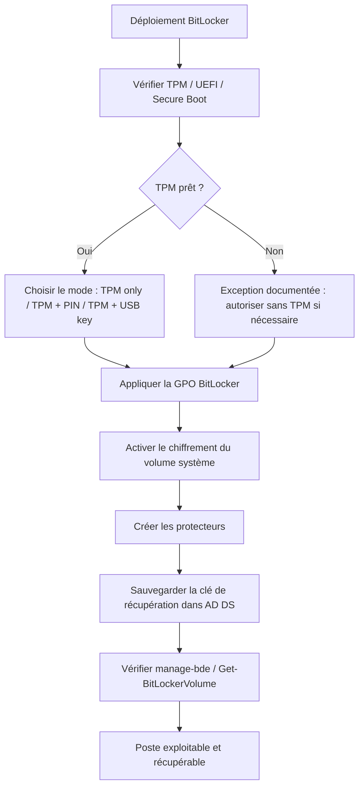

---
tags:
  - hardening
  - BitLocker
  - chiffrement
  - TPM
---

# BitLocker et protection des postes

!!! abstract "Ce que vous allez apprendre"
    - Pourquoi BitLocker est une mesure de hardening centrée sur l'accès hors ligne.
    - Quels prérequis matériels, firmware et éditions Windows vérifier.
    - Comment choisir entre `TPM only`, `TPM + PIN`, `TPM + USB key` et la clé de récupération.
    - Quels chemins GPO et quelles clés `FVE` surveiller dans un déploiement d'entreprise.

!!! info "Point de départ"
    BitLocker ne protège pas seulement contre la perte d'un disque.
    Il protège surtout contre l'accès aux données lorsque l'attaquant
    a la machine physiquement entre les mains et tente une attaque hors ligne.

## 1. Pourquoi BitLocker est une mesure de hardening

Un poste non chiffré est exposé dès qu'il quitte le périmètre logique du système.
Le voleur n'a pas besoin du mot de passe Windows
si le disque peut être monté ailleurs ou lu via un outil hors ligne.

Le scénario classique est simple.
L'attaquant retire le SSD, le branche dans une autre machine,
ou démarre sur un média externe pour contourner le système installé.

Sans chiffrement de volume, il peut lire les fichiers utilisateur,
les secrets applicatifs, certains caches d'identité,
et parfois préparer des modifications offline avant redémarrage.

BitLocker chiffre le volume entier.
Il réduit donc fortement l'exposition des données
sur un poste perdu, volé ou mis au rebut sans effacement correct.

| Menace physique | Sans BitLocker | Avec BitLocker |
|---|---|---|
| Vol du portable | Disque lisible hors ligne | Données protégées sans déverrouillage |
| Démarrage sur média externe | Accès aux fichiers NTFS possible | Volume chiffré et non exploitable en clair |
| Recyclage ou revente du matériel | Fuite de données résiduelles | Exposition fortement réduite |

!!! warning "Limite fonctionnelle"
    BitLocker ne remplace ni EDR, ni MFA, ni durcissement de session.
    Il traite avant tout la menace d'accès hors ligne
    et l'intégrité du démarrage quand le TPM est impliqué.

### 1.1 BitLocker et accès offline

Le hardening Windows couvre plusieurs couches.
BitLocker agit avant la connexion utilisateur,
dans la chaîne de démarrage et au niveau des volumes.

Cette position le rend complémentaire d'App Control,
de Credential Guard ou de la réduction des privilèges.
Ces briques ne répondent pas au même problème.

### 1.2 Pourquoi cette mesure est prioritaire sur les portables

Le risque physique est plus élevé sur les machines mobiles.
Perte, vol opportuniste, passage en atelier ou oubli dans un tiers-lieu
font partie des scénarios réels d'exposition.

Sur un portable de direction, un poste d'administration
ou une machine de développeur contenant des secrets,
l'absence de chiffrement de volume est un écart majeur.

!!! quote "En résumé"
    BitLocker est une mesure de hardening parce qu'il traite un angle que les contrôles logiques seuls ne couvrent pas :
    la lecture ou la manipulation des données lorsque l'attaquant dispose physiquement de la machine.

## 2. Prérequis techniques

BitLocker n'exige pas toujours le même niveau matériel,
mais un déploiement moderne et robuste repose en pratique
sur `TPM 2.0`, `UEFI` natif et `Secure Boot`.

### 2.1 TPM

Microsoft indique que BitLocker supporte `TPM 1.2` ou `TPM 2.0`,
mais recommande `TPM 2.0`.
La raison est à la fois cryptographique et opérationnelle.

Le TPM protège les clés liées à la machine
et permet un contrôle d'intégrité du démarrage.
Il renforce donc la protection contre certaines manipulations offline.

Pour vérifier l'état du module, ouvrez ++win+r++ puis `tpm.msc`.
Vous pouvez aussi utiliser PowerShell ou `Get-Tpm`
dans un environnement d'administration.

### 2.2 UEFI et Secure Boot

Pour les équipements `TPM 2.0`, Microsoft précise
que le mode BIOS doit être `UEFI` natif.
Les modes `Legacy` ou `CSM` ne conviennent pas.

`Secure Boot` n'est pas un prérequis absolu de BitLocker dans tous les cas,
mais Microsoft le recommande explicitement avec `TPM 2.0`
pour renforcer la confiance dans la chaîne de démarrage.

Le raccourci de vérification rapide est ++win+r++ puis `msinfo32`.
Contrôlez `BIOS Mode` et l'état `Secure Boot`.

### 2.3 Édition Windows

Microsoft documente l'activation de BitLocker
sur `Windows Pro`, `Enterprise`, `Pro Education/SE` et `Education`.
Dans la pratique entreprise, retenez au minimum `Pro`, `Enterprise` ou `Education`.

Sur Windows Home, on peut rencontrer `device encryption`
sur certains matériels compatibles,
mais ce n'est pas le modèle d'administration visé dans ce chapitre.

!!! tip "Lecture opérationnelle"
    Pour un standard entreprise simple :
    exigez `Windows Pro/Enterprise/Education`, `TPM 2.0`,
    `UEFI` natif et `Secure Boot` activé.

!!! quote "En résumé"
    Le socle moderne recommandé pour BitLocker est :
    Windows professionnel compatible, TPM 2.0, UEFI natif et Secure Boot actif.

## 3. Modes de protection

BitLocker peut s'appuyer sur plusieurs mécanismes de déverrouillage.
Le choix influe directement sur l'expérience utilisateur
et sur la résistance face à un vol physique.

### 3.1 TPM only

Le mode `TPM only` déverrouille le volume automatiquement
si la mesure d'intégrité du démarrage reste conforme.
L'expérience utilisateur est fluide, sans secret pré-boot supplémentaire.

Ce mode protège bien contre l'extraction offline du disque.
En revanche, il n'ajoute pas de preuve utilisateur avant démarrage.
Sur un portable volé, l'attaquant peut toujours tenter de booter la machine.

Le risque n'est donc pas "BitLocker absent".
Le risque est l'absence d'un second facteur pré-boot
sur les appareils les plus exposés physiquement.

### 3.2 TPM + PIN

Le mode `TPM + PIN` ajoute un secret saisi avant le chargement de Windows.
Microsoft le présente comme une forme d'authentification multifactorielle,
car le TPM protège la clé et l'utilisateur fournit un facteur de connaissance.

Pour les portables, c'est le mode le plus souvent recommandé en durcissement.
Il améliore la résistance au vol opportuniste
par rapport au `TPM only`.

Le compromis est l'ergonomie.
Il faut former les utilisateurs concernés et documenter le support,
sinon le mécanisme sera contourné ou repoussé.

### 3.3 TPM + USB key

Le mode `TPM + USB key` ajoute une clé de démarrage stockée
sur un périphérique amovible.
Le volume ne se déverrouille qu'avec le TPM et cette clé.

Cette option existe toujours,
mais elle est plus lourde à exploiter à grande échelle :
gestion du média, perte de la clé, inventaire et remplacement.

Elle reste pertinente pour certains kiosques,
des systèmes isolés ou des cas d'usage spécialisés,
mais elle est moins simple qu'un `PIN` pour un parc portable.

### 3.4 Clé de récupération

Quel que soit le mode principal retenu,
une voie de récupération est indispensable.
Dans la pratique, cela signifie conserver une clé de récupération.

Cette clé est obligatoire du point de vue opérationnel.
Sans elle, un changement matériel, un incident firmware
ou une anomalie TPM peut rendre un poste irrécupérable.

La clé de récupération doit donc être sauvegardée
dans un annuaire ou un coffre prévu à cet effet,
et non conservée seulement à l'initiative de l'utilisateur.

| Mode | Confort utilisateur | Résistance au vol physique | Usage typique |
|---|---|---|---|
| `TPM only` | Élevé | Correcte, mais sans facteur pré-boot | Postes fixes, socle minimum |
| `TPM + PIN` | Moyen | Plus forte | Portables, postes sensibles |
| `TPM + USB key` | Faible à moyen | Forte si média bien géré | Cas particuliers |
| Clé de récupération | N/A | N/A | Secours obligatoire dans tous les cas |

!!! warning "Point de décision"
    `TPM only` protège les données au repos,
    mais il n'offre pas le même niveau de résistance qu'un facteur pré-boot additionnel
    sur une machine très exposée au vol.

!!! quote "En résumé"
    Choisir un mode BitLocker revient à arbitrer entre ergonomie et résistance physique.
    Pour un portable d'entreprise, `TPM + PIN` reste généralement la meilleure base.

## 4. Clés de registre BitLocker

Les stratégies BitLocker écrivent sous la ruche :
`HKLM\SOFTWARE\Policies\Microsoft\FVE\`

Cette ruche est centrale pour le diagnostic.
Elle reflète les politiques imposées par GPO
et permet de confirmer rapidement la présence de certains réglages.

### 4.1 Valeurs demandées

| Valeur | Rôle | Remarque |
|---|---|---|
| `EnableBDEWithNoTPM` | Autorise BitLocker sans TPM | À n'utiliser qu'en cas particulier |
| `UseTPMPIN` | Règle l'usage du protecteur `TPM + PIN` | Liée au démarrage OS |
| `UseTPMKey` | Règle l'usage du protecteur `TPM + startup key` | Média USB requis si imposé |
| `UseRecoveryPassword` | Gère l'usage du mot de passe de récupération | Valeur générique `FVE` |
| `MinimumPIN` | Longueur minimale du PIN | ADMX autorise `4` à `20` |

Le modèle `VolumeEncryption.admx` confirme ces valeurs.
Il montre aussi que certains paramètres existent
en version générique et en version spécifique au type de lecteur.

Par exemple, pour les volumes système,
on rencontre aussi des valeurs préfixées `OS...`
comme `OSRecoveryPassword` ou `OSRequireActiveDirectoryBackup`.

### 4.2 `MinimumPIN = 6`

Le fichier ADMX Windows autorise une plage de `4` à `20`.
Dans une base de hardening, fixer `MinimumPIN` à `6`
est un minimum raisonnable demandé dans ce chapitre.

Ce n'est pas la borne basse du produit,
mais une recommandation opérationnelle plus robuste
que le minimum purement technique de l'ADMX.

### 4.3 Lecture prudente du registre

La ruche `FVE` permet de voir les paramètres,
mais elle ne remplace pas un test fonctionnel.
Un poste peut avoir la politique sans être encore chiffré.

Complétez toujours la lecture du registre
par `Get-BitLockerVolume` ou `manage-bde -status`
pour confirmer l'état réel du volume et de ses protecteurs.

!!! example "Vérification rapide"
    Ouvrez ++win+r++ puis `regedit` pour inspecter `HKLM\SOFTWARE\Policies\Microsoft\FVE`,
    puis contrôlez ensuite l'état réel avec `manage-bde -status`.

!!! quote "En résumé"
    La ruche `FVE` dit comment BitLocker est piloté.
    Elle ne suffit pas à prouver que le volume est chiffré et récupérable en conditions réelles.

## 5. Déploiement via GPO

Le chemin GPO demandé est exact :
`Computer Configuration > Administrative Templates > Windows Components > BitLocker Drive Encryption`

Sous ce nœud, Windows sépare les politiques selon le type de volume.
Cette séparation est importante pour éviter les réglages incohérents.

### 5.1 Sous-nœuds à connaître

| Sous-nœud | Périmètre |
|---|---|
| `Operating System Drives` | Volume système et démarrage |
| `Fixed Data Drives` | Volumes de données internes |
| `Removable Data Drives` | Supports amovibles |

Le volume système concentre les réglages les plus sensibles,
notamment l'authentification pré-boot, la récupération
et l'obligation de sauvegarde en annuaire.

### 5.2 GPO socle pour le volume système

Un socle BitLocker pour `Operating System Drives`
comprend généralement les politiques suivantes :

| Politique | Objectif |
|---|---|
| `Require additional authentication at startup` | Choisir TPM, PIN, clé USB ou combinaison |
| `Choose how BitLocker-protected operating system drives can be recovered` | Définir la récupération et la sauvegarde AD |
| `Configure minimum PIN length for startup` | Imposer `MinimumPIN` |
| `Choose drive encryption method and cipher strength` | Définir l'algorithme attendu |

Cette approche par politique évite de bricoler le registre à la main.
Le registre doit rester un indicateur de résultat,
pas le mécanisme principal d'administration.

### 5.3 Cas sans TPM

Le paramètre `EnableBDEWithNoTPM` permet un déploiement
sur une machine dépourvue de TPM.
Ce mode impose alors un support externe de démarrage ou un autre mécanisme compatible.

Il faut le considérer comme un cas d'exception.
Il n'apporte pas la même assurance d'intégrité qu'un démarrage avec TPM.
Dans un parc moderne, on doit plutôt viser le standard `TPM 2.0`.

!!! warning "Écart à documenter"
    Tout poste activé avec `EnableBDEWithNoTPM`
    doit être explicitement identifié comme une exception
    et ne pas se fondre dans le socle normal du parc.

### 5.4 Validation de déploiement

Après application de la GPO, vérifiez :

| Vérification | Outil |
|---|---|
| Paramètres GPO présents | `gpresult`, registre `FVE` |
| TPM disponible et prêt | `tpm.msc` ou `Get-Tpm` |
| Volume chiffré | `Get-BitLockerVolume` ou `manage-bde -status` |
| Protecteurs attendus | `manage-bde -protectors -get C:` |
| Clé de récupération sauvegardée | AD DS ou portail Microsoft selon le cas |

Une GPO BitLocker n'est pas "déployée"
tant que ces cinq points ne sont pas validés sur un pilote réel.
Le test de récupération fait partie du déploiement.

!!! quote "En résumé"
    Le bon chemin GPO est nécessaire, mais insuffisant.
    Il faut ensuite valider TPM, protecteurs, chiffrement effectif et récupération.

## 6. Sauvegarde de la clé de récupération dans AD DS

En environnement joint à un domaine Active Directory,
la sauvegarde de la clé de récupération dans `AD DS`
est une mesure de résilience autant qu'une mesure de sécurité.

Elle évite qu'un poste reste indéchiffrable
après incident firmware, changement de composants,
ou déclenchement du mode de récupération.

### 6.1 Paramètres de stratégie

Le modèle `VolumeEncryption.admx` expose les familles de valeurs
associées à la sauvegarde en annuaire.
Dans le chemin OS, on trouve notamment `OSRequireActiveDirectoryBackup`.

Le nom générique `RequireActiveDirectoryBackup`
existe aussi dans la ruche `FVE`
pour d'autres politiques de récupération.
Il faut donc lire la valeur dans le contexte du nœud GPO utilisé.

`RecoveryKeyMessageSource` ne sauvegarde pas la clé.
Cette valeur pilote le message de récupération pré-boot
affiché à l'utilisateur lorsqu'une récupération BitLocker est requise.

| Paramètre | Rôle |
|---|---|
| `RequireActiveDirectoryBackup` | Exiger la sauvegarde AD dans la politique concernée |
| `OSRequireActiveDirectoryBackup` | Variante spécifique aux volumes système |
| `RecoveryKeyMessageSource` | Choisir la source du message d'assistance au pré-boot |

### 6.2 PowerShell : `Backup-BitLockerKeyProtector`

Le cmdlet `Backup-BitLockerKeyProtector`
sauvegarde un protecteur de récupération pour un volume
dans `Active Directory Domain Services`.

Exemple :

```powershell
$blv = Get-BitLockerVolume -MountPoint "C:"
Backup-BitLockerKeyProtector -MountPoint "C:" -KeyProtectorId $blv.KeyProtector[1].KeyProtectorId
```

Ce cmdlet ne remplace pas la politique GPO.
Il sert surtout à forcer ou compléter la sauvegarde
dans un scénario de reprise ou de correction.

### 6.3 Procédure de support

Une procédure de récupération robuste prévoit :

1. Vérification d'identité de l'utilisateur ou du demandeur.
2. Relevé du nom de machine ou de l'ID de clé.
3. Recherche de la clé en AD DS.
4. Communication contrôlée de la clé.
5. Analyse de la cause de la récupération.

Ce dernier point est souvent oublié.
Une demande de récupération récurrente peut révéler
un problème de firmware, de TPM ou de stratégie.

!!! danger "Risque de disponibilité"
    Activer BitLocker sans s'assurer de la sauvegarde réelle de la clé
    expose à une perte d'accès.
    Le chiffrement sans récupération contrôlée n'est pas une posture mature.

!!! quote "En résumé"
    La sauvegarde AD DS n'est pas un détail administratif.
    C'est ce qui transforme BitLocker en mécanisme récupérable et soutenable en exploitation.

## 7. Workflow de déploiement

Le schéma suivant résume la chaîne de décision
depuis le contrôle matériel jusqu'à la sauvegarde de la clé de récupération.



!!! quote "En résumé"
    Le succès d'un déploiement BitLocker ne se mesure pas à l'activation seule.
    Il se mesure à la présence d'un protecteur cohérent et d'une récupération réellement disponible.

## 8. Tableau récapitulatif

| Paramètre | Clé registre | GPO | Recommandation |
|---|---|---|---|
| Autoriser BitLocker sans TPM | `EnableBDEWithNoTPM` | `Require additional authentication at startup` | Exception seulement |
| Usage du `TPM + PIN` | `UseTPMPIN` | `Require additional authentication at startup` | Activer sur portables sensibles |
| Usage du `TPM + USB key` | `UseTPMKey` | `Require additional authentication at startup` | Réserver aux cas particuliers |
| Mot de passe de récupération | `UseRecoveryPassword` | Politique de récupération BitLocker | Autoriser et gouverner |
| Longueur minimale du PIN | `MinimumPIN` | `Configure minimum PIN length for startup` | `6` minimum recommandé |
| Sauvegarde AD exigée | `RequireActiveDirectoryBackup` ou `OSRequireActiveDirectoryBackup` | Politique de récupération du volume système | Exiger en domaine |
| Message de récupération | `RecoveryKeyMessageSource` | Paramétrage du message pré-boot | Utiliser un message d'assistance clair |
| Périmètre OS | Valeurs `OS...` sous `FVE` | `Operating System Drives` | Priorité haute |
| Périmètre données internes | Valeurs `FDV...` sous `FVE` | `Fixed Data Drives` | Traiter selon la politique entreprise |
| Périmètre amovible | Valeurs `RDV...` sous `FVE` | `Removable Data Drives` | Ne pas oublier les médias sensibles |

!!! quote "En résumé"
    La politique BitLocker efficace associe un mode de protection cohérent,
    une récupération sauvegardée et un contrôle précis des paramètres `FVE`.

## 9. Sources et vérification

!!! info "Sources officielles vérifiées"
    - Microsoft Learn, `BitLocker overview`
    - Microsoft Learn, `BitLocker recovery process`
    - Microsoft Learn, `TPM recommendations`
    - Microsoft Learn, `Backup-BitLockerKeyProtector`

!!! info "Vérifications locales complémentaires"
    - `%windir%\PolicyDefinitions\VolumeEncryption.admx` pour confirmer `EnableBDEWithNoTPM`, `UseTPMPIN`, `UseTPMKey`, `UseRecoveryPassword`, `MinimumPIN` et les variantes `OS...`.
    - `Get-Help Backup-BitLockerKeyProtector -Full` pour confirmer la sauvegarde d'un protecteur vers `AD DS`.

!!! quote "En résumé"
    Les points de ce chapitre ont été recoupés entre Microsoft Learn,
    le modèle ADMX BitLocker local et l'aide PowerShell native afin de sécuriser les correspondances entre GPO, registre et récupération AD.
