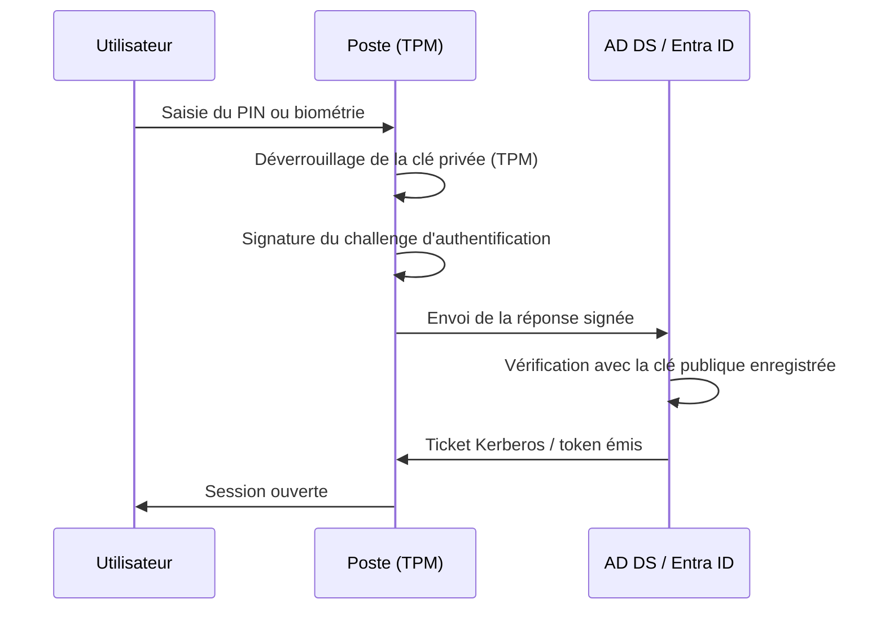

---
tags:
  - hardening
  - WHfB
  - authentification
  - passwordless
---

# Windows Hello for Business

!!! abstract "Ce que couvre ce chapitre"
    - Comprendre ce que WHfB remplace et pourquoi il est plus robuste qu'un mot de passe.
    - Distinguer les modèles de déploiement Cloud, Hybrid et On-premises.
    - Identifier les prérequis techniques et les clés de registre associées.
    - Déployer WHfB via GPO avec les paramètres de durcissement recommandés.

Windows Hello for Business remplace le mot de passe
par une authentification asymétrique liée au poste.
L'utilisateur prouve son identité avec un facteur local
(PIN ou biométrie) qui déverrouille une clé privée
stockée dans le TPM.

Le mot de passe n'est plus transmis sur le réseau.
L'attaquant qui intercepte le trafic d'authentification
ne capture ni hash réutilisable, ni secret rejouable.

## 1. Qu'est-ce que WHfB

### 1.1 Clé asymétrique + facteur local

WHfB repose sur une paire de clés RSA ou ECC.
La clé privée est générée et stockée dans le TPM du poste.
Elle ne quitte jamais le matériel.

Pour utiliser cette clé privée, l'utilisateur doit
d'abord s'authentifier localement via un PIN ou un capteur biométrique.
Ce facteur local déverrouille l'accès à la clé,
qui signe ensuite la demande d'authentification.

| Composant | Rôle |
|---|---|
| Clé privée (TPM) | Signe les demandes d'authentification, ne quitte jamais le poste |
| Clé publique (AD / Entra ID) | Enregistrée côté serveur pour vérifier les signatures |
| PIN | Facteur de déverrouillage local, lié au poste (pas au compte) |
| Biométrie | Alternative au PIN, traitée localement par le capteur |

!!! info "Le PIN n'est pas un mot de passe"
    Le PIN WHfB est lié au matériel.
    Il ne fonctionne que sur le poste où il a été configuré.
    Un attaquant qui connaît le PIN mais n'a pas le poste
    ne peut rien en faire.

### 1.2 Différence avec Windows Hello grand public

Windows Hello (sans "for Business") est la version grand public.
Elle offre le même confort d'usage (PIN, empreinte, reconnaissance faciale)
mais sans l'infrastructure de clés asymétriques ni l'intégration AD.

| Critère | Windows Hello | Windows Hello for Business |
|---|---|---|
| Gestion d'identité | Compte Microsoft personnel | Active Directory / Entra ID |
| Clé asymétrique | Non | Oui |
| Gestion centralisée (GPO / Intune) | Non | Oui |
| Attestation TPM | Optionnelle | Recommandée et configurable |
| Adapté à l'entreprise | Non | Oui |

!!! quote "En résumé"
    WHfB remplace le mot de passe par une authentification asymétrique
    liée au matériel. Le secret ne circule jamais sur le réseau
    et le facteur local (PIN ou biométrie) n'est exploitable que sur le poste.

## 2. Modèles de déploiement

WHfB propose trois modèles selon l'infrastructure d'identité en place.

### 2.1 Cloud (Entra ID)

Le modèle le plus simple.
Les identités sont gérées uniquement dans Entra ID (anciennement Azure AD).
L'enregistrement de la clé publique se fait directement dans le cloud.

Ce modèle convient aux organisations full-cloud
sans contrôleur de domaine on-premises.

### 2.2 Hybrid (AD DS + Entra ID)

Le modèle le plus courant en entreprise.
Les identités existent dans Active Directory
et sont synchronisées vers Entra ID via Entra Connect.

Deux variantes existent :

- **Key trust** : la clé publique WHfB est synchronisée vers AD DS.
  Les DC Windows Server 2016+ valident l'authentification Kerberos.
- **Certificate trust** : une PKI interne émet un certificat
  à l'utilisateur lors du provisionnement WHfB.
  Ce certificat est utilisé pour l'authentification on-premises.

!!! tip "Key trust vs Certificate trust"
    Key trust est plus simple à déployer
    car il ne nécessite pas de PKI interne.
    Certificate trust reste nécessaire dans les environnements
    où des DC antérieurs à Windows Server 2016 sont encore présents.

### 2.3 On-premises (AD DS seul)

Ce modèle fonctionne sans composant cloud.
Il nécessite obligatoirement une PKI interne (certificate trust)
ou des DC Windows Server 2016+ (key trust).

Il est adapté aux environnements isolés
ou aux organisations qui ne synchronisent pas vers Entra ID.

| Modèle | Infrastructure requise | Trust model |
|---|---|---|
| Cloud | Entra ID | Key trust (implicite) |
| Hybrid | AD DS + Entra ID + Entra Connect | Key trust ou Certificate trust |
| On-premises | AD DS + PKI ou DC 2016+ | Key trust ou Certificate trust |

!!! quote "En résumé"
    Le choix du modèle dépend de l'infrastructure d'identité existante.
    Hybrid key trust est le scénario le plus courant.
    On-premises certificate trust couvre les environnements sans cloud.

## 3. Prérequis techniques

### 3.1 TPM

WHfB fonctionne sans TPM, mais perd alors sa principale garantie.
Sans TPM, la clé privée est stockée de manière logicielle
et devient extractible par un attaquant ayant un accès administrateur.

| Version TPM | Support WHfB | Recommandation |
|---|---|---|
| TPM 2.0 | Pleinement supporté | Recommandé pour tout déploiement |
| TPM 1.2 | Supporté dans certains scénarios | Acceptable en transition |
| Pas de TPM | Fonctionnel mais clé logicielle | Non recommandé en production |

### 3.2 Version Windows

WHfB nécessite au minimum Windows 10 version 1703 (Creators Update).
Windows 11 apporte des améliorations sur la gestion biométrique
et le provisionnement sans mot de passe.

### 3.3 Licences et infrastructure

| Prérequis | Cloud | Hybrid | On-premises |
|---|---|---|---|
| Entra ID Premium P1 | Non requis | Requis (pour l'enregistrement d'appareil) | Non applicable |
| PKI interne | Non requis | Requis uniquement en certificate trust | Requis en certificate trust |
| DC Windows Server 2016+ | Non applicable | Requis en key trust | Requis en key trust |
| Entra Connect | Non applicable | Requis | Non applicable |

!!! warning "Attention aux DC anciens"
    En mode hybrid key trust, tous les DC qui traitent
    des authentifications WHfB doivent être Windows Server 2016 ou supérieur.
    Un DC 2012 R2 dans le site AD du poste peut provoquer
    des échecs d'authentification silencieux.

!!! quote "En résumé"
    TPM 2.0, Windows 10 1703+ et une infrastructure d'identité adaptée
    sont les fondations d'un déploiement WHfB fiable.
    Sans TPM, la promesse de sécurité matérielle disparaît.

## 4. Clés de registre WHfB

Les GPO WHfB écrivent sous `HKLM\SOFTWARE\Policies\Microsoft\PassportForWork`.

| Valeur | Type | Données | Effet |
|---|---|---|---|
| `Enabled` | `REG_DWORD` | `1` | Active WHfB sur le poste |
| `RequireSecurityDevice` | `REG_DWORD` | `1` | Exige un TPM pour le stockage de la clé |
| `UseCertificateForOnPremAuth` | `REG_DWORD` | `1` | Utilise un certificat pour l'authentification on-premises (certificate trust) |
| `ExcludeSecurityDevices\TPM12` | `REG_DWORD` | `1` | Exclut les TPM 1.2 (force TPM 2.0) |

### 4.1 Complexité du PIN

Les paramètres de complexité du PIN se trouvent sous
`PassportForWork\PINComplexity`.

| Valeur | Type | Données recommandées | Effet |
|---|---|---|---|
| `MinimumPINLength` | `REG_DWORD` | `6` | Longueur minimale du PIN |
| `MaximumPINLength` | `REG_DWORD` | `127` | Longueur maximale (valeur par défaut) |
| `Digits` | `REG_DWORD` | `1` | `0` = interdit, `1` = autorisé, `2` = exigé (au moins un chiffre) |
| `UppercaseLetters` | `REG_DWORD` | `1` | Même logique : `0`, `1` ou `2` |
| `LowercaseLetters` | `REG_DWORD` | `1` | Même logique |
| `SpecialCharacters` | `REG_DWORD` | `0` | Même logique |

!!! info "PIN numérique vs alphanumérique"
    Par défaut, WHfB autorise un PIN purement numérique.
    Exiger des lettres ou caractères spéciaux renforce la complexité
    mais peut dégrader l'expérience utilisateur.
    Un PIN de 6 chiffres lié au TPM offre déjà
    une résistance élevée grâce à la protection anti-brute-force du matériel.

!!! quote "En résumé"
    Les clés sous `PassportForWork` contrôlent l'activation de WHfB,
    l'exigence TPM et la politique de complexité du PIN.
    `Enabled = 1` et `RequireSecurityDevice = 1` sont les deux valeurs prioritaires.

## 5. Déploiement via GPO

### 5.1 Chemin GPO

Les paramètres WHfB se trouvent dans :

```
Computer Configuration
  > Administrative Templates
    > Windows Components
      > Windows Hello for Business
```

### 5.2 Paramètres recommandés

| Paramètre GPO | Valeur | Effet |
|---|---|---|
| Use Windows Hello for Business | **Enabled** | Active le provisionnement WHfB |
| Use a hardware security device | **Enabled** | Exige un TPM |
| Use certificate for on-premises authentication | Enabled (si certificate trust) | Émet un certificat pour l'auth on-prem |
| PIN Complexity - Minimum PIN length | `6` | Définit la longueur minimale |

!!! tip "Déploiement progressif"
    Ciblez d'abord un groupe pilote via le filtrage de sécurité de la GPO.
    Le provisionnement WHfB se déclenche à la prochaine connexion de l'utilisateur.
    Un déploiement massif sans pilote risque de générer
    un pic d'appels au support.

### 5.3 Processus de provisionnement

Lorsqu'un utilisateur se connecte sur un poste ciblé par la GPO :

1. Windows détecte que WHfB est requis et non encore provisionné.
2. L'utilisateur est invité à configurer un PIN (et éventuellement la biométrie).
3. Le TPM génère la paire de clés asymétriques.
4. La clé publique est enregistrée dans Entra ID et/ou AD DS.
5. Les connexions suivantes utilisent WHfB au lieu du mot de passe.

!!! quote "En résumé"
    Deux paramètres GPO suffisent pour un déploiement de base :
    activer WHfB et exiger un TPM.
    Le provisionnement est transparent pour l'utilisateur
    et se déclenche à la connexion suivante.

## 6. Flux d'authentification WHfB



Le mot de passe n'intervient à aucune étape.
Le TPM protège la clé privée contre l'extraction.
Le PIN ou la biométrie ne servent qu'à autoriser
l'utilisation locale de cette clé.

## 7. Tableau récapitulatif

| Paramètre | Clé de registre | GPO | Recommandation |
|---|---|---|---|
| Activer WHfB | `PassportForWork\Enabled = 1` | Use Windows Hello for Business = Enabled | Obligatoire |
| Exiger un TPM | `PassportForWork\RequireSecurityDevice = 1` | Use a hardware security device = Enabled | Obligatoire |
| Certificate trust | `PassportForWork\UseCertificateForOnPremAuth = 1` | Use certificate for on-premises auth = Enabled | Si DC < 2016 ou PKI existante |
| PIN minimum 6 | `PINComplexity\MinimumPINLength = 6` | PIN Complexity > Minimum PIN length = 6 | Recommandé |
| Exclure TPM 1.2 | `ExcludeSecurityDevices\TPM12 = 1` | Non disponible en GPO native | Optionnel, selon parc matériel |

!!! quote "En résumé"
    WHfB élimine le mot de passe du flux d'authentification réseau.
    Le secret reste confiné dans le TPM du poste.
    Deux GPO et un TPM 2.0 suffisent pour un déploiement de base.
    Le modèle hybrid key trust couvre la majorité des environnements d'entreprise.
