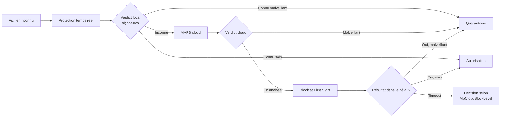

---
tags:
  - hardening
  - Defender
  - antivirus
  - MAPS
---

# Microsoft Defender Antivirus via GPO

!!! abstract "Ce que couvre ce chapitre"
    - Comprendre pourquoi Defender doit être configuré activement, pas seulement laissé en défaut.
    - Identifier les paramètres GPO qui renforcent la détection et réduisent la surface d'attaque.
    - Activer MAPS et la protection cloud.
    - Identifier les clés de registre correspondantes.

Defender est présent sur chaque poste Windows.
Il fonctionne par défaut, mais son état par défaut
n'est pas un état durci.

Sans configuration active, plusieurs fonctions avancées
restent désactivées ou sous-optimales.
Les exclusions héritées, les sources de signatures mal ordonnées
et l'absence de protection cloud réduisent la capacité de détection
sans que le poste ne signale un problème.

## 1. Defender n'est pas "bon par défaut"

### 1.1 L'état par défaut

Defender fonctionne dès l'installation de Windows.
Mais plusieurs de ses mécanismes avancés
ne sont pas activés ou pas configurés de manière optimale.

Les situations suivantes sont courantes en entreprise :

- La protection cloud (MAPS) est désactivée
  par une GPO héritée ou un paramètre local.
- Les exclusions contiennent des chemins trop larges
  hérités d'un ancien logiciel désinstallé.
- Les mises à jour de signatures passent uniquement par WSUS,
  sans fallback vers le cloud Microsoft.
- Le niveau de blocage cloud reste sur `Default`
  au lieu d'un niveau plus agressif.

### 1.2 Ce que la GPO ajoute

La GPO centralise et verrouille la configuration Defender.
Les modifications locales par un utilisateur ou un script
ne peuvent pas contourner les paramètres imposés par la stratégie.

Trois apports concrets :

- **Forcer les paramètres** indépendamment des modifications locales.
- **Activer des fonctions désactivées par défaut** :
  protection cloud intensive, blocage au premier contact.
- **Assurer la cohérence du parc** :
  chaque poste reçoit les mêmes règles de détection.

!!! warning "Exclusions trop larges"
    Une exclusion trop large dans Defender revient à ouvrir une fenêtre
    dans un mur pare-feu. L'attaquant qui connaît les exclusions du parc
    peut y déposer ses outils sans déclencher la moindre alerte.

!!! quote "En résumé"
    Defender fonctionne par défaut mais pas de manière optimale.
    La GPO force les paramètres avancés, active la protection cloud
    et empêche les modifications locales de dégrader la posture de sécurité.

## 2. Protection cloud et MAPS

### 2.1 Qu'est-ce que MAPS

MAPS (Microsoft Active Protection Service) est le service
de renseignement sur les menaces en temps réel de Microsoft.

Quand Defender rencontre un fichier inconnu,
il envoie des métadonnées au cloud Microsoft
pour obtenir un verdict avant de laisser le fichier s'exécuter.

Deux niveaux de participation existent :

| Niveau | Données envoyées | Valeur de registre |
|---|---|---|
| **Basic** | Métadonnées légères (hash, taille, source) | `1` |
| **Advanced** | Métadonnées + échantillon du fichier si suspect | `2` |

Le niveau Advanced offre une meilleure couverture
car il permet à Microsoft d'analyser les fichiers réellement suspects,
pas seulement leurs métadonnées.

### 2.2 Clés de registre MAPS

Les clés MAPS se trouvent sous `HKLM\SOFTWARE\Policies\Microsoft\Windows Defender\Spynet`.

| Valeur | Type | Données | Effet |
|---|---|---|---|
| `SpynetReporting` | `REG_DWORD` | `2` | Active MAPS au niveau Advanced |
| `SubmitSamplesConsent` | `REG_DWORD` | `1` | Envoie automatiquement les échantillons jugés sûrs |
| `DisableBlockAtFirstSeen` | `REG_DWORD` | `0` | Ne pas désactiver Block at First Sight |

!!! info "SubmitSamplesConsent"
    La valeur `0` = toujours demander à l'utilisateur.
    La valeur `1` = envoyer automatiquement les fichiers sûrs.
    La valeur `2` = ne jamais envoyer.
    La valeur `3` = envoyer tous les échantillons automatiquement.
    En entreprise, `1` est le compromis entre couverture et confidentialité.

### 2.3 Block at First Sight

Block at First Sight est un mécanisme complémentaire à MAPS.
Quand Defender rencontre un fichier inconnu,
il bloque son exécution en attendant le verdict cloud.

Le fichier reste en quarantaine temporaire
pendant que le cloud analyse ses caractéristiques.
Si le verdict est malveillant, le fichier est bloqué définitivement.
Si le verdict est propre, l'exécution reprend.

Ce mécanisme nécessite deux conditions :

- MAPS au niveau Advanced (`SpynetReporting = 2`).
- Protection en temps réel active.

!!! quote "En résumé"
    MAPS envoie les fichiers inconnus au cloud Microsoft pour verdict.
    Block at First Sight bloque l'exécution en attendant la réponse.
    Ces deux mécanismes transforment Defender d'un antivirus local
    en un système de détection connecté au renseignement temps réel.

## 3. Protection en temps réel et comportementale

### 3.1 Paramètres de protection temps réel

Les paramètres de protection en temps réel se trouvent sous
`HKLM\SOFTWARE\Policies\Microsoft\Windows Defender\Real-Time Protection`.

| Valeur | Type | Données | Effet |
|---|---|---|---|
| `DisableRealtimeMonitoring` | `REG_DWORD` | `0` | Ne pas désactiver la protection temps réel |
| `DisableBehaviorMonitoring` | `REG_DWORD` | `0` | Ne pas désactiver l'analyse comportementale |
| `DisableOnAccessProtection` | `REG_DWORD` | `0` | Ne pas désactiver la protection à l'accès fichier |
| `DisableIOAVProtection` | `REG_DWORD` | `0` | Ne pas désactiver le scan des fichiers téléchargés |

!!! danger "Convention de nommage inversée"
    Les clés utilisent une logique `Disable...= 0` pour activer la fonctionnalité.
    La valeur `0` signifie "ne pas désactiver", donc actif.
    La valeur `1` signifie "désactiver", donc inactif.
    Une erreur d'interprétation sur cette convention
    peut désactiver la protection temps réel du parc entier.

### 3.2 Niveau de protection comportementale

Les paramètres de niveau de blocage se trouvent sous
`HKLM\SOFTWARE\Policies\Microsoft\Windows Defender\MpEngine`.

| Valeur | Type | Données | Effet |
|---|---|---|---|
| `MpCloudBlockLevel` | `REG_DWORD` | `2` | Niveau de blocage cloud élevé |
| `MpBafsExtendedTimeout` | `REG_DWORD` | `50` | Secondes d'attente max pour le verdict cloud |

Les niveaux de `MpCloudBlockLevel` sont les suivants :

| Niveau | Valeur | Comportement |
|---|---|---|
| Default | `0` | Détection standard |
| Moderate | `1` | Détection plus agressive sur les fichiers inconnus |
| High | `2` | Blocage agressif des fichiers inconnus, possible faux positifs |
| High+ | `4` | Tolérance zéro, bloque tout fichier suspect |
| Zero tolerance | `6` | Bloque tout exécutable inconnu du cloud |

!!! tip "Postes haute sécurité"
    `MpCloudBlockLevel = 4` ou `6` est adapté aux postes d'administration
    ou aux machines sensibles. Sur un poste utilisateur standard,
    le niveau `2` offre un bon compromis entre détection et faux positifs.

!!! quote "En résumé"
    La protection temps réel, comportementale et à l'accès
    doivent toutes rester actives. Le niveau de blocage cloud
    détermine l'agressivité de la détection sur les fichiers inconnus.

## 4. Mises à jour des signatures

### 4.1 Sources de mises à jour

Defender supporte plusieurs sources de signatures,
consultées dans un ordre de priorité configurable :

| Source | Identifiant | Disponibilité |
|---|---|---|
| WSUS / SCCM | `ManagedServiceAccount` | Réseau interne uniquement |
| MMPC (cloud Microsoft) | `MMPC` | Accès Internet direct |
| Partage UNC | `FileShares` | Réseau interne |
| Windows Update | `InternalDefinitionUpdateServer` | Accès Internet ou WSUS |

La clé `SignatureUpdateFallbackOrder` définit l'ordre de consultation.
Si la première source est indisponible,
Defender passe automatiquement à la suivante.

!!! warning "WSUS comme source unique"
    Si WSUS est configuré comme seule source sans fallback,
    un WSUS indisponible ou en retard laisse Defender
    avec des signatures obsolètes sur tout le parc.
    Configurez toujours un fallback vers MMPC ou Windows Update.

### 4.2 Clés de registre

Les clés de mise à jour se trouvent sous
`HKLM\SOFTWARE\Policies\Microsoft\Windows Defender\Signature Updates`.

| Valeur | Type | Données | Effet |
|---|---|---|---|
| `SignatureUpdateInterval` | `REG_DWORD` | `4` | Vérification toutes les 4 heures |
| `FallbackOrder` | `REG_SZ` | `MicrosoftUpdateServer\|MMPC` | Ordre de priorité des sources |
| `DefinitionUpdateFileSharesSources` | `REG_SZ` | `\\server\share` | Partage UNC comme source alternative |

### 4.3 GPO de mise à jour

Le chemin GPO pour les signatures est :

```
Computer Configuration
  > Administrative Templates
    > Windows Components
      > Microsoft Defender Antivirus
        > Security Intelligence Updates
```

Les paramètres clés dans ce noeud :

- **Define the order of sources for downloading security intelligence updates** :
  définit le fallback.
- **Specify the interval to check for security intelligence updates** :
  fréquence de vérification.
- **Allow security intelligence updates from Microsoft Update** :
  autorise le fallback vers Windows Update.

!!! quote "En résumé"
    Les signatures doivent être mises à jour fréquemment
    avec un ordre de sources incluant un fallback cloud.
    Une source unique sans fallback est un point de défaillance.

## 5. Exclusions : risques et bonnes pratiques

### 5.1 Pourquoi les exclusions sont dangereuses

Une exclusion retire un chemin, une extension ou un processus
de la surveillance en temps réel et du scan planifié.

Les attaquants connaissent les exclusions courantes.
Les dossiers d'installation de bases de données,
de serveurs web ou de certains logiciels métier
sont souvent exclus pour des raisons de performance.

Un malware déposé dans un dossier exclu
ne déclenche aucune alerte.

### 5.2 Types d'exclusions

| Type | Exemple | Risque |
|---|---|---|
| Par chemin | `C:\SQL\Data\` | Tout fichier dans ce dossier est ignoré |
| Par extension | `*.log`, `*.tmp` | Tout fichier avec cette extension est ignoré, quel que soit l'emplacement |
| Par processus | `sqlservr.exe` | Les fichiers accédés par ce processus ne sont pas scannés |

!!! danger "Exclusions à ne jamais créer"
    Ne jamais exclure `C:\Windows\Temp`, `C:\Users`,
    ou des dossiers d'administration réseau sans raison documentée.
    Ces chemins sont des cibles privilégiées pour le dépôt de malware.

### 5.3 Audit des exclusions existantes

La commande suivante liste les exclusions actives sur un poste :

```powershell
Get-MpPreference |
    Select-Object ExclusionPath, ExclusionExtension, ExclusionProcess
```

!!! tip "Revue régulière"
    Intégrez l'audit des exclusions Defender dans votre revue de conformité.
    Une exclusion créée pour un logiciel désinstallé depuis 2 ans
    reste active et continue de créer un angle mort.

!!! quote "En résumé"
    Chaque exclusion crée un angle mort volontaire.
    Les exclusions doivent être documentées, justifiées
    et auditées régulièrement. Une exclusion obsolète est un risque gratuit.

## 6. Chemin GPO et paramètres recommandés

### 6.1 Chemin GPO principal

```
Computer Configuration
  > Administrative Templates
    > Windows Components
      > Microsoft Defender Antivirus
```

Les sous-noeuds importants :

- `Real-time Protection`
- `MAPS`
- `Scan`
- `Security Intelligence Updates`
- `Quarantine`
- `Exclusions`

### 6.2 Paramètres recommandés

| Paramètre GPO | Valeur | Effet | Clé de registre |
|---|---|---|---|
| Turn on behavior monitoring | Enabled | Active l'analyse comportementale | `Real-Time Protection\DisableBehaviorMonitoring = 0` |
| Turn on real-time protection | Enabled | Active la protection temps réel | `Real-Time Protection\DisableRealtimeMonitoring = 0` |
| Join Microsoft MAPS | Advanced MAPS | Active MAPS niveau avancé | `Spynet\SpynetReporting = 2` |
| Configure Block at First Sight | Enabled | Bloque en attente du verdict cloud | `Spynet\DisableBlockAtFirstSeen = 0` |
| Cloud-delivered protection level | High | Niveau de blocage cloud élevé | `MpEngine\MpCloudBlockLevel = 2` |
| Configure extended cloud check | 50 seconds | Temps d'attente max pour verdict | `MpEngine\MpBafsExtendedTimeout = 50` |
| Signature update interval | 4 hours | Fréquence de mise à jour | `Signature Updates\SignatureUpdateInterval = 4` |

### 6.3 Ne jamais désactiver Defender via GPO

La clé `DisableAntiSpyware` sous
`HKLM\SOFTWARE\Policies\Microsoft\Windows Defender`
désactive complètement Defender lorsqu'elle est positionnée à `1`.

!!! danger "DisableAntiSpyware = 1"
    Cette clé supprime toute protection antivirus sur le poste.
    Elle est parfois activée par erreur dans une GPO héritée
    ou par un script de déploiement ancien.
    Elle doit être explicitement absente ou positionnée à `0`.

Sur les versions récentes de Windows 10 et Windows 11,
Microsoft ignore cette clé si elle provient d'une source
autre que Microsoft Defender for Endpoint (Tamper Protection).
Mais cette protection n'est active que si Tamper Protection est activé.

!!! quote "En résumé"
    Les GPO Defender couvrent la protection temps réel, MAPS, les signatures
    et les exclusions. Désactiver Defender via GPO est une erreur
    qui supprime toute couverture antivirus sur les postes ciblés.

## 7. Tableau récapitulatif

| Protection | Clé de registre | GPO | Valeur recommandée |
|---|---|---|---|
| MAPS Advanced | `Spynet\SpynetReporting` | Join Microsoft MAPS | `2` |
| Block at First Sight | `Spynet\DisableBlockAtFirstSeen` | Configure Block at First Sight | `0` |
| Protection temps réel | `Real-Time Protection\DisableRealtimeMonitoring` | Turn on real-time protection | `0` |
| Analyse comportementale | `Real-Time Protection\DisableBehaviorMonitoring` | Turn on behavior monitoring | `0` |
| Niveau blocage cloud | `MpEngine\MpCloudBlockLevel` | Cloud-delivered protection level | `2` |
| Intervalle signatures | `Signature Updates\SignatureUpdateInterval` | Signature update interval | `4` |
| Envoi échantillons | `Spynet\SubmitSamplesConsent` | Configure automatic sample submission | `1` |



!!! quote "En résumé"
    Microsoft Defender Antivirus doit être configuré activement via GPO
    pour atteindre son potentiel de détection. MAPS Advanced, Block at First Sight,
    la protection comportementale et un fallback de signatures robuste
    transforment un antivirus passif en une couche de détection connectée et durcie.
