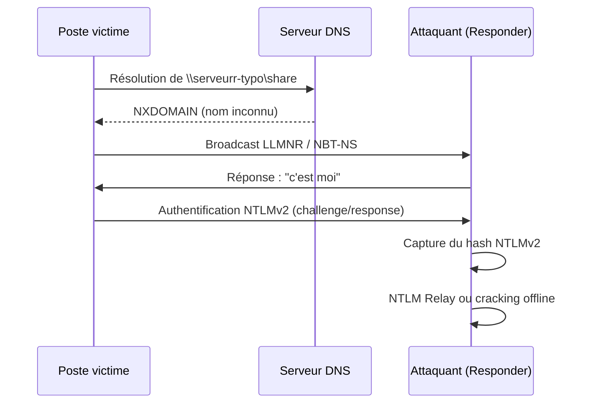
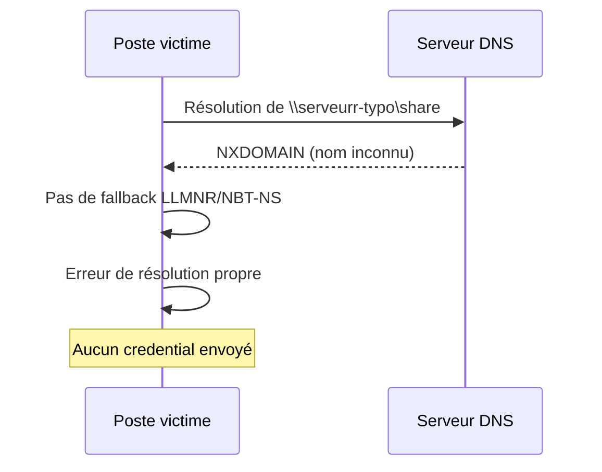

---
tags:
  - hardening
  - réseau
  - LLMNR
  - NBT-NS
  - DNS
  - DoH
---

# Durcissement réseau : LLMNR, NBT-NS et DoH

!!! abstract "Ce que couvre ce chapitre"
    - Comprendre pourquoi LLMNR et NBT-NS sont exploitables par un attaquant sur le LAN.
    - Désactiver ces protocoles via GPO.
    - Comprendre ce que DNS over HTTPS (DoH) apporte et ses limites en environnement d'entreprise.
    - Identifier les clés de registre associées.

La résolution de noms est un mécanisme invisible pour l'utilisateur.
Quand un poste cherche à joindre un serveur par son nom,
plusieurs protocoles sont sollicités en cascade.

Certains de ces protocoles diffusent la requête
à tout le segment réseau sans aucune authentification.
Un attaquant positionné sur le LAN peut y répondre
et capturer des credentials sans que la victime ne s'en aperçoive.

## 1. Pourquoi la résolution de noms est un vecteur d'attaque

### 1.1 Le problème des protocoles de résolution locale

Windows utilise plusieurs mécanismes pour résoudre un nom d'hôte.
L'ordre de résolution par défaut est le suivant :

1. Cache DNS local.
2. Serveur DNS configuré sur l'interface.
3. LLMNR (Link-Local Multicast Name Resolution).
4. NBT-NS (NetBIOS Name Service).

Si le serveur DNS ne répond pas ou ne connaît pas le nom,
Windows passe automatiquement aux protocoles suivants.
LLMNR et NBT-NS diffusent alors la requête
sur le segment réseau local, en multicast ou broadcast.

Le problème est structurel :
ces protocoles répondent à tout hôte sur le segment.
Il n'y a pas d'authentification du répondant.

| Protocole | Port | Type | Risque |
|---|---|---|---|
| LLMNR | `5355/UDP` | Multicast IPv4/IPv6 | Réponse usurpée par n'importe quel hôte du segment |
| NBT-NS | `137/UDP` | Broadcast NetBIOS | Même risque, protocole plus ancien |
| mDNS | `5353/UDP` | Multicast | Similaire, introduit par des logiciels tiers |
| DNS | `53/UDP` | Unicast vers serveur configuré | Fiable si le serveur est joignable |

### 1.2 Exploitation par un attaquant

L'attaque la plus courante repose sur un outil comme Responder.
L'attaquant le déploie sur le LAN sans privilèges particuliers.

Le scénario type se déroule en quatre étapes :

1. Un poste tente de résoudre un nom mal orthographié
   ou un partage réseau inexistant.
2. Le serveur DNS ne connaît pas ce nom et ne répond pas.
3. Le poste diffuse la requête en LLMNR ou NBT-NS.
4. Responder répond immédiatement : "c'est moi".

Le poste victime initie alors une authentification NTLM
vers la machine de l'attaquant.
Les credentials NTLMv2 (challenge/response) sont capturés.

L'attaquant peut ensuite :

- **Relayer** les credentials vers un autre service
  (NTLM Relay vers SMB, HTTP, LDAP).
- **Casser** le hash NTLMv2 hors ligne
  avec un outil comme hashcat.

!!! warning "Aucune interaction utilisateur nécessaire"
    LLMNR et NBT-NS permettent le vol de credentials NTLMv2
    sans aucune interaction de l'utilisateur
    et sans élévation de privilèges côté attaquant.
    Il suffit d'être sur le même segment réseau.

!!! quote "En résumé"
    LLMNR et NBT-NS diffusent les requêtes de résolution sur le LAN
    sans authentification du répondant. Un attaquant peut y répondre
    pour capturer des credentials NTLMv2 et les relayer ou les casser.

## 2. Désactiver LLMNR via GPO

### 2.1 Chemin GPO

La désactivation de LLMNR se fait via le paramètre suivant :

```
Computer Configuration
  > Administrative Templates
    > Network
      > DNS Client
```

Paramètre : **Turn off multicast name resolution** = `Enabled`.

### 2.2 Clé de registre

La GPO écrit dans `HKLM\SOFTWARE\Policies\Microsoft\Windows NT\DNSClient`.

| Valeur | Type | Données | Effet |
|---|---|---|---|
| `EnableMulticast` | `REG_DWORD` | `0` | Désactive LLMNR |
| `EnableMulticast` | `REG_DWORD` | `1` | Active LLMNR (défaut) |

### 2.3 Vérification

Deux méthodes pour confirmer la désactivation :

**Via PowerShell** :

```powershell
Get-DnsClientGlobalSetting | Select-Object UseMulticast
```

La valeur `False` confirme que LLMNR est désactivé.

**Via le registre** :

```powershell
Get-ItemProperty "HKLM:\SOFTWARE\Policies\Microsoft\Windows NT\DNSClient" -Name EnableMulticast
```

!!! info "Impact sur la résolution locale"
    Sur les réseaux sans serveur DNS joignable,
    désactiver LLMNR peut perturber la résolution
    de certains noms locaux non déclarés en DNS.
    Assurez-vous que les noms internes sont correctement
    enregistrés dans le DNS d'entreprise avant de déployer.

!!! quote "En résumé"
    Un seul paramètre GPO suffit pour désactiver LLMNR.
    La clé `EnableMulticast = 0` supprime le vecteur d'attaque
    le plus exploité par Responder sur un réseau Windows.

## 3. Désactiver NBT-NS

### 3.1 Pourquoi NBT-NS est plus difficile à désactiver

NBT-NS n'a pas de paramètre GPO natif
dans les templates ADMX standard.

La désactivation passe par la configuration individuelle
de chaque interface réseau, soit via le registre,
soit via un script de démarrage déployé par GPO.

### 3.2 Via le registre (par interface)

Chaque interface réseau a sa propre sous-clé sous
`HKLM\SYSTEM\CurrentControlSet\Services\NetBT\Parameters\Interfaces\{GUID}`.

| Valeur `NetbiosOptions` | Signification |
|---|---|
| `0` | Utiliser le paramètre DHCP (défaut) |
| `1` | Activer NetBIOS explicitement |
| `2` | Désactiver NetBIOS explicitement |

La valeur `2` désactive NBT-NS sur l'interface concernée.
Elle doit être positionnée sur chaque interface active.

### 3.3 Via script de démarrage GPO

L'approche la plus fiable en entreprise
est de déployer un script PowerShell via la GPO :

```
Computer Configuration
  > Windows Settings
    > Scripts
      > Startup
```

Le script itère sur toutes les interfaces et positionne `NetbiosOptions = 2` :

```powershell
$interfaces = Get-ChildItem `
    "HKLM:\SYSTEM\CurrentControlSet\Services\NetBT\Parameters\Interfaces"
foreach ($iface in $interfaces) {
    Set-ItemProperty -Path $iface.PSPath -Name "NetbiosOptions" -Value 2
}
```

Ce script s'exécute à chaque démarrage du poste.
Il couvre automatiquement les nouvelles interfaces
(ajout d'un adaptateur VPN, Wi-Fi, etc.).

!!! tip "Test préalable recommandé"
    Testez la désactivation de NBT-NS sur un groupe pilote.
    Certains logiciels anciens utilisent encore NetBIOS
    pour la découverte réseau ou l'impression.

!!! quote "En résumé"
    NBT-NS se désactive par interface via le registre.
    Un script de démarrage GPO automatise cette opération
    sur toutes les interfaces à chaque boot.

## 4. DNS over HTTPS (DoH)

### 4.1 Ce que DoH apporte

DoH encapsule les requêtes DNS dans du HTTPS (port `443`).
Le trafic DNS devient chiffré et indistinguable du trafic web.

Les bénéfices sont les suivants :

- Les requêtes DNS ne sont plus lisibles par un attaquant
  qui intercepte le trafic réseau (Wi-Fi, réseau partagé).
- La manipulation DNS en transit (DNS spoofing) est bloquée.
- La confidentialité des requêtes est protégée
  contre les intermédiaires réseau.

DoH est disponible nativement
depuis Windows 11 et Windows 10 21H1.

### 4.2 Ce que DoH ne fait pas en entreprise

DoH ne remplace pas un DNS d'entreprise interne.
Mal configuré, il peut dégrader la posture de sécurité.

Si DoH est configuré vers un résolveur public (`8.8.8.8`, `1.1.1.1`) :

- Les requêtes DNS ne passent plus par le DNS interne.
- Les politiques de filtrage DNS (contrôle web, DLP) sont contournées.
- Les noms internes (`.corp`, `.local`, domaines AD)
  peuvent ne plus être résolus.
- Les journaux DNS internes perdent la visibilité
  sur les requêtes des postes.

!!! warning "DoH mal configuré détruit le filtrage DNS"
    En entreprise, un DoH pointant vers un résolveur public
    contourne les politiques de filtrage DNS internes
    et peut exposer les noms internes à des serveurs tiers.

### 4.3 Bonne approche DoH en entreprise

| Approche | Avantage | Inconvénient |
|---|---|---|
| DoH vers résolveur interne (DNS Server 2022+, Unbound) | Chiffrement + contrôle interne conservé | Nécessite une infrastructure DNS compatible |
| DoH vers résolveur public | Simple à configurer | Contourne le filtrage interne |
| DoH désactivé + DNS interne classique | Pas de changement d'infrastructure | Requêtes DNS en clair sur le LAN |
| DoH désactivé + blocage des résolveurs publics via pare-feu | Empêche le contournement | Ne protège pas le trafic DNS en transit |

La meilleure approche combine :

1. Un résolveur DNS interne compatible DoH.
2. La configuration des postes pour utiliser ce résolveur.
3. Le blocage des résolveurs DoH publics connus via le pare-feu.

### 4.4 Clés de registre DoH

Les paramètres DoH se trouvent sous
`HKLM\SYSTEM\CurrentControlSet\Services\Dnscache\Parameters`.

| Valeur | Type | Données | Effet |
|---|---|---|---|
| `EnableAutoDoh` | `REG_DWORD` | `0` | DoH désactivé |
| `EnableAutoDoh` | `REG_DWORD` | `1` | DoH si disponible (automatique) |
| `EnableAutoDoh` | `REG_DWORD` | `2` | DoH forcé (requêtes DNS uniquement en HTTPS) |

Le chemin GPO correspondant :

```
Computer Configuration
  > Administrative Templates
    > Network
      > DNS Client
```

Paramètre : **Configure DNS over HTTPS (DoH) name resolution**.

!!! quote "En résumé"
    DoH chiffre les requêtes DNS en transit mais ne remplace pas un DNS interne.
    En entreprise, il doit pointer vers un résolveur interne compatible.
    Un DoH vers un résolveur public contourne les politiques de filtrage.

## 5. mDNS et autres protocoles de découverte

### 5.1 mDNS (Multicast DNS)

mDNS est le protocole de résolution utilisé par Bonjour (Apple)
et les services Zeroconf (imprimantes, IoT).
Il fonctionne sur le port `5353/UDP` en multicast.

Le risque est similaire à LLMNR :
tout hôte sur le segment peut répondre à une requête mDNS.

Windows ne l'active pas nativement pour la résolution de noms AD.
Mais certains logiciels tiers (iTunes, services d'impression)
introduisent mDNS sur le poste.

### 5.2 WSD (Web Services for Devices)

WSD utilise le multicast sur le port `3702/UDP`
pour la découverte d'imprimantes et de périphériques réseau.

Le risque d'exploitation directe est moindre que LLMNR,
mais WSD contribue à la surface multicast du poste
et peut révéler des informations sur les services disponibles.

### 5.3 Approche recommandée

| Protocole | Port | Risque | Action recommandée |
|---|---|---|---|
| LLMNR | `5355/UDP` | Élevé (capture credentials) | Désactiver via GPO |
| NBT-NS | `137/UDP` | Élevé (capture credentials) | Désactiver via script GPO |
| mDNS | `5353/UDP` | Moyen (usurpation de service) | Désactiver si aucun périphérique Apple/Zeroconf |
| WSD | `3702/UDP` | Faible (découverte) | Limiter au profil Domain via pare-feu |
| DNS classique | `53/UDP` | Faible (si serveur interne) | Maintenir comme source primaire |

!!! quote "En résumé"
    mDNS et WSD élargissent la surface multicast du poste.
    Sur un réseau d'entreprise sans périphériques Apple ou IoT,
    leur désactivation réduit les vecteurs de découverte exploitables.

## 6. Flux d'attaque LLMNR/NBT-NS et contre-mesures

### Sans protection (LLMNR/NBT-NS actifs)



### Avec protection (LLMNR/NBT-NS désactivés)



La différence entre les deux scénarios est radicale.
Sans LLMNR ni NBT-NS, le poste reçoit une erreur DNS
et ne diffuse aucune requête exploitable sur le LAN.

!!! quote "En résumé"
    La désactivation de LLMNR et NBT-NS coupe le vecteur d'attaque
    à la racine. Le poste ne diffuse plus de requête exploitable
    et les credentials ne quittent jamais la machine.

## 7. Tableau récapitulatif

| Protocole / Paramètre | Clé de registre | GPO | Action recommandée |
|---|---|---|---|
| LLMNR | `DNSClient\EnableMulticast = 0` | Turn off multicast name resolution = Enabled | Désactiver |
| NBT-NS | `NetBT\Parameters\Interfaces\{GUID}\NetbiosOptions = 2` | Script de démarrage GPO | Désactiver |
| DoH | `Dnscache\Parameters\EnableAutoDoh` | Configure DoH name resolution | `2` vers résolveur interne, bloquer les publics |
| mDNS | Désinstallation du service Bonjour ou règle pare-feu | Règle pare-feu `5353/UDP` Block | Désactiver si non nécessaire |
| WSD | Règle pare-feu `3702/UDP` | Règle pare-feu profil Domain uniquement | Limiter au profil Domain |

!!! quote "En résumé"
    La résolution de noms est un vecteur d'attaque silencieux et efficace.
    Désactiver LLMNR et NBT-NS est un quick win à faible coût et à gain élevé.
    DoH apporte la confidentialité DNS en transit mais doit pointer
    vers un résolveur interne pour ne pas contourner les politiques de filtrage.
