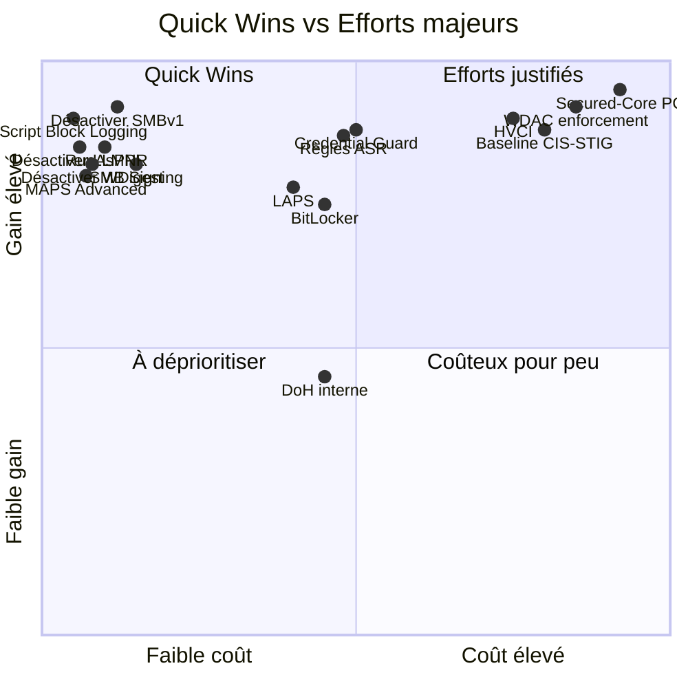
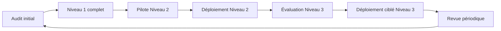

---
tags:
  - hardening
  - checklist
  - niveaux
  - conformité
---

# Checklist hardening par niveau

!!! abstract "Ce que couvre ce chapitre"
    - Synthétiser tous les contrôles du livre en une checklist actionnelle.
    - Organiser les contrôles par niveau : socle, intermédiaire, avancé.
    - Fournir une référence rapide pour un audit de premier niveau.
    - Indiquer le coût de déploiement et le gain de sécurité de chaque contrôle.

Ce chapitre ne réintroduit pas les concepts.
Chaque contrôle est détaillé dans son chapitre dédié.

L'objectif est de fournir une vue consolidée
de tous les paramètres de durcissement abordés dans ce livre,
organisés en trois niveaux actionnables.
Le niveau 1 doit être complet avant d'aborder le niveau 2.

!!! info "Lecture de la colonne Coût"
    **Très faible** = une seule GPO, aucun prérequis.
    **Faible** = GPO + vérification rapide.
    **Modéré** = prérequis matériel ou infrastructure, phase de test.
    **Élevé** = test de compatibilité approfondi, matériel spécifique ou PKI.
    **Très élevé** = renouvellement de parc ou restructuration majeure.

## 1. Niveau 1 — Socle (obligatoire, faible coût)

Les contrôles de ce niveau sont déployables rapidement.
Ils ne nécessitent pas de matériel spécifique,
pas de PKI et présentent peu de risques de perturbation.

Tout poste Windows en entreprise doit les avoir.
Un parc qui ne respecte pas le niveau 1
est exposé aux attaques les plus courantes
et les mieux documentées.

### 1.1 Protection des identifiants

| Contrôle | Ch. | GPO ou clé | Coût | Gain |
|---|---|---|---|---|
| Désactiver WDigest | 03 | `WDigest\UseLogonCredential = 0` | Très faible | Élevé |
| Activer RunAsPPL (LSA Protection) | 03 | `HKLM\SYSTEM\CurrentControlSet\Control\Lsa\RunAsPPL = 2` | Faible | Élevé |
| Désactiver LM et NTLMv1 | 03 | `HKLM\SYSTEM\CurrentControlSet\Control\Lsa\LmCompatibilityLevel = 5` | Faible | Élevé |

WDigest stockait les credentials en clair en mémoire.
Sa désactivation empêche les outils de type Mimikatz
de récupérer des mots de passe en clair depuis `lsass.exe`.

RunAsPPL protège le processus `LSASS` en tant que processus protégé.
Un attaquant avec des droits administrateur
ne peut plus injecter de code dans `lsass.exe`.

!!! note "Valeur recommandee pour un premier deploiement"
    `RunAsPPL = 1` ajoute un verrou UEFI, plus difficile a retirer en cas d'incompatibilite pilote / EDR. Pour un deploiement initial, utilisez souvent `RunAsPPL = 2` (sans verrou), validez la compatibilite du parc, puis envisagez le verrou firmware si votre exploitation le supporte.

`LmCompatibilityLevel = 5` force l'utilisation de NTLMv2
et refuse les réponses LM et NTLMv1,
qui sont cryptographiquement faibles.

### 1.2 Élévation de privilèges et surface système

| Contrôle | Ch. | GPO ou clé | Coût | Gain |
|---|---|---|---|---|
| Activer UAC niveau max | 04 | `ConsentPromptBehaviorAdmin = 2` | Faible | Moyen |
| Écran de consentement sécurisé | 04 | `PromptOnSecureDesktop = 1` | Faible | Moyen |
| Désactiver SMBv1 | 05 | `SMB1 = 0` via PowerShell ou GPO | Faible | Très élevé |
| Activer SMB Signing | 05 | `RequireSecuritySignature = 1` | Faible | Élevé |
| Exiger NLA pour RDP | 06 | `UserAuthentication = 1` | Faible | Élevé |

SMBv1 est le protocole exploité par EternalBlue (WannaCry, NotPetya).
Sa désactivation supprime une classe entière de vulnérabilités.

SMB Signing empêche les attaques NTLM Relay
en imposant la vérification d'intégrité sur chaque paquet SMB.

NLA pour RDP exige l'authentification avant l'affichage
de l'écran de connexion, ce qui bloque les attaques
par force brute sur le service RDP lui-même.

### 1.3 Pare-feu et réseau

| Contrôle | Ch. | GPO ou clé | Coût | Gain |
|---|---|---|---|---|
| Pare-feu actif sur les 3 profils | 13 | `EnableFirewall = 1` (Domain, Private, Public) | Très faible | Élevé |
| Bloquer SMB entrant (Private/Public) | 13 | Règle GPO pare-feu ports `445`, `139` | Faible | Élevé |
| Activer Defender MAPS Advanced | 16 | `SpynetReporting = 2` | Très faible | Élevé |
| Désactiver LLMNR | 17 | `EnableMulticast = 0` | Très faible | Élevé |
| Désactiver NBT-NS | 17 | `NetbiosOptions = 2` (script GPO) | Faible | Élevé |

Le pare-feu local est la seule protection réseau
du poste lorsqu'il est hors du périmètre d'entreprise.
Bloquer SMB entrant sur les profils non-Domain
empêche le mouvement latéral depuis un réseau non maîtrisé.

LLMNR et NBT-NS sont les vecteurs principaux
de capture de credentials via Responder.
Leur désactivation supprime cette menace sans impact fonctionnel
si le DNS interne est correctement configuré.

### 1.4 Visibilité et audit

| Contrôle | Ch. | GPO ou clé | Coût | Gain |
|---|---|---|---|---|
| Script Block Logging | 10 | `EnableScriptBlockLogging = 1` | Très faible | Très élevé |
| Politique d'audit recommandée | 09 | Audit GPO (Logon, Account Logon, Object Access) | Faible | Très élevé |

Sans journalisation, une compromission peut rester invisible
pendant des semaines. Script Block Logging enregistre
le contenu réel des scripts PowerShell exécutés,
y compris après déobfuscation.

!!! info "Pourquoi commencer par le niveau 1"
    Ces 15 contrôles couvrent les vecteurs d'attaque les plus courants :
    vol de credentials, mouvement latéral SMB, exécution de scripts malveillants.
    Leur déploiement ne nécessite aucune infrastructure supplémentaire.

!!! quote "En résumé"
    Le niveau 1 est le socle non négociable.
    Il couvre les attaques les plus fréquentes avec un coût de déploiement minimal.
    Aucun poste ne devrait être en production sans ces contrôles.

## 2. Niveau 2 — Intermédiaire (recommandé, coût modéré)

Les contrôles de ce niveau nécessitent davantage de préparation.
Certains exigent un prérequis matériel (TPM),
une infrastructure (PKI, LAPS CSE) ou une phase de test.

Le gain de sécurité est significatif
et justifie l'investissement pour la majorité des parcs.

### 2.1 Isolation et chiffrement

| Contrôle | Ch. | GPO ou clé | Coût | Gain |
|---|---|---|---|---|
| Activer Credential Guard | 03 | `LsaCfgFlags = 1` | Modéré (prérequis VBS) | Très élevé |
| Chiffrer avec BitLocker | 12 | BitLocker via GPO | Modéré | Élevé |
| Chiffrement RDP (TLS 1.2+) | 06 | `SecurityLayer = 2` + `MinEncryptionLevel = 3` | Faible | Élevé |

Credential Guard isole les secrets d'authentification
dans un environnement matériel inaccessible au noyau Windows.
Il nécessite VBS, donc un CPU avec virtualisation et SLAT.

BitLocker protège les données au repos.
Un poste volé ou perdu ne révèle pas son contenu
si le volume est chiffré avec un protecteur TPM.

### 2.2 Contrôle applicatif et réduction de surface

| Contrôle | Ch. | GPO ou clé | Coût | Gain |
|---|---|---|---|---|
| AppLocker en mode audit | 07 | AppLocker GPO (audit) | Modéré | Élevé |
| Activer les règles ASR | 08 | ASR via GPO ou Intune | Modéré | Très élevé |
| Restreindre RDP au profil Domain | 13 | Règle pare-feu Domain only | Faible | Élevé |

AppLocker en mode audit permet d'inventorier
les exécutables utilisés avant de passer en enforcement.
Cette phase est indispensable pour éviter
de bloquer des applicatifs métier légitimes.

Les règles ASR (Attack Surface Reduction) bloquent
des comportements offensifs spécifiques :
macros Office qui créent des processus enfants,
scripts obfusqués, injection de code dans des processus système.

### 2.3 Gestion des comptes et authentification

| Contrôle | Ch. | GPO ou clé | Coût | Gain |
|---|---|---|---|---|
| Déployer LAPS | 11 | CSE LAPS + GPO | Modéré | Élevé |
| Désactiver comptes locaux superflus | 11 | GPO Restricted Groups | Faible | Moyen |
| Provisionner WHfB | 14 | `PassportForWork\Enabled = 1` | Modéré (prérequis TPM) | Très élevé |

LAPS attribue un mot de passe administrateur local unique
à chaque poste. Il supprime le vecteur d'attaque
où un seul mot de passe local compromis
donne accès à tout le parc.

WHfB remplace le mot de passe par une clé asymétrique
liée au TPM. Le credential ne circule plus sur le réseau.

### 2.4 Journalisation avancée

| Contrôle | Ch. | GPO ou clé | Coût | Gain |
|---|---|---|---|---|
| Block at First Sight | 16 | `DisableBlockAtFirstSeen = 0` | Très faible | Élevé |
| Module Logging PowerShell | 10 | `EnableModuleLogging = 1` | Très faible | Élevé |
| Audit BitLocker (TPM events) | 12 | Voir ch09 | Faible | Moyen |

Module Logging enregistre les appels de cmdlets PowerShell.
Combiné avec Script Block Logging (niveau 1),
il donne une visibilité complète sur l'activité PowerShell.

!!! tip "Déploiement progressif"
    Pour chaque contrôle de niveau 2,
    commencez par un groupe pilote de 10-20 postes.
    Les contrôles comme Credential Guard ou AppLocker
    peuvent révéler des incompatibilités applicatives
    invisibles en environnement de test.

!!! quote "En résumé"
    Le niveau 2 renforce la posture de sécurité avec des contrôles
    qui nécessitent une phase de test et parfois un prérequis matériel.
    Le gain justifie l'effort pour tout parc de plus de 50 postes.

## 3. Niveau 3 — Avancé (haute sécurité, coût élevé)

Ces contrôles s'adressent aux environnements à haute sensibilité :
postes d'administration, machines de direction,
systèmes traitant des données classifiées ou réglementées.

Ils nécessitent du matériel spécifique (TPM 2.0, Secured-Core),
des tests approfondis de compatibilité drivers
ou une PKI interne opérationnelle.

### 3.1 Protection matérielle et noyau

| Contrôle | Ch. | GPO ou clé | Coût | Gain |
|---|---|---|---|---|
| Activer HVCI | 15 | `HypervisorEnforcedCodeIntegrity\Enabled = 1` | Élevé (tests drivers) | Très élevé |
| VBS + Credential Guard renforcé | 15 | `EnableVirtualizationBasedSecurity = 1` | Élevé | Très élevé |
| Matériel Secured-Core PC | 15 | Renouvellement parc | Très élevé | Maximum |
| System Guard / DRTM | 15 | Configuration firmware | Élevé | Très élevé |

HVCI bloque le chargement de code non signé dans le noyau.
Tout driver ancien ou non conforme peut provoquer un BSOD.
La phase de test est obligatoire et doit couvrir
chaque modèle de matériel du parc.

Secured-Core PC est le niveau maximal.
Il combine UEFI, TPM 2.0, DRTM, VBS, HVCI
et Credential Guard dans une configuration certifiée par le constructeur.

### 3.2 Contrôle applicatif strict et réseau

| Contrôle | Ch. | GPO ou clé | Coût | Gain |
|---|---|---|---|---|
| WDAC / App Control (enforcement) | 07 | Politique WDAC signée | Élevé | Très élevé |
| CLM via WDAC + UMCI | 10 | Politique WDAC avec UMCI | Élevé | Très élevé |
| DoH vers résolveur interne | 17 | `EnableAutoDoh = 2` | Modéré | Moyen |

WDAC en enforcement est le contrôle applicatif le plus strict.
Seuls les exécutables explicitement autorisés peuvent s'exécuter.
Un applicatif métier oublié dans la politique sera bloqué.

CLM (Constrained Language Mode) restreint PowerShell
aux seules commandes approuvées par la politique WDAC.
Les scripts offensifs qui utilisent .NET ou COM
ne peuvent plus s'exécuter.

### 3.3 Conformité et baselines

| Contrôle | Ch. | GPO ou clé | Coût | Gain |
|---|---|---|---|---|
| WHfB avec exigence TPM 2.0 | 14 | `RequireSecurityDevice = 1` | Modéré | Très élevé |
| Baseline CIS ou STIG | 02 | Import GPO baseline complète | Élevé | Très élevé |

Les baselines CIS et STIG couvrent des centaines de paramètres.
Leur import en GPO nécessite un travail d'adaptation
aux spécificités du parc (applicatifs, services, rôles).

!!! danger "Risque de perturbation"
    HVCI peut provoquer des BSOD sur des drivers non conformes.
    WDAC en enforcement bloque tout exécutable non autorisé.
    Ces contrôles ne doivent jamais être déployés sans une phase
    d'audit et de validation exhaustive sur le parc cible.

!!! quote "En résumé"
    Le niveau 3 est réservé aux environnements qui justifient
    un investissement matériel et humain important.
    Chaque contrôle apporte un gain très élevé
    mais exige une validation rigoureuse avant déploiement.

## 4. Matrice coût / gain



Le quadrant supérieur gauche (**Quick Wins**) regroupe les contrôles
à déployer en priorité absolue.
Ils offrent le meilleur rapport gain/effort.

Le quadrant supérieur droit (**Efforts justifiés**) contient
les contrôles à fort gain mais à coût élevé.
Ils sont réservés aux environnements qui en ont les moyens.

Le quadrant inférieur gauche (**À déprioritiser**) est vide
dans cette checklist — chaque contrôle du livre
a été sélectionné pour son gain de sécurité.

Le quadrant inférieur droit (**Coûteux pour peu**) est à éviter.
Un contrôle mal adapté au contexte peut y tomber
(DoH interne sur un réseau sans menace DNS en transit, par exemple).

!!! tip "Commencer par les Quick Wins"
    Les contrôles du quadrant Faible coût / Gain élevé
    sont les Quick Wins. Ils doivent être déployés en premier,
    avant même d'aborder les contrôles avancés.
    Un parc avec le niveau 1 complet est déjà nettement plus robuste
    qu'un parc avec quelques contrôles avancés éparpillés.

!!! quote "En résumé"
    La matrice visualise le rapport coût/gain de chaque contrôle.
    Les Quick Wins (coin supérieur gauche) couvrent les vecteurs les plus courants
    avec un effort de déploiement minimal.

## 5. Comment utiliser cette checklist

### 5.1 Ce n'est pas une liste mécanique

L'ordre de priorité dépend de l'environnement.
Les trois niveaux sont un cadre, pas un chemin unique.

Quelques exemples de contraintes qui modifient la séquence :

- Un environnement sans Entra ID
  ne peut pas déployer WHfB en mode Cloud.
- Un parc sans TPM 2.0
  ne peut pas activer HVCI ou BitLocker avec chiffrement matériel.
- Un parc avec des applicatifs métier non signés
  ne peut pas passer directement à WDAC enforcement.
- Un réseau sans serveur DNS compatible DoH
  ne bénéficie pas de `EnableAutoDoh = 2`.
- Un parc avec des DC Windows Server 2012 R2
  ne peut pas utiliser WHfB en mode hybrid key trust.

### 5.2 Démarche recommandée



1. **Auditer l'état actuel** :
   documenter quels contrôles sont déjà en place,
   identifier les écarts et les dépendances manquantes.
2. **Déployer le niveau 1 complet** :
   ces contrôles sont les fondations.
   Ils peuvent être déployés en une seule vague de GPO.
3. **Évaluer le niveau 2 avec un groupe pilote** :
   tester sur 10-20 postes pendant 2-4 semaines
   avant déploiement large.
4. **Planifier le niveau 3** :
   prévoir le budget matériel, les tests de compatibilité drivers,
   et le calendrier de renouvellement de parc si nécessaire.
5. **Revue périodique** :
   vérifier la conformité des postes tous les trimestres.
   Les postes réinstallés, les nouvelles images ou les GPO modifiées
   peuvent réintroduire des écarts.

### 5.3 Vérification rapide de conformité

Pour chaque niveau, une commande PowerShell simple
permet de vérifier quelques contrôles clés.

**Niveau 1 — vérification rapide** :

```powershell
# WDigest
Get-ItemProperty "HKLM:\SYSTEM\CurrentControlSet\Control\SecurityProviders\WDigest" `
    -Name UseLogonCredential -ErrorAction SilentlyContinue

# LLMNR
Get-DnsClientGlobalSetting | Select-Object UseMulticast

# Pare-feu
Get-NetFirewallProfile | Select-Object Name, Enabled

# MAPS
Get-MpPreference | Select-Object MAPSReporting
```

**Niveau 2 — vérification rapide** :

```powershell
# Credential Guard
Get-CimInstance -ClassName Win32_DeviceGuard `
    -Namespace root\Microsoft\Windows\DeviceGuard |
    Select-Object SecurityServicesRunning

# BitLocker
Get-BitLockerVolume -MountPoint C: | Select-Object VolumeStatus, ProtectionStatus

# Windows LAPS (moderne)
Get-ItemProperty "HKLM:\SOFTWARE\Microsoft\Windows\CurrentVersion\Policies\LAPS" `
    -ErrorAction SilentlyContinue

# LAPS legacy
Get-ItemProperty "HKLM:\SOFTWARE\Policies\Microsoft Services\AdmPwd" `
    -Name AdmPwdEnabled -ErrorAction SilentlyContinue
```

### 5.4 Mesurer le progrès

Un score simple permet de suivre la progression :

| Niveau | Nombre de contrôles | Pondération | Score max |
|---|---|---|---|
| Niveau 1 | 15 contrôles | 1 point chacun | 15 |
| Niveau 2 | 12 contrôles | 2 points chacun | 24 |
| Niveau 3 | 9 contrôles | 3 points chacun | 27 |
| **Total** | **36 contrôles** | | **66 points** |

Un parc avec le niveau 1 complet atteint **15/66** (23%),
ce qui couvre la majorité des vecteurs d'attaque courants.

Un parc avec les niveaux 1 et 2 complets atteint **39/66** (59%),
ce qui correspond à une posture de sécurité solide
pour la plupart des environnements d'entreprise.

!!! tip "Documenter l'état initial"
    Un audit de la situation initiale permet de mesurer le progrès
    et d'identifier les postes non conformes.
    Sans référence de départ, il est impossible de quantifier
    l'amélioration apportée par chaque vague de déploiement.

!!! warning "Le score n'est pas une fin en soi"
    Un score élevé sur des postes de test ne protège rien.
    Ce qui compte, c'est le pourcentage de postes en production
    qui respectent chaque niveau. Un parc à 100% de niveau 1
    est plus robuste qu'un parc à 50% de niveau 3.

!!! quote "En résumé"
    Le hardening Windows est une démarche progressive, pas un projet ponctuel.
    Le niveau 1 couvre les vecteurs les plus exploités avec un effort minimal.
    Le niveau 2 renforce la posture avec des prérequis modérés.
    Le niveau 3 s'adresse aux environnements à haute sensibilité.
    L'audit initial et le suivi du score permettent de piloter la progression.
