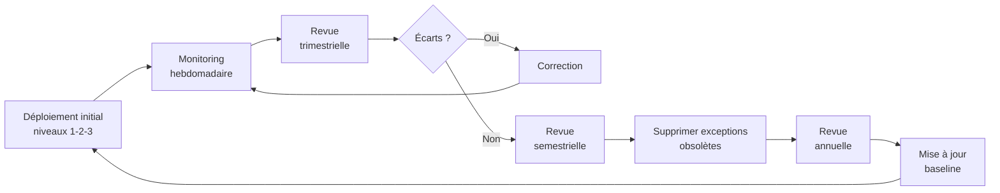

---
tags:
  - hardening
  - maintenance
  - conformité
  - gouvernance
---

# Maintien dans le temps

!!! abstract "Ce que couvre ce chapitre"
    - Comprendre pourquoi le hardening se dégrade sans processus de maintien.
    - Identifier les vecteurs de régression les plus courants.
    - Mettre en place une gouvernance légère autour des GPO de sécurité.
    - Planifier les revues périodiques et les mises à jour des contrôles.

Le hardening n'est pas un état permanent.
Une image de déploiement durcie peut dériver en quelques mois.

GPO d'exception non documentées,
nouvelles applications qui créent des exclusions Defender,
drivers installés hors processus,
réinstallations sans vérification de conformité.

Le maintien dans le temps est la partie la moins visible du hardening
et souvent la première à être sacrifiée
quand les équipes sont sous pression.

## 1. Comment le hardening se dégrade

### 1.1 Les vecteurs de régression courants

Chaque vecteur ci-dessous est silencieux.
Il ne génère ni alerte, ni ticket, ni événement.

| Vecteur de régression | Fréquence | Impact | Détection |
|---|---|---|---|
| GPO d'exception créée pour un projet, jamais supprimée | Très fréquent | Élevé (écrase un paramètre de hardening) | Revue GPO dans GPMC |
| Exclusion Defender ajoutée pour un applicatif | Fréquent | Élevé (angle mort antivirus) | `Get-MpPreference` |
| Image de déploiement non mise à jour | Fréquent | Élevé (baseline ancienne sur les nouveaux postes) | Comparaison image vs checklist |
| Driver installé hors processus → exception HVCI | Occasionnel | Très élevé (contourne l'intégrité noyau) | Événements CodeIntegrity |
| Mise à jour Windows qui réinitialise un paramètre | Rare | Variable | Script de vérification post-update |
| Poste réinstallé sans passer par le processus de durcissement | Fréquent | Très élevé (poste non durci en production) | Audit conformité ch19 |

### 1.2 La dérive silencieuse

Contrairement à une attaque, la dérive ne génère pas d'alerte.
Elle se produit par accumulation de petites décisions.

Les GPO d'exception s'accumulent sans revue.
Chacune a été créée pour une raison légitime,
mais personne ne vérifie si la raison est toujours valable.

Les exclusions Defender s'élargissent au fil des tickets de support.
Un utilisateur signale un faux positif,
l'analyste ajoute une exclusion,
et personne ne la revoit trois mois plus tard.

Les postes réinstallés ou remplacés
ne repassent pas toujours par le processus de durcissement.
L'image de référence date de l'année précédente.
Les contrôles ajoutés depuis ne sont pas inclus.

!!! danger "L'accumulation est le vrai risque"
    Aucun de ces écarts n'est critique isolément.
    C'est leur accumulation qui reconstitue progressivement
    la surface d'attaque que le hardening avait réduite.

!!! quote "En résumé"
    Le hardening se dégrade par accumulation d'exceptions non revues.
    Chaque écart est silencieux et individuellement justifiable.
    Sans processus de maintien, la posture de sécurité revient
    à son état initial en quelques trimestres.

## 2. Gouvernance des GPO de sécurité

### 2.1 Séparer les GPO de sécurité des GPO fonctionnelles

Les GPO de hardening ne doivent pas être modifiées
pour résoudre des problèmes applicatifs.

Si une dérogation est nécessaire,
créer une GPO d'exception séparée et documentée.
Cette GPO doit avoir :

- Un nom explicite : `EXCEPTION - Réactivation SMBv1 - Projet X`.
- Une date d'expiration prévue.
- Un propriétaire nommé.
- Un lien vers le ticket de support d'origine.

!!! tip "Convention de nommage"
    Préfixer les GPO d'exception par `EXCEPTION -` ou `DEROG -`
    pour qu'elles soient immédiatement identifiables dans GPMC.
    Cette convention simplifie la revue trimestrielle.

### 2.2 Contrôle des modifications GPO

Les modifications de GPO doivent être traçables.

Plusieurs mécanismes complémentaires :

- **Audit AD** : activer l'audit des modifications d'objets AD.
  L'Event ID `5136` enregistre chaque modification
  d'un objet GPO dans Active Directory.
- **Sauvegarde GPMC** : sauvegarder les GPO de sécurité
  avant et après chaque modification.
- **Versionnement** : exporter les GPO dans un dépôt Git
  ou un système de gestion de configuration.
  La comparaison entre deux versions identifie
  précisément ce qui a changé.

!!! info "AGPM (Advanced Group Policy Management)"
    AGPM ajoute un workflow de validation
    et un historique des modifications GPO.
    Il impose une approbation avant chaque modification.
    Utile pour les grandes organisations
    avec plusieurs administrateurs GPO.

### 2.3 Documentation minimale obligatoire

| Élément de documentation | Pourquoi | Format recommandé |
|---|---|---|
| Nom explicite de la GPO | Identification rapide dans GPMC | Préfixe catégorie + description |
| Description dans la GPO | Contexte et objectif | Champ "Comment" de la GPO |
| Propriétaire | Responsable des modifications | Nom + équipe dans la description |
| Date de création | Contexte temporel | Format ISO dans la description |
| Date de révision prévue | Empêche l'oubli | Champ libre + rappel calendrier |
| Ticket d'origine (exceptions) | Traçabilité de la dérogation | Référence ticket dans la description |

!!! quote "En résumé"
    Les GPO de sécurité doivent être séparées des GPO fonctionnelles.
    Chaque exception doit être documentée, datée et révisable.
    L'audit AD et le versionnement des exports GPO
    assurent la traçabilité des modifications.

## 3. Revue périodique

### 3.1 Fréquence recommandée

| Fréquence | Périmètre | Outil | Responsable |
|---|---|---|---|
| **Trimestrielle** | Contrôles critiques niveau 1 | Script PowerShell (ch19) sur un échantillon | Équipe sécurité |
| **Semestrielle** | Audit complet niveaux 1 et 2 + revue GPO d'exception | `gpresult /H` + revue GPMC | Équipe sécurité + admins GPO |
| **Annuelle** | Réévaluation complète de la baseline | PolicyAnalyzer vs baseline CIS/STIG mise à jour | RSSI ou référent sécurité |

La revue trimestrielle est la plus importante.
Elle vérifie que les quick wins du niveau 1
sont toujours en place sur un échantillon de postes.

La revue semestrielle ajoute la vérification
des GPO d'exception et des exclusions Defender.
C'est le moment de supprimer les exceptions obsolètes.

La revue annuelle réévalue la baseline elle-même.
De nouveaux contrôles sont disponibles,
de nouvelles menaces sont documentées,
et la baseline doit évoluer en conséquence.

### 3.2 Déclencheurs exceptionnels

En dehors du calendrier régulier,
certains événements imposent une revue immédiate :

- **Vulnérabilité CVE critique** sur un composant Windows
  durcissable (SMB, RDP, NTLM, Print Spooler).
- **Incident de sécurité** sur le périmètre,
  même sans impact direct sur le hardening.
- **Déploiement d'une nouvelle application**
  qui nécessite des exclusions ou des ouvertures de ports.
- **Mise à jour majeure de Windows**
  (nouvelle version, End of Life d'une version).
- **Changement d'infrastructure AD**
  (migration OU, fusion de domaines, ajout de sites).

### 3.3 Ce que la revue vérifie

La revue couvre cinq axes :

1. **Conformité des postes** :
   exécuter le script de vérification (chapitre 19)
   sur un échantillon représentatif.

2. **GPO d'exception actives** :
   chaque exception est-elle toujours nécessaire ?
   Le ticket d'origine est-il toujours ouvert ?

3. **Exclusions Defender** :
   chaque exclusion est-elle documentée et justifiée ?
   Le logiciel correspondant est-il toujours installé ?

   ```powershell
   Get-MpPreference |
       Select-Object ExclusionPath, ExclusionExtension, ExclusionProcess
   ```

4. **Comptes LAPS** :
   rotation correcte, aucun mot de passe expiré non renouvelé.

5. **BitLocker** :
   protecteurs actifs, clés de récupération
   en escrow dans AD ou Entra ID.

!!! quote "En résumé"
    La revue trimestrielle vérifie les contrôles critiques.
    La revue semestrielle audite les exceptions et exclusions.
    La revue annuelle réévalue la baseline.
    Les déclencheurs exceptionnels imposent une revue hors calendrier.

## 4. Mise à jour des contrôles

### 4.1 Suivre les évolutions Microsoft

Microsoft publie des mises à jour de baselines
(Security Compliance Toolkit) à chaque nouvelle version de Windows.

Les templates ADMX sont mis à jour avec chaque version.
Les templates GPO du Central Store doivent être rafraîchis
pour exposer les nouveaux paramètres dans GPMC.

De nouveaux contrôles de sécurité apparaissent régulièrement :
nouvelles règles ASR, nouvelles clés WHfB,
nouveaux paramètres Defender, extensions de WDAC.

### 4.2 Suivre les nouvelles menaces

Les vecteurs d'attaque évoluent.
Une technique non documentée il y a deux ans
peut être courante et automatisée aujourd'hui.

Sources de veille recommandées :

| Source | Contenu | Fréquence de mise à jour |
|---|---|---|
| MSRC (Microsoft Security Response Center) | Bulletins de sécurité, CVE | Mensuel (Patch Tuesday) + hors cycle |
| MITRE ATT&CK (plateforme Windows) | Techniques d'attaque mappées aux contrôles | Continue |
| ANSSI | Guides de durcissement, alertes | Variable |
| CIS Benchmarks | Baselines de configuration | Par version de Windows |
| CERT-FR | Alertes et avis de sécurité | Continue |

Mapper les nouveaux vecteurs aux contrôles existants.
Si un vecteur n'est couvert par aucun contrôle,
évaluer l'ajout d'un nouveau paramètre de hardening.

### 4.3 Processus d'ajout d'un nouveau contrôle

L'ajout d'un contrôle de sécurité suit une séquence précise :

1. **Évaluer** le gain vs le coût
   (matrice coût/gain du chapitre 18).
2. **Tester** sur un groupe pilote de 10-20 postes
   pendant 2-4 semaines.
3. **Documenter** dans la GPO ou la politique Intune
   (nom, description, propriétaire).
4. **Déployer** progressivement au parc complet.
5. **Mettre à jour la checklist** de conformité
   et le script de vérification.

!!! tip "Pas de raccourci"
    Ne jamais déployer un nouveau contrôle de sécurité
    directement en production sans phase de pilote,
    même si le paramètre semble anodin.
    Un paramètre qui bloque une authentification Kerberos
    ou un driver critique peut paralyser un site entier.

!!! quote "En résumé"
    Les contrôles de hardening doivent évoluer avec les menaces
    et les nouvelles fonctionnalités Windows.
    Chaque ajout suit le cycle évaluation → pilote → déploiement → vérification.
    Les sources de veille MSRC, MITRE ATT&CK et CIS
    alimentent cette évolution.

## 5. Indicateurs de santé à surveiller

### 5.1 Indicateurs opérationnels

| Indicateur | Seuil d'alerte | Source de données |
|---|---|---|
| % postes avec GPO hardening appliquée | < 95% | GPMC, Intune |
| % postes BitLocker actif avec clé en escrow | < 90% | AD, Entra ID |
| % postes WHfB provisionné | < cible définie | Entra ID |
| % postes Defender à jour (signatures < 24h) | < 95% | SCCM, Intune, `Get-MpComputerStatus` |
| Nombre de postes avec exclusion Defender active | > baseline établie | `Get-MpPreference` |
| Nombre de GPO d'exception actives | > baseline établie | GPMC |

Le seuil d'alerte dépend de l'environnement.
L'important est de définir une baseline
et de surveiller les écarts par rapport à cette baseline.

### 5.2 Indicateurs de détection

Ces indicateurs signalent soit une attaque,
soit un problème de conformité :

| Indicateur | Event ID | Signification |
|---|---|---|
| Échecs d'authentification anormaux | `4625` | Brute force ou credential stuffing |
| Violations HVCI (audit) | `3065` | Driver non conforme détecté |
| Violations HVCI (enforcement) | `3066` | Driver non conforme bloqué |
| Scripts PowerShell inhabituels | `4104` | Exécution de code potentiellement malveillant |
| Modification d'objet GPO | `5136` | Changement non planifié sur une GPO |

Un pic d'événements `4625` peut signifier
une tentative de brute force ou un poste mal configuré
qui tente de s'authentifier avec des credentials invalides.

Des événements `3065` récurrents signalent
un driver incompatible HVCI qui serait bloqué
en mode enforcement.

### 5.3 Tableau de bord minimal

Même sans SIEM, un script PowerShell hebdomadaire
peut collecter les indicateurs clés.

```powershell
# Indicateurs Defender
$defender = Get-MpComputerStatus
[PSCustomObject]@{
    SignatureAge    = $defender.AntivirusSignatureAge
    RealTimeActive  = $defender.RealTimeProtectionEnabled
    MAPSEnabled     = $defender.IsTamperProtected
}

# Indicateurs BitLocker
Get-BitLockerVolume -MountPoint C: |
    Select-Object VolumeStatus, ProtectionStatus, KeyProtector

# Indicateurs pare-feu
Get-NetFirewallProfile |
    Select-Object Name, Enabled, DefaultInboundAction
```

Exporter les résultats en CSV.
Charger dans Excel ou Power BI pour un suivi visuel.

L'important n'est pas la sophistication du tableau de bord.
C'est d'avoir une baseline pour détecter les anomalies
par rapport à la semaine précédente.

!!! quote "En résumé"
    Les indicateurs opérationnels mesurent la couverture du hardening.
    Les indicateurs de détection signalent les anomalies.
    Un script hebdomadaire et un export CSV suffisent
    pour un suivi minimal sans SIEM.

## 6. Tableau récapitulatif et synthèse du livre

| Processus | Fréquence | Outil | Livrable |
|---|---|---|---|
| Vérification conformité niveau 1 | Trimestrielle | Script PowerShell (ch19) | Rapport d'écarts |
| Revue GPO d'exception | Semestrielle | GPMC | Liste des exceptions à supprimer |
| Audit exclusions Defender | Semestrielle | `Get-MpPreference` | Liste des exclusions obsolètes |
| Mise à jour baseline | Annuelle | SCT PolicyAnalyzer | Delta baseline vs état courant |
| Revue indicateurs | Hebdomadaire | Script PowerShell | CSV des indicateurs clés |
| Veille menaces | Continue | MSRC, MITRE ATT&CK, CIS | Nouveaux contrôles à évaluer |



---

Ce livre a suivi une progression logique.

La philosophie du hardening (chapitre 1) pose le cadre.
Les baselines (chapitre 2) fournissent le point de départ.
La protection des identifiants, le contrôle applicatif,
le durcissement réseau et la visibilité (chapitres 3 à 17)
couvrent les surfaces d'attaque concrètes.
La checklist (chapitre 18) consolide les contrôles.
L'audit de conformité (chapitre 19) vérifie la réalité.

Ce dernier chapitre ferme la boucle.
Le hardening est une démarche continue.
Chaque contrôle est une décision qui doit être maintenue,
vérifiée et actualisée au rythme des menaces et du parc.

!!! quote "En résumé"
    Le maintien dans le temps est ce qui transforme
    un projet de hardening ponctuel en posture de sécurité durable.
    Gouvernance des GPO, revues périodiques, mise à jour des contrôles
    et suivi des indicateurs forment le cycle de vie du durcissement.
    Sans ce cycle, le hardening se dégrade silencieusement
    et la surface d'attaque se reconstitue.
