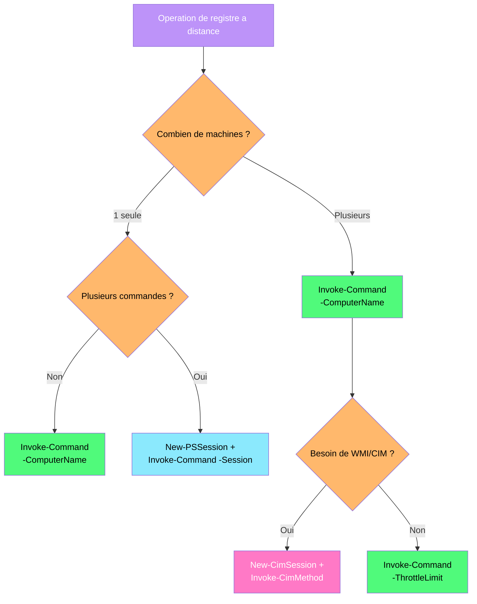

---
tags:
  - registre
  - powershell
  - remoting
  - winrm
  - administration
---

# PowerShell Remoting et le registre a distance

!!! abstract "Ce que vous allez apprendre"
    - Configurer WinRM et les prerequis pour le remoting PowerShell
    - Utiliser Invoke-Command pour lire, ecrire et supprimer des cles de registre a distance
    - Exploiter les sessions CIM pour acceder au registre via StdRegProv
    - Orchestrer des operations massives sur des centaines de machines en parallele
    - Maitriser les mecanismes de securite : Kerberos, CredSSP, JEA

---

## Configuration de WinRM et prerequis

```mermaid
sequenceDiagram
    participant Admin as Poste Admin
    participant WinRM as Service WinRM
    participant Target as Machine Cible
    Admin->>WinRM: Invoke-Command (port 5985)
    WinRM->>Target: Authentification Kerberos / NTLM
    Target-->>WinRM: Ticket de session
    WinRM->>Target: Envoi du ScriptBlock chiffre
    Target-->>WinRM: Execution locale
    WinRM-->>Admin: Resultat deserialise
    style Admin fill:#bd93f9,color:#fff
    style WinRM fill:#8be9fd,color:#000
    style Target fill:#50fa7b,color:#000
```

Vous devez deployer un correctif de registre sur 200 postes de travail, mais aucun d'entre eux n'accepte de connexion distante. Avant toute operation de registre a distance, WinRM doit etre configure sur chaque machine cible.

### Activer PSRemoting sur la machine cible

```powershell
# Enable PowerShell Remoting (must run as Administrator)
Enable-PSRemoting -Force
```

```title="Resultat attendu"
WinRM has been updated to receive requests.
WinRM service type changed successfully.
WinRM service started.
WinRM has been updated for remote management.
WinRM firewall exception configured.
```

La commande `Enable-PSRemoting` realise quatre operations en une seule passe : elle demarre le service WinRM, le configure en demarrage automatique, cree les endpoints de session PowerShell et ouvre les regles de pare-feu necessaires.

### Verifier l'etat de WinRM

```powershell
# Check WinRM service status and listener configuration
Get-Service WinRM
winrm enumerate winrm/config/listener
```

```title="Resultat attendu"
Status   Name               DisplayName
------   ----               -----------
Running  WinRM              Windows Remote Management (WS-Manag...

Listener
    Address = *
    Transport = HTTP
    Port = 5985
    Hostname
    Enabled = true
```

### Configurer les TrustedHosts (environnement workgroup)

En domaine Active Directory, Kerberos gere l'authentification mutuelle. En workgroup, vous devez explicitement autoriser les machines distantes.

```powershell
# Add specific machines to TrustedHosts
Set-Item WSMan:\localhost\Client\TrustedHosts -Value "SRV01,SRV02,192.168.1.0/24" -Force

# Verify the configuration
Get-Item WSMan:\localhost\Client\TrustedHosts
```

```title="Resultat attendu"
   WSManConfig: Microsoft.WSMan.Management\WSMan::localhost\Client

Type            Name                           SourceOfValue   Value
----            ----                           -------------   -----
System.String   TrustedHosts                                   SRV01,SRV02,192.168.1.0/24
```

!!! warning "TrustedHosts ne remplace pas le chiffrement"
    Ajouter une machine aux TrustedHosts signifie que vous acceptez de vous authentifier sans verification Kerberos mutuelle. Le trafic reste chiffre via WinRM, mais vous n'avez aucune garantie que le serveur est bien celui qu'il pretend etre.

### Regles de pare-feu associees

WinRM utilise le port TCP 5985 (HTTP) ou 5986 (HTTPS). Voici les regles de pare-feu correspondantes dans le registre :

```
HKLM\SYSTEM\CurrentControlSet\Services\SharedAccess\Parameters\FirewallPolicy\FirewallRules
```

```powershell
# Verify firewall rules for WinRM
Get-NetFirewallRule -DisplayName "*Windows Remote Management*" |
    Select-Object DisplayName, Enabled, Direction, Action
```

```title="Resultat attendu"
DisplayName                                    Enabled Direction Action
-----------                                    ------- --------- ------
Windows Remote Management (HTTP-In)               True   Inbound  Allow
Windows Remote Management (HTTP-In)               True   Inbound  Allow
```

### Activation a grande echelle via GPO

Plutot que d'activer WinRM machine par machine, utilisez une GPO :

| Parametre GPO | Chemin | Valeur |
|---------------|--------|--------|
| Autoriser la gestion a distance | `Computer Configuration\Policies\Administrative Templates\Windows Components\Windows Remote Management (WinRM)\WinRM Service` | Active, filtre IPv4 : `*` |
| Service WinRM demarrage auto | `Computer Configuration\Policies\Windows Settings\Security Settings\System Services` | WinRM : Automatique |
| Regle pare-feu | `Computer Configuration\Policies\Windows Settings\Security Settings\Windows Firewall` | Entrant TCP 5985 |

!!! info "En resume"
    - `Enable-PSRemoting -Force` configure tout en une commande (service, listeners, pare-feu)
    - En workgroup, les TrustedHosts sont necessaires ; en domaine, Kerberos suffit
    - Pour un parc entier, privilegiez l'activation via GPO plutot que machine par machine
    - WinRM utilise le port TCP 5985 (HTTP) ou 5986 (HTTPS)

---

## Invoke-Command pour les operations de registre a distance



Vous recevez un ticket : "La valeur `DisableNotifications` dans le Centre de securite est incorrecte sur le poste PC-COMPTA-03." Plutot que de vous deplacer, une seule commande PowerShell suffit.

### Lire une valeur de registre a distance

```powershell
# Read a registry value on a remote machine
Invoke-Command -ComputerName PC-COMPTA-03 -ScriptBlock {
    Get-ItemProperty -Path "HKLM:\SOFTWARE\Policies\Microsoft\Windows Defender Security Center\Notifications" `
                     -Name "DisableNotifications"
}
```

```title="Resultat attendu"
DisableNotifications : 1
PSComputerName       : PC-COMPTA-03
RunspaceId           : a1b2c3d4-e5f6-7890-abcd-ef1234567890
```

### Ecrire une valeur de registre a distance

```powershell
# Set a registry value on a remote machine
Invoke-Command -ComputerName PC-COMPTA-03 -ScriptBlock {
    Set-ItemProperty -Path "HKLM:\SOFTWARE\Policies\Microsoft\Windows Defender Security Center\Notifications" `
                     -Name "DisableNotifications" `
                     -Value 0
}
```

```title="Resultat attendu"
(aucune sortie = succes)
```

### Creer une cle et une valeur inexistantes

```powershell
# Create a new registry key and value on a remote machine
Invoke-Command -ComputerName SRV-APP01 -ScriptBlock {
    $path = "HKLM:\SOFTWARE\MonEntreprise\AppConfig"
    if (-not (Test-Path $path)) {
        New-Item -Path $path -Force | Out-Null
    }
    New-ItemProperty -Path $path -Name "MaintenanceMode" -Value 1 -PropertyType DWord -Force
}
```

```title="Resultat attendu"
MaintenanceMode : 1
PSPath          : Microsoft.PowerShell.Core\Registry::HKEY_LOCAL_MACHINE\SOFTWARE\MonEntreprise\AppConfig
PSParentPath    : Microsoft.PowerShell.Core\Registry::HKEY_LOCAL_MACHINE\SOFTWARE\MonEntreprise
PSChildName     : AppConfig
PSProvider      : Microsoft.PowerShell.Core\Registry
```

### Supprimer une valeur ou une cle

```powershell
# Remove a specific registry value on a remote machine
Invoke-Command -ComputerName SRV-APP01 -ScriptBlock {
    Remove-ItemProperty -Path "HKLM:\SOFTWARE\MonEntreprise\AppConfig" `
                        -Name "MaintenanceMode" -ErrorAction Stop
}

# Remove an entire registry key and its children
Invoke-Command -ComputerName SRV-APP01 -ScriptBlock {
    Remove-Item -Path "HKLM:\SOFTWARE\MonEntreprise\AppConfig" -Recurse -Force
}
```

```title="Resultat attendu"
(aucune sortie = succes)
```

### Utiliser des sessions persistantes pour plusieurs operations

Quand vous devez executer plusieurs commandes sur la meme machine, une session persistante evite de se re-authentifier a chaque fois. C'est comme garder une porte ouverte au lieu de sonner a chaque passage.

```powershell
# Create a persistent session
$session = New-PSSession -ComputerName SRV-APP01

# Execute multiple operations via the same session
Invoke-Command -Session $session -ScriptBlock {
    $path = "HKLM:\SOFTWARE\MonEntreprise\Deploy"
    New-Item -Path $path -Force | Out-Null
    New-ItemProperty -Path $path -Name "Version" -Value "2.5.1" -PropertyType String -Force
    New-ItemProperty -Path $path -Name "DeployDate" -Value (Get-Date -Format "yyyy-MM-dd") -PropertyType String -Force
}

# Verify
Invoke-Command -Session $session -ScriptBlock {
    Get-ItemProperty "HKLM:\SOFTWARE\MonEntreprise\Deploy"
}

# Clean up
Remove-PSSession $session
```

```title="Resultat attendu"
Version        : 2.5.1
DeployDate     : 2026-04-04
PSComputerName : SRV-APP01
```

!!! tip "Preferer les sessions persistantes pour le scripting"
    Une session persistante (`New-PSSession`) conserve les variables, les modules importes et le contexte entre les appels `Invoke-Command`. Elle est aussi plus rapide car la connexion WinRM n'est etablie qu'une seule fois.

!!! info "En resume"
    - `Invoke-Command` permet de lire, ecrire, creer et supprimer des cles de registre a distance
    - Utilisez `Test-Path` pour verifier l'existence d'une cle avant de la creer
    - Les sessions persistantes (`New-PSSession`) sont plus efficaces pour les operations multiples
    - L'absence de sortie sur une ecriture ou suppression indique un succes

---

## Sessions CIM pour l'acces au registre

Les sessions CIM offrent une alternative a Invoke-Command. Elles utilisent le fournisseur WMI `StdRegProv` (Standard Registry Provider), qui expose des methodes dediees pour manipuler le registre. C'est comme utiliser un outil specialise plutot qu'un couteau suisse.

### Creer une session CIM

```powershell
# Create a CIM session to a remote machine
$cimSession = New-CimSession -ComputerName SRV-DC01

# Verify the session
$cimSession
```

```title="Resultat attendu"
Id           : 1
Name         : CimSession1
InstanceId   : b2c3d4e5-f6a7-8901-bcde-f23456789012
ComputerName : SRV-DC01
Protocol     : WSMAN
```

### Constantes de ruches pour StdRegProv

StdRegProv utilise des constantes numeriques pour identifier les ruches :

| Constante | Valeur | Ruche |
|-----------|--------|-------|
| `HKEY_CLASSES_ROOT` | `2147483648` | HKCR |
| `HKEY_CURRENT_USER` | `2147483649` | HKCU |
| `HKEY_LOCAL_MACHINE` | `2147483650` | HKLM |
| `HKEY_USERS` | `2147483651` | HKU |
| `HKEY_CURRENT_CONFIG` | `2147483653` | HKCC |

### Lire une valeur String via CIM

```powershell
# Read a REG_SZ value using CIM StdRegProv
$HKLM = [uint32]2147483650

$result = Invoke-CimMethod -CimSession $cimSession `
    -Namespace "root\default" `
    -ClassName "StdRegProv" `
    -MethodName "GetStringValue" `
    -Arguments @{
        hDefKey     = $HKLM
        sSubKeyName = "SOFTWARE\Microsoft\Windows NT\CurrentVersion"
        sValueName  = "ProductName"
    }

$result.sValue
```

```title="Resultat attendu"
Windows Server 2022 Datacenter
```

### Lire une valeur DWORD via CIM

```powershell
# Read a REG_DWORD value using CIM StdRegProv
$result = Invoke-CimMethod -CimSession $cimSession `
    -Namespace "root\default" `
    -ClassName "StdRegProv" `
    -MethodName "GetDWORDValue" `
    -Arguments @{
        hDefKey     = $HKLM
        sSubKeyName = "SOFTWARE\Microsoft\Windows\CurrentVersion\Policies\System"
        sValueName  = "EnableLUA"
    }

$result.uValue
```

```title="Resultat attendu"
1
```

### Ecrire une valeur via CIM

```powershell
# Write a REG_DWORD value using CIM StdRegProv
Invoke-CimMethod -CimSession $cimSession `
    -Namespace "root\default" `
    -ClassName "StdRegProv" `
    -MethodName "SetDWORDValue" `
    -Arguments @{
        hDefKey     = $HKLM
        sSubKeyName = "SOFTWARE\MonEntreprise\Config"
        sValueName  = "AuditEnabled"
        uValue      = [uint32]1
    }
```

```title="Resultat attendu"
ReturnValue
-----------
          0
```

Un `ReturnValue` de `0` signifie succes. Toute autre valeur indique une erreur (acces refuse, cle inexistante, etc.).

### Enumerer les sous-cles et valeurs

```powershell
# Enumerate subkeys under a registry path
$enum = Invoke-CimMethod -CimSession $cimSession `
    -Namespace "root\default" `
    -ClassName "StdRegProv" `
    -MethodName "EnumKey" `
    -Arguments @{
        hDefKey     = $HKLM
        sSubKeyName = "SOFTWARE\Microsoft\Windows\CurrentVersion\Uninstall"
    }

$enum.sNames | Select-Object -First 10
```

```title="Resultat attendu"
AddressBook
Connection Manager
DirectDrawEx
{0A7C82A5-1754-4E06-AB5A-B6AE46346CE8}
{1D8E6291-B0D5-35EC-8441-6616F567A0F7}
{26A24AE4-039D-4CA4-87B4-2F64180101F0}
{4A03706F-666A-4037-7777-5F2748764D10}
...
```

!!! tip "CIM vs Invoke-Command : quand choisir CIM ?"
    Utilisez CIM quand vous travaillez avec des outils qui consomment deja des sessions CIM (SCCM, DSC, inventaire WMI). Utilisez `Invoke-Command` pour des scripts PowerShell generiques. CIM a l'avantage de fonctionner aussi via DCOM pour les machines anciennes qui ne supportent pas WinRM.

!!! info "En resume"
    - Les sessions CIM utilisent le fournisseur `StdRegProv` pour acceder au registre a distance
    - Chaque ruche est identifiee par une constante numerique (HKLM = `2147483650`)
    - Les methodes CIM sont typees : `GetStringValue`, `GetDWORDValue`, `SetDWORDValue`, etc.
    - Un `ReturnValue` de 0 indique un succes, toute autre valeur est une erreur

---

## Operations massives sur plusieurs machines

Votre responsable vous demande de verifier la valeur `NtpServer` sur les 200 postes du parc, puis de corriger les machines non conformes. Faire cela une par une prendrait des heures. PowerShell Remoting permet de paralleliser ces operations.

### Lire une valeur sur plusieurs machines simultanement

```powershell
# Read NTP configuration from multiple machines at once
$computers = Get-ADComputer -Filter "OperatingSystem -like '*Windows 10*'" |
    Select-Object -ExpandProperty Name

$results = Invoke-Command -ComputerName $computers -ScriptBlock {
    Get-ItemProperty -Path "HKLM:\SYSTEM\CurrentControlSet\Services\W32Time\Parameters" `
                     -Name "NtpServer" -ErrorAction SilentlyContinue |
        Select-Object -ExpandProperty NtpServer
} -ThrottleLimit 50 -ErrorAction SilentlyContinue

$results | Select-Object PSComputerName, @{N="NtpServer";E={$_}} |
    Sort-Object PSComputerName
```

```title="Resultat attendu"
PSComputerName  NtpServer
--------------  ---------
PC-COMPTA-01    ntp.entreprise.local,0x9
PC-COMPTA-02    time.windows.com,0x9
PC-COMPTA-03    ntp.entreprise.local,0x9
PC-RH-01        time.windows.com,0x9
PC-RH-02        ntp.entreprise.local,0x9
...
```

Le parametre `-ThrottleLimit 50` controle le nombre de connexions simultanees. La valeur par defaut est 32. Ajustez-la en fonction de la capacite de votre reseau et de vos serveurs.

### Corriger les machines non conformes

```powershell
# Define the expected NTP server
$expectedNtp = "ntp.entreprise.local,0x9"

# Find and fix non-compliant machines
$nonCompliant = $results | Where-Object { $_ -ne $expectedNtp }

$nonCompliantNames = $nonCompliant | Select-Object -ExpandProperty PSComputerName

if ($nonCompliantNames) {
    Invoke-Command -ComputerName $nonCompliantNames -ScriptBlock {
        param($ntpServer)
        Set-ItemProperty -Path "HKLM:\SYSTEM\CurrentControlSet\Services\W32Time\Parameters" `
                         -Name "NtpServer" -Value $ntpServer
        Restart-Service W32Time -Force
    } -ArgumentList $expectedNtp -ThrottleLimit 50

    Write-Host "$($nonCompliantNames.Count) machines corrected."
} else {
    Write-Host "All machines are compliant."
}
```

```title="Resultat attendu"
47 machines corrected.
```

### Gestion des erreurs avec collecte de resultats

En environnement reel, certaines machines seront eteintes, inaccessibles ou en erreur. Un script robuste doit capturer ces cas.

```powershell
# Robust mass registry operation with error handling
$computers = @("SRV-APP01", "SRV-APP02", "SRV-DB01", "PC-OFFLINE-01")

$job = Invoke-Command -ComputerName $computers -ScriptBlock {
    try {
        $path = "HKLM:\SOFTWARE\MonEntreprise\SecurityBaseline"
        if (-not (Test-Path $path)) {
            New-Item -Path $path -Force | Out-Null
        }
        Set-ItemProperty -Path $path -Name "BaselineVersion" -Value "2026.04" -Force
        Set-ItemProperty -Path $path -Name "AppliedDate" -Value (Get-Date -Format "yyyy-MM-dd") -Force

        [PSCustomObject]@{
            Status  = "Success"
            Machine = $env:COMPUTERNAME
        }
    } catch {
        [PSCustomObject]@{
            Status  = "Failed"
            Machine = $env:COMPUTERNAME
            Error   = $_.Exception.Message
        }
    }
} -ErrorAction SilentlyContinue -ErrorVariable remoteErrors -ThrottleLimit 50

# Display successes
$job | Where-Object Status -eq "Success" |
    Format-Table Machine, Status -AutoSize

# Display failures (machines that responded with errors)
$job | Where-Object Status -eq "Failed" |
    Format-Table Machine, Status, Error -AutoSize

# Display unreachable machines
$remoteErrors | ForEach-Object {
    [PSCustomObject]@{
        Machine = $_.TargetObject
        Error   = $_.Exception.Message
    }
} | Format-Table -AutoSize
```

```title="Resultat attendu"
Machine    Status
-------    ------
SRV-APP01  Success
SRV-APP02  Success
SRV-DB01   Success

Machine        Error
-------        -----
PC-OFFLINE-01  Connecting to remote server PC-OFFLINE-01 failed...
```

### Execution parallele avec ForEach-Object -Parallel (PowerShell 7+)

```powershell
# PowerShell 7+ parallel execution for registry operations
$computers = Get-Content "C:\Admin\workstations.txt"

$computers | ForEach-Object -Parallel {
    $result = Invoke-Command -ComputerName $_ -ScriptBlock {
        Get-ItemProperty "HKLM:\SOFTWARE\Microsoft\Windows\CurrentVersion\Policies\System" |
            Select-Object EnableLUA, ConsentPromptBehaviorAdmin
    } -ErrorAction SilentlyContinue

    if ($result) {
        [PSCustomObject]@{
            Computer = $_
            UAC      = if ($result.EnableLUA -eq 1) { "Enabled" } else { "Disabled" }
            Consent  = $result.ConsentPromptBehaviorAdmin
        }
    }
} -ThrottleLimit 100 | Export-Csv "C:\Admin\uac-audit.csv" -NoTypeInformation
```

```title="Resultat attendu"
(fichier CSV genere avec les colonnes Computer, UAC, Consent)
```

!!! info "En resume"
    - `-ThrottleLimit` controle le nombre de connexions simultanees (defaut : 32)
    - Capturez toujours les erreurs avec `-ErrorAction SilentlyContinue` et `-ErrorVariable`
    - Structurez les resultats en objets pour faciliter le tri, le filtrage et l'export
    - PowerShell 7+ offre `ForEach-Object -Parallel` pour une parallelisation native

---

## Considerations de securite

Un script qui modifie le registre de 200 machines a distance est un outil puissant, mais aussi un vecteur d'attaque potentiel. La securite du remoting PowerShell repose sur trois piliers : l'authentification, la delegation et la restriction des droits.

### Kerberos et le probleme du double-hop

Scenario classique : depuis votre poste d'administration, vous vous connectez en PowerShell a SRV-APP01, puis depuis SRV-APP01 vous tentez d'acceder a un partage sur SRV-FILE01. Le second saut echoue : c'est le probleme du **double-hop**.

Kerberos ne delegue pas automatiquement vos credentials au-dela du premier saut. C'est comme donner votre badge d'acces a un collegue qui ne peut pas l'utiliser pour ouvrir une autre porte a votre place.

```
Poste Admin ──[Kerberos]──> SRV-APP01 ──[echec]──> SRV-FILE01
     (1er hop: OK)              (2eme hop: pas de credentials)
```

### Solutions au double-hop

| Solution | Securite | Complexite | Cas d'usage |
|----------|----------|------------|-------------|
| CredSSP | Faible | Facile | Tests uniquement, jamais en production |
| Delegation contrainte Kerberos | Elevee | Moyenne | Production, serveurs specifiques |
| Resource-based constrained delegation | Elevee | Moyenne | Production, inter-forets |
| JEA (Just Enough Administration) | Tres elevee | Elevee | Production, zero-trust |
| PSSessionConfiguration avec RunAs | Moyenne | Moyenne | Scenarios specifiques |

### Delegation contrainte Kerberos

```powershell
# Configure constrained delegation on SRV-APP01 in Active Directory
# SRV-APP01 will be allowed to delegate credentials to SRV-FILE01
Set-ADComputer -Identity "SRV-APP01" -Add @{
    "msDS-AllowedToDelegateTo" = @(
        "cifs/SRV-FILE01.entreprise.local"
        "cifs/SRV-FILE01"
    )
}

# Verify the delegation
Get-ADComputer "SRV-APP01" -Properties "msDS-AllowedToDelegateTo" |
    Select-Object -ExpandProperty "msDS-AllowedToDelegateTo"
```

```title="Resultat attendu"
cifs/SRV-FILE01.entreprise.local
cifs/SRV-FILE01
```

### CredSSP (a eviter en production)

!!! danger "CredSSP expose vos credentials"
    CredSSP envoie vos identifiants en clair au serveur intermediaire. Si ce serveur est compromis, l'attaquant recupere vos credentials d'administrateur de domaine. Ne l'utilisez jamais en production.

```powershell
# Enable CredSSP (TEST ENVIRONMENT ONLY)
Enable-WSManCredSSP -Role Client -DelegateComputer "SRV-APP01.entreprise.local" -Force
Enable-WSManCredSSP -Role Server -Force  # On SRV-APP01

# Connect with CredSSP
$cred = Get-Credential
Invoke-Command -ComputerName SRV-APP01 -Credential $cred -Authentication CredSSP -ScriptBlock {
    # This second hop now works (but at what cost?)
    Get-ItemProperty "\\SRV-FILE01\HKLM\SOFTWARE\MonApp"
}
```

```title="Resultat attendu"
(acces reussi au registre distant via double-hop)
```

### Just Enough Administration (JEA)

JEA est la meilleure approche pour limiter ce qu'un administrateur peut faire sur une machine distante. Vous definissez exactement quelles commandes et quels parametres sont autorises.

```powershell
# Create a JEA role capability file
$roleCapability = @{
    Path            = "C:\Program Files\WindowsPowerShell\Modules\RegistryJEA\RoleCapabilities\RegistryOperator.psrc"
    VisibleCmdlets  = @(
        "Get-ItemProperty"
        "Set-ItemProperty"
        "Test-Path"
        @{
            Name       = "New-Item"
            Parameters = @{ Name = "Path"; ValidatePattern = "HKLM:\\SOFTWARE\\MonEntreprise\\*" }
        }
    )
    VisibleFunctions = @()
    VisibleProviders = @("Registry")
}

New-PSRoleCapabilityFile @roleCapability
```

```title="Resultat attendu"
(fichier .psrc cree dans le repertoire RoleCapabilities)
```

```powershell
# Create and register the JEA session configuration
$sessionConfig = @{
    Path                = "C:\Admin\RegistryJEA.pssc"
    SessionType         = "RestrictedRemoteServer"
    RunAsVirtualAccount = $true
    RoleDefinitions     = @{
        "ENTREPRISE\Registry-Operators" = @{ RoleCapabilities = "RegistryOperator" }
    }
}

New-PSSessionConfigurationFile @sessionConfig
Register-PSSessionConfiguration -Name "RegistryJEA" -Path "C:\Admin\RegistryJEA.pssc" -Force
```

```title="Resultat attendu"
WSManConfig: Microsoft.WSMan.Management\WSMan::localhost\Plugin

Type            Keys                                Name
----            ----                                ----
Container       {Name=RegistryJEA}                  RegistryJEA
```

L'administrateur se connecte ensuite a l'endpoint JEA et ne peut executer que les commandes autorisees :

```powershell
# Connect to the JEA endpoint
Enter-PSSession -ComputerName SRV-APP01 -ConfigurationName RegistryJEA

# This works (authorized)
Get-ItemProperty "HKLM:\SOFTWARE\MonEntreprise\Config"

# This fails (not authorized)
Remove-Item "HKLM:\SOFTWARE\Microsoft\Windows"
```

```title="Resultat attendu"
PS SRV-APP01> Get-ItemProperty "HKLM:\SOFTWARE\MonEntreprise\Config"
AppVersion : 3.2.1

PS SRV-APP01> Remove-Item "HKLM:\SOFTWARE\Microsoft\Windows"
The term 'Remove-Item' is not recognized as the name of a cmdlet...
```

!!! info "En resume"
    - Le double-hop Kerberos est le probleme de securite n°1 en remoting PowerShell
    - CredSSP est la solution facile mais dangereuse : a proscrire en production
    - La delegation contrainte Kerberos est le bon compromis securite/complexite
    - JEA offre le plus haut niveau de controle en limitant les commandes disponibles

---

## Scenario reel : deployer un correctif de registre sur 200 postes

Votre equipe securite a identifie que la valeur legacy `DisableAntiSpyware` est presente sur certains postes. Sur Windows moderne, cette valeur ne prouve pas a elle seule que Defender est desactive, mais elle reste un signal de sabotage ou de politique obsolete. Vous devez auditer les 200 postes du parc, nettoyer les machines suspectes et generer un rapport.

### Etape 1 : Preparer la liste des machines

```powershell
# Get all workstations from Active Directory
$computers = Get-ADComputer -Filter "OperatingSystem -like '*Windows 10*' -or OperatingSystem -like '*Windows 11*'" `
    -SearchBase "OU=Workstations,DC=entreprise,DC=local" |
    Select-Object -ExpandProperty Name

Write-Host "Machines found: $($computers.Count)"
```

```title="Resultat attendu"
Machines found: 203
```

### Etape 2 : Auditer l'etat actuel

```powershell
# Audit the legacy DisableAntiSpyware policy and collect the effective Defender state
$auditResults = Invoke-Command -ComputerName $computers -ScriptBlock {
    $path = "HKLM:\SOFTWARE\Policies\Microsoft\Windows Defender"
    $policy = Get-ItemProperty -Path $path -Name "DisableAntiSpyware" -ErrorAction SilentlyContinue
    $mpStatus = Get-MpComputerStatus -ErrorAction SilentlyContinue

    $reviewReason = if ($null -ne $policy -and $policy.DisableAntiSpyware -eq 1) {
        "LegacyPolicy"
    } elseif ($null -eq $mpStatus) {
        "NoMpStatus"
    } else {
        "OK"
    }

    [PSCustomObject]@{
        Computer           = $env:COMPUTERNAME
        DisableAntiSpyware = if ($null -ne $policy) { $policy.DisableAntiSpyware } else { "N/A" }
        AntivirusEnabled   = if ($null -ne $mpStatus) { $mpStatus.AntivirusEnabled } else { "Unknown" }
        RealTimeProtection = if ($null -ne $mpStatus) { $mpStatus.RealTimeProtectionEnabled } else { "Unknown" }
        IsTamperProtected  = if ($null -ne $mpStatus) { $mpStatus.IsTamperProtected } else { "Unknown" }
        ReviewReason       = $reviewReason
    }
} -ThrottleLimit 50 -ErrorAction SilentlyContinue -ErrorVariable auditErrors

# Summary
$compliant = $auditResults | Where-Object { $_.ReviewReason -eq "OK" }
$needsReview = $auditResults | Where-Object { $_.ReviewReason -ne "OK" }
$unreachable = $auditErrors.Count

Write-Host "Compliant   : $($compliant.Count)"
Write-Host "Needs review: $($needsReview.Count)"
Write-Host "Unreachable : $unreachable"
```

```title="Resultat attendu"
Compliant   : 156
Needs review: 38
Unreachable : 9
```

### Etape 3 : Appliquer le correctif

```powershell
# Remove the rogue legacy value on suspicious machines
$fixTargets = $auditResults |
    Where-Object { $_.ReviewReason -eq "LegacyPolicy" } |
    Select-Object -ExpandProperty Computer

$fixResults = Invoke-Command -ComputerName $fixTargets -ScriptBlock {
    try {
        $path = "HKLM:\SOFTWARE\Policies\Microsoft\Windows Defender"

        # Remove the legacy DisableAntiSpyware value if present
        if ($null -ne (Get-ItemProperty -Path $path -Name "DisableAntiSpyware" -ErrorAction SilentlyContinue)) {
            Remove-ItemProperty -Path $path -Name "DisableAntiSpyware" -Force -ErrorAction Stop
        }

        $mpStatus = Get-MpComputerStatus -ErrorAction SilentlyContinue

        [PSCustomObject]@{
            Computer          = $env:COMPUTERNAME
            Status            = "PolicyRemoved"
            AntivirusEnabled  = if ($null -ne $mpStatus) { $mpStatus.AntivirusEnabled } else { "Unknown" }
            IsTamperProtected = if ($null -ne $mpStatus) { $mpStatus.IsTamperProtected } else { "Unknown" }
        }
    } catch {
        [PSCustomObject]@{
            Computer          = $env:COMPUTERNAME
            Status            = "Error"
            AntivirusEnabled  = "Unknown"
            IsTamperProtected = $_.Exception.Message
        }
    }
} -ThrottleLimit 50 -ErrorAction SilentlyContinue
```

```title="Resultat attendu"
Computer      Status         AntivirusEnabled IsTamperProtected
--------      ------         ---------------- -----------------
PC-COMPTA-02  PolicyRemoved  True             True
PC-COMPTA-05  PolicyRemoved  True             True
PC-RH-01      PolicyRemoved  True             True
PC-RH-03      PolicyRemoved  True             True
...
```

### Etape 4 : Generer le rapport

```powershell
# Generate a comprehensive report
$timestamp = Get-Date -Format "yyyyMMdd-HHmmss"
$reportPath = "C:\Admin\Reports\defender-audit-$timestamp.csv"

$fullReport = @()

# Add successful audits
$fullReport += $auditResults | Select-Object Computer,
    @{N="Status";E={
        switch ($_.ReviewReason) {
            "LegacyPolicy" { "LegacyPolicy" }
            "NoMpStatus" { "NoMpStatus" }
            default { "Compliant" }
        }
    }},
    DisableAntiSpyware, AntivirusEnabled, RealTimeProtection, IsTamperProtected

# Add unreachable machines
$fullReport += $auditErrors | ForEach-Object {
    [PSCustomObject]@{
        Computer            = $_.TargetObject
        Status              = "Unreachable"
        DisableAntiSpyware  = "Unknown"
        AntivirusEnabled    = "Unknown"
        RealTimeProtection  = "Unknown"
        IsTamperProtected   = "Unknown"
    }
}

$fullReport | Export-Csv -Path $reportPath -NoTypeInformation -Encoding UTF8
Write-Host "Report saved: $reportPath"

# Display summary
$fullReport | Group-Object Status |
    Select-Object Name, Count |
    Format-Table -AutoSize
```

```title="Resultat attendu"
Report saved: C:\Admin\Reports\defender-audit-20260404-143022.csv

Name           Count
----           -----
Compliant        156
LegacyPolicy      38
Unreachable        9
```

!!! warning "Verifiez avant de supprimer a grande echelle"
    Avant d'executer le correctif sur 200 machines, testez toujours sur un echantillon de 5 a 10 postes. Validez les resultats, verifiez l'absence d'effets secondaires, puis elargissez au parc complet.

!!! tip "Automatisez avec une tache planifiee"
    Ce type d'audit peut etre programme quotidiennement via une tache planifiee PowerShell. Couple a une alerte email, vous detectez les regressions en temps reel.

!!! info "En resume"
    - Un deploiement massif suit quatre etapes : inventaire, audit, correction, rapport
    - `DisableAntiSpyware` doit etre traitee comme une politique legacy suspecte, puis recoupee avec `Get-MpComputerStatus`
    - `-ThrottleLimit` et `-ErrorVariable` sont essentiels pour les operations a grande echelle
    - Testez toujours sur un echantillon avant de deployer sur le parc complet
    - Generez systematiquement un rapport CSV pour la tracabilite
