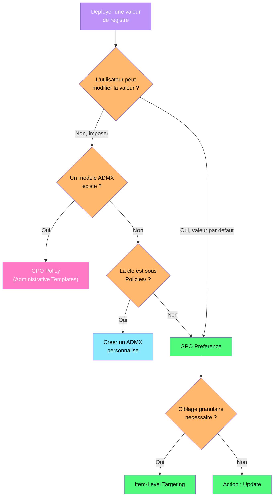

---
tags:
  - registre
  - gpo
  - active-directory
  - admx
  - group-policy
---

# GPO et registre en environnement Active Directory

!!! abstract "Ce que vous allez apprendre"
    - Comment les GPO ecrivent dans le registre et ou trouver les cles resultantes
    - Creer des modeles ADMX/ADML personnalises pour vos applications internes
    - Choisir entre GPO Policies et GPO Preferences selon le contexte
    - Utiliser le ciblage par element (Item-Level Targeting) pour des deploiements chirurgicaux
    - Diagnostiquer les problemes d'application GPO avec les outils integres

---

## Comment les GPO ecrivent dans le registre

Vous venez de creer une GPO qui desactive l'acces au Panneau de configuration. Mais ou exactement cette GPO ecrit-elle dans le registre ? Comprendre ce mecanisme est essentiel pour diagnostiquer les conflits et les applications partielles.

### Les cles Policies : la zone reservee aux GPO

Quand une GPO modifie un parametre, elle n'ecrit pas directement dans la cle "normale" du registre. Elle ecrit dans une zone dediee sous `Policies`, qui a priorite sur les valeurs standards.

```
HKLM\SOFTWARE\Policies\                    ← GPO machine (Computer Configuration)
HKCU\SOFTWARE\Policies\                    ← GPO utilisateur (User Configuration)
HKLM\SOFTWARE\Microsoft\Windows\CurrentVersion\Policies\  ← Ancienne convention
HKCU\SOFTWARE\Microsoft\Windows\CurrentVersion\Policies\  ← Ancienne convention
```

C'est comme un panneau "sens interdit" pose par la mairie (GPO) : il a priorite sur les habitudes des automobilistes (parametres locaux), meme si la route existe toujours.

```powershell
# Compare a GPO-controlled value with its "normal" equivalent
# GPO value (takes precedence)
Get-ItemProperty "HKCU:\SOFTWARE\Policies\Microsoft\Windows\Explorer" -Name "DisableNotificationCenter" -ErrorAction SilentlyContinue

# Local value (ignored when GPO is present)
Get-ItemProperty "HKCU:\SOFTWARE\Microsoft\Windows\CurrentVersion\Explorer\Advanced" -Name "DisableNotificationCenter" -ErrorAction SilentlyContinue
```

```title="Resultat attendu"
DisableNotificationCenter : 1
PSPath                    : ...SOFTWARE\Policies\Microsoft\Windows\Explorer

(la valeur locale n'est pas consultee car la GPO a priorite)
```

### Le fichier registry.pol

Chaque GPO stocke ses parametres de registre dans un fichier binaire appele `registry.pol`, situe dans le dossier SYSVOL du controleur de domaine.

```
\\entreprise.local\SYSVOL\entreprise.local\Policies\{GUID-GPO}\Machine\registry.pol
\\entreprise.local\SYSVOL\entreprise.local\Policies\{GUID-GPO}\User\registry.pol
```

```powershell
# Find registry.pol files for a specific GPO
$gpoId = (Get-GPO -Name "SEC - Disable Control Panel").Id
$sysvolPath = "\\$env:USERDNSDOMAIN\SYSVOL\$env:USERDNSDOMAIN\Policies\{$gpoId}"

Get-ChildItem -Path $sysvolPath -Recurse -Filter "registry.pol"
```

```title="Resultat attendu"
    Directory: \\entreprise.local\SYSVOL\entreprise.local\Policies\{a1b2c3d4-...}\Machine

Mode                 LastWriteTime         Length Name
----                 -------------         ------ ----
-a----         04/04/2026    09:15           4096 registry.pol
```

### Decoder un fichier registry.pol

Le fichier `registry.pol` est binaire, mais le module `GPRegistryPolicyParser` permet de le lire.

```powershell
# Install the GPRegistryPolicyParser module (if not already present)
Install-Module -Name GPRegistryPolicyParser -Scope CurrentUser -Force

# Parse a registry.pol file
$polPath = "\\entreprise.local\SYSVOL\entreprise.local\Policies\{$gpoId}\Machine\registry.pol"
Parse-PolFile -Path $polPath
```

```title="Resultat attendu"
KeyName     : SOFTWARE\Policies\Microsoft\Windows\System
ValueName   : DisableCMD
ValueType   : REG_DWORD
ValueLength : 4
ValueData   : 2

KeyName     : SOFTWARE\Policies\Microsoft\Windows\Explorer
ValueName   : NoControlPanel
ValueType   : REG_DWORD
ValueLength : 4
ValueData   : 1
```

### Ordre de traitement des GPO (LSDOU)


> La derniere GPO appliquee (OU enfant) a la **priorite la plus elevee**.

Les GPO s'appliquent dans un ordre precis. La derniere appliquee gagne en cas de conflit :

| Ordre | Source | Priorite |
|:-----:|--------|----------|
| 1 | **L**ocale (gpedit.msc) | La plus faible |
| 2 | **S**ite AD | |
| 3 | **D**omaine | |
| 4 | **O**U parente | |
| 5 | **U** (OU enfant, la plus proche de l'objet) | La plus forte |

!!! tip "Memoriser LSDOU"
    L'ordre de traitement suit l'acronyme LSDOU : Locale, Site, Domaine, OU. La derniere GPO appliquee a la priorite la plus elevee. En cas de conflit, l'OU la plus specifique gagne.

!!! info "En resume"
    - Les GPO ecrivent sous `SOFTWARE\Policies\` et non dans les cles standards
    - Le fichier `registry.pol` dans SYSVOL contient les parametres de registre bruts
    - L'ordre LSDOU determine quelle GPO gagne en cas de conflit
    - Les cles `Policies` ont toujours priorite sur les cles locales

---

## Creer des modeles ADMX/ADML personnalises

Votre application interne "InventPro" stocke sa configuration dans `HKLM\SOFTWARE\MonEntreprise\InventPro`. Vous voulez gerer ces parametres via des GPO, avec une interface graphique dans la console GPMC. La solution : creer un modele ADMX/ADML personnalise.

### Structure des fichiers ADMX/ADML

Un modele ADMX se compose de deux fichiers :

| Fichier | Role | Emplacement |
|---------|------|-------------|
| `.admx` | Definition des parametres (XML, langue neutre) | `C:\Windows\PolicyDefinitions\` |
| `.adml` | Textes affiches dans l'interface (XML, localise) | `C:\Windows\PolicyDefinitions\fr-FR\` |

Le fichier ADMX est le squelette (quelles cles, quels types de valeurs), le fichier ADML est la peau (ce que l'administrateur voit dans la console).

### Creer le fichier ADMX

```xml
<?xml version="1.0" encoding="utf-8"?>
<!-- InventPro.admx - Custom ADMX template for InventPro application -->
<policyDefinitions xmlns:xsd="http://www.w3.org/2001/XMLSchema"
                   xmlns:xsi="http://www.w3.org/2001/XMLSchema-instance"
                   revision="1.0"
                   schemaVersion="1.0"
                   xmlns="http://schemas.microsoft.com/GroupPolicy/2006/07/PolicyDefinitions">

  <policyNamespaces>
    <target prefix="inventpro" namespace="MonEntreprise.InventPro" />
    <using prefix="windows" namespace="Microsoft.Policies.Windows" />
  </policyNamespaces>

  <resources minRequiredRevision="1.0" />

  <categories>
    <category name="InventPro" displayName="$(string.Cat_InventPro)" />
    <category name="InventProNetwork" displayName="$(string.Cat_Network)"
              parentCategory="InventPro" />
  </categories>

  <policies>
    <!-- Server URL setting -->
    <policy name="ServerUrl"
            class="Machine"
            displayName="$(string.Pol_ServerUrl)"
            explainText="$(string.Pol_ServerUrl_Help)"
            key="SOFTWARE\MonEntreprise\InventPro"
            presentation="$(presentation.Pol_ServerUrl)">
      <parentCategory ref="InventProNetwork" />
      <supportedOn ref="windows:SUPPORTED_Windows_10_0" />
      <elements>
        <text id="ServerUrl_Value" valueName="ServerUrl" required="true" maxLength="512" />
      </elements>
    </policy>

    <!-- Sync interval setting -->
    <policy name="SyncInterval"
            class="Machine"
            displayName="$(string.Pol_SyncInterval)"
            explainText="$(string.Pol_SyncInterval_Help)"
            key="SOFTWARE\MonEntreprise\InventPro"
            presentation="$(presentation.Pol_SyncInterval)">
      <parentCategory ref="InventProNetwork" />
      <supportedOn ref="windows:SUPPORTED_Windows_10_0" />
      <elements>
        <decimal id="SyncInterval_Value" valueName="SyncIntervalMinutes"
                 minValue="5" maxValue="1440" required="true" />
      </elements>
    </policy>

    <!-- Enable debug mode -->
    <policy name="DebugMode"
            class="Machine"
            displayName="$(string.Pol_DebugMode)"
            explainText="$(string.Pol_DebugMode_Help)"
            key="SOFTWARE\MonEntreprise\InventPro"
            valueName="DebugMode">
      <parentCategory ref="InventPro" />
      <supportedOn ref="windows:SUPPORTED_Windows_10_0" />
      <enabledValue><decimal value="1" /></enabledValue>
      <disabledValue><decimal value="0" /></disabledValue>
    </policy>
  </policies>
</policyDefinitions>
```

### Creer le fichier ADML (traduction francaise)

```xml
<?xml version="1.0" encoding="utf-8"?>
<!-- InventPro.adml - French language file for InventPro ADMX -->
<policyDefinitionResources xmlns:xsd="http://www.w3.org/2001/XMLSchema"
                           xmlns:xsi="http://www.w3.org/2001/XMLSchema-instance"
                           revision="1.0"
                           schemaVersion="1.0"
                           xmlns="http://schemas.microsoft.com/GroupPolicy/2006/07/PolicyDefinitions">
  <displayName>InventPro</displayName>
  <description>Parametres de configuration InventPro</description>
  <resources>
    <stringTable>
      <string id="Cat_InventPro">InventPro</string>
      <string id="Cat_Network">Reseau</string>
      <string id="Pol_ServerUrl">URL du serveur InventPro</string>
      <string id="Pol_ServerUrl_Help">Definit l'URL du serveur InventPro.
Exemple : https://inventpro.entreprise.local/api

Si ce parametre est active, l'application utilisera cette URL.
Si desactive ou non configure, l'application utilisera sa valeur par defaut.</string>
      <string id="Pol_SyncInterval">Intervalle de synchronisation</string>
      <string id="Pol_SyncInterval_Help">Definit l'intervalle de synchronisation en minutes.
Valeurs acceptees : 5 a 1440 (24 heures).

Si non configure, l'intervalle par defaut est de 60 minutes.</string>
      <string id="Pol_DebugMode">Mode debug</string>
      <string id="Pol_DebugMode_Help">Active ou desactive le mode debug de l'application InventPro.

Le mode debug genere des logs detailles dans le dossier de l'application.
Ne pas activer en production sauf pour le diagnostic.</string>
    </stringTable>
    <presentationTable>
      <presentation id="Pol_ServerUrl">
        <textBox refId="ServerUrl_Value">
          <label>URL du serveur :</label>
          <defaultValue>https://inventpro.entreprise.local/api</defaultValue>
        </textBox>
      </presentation>
      <presentation id="Pol_SyncInterval">
        <decimalTextBox refId="SyncInterval_Value" defaultValue="60" spinStep="5">
          Intervalle (minutes) :
        </decimalTextBox>
      </presentation>
    </presentationTable>
  </resources>
</policyDefinitionResources>
```

### Deployer les fichiers ADMX

```powershell
# Deploy ADMX/ADML to the Central Store (recommended for domain environments)
$centralStore = "\\$env:USERDNSDOMAIN\SYSVOL\$env:USERDNSDOMAIN\Policies\PolicyDefinitions"

# Copy the ADMX file
Copy-Item -Path "C:\Admin\ADMX\InventPro.admx" -Destination $centralStore -Force

# Copy the ADML file to the French language folder
$frFolder = Join-Path $centralStore "fr-FR"
if (-not (Test-Path $frFolder)) { New-Item -Path $frFolder -ItemType Directory -Force }
Copy-Item -Path "C:\Admin\ADMX\fr-FR\InventPro.adml" -Destination $frFolder -Force

# Verify
Get-ChildItem $centralStore -Filter "InventPro*" -Recurse
```

```title="Resultat attendu"
    Directory: \\entreprise.local\SYSVOL\...\PolicyDefinitions

Mode                 LastWriteTime         Length Name
----                 -------------         ------ ----
-a----         04/04/2026    10:30           2048 InventPro.admx

    Directory: \\entreprise.local\SYSVOL\...\PolicyDefinitions\fr-FR

-a----         04/04/2026    10:30           1536 InventPro.adml
```

Apres le deploiement, les parametres InventPro apparaissent dans la console GPMC sous `Computer Configuration > Administrative Templates > InventPro`.

!!! warning "Central Store vs deploiement local"
    Sans Central Store (`PolicyDefinitions` dans SYSVOL), chaque controleur de domaine utilise ses propres modeles locaux. Creez toujours un Central Store pour garantir la coherence des modeles ADMX dans tout le domaine.

!!! info "En resume"
    - Un modele ADMX se compose de deux fichiers : `.admx` (parametres) et `.adml` (textes localises)
    - Le Central Store dans SYSVOL assure la coherence des modeles sur tous les DC
    - Chaque parametre ADMX mappe vers une cle et une valeur de registre specifiques
    - Les types supportes incluent `text`, `decimal`, `boolean`, `enum` et `list`

---

## GPO Policies vs GPO Preferences



Vous devez deployer une valeur de registre sur 500 postes. Deux mecanismes existent dans la console GPMC : les **Policies** (Administrative Templates) et les **Preferences** (Registry). Le choix n'est pas anodin.

### Comparaison detaillee

| Critere | GPO Policies | GPO Preferences |
|---------|-------------|-----------------|
| Emplacement registre | `SOFTWARE\Policies\` | Cle de votre choix |
| Comportement a la suppression de la GPO | Valeur supprimee automatiquement | Valeur persistante (sauf option) |
| Interface utilisateur | Parametre grise pour l'utilisateur | Utilisateur peut modifier la valeur |
| Necessite un ADMX | Oui | Non |
| Ciblage par element | Non | Oui (Item-Level Targeting) |
| Application | Chaque rafraichissement GPO | Selon le mode choisi (Apply once, Replace, etc.) |
| Priorite | Elevee (tattooing) | Normale |

### Quand utiliser les Policies

Utilisez les Policies quand le parametre doit etre **impose** et que l'utilisateur ne doit pas pouvoir le contourner. C'est un verrou.

```powershell
# Example: GPO Policy sets DisableTaskMgr - user cannot change it
Get-ItemProperty "HKCU:\SOFTWARE\Microsoft\Windows\CurrentVersion\Policies\System" `
    -Name "DisableTaskMgr"
```

```title="Resultat attendu"
DisableTaskMgr : 1
```

L'utilisateur voit le Gestionnaire de taches grise et ne peut pas modifier cette valeur, meme via regedit (elle sera reecrite au prochain rafraichissement GPO).

### Quand utiliser les Preferences

Utilisez les Preferences quand vous voulez **configurer une valeur par defaut** que l'utilisateur peut eventuellement modifier, ou quand vous devez ecrire dans une cle hors de `Policies\`.

```powershell
# Example: GPO Preference sets a default proxy - user can change it
Get-ItemProperty "HKCU:\SOFTWARE\Microsoft\Windows\CurrentVersion\Internet Settings" `
    -Name "ProxyServer"
```

```title="Resultat attendu"
ProxyServer : proxy.entreprise.local:8080
```

### Creer une GPO Preference de registre

Dans la console GPMC :

1. **Computer Configuration** > **Preferences** > **Windows Settings** > **Registry**
2. Clic droit > **Nouveau** > **Element de Registre**
3. Configurez les champs :

| Champ | Valeur |
|-------|--------|
| Action | Replace |
| Ruche | HKEY_LOCAL_MACHINE |
| Chemin | SOFTWARE\MonEntreprise\Config |
| Nom de la valeur | MaintenanceWindow |
| Type | REG_SZ |
| Donnees | Sunday 02:00-06:00 |

### Les quatre actions des Preferences

| Action | Comportement |
|--------|-------------|
| **Create** | Cree la valeur seulement si elle n'existe pas |
| **Replace** | Supprime et recree la valeur (ecrase toujours) |
| **Update** | Modifie la valeur si elle existe, la cree sinon |
| **Delete** | Supprime la valeur ou la cle |

!!! tip "Quelle action choisir ?"
    Dans la majorite des cas, utilisez **Update**. C'est l'action la plus flexible : elle cree la valeur si absente et la met a jour si presente, sans supprimer les autres valeurs de la meme cle.

!!! info "En resume"
    - Les Policies ecrivent sous `Policies\` et sont imposees (l'utilisateur ne peut pas les modifier)
    - Les Preferences ecrivent ou vous voulez et offrent quatre modes d'action
    - Les Policies disparaissent quand la GPO est supprimee, les Preferences persistent par defaut
    - Utilisez les Policies pour les parametres de securite, les Preferences pour la configuration applicative

---

## Ciblage par element (Item-Level Targeting)

Votre service RH utilise une application qui necessite un parametre de registre specifique, mais uniquement sur les machines Windows 11 du batiment B avec plus de 8 Go de RAM. Plutot que de creer une OU dediee, utilisez le ciblage par element des GPO Preferences.

### Criteres de ciblage disponibles

Le ciblage par element offre une granularite que les filtres WMI des Policies ne peuvent pas atteindre :

| Critere | Exemples |
|---------|----------|
| Systeme d'exploitation | Windows 11 23H2 uniquement |
| Groupe de securite | Membre de "GRP-RH-Users" |
| Plage IP | 192.168.10.0/24 |
| Nom de l'ordinateur | Commence par "PC-RH-" |
| Variable d'environnement | `%DEPARTMENT%` = "RH" |
| Registre | Si `HKLM\SOFTWARE\AppX\Version` existe |
| Espace disque | Plus de 10 Go libres |
| RAM | Plus de 8192 Mo |
| Processeur | Architecture x64 |
| Site AD | Site "Batiment-B" |
| Organisational Unit | OU specifique |
| Plage horaire | Entre 08:00 et 18:00 |

### Combiner les criteres avec des operateurs logiques

Les criteres se combinent avec des operateurs ET/OU. Dans la console GPMC, utilisez les boutons "Item" et "Collection" pour construire des conditions complexes.

Exemple de ciblage composite :

```
IF (OS = Windows 11)
AND (Security Group = GRP-RH-Users)
AND (IP Range = 192.168.10.0/24)
AND (Registry Value HKLM\SOFTWARE\AppRH exists)
THEN apply the preference
```

### Verifier un ciblage basee sur le registre

Un cas d'usage frequent : appliquer un parametre uniquement si une application est installee (detectee via le registre).

```powershell
# Simulate the registry-based targeting check
$appKey = "HKLM:\SOFTWARE\Microsoft\Windows\CurrentVersion\Uninstall\{APP-GUID}"
if (Test-Path $appKey) {
    $version = (Get-ItemProperty $appKey).DisplayVersion
    Write-Host "Application found: v$version - Preference would apply"
} else {
    Write-Host "Application not found - Preference would NOT apply"
}
```

```title="Resultat attendu"
Application found: v4.2.1 - Preference would apply
```

### Impact sur les performances

!!! warning "Le ciblage par element ajoute du temps de traitement"
    Chaque critere de ciblage est evalue a chaque rafraichissement GPO (toutes les 90 minutes par defaut). Un ciblage trop complexe (10+ criteres, requetes WMI lourdes) peut ralentir le demarrage de session. Limitez-vous a 3-4 criteres par element.

### Verifier l'application du ciblage via les logs

```powershell
# Check Group Policy Preferences operational logs
Get-WinEvent -LogName "Microsoft-Windows-GroupPolicy/Operational" -MaxEvents 20 |
    Where-Object { $_.Message -like "*preference*" -or $_.Message -like "*targeting*" } |
    Select-Object TimeCreated, Id, Message |
    Format-List
```

```title="Resultat attendu"
TimeCreated : 04/04/2026 08:15:33
Id          : 4016
Message     : Starting registry preference extension processing.

TimeCreated : 04/04/2026 08:15:33
Id          : 5310
Message     : Item-level targeting evaluated: match found. Applying preference.

TimeCreated : 04/04/2026 08:15:34
Id          : 4017
Message     : Completed registry preference extension processing in 312 milliseconds.
```

!!! info "En resume"
    - Le ciblage par element offre plus de 15 criteres combinables (OS, groupe, IP, registre, etc.)
    - Les criteres se combinent avec des operateurs logiques ET/OU pour un ciblage chirurgical
    - Le ciblage base sur le registre permet de conditionner l'application a la presence d'une application
    - Limitez la complexite du ciblage pour ne pas impacter les temps de demarrage

---

## Depannage de l'application des GPO

Il est 9h du matin, un utilisateur signale que sa GPO de configuration proxy ne s'applique pas. Vous avez 15 minutes avant la reunion de crise. Voici la methodologie de diagnostic systematique.

### Etape 1 : gpresult — le verdict final

`gpresult` montre exactement quelles GPO ont ete appliquees sur une machine et pour un utilisateur.

```powershell
# Generate a full GPO report in HTML
gpresult /H "C:\Admin\gpo-report.html" /F

# Quick text output for the current user
gpresult /R
```

```title="Resultat attendu"
Microsoft (R) Windows (R) Operating System Group Policy Result tool v2.0
(c) Microsoft Corporation. All rights reserved.

COMPUTER SETTINGS
------------------
    Applied Group Policy Objects
    ----------------------------
        SEC - Hardening Baseline
        NET - Proxy Configuration
        Default Domain Policy

    The following GPOs were not applied because they were filtered out
    ------------------------------------------------------------------
        APP - InventPro Config
            Filtering:  Denied (Security)
            Reason:     Computer is not a member of the required security group

USER SETTINGS
-------------
    Applied Group Policy Objects
    ----------------------------
        USR - Desktop Configuration
        Default Domain Policy
```

### Etape 2 : Forcer un rafraichissement GPO

```powershell
# Force a complete GPO refresh
gpupdate /force

# Force refresh and log off (for user policies that require logoff)
gpupdate /force /logoff
```

```title="Resultat attendu"
Updating policy...

Computer Policy update has completed successfully.
User Policy update has completed successfully.
```

### Etape 3 : Verifier le RSOP (Resultant Set of Policy)

```powershell
# Check the resultant set of policy for a specific registry value
Get-GPResultantSetOfPolicy -ReportType Html -Path "C:\Admin\rsop.html"

# Or via PowerShell: check which GPO set a specific registry value
$rsop = Get-GPResultantSetOfPolicy -ReportType Xml
$rsop.Rsop.ComputerResults.ExtensionData |
    Where-Object { $_.Name -like "*Registry*" }
```

```title="Resultat attendu"
(rapport HTML genere avec le detail de chaque parametre et la GPO source)
```

### Etape 4 : Examiner les journaux d'evenements GPO

```powershell
# Check Group Policy operational event log
Get-WinEvent -LogName "Microsoft-Windows-GroupPolicy/Operational" -MaxEvents 50 |
    Where-Object { $_.Level -le 3 } |  # Warnings and errors only
    Select-Object TimeCreated, LevelDisplayName, Id, Message |
    Format-Table -Wrap
```

```title="Resultat attendu"
TimeCreated          LevelDisplayName Id   Message
-----------          ---------------- --   -------
04/04/2026 08:15:22  Warning          7016 Completed Registry Extension Processing in 3125ms.
                                            The Group Policy client-side extension took too long.
04/04/2026 08:14:55  Error            7002 Cannot find the domain controller for domain
                                            "entreprise.local". (Error: 1355)
```

### Event IDs cles pour le diagnostic GPO

| Event ID | Source | Signification |
|:--------:|--------|---------------|
| 4004 | GroupPolicy | Debut du traitement GPO machine |
| 4005 | GroupPolicy | Debut du traitement GPO utilisateur |
| 4016 | GroupPolicy | Debut du traitement des Preferences registre |
| 4017 | GroupPolicy | Fin du traitement des Preferences registre |
| 5310 | GroupPolicy | Resultat du ciblage par element (match/no match) |
| 5312 | GroupPolicy | Resultat detaille de l'evaluation ILT |
| 7002 | GroupPolicy | Erreur de connectivite au DC |
| 7016 | GroupPolicy | Extension trop lente |
| 8004 | GroupPolicy | GPO filtree par securite |

### Etape 5 : Verifier directement dans le registre

```powershell
# Check the local GPO cache to see what was applied
Get-ChildItem "HKLM:\SOFTWARE\Policies\Microsoft" | Select-Object PSChildName
Get-ChildItem "HKCU:\SOFTWARE\Policies\Microsoft" | Select-Object PSChildName

# Check a specific value that should have been set by GPO
$expectedPath = "HKCU:\SOFTWARE\Policies\Microsoft\Windows\CurrentVersion\Internet Settings"
if (Test-Path $expectedPath) {
    Get-ItemProperty $expectedPath
} else {
    Write-Host "Key does not exist - GPO may not have been applied"
}
```

```title="Resultat attendu"
PSChildName
-----------
Edge
Internet Explorer
Windows
Windows Defender

ProxySettingsPerUser : 0
ProxyEnable          : 1
ProxyServer          : proxy.entreprise.local:8080
```

### Arbre de decision du diagnostic GPO

```
La GPO ne s'applique pas ?
│
├── gpresult montre "Filtered out" ?
│   ├── Filtering: Denied (Security) → Verifier les ACL de la GPO
│   ├── Filtering: Denied (WMI) → Verifier le filtre WMI
│   └── Filtering: Not Applied (Link disabled) → Verifier le lien dans GPMC
│
├── gpresult ne montre pas la GPO du tout ?
│   ├── La GPO est-elle liee a la bonne OU ? → Verifier dans GPMC
│   ├── L'objet est-il dans la bonne OU ? → `dsquery computer -name PC-NAME`
│   └── Heritage bloque ? → Verifier "Block Inheritance" sur l'OU
│
└── gpresult montre la GPO comme appliquee mais la valeur n'est pas la ?
    ├── Conflit avec une autre GPO → Verifier la priorite (LSDOU)
    ├── Preference avec ILT → Verifier les logs 5310/5312
    └── Cache GPO corrompu → `rd /s /q "%LOCALAPPDATA%\GroupPolicy"` + gpupdate
```

!!! danger "Ne jamais supprimer le cache GPO sans raison"
    La suppression du cache GPO local (`%LOCALAPPDATA%\GroupPolicy` ou `%WINDIR%\System32\GroupPolicy`) force une re-evaluation complete. C'est un dernier recours, pas une premiere etape.

!!! info "En resume"
    - `gpresult /R` est le premier reflexe pour tout probleme de GPO
    - Les journaux `Microsoft-Windows-GroupPolicy/Operational` contiennent le detail du traitement
    - Les Event IDs 5310 et 8004 revelent les raisons de filtrage et de ciblage
    - Un arbre de decision systematique evite les diagnostics hasardeux

---

## Scenario reel : deployer un parametre de registre personnalise avec fallback

Votre application metier "FactuPro" doit se connecter a un nouveau serveur API. Le parametre `ApiEndpoint` doit etre deploye dans `HKLM\SOFTWARE\MonEntreprise\FactuPro` sur toutes les machines de l'OU `OU=Finance,OU=Workstations,DC=entreprise,DC=local`. Condition : uniquement si FactuPro est installe (version 3.x ou superieure). En cas d'echec, un script de fallback doit appliquer le parametre au prochain demarrage.

### Etape 1 : Creer la GPO Preference avec ciblage

1. Ouvrir GPMC, creer la GPO **APP - FactuPro API Endpoint**
2. La lier a l'OU `OU=Finance,OU=Workstations,DC=entreprise,DC=local`
3. Naviguer vers `Computer Configuration > Preferences > Windows Settings > Registry`
4. Creer un nouvel element :

| Champ | Valeur |
|-------|--------|
| Action | Update |
| Ruche | HKEY_LOCAL_MACHINE |
| Chemin | SOFTWARE\MonEntreprise\FactuPro |
| Nom | ApiEndpoint |
| Type | REG_SZ |
| Donnees | factuapi-v2.entreprise.local |

5. Configurer l'Item-Level Targeting :
    - Critere 1 : Registry Match — `HKLM\SOFTWARE\MonEntreprise\FactuPro\Version` existe
    - Critere 2 : Registry Value Match — `Version` >= `3.0.0`

### Etape 2 : Configurer le filtrage de securite

```powershell
# Create a security group for FactuPro machines
New-ADGroup -Name "GRP-FactuPro-Machines" -GroupScope Global `
    -Path "OU=Groups,DC=entreprise,DC=local"

# Add Finance workstations to the group
$financeComputers = Get-ADComputer -SearchBase "OU=Finance,OU=Workstations,DC=entreprise,DC=local" -Filter *
$financeComputers | ForEach-Object {
    Add-ADGroupMember -Identity "GRP-FactuPro-Machines" -Members $_
}

# Set GPO security filtering
Set-GPPermission -Name "APP - FactuPro API Endpoint" `
    -TargetName "GRP-FactuPro-Machines" -TargetType Group `
    -PermissionLevel GpoApply

# Remove default "Authenticated Users" Apply permission
Set-GPPermission -Name "APP - FactuPro API Endpoint" `
    -TargetName "Authenticated Users" -TargetType Group `
    -PermissionLevel GpoRead
```

```title="Resultat attendu"
(aucune sortie = succes)
```

### Etape 3 : Preparer le script de fallback

Deployez ce script via GPO Startup Scripts comme filet de securite :

```powershell
# FactuPro-Fallback.ps1 - Startup script fallback for FactuPro API endpoint
$regPath = "HKLM:\SOFTWARE\MonEntreprise\FactuPro"
$valueName = "ApiEndpoint"
$expectedValue = "factuapi-v2.entreprise.local"

# Check if FactuPro is installed
if (-not (Test-Path $regPath)) {
    exit 0  # FactuPro not installed, nothing to do
}

# Check if value already correct
$currentValue = (Get-ItemProperty -Path $regPath -Name $valueName -ErrorAction SilentlyContinue).$valueName

if ($currentValue -eq $expectedValue) {
    exit 0  # Already configured correctly
}

# Apply the setting
try {
    Set-ItemProperty -Path $regPath -Name $valueName -Value $expectedValue -Force
    $logPath = "C:\Windows\Logs\FactuPro-Fallback.log"
    $logEntry = "$(Get-Date -Format 'yyyy-MM-dd HH:mm:ss') - ApiEndpoint updated from '$currentValue' to '$expectedValue'"
    Add-Content -Path $logPath -Value $logEntry
} catch {
    $logEntry = "$(Get-Date -Format 'yyyy-MM-dd HH:mm:ss') - ERROR: $($_.Exception.Message)"
    Add-Content -Path "C:\Windows\Logs\FactuPro-Fallback.log" -Value $logEntry
    exit 1
}
```

### Etape 4 : Verifier le deploiement

```powershell
# Verify deployment on all Finance workstations
$financeComputers = Get-ADComputer -SearchBase "OU=Finance,OU=Workstations,DC=entreprise,DC=local" `
    -Filter * | Select-Object -ExpandProperty Name

$verifyResults = Invoke-Command -ComputerName $financeComputers -ScriptBlock {
    $path = "HKLM:\SOFTWARE\MonEntreprise\FactuPro"
    $api = (Get-ItemProperty -Path $path -Name "ApiEndpoint" -ErrorAction SilentlyContinue).ApiEndpoint
    $ver = (Get-ItemProperty -Path $path -Name "Version" -ErrorAction SilentlyContinue).Version

    [PSCustomObject]@{
        Computer    = $env:COMPUTERNAME
        Installed   = (Test-Path $path)
        Version     = $ver
        ApiEndpoint = $api
        Compliant   = ($api -eq "factuapi-v2.entreprise.local")
    }
} -ThrottleLimit 50 -ErrorAction SilentlyContinue

# Summary report
$verifyResults | Group-Object Compliant | Select-Object @{N="Status";E={
    if ($_.Name -eq "True") { "Compliant" } else { "Non-Compliant" }
}}, Count | Format-Table -AutoSize
```

```title="Resultat attendu"
Status         Count
------         -----
Compliant         42
Non-Compliant      3
```

!!! tip "Combinez GPO Preference et script de fallback"
    La GPO Preference gere le cas standard. Le script de startup couvre les cas ou la GPO n'a pas pu s'appliquer (machine hors reseau lors du rafraichissement, timing, etc.). Cette approche "ceinture et bretelles" garantit une couverture maximale.

!!! info "En resume"
    - Combinez GPO Preferences (ciblage ILT) et script de fallback (startup) pour un deploiement robuste
    - Le filtrage de securite par groupe AD limite l'application aux machines pertinentes
    - Le script de fallback couvre les cas ou la GPO n'a pas pu s'appliquer a temps
    - Verifiez toujours le deploiement par un audit PowerShell Remoting apres application
